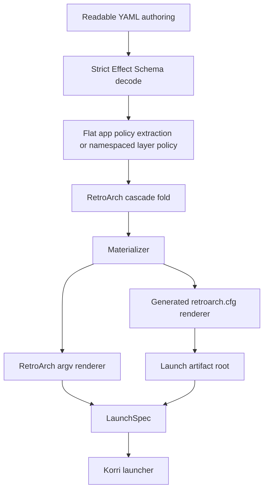

# feat: Expand RetroArch Typed Config Surface

## Summary

Expand Korri's shipped minimal `kind: retroarch` policy into a broad typed readable RetroArch configuration surface by first reconciling the one-to-one example to the current minimal contract, then adding grouped schema, cascade, renderer, materializer, and test coverage for high-value `retroarch.cfg` keys. The current minimal implementation is the source of truth wherever the older one-to-one draft drifted.

---

## Problem Frame

The minimal RetroArch policy intentionally covered only the launch path Korri needed immediately: generated config, explicit core/content identity, safe lifecycle defaults, process environment, and escape hatches. The broader one-to-one brainstorm still describes the desired destination, but it predates several decisions from the minimal implementation, including flat app fields, `configFile` naming, generated-only v1 config selection, dangerous `extraArgs` guards, and app-flat/non-app-namespaced authoring.

This plan exists to grow the typed surface without reintroducing duplicate authority, stale draft structure, or upstream RetroArch config pitfalls.

---

## Requirements

- R1. Reconcile `docs/brainstorms/2026-06-08-003-retroarch-policy-one-to-one.example.yaml` to match the current minimal implementation before using it as an expansion reference.
- R2. Preserve the current authoring contract: app records with `kind: retroarch` carry RetroArch fields flat; non-app cascade layers use a namespaced `retroarch:` override.
- R3. Preserve Korri-owned launch identity: generated config via `-c`, one explicit core via `-L`, one resolved content path, typed environment overlays, and no generic built-in RetroArch argv double-composition.
- R4. Expand typed `retroarch.cfg` coverage group-by-group with strict schema validation, deterministic generated config rendering, and cascade behavior tests.
- R5. Keep `extraSettings` and `extraArgs` as permanent break-glass escape hatches, while preserving existing guards against overriding config/core/appendconfig authority.
- R6. Avoid duplicate typed public spellings for the same upstream config key; one readable field path owns each rendered cfg key.
- R7. Keep generated-mode safety defaults intact: `config_save_on_exit`, `auto_overrides_enable`, `auto_remaps_enable`, `game_specific_options`, and `auto_shaders_enable` render `false` unless deliberately overridden by `extraSettings`.
- R8. Prevent plaintext secret authoring for RetroArch achievements and command/control credentials; do not expose or accept known plaintext cfg keys such as `cheevos_password`, `cheevos_token`, or `network_cmd_password` through typed fields or `extraSettings`.
- R9. Maintain stable patch/save/state materialization behavior when the typed `paths` group expands.
- R10. Document and test known upstream drift traps: `aspect_ratio_index` includes `full = 24`, `video_frame_delay` allows `0..99`, `rewind_buffer_size` is authored in MB, and `input_menu_toggle_gamepad_combo: start-select` maps to RetroArch value `4`.
- R11. Move known RetroArch policy validation hazards as early as practical: `extraSettings` key format, plaintext-secret key blocklists, and `configFile.append` pipe delimiter rejection should fail schema decode/config validation before launch rendering, with renderer validation retained as defense in depth.

---

## Scope Boundaries

- This plan expands the typed generated `retroarch.cfg` surface; it does not replace Korri's policy with raw public config-file passthrough.
- `configFile.mode` remains `generated` only. Author-authored `configFile.path` and default-mode config selection stay deferred.
- New typed launch argv groups are limited to what is needed to preserve existing identity and testing semantics. Broad network/control features such as netplay configuration, netplay hosting, replay recording, library scanning, and remote command control are documented in the reconciled example but deferred from the first implementation wave.
- Full per-button input binding maps are not modeled as typed schema in this plan. Operators can continue using `extraSettings` for binding keys until a concrete product use case justifies the much larger typed surface.
- This plan does not add a Korri secret-resolution subsystem. It may add non-secret achievement fields and plaintext-secret rejection, but secret injection is follow-up work.
- This plan treats readable YAML authors as trusted operators for ordinary filesystem paths such as `paths.*` and `configFile.append`. RetroArch `logging.logFile` is safer by default: relative log names resolve under Korri-owned launch artifacts/logs, while arbitrary absolute log paths require an explicit escape-hatch posture if supported.
- This plan does not add or package new libretro cores. If future units add new cores, they must follow the existing `symlinkJoin` pattern rather than nixpkgs RetroArch wrappers.
- This plan does not perform Bandai or handheld runtime validation; device validation belongs to execution and rollout after the typed surface lands.

### Deferred to Follow-Up Work

- Add a secret-resolution API for `achievements.passwordSecretRef` and materialization-time `cheevos_password` injection (`task-069`).
- Add all netplay configuration, including cfg-only keys and launch argv groups, in a separate product-scoped slice (`task-070`).
- Add remote command/control configuration such as `network_cmd_enable` and `network_cmd_port` only after a dedicated security review for locked product images (`task-071`).
- Add typed launch argv groups for replay recording/playback, recording output, library scan/import mode, patch argv, subsystem, automation, and startup flags (`task-072`).
- Add typed full per-player input bind maps if a product requirement emerges; keep them in `extraSettings` for now (`task-073`).
- Revisit `configFile.mode: path` and `configFile.mode: default` with a deliberate precedence and materialization contract (`task-074`).
- Add new libretro core packages after the config contract is stable (`task-075`).
- Productize reusable RetroArch platform defaults as readable policy fragments after the typed surface stabilizes (`task-076`).
- Review whether any safe RetroArch policy subset belongs in `EphemeralOverride`; this remains deferred because runtime overrides are unauthenticated on trusted-LAN deployments (`task-068`).

---

## Context & Research

### Relevant Code and Patterns

- `product/platform/library/config/inheritable-fields.ts` defines `RetroArchPolicy`, strict decode, optional nested policy structs, and helpers such as `NonEmptyString`, range filters, and environment overlays.
- `product/platform/library/config/records/app.ts` spreads `RetroArchPolicy.fields` flat onto app records and uses `RETROARCH_APP_FIELD_KEYS` plus `appRetroArchPolicyFromRecord` as the extraction seam.
- `product/platform/library/config/cascade-resolver.ts` deep-merges `retroarch` policy, map-merges `environment`/`extraSettings`, and concatenates `extraArgs`/`configFile.append`.
- `product/platform/stream/retroarch-launch-spec.ts` is the pure renderer for generated cfg text and RetroArch argv. It owns safe lifecycle defaults, deterministic argv ordering, config key validation, append delimiter validation, and dangerous `extraArgs` checks.
- `product/platform/library/config/app-materializer.ts` writes generated cfg files, stages patch sidecars, merges stable patch settings, and protects typed save/state paths from patch-staging defaults.
- `product/platform/library/proseql/library-repository.ts` dispatches readable RetroArch launches through materialization and uses resolvable content/core paths as launchability gates.
- `product/platform/stream/gamescope-launch-spec.ts` and `product/platform/stream/moonlight-launch-spec.ts` are sibling examples for pure typed policy renderers.
- `product/platform/library/config/inheritable-fields.test.ts`, `product/platform/stream/retroarch-launch-spec.test.ts`, `product/platform/library/config/records/readable-schema.test.ts`, `product/platform/library/config/readable-cascade-resolver.test.ts`, `product/platform/library/config/app-materializer.test.ts`, and `product/platform/library/proseql/library-repository.test.ts` are the primary test surfaces.
- `docs/brainstorms/2026-06-08-004-retroarch-policy-minimal-v1.example.yaml` and the current implementation take precedence over the older one-to-one draft.
- `docs/brainstorms/2026-06-08-003-retroarch-policy-one-to-one.example.yaml` remains the inventory reference, but its nested `apps.retroarch.retroarch.launch` / `config` shape must be reconciled before implementation.

### Institutional Learnings

- `docs/solutions/runtime-errors/retroarch-bare-passthru-wrapper-injects-l-coredir-2026-05-27.md`: never use nixpkgs `retroarch-bare.passthru.wrapper` for Korri launches because wrapper-injected `-L` and `--appendconfig` break explicit core selection.
- `docs/solutions/runtime-errors/retroarch-png-extension-routes-to-image-display-core-2026-05-27.md`: ambiguous RetroArch argv can let extension routing override intended core selection; keep a single unambiguous `-L` and avoid content-extension traps.
- `docs/solutions/design-patterns/explicit-cascade-folded-policy-over-incidental-signal-heuristics-2026-05-27.md`: policy-owned fields should drive renderer behavior instead of env/argv sniffing or wrapper heuristics.
- `docs/solutions/architecture-patterns/architectural-posture-as-nix-image-default-2026-05-27.md`: platform defaults can use the typed policy after the seam exists, but should not be hidden in renderer magic.

### External References

- RetroArch upstream cfg skeleton: `https://raw.githubusercontent.com/libretro/RetroArch/master/retroarch.cfg`
- RetroArch defaults and limits: `https://raw.githubusercontent.com/libretro/RetroArch/master/config.def.h`
- RetroArch aspect ratio enum: `https://raw.githubusercontent.com/libretro/RetroArch/master/gfx/video_defines.h`
- RetroArch config loading behavior: `https://raw.githubusercontent.com/libretro/RetroArch/master/configuration.c`
- Libretro CLI guide: `https://docs.libretro.com/guides/cli-intro/`
- Libretro override/remap guide: `https://docs.libretro.com/guides/overrides/`
- Appendconfig delimiter history: `https://github.com/libretro/RetroArch/issues/1945`

---

## Key Technical Decisions

- **Minimal/current contract wins over the older one-to-one draft:** The one-to-one example must be updated to the current flat app / namespaced layer shape before new fields are added. Do not add `apps.retroarch.retroarch`, `launch:`, or `config:` as public schema containers.
- **Keep `logging` as one policy group with both argv and cfg logging fields:** Existing `logging.verbose` and `logging.logFile` remain argv controls. New cfg logging fields such as verbosity, libretro log level, FPS, memory, and frame-count display extend the same group instead of introducing a conflicting second logging namespace.
- **Use `video.sync` as the canonical home for video latency keys:** Fields that render `video_hard_sync`, `video_hard_sync_frames`, `video_frame_delay`, and `video_frame_delay_auto` live under `video.sync`. A separate `latency` group may hold run-ahead/preemptive-frame settings only if it does not render duplicate video sync keys.
- **Use `drivers.menu` as the canonical home for `menu_driver`:** The `menu` group should not also expose a `driver` field.
- **Defer most typed launch argv expansion:** The first expansion wave focuses on `retroarch.cfg` because it is lower risk and directly matches the user's “full config” goal. Broad launch-control argv groups can be planned separately when their dual-authority guards are clear.
- **Use optional strings for driver names initially:** RetroArch driver sets vary by build/version. Use readable string fields with documented known values rather than overly tight enums that break on target package drift.
- **Treat `extraSettings` override behavior as deliberate:** Typed fields render first; `extraSettings` renders last and wins on key collision. This is a permanent NixOS-style break-glass contract, not a temporary compatibility path.
- **Block known plaintext secret keys early:** Do not type `cheevos_password`; reject known plaintext credential cfg keys such as `cheevos_password`, `cheevos_token`, and `network_cmd_password` through schema/config validation before launch rendering. Keep renderer validation as defense in depth.
- **Represent `input.ports` as a port-keyed record:** Per-port input device declarations should be authored as a record keyed by port number, so existing map-merge cascade semantics can merge by identity with more-specific entries replacing less-specific entries for the same port.

---

## Open Questions

### Resolved During Planning

- Should this be a new plan or an edit to the completed minimal v1 plan? New follow-up plan.
- Which document wins when the one-to-one and minimal examples drift? The current minimal implementation and minimal example win.
- Should the one-to-one example keep its older nested shape? No. It must be reconciled to the flat app / namespaced non-app shape.
- Should `latency` duplicate `video.sync` fields? No. `video.sync` owns those cfg keys.
- Should `menu_driver` appear under both `drivers` and `menu`? No. `drivers.menu` is canonical.
- Should typed achievements include plaintext password? No. Plaintext credential authoring is rejected; secret-reference resolution is deferred. The initial blocklist should include at least `cheevos_password`, `cheevos_token`, and `network_cmd_password`.
- Should this first expansion model full per-button input bindings? No. Keep binding maps in `extraSettings` until a concrete product requirement exists.

### Deferred to Implementation

- Exact grouping names for low-value miscellaneous cfg keys can be adjusted while reconciling the one-to-one example, as long as each rendered cfg key has exactly one typed home.
- Exact driver known-value comments should be verified against the pinned RetroArch package during implementation.
- Exact field comments and examples can be refined while editing the YAML examples, but they must not contradict the current minimal implementation.
- Exact naming of the Korri-owned log artifact directory can be decided during implementation, but `logging.logFile` should not casually become an arbitrary write target: relative names resolve under launch artifacts/logs, and absolute paths require explicit escape-hatch handling if supported.

---

## High-Level Technical Design

> *This illustrates the intended approach and is directional guidance for review, not implementation specification. The implementing agent should treat it as context, not code to reproduce.*

The expansion preserves the existing pipeline. The plan adds more typed fields and more renderer coverage inside the same pipeline rather than adding a second RetroArch config path.

### Canonical Config Ownership Matrix

| Upstream surface | Public readable home | Renderer behavior | Notes |
|---|---|---|---|
| Primary config file selection | `configFile.mode: generated` | `-c <generated cfg>` | Other modes remain deferred. |
| Append configs | `configFile.append` | one pipe-delimited `--appendconfig=` | Reject `|` in individual paths. |
| Core/content identity | `core.path`, `content.path` or resolved runtime/release facts | `-L`, final content arg | `extraArgs` may not override. |
| Stable cfg keys | Typed groups such as `lifecycle`, `paths`, `drivers`, `video`, `audio`, `input` | generated cfg lines in stable order | One typed home per cfg key. |
| Unknown/new cfg keys | `extraSettings` | generated cfg lines after typed settings | Deliberate break-glass override. |
| Unknown/new launch flags | `extraArgs` | argv before content | Guard identity/duplicate-authority flags. |
| Secrets | future secret-reference seam | materialization-time injection only | No plaintext YAML field. |

---

## Implementation Units

### U1. Reconcile the one-to-one RetroArch reference to the shipped minimal contract

**Goal:** Update the broader one-to-one example so it agrees with the current minimal implementation before it guides schema expansion.

**Requirements:** R1, R2, R3, R10

**Dependencies:** None

**Files:**
- Modify: `docs/brainstorms/2026-06-08-003-retroarch-policy-one-to-one.example.yaml`
- Modify: `docs/brainstorms/2026-06-08-004-retroarch-policy-minimal-v1.example.yaml` if comments drift from current behavior
- Modify/Test: `product/platform/library/config/records/readable-schema.test.ts`
- Modify/Test: `product/platform/library/config/authoring/examples.test.ts`

**Approach:**
- Rework the one-to-one example from the older nested `apps.retroarch.retroarch.launch` / `config` draft into the current readable convention: app-level fields are flat on `kind: retroarch`, non-app layers use `retroarch:`.
- Keep `configFile` as the launch-time config file selector, distinct from generated cfg settings.
- Mark deferred launch/control sections as future reference rather than active schema if their implementation is not part of this plan's first wave.
- Read `product/platform/library/config/authoring/examples.test.ts` first to confirm what existing example-loading infrastructure can be reused before adding the drift guard.
- Add a lightweight drift guard in tests: the examples should not reintroduce `apps.retroarch.retroarch`, `integration: retroarch`, raw `settings` for RetroArch apps, or unsupported `configFile.path` / non-generated modes.

**Execution note:** Start with a failing schema/example drift test so the doc reconciliation is not purely manual.

**Patterns to follow:**
- Existing retired-vocabulary assertions in `product/platform/library/config/records/readable-schema.test.ts`.
- Current minimal example shape in `docs/brainstorms/2026-06-08-004-retroarch-policy-minimal-v1.example.yaml`.

**Test scenarios:**
- Happy path: parsing the reconciled app block with flat `kind: retroarch` fields succeeds for fields already implemented in the minimal policy.
- Error path: example validation fails if `apps.retroarch.retroarch` nesting appears in the one-to-one reference.
- Error path: example validation fails if a RetroArch app uses raw `settings` instead of `extraSettings`.
- Error path: example validation fails if the example advertises `configFile.mode: path` or `configFile.path` as supported active v1/v2 schema.
- Error path: example/schema validation fails before launch rendering if an append path contains `|`, `extraSettings` contains an invalid cfg key, or `extraSettings` contains a known plaintext credential key.
- Integration: the authoring/example test confirms the minimal and one-to-one examples share the same app-flat/non-app-namespaced convention.

**Verification:**
- The one-to-one reference can be used by implementers without contradicting the shipped minimal schema.
- Tests catch the specific drift the user called out before schema expansion begins.

---

### U2. Stabilize the baseline renderer before expansion

**Goal:** Fix known minimal-surface drift and restructure the renderer just enough that expanded cfg groups can be added safely.

**Requirements:** R3, R4, R5, R7, R10

**Dependencies:** U1

**Files:**
- Modify: `product/platform/stream/retroarch-launch-spec.ts`
- Modify/Test: `product/platform/stream/retroarch-launch-spec.test.ts`
- Modify: `product/platform/library/config/inheritable-fields.ts` if helper exports need adjustment
- Modify/Test: `product/platform/library/config/inheritable-fields.test.ts`

**Approach:**
- Correct `input.menuToggleGamepadCombo: start-select` rendering to RetroArch value `4`, and update the existing renderer test assertion that currently preserves the wrong `3` value.
- Split the monolithic settings renderer into deterministic group render helpers while preserving exact current output order for existing fields.
- Introduce a small internal typed-field-to-cfg-key registry or duplicate-key assertion so a future group cannot accidentally render the same cfg key from two typed public fields.
- Add a synchronization guard so every top-level key in `RetroArchPolicy.fields` is represented by `RETROARCH_APP_FIELD_KEYS` and extracted by `appRetroArchPolicyFromRecord`.
- Make the baseline validation posture explicit for path-writing argv: `logging.logFile` should resolve safe relative names under Korri-owned launch artifacts/logs, while `paths.*` and `configFile.append` remain trusted operator paths with delimiter/key validation.
- Keep `extraSettings` rendering last and existing validation unchanged except for any new baseline blocklist discovered during this unit.

**Execution note:** Characterize current renderer output before refactoring group render helpers; only the known `start-select` value should change.

**Patterns to follow:**
- Existing pure renderer tests in `product/platform/stream/retroarch-launch-spec.test.ts`.
- Gamescope/Moonlight launch-spec separation between policy rendering and materialization.

**Test scenarios:**
- Happy path: a minimal policy with existing lifecycle, paths, video, audio, and input fields still renders stable cfg lines in the documented order.
- Happy path: `menuToggleGamepadCombo: start-select` renders `input_menu_toggle_gamepad_combo = 4`, and the old `3` assertion is removed as a known pre-existing wrong expectation.
- Happy path: the full output of a minimal policy with all existing groups renders in documented order: lifecycle, paths, video, audio, input, then `extraSettings` last.
- Error path: duplicate typed cfg key registration fails in a targeted renderer test or invariant test.
- Error path: `RETROARCH_APP_FIELD_KEYS` and app policy extraction drift from `RetroArchPolicy.fields` is caught by a schema/app-record test.
- Error path: existing guards still reject `-c`, `-cPATH`, `--config`, `--appendconfig`, `-L`, `-LPATH`, and `--libretro` in `extraArgs`.
- Error path: `extraArgs` cannot duplicate typed path-writing argv such as `--log-file` when `logging.logFile` is typed; relative `logging.logFile` names resolve under Korri-owned launch artifacts/logs, and unsupported absolute log paths fail clearly unless an explicit escape-hatch contract is added.
- Edge case: boolean lifecycle overrides in `extraSettings` are tested with boolean values, and string values such as `"true"` are either documented as literal strings or rejected for known boolean keys.
- Integration: `extraSettings` still renders after typed settings and deliberately wins on collision.

**Verification:**
- The renderer is ready for additional groups without changing the public minimal contract.
- Existing launch argv and generated config semantics remain intact.

---

### U3. Add first-wave cfg schema groups: lifecycle, logging, drivers, and paths

**Goal:** Expand low-risk, high-value generated config groups while preserving strict decode and path materialization precedence.

**Requirements:** R2, R4, R5, R6, R7, R9

**Dependencies:** U1, U2

**Files:**
- Modify: `product/platform/library/config/inheritable-fields.ts`
- Modify: `product/platform/library/config/records/app.ts`
- Modify: `product/platform/stream/retroarch-launch-spec.ts`
- Modify: `product/platform/library/config/app-materializer.ts`
- Modify/Test: `product/platform/library/config/inheritable-fields.test.ts`
- Modify/Test: `product/platform/library/config/records/readable-schema.test.ts`
- Modify/Test: `product/platform/stream/retroarch-launch-spec.test.ts`
- Modify/Test: `product/platform/library/config/app-materializer.test.ts`
- Modify/Test: `product/platform/library/config/readable-cascade-resolver.test.ts`

**Approach:**
- Add remaining lifecycle fields that map directly to cfg booleans without conflicting with safe defaults.
- Extend `logging` with cfg-level logging/display fields while preserving existing argv `verbose`/`logFile` behavior.
- Add `drivers` as optional string fields for input, joypad, video, audio, resampler, menu, camera, location, and record drivers. Keep driver values open strings initially because valid sets vary by target build.
- Expand `paths` with the one-to-one path inventory, using nullable/non-empty semantics deliberately where RetroArch accepts unset paths.
- Update `RETROARCH_APP_FIELD_KEYS` and `appRetroArchPolicyFromRecord` whenever a new top-level policy group is added; rely on the U2 synchronization guard to catch omissions.
- Close the existing unguarded `systemDirectory` / `screenshotDirectory` path gap in `mergeStableRetroArchSettings` before extending the guard for newly typed path fields.
- Extend `mergeStableRetroArchSettings` so staged patch defaults cannot override any newly typed path field that now has a first-class public home.
- Add a readable app override test that clarifies whether `apps.retroarch` can infer RetroArch kind for newly added flat fields or must restate `kind: retroarch`; the current built-in id inference should continue to work.

**Patterns to follow:**
- Optional nested structs and range helpers in `product/platform/library/config/inheritable-fields.ts`.
- Current `mergeStableRetroArchSettings` save/state guard in `product/platform/library/config/app-materializer.ts`.
- Current cross-record schema coverage in `product/platform/library/config/records/readable-schema.test.ts`.

**Test scenarios:**
- Happy path: representative policy with lifecycle, cfg logging, drivers, and expanded paths decodes and renders expected cfg keys.
- Happy path: app-flat fields and non-app `retroarch:` fields both decode for the new groups.
- Happy path: `drivers.menu` renders `menu_driver`, and there is no `menu.driver` public field.
- Edge case: nullable path fields omit cfg lines when null or absent, while non-empty path fields reject empty strings.
- Edge case: operator-authored `paths.*` and `configFile.append` values outside the Korri data root are accepted as trusted-operator paths; `logging.logFile` follows the safer U2 artifact/log resolution posture instead of inheriting that broad trust by default.
- Edge case: `extraSettings` overriding a newly typed path or driver key renders last and wins deliberately.
- Error path: unknown fields inside any new group fail strict decode.
- Integration: patch-staging stable settings do not override typed `paths.systemDirectory`, `paths.screenshotDirectory`, or any new `paths.*` fields this unit adds.
- Integration: cascade layers deep-merge new nested groups and last-wins scalar fields as expected.
- Integration: `configFile.append` values from two cascade layers concatenate in inheritance order.

**Verification:**
- First-wave generated config keys are typed, rendered, and cascade-tested.
- Expanding paths does not regress patch save/state identity or stable materialization behavior.

---

### U4. Add video, audio, and input tuning coverage

**Goal:** Type the most product-relevant emulator tuning fields for display, synchronization, scaling, audio, and input without introducing duplicate cfg-key authority.

**Requirements:** R4, R5, R6, R7, R10

**Dependencies:** U2, U3

**Files:**
- Modify: `product/platform/library/config/inheritable-fields.ts`
- Modify: `product/platform/library/config/records/app.ts`
- Modify: `product/platform/library/config/cascade-resolver.ts` if the port-keyed `input.ports` record needs a path-specific map-merge entry
- Modify: `product/platform/stream/retroarch-launch-spec.ts`
- Modify/Test: `product/platform/library/config/inheritable-fields.test.ts`
- Modify/Test: `product/platform/library/config/records/readable-schema.test.ts`
- Modify/Test: `product/platform/library/config/readable-cascade-resolver.test.ts`
- Modify/Test: `product/platform/stream/retroarch-launch-spec.test.ts`

**Approach:**
- Expand `RetroArchAspectRatio` with verified named values such as `full`, `config`, `custom`, and `square`, keeping `core-provided` mapped to `22`.
- Add `video.sync` as the canonical home for `video_hard_sync`, `video_hard_sync_frames`, `video_frame_delay`, and `video_frame_delay_auto`; validate frame delay with range `0..99`.
- Add video window/scaling/shader/HDR/screenshot/recording cfg fields that have direct key mappings and no launch-argv overlap.
- Expand audio with common output, mute, volume, rate-control, resampler-adjacent, and sync fields.
- Expand input with polling, autoconfig, overlay, game focus, quit/menu combos, and per-port device fields.
- Model `input.ports` as a record keyed by port number rather than an array, so cascade layers can merge by port identity with the existing map-merge pattern; add an `input.ports` path branch in `mergeRetroArchValue` if required.
- Name the validator choice for bounded fields in the schema approach: `video.sync.frameDelay` uses `finiteNumberRange(0, 99, ...)`, fullscreen dimensions use `NonNegativeInteger`, and similar upstream-limited values use the narrowest existing helper.
- Keep full per-button bind maps out of typed schema; document `extraSettings` as the intended escape hatch for bind keys.

**Patterns to follow:**
- Existing enum literal exports for Gamescope and RetroArch.
- Existing path-specific merge logic in `mergeRetroArchValue` for array/map special cases.
- Renderer enum mapping pattern for `aspect_ratio_index`.

**Test scenarios:**
- Happy path: `video.aspectRatio: full` renders `aspect_ratio_index = 24`.
- Happy path: `video.aspectRatio: config` with a companion ratio value renders both the index and ratio value.
- Edge case: `video.sync.frameDelay` accepts `0` and `99` and rejects values above `99`.
- Edge case: `video.fullscreenWidth` / `fullscreenHeight` accept `0` where RetroArch uses it as an automatic/current resolution sentinel.
- Happy path: expanded audio fields render booleans, integers, and floats with stable serialization.
- Happy path: expanded menu/quit combo literals render the correct upstream integer values, including `start-select = 4`.
- Edge case: port-keyed `input.ports` entries for the same port merge with the more-specific layer winning, while different ports are preserved and no duplicate port cfg entries are emitted.
- Error path: full per-button bind maps are rejected if an implementer accidentally adds them to the typed schema without a designed null/noop contract.
- Integration: `extraSettings` can still override newly typed video/audio/input cfg keys and renders last.

**Verification:**
- Display/audio/input policy can express common handheld and kiosk tuning without raw cfg keys.
- Each added cfg key has exactly one typed owner and at least one renderer assertion.

---

### U5. Add menu, saves, rewind, playback, and gameplay latency groups

**Goal:** Add the next tier of generated cfg groups used for product behavior, save lifecycle, rewind, run-ahead, and user-facing menu behavior.

**Requirements:** R4, R5, R6, R7, R10

**Dependencies:** U2, U3

**Files:**
- Modify: `product/platform/library/config/inheritable-fields.ts`
- Modify: `product/platform/library/config/records/app.ts`
- Modify: `product/platform/stream/retroarch-launch-spec.ts`
- Modify/Test: `product/platform/library/config/inheritable-fields.test.ts`
- Modify/Test: `product/platform/library/config/records/readable-schema.test.ts`
- Modify/Test: `product/platform/library/config/readable-cascade-resolver.test.ts`
- Modify/Test: `product/platform/stream/retroarch-launch-spec.test.ts`

**Approach:**
- Add `menu` cfg fields that do not duplicate `drivers.menu`.
- Add `saves` cfg fields such as autosave/autoload/index/keep/sort behavior.
- Add `rewind` fields with explicit `bufferSizeMb` naming, `PositiveInteger` validation, and integer MB rendering.
- Add `playback` fields for pause/slowmotion/fastforward behavior.
- Add a latency/gameplay group only for run-ahead and preemptive-frame cfg keys; do not duplicate `video.sync` fields.
- U4 and U5 can be worked in parallel after U2/U3; final integration should verify no cfg-key collisions between the groups, using the duplicate-key guard from U2.
- Keep all groups optional and strict; absent fields omit cfg lines except for existing safe lifecycle defaults.

**Patterns to follow:**
- Existing `SAFE_LIFECYCLE_DEFAULTS` behavior for policy floors.
- Renderer group helper structure from U2.
- Schema range helpers for bounded integers and finite floats.

**Test scenarios:**
- Happy path: menu fields render expected cfg keys while `drivers.menu` remains the only source of `menu_driver`.
- Happy path: save fields render expected cfg keys and preserve typed save/state directory behavior from materialization.
- Happy path: `rewind.bufferSizeMb: 20` renders `rewind_buffer_size = 20` with no byte conversion.
- Edge case: rewind buffer rejects non-positive values if the schema chooses a positive integer contract.
- Happy path: run-ahead and preemptive-frame fields render their own cfg keys and do not render any `video_*sync*` keys.
- Error path: attempts to use a removed/duplicate latency spelling fail strict decode.
- Error path: a policy containing both `video.sync` and the gameplay latency group renders no duplicate cfg keys.
- Integration: cascade deep-merge works across menu/saves/rewind/playback groups.

**Verification:**
- Product save, rewind, menu, and gameplay latency behavior has typed coverage without duplicate ownership or unit confusion.

---

### U6. Add guarded advanced cfg groups and plaintext-secret protections

**Goal:** Add lower-risk parts of advanced config groups while blocking surfaces that require separate runtime systems or could leak secrets.

**Requirements:** R4, R5, R6, R8

**Dependencies:** U2, U3

**Files:**
- Modify: `product/platform/library/config/inheritable-fields.ts`
- Modify: `product/platform/library/config/records/app.ts`
- Modify: `product/platform/stream/retroarch-launch-spec.ts`
- Modify/Test: `product/platform/library/config/inheritable-fields.test.ts`
- Modify/Test: `product/platform/library/config/records/readable-schema.test.ts`
- Modify/Test: `product/platform/stream/retroarch-launch-spec.test.ts`
- Modify/Test: `product/platform/library/config/readable-cascade-resolver.test.ts`

**Approach:**
- Add non-secret achievement fields such as enable, username, hardcore mode, badges, rich presence, and unofficial-test flags only if they can render without a secret seam.
- Explicitly reject `cheevos_password`, `cheevos_token`, `network_cmd_password`, and any attempted typed plaintext password field at schema/config validation time, with renderer validation retained as defense in depth.
- Keep all netplay fields deferred, including cfg-only netplay settings, because this plan has no product requirement for netplay behavior.
- Keep remote command/control fields such as `network_cmd_enable` deferred to a dedicated security-reviewed slice.
- Add haptics, playlists, privacy device, and updater fields only where they are cfg-only and can be safely omitted by default.
- For updater URLs, prefer nullable fields and render only explicitly configured values; avoid implying network update behavior is enabled in locked product images.

**Patterns to follow:**
- Existing `extraSettings` validation in `validateRetroArchPolicy`.
- Readable strict-decode errors for unsupported modes in current RetroArch policy tests.

**Test scenarios:**
- Happy path: non-secret achievement fields render expected `cheevos_*` cfg keys.
- Error path: `extraSettings.cheevos_password`, `extraSettings.cheevos_token`, and `extraSettings.network_cmd_password` are rejected with clear plaintext-secret validation failures during decode/config validation, not only during launch rendering.
- Error path: any authored typed `achievements.password` field fails strict decode.
- Edge case: nullable updater URLs omit cfg lines when null or absent.
- Happy path: haptics, playlists, privacy, and updater fields render stable keys without adding launch argv.
- Error path: netplay and remote command/control fields remain absent from the active schema or fail strict decode until their deferred slices are deliberately planned.
- Integration: advanced groups cascade deep-merge and remain available both app-flat and namespaced under non-app layers.

**Verification:**
- Advanced cfg coverage grows without creating a plaintext secret path or hidden launch-control behavior.

---

### U7. Update examples, fixtures, and docs to demonstrate the expanded contract

**Goal:** Make checked-in examples teach the expanded surface without overwhelming normal authors or drifting from tests.

**Requirements:** R1, R2, R4, R5, R6, R7, R8, R10

**Dependencies:** U3, U4, U5, U6 as applicable

**Files:**
- Modify: `korri-catalog-display-metadata.example.yaml` (repo root)
- Modify: `docs/brainstorms/2026-06-08-003-retroarch-policy-one-to-one.example.yaml`
- Modify: `docs/brainstorms/2026-06-08-004-retroarch-policy-minimal-v1.example.yaml`
- Modify/Test: `product/platform/library/config/authoring/examples.test.ts`
- Modify/Test: `tools/library/launcher-config-cli.test.ts`
- Modify/Test: `product/platform/library/proseql/proseql-library-source.test.ts`

**Approach:**
- Keep the normal catalog example focused on realistic product defaults, not the entire one-to-one inventory.
- Keep the one-to-one example as the comprehensive annotated reference, now reconciled to current schema and updated with newly implemented groups.
- Ensure examples demonstrate `extraSettings` and `extraArgs` as escape hatches, not as the primary path for fields now typed.
- Include comments for known upstream drift values and deferments: `frameDelay 0..99`, `rewind.bufferSizeMb`, no plaintext achievements password, and launch argv groups not in the active implementation wave.

**Patterns to follow:**
- Existing checked-in example coverage in `product/platform/library/config/authoring/examples.test.ts`.
- CLI validation output patterns in `tools/library/launcher-config-cli.test.ts`.

**Test scenarios:**
- Happy path: `korri-catalog-display-metadata.example.yaml` decodes and resolves representative RetroArch launches with expanded typed fields.
- Happy path: CLI validation reports materialized RetroArch policy/artifacts for expanded fields without exposing internal-only cfg paths as author input.
- Error path: examples fail validation if they use retired `apps.retroarch.retroarch` nesting or unsupported `configFile.path`.
- Integration: ProseQL source tests still resolve readable RetroArch policies from checked-in examples through repository launch seams.

**Verification:**
- Developers can learn the expanded contract from examples that are tested against the same schema and renderer they exercise.

---

### U8. Preserve launchability, materialization, and Nix guardrails

**Goal:** Ensure the expanded config surface does not regress launch resolution, artifact generation, or Nix-level RetroArch wrapper protections.

**Requirements:** R3, R5, R7, R9, R10

**Dependencies:** U2, U3, U4, U5, U6, U7

**Files:**
- Modify/Test: `product/platform/library/config/app-materializer.test.ts`
- Modify/Test: `product/platform/library/proseql/library-repository.test.ts`
- Modify/Test: `product/platform/stream/retroarch-launch-spec.test.ts`
- Modify/Test: `tools/testing/nix/korri-retroarch-xdelta-check.nix`
- Modify: `product/systems/nixos/images/kiosk.nix` only if this plan's implementation touches packaged cores or wrapper shape
- Modify: `product/systems/nixos/flake/checks.nix` only if a new Nix guard is added

**Approach:**
- Keep readable RetroArch launchability gated on resolved content and core paths, not merely presence of expanded policy.
- Keep generated config writing under the launch artifact root and preserve cleanup/stale-eviction behavior.
- Preserve the Nix guard that proves RetroArch does not use wrapper-injected `-L` / `--appendconfig` authority.
- Add a renderer/materializer regression test that expanded config groups still produce a LaunchSpec with exactly one `-c`, one `-L`, and final content path.
- Capture the pre-existing seven-layer `EphemeralOverride` limitation explicitly as deferred work: RetroArch policy is intentionally excluded from unauthenticated trusted-LAN runtime overrides, and adding any safe subset requires a dedicated security surface review.
- Extend the Nix xdelta guard only if the expanded config work touches patch-related materialization or packaged RetroArch behavior.

**Patterns to follow:**
- Existing materializer tests for generated cfg files and patch sidecar staging.
- Existing repository tests for RetroArch releases without core/content paths.
- Existing Nix xdelta guard for RetroArch patch support.

**Test scenarios:**
- Happy path: expanded policy materializes a generated cfg file and produces the expected RetroArch argv shape.
- Error path: missing core path still prevents launchability and/or fails materialization clearly.
- Error path: missing content path still fails before rendering instead of falling back to storage-relative target.
- Integration: materialized config includes expanded typed groups and stable lifecycle defaults in deterministic order.
- Integration: artifact cleanup/stale eviction still works with larger generated cfg files.
- Integration: Nix guard still proves the runtime path does not use nixpkgs RetroArch wrapper injection.
- Integration: a RetroArch policy supplied by ephemeral override fails decode or is explicitly rejected/deferred; it must not be silently dropped.

**Verification:**
- Expanded config coverage remains a pure policy/rendering expansion, not a regression in launch identity, artifact lifecycle, or packaging safety.

---

## Phased Delivery

This plan is the umbrella roadmap. Execution should promote the following flagship agentic chunks from backlog rather than attempting the full surface in one branch:

- `task-077`: Reconcile RetroArch one-to-one reference and baseline renderer — covers U1 and U2.
- `task-078`: Expand RetroArch lifecycle logging drivers and paths — covers U3.
- `task-079`: Expand RetroArch video audio and input tuning policy — covers U4.
- `task-080`: Expand RetroArch menu saves rewind and gameplay policy — covers U5.
- `task-081`: Add guarded advanced RetroArch cfg groups — covers U6.
- `task-082`: Refresh RetroArch examples and regression guardrails — covers U7 and U8.

Each chunk should preserve the shared invariants from this plan: minimal/current contract wins over the one-to-one draft, generated config remains Korri-owned, `extraSettings` renders last, and deferred surfaces stay deferred unless their backlog item is explicitly promoted.

---

## System-Wide Impact

- **Interaction graph:** Readable YAML decode, app record extraction, cascade folding, launch context resolution, materialization, pure renderer, launcher, CLI validation, and Nix packaging checks are all affected.
- **Error propagation:** Strict schema failures should surface at config load/validation time. Renderer/materializer failures should surface as explicit launch/materialization errors, not silently fall back to generic process args.
- **State lifecycle risks:** Generated cfg files must remain per-launch artifacts with safe lifecycle defaults so RetroArch does not mutate source config or load unmanaged override/remap/shader cascades.
- **API surface parity:** App-level flat fields and namespaced non-app `retroarch:` overrides must accept the same new groups. CLI validation and repository launch flows must agree on rendered policy.
- **Integration coverage:** Unit renderer tests are necessary but insufficient; example decode, cascade, materialization, repository, and CLI tests must prove the expanded fields survive the full path.
- **Unchanged invariants:** `extraSettings` remains append-last and winning; `extraArgs` remains available but cannot override config/core/appendconfig identity; `configFile.mode` remains generated-only; non-RetroArch apps reject RetroArch-only fields.

---

## Risks & Dependencies

| Risk | Mitigation |
|------|------------|
| The one-to-one example's older nested shape causes implementers to add the wrong schema shape. | U1 reconciles the example first and adds drift guards. |
| Duplicate typed fields emit the same cfg key. | U2 adds renderer structure/duplicate-key protection; each unit tests one owner per key. |
| Upstream RetroArch comments are stale. | Use upstream source for known drift values and encode them in tests. |
| `extraSettings` accidentally becomes a second hidden product API for fields now typed. | Keep it documented as break-glass, render last deliberately, and test collision behavior. |
| Expanding paths lets patch-staging defaults override typed path policy. | U3 updates materializer merge guards with path expansion. |
| Achievements or command-control support leaks plaintext credentials. | U6 rejects known plaintext cfg keys such as `cheevos_password`, `cheevos_token`, and `network_cmd_password`, preferably at schema/config-validation time. |
| `configFile.append` can intentionally override safe generated defaults. | Treat append paths as trusted-operator break-glass input, keep delimiter validation, and test/document that appended configs can win. |
| Path fields or `logging.logFile` can write outside Korri-owned directories. | Treat `paths.*` and `configFile.append` as trusted operator paths; resolve relative `logging.logFile` under Korri-owned launch artifacts/logs and require explicit escape-hatch handling for arbitrary absolute log paths. |
| `network_cmd_enable` opens a local command surface on locked devices. | Defer remote command/control fields to a dedicated security-reviewed slice. |
| Input ports need merge semantics beyond simple list concat. | U4 uses a port-keyed record shape so existing map-merge semantics handle identity replacement. |
| App-flat extraction silently drops new top-level policy groups. | U2 adds a sync guard for `RETROARCH_APP_FIELD_KEYS` / `appRetroArchPolicyFromRecord`; U3-U6 update extraction with each new group. |
| Large schema expansion becomes hard to review. | Sequence group-by-group; each unit includes schema, renderer, cascade, and tests for the fields it adds. |
| New launch argv fields recreate core/config ambiguity. | Defer broad launch argv groups; when typed, expand dangerous `extraArgs` guards in the same slice. |

---

## Documentation / Operational Notes

- The reconciled one-to-one example should remain an annotated reference, not a promise that every shown future/deferred section is currently implemented.
- Checked-in authoring examples should stay small enough for product operators to copy safely; exhaustive inventory belongs in the one-to-one brainstorm/reference file.
- Any future device/platform defaults that use the expanded policy should live as readable YAML fragments, not hidden renderer defaults.
- Any future core packaging work must use the existing `symlinkJoin` pattern and keep wrapper-injected `-L` / `--appendconfig` out of the runtime path.

---

## Sources & References

- Related plan: `docs/plans/2026-06-08-003-feat-minimal-typed-retroarch-policy-plan.md`
- Minimal reference: `docs/brainstorms/2026-06-08-004-retroarch-policy-minimal-v1.example.yaml`
- One-to-one reference to reconcile: `docs/brainstorms/2026-06-08-003-retroarch-policy-one-to-one.example.yaml`
- Schema: `product/platform/library/config/inheritable-fields.ts`
- App records: `product/platform/library/config/records/app.ts`
- Cascade resolver: `product/platform/library/config/cascade-resolver.ts`
- RetroArch renderer: `product/platform/stream/retroarch-launch-spec.ts`
- Materializer: `product/platform/library/config/app-materializer.ts`
- Repository seam: `product/platform/library/proseql/library-repository.ts`
- Renderer tests: `product/platform/stream/retroarch-launch-spec.test.ts`
- Schema tests: `product/platform/library/config/inheritable-fields.test.ts`
- Readable schema tests: `product/platform/library/config/records/readable-schema.test.ts`
- Cascade tests: `product/platform/library/config/readable-cascade-resolver.test.ts`
- Materializer tests: `product/platform/library/config/app-materializer.test.ts`
- Repository tests: `product/platform/library/proseql/library-repository.test.ts`
- Nix guard: `tools/testing/nix/korri-retroarch-xdelta-check.nix`
- Institutional learning: `docs/solutions/runtime-errors/retroarch-bare-passthru-wrapper-injects-l-coredir-2026-05-27.md`
- Institutional learning: `docs/solutions/runtime-errors/retroarch-png-extension-routes-to-image-display-core-2026-05-27.md`
- Institutional learning: `docs/solutions/design-patterns/explicit-cascade-folded-policy-over-incidental-signal-heuristics-2026-05-27.md`
- RetroArch cfg skeleton: `https://raw.githubusercontent.com/libretro/RetroArch/master/retroarch.cfg`
- RetroArch defaults: `https://raw.githubusercontent.com/libretro/RetroArch/master/config.def.h`
- RetroArch aspect ratios: `https://raw.githubusercontent.com/libretro/RetroArch/master/gfx/video_defines.h`
- Libretro CLI guide: `https://docs.libretro.com/guides/cli-intro/`
