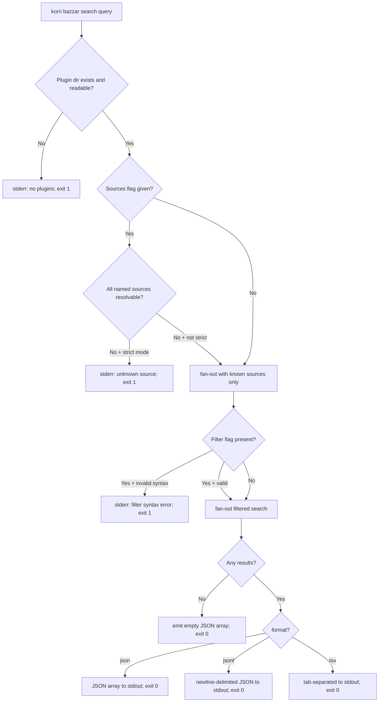
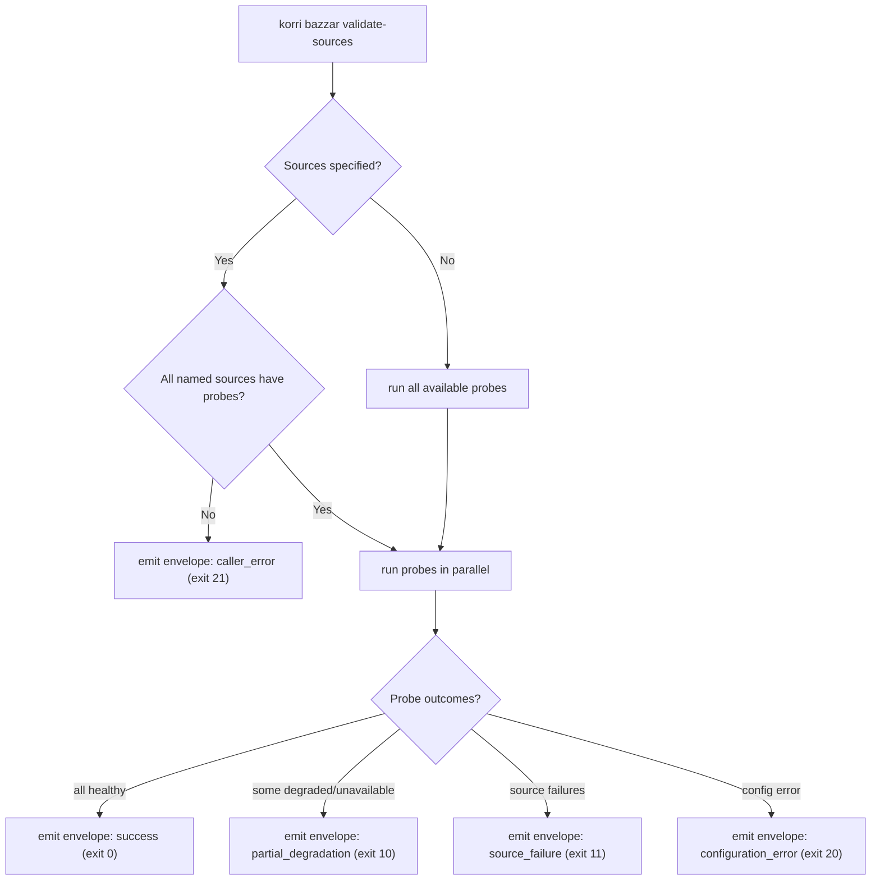

# Flow Analysis: Bazzar → `korri bazzar` Migration

**Origin spec:** `docs/brainstorms/2026-06-01-001-bazzar-source-adapter-download-resolution-requirements.md`  
**Local research:** `docs/research/bazzar-monorepo-migration/learnings.md`, `docs/research/bazzar-monorepo-migration/repo-research.md`  
**Scope:** Selective migration of Bazzar acquisition core into Korri as `korri bazzar <cmd>` (search / details / plugins / validate-sources / resolve-download)  
**Date:** 2026-06-03

---

## Factual Corrections to Research Docs Before Planning Proceeds

Two factual errors in `learnings.md` change the planning picture in concrete ways. Both must be corrected before sizing implementation units.

### Correction 1 — Effect version: it is beta.60 vs beta.74, NOT v3 vs v4

**Learning 6 in `learnings.md` states:** "Bazzar uses Effect v3; Korri targets Effect v4."

**Actual state (confirmed from `bazzar/package.json`):**
- Bazzar: `effect 4.0.0-beta.74`, `@effect/platform-bun 4.0.0-beta.74`
- Korri: `effect 4.0.0-beta.60`, `@effect/platform-bun 4.0.0-beta.60`

Both repos are on Effect v4 beta. The version gap is **14 beta minor versions**, not a major-version rewrite. This changes the migration cost estimate from "must rewrite all Effect service declarations" to "must resolve any API deltas between beta.60 and beta.74."

**Planning impact:** The migration is likely mechanical (service declarations, `Context.Service`, `Schema` APIs, `Command` APIs are stable in this range), but the specific changes must be confirmed against Effect's changelog before the Bazzar code lands in the Korri tree. A decision is required: (a) upgrade Korri's Effect pin to match Bazzar before migration, or (b) adapt the Bazzar code to compile against beta.60. Option (a) is simpler because it unblocks a clean copy without per-file adaptation. Option (b) risks silent behavioral differences.

### Correction 2 — Bazzar's test suite: 584 pass, 0 fail (not "58 failures")

**Learning 10 in `learnings.md` states:** "The existing Bazzar test suite is **not green** (58 failures at last count). The inventory gate must assess test health per module — do not import modules whose contract is demonstrably broken."

**Actual state (confirmed by running `bun test` in `bazzar/`):**
```
584 pass
0 fail
13454 expect() calls
Ran 584 tests across 58 files. [32.17s]
```

The "58 failures" was a misread of "58 files." The test suite is fully green.

**Planning impact:** The inventory gate instruction to "exclude any module with unresolved contract drift" was based on a false premise. No Bazzar module needs to be excluded on test-health grounds. This also eliminates the risk buffer the plan had allocated for fixing broken tests before migration. However, the inventory gate as a structural process (classify every module before moving code) remains valid — it just won't produce exclusions on test-failure grounds.

---

## User Flows

### Flow 1: `korri bazzar search <query>`

**Entry:** User runs `korri bazzar search "pac-man"` optionally with `--sources`, `--platforms`, `--format`, `--filter`, `--cursor`, `--timeout`, `--cache`/`--no-cache`, `--strict`, `--validate`, `--log-level`, `--log-json`



**Terminal states:** success with results, success with empty array, unknown sources, filter parse error, no plugins directory, plugin load failure

**Not specified:** What `--interactive` mode does when `korri bazzar` is a Korri subcommand (interactive mode may assume a terminal that isn't guaranteed in the composed CLI context).

---

### Flow 2: `korri bazzar details <url>`

**Entry:** User provides a single candidate URL.

**Happy path:** match URL to plugin → call details → print `SourceCandidateDetails` JSON to stdout → exit 0  
**Terminal states:** no plugin matches URL (exit 1), source defect (exit 1), network failure (exit 1)

**Not specified:** The failure format for `details` is not a `BazzarCliEnvelope`. The caller receives unstructured stderr text. Machine consumers cannot distinguish "no matching plugin" from "plugin HTTP error."

---

### Flow 3: `korri bazzar plugins`

**Entry:** User wants to enumerate loaded plugins.

**Happy path:** load plugin inventory → list name + metadata for each → print to stdout → exit 0  
**Terminal states:** empty plugins dir, plugins dir missing, load failures (partial list with failure annotations)

---

### Flow 4: `korri bazzar validate-sources` (machine-readable contract command)

**Entry:** User or automation runs `korri bazzar validate-sources [--sources <csv>] [--timeout <ms>]`



**Contract:** `BazzarCliEnvelope` with `command: "validate-sources"` is the only output on stdout. Logs go to stderr. Exit code is always one of: 0, 10, 11, 20, 21, 70.

---

### Flow 5: `korri bazzar resolve-download <source> <url> --title <title>` (machine-readable contract command)

**Entry:** Automation provides source name, candidate URL, and title.

**Happy path:** load policy for source → load plugin → run `resolveDownload` → classify outcome → emit `BazzarCliEnvelope` with `command: "resolve-download"` → exit 0 or 10/11/20/21/70

**Terminal states (typed):** `final_artifact`, `interstitial`, `blocked_unavailable`, `unsupported`, `source_defect`, `configuration_error`, `caller_error`, `access_required`, `license_ambiguous`, `rate_limited`

---

## Gaps

### Critical

---

**Gap C-1: `defaultBazzarPluginsDir()` is development-time only — no production path specified**

`runtime-config.ts::defaultBazzarPluginsDir()` resolves to `join(process.cwd(), "shared/core/src/plugins")`. In the Nix-packaged Korri CLI, `process.cwd()` is not the Bazzar source root. Without this value being correct, `validate-sources` will silently find zero probes (no `.validation.ts` files), `resolve-download` will find no policies, and `search` will find no plugins.

There are two distinct plugin tiers that the plan conflates:

| Tier | Description | Proposed location |
|---|---|---|
| Built-in first-party | Plugins bundled in the Nix closure | Nix store path, set at build time |
| User-installed | Plugins placed by the user | `xdgConfigHome()/korri/plugins` via existing `@platform/config/xdg-paths` |

The plan does not resolve this distinction or specify where the built-in plugins dir is set in `package.nix`. Until `acquisition-config.ts` has a concrete production-ready `defaultAcquisitionPluginsDir()` that works in the Nix context, every acquisition command is broken in production.

**Concrete question:** Does the Nix derivation wrap the binary with `--add-flags "KORRI_ACQUISITION_PLUGINS_DIR=<nix-store-path>/plugins"` via `makeWrapper`, or does `acquisition-config.ts` derive the path from `import.meta.url` at runtime? The answer drives both the Nix derivation and the adapter module shape. Decide this before Unit 1 begins.

---

**Gap C-2: `.ts` first-party plugins cannot be dynamically imported in a Bun-bundled CLI**

The Bazzar plugin loader supports `.mjs`, `.js`, and `.ts` plugins via `import(pathToFileURL(filePath).href)`. In development this works because Bun can transpile `.ts` at runtime. In a `bun build`-produced single-file bundle (Korri's Nix packaging pattern), dynamically imported `.ts` files are not compiled — they would need to exist as separate `.ts` files resolvable at runtime, which conflicts with the Nix derivation model.

The first-party plugin inventory includes **both** `.mjs` hermetic plugins and `.ts` plugins:

| Plugin file | Format | Notes |
|---|---|---|
| `coolrom.mjs`, `retrostic.mjs`, `romhustler.mjs`, `steamgriddb.mjs`, `wowroms.mjs` | `.mjs` hermetic | Self-contained, no Bazzar/Korri source imports |
| `itchio.ts`, `chip8archive.ts`, `homebrewhub.ts`, `pico8bbs.ts`, `portmaster.ts`, `puzzlescript.ts`, `retrobrews.ts`, `tic80gallery.ts`, `wasm4gallery.ts` | `.ts` with imports | Import from `shared/core/src/` — NOT hermetic |

The migration plan treats all plugins as importable `.mjs` files. This is incorrect. A concrete decision is required:

- Option A: **Only `.mjs` hermetic plugins** are bundled in the initial slice. `.ts` plugins are deferred until a plugin compilation pipeline exists.
- Option B: **`.ts` plugins are pre-compiled to `.mjs`** as part of the Nix build, then shipped as `.mjs` files alongside the binary.
- Option C: **`.ts` plugins are compiled into the main bundle** via a build-time manifest, losing the dynamic-load characteristic.

The spec does not choose among these. Option A is the lowest-risk path for the CLI-first slice because it requires no new build infrastructure.

---

**Gap C-3: `itchio/` module is a major undocumented transitive dependency**

The `itchio.ts` plugin imports from `shared/core/src/itchio/` which contains 22 TypeScript files (~several hundred lines total, with 6 fixture files and 6 test files). This module covers itch.io RSS feed parsing, API authentication, download resolution, embed detection, upload filtering, and type definitions.

The inventory table in `repo-research.md` does not list `itchio/` anywhere under IMPORT, ADAPT, DEFER, or DELETE. If `itchio.ts` is in scope for migration (it is currently listed as "IMPORT"), its 22-file transitive dependency must be classified explicitly. If `itchio.ts` is excluded (because it is a `.ts` plugin — see Gap C-2), the `itchio/` module becomes irrelevant for the CLI-first slice, but the exclusion of `itchio.ts` must be explicit.

This is the largest undocumented code surface in the migration: ~22 files, ~40 tests, covering itch.io-specific acquisition logic.

---

**Gap C-4: Contract envelope `source.plugin` identifies as `"bazzar"` from a Korri binary**

In `source-contract-runner.ts`, `createSourceContractFailureEnvelope` hardcodes:
```ts
source: { plugin: "bazzar", site: "Bazzar CLI" }
```

The plan defers renaming this to `"korri-acquisition"` / `"Korri Acquisition CLI"`. But the defer is indefinite — there is no gate condition or version bump trigger. External callers parsing `korri bazzar validate-sources` output will receive `plugin: "bazzar"` from a binary named `korri`. This is the kind of semantic inconsistency that gets deprioritized indefinitely in practice.

The plan should specify a gate condition: "rename `source.plugin` before the first release in which `korri bazzar` is surfaced to end users" or "rename in the same PR that renames `BAZZAR_CLI_CONTRACT_VERSION`."

---

### Important

---

**Gap I-1: `@platform/logger` writes to stdout in CLI mode — acquisition logger cannot reuse it**

`product/platform/logger/logger.ts` creates `pino(options)` with no explicit destination. In Node/Bun, pino without a destination writes to **stdout**. The Bazzar acquisition logger (`shared/core/src/logger.ts`) creates `pino(options, pino.destination({ dest: 2, sync: false }))`, which always writes to **stderr**.

The research doc correctly identifies that `@platform/logger` must not be used for acquisition logs. However, the implication is broader: the `acquisition-logger.ts` module cannot be a thin wrapper around `@platform/logger`. It must be an independent pino instance that explicitly targets stderr via `pino.destination({ dest: 2 })`.

This distinction must be **captured in a comment in `acquisition-logger.ts`** that blocks drift. Without it, a future refactor that "aligns" the acquisition logger with the platform logger will silently contaminate contract envelope stdout with log lines, breaking all machine consumers.

---

**Gap I-2: `plugin-harness.ts` not classified in the inventory**

`shared/core/src/plugin-harness.ts` (131 lines) is a higher-level convenience harness that composes `plugin-loader`, `plugin-runtime`, and `plugin-operation-harness` into a single `loadSingleFilePluginHarness()` object. It is not used in any CLI command handler — it is used in plugin unit tests (`.test.ts` files).

The inventory table is silent on this file. It needs one of:
- **IMPORT** into `product/platform/acquisition/plugin-harness.ts` as a test utility
- **DELETE** (the individual composed modules are sufficient for CLI commands; tests can compose them directly)

If the `.ts` plugin tests are in scope (and Gap C-2 resolution allows them), this module is worth importing. If only `.mjs` hermetic plugins are migrated in the first slice, the tests that use this harness don't come along, making the import unnecessary.

---

**Gap I-3: Logging flags scope in the Korri CLI hierarchy**

The Bazzar CLI places `--log-level` and `--log-json` as shared flags on the root command, available to all subcommands. In the Korri CLI, flags are defined per `Command.make` call with no inherited group flags.

Two options:
1. Define logging flags on the `bazzarCommand` group and pass them down explicitly to each subcommand handler.
2. Define logging flags per subcommand (search, details, validate-sources, resolve-download each declare them separately).

Effect CLI's `Command.withSubcommands` does not automatically propagate parent flags to children — each `Command.make` has its own flags argument. If logging flags are placed on `bazzarCommand` they need to be composed into each handler via the parent command context, which is a different usage pattern than the existing Korri `streamCommand` / `playCommand` pattern.

This design decision must be made before writing `bazzar-command.ts`. The spec does not resolve it.

---

**Gap I-4: Non-contract commands (`search`, `details`) have no typed failure surface**

`validate-sources` and `resolve-download` emit typed `BazzarCliEnvelope` on stdout even for failures. `search` and `details` use `runPlainCliEffect`, which logs to stderr and exits 1 on any failure — with no structured envelope.

From a machine-readable contract perspective, this means:
- A caller piping `korri bazzar resolve-download` can parse the envelope and inspect `exitCategory` to distinguish `caller_error` from `source_defect`
- A caller piping `korri bazzar search` cannot distinguish "no matching plugin" from "network timeout" from "filter syntax error" — all result in exit 1 with stderr text

The spec states that `search` and `details` are human-readable commands. If the machine-readable discipline is intended only for the contract commands, this is acceptable — but it needs to be explicitly documented in the CLI spec, not left implicit. If `korri library bazzar search` is later wired to the portal API, the untyped failure surface will require a rework.

---

**Gap I-5: `--filter` flag and its CEL dependency — not gated by feature decision**

The `search` command supports `--filter <expr>` using CEL (`@bufbuild/cel`, `@bufbuild/protobuf`). These add two non-trivial dependencies to the Korri production bundle.

If the `--filter` flag is not needed for the initial slice, both packages can be deferred — reducing closure size and eliminating the `@bufbuild/cel` version-pin risk. The spec does not make this call. The decision should be made before `package.json` is updated, not after.

---

**Gap I-6: Nix-built plugin dynamic loading of `.validation.ts` and `.policy.ts` files**

`source-validation-probes.ts` and `source-policy.ts` both use:
```ts
const module = await import(pathToFileURL(join(probeDir, filename)).href)
```

to load `.validation.ts` and `.policy.ts` files at runtime. In the Nix-packaged `korri` CLI, these files must exist as separate, accessible files alongside the binary — they cannot be bundled into the Bun single-file output (they are loaded after bundle evaluation, from a directory path).

This means the Nix derivation must:
1. Include `.validation.ts` and `.policy.ts` files from the plugins directory in the derivation output (not just the bundled JS)
2. Set the plugins dir env var to point to their installed location in the Nix store

The existing `product/apps/cli/package.nix` derivation uses `bun build … --outfile=korri-cli.js` with no mechanism for post-bundle file copies. This is a concrete Nix packaging gap that must be resolved before `validate-sources` works end-to-end in a Nix-built binary.

---

**Gap I-7: Effect beta version alignment decision not surfaced as a gate**

As established in the factual corrections: Bazzar is on beta.74, Korri on beta.60. The plan's migration sequence does not include an explicit "align Effect versions" step. Without this step, migrated Bazzar code will fail to compile in Korri's TypeScript environment if any API changed between the two beta versions.

This should be the **first implementation unit** or a pre-condition, not left implicit. The question is binary: upgrade Korri to beta.74, or backport Bazzar's code to beta.60. Either way, the version alignment must be complete before any Bazzar code is compiled against Korri's `tsconfig.json`.

---

### Minor

---

**Gap M-1: `plugin-harness.test.ts` references unclassified harness**

`shared/core/src/plugin-harness.test.ts` exists in Bazzar and tests `loadSingleFilePluginHarness`. If the harness is deferred (DELETE from the import list), the companion test stays out. If the harness is imported, the test comes along. This is a linked decision: harness classification determines whether this test file is part of the first migration slice.

---

**Gap M-2: pino version pin difference**

Bazzar: `pino ^9.7.0`, Korri: `pino ^9.6.0`. The `^` range makes this compatible in most cases, but `bun install` will pin to whatever bun.lock resolves. After merging `package.json`, run `bun install` and verify no pino version conflict exists in the unified lockfile before running the acquisition logger tests.

---

**Gap M-3: Timeout flag not surfaced in CLI spec**

`source-contract-commands.ts` exposes a `--timeout <ms>` flag for `validate-sources` (defaulting to `BazzarRuntimeConfig.timeouts.contractMs`, which is 30000ms). This flag must appear in the `bazzarCommand` spec alongside the other documented flags. The plan omits it.

---

**Gap M-4: `wasm4gallery.ts` is 431 lines with its own test suite**

This `.ts` plugin has a dedicated `wasm4gallery.test.ts` and `wasm4gallery.mocks.ts`. If it is migrated as a `.ts` plugin (contingent on Gap C-2 resolution), its test + mocks come along. If excluded (as a `.ts` plugin), it should be listed explicitly in the DELETE category with a deferral note.

---

**Gap M-5: `BAZZAR_CLI_CONTRACT_VERSION` rename lacks a gate condition**

The contract version string `"bazzar.source-adapter.v1"` is deferred but the gate condition for renaming it is unspecified. Suggested gate: "rename in the same PR that first ships `korri bazzar` to a named release, not as a silent follow-up." Document this explicitly in the migration plan so it cannot be lost.

---

## Questions

**Q1 (blocker — required before Unit 1):** Which direction resolves the Effect beta version gap — upgrade Korri's `effect` pin from beta.60 to beta.74, or adapt Bazzar's code to compile against beta.60? Upgrading Korri is a single lockfile change but touches all existing Korri Effect code; adapting Bazzar adds per-file maintenance burden.

*Default if unanswered:* Upgrade Korri to match Bazzar (beta.74). This is the cleanest path and avoids divergence if Bazzar is the more active beta adopter.

---

**Q2 (blocker — required before Unit 1):** What is the production-correct plugins directory in the Nix-packaged `korri` CLI? Two sub-questions:
- Where do built-in first-party plugins live in the Nix store? (Wrapped env var via `makeWrapper`, or derived from `import.meta.url` at runtime?)
- Where do user-installed plugins live? (`$XDG_CONFIG_HOME/korri/plugins`? `$XDG_DATA_HOME/korri/plugins`?)

*Default if unanswered:* Built-in plugins injected as `KORRI_ACQUISITION_PLUGINS_DIR=<nix-store-path>/plugins` via `makeWrapper`; user plugins override via the same env var. The `xdg-paths.ts` already exists in `@platform/config` for the user-installed path.

---

**Q3 (blocker — required before Unit 1):** For the initial slice, should only `.mjs` hermetic plugins be migrated, or should `.ts` first-party plugins also be included? The `.ts` plugins (including `itchio.ts`, `wasm4gallery.ts`, `chip8archive.ts`, and 6 others) cannot be dynamically loaded from a Bun-bundled binary in the same way as `.mjs` files. What format does the Nix derivation need to support?

*Default if unanswered:* Only `.mjs` hermetic plugins in the first slice. `.ts` plugins and their test suites deferred until a compilation pipeline is specified.

---

**Q4 (required before `bazzar-command.ts` is written):** Where do `--log-level` and `--log-json` flags live in the `korri bazzar` command hierarchy — at the `bazzarCommand` group level (using parent-context propagation) or repeated per leaf command? How does this interact with Effect CLI's `Command.withSubcommands` flag scoping?

*Default if unanswered:* Per-leaf-command flags, matching the existing Korri CLI convention for flags on `streamLaunchCommand`, `streamRemoteLaunchCommand`, and `playCommand`.

---

**Q5 (required before finalizing scope):** Is `itchio.ts` plugin in scope for the initial slice? If yes, the entire `itchio/` subdirectory (22 files) must be classified in the inventory. If no, it must appear explicitly in the DELETE/DEFER table, and the `.mjs`-only plugin boundary must be documented.

*Stakes:* `itchio/` is the largest undocumented surface in the migration. If it arrives in-scope without explicit classification, it will bring authentication, RSS parsing, rate-limit handling, and license-detection logic into Korri without a deliberate decision.

*Default if unanswered:* Exclude `itchio.ts` and the `itchio/` module from the first slice; add both to DEFER with note "re-evaluate after `.ts` plugin build pipeline is specified."

---

**Q6 (required before submitting the first migration PR):** Should the `--filter` flag (and thus `@bufbuild/cel`, `@bufbuild/protobuf`) be included in the initial migration? If the filter flag is excluded, the CEL deps are unnecessary for the first slice, reducing bundle size and eliminating a version-pin risk.

*Default if unanswered:* Include `--filter` — it is documented in the Bazzar CLI spec and removing it would require upstream documentation updates.

---

**Q7 (important for external callers):** What value should the failure envelope `source.plugin` field carry during the transition period before the rename is complete — `"bazzar"`, `"korri"`, or `"korri-acquisition"`? This affects anyone parsing `korri bazzar validate-sources` output to identify the source of a failure.

*Default if unanswered:* Rename immediately to `"korri-acquisition"` in the ADAPT step for `source-contract-runner.ts`. The failure source field identifies the process emitting the envelope, not the plugin being validated, so there is no backwards-compat concern for external `.policy.ts` authors.

---

**Q8 (machine-readability contract):** Are `korri bazzar search` and `korri bazzar details` intended to remain human-readable commands only, or should they gain typed failure envelopes for machine consumption? The spec states these are "human-readable output" commands, but if they are ever wired to the portal API, the unstructured failure path will need rework.

*Stakes:* Document the decision now to prevent misuse. If human-readable only, add an inline comment in `bazzar-cli-commands.ts` that explicitly states this is not a machine-readable contract surface.

*Default if unanswered:* Human-readable output only, with a `// NOTE: not a machine-readable contract surface` comment at the module top.

---

## Recommended Next Steps

The following steps should be completed in order before any code moves from Bazzar to Korri.

**Step 1 (blockers — must resolve before any code):**
- Answer Q2 (plugins dir in Nix context) and Q3 (`.mjs` vs `.ts` plugin scope). These two answers determine the Nix derivation shape, which determines where first-party plugin files live, which determines the default acquisition config, which determines whether Unit 1 even runs correctly.
- Answer Q1 (Effect beta version alignment). Until Korri and Bazzar share the same Effect pin, the TypeScript compilation environment is undefined.

**Step 2 (pre-migration inventory updates):**
- Update the `repo-research.md` IMPORT table to explicitly classify `itchio/` (IMPORT or DEFER), `plugin-harness.ts` (IMPORT as test utility or DELETE), and all `.ts` first-party plugins individually.
- Add `plugin-harness.ts` to the ADAPT or DELETE row.
- Mark all `.ts` plugins explicitly as DEFER if Q3 answer is `.mjs`-only.
- Correct the test-health assessment (584 pass, 0 fail) so downstream sessions don't re-derive the false "58 failures" premise.

**Step 3 (before `acquisition-config.ts` is written):**
- Answer Q4 (logging flags scope) and Q6 (`--filter` / CEL deps). These drive the public CLI contract and dependency surface; changing them after `bazzar-command.ts` is written creates churn.

**Step 4 (first PR gate — `acquisition-config.ts` and the Nix derivation):**
- Write `acquisition-config.ts` with a production-correct `defaultAcquisitionPluginsDir()` that uses the Nix store path (injected via `makeWrapper`) for built-in plugins and `xdgConfigHome()/korri/plugins` for user plugins.
- Update `package.nix` to copy plugin files (`.mjs`, `.policy.ts`, `.validation.ts`) to a `$out/share/korri-plugins/` location and inject `KORRI_ACQUISITION_PLUGINS_DIR` via `makeWrapper`.
- Run the install check `"$out/bin/korri" bazzar validate-sources` (not just `--help`) to confirm the runtime path resolves.

**Step 5 (PR gate before unit tests land):**
- Confirm that `acquisition-logger.ts` writes exclusively to stderr. Add a smoke test: `"$out/bin/korri" bazzar validate-sources 1>/tmp/stdout 2>/tmp/stderr` — parse `/tmp/stdout` as JSON; it must be valid. Any pino output in `/tmp/stdout` is a logger-routing bug.

**Step 6 (before first release):**
- Apply the rename `source.plugin: "bazzar"` → `"korri-acquisition"` in `source-contract-runner.ts` per the Q7 default. Document the `BAZZAR_CLI_CONTRACT_VERSION` rename as a near-term follow-up with the gate condition: "rename before first release of `korri bazzar` to named users."

---

## Summary of Actionable Additions to the Existing Plan

| Addition | Where it lands |
|---|---|
| Correct Effect version to "beta.60 vs beta.74" everywhere; add version-alignment as Unit 0 | `repo-research.md` |
| Correct test suite status to "584 pass, 0 fail"; remove exclusion guidance based on false premise | `learnings.md` |
| Add `defaultAcquisitionPluginsDir()` with dual-tier (Nix store + XDG) resolution to `acquisition-config.ts` spec | Unit 1 spec |
| Add `.validation.ts` / `.policy.ts` file copy step to `package.nix` derivation design | Unit 4 spec |
| Add `KORRI_ACQUISITION_PLUGINS_DIR` `makeWrapper` injection to Nix derivation | Unit 4 spec |
| Add `itchio/` (22 files) to inventory as DEFER (pending Q5 decision) | `repo-research.md` DEFER table |
| Add `plugin-harness.ts` to inventory as DEFER (test utility, not needed for CLI-first slice) | `repo-research.md` DEFER table |
| Add each `.ts` plugin explicitly to DEFER table | `repo-research.md` DEFER table |
| Add `--timeout <ms>` flag to `validate-sources` command spec | Unit 2 spec |
| Add `source.plugin: "korri-acquisition"` rename to ADAPT step for `source-contract-runner.ts` | `repo-research.md` ADAPT table |
| Add gate condition for `BAZZAR_CLI_CONTRACT_VERSION` rename | DEFER table |
| Add per-leaf-command logging flags design decision to `bazzar-command.ts` spec | Unit 2 spec |
| Add inline `// NOTE: not a machine-readable contract surface` to `bazzar-cli-commands.ts` | Unit 2 spec |
| Confirm `@platform/logger` stdout risk; block logger aliasing with comment in `acquisition-logger.ts` | Unit 2 spec |
