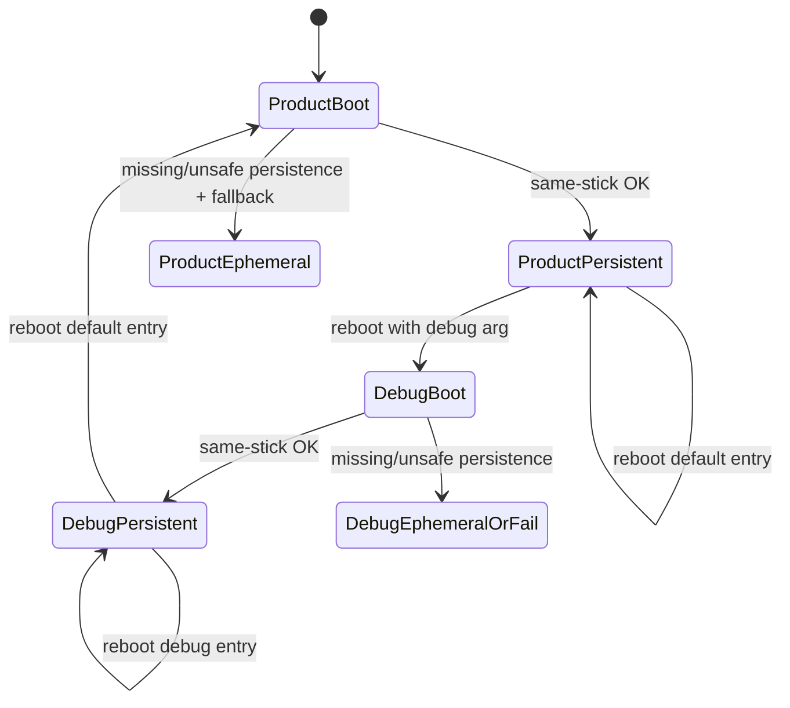

# Flow analysis: live USB persistence modes

Date: 2026-05-24
Spec reviewed: `../../../work/.archive/01KSBMG31TA7ZG64667DM6SRQ3-feat-live-usb-product-developer-persistence/requirements.md`

## Codebase grounding

Relevant existing implementation and patterns:

- `nix/images/live-usb-runtime.nix` currently wires a single broad persistence shape: kiosk `HOME`, `XDG_CONFIG_HOME`, `XDG_DATA_HOME`, `XDG_STATE_HOME`, `XDG_CACHE_HOME`, and `KORRI_MOONLIGHT_STATE_HOME` all live under `/persist/korri-live-usb/home`.
- `nix/images/live-usb-persistence-resolver.sh` is the current safety authority. It derives the boot source from `/iso`, requires the boot parent transport to be `usb`, scans only sibling partitions for label `KORRI-PERSIST`, and otherwise mounts tmpfs at the same root with `.korri-live-usb-ephemeral`.
- `korri-live-usb-persistence.service` runs before `korri-kiosk.service`; `greetd` requires persistence/input dependencies before login. This is the existing ordering pattern to preserve or deepen.
- Existing safety checks live in `nix/tests/korri-live-usb-config-check.nix`, `nix/tests/korri-live-usb-vm-smoke.nix`, and `tools/testing/nix/korri-live-usb-safety-eval.test.ts`. The shell harness already shims `findmnt`, `lsblk`, `blkid`, `mount`, `umount`, and `chown` to exercise resolver behavior without touching real disks.
- `docs/deployment/korri-images.md` is the operator-facing live USB contract. It currently documents broad `/persist/korri-live-usb/home` persistence, same-stick `KORRI-PERSIST`, tmpfs fallback, QEMU validation tiers, and physical NUC acceptance.
- There is no existing product/debug persistence mode option, boot menu entry, or `/proc/cmdline` parser.
- Runtime-config currently exposes only `desktopInput` (`korri/deploy/desktop/runtime-config*.ts`). If “visibly distinguishable” means a UI banner, this is the existing set-once Bun-to-React seam.
- Korri desktop config is specifically `XDG_CONFIG_HOME/korri/desktop.yaml`; general Korri paths come from `korri/shared/config/xdg-paths.ts`; Moonlight Embedded state is currently routed to `home/.cache/moonlight`.
- Debug SSH is already a separate explicit option: `services.korri.liveUsbPersistence.debugSsh.authorizedKeys`; broad debug persistence should not implicitly enable SSH.

## User flows

### 1. Default product boot with same-stick persistence present

- **Entry point:** Player/operator boots the default live USB menu entry.
- **Decision points:**
  - Does the boot command line contain an explicit debug mode arg? Expected no.
  - Can the resolver identify `/iso` as being on a USB parent device?
  - Is there a sibling `KORRI-PERSIST` partition and can it be mounted/prepared?
  - Which product allowlist paths are exposed as persistent?
- **Happy path:** Product mode is selected by default, same-stick persistence is mounted, only allowlisted Korri/Moonlight/setup/identity/diagnostic paths persist, kiosk starts, and non-allowlisted writes disappear after reboot.
- **Terminal states:** Product kiosk ready with persistent state; product kiosk ready but non-persistent if fallback is allowed; visible failure if fallback is not allowed.

### 2. Default product boot with no usable persistence

- **Entry point:** Player/operator boots the default live USB menu entry without a valid same-stick persistence area, or with an unsafe/malformed one.
- **Decision points:**
  - Missing boot source, non-USB boot parent, no matching sibling partition, failed mount, failed ownership preparation, read-only/corrupt/full partition.
  - Should product mode continue with tmpfs or block kiosk startup?
  - How is non-persistence shown to the player/operator?
- **Happy path:** The appliance does not touch internal disks or unrelated devices; it either starts with a clear non-persistent marker or fails visibly before presenting a misleading normal appliance.
- **Terminal states:** Kiosk ready with ephemeral marker; or boot/session blocked with actionable diagnostic.

### 3. Developer/debug boot with same-stick persistence present

- **Entry point:** Developer selects a non-default debug boot entry or manually supplies the agreed kernel arg.
- **Decision points:**
  - Is the debug arg recognized, unambiguous, and namespaced to Korri?
  - Can the same-stick USB persistence area be resolved exactly as in product mode?
  - Which broad debug paths are persisted and are they isolated from product-mode allowlisted state?
  - How does the session visibly identify debug mode?
- **Happy path:** Debug mode uses the same USB-only resolver, broadens persisted state for investigation, writes debug markers/env, optionally surfaces a UI/system banner, and does not change the product allowlist.
- **Terminal states:** Debug kiosk ready with broad USB persistence; debug kiosk ready with clear non-persistent debug state if fallback is allowed; or fail-visible if debug without persistence is considered invalid.

### 4. Developer/debug requested but persistence unavailable or unsafe

- **Entry point:** Developer requests debug persistence but boots from media with no valid sibling `KORRI-PERSIST`, from QEMU topology that hides the USB parent, from `copytoram`, or with a bad/corrupt persistence partition.
- **Decision points:**
  - Should debug mode ever run broad persistence on tmpfs, or should it block because the developer explicitly requested retained debug state?
  - Is the debug label still shown if state is not actually persistent?
  - Are diagnostics available without writing to internal disk?
- **Happy path:** No internal disk is touched; the developer gets an unambiguous “debug mode, non-persistent/failure” signal.
- **Terminal states:** Debug non-persistent session; or blocked debug session with resolver diagnostics.

### 5. Switching modes across reboots on the same USB

- **Entry point:** Operator alternates between default product and debug boot entries using the same USB persistence partition.
- **Decision points:**
  - Does debug broad state share a namespace with product state?
  - Can debug-created files change product-mode behavior on the next default boot?
  - Are product-mode allowlisted files migrated or repaired if debug changed permissions/ownership?
- **Happy path:** Product mode sees only approved product state; debug mode can inspect additional debug state without silently promoting it into product behavior.
- **Terminal states:** Clean product session, debug session, or visible repair/failure if persisted state is incompatible.

### 6. First boot / identity and setup continuity

- **Entry point:** Player/operator first boots newly imaged USB, then completes any available pairing/network/device setup and reboots.
- **Decision points:**
  - Is `/etc/machine-id` generated per USB and then persisted, or accidentally baked into the image?
  - Which setup systems are actually enabled: Ethernet-only, NetworkManager, iwd, InputPlumber state, controller mappings?
  - Which of these have product allowlist paths and secure permissions?
- **Happy path:** The USB gains a stable per-device identity and retained setup state without persisting broad `/etc`, `/var`, or all of `HOME`.
- **Terminal states:** Setup retained; setup lost with a clear non-persistent signal; or setup rejected/ignored because permissions are wrong.

## Gaps

### Critical

#### C1. Product-mode storage topology is not yet specified enough to replace the current broad persistent HOME

**What is missing:** The spec requires an allowlist, but the existing implementation makes the whole kiosk home and all XDG roots persistent under `/persist/korri-live-usb/home`. The technical plan needs to decide the concrete topology: ephemeral `HOME` with bind/symlink allowlist paths, an Impermanence-style local phase, earlier resolver integration with `environment.persistence`, or another explicit mechanism.

**Why it matters:** If implementation only adds a `mode` flag while keeping `HOME` persistent, product mode will still accumulate browser caches, incidental files, and user/system drift, failing R3/R5/AE4.

**Existing pattern/default:** Keep `nix/images/live-usb-persistence-resolver.sh` as the same-stick mount authority. Current service ordering already gates kiosk login on persistence setup; use that seam to complete allowlist setup before `greetd`/kiosk. Default assumption: product mode should use ephemeral `HOME` plus allowlisted bind/link paths rooted under `/persist/korri-live-usb`, while debug may preserve current broad-home behavior.

#### C2. Exact product allowlist and ownership/mode contracts remain underspecified

**What is missing:** The spec names categories but not paths, permissions, or quotas. Planning must define at least: `XDG_CONFIG_HOME/korri/desktop.yaml`; selected `XDG_DATA_HOME/korri` / `XDG_STATE_HOME/korri` entries; Moonlight Embedded pairing/cache path; whether `KORRI_LIBRARY_ROOT`/local library data is included; `/etc/machine-id`; any NetworkManager/iwd paths if Wi-Fi/network setup is in scope; any InputPlumber/device setup path; and bounded diagnostics/logs.

**Why it matters:** Developers will otherwise choose broad directories (`/home`, `/var/lib`, `/etc`, `/var/log`) to make reboot tests pass, weakening the product posture. NetworkManager also ignores insecure keyfiles, so incorrect root-only modes can make “persisted” Wi-Fi profiles silently fail.

**Existing pattern/default:** Korri config paths are explicit in code (`desktop.yaml`, XDG helpers). Existing docs are Ethernet-first and have no NetworkManager persistence. Default assumption: only persist known Korri/Moonlight paths plus `/etc/machine-id`; add NetworkManager/iwd/InputPlumber paths only when the enabling service and path are identified, with root/user/mode specified per entry.

#### C3. Mode activation contract is not specified at the kernel/menu level

**What is missing:** The spec allows “boot menu entry or kernel argument” but does not define the arg name/value, invalid-value behavior, precedence when duplicate/conflicting args exist, or how the generated ISO exposes a non-default debug entry for both EFI/GRUB and BIOS/syslinux paths.

**Why it matters:** A vague debug activation can be accidentally triggered by the generic NixOS `debug` menu option, omitted from one firmware path, or be impossible to test deterministically. It also blocks tests for R8/R11.

**Existing pattern/default:** Repo research found NixOS ISO already has a generic `debug` option; avoid reusing it. Default assumption: use a namespaced value arg such as `korri.persistence=debug`, default to product when absent, treat unknown/conflicting Korri values as product plus warning or fail-closed, and add a non-default ISO entry verified in generated GRUB/syslinux config or via specialisation.

#### C4. Debug broad state can contaminate later product boots unless namespace boundaries are planned

**What is missing:** The spec says debug mode broadens persistence “without changing the delivered product-mode allowlist,” but does not say whether debug state shares the same subtree as product state, whether debug-created product-path files are allowed to affect product mode, or how to repair permission drift.

**Why it matters:** A developer could boot debug, write broad `$HOME/.config` or `/etc` state, then reboot product and see behavior that only works because debug state leaked. That hides product-mode bugs and violates the mental model that product persistence is a contract.

**Existing pattern/default:** Current root is a single `/persist/korri-live-usb/home`; no namespace separation exists. Default assumption: product state and debug-only state should live in distinct subtrees, with only the product allowlist mounted in product mode. Debug may mount both product state and a separate debug subtree for broad state.

#### C5. Failure behavior differs by user intent but is not resolved

**What is missing:** R13 allows “non-persistent/failure signal,” but the plan must choose whether product and debug both continue with tmpfs, both block, or differ. Debug requested with missing persistence is especially ambiguous because its purpose is retained broad state.

**Why it matters:** If the kiosk looks normal after falling back to tmpfs, players may think setup survived and developers may lose diagnostic work. If product mode blocks, the live USB may become unusable for first-boot/manual repair cases.

**Existing pattern/default:** Existing resolver always falls back to tmpfs and writes `.korri-live-usb-ephemeral`; VM smoke asserts this. Default assumption: keep product tmpfs fallback with a clear persistent/non-persistent marker; strongly consider fail-visible/blocking behavior for debug persistence unless a `debug ephemeral` marker and docs make the loss obvious.

### Important

#### I1. Boot ordering with Impermanence-style mounts is a high-risk integration seam

**What is missing:** The spec defers whether to use Impermanence, local bind mounts, or a hybrid, but the plan must resolve ordering. Direct `environment.persistence` normally expects persistence filesystems before `local-fs.target`; Korri's resolver currently runs after `local-fs.target` as a `multi-user.target` oneshot.

**Why it matters:** Services may start before bind mounts/files are ready, leading to ephemeral config being read or created in the wrong place. This is especially risky for `/etc/machine-id`, NetworkManager, journald, and any service that starts before `greetd`.

**Existing pattern/default:** `greetd`/kiosk are already ordered after the resolver, but system services like NetworkManager/journald would need earlier or explicit ordering. Default assumption: use a project-local allowlist phase for kiosk/user paths after the resolver; handle early system paths with dedicated NixOS ordering or avoid persisting them until the ordering is proven.

#### I2. Machine identity first-boot semantics are not planned

**What is missing:** The plan needs to specify whether the live image ships with `/etc/machine-id` empty/uninitialized, how first boot generates a per-USB ID, and how that file is persisted/bound.

**Why it matters:** A baked valid machine-id means every copied USB shares identity; missing persistence means identity changes every boot. Both can affect mDNS, NetworkManager stable identifiers, journald paths, and pairing/debug correlation.

**Existing pattern/default:** No current machine-id handling was found. Default assumption: do not bake a valid ID; generate/persist per same-stick USB when available, and use systemd-safe uninitialized/ephemeral behavior when not.

#### I3. Network/setup persistence category is broader than current product scope

**What is missing:** Existing docs say v1 is Ethernet-first with no Wi-Fi setup path, while the new spec lists network setup. Planning must clarify whether this slice introduces NetworkManager/iwd persistence, or documents network persistence as future until setup UX/service is enabled.

**Why it matters:** Persisting `/etc/NetworkManager/system-connections` when NetworkManager is not part of the product is dead complexity; persisting all of `/var/lib` just in case is unsafe. If Wi-Fi setup is intended, secrets and root-only permissions become product requirements.

**Existing pattern/default:** x86 live USB currently only opens UDP 5353 and uses standard discovery; no NetworkManager/iwd persistence is wired. Default assumption: keep Ethernet-only for this implementation unless a specific network manager and setup flow is in scope.

#### I4. Diagnostics/log persistence needs bounds and sensitivity handling

**What is missing:** “Useful logs/diagnostics” lacks a retention/quota policy, path selection, and mode split. Product and debug likely need different levels.

**Why it matters:** Persistent logs can fill a small USB and may contain IP addresses, hostnames, tokens, paths, or controller/device details. Debug coredumps/logs may be even more sensitive.

**Existing pattern/default:** Current validation evidence logs live under host-side `out/live-usb-smoke`; live-system journald persistence is not implemented. Default assumption: product mode should keep diagnostics narrow and quota-limited, or export selected facts instead of all `/var/log`; debug mode may retain broader logs with explicit docs and cleanup/reset guidance.

#### I5. Internal-disk safety has more surfaces than the current tests cover

**What is missing:** Current tests check no `/mnt`/`/home`, no swapDevices, and disabled `udisks2`/`gvfs`, but planning should address systemd GPT auto-discovery, swap auto-discovery kernel behavior, internal same-label partition sentinels, and services that may write outside the USB path.

**Why it matters:** The no-internal-disk guarantee is central. A future NixOS default or added service could auto-mount/swap or write state despite the resolver being safe.

**Existing pattern/default:** `swapDevices = lib.mkForce [ ]`, `udisks2` and `gvfs` are disabled. Default assumption: extend eval/VM/physical checks to assert no unsafe mounts/services and include an internal disk sentinel/hash in physical/QEMU validation.

#### I6. `copytoram` and nonstandard boot topologies can break same-stick resolution

**What is missing:** NixOS ISO options can copy ISO contents to RAM; QEMU and some firmware paths may make `/iso` not resolve to the USB block device. The spec does not say whether persistence should intentionally disable/avoid `copytoram`, capture boot-device identity earlier, or accept ephemeral fallback.

**Why it matters:** A user selecting a built-in ISO option may unexpectedly lose persistence. A developer may think debug persistence is being tested in QEMU while the resolver only sees tmpfs/virtio.

**Existing pattern/default:** Resolver uses `findmnt --target /iso` today; fallback is tmpfs. Default assumption: document `copytoram` as non-persistent unless the plan adds an earlier boot-device capture; test QEMU persistence topology separately and avoid overclaiming.

#### I7. Visible debug/non-persistent state lacks a concrete handoff to the kiosk UI/session

**What is missing:** R10/R13 require visible distinction, but not where: boot console, marker files, systemd environment, React banner, docs checklist, or all of them. If UI visibility is required, the runtime-config contract must grow beyond `desktopInput`.

**Why it matters:** A marker file alone may satisfy tests but not help a player on a TV. A UI banner requires data flow from boot/systemd into Bun/React and has user-facing test implications.

**Existing pattern/default:** Existing runtime config is inlined at startup and is the right seam for set-once environment-derived facts. Default assumption: always write system markers/env; add UI runtime-config field only if “visible” means on-screen in the product/debug session.

#### I8. Existing validation assertions currently encode the old broad-home contract

**What is missing:** Tests and docs assert that kiosk `HOME` and XDG roots are rooted directly in `/persist/korri-live-usb/home`. These must be intentionally updated, not merely extended.

**Why it matters:** Old tests will fight the new allowlist model or, worse, be relaxed without proving non-allowlisted state is ephemeral.

**Existing pattern/default:** Update `korri-live-usb-config-check.nix`, `korri-live-usb-vm-smoke.nix`, and `korri-live-usb-safety-eval.test.ts` around the new contract: product mode has explicit allowlist entries; debug mode has broad roots; markers/env distinguish mode and persistence availability.

### Minor

#### M1. Multiple sibling `KORRI-PERSIST` partitions are not specified

**What is missing:** The resolver currently accepts the first matching sibling label. The plan should decide whether multiple matches are an error or first-match is acceptable.

**Why it matters:** Ambiguous state can surprise operators and complicate debugging.

**Existing pattern/default:** Current shell loops through `lsblk` order and mounts first matching label. Default assumption: treat multiple matching sibling persistence partitions as unsafe and fall back/fail visibly, or document first-match behavior.

#### M2. Persistence partition format/version migration is not specified

**What is missing:** No marker/version/migration contract exists for changing from broad-home v1 to product/debug namespaced layout.

**Why it matters:** Existing USBs may already have `/persist/korri-live-usb/home` state. A new image could ignore it, expose too much, or fail due to ownership mismatch.

**Existing pattern/default:** Current markers only indicate persistent vs ephemeral. Default assumption: add mode/layout markers and either migrate known Korri/Moonlight paths or document that old persistence partitions should be recreated.

#### M3. Out-of-space and read-only persistence behavior should be named

**What is missing:** The resolver handles mount/chown failure, but no user-facing behavior is specified for successful mount followed by out-of-space, read-only remount, or write failures during normal operation.

**Why it matters:** The kiosk may start but silently fail to retain settings or logs.

**Existing pattern/default:** Current code logs resolver failures to stderr and falls back to tmpfs only during setup. Default assumption: product diagnostics should include a write probe for required allowlist roots during setup and mark/fail if it cannot create expected files.

#### M4. Debug mode cleanup/reset path is absent

**What is missing:** Broad debug persistence will accumulate caches/logs/coredumps, but there is no reset story.

**Why it matters:** A full or contaminated debug subtree can make later investigations misleading.

**Existing pattern/default:** No product UI toggle is desired. Default assumption: document manual removal/recreate of the debug subtree/partition; avoid adding player-facing reset UI in this slice.

## Questions

1. **What is the exact product-mode allowlist, including path, owner, group, mode, and quota/retention policy for each entry?**
   - **Stakes:** Without this, implementation will either keep broad `$HOME` persistence or choose broad system directories to satisfy reboot tests.
   - **Default assumption:** Persist `XDG_CONFIG_HOME/korri/desktop.yaml`, selected Korri XDG state/data needed for the desktop client, Moonlight Embedded pairing/cache, `/etc/machine-id`, and only explicitly identified setup/diagnostic paths.

2. **Should product mode use ephemeral `HOME` plus allowlisted bind/link paths, or is another topology required?**
   - **Stakes:** This is the core change from the current broad persistence model and affects Nix module options, resolver duties, service ordering, and tests.
   - **Default assumption:** Product mode uses an ephemeral kiosk home with allowlisted paths rooted in `/persist/korri-live-usb`; debug mode may use the current broad persistent-home pattern under a debug namespace.

3. **What is the concrete debug activation contract: kernel arg name/value, invalid/conflicting arg behavior, and ISO boot menu implementation for EFI and BIOS?**
   - **Stakes:** R8/R11 cannot be verified until the arg/menu behavior is deterministic and not confused with NixOS's generic `debug` option.
   - **Default assumption:** `korri.persistence=debug`; absent means product; unknown/conflicting values fail closed or product-with-warning; debug entry is non-default and named clearly as developer/debug broad persistence.

4. **When approved persistence is missing or unusable, should product and debug modes continue with tmpfs or block startup?**
   - **Stakes:** This determines user trust, developer data retention, VM smoke expectations, and marker/UI behavior.
   - **Default assumption:** Product continues with clearly marked ephemeral state; debug either blocks or shows an unmistakable “debug ephemeral, not retained” signal.

5. **How should debug-only broad state be isolated from product-mode state on the same USB?**
   - **Stakes:** Shared broad state can contaminate product boots and hide allowlist defects.
   - **Default assumption:** Use separate product and debug subtrees; product mode only mounts product allowlist, while debug can mount product allowlist plus debug-broad paths.

6. **Is network setup persistence in scope for this implementation, and if so which network stack owns it?**
   - **Stakes:** NetworkManager/iwd paths and permissions are security-sensitive; current live USB docs are Ethernet-first with no Wi-Fi setup path.
   - **Default assumption:** Do not add network profile persistence until NetworkManager/iwd setup is explicitly in scope; keep Ethernet/mDNS behavior unchanged.

7. **What on-screen or operator-visible signal is required for debug mode and non-persistent fallback?**
   - **Stakes:** Marker files satisfy automation but may not satisfy R10/R13 for a TV/kiosk user.
   - **Default assumption:** Always write mode/persistence markers and service environment; add a runtime-config field and React banner if “visible” means visible in the kiosk UI.

8. **How should `/etc/machine-id` be initialized and persisted for live USBs?**
   - **Stakes:** Baked IDs break uniqueness; non-persisted IDs break continuity.
   - **Default assumption:** Ship uninitialized/empty image identity, generate per USB, persist `/etc/machine-id` only on approved same-stick state, and avoid exposing the raw machine-id to app/UI.

9. **Will the plan use `nix-community/impermanence`, a project-local allowlist phase, or a hybrid declaration that generates local bind/link setup?**
   - **Stakes:** Direct Impermanence use conflicts with the current resolver timing unless the mount authority moves earlier.
   - **Default assumption:** Keep the Korri resolver as authority and implement/project-generate the allowlist phase with explicit ordering before `greetd`/kiosk; only move earlier for specific system paths that require it.

10. **How should existing broad-home persistence partitions be handled after the layout change?**
    - **Stakes:** Existing users/developers may have `/persist/korri-live-usb/home` data; silent reuse can leak broad state into product mode.
    - **Default assumption:** Add layout/mode markers and either migrate only known allowlisted files or require recreating the persistence partition.

11. **Should multiple sibling `KORRI-PERSIST` partitions be treated as an error?**
    - **Stakes:** First-match behavior can mount unexpected state.
    - **Default assumption:** Treat multiple matches as unsafe and fall back/fail visibly.

12. **Should `copytoram` be documented as disabling persistence, disabled/hidden, or fixed by capturing boot-device identity earlier?**
    - **Stakes:** Built-in ISO boot options can make `/iso` no longer identify the USB source.
    - **Default assumption:** Document it as non-persistent unless a focused implementation explicitly preserves boot-device identity.

## Test scenarios to add to the technical plan

- **Nix eval/config checks:**
  - Default mode is product when no Korri kernel arg is present.
  - Product allowlist is explicit and does not make all `HOME`, `/etc`, `/var`, or `/var/log` persistent.
  - Debug menu/kernel arg exists in generated ISO config for relevant boot paths, or a documented specialisation is present.
  - Debug SSH remains disabled unless `debugSsh.authorizedKeys` is configured.
  - Unsafe disk surfaces remain disabled (`swapDevices`, `udisks2`, `gvfs`, and any chosen GPT auto-discovery mitigations).

- **Resolver/shell harness:**
  - Product same-stick success writes product + persistent markers and prepares only allowlisted paths.
  - Debug same-stick success writes debug + persistent markers and prepares broad debug paths without relaxing device selection.
  - Missing `/iso`, non-USB parent, internal same-label partition, no sibling label, mount failure, chown/permission failure, read-only/write-probe failure, and multiple matching siblings all avoid internal disks and produce the expected fallback/failure marker.
  - Invalid/conflicting kernel args choose the specified fail-closed/default behavior.
  - Product and debug modes use separate subtrees when both have been booted on the same USB.

- **VM smoke:**
  - Product mode is the default runtime-visible mode.
  - Ephemeral fallback remains clear in a VM with no same-stick USB.
  - Kiosk/greetd starts only after persistence/allowlist setup completes.
  - Session environment exposes mode and persistence availability to the kiosk/Bun process if the plan uses env/runtime-config.

- **QEMU/manual validation:**
  - Existing same-stick persistence topology still mounts only the sibling partition.
  - Add an opt-in debug run or documented manual kernel-arg procedure.
  - Include an internal-disk sentinel/hash check in physical acceptance; optionally model same-label internal disk rejection in QEMU.

- **Reboot/state tests where practical:**
  - Product allowlisted Korri/Moonlight state survives reboot.
  - Product non-allowlisted writes under home/cache/system locations do not survive.
  - Debug broad state survives debug reboot but does not appear in product mode unless it is also product-allowlisted.
  - Machine-id is stable across persistent boots and not baked identically into every image.

- **Docs/smoke assertions:**
  - `docs/deployment/korri-images.md` names product vs debug modes, the product allowlist, fallback behavior, debug activation, and the no-internal-disk rule.
  - Docs stop claiming broad `/persist/korri-live-usb/home` is the product persistence contract once implementation changes.

## Handoff gaps for the technical plan

- Replace old broad-home assertions rather than layering new mode tests on top of them.
- Decide whether “visible” requires React UI work. If yes, plan the runtime-config shape update and state rendering; if no, explicitly define marker/env/docs visibility as sufficient.
- Keep persistence policy in `nix/images/live-usb-runtime.nix`/resolver and platform-specific state facts in platform modules. Do not move x86/NUC specifics into generic persistence declarations.
- Do not let broad debug persistence imply SSH/network debug access; preserve `debugSsh.authorizedKeys` as a separate explicit gate.
- Update operator docs and physical acceptance checklist at the same time as the implementation; docs are the product contract for imaging, partitioning, mode selection, fallback markers, and reset/migration guidance.

## Recommended next steps

1. Answer Questions 1-5 before writing implementation units; these determine the architecture, not just details.
2. Add a technical-design section that names the product/debug state namespace layout and service ordering, including how it interacts with current resolver timing.
3. Decide whether network setup and live journald persistence are in or out for this slice; if out, document them as future allowlist entries rather than persisting broad directories.
4. Extend the existing safety-eval shell harness first with expected product/debug mode cases; it is the cheapest place to lock the no-internal-disk and mode-selection contracts.
5. Plan the docs updates (`docs/deployment/korri-images.md`) as part of the same slice so operators do not follow the old broad-home persistence instructions.
