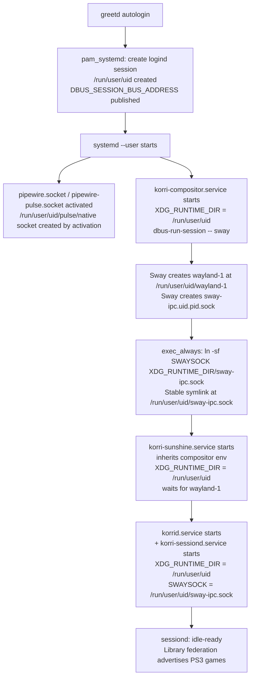
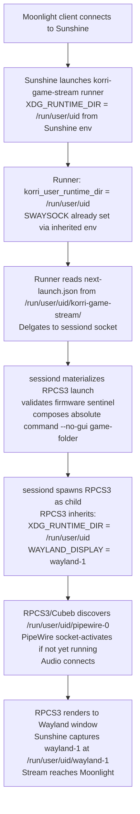

# Runtime-Session Contract: Flow Completeness and Edge Cases

**Date:** 2026-07-02
**Scope:** x86 source-machine XDG_RUNTIME_DIR canonicalization proposal (`x86-pipewire-audio-proposal.md`)
**Trigger:** RPCS3/Cubeb audio failure on Aka caused by private `XDG_RUNTIME_DIR=/run/user/1000/korri-compositor` inherited by sessiond children

---

## Phase 1: Ground in Codebase

### Environment propagation chain (current)

```
korri-compositor.nix (default runtimeDir = "%t/korri-compositor")
  → source-machine.nix: services.korri.sessiond.extraEnvironment.XDG_RUNTIME_DIR = compositorCfg.runtimeDir
  → korri-sessiond.nix: systemd.user.services.korri-sessiond.environment (systemd expands %t specifiers)
  → korri-sessiond spawns RPCS3 (inherits XDG_RUNTIME_DIR = /run/user/1000/korri-compositor)
  → RPCS3 Cubeb looks for /run/user/1000/korri-compositor/pipewire-0 (MISSING)
```

### Sunshine environment inheritance (from `korri-daemon.nix` lines 979–1036)

`korri-sunshine.service` is built explicitly:
```nix
compositorEnv = lib.filterAttrs (n: _: n != "PATH") (compositorUnit.environment or { });
environment = compositorEnv // { WAYLAND_DISPLAY = "wayland-1"; } // ...
```

Sunshine **directly inherits the compositor's full environment** (minus PATH). After the fix:
- Old: compositor `XDG_RUNTIME_DIR = /run/user/1000/korri-compositor` → Sunshine looks for Wayland at `/run/user/1000/korri-compositor/wayland-1`
- New: compositor `XDG_RUNTIME_DIR = /run/user/1000` → Sunshine looks for Wayland at `/run/user/1000/wayland-1` ✓

### RuntimeDirectory ownership difference

| runtimeDir | RuntimeDirectory directive | Cleanup on stop | Owns directory |
|---|---|---|---|
| `%t/korri-compositor` | `RuntimeDirectory = korri-compositor` | Yes (systemd) | Korri service |
| `%t` | None (logind owns it) | No (logind owns it) | logind/pam_systemd |

`ownsRuntimeDir` is computed as:
```nix
ownsRuntimeDir = cfg.sessionBus.mode == "private" && runtimeDirIsSystemdRuntimeDirectory;
// runtimeDirIsSystemdRuntimeDirectory = lib.hasPrefix "%t/" cfg.runtimeDir (NOT exact %t)
```
When `runtimeDir = "%t"` (exact), `runtimeDirIsSystemdRuntimeDirectory = false` → `ownsRuntimeDir = false` → no `RuntimeDirectory=` directive.

### Stable Sway IPC symlink mechanism

From `swayConfigPrelude` in `korri-compositor.nix`:
```bash
exec_always /bin/sh -c 'if [ -n "${SWAYSOCK:-}" ]; then ln -sf "$SWAYSOCK" "$XDG_RUNTIME_DIR/sway-ipc.sock"; fi'
```
`$SWAYSOCK` here is Sway's own runtime variable (the volatile `sway-ipc.<uid>.<pid>.sock`), not the systemd unit environment value. After the fix, the stable symlink is at `/run/user/<uid>/sway-ipc.sock`.

### SWAYSOCK propagation

```
systemd unit Environment: SWAYSOCK = "%t/sway-ipc.sock"
  → systemd expands to: SWAYSOCK = /run/user/1000/sway-ipc.sock  [for korri-sessiond]
  → korri-sunshine inherits compositorEnv which has SWAYSOCK = /run/user/1000/sway-ipc.sock
  → game-stream runner inherits from Sunshine → SWAYSOCK already set → auto-discovery loop skipped
```

### greetd / logind session boundary

`korri-login.nix` uses greetd with `autologin = true` and `pam_systemd` in the PAM stack. This:
1. Creates a real logind session → `/run/user/<uid>` created by logind
2. Starts `systemd --user` for that user
3. `pam_systemd` sets `DBUS_SESSION_BUS_ADDRESS=unix:path=/run/user/<uid>/bus` in user manager env

Therefore `/run/user/<uid>` **does** exist before any user services start, and the logind D-Bus session bus **is** at the canonical location. The greetd dependency on `systemd-user-sessions.service` ensures ordering.

---

## Phase 2: User Flows

### Flow 1 — Boot → compositor ready → sessiond idle-ready



### Flow 2 — Moonlight connect → RPCS3 spawn → audio up



### Flow 3 — RPCS3 audio failure → recovery

```
RPCS3 running → PipeWire-pulse socket closes (restart/crash)
  → Cubeb: "Backend stopped unexpectedly. Attempting to recover..."
  → RPCS3 re-connects to /run/user/uid/pulse/native (socket-activated, re-created by pipewire-pulse)
  → Recovery succeeds  [NEW: works because XDG_RUNTIME_DIR points at canonical location]
  → [OLD: recovery fails because /run/user/uid/korri-compositor/pulse/native never existed]
```

### Flow 4 — Compositor crash → restart → sessiond reconnection

```
Sway crashes
  → korri-compositor.service: Restart=always, RestartSec=2
  → New Sway starts at /run/user/uid/sway-ipc.uid.newpid.sock
  → exec_always updates /run/user/uid/sway-ipc.sock symlink → newpid socket
  → korri-sessiond SWAYSOCK = /run/user/uid/sway-ipc.sock (stable)
  → sessiond re-acquires compositor via symlink [works IF sessiond re-opens socket on each use]

  → OLD /run/user/uid/wayland-1: wlroots probes on startup, detects dead socket, removes, re-creates
  → Sunshine waitForWaylandSocket: polls until /run/user/uid/wayland-1 is a live socket  [RACE - see Gap 2]
```

### Flow 5 — Source-machine teardown / user session end

```
logind session ends (logout, reboot)
  → systemd --user stops: korri-sessiond, korri-sunshine, korri-compositor stop
  → /run/user/uid/ removed by logind (all socket files, including sway-ipc.*.sock, cleaned atomically)
  → Next boot: fresh /run/user/uid/ created by logind
```

---

## Phase 3: Gaps

### Critical

#### Gap C1 — `sessionBus.mode = "private"` interaction at `%t` is unspecified

**What's missing:** `source-machine.nix` does not override `compositor.sessionBus.mode`. The default is `"private"`, meaning the compositor runs `dbus-run-session -- sway`. This creates a private D-Bus session for Sway's process tree.

The proposal aims for "D-Bus and other freedesktop services discoverable by their normal rules." RPCS3 launched from sessiond is **not** in Sway's process tree. It discovers D-Bus via `$DBUS_SESSION_BUS_ADDRESS` (from user manager env, set by `pam_systemd` to `unix:path=/run/user/<uid>/bus`) or by XDG fallback to `$XDG_RUNTIME_DIR/bus`. With the fix (`XDG_RUNTIME_DIR = /run/user/<uid>`), the XDG fallback resolves to `/run/user/<uid>/bus`. This is the systemd logind bus. ✓

However, `dbus-run-session` behavior when `DBUS_SESSION_BUS_ADDRESS` is already set in the inherited environment is implementation-dependent: it **may** pass through the existing address or **may** create a new private bus. The greetd/pam_systemd path publishes `DBUS_SESSION_BUS_ADDRESS` into the user manager environment, which `korri-compositor.service` inherits. If `dbus-run-session` detects the existing bus and passes through, there is one shared bus (correct). If it creates a second bus, the compositor tree gets a private bus and sessiond children get the logind bus (also acceptable but worth validating).

**Why it matters:** If `RPCS3` attempts a D-Bus call to a portal service (xdg-desktop-portal, file-chooser, or dbus-activated media sessions) and lands on the wrong bus, the call silently fails or hangs. This is a launch-experience regression, not an audio regression.

**Default assumption:** `dbus-run-session` detects the existing `DBUS_SESSION_BUS_ADDRESS` from the user manager env and passes through. Source-machine does not need to change `sessionBus.mode`. But the validation plan should explicitly verify `$DBUS_SESSION_BUS_ADDRESS` in RPCS3's process environment and confirm a D-Bus round-trip works from a sessiond child.

---

#### Gap C2 — Stale Wayland socket `wayland-1` after compositor crash

**What's missing:** With `runtimeDir = "%t/korri-compositor"`, systemd's `RuntimeDirectory` directive owns `/run/user/<uid>/korri-compositor/` and removes it (including the Wayland socket) when the compositor service stops. With `runtimeDir = "%t"`, there is no `RuntimeDirectory` directive. Socket files in `/run/user/<uid>/` are only cleaned when the logind session ends.

wlroots probes stale Wayland sockets on startup: it attempts to connect to an existing `wayland-1` socket file, and if connection fails, removes the stale file and creates a fresh socket. This is the normal wlroots path and should work.

But `korri-sunshine.service`'s `waitForWaylandSocket` pre-start check uses `[ -S "$socket" ]` (tests if the path is a socket inode), not a live connection probe. During the brief window between Sway starting and wlroots cleaning the stale socket (on a crash restart), `[ -S ]` returns true for the stale socket. Sunshine proceeds and then fails to connect to the dead socket.

**Why it matters:** Compositor crash recovery (Restart=always) would leave Sunshine wedged after recovery. The service would need another restart to recover. On SM8550, this window is less likely because the `runtimeDir = "%t"` private dir is always cleaned on stop. Source-machine now loses that implicit cleanup.

**Default assumption:** wlroots cleans up stale sockets reliably enough that the race is vanishingly rare. However, the Sunshine `waitForWaylandSocket` probe should be hardened to use a connection attempt rather than a socket file existence check when the contract changes from private runtime dir to shared user runtime dir. Flag as a follow-up hardening item.

---

#### Gap C3 — PipeWire availability on source-machine is host-owned, not module-guaranteed

**What's missing:** The proposed change fixes `XDG_RUNTIME_DIR` to point at the canonical user runtime, but audio **actually works** only if PipeWire-pulse is configured for that user. On Aka, Mountainous provides `services.pipewire.*`. A future source-machine host that does not configure PipeWire manually and does not enable the optional `korri-x86-audio.nix` module will silently fail audio despite the XDG_RUNTIME_DIR fix.

The proposal places the PipeWire defaults in a separate optional module (`korri-x86-audio.nix`) rather than making them a `source-machine.nix` default. This means the fix is composable but not complete for the generic source-machine contract.

**Why it matters:** Any future host that imports `korri-source-machine` and expects source-machine streaming to work out of the box will not get audio without an additional explicit opt-in. The proposal's scope note "Scope this to x86 source-machine posture first" implies this is deferred, but the contract for `korri-source-machine` module consumers is left underspecified.

**Default assumption:** Aka-specific fix is the immediate goal. Document that `korri-x86-audio.nix` must be imported and enabled on any x86 source-machine host that does not bring its own PipeWire configuration. Add this to the module's README or a docs note.

---

### Important

#### Gap I1 — Wayland socket name collision with canonical user runtime

With `runtimeDir = "%t"`, Sway creates `wayland-1` at `/run/user/<uid>/wayland-1`. The compositor service environment and Sunshine both hardcode `WAYLAND_DISPLAY = "wayland-1"`. If the same UID is running another Wayland compositor (e.g., an existing desktop session, a nested test compositor, or another Sway instance), that process may already own `/run/user/<uid>/wayland-1`. Sway will increment to `wayland-2`, `wayland-3`, etc., but the hardcoded `WAYLAND_DISPLAY = "wayland-1"` in Sunshine's environment means Sunshine's `waitForWaylandSocket` never finds the real socket.

With the old `runtimeDir = "%t/korri-compositor"`, the Wayland socket was isolated in a private subdirectory. No naming conflict was possible.

**Why it matters:** On Aka as a headless source-machine appliance this is unlikely. On developer machines running Korri source-machine in parallel with a desktop session this will fail silently (Sunshine times out, RPCS3 never streams). The failure mode produces a 10-second timeout from `waitForWaylandSocket` and then Sunshine fails to start — no user-visible error in the Korri UI.

**Default assumption:** Aka is a headless appliance. Add a documentation note that source-machine with `runtimeDir = "%t"` assumes the Korri compositor is the only Wayland compositor for that UID. Future work: detect the actual `WAYLAND_DISPLAY` Sway chose and propagate it dynamically instead of hardcoding `wayland-1`.

---

#### Gap I2 — No source-machine assertion verifying `compositorCfg.runtimeDir = "%t"`

**What's missing:** The proposal adds `lib.mkDefault "%t"` in `source-machine.nix`. An operator or downstream host can override `services.korri.compositor.runtimeDir` back to `"%t/something"`, silently restoring the audio regression. The existing source-machine assertions check only the three-way sessiond/daemon/gameStream socket consistency, not the compositor runtime dir.

Current assertions:
```nix
assertion = config.services.korri.sessiond.enable;
assertion = config.services.korri.sessiond.socketPath == sessiondSocketPath
  && config.services.korri.daemon.sessiond.socketPath == sessiondSocketPath
  && config.services.korri.gameStream.sessiond.socketPath == sessiondSocketPath;
```

Neither asserts that `compositorCfg.runtimeDir == "%t"`.

**Why it matters:** The audio regression is a silent runtime failure. A Nix evaluation-time assertion catches it before a deployment reaches Aka.

**Suggested fix:**
```nix
{
  assertion = compositorCfg.runtimeDir == "%t";
  message = ''
    Korri source-machine composition sets XDG_RUNTIME_DIR from
    services.korri.compositor.runtimeDir. Using a private subdirectory
    (e.g. "%t/korri-compositor") prevents PipeWire-pulse and PipeWire socket
    discovery under the canonical user runtime. Set runtimeDir to "%t" to
    keep audio, D-Bus, and portal services discoverable by their standard
    paths. Override with lib.mkForce only when you have an explicit audio
    escape-hatch plan.
  '';
}
```

---

#### Gap I3 — Audio readiness gate condition is unspecified ("only if launch races persist")

**What's missing:** The proposal offers an optional "source-machine audio readiness gate" but doesn't define the observable condition that requires it. On x86 with PipeWire socket activation, the Pulse socket (`/run/user/<uid>/pulse/native`) is created by the user manager when the socket unit activates, before any process connects. This means there is no meaningful race between PipeWire-pulse and korri-sessiond startup.

However, the proposal is correct that the gate should exist *if* PipeWire uses direct socket (not activation), or if the host does not enable socket activation. The proposal says "Add a lightweight source-machine audio readiness check only if launch races persist" — but the criterion for "launch races persist" is not defined.

**Why it matters:** Without a concrete criterion, implementers will either always add the gate (unnecessary ordering cost) or never add it (no protection for non-socket-activated PipeWire hosts). SM8550 has an explicit `korri-rocknix-audio-bootstrap` ordering gate. Source-machine skipping the gate is fine for socket-activated PipeWire but needs to be justified.

**Default assumption:** x86 source-machine with `services.pipewire.pulse.enable = true` uses systemd socket activation. Gate is not required. Document this assumption explicitly: "PipeWire-pulse socket activation provides the Pulse socket before any Korri user service starts; an explicit ordering gate is not required for socket-activated PipeWire configurations."

---

#### Gap I4 — Sunshine `streaming.audio.pulseServer` vs. implicit XDG_RUNTIME_DIR discovery

**What's missing:** Sunshine's audio for stream capture has two paths:
1. Explicit: `services.korri.daemon.streaming.audio.pulseServer = "unix:/run/user/1000/pulse/native"` → `PULSE_SERVER` set in `korri-sunshine.service` environment
2. Implicit: `streaming.audio.pulseServer = null` → Sunshine uses `$XDG_RUNTIME_DIR/pulse/native` via libpulse auto-discovery

The proposal says "do not set `PULSE_SERVER` or `PIPEWIRE_RUNTIME_DIR` by default" and mentions "confirm Sunshine no longer logs `Couldn't connect to pulseaudio`". The observed Sunshine audio error was presumably caused by `XDG_RUNTIME_DIR=/run/user/1000/korri-compositor` in Sunshine's inherited compositor environment (no pulse socket there). The fix changes Sunshine's `XDG_RUNTIME_DIR` to `/run/user/1000`, enabling implicit libpulse discovery at `/run/user/1000/pulse/native`.

This relies on implicit discovery (path 2). But if any Mountainous Aka configuration already sets `streaming.audio.pulseServer`, path 1 wins regardless of the XDG_RUNTIME_DIR fix.

**Why it matters:** The validation step "confirm Sunshine no longer logs `Couldn't connect to pulseaudio`" passes in both cases (explicit server or fixed implicit discovery), but for different reasons. If Mountainous sets an explicit server that still points to the wrong path, the fix would appear to work but wouldn't.

**Recommended question (Q5 below) addresses this.**

---

### Minor

#### Gap M1 — `korri-compositor-exec` socket fallback with multiple `sway-ipc.*.sock` files

The `korri-compositor-exec` SWAYSOCK fallback loop:
```bash
for candidate in "$runtime_dir"/sway-ipc.*.sock; do
  if [ -S "$candidate" ]; then
    sway_socket="$candidate"
    break
  fi
done
```

With `runtime_dir = /run/user/<uid>`, this scans for `sway-ipc.*.sock`. Dead socket files from previous Sway crashes (which `[ -S ]` returns true for — it tests the file type, not liveness) could be matched before the live socket. However, in normal flow, `SWAYSOCK` is already set via inherited environment and the fallback loop is skipped. This is low-risk but represents a correctness gap in the fallback path.

**Default assumption:** The fallback path is for operators running `korri-compositor-exec` manually outside the normal service chain. Add a note to `korri-compositor-exec` documentation that the fallback socket search may hit dead socket files in the shared user runtime directory.

---

#### Gap M2 — Missing Nix eval check that `korri-sunshine` environment reflects compositor runtimeDir change

`korri-daemon.nix` constructs `korri-sunshine.service.environment` by reading `compositorUnit.environment`. No Nix module check verifies that after a change to `compositor.runtimeDir`, the resulting sunshine service environment has the correct `XDG_RUNTIME_DIR` and `SWAYSOCK` values.

The live validation plan covers this (check actual service environment on Aka), but a module eval check would catch regressions in CI without requiring a live device.

---

#### Gap M3 — `WAYLAND_DISPLAY` socket name is not dynamically discovered

Both `korri-sessiond.extraEnvironment.WAYLAND_DISPLAY = "wayland-1"` (source-machine.nix) and `korri-sunshine.service.environment.WAYLAND_DISPLAY = "wayland-1"` (korri-daemon.nix) hardcode `wayland-1`. Sway may pick a different socket name if `wayland-1` is taken. The proposal adds a comment in the daemon module ("Hosts whose sway picks a different socket name need to override this"), but the source-machine composition doesn't document this gap, and there's no mechanism for Sunshine's `waitForWaylandSocket` to retry a discovered name.

---

## Phase 4: Questions

### Q1 (Critical) — What is RPCS3's D-Bus bus address in the post-fix environment?

**Question:** After changing `compositor.runtimeDir` to `"%t"`, what does `$DBUS_SESSION_BUS_ADDRESS` look like in an RPCS3 process launched by sessiond? Is it the logind/pam_systemd bus at `unix:path=/run/user/1000/bus`, the compositor's `dbus-run-session` private bus, or absent?

**Stakes:** RPCS3 may use D-Bus for file access, portal calls, or media session management. A wrong or absent bus address silently blocks these operations.

**Default assumption:** `pam_systemd` sets `DBUS_SESSION_BUS_ADDRESS` in the user manager environment during greetd login. `dbus-run-session` detects the existing address and passes it through. Sessiond inherits the user manager env. RPCS3 gets the logind bus. Validate with `cat /proc/$(pidof RPCS3)/environ | tr '\0' '\n' | grep DBUS` on Aka after the fix.

---

### Q2 (Critical) — Does the compositor crash → restart path leave `/run/user/<uid>/wayland-1` as a stale socket that passes `[ -S ]` for Sunshine's preflight?

**Question:** After a Sway crash and restart (RestartSec=2), is there a window where `korri-sunshine.service`'s `waitForWaylandSocket` check sees the stale `wayland-1` socket (socket inode still exists, wlroots hasn't probed it yet), proceeds to start Sunshine, and then Sunshine fails to capture because wlroots then removes and re-creates the socket?

**Stakes:** Silent streaming failure after compositor crash recovery. The service would need a second restart to recover.

**Default assumption:** wlroots probes and removes stale socket files faster than Sunshine's RestartSec=5 triggers a new start attempt. In practice this race window is <100ms. Accept as a low-probability operational risk. Document in the RPCS3 plugin operational notes. Consider hardening `waitForWaylandSocket` to attempt a Wayland protocol connection (not just file existence) as a follow-up.

---

### Q3 (Important) — Does Aka's Mountainous configuration explicitly set `streaming.audio.pulseServer`, or does Sunshine rely on implicit `$XDG_RUNTIME_DIR/pulse/native` discovery?

**Question:** Does `Mountainous: hosts/aka/default.nix` or `Mountainous: features/gaming/rpcs3.nix` set `services.korri.daemon.streaming.audio.pulseServer` to an explicit path? If yes, the path must point to `/run/user/1000/pulse/native` (not `/run/user/1000/korri-compositor/pulse/native`).

**Stakes:** If an explicit `pulseServer` is already configured with the old path, the XDG_RUNTIME_DIR fix won't resolve Sunshine's audio error. The Mountainous config may need a separate update.

**Default assumption:** Aka does not set `streaming.audio.pulseServer` explicitly and relies on implicit discovery. The XDG_RUNTIME_DIR fix is sufficient. Verify by checking `systemctl --user show korri-sunshine.service -p Environment` for `PULSE_SERVER` before and after the fix.

---

### Q4 (Important) — Should source-machine add an assertion that `compositor.runtimeDir == "%t"`, or is `mkDefault` sufficient?

**Question:** Should `source-machine.nix` add a Nix assertion that `services.korri.compositor.runtimeDir == "%t"`? Or is `mkDefault` sufficient, allowing operator overrides with explicit acknowledgment?

**Stakes:** A silent override restores the audio regression. The failure mode is a working Nix eval but a broken live system — exactly the kind of gap assertions are designed to catch.

**Default assumption:** Add the assertion. The proposal's risk section already identifies this as a known override concern. The source-machine's session environment is tightly coupled to `compositor.runtimeDir`; overriding it without also adjusting sessiond env, SWAYSOCK, and Sunshine would produce a broken composition. The assertion makes that constraint explicit.

---

### Q5 (Important) — Is the optional `korri-x86-audio.nix` module a prerequisite for the XDG_RUNTIME_DIR change, or a separate follow-up?

**Question:** The proposal separates "fix XDG_RUNTIME_DIR" (source-machine.nix change) from "add PipeWire defaults" (korri-x86-audio.nix). For Aka, Mountainous provides PipeWire, so the fix works. But:
1. Should `korri-x86-audio.nix` be imported by `source-machine.nix` with `mkDefault` options, making it part of the baseline source-machine contract?
2. Or should it remain a separate opt-in module that hosts must explicitly enable?

**Stakes:** If left as opt-in, new source-machine hosts get silent audio failures until they discover and enable the module. If included in source-machine.nix, hosts with intentional non-PipeWire audio setups must explicitly disable it, but the module uses `mkDefault` so that override path is clean.

**Default assumption:** The proposal says "scope to x86 source-machine posture first" — import `korri-x86-audio.nix` inside `source-machine.nix` with all options `mkDefault`, behind a `services.korri.x86Audio.enable = lib.mkDefault pkgs.stdenv.hostPlatform.isx86_64` gate. This ensures new source-machine hosts get working audio without manual configuration, while existing hosts with different audio topologies can override cleanly.

---

### Q6 (Important) — What happens to `WAYLAND_DISPLAY` if `/run/user/<uid>/wayland-1` is already taken?

**Question:** If the source-machine UID's user runtime already has a live `wayland-1` socket (e.g., from a developer desktop session on the same machine), Sway picks `wayland-2`. Both the source-machine compositor environment and Sunshine hardcode `WAYLAND_DISPLAY = "wayland-1"`. Sunshine's preflight times out. Is there a discoverable failure mode, or does it fail silently?

**Stakes:** This is the primary regression risk for developer environments where Korri source-machine is used non-exclusively. On Aka as a dedicated appliance, this doesn't apply. On dev machines, it breaks streaming silently.

**Default assumption:** Add a `waitForWaylandSocket` failure log that names the expected socket path (already does this: "timed out waiting for $socket after 10s"). Document in source-machine module description that the host UID must not run a concurrent Wayland compositor. Future work: detect the actual socket Sway used and propagate it.

---

### Q7 (Minor) — What is the `dbus-run-session` behavior when `DBUS_SESSION_BUS_ADDRESS` is already in the environment?

**Question:** Does `dbus-run-session` on the NixOS-configured greetd source-machine detect an existing `DBUS_SESSION_BUS_ADDRESS` from the user manager env (set by `pam_systemd`) and pass through, or does it always create a private bus?

**Stakes:** If it always creates a private bus, the compositor and its process tree use a different D-Bus session than Sunshine and sessiond children. This is benign for audio (audio clients use PipeWire directly), but means D-Bus-activated services started by RPCS3 (via sessiond) land on a different bus than services started by anything in Sway's process tree.

**Default assumption:** GNU's `dbus-run-session` docs say: "If DBUS_SESSION_BUS_ADDRESS is already set, just run the command." This is the expected behavior on systemd/logind systems. Verify on Aka post-fix: check that `dbus-run-session echo $DBUS_SESSION_BUS_ADDRESS` run by the compositor user outputs the logind bus address, not a new private path.

---

## Recommended Next Steps

These are ordered by impact on the immediate Aka/RPCS3 validation target.

### Before merging `source-machine.nix` runtimeDir change

1. **[Q4] Add Nix assertion** that `services.korri.compositor.runtimeDir == "%t"` in source-machine composition. This is mechanical and makes the audio contract explicit in CI without a live device.

2. **[C3 / Q5] Clarify the `korri-x86-audio.nix` import strategy.** Decide before implementation whether the PipeWire defaults module is imported by `source-machine.nix` (recommended) or left as a manual host opt-in. This decision affects whether the RPCS3 plan's U4 "source-machine-safe module wiring" needs to address audio or can assume host-managed audio.

3. **[C1 / Q7] Add live D-Bus validation step** to the Aka validation plan: confirm `DBUS_SESSION_BUS_ADDRESS` in a sessiond-launched process uses the logind bus, not a private bus. Add alongside the existing "confirm `systemctl --user show korri-sessiond.service -p Environment`" step.

### During Aka live validation

4. **[Q3] Check Sunshine's `PULSE_SERVER`** explicitly: `systemctl --user show korri-sunshine.service -p Environment | grep PULSE_SERVER`. If explicit, verify path is `/run/user/1000/pulse/native`. If absent, implicit discovery is in use — confirm `pactl info` works from Sunshine's user context.

5. **[I1 / Q6] Check for competing Wayland socket** on Aka: `ls -la /run/user/1000/wayland-*` before starting the compositor. Verify only `wayland-1` is created post-start, not `wayland-2`.

6. **[I4] Verify Sunshine's `XDG_RUNTIME_DIR`** after the runtimeDir change: `systemctl --user show korri-sunshine.service -p Environment | grep XDG_RUNTIME_DIR`. Should be `/run/user/1000`, not `/run/user/1000/korri-compositor`.

### Follow-up hardening (post-Aka validation)

7. **[C2] Harden `waitForWaylandSocket`** to use a connection probe instead of `[ -S ]`. A connection attempt (e.g., `wl-info` or a minimal wayland-scanner client) detects a live socket rather than a stale inode. This is a resilience improvement for compositor crash recovery.

8. **[M1] Document `korri-compositor-exec` fallback limitation** in its `--help` output: with `runtimeDir = "%t"`, the `sway-ipc.*.sock` glob may find stale dead socket files. Recommend setting `SWAYSOCK` explicitly when calling the helper outside the normal service chain.

9. **[I1 / Gap M3] Track dynamic `WAYLAND_DISPLAY` discovery** as a follow-up backlog item. Currently both compositor env and Sunshine env hardcode `wayland-1`. A mechanism to read the actual socket name Sway chose (e.g., from Sway's journal or a sidecar file at a stable path) would make the composition resilient to socket name conflicts.

---

## Summary of Proposal Correctness

The core XDG_RUNTIME_DIR fix is **sound**. The inheritance chain from `compositor.runtimeDir` → `sessiond.extraEnvironment.XDG_RUNTIME_DIR` → RPCS3 process environment → PipeWire socket discovery is correctly traced. The same inheritance flows through `compositorEnv` into `korri-sunshine.service`, so Sunshine's Wayland capture and its own audio discovery are also fixed by the same change.

The proposal's identified risks (concurrent desktop session, source-machine appliance assumption) are real but bounded to the stated scope. The non-goals (ROCKNIX, base compositor default, Aka USB/SPDIF sink) are correctly excluded.

**The five things most likely to require follow-up action before or during implementation:**
1. Source-machine Nix assertion for `runtimeDir == "%t"` (Gap I2 / Q4)
2. D-Bus session bus validation on Aka (Gap C1 / Q1, Q7)
3. Clarification of `korri-x86-audio.nix` import strategy (Gap C3 / Q5)
4. Sunshine `PULSE_SERVER` audit on Aka (Gap I4 / Q3)
5. Documentation that source-machine + `%t` assumes no concurrent Wayland compositor (Gap I1 / Q6)
