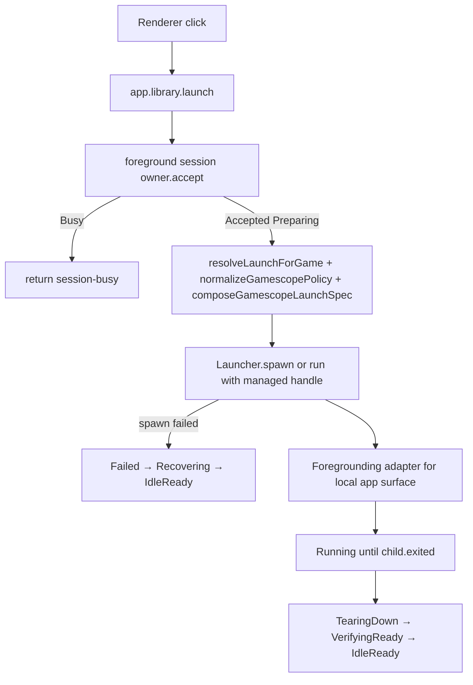

# Flow analysis: Phase 4 foreground/session adapter coverage (roadmap + first slice)

Scope reviewed: Phase 4 broader-adapter-coverage roadmap, with only the first slice executable. First slice routes local app / emulator launches via `app.library.launch` (and the existing Gamescope-wrapped child path used by `handleLaunchLibrary`) through the same generic foreground/session lifecycle owner used by Phase 1's Moonlight bridge. Cloud gaming / source-machine adapters, Sunshine-side launches, and idle-blank graphical-session restore remain deferred.

## Codebase context

Phase 1–3 surfaces already in tree:

- Generic lifecycle types live in `korri/shared/stream/foreground-session-lifecycle.ts` and the desktop owner lives in `korri/deploy/desktop/foreground-session-owner.ts`. The owner is generic over `prepare → spawn → foreground → teardown → verifyReady → launched`, holds at most one active session, and rejects re-entry with `Busy` until the managed child's `exited` resolves.
- Today the only adapter wired to that owner is the Moonlight/Gamescope path in `korri/deploy/desktop/launch-bridge.ts` (`createLaunchBridgeForegroundSessionOwner`). The owner is created per-handler and the desktop composition holds a reference for shutdown / status snapshot.
- The "local app / emulator" path runs through a different stack entirely:
  - Renderer-side launcher selection is `selectLauncherLayer(runtimeConfig)` in `korri/deploy/portal/select-launcher-layer.ts`: desktop builds get `LauncherLayerBridge` (→ `app.desktop.launch`, Moonlight-only today); non-desktop builds get `LauncherLayerRpc` (→ `app.library.launch`).
  - `app.library.launch` is handled by `korri/products/app/api/library/launch.rpc-handler.ts`. It pulls a `Launcher` Effect service, resolves Gamescope policy via `normalizeGamescopePolicy` + `composeGamescopeLaunchSpec`, and calls `Launcher.run(spec)`.
  - The `Launcher` interface (`korri/shared/library/library-services.ts` + `korri/shared/library/launcher.ts`) is fire-and-block: `run(spec) → LaunchResult` after the child exits. Implementations are `LauncherLayerLive` (ShellLauncher / sessiond) and the in-memory test layer.
  - `LaunchLibraryResponse` has only `launched | failed{exitCode, stderrTail}`. There is no `session-busy` category and no `failureKind` field on the wire. `LauncherLayerRpc` therefore cannot emit `session-busy` to the renderer the way `LauncherLayerBridge` already can.
- `tools/device/sessiond-state.ts` + `sessiond.ts` is a second, parallel session state machine (home → launching → game → restoring → recovering) used when `KORRI_SESSIOND_URL` is set. It already enforces "launch only from home" and already owns its own child handle. The new lifecycle owner overlaps with it.
- Foreground surface repair (`tools/device/game-stream-fullscreen.ts`, `MoonlightForegroundRepair` in the launch bridge) is wired bridge-locally and assumes Moonlight/Sway surface naming for `snapshotSurfaceIds` / `repairSurface`. Nothing equivalent is wired to `Launcher`-backed local apps today.

## User flows (Phase 4 first slice)

### F4.1 — Local app launch from the renderer on a non-desktop runtime

Entry: Player selects a local game/emulator. `LauncherLayerRpc` posts `app.library.launch` to the Korri server.

Happy path: owner accepts from `IdleReady`, resolves Gamescope policy, spawns wrapped child with a managed handle, transitions through `Foregrounding`/`Running`, and returns from RPC. The owner stays non-idle until child exit.

Terminal: child exits (any code) → teardown → readiness → `IdleReady`. RPC response shape is the open question: today `app.library.launch` blocks until exit; with an owner-mediated path it can return on `Running` (handle-based) or still block (await `exited`).

### F4.2 — Local app launch on the desktop runtime

Entry: Player selects a local game on a Korri desktop kiosk build that also has the Moonlight bridge.

Two acceptable routings; the plan must pick one:

- (a) Renderer continues to call `app.library.launch` over RPC even on desktop, and the API-side owner serializes against the desktop bridge's owner. This requires one owner shared across both RPCs, not two parallel owners.
- (b) `LauncherLayerBridge` learns to route local app launches through the desktop bridge (`app.desktop.launch` gains a local-app intent, or a new `app.desktop.launchLibrary` RPC), so the single desktop owner sees every launch.

In either case the lifecycle owner must be exactly one per foreground-session host (R14). Two adapters → one owner.

### F4.3 — Re-entry across adapters

Entry: a Moonlight stream is already in `Running` and a second renderer click triggers `app.library.launch` for a local app (or vice versa).

Expected: the owner returns `Busy` regardless of which adapter is currently active. The local-app RPC must surface a typed `session-busy` outcome to the renderer (today it cannot — there is no schema slot).

### F4.4 — Local app exits while Korri server is offline / process restarts

Entry: child exits cleanly; RPC connection has dropped or the server process restarted between launch and exit.

Today: `Launcher.run` blocks until exit and then returns; the server is the supervising process. With an owner-mediated handle path, the owner's `observeExit` runs in the same process. If the process restarts, the lifecycle resets to `IdleReady` and the handle is lost.

Open question: does the local-app RPC remain blocking-until-exit (preserves current contract, blocks the renderer's open RPC for the whole gameplay session) or returns immediately on `Running`? Both have user-visible consequences.

### F4.5 — Sessiond-backed local launches

Entry: `KORRI_SESSIOND_URL` is set; `LauncherLayerLive` chooses `createSessionLauncherFromEnv()`. The launcher POSTs to a remote `sessiond` which already implements its own home/launch/game/restore state machine.

Expected: only one supervisor governs the host's foreground state. The plan must say whether the Korri-server-side owner becomes a thin proxy in this mode (delegating accept/reject to sessiond's existing invariants) or whether sessiond is the owner and the Korri-server owner is bypassed when sessiond is configured.

### F4.6 — Gamescope opt-out on a local app (AE3 / R7)

Entry: the cascade resolves `gamescope: { enabled: false }` for a specific game/profile.

Expected: lifecycle ownership still applies. The owner still rejects re-entry; teardown / readiness still run; restore still fires. The Gamescope adapter step in `composeGamescopeLaunchSpec` is a no-op but the foreground-session adapter remains active.

## Gaps

Ordered by severity. Many items below are first-slice blockers; items marked **roadmap** affect later Phase 4 slices the plan should call out without solving today.

### Critical

C1. **One-owner-per-host is not enforced when two adapters exist.** R14 is satisfied today only because Moonlight is the only owner-bound adapter. The first slice introduces a second adapter (`app.library.launch`). If each handler instantiates its own `createForegroundSessionOwner`, two foreground sessions can be active simultaneously and the entire re-entry guarantee evaporates. Today the desktop bridge's owner is created per-handler (`createLocalStreamLaunchRpcHandler`) and there is no shared singleton.

  - Codebase note: `korri/deploy/desktop/main.ts` already keeps `activeMoonlightChild`-style host-level state, but the lifecycle owner lives inside the bridge handler factory. Phase 4 needs a host-local "ForegroundSessionHost" composition that both `app.desktop.launch` and `app.library.launch` resolve through.
  - Default: introduce a single `ForegroundSessionHost` in the desktop deploy composition (and an equivalent in the Korri-server composition where `app.library.launch` actually runs). Both RPC handlers receive the same owner. Renderer transport choice (`LauncherLayerBridge` vs `LauncherLayerRpc`) is decoupled from adapter routing.

C2. **`Launcher` service is fire-and-block — incompatible with the owner's managed-handle contract.** `Launcher.run(spec)` resolves after the child exits, with no `exited` promise, `terminate`, or `processId`. The owner's `spawn` stage requires `ForegroundManagedSessionHandle`. There is no current path from `handleLaunchLibrary` to feeding a handle into the owner without changing the interface.

  - Default for first slice: add a sibling `spawn` capability to `LauncherService` (e.g. `spawn(spec) → ManagedLaunchHandle` returning `{ id, processId, exited, terminate, terminateNow, isGone? }`), implement it in `createShellLauncher` (it already has `proc` with `exited`/`kill`), implement it for the sessiond launcher behind a session-side `/spawn` capability or refuse to participate (fail-closed), and leave `run` as a convenience wrapper. Update the in-memory layer to accept handle-shaped behavior.
  - Existing precedent: `tools/device/game-stream-runner.ts` already uses a `ManagedChildSpawner` shape with handle semantics. Mirror that vocabulary.

C3. **`LaunchLibraryResponse` cannot express `session-busy`.** `korri/products/app/api/library/launch.rpc.ts` has only `launched` and `failed{exitCode, stderrTail}`. `LauncherLayerRpc` therefore cannot map a busy rejection to the renderer's `LaunchFailureKind` (which already has `"session-busy"` for the bridge path). Without this, the first slice silently demotes busy to a generic failure with an arbitrary exit code, breaking parity with the bridge and confusing AE5 ("rejected with not-ready/busy outcome and emits observable rejection event").

  - Default: add `failureKind` (or a `category`) field to the failed variant of `LaunchLibraryResponse`, include `session-busy`, and update `LauncherLayerRpc` to forward it the same way `LauncherLayerBridge` does. Pick a stable exit code (e.g. 121, matching the bridge).

C4. **Sessiond + new owner is a double-owner problem.** When `KORRI_SESSIOND_URL` is set, sessiond is already the foreground supervisor. Layering a second `ForegroundSessionOwner` in front of `Launcher.run` produces two state machines that can diverge: the local owner thinks `IdleReady` while sessiond is still tearing down, or vice versa. The brainstorm's R10 says all launches should route through one contract.

  - Default for first slice: when `createSessionLauncherFromEnv()` resolves to a sessiond launcher, the API-side owner must either (a) delegate accept/reject to sessiond's state via a status read and skip its own state machine, or (b) treat sessiond's response as the authoritative outcome and the local owner as a no-op pass-through. Document explicitly which one and add a single integration test to prove it.
  - **Roadmap:** longer term, sessiond grows a typed busy outcome and lifecycle events that the owner consumes as adapter evidence (Phase 4 later slice or Phase 2 readiness work).

C5. **Foreground repair / surface restore is bridge-private.** Today `MoonlightForegroundRepair` (snapshot/repair/waitAbsence/probeCompositor) is only constructed inside the desktop launch bridge composition (`korri/deploy/desktop/main.ts`). A local-app/emulator launch has its own foreground surface (Gamescope-wrapped emulator window), with potentially different surface names and restore expectations. If the same repair primitives are reused, they need adapter-supplied identifiers; if not, the local-app adapter ships without foreground / readiness evidence and AE7 (operator can see foreground outcome) regresses for local apps.

  - Default for first slice: define a `ForegroundSurfaceAdapter` capability that each adapter supplies (Moonlight passes the existing implementation; local-app adapter starts with a minimal "no repair, no waitAbsence" stub but emits a `surface: { status: "not-tracked" }` evidence record so the snapshot is consistent). Document that local-app foreground repair is a Phase 4 follow-up slice.

C6. **`handleLaunchLibrary` runs in the Korri-server process, not the desktop's Bun.** On a kiosk where the desktop and the Korri server are co-located, "one owner per host" might mean one instance shared between two processes. On a cloud-gaming source machine (no GUI), `app.library.launch` is the only path. The roadmap must say where the owner instance lives in each composition.

  - Default for first slice: scope to the case where `app.library.launch` runs in the same process that hosts the foreground session (kiosk single-Bun build, cloud-gaming source build). For two-process kiosks (desktop Bun + remote Korri server), keep the first slice limited to the desktop bridge's owner and route renderer local-app launches through the desktop bridge (option C1(b)). Cross-process owners are explicitly out of scope for the first slice.

### Important

I1. **Acceptance ordering vs. cascade resolution.** `handleLaunchLibrary` does several things before any spawn: `source.list()` for existence, `resolveLaunchForGame` (which can fail with `LibraryError{reason: "config"}` → typed launch-configuration failure), Gamescope normalisation, then `Launcher.run`. The lifecycle plan must say whether the owner accepts before or after these checks.

  - Stakes: if the owner accepts first and then policy resolution fails, the launch goes through `Failed → Recovering → IdleReady` and a re-entry during that window is rejected as `session-busy`. If the owner accepts after resolution, "unknown game" or "config failure" launches never touch the lifecycle, and a fast retry is allowed.
  - Default: keep request validation (unknown id, configuration failure) outside the owner and only accept once the owner reaches a `prepare` adapter call — mirrors the desktop bridge where `getConnection()` failure becomes a `prepare` failure under the owner. But document the choice and assert it in tests.

I2. **RPC blocking semantics change is not free.** Today `app.library.launch` returns when the child exits. Renderers and tests rely on that. The owner-mediated path most naturally returns on `Running` (with the handle). Switching to non-blocking quietly changes the contract for every consumer (incl. `launch.rpc-handler.test.ts` which currently asserts terminal `exitCode` from the response body).

  - Default: preserve current "block until exit" behaviour by awaiting the handle's `exited` inside the handler before composing the terminal response. The owner observes the same exit independently; both observations are consistent. Document this explicitly because Moonlight returns on Running, not on exit — the two adapters' RPCs intentionally have different return semantics.

I3. **No request-id seam for `app.library.launch`.** Phase 1 introduced `createRequestId` for the desktop bridge. Without one, two simultaneous identical-game launches share the same `gameId` identity and the rejected event is hard to correlate to "which click".

  - Default: identical to bridge — generate a uuid per accepted request, expose it through the lifecycle handle, log it on rejection.

I4. **AE3 / R7 (foreground policy applies even when Gamescope is disabled) is not tested anywhere for local apps.** The existing Phase 1 tests cover Moonlight; the local-app tests in `launch.rpc-handler.test.ts` are pre-lifecycle and assert raw shell behaviour against `fake-game.sh`. Phase 4 must add a test that resolves `gamescope: { enabled: false }` for a local game and still asserts re-entry rejection, lifecycle events, and restore.

I5. **Renderer "launch state" feedback for local-app session-busy.** Phase 3 added a renderer foreground-session gate. `useLibraryLaunchController` may swallow `LaunchFailureKind: "session-busy"` from `LauncherLayerRpc` as a generic failure rather than reusing the bridge's gate semantics. Either:

  - reuse the existing gate state for both transports, or
  - document that the renderer treats the failed-with-`session-busy` as a normal `Failed` launch state for first slice and lifts that into the gate-state later.

  Stakes: cross-adapter UX consistency. Default: map `session-busy` to the existing renderer gate states for both transports — the renderer should not need to know which transport produced the rejection.

I6. **Termination on host shutdown.** The desktop owner exposes `terminateActiveSession`/`terminateActiveSessionNow` and the desktop `main.ts` wires that into shutdown. The Korri-server composition where `app.library.launch` lives does not own shutdown of GUI children today (the shell launcher does, transitively). With the owner in front, shutdown must call the owner, not the launcher.

  - Default: composition root for the chosen process holds the owner and calls `terminateActiveSession` on shutdown. Add a verification test that a SIGTERM during `Running` releases the owner to `IdleReady` cleanly.

I7. **Status snapshot endpoint coverage.** Phase 3 exposed a foreground-session status snapshot from the desktop bridge. After the first slice the status snapshot must reflect either adapter's active session (Moonlight or local app). If the desktop bridge keeps a separate owner from `app.library.launch`'s owner (i.e. C1 unresolved), the status endpoint will only ever see one of them — operators will be misled.

  - Default: status snapshot reads the single host-local owner introduced by C1.

I8. **Sessiond-launcher path lacks a managed-handle contract.** The shell launcher can grow a handle, but `createSessionLauncher` POSTs `/launch` and only gets back a `LaunchResult`. Without a handle, the owner cannot tell `Running` from `Exited` for sessiond launches.

  - Default: define a fail-closed posture for the first slice — if `Launcher.spawn` is not supported by the configured launcher (sessiond without a `/spawn` endpoint), the owner refuses to accept the launch with a typed adapter-unavailable failure rather than silently downgrading to fire-and-block. Roadmap: extend sessiond to expose handle semantics.

### Minor

M1. **`requestIdentity.hostId` is undefined for local-app launches.** The lifecycle type permits it (optional). Tests should assert the local-app adapter never sets `hostId` so future adapters can rely on `hostId !== undefined ⇒ remote`.

M2. **Failure-evidence shape divergence.** The bridge stuffs the failed response into `evidence.response`. A local-app adapter would naturally stuff `{ exitCode, stderrTail }` instead. Without a small convention, `responseFromFailureEvidence` becomes adapter-specific. Default: have each adapter own its `failedLaunchStage` helper and keep the response shape inside its own module.

M3. **`exitCodeForCategory` is duplicated.** Both `LauncherLayerBridge` and (soon) `LauncherLayerRpc` will need to map `session-busy → 121`. Keep one mapping in a shared helper inside `@shared/library/launcher` and import it from both transports.

M4. **The brainstorm's R18 (restore to Korri client) for local-app exits is currently implicit.** For Moonlight the bridge handles surface repair on entry and Sway "comes back" naturally on exit. For a Gamescope-wrapped emulator the same is largely true, but the lifecycle should be explicit that "VerifyingReady" includes "Korri client surface is the foreground again". Default for first slice: assert this in a single end-to-end test on the kiosk path, do not add new restore code.

M5. **Tests need a "delayed exit" knob for the local-app handle.** The in-memory launcher today has `delayMs` for `run()`, not for "spawn returns a handle whose `exited` resolves later". Default: extend the in-memory layer so `spawn` returns a handle controllable via `resolveExit({ exitCode })` / `terminate()`, mirroring `tools/device/game-stream-runner.test.ts` controlled children.

### Roadmap (Phase 4 later slices — call out explicitly, do not implement now)

R1. **Cloud gaming / source-machine adapter (F4 in brainstorm).** Different restore target ("idle blank graphical session"), different ownership topology (no Korri GUI client). Touches `nix/modules/korri-server` and possibly Sunshine integration. Out of first slice.

R2. **Sunshine-side launches.** A streamed game can be triggered by the Sunshine runner without going through any Korri RPC. The owner needs to be reachable from that path too. Roadmap-level only.

R3. **Cross-process owner.** When desktop Bun and Korri server run as separate processes on one host, the owner must be either shared via IPC or one is canonical. Defer.

R4. **Adapter-aware foreground repair / surface restore.** Gamescope-wrapped emulator windows likely need their own snapshot/repair semantics; pause/resume on suspend; non-Sway compositors.

R5. **`Launcher.spawn` everywhere.** Sessiond, ShellLauncher, and any future adapter (Steam, libretro-fake-08, manual-launch tools) need handle semantics for full owner coverage. The first slice fail-closes anything that does not implement it.

R6. **Renderer launch-disabled UX from gate state.** Phase 3 introduced the gate. Phase 4 broader coverage means the gate must reflect "any adapter active", not "Moonlight active". Verify after C1 is resolved.

## Questions (priority-ordered)

1. **Is the first slice's foreground owner shared across both RPC handlers in the same process, and is the renderer's local-app path still routed via `app.library.launch` on desktop, or rerouted via the desktop bridge?** Stakes: R14 (single foreground session per host) and AE5. Default: introduce one host-local owner in each composition; on desktop, route renderer local-app launches through `app.desktop.launch` so the desktop owner is the only owner.

2. **Does the owner accept before or after `source.list()` / `resolveLaunchForGame` / Gamescope normalisation?** Stakes: whether "unknown game" or "config failure" emits lifecycle events and blocks subsequent retries during `Recovering`. Default: validate first (unknown id, config) and accept once we reach the spawn adapter — same as the bridge's `getConnection()` ordering.

3. **Does `app.library.launch` continue to block until child exit after lifecycle wrap, or return on `Running`?** Stakes: API contract change visible to every consumer of `app.library.launch` and to the existing handler tests. Default: keep blocking-until-exit for now; the owner observes the same exit independently.

4. **What is the busy wire shape for `LaunchLibraryResponse` — add `failureKind`, add `category`, or both?** Stakes: schema stability and renderer mapping. Default: add `failureKind: LaunchFailureKind` (already defined in `@shared/library/launcher`) to the `failed` variant; reuse `"session-busy"`; assign exit code 121.

5. **How does the new owner relate to sessiond when `KORRI_SESSIOND_URL` is set?** Stakes: avoiding two divergent state machines. Default: in the first slice, owner fails-closed (typed `adapter-unavailable`) when configured launcher cannot supply a managed handle, which today disables the lifecycle for sessiond launches. Document the sessiond integration as a deferred roadmap slice.

6. **Does the local-app adapter wire any foreground repair / readiness probes, or ship with a stub?** Stakes: AE7 lifecycle evidence parity with Moonlight. Default: stub with `surface: { status: "not-tracked" }` and `compositor` evidence absent; emit it through the existing event schema so operators can see "this adapter did not check".

7. **Does the renderer differentiate `session-busy` from a generic local-app failure in Phase 4 first slice, or treat it as `Failed` and rely on Phase 3 gate state to disable retries?** Stakes: cross-adapter UX consistency. Default: treat it the same as the Moonlight bridge already does — `LauncherLayerRpc` forwards `failureKind: "session-busy"` and the existing renderer mapping handles the rest.

## Recommended next steps

Concrete actions to take before the plan is considered executable:

1. Decide questions 1–4 in the plan body. They have the largest blast radius on file layout, tests, and renderer behaviour.
2. Add a `ForegroundSessionHost` composition root per process that holds exactly one `ForegroundSessionOwner` and is injected into every RPC handler that can initiate a foreground launch. Update `createLocalStreamLaunchRpcHandler` to accept (not create) the owner. Cover C1.
3. Extend `LauncherService` with a `spawn(spec) → ManagedLaunchHandle` capability and implement it for `createShellLauncher` (real `Bun.spawn` plus `proc.exited` / `proc.kill`) and the in-memory layer (configurable `exited`/`terminate`). Have `createSessionLauncher` return `{ supported: false }` so the owner can fail-closed cleanly. Cover C2, M5, I8.
4. Extend `LaunchLibraryResponse` with `failureKind` (reusing `LaunchFailureKind`) and a stable exit code for `session-busy`. Update `LauncherLayerRpc` to forward it. Add tests in `korri/products/app/api/library/launch.rpc-handler.test.ts` and `korri/products/app/features/home/launcher-layer-bridge.test.ts` equivalents. Cover C3, I5.
5. Add a first-slice integration test that:
   - launches a local app via `app.library.launch` through the owner against a configured-real `Launcher.spawn` (controllable handle),
   - asserts a second concurrent `app.library.launch` returns `session-busy`,
   - asserts a concurrent `app.desktop.launch` also returns `session-busy` (proves C1),
   - asserts the owner transitions through `Running → ExitObserved → TearingDown → VerifyingReady → IdleReady` on clean child exit,
   - asserts AE3: with `gamescope: { enabled: false }`, the same re-entry and restore behaviour still applies.
   Cover I1, I4, I6.
6. Document in the plan exactly what is **not** in the first slice and add explicit roadmap headings for R1–R6 above. This is what differentiates the chosen "roadmap + first slice" delivery from a more ambitious Phase 4.
7. Confirm the status snapshot endpoint (Phase 3) reads the single host-local owner after C1 lands; add a test that snapshot reflects local-app activity, not only Moonlight.
