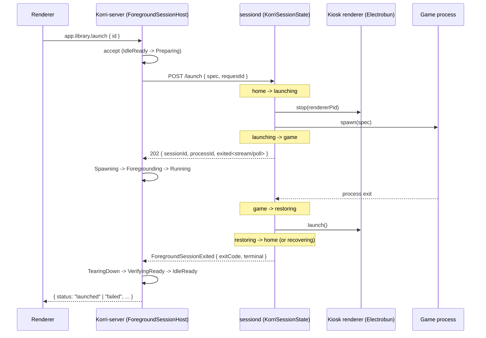
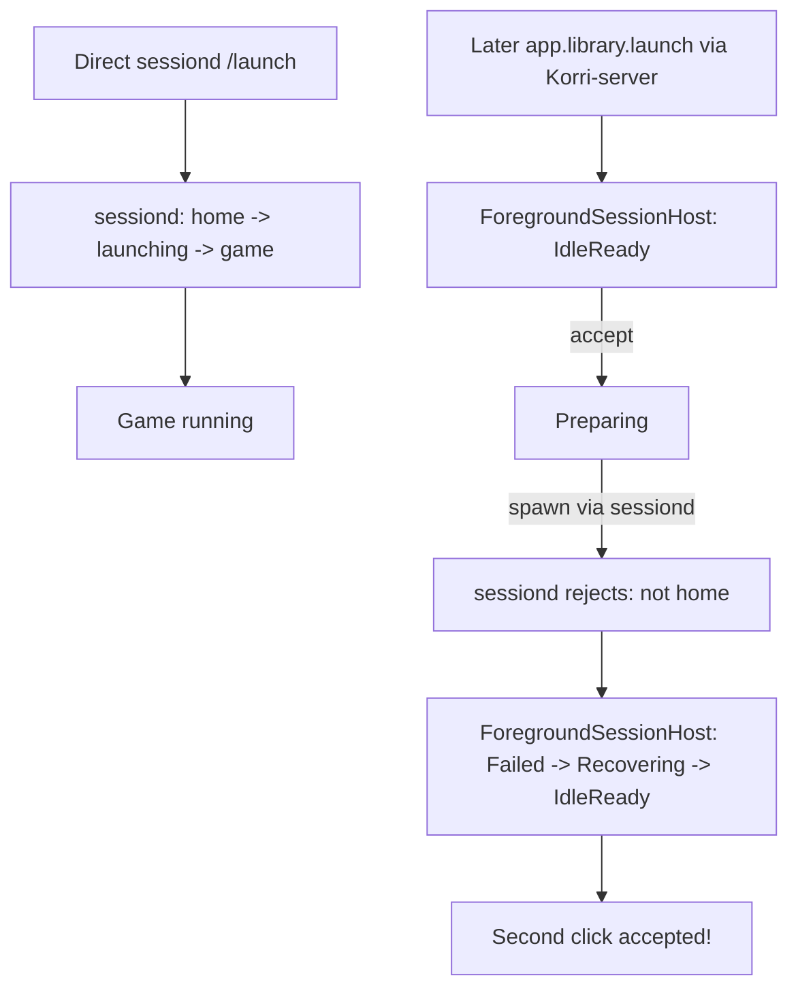
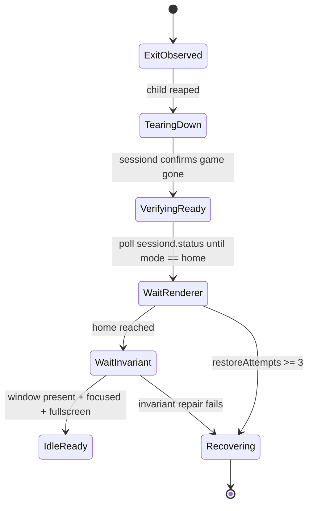

# Flow analysis: Phase 4B foreground/session adapter rollout (sessiond + non-shell launchers)

Scope reviewed: Phase 4B of `docs/plans/2026-05-26-011-feat-foreground-session-adapter-rollout-plan.md`. Phase 4A is already in tree: `app.library.launch` is wrapped by a `ForegroundSessionHost`-owned shell adapter (`korri/products/app/api/library/local-foreground-launch-adapter.ts`), and non-shell launchers (today: `createSessionLauncher` for sessiond) return a typed unsupported managed spawn so the owner fails closed. Phase 4B must take those launchers off the fail-closed posture and make them participate in the generic foreground-session lifecycle **without** double-owning the host's foreground state.

This review focuses on flow completeness and edge cases for the upcoming Phase 4B plan; it is not a feasibility review of any specific Phase 4B design.

## Codebase context (relevant to Phase 4B)

- The generic owner contract is `createForegroundSessionOwner` in `korri/shared/stream/foreground-session-owner.ts`. It expects `prepare → spawn → foreground → (running)` then, on observed exit, `TearingDown → VerifyingReady → IdleReady`. `spawn` must return a `ForegroundManagedSessionHandle` carrying `{ id, processId?, exited, terminate, terminateNow, isGone? }`.
- The Phase 4A first-slice adapter for local apps is `createLocalForegroundLaunchOwner` in `korri/products/app/api/library/local-foreground-launch-adapter.ts`. It is wired in `ForegroundSessionHostLive` (`korri/products/app/api/library/foreground-session-host-layer.ts`), which both `korri/products/app/api/server/rpc-server.ts` and `korri/products/app/api/rpc-server.ts` compose.
- Phase 4A's `launch.rpc-handler.ts` calls `launcher.spawn(spec)` from the `Launcher` Effect service and feeds the resulting handle into `launchLocalForegroundSession`. `LauncherLayerLive` in `korri/shared/library/launcher-layer-live.ts` picks `createSessionLauncherFromEnv() ?? createShellLauncher()`; the sessiond branch's `spawn` returns the typed `unsupported managed sessiond launch` failure today.
- Sessiond (`tools/device/sessiond.ts`) is a *separate process* with its own state machine in `tools/device/sessiond-state.ts`: `stopped → starting → home → launching → game → restoring → (home | recovering)`. Its `launchUnderSession` already enforces "launch only from home" (returns exit 125 with `sessiond is ${mode}; launch requires home`), stops the renderer (Electrobun) before child spawn, runs `launcher.run(spec)` synchronously, then restarts the renderer and reconciles Sway home invariants. Restore failure counts up to `MAX_RESTORE_ATTEMPTS = 3` before `leaveKorri()` is forced.
- Sessiond's only public surfaces today are HTTP: `GET /status`, `POST /control/{start,stop,reconcile}`, `POST /launch`. `/launch` accepts `{ spec }` and returns `{ result, ...status }` after the child exits. There is no streaming, no per-launch request id, no termination endpoint scoped to a single launch (only `/control/stop`, which is whole-session teardown).
- Sessiond owns essway masking and Electrobun (the kiosk renderer). It also implements the "Korri client returns to foreground after exit" invariant that the brainstorm's R18 calls out for GUI kiosk roles.
- The Korri-server process (which hosts `app.library.launch`) is, in the appliance/Sobo deployment, a *different* process from sessiond. Today they communicate through the sessiond HTTP API behind `x-korri-sessiond-token`.
- `LauncherLayerRpc` (`korri/products/app/features/home/launcher-layer-rpc.ts`) only forwards `{ id }`, does not even surface `failureKind` from the wire (Phase 4A's U4 listed this file but the live code on `trunk` still drops `failureKind`). Compare `LauncherLayerBridge` which already maps `failureKind` from the bridge response. This is an existing P4A regression rather than a Phase 4B problem on its face, but Phase 4B's success criteria depend on it being fixed because the visible `session-busy` UX is otherwise lost the moment sessiond is configured.
- The Phase 3 status snapshot adapter (`korri/deploy/desktop/foreground-session-status-snapshot.ts`) reads `foregroundSessionOwner.status()` directly. It does not yet have a path for "the owner of record is in another process" — i.e. it cannot pull state from sessiond over HTTP.
- Other non-shell launchers in the repo today: `tools/device/game-stream-runner.ts` (Sunshine-side game-stream runner with its own `ManagedChild` shape; explicit Phase 4 deferral per the rollout plan), `packages/sunshine-korri` (transport, not a launcher), planned `packages/libretro-fake-08` (per `docs/plans/2026-05-26-010-feat-libretro-fake-08-derivation-plan.md` — uses sessiond), and any future Steam/Manual-Launch surface from `tools/scripts/steam-manual-launch`. Phase 4B explicitly scopes to "sessiond and non-shell launcher ownership"; cloud/source-machine remains Phase 4D, but any handle-contract decision Phase 4B makes will be reused by them.

## User flows (Phase 4B)

### F4B.1 — Sessiond happy path, viewed through the generic lifecycle

Entry: `KORRI_SESSIOND_URL` is set on the kiosk. Renderer triggers `app.library.launch`. Korri-server's `ForegroundSessionHost` enters `Preparing`; the `Launcher.spawn` capability has to produce a handle that represents the sessiond-managed child.

Open in this flow: how the `exited` promise is materialized across the process boundary. Long-poll, SSE, websocket, or a status-poll loop is acceptable — the plan must pick one. Also open: whether `VerifyingReady` waits on sessiond's `restoring → home` transition (renderer back) or treats sessiond's `game → restoring` as the readiness gate.

### F4B.2 — Re-entry during sessiond launch (busy)

Entry: Same `IdleReady` start as F4B.1. While `Running`/`game`, a second `app.library.launch` arrives at Korri-server.

Two re-entry contracts now exist simultaneously:

1. The Korri-server-side owner's `acceptForegroundSessionLaunch` returns `Busy`.
2. Sessiond's `launchUnderSession` also rejects when `state.mode !== "home"` (it returns exit code 125 + a free-text `stderrTail`, not a typed busy outcome).

If the Korri-server owner is authoritative, sessiond's rejection is dead code — Phase 4B should never reach it for a normally-routed launch. But out-of-band callers (`tools/device/sessiond-launcher-client.ts`, manual `curl` to `/launch`, the planned libretro-fake-08 derivation) bypass the Korri-server owner. The plan must say whether sessiond's internal rejection becomes a typed `session-busy` outcome the Korri-server owner consumes as adapter evidence, or whether out-of-band launchers are documented as "use at your own risk; lifecycle owner is bypassed."

### F4B.3 — Re-entry from a sessiond-bypassing caller (split-brain risk)

Entry: A manual `curl POST /launch` (or a packaged tool that calls `launchViaSessiond` directly) starts a game while the Korri-server owner is still `IdleReady`.

Today's Phase 4A handler treats spawn failure as a generic adapter failure that releases the owner back to `IdleReady` (the `failAndRelease` path in `createForegroundSessionOwner`). That would let *every* re-entry be re-accepted by the owner until sessiond finally lets a launch through. Phase 4B needs to translate "sessiond says not home" into a `session-busy` reservation that the owner *holds*, not a transient failure. Otherwise the Korri-server's owner and sessiond's state machine drift apart whenever any caller bypasses the owner.

### F4B.4 — Cancellation / shutdown midway through a sessiond launch

Entry: A sessiond launch reaches `Running`/`game`. The kiosk is shut down (SIGTERM to Korri-server), or the user cancels through the renderer (Phase 4B-future), or sessiond itself is restarted.

Three sub-flows, each different:

- (a) Korri-server SIGTERM: `terminateActiveSessionNow()` on the local owner calls `handle.terminateNow()`. What does that *do* across the wire to a sessiond launch? There is no per-launch terminate endpoint. The lazy fallback (`POST /control/stop`) destroys the entire session including the renderer — wrong tool. The plan must specify whether sessiond grows `DELETE /launch/:id` or `POST /launch/:id/terminate`.
- (b) Renderer cancel (deferred): same as (a) in terms of sessiond wire requirements. Out of Phase 4B if user-initiated cancel is not in scope.
- (c) sessiond SIGTERM/crash: the Korri-server owner's `exited` promise either resolves with a connection-reset error or hangs forever depending on transport. The owner must transition to `Failed → Recovering → IdleReady` based on transport health, not pretend the game is still running. There is no current heartbeat surface.

### F4B.5 — Renderer restore and home invariant under the generic lifecycle

Entry: Game exits cleanly. Sessiond restores Electrobun and reconciles the Sway home invariant (`evaluateHomeInvariant` → repair-window, close-duplicate-windows, relaunch-renderer).

The generic owner today has a `VerifyingReady` stage but the local-app adapter (Phase 4A) emits a no-op `{ gate: "managed-child-exit" }` evidence and returns immediately. For sessiond:

Open: should the lifecycle owner gate `IdleReady` on sessiond's full restore (renderer present, focused, fullscreen, no duplicates) or only on `game → restoring → home` mode transition? Today's sessiond's `KorriSessionState` can sit in `home` while `reconcileHome` is still trying to relaunch the renderer asynchronously, so "mode === home" is a necessary but not sufficient readiness signal. Phase 4B must pick one and document it.

### F4B.6 — Restore failure exhaustion (sessiond `leaveKorri`)

Entry: Game exits; sessiond's `renderer.launch()` keeps throwing. After 3 attempts, `shouldStopAfterRestoreFailure` becomes true and sessiond calls `leaveKorri` (essway restored, mode → stopped).

This is a hard failure of kiosk presentation that the generic lifecycle must model. Today the Korri-server owner has only `Failed` / `Recovering` / `IdleReady`. Question: does `mode == stopped` in sessiond mean the host is *unable* to host a foreground session (i.e. Korri-server owner stays in `Failed` indefinitely until something restarts sessiond) or does the owner release to `IdleReady` and let the next launch trigger essway-mask + renderer-start again?

### F4B.7 — Sessiond was never started

Entry: `KORRI_SESSIOND_URL` is set but sessiond is unreachable (not started yet, port closed, wrong token). First `app.library.launch` arrives.

Today (Phase 4A): the sessiond launcher's `run()` returns `{ status: "failed", exitCode: 125, stderrTail: "sessiond unreachable: ..." }`. Its `spawn()` returns the `unsupported managed sessiond launch` failure regardless. The owner therefore fails on `spawn`, which already trips `failAndRelease` and writes a generic `command-failed`.

For Phase 4B we need a typed `adapter-unavailable` (or `host-unavailable`) so the renderer can distinguish "the foreground host is offline" from "the game crashed at exit code 1". `LaunchFailureKind` already has `host-unavailable`; the local-launch wire response can carry it, but Phase 4A's response handler does not currently use it.

### F4B.8 — Unsupported transports and out-of-tree launchers

Entry: Phase 4B extends `Launcher.spawn` to non-shell adapters. Adapter implementations exist for `createShellLauncher` (Phase 4A) and will exist for `createSessionLauncher` (Phase 4B). Future adapters that may want to participate: `tools/device/game-stream-runner.ts` (Phase 4D), `packages/libretro-fake-08` (per its plan), `tools/scripts/steam-manual-launch` (already merged as best-practice doc).

The default for unsupported transports must be the same fail-closed posture as Phase 4A: refuse to enter `Spawning` with a typed `adapter-unavailable`, not silently downgrade to `run` (which would re-introduce the "no handle" gap). Phase 4B's plan must define exactly how a launcher signals "I don't support managed spawn" without conflating it with a normal failed-launch result.

### F4B.9 — Cross-process status snapshot

Entry: An operator hits the Phase 3 status snapshot endpoint after the foreground host actually became sessiond (different process from Korri-server).

`foregroundSessionStatusSnapshotFromOwnerStatus` reads the Korri-server's owner. If sessiond is the *real* foreground host, the snapshot must reflect sessiond's state (essway, renderer, mode, restoreAttempts, failureReason). Phase 4B must say whether the Korri-server's owner is the snapshot source of truth (and consumes sessiond's status as adapter evidence) or whether the snapshot endpoint is proxied to sessiond's `/status`. The choice has security consequences (sessiond's token gating).

## Gaps

Ordered by severity. The plan should treat "Critical" items as blockers; "Important" as ambiguity-resolution work for Phase 4B; "Minor" as confirmation of a default.

### Critical

**C1. Double-ownership topology when sessiond is configured.** Phase 4A puts the foreground owner in the Korri-server process via `ForegroundSessionHostLive`. Sessiond already owns the same state machine (home/launching/game/restoring/recovering) for a different reason (essway, renderer). When `KORRI_SESSIOND_URL` is set, both are notionally "the host's foreground owner." R14 (origin brainstorm) says "only one foreground session may be active or not-yet-ready per foreground-session host." Phase 4B must pick:

- (a) **Korri-server owner remains authoritative; sessiond becomes a managed-spawn adapter.** Sessiond must expose a `/launch` (or `/spawn`) that returns a session handle identity plus a way to observe exit and request termination. The local owner consumes that as `ForegroundManagedSessionHandle`. Sessiond's internal state machine becomes adapter implementation detail — its busy outcome maps to `prepare`/`spawn` failure, its restore is adapter teardown.
- (b) **Sessiond owner becomes authoritative; Korri-server owner is a thin proxy.** The Korri-server's `ForegroundSessionHostLive` reads sessiond status to accept or reject; spawn delegates wholesale. The current local-foreground-launch-adapter becomes shell-only and is skipped when sessiond is configured.

Codebase note: (b) is closer to today's sessiond intent (it already does essway, renderer, Sway repair). (a) keeps the generic owner code path uniform and treats sessiond as one more adapter, which matches the brainstorm's "contract first" principle.

Default if not resolved: (a), because the existing `ForegroundManagedSessionHandle` shape and the Phase 4A composition already point that way, and the generic owner code path stays the source of truth for re-entry rejection across adapters. But the plan must say so explicitly and treat sessiond's `/launch` as the spawn capability that needs to grow.

**C2. Sessiond `/launch` has no managed-handle contract.** Sessiond's current HTTP API is fire-and-block: POST `/launch { spec }` and you get a response *after* the child exits. There is no per-launch identity in the response, no exit promise, no termination scope, no streaming of `terminal`. To participate in `createForegroundSessionOwner`, the launcher must produce a `ForegroundManagedSessionHandle` with `{ id, processId?, exited, terminate, terminateNow, isGone? }`. Phase 4B must define the wire shape of this contract:

- A new endpoint, e.g. `POST /launch/spawn { spec, requestId }` returning `{ sessionId, processId? }` immediately;
- An exit observation channel: long-poll `GET /launch/:sessionId/exited`, SSE `/launch/:sessionId/events`, or status-poll loop on `GET /status` filtered by `launchId`;
- A termination scope: `DELETE /launch/:sessionId` or `POST /launch/:sessionId/terminate { signal: "TERM" | "KILL" }`.

The plan must name the chosen wire shape, the timeout/heartbeat behavior on the long-poll, and the per-launch capability semantics. Sessiond's existing token continues to gate everything.

**C3. `app.library.launch` cannot represent "host is offline" or "adapter unavailable" as distinct from a generic failure.** Phase 4A's `LaunchLibraryResponse` extends `LaunchFailureKind` and `session-busy` is plumbed end to end, but `host-unavailable` and `command-failed` are aliased in the unsupported-managed-sessiond-launch path (see `korri/shared/library/session-launcher.ts:32` — returns `failureKind: "command-failed"`). With sessiond as the canonical foreground host, the user-visible distinction between "sessiond is down" and "your game crashed" matters for UX. Phase 4B must:

- Use `host-unavailable` (already in `LaunchFailureKind`) for sessiond transport failures;
- Add a typed `adapter-unavailable` (new kind) or reuse `host-unavailable` for "sessiond does not support managed spawn yet" cases that may persist as compatibility paths;
- Confirm `LauncherLayerRpc` actually forwards `failureKind` (today it does not — see Important section below).

**C4. The Korri-server owner can drift from sessiond when any out-of-band path bypasses it.** Sessiond's `/launch` is a public HTTP endpoint with a stable token. The Sobo persistence experiments, the libretro-fake-08 derivation, manual debugging via `curl`, and any future tool that imports `tools/device/sessiond-launcher-client.ts` all bypass the Korri-server owner. With Phase 4B routing through the owner, those calls become silent drift: sessiond enters `game`, the Korri-server owner stays in `IdleReady`, and the next `app.library.launch` triggers re-entry that the owner happily accepts and sessiond then rejects out-of-band.

Default: Sessiond must publish enough state for the Korri-server owner to lock to it. Either (a) the owner observes sessiond's `/status` on every accept call and refuses to accept from `IdleReady` if sessiond reports `mode !== "stopped" && mode !== "home"`, or (b) `tools/device/sessiond-launcher-client.ts` is deleted/wrapped so all callers must route through Korri-server. (a) is feasible without breaking out-of-tree callers and is the standard "consult upstream truth before accepting" pattern; (b) is a hard break and probably out of scope.

**C5. Cancellation has no sessiond-scoped surface.** `terminateActiveSessionNow()` on the Korri-server owner has nowhere to land. `POST /control/stop` is whole-session (Korri exits kiosk entirely — destroys renderer, restores essway). No `/launch/:id/terminate` exists today. Without it, Phase 4B's shutdown hook either has to:

- Do nothing (sessiond will keep the game running across Korri-server restart; not necessarily wrong but must be documented), or
- Issue `/control/stop`, which kills the kiosk session entirely (wrong; nuke from orbit), or
- Add a per-launch termination endpoint (correct; needs the C2 wire shape).

The plan must pick one and validate the failure mode.

### Important

**I1. The generic owner's stages do not naturally encode renderer-stop-before-spawn and renderer-restart-after-exit.** Sessiond's `launchUnderSession` does `renderer.stop → spawn child → wait → renderer.launch → reconcileHome`. The generic owner's stages are `prepare → spawn → foreground → (running) → (exit) → tearing-down → verifying-ready → idle`. Mapping sessiond's renderer-stop onto a stage matters:

- **prepare** is the natural home for renderer-stop (it's reservation work before the child exists);
- **tearing-down** is the natural home for renderer-relaunch;
- **verifying-ready** is the natural home for "renderer is back, focused, fullscreen, no duplicates."

Today sessiond does this internally; the generic owner cannot see it. Phase 4B must either: (a) keep the breakdown opaque (sessiond is one big spawn-to-exit black box; the owner just observes child-exit + sessiond-mode-home) and accept that the lifecycle's evidence is coarse, or (b) emit sessiond's transitions as `ForegroundSessionAdapterOutcome` evidence so the status snapshot reflects renderer/essway/sway sub-steps.

Default: (b) for status-snapshot honesty (AE7 lifecycle evidence parity); accept coarser readiness gating (just "sessiond mode === home && reconcileHome stable") for the initial Phase 4B.

**I2. Verifying-ready cannot be a single round-trip.** Sessiond's renderer restart is *async with retry*: up to 3 attempts before `leaveKorri`. The generic owner's `verifyReady` currently runs once and returns an evidence record. Phase 4B's adapter implementation must either (a) poll sessiond status until `mode === home && restoreAttempts === 0` (or some bounded condition) with a timeout, or (b) treat sessiond's first `home` event as readiness and let any subsequent restore-failure show up as a *new* lifecycle event after `IdleReady`. (b) is simpler but produces a transient `IdleReady` window where the kiosk is not actually visible — the next launch could fire into a non-restored renderer.

Default: (a), because R16 (conservative readiness) explicitly says "child exit is not sufficient readiness." The owner must wait for the actual home-with-renderer state. Cap with a timeout and emit a `Failed`/`Recovering` if exhausted.

**I3. Restore failure exhaustion (sessiond → `mode = stopped`) is a new lifecycle terminal state.** Today the generic owner has no notion of "the foreground host is *itself* down indefinitely." After sessiond hits `MAX_RESTORE_ATTEMPTS` and calls `leaveKorri`, the kiosk is no longer holding any session — essway is back, no renderer. The Korri-server owner's options:

- Sit in `Recovering` indefinitely (no further launches accepted, which is the conservative read of R14);
- Transition to `IdleReady` because sessiond will recover when the next launch triggers `enterHome`; this also matches what the original sessiond design assumes (next `/control/start` or first `/launch` re-enters);
- Surface a new `HostDown` state.

Default: stay in `Recovering` with a `failure.stage = "cleanup"` evidence (the brainstorm's existing failure-stage vocabulary supports it). Add a recovery seam (e.g. an `attemptRecovery()` adapter method) that tries `POST /control/start` to bring sessiond back to `home`. Document this as the explicit difference between "the previous game session ended cleanly" and "the host's foreground supervisor is dead."

**I4. `LauncherLayerRpc` currently drops `failureKind` from the wire.** `korri/products/app/features/home/launcher-layer-rpc.ts` only maps the RPC client's response into `Launcher.run` via `client["app.library.launch"]`, but does not extract `failureKind`. Compare `LauncherLayerBridge` (`korri/products/app/features/home/launcher-layer-bridge.ts:71`), which explicitly forwards `failureKind`. This means today's `session-busy` from Phase 4A is invisible to the RPC-transport renderer — exactly the deployment path Phase 4B targets (non-desktop builds, sessiond-backed Sobo).

This is a pre-existing Phase 4A regression but it's a Phase 4B blocker because Phase 4B's whole point is "make sessiond participate"; without forwarded `failureKind`, the renderer cannot distinguish `session-busy` from `command-failed` and Phase 3 gate UX silently regresses on sessiond-backed kiosks. Phase 4B must include the LauncherLayerRpc fix and add a `library-rpc-layers.test.ts` case that asserts a `session-busy` round-trip.

**I5. Acceptance ordering with sessiond unreachable / token-missing.** Today the local-foreground-launch-adapter's `spawn` calls `launcher.spawn(spec)`; if sessiond's spawn throws (network, 401), the owner enters `Spawning` and then `Failed → Recovering → IdleReady`. This burns a lifecycle cycle for every misconfigured launch attempt. Sessiond preflight (token present, URL reachable, mode != stopped) belongs in `prepare`, not in `spawn`, so a misconfigured kiosk shows `prepare-failed` evidence and doesn't twitch the running-state machine for users who hit the button repeatedly.

Default: move sessiond preflight (token resolution + `GET /status`) into the adapter's `prepare`. Add evidence for the readiness gate so the operator can see "sessiond was reachable" vs "sessiond was down" without needing logs.

**I6. Heartbeat / exit observation across the wire is not specified.** Phase 4B's biggest invisible decision is *how* sessiond tells Korri-server "the child exited." Three plausible mechanisms:

- **Long-poll `GET /launch/:id/exited`:** simple, no new wire format, but breaks under network blips and HTTP/1 connection limits.
- **SSE `GET /launch/:id/events`:** good fit for `ForegroundSessionEvent`-shaped traffic; needs the Korri-server to manage reconnection.
- **Status-poll `GET /status` at 500ms-1s cadence:** simplest, but adds latency on exit observation.

Default: SSE if sessiond can serve it cheaply (Bun.serve supports it); otherwise long-poll with explicit retry-and-resume semantics. The plan must say. The cancellation surface (C5) must match: terminate must reach sessiond reliably even if the observation channel is broken.

**I7. Concurrent renderer restart vs Korri-server idle release.** Sessiond completes `restoreToHome`, marks `mode = home`, and then asynchronously runs `reconcileHome`. If the Korri-server owner releases to `IdleReady` on the first `home` event and the renderer relaunch is still in flight (Electrobun PID not yet alive), a fast re-launch can hit `mode == home` while the user sees nothing on screen. This is exactly the brainstorm's AE6 case ("Moonlight child exits cleanly, launched surface still present, do not return to IdleReady yet"). For sessiond, the equivalent is "renderer launched but not yet visible." The plan must say what evidence proves it.

Default: poll `getKorriWindows` (via sessiond `/status.windows` or a new endpoint) until at least one Korri window exists, focused, and fullscreen — i.e. the home invariant is satisfied. Reuse `evaluateHomeInvariant` shape.

**I8. Cancellation across reconnect.** If Korri-server restarts mid-game, the local owner forgets the active session id. On reconnect, sessiond still reports `mode == game` and a `launchId`. Phase 4B's owner needs to (a) re-attach to the in-flight launch via sessiond's published session id, or (b) refuse all new launches until sessiond's mode returns to `home` and emit a structured "re-attach skipped, host is busy" status. (a) is the right long-term shape but requires sessiond to keep launch identity stable across the Korri-server lifecycle, which it does today (the launchId is in `KorriSessionState`). Plan must say.

Default: (a) on startup, fetch sessiond status and seed the owner with the existing active session (state = `Running`, child = `{ id: sessiond.launchId }`). Document it as a single startup-reconciliation step.

**I9. Non-shell launcher contract beyond sessiond.** The plan title says "non-shell launchers" but the body focuses on sessiond. The repo has a planned `packages/libretro-fake-08` (per `docs/plans/2026-05-26-010-feat-libretro-fake-08-derivation-plan.md`) that routes through sessiond, and `tools/scripts/steam-manual-launch` documented as a best-practice. The plan should define the seam name and explicit acceptance criteria so adding a future native launcher (e.g. Steam manual launch, libretro-fake-08 directly) is a straight implementation of the same `Launcher.spawn` contract, not a re-design. The seam already exists in `Launcher.spawn?` and `ManagedLaunchResult`; the question is whether Phase 4B promotes `spawn` from optional to required.

Default: keep `spawn` optional in the type but require it from any launcher that wants to participate in the lifecycle; unsupported launchers return the existing typed `unsupported managed spawn` failure. Add a one-line "this is the contract" doc in `korri/shared/library/launcher.ts`.

### Minor

**M1. Status-snapshot location.** The Phase 3 status snapshot adapter lives in `korri/deploy/desktop/foreground-session-status-snapshot.ts`. Once Phase 4B makes sessiond/non-shell launchers participate, kiosk-only deployments need the same snapshot from the Korri-server side. The snapshot adapter is product-agnostic — it should move to `korri/shared/stream/` if reused outside desktop, but the brainstorm explicitly defers the non-desktop operator surface (R10/AE8) to Phase 4D. Default: leave the snapshot adapter where it is; Phase 4B does not need to expose it on Korri-server.

**M2. Token plumbing for new sessiond endpoints.** Whatever endpoints C2/C5 add must use the existing `x-korri-sessiond-token` capability. Confirm in tests; do not introduce a second token. Default: same token, documented in the sessiond endpoint table.

**M3. Backwards compatibility for older sessiond.** Korri-server may run against an older sessiond that lacks the new spawn/terminate endpoints. Default: probe sessiond's capabilities on `prepare` (e.g. `GET /capabilities` or feature flag in `/status`), fall back to a typed `adapter-unavailable` outcome if the new endpoints are missing, and document the matrix.

**M4. Evidence shape for sessiond stages.** Each sessiond sub-step (renderer.stop, renderer.launch, reconcileHome) should emit `ForegroundSessionAdapterOutcome` evidence with a stable stage name so the status snapshot is stable. Default: stage names: `prepare.sessiond-status`, `prepare.renderer-stop`, `verifyReady.renderer-restart`, `verifyReady.home-invariant`. Pick names; pin in tests.

**M5. Sessiond log integration.** Korri-server logs are pino-based; sessiond logs are also pino. Phase 4B's lifecycle evidence should not duplicate log content already captured by sessiond; the snapshot's `evidence` should hold structured state, not log lines. Default: keep `stderrTail` only on hard failure (current Phase 4A pattern); use the snapshot's evidence record for everything else.

**M6. Test-double surface for sessiond.** Today there is no in-memory sessiond client. The in-memory launcher (`launcher-layer-memory.ts`) only covers shell-style behavior. Phase 4B needs an in-memory sessiond client that supports the new endpoints (status, spawn-handle, terminate) so the adapter unit tests don't need a real `Bun.serve`. Default: add `tools/device/sessiond-in-memory.ts` (real implementation with configurable behavior — outcome, delay, restore failure count, mode transitions) and follow the "no mocks, real implementations with knobs" rule from CLAUDE.md/lattice conventions.

### Roadmap / explicit non-goals for Phase 4B

- **N1.** Cloud/source-machine game-stream-runner participation (Phase 4D in the rollout plan). Phase 4B should not change `tools/device/game-stream-runner.ts`'s wire shape, only ensure the `ForegroundManagedSessionHandle` decision Phase 4B locks in is future-compatible with the runner's existing `ManagedChild` shape.
- **N2.** Cross-process owner topology (Phase 4C). Phase 4B keeps the Korri-server owner authoritative; how desktop Bun + a separate Korri-server share one owner across the same physical host is still deferred. Phase 4B must be clear that "Korri-server's `ForegroundSessionHost` is the only host-local owner *in the sessiond deployment mode*" — not a universal answer.
- **N3.** Adapter-aware foreground repair for non-Moonlight surfaces. The local-foreground-launch-adapter still emits `surface: not-tracked` evidence; sessiond's reconcileHome is rich enough to give better evidence, but only for the Korri renderer surface, not for emulator windows.
- **N4.** Renderer cancel UX (user clicks "Stop game"). Phase 4B can deliver the wire-level termination capability (C5) but the renderer surface is later.
- **N5.** Multi-launch queueing. Brainstorm scope explicitly rejects this; Phase 4B continues to reject re-entry rather than queue.

## Questions (priority-ordered)

1. **Who is the authoritative foreground owner in the sessiond deployment — Korri-server's `ForegroundSessionHost`, or sessiond itself?** Stakes: dictates the entire Phase 4B wire shape, security model, and which process holds the status snapshot. Default: Korri-server's `ForegroundSessionHost` remains the owner; sessiond exposes a managed-spawn capability so its existing state machine becomes adapter implementation detail.

2. **What is the sessiond-side wire contract for a managed launch?** Stakes: every other Phase 4B decision (exit observation, cancellation, busy detection, restore evidence) hinges on this. Default: extend `POST /launch` to return `{ sessionId, processId? }` immediately when called with `?managed=1` (back-compat preserves blocking semantics), add `GET /launch/:id/events` (SSE), and add `POST /launch/:id/terminate { signal }`. Reuse the existing token.

3. **What is the readiness gate for the lifecycle's `VerifyingReady → IdleReady` on sessiond?** Stakes: AE6 conservative-readiness for the kiosk path. Default: sessiond reports `mode == home && restoreAttempts == 0` AND at least one Korri window exists with `focused && fullscreen`. Cap with a timeout; on timeout enter `Recovering`.

4. **What happens when sessiond exhausts restoreAttempts and calls `leaveKorri()`?** Stakes: defines whether the kiosk can re-enter without operator action. Default: lifecycle stays in `Recovering` with `failure.stage = "cleanup"` evidence; an adapter-supplied recovery seam attempts `POST /control/start` once before bubbling up.

5. **How does the Korri-server owner detect out-of-band sessiond launches (the libretro-fake-08, manual `curl`, or `sessiond-launcher-client.ts` callers)?** Stakes: prevents split-brain (Flow F4B.3). Default: every `accept` consults sessiond's `/status`; refuse from `IdleReady` if sessiond reports an active mode it did not initiate.

6. **Does Phase 4B fix `LauncherLayerRpc` to forward `failureKind`?** Stakes: visible `session-busy` UX on sessiond-backed kiosks (the entire Phase 4B target deployment). Default: yes — adopted into Phase 4B as a non-optional fix because sessiond's whole value is invisible without it.

7. **How does the Korri-server owner observe sessiond exit when reconnecting after Korri-server restart?** Stakes: avoids re-launch into a still-running game. Default: on startup, the owner reads sessiond `/status`; if `mode == game`, hydrate the owner with `Running` state and the existing `launchId` and observe exit through the normal channel.

8. **What is the canonical failure kind for "sessiond is offline / unsupported"?** Stakes: renderer UX, log triage, future operator alerts. Default: `host-unavailable` (already in `LaunchFailureKind`) for unreachable sessiond; introduce `adapter-unavailable` only if compatibility paths need to persist (e.g. older sessiond without spawn capability).

## Recommended next steps

1. **Decide Q1 first.** Every other question collapses around the chosen authority model. The Phase 4B plan body should open with an explicit "sessiond becomes a managed-spawn adapter; Korri-server's `ForegroundSessionHost` remains authoritative" (or the inverse) before listing units.
2. **Define the sessiond wire contract before writing any TypeScript** (resolves C2, C5, I6, I8). The plan should include a sessiond endpoint table — methods, payloads, headers, error shapes — equivalent to how `app.library.launch` is described today.
3. **Add a Phase 4A follow-up unit to fix `LauncherLayerRpc` forwarding of `failureKind`** (resolves I4). This is a blocker for any user-visible Phase 4B behavior on sessiond-backed kiosks. The Phase 4B plan should explicitly own it because the original Phase 4A delivery did not.
4. **Write the integration test before refactoring sessiond:**
   - sessiond running in-process via a configurable `tools/device/sessiond-in-memory.ts`;
   - first `app.library.launch` reaches `Running`, holds renderer-stopped state;
   - second `app.library.launch` returns `session-busy` (resolves F4B.2);
   - direct `launchViaSessiond` while owner is `IdleReady` is detected and the next owner accept returns `session-busy` (resolves F4B.3, C4);
   - SIGTERM during `Running` terminates the sessiond launch via the new per-launch terminate endpoint, transitions through `TearingDown → Recovering → IdleReady` (resolves F4B.4, C5);
   - sessiond restart mid-game leaves the owner in `Recovering` (resolves I3);
   - sessiond's `restoreAttempts == 3` path produces a typed `Recovering` with `failure.stage == "cleanup"` (resolves I3).
5. **Add the sessiond preflight to `prepare`** (resolves I5), not to `spawn`. A misconfigured kiosk should fail at prepare with `prepare-failed`, not enter Spawning.
6. **Add SSE / heartbeat semantics to the exit-observation channel** (resolves I6) and a Korri-server-side reconnect path (resolves I8). The Korri-server reconcile-on-startup is small but easy to forget.
7. **Document the Phase 4B non-goals explicitly** (N1-N5) so the next plan slice (Phase 4C cross-process, Phase 4D cloud) is not blocked by a Phase 4B-locked decision it can no longer change.
8. **Reuse the no-mocks/real-implementations rule from the lattice conventions** when adding `tools/device/sessiond-in-memory.ts`: a real Bun-based in-process server with configurable behavior knobs, not a `MockSessiond`.

## Sources

- Phase 4 rollout plan: `docs/plans/2026-05-26-011-feat-foreground-session-adapter-rollout-plan.md` (Phase 4A complete; Phase 4B/4C/4D described as roadmap).
- Phase 4A first-slice flow analysis: `docs/reviews/current-branch/foreground-session-phase4-first-slice-flow-analysis.md`.
- Origin brainstorm: `docs/brainstorms/2026-05-24-002-default-gamescope-foreground-launch-policy-requirements.md`.
- Generic lifecycle: `korri/shared/stream/foreground-session-lifecycle.ts`, `korri/shared/stream/foreground-session-owner.ts`.
- Phase 4A adapter: `korri/products/app/api/library/local-foreground-launch-adapter.ts`, `korri/products/app/api/library/foreground-session-host-layer.ts`, `korri/products/app/api/library/launch.rpc-handler.ts`.
- Sessiond today: `tools/device/sessiond.ts`, `tools/device/sessiond-state.ts`, `tools/device/sessiond-renderer.ts`, `tools/device/sessiond-launcher-client.ts`, `korri/shared/library/session-launcher.ts`.
- RPC transport gap: `korri/products/app/features/home/launcher-layer-rpc.ts` (does not forward `failureKind` today).
- Sessiond-adjacent solution learnings: `docs/solutions/architecture-patterns/kiosk-foreground-app-policy-over-gamescope-overlay-2026-05-24.md`, `docs/solutions/integration-issues/supervise-chromium-kiosk-session-after-game-exit-2026-05-04.md`.
