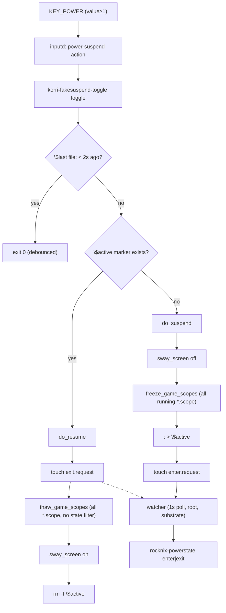

# Flow Analysis: Bandai/SM8550 Fake-Suspend Guest Ownership

> **Scope:** plan-level analysis of missing state transitions, edge cases, failure
> modes, integration gaps, and verification scenarios for the fake-suspend
> ownership flip described in `BANDAI_SLEEP_HANDOFF.md` and `se-plan-repo-research.md`.
>
> **Codebase ground:** `rocknix-sm8550.nix` (toggle script), `inputd.ts` / `inputd-actions.ts`
> (dispatch), `korri-rocknix-sm8550-config-check.nix` (wiring assertions), and
> the nix-on-rocks patterns documented in `se-plan-repo-research.md`.

---

## User Flows

### Flow 1 — Power-button suspend/resume (toggle)



### Flow 2 — Lid-close / lid-open (direct edges)

```
SW_LID=1 → inputd "lid-closed" → korriFakesuspendToggle suspend → do_suspend (no debounce)
SW_LID=0 → inputd "lid-opened" → korriFakesuspendToggle resume  → do_resume  (no debounce, no guard on $active)
```

Both are synchronous subprocesses spawned by inputd's `runCommand`. They share
`$state_dir` with the toggle path but run concurrently if both inputs arrive
within the same 1-second dispatch window.

### Flow 3 — Substrate power-save (nix-on-rocks)

```
rocknix-powerstate enter:
  1. first-wins guard ($active_marker); snapshot wifi/BT/governors
  2. cpufreq → powersave; devfreq → powersave
  3. rfkill block BT; nmcli radio wifi off (LAST)

rocknix-powerstate exit:
  1. restore governors; rfkill unblock BT; nmcli radio wifi on
  2. wait ≤14s for connected; if stalled → nmcli con up <snapshot> ×4
  3. consume snapshot (rm active_marker + snapshot files)
```

---

## Gaps

### Critical

---

**C-1. Moonlight streams do not survive freeze/thaw**

`freeze_game_scopes` sends SIGSTOP to all running user scopes, including any
Moonlight scope launched by sessiond. A frozen Moonlight process cannot drain
its TCP receive buffer. The Moonlight host (Sunshine) will detect a stalled
stream within seconds and close the connection. On thaw, Moonlight finds its
TCP connection closed; it cannot auto-reconnect without a user action.

The plan describes freeze/thaw as a generic "pause games" mechanism without
distinguishing local (offline) games from active network streams. Freezing a
stream is semantically different from pausing it — for streams, the correct
pre-suspend action is graceful disconnect, not SIGSTOP.

*What breaks if unaddressed:* after resume the screen turns on but the stream
session is dead. The user has to navigate back to the game launcher and
reconnect manually, with no explanation of why the stream ended.

*Default if left unspecified:* the plan will ship freeze/thaw for all session
types including streams, with the above UX consequence.

*Suggested decision:* before calling `freeze_game_scopes`, check whether
sessiond reports an active stream session (via `sessionProbe.isStream()` or the
sessiond status endpoint). If a stream is active, call
`POST /managed-launch/terminate` (graceful) instead of freezing. This matches
the kill-chord pattern in `inputd.ts` which already branches on `sessionKind`.

---

**C-2. Suspend-during-launch race: sessiond in `launching` state**

If the lid closes (or power button fires) while sessiond is mid-launch
(`home → launching` transition), the new game scope may be created **after**
`freeze_game_scopes` runs:

```
T=0:   lid close → do_suspend starts
T=0.1: freeze_game_scopes runs → no scopes yet (launch not reached exec stage)
T=0.2: : > $active; touch enter.request
T=0.4: sessiond spawn completes → new scope created (unfrozen)
T=0.5: substrate powers down radios
T+n:   sessiond waits for "game" readiness event; game runs on a radio-less device
```

The game scope started after the freeze window, runs while radios are off, and
sessiond keeps its state machine in `launching`, timing out after the
readiness deadline and incrementing `restoreAttempts`.

*What breaks:* the game runs (or fails) in a degraded environment; sessiond's
`restoreAttempts` counter may increment toward `shouldStopAfterRestoreFailure`
threshold. On resume, sessiond is in a confused state (game exited or wedged,
restore cycle kicking off).

*Default if left unspecified:* the race is silently handled as a crashed game,
consuming a restore attempt.

*Suggested decision:* treat sessiond not-idle (`launching | game | restoring`)
as a precondition for `do_suspend`. Either (a) call
`POST /managed-launch/terminate` (graceful) before freezing, or (b) skip the
scope-freeze step when sessiond is mid-transition (freeze only after `game`
state or after terminate confirms idle). Gate the decision as part of the plan's
"sessiond coordination" unit.

---

**C-3. No behavioral test for `korri-fakesuspend-toggle`; only wiring is verified**

`korri-rocknix-sm8550-config-check.nix` verifies that
`KORRI_INPUTD_POWER_SUSPEND` has the right suffix and `requestGroup` matches.
It does not exercise the script's runtime behavior. The `se-plan-repo-research.md`
calls this out as an open item but does not include it in the plan's work units.

Untested scenarios:

- Debounce boundary: two toggle calls 1.9s apart (second debounced); two calls
  2.1s apart (second fires).
- `$active` state transitions: toggle with no `$active` → suspend; toggle with
  `$active` → resume; resume with no `$active` (lid-opened on a non-suspended
  device).
- `swaymsg` unavailable (no socket): script must not fail, suspend/resume must
  continue for the freeze/request steps.
- Concurrent invocations: two suspend calls running simultaneously; file-level
  idempotency of `$active` and `enter.request`.
- Request directory absent (watcher not running): script currently creates the
  directory itself, masking a substrate configuration error.

*What breaks if unaddressed:* behavioral regressions in the toggle script ship
silently. The only detection path is physical lid-close on Bandai.

*Suggested decision:* extract `korriFakesuspendToggle` into a standalone
derivation with injectable env vars (`KORRI_FAKESUSPEND_REQUEST_DIR`,
`KORRI_FAKESUSPEND_STATE_DIR`) and add a `pkgs.runCommand` behavioral test
mirroring the `powerstate-script-contract.nix` pattern in nix-on-rocks. This
was already recommended in the research doc; it needs to be a named work unit
in the plan.

---

### Important

---

**I-1. `do_resume` is unconditional — `lid-opened` sends `exit.request` even without a prior suspend**

`do_resume` always touches `exit.request` regardless of whether `$active`
exists:

```sh
do_resume() {
  touch "$request_dir/exit.request" 2>/dev/null || true   # no guard
  thaw_game_scopes
  sway_screen on
  rm -f "$active"
}
```

When `lid-opened` fires on a device that was never suspended (e.g., the device
was powered on with the lid open), `exit.request` is written, the substrate
watcher picks it up, and `rocknix-powerstate exit` runs. The substrate's own
`$active_marker` guard prevents actual restore actions, but the watcher wastes a
cycle and the toggle log records a spurious "resume" entry.

More importantly, a spurious SW_LID=0 event (hardware bounce) after a
KEY_POWER-initiated suspend would call `do_resume` and clear the `$active`
marker — the device "wakes" from a suspend it never acknowledged visually.

*Suggested fix:* add `[ -e "$active" ] || { logline "resume: not suspended, skipping"; exit 0; }` at the top of `do_resume`, or at minimum at the top of the `resume` subcommand dispatch (not inside `toggle` which already checks `$active`). The `lid-opened` action should be a no-op when not suspended.

---

**I-2. `thaw_game_scopes` thaw filter is asymmetric with the freeze filter**

```sh
freeze_game_scopes():  --state=running       # only running scopes
thaw_game_scopes():    (no filter)           # ALL scopes, including dead/inactive
```

The thaw enumerates dead and inactive scopes in addition to frozen ones.
Calling `systemctl --user thaw` on a non-frozen scope is generally safe (it
returns an error that is swallowed by `|| true`), but the behavior is
untested. More significantly, any scope frozen by a *previous* suspend cycle
that was never cleaned up (e.g., a partial suspend where resume was interrupted)
will be thawed on the next resume, potentially releasing a scope that was
frozen-and-abandoned intentionally.

*Suggested fix:* use `--state=frozen` in `thaw_game_scopes` to match the
structural intent, or add `--state=running,frozen` to also catch scopes that
were running when frozen. This ensures thaw is the symmetric inverse of freeze
and doesn't operate on scopes the current suspend cycle didn't touch.

---

**I-3. Power button while lid is physically closed triggers unintended resume on clamshell**

`korriFakesuspendToggle toggle` checks `$active` to decide
suspend-or-resume. If the device was suspended via lid-close (`korriFakesuspendToggle suspend`), `$active` is set. Pressing the power button more than
2 seconds later calls `do_resume`:

- Screen turns on (via `sway_screen on`) — but the lid is physically closed on
  Thor, so the display is face-down inside the clamshell.
- Game scopes thaw and resume running.
- `exit.request` is sent, radios come back up.
- The `$active` marker is cleared, so the *next* power press would re-suspend.

The user's intent (pressing power button while the device looks asleep) is
likely to check if it's on, not to fully resume with lid still closed.

*Decision needed:* for the Thor/clamshell form factor, should the power button
while lid-closed be a no-op, a screen-on for the *bottom* panel (external
display if applicable), or a full resume? The plan needs to specify this edge.

*Default if left unspecified:* the toggle will resume the device with lid
closed, which is observable via audio resuming and battery draining with no
visible display.

---

**I-4. No health-check for the substrate watcher; silent degraded mode if it's down**

`korri-fakesuspend-toggle` creates `$request_dir` with `mkdir -p` if it doesn't
exist, then writes request files. If `rocknix-powerstate-watcher.service` is
not running:

- The request directory is silently created by the toggle script.
- `enter.request` / `exit.request` accumulate with no processor.
- From the user's perspective: screen blanks, game scopes freeze (toggle
  side works), but radios stay on and no power is actually saved.
- There is no log entry distinguishing "suspended with power savings" from
  "suspended display-only."

*Suggested addition:* add a plan verification step that checks
`systemctl is-active rocknix-powerstate-watcher.service` during the
post-deploy smoke test, and add a config-check assertion that the watcher
service is part of `multi-user.target`.

---

**I-5. `do_suspend` is not atomic: partial-suspend states are possible**

`do_suspend` executes three independent steps. If step 2 fails for some scopes,
`$active` is still set and `enter.request` is still written:

```sh
sway_screen off          # step 1 — all errors swallowed
freeze_game_scopes       # step 2 — per-scope errors swallowed
: > "$active"            # step 3 — proceeds regardless
touch enter.request      # step 4 — proceeds regardless
```

A game scope that fails to freeze (e.g., `systemctl freeze` returning non-zero
due to cgroup constraints) continues running with full CPU while the display is
off and radios are powering down. The user sees a "suspended" device (screen
off) that is actually burning CPU and audio.

*Suggested decision:* determine whether best-effort partial freeze is acceptable
(probably yes, given the `|| true` intent) and document it explicitly, or
collect freeze failures and log a warning before writing `$active`.

---

**I-6. Config-check verifies env suffix but not that `powerRequestDir` tracks the substrate option**

The Nix config check asserts:
```nix
lib.hasSuffix "korri-fakesuspend-toggle" (inputdEnv.KORRI_INPUTD_POWER_SUSPEND or "")
```

It does not assert that the hardcoded `request_dir` path baked into the toggle
script at build time actually matches `config.rocknix.power.runtimeDir`. The
script interpolates:
```nix
request_dir="${powerRequestDir}"
# where: powerRequestDir = "${config.rocknix.power.runtimeDir}/requests"
```

If nix-on-rocks changes `rocknix.power.runtimeDir` without rebuilding the Korri
platform image, the script's path would silently point to a stale location — no
request files would be found by the watcher, and fake-suspend would revert to
display-blank-only with no substrate action.

*Suggested addition:* add a config-check assertion that verifies the baked-in
path matches the option-derived value, or document the rebuild dependency
explicitly in the plan's "cross-repo change protocol" section.

---

**I-7. Concurrent invocations from simultaneous KEY_POWER + SW_LID events are unserialised**

If KEY_POWER and SW_LID=1 arrive within the same inputd dispatch cycle, two
separate subprocesses run `korri-fakesuspend-toggle` concurrently. Both write to
`$active`, `$last`, and `enter.request` without any file lock. The outcomes
depend on OS write ordering:

- Both call `sway_screen off` — second is a no-op (idempotent).
- Both call `freeze_game_scopes` — second `freeze` on an already-frozen scope
  emits an error (swallowed by `|| true`).
- Both write `> "$active"` — last writer wins; effectively idempotent.
- Both touch `enter.request` — last writer wins; watcher processes once
  (first-wins substrate guard handles duplicate enters).

This is likely benign in practice, but the 2-second debounce on `toggle` does
not apply to the `suspend` subcommand. A plan verification scenario should
confirm that physical simultaneous events produce one suspend, not two.

---

### Minor

---

**M-1. Sway socket selection is inconsistent between toggle script and TypeScript**

`sway_screen()` in the toggle script:
```sh
sock=$(ls "$runtime_dir"/sway-ipc.*.sock 2>/dev/null | head -1)
# Picks lowest PID (alphabetically first filename).
```

`swaymsgEnvironment()` in `inputd-actions.ts`:
```typescript
const latest = candidates.sort((a, b) => b.mtimeMs - a.mtimeMs)[0]
// Picks latest mtime.
```

In a single-Sway deployment there is always only one socket, so this divergence
has no effect. If Sway is restarted (e.g., compositor crash recovery), the new
socket has a higher PID and later mtime. The TypeScript path correctly finds the
new socket; the shell script's `ls | head -1` would pick the old (defunct)
socket. `swaymsg` would fail silently (`|| true`), and the display would not
blank on suspend.

*Suggested fix:* replace `ls | head -1` with `ls -t | head -1` (sort by
mtime, matching the TypeScript policy) or use `find -printf "%T@ %p\n" | sort -rn | head -1`.

---

**M-2. User input while suspended is unspecified**

inputd continues running during fake-suspend (it is a `.service` unit, not a
`.scope` unit, so it is not frozen). Button events processed during the
suspended state:

- **HOME button / `system-panel` action** — fires `swaymsg workspace korri:hub`.
  Sway is alive (service, not frozen). The workspace switches, but the display
  is off. On resume, the user sees the hub instead of their game.
- **Kill chord (L1+R1+Start+Select)** — sessiond `is-active` check passes
  (sessiond is alive, game scope is frozen). inputd arms the kill supervisor.
  If the hold completes, sessiond terminates the frozen launch. On resume,
  sessiond is in restore mode, not game mode.
- **Volume up/down** — `pactl set-sink-volume` runs; audio level changes while
  the device is "asleep."
- **SW_LID=1 while already suspended** (lid bounce) — `do_suspend` is called
  again; debounce applies only to `toggle`, not `suspend`. Duplicate `enter.request`
  is written (idempotent via substrate first-wins guard, but noisy).

None of these are catastrophic, but the plan should document the expected
behavior for each and add acceptance criteria.

---

**M-3. Wi-Fi watchdog opt-in status on SM8550 not specified**

`rocknix-powerstate-wifi-watchdog.timer` is available but off by default
(`guest/modules/powerstate.nix`). The BANDAI_SLEEP_HANDOFF mentions it as
"cheap insurance, already written." The plan does not state whether Korri
enables this timer via `rocknix.power.wifiWatchdog.enable = true` in
`rocknix-sm8550.nix` or relies solely on the exit-verb's built-in DHCP-stall
recovery.

If the watchdog is left disabled and the DHCP-stall recovery fails (e.g., the
profile snapshot is empty after the first-time boot), Wi-Fi connectivity would
not self-heal and the watcher would have no fallback path.

*Decision needed:* explicitly enable or explicitly leave disabled and document
why.

---

**M-4. `mkdir -p "$request_dir"` in toggle silently creates dir even if substrate watcher absent**

```sh
mkdir -p "$state_dir" "$request_dir" 2>/dev/null || true
```

The toggle script creates the request directory unconditionally. This means the
absence of the substrate watcher service is not observable from the toggle side —
the directory exists, files are written, and nothing signals the error. A
deployment where `rocknix.power.requestGroup` is set but the watcher service
fails to start would silently degrade.

*Suggested fix:* remove `"$request_dir"` from the `mkdir -p` call in the toggle
script; let the substrate's `systemd.tmpfiles.rules` provision it. If the
directory is absent on suspend, log a warning instead of silently creating it.
This makes the watcher's absence visible in the toggle log.

---

## Questions

**Q1 — Stream session handling (C-1)**  
Should `do_suspend` call `POST /managed-launch/terminate` (graceful) when
sessiond reports an active stream session, rather than freezing the Moonlight
scope? Or is the current freeze behavior acceptable if Moonlight reconnects
automatically on thaw (has this been tested on a real stream cycle)?

*Stakes:* If freeze is shipped for streams without testing, every lid-close
during a Moonlight session ends with a broken stream that requires a manual
reconnect. *Default assumption:* terminate gracefully for streams, freeze for
local games.

---

**Q2 — Sessiond coordination on suspend (C-2)**  
Should `do_suspend` check sessiond's state before freezing scopes? Options:
(a) terminate active launch via sessiond before suspend; (b) freeze regardless
and accept the race; (c) defer suspend until sessiond reaches idle. If (b), is
the resume-time restore-attempt consumption acceptable?

*Stakes:* Option (b) ships the suspend-during-launch race silently consuming
restore attempts; three failures hit `shouldStopAfterRestoreFailure`. *Default
assumption:* option (a) — call terminate before freeze if sessiond is not idle.

---

**Q3 — Power button while lid physically closed (I-3)**  
On Thor (clamshell), should pressing the power button while the lid is closed
be a no-op, a full resume, or trigger a different behavior (e.g., turn on
bottom panel only)?

*Stakes:* the current toggle-on-active-marker behavior causes silent audio/CPU
resumption with no visible display. *Default assumption:* no-op — do not call
`do_resume` from the `toggle` path while lid is closed (SW_LID=1 last reported
state). Only `lid-opened` action should trigger resume.

---

**Q4 — `do_resume` guard on `$active` for `lid-opened` (I-1)**  
Should `do_resume` be a no-op when `$active` does not exist (device was not
suspended)? The substrate's first-wins guard handles the idempotency, but
spurious SW_LID=0 events or lid-open at boot could generate unnecessary
`exit.request` writes.

*Stakes:* without a guard, hardware lid-bounce on an active device generates a
spurious substrate wake cycle. *Default assumption:* add `[ -e "$active" ] ||
exit 0` at the top of the `resume` dispatch branch.

---

**Q5 — Behavioral test scope (C-3)**  
Should the `pkgs.runCommand` test for `korri-fakesuspend-toggle` mock swaymsg
(via a fake socket script) or only test the file-state transitions? Mocking
swaymsg requires a fake Unix socket; testing file-state only covers the
`$active`/request-file transitions but not the screen-blank path.

*Stakes:* if swaymsg is not mocked, a sway-socket-selection regression (M-1)
or a missing SWAYSOCK issue would not be caught in CI. *Default assumption:*
test file-state transitions first (request file drops, `$active` marker, log
lines); defer swaymsg socket mocking to a follow-up.

---

**Q6 — Wi-Fi watchdog opt-in (M-3)**  
Should `rocknix.power.wifiWatchdog.enable = true` be set in
`rocknix-sm8550.nix`, or is the 14s DHCP-stall recovery in `rocknix-powerstate
exit` sufficient?

*Stakes:* if stall recovery fails and the watchdog is disabled, Wi-Fi stays
down after resume without a UI indicator. *Default assumption:* enable the
watchdog on SM8550 as belt-and-suspenders insurance.

---

## Recommended Next Steps

**Before implementation:**

1. **Answer Q1 and Q2 first** — they define whether `do_suspend` needs to talk
   to sessiond at all. If yes, the plan needs a sessiond-coordination unit that
   precedes the toggle-script work. The sessiond protocol is additive-only; a
   `/control/suspend-notify` endpoint (or reuse of the existing terminate path)
   should be designed at the contract level before any implementation.

2. **Specify the power-button-while-lid-closed behavior (Q3)** — this requires
   tracking the last-reported SW_LID state (value=0/1) across toggle calls. The
   toggle script currently reads only `$active`, not lid physical state. A
   `$lid_closed` marker file (written by the `suspend`/`resume` subcommands) or
   a query to the `SW_LID` kernel sysfs node would be needed.

**During implementation:**

3. **Extract `korriFakesuspendToggle` as a standalone derivation** with
   injectable `KORRI_FAKESUSPEND_REQUEST_DIR` and `KORRI_FAKESUSPEND_STATE_DIR`
   env vars (matching the `ROCKNIX_POWER_STATE_DIR` precedent in nix-on-rocks).
   This is a prerequisite for the behavioral test (C-3 / Q5).

4. **Add `[ -e "$active" ] || exit 0` guard in the `resume` dispatch** to
   address I-1 / Q4.

5. **Fix `thaw_game_scopes` to use `--state=frozen`** (I-2).

6. **Fix `sway_screen()` to use `ls -t | head -1`** for mtime-based socket
   selection (M-1).

7. **Remove `"$request_dir"` from the `mkdir -p` call** in the toggle
   script (M-4) — let tmpfiles own it.

**Verification gates the plan must include:**

8. **Physical lid-close smoke on Bandai** remains mandatory for integration
   validation (no virtual path exists for SW_LID events). The plan must specify
   the scenario matrix:
   - Lid-close with no active game → suspend / resume
   - Lid-close with local game running → suspend / resume; game survives freeze
   - Lid-close during active Moonlight stream → appropriate behavior per Q1 decision
   - Lid-close during game launch mid-flight → no sessiond restore-attempt consumed
   - Power button while lid closed → matches Q3 decision
   - Rapid lid-close + lid-open (< 2s) → clean single suspend/resume cycle
   - Resume with watcher service stopped → observable failure (not silent degraded)

9. **`pkgs.runCommand` behavioral test** (Q5 scope) must be a named, gated
   work unit in the plan — not a follow-up. It is the only CI path that can
   catch debounce regressions, `$active` marker state bugs, and request-file
   idempotency failures without a physical device.

10. **Config-check addition** (I-6): assert that the baked-in `request_dir`
    path in the toggle script matches the evaluated `config.rocknix.power.runtimeDir`
    at module evaluation time. This is a pure Nix assertion that prevents a
    cross-repo path-divergence regression.
