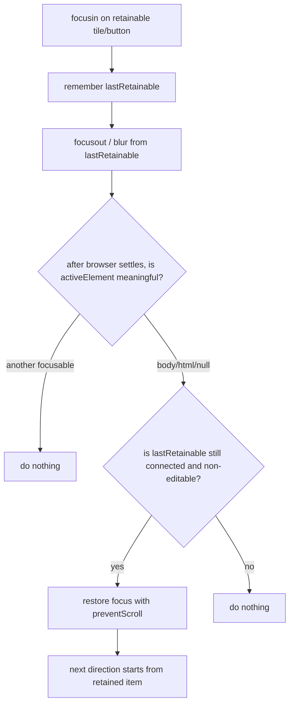

# fix: Prevent spatial focus deselection

## Overview

Fix the spatial-navigation gap where a user can clear the currently active/focused item and leave the UI with no meaningful DOM focus. Korri's TV-style surfaces depend on a single active tile at all times: the visual halo, caption state, and next directional move all derive from `document.activeElement`. The fix should keep this invariant centralized in `korri/shared/navigation/*`, not in Shift home components or Tilegrid cells.

The likely failure mode is pointer-driven blur into `<body>` / `<html>` / no focused element after a click or pointer interaction on non-focusable space. Implementation should start with characterization coverage to confirm the exact trigger, then add a small focus-retention layer that restores the most recent non-editable spatial focus target only when focus falls into that empty state.

## Problem Frame

The pointer-aware navigation requirements established that hover over non-focusable space must not blur the current focus and that the most recently focused tile remains active until another focusable is hovered or directional input moves focus (see origin: `../../01KQGDBJ0CPYZHWA7XQ77VND6P-feat-pointer-aware-spatial-navigation/requirements.md`). The current pointer adapter covers hover gaps, but the reported behavior indicates another interaction path can still deselect the active item, leaving nothing active/focused. That breaks the hybrid desktop/TV model: the user loses visible active state, and the next directional action may fall back to initial focus rather than continuing from the intended tile.

## Requirements Trace

- R1. A non-editable spatial focus target remains focused when pointer interaction would otherwise move focus to no meaningful element.
- R2. After the attempted deselection, the next directional input continues from the retained item rather than from the page's initial focus.
- R3. Clicking or hovering another focusable element still changes focus normally; the retention layer must not trap focus on the old tile.
- R4. Editable controls (`input`, `textarea`, `select`, `[contenteditable]`) preserve normal click-away behavior; the fix must not re-focus a text field after the user clicks elsewhere.
- R5. The behavior is implemented in the shared navigation/input layer and remains component-agnostic. No product or theme component imports focus hooks or navigation libraries.
- R6. Existing pointer semantics remain unchanged: hover focuses focusables, gaps do not blur, right-click on focusables emits `options`, and native context menu behavior outside focusables remains intact.

## Scope Boundaries

- No new selection model and no separate `selectedId` state. DOM focus remains the single source of truth.
- No component-level APIs or per-cell props for focus retention.
- No change to LRUD neighbor selection, Mario-camera scrolling, wheel-as-direction mapping, or input-mode dispatch.
- No focus-ring redesign. The existing Shift focus visuals should simply remain visible because focus is retained.
- No attempt to solve route-remount focus restoration; `korri/shared/navigation/focus-restore.ts` already owns that separate problem.

## Context & Research

### Relevant Code and Patterns

- `korri/shared/input/pointer-adapter.ts` already focuses hover targets, skips editable active elements, ignores touch/pen, and intentionally does nothing when the pointer moves over non-focusable space.
- `korri/shared/input/pointer-adapter.test.ts` covers hover over non-focusable space but does not cover pointer down / click / blur paths that can leave `document.activeElement` empty.
- `korri/shared/navigation/focus-engine.ts` treats `<body>` / `<html>` as no meaningful focus. On a later direction action it falls back to initial focus, which is correct for startup but undesirable after accidental deselection.
- `korri/shared/navigation/start.ts` is the central lifecycle owner for the bus, adapters, input-mode store, diagnostics, and focus engine. It is the right place to wire another navigation-layer side effect.
- `korri/shared/navigation/focus-restore.ts` shows an existing pattern for remembering focus identity and restoring with `focus({ preventScroll: true })`, but it is route-keyed and should not be overloaded for continuous focus-vacuum prevention.
- `korri/shared/primitives/components/Tilegrid/Tilegrid.pointer.story.e2e.ts` is the closest browser regression surface for pointer focus behavior.
- `korri/shared/themes/shift/templates/ShiftHomeRoot.tsx` owns Shift home `focusedId` from delegated `focusin`; the fix should make real DOM focus reliable so this state never has to compensate for a focus vacuum.

### Institutional Learnings

- `docs/solutions/best-practices/decoupled-spatial-navigation-2026-05-01.md` — components stay native HTML; navigation behavior belongs under `korri/shared/input/*` and `korri/shared/navigation/*`.
- `docs/solutions/best-practices/pointer-aware-spatial-navigation-2026-05-01.md` — pointer support should keep `document.activeElement` as the canonical active tile and avoid parallel visual-only state.
- `docs/solutions/ui-bugs/inset-outline-clipped-by-overflow-hidden-2026-05-01.md` — focus bugs need visual/browser-level verification, not just computed-style or unit assertions.

### External References

Skipped. The repo has strong local patterns for pointer adapters, focus restoration, Storybook-driven Playwright coverage, and navigation lifecycle wiring.

## Key Technical Decisions

- **Add focus retention as a navigation helper, not as Tilegrid or Shift state.** Rationale: the invariant is global to spatial navigation. Fixing it in one component would let other focusable surfaces regress.
- **Restore only from a focus vacuum.** The helper should act only when focus leaves a retainable target and, after the browser settles the event, `document.activeElement` is not a meaningful element. If another focusable gained focus, do nothing.
- **Retain non-editable spatial focus targets only.** Rationale: tiles, menu buttons, and launch buttons should stay active; text inputs and editable regions should preserve standard click-away behavior.
- **Prefer post-blur restoration over broad `pointerdown.preventDefault()`.** Rationale: preventing pointer defaults globally risks breaking text selection, native controls, context menus, and click-away semantics. Restoring after the browser creates an empty focus state is narrower and easier to reason about. If characterization proves the browser path clears focus without an observable focusout/blur, add the narrowest pointerdown fallback inside the same helper: only for primary-pointer interaction on non-focusable, non-editable targets while a retainable non-editable element is already focused.
- **Use `focus({ preventScroll: true })` when restoring.** Rationale: matches `focus-engine.ts` and `focus-restore.ts`; the focus layer should not let browser default focus-scroll race Mario-camera or explicit scrolling behavior.
- **Make retention lifecycle-owned by `startSpatialNavigation()`.** Rationale: Storybook HMR and portal startup already dispose/restart navigation through this handle; the new listeners need the same lifecycle discipline.

## Alternative Approaches Considered

- **Fix only `pointer-adapter.ts` with pointerdown prevention:** Smaller if the bug is exclusively caused by pointerdown on blank space, but it is brittle before characterization and risks blocking native pointer defaults. Keep it as a narrow fallback inside the retention helper only if the browser does not emit a useful focusout/blur path.
- **Teach `focus-engine.ts` to remember the last focus origin:** This would make the next directional input continue from the old tile, but it would not preserve the visible active/focused state between the deselection and the next input. The reported issue is that nothing appears active, so real DOM focus must be restored.
- **Patch `ShiftHomeRoot` to keep `focusedId` visually active even when DOM focus is empty:** Rejected because it creates a parallel visual state and violates the established pointer-aware navigation decision that `document.activeElement` is the canonical active tile.

## Open Questions

### Resolved During Planning

- *Should this be fixed in `pointer-adapter.ts`?* No. The pointer adapter should continue translating pointer events into focus/action events. The invariant "spatial focus must not fall into a vacuum" is a navigation state concern and may be triggered by more than `pointermove`.
- *Should body clicks intentionally clear focus?* No for spatial/launcher surfaces. The design goal is one active tile at all times; there is no product behavior for an unselected home rail.
- *Should editable elements be retained?* No. Editable focus follows platform expectations; clicking away from a search input should be allowed to blur it unless a future search UX explicitly traps focus.

### Deferred to Implementation

- The exact browser event sequence that causes the deselection is deferred to characterization. The plan assumes the symptom resolves to a focusout/blur-to-body path, but implementation should confirm by observing `pointerdown`, `mousedown`, `click`, `blur`, `focusout`, and `focusin` ordering before finalizing the helper shape.
- The final helper name (`focus-retention`, `focus-vacuum-guard`, or similar) is implementation-time naming. The module boundary under `korri/shared/navigation/` is the important decision.
- Whether the helper needs an explicit scope option immediately, or can start document-wide with retainable-target filtering, depends on characterization around Storybook dialogs and non-spatial controls.

## High-Level Technical Design

> *This illustrates the intended approach and is directional guidance for review, not implementation specification. The implementing agent should treat it as context, not code to reproduce.*

## Implementation Units

- [x] **Unit 1: Add a shared focus-retention helper**

**Goal:** Provide a small navigation-layer module that remembers the last retainable focus target and restores it only when focus falls into an empty, non-meaningful state.

**Requirements:** R1, R3, R4, R5

**Dependencies:** None.

**Files:**
- Create: `korri/shared/navigation/focus-retention.ts`
- Create: `korri/shared/navigation/focus-retention.test.ts`

**Approach:**
- Export a framework-free creator similar in spirit to `createFocusRestore`, but continuous rather than route-keyed.
- Listen for `focusin` to remember the most recent retainable element. Retain native focusables that are not editable and are not explicitly ignored by existing navigation hints such as `lrud-ignore` / `tabindex="-1"`.
- Listen for `focusout` / blur transitions from the retained element. Schedule a microtask or animation-frame check so the browser has a chance to focus another element first.
- If the settled active element is meaningful, do nothing. If it is `<body>`, `<html>`, or otherwise not meaningful, and the retained element is still connected, restore focus with `preventScroll: true`.
- If characterization shows no focusout/blur event is available for the deselection path, add a narrow pointerdown fallback inside this helper rather than spreading pointer-default prevention into components or the pointer adapter. The fallback should only protect the existing retained focus from non-focusable, non-editable pointer targets.
- Cancel pending restoration when a new retainable focus arrives or when the helper is disposed.

**Execution note:** Start characterization-first: write the focus-vacuum unit scenarios before implementing the helper behavior.

**Patterns to follow:**
- `korri/shared/navigation/focus-restore.ts` for safe DOM focus restoration and disconnected-node caution.
- `korri/shared/navigation/focus-engine.ts` for the definition of meaningful focus and `preventScroll` discipline.
- `korri/shared/input/pointer-adapter.test.ts` for happy-dom event-shape tests around focus behavior.

**Test scenarios:**
- Happy path: focus a button, simulate focus leaving to no meaningful element, allow the scheduled check to run -> the same button becomes `document.activeElement` again.
- Happy path: focus button A, move focus to button B -> the helper records B and does not restore A.
- Edge case: focus a button, remove it from the DOM, then trigger the empty-focus path -> no restore and no throw.
- Edge case: focus an `input`, then blur to empty focus -> the input is not restored.
- Edge case: focus an element with `tabindex="-1"` or inside an ignored navigation region -> it is not retained.
- Error path: dispose the helper while a restore is pending -> no restore occurs and no listener fires after dispose.

**Verification:**
- The helper's tests prove restoration happens only for empty-focus transitions and never when another meaningful target or editable control is involved.

---

- [x] **Unit 2: Wire focus retention into spatial-navigation lifecycle**

**Goal:** Enable the focus-retention helper by default from `startSpatialNavigation()` and dispose it with the rest of the navigation handle.

**Requirements:** R1, R2, R5, R6

**Dependencies:** Unit 1.

**Files:**
- Modify: `korri/shared/navigation/start.ts`
- Modify: `korri/shared/navigation/start.test.ts`
- Modify: `korri/shared/navigation/focus-engine.test.ts` (only if existing startup/initial-focus expectations need clarification)

**Approach:**
- Add an optional `focusRetention?: false | FocusRetentionOptions` option to `StartSpatialNavigationOptions`.
- Start the helper unless explicitly disabled. Keep it independent from the input bus because it observes DOM focus lifecycle, not semantic actions.
- Dispose the helper from the `SpatialNavigationHandle.dispose()` path alongside diagnostics, bus, and input-mode store.
- Keep test setup explicit: tests that assert startup behavior without retention can pass `focusRetention: false`; tests that cover the real navigation handle should leave it enabled.

**Patterns to follow:**
- Existing opt-out options in `start.ts` (`keyboard`, `gamepad`, `pointer`, `wheel`, `inputMode`).
- `start.test.ts` disposal assertions for singleton and DOM side effects.

**Test scenarios:**
- Happy path: `startSpatialNavigation()` installs focus retention; a focused button that blurs to empty focus is restored.
- Happy path: `startSpatialNavigation({ focusRetention: false })` leaves the same blur-to-empty path unrestored.
- Edge case: disposing the handle disables retention; subsequent blur-to-empty does not restore focus.
- Integration: after retention restores a tile, emitting or pressing a direction action uses the restored active element as the current focus origin rather than initial focus.
- Integration: pointer-mode dispatch remains unchanged; restoring focus does not emit input actions and does not flip `data-input-mode`.

**Verification:**
- Navigation startup tests cover enabled, disabled, and disposed states.
- Existing input-mode, pointer, wheel, and focus-engine tests remain valid without test-only global side effects.

---

- [x] **Unit 3: Add browser regression coverage for pointer deselection**

**Goal:** Prove the real browser no longer allows pointer interaction on non-focusable space to leave Tilegrid with no active/focused item.

**Requirements:** R1, R2, R3, R6

**Dependencies:** Unit 2.

**Files:**
- Modify: `korri/shared/primitives/components/Tilegrid/Tilegrid.pointer.story.e2e.ts`
- Modify: `korri/shared/primitives/components/Tilegrid/Tilegrid.story.e2e.ts` (only if directional-after-deselection coverage fits better in the generic spec)
- Modify: `korri/shared/themes/shift/shift.css`

**Approach:**
- Extend the pointer Storybook E2E spec because it already drives the real pointer adapter with Playwright mouse events and asserts `document.activeElement` / `data-input-mode`.
- Add a regression where the test hovers a known tile, clicks or pointer-downs on non-focusable canvas/gap/background space, and asserts the same tile remains focused after the browser settles.
- Add a follow-up assertion that pressing ArrowRight after the attempted deselection moves from the retained tile, not from the first/initial tile.
- Add a guard that clicking another focusable still changes focus normally; retention must not behave like a focus trap.

**Patterns to follow:**
- `korri/shared/primitives/components/Tilegrid/Tilegrid.pointer.story.e2e.ts` for story loading, `focusedAriaLabel`, and `inputMode` helpers.
- `korri/shared/primitives/components/Tilegrid/Tilegrid.story.e2e.ts` for directional movement assertions.

**Test scenarios:**
- Happy path: hover tile N -> tile N is focused; click non-focusable story canvas/gap -> tile N remains focused.
- Happy path: after the attempted deselection, press ArrowRight -> focus changes to a neighbor of tile N rather than restarting from tile 0.
- Edge case: click tile M after tile N is focused -> tile M becomes focused and tile N is not restored.
- Edge case: right-click on non-focusable space still preserves native context-menu behavior from the existing pointer contract.

**Verification:**
- Story-driven Playwright coverage demonstrates the browser-level symptom is fixed on the same surface users interact with.
- Shift tile focus styling remains visible after pointer-driven restoration because the tile halo keys off `:focus`, not `:focus-visible`.

## System-Wide Impact

- **Interaction graph:** Browser focus events feed the new retention helper; semantic input actions still flow through adapters -> bus -> focus engine. The helper does not emit bus actions.
- **Error propagation:** There is no user-facing error path. Invalid or disconnected retained nodes should no-op rather than throw.
- **State lifecycle risks:** Pending restore work must be canceled on new focus, DOM removal, and navigation dispose to avoid restoring stale elements after HMR, route changes, or story reloads.
- **API surface parity:** Portal and Storybook inherit the behavior through `startSpatialNavigation()`. Tests can opt out with `focusRetention: false` when they need to isolate focus-engine behavior.
- **Integration coverage:** Unit tests prove helper rules; Storybook Playwright proves real browser pointer/click focus behavior.
- **Unchanged invariants:** Components remain native HTML; `document.activeElement` stays the source of truth; editable elements keep normal blur behavior; `pointer-adapter.ts` and `wheel-adapter.ts` semantics do not change except where characterization proves the deselection trigger requires a narrow listener adjustment.

## Risks & Dependencies

| Risk | Mitigation |
|------|------------|
| Focus retention could fight legitimate click-away behavior in forms or dialogs. | Do not retain editable elements; restore only from empty focus, never when another meaningful element gains focus; provide a `focusRetention: false` startup escape hatch for isolated surfaces/tests. |
| Restoring focus may race route transitions or HMR disposal. | Check `isConnected` before restore, cancel pending restore on dispose, and wire through `startSpatialNavigation()` lifecycle. |
| Browser event ordering differs from happy-dom characterization. | Add Playwright story coverage that reproduces the pointer/click path in Chromium. |
| Restoring focus could trigger unwanted scroll. | Use `focus({ preventScroll: true })`, matching the focus engine and focus restore modules. |

## Documentation / Operational Notes

- No documentation update is required for the fix unless implementation reveals a reusable focus-retention pattern worth compounding separately. Existing spatial-navigation docs already state the intended invariant.

## Sources & References

- **Origin document:** [../../01KQGDBJ0CPYZHWA7XQ77VND6P-feat-pointer-aware-spatial-navigation/requirements.md](../../01KQGDBJ0CPYZHWA7XQ77VND6P-feat-pointer-aware-spatial-navigation/requirements.md)
- Related solution: [docs/solutions/best-practices/decoupled-spatial-navigation-2026-05-01.md](../../../docs/solutions/best-practices/decoupled-spatial-navigation-2026-05-01.md)
- Related solution: [docs/solutions/best-practices/pointer-aware-spatial-navigation-2026-05-01.md](../../../docs/solutions/best-practices/pointer-aware-spatial-navigation-2026-05-01.md)
- Related code: `korri/shared/input/pointer-adapter.ts`
- Related code: `korri/shared/navigation/focus-engine.ts`
- Related code: `korri/shared/navigation/start.ts`
- Related code: `korri/shared/themes/shift/shift.css`
- Related tests: `korri/shared/primitives/components/Tilegrid/Tilegrid.pointer.story.e2e.ts`
