# Productize Game Stream Runner Contract

## Summary

Productize the validated generic game-stream runner contract by freezing its one-shot launch-intent lifecycle, status semantics, Nix package/module surface, and operator diagnostics. The plan keeps the implementation within the existing runner/intent/module seams and deliberately avoids adding a Korri UI, remote command listener, game registry, or new stream/launcher features.

---

## Problem Frame

The original headless stream proof established the need for a script-triggered streamed game session (see origin: `../../01KRW63S14EZX008ANYWY3P8Z1-feat-headless-game-stream-runner/requirements.md`). Live validation has since narrowed the reusable product boundary: Sunshine should expose one stable app, `Korri Stream`, while a trusted local actor writes a launch intent that the foreground runner completes after a successful session launch. Recoverable startup failures may requeue; malformed or stale intents are quarantined.

The remaining work is not to add capability. It is to make the validated behavior reliable, documented, test-covered, and safe to consume as a real Korri package/module contract.

---

## Requirements

- R1. Expose one generic Sunshine app whose identity is stable and independent of the specific launched game/app.
- R2. Preserve the trusted local launch-intent control plane: a local actor enqueues one structured `LaunchSpec`, and the runner consumes it from a private runtime path.
- R3. Preserve the one-shot lifecycle: a successful session completes the pending intent; recoverable startup failures may requeue; malformed or stale intents quarantine; a later Moonlight launch without a new intent fails/no-ops without launching anything.
- R4. Preserve useful status semantics: no-pending-intent launches must not overwrite the last useful status, while real runner/game failures remain diagnosable.
- R5. Preserve foreground process ownership: clean game exit, non-zero game exit, or explicit stream stop should end the active Sunshine app/session without stopping the Sunshine service.
- R6. Keep arbitrary command/env launch support generic and structured, including per-command env overrides validated for Wayland and Xwayland games. `LaunchSpec.command` must be an absolute executable path, and `LaunchSpec.env` is for non-secret runtime/display overrides.
- R7. Keep reusable Korri surfaces host-agnostic: package, CLI tools, and NixOS module belong here; `aka`/Mountainous host policy stays outside this repo.
- R8. Productize diagnostics and validation guidance so operators can distinguish missing intents, wrong Sunshine app, stale host config, app failure, and real runner defects.
- R9. Treat Sunshine pairing/trusted-network access as the remote launch boundary; public or untrusted Sunshine exposure is unsupported for arbitrary launch intents.

**Origin actors:** A1 (Remote player), A2 (Client trigger), A3 (Headless gaming server), A4 (Streaming client/session)
**Origin flows:** F1 (Start a one-game remote play session), F2 (End a one-game remote play session)
**Origin acceptance examples:** AE1 (launch/connect/fullscreen), AE2 (exit stops session and rerun works), AE4 (stream optimization is not required)

---

## Scope Boundaries

- No Korri app UI integration or library browsing flow.
- No game registry, saved profile database, or per-game Sunshine applications.
- No unauthenticated remote command listener, network API, or new controller protocol.
- No Steam/launcher lifecycle productization in this slice.
- No stream quality, bitrate, latency, resolution, FPS, or encoder tuning.
- No Gamescope/Sway fullscreen architecture redesign beyond preserving existing knobs and validation notes.
- No Mountainous host changes in this Korri plan; external host validation may be referenced but not owned here.
- No broad refactor of existing device/session runners.

### Deferred to Follow-Up Work

- Steam or launcher-style session lifecycle using `session` mode and/or wait monitors.
- A trusted controller that combines enqueueing with Moonlight launch.
- Korri product UI integration for selecting content and producing launch intents.
- Formal per-game launch profiles if repeated env overrides become product data.

---

## Context & Research

### Relevant Code and Patterns

- `tools/device/game-stream-runner.ts` owns foreground lifecycle, lock acquisition, process-group cleanup, Gamescope/Sway integration, status writes, and the no-pending-intent path.
- `tools/device/game-stream-runner.test.ts` covers success, duplicate starts, failures, stop/cleanup, `session` lifecycle, and the current status-preservation behavior.
- `tools/device/game-stream-launch-intent.ts` owns one-shot file-backed intents, trust checks, atomic claim/requeue/complete, stale/malformed quarantine, and CLI intent creation.
- `tools/device/game-stream-launch-intent.test.ts` covers intent decoding, trust boundaries, stale/malformed cases, and CLI launch spec construction.
- `tools/device/game-stream-fullscreen.ts` and `tools/device/game-stream-fullscreen.test.ts` cover the existing Gamescope/Sway containment helpers; this plan preserves them rather than redesigning them.
- `nix/korri-game-stream-runner.nix` packages both `korri-game-stream-runner` and `korri-game-stream-enqueue` as the reusable CLI surface.
- `nix/modules/korri-game-stream.nix` contributes the generic Sunshine app and derives runtime paths from `XDG_RUNTIME_DIR` unless explicitly overridden.
- `flake.nix` exports the runner package/app and `nixosModules.korri-game-stream` for external hosts.

### Institutional Learnings

- `docs/solutions/workflow-issues/generic-game-stream-runner-validation-contract-2026-05-19.md`: validation must enqueue a fresh intent before launching `Korri Stream`; failures after a successful run often mean the one-shot contract was skipped, not that Sunshine broke.
- `docs/solutions/integration-issues/supervise-chromium-kiosk-session-after-game-exit-2026-05-04.md`: one foreground owner should supervise lifecycle and cleanup; avoid broad process killing or scattered launch flags.
- `docs/solutions/integration-issues/one-command-odin-electrobun-deploy-needs-device-nix-and-session-env-2026-05-06.md`: device/session code needs explicit runtime environment handling and real host convergence checks.
- `docs/solutions/best-practices/prefer-real-implementations-over-mocks-2026-05-02.md`: use real temp files, process seams, and host smoke validation rather than tests that only prove mocked assumptions.

### External References

- Not used for this follow-up. Local implementation and live validation are enough; the plan does not introduce new Sunshine, Moonlight, Steam, or Gamescope behavior.

---

## Key Technical Decisions

- Freeze the existing trusted intent file as the product control plane: it is safer than a remote arbitrary-command listener and matches the validated flow when paired with Sunshine authentication on a trusted network or VPN.
- Keep Sunshine generic: the generated app remains `Korri Stream`, and all content-specific launch knowledge stays in the pending `LaunchSpec`.
- Treat `LaunchSpec.env` as the per-command non-secret override layer: base compositor/session environment belongs to the trusted host/session wrapper, while game-specific display overrides such as SDL Wayland or Xwayland display selection belong in the intent.
- Preserve no-pending-intent status by omission: the runner returns failure to Moonlight but does not write a failed status for that path, so the last useful session result remains inspectable.
- Keep retry-preserving behavior before a successful playable launch: malformed/stale intents quarantine, recoverable startup failures may requeue, and a successful launch/session completion consumes the intent.
- Require product acceptance to distinguish disconnect from quit: disconnect preserves the running game/session, while explicit stream stop terminates the runner/game.
- Keep host-specific flake overrides and Sway/Sunshine startup policy outside Korri; this repo owns reusable package/module behavior and diagnostics only.

---

## Open Questions

### Resolved During Planning

- **Should this add a combined client trigger?** No. That is useful later, but it adds controller/auth/scope questions beyond productizing the validated runner.
- **Should the trusted actor be the runner user?** Yes. The intent trust model assumes private runtime files owned by the same non-root user that runs the Sunshine app.
- **Should enqueueing multiple pending intents become a queue?** No. The current single pending intent path is enough; queueing is future product behavior. Until then, latest enqueue wins before claim.
- **Should no-pending overwrite status with a failed state?** No. Live validation proved preserving the prior clean status is more useful for this contract.
- **Should per-game env support be promoted to profiles now?** No. Keep non-secret env in `LaunchSpec` and defer profile/product modeling.
- **Should launched commands rely on PATH lookup?** No. Require absolute executable paths in intents; PATH remains wrapper/tooling support, not game resolution.
- **How should wrapper-level preflight failures report?** Wrapper failures before runner startup are diagnosed through Sunshine output/journal; only failures after the runner starts are required to update `status.json`.

### Deferred to Implementation

- **Exact wording of operator diagnostics:** Preserve the contract and known failure meanings, but final prose can be adjusted while updating the solution doc.
- **Exact Nix validation harness:** Use the lightest repo-consistent verification that proves package/module exports and wrapper behavior without introducing a broad Nix test framework.

---

## High-Level Technical Design

> *This illustrates the intended approach and is directional guidance for review, not implementation specification. The implementing agent should treat it as context, not code to reproduce.*

```mermaid
stateDiagram-v2
  [*] --> PendingIntent: trusted local enqueue
  PendingIntent --> Running: Moonlight launches Korri Stream / runner claims intent
  [*] --> NoIntent: Korri Stream launched without pending intent
  NoIntent --> [*]: exit non-zero; preserve previous status
  Running --> Running: Moonlight disconnects
  Running --> Exited: game exits cleanly
  Running --> Exited: game exits non-zero with exitCode recorded
  Running --> Failed: startup/preflight/fullscreen failure becomes terminal
  Running --> Stopped: Moonlight quit/stop terminates child tree
  Exited --> [*]: Sunshine app session ends; service remains
  Failed --> [*]: status records runner failure; service remains
  Stopped --> [*]: status records termination; service remains
```

The productized contract is intentionally small: enqueue, claim, run, report, and exit. The runner does not select games, manage a library, expose a listener, or own Sunshine service lifecycle.

---

## Implementation Units

### U1. Freeze no-intent and status semantics

**Goal:** Make the validated no-pending-intent behavior an explicit, tested runner contract.

**Requirements:** R3, R4, R5, R8, AE2

**Dependencies:** None

**Files:**
- Modify: `tools/device/game-stream-runner.ts`
- Modify: `tools/device/game-stream-runner.test.ts`

**Approach:**
- Keep no-pending-intent as a preflight failure returned to the caller without spawning a child.
- Avoid writing `status.json` for that specific no-intent path so a previous useful status remains available.
- Keep real preflight, spawn, game, fullscreen, and cleanup failures writing status as they do today.
- Ensure the in-memory runner state after no-intent returns to an idle/no-active-run posture.

**Patterns to follow:**
- `tools/device/game-stream-state.ts` for explicit terminal states.
- Existing runner tests that assert status files through temp runtime directories.

**Test scenarios:**
- Happy path: a missing intent returns preflight failure with the no-intent message, spawns no child, leaves in-memory runner state idle/no-active-run, and does not write or mutate persisted status.
- Edge case: an existing clean `status.json` remains byte-for-byte equivalent after a no-intent launch attempt.
- Edge case: an existing failed or non-clean status is also left untouched by no-intent; consumers must treat no-intent as no new observation.
- Error path: runner-entered preflight failures still write failed status, proving no-intent is the only runner preflight exception.
- Boundary: wrapper-level failures before the runner starts are diagnosed through Sunshine output/journal rather than `status.json`.

**Verification:**
- Runner tests demonstrate no-intent preserves the persisted status file, leaves in-memory state idle/no-active-run, and keeps real runner failures diagnosable.

---

### U2. Lock down the launch-intent contract and CLI examples

**Goal:** Productize structured, trusted, env-bearing launch intents without turning them into a game registry or remote command surface.

**Requirements:** R1, R2, R3, R6, R8

**Dependencies:** U1

**Files:**
- Modify: `tools/device/game-stream-launch-intent.ts`
- Modify: `tools/device/game-stream-launch-intent.test.ts`
- Modify: `tools/device/game-stream-runner.test.ts`

**Approach:**
- Preserve one pending intent path rather than adding a queue, with latest enqueue winning before claim.
- Keep parent directory and intent-file trust checks as the security boundary.
- Keep structured command/args/env/cwd decoding; do not introduce shell-string commands.
- Require `LaunchSpec.command` to be absolute so launched programs do not depend on mutable PATH lookup.
- Clarify through tests that non-secret per-command env overrides are preserved and passed through to the spawned process without being logged.
- Preserve quarantine/requeue semantics around malformed, stale, and failed-startup intents.

**Patterns to follow:**
- `korri/shared/library/launcher.ts` for structured launch specs.
- Existing launch-intent tests around `0600` files, private parent dirs, and stale/malformed quarantine.

**Test scenarios:**
- Happy path: CLI enqueue with absolute command, args, cwd, and env produces a versioned launch intent whose `LaunchSpec` is preserved exactly.
- Happy path: runner spawning receives env-bearing launch specs without shell interpolation or env-value logging.
- Edge case: two enqueues before claim follow latest-wins semantics and do not create an implicit queue.
- Error path: relative command paths are rejected before launch.
- Error path: stale or malformed intents are quarantined and do not wedge later valid intents.
- Boundary: symlinked, wrong-owner, or group/world-accessible intent paths are rejected before launch.

**Verification:**
- Launch-intent and runner tests prove the same contract used by the live SuperTux and Extreme Tux Racer validations is preserved as structured data.

---

### U3. Stabilize package and NixOS module contract

**Goal:** Ensure external hosts can consume the runner through stable Korri flake/package/module surfaces without host-specific assumptions.

**Requirements:** R1, R2, R5, R7, R8

**Dependencies:** U1, U2

**Files:**
- Modify: `nix/modules/korri-game-stream.nix`
- Verify; modify only if build/evaluation fails: `nix/korri-game-stream-runner.nix`
- Verify; modify only if build/evaluation fails: `flake.nix`
- Test: `tools/device/game-stream-runner.test.ts`

**Approach:**
- Verify both installed CLIs remain available: `korri-game-stream-runner` and `korri-game-stream-enqueue`.
- Keep wrapper runtime paths derived from `XDG_RUNTIME_DIR` by default and avoid hard-coded user ids or `/tmp` fallbacks for intents/status.
- Keep the Sunshine app foreground-tracked with `auto-detach = false` and `wait-all = true`.
- Ensure PATH setup supports wrapper preflight and `nix run` prototyping when host policy includes Nix in the configured path, without making launch intents rely on PATH lookup.
- Keep root refusal in the wrapper before runtime side effects and document that this class of failure is journal/output diagnosed.
- If `sessionEnvFile` is used, require the wrapper to reject unsafe files rather than sourcing writable or symlinked environment input.
- Keep the NixOS module app contribution configurable so hosts can opt out if they own Sunshine app config themselves.

**Patterns to follow:**
- `nix/korri-inputd.nix` and `nix/modules/korri-inputd.nix` for package/module option style.
- `flake.nix` for package/app/module exports.
- The existing generated Sunshine app shape in `nix/modules/korri-game-stream.nix`.

**Test scenarios:**
- Integration: the runner tests continue to prove wrapper-fed env values drive intent/status/lock paths correctly once the module exports them.
- Boundary: module defaults do not configure per-game Sunshine apps, Steam commands, or stream tuning settings.
- Boundary: disabling the Sunshine app contribution leaves the package available without forcing app config.
- Error path: unsafe `sessionEnvFile` ownership, permissions, or symlink shape is rejected before sourcing.
- Test expectation: no dedicated Nix module unit test unless implementation identifies an existing repo pattern; package/module completion is verified through flake build/evaluation outcomes.

**Verification:**
- The flake exposes the runner package/app and `nixosModules.korri-game-stream`.
- The runner package builds successfully.
- A consumer can evaluate the module with default and overridden app/path settings without embedding host-specific runtime paths.
- Wrapper-level failures are observable in Sunshine output/journal, while runner-entered failures remain observable through `status.json`.

---

### U4. Reconcile diagnostics and validation documentation

**Goal:** Make the operator-facing contract match the behavior validated on `aka`, including status preservation and per-command env needs.

**Requirements:** R3, R4, R6, R8, AE1, AE2, AE4

**Dependencies:** U1, U2, U3

**Files:**
- Modify: `docs/solutions/workflow-issues/generic-game-stream-runner-validation-contract-2026-05-19.md`
- Modify: `../../01KRW63S14EZX008ANYWY3P8Z1-feat-headless-game-stream-runner/plan.md` only if a narrow note is needed to point readers at this follow-up plan.

**Approach:**
- Update the solution doc so no-pending-intent guidance reflects the final product contract: failure/no-op for Moonlight, no status overwrite.
- Capture the validated env variants as examples of non-secret launch-intent data, not as hard-coded runner behavior.
- Keep diagnostic guidance centered on the runtime status file and Sunshine user journal.
- Clarify the distinction between the generic runner app and any host/profile app with a similar Moonlight name.
- Keep examples generic enough to avoid committing local-only paths as product requirements.

**Patterns to follow:**
- Existing `docs/solutions/` frontmatter and workflow-issue style.
- The repo rule that reusable docs should capture durable learnings, not transient chat transcripts.

**Test scenarios:**
- Test expectation: none -- documentation-only unit; correctness is reviewed against the validated contract and linked code behavior.

**Verification:**
- The solution doc no longer contradicts the no-intent status preservation behavior.
- The doc explains how to validate multiple command/env shapes without implying per-game Sunshine apps or a registry.

---

## System-Wide Impact

- **Interaction graph:** Trusted local enqueue CLI writes an intent; Sunshine launches the generic runner app; runner claims and supervises the launched process; status/logs provide diagnostics. No product RPCs, React UI, or library launch surfaces change.
- **Error propagation:** Runner failures surface through process exit plus status file except for no-intent, where the absence of a new status write is intentional and paired with the process failure.
- **State lifecycle risks:** The main risks are stale status interpretation, competing pending intents, and confusing disconnect with quit. The plan addresses them through explicit tests and documentation rather than new state machinery.
- **API surface parity:** Public surfaces are the CLI commands, flake package/app, and NixOS module options. No HTTP/RPC/API parity work is introduced.
- **Integration coverage:** Unit tests cover file/process/state behavior; final confidence still requires a real-host smoke when consumed by Mountainous or another NixOS host.
- **Unchanged invariants:** Sunshine service availability is preserved; Sunshine does not become a per-game launcher; Korri shared/product UI layers remain untouched.

---

## Risks & Dependencies

| Risk | Mitigation |
|------|------------|
| Documentation still describes the older fixed-game or failed-status behavior | Make documentation reconciliation a dedicated unit and cross-check it against runner tests. |
| No-intent preserving stale status could mislead future status consumers | Document that no-intent is no new observation; only actual launches update status. |
| Per-command env examples become accidental product profiles | Keep non-secret env examples in validation docs and `LaunchSpec` tests only; defer profile modeling. |
| Arbitrary command intents are exposed through Sunshine pairing | State that trusted-network/VPN Sunshine exposure is required and public/untrusted Sunshine exposure is unsupported. |
| Session env files become a code-execution path | Reject unsafe env files before sourcing or keep the option unused on hosts that cannot provide a trusted file. |
| Nix module changes accidentally encode local `aka` assumptions | Keep runtime paths derived from env and put host-specific policy outside Korri. |
| Queue semantics are assumed by future callers | State that there is one pending intent path and no queue in this slice. |
| Live validation relies on external Mountainous state | Treat external validation as acceptance evidence, not as Korri implementation scope. |

---

## Documentation / Operational Notes

- The live validation matrix for this slice is: a direct Nix-runnable game, an SDL Wayland game with per-command env, an Xwayland game with display env, disconnect/reconnect preservation, explicit quit termination, and no-intent status preservation.
- Operator docs should say: enqueue first, launch `Korri Stream` second, inspect runtime `status.json` and the Sunshine user journal when something exits immediately.
- Host docs should keep local flake overrides outside committed Korri module defaults.
- Env examples should be limited to display/session knobs and should not encourage storing secrets in launch intents or quarantine files.

---

## Sources & References

- **Origin document:** [../../01KRW63S14EZX008ANYWY3P8Z1-feat-headless-game-stream-runner/requirements.md](../../01KRW63S14EZX008ANYWY3P8Z1-feat-headless-game-stream-runner/requirements.md)
- Related plan: [../../01KRW63S14EZX008ANYWY3P8Z1-feat-headless-game-stream-runner/plan.md](../../01KRW63S14EZX008ANYWY3P8Z1-feat-headless-game-stream-runner/plan.md)
- Related code: `tools/device/game-stream-runner.ts`
- Related code: `tools/device/game-stream-runner.test.ts`
- Related code: `tools/device/game-stream-launch-intent.ts`
- Related code: `tools/device/game-stream-launch-intent.test.ts`
- Related code: `tools/device/game-stream-fullscreen.ts`
- Related code: `nix/korri-game-stream-runner.nix`
- Related code: `nix/modules/korri-game-stream.nix`
- Related code: `flake.nix`
- Related learning: `docs/solutions/workflow-issues/generic-game-stream-runner-validation-contract-2026-05-19.md`
- Related learning: `docs/solutions/integration-issues/supervise-chromium-kiosk-session-after-game-exit-2026-05-04.md`
- Related learning: `docs/solutions/integration-issues/one-command-odin-electrobun-deploy-needs-device-nix-and-session-env-2026-05-06.md`
- Related learning: `docs/solutions/best-practices/prefer-real-implementations-over-mocks-2026-05-02.md`
