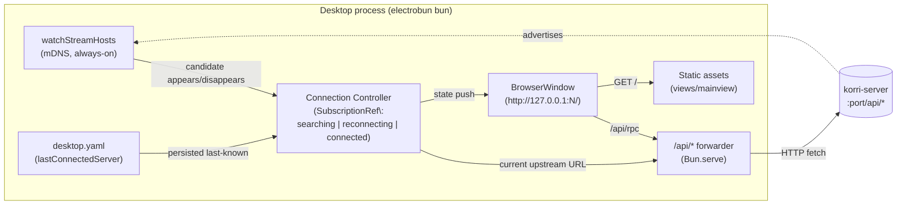

# refactor: Make the desktop a pure korri-server client

## Summary

The electrobun desktop stops bundling the Hono API. Its existing `Bun.serve` is retained for static-asset hosting but its `/api/*` handler is swapped from `honoApp.fetch` to a transparent forwarder that targets the currently-connected `korri-server`. A new connection controller in the desktop bun owns mDNS discovery, YAML config persistence, and upstream selection; a ConnectionGate in the React shell renders the always-searching UI from a signal pushed over electrobun's bun→webview channel. Plus a one-line cleanup that strips electrobun's npm files from the headless `korri-server` Nix output.

---

## Problem Frame

The desktop currently imports and mounts the full Hono app under its own `Bun.serve`, which means two copies of the API run whenever a desktop is co-located with a host running the recently-refactored system `korri-server` service. The desktop also has no way to point at a server on another machine — there is no discovery wiring, no configuration surface, no transport indirection. Library state is whatever the desktop's embedded server reads from its local filesystem. A second, smaller pain: the `korri-server` Nix derivation copies its hermetic `bunDeps` node_modules verbatim into the output, shipping electrobun's npm files even though the headless server runtime never imports them. *(See origin: `./requirements.md`.)*

---

## Requirements

- R1. The electrobun desktop bundle no longer imports `@app/api/hono-app` or any RPC handler module. No Hono `/api/*` handlers are mounted in the desktop process. *(refines origin R1's AE1 wording — see Key Technical Decisions for the Bun.serve interpretation.)*
- R2. The desktop bun process discovers servers via the existing `_korri-stream._tcp` mDNS service type using primitives in `tools/cli/lan-stream-discovery.ts`.
- R3. The desktop maintains a stable boundary that the React shell talks to. Server identity, URL, and selection state are invisible to the React shell — the renderer keeps calling relative `/api/rpc` and reads only an opaque connection-state signal.
- R4. The connection layer is shaped so today's single-server case is the N=1 specialization of future federation. Adding multi-server federation later must not require changes on the React side of the boundary.
- R5. With no `lastConnectedServer` recorded, the desktop auto-connects to the first server discovered.
- R6. With a `lastConnectedServer` recorded, the desktop briefly tries that server first; if it appears during the initial discovery window, it is preferred over other candidates.
- R7. If a remembered server is unreachable, the desktop falls through to general discovery and connects to whatever appears, without surfacing a failure state.
- R8. When no server is reachable, the desktop shows an always-searching state that never times out. Discovery runs continuously. Help text appears after ~30s. The desktop auto-connects the moment a server appears.
- R9. Desktop configuration is persisted as YAML under XDG config home (default `~/.config/korri/desktop.yaml`) and contains at minimum a `lastConnectedServer` record (hostId + controlUrl).
- R10. The headless `korri-server` Nix derivation does not ship electrobun's npm files in its output. `bunDeps` continues to include electrobun for the desktop derivation; only the server output is cleaned.
- R11. The `korri-server` system service's RPC surface (`serverRpcGroup`) exposes the methods the desktop renderer calls — specifically `app.library.list` and `app.library.launch`. This is plan-local (no origin R-ID); discovered during planning when the renderer's call sites were cross-checked against the server-mode surface. *(See Key Technical Decisions: "Expand server RPC surface" and the brainstorm-boundary revision below.)*

**Origin actors:** A1 (Desktop user), A2 (`korri-server` instance), A3 (React shell), A4 (Desktop bun process)
**Origin flows:** F1 (cold boot no remembered), F2 (cold boot remembered reachable), F3 (cold boot remembered unreachable), F4 (no server reachable for extended time)
**Origin acceptance examples:** AE1 (R1, R3 — refined per Key Technical Decisions), AE2 (R5), AE3 (R6), AE4 (R7), AE5 (R8), AE6 (R10)

---

## Scope Boundaries

- No NEW RPC handlers, no schema changes, no changes to `tools/device/korri-server.ts`, the NixOS server module, `korri/products/app/api/hono-app.ts`, the game-stream runner, or any handler bodies. **Revised from the origin's "no changes to RPC schemas or handlers":** existing handlers (`app.library.list`, `app.library.launch`) are registered on the `serverRpcGroup` surface; this is a surface-registration change, not a handler change. See Key Technical Decisions.
- No CORS allowlist changes on the server side. The transport indirection is host-side (in the desktop bun process), not server-side.
- No custom Effect-RPC transport over electrobun's `webview.rpc`. The renderer keeps the HTTP-over-fetch transport unchanged; the bun process makes the upstream switch transparent.
- No splitting of `bunDeps` into headless/desktop variants. R10 is achieved by `rm`-ing in the server's `installPhase`.
- No pairing, TLS, signed mDNS TXT records, or any other transport security work.
- No manual server entry, server-picker UI, or any user-facing server-selection surface.
- No federation implementation (library merge, ID-collision policy, federated launch routing). Only the indirection that makes federation possible is in scope.
- No modifications to the portal deploy (`korri/deploy/portal/`). It is a separate web target with its own Vite proxy.
- No update to `docs/solutions/best-practices/electrobun-desktop-wrapper-loopback-2026-05-01.md`. The doc's static-asset guidance remains accurate; the API-half supersession is a separate compound-engineering task.
- No exhaustive Effect-RPC error-UX redesign for transient forwarder-503s — existing RPC error handling continues to surface them.

### Deferred to Follow-Up Work

- Visual design of the SearchingState component beyond "loud, full-screen, copy + help text after a delay" — left to a UI iteration follow-up.
- Schema extensions to `desktop.yaml` beyond `lastConnectedServer` (e.g., federation preferences) — added when the federation implementation lands.

---

## Context & Research

### Relevant Code and Patterns

- `korri/deploy/desktop/main.ts` — current desktop entry; mounts `Bun.serve`, instantiates the BrowserWindow(s), writes `KORRI_DESKTOP_STATUS_FILE`. The forwarder + connection-state wiring lands here.
- `korri/deploy/desktop/create-desktop-app.ts` — current Hono composition. The `/api/*` handler swap and `honoApp` import removal land here.
- `korri/deploy/desktop/static-assets.ts` — static-asset serving with SPA fallback and traversal protection. Unchanged.
- `korri/deploy/desktop/window-options.ts` — `createDesktopWindowOptions` builds the BrowserWindow config. Preload script wiring lands here.
- `tools/cli/lan-stream-discovery.ts` — existing one-shot `discoverStreamHosts(options)`. Extend with a sibling `watchStreamHosts(handler)` for always-on browsing; keep the one-shot for CLI consumers.
- `tools/device/lan-stream-advertise.ts` — what `korri-server` already publishes; confirms TXT-record shape (`proto`, `hostId`, `caps`) the watcher consumes.
- `korri/shared/api/rpc/client.ts` — Effect-RPC client uses `RpcClient.layerProtocolHttp({ url: "" })` with `prependUrl("/api/rpc")`. **Unchanged** by this plan; relative URL works transparently with the forwarder.
- `korri/products/app/routes/+__root.tsx` — TanStack Router root component. The ConnectionGate wraps `<Outlet />` here.
- `korri/shared/config/xdg-paths.ts` — `xdgConfigHome(env)` and `korriDataPath` helpers; reuse for `~/.config/korri/desktop.yaml` resolution.
- `nix/korri-server.nix` — server derivation. The strip lands in the `installPhase` after `cp -R node_modules`.
- `tools/desktop/desktop-smoke.ts` — currently asserts `/api/health` from the embedded Hono app. Adapts: drop the API check or add a "forwarder-503-without-upstream" assertion.

### Institutional Learnings

- `docs/solutions/best-practices/electrobun-desktop-wrapper-loopback-2026-05-01.md` — documents the existing same-origin loopback pattern. The static-asset half of that guidance remains accurate; the API half is being superseded by the forwarder pattern in this plan.
- `docs/solutions/architecture-patterns/boot-scoped-control-plane-with-session-scoped-runner-2026-05-19.md` — recent pattern that produced the system-mode `korri-server` this plan now treats as the canonical API source.
- `docs/solutions/best-practices/proseql-canonical-library-with-derived-yaml-ids-2026-05-06.md` — establishes YAML as the project's canonical local-state format; reused for `desktop.yaml`.

### External References

- electrobun `BrowserWindow.preload` option (in `node_modules/electrobun/dist-linux-x64/api/bun/core/BrowserWindow.ts`) — accepts a script path executed in the webview before the page loads.
- electrobun `webview.rpc` / `RPCWithTransport` (in `node_modules/electrobun/dist-linux-x64/api/shared/rpc.ts`) — bidirectional bun↔webview channel; used here only for the one-way connection-state signal, not for API traffic.

---

## Key Technical Decisions

- **Bun.serve persists for static assets; the swap is the `/api/*` handler.** AE1's literal "no `Bun.serve` on `127.0.0.1`" is too strict — the BrowserWindow loads `http://127.0.0.1:N/` and needs static-asset serving with SPA fallback. The intent ("no copy of the API runs in the desktop") is preserved by removing the `honoApp` import and replacing the `/api/*` handler with a transparent forwarder. The forwarder has zero RPC handlers, zero business logic, and zero shared code with the server's Hono app.
- **No custom Effect-RPC transport.** Writing an Effect-RPC transport over electrobun's `webview.rpc` would deliver the same indirection at a much higher cost. The forwarder achieves the goal — React sees a stable same-origin `/api/rpc`, the upstream is host-controlled — without touching the renderer's transport layer.
- **No server-side CORS work.** Direct cross-origin from `views://` (or any non-loopback origin) would require permitting that origin in `korri/products/app/api/hono-app.ts`'s CORS middleware, which is dev-only today. Out of scope per brainstorm; forwarder sidesteps it.
- **Connection-state signal flows over electrobun's bun→webview channel, not over HTTP.** The renderer's HTTP transport stays focused on RPC traffic; connection state is a separate one-way push from bun to webview, exposed to React via a small preload-installed bridge.
- **Initial "prefer remembered" window: 1500ms.** Matches the existing default timeout of `discoverStreamHosts`. Within the window, a remembered-server candidate is always preferred; after the window, first candidate wins. Implementation-time tuning is fine but the default is fixed here so the controller has a single semantic.
- **Discovery primitive extended, not replaced.** The one-shot `discoverStreamHosts` keeps existing CLI consumers (`source-aware-play`, `remote-stream-launch`) unaffected. A new `watchStreamHosts(handler): { stop }` lives alongside it for the always-on case.
- **No bunDeps topology change.** `rm -rf "$out/share/korri-server/node_modules/electrobun"` in `nix/korri-server.nix`'s `installPhase` satisfies R10 without restructuring `package.json` or duplicating the hermetic install.
- **Expand server RPC surface to expose existing library handlers.** The renderer calls `app.library.list` and `app.library.launch` (verified in `korri/products/app/features/home/library-source-layer-rpc.ts` and `launcher-layer-rpc.ts`); the system `korri-server` hard-codes `rpcSurface: "server"` (`tools/device/korri-server.ts`), which registers `serverRpcGroup` — a surface that explicitly omits the library methods. Without this expansion, the forwarder reaches the server and 404s on every library call. The fix is two-line: add the existing `appLibraryList` / `appLibraryLaunch` imports to `serverRpcGroup`, and invert the negative test assertions in `korri/products/app/api/server/rpc-server.test.ts` that explicitly forbid them. The handlers themselves are unchanged; the gate they already self-impose (`isHeadlessSourceOnlyEnabled`) continues to apply. Rejected alternative: migrating the renderer to `app.source.*` — would either functionally regress the UI (source returns a stripped `SourceCatalogGame` without metadata, media, or userData) or require expanding source's response shape, which collapses the library-vs-source domain distinction.
- **Presence is a declarative stream, not a callback API.** The watcher exposes `Effect.Stream<HostEvent>`; the connection controller subscribes via `SubscriptionRef<ConnectionState>`. Promoting a candidate to `connected` runs through `Effect.acquireRelease` with a single `GET <controlUrl>/api/health` probe (short timeout, ~500ms). This is the Effect-idiomatic shape: mDNS is the truth source for steady-state presence; the one-shot health probe at acquisition time covers the only race mDNS doesn't (server advertised before HTTP listener bound). No polling, no demote-on-N-failures heuristic, no retry timer.
- **Preload script built as a separate bun target.** `bun build korri/deploy/desktop/preload.ts --target=browser --outfile=out/build/desktop-preload/preload.js`, then copied into `views/mainview/preload.js` via `electrobun.config.ts:copy`. Chosen over hand-written JS (preserves full TS types end-to-end) and over Vite multi-entry (preserves the conceptual boundary that the preload is desktop runtime, not portal output).

---

## Open Questions

### Resolved During Planning

- *Transport for the host ↔ React-shell boundary*: loopback HTTP forwarder + electrobun bun→webview channel for state. Rejected electrobun-IPC-for-RPC (transport cost) and cross-origin direct (server CORS change required).
- *Initial discovery window for remembered server*: 1500ms.
- *Strip mechanism for R10*: single `rm -rf` in `installPhase`. No derivation helper, no parallel strips for other packages.
- *RPC client URL changes*: none. Relative `/api/rpc` works transparently with the forwarder.
- *RPC surface mismatch between renderer and server-mode korri-server*: register existing `app.library.*` handlers on `serverRpcGroup`. New U0 lands ahead of U1.
- *Presence-detection shape*: `Effect.Stream<HostEvent>` + `SubscriptionRef<ConnectionState>` + `Effect.acquireRelease` health probe. No polling.
- *Forwarder error semantics*: 503 when no upstream connected; 502 when upstream `fetch` throws. Implementation-time tuning of the error body shape is fine.
- *Preload build pipeline*: bun build as a separate target; output at `out/build/desktop-preload/preload.js`; copied into `views/mainview/preload.js` via electrobun config.
- *Reconnecting-window tiebreaker*: remembered candidate always wins within the window, even if a non-remembered candidate arrived first. Non-remembered candidates are queued and used iff the window expires without the remembered server appearing.
- *Help-text-elapsed signal*: clock-derived computation in U6 reading `state.helpAfter` carried by U3's state shape. U3 does not emit a help-text-elapsed transition.

### Deferred to Implementation

- *Health-probe timeout exact value*: ~500ms is the planning default; final tuning waits for real-network observation.
- *`desktop-smoke.ts` API check*: drop entirely, or fixture a tiny upstream and exercise the forwarder. Decide based on how much smoke-test fixture infra already exists for the smoke runner.

---

## High-Level Technical Design

> *This illustrates the intended approach and is directional guidance for review, not implementation specification. The implementing agent should treat it as context, not code to reproduce.*

Today's wiring: the controller's `SubscriptionRef<ConnectionState>` always resolves to one server when connected; the forwarder reads `getUpstream()` from it. Future federation: the same `SubscriptionRef` shape is preserved, but `controller.state.server.controlUrl` resolves to a federation dispatcher (local to the desktop bun, or remote) that fans out across N servers. `Forwarder`, `Static`, `Webview`, and the React shell are unchanged. The indirection lives in what "current upstream URL" resolves to.

---

## Implementation Units

### U0. Expose `app.library.*` on the server RPC surface

**Goal:** Register the existing `app.library.list` and `app.library.launch` handlers on `serverRpcGroup` so the system-mode `korri-server` can satisfy the renderer's existing call sites.

**Requirements:** R11

**Dependencies:** none

**Files:**
- Modify: `korri/products/app/api/server/rpc-group.ts`
- Modify: `korri/products/app/api/server/rpc-server.ts`
- Modify: `korri/products/app/api/server/rpc-server.test.ts`

**Approach:**
- In `rpc-group.ts`, add imports for the existing `ListLibraryRpc` and `LaunchLibraryRpc` symbols (already used by `app-rpc-group.ts`) and include them in the `RpcGroup.make(...)` call.
- In `rpc-server.ts`, the live handler layer is built via an **exhaustive** `serverRpcGroup.of({...})` block (Effect-RPC requires every tag in the group to have a handler entry). Add `"app.library.list": handleListLibrary` and `"app.library.launch": handleLaunchLibrary` to that block. Import the two handlers from `../library/list.rpc-handler` and `../library/launch.rpc-handler` — the same imports `korri/products/app/api/handlers.ts` already uses for the app surface. Service deps (`LibrarySource`, `Launcher`) are already provided by `LibraryInfrastructureLive` in this file; no layer composition change needed.
- In `rpc-server.test.ts`, invert the existing negative assertions that explicitly forbid `app.library.list` and `app.library.launch` on `serverTags` — they now must be present. Preserve any other tag-exclusion assertions for handlers that should remain app-only.
- Handlers (`korri/products/app/api/library/list.rpc-handler.ts`, `launch.rpc-handler.ts`) themselves are unchanged. The `isHeadlessSourceOnlyEnabled` gate already in those handlers continues to short-circuit when the server is configured for headless-source-only operation (not the case on aka).

**Patterns to follow:**
- `korri/products/app/api/app-rpc-group.ts` — the canonical pattern for registering RPCs on a surface.
- Existing test assertions in `rpc-server.test.ts` that check tag inclusion vs. exclusion across the two surfaces.

**Test scenarios:**
- Happy path: `serverRpcGroup`'s tags include `app.library.list` and `app.library.launch`.
- Happy path: `serverRpcGroup` continues to include the surfaces it had before (`app.hello.get`, `app.source.list`, `app.source.status`, `app.server.status`, `app.server.stream.prepare`, `app.stream.prepare`).
- Integration: a request for `app.library.list` against the server-mode handler returns a response (or the configured `ValidationError` when `isHeadlessSourceOnlyEnabled` is set in env), not a 404 / unknown-method error.

**Verification:**
- `bun test korri/products/app/api/server/rpc-server.test.ts` is green with the inverted assertions.
- Existing `bun test korri/products/app/api/` suites continue to pass.

---

### U1. Add always-on watcher to `lan-stream-discovery`

**Goal:** Provide a continuous mDNS browse stream alongside the existing one-shot, so the connection controller can subscribe to presence events declaratively.

**Requirements:** R2

**Dependencies:** none

**Files:**
- Modify: `tools/cli/lan-stream-discovery.ts`
- Test: `tools/cli/lan-stream-discovery.test.ts`

**Approach:**
- Add a sibling `watchStreamHosts(options?): Effect.Stream<HostEvent>` function. `HostEvent` is a union: `{ kind: "appear"; candidate: StreamHostCandidate }` or `{ kind: "disappear"; controlUrl: string }`.
- The stream is backed by an `Effect.Stream.async`-style adapter over bonjour-service's `up` / `down` events. Acquiring the stream starts the browser; finalizing it (stream interruption / scope close) destroys the browser and the bonjour instance.
- Extend `BrowserLike` to expose the `up` / `down` event subscription surface (the real `bonjour-service` browser emits both via `EventEmitter`; the current type only models `start`/`stop`). Keep `BonjourLike` factory hook so tests can inject a fake.
- Reuse the existing `candidateFromMdnsService` mapping. Dedup `appear` events by `controlUrl` so multiple TTL refreshes for the same host emit at most one appear. Emit `disappear` only when a prior `appear` was emitted for the same `controlUrl`.
- Keep `discoverStreamHosts` unchanged. Existing CLI consumers (`source-aware-play.ts`, `remote-stream-launch.ts`) continue to use the one-shot.

**Patterns to follow:**
- `discoverStreamHosts` in the same file — `BonjourLike` factory + `candidateFromMdnsService` shape.
- `tools/device/lan-stream-advertise.ts` for the symmetric publish side and the `Service` shape.
- Effect's `Stream.async` / `Stream.asyncEffect` for the EventEmitter-to-Stream adapter.

**Test scenarios:**
- Happy path: fake bonjour emits one `up` → stream yields `{ kind: "appear", candidate }` with the correct `controlUrl`, `hostId`, `capabilities`.
- Happy path: fake bonjour emits `up` then `down` for the same service → stream yields `appear` then `disappear` for the same `controlUrl`.
- Edge case: fake bonjour emits `up` for two distinct services → two `appear` events, distinct `controlUrl`s.
- Edge case: same service emitted via two `up` events (TTL refresh) → only one `appear` (dedup).
- Edge case: `down` for a service that never appeared → stream does NOT yield a spurious `disappear`.
- Edge case: stream interrupted (scope closed) before any service emits → stream closes cleanly; bonjour `destroy` called; no leaked sockets.
- Error path: malformed TXT record (missing `proto` or `hostId`) → not emitted (mirrors `candidateFromMdnsService` filtering).
- Integration with `TestClock`: scope-close timing is deterministic; no real-clock sleeps in the test.

**Verification:**
- Existing `discoverStreamHosts` tests still pass.
- New `watchStreamHosts` tests cover the scenarios above.
- `bun test tools/cli/lan-stream-discovery.test.ts` is green.

---

### U2. Desktop YAML config primitive

**Goal:** Read/write a small YAML config file under XDG config home to persist `lastConnectedServer` across desktop boots.

**Requirements:** R9

**Dependencies:** none

**Files:**
- Create: `korri/deploy/desktop/desktop-config.ts`
- Create: `korri/deploy/desktop/desktop-config.test.ts`

**Approach:**
- Resolve config path via `xdgConfigHome(env)` plus the project subdirectory (`korri/desktop.yaml`).
- Expose `loadDesktopConfig(env?)` returning a typed `DesktopConfig` (or `{}` when missing/corrupt — log a warning, do not throw).
- Expose `saveDesktopConfig(env?, partial)` doing an atomic write (temp file + rename) so partial-write states cannot corrupt the file. Create parent dir if missing.
- Schema (today): `{ lastConnectedServer?: { hostId: string; controlUrl: string } }`. Forward-compat: ignore unknown keys.

**Patterns to follow:**
- `korri/shared/config/xdg-paths.ts` — env-injected path resolution.
- `tools/device/lan-stream-advertise.ts` and `tools/cli/lan-stream-discovery.ts` for the `hostId` / `controlUrl` shape.
- Project YAML usage in `korri/shared/library/proseql/` — `yaml` package, schema validation on read.

**Test scenarios:**
- Happy path: save then load round-trips a `lastConnectedServer` record.
- Happy path: load with missing file returns `{}` (no throw).
- Edge case: load with empty file returns `{}`.
- Edge case: partial save (only `lastConnectedServer` provided) preserves any unrelated future keys when re-saving (forward-compat).
- Error path: corrupt YAML returns `{}` and logs a warning.
- Error path: missing parent directory is created on save.
- Integration: concurrent save races resolve to one valid final file (atomic rename — single fs.rename, not partial writes).

**Verification:**
- `bun test korri/deploy/desktop/desktop-config.test.ts` is green.
- Manual: invoke save, observe `~/.config/korri/desktop.yaml` with expected YAML structure.

---

### U3. Connection controller

**Goal:** Own the searching/reconnecting/connected state for the desktop. Expose a `SubscriptionRef<ConnectionState>` that the forwarder reads (for current upstream) and the preload subscribes to (for the renderer signal). Compose the discovery stream, the YAML config, and the health-probe-gated promotion into one Effect program.

**Requirements:** R3, R4, R5, R6, R7, R8

**Dependencies:** U1, U2

**Files:**
- Create: `korri/deploy/desktop/connection.ts`
- Create: `korri/deploy/desktop/connection.test.ts`

**Approach:**
- Expose `makeConnectionController(deps: { watcher: Stream<HostEvent>; configIO; httpProbe; clock? })`. Returns an Effect that, when run in a scope, starts the controller and yields `{ state: SubscriptionRef<ConnectionState>; ... }`. `state` is what callers subscribe to.
- State shape (discriminated union):
  - `{ status: "searching"; since: Date; helpAfter: Date }`
  - `{ status: "reconnecting"; server: { hostId; controlUrl }; since: Date; helpAfter: Date }`
  - `{ status: "connected"; server: { hostId; controlUrl } }`
  - `helpAfter` is carried on both pre-connected variants so U6's read is uniform.
- On scope start:
  - Read config. If `lastConnectedServer` is present, initial state is `reconnecting(server)` with `helpAfter = now + 30s`; otherwise `searching` with the same `helpAfter`.
  - Fork a fiber consuming the watcher `Stream<HostEvent>`.
  - Initial "prefer remembered" window of 1500ms: within the window, remembered-server appearance always wins (even if a non-remembered candidate appeared first — the non-remembered candidate is queued, not committed). On window expiry without the remembered server, the first queued candidate (or next to arrive) is promoted.
  - Promotion to `connected` runs through `Effect.acquireRelease`: acquire = `httpProbe(<controlUrl>/api/health)` with ~500ms timeout; on success, set state to `connected(server)` and persist via `saveDesktopConfig`; on failure, treat the candidate as if it hadn't appeared and continue consuming the stream. Release = no-op (mDNS disappear handles teardown).
  - When connected and the current server's `disappear` arrives on the stream, transition back to `searching` (with a fresh `helpAfter`). Config retains the last server so the next boot still prefers it.
- Inject `watcher`, `configIO`, `httpProbe`, and `clock` so tests can drive timelines with `TestClock` and fake the probe outcome.

**Patterns to follow:**
- Effect-RPC plumbing under `korri/shared/api/rpc/` for `Effect`/`Layer` style.
- `tools/device/game-stream-runner.ts` for "owns a long-running consumer and exposes state" shape.
- Effect's `SubscriptionRef`, `Stream.runForeach`, `Effect.race`, `Effect.acquireRelease` — the idiomatic composition.

**Test scenarios** *(all use `TestClock` for deterministic timing and a stubbed `httpProbe`)*:
- Happy path: cold boot, no config, stream emits one `appear(A)`, probe succeeds → state advances `searching` → `connected(A)`; config persisted with A's `hostId` + `controlUrl`.
- Happy path: cold boot, config with `A`, stream emits `appear(A)` within window, probe succeeds → `reconnecting(A)` → `connected(A)`; idempotent write.
- Edge case: cold boot, config with `A`, stream emits `appear(B)` within window, then `appear(A)` later in the same window → A wins (preferred); probe-A succeeds → `connected(A)`; B is dropped.
- Edge case: cold boot, config with `A`, only `appear(B)` within window; B is queued; window expires → probe-B succeeds → `connected(B)`; config updated.
- Edge case: cold boot, config with `A`, no candidates within window → state transitions `reconnecting` → `searching`. Later `appear(B)` arrives → probe-B succeeds → `connected(B)`.
- Edge case: cold boot, config with `A`, window expires, `appear(A)` arrives later → probe-A succeeds → `connected(A)`.
- Edge case: probe failure path — stream emits `appear(A)`, probe-A fails → state stays in current pre-connected status; if `appear(B)` arrives later with probe-B success → `connected(B)`. Verifies the acquireRelease integration.
- Edge case: connected to A, stream emits `disappear(A)` → state goes `searching` with a fresh `helpAfter`; config retains A.
- Edge case: connected to A, stream emits `disappear(A)` then `appear(B)`, probe-B succeeds → `connected(B)`; config updated to B.
- Error path: `configIO` rejects on read → controller treats as empty config and starts in `searching` (verified at this layer in addition to U2).
- Integration: scope finalization closes the watcher stream, cancels the timer fiber, and prevents post-finalization subscribers from receiving updates (no leaked Effect fibers or timers).

**Verification:**
- `bun test korri/deploy/desktop/connection.test.ts` is green.
- All scenarios covered with `TestClock` + injected probe outcomes; no real mDNS, no real HTTP, no wall-clock sleeps.

---

### U4. API forwarder and desktop main rewiring

**Goal:** Replace the embedded Hono `/api/*` mount with a transparent forwarder, remove the `@app/api/hono-app` import, and integrate the connection controller into the desktop bootstrap.

**Requirements:** R1, R3

**Dependencies:** U3

**Files:**
- Create: `korri/deploy/desktop/api-forwarder.ts`
- Create: `korri/deploy/desktop/api-forwarder.test.ts`
- Modify: `korri/deploy/desktop/create-desktop-app.ts`
- Modify: `korri/deploy/desktop/main.ts`
- Modify: `tools/desktop/desktop-smoke.ts`

**Approach:**
- `api-forwarder.ts`: export a Hono handler factory `createApiForwarder({ getUpstream }): (request: Request) => Promise<Response>`. `getUpstream` is `() => string | undefined` (typically `() => SubscriptionRef.get(controller.state).pipe(...)` read synchronously by the caller, or a closure that observes the latest snapshot). If `undefined`, return 503 with an `{ error: "no upstream" }` body. Otherwise rewrite the URL onto `<upstream>/api/...` (preserving method, headers, body, query) and `fetch` it.
- Header handling on forwarding:
  - Request: strip `Host`, `Connection`, `Content-Length` (Bun re-computes). Pass everything else through.
  - Response: strip `Content-Encoding`, `Content-Length`, `Transfer-Encoding`, `Connection`. Bun's `fetch` auto-decompresses gzip, so `Content-Encoding` would lie about the body's encoding; `Content-Length` set by an upstream that was compressing would also lie about the byte count. Bun's outgoing HTTP server recomputes `Content-Length` for the response. Pass everything else through.
  - On upstream `fetch` throw (network error): return 502 with `{ error: "upstream unreachable" }` body; do not crash the desktop process.
- `create-desktop-app.ts`: drop the `import { honoApp } from "@app/api/hono-app"`. Replace `app.all("/api*", c => honoApp.fetch(c.req.raw))` with `app.all("/api*", c => forwarder(c.req.raw))` where `forwarder` is passed in via `CreateDesktopAppOptions`. Keep the existing `/__korri/native-input-diagnostic` route and static-asset serving as-is.
- `main.ts`: build a connection-controller scope (Effect runtime), pass `getUpstream` (closure over the controller's `SubscriptionRef`) into `createApiForwarder`; pass the forwarder into `createDesktopApp`. Subscribe to the SubscriptionRef and push every transition to open BrowserWindows (the U5 bridge). Start the controller before opening BrowserWindows. Tear down on shutdown (close the controller scope, which finalizes the watcher stream).
- `desktop-smoke.ts`: remove the `/api/health` assertion (no embedded API to test). Either drop API checks entirely, or add a smoke that exercises the forwarder against a tiny fixture upstream — pick whichever requires less new infra. Surface the choice in the test file's preamble.

**Patterns to follow:**
- Existing `create-desktop-app.ts` composition shape — keep it thin and additive.
- `korri/shared/api/http/media-assets.ts` for streaming-response handling patterns if needed.

**Test scenarios:**
- Happy path: forwarder with `getUpstream` returning a fixture base URL → `POST /api/rpc` with JSON body forwards to the fixture and returns its response (status, headers, body).
- Happy path: GET `/api/health` forwards and returns the fixture's response.
- Happy path: fixture upstream returns a `Content-Encoding: gzip` response with auto-decompressed body via Bun → forwarder response strips `Content-Encoding`; browser receives raw bytes matching the expected content; no double-decoding.
- Edge case: `getUpstream` returns `undefined` → 503 with `{ error: "no upstream" }`-shaped JSON body and no outbound fetch attempted.
- Edge case: upstream `fetch` throws (network error) → 502 with `{ error: "upstream unreachable" }` body; do not crash the desktop process.
- Edge case: request includes `Host` / `Connection` / `Content-Length` headers → those are stripped before forward; `Accept`, `Authorization`, custom `x-feature-gates` are preserved.
- Edge case: large request bodies stream correctly (no truncation, no memory blowup) — verify via fixture echo upstream with a multi-MB payload.
- Integration: switching the upstream returned by `getUpstream` between two fixtures mid-test routes subsequent requests to the new target.
- Integration: `create-desktop-app.ts` returns a Hono app whose `/api/*` routes invoke the forwarder, whose `/` returns the SPA shell, and whose `/__korri/native-input-diagnostic` continues to work.

**Verification:**
- `bun test korri/deploy/desktop/api-forwarder.test.ts` is green.
- `bun build korri/deploy/desktop/main.ts --target=bun --outfile=/tmp/desktop.js` succeeds and the produced bundle does not contain `appRpcGroup` or `serverRpcHandler` symbols (or any other unambiguous Hono-app marker — grep the output).
- `bun run tools/desktop/desktop-smoke.ts` exits 0 with the updated assertions.

---

### U5. Preload script and bun↔webview connection-state bridge

**Goal:** Push connection-state transitions from the desktop bun to the webview so the React shell can render the searching/reconnecting/connected UI.

**Requirements:** R3, R4, R8

**Dependencies:** U3, U4

**Files:**
- Create: `korri/deploy/desktop/preload.ts`
- Modify: `korri/deploy/desktop/window-options.ts`
- Modify: `korri/deploy/desktop/main.ts`
- Create: `korri/deploy/desktop/connection-state-bridge.ts` (shared state-shape type + type guard, consumed by preload and the React hook)
- Test: `korri/deploy/desktop/preload.test.ts` (preload installation, type-guard rejections, malformed-payload handling)

**Approach:**
- `preload.ts`: TypeScript source bundled separately as a browser-target via `bun build korri/deploy/desktop/preload.ts --target=browser --outfile=out/build/desktop-preload/preload.js`. Installs `window.__korriConnection`: an object with `getState()`, `subscribe(listener): () => void`, and an internal listener list. The preload overrides electrobun's built-in `window.__electrobun.receiveMessageFromBun` stub (or hooks into it, depending on electrobun's preload-ordering semantics observed at implementation time) so incoming bun-pushed state updates fan out to subscribers.
- `electrobun.config.ts`: add `"out/build/desktop-preload/preload.js": "views/mainview/preload.js"` to the `copy:` map so the bundled preload ships into the desktop bundle.
- Justfile / build recipes: the `desktop-build` recipe (and `desktop-dev` watch mode) invokes the preload bundling step before `electrobun build`. If a single combined recipe doesn't already exist, add the bun-build invocation as a prerequisite.
- `window-options.ts`: add `preload` to the BrowserWindow options, resolving the script path relative to electrobun's `PATHS`.
- `main.ts`: subscribe to the controller's `SubscriptionRef<ConnectionState>`; on each transition, push the state to every open BrowserWindow via electrobun's bun→webview send.
- `connection-state-bridge.ts`: a tiny module exporting the state-shape type and a type guard. Used by the preload (to validate incoming) and the React hook (to consume). Lives next to its primary consumer rather than in a new shared subdirectory — matches the `korri/shared/utils/browser-uuid.ts` location precedent for this kind of cross-context tiny module.
- Renderer integration in U6.

**Patterns to follow:**
- electrobun's `RPCWithTransport` shape in `node_modules/electrobun/dist-linux-x64/api/shared/rpc.ts` — use it for the one-way push, not for round-trip API calls.
- `korri/shared/utils/browser-uuid.ts` for the "tiny module shared between bun and renderer" pattern.

**Test scenarios:**
- Happy path: preload script run against a `window` fixture installs `__korriConnection` with `getState()` and `subscribe()` callable.
- Happy path: incoming valid state payload triggers all subscribers with the new state and updates `getState()`'s return.
- Edge case: subscribe before any state arrives → `getState()` returns initial `searching` state.
- Edge case: unsubscribe stops further deliveries to that listener but does not affect others.
- Error path: malformed incoming payload (missing `status`) → ignored, subscribers not invoked, no throw.
- Integration: end-to-end — connection controller transitions through `searching → connected` and a subscriber installed via the preload receives both events in order. *(Use a desktop-side test harness that drives the controller and asserts what would reach the preload — full electrobun integration is out of unit-test scope.)*

**Verification:**
- `bun test korri/deploy/desktop/preload.test.ts` is green (the type-guard tests live in the same file per the safe_auto fix above).
- `bun build korri/deploy/desktop/preload.ts --target=browser --outfile=/tmp/preload-check.js` succeeds; the produced bundle is self-contained (no runtime `require`/`import` calls remain).
- Manual: launch desktop with no server running and observe the React shell receives `searching` state on load (verified by the U6 UI rendering).

---

### U6. ConnectionGate and SearchingState in the React shell

**Goal:** Wrap the app's routed content with a gate that renders the searching/reconnecting UI when no upstream is connected, and renders the normal route tree only when connected.

**Requirements:** R8

**Dependencies:** U5

**Files:**
- Create: `korri/products/app/features/connection/ConnectionGate.tsx`
- Create: `korri/products/app/features/connection/SearchingState.tsx`
- Create: `korri/products/app/features/connection/use-connection-state.ts` (imports the type guard from `korri/deploy/desktop/connection-state-bridge.ts`)
- Modify: `korri/products/app/routes/+__root.tsx`
- Test: `korri/products/app/features/connection/ConnectionGate.test.tsx`
- Test: `korri/products/app/features/connection/SearchingState.test.tsx`

**Approach:**
- `use-connection-state.ts`: `useSyncExternalStore`-style hook that subscribes to `window.__korriConnection` and returns the current state. Default initial state is `searching` (matches preload). When `window.__korriConnection` is undefined (e.g., during portal / non-desktop builds, tests, Storybook), the hook returns `connected` with a stub server so the gate doesn't block non-desktop contexts. This preserves the portal deploy without special-casing.
- `ConnectionGate.tsx`: reads `useConnectionState()`; when `connected`, renders children. Otherwise renders `SearchingState` with the current status passed in.
- `SearchingState.tsx`: full-screen loud UI. Variants: `searching` (no server known), `reconnecting` (server name displayed if available). Help text appears when `Date.now() > state.helpAfter` (computed in U3, plumbed through preload). Use `useEffect` + `setInterval` (or `setTimeout` to the helpAfter moment) to trigger the help-text appearance without polling.
- `+__root.tsx`: wrap the existing `<Suspense>` + `<Outlet />` with `<ConnectionGate>`.

**Patterns to follow:**
- `korri/shared/primitives/` for any layout/typography atoms used by the searching screen.
- Existing TanStack Router setup in `+__root.tsx`.
- Existing test patterns under `korri/products/app/features/*` for component tests.

**Test scenarios:**
- Happy path: `useConnectionState` returns `connected` → ConnectionGate renders children.
- Happy path: state `searching` → SearchingState renders with searching copy; help text is absent before `helpAfter`.
- Happy path: state `reconnecting` with server `name` → SearchingState renders with reconnecting copy and the server name.
- Edge case: `helpAfter` already elapsed at mount → help text shows immediately.
- Edge case: help text appears after the `helpAfter` moment passes (verified by advancing fake timers).
- Edge case: hook installed in a context without `window.__korriConnection` → returns connected stub, gate renders children (preserves portal / Storybook / tests).
- Edge case: state transitions `searching → connected` → SearchingState unmounts, children mount.
- Integration: ConnectionGate wraps the route tree without breaking TanStack Router's `<Outlet />` semantics.

**Verification:**
- `bun test korri/products/app/features/connection` is green.
- Manual / Storybook: render `SearchingState` in `searching` and `reconnecting` variants; verify help text appears after delay.

---

### U7. Strip electrobun from `korri-server` Nix output

**Goal:** Stop shipping electrobun's npm files in the headless `korri-server` derivation closure.

**Requirements:** R10

**Dependencies:** none

**Files:**
- Modify: `nix/korri-server.nix`

**Approach:**
- In `nix/korri-server.nix`'s `installPhase`, after `cp -R node_modules "$out/share/korri-server/node_modules"`, add `rm -rf "$out/share/korri-server/node_modules/electrobun"`.
- Add `installCheckPhase = "test ! -d $out/share/korri-server/node_modules/electrobun"` and `doInstallCheck = true` to the derivation so the build itself fails if a future change regresses the strip. This is more authoritative than the module-eval fixture, which evaluates NixOS module configuration (not the built derivation's output).

**Patterns to follow:**
- Existing `nix/korri-server.nix` `installPhase` structure.
- Standard `installCheckPhase` / `doInstallCheck` pattern for derivation output assertions.

**Test scenarios:**
- Test expectation: derivation-level. The `installCheckPhase` is the test — it runs as part of the build and fails if `electrobun/` is present post-strip. No separate test file needed.

**Verification:**
- `nix build .#korri-server` succeeds.
- `find $(nix path-info .#korri-server)/share/korri-server/node_modules -maxdepth 1 -name electrobun -print` produces no output.
- A `nix build` invocation with a deliberately broken strip line (temporarily) fails with the `installCheckPhase` message, confirming the gate is active. (Spot-check during implementation, not a permanent test.)

---

## System-Wide Impact

- **Interaction graph:** desktop bun's connection controller becomes a new long-lived Effect scope alongside the existing `Bun.serve` and BrowserWindow management. mDNS browser sockets are open for the lifetime of the desktop process. Sunshine and the game-stream runner are unaffected.
- **Error propagation:** RPC calls from the React shell during the searching/reconnecting state are gated by `ConnectionGate` and should not reach the forwarder. If they do (race or future code), the forwarder returns 503 and Effect-RPC surfaces it as a request error. Probe failures during connection acquisition are observed by the controller (not surfaced to the renderer); the renderer simply observes the controller continuing to search.
- **State lifecycle risks:** `desktop.yaml` writes use atomic rename to avoid corruption. The controller's Effect scope must be finalized on shutdown so the watcher stream is interrupted, the reconnecting-window fiber is cancelled, and the mDNS browser is destroyed. `SubscriptionRef` subscribers added by the preload-push fanout must be cleaned up on window close.
- **API surface parity:** `tools/cli/lan-stream-discovery.ts`'s existing `discoverStreamHosts` is unchanged; the new `watchStreamHosts` is additive (Effect Stream return type). `korri/products/app/api/server/rpc-group.ts` gains two existing-handler registrations (`app.library.list`, `app.library.launch`); the system service now serves them via the same handlers the app surface already used.
- **Integration coverage:** end-to-end ("desktop boots, finds server, library renders") will be verified manually before merge — automated cross-process tests for desktop ↔ server are out of scope.
- **Unchanged invariants:** `korri/shared/api/rpc/client.ts` (relative `/api/rpc`), `korri/products/app/api/hono-app.ts` (no CORS allowlist changes), all RPC handler bodies, all RPC schemas, the system `korri-server` service binary, the game-stream runner, the Sunshine wrapper. The brainstorm's "server side is unchanged" boundary is revised: existing handlers may be registered on additional surfaces (U0); no handler bodies change.

---

## Risks & Dependencies

| Risk | Mitigation |
|------|------------|
| Electrobun's `BrowserWindow.preload` semantics or `webview.rpc` shape differ across versions / platforms — preload may not execute reliably before page scripts. | Read electrobun's API at implementation time; if preload timing is unreliable, fall back to injecting `__korriConnection` via `webview.executeJavaScript` after window load; gate the React app on hook availability with a stub-when-absent fallback (already part of U6). |
| Effect-RPC's HTTP transport may have nuances when forwarding through a same-origin proxy (streaming, chunked encoding, header forwarding). | The forwarder is request/response, not streaming; `RpcClient.layerProtocolHttp` uses standard fetch semantics. Tests in U4 cover header passthrough and large-body cases. |
| `bun build` may inline the Hono app via transitive imports we missed. | U4's verification step grep-checks the bundle output for unambiguous Hono-app markers; if found, trace the import chain and prune. |
| The mDNS browser may not detect a server starting after the desktop has been running for hours (bonjour-service behavior). | U1's tests verify the appear-event path against a fake bonjour; real-world reliability is verified manually before merge. If issues surface, the controller can add periodic re-browse as a low-cost mitigation. |
| `desktop-smoke.ts` adaptation may leave gaps in pre-merge coverage. | The smoke test's purpose is HTTP composition sanity, not API testing — adapt to test the forwarder mount + static assets + diagnostic endpoint. If forwarder fixture is too costly, drop the API check and rely on U4's targeted forwarder tests. |
| `desktop.yaml` schema evolution: federation may want richer state. | U2 explicitly ignores unknown keys on read so a future field addition is backward-compatible with old desktops. |
| Health probe on connection acquisition may itself time out on a slow but healthy server. | ~500ms timeout is the planning default; tunable at implementation time. A failed probe just means the candidate is treated as if it hadn't appeared — the stream is still open, so a later success (probe-resends as bonjour re-emits, or fresh `appear` events) recovers the candidate. The user observes "searching" instead of "connected then broken," which is the right error UX. |
| Preload bun-build adds a build step that could drift out of sync with `electrobun build`. | Wire the preload bundling as a prerequisite of `desktop-build` in justfile so it cannot be forgotten; watch-mode (`desktop-dev`) includes preload as a watched target. |
| Electrobun's built-in preload (`window.__electrobun.receiveMessageFromBun` stub) ordering vs. user preload | Verify at implementation time which preload runs first. If user preload runs first, it must be re-installed after electrobun's; if user preload runs second, it can override the stub directly. Either path is supported; the test for the preload installs a fake `window` and asserts the final-state global is the user's, not electrobun's. |

---

## Documentation / Operational Notes

- After merge, `docs/solutions/best-practices/electrobun-desktop-wrapper-loopback-2026-05-01.md` is out of date for the API-half of the desktop composition. Updating that doc is **deferred to a separate `se-compound` task** per Scope Boundaries — the static-asset guidance remains accurate, but a reader should not be misled into thinking the desktop still mounts the Hono app. Add a brief note at the top of that doc (or in a new compound doc) when the supersession happens.
- No NixOS module changes; existing aka deployment continues to work. The desktop, once shipped, will simply find aka's `korri-server` via mDNS.
- No rollout flag — the desktop has no users in production today; the change ships as part of the next desktop build.

---

## Sources & References

- **Origin document:** `./requirements.md`
- Related code: `korri/deploy/desktop/`, `tools/cli/lan-stream-discovery.ts`, `tools/device/lan-stream-advertise.ts`, `korri/shared/api/rpc/client.ts`, `nix/korri-server.nix`
- Related solutions: `docs/solutions/best-practices/electrobun-desktop-wrapper-loopback-2026-05-01.md`, `docs/solutions/architecture-patterns/boot-scoped-control-plane-with-session-scoped-runner-2026-05-19.md`
- electrobun API surface: `node_modules/electrobun/dist-linux-x64/api/bun/core/BrowserWindow.ts`, `node_modules/electrobun/dist-linux-x64/api/shared/rpc.ts`
