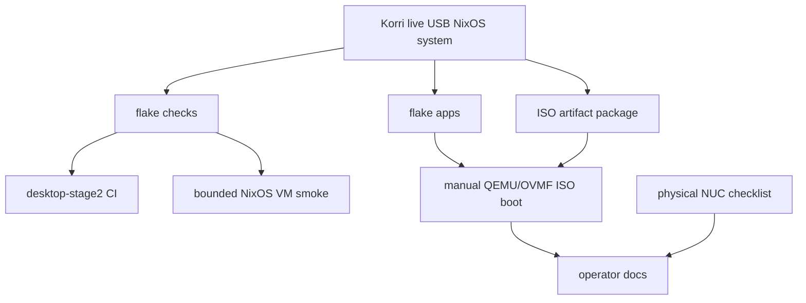

# feat: Add Live USB Validation Surfaces

## Summary

Add flake-native validation surfaces for the x86 live USB kiosk so automated checks, CI, and manual operator validation all use discoverable Nix interfaces. The canonical ISO remains a `packages` output, cheap unattended validation moves into `checks`, and heavier QEMU/OVMF/manual boot validation becomes opt-in through flake `apps` rather than default CI.

---

## Problem Frame

The x86 live USB kiosk now has a buildable ISO artifact and local smoke tests, but validation is split between Bun tests and `just` recipes. Operators and implementers need an idiomatic NixOS/flakes entrypoint that makes clear what is proven by default, what can be run manually in QEMU, and what still requires physical NUC acceptance. This plan follows the live USB product requirements while extending the completed implementation plan in `../01KS923C1JWK7FJAB54SSQJ350-feat-x86-live-usb-kiosk/plan.md`.

---

## Requirements

- R1. Preserve `packages.x86_64-linux.korri-kiosk-live-iso` as the canonical live USB artifact. *(origin R1, R2)*
- R2. Add discoverable flake `checks` for unattended live USB validation that are safe for default local/CI use. *(origin R2, R3, R17)*
- R3. Add a bounded NixOS VM orchestration check that validates the live USB system shape without claiming to prove firmware/USB ISO boot. *(origin R3, R5, R16, R17)*
- R4. Expose manual flake `apps` for VM and QEMU live ISO validation, including an opt-in path for same-stick persistence topology. *(origin AE1, AE6)*
- R5. Keep full ISO/OVMF boot, same-stick persistence QEMU modeling, physical NUC boot, controller, LAN discovery, and Moonlight streaming out of flake `checks` and the default CI gate for this slice. *(origin R6, R7, R8, R15, R18)*
- R6. Document what each validation surface proves, does not prove, and when operators should use it. *(origin success criteria, AE1-AE7)*
- R7. Keep flake evaluation portable across non-x86 and non-Linux systems by guarding x86-only checks/apps consistently. *(repo flake convention)*

**Origin actors:** A1 (Player/operator), A2 (x86 live USB kiosk), A3 (Discovered Korri server), A4 (Stream runtime)
**Origin flows:** F1 (Boot into Korri kiosk), F2 (Discover server content), F3 (Launch a remote stream), F4 (Persist client settings)
**Origin acceptance examples:** AE1 (boot appliance/no installer), AE2 (wired input/network), AE3 (standard discovery), AE4 (remote catalog), AE5 (Moonlight launch), AE6 (USB persistence), AE7 (failure clarity)

---

## Scope Boundaries

- Do not replace the existing live ISO artifact or rename `korri-kiosk-live-iso`.
- Do not make full QEMU/OVMF ISO boot a default `nix flake check` or default CI gate in this slice.
- Do not require `/dev/kvm`, host USB passthrough, real LAN discovery, real Moonlight/Sunshine pairing, or physical controllers for default checks.
- Do not use manual QEMU success as a substitute for physical NUC acceptance.
- Do not redesign the live USB persistence resolver, discovery behavior, Moonlight launcher, or kiosk UI unless validation exposes an unavoidable integration seam.
- Do not introduce USB-specific discovery or aka-specific behavior through validation fixtures.

### Deferred to Follow-Up Work

- Promote ISO/OVMF boot to a required CI/release gate after runtime cost and builder capabilities are proven.
- Add richer graphical kiosk assertions, screenshots, or OCR once a stable graphics test harness exists.
- Add hardware-lab automation for physical NUC, wired controller, LAN discovery, and Moonlight stream acceptance.
- Add a polished same-stick disk-image builder if manual QEMU persistence validation proves useful enough to productize.

---

## Context & Research

### Relevant Code and Patterns

- `flake.nix` already exposes `packages.x86_64-linux.korri-kiosk-live-iso` from `korriKioskLiveUsbSystem.config.system.build.isoImage`, guarded by `isX86Linux`.
- `nix/images/common.nix` exposes `mkLiveUsbKioskSystem`, which is the right composition source for checks and validation variants.
- `nix/images/live-usb.nix` imports NixOS ISO machinery, wires `korri-live-usb-persistence.service`, configures kiosk XDG roots under persistence, and disables internal-disk-adjacent mutation surfaces like swap, udisks2, and gvfs.
- `nix/images/platforms/x86.nix` owns x86 platform facts: seatd, input/render/seat/video groups, UDP 5353, `moonlight-embedded`, and kiosk environment variables.
- `tools/testing/nix/korri-image-outputs-eval.test.ts` and `tools/testing/nix/korri-image-outputs-eval.fixture.nix` are the existing pattern for asserting flake/Nix image output shape through Bun-driven Nix eval.
- `tools/testing/nix/korri-live-usb-safety-eval.test.ts` already exercises the persistence resolver contract at shell level and should remain the fast focused safety test.
- `tools/testing/nix/korri-live-usb-smoke.test.ts` currently dry-builds the ISO and checks deployment docs; this plan should either keep it as a convenience wrapper or point it at the new flake-native surfaces.
- `.github/workflows/desktop-stage2.yml` is the current Nix/image validation workflow and should be the integration point for cheap named checks if CI wiring changes.

### Institutional Learnings

- `docs/solutions/architecture-patterns/boot-scoped-control-plane-with-session-scoped-runner-2026-05-19.md`: NixOS/systemd shape needs real eval/check coverage; TypeScript tests alone do not prove unit ordering, paths, assertions, or runtime directories.
- `docs/solutions/workflow-issues/generic-game-stream-runner-validation-contract-2026-05-19.md`: validation docs should name the contract, execution order, and evidence locations so operators know what passed and where to inspect failures.
- `docs/solutions/integration-issues/supervise-chromium-kiosk-session-after-game-exit-2026-05-04.md`: kiosk validation should treat the appliance session as an invariant, not merely prove that a binary launched once.
- `docs/solutions/best-practices/electrobun-desktop-wrapper-loopback-2026-05-01.md`: keep heavy/native runtime validation opt-in and provide layered readiness checks before full interactive launch.

### External References

- Nix flakes recognize `checks.<system>.*`, `packages.<system>.*`, `apps.<system>.*`, and `nixosConfigurations.*` as standard output surfaces under `nix flake check`.
- Nixpkgs documents `pkgs.testers.runNixOSTest` as the current out-of-tree interface for NixOS VM tests.
- NixOS exposes `config.system.build.vm` for direct QEMU VM validation of a NixOS configuration; it does not prove ISO firmware/USB boot.
- NixOS exposes `config.system.build.isoImage` for live ISO artifacts.
- Nixpkgs `nixos/tests/boot.nix` is the reference pattern for QEMU/OVMF ISO or USB boot checks, but that class of test is heavier and should be opt-in here.

---

## Key Technical Decisions

| Decision | Rationale |
|----------|-----------|
| Keep artifacts in `packages` | `packages` is the idiomatic surface for buildable outputs like the live ISO and avoids mixing artifacts with runnable validation commands. |
| Put unattended validation in `checks` | `checks` makes validation discoverable through `nix flake check` and gives CI a stable named target. |
| Expose manual validation through `apps` | Operators should be able to run QEMU/VM validation with `nix run .#...`; `just` may wrap this, but should not be the source of truth. |
| Separate VM smoke from ISO boot proof | `config.system.build.vm` and NixOS VM tests validate system/module behavior; only QEMU booting the ISO validates firmware, EFI, ISO layout, and USB-like boot behavior. |
| Keep heavy ISO/OVMF checks opt-in | QEMU/OVMF boot and same-stick persistence topology are valuable but costlier, less hermetic, and often depend on builder capabilities. |
| Prefer test-instrumented validation variants when needed | VM checks may use marker clients or test-only overrides to avoid flaky graphical assertions, as long as docs and names avoid overstating coverage. |

---

## Open Questions

### Resolved During Planning

- Default validation tier: use cheap default checks plus bounded VM orchestration; leave ISO/OVMF boot and same-stick persistence QEMU validation manual or opt-in.
- Flake surface split: use `packages` for artifacts, `checks` for unattended validation, and `apps` for manual runners.
- Evidence boundary: VM/system checks must not claim to prove actual live USB firmware boot or physical NUC behavior.

### Deferred to Implementation

- Exact validation surface names: choose final names during implementation, but keep them descriptive enough to distinguish flake checks for config/build/VM orchestration from manual apps for ISO boot and persistence modes.
- Exact VM client strategy: prefer the real kiosk wiring where reliable; use a marker client only if needed to keep the VM check deterministic and explicitly document what that means.
- Exact QEMU flags and firmware package: follow nixpkgs patterns for QEMU/OVMF, with implementation-time adjustment for the pinned nixpkgs version and host support.
- Exact same-stick persistence QEMU topology details: implementation should model a repo-local raw USB disk image with boot media and a sibling `KORRI-PERSIST` partition attached through QEMU USB storage. If that topology proves too heavy or brittle, defer the persistence runner rather than weakening it into a misleading non-USB check.

---

## Validation Surface Matrix

| Surface | Example shape | Default gate? | Proves | Does not prove |
|---------|---------------|---------------|--------|----------------|
| Artifact package | `packages.x86_64-linux.korri-kiosk-live-iso` | Build when selected | ISO derivation exists and builds | Runtime boot behavior |
| Cheap check | `checks.x86_64-linux.korri-live-usb-config` | Yes | Flake/module wiring and safety invariants evaluate | Guest runtime behavior |
| VM orchestration check | `checks.x86_64-linux.korri-live-usb-vm-smoke` | Yes if bounded | Systemd ordering, persistence fallback, kiosk orchestration in VM | EFI/USB ISO boot, real GUI quality, physical hardware |
| Direct VM app | `apps.x86_64-linux.korri-live-usb-vm` | Manual | Operator can run the NixOS VM from `config.system.build.vm` for interactive system validation | ISO firmware/USB boot, same-stick persistence topology, CI-grade hermeticity, physical NUC acceptance |
| ISO/QEMU app | `apps.x86_64-linux.korri-live-usb-qemu` | Manual | Operator can boot the ISO in QEMU/OVMF and inspect logs | CI-grade hermeticity, same-stick persistence topology, physical NUC acceptance |
| Persistence QEMU app | `apps.x86_64-linux.korri-live-usb-qemu-persistence` | Manual/opt-in | Same-stick-ish persistence topology under QEMU USB storage | Full physical USB controller/media behavior |
| Physical NUC checklist | Deployment docs | Manual | Real target hardware acceptance | Automated regression coverage |

---

## High-Level Technical Design

> *This illustrates the intended approach and is directional guidance for review, not implementation specification. The implementing agent should treat it as context, not code to reproduce.*

The source of truth remains the live USB NixOS composition. Validation surfaces fan out from that composition with explicit cost and evidence boundaries.

---

## Implementation Units

### U1. Define flake-native validation outputs

**Goal:** Establish the named `checks` and `apps` contract for live USB validation without changing the canonical ISO package.

**Requirements:** R1, R2, R4, R7

**Dependencies:** None

**Files:**
- Modify: `flake.nix`
- Modify: `tools/testing/nix/korri-image-outputs-eval.fixture.nix`
- Modify: `tools/testing/nix/korri-image-outputs-eval.test.ts`
- Modify: `docs/deployment/korri-images.md`

**Approach:**
- Add an x86-only `checks` attrset for live USB validation surfaces.
- Keep `packages.x86_64-linux.korri-kiosk-live-iso` unchanged as the artifact source.
- Add placeholder or initial cheap check derivations only where they already prove a concrete invariant; avoid introducing no-op checks that create false confidence.
- Add x86-only `apps` names for manual validation runners as they are implemented in later units.
- Preserve evaluation on other flake systems by guarding all x86-only checks/apps with the existing `isX86Linux` pattern.

**Execution note:** Start with failing eval coverage for the desired flake output names and platform guards before wiring the outputs.

**Patterns to follow:**
- `flake.nix` optional attrs around existing x86-only packages.
- `tools/testing/nix/korri-image-outputs-eval.*` JSON fixture pattern.

**Test scenarios:**
- Happy path: evaluating x86 flake outputs shows `korri-kiosk-live-iso` still present under `packages`.
- Happy path: evaluating x86 flake outputs shows the new cheap check under `checks`.
- Happy path: evaluating x86 flake outputs shows manual validation apps under `apps` once implemented.
- Edge case: evaluating non-x86 systems does not reference x86-only packages, QEMU runners, or live USB checks.
- Error path: accidental removal or renaming of `korri-kiosk-live-iso` fails the existing image output eval test.

**Verification:**
- The flake exposes distinct artifact, check, and app surfaces with names that communicate their evidence level.
- Existing live ISO package consumers are not broken.

---

### U2. Add cheap live USB config/build checks

**Goal:** Add unattended flake checks that validate live USB module/image invariants without booting QEMU.

**Requirements:** R2, R5, R6, R7

**Dependencies:** U1

**Files:**
- Modify: `flake.nix`
- Create: `nix/tests/korri-live-usb-config-check.nix`
- Modify: `tools/testing/nix/korri-live-usb-safety-eval.test.ts`
- Modify: `tools/testing/nix/korri-live-usb-smoke.test.ts`
- Modify: `docs/deployment/korri-images.md`

**Approach:**
- Add a cheap x86-only check derivation that evaluates the live USB NixOS system and asserts static invariants: ISO USB/EFI boot flags, persistence service ordering, kiosk XDG roots, Moonlight client environment, disabled swap/udisks/gvfs, and no generic label-only persistence assumption.
- Keep resolver shell behavior covered by the existing focused Bun safety tests; do not duplicate every shell fixture in Nix.
- Decide whether the existing `korri-live-usb-smoke` Bun test should remain as a convenience wrapper, assert the new check exists, or invoke a named check in dry-run mode.
- If adding an ISO build check under `checks`, name it clearly as an artifact-build check and avoid conflating it with boot validation.

**Execution note:** Add failing assertions for the specific invariants before adding the check derivation.

**Patterns to follow:**
- `tools/testing/nix/korri-live-usb-safety-eval.test.ts` for resolver-specific invariants.
- `tools/testing/nix/korri-image-outputs-eval.fixture.nix` for Nix-evaluated JSON summaries.
- `nix/images/live-usb.nix` for the source invariants.

**Test scenarios:**
- Happy path: the cheap check evaluates the live USB system and succeeds when ISO USB/EFI boot flags and live persistence settings are present.
- Happy path: the check confirms `korri-kiosk.service` is ordered after `korri-live-usb-persistence.service`.
- Happy path: the check confirms Korri desktop/Moonlight state roots live under the live USB persistence root.
- Edge case: non-x86 flake systems do not expose or evaluate the x86 live USB config check.
- Error path: disabling swap safety, udisks/gvfs safety, or persistence ordering causes the check or fixture assertion to fail.

**Verification:**
- A cheap named flake check catches configuration regressions without launching QEMU.
- Existing resolver safety tests still cover USB-transport and fallback behavior.

---

### U3. Add a bounded NixOS VM orchestration check

**Goal:** Validate that the live USB kiosk system can reach a deterministic NixOS VM runtime checkpoint with persistence, kiosk, and input orchestration wired correctly.

**Requirements:** R2, R3, R5, R6

**Dependencies:** U1, U2

**Files:**
- Modify: `flake.nix`
- Modify: `nix/images/common.nix`
- Create: `nix/tests/korri-live-usb-vm-smoke.nix`
- Modify: `tools/testing/nix/korri-image-outputs-eval.fixture.nix`
- Modify: `tools/testing/nix/korri-image-outputs-eval.test.ts`
- Modify: `docs/deployment/korri-images.md`

**Approach:**
- Use `pkgs.testers.runNixOSTest` for an out-of-tree NixOS VM test derivation.
- Expose or reuse a live USB module-list seam from `nix/images/common.nix` that separates live USB runtime/persistence/kiosk modules from the ISO media module. The ISO package/config check should include the ISO module; the VM test should reuse the runtime/persistence/kiosk module list while excluding ISO-only filesystem/media wiring that is only valid when booting the actual ISO.
- Compose from the VM-safe live USB runtime/kiosk modules, adding only test-specific overrides required for deterministic VM execution.
- Prefer testing service orchestration and runtime markers over brittle graphical assertions.
- If the real Electrobun/Sway session is unreliable in the VM, use a clearly named marker client or service override so the check validates kiosk orchestration rather than desktop rendering.
- Assert the VM reaches a meaningful checkpoint: multi-user target, persistence service completed, expected persistent-or-ephemeral marker exists, input service is active or intentionally stubbed, kiosk service has the expected dependency chain, and no internal-disk mutation surfaces are introduced.

**Execution note:** Treat this as a characterization-style integration check: define the checkpoint first, then adjust the test-specific module overrides only as needed to make the checkpoint deterministic.

**Patterns to follow:**
- `nix/images/common.nix` composition helpers.
- `nix/modules/korri-kiosk.nix` service ordering and environment conventions.
- Nixpkgs `pkgs.testers.runNixOSTest` pattern for VM tests.

**Test scenarios:**
- Happy path: evaluating x86 flake outputs shows the VM smoke check under `checks`.
- Happy path: the NixOS VM reaches `multi-user.target` and the live USB persistence service completes.
- Happy path: with no attached persistence partition, the VM records the documented ephemeral fallback marker rather than hanging or touching an internal disk.
- Happy path: kiosk startup is ordered after persistence and sees the expected XDG/Moonlight environment.
- Edge case: the VM check can run without host LAN, host USB, real controller, Moonlight pairing, or KVM-specific assumptions.
- Error path: if persistence service ordering is removed or the kiosk points outside the live USB state root, the VM check fails with a diagnostic tied to the service/config layer.

**Verification:**
- The flake exposes a bounded VM smoke check that validates runtime orchestration.
- The check documentation explicitly says it does not prove ISO firmware/USB boot or physical NUC behavior.

---

### U4. Add manual QEMU and VM flake apps

**Goal:** Let operators manually validate the live USB system and ISO through discoverable `nix run` commands.

**Requirements:** R4, R5, R6

**Dependencies:** U1

**Files:**
- Modify: `flake.nix`
- Create: `nix/apps/korri-live-usb-qemu.nix`
- Create if the direct VM runner owns nontrivial behavior: `nix/apps/korri-live-usb-vm.nix`
- Modify: `docs/deployment/korri-images.md`
- Modify: `justfile`

**Approach:**
- Expose a fast direct-VM app based on `config.system.build.vm` from the VM-safe live USB runtime/kiosk composition, not from the ISO-media composition; keep it inline in `flake.nix` if it is only a thin generated-VM wrapper, and move it to `nix/apps/korri-live-usb-vm.nix` only if it owns prerequisite messaging, evidence paths, log handling, or mode labeling.
- Expose a live ISO QEMU app that boots the built ISO under QEMU/OVMF where supported, prints the ISO path, uses deterministic defaults, and writes logs/evidence under `out/`.
- Expose a separate persistence-focused app or mode that models a repo-local raw USB disk image with boot media and a sibling `KORRI-PERSIST` partition attached through QEMU USB storage, so the resolver's USB-transport invariant is actually exercised.
- Make QEMU/KVM/OVMF host requirements explicit at runtime; fall back to slower emulation only if practical and clearly reported.
- Keep `just` recipes as thin shortcuts around `nix run .#...` so the flake remains the canonical interface.

**Execution note:** Start with app-discovery/eval tests, then add the runner behavior behind those names.

**Patterns to follow:**
- Existing `apps` definitions in `flake.nix` for runtime entrypoints.
- `just device-run` and `live-usb-smoke` as examples of thin operator conveniences.
- Nixpkgs QEMU/OVMF ISO boot patterns for manual runner options.

**Test scenarios:**
- Happy path: `apps.x86_64-linux` exposes a direct VM runner and a live ISO QEMU runner.
- Happy path: manual runner docs name the expected evidence directory and the logs/operators should inspect.
- Edge case: on unsupported host systems, apps are absent or fail early with a clear prerequisite message rather than evaluating broken x86-only paths.
- Edge case: the persistence validation mode is clearly separate from the ephemeral ISO boot mode.
- Error path: missing QEMU/OVMF prerequisites produce actionable output and do not masquerade as Korri boot failures.

**Verification:**
- Operators can discover manual validation through `nix flake show` and run it through `nix run`.
- Manual runner output distinguishes artifact path, boot mode, persistence mode, and evidence/log locations.

---

### U5. Wire CI and operator documentation to the new tiers

**Goal:** Make the new validation surfaces usable in day-to-day development, CI, and manual NUC proof without overstating what each tier verifies.

**Requirements:** R2, R5, R6

**Dependencies:** U1, U2, U3, U4

**Files:**
- Modify: `.github/workflows/desktop-stage2.yml`
- Modify: `docs/deployment/korri-images.md`
- Modify: `README.md`
- Modify: `justfile`
- Modify: `tools/testing/nix/korri-live-usb-smoke.test.ts`

**Approach:**
- Add named cheap flake checks to the existing Nix/image workflow if they are bounded enough for CI.
- Avoid invoking full ISO/OVMF QEMU boot from the default workflow in this slice; document it as manual via flake apps.
- Update deployment docs with a validation tier table: package build, cheap check, VM smoke, manual ISO QEMU, persistence QEMU, physical NUC acceptance.
- Keep `just live-usb-smoke` as a convenience entrypoint, but have it point to or describe the flake-native surfaces instead of becoming a parallel contract.
- Add a short README pointer if the live USB artifact and validation commands are now part of the public baseline outputs.

**Execution note:** Characterize the current CI command/path behavior before changing workflow gates.

**Patterns to follow:**
- `.github/workflows/desktop-stage2.yml` existing Nix/image validation stage.
- `docs/deployment/korri-images.md` operator-facing image documentation.
- `tools/testing/nix/korri-live-usb-smoke.test.ts` dry-build/docs smoke convention.

**Test scenarios:**
- Happy path: documentation lists all validation surfaces with command shape, purpose, expected evidence, and limitations.
- Happy path: CI references only named cheap checks unless a separate opt-in/heavy lane is intentionally added.
- Edge case: `just live-usb-smoke` remains useful for developers who do not remember the flake output names.
- Error path: docs warn that VM smoke does not prove firmware/USB ISO boot and QEMU does not replace physical NUC acceptance.
- Integration: workflow path triggers include new `nix/tests/**` or app files so validation changes run when relevant.

**Verification:**
- Developers have one obvious default validation path and one obvious manual validation path.
- CI and docs agree on what is default, manual, and opt-in.

---

## System-Wide Impact

- **Interaction graph:** `flake.nix` becomes the public validation contract tying NixOS system composition, checks, apps, CI, and docs together.
- **Error propagation:** Check failures should identify whether the failure is static config/eval, VM orchestration, QEMU prerequisite, ISO boot, or manual physical acceptance.
- **State lifecycle risks:** Manual QEMU persistence validation may create mutable disk images and logs; those must live under ignored/local output paths and never touch host disks implicitly.
- **API surface parity:** Existing packages and app names should remain stable; new checks/apps are additive.
- **Integration coverage:** Default checks cover configuration and bounded VM orchestration; manual apps cover interactive ISO/VM validation; physical NUC docs remain the final hardware acceptance layer.
- **Unchanged invariants:** No aka-specific discovery behavior, no internal-disk installer, no Wi-Fi/Bluetooth requirement, no Moonlight pairing UX, and no change to the canonical live ISO artifact.

---

## Risks & Dependencies

| Risk | Mitigation |
|------|------------|
| Default checks become too slow or flaky | Keep ISO/OVMF boot and same-stick persistence topology opt-in; default only cheap eval/build and bounded VM orchestration. |
| VM check gives false confidence about ISO boot | Name and document VM smoke as system orchestration evidence, not firmware/USB evidence. |
| QEMU runner accidentally validates only ephemeral mode | Split ephemeral and persistence modes, and document which mode is running. |
| Non-x86 flake evaluation breaks | Guard checks/apps with existing `isX86Linux`/Linux predicates and add eval coverage. |
| Manual runner touches host state unexpectedly | Use repo-local ignored output directories, explicit disk image paths, and clear cleanup instructions. |
| CI builders lack virtualization support | Keep VM checks and manual QEMU apps named separately; only add VM checks to CI after confirming builder capability and cost. |

---

## Documentation / Operational Notes

- `docs/deployment/korri-images.md` should become the canonical operator guide for live USB build, flake checks, QEMU validation, persistence validation, and physical NUC acceptance.
- Manual QEMU app output should print the ISO path, boot mode, persistence mode, log/evidence directory, and next physical validation step.
- CI docs or comments should explain why full ISO boot remains manual/opt-in for now.
- A future `/se-compound` entry may be useful after implementation because the repo does not yet have an institutional learning about flake-native QEMU/VM validation tiers.

---

## Sources & References

- **Origin document:** [../01KS923C1JWK7FJAB54SSQJ350-feat-x86-live-usb-kiosk/requirements.md](../01KS923C1JWK7FJAB54SSQJ350-feat-x86-live-usb-kiosk/requirements.md)
- Completed implementation plan: [../01KS923C1JWK7FJAB54SSQJ350-feat-x86-live-usb-kiosk/plan.md](../01KS923C1JWK7FJAB54SSQJ350-feat-x86-live-usb-kiosk/plan.md)
- Related code: `flake.nix`
- Related code: `nix/images/common.nix`
- Related code: `nix/images/live-usb.nix`
- Related code: `nix/images/platforms/x86.nix`
- Related tests: `tools/testing/nix/korri-image-outputs-eval.test.ts`
- Related tests: `tools/testing/nix/korri-live-usb-safety-eval.test.ts`
- Related tests: `tools/testing/nix/korri-live-usb-smoke.test.ts`
- Related docs: `docs/deployment/korri-images.md`
- External docs: Nix flakes output schema for `checks`, `packages`, and `apps`
- External docs: Nixpkgs `pkgs.testers.runNixOSTest`
- External docs: NixOS `config.system.build.vm` and `config.system.build.isoImage`
- External docs: Nixpkgs `nixos/tests/boot.nix` QEMU/OVMF boot-test pattern
