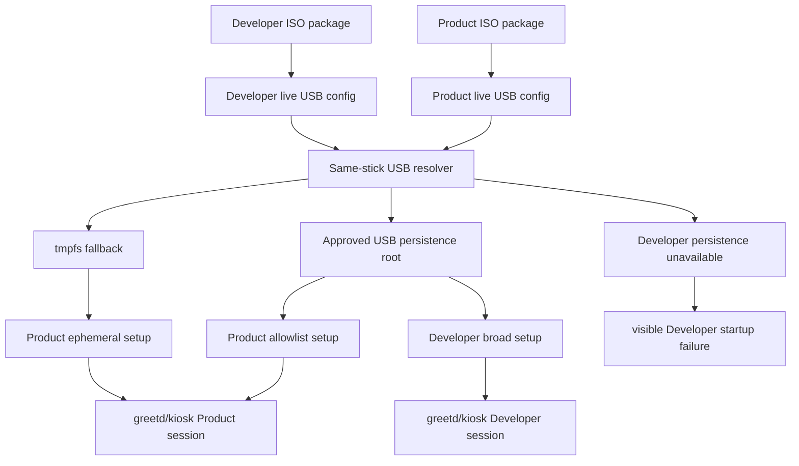

# feat: Add Product and Developer Live USB Persistence

## Summary

Implement the live USB persistence split as two x86 ISO artifacts: the existing Product ISO becomes allowlisted and locked by default, while a new Developer ISO keeps broader writable state for investigation. Both artifacts keep Korri's same-stick USB resolver as the storage authority, with a concrete local allowlist inspired by Impermanence rather than direct `nix-community/impermanence` adoption in this slice.

---

## Problem Frame

The current live USB implementation already resolves a same-stick `KORRI-PERSIST` partition safely, but it routes the kiosk home and XDG roots broadly under the persistent mount. That is convenient for development, but it is broader than the Product ISO contract: the delivered appliance should only retain explicitly selected state and should otherwise reset like a locked live system.

---

## Requirements

- R1. Support two live USB persistence artifacts: default Product ISO and explicit Developer ISO.
- R2. Keep all persistent writes scoped to the approved same-stick USB persistence area; never use the host internal disk.
- R3. Keep the delivered Product ISO image/root behavior effectively locked between upgrades; Developer persistence may retain investigation state but must not make the ISO/Nix store a mutable full install.
- R4. Preserve the Product ISO as the default/canonical live USB artifact.
- R5. Product ISO persistence is allowlisted by files/directories, not broad home/root persistence.
- R6. Product ISO persists Korri client settings/preferences and Moonlight client state required for reboot-to-reboot stream usability.
- R7. Product ISO persists explicitly scoped setup/continuity state for enabled network/input/device services, a stable Korri-owned device identity, and bounded diagnostics; categories without an enabled owning service are documented as no-op in this slice.
- R8. Developer persistence is delivered as a separate Developer ISO artifact, not a selectable mode in the Product ISO.
- R9. Developer ISO may persist broad writable state for investigation without changing the Product ISO allowlist.
- R10. Developer ISO must be visibly distinguishable from the Product ISO.
- R11. Developer ISO must be hard to enter accidentally from the normal player/operator path.
- R12. Missing or unsafe persistence must never fall back to internal disks or unrelated writable devices.
- R13. Missing or unsafe persistence must produce a clear non-persistent/failure signal.

**Origin actors:** A1 (Player/operator), A2 (Developer/operator), A3 (Korri live USB kiosk), A4 (USB persistence area)
**Origin flows:** F1 (Product boot with selective persistence), F2 (Developer boot with broad persistence), F3 (Persistence unavailable or unsafe)
**Origin acceptance examples:** AE1 (product allowlist survives, broad state does not), AE2 (Developer ISO broad state survives and is labeled), AE3 (unsafe/missing persistence does not touch internal disk), AE4 (product incidental runtime changes do not alter delivered system shape)

---

## Scope Boundaries

- Do not persist the whole OS/root filesystem in the Product ISO.
- Do not turn either ISO into a mutable full NixOS install on USB.
- Do not add runtime UI switching between Product and Developer persistence.
- Do not add a boot-menu/kernel-arg Developer mode inside the Product ISO.
- Do not weaken the same-stick USB persistence invariant for Developer convenience.
- Do not persist broad `/etc`, `/var`, `/home`, browser caches, or package-manager state in the Product ISO.
- Do not make broad Developer persistence imply open SSH; `debugSsh.authorizedKeys` remains a separate explicit gate.

### Deferred to Follow-Up Work

- Direct `nix-community/impermanence` adoption: revisit only if same-stick persistence can be mounted early enough without weakening USB identity validation.
- Polished migration/reset tooling for existing broad-home persistence partitions: this plan should prevent unsafe reuse and document manual reset or known-state handling, but not build a full migration UI.
- Polished persistence-state UI beyond a minimal Developer/Product running-session indicator: a simple visible marker is in scope; a broader settings/diagnostics surface is not.
- Wi-Fi setup UX or Bluetooth pairing UX: persist service-specific state only when those services are actually enabled by the live USB product.

---

## Context & Research

### Relevant Code and Patterns

- `nix/images/live-usb-runtime.nix` owns the current persistence module, service ordering, kiosk XDG roots, and resolver environment.
- `nix/images/live-usb-persistence-resolver.sh` is the existing storage safety authority: it derives the boot USB from `/iso`, requires USB transport, accepts only a sibling `KORRI-PERSIST` partition, and otherwise mounts tmpfs with an ephemeral marker.
- `nix/images/live-usb.nix` imports NixOS ISO machinery and should remain ISO-media-specific.
- `nix/images/common.nix` provides `mkLiveUsbKioskSystem` and `mkLiveUsbKioskRuntimeSystem`; extend these composition seams rather than duplicating platform/product modules.
- `flake.nix` currently exposes `packages.x86_64-linux.korri-kiosk-live-iso`, `checks.x86_64-linux.korri-live-usb-config`, `checks.x86_64-linux.korri-live-usb-vm-smoke`, and QEMU apps for live USB validation.
- `nix/tests/korri-live-usb-config-check.nix` asserts static live USB invariants and currently encodes broad persistent home assumptions that must change.
- `tools/testing/nix/korri-live-usb-safety-eval.test.ts` exercises the resolver through a shell harness and should be the primary no-internal-disk regression surface.
- `nix/tests/korri-live-usb-vm-smoke.nix` validates runtime ordering and fallback in a bounded VM; it must not claim to prove physical USB or ISO firmware behavior.
- `docs/deployment/korri-images.md` is the canonical operator-facing contract for image outputs, persistence partition setup, validation tiers, and physical acceptance.

### Institutional Learnings

- `docs/solutions/architecture-patterns/boot-scoped-control-plane-with-session-scoped-runner-2026-05-19.md`: derive paths, ownership, environment, and assertions from an explicit mode option; fail closed for unsafe user/path combinations.
- `docs/solutions/integration-issues/runtime-mask-essway-to-stop-emulationstation-relaunching-during-odin-kiosk-sessions-2026-05-03.md`: prefer reversible runtime/session changes over mutating the underlying system image.
- `docs/solutions/integration-issues/supervise-chromium-kiosk-session-after-game-exit-2026-05-04.md`: enforce kiosk/session invariants through the session owner rather than trusting scattered flags.
- `docs/solutions/architecture-patterns/kiosk-foreground-app-policy-over-gamescope-overlay-2026-05-24.md`: product semantics belong to the session layer; compositor/Moonlight details should remain adapters.
- `docs/solutions/best-practices/proseql-canonical-library-with-derived-yaml-ids-2026-05-06.md`: keep Korri-owned persistent data canonical and scoped rather than treating external/host-managed state as product truth.

### External References

- `nix-community/impermanence` README: explicit persistence model for ephemeral roots through `environment.persistence`, `directories`, `files`, and `users` declarations.
- `nix-community/impermanence` `nixos.nix` and `submodule-options.nix`: directory bind mounts, file bind/symlink behavior, permission options, `neededForBoot` assertions, and `/etc/machine-id` handling.
- `nix-community/impermanence` issue #202: service ordering can surprise users; some persisted paths are available later than services expect.
- `nix-community/impermanence` PR #242 / issue #229: `/etc/machine-id` persistence has systemd edge cases and needs explicit first-boot handling.
- NixOS `iso-image.nix`: live ISO root and writable store overlay are tmpfs; `/iso` is mounted from boot media; ISO specialisations/menu entries exist, but this plan avoids a Developer mode inside the Product ISO.
- `machine-id(5)`: generic images must not bake a valid machine ID; true systemd machine identity is early-boot state, so v1 should use a Korri-owned persisted device identity unless an earlier safe mount design is added. Raw machine identity should be treated as confidential.

---

## Key Technical Decisions

- Local Impermanence-style layer for v1: Use an explicit Korri persistence declaration and local bind/link/preparation phase instead of direct `nix-community/impermanence` adoption. This keeps the existing same-stick resolver as the mount authority and avoids the early-boot ordering mismatch.
- Separate Product and Developer ISO artifacts: Keep `korri-kiosk-live-iso` as the Product ISO and add a clearly named Developer ISO package. This removes accidental broad-persistence entry points from the delivered artifact.
- Product state is namespaced separately from Developer state: Product boots only expose product-allowlisted state, while Developer boots may expose broader state under a Developer namespace. Developer-only state must not silently affect Product boots.
- Product persistence fallback remains usable but explicit: Product ISO may continue with tmpfs when same-stick persistence is absent/unsafe, but it must be clearly marked non-persistent. Developer ISO should fail visibly before normal kiosk use when retained persistence is unavailable.
- Product identity is Korri-owned in v1: do not promise late `/etc/machine-id` persistence through the kiosk-stage resolver; persist a Korri live USB device identity under the approved persistence namespace, and defer true systemd machine-id persistence unless an earlier safe mount mechanism is added.
- Setup/log persistence is scoped, not guessed broadly: Network/input/log categories get explicit entries only for known enabled services and bounded diagnostics; broad `/var`, `/etc`, or `/home` persistence remains Developer-only.

---

## Open Questions

### Resolved During Planning

- Should v1 adopt `nix-community/impermanence` directly? No. Use a concrete local Product allowlist in v1 because direct adoption expects early mounted persistent storage and conflicts with the current runtime same-stick resolver ordering.
- Should Developer persistence be selected from the Product ISO boot menu? No. Developer persistence is a separate Developer ISO artifact.
- What happens when persistence is unavailable? Product ISO continues with clearly marked ephemeral state; Developer ISO fails visibly before normal kiosk startup because its purpose is retained broad state.
- Should Product ISO persist network/input/log state broadly to satisfy the category names? No. Persist service-specific, bounded state only when the owning service/path is identified and enabled.

### Deferred to Implementation

- Exact bind-vs-symlink mechanics for non-writer paths: choose per path while preserving the declared public contract and tests. Writable atomic-writer state, including Korri desktop config, must persist at the containing-directory level rather than as a single symlinked file.
- Exact generated artifact names if implementation discovers a clearer convention than the plan's suggested package/app names; preserve the Product/Developer terminology.
- Exact implementation seam for the minimal running-session Product/Developer indicator; the plan requires one, but implementation may choose the cheapest existing runtime-config/session path.
- Exact migration behavior for already-created `/persist/korri-live-usb/home` partitions; implementation should avoid unsafe Product reuse and document manual reset if migration is not trivial.

---

## High-Level Technical Design

> *This illustrates the intended approach and is directional guidance for review, not implementation specification. The implementing agent should treat it as context, not code to reproduce.*

The resolver remains the only component that decides whether storage is approved. The Product ISO and Developer ISO differ in the persistence contract applied after that decision, not in the device-selection safety rule.

| Artifact | Default behavior | Persistence scope | Missing/unsafe persistence | Canonical use |
|---|---|---|---|---|
| Product ISO | Existing live USB package path | Explicit allowlist only | Clearly marked ephemeral fallback | Delivered appliance |
| Developer ISO | New explicit package path | Broad developer state plus product state | Visible failure before normal kiosk | Investigation/development |

---

## Implementation Units

### U1. Add artifact-aware persistence declarations

**Goal:** Introduce a small Nix option model for Product vs. Developer persistence without changing storage resolution yet.

**Requirements:** R1, R4, R5, R8, R9, R10, R11

**Dependencies:** None

**Files:**
- Modify: `nix/images/live-usb-runtime.nix`
- Modify: `tools/testing/nix/korri-live-usb-safety-eval.fixture.nix`
- Modify: `tools/testing/nix/korri-live-usb-safety-eval.test.ts`
- Modify: `nix/tests/korri-live-usb-config-check.nix`

**Approach:**
- Add an explicit artifact/persistence profile option with Product as the default and Developer as an opt-in configuration used by a separate system composition.
- Add a private, concrete Product allowlist for the current live USB paths, including only the ownership/mode metadata needed by those paths.
- Keep the allowlist intentionally narrow: it should describe Korri/Moonlight state, Korri-owned device identity, service-specific setup state, and bounded diagnostics without exposing a generic persistence framework.
- Add Developer profile metadata that broadens persistence but does not change resolver labels, boot device detection, or no-internal-disk safety.
- Expose marker/environment values for artifact/profile and persistence availability so tests and the session can distinguish Product vs. Developer.

**Execution note:** Start with eval/safety fixture expectations so the public Nix option contract is pinned before changing resolver behavior.

**Patterns to follow:**
- `nix/modules/korri-kiosk.nix` for Nix option declarations, assertions, and deriving session paths from one source of truth.
- `nix/images/live-usb-runtime.nix` for service ordering and live USB-specific defaults.
- `nix-community/impermanence` declaration vocabulary as background, while avoiding a public generic `files/directories/users` API until multiple real consumers need it.

**Test scenarios:**
- Happy path: evaluating the default live USB system reports Product artifact/profile and an explicit Product allowlist.
- Happy path: evaluating a Developer live USB system reports Developer artifact/profile and broad persistence intent.
- Edge case: Product profile does not declare broad persistent `HOME`, broad `/etc`, broad `/var`, or broad `/var/log`.
- Edge case: Developer profile does not enable SSH unless `debugSsh.authorizedKeys` is configured.
- Error path: invalid artifact/profile values fail Nix evaluation with a clear assertion.
- Integration: `korri-live-usb-config` checks Product is the default profile for the canonical live ISO.

**Verification:**
- Static Nix/eval tests can distinguish Product and Developer profiles without depending on physical USB behavior.
- The canonical Product ISO remains unchanged in name until later units intentionally add the Developer package.

---

### U2. Replace Product broad-home persistence with allowlisted setup

**Goal:** Change the Product ISO from persistent kiosk home/XDG roots to an ephemeral home with explicit persisted paths prepared from the approved USB persistence root.

**Requirements:** R2, R3, R5, R6, R7, R12, R13; F1; AE1; AE3; AE4

**Dependencies:** U1

**Files:**
- Modify: `nix/images/live-usb-runtime.nix`
- Modify: `nix/images/live-usb-persistence-resolver.sh`
- Modify: `tools/testing/nix/korri-live-usb-safety-eval.fixture.nix`
- Modify: `tools/testing/nix/korri-live-usb-safety-eval.test.ts`
- Modify: `nix/tests/korri-live-usb-config-check.nix`
- Modify: `nix/tests/korri-live-usb-vm-smoke.nix`

**Approach:**
- Keep mounting approved persistence at the existing live USB persistence root, but stop using the entire persisted `home` as Product `HOME`.
- Give Product sessions an ephemeral kiosk home/XDG root and bind or link only declared Product paths from the approved persistence area before `greetd` starts.
- Include known Korri/Moonlight continuity paths in the Product allowlist: persist the Korri config directory that contains `desktop.yaml`, selected Korri XDG data/state owned by the client, and Moonlight Embedded pairing/cache state. Directory-level persistence is required for paths written through temp-file-plus-rename patterns.
- Persist a Korri-owned live USB device identity under the approved persistence namespace for v1. Do not bake a valid `/etc/machine-id` into the ISO, and do not claim late resolver setup gives systemd a stable machine ID for the current boot.
- Represent network/input/diagnostic persistence as explicit service-specific entries. If the current x86 live USB has no enabled setup service for a category, assert/document that no broad path is persisted for that category yet.
- Keep Product missing/unsafe persistence as tmpfs fallback with clear Product + ephemeral markers and environment.
- Add a transactional setup contract: preflight required Product sources and writable probes before exposing them to the kiosk; track created bind mounts/links; on setup failure, unwind in reverse order and enter the Product ephemeral path. Only write the Product persistent marker after all allowlist entries succeed.

**Execution note:** Characterize the current broad-home assertions first, then invert them so failing tests prove Product broad persistence is gone.

**Patterns to follow:**
- `nix/images/live-usb-persistence-resolver.sh` for safe fallback behavior and stderr diagnostics.
- `korri/deploy/desktop/desktop-config.ts` and `korri/shared/config/xdg-paths.ts` for Korri-owned state locations.
- Impermanence `/etc/machine-id` handling notes from `nix-community/impermanence` PR #242 and `machine-id(5)` as cautionary evidence for deferring true systemd machine-id persistence.

**Test scenarios:**
- Covers AE1. Product same-stick success persists Korri config directory changes, including `desktop.yaml` saved through atomic rename, and Moonlight state while leaving non-allowlisted home writes ephemeral.
- Covers AE4. Product runtime cache or incidental files outside the allowlist do not become Product persistent state after reboot/setup rerun.
- Covers AE3. Missing `/iso`, non-USB boot parent, internal same-label partition, missing sibling label, mount failure, write-probe failure, and permission failure never mount internal disk state.
- Happy path: Product setup writes Product + persistent markers when same-stick persistence succeeds.
- Edge case: Product setup writes Product + ephemeral markers when falling back to tmpfs.
- Edge case: multiple sibling persistence partitions with the expected label are treated as unsafe or explicitly documented by a test if first-match behavior is intentionally preserved.
- Error path: injected failure after one allowlist entry has been exposed unwinds created links/mounts and starts only with Product ephemeral markers.
- Integration: `greetd` and kiosk startup remain ordered after Product allowlist setup.
- Integration: VM smoke proves Product mode is default and sees Product/ephemeral markers in the no-USB VM topology.

**Verification:**
- Product eval, shell harness, and VM smoke no longer rely on broad `/persist/korri-live-usb/home` as the Product kiosk home.
- Resolver safety regressions fail before implementation reaches physical validation.

---

### U3. Add the Developer ISO composition and package output

**Goal:** Expose a separate Developer ISO artifact with broad persistence for investigation while preserving the Product ISO as the default delivered artifact.

**Requirements:** R1, R2, R4, R8, R9, R10, R11, R12, R13; F2; AE2; AE3

**Dependencies:** U1

**Files:**
- Modify: `nix/images/common.nix`
- Modify: `nix/images/live-usb.nix`
- Modify: `flake.nix`
- Modify: `korri/deploy/desktop/runtime-config-shape.ts`
- Modify: `korri/deploy/desktop/runtime-config-shape.test.ts`
- Modify: `korri/deploy/desktop/runtime-config.ts`
- Modify: `korri/deploy/desktop/runtime-config.test.ts`
- Modify: `korri/products/app/features/home/HomeRuntimeLayersRoot.tsx`
- Create as needed: `korri/products/app/features/home/HomeLiveUsbArtifactNotice.tsx`
- Test as needed: `korri/products/app/features/home/HomeLiveUsbArtifactNotice.test.tsx`
- Modify: `tools/testing/nix/korri-image-outputs-eval.fixture.nix`
- Modify: `tools/testing/nix/korri-image-outputs-eval.test.ts`
- Modify: `nix/tests/korri-live-usb-config-check.nix`
- Create or modify as needed: `nix/tests/korri-live-usb-developer-config-check.nix`

**Approach:**
- Add a Developer live USB system composition by reusing the existing live USB modules with the Developer profile selected through Nix configuration, not through Product ISO boot-time switching.
- Keep `korri-kiosk-live-iso` as the Product ISO package output for compatibility and operator clarity.
- Add a clearly named Developer ISO package output using Product/Developer terminology.
- Give the Developer ISO distinct image filename/menu labeling/config metadata so it is visibly not the delivered Product ISO.
- Add a minimal running-session indicator for Developer vs. Product state through the existing runtime-config path. Extend the set-once desktop runtime config with live USB artifact/persistence state, then render a small Developer ISO notice in the home composition. Docs and marker files are not sufficient by themselves for AE2.
- Make Developer persistence broad enough for investigation, likely preserving the current broad-home behavior under a Developer namespace, while keeping resolver safety identical to Product.
- Configure Developer missing/unsafe persistence to fail visibly before normal kiosk startup rather than silently running broad state on tmpfs.

**Execution note:** Add package/output eval coverage before wiring the broader Developer persistence behavior so the artifact split is visible early.

**Patterns to follow:**
- Existing x86-only package/check/app gating in `flake.nix`.
- `nix/images/common.nix` module-list helpers for composing runtime-vs-ISO systems without duplicating product modules.
- Existing runtime-config seam in `korri/deploy/desktop/runtime-config-shape.ts` and `korri/deploy/desktop/runtime-config.ts` for set-once environment-derived renderer facts.
- Existing live USB config check pattern for cheap static validation.

**Test scenarios:**
- Covers AE2. Evaluating x86 flake outputs includes both Product ISO and Developer ISO package attrs with distinct names.
- Covers AE2. A Developer session exposes a visible running-session marker from runtime config, not only from docs, marker files, or ISO names.
- Happy path: runtime-config validation accepts Product/Developer artifact values and rejects malformed values.
- Happy path: Developer ISO config reports Developer profile/artifact metadata and broad persistence intent.
- Happy path: Product ISO config remains Product profile/artifact metadata and does not inherit Developer broad persistence.
- Error path: Developer profile with missing/unsafe persistence is configured to block normal kiosk startup or fail its persistence service visibly.
- Safety: Developer ISO still disables swap, udisks2, gvfs, and generic internal-disk mutation surfaces.
- Regression: non-x86 systems do not expose or evaluate x86-only Developer ISO outputs.

**Verification:**
- Flake package/output tests prove the artifact contract without building full ISOs by default.
- Static checks prove Product and Developer configurations differ only at intended persistence/artifact seams.

---

### U4. Harden Product/Developer state isolation tests

**Goal:** Deepen the shell harness so same-stick safety, Product allowlisting, Developer broad persistence, and state namespace isolation are tested together after the main behavior is in place.

**Requirements:** R2, R5, R6, R7, R9, R12, R13; F1; F2; F3; AE1; AE2; AE3; AE4

**Dependencies:** U2, U3

**Files:**
- Modify: `tools/testing/nix/korri-live-usb-safety-eval.test.ts`
- Modify: `tools/testing/nix/korri-live-usb-safety-eval.fixture.nix`

**Approach:**
- Extend the shell harness to run resolver/setup cases for Product and Developer profiles with the same fake block-device inventory.
- Assert Product and Developer use separate state namespaces on the same approved persistence root.
- Assert Developer-only broad state does not appear in Product mode unless it is also part of the Product allowlist.
- Add unsafe-device cases that apply to both artifacts so Developer broad persistence cannot regress into label-only or internal-disk mounting.
- Add full/read-only/write-probe failure cases if implementation can model them in the existing harness without making tests brittle.
- Treat this unit as test-hardening: only change resolver/setup implementation here if these tests expose a missed behavior from U2 or U3.

**Patterns to follow:**
- Existing shim-based resolver tests in `tools/testing/nix/korri-live-usb-safety-eval.test.ts`.
- Existing marker convention `.korri-live-usb-persistent` / `.korri-live-usb-ephemeral`, extended with Product/Developer artifact markers as needed.

**Test scenarios:**
- Covers AE1. Product mode prepares only allowlisted directories/files on successful same-stick persistence.
- Covers AE2. Developer mode prepares broad Developer state on successful same-stick persistence.
- Covers AE3. Product and Developer both reject internal same-label partitions and non-USB parents.
- Covers AE4. A Developer-created broad-home file is not exposed to a later Product setup unless it lives under a Product-allowlisted path.
- Edge case: Product fallback to tmpfs remains successful and clearly marked ephemeral.
- Error path: Developer missing/unsafe persistence causes visible setup failure rather than normal kiosk startup.
- Error path: malformed or duplicate persistence candidates do not lead to ambiguous Product/Developer state.

**Verification:**
- Shell tests cover resolver decisions without requiring real disks, QEMU, or physical hardware.
- The safety harness proves Product/Developer behavior shares the same storage trust boundary.

---

### U5. Extend validation surfaces and manual QEMU support

**Goal:** Make Product and Developer persistence validation discoverable through existing checks/apps without overclaiming what VM/QEMU proves.

**Requirements:** R1, R2, R4, R8, R10, R12, R13; F1; F2; F3; AE2; AE3

**Dependencies:** U3, U4

**Files:**
- Modify: `flake.nix`
- Modify: `nix/apps/korri-live-usb-qemu.nix`
- Modify: `nix/apps/korri-live-usb-vm.nix`
- Modify: `nix/tests/korri-live-usb-config-check.nix`
- Modify: `nix/tests/korri-live-usb-vm-smoke.nix`
- Create or modify as needed: `nix/tests/korri-live-usb-developer-config-check.nix`
- Modify: `tools/testing/nix/korri-live-usb-smoke.test.ts`
- Modify if adding a thin Developer convenience recipe: `justfile`

**Approach:**
- Keep existing Product validation names stable where possible.
- Add Developer-specific config validation only where it proves distinct Developer artifact/profile behavior.
- Reuse existing QEMU runner machinery for Developer ISO evidence where possible; add new Developer-specific QEMU app names or `just` recipes only if they are thin parameterizations rather than a new validation framework.
- Keep same-stick persistence QEMU topology explicit and separate from ephemeral ISO boot validation.
- Keep VM smoke focused on deterministic runtime orchestration and markers; do not claim it proves ISO firmware boot, physical USB controller behavior, or physical NUC acceptance.

**Patterns to follow:**
- `../01KS923C1K2WWT7JRTJA2HPPBX-feat-live-usb-validation-surfaces/plan.md` for validation tier boundaries.
- Existing `nix/apps/korri-live-usb-qemu.nix` evidence-directory and prep-only conventions.
- Existing `just live-usb-smoke`, `just live-usb-vm-smoke`, and QEMU convenience recipes.

**Test scenarios:**
- Happy path: Product config check proves Product allowlist, Product fallback, and disk-mutation safeguards.
- Happy path: Developer config check proves Developer artifact/profile metadata and broad persistence intent.
- Integration: image output eval includes Product ISO, Developer ISO, and any Developer QEMU app names only on x86 Linux.
- Edge case: QEMU prep-only mode works for Product and Developer runners without launching QEMU.
- Regression: VM smoke remains bounded and does not require host USB, physical controller, real LAN discovery, or KVM.

**Verification:**
- Developers and operators can discover the correct build/check/run surfaces from flake outputs and `just` recipes.
- Validation output distinguishes Product artifact, Developer artifact, ephemeral boot, same-stick persistence topology, and physical acceptance boundaries.

---

### U6. Update operator documentation and physical acceptance checklist

**Goal:** Make the Product/Developer persistence contract clear to implementers and operators, replacing old broad-home Product documentation.

**Requirements:** R1, R2, R4, R5, R6, R7, R8, R9, R10, R11, R12, R13; AE1; AE2; AE3; AE4

**Dependencies:** U2, U3

**Files:**
- Modify: `docs/deployment/korri-images.md`
- Modify: `tools/testing/nix/korri-live-usb-smoke.test.ts`

**Approach:**
- Document Product ISO as the canonical delivered artifact and Developer ISO as the broad-persistence investigation artifact.
- Replace claims that Product state broadly lives under `/persist/korri-live-usb/home` with the new allowlisted Product contract.
- Document the approved same-stick `KORRI-PERSIST` requirement and the fact that neither artifact accepts internal-disk persistence.
- Document Product missing-persistence behavior as clearly marked ephemeral operation.
- Document Developer missing-persistence behavior as visible failure before normal kiosk use.
- Document Product allowlist categories and note any categories that are conditional because the owning setup service is not enabled in the current x86 live USB.
- Document migration/reset guidance for old broad-home persistence partitions at the level needed to avoid accidental Product contamination.
- Update physical acceptance to include Product allowlist survival, non-allowlisted state reset, Developer artifact labeling, and internal disk sentinel checks.

**Patterns to follow:**
- Existing `docs/deployment/korri-images.md` validation tier structure and physical NUC acceptance checklist.
- Existing smoke test pattern that asserts deployment docs name live USB validation surfaces.

**Test scenarios:**
- Happy path: docs smoke confirms Product and Developer ISO names are present.
- Happy path: docs smoke confirms Product allowlist, Developer broad persistence, same-stick USB-only persistence, and Product ephemeral fallback are documented.
- Edge case: docs no longer state that Product persistence broadly routes all kiosk home/XDG roots under the persistence root.
- Integration: physical acceptance checklist includes an internal disk sentinel/hash and Product/Developer persistence checks.

**Verification:**
- An operator can build/flash/validate the Product ISO without reading the implementation plan.
- A developer can intentionally find and use the Developer ISO without risking accidental Product broad persistence.

---

## System-Wide Impact

- **Interaction graph:** Live USB image composition, resolver/setup service, greetd/kiosk ordering, x86 platform input, Moonlight state, flake package/check/app outputs, QEMU helpers, and deployment docs all participate in the new artifact contract.
- **Error propagation:** Resolver/setup failures remain stderr/systemd-visible. Product missing persistence becomes explicit ephemeral state; Developer missing persistence becomes visible service/session failure before normal kiosk use.
- **State lifecycle risks:** Product and Developer state must be namespaced to avoid Developer-only broad state contaminating Product boots. Product v1 uses a Korri-owned persisted device identity; true systemd `/etc/machine-id` persistence is deferred unless an earlier safe mount mechanism is added. Product diagnostics must be bounded so logs do not fill removable media.
- **API surface parity:** This change does not alter app RPC, LAN discovery, or stream launch contracts. If the running-session indicator touches runtime config or React, it should be set-once environment-derived state only.
- **Integration coverage:** Eval and shell harness tests cover most safety contracts; VM smoke covers service ordering; QEMU/physical validation covers boot media and actual same-stick behavior.
- **Unchanged invariants:** The Product ISO is not an installer, does not special-case `aka`, uses standard discovery, requires wired/Ethernet v1 behavior as before, and keeps InputPlumber/Moonlight appliance input contracts unchanged.

---

## Risks & Dependencies

| Risk | Mitigation |
|---|---|
| Direct Impermanence would require early persistence mounts and could weaken same-stick validation | Use a concrete local Product allowlist in v1; keep direct module adoption deferred. |
| Product allowlist accidentally remains broad because old tests asserted persistent home | Rewrite old broad-home assertions to fail if Product `HOME` is fully persistent. |
| Developer broad state leaks into Product behavior | Use distinct Product and Developer namespaces and test mode switching on the same persistence root. |
| Systemd `/etc/machine-id` is promised too late in boot | Do not implement it through the kiosk-stage resolver in v1; persist a Korri-owned device identity and defer true systemd machine-id persistence to an earlier safe mount design. |
| Network/input categories invite broad `/var/lib` persistence | Persist only service-specific paths for enabled services; otherwise document the category as no-op until the setup surface exists. |
| Persistent diagnostics fill small USB media | Keep Product diagnostics bounded or exported as selected facts; reserve broader logs/coredumps for Developer ISO. |
| Existing physical/QEMU validation overclaims coverage | Preserve validation tier language: VM is orchestration evidence, QEMU is manual boot evidence, physical NUC acceptance remains final. |
| Existing persistence partitions contain old broad-home state | Add layout markers and docs; do not silently expose old broad-home state in Product mode. |

---

## Documentation / Operational Notes

- Update `docs/deployment/korri-images.md` in the same implementation slice; it is the operator contract for image selection, persistence setup, validation, and physical acceptance.
- Keep Product ISO naming stable for existing users; introduce Developer ISO as an additional explicit artifact.
- Note that the NixOS ISO `copytoram` option may make same-stick persistence resolution fall back to ephemeral behavior unless a future implementation captures boot-device identity earlier.
- Treat persisted network profiles, logs, coredumps, and machine identity as sensitive because the USB is removable.
- Document that deleting/recreating the Developer namespace or persistence partition is the reset path for broad Developer state in this slice.

---

## Sources & References

- **Origin document:** [./requirements.md](./requirements.md)
- Existing live USB plan: [../01KS923C1JWK7FJAB54SSQJ350-feat-x86-live-usb-kiosk/plan.md](../01KS923C1JWK7FJAB54SSQJ350-feat-x86-live-usb-kiosk/plan.md)
- Existing validation plan: [../01KS923C1K2WWT7JRTJA2HPPBX-feat-live-usb-validation-surfaces/plan.md](../01KS923C1K2WWT7JRTJA2HPPBX-feat-live-usb-validation-surfaces/plan.md)
- Related code: `nix/images/live-usb-runtime.nix`
- Related code: `nix/images/live-usb-persistence-resolver.sh`
- Related code: `nix/images/live-usb.nix`
- Related code: `nix/images/common.nix`
- Related code: `flake.nix`
- Related tests: `tools/testing/nix/korri-live-usb-safety-eval.test.ts`
- Related tests: `nix/tests/korri-live-usb-config-check.nix`
- Related tests: `nix/tests/korri-live-usb-vm-smoke.nix`
- Related docs: `docs/deployment/korri-images.md`
- Institutional learning: `docs/solutions/architecture-patterns/boot-scoped-control-plane-with-session-scoped-runner-2026-05-19.md`
- Institutional learning: `docs/solutions/architecture-patterns/kiosk-foreground-app-policy-over-gamescope-overlay-2026-05-24.md`
- External docs: https://github.com/nix-community/impermanence/blob/master/README.org
- External source: https://github.com/nix-community/impermanence/blob/master/nixos.nix
- External source: https://github.com/nix-community/impermanence/blob/master/submodule-options.nix
- External issue: https://github.com/nix-community/impermanence/issues/202
- External issue/PR: https://github.com/nix-community/impermanence/issues/229 and https://github.com/nix-community/impermanence/pull/242
- External docs: https://man7.org/linux/man-pages/man5/machine-id.5.html
- External source: https://github.com/NixOS/nixpkgs/blob/6368eda62c9775c38ef7f714b2555a741c20c72d/nixos/modules/installer/cd-dvd/iso-image.nix
