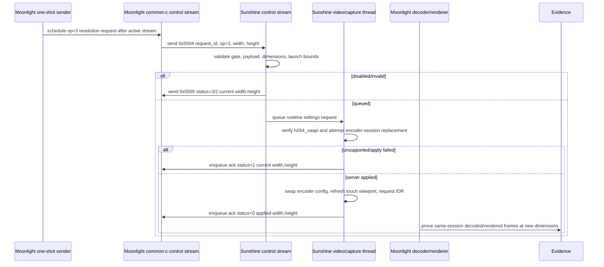

# feat: Add runtime resolution setting spike

## Summary

This plan extends Korri's experimental Moonlight/Sunshine runtime-settings MVP from bitrate and FPS into a narrow, one-shot runtime resolution spike. The implementation keeps the feature default-off, defines an explicit two-dimensional wire contract, gates application to the already-proven `h264_vaapi` path, and treats client-side decode/render survival as required evidence before making product claims.

---

## Problem Frame

Runtime bitrate and FPS are now proven over the downstream `0x5504` / `0x5505` control path, but live resolution remains unproven and materially riskier. Resolution can affect Sunshine capture/encoder output, SPS/PPS, Moonlight decoder buffers, renderer textures, and absolute input coordinate mapping, so a server ack alone is not enough evidence.

---

## Requirements

- R1. Add a named runtime resolution operation to the experimental runtime-settings protocol without breaking existing bitrate and FPS operations.
- R2. Represent resolution as an explicit width/height payload and ack; do not pack two dimensions into the existing single-value contract.
- R3. Keep runtime resolution default-off behind `SUNSHINE_LIVE_SETTINGS_MVP=1` and Moonlight one-shot env controls.
- R4. Moonlight accepts at most one env-controlled one-shot runtime setting per stream: bitrate, FPS, or resolution.
- R5. Validate resolution conservatively before apply: non-zero, even dimensions, same-or-smaller than launch dimensions, and same aspect ratio using integer arithmetic for the MVP.
- R6. Return the existing status contract consistently: `0` applied, `1` failed/unsupported, `2` invalid, `3` disabled.
- R7. Preserve current stream state on disabled, invalid, unsupported, no-ack, or apply-failed outcomes; non-zero acks must report current applied dimensions.
- R8. Apply runtime resolution only on the first proven server path, `h264_vaapi` via Sunshine's AVCodec/VAAPI encoder-session restart seam.
- R9. Refresh Sunshine absolute input/touch viewport mapping after a successful server-side resolution change.
- R10. Prove client-side survival separately from server apply: Moonlight must remain in the same session and show decoded/rendered frames at the new dimensions, or the acceptance result must remain safely unsupported/failed.
- R11. Update carried-patch documentation, Nix patch checks, and acceptance evidence so reviewers can distinguish proven behavior from experimental scope.

---

## Scope Boundaries

- No adaptive-resolution policy or connection-status-driven resolution changes.
- No product UI for changing resolution.
- No HDR, codec, preset, audio, or capture-source changes.
- No broad encoder/backend support beyond the first proven `h264_vaapi` path.
- No claim that runtime resolution is supported on Sobo/SM8550 until device evidence proves Moonlight decode/render survival.
- No protocol negotiation overhaul; this stays inside the current experimental downstream packet pair.

### Deferred to Follow-Up Work

- Formal capability negotiation for runtime settings before upstreaming or making this non-experimental.
- Runtime resolution adaptation policy after one-shot resolution is proven and stable.
- Upshift support above launch dimensions, aspect-ratio changes, and non-`h264_vaapi` encoders.
- Product-level quality controls that combine bitrate, FPS, and resolution.

---

## Context & Research

### Relevant Code and Patterns

- `packages/sunshine-korri/patches/0001-runtime-bitrate-restart-mvp.patch` owns the downstream Sunshine request/ack packet handling and current runtime bitrate/FPS apply logic.
- `packages/moonlight-embedded-korri/patches/0005-add-sunshine-runtime-settings-mvp.patch` owns the downstream Moonlight one-shot sender, adaptation hook, and ack logging for the current protocol.
- `nix/tests/korri-sunshine-runtime-bitrate-patch-check.nix` is the current patch-invariant and package-build check for the carried runtime-settings patches.
- `packages/sunshine-korri/README.md` and `packages/moonlight-embedded-korri/README.md` document the carried experimental patches and their env contracts.
- `docs/acceptance/sunshine-korri-runtime-bitrate-restart-2026-05-25.md` records the proven bitrate/FPS status contract and explicitly says resolution is not proven.
- Upstream Sunshine launch-time resolution is parsed from SDP into monitor width/height, then copied into `video::config_t`; AVCodec encode sessions set codec and hardware-frame dimensions from that config.
- Sunshine's touch/input port mapping is derived from `config.width` / `config.height`, so a server-side resolution apply must refresh that mapping after success.
- Moonlight common-c calls video renderer setup once at stream start with `StreamConfig.width` and `StreamConfig.height`; the current protocol has no general runtime renderer reconfigure callback.
- The SM8550/v4l2m2m SDL NV12 renderer path recreates its SDL texture when decoded `AVFrame` dimensions change and logs texture creation, making it the best client-side survival evidence seam.

### Institutional Learnings

- `docs/solutions/workflow-issues/generic-game-stream-runner-validation-contract-2026-05-19.md`: preserve the intended Sunshine/Moonlight stream architecture during validation; use fresh launch intent/session evidence rather than stale or shortcut paths.
- `docs/solutions/integration-issues/odin-electrobun-webkit-runtime-white-screen-2026-05-04.md`: device validation must prove the actual user-visible/runtime path; healthy control-plane signals do not prove renderer/media success.
- `docs/solutions/architecture-patterns/kiosk-foreground-app-policy-over-gamescope-overlay-2026-05-24.md`: keep session foreground policy, app presentation, and Moonlight media-path claims separate.
- `docs/solutions/integration-issues/electrobun-linux-flat-bundle-2026-05-01.md`: downstream Nix-carried behavior needs derivation/check postconditions rather than relying on apparent source success.

### External References

- No separate web research was needed. The relevant behavior is in the checked-in downstream patches and upstream Moonlight/Sunshine source seams already vendored through the flake inputs.

---

## Key Technical Decisions

- Define operation `3` as set resolution: this keeps bitrate/FPS operation IDs stable and makes resolution a first-class runtime setting rather than overloading existing values.
- Use an explicit two-dimensional payload for operation `3`: width and height must travel as separate fields in request and ack payloads so both sides can validate payload length and avoid ambiguous packing.
- Define byte-level parse behavior before implementation: a packet shorter than the common request prefix can only be logged and dropped because `request_id`/`operation` are unreadable; a packet with the prefix and operation `3` but missing width/height returns `status=2` with `current_applied_width` / `current_applied_height`.
- Track `current_applied_width` / `current_applied_height` as the authoritative server-side dimensions for acks: initialize them from launch SDP dimensions and update them only after a successful encoder/session swap.
- Prefer a single Moonlight one-shot env value such as `MOONLIGHT_SEND_RUNTIME_SETTINGS_MVP_RESOLUTION=1280x720`: this avoids half-configured width-only or height-only local states while still producing explicit width/height on the wire.
- Keep resolution one-shot only: current connection-status adaptation can continue to cover bitrate/FPS experiments, but resolution should not enter adaptation until the one-shot primitive proves safe.
- Treat downshift/same-size, same-aspect, even dimensions as the MVP policy: this mirrors the FPS no-upshift safety rule and avoids asking the client to exceed launch-time assumptions.
- Reuse the server encoder-session restart seam rather than AVCodec field mutation: the accepted bitrate evidence shows replacement is the working path, while direct field mutation was misleading.
- Separate server apply from acceptance proof: `status=0` means Sunshine applied its server-side runtime setting, but the plan's acceptance bar requires Moonlight-side decoded/rendered dimension evidence before calling runtime resolution supported.

---

## Open Questions

### Resolved During Planning

- Should resolution be part of automatic adaptation now? No. The plan keeps resolution to explicit one-shot requests only.
- Should the MVP support upshifts or aspect-ratio changes? No. The initial policy is same-or-smaller and same aspect ratio.
- Is fake-platform Moonlight enough proof? No. It is useful for ack parsing, but the spike needs real client decode/render evidence before support claims.
- Should unsupported backends return invalid or failed? Unsupported backends and failed apply attempts return `status=1`; malformed/out-of-policy requests return `status=2`.

### Deferred to Implementation

- Exact C/C++ struct names after genericizing the currently bitrate-shaped runtime settings names: keep names clear during implementation without changing wire semantics for operations `1` and `2`.
- Exact no-ack timeout mechanics in Moonlight: implement a bounded log result if it is simple; otherwise document no-ack as absence of ack in harness output.
- Final live test dimensions: default to a conservative downshift such as launch `1920x1080` to request `1280x720`, but adjust if the hardware path or host setup requires a smaller known-good pair.

---

## High-Level Technical Design

> *This illustrates the intended approach and is directional guidance for review, not implementation specification. The implementing agent should treat it as context, not code to reproduce.*

Wire-shape intent:

| Message | Payload fields | Payload length | Notes |
|---------|----------------|----------------|-------|
| Request prefix | `request_id u32le`, `operation u16le`, `reserved u16le` | 8 bytes | Minimum parseable request. |
| Request op `1` / `2` | prefix + `value u32le` | 12 bytes | Existing bitrate/FPS payload shape. |
| Request op `3` | prefix + `width u32le`, `height u32le` | 16 bytes | Resolution payload; no packed dimensions. |
| Ack op `1` / `2` | `request_id u32le`, `operation u16le`, `status u16le`, `applied_value u32le` | 12 bytes | Existing ack payload shape, excluding the control header. |
| Ack op `3` | `request_id u32le`, `operation u16le`, `status u16le`, `applied_width u32le`, `applied_height u32le` | 16 bytes | Resolution ack payload, excluding the control header. |

Parsing must use explicit little-endian field reads and payload lengths, not compiler struct padding. Packets shorter than the common request prefix are not ackable and should be logged as runt payloads. Operation `3` packets with the prefix but without both dimensions are ackable invalid requests and should return `status=2` with `current_applied_width` / `current_applied_height`.

---

## Implementation Units

### U1. Define the resolution wire contract and invariants

**Goal:** Extend the experimental runtime-settings contract to include a named resolution operation and explicit width/height payloads while preserving existing bitrate/FPS behavior.

**Requirements:** R1, R2, R6, R11

**Dependencies:** None

**Files:**
- Modify: `packages/sunshine-korri/patches/0001-runtime-bitrate-restart-mvp.patch`
- Modify: `packages/moonlight-embedded-korri/patches/0005-add-sunshine-runtime-settings-mvp.patch`
- Modify: `nix/tests/korri-sunshine-runtime-bitrate-patch-check.nix`

**Approach:**
- Add a named operation `3` for runtime resolution.
- Preserve the existing prefix of the request/ack payloads so operations `1` and `2` remain readable by the current code path.
- Add operation-specific width/height handling for resolution rather than packing dimensions into the single applied value.
- Update the Nix source invariant check to require the operation constant, payload length checks, width/height request fields, width/height ack fields, and continued absence of pending/accepted status.
- Consider genericizing internal type names that still say “bitrate” if the implementation can do so safely in the same patch; if that creates churn, keep it deferred but ensure externally visible docs use “runtime settings.”

**Execution note:** Update the Nix invariant check first so the downstream patch cannot accidentally encode resolution as an ambiguous single-value operation.

**Patterns to follow:**
- Current named packet/status checks in `nix/tests/korri-sunshine-runtime-bitrate-patch-check.nix`.
- Current `operation + value` branching in `packages/sunshine-korri/patches/0001-runtime-bitrate-restart-mvp.patch`.
- Current ack parser branching for FPS vs bitrate in `packages/moonlight-embedded-korri/patches/0005-add-sunshine-runtime-settings-mvp.patch`.

**Test scenarios:**
- Happy path: the Nix check fails until operation `3` is named in both the Sunshine patch and Moonlight patch.
- Happy path: the Nix check requires resolution request payload fields for width and height, not just a packed `value`.
- Happy path: the Nix check requires resolution ack logging with `applied_width` and `applied_height`.
- Edge case: existing bitrate and FPS invariants still pass and keep their operation IDs unchanged.
- Error path: the Nix check rejects any reintroduction of `accepted/pending` or `accepted=1` status semantics.

**Verification:**
- The patch check proves the source-level runtime settings contract includes operation `3` and that existing operation/status contracts are unchanged.

---

### U2. Add Moonlight one-shot resolution sending and ack logging

**Goal:** Let patched Moonlight send one explicit runtime resolution request during an active stream and log structured resolution acks without enabling adaptation policy.

**Requirements:** R3, R4, R6, R7, R10, R11

**Dependencies:** U1

**Files:**
- Modify: `packages/moonlight-embedded-korri/patches/0005-add-sunshine-runtime-settings-mvp.patch`
- Modify: `packages/moonlight-embedded-korri/README.md`
- Modify: `nix/tests/korri-sunshine-runtime-bitrate-patch-check.nix`

**Approach:**
- Add a one-shot resolution env contract using a single parseable value, e.g. `MOONLIGHT_SEND_RUNTIME_SETTINGS_MVP_RESOLUTION=1280x720`, and continue using `MOONLIGHT_SEND_RUNTIME_SETTINGS_MVP_AFTER_S` for timing.
- Enforce exactly one one-shot runtime setting: bitrate, FPS, or resolution. If resolution is present with bitrate or FPS, log a local ambiguity error and send nothing.
- Keep connection-status adaptation unchanged and intentionally exclude resolution envs from that path.
- Extend the Moonlight common-c helper to send width and height for operation `3`.
- Extend ack parsing/logging so operation `3` requires the longer payload and logs request ID, status, applied width, and applied height.
- If practical, add a bounded no-ack marker for request IDs sent through this one-shot path; if not, make absence of ack an explicit acceptance-doc terminal state.

**Execution note:** Implement the one-shot parser test-first through Nix source invariants and log-string checks; do not add resolution to the adaptation callback in this unit.

**Patterns to follow:**
- Current one-shot env parser in `packages/moonlight-embedded-korri/patches/0005-add-sunshine-runtime-settings-mvp.patch`.
- Current ambiguous bitrate-plus-FPS guard and Nix check coverage.
- Current Moonlight README env documentation.

**Test scenarios:**
- Happy path: with only `MOONLIGHT_SEND_RUNTIME_SETTINGS_MVP_RESOLUTION=1280x720`, Moonlight schedules and sends operation `3` after the configured delay.
- Happy path: Moonlight logs an operation `3` ack with `applied_width=1280 applied_height=720` when the longer ack arrives.
- Edge case: malformed resolution strings, missing width, missing height, zero values, negative values, or overflow values log invalid local input and send no packet.
- Edge case: resolution with bitrate or FPS logs an ambiguity error and sends no packet.
- Error path: a runt operation `3` ack logs a runt/invalid ack marker rather than reading missing dimensions.
- Integration: bitrate/FPS one-shot behavior and connection-status adaptation still use operation `1`/`2` and are not affected by resolution env absence.

**Verification:**
- The Nix check proves Moonlight exposes the new one-shot resolution env, rejects ambiguous runtime-setting inputs, logs operation `3` acks with width/height, and leaves adaptation resolution-free.

---

### U3. Add Sunshine validation and safe terminal statuses for resolution

**Goal:** Teach Sunshine to recognize operation `3`, reject unsafe or disabled requests before mutation, and return current dimensions on non-applied outcomes.

**Requirements:** R3, R5, R6, R7, R8, R11

**Dependencies:** U1

**Files:**
- Modify: `packages/sunshine-korri/patches/0001-runtime-bitrate-restart-mvp.patch`
- Modify: `packages/sunshine-korri/README.md`
- Modify: `nix/tests/korri-sunshine-runtime-bitrate-patch-check.nix`

**Approach:**
- Extend Sunshine control-stream validation for operation `3` with an operation-specific payload length check.
- Return `status=3` when `SUNSHINE_LIVE_SETTINGS_MVP` is absent or not exactly `1`.
- Return `status=2` for malformed/out-of-policy dimensions: missing width/height, zero, odd dimensions, larger than launch dimensions, or aspect-ratio mismatch.
- Validate aspect ratio with integer arithmetic after zero/bounds checks, e.g. equivalent 64-bit cross-multiplication or reduced-ratio comparison; avoid floating-point comparisons.
- Queue only requests that pass gate and request-shape validation; preserve `queued=1` as a control-thread log, not a final success marker.
- Ensure disabled/invalid acks report `current_applied_width` / `current_applied_height` rather than requested dimensions.
- Keep unsupported backend detection in the video/capture path so the ack reflects the active encoder context.

**Execution note:** Add source-invariant checks for invalid/disabled/unsupported branches before relying on live tests.

**Patterns to follow:**
- Current gate behavior requiring `SUNSHINE_LIVE_SETTINGS_MVP=1` exactly.
- Current FPS upshift invalid handling.
- Current unsupported HEVC handling that returns `status=1` with current applied value.

**Test scenarios:**
- Happy path: a valid operation `3` request with gate enabled is queued, not immediately acked as applied.
- Edge case: same-as-current resolution is accepted as an idempotent valid request when the backend is otherwise supported.
- Error path: gate disabled returns `status=3` with current width/height and does not queue an encoder request.
- Error path: zero, odd, above-launch, aspect-ratio-mismatched, or short-payload resolution returns `status=2` with current width/height and does not restart the encoder.
- Error path: unsupported active encoder returns `status=1` with current width/height and no stream mutation.
- Integration: bitrate and FPS validation branches keep their existing status and ack behavior.

**Verification:**
- The Nix check proves the disabled, invalid, and unsupported resolution status branches exist and that non-applied resolution responses use current dimensions.

---

### U4. Apply resolution on the narrow `h264_vaapi` server path

**Goal:** Attempt runtime resolution application only by replacing the active AVCodec/VAAPI encoder session, then refreshing server-side state and input mapping after success.

**Requirements:** R7, R8, R9, R10

**Dependencies:** U1, U3

**Files:**
- Modify: `packages/sunshine-korri/patches/0001-runtime-bitrate-restart-mvp.patch`
- Modify: `nix/tests/korri-sunshine-runtime-bitrate-patch-check.nix`

**Approach:**
- Reuse the proven encoder-session restart shape from runtime bitrate at the concept level: copy the current config, update width/height, create replacement encode device/session, validate conversion with a dummy frame, then swap only after the replacement is ready.
- Do not blindly reuse helper paths that mutate `ctx->config` or raise touch-port events before replacement success. The sync path likely needs a split helper or temporary context so session creation/conversion can be validated before committing state.
- On the async path, obtain the touch-port event seam explicitly and raise the refreshed mapping only after the replacement session and config swap succeed.
- On the sync path, keep old `ctx->config`, old session, and old touch mapping intact until the replacement session is validated; then atomically assign the updated config, swap `pos->session`, refresh touch mapping, request IDR, and ack.
- On success, update the active config dimensions, refresh `runtime_fps` timing if the implementation depends on config fields, request an IDR frame, and enqueue operation `3` ack with `status=0` and applied width/height.
- On any replacement failure, leave the old encoder session/config/touch mapping intact and ack `status=1` with current width/height.
- Keep support gated to `h264_vaapi`; do not add HEVC/AV1/software/NVENC behavior in this unit.

**Execution note:** Treat rollback as first-class: the old session should remain the source of truth until a replacement encode session is proven usable.

**Patterns to follow:**
- Runtime bitrate replacement path in `packages/sunshine-korri/patches/0001-runtime-bitrate-restart-mvp.patch`.
- Current IDR request after successful bitrate replacement.
- Sunshine `make_port` usage for absolute mouse/touch mapping.

**Test scenarios:**
- Happy path: valid downshift on `h264_vaapi` replaces the active encoder session and logs operation `3` `status=0` with applied width/height.
- Happy path: successful apply requests an IDR frame after the replacement session is active.
- Happy path: successful apply refreshes touch/input viewport mapping to the applied width/height.
- Edge case: same-as-current request on `h264_vaapi` returns `status=0` without unnecessary state drift.
- Error path: replacement encode device/session creation failure leaves old config and touch mapping intact and returns `status=1` with old dimensions.
- Error path: a failed sync-path replacement does not leak a refreshed touch-port mapping or mutated config before returning `status=1`.
- Error path: HEVC/AV1/software paths return `status=1` with old dimensions and do not attempt resolution apply.
- Integration: runtime bitrate and runtime FPS still work after the resolution branch is added.

**Verification:**
- The source-level check covers the `h264_vaapi` gate, IDR request, touch-port refresh, and failure fallback invariants; live acceptance later proves whether the server-applied path survives real streaming.

---

### U5. Update documentation and build/check surfaces

**Goal:** Keep the carried downstream patch reviewable by documenting the operation, status semantics, support boundary, and package/build invariants.

**Requirements:** R1, R3, R6, R8, R11

**Dependencies:** U1, U2, U3, U4

**Files:**
- Modify: `packages/sunshine-korri/README.md`
- Modify: `packages/moonlight-embedded-korri/README.md`
- Modify: `nix/tests/korri-sunshine-runtime-bitrate-patch-check.nix`
- Modify: `flake.nix` if the check name or coverage needs to be generalized

**Approach:**
- Document operation `3`, the resolution env contract, and the status contract without implying broad support.
- Keep README language explicit that resolution is experimental and supported only after client-side evidence is recorded.
- Decide whether to keep the existing check name for continuity or generalize it to runtime settings; if renamed, preserve flake check wiring and avoid breaking `korri-standard-native` coverage.
- Ensure the check still builds both patched packages so a syntactically valid patch without a working package cannot pass.
- Add assertions that resolution is not part of Moonlight's connection-status adaptation envs.

**Patterns to follow:**
- Current README sections for runtime bitrate/FPS.
- Current `korri-sunshine-runtime-bitrate-patch` check structure and package output assertions.
- Existing flake check inclusion in `korri-standard-native`.

**Test scenarios:**
- Happy path: the Nix check passes only when Sunshine README and Moonlight README both document runtime resolution as experimental.
- Happy path: the check builds `sunshine-korri` and `moonlight-embedded-korri` after resolution patches are applied.
- Edge case: if the check is renamed, old flake references are removed or aliased intentionally; `korri-standard-native` still includes the check.
- Error path: docs that imply unsupported encoders or adaptation policy are available should fail source invariant checks where feasible.

**Verification:**
- The standard native Nix check includes the runtime-settings patch check and both patched packages build.

---

### U6. Capture live resolution acceptance evidence

**Goal:** Produce durable evidence that the runtime resolution request either applied and survived on the real client path, or failed safely with explicit status semantics.

**Requirements:** R7, R8, R10, R11

**Dependencies:** U1, U2, U3, U4, U5; named SM8550/Sobo device access and a Sunshine host that can be forced or confirmed on `h264_vaapi` for applied-support evidence

**Files:**
- Create: `docs/acceptance/sunshine-korri-runtime-resolution-2026-05-26.md`
- Modify: `docs/acceptance/sunshine-korri-runtime-bitrate-restart-2026-05-25.md` if the shared runtime-settings evidence index needs a cross-link

**Approach:**
- Record fake-platform evidence separately from real client evidence: fake proves request/ack parsing only, not runtime resolution support.
- Run at least one real client validation on the SM8550/v4l2m2m path with a conservative downshift, same session, and Sunshine forced/confirmed on `h264_vaapi`.
- If the required device or host access is unavailable, stop after package/check verification and document runtime resolution as unproven; do not create support claims from fake-platform or server-only evidence.
- Collect Moonlight logs showing operation `3` request/ack, same PID/session evidence, no reconnect markers, and post-request decoded/rendered frame dimensions.
- Use the v4l2m2m SDL NV12 texture recreation log as a primary client-side dimension signal when available.
- Collect Sunshine logs showing operation `3` queued, encoder replacement or safe rejection, IDR request after apply, and final status.
- Include negative edge cases: gate disabled, invalid upshift or malformed dimensions, and unsupported encoder.
- Phrase conclusions by outcome: applied-and-survived, safely unsupported, safely invalid, or spike failure.

**Patterns to follow:**
- Evidence style in `docs/acceptance/sunshine-korri-runtime-bitrate-restart-2026-05-25.md`.
- Device-validation caution from `docs/solutions/integration-issues/odin-electrobun-webkit-runtime-white-screen-2026-05-04.md`.
- Fresh stream/session validation posture from `docs/solutions/workflow-issues/generic-game-stream-runner-validation-contract-2026-05-19.md`.

**Test scenarios:**
- Happy path: supported downshift receives `status=0`, Sunshine logs encoder replacement, Moonlight logs new decoded/rendered dimensions, and the stream remains alive without reconnect.
- Edge case: same-as-current request returns `status=0` and stream continues without harmful reset.
- Error path: gate disabled returns `status=3`, current dimensions remain unchanged, and stream continues.
- Error path: invalid dimensions return `status=2`, no encoder replacement occurs, and stream continues.
- Error path: unsupported encoder returns `status=1`, current dimensions remain unchanged, and stream continues.
- Integration: after an applied resolution request, a follow-up bitrate or FPS request in a separate run still produces the previously proven status behavior.

**Verification:**
- The acceptance doc includes raw log snippets and interpretation sufficient for review, with no claim broader than the captured client/server path proves.

---

## System-Wide Impact

- **Interaction graph:** Moonlight CLI/env parsing feeds Moonlight common-c control packets; Sunshine control stream validates and queues requests; Sunshine video/capture thread applies or rejects; Sunshine control stream sends acks; Moonlight decoder/renderer must survive the resulting coded dimension change.
- **Error propagation:** Local Moonlight parse errors stop before send; Sunshine disabled/invalid errors return immediate structured acks; unsupported/apply failures return structured acks from the video path; no-ack remains a bounded or documented unsupported terminal state.
- **State lifecycle risks:** The active encoder config, runtime FPS state, IDR request state, touch viewport mapping, and ack queue must remain consistent after replacement or rollback.
- **API surface parity:** Existing bitrate/FPS envs, operation IDs, ack logs, and adaptation envs must remain compatible; resolution adds one-shot behavior only.
- **Integration coverage:** Source checks prove patch invariants and package builds; fake-platform runs prove packet parsing; SM8550/v4l2m2m runs prove or disprove client-side survival.
- **Unchanged invariants:** Status values remain `0`/`1`/`2`/`3`; `SUNSHINE_LIVE_SETTINGS_MVP=1` remains the required Sunshine gate; unsupported paths must fail explicitly rather than pretending success.

---

## Risks & Dependencies

| Risk | Mitigation |
|------|------------|
| Sunshine can apply dimensions but Moonlight decoder/render path freezes or crashes. | Do not treat server ack as support; require same-session decoded/rendered dimension evidence before support claims. |
| Payload extension breaks existing bitrate/FPS operations. | Preserve request/ack prefixes, branch by operation, and keep Nix invariants for operations `1` and `2`. |
| Partial encoder replacement leaves mismatched config, touch mapping, or stream state. | Swap active state only after replacement session validation; rollback to current dimensions and ack `status=1` on failure. |
| Adaptation requests interleave with resolution proof. | Keep resolution out of adaptation, reject ambiguous one-shot input, and run acceptance with adaptation envs unset. |
| Device evidence accidentally validates a shortcut path rather than the intended media path. | Record platform, codec, encoder, session/PID, Moonlight logs, Sunshine logs, and decoded/rendered dimension markers. |
| Check naming drifts from generalized runtime settings. | Either rename deliberately with flake updates or keep the existing check name while expanding its scope; document whichever choice is made. |

---

## Documentation / Operational Notes

- Resolution remains experimental and downstream-only until formal negotiation and broader backend/client validation exist.
- Acceptance evidence should explicitly list host, client platform, encoder, codec, requested launch dimensions, requested runtime dimensions, packet/ack logs, and whether visual/client survival was proven.
- After the resolution spike lands, capture a `docs/solutions/` learning so future runtime-settings work does not need to infer the safety bar from commits and acceptance docs.

---

## Sources & References

- **Origin document:** [../../01KSE6WT20F2EP92EABSNSDK11-feat-moonlight-live-settings-validation-spike/requirements.md](../../01KSE6WT20F2EP92EABSNSDK11-feat-moonlight-live-settings-validation-spike/requirements.md)
- Acceptance evidence: [docs/acceptance/sunshine-korri-runtime-bitrate-restart-2026-05-25.md](../../../docs/acceptance/sunshine-korri-runtime-bitrate-restart-2026-05-25.md)
- Sunshine patch: `packages/sunshine-korri/patches/0001-runtime-bitrate-restart-mvp.patch`
- Moonlight patch: `packages/moonlight-embedded-korri/patches/0005-add-sunshine-runtime-settings-mvp.patch`
- Nix patch check: `nix/tests/korri-sunshine-runtime-bitrate-patch-check.nix`
- Sunshine package docs: `packages/sunshine-korri/README.md`
- Moonlight package docs: `packages/moonlight-embedded-korri/README.md`
- Stream validation learning: [docs/solutions/workflow-issues/generic-game-stream-runner-validation-contract-2026-05-19.md](../../../docs/solutions/workflow-issues/generic-game-stream-runner-validation-contract-2026-05-19.md)
- Device runtime evidence learning: [docs/solutions/integration-issues/odin-electrobun-webkit-runtime-white-screen-2026-05-04.md](../../../docs/solutions/integration-issues/odin-electrobun-webkit-runtime-white-screen-2026-05-04.md)
