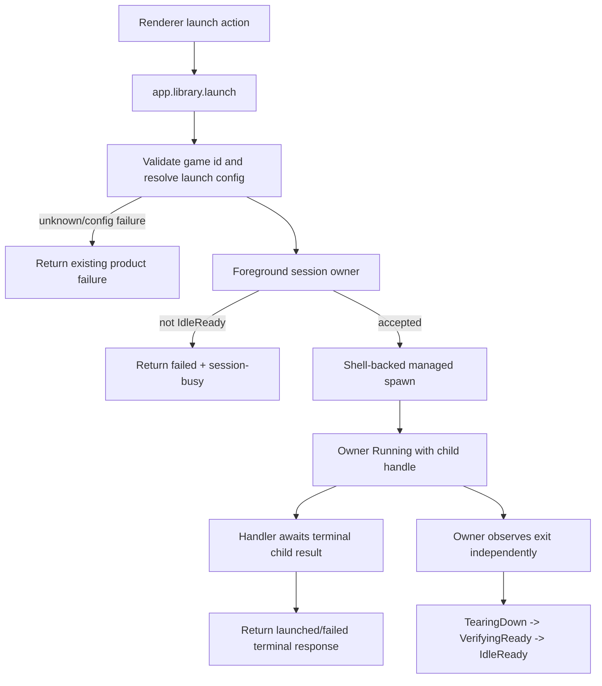
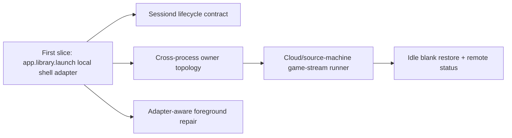

# feat: Roll out foreground session lifecycle to local launch adapters

## Summary

Phase 4 becomes a roadmap plus a focused first slice: route local app/emulator launches through the foreground-session lifecycle owner without redesigning the lifecycle contract. The first executable slice targets `app.library.launch` and the shell-backed local child path; cloud/source-machine ownership, cross-process owner sharing, and full sessiond unification remain follow-up slices.

---

## Problem Frame

Phases 1-3 proved the foreground-session lifecycle on the desktop Moonlight/Gamescope path: one owner accepts from idle, rejects re-entry as `session-busy`, waits through conservative readiness, and exposes sanitized status. The origin brainstorm explicitly says that same contract should not remain Moonlight-only: local apps, emulators, Gamescope-wrapped children, and eventually cloud/source-machine launches need the same foreground ownership guarantees.

The current local app path still bypasses the owner. `app.library.launch` resolves a game, composes the Gamescope wrapper, then calls `Launcher.run`, which blocks until child exit and has no lifecycle-visible managed handle. That leaves local launches outside the Phase 1-3 protections: no lifecycle busy window, no typed local `session-busy`, no shared request identity, and no owner-observed exit/readiness evidence.

---

## Requirements

- R1. Treat the Phase 1-3 lifecycle contract as stable; Phase 4 should add adapter coverage rather than redesign the state vocabulary or public status model. (Origin R10, R11, R12, R17)
- R2. Route shell-backed local app/emulator launches from `app.library.launch` through a foreground-session owner before spawning the child. (Origin F1; R10, R11, R14)
- R3. Preserve existing launch resolution behavior: unknown game IDs and configuration failures remain typed RPC outcomes without spawning a child, and Gamescope policy still follows the existing cascade. (Origin R3, R5, R6, R8)
- R4. Preserve Gamescope default and opt-out semantics: a Gamescope-enabled launch still wraps the child minimally, while a Gamescope-disabled local launch still remains lifecycle-owned. (Origin R1, R2, R3, R7; AE1, AE2, AE3)
- R5. Add managed-child semantics for local launches so the owner can observe exit, terminate on shutdown, and hold non-idle state until readiness completes. (Origin R13, R14, R16)
- R6. Surface local launch re-entry rejection as the same typed `session-busy` failure category the renderer already understands. (Origin F2; R14, R17; AE5)
- R7. Preserve current `app.library.launch` consumer expectations unless explicitly changed: shell-backed local launches should still return a terminal launched/failed response after the child exits. (Current API compatibility)
- R8. Keep one foreground-session owner per foreground-session host as the roadmap invariant, and avoid adding a second active owner on any path included in this first slice. (Origin R14, R20)
- R9. Record structured lifecycle evidence for accepted local launches, rejected re-entry, spawn outcomes, foreground-readiness posture, child exit, and release back to idle. (Origin R17; AE7)
- R10. Document the Phase 4 follow-up roadmap for cloud/source-machine launch ownership, source-host idle-blank restore, sessiond unification, cross-process ownership, and adapter-specific foreground repair. (Origin F4; R18, R19, R20; AE8)

**Origin actors:** A2 Player, A3 Foreground/session owner, A4 Launcher adapter, A5 Foreground session host, A6 Cloud gaming machine, A7 Operator/agent
**Origin flows:** F1 Default foreground launch, F2 Re-entry while a session is not ready, F4 Cloud gaming source launch
**Origin acceptance examples:** AE1 default Gamescope wrapping, AE2 narrow opt-out, AE3 foreground ownership despite Gamescope opt-out, AE5 busy re-entry rejection, AE7 lifecycle evidence, AE8 source-machine idle blank restore

---

## Scope Boundaries

- This plan's executable first slice covers shell-backed local app/emulator launches through `app.library.launch`.
- The first slice does not change the desktop Moonlight launch behavior or the Phase 3 status schema.
- The first slice does not make desktop Bun and a separate Korri server share a foreground-session owner across processes.
- The first slice does not route Sunshine-triggered source-machine game-stream launches through the owner.
- The first slice does not implement source-machine idle-blank graphical-session restore.
- The first slice does not add launch queueing, cancel-and-relaunch, or automatic retry.
- The first slice does not add per-emulator compositor rules as the foreground guarantee.
- The first slice does not introduce a telemetry dashboard or remote operator control surface.

### Deferred to Follow-Up Work

- Cloud/source-machine adapter rollout: route `tools/device/game-stream-runner.ts` and source-host launch intents through a host-local lifecycle owner, with idle-blank restore for GUI-less roles.
- Cross-process owner topology: decide and implement how desktop Bun and a separate Korri server coordinate one foreground-session owner for a single physical host.
- Sessiond lifecycle unification: make `tools/device/sessiond.ts` expose or consume the generic lifecycle contract instead of layering two independent state machines.
- Adapter-aware foreground repair: add local app/emulator surface selectors and restore evidence beyond the first slice's conservative no-op/not-tracked posture.
- Broad `Launcher` handle rollout: extend non-shell launch transports once their process/session handle contracts are explicit.
- Rich operator status for non-desktop hosts: expose a sanitized status surface outside the desktop-local endpoint when source-machine ownership is implemented.

---

## Context & Research

### Relevant Code and Patterns

- `korri/shared/stream/foreground-session-lifecycle.ts` defines the generic lifecycle states, active request identity, busy rejection, and structured events. This stays the shared contract.
- `korri/deploy/desktop/foreground-session-owner.ts` is the existing runtime owner implementation. It is generic over adapter stages and is not Moonlight-specific, but it currently lives under the desktop deploy tree.
- `korri/deploy/desktop/launch-bridge.ts` shows the established adapter shape: reserve lifecycle state before awaited side effects, return typed busy before adapter work, spawn a managed handle, observe exit, and translate owner failures back to the public launch response.
- `korri/products/app/api/library/launch.rpc-handler.ts` is the first-slice target: it currently validates the game, resolves launch config, composes Gamescope, and calls `Launcher.run` directly.
- `korri/products/app/api/library/launch.rpc.ts` is the local launch wire contract. It currently has no way to carry `failureKind: "session-busy"`.
- `korri/shared/library/launcher.ts`, `korri/shared/library/library-services.ts`, `korri/shared/library/shell-launcher.ts`, and `korri/shared/library/launcher-layer-memory.ts` are the launcher seams that need managed-child semantics for shell-backed local launches.
- `tools/device/game-stream-fullscreen.ts` owns Gamescope composition and Sway surface repair helpers. The first slice should reuse Gamescope composition and avoid inventing per-emulator Sway rules.
- `korri/products/app/features/home/launcher-layer-rpc.ts` maps `app.library.launch` responses back into the renderer `Launcher` service and must preserve `session-busy` once the wire contract carries it.
- `tools/device/sessiond.ts` and `tools/device/sessiond-state.ts` are a parallel session supervisor. They are roadmap inputs, not a first-slice implementation target.

### Institutional Learnings

- `docs/solutions/architecture-patterns/kiosk-foreground-app-policy-over-gamescope-overlay-2026-05-24.md`: Gamescope is an app presentation adapter; the session owner owns focus, foreground, re-entry, restore, and readiness across app types.
- `docs/solutions/integration-issues/supervise-chromium-kiosk-session-after-game-exit-2026-05-04.md`: the supervisor that launches the foreground app must also own restoration and must not let renderer focus repair fight the foreground app.
- `docs/solutions/architecture-patterns/boot-scoped-control-plane-with-session-scoped-runner-2026-05-19.md`: control-plane/session-runner seams should remain narrow and trust-scoped; adapter rollout should not create side-channel launch paths.
- `docs/solutions/workflow-issues/generic-game-stream-runner-validation-contract-2026-05-19.md`: launch intents and runner status should remain one-shot and generic; adapter coverage means more LaunchSpec shapes, not more entrypoints.
- `docs/solutions/best-practices/manual-steam-game-launching-rocknix-arm64-2026-05-04.md`: Gamescope-wrapped local launches still appear as ordinary Sway windows; the outer session policy must remain responsible for foregrounding and restore.

### External References

- External research skipped. The codebase already contains direct patterns for Effect RPC handlers, lifecycle owner adapters, Gamescope composition, managed child supervision, and renderer launch failure mapping.

---

## Key Technical Decisions

- First executable slice is local shell-backed `app.library.launch`, not cloud/source-machine: this gives Phase 4 a non-Moonlight adapter while avoiding the separate process, role, and idle-blank restore questions in source-machine launches.
- Treat the existing lifecycle owner as stable: the plan reuses the Phase 1-3 owner and event vocabulary rather than inventing a new local-launch lifecycle.
- Put reusable runtime ownership where product and deploy code can both depend on it: the generic owner implementation should move out of `korri/deploy/desktop` only if needed to avoid product-to-deploy imports; the lifecycle contract remains under `korri/shared/stream`.
- Add managed-child launch capability beside the existing fire-and-block `Launcher.run`: the owner needs a handle with exit and termination semantics, while current consumers still need a terminal result and stderr-tail diagnostics from the same process observation.
- Preserve `app.library.launch` terminal response semantics for shell-backed launches: the owner can enter `Running` after spawn, but the handler should still await the local child exit before returning the local RPC response in this first slice.
- Validate resolvability before lifecycle reservation for product errors that do not spawn: unknown game IDs and launch-configuration failures should not create a foreground session; actual spawn/foreground/runtime failures should be lifecycle events.
- Reuse `session-busy` as the only public re-entry failure category: local launch should not introduce a parallel busy vocabulary.
- Fail closed for launch transports without managed handles in the first slice: sessiond and future remote launchers should not silently bypass lifecycle ownership or create a double-owner state machine.
- Use no-op/not-tracked foreground evidence for first-slice local apps where surface repair is not yet adapter-aware: this preserves observable honesty without claiming readiness evidence the adapter did not gather.

---

## Open Questions

### Resolved During Planning

- First-slice scope: roadmap plus first executable slice, with local app/emulator launches first and cloud/source-machine deferred.
- Owner contract: reuse and, if necessary, relocate the generic owner; do not redesign lifecycle state names or the Phase 3 status schema.
- Local launch RPC semantics: preserve terminal response behavior for shell-backed `app.library.launch` in the first slice.
- Busy response shape: reuse `LaunchFailureKind` / `session-busy` so renderer behavior matches the Moonlight bridge path.
- Sessiond posture: do not layer a new independent owner over sessiond in the first slice; fail closed or bypass with an explicit unsupported-managed-handle outcome until sessiond is integrated deliberately.

### Deferred to Implementation

- Exact shared module name for the relocated owner: decide while moving imports, preserving repo layering and avoiding product-to-deploy references.
- Exact managed-handle type name: keep it structurally compatible with the existing foreground owner handle and launcher vocabulary.
- Exact shutdown hook for non-desktop app-server compositions: wire where the owning process already handles lifecycle shutdown, without inventing a new process manager in this slice.
- Exact local-app foreground evidence fields: emit a bounded not-tracked/no-op evidence shape that fits existing sanitized status summaries.

---

## High-Level Technical Design

> *This illustrates the intended approach and is directional guidance for review, not implementation specification. The implementing agent should treat it as context, not code to reproduce.*

The first diagram is the executable slice. The second diagram is the roadmap: first prove the non-Moonlight local shell adapter, then broaden ownership only after the double-owner and process-boundary questions have explicit contracts.

---

## Implementation Units

### U1. Make the foreground-session owner reusable outside desktop deploy code

**Goal:** Allow product/API launch handlers to use the same runtime foreground-session owner implementation as the desktop Moonlight bridge without importing from `korri/deploy/desktop`.

**Requirements:** R1, R2, R8, R9

**Dependencies:** None

**Files:**
- Create or move: `korri/shared/stream/foreground-session-owner.ts`
- Modify: `korri/deploy/desktop/foreground-session-owner.ts`
- Modify: `korri/deploy/desktop/launch-bridge.ts`
- Modify: `korri/deploy/desktop/foreground-session-owner.test.ts`
- Test: `korri/shared/stream/foreground-session-owner.test.ts`

**Approach:**
- Move the generic owner implementation and handle/stage types to a shared stream module, or introduce a shared owner module that preserves the same public behavior while leaving a compatibility re-export in the desktop path if that reduces churn.
- Keep owner dependencies product-agnostic: it may depend on shared lifecycle types, promises, abort signals, and structured evidence, but not on desktop, Hono, Electrobun, Sway, Moonlight, product RPC handlers, or tools.
- Preserve Phase 1-3 behavior exactly for the Moonlight bridge by updating imports rather than changing adapter semantics.

**Execution note:** Add or move owner tests before changing import consumers so behavior is pinned while relocating the module.

**Patterns to follow:**
- `korri/shared/stream/foreground-session-lifecycle.ts` for product-agnostic lifecycle contracts.
- `korri/deploy/desktop/foreground-session-owner.test.ts` for current owner behavior and shutdown semantics.

**Test scenarios:**
- Happy path: an accepted launch transitions through prepare, spawn, foreground, running, exit observed, teardown, verify-ready, and idle using the relocated shared owner.
- Edge case: a second launch while the shared owner is non-idle returns `Busy` before adapter `prepare` is called.
- Error path: adapter prepare/spawn/foreground failures still transition through failed/recovering and release to idle with bounded evidence.
- Integration: the desktop Moonlight bridge imports the shared owner and existing launch-bridge tests still observe the same `session-busy` behavior.

**Verification:**
- The owner behavior is unchanged for existing desktop tests.
- Product code can import the owner without violating shared/product/deploy boundaries.

### U2. Add managed-child semantics to shell-backed launchers

**Goal:** Give local shell launches the child handle the foreground-session owner needs while preserving the existing terminal `Launcher.run` contract.

**Requirements:** R2, R5, R7, R8

**Dependencies:** U1

**Files:**
- Modify: `korri/shared/library/launcher.ts`
- Modify: `korri/shared/library/library-services.ts`
- Modify: `korri/shared/library/shell-launcher.ts`
- Modify: `korri/shared/library/launcher-layer-live.ts`
- Modify: `korri/shared/library/launcher-layer-memory.ts`
- Modify: `korri/shared/library/session-launcher.ts`
- Test: `korri/shared/library/shell-launcher.test.ts`
- Test: `korri/shared/library/launcher-layer-memory.test.ts`
- Test: `korri/shared/library/session-launcher.test.ts`

**Approach:**
- Add a managed launch capability beside `run`, not instead of it. `run` remains the stable convenience API that waits for terminal outcome.
- Implement managed shell spawn using the same safe argv/env/cwd behavior as `createShellLauncher`, returning a handle with process identity, exit promise, termination hooks, and a terminal launch-result promise derived from the same child observation.
- Keep stderr-tail capture available on that terminal launch result so `app.library.launch` can preserve existing failed response diagnostics while the owner consumes the simpler exit signal.
- For sessiond, do not pretend a managed local handle exists. Return a typed unsupported/unavailable outcome that the lifecycle adapter can fail closed, and defer real sessiond handle/status integration.
- Extend in-memory launcher behavior with a controllable managed handle so tests can hold a launch in Running and trigger exit deterministically.

**Execution note:** Implement the managed shell launcher test-first because it is the main behavior-enabling seam for the first slice.

**Patterns to follow:**
- `korri/shared/library/shell-launcher.ts` for safe direct `Bun.spawn` usage and stderr-tail capture.
- `korri/deploy/desktop/moonlight-session-runner.ts` for managed session handle shape.
- `tools/device/game-stream-runner.ts` managed child vocabulary where useful.

**Test scenarios:**
- Happy path: managed shell spawn returns process identity, an exit promise, and a terminal launch-result promise that resolves launched when the child exits 0.
- Error path: pre-exec spawn failure returns a structured failed result and does not leave an active handle.
- Error path: non-zero child exit resolves both the owner-facing exit signal and the terminal launch result, preserving exit code and stderr tail for response mapping.
- Edge case: `terminate` and `terminateNow` are safe to call and resolve the managed exit path without unhandled promise failures.
- Edge case: managed shell spawn passes argv directly without shell expansion, applies environment overrides, and honors configured working directory just like the existing `run` path.
- Integration: existing `Launcher.run` tests still pass and remain blocking-until-exit; if `run` delegates to managed spawn, tests prove that delegation preserves current results.
- Edge case: sessiond-managed spawn is reported as unsupported/unavailable rather than silently falling back to direct shell execution.

**Verification:**
- Shell-backed launchers can provide a managed handle to the foreground owner.
- Existing launcher consumers that only call `run` are not forced to change behavior.
- The managed shell path preserves the same argv/env/cwd safety guarantees as the existing `run` path.

### U3. Wrap `app.library.launch` shell-backed local launches in a foreground-session adapter

**Goal:** Route resolved local app/emulator launches through the foreground-session owner before spawning, while preserving current validation and terminal response behavior.

**Requirements:** R2, R3, R4, R5, R7, R9

**Dependencies:** U1, U2

**Files:**
- Modify: `korri/products/app/api/library/launch.rpc-handler.ts`
- Create: `korri/products/app/api/library/local-foreground-launch-adapter.ts`
- Create or modify: `korri/products/app/api/library/foreground-session-host-layer.ts`
- Modify: `korri/products/app/api/handlers.ts`
- Modify: `korri/products/app/api/rpc-server.ts`
- Modify: `korri/products/app/api/server/rpc-server.ts`
- Test: `korri/products/app/api/library/local-foreground-launch-adapter.test.ts`
- Test: `korri/products/app/api/library/launch.rpc-handler.test.ts`
- Test: `korri/products/app/api/server/rpc-server.test.ts`

**Approach:**
- Keep pre-spawn product validation in the handler: unknown IDs and configuration failures should return the existing product errors/responses before lifecycle reservation.
- After a launch resolves successfully, hand a local launch request to a foreground-session owner-backed adapter.
- The adapter's prepare stage carries the already-resolved game identity and launch spec; the spawn stage uses the managed shell capability from U2.
- The foreground stage should start conservative: emit no-op/not-tracked surface evidence rather than claiming Sway repair. Adapter-aware foreground repair is deferred.
- The verify-ready stage should use the managed child exit as the minimum readiness signal and keep cooldown/probe hooks injectable for future compositor evidence.
- The adapter's launched value should carry the terminal launch-result promise from the managed spawn. The handler should await that promise before returning the local RPC response, preserving the current `app.library.launch` contract while the owner independently observes the same child exit and releases to idle.

**Execution note:** Start with tests that keep a managed local launch running and assert the second request is rejected before another spawn occurs.

**Patterns to follow:**
- `korri/deploy/desktop/launch-bridge.ts` for owner result mapping and adapter-stage evidence.
- `korri/products/app/api/library/launch.rpc-handler.test.ts` for configured-real local launch tests using `tools/testing/fake-game.sh`.
- `korri/shared/library/launcher-layer-memory.ts` for deterministic launch behavior without mock/stub/fake naming.

**Test scenarios:**
- Happy path: known local game resolves, Gamescope policy is composed as before, managed shell child exits 0, and `app.library.launch` returns `{ status: "launched" }`.
- Covers AE1. Happy path: with no narrow opt-out, the local adapter still invokes a Gamescope-wrapped spec before spawning.
- Covers AE3. Happy path: with `gamescope: { enabled: false }`, the launch is not wrapped but still enters the foreground-session lifecycle and rejects re-entry while running.
- Edge case: unknown game ID returns `NotFoundError` and does not emit an accepted lifecycle launch or spawn a child.
- Error path: launch configuration failure returns the existing configuration failure response and does not reserve the foreground owner.
- Error path: managed spawn failure returns a failed local launch response and records adapter failure evidence.
- Integration: a held local launch keeps the `app.library.launch` promise pending until the controllable child exits, then returns the terminal launched/failed response.
- Integration: a held local launch keeps the owner non-idle until child exit and readiness release.
- Error path: a held local launch that exits non-zero resolves the RPC only after exit and preserves exit code plus stderr tail in the failed response.

**Verification:**
- Local shell-backed launches are lifecycle-owned without changing the user-facing success/failure shape for normal terminal outcomes.
- Gamescope policy behavior is unchanged except that both wrapped and unwrapped local launches are supervised.

### U4. Carry typed `session-busy` through the local launch wire contract and renderer RPC layer

**Goal:** Make local launch re-entry failures observable as the same `session-busy` category already used by the desktop Moonlight bridge.

**Requirements:** R6, R7, R9

**Dependencies:** U3

**Files:**
- Modify: `korri/products/app/api/library/launch.rpc.ts`
- Modify: `korri/products/app/api/library/launch.rpc-handler.ts`
- Modify: `korri/products/app/features/home/launcher-layer-rpc.ts`
- Modify: `korri/products/app/features/home/library-rpc-layers.test.ts`
- Test: `korri/products/app/api/library/launch.rpc-handler.test.ts`
- Test: `korri/shared/library/launcher.test.ts`

**Approach:**
- Extend the failed local launch response with an optional typed failure kind using the existing `LaunchFailureKind` vocabulary.
- Map owner `Busy` results to local failed responses with `failureKind: "session-busy"` and a stable local exit code aligned with the existing bridge category mapping.
- Update `LauncherLayerRpc` so renderer launch state receives `failureKind: "session-busy"` rather than a generic command failure.
- Avoid introducing a second busy category or Moonlight-specific branch in renderer code.

**Execution note:** Add the schema/renderer mapping tests first so the wire contract change is pinned before handler behavior changes.

**Patterns to follow:**
- `korri/products/app/features/home/launcher-layer-bridge.ts` for bridge-side failure category mapping.
- `korri/shared/themes/shift/molecules/ShiftLaunchFailureBanner.tsx` for existing `session-busy` user-facing behavior.

**Test scenarios:**
- Happy path: existing launched and ordinary failed local responses still decode without `failureKind`.
- Covers AE5. Error path: when the owner is running a local launch, a second local launch response includes `failureKind: "session-busy"` and does not spawn another child.
- Integration: `LauncherLayerRpc` maps a failed local response with `failureKind: "session-busy"` to a `LaunchResult` carrying the same failure kind.
- Edge case: unknown future or missing failure kind does not break existing generic failure rendering.

**Verification:**
- Renderer-visible local launch failures can distinguish lifecycle busy from ordinary command failure.
- Existing non-busy local launch response consumers remain compatible.

### U5. Keep host ownership and status coherent for the first slice

**Goal:** Ensure the local launch owner is process-local, singleton within its composition, terminates active local children on shutdown where the composition owns them, and keeps lifecycle evidence observable through the owner for tests and later status surfaces.

**Requirements:** R8, R9, R10

**Dependencies:** U3, U4

**Files:**
- Modify: `korri/products/app/api/handlers.ts`
- Modify: `korri/products/app/api/rpc-server.ts`
- Modify: `korri/products/app/api/server/rpc-server.ts`
- Test: `korri/products/app/api/library/launch.rpc-handler.test.ts`
- Test: `korri/products/app/api/server/rpc-server.test.ts`

**Approach:**
- Provide the foreground-session owner as a singleton service/layer for every app RPC composition that exposes `app.library.launch`, rather than constructing a fresh owner per request.
- Keep the first slice honest about topology: this owner governs the process that actually performs local shell-backed launches; it does not claim to coordinate with a separate desktop Moonlight owner across process boundaries.
- Do not add a new server/non-desktop status surface in this slice. Tests may inspect the owner/status service directly, but remote operator status for non-desktop hosts stays deferred.
- Ensure shutdown paths that own managed children terminate through the owner when available.

**Patterns to follow:**
- `korri/deploy/desktop/main.ts` for holding the owner at composition scope and terminating active sessions on process shutdown.
- `korri/deploy/desktop/foreground-session-status-snapshot.ts` for the later sanitized status adaptation pattern, not as an active server-status change in this slice.

**Test scenarios:**
- Integration: two requests handled by the same app RPC layer observe the same foreground owner; a held first local launch makes the second request busy.
- Integration: both app RPC compositions that expose `app.library.launch` provide the foreground owner dependency and do not fall back to per-request owner construction.
- Edge case: recreating a test layer creates a fresh owner, so tests are isolated and do not leak active sessions.
- Error path: process/shutdown termination calls the active local child handle and does not emit a misleading ready event while aborted.
- Integration: direct owner/status inspection in tests exposes lifecycle state without raw argv, env, stderr, or adapter internals.

**Verification:**
- The first slice has exactly one owner for local launches in the owning process.
- Tests can observe local lifecycle state without relying on ad hoc logs or raw adapter evidence; operator-facing non-desktop status remains a follow-up.

## System-Wide Impact

- **Interaction graph:** The first slice changes `app.library.launch` from a direct resolve-and-run handler into a lifecycle-owned local launch path. Renderer RPC, library resolution, launcher services, and foreground-session ownership all participate.
- **Error propagation:** Product validation errors remain product errors; owner busy becomes `session-busy`; spawn/runtime failures remain local failed launch responses with exit diagnostics.
- **State lifecycle risks:** The owner must be singleton within the process that owns local launches. Per-request owner construction would reintroduce split-brain foreground sessions.
- **API surface parity:** `app.library.launch` gains parity with `app.desktop.launch` for lifecycle busy failure, but keeps terminal response behavior for shell-backed launches.
- **Integration coverage:** Unit tests must prove owner behavior; integration tests must prove repeated RPC requests share the owner and do not spawn duplicate children.
- **Unchanged invariants:** Gamescope cascade semantics, Moonlight bridge behavior, Phase 3 status schema, and renderer launch-state conventions should remain unchanged.

---

## Risks & Dependencies

| Risk | Mitigation |
|------|------------|
| Moving the generic owner breaks the desktop Moonlight path | Move behavior under tests first, keep compatibility imports if useful, and run existing launch-bridge/owner tests. |
| `Launcher.run` and managed spawn semantics diverge | Implement managed spawn once and layer `run` behavior on top where possible, with terminal-response tests preserving current behavior. |
| Sessiond becomes double-owned | Fail closed or mark unsupported for managed local lifecycle in this slice; plan sessiond unification separately. |
| Local app foreground repair is overclaimed | Emit not-tracked/no-op evidence and defer adapter-aware surface repair. |
| Per-request owner construction defeats re-entry rejection | Provide the owner at composition scope and add an integration test with two requests against the same layer. |
| Cross-process desktop/server topology is mistaken for solved | Scope first slice to process-local local launches and explicitly defer cross-process owner topology. |
| Wire schema change breaks old consumers | Make `failureKind` optional on failed responses and keep existing launched/failed fields stable. |

---

## Documentation / Operational Notes

- The implementation should not add a new operator dashboard. If non-desktop status is exposed, keep it as a bounded summary consistent with the Phase 3 sanitized snapshot posture.
- Do not add new learning docs as part of this plan unless explicitly requested in a separate compounding step.
- Shipping notes should call out that Phase 4 first slice covers shell-backed local launches only; cloud/source-machine and sessiond lifecycle ownership remain deferred.

---

## Alternative Approaches Considered

- Route local launches through the desktop Moonlight bridge immediately: rejected for the first slice because desktop renderer launch routing currently treats selected games as remote stream launches, and cross-process owner topology is not settled.
- Implement cloud/source-machine ownership first: rejected for the first slice because it requires idle-blank restore, Sunshine runner integration, and source-host status decisions beyond the already-proven local launch seam.
- Add a second owner just for local launches on the same host as Moonlight: rejected as a roadmap invariant violation; one physical foreground-session host cannot have two independent owners once both adapters are active in that composition.
- Use Sway per-app rules for local emulator foregrounding: rejected because project learnings identify session-level ownership as the invariant and per-app rules as diagnostic at best.

---

## Phased Delivery

### Phase 4A — First executable slice: local shell-backed launches

- Relocate/reuse the generic owner where needed.
- Add managed shell launch handles.
- Wrap `app.library.launch` shell-backed local launches in the lifecycle owner.
- Surface `session-busy` through the local launch wire contract.
- Preserve terminal local launch response behavior.

### Phase 4B — Sessiond and non-shell launcher ownership

- Give sessiond a lifecycle-compatible status/handle contract or make it the host-local owner for its deployment mode.
- Remove first-slice unsupported/fail-closed limitations once sessiond can participate without double ownership.

### Phase 4C — Cross-process foreground-session host topology

- Decide whether desktop Bun or Korri server is canonical when both run on one physical host.
- Add IPC or route-level changes so Moonlight and local app launches share one owner in that topology.

### Phase 4D — Cloud/source-machine launches

- Route source-machine game-stream runner launches through a host-local lifecycle owner.
- Implement idle-blank restore for GUI-less roles.
- Expose a sanitized non-desktop status surface consistent with Phase 3.

---

## Sources & References

- **Origin document:** [../../01KSBMG31W82JBVJBJ5TT15MZN-feat-default-gamescope-foreground-launch/requirements.md](../../01KSBMG31W82JBVJBJ5TT15MZN-feat-default-gamescope-foreground-launch/requirements.md)
- Prior plan: [../01KSGS9H29WESM50SDTRMQVWW8-feat-foreground-session-lifecycle-phase1/plan.md](../01KSGS9H29WESM50SDTRMQVWW8-feat-foreground-session-lifecycle-phase1/plan.md)
- Prior plan: [../01KSGS9H2A9J934YX3KW4YF18P-feat-foreground-session-readiness-phase2/plan.md](../01KSGS9H2A9J934YX3KW4YF18P-feat-foreground-session-readiness-phase2/plan.md)
- Prior plan: [../01KSGS9H2C06TN55JSKQ6JYP7M-feat-foreground-session-observability-phase3/plan.md](../01KSGS9H2C06TN55JSKQ6JYP7M-feat-foreground-session-observability-phase3/plan.md)
- Related code: `korri/shared/stream/foreground-session-lifecycle.ts`
- Related code: `korri/deploy/desktop/foreground-session-owner.ts`
- Related code: `korri/deploy/desktop/launch-bridge.ts`
- Related code: `korri/products/app/api/library/launch.rpc-handler.ts`
- Related code: `korri/shared/library/shell-launcher.ts`
- Related learning: `docs/solutions/architecture-patterns/kiosk-foreground-app-policy-over-gamescope-overlay-2026-05-24.md`
- Related learning: `docs/solutions/integration-issues/supervise-chromium-kiosk-session-after-game-exit-2026-05-04.md`
