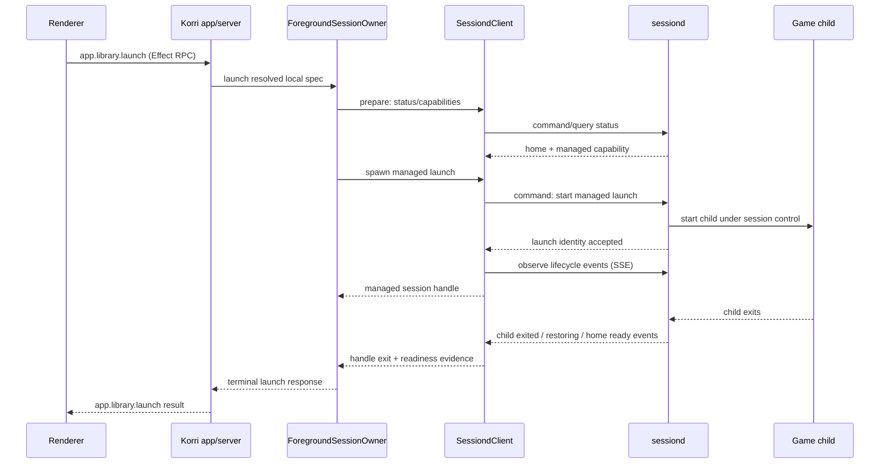
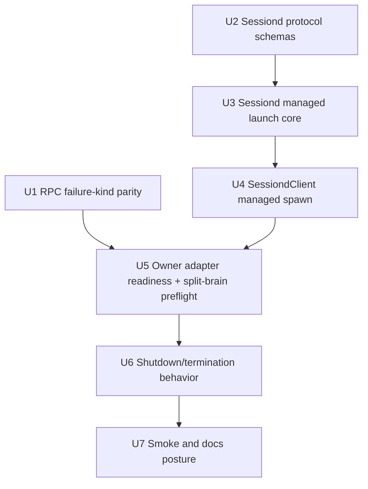
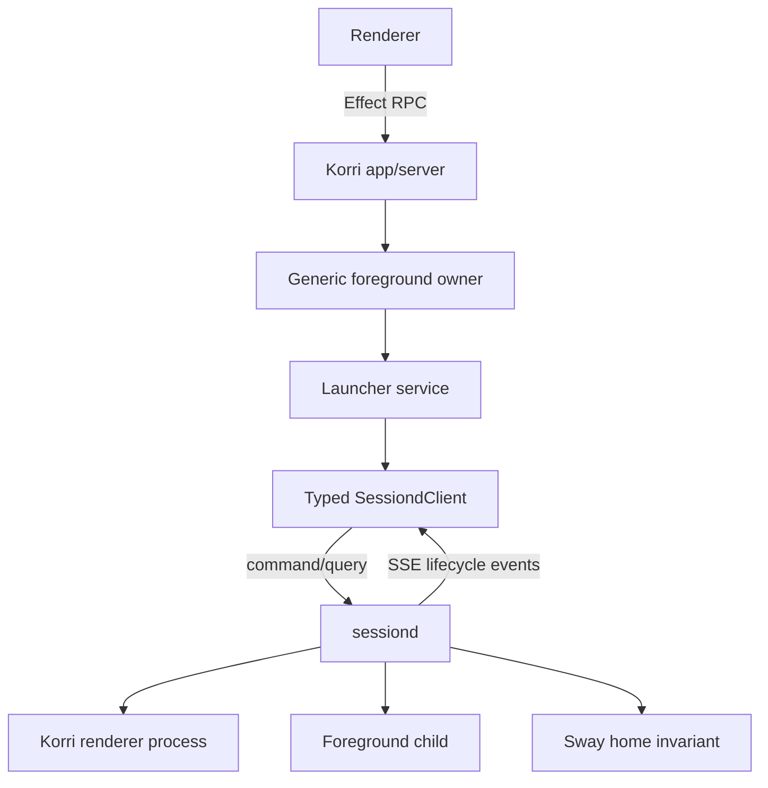

# feat: Integrate sessiond with managed foreground lifecycle events

## Summary

Phase 4B keeps the generic foreground-session owner canonical and makes `sessiond` participate as a managed launcher adapter. The implementation should use Korri's existing Effect RPC boundary for renderer/app APIs, add a typed internal `sessiond` command/query client, and use SSE as the first-class lifecycle event channel for cross-process launch observation.

---

## Problem Frame

Phase 4A brought shell-backed `app.library.launch` under the generic foreground-session owner, but `sessiond` still cannot provide the managed handle that owner requires. When `KORRI_SESSIOND_URL` is configured, the launcher now fails closed for managed spawn, while `sessiond` continues to maintain its own home/launch/game/restore state behind a blocking `/launch` endpoint.

The next slice must remove that limitation without creating two competing foreground owners for the same host. The generic owner remains the lifecycle contract; `sessiond` becomes the session-scoped adapter that exposes managed launch identity, lifecycle events, readiness evidence, and per-launch termination.

---

## Requirements

- R1. Preserve the Phase 1-4A generic foreground-session owner as the canonical lifecycle model for `app.library.launch` re-entry, lifecycle events, readiness, and shutdown. (Origin R10, R11, R12, R14, R17)
- R2. Replace Phase 4A's unsupported managed sessiond spawn outcome with a managed sessiond launch capability that returns an owner-compatible session handle. (Origin R10, R13, R14)
- R3. Keep Korri app/server's existing Effect RPC boundary as the product-facing API; `sessiond` integration must be an internal adapter/client concern, not a new renderer-facing protocol. (Origin R20)
- R4. Use a long-term command/query plus event-stream split for `sessiond`: typed request/response command/query methods for start/status/terminate, and SSE for lifecycle/exit/readiness events. (Origin R17)
- R5. Preserve `sessiond` capability-token protection and fail-closed behavior for missing token, rejected token, unreachable daemon, and unsupported daemon capability. (Origin R17, R20)
- R6. Prevent split-brain when `sessiond` is already launching or running due to an out-of-band caller by consulting `sessiond` state before managed spawn and surfacing `session-busy` without starting another child. (Origin R14)
- R7. Preserve `sessiond`'s existing kiosk responsibilities: mask/restore `essway`, stop the renderer before game launch, restore the renderer after exit, and reconcile the Sway home invariant. (Origin R18, R20)
- R8. Gate owner readiness for sessiond-backed launches on restored home evidence, not child exit alone. (Origin R16, R18)
- R9. Surface typed local launch failures for `session-busy`, `host-unavailable` (including unreachable or managed-capability-unsupported sessiond), rejected control, and command/runtime failure without collapsing them into generic command failure. (Origin R14, R17)
- R10. Preserve existing blocking `sessiond` `/launch` compatibility where needed, but do not use it as the managed lifecycle path. (Current API compatibility)

**Origin actors:** A2 Player, A3 Foreground/session owner, A4 Launcher adapter, A5 Foreground session host, A6 Cloud gaming machine, A7 Operator/agent
**Origin flows:** F1 Default foreground launch, F2 Re-entry while a session is not ready, F4 Cloud gaming source launch
**Origin acceptance examples:** AE3 foreground ownership despite Gamescope opt-out, AE5 busy re-entry rejection, AE6 conservative readiness, AE7 lifecycle evidence

---

## Scope Boundaries

- This plan covers sessiond-backed local launches used through `app.library.launch` and the shared `Launcher.spawn` managed-launch seam.
- This plan does not make `sessiond` the canonical foreground owner; the generic foreground-session owner remains canonical.
- This plan does not expose `sessiond` directly to the renderer or replace existing app/server Effect RPC surfaces.
- This plan does not migrate every `sessiond` command to a public Effect RPC service; `sessiond` remains a local capability-protected daemon.
- This plan does not implement WebSockets; the selected event transport is one-way SSE because lifecycle observation is one-way and termination/control remain request/response.
- This plan does not implement cloud/source-machine idle blank restore or Sunshine runner ownership; those remain later roadmap slices.
- This plan does not add launch queueing, cancel-and-relaunch UX, or automatic retry.
- This plan does not add Steam-specific, Moonlight-specific, or emulator-specific foreground rules as the core guarantee.

### Deferred to Follow-Up Work

- Cross-process host topology beyond sessiond: decide how desktop Bun, Korri server, and sessiond coordinate when more than one process can initiate foreground launches on the same physical host.
- Cloud/source-machine ownership: route `tools/device/game-stream-runner.ts` and source-host launch intents through the foreground lifecycle with idle-blank restore, including origin AE8.
- Rich non-desktop operator status: expose a sanitized remote status surface once source-machine ownership is implemented.
- Adapter-aware foreground repair for specific local apps/emulators: add surface selectors and repair evidence after the sessiond managed contract is stable.
- WebSocket or bidirectional control: revisit only if lifecycle observation and command HTTP/SSE split proves insufficient.

---

## Context & Research

### Relevant Code and Patterns

- `korri/shared/stream/foreground-session-owner.ts` defines the generic runtime owner. It requires adapter `spawn` to return a `ForegroundManagedSessionHandle` with exit and termination semantics.
- `korri/products/app/api/library/local-foreground-launch-adapter.ts` is the Phase 4A shell-backed adapter and should remain the local owner integration pattern.
- `korri/products/app/api/library/foreground-session-host-layer.ts` wires one process-local foreground owner into app/server RPC compositions.
- `korri/shared/library/session-launcher.ts` currently delegates blocking `run` calls to `sessiond`, but managed `spawn` returns an unsupported failure. This is the primary Phase 4B seam.
- `korri/shared/library/launcher.ts` defines `LaunchFailureKind`, `ManagedLaunchResult`, and the optional `spawn` contract.
- `tools/device/sessiond.ts` owns `sessiond`'s current HTTP control surface and blocking launch flow.
- `tools/device/sessiond-state.ts` defines `stopped`, `starting`, `home`, `launching`, `game`, `restoring`, and `recovering` modes. The plan should map these into evidence for the generic owner rather than inventing a second product lifecycle.
- `tools/device/sessiond-sway.ts` and `evaluateHomeInvariant` in `tools/device/sessiond-state.ts` define the home readiness invariant for renderer restore.
- `korri/products/app/features/home/launcher-layer-rpc.ts` currently maps `app.library.launch` through Effect RPC and must preserve `failureKind` parity with the desktop bridge.
- `korri/products/app/features/home/launcher-layer-bridge.ts` is the renderer-side failure-kind mapping pattern to mirror for RPC transport.
- `tools/device/sessiond.test.ts`, `tools/device/sessiond-state.test.ts`, `tools/device/sessiond-sway.test.ts`, `korri/shared/library/session-launcher.test.ts`, and `korri/products/app/api/library/launch.rpc-handler.test.ts` are the key test surfaces.

### Institutional Learnings

- `docs/solutions/architecture-patterns/kiosk-foreground-app-policy-over-gamescope-overlay-2026-05-24.md`: foreground policy belongs to the session owner; Gamescope is an adapter, not the outer foreground guarantee.
- `docs/solutions/integration-issues/supervise-chromium-kiosk-session-after-game-exit-2026-05-04.md`: kiosk restore is a session invariant; suspend home repair while a game is active and relaunch/repair the renderer after exit.
- `docs/solutions/architecture-patterns/boot-scoped-control-plane-with-session-scoped-runner-2026-05-19.md`: keep boot-scoped control plane and session-scoped runner seams narrow, trust-scoped, and path-disciplined.
- `docs/solutions/workflow-issues/generic-game-stream-runner-validation-contract-2026-05-19.md`: one-shot launch/session signals and status files should remain generic and not become per-game launchers.
- `docs/solutions/integration-issues/runtime-mask-essway-to-stop-emulationstation-relaunching-during-odin-kiosk-sessions-2026-05-03.md`: use reversible runtime masks and avoid broad process killing.
- `docs/solutions/runtime-errors/steam-manual-launch-x86-eager-xwayland-dbus-readiness-2026-05-26.md`: readiness should use adapter-appropriate evidence rather than process-name sleeps; process cleanup must be precise.

### External References

- External research skipped. The relevant decisions are dominated by local Effect RPC patterns, local daemon/sessiond code, and existing foreground-session lifecycle learnings.

---

## Key Technical Decisions

- Generic owner remains canonical: `sessiond` is a managed adapter for the existing foreground owner, not a replacement lifecycle authority.
- Effect RPC remains the app/server product boundary: renderer and app/server calls continue through `app.library.launch`; `sessiond` integration lives behind the `Launcher` / sessiond client seam.
- Internal sessiond protocol uses command/query plus SSE: commands and status remain typed request/response operations, while lifecycle observation is a one-way SSE stream.
- Do not start with WebSockets: Phase 4B needs one-way lifecycle events and ordinary command endpoints; bidirectional sockets add complexity without current product need.
- Add a managed launch path beside the existing blocking `/launch`: compatibility is preserved, while the foreground owner uses the managed path that returns launch identity immediately and observes lifecycle events asynchronously.
- Sessiond status is consulted during adapter prepare before managed spawn when configured: out-of-band sessiond launches become `session-busy` failures without starting another child. The owner may still emit an accepted-then-failed lifecycle for this pre-spawn veto unless a future pre-accept hook is added.
- Readiness is restored-home evidence: child exit is insufficient; the owner releases only after `sessiond` reports successful renderer restore and home invariant satisfaction or a bounded failure.
- Termination is per-launch, not whole-session stop: owner shutdown must target the active launch identity and must not call global stop unless an explicit operator action does that.
- Sessiond has a single active managed launch identity: start while not `home` is `session-busy`; terminating a stale launch id is a typed stale/not-found result and must not affect the current session.
- The blocking `/launch` path should wrap the same internal managed execution path and await its terminal result, rather than duplicating renderer stop/launch/restore choreography.
- Failure kinds stay typed end-to-end: sessiond transport/capability failures should not be surfaced as ordinary game command failures.

---

## Open Questions

### Resolved During Planning

- Authority model: the generic foreground-session owner remains canonical; `sessiond` is a managed adapter.
- Streaming posture: use SSE as the lifecycle event channel from the start, not polling as a throwaway proof-of-concept.
- WebSocket posture: do not use WebSockets for Phase 4B because control is request/response and lifecycle observation is one-way.
- Effect RPC boundary: keep existing app/server RPC surfaces; wrap the internal `sessiond` protocol in typed services rather than exposing `sessiond` directly to the renderer.

### Deferred to Implementation

- Exact method and endpoint names for the internal sessiond managed launch protocol: choose names while fitting current `sessiond.ts` structure, preserving the command/query plus SSE split.
- Exact SSE event field names: define stable schema names in code and tests, but keep the plan at event-category level.
- Exact event buffering/replay window: choose the minimum needed to handle reconnect without overbuilding an event store.
- Exact readiness timeout values: choose bounded defaults during implementation and make them injectable in tests.
- Exact older-sessiond capability probe shape: implement a clear capability check without committing the plan to one wire field name.

---

## High-Level Technical Design

> *This illustrates the intended approach and is directional guidance for review, not implementation specification. The implementing agent should treat it as context, not code to reproduce.*





---

## Implementation Units

### U1. Restore RPC launch failure-kind parity

**Goal:** Ensure renderer RPC launch paths preserve typed local launch failure categories before adding more sessiond failure modes.

**Requirements:** R3, R9

**Dependencies:** None

**Files:**
- Modify: `korri/products/app/features/home/launcher-layer-rpc.ts`
- Modify: `korri/products/app/features/home/library-rpc-layers.test.ts`
- Test: `korri/shared/library/launcher.test.ts`

**Approach:**
- Characterize the existing RPC pass-through first; add transformation only if the current layer actually drops `failureKind`.
- Mirror the desktop bridge mapping posture so `LauncherLayerRpc` preserves `failureKind` from `app.library.launch` failed responses.
- Keep missing `failureKind` compatible with existing generic command failures.
- Do not introduce renderer/sessiond-specific UI branches; typed launch failures should flow through the existing shared launcher result contract.

**Execution note:** Start test-first with a failed RPC response carrying `failureKind: "session-busy"` and assert the renderer-side `LaunchResult` preserves it.

**Patterns to follow:**
- `korri/products/app/features/home/launcher-layer-bridge.ts`
- `korri/shared/themes/shift/molecules/ShiftLaunchFailureBanner.tsx`

**Test scenarios:**
- Error path: RPC failed response with `failureKind: "session-busy"` maps to a renderer `LaunchResult` carrying `session-busy`.
- Error path: RPC failed response with `failureKind: "host-unavailable"` maps to a renderer `LaunchResult` carrying `host-unavailable`.
- Edge case: RPC failed response without `failureKind` remains a generic command failure.
- Happy path: successful launched response remains unchanged.

**Verification:**
- Existing renderer launch UX can distinguish lifecycle busy and host-unavailable for RPC-backed launches.

### U2. Define typed sessiond managed-launch protocol contracts

**Goal:** Add shared, schema-validated contracts for sessiond managed launch commands, status/capability queries, termination, and lifecycle events.

**Requirements:** R2, R4, R5, R8, R9, R10

**Dependencies:** None

**Files:**
- Create: `korri/shared/library/sessiond-managed-launch-protocol.ts`
- Modify: `tools/device/sessiond-state.ts`
- Test: `korri/shared/library/sessiond-managed-launch-protocol.test.ts`
- Test: `tools/device/sessiond-state.test.ts`

**Approach:**
- Define the internal contract around semantic operations, not around product REST resources: managed launch start, status/capability read, lifecycle event stream, and per-launch termination.
- Keep wire protocol schemas under `korri/shared/library` so both the shared session launcher and device-side `sessiond` can depend on them without shared code importing `tools/device`.
- Include a capability signal so newer Korri app/server code can fail closed when talking to an older `sessiond` without managed launch support.
- Model lifecycle event categories needed by the generic owner: accepted/running, renderer stopped, child exited, restoring, home ready, failed/recovering.
- Carry launch identity through sessiond state so out-of-band and reconnect scenarios have a stable active session reference.
- Add an optional readiness-evidence seam to the managed launch contract so sessiond-backed handles can report restored-home evidence during the owner's verify-ready stage while shell launches keep the Phase 4A managed-child-exit default.
- Keep schemas free of raw argv/env/stderr in status/event summaries except where already part of typed launch result diagnostics.

**Execution note:** Add schema tests first so later `sessiond` and client work share the same event vocabulary.

**Technical design:** Directional contract categories:

```text
Command/query:
  status/capabilities
  start-managed-launch
  terminate-managed-launch

Event stream:
  launch accepted/running
  renderer/session transition evidence
  child terminal result
  restore/readiness outcome
  failure/recovery outcome
```

**Patterns to follow:**
- `korri/products/app/api/library/launch.rpc.ts` for schema-defined response contracts.
- `korri/shared/stream/foreground-session-status.ts` for bounded lifecycle/status vocabulary.
- `tools/device/sessiond-state.ts` for existing session mode names.

**Test scenarios:**
- Happy path: valid managed-launch start/status/event payloads decode and roundtrip.
- Error path: malformed event payloads are rejected before reaching the owner adapter.
- Edge case: status for no active launch carries no active launch identity.
- Edge case: status for active game carries launch identity and mode without leaking raw launch spec internals such as `argv`, `env`, `cwd`, or the raw `launchSpec`.
- Error path: unsupported capability status decodes distinctly from transport failure.

**Verification:**
- Later units can import one contract for sessiond managed launch commands and SSE events.

### U3. Add managed launch execution and SSE lifecycle events to sessiond

**Goal:** Let `sessiond` start a launch asynchronously, emit lifecycle events over SSE, and keep the existing blocking launch path compatible.

**Requirements:** R2, R4, R5, R7, R8, R10

**Dependencies:** U2

**Files:**
- Modify: `tools/device/sessiond.ts`
- Modify: `tools/device/sessiond-state.ts`
- Modify: `tools/device/sessiond-sway.ts`
- Test: `tools/device/sessiond.test.ts`
- Test: `tools/device/sessiond-state.test.ts`
- Test: `tools/device/sessiond-sway.test.ts`

**Approach:**
- Add a managed launch path that returns launch identity after sessiond has accepted the launch and started session-controlled execution, without waiting for child exit.
- Refactor the existing blocking launch path to wrap the same internal managed execution and await its terminal result, so compatibility and managed paths do not duplicate renderer stop/launch/restore choreography.
- Emit bounded lifecycle events for sessiond sub-steps that matter to the generic owner and operators: renderer stop, child running, child exit, restoring, home-ready, and failure/recovery.
- Back the event stream with enough in-memory event history for the active launch to tolerate a short reconnect, without creating a persistent event store.
- Ensure SSE subscribers are cleaned up when the client disconnects, the launch exits, or sessiond stops.
- Continue requiring the existing sessiond token for all managed command and event surfaces.

**Execution note:** Characterize current blocking `/launch` behavior first, then add managed execution without changing its compatibility response.

**Patterns to follow:**
- `tools/device/sessiond.ts` for current renderer stop/launch/restore choreography.
- `tools/device/sessiond-state.ts` for mode transition rules.
- `tools/device/sessiond-smoke.test.ts` for daemon-level validation posture.

**Test scenarios:**
- Happy path: managed launch from `home` returns launch identity promptly, stops renderer, runs child, restores renderer, and emits lifecycle events in order.
- Happy path: existing blocking launch still returns terminal result and restored home status.
- Covers AE5. Error path: managed launch while sessiond is not `home` returns `session-busy` and does not spawn another child.
- Covers AE6. Readiness path: child exit event occurs before home-ready; the final readiness event only emits after renderer restore and home invariant reconciliation.
- Error path: renderer restore failure emits recovering/failure evidence and does not emit home-ready.
- Edge case: unauthenticated managed command and event requests return unauthorized without changing state.
- Edge case: SSE client disconnect removes its subscriber without affecting the running launch.
- Edge case: reconnect within the bounded replay window observes buffered terminal/readiness events without duplicate terminal resolution.
- Edge case: reconnect after the replay window falls back to a fresh status query or bounded host failure instead of hanging forever.
- Covers AE7. Integration: emitted lifecycle events preserve the external order `renderer-stopped` before child-running, child-exited before restoring, and restoring before home-ready, without pinning unrelated internal sub-event order.

**Verification:**
- `sessiond` can represent an active managed launch independently of a blocking HTTP response.
- Lifecycle event observation is available without polling or WebSockets.

### U4. Implement a typed sessiond client and managed `Launcher.spawn`

**Goal:** Replace the unsupported managed sessiond spawn with a sessiond-backed managed handle consumed by the generic foreground-session owner.

**Requirements:** R2, R3, R4, R5, R9

**Dependencies:** U2, U3

**Files:**
- Modify: `korri/shared/library/session-launcher.ts`
- Modify: `korri/shared/library/launcher.ts`
- Test: `korri/shared/library/session-launcher.test.ts`
- Test: `korri/shared/library/launcher.test.ts`

**Approach:**
- Introduce a typed internal `SessiondClient` inside or beside `session-launcher` that wraps command/query calls and SSE lifecycle observation.
- Resolve token and probe status/capability before attempting managed spawn so missing token, rejected token, unreachable daemon, and older daemon capability failures become typed launch failures.
- Implement `spawn` so the returned managed handle's `exited` promise is driven by sessiond lifecycle events rather than by the blocking `/launch` response.
- Implement handle termination through the per-launch sessiond termination command, not through whole-session stop.
- Map sessiond transport failures, rejected capability probes, and managed-capability-unsupported responses to `host-unavailable` with diagnostic detail, instead of adding a new renderer-visible failure kind or falling back to `command-failed`.
- Keep `run` behavior compatible for existing consumers.

**Execution note:** Add controlled fetch/SSE tests first; do not require a real daemon for unit coverage.

**Patterns to follow:**
- `korri/shared/library/shell-launcher.ts` for preserving `run` while adding managed spawn.
- `korri/shared/library/session-launcher.test.ts` for token and fail-closed behavior.
- `korri/shared/library/launcher.ts` for centralized failure kinds and exit codes.

**Test scenarios:**
- Happy path: managed `spawn` posts a managed launch command, opens SSE observation, returns a handle, and resolves terminal result after child-exited/home-ready events.
- Error path: missing token fails closed before any sessiond request.
- Error path: unreachable sessiond maps to typed host-unavailable failure.
- Error path: sessiond rejects a present token maps to a typed control/host failure and does not retry indefinitely.
- Error path: sessiond reports managed capability unsupported maps to typed host-unavailable failure with diagnostic detail.
- Error path: sessiond reports busy or not-home maps to `session-busy` and does not masquerade as command failure.
- Edge case: `terminate` sends per-launch termination and resolves the handle without calling whole-session stop.
- Edge case: SSE stream ends unexpectedly before terminal event follows the bounded reconnect policy, then maps to a typed host/session failure rather than hanging.
- Edge case: terminate invoked before managed-launch acknowledgement resolves once without orphaning the launch.
- Edge case: terminate races a natural child exit; the handle resolves once with a single terminal result.
- Compatibility: `run` still posts through the existing blocking launch behavior and returns the same launched/failed result shape.

**Verification:**
- When `KORRI_SESSIOND_URL` is configured, the `Launcher` service can provide managed spawn to the foreground owner.
- Existing sessiond `run` users remain compatible.

### U5. Integrate sessiond managed spawn into the foreground owner adapter

**Goal:** Make sessiond-backed local launches flow through the same foreground-session owner path as shell-backed launches, including split-brain preflight and restored-home readiness.

**Requirements:** R1, R2, R6, R7, R8, R9

**Dependencies:** U1, U4

**Files:**
- Modify: `korri/products/app/api/library/local-foreground-launch-adapter.ts`
- Modify: `korri/products/app/api/library/launch.rpc-handler.ts`
- Modify: `korri/products/app/api/library/foreground-session-host-layer.ts`
- Test: `korri/products/app/api/library/local-foreground-launch-adapter.test.ts`
- Test: `korri/products/app/api/library/launch.rpc-handler.test.ts`
- Test: `korri/products/app/api/server/rpc-server.test.ts`

**Approach:**
- Keep product validation before lifecycle reservation for unknown game IDs and launch-configuration failures.
- In the adapter prepare stage, perform sessiond preflight when the selected launcher is sessiond-backed: token/url/capability status and current mode.
- If sessiond reports an active launch or non-home state, return `session-busy` before attempting a second spawn. This is a pre-spawn veto inside adapter prepare, not a new pre-accept hook on the generic owner.
- In the spawn stage, use the managed sessiond handle from U4 exactly like shell-backed managed handles.
- In teardown/verify-ready, wait on sessiond readiness evidence from lifecycle events/status rather than treating child exit as sufficient.
- Preserve terminal `app.library.launch` response behavior: the RPC response still resolves after terminal launch outcome, while the owner uses sessiond events to govern lifecycle readiness.

**Execution note:** Start with an integration-style test where sessiond reports `game` before managed spawn, proving no second managed command is sent.

**Patterns to follow:**
- `korri/products/app/api/library/local-foreground-launch-adapter.ts` shell-backed owner mapping.
- `korri/deploy/desktop/launch-bridge.ts` for adapter failure-to-response mapping.
- `tools/device/sessiond-state.ts` for mode semantics.

**Test scenarios:**
- Covers AE3. Happy path: Gamescope-disabled sessiond-backed local launch is accepted, enters owner running state, observes sessiond terminal/home-ready events, and returns launched after the managed session completes.
- Covers AE5. Error path: a second local launch while the owner is running returns `session-busy` without sending another sessiond managed launch command.
- Error path: sessiond status reports `game` while the owner is idle; owner maps the pre-spawn veto to `session-busy` and does not spawn.
- Error path: sessiond reports `home` during preflight but rejects managed start as busy due to a concurrent out-of-band launch; owner maps the race to `session-busy` and does not retry.
- Covers AE6. Readiness path: child-exited event alone does not release owner to idle; home-ready evidence is required.
- Error path: sessiond restore failure maps to owner failure/recovering evidence and a failed local launch response.
- Error path: sessiond unreachable maps to host-unavailable failureKind and does not fall back to direct shell launch.
- Regression: shell-backed local launch with `KORRI_SESSIOND_URL` unset does not call sessiond preflight or sessiond managed spawn and behaves like the Phase 4A shell path.
- Integration: `korri/products/app/api/server/rpc-server.test.ts` proves app/server RPC composition shares one owner instance by holding a first launch and rejecting the second as `session-busy`.

**Verification:**
- Sessiond-backed launches no longer fail as unsupported managed spawn.
- Owner state and sessiond state cannot drift into accepting duplicate foreground launches through normal RPC paths.

### U6. Wire shutdown and per-launch termination safely

**Goal:** Ensure generic owner shutdown and active-session termination target only the sessiond-managed launch, not the whole Korri kiosk session.

**Requirements:** R2, R5, R7, R8

**Dependencies:** U3, U4, U5

**Files:**
- Modify: `tools/device/sessiond.ts`
- Modify: `korri/shared/library/session-launcher.ts`
- Modify: `korri/products/app/api/library/foreground-session-host-layer.ts`
- Test: `tools/device/sessiond.test.ts`
- Test: `korri/shared/library/session-launcher.test.ts`
- Test: `korri/products/app/api/library/launch.rpc-handler.test.ts`

**Approach:**
- Add or complete a per-launch termination command in sessiond that targets the active launch identity.
- Keep `/control/stop` as an operator/session command and do not use it for normal foreground owner termination.
- Make managed handle `terminate` / `terminateNow` call the per-launch termination command and rely on lifecycle events/status to observe resulting exit/restore.
- During app/server disposal, terminate the active sessiond-managed launch through the owner if this process owns the active request; if sessiond reports an unrelated out-of-band launch, do not nuke the whole kiosk.

**Patterns to follow:**
- `korri/shared/stream/foreground-session-owner.ts` shutdown behavior.
- `korri/shared/library/shell-launcher.ts` managed handle termination semantics.
- `tools/device/sessiond.ts` existing `/control/stop` separation.

**Test scenarios:**
- Happy path: owner shutdown while sessiond-managed launch is active calls per-launch termination and observes terminal/restore events.
- Error path: termination request for unknown launch id returns a typed not-found/stale result without stopping Korri mode.
- Edge case: repeated terminate calls are idempotent and do not emit duplicate terminal events.
- Edge case: terminate races natural child exit and produces one terminal owner/result resolution.
- Error path: failed termination transport maps to host-unavailable evidence and does not hang owner shutdown indefinitely.
- Integration: `/control/stop` behavior remains whole-session stop and is not called by managed handle termination tests.

**Verification:**
- Managed foreground owner termination is scoped to the active launch.
- Sessiond's operator stop semantics remain distinct and unchanged.

### U7. Add focused sessiond managed lifecycle smoke coverage and operational notes

**Goal:** Pin the end-to-end managed sessiond lifecycle at the daemon/client boundary and document the RPC/SSE split for future adapter rollout.

**Requirements:** R3, R4, R5, R7, R8, R10

**Dependencies:** U5, U6

**Files:**
- Modify: `tools/device/sessiond-smoke.test.ts`
- Modify: `tools/device/sessiond-launcher-client.test.ts`
- Modify: `tools/device/sessiond-launcher-client.ts`
- Modify: `./plan.md`

**Approach:**
- Extend smoke-style tests to prove a managed launch reaches running, emits lifecycle events, exits, restores home, and leaves the home invariant satisfied.
- Reduce `tools/device/sessiond-launcher-client.ts` to an explicit blocking/compatibility smoke helper that delegates to shared sessiond client behavior where practical; it should not grow a separate managed lifecycle implementation.
- Document the transport split in plan completion/shipping notes: Effect RPC for app/server APIs, typed internal command/query for sessiond control, SSE for lifecycle events.
- Keep docs limited to the plan/shipping context; do not add new learning docs unless explicitly requested after execution.

**Patterns to follow:**
- `tools/device/sessiond-smoke.test.ts`
- `tools/device/sessiond-launcher-client.ts`
- `../01KSGS9H2ETAC371KG4XMD16K3-feat-foreground-session-adapter-rollout/plan.md` completion posture

**Test scenarios:**
- Integration: managed sessiond smoke starts from home, accepts launch, emits running and exit/readiness events, and returns to restored home.
- Integration: unauthenticated managed smoke requests are rejected.
- Edge case: compatibility launcher client behavior remains explicit and does not silently bypass managed lifecycle in tests that expect managed ownership.
- Error path: sessiond unavailable in launcher client produces typed host-unavailable diagnostics.

**Verification:**
- A developer can validate sessiond managed lifecycle without manually interpreting ad hoc logs.
- Future non-shell launchers have a documented internal protocol shape to extend.

---

## System-Wide Impact

- **Interaction graph:** Renderer launch actions continue through Effect RPC; Korri app/server resolves library launch policy; the generic foreground owner supervises lifecycle; `SessionLauncher` talks to `sessiond`; `sessiond` controls renderer, child process, Sway, and restore.
- **Error propagation:** Product validation remains product-level; sessiond transport/capability errors become typed host/adapter failures; lifecycle re-entry remains `session-busy`; child/runtime failures remain terminal launch failures with diagnostics.
- **State lifecycle risks:** The generic owner and `sessiond` can drift if out-of-band callers start launches. Phase 4B mitigates this by preflighting `sessiond` state before managed spawn and publishing stable active launch identity.
- **API surface parity:** `LauncherLayerRpc` must preserve `failureKind` like the desktop bridge so renderer behavior stays consistent across desktop and sessiond-backed deployments.
- **Integration coverage:** Unit tests cover protocol schemas and mappings; integration tests must prove app/server owner, sessiond managed spawn, SSE events, and restored-home readiness work together.
- **Unchanged invariants:** Existing app/server RPC tags, blocking sessiond launch compatibility, Gamescope cascade behavior, and sessiond token protection remain intact.



---

## Risks & Dependencies

| Risk | Mitigation |
|------|------------|
| Sessiond and generic owner double-own the same foreground host | Make the generic owner canonical and force sessiond into a managed adapter contract; preflight sessiond state before managed spawn. |
| SSE adds lifecycle complexity | Keep SSE one-way and scoped to active launch lifecycle events; commands/status/termination remain request/response. |
| Blocking `/launch` compatibility regresses | Preserve the current blocking path and add managed launch as a sibling/wrapper path with characterization tests. |
| Older sessiond lacks managed capability | Add capability/status probe and fail closed with typed unsupported/host failure. |
| Owner releases before renderer is truly restored | Gate readiness on sessiond restored-home/home-invariant evidence, not child exit. |
| Termination accidentally stops the whole kiosk | Add per-launch termination and keep `/control/stop` out of managed handle termination. |
| Out-of-band sessiond callers cause split-brain | Consult sessiond status before managed spawn and map active non-home state to `session-busy`. |
| Failure categories remain too generic | Centralize new or reused failure kinds in `LaunchFailureKind` and test RPC/renderer propagation. |

---

## Documentation / Operational Notes

- Shipping notes should explicitly state the transport split: Effect RPC remains the app/server boundary; sessiond command/query is internal; SSE is the lifecycle event stream.
- Do not describe the new sessiond command/query surface as a product REST API. It is a local, token-protected daemon protocol.
- Unsupported managed sessiond capability should default to `host-unavailable` with diagnostic detail; add a new failure kind only if implementation discovers a distinct renderer behavior is required and tests pin that distinction.
- Keep operator guidance focused on existing status/smoke checks; do not add a dashboard in this phase.

---

## Alternative Approaches Considered

- Make `sessiond` canonical when configured: rejected for this phase because it would fork the lifecycle authority by deployment mode and weaken the contract-first direction established in Phases 1-4A.
- Use status polling/long-poll before SSE: rejected because lifecycle event streaming is the likely final shape and a polling proof-of-concept risks growing an accidental lifecycle REST API.
- Use WebSockets: rejected because Phase 4B needs one-way lifecycle observation; command and termination control remain request/response.
- Expose sessiond directly as renderer-facing Effect RPC: rejected because sessiond is a privileged local daemon that can launch arbitrary specs; renderer-facing product APIs should remain `app.library.launch` and related app/server RPCs.
- Replace the blocking `/launch` path immediately: rejected to preserve compatibility and keep the managed lifecycle change incremental.

---

## Sources & References

- **Origin document:** [../../01KSBMG31W82JBVJBJ5TT15MZN-feat-default-gamescope-foreground-launch/requirements.md](../../01KSBMG31W82JBVJBJ5TT15MZN-feat-default-gamescope-foreground-launch/requirements.md)
- Prior plan: [../01KSGS9H2ETAC371KG4XMD16K3-feat-foreground-session-adapter-rollout/plan.md](../01KSGS9H2ETAC371KG4XMD16K3-feat-foreground-session-adapter-rollout/plan.md)
- Flow analysis: [docs/reviews/current-branch/foreground-session-phase4b-sessiond-non-shell-flow-analysis.md](../../../docs/reviews/current-branch/foreground-session-phase4b-sessiond-non-shell-flow-analysis.md)
- Related code: `korri/shared/stream/foreground-session-owner.ts`
- Related code: `korri/products/app/api/library/local-foreground-launch-adapter.ts`
- Related code: `korri/shared/library/session-launcher.ts`
- Related code: `tools/device/sessiond.ts`
- Related code: `tools/device/sessiond-state.ts`
- Related code: `tools/device/sessiond-sway.ts`
- Related code: `korri/shared/library/sessiond-managed-launch-protocol.ts`
- Related code: `korri/products/app/features/home/launcher-layer-rpc.ts`
- Related learning: `docs/solutions/architecture-patterns/kiosk-foreground-app-policy-over-gamescope-overlay-2026-05-24.md`
- Related learning: `docs/solutions/integration-issues/supervise-chromium-kiosk-session-after-game-exit-2026-05-04.md`
- Related learning: `docs/solutions/architecture-patterns/boot-scoped-control-plane-with-session-scoped-runner-2026-05-19.md`
- Related learning: `docs/solutions/workflow-issues/generic-game-stream-runner-validation-contract-2026-05-19.md`
