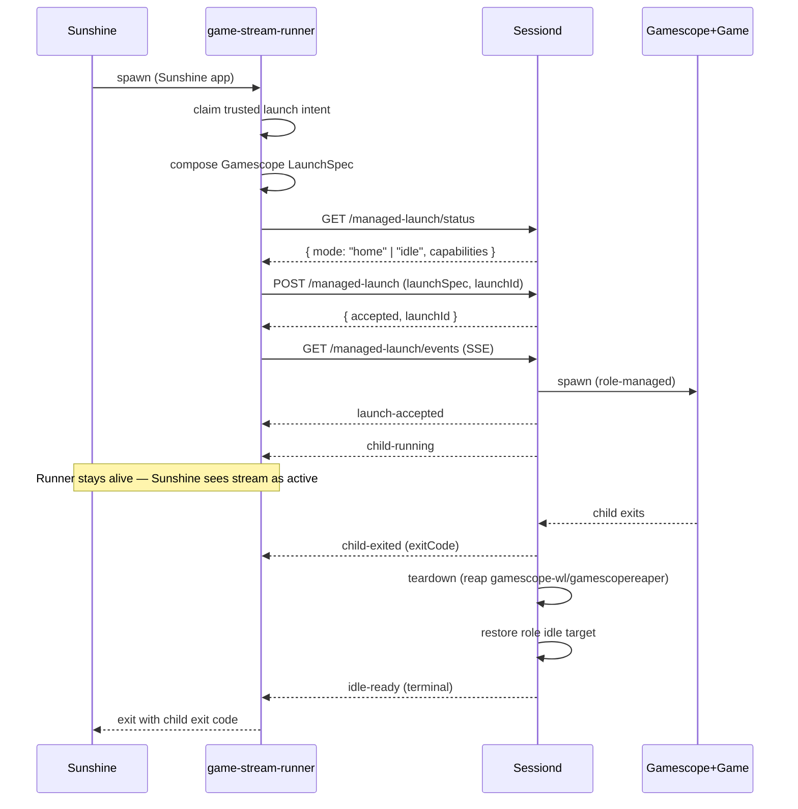

# feat: Generalize sessiond into role-pluggable supervisor and route source-machine launches through it

## Summary

Phase 4C makes `tools/device/sessiond` the single foreground-session owner per host across both deployment roles by introducing a role-pluggable supervisor (kiosk role keeps today's Electrobun + essway + Korri-home behavior; new source-machine role does an idle-blank restore over Sway) and turning `tools/device/game-stream-runner.ts` into a sessiond `/managed-launch` client. Sunshine still fires the runner; the runner consumes its trusted launch intent and translates it into a sessiond call instead of supervising the child itself. The Phase 4B managed-launch wire protocol is extended additively (new `idle-ready` event alongside `home-ready`; role-conditional `renderer-stopped`) so existing Phase 4B clients keep working.

---

## Problem Frame

Phase 4A routed local app launches through the foreground-session lifecycle owner; Phase 4B made `sessiond` a managed-launch supervisor for kiosk hosts. The cloud-gaming / source-machine path — where a host runs Korri server, Sunshine, and a compositor with no Korri GUI client — still bypasses the supervisor entirely (`tools/device/game-stream-runner.ts` does its own lock, spawn, observe-exit, Sway repair, and status-file write). That leaves the origin doc's `F4` cloud-gaming flow without single-owner busy rejection, conservative readiness, idle-blank restore, or a unified operator status surface. It also re-introduces the documented compositor SIGSEGV restart-loop class because teardown reaping on the runner side is process-name-incomplete.

The Phase 4A roadmap (see origin: `../01KSGS9H2ETAC371KG4XMD16K3-feat-foreground-session-adapter-rollout/plan.md`) deferred this to follow-up work. Phase 4C is that follow-up: keep one owner per host (origin R14), keep deployment roles composable (origin R20), and apply the Phase 4B contract to source-machine hosts without redesigning it.

---

## Requirements

- R1. Treat the Phase 1–4B lifecycle contract and managed-launch wire protocol as stable; extend additively rather than reshaping. (Origin R10, R11, R12)
- R2. Make `tools/device/sessiond` role-pluggable so one supervisor binary serves both kiosk and source-machine hosts, with the kiosk role's externally observable behavior unchanged. (Origin R10, R11, R20; AE5)
- R3. Add a source-machine `SessionRole` that has no GUI renderer, no EmulationStation mask, and restores the host to an idle-blank graphical session (Sway alive, no foreground app windows, no live `gamescope-wl`/`gamescopereaper` subprocesses) after each managed launch exits. (Origin R18, R19, R20; AE8)
- R4. Make `tools/device/game-stream-runner.ts` a sessiond `/managed-launch` client on source-machine hosts: it consumes the existing trusted launch intent, calls sessiond, waits on the SSE lifecycle stream until child-exited, and propagates exit code to Sunshine. (Origin F4; R10, R11, R14, R17)
- R5. Preserve the existing Sunshine integration shape: the runner CLI surface, the trusted launch-intent file contract, and the property that the runner stays alive while a stream is running so Sunshine's PID-tracking expectation holds. (Existing operational contract; origin R20)
- R6. Fail closed when sessiond is configured (`KORRI_SESSIOND_URL` set) but unreachable from the runner — never silently fall back to in-runner spawn. (Origin R11, R14, R17)
- R7. Apply origin R14 (one foreground session per host) at the supervisor layer rather than via a runner-side file lock: re-entry while sessiond is not idle/ready returns typed `session-busy`. (Origin R14, R17; AE5)
- R8. Extend the managed-launch wire protocol additively: add `idle-ready` as a terminal readiness event peer to `home-ready`, add `idle` as a `SessiondManagedLaunchMode` peer to `home`, let `renderer-stopped` remain kiosk-only; keep strict decoders accepting Phase 4B payloads unchanged. (Origin R11, R17)
- R9. Reap `gamescope-wl` and `gamescopereaper` process trees explicitly during teardown for both roles, using cgroup-scoped discovery (never broad `pkill -f`), to close the documented compositor SIGSEGV restart-loop class. (Origin R16; institutional learning `docs/solutions/runtime-errors/steam-manual-launch-x86-eager-xwayland-dbus-readiness-2026-05-26.md`)
- R10. Surface a sanitized operator status for source-machine hosts: Korri server's `app.server.status` exposes lifecycle evidence (active launch identity, mode, recent events) by proxying sessiond when it is configured, falling back to the existing `status.json` shape for back-compat readers. (Origin R17; AE7)
- R11. Ship NixOS-module support so a source-machine deployment composes from existing capability toggles (`services.korri.compositor.enable && !compositor.kiosk.enable && server.streaming.enable && sessiond.enable`) without introducing a `services.korri.role` enum. (Origin R20; institutional learning `docs/solutions/architecture-patterns/boot-scoped-control-plane-with-session-scoped-runner-2026-05-19.md`)
- R12. Emit structured lifecycle evidence for source-machine launches matching origin AE7: accepted launch, rejected re-entry, state transitions, foreground/surface outcome, child exit, readiness decision, recovery/failure. (Origin R17; AE7)

**Origin actors:** A2 Player, A3 Foreground/session owner, A5 Foreground session host, A6 Cloud gaming machine, A7 Operator/agent
**Origin flows:** F2 Re-entry while a session is not ready, F4 Cloud gaming source launch
**Origin acceptance examples:** AE5 (busy re-entry rejection on the supervisor path), AE7 (structured lifecycle evidence for operators), AE8 (source-machine idle-blank restore)

---

## Scope Boundaries

- This plan does not change kiosk-role behavior visible to existing clients, including the `home-ready` readiness event, `renderer-stopped` emission, or the Electrobun/essway/Sway-Korri-window invariants.
- This plan does not change the Korri server `app.server.stream.prepare` wire contract: the trusted launch-intent file remains the boundary between server and supervisor on source-machine hosts. The server does not start calling `sessiond /managed-launch` directly.
- This plan does not introduce a `services.korri.role` enum or any other deploy-role aggregate option; composition stays on existing capability toggles.
- This plan does not pin Sway/Gamescope versions, tune Gamescope policy, or change Gamescope opt-out semantics — those decisions remain on origin R5/R6 and the existing compositor module.
- This plan does not add launch queueing, automatic retry, or cancel-and-relaunch UX. Re-entry returns `session-busy`.
- This plan does not add a remote operator dashboard or telemetry pipeline beyond the existing RPC status surface.
- This plan does not rewrite `tools/device/game-stream-runner.ts`'s launch-intent claim, requeue, completion, or quarantine semantics, nor the trust assertions on the intent file.
- This plan does not change Sunshine's NixOS app declaration shape (`services.sunshine.applications.apps`).
- This plan only routes `lifecycle: "foreground"` launch intents through sessiond. `lifecycle: "session"` launcher-anchor intents (Steam, browsers, other launcher-style apps whose initial process exits before the session ends, today supported by `tools/device/game-stream-runner.ts`'s wait-monitor path) remain on today's in-process runner supervision path, with a Phase 4C follow-up flagged for extending the managed-launch protocol.
- This plan does not migrate kiosk hosts away from the existing `/storage`-script sessiond install. The new `korri-sessiond` NixOS module is the path for new NixOS-managed deployments (source-machine and any future NixOS kiosk); ROCKNIX `/storage`-installed kiosk hosts continue to install sessiond as they do today.

### Deferred to Follow-Up Work

- Extend the sessiond managed-launch protocol to carry `lifecycle: "foreground" | "session"` and the optional wait-monitor shape so launcher-anchor intents (Steam, browsers) can also be supervised by sessiond. Until this lands, source-machine launcher-anchor intents stay on the runner's existing in-process supervision (preserved by U5).
- Migrate ROCKNIX kiosk hosts that currently install sessiond via `/storage` scripts to the new `korri-sessiond` NixOS module. Phase 4C ships the module; the kiosk-install migration is a separate follow-up so this slice does not risk regressing shipped kiosk hosts.
- Korri server calling sessiond directly from `app.server.stream.prepare` so prepare-time admission rejection (before intent write) is typed. Today the runner is the single sessiond client on source-machine hosts.
- Retiring the `status.json` back-compat read in `app.server.status` once all operator tooling consumes sessiond status proxying.
- Adapter-specific foreground repair beyond Gamescope (e.g., direct-KMS, non-Sway compositors) for future role variants.
- Cross-host operator status surface (e.g., observing source-machine lifecycle from a remote Korri client).
- Generalizing sessiond's `KORRI_SESSIOND_TOKEN_FILE` discovery beyond `/storage`-rooted (ROCKNIX) and module-provided (NixOS) defaults.

---

## Context & Research

### Relevant Code and Patterns

- `tools/device/sessiond.ts` — supervisor core. Already adapter-shaped via `KorriSessiondOptions` (injects `renderer`, `sway`, `serviceManager`, `launcher`). The role refactor adds a fourth injectable `role: SessionRole` that bundles the three role-specific pieces, keeping the rest of `createKorriSessiondCore` untouched.
- `tools/device/sessiond-state.ts` — generic state machine; mode literal `"home"` is the only kiosk-vocabulary leak. Keep as a role-defined idle target; do not rename.
- `tools/device/sessiond-renderer.ts`, `tools/device/sessiond-electrobun.ts`, `tools/device/sessiond-sway.ts` — kiosk-role implementations of the three injectables. Stay in place and become the kiosk role's `SessionRole`.
- `tools/device/game-stream-fullscreen.ts` — Gamescope-aware Sway primitives (`DEFAULT_GAMESCOPE_SELECTOR`, `findStreamSurfaceWindows`, `waitForStreamSurfaceAbsence`, `buildStreamSurfaceRepairCommands`, `repairStreamSurface`). Become the source-machine role's foreground-evidence primitives.
- `tools/device/game-stream-runner.ts` — current in-process supervisor. Phase 4C reduces it to: claim intent → compose Gamescope spec → call sessiond `/managed-launch` → stream SSE until terminal → propagate exit code.
- `tools/device/game-stream-launch-intent.ts` — trusted intent enqueue/claim/quarantine semantics. Unchanged.
- `korri/shared/library/sessiond-managed-launch-protocol.ts` — wire schema with strict decoders. Phase 4C adds `"idle-ready"` to `SessiondManagedLaunchEventType` and treats `"renderer-stopped"` as optional/role-conditional in encoded payloads.
- `korri/shared/library/session-launcher.ts` — Korri server → sessiond HTTP client. Already accepts either readiness shape; Phase 4C extends the event observer to resolve readiness on `"idle-ready"` too.
- `korri/products/app/api/server/prepare.rpc-handler.ts` and `korri/products/app/api/stream/prepare.rpc-handler.ts` — file-mediated launch intent path. Unchanged.
- `korri/products/app/api/server/status.rpc-handler.ts` — reads `KORRI_GAME_STREAM_STATUS_PATH`. Phase 4C extends to proxy sessiond when configured.
- `nix/modules/korri-compositor.nix` — owns Sway; distinguishes kiosk vs no-kiosk via `services.korri.compositor.kiosk.enable`. Source-machine sessiond role is keyed off the negation of this option.
- `nix/modules/korri-server.nix` and `nix/modules/korri-game-stream.nix` — existing source-machine composition skeleton (server + streaming + Sunshine app for the runner). Phase 4C adds sessiond into this composition.
- `nix/images/desktop-lab.nix` — existing compositor-without-kiosk-client precedent. Closest analogue for the new source-machine image.

### Institutional Learnings

- `docs/solutions/architecture-patterns/kiosk-foreground-app-policy-over-gamescope-overlay-2026-05-24.md` — establishes that the session owns foreground promotion and Gamescope is a launch wrapper, not the foreground policy. Phase 4C must keep these orthogonal across both roles.
- `docs/solutions/integration-issues/supervise-chromium-kiosk-session-after-game-exit-2026-05-04.md` — original sessiond design. Three invariants survive generalization: (a) suspend home/idle invariant repair while a child owns the screen, (b) restore the role's idle target from a clean state, (c) fail closed when sessiond is configured but unreachable.
- `docs/solutions/runtime-errors/steam-manual-launch-x86-eager-xwayland-dbus-readiness-2026-05-26.md` — documents the compositor SIGSEGV restart-loop class. Structural fix: reap `gamescope-wl` and `gamescopereaper` explicitly; use a service-level readiness probe (D-Bus name owner) instead of pgrep. R9 inherits this directly.
- `docs/solutions/architecture-patterns/boot-scoped-control-plane-with-session-scoped-runner-2026-05-19.md` — defines the existing korri-server / korri-game-stream trust contract (private dir 0700, intent file 0600, UID match, one-shot consumption). Phase 4C inserts sessiond between runner and child without disturbing this seam.
- `docs/solutions/workflow-issues/generic-game-stream-runner-validation-contract-2026-05-19.md` — runner is one-shot, fail-closed, and exits with the child so Sunshine ends the stream. The runner-as-sessiond-client refactor must preserve all three properties.
- `docs/solutions/integration-issues/runtime-mask-essway-to-stop-emulationstation-relaunching-during-odin-kiosk-sessions-2026-05-03.md` — runtime-mask-with-rollback pattern. The source-machine role's idle-blank target is "Sway alive, app units intentionally inert," never "compositor down."
- `docs/solutions/integration-issues/one-command-odin-electrobun-deploy-needs-device-nix-and-session-env-2026-05-06.md` — sessiond systemd unit needs explicit Wayland/Sway env from declarative inputs; no `.env` harvest exists on a headless host.
- `docs/solutions/architecture-patterns/staged-layer-adoption-for-constrained-handheld-bringup-2026-05-27.md` — supports treating "which adapter promotes the foreground surface" as a role-pluggable leaf.

### External References

- None. Local patterns are well established across these eight institutional learnings; no external research was warranted.

---

## Key Technical Decisions

- **Role-pluggable supervisor via a fourth injectable.** Introduce `SessionRole` as a single injectable that bundles the role-specific renderer + service-manager + foreground/idle invariant. Rationale: matches the existing adapter shape of `KorriSessiondOptions` and keeps `createKorriSessiondCore` orchestration role-agnostic. Avoids parallel state machines.
- **Role selected by env var, populated by NixOS module.** `KORRI_SESSIOND_ROLE=kiosk|source-machine` (default `kiosk` for back-compat with `/storage`-rooted installs). The NixOS module derives the value from `services.korri.compositor.kiosk.enable`. Rationale: mirrors the existing `KORRI_KIOSK=1` pattern; keeps tests injectable. `services.korri.sessiond.role` is a sessiond-local Nix option used to set this env (with sane default from `compositor.kiosk.enable`); it is not a deploy-role aggregate, and `services.korri.role` is still not introduced.
- **Additive wire-protocol extension, not a rename.** Add `idle-ready` to `SessiondManagedLaunchEventType` and `idle` to `SessiondManagedLaunchMode` (both as peers, not replacements). Let `renderer-stopped` remain kiosk-only by being optional in payloads. Clients accept either readiness event and either idle mode. Rationale: preserves Phase 4B client compatibility (`korri/shared/library/session-launcher.ts` in remote deployments) and resolves the home/idle vocabulary tension consistently — kiosk role reports `mode: "home"` + `home-ready`; source-machine role reports `mode: "idle"` + `idle-ready`.
- **Runner exits after both `child-exited` and terminal readiness event.** The runner-as-sessiond-client blocks on the lifecycle event stream, captures the child exit code from `child-exited`, then waits for the role's terminal readiness event (`idle-ready` on source-machine, `home-ready` on kiosk) before exiting with the captured exit code. Rationale: preserves Sunshine's PID-tracking expectation for stream lifetime without changing Sunshine config; ensures sessiond completes its teardown/restore before the runner releases the Sunshine stream.
- **File-mediated server↔runner seam stays.** Korri server's `app.server.stream.prepare` still writes the trusted intent file; runner is still the consumer; sessiond is reached only from the runner. Rationale: smallest valid first slice, preserves existing trust contract, defers the open `R19/R20` question to follow-up work without losing single-supervisor ownership.
- **Idle-blank restore is "Sway alive, apps inert," not "compositor down."** The source-machine role asserts no foreground non-system Sway windows + no live `gamescope-wl`/`gamescopereaper` PIDs + cooldown elapsed. Rationale: avoids the documented SIGSEGV restart-loop class triggered by compositor teardown.
- **Process-group-scoped reaping during teardown via setsid + kill(-pgid).** Sessiond's launcher uses `setsid` to put each managed launch in its own process group; the reaper sends signals to the process group, then explicitly targets `gamescope-wl` and `gamescopereaper` by exact comm name within the group's process tree (never broad `pkill -f`). The current `tools/device/game-stream-runner.ts` already uses this exact pattern (`setsid -- ...` + `process.kill(-pgid, signal)`); Phase 4C moves the discipline into sessiond's shell-launcher. Rationale: gives the reaper a real launch boundary without depending on per-launch systemd transient scopes, which the current sessiond binary cannot create.
- **Sessiond enters role idle automatically at daemon startup.** The NixOS unit's `ExecStartPost` calls `POST /control/start` once the HTTP socket is bound; sessiond is otherwise unreachable as `mode: "stopped"` for every managed launch attempt. Kiosk role's `control/start` triggers Electrobun launch + essway mask + home reconcile as today. Source-machine role's `control/start` is a no-op enter-idle that asserts the idle-blank invariant. Rationale: closes the otherwise-fatal gap where the runner reaches a configured-but-`stopped` sessiond and every Sunshine launch fails closed.
- **Status surface back-compat via proxy + fallback + sidecar.** `app.server.status` reads sessiond `/managed-launch/status` when configured and falls back to `KORRI_GAME_STREAM_STATUS_PATH` for older readers. Sessiond's source-machine role also writes the same `status.json` shape as a sidecar so existing operator tooling and the U8 fallback path keep working even before U5 lands. Rationale: AE7 needs operator-visible evidence today; the sidecar decouples U8 from U5.
- **No `services.korri.role` enum.** Source-machine composition is already expressible via existing capability toggles; the boundary refactor (`../../01KSE6WT1ZTJHQWNB39JVTGD55-refactor-korri-nixos-module-boundary/plan.md`) explicitly rejected a role enum. Sessiond's NixOS module asserts a composable shape.

---

## Open Questions

### Resolved During Planning

- **How does sessiond know which role to run?** Env var `KORRI_SESSIOND_ROLE=kiosk|source-machine`, defaulting to `kiosk` for back-compat. NixOS module populates it from `services.korri.compositor.kiosk.enable` via `services.korri.sessiond.role` (a sessiond-local option, not a deploy-role aggregate).
- **How does sessiond reach `home`/`idle` so managed launches succeed?** The NixOS unit's `ExecStartPost` calls `POST /control/start` once the HTTP socket is bound. Without this, sessiond stays in `mode: "stopped"` and every managed-launch attempt fails closed.
- **What is "idle-blank ready"?** No foreground Sway windows matching the Gamescope selector AND no live `gamescope-wl`/`gamescopereaper` PIDs AND a cooldown has elapsed. Same conservative-readiness shape as kiosk's home-ready, role-specific evidence.
- **What mode does sessiond report for the source-machine role?** `mode: "idle"`, additive to (not replacing) `mode: "home"`. Kiosk role still reports `home`. Schema gains both literals in U1.
- **Should the runner write `status.json` under sessiond?** No. Sessiond writes `status.json` as a sidecar from the source-machine role so operator tooling and the `app.server.status` fallback keep working independently of U5. The runner stops writing it.
- **Does Korri server also call sessiond at prepare time?** No, not in this plan. File-mediated boundary stays; deferred to follow-up. Source-machine sessiond is the single owner, reached via the runner translating intent to managed-launch.
- **Where does the sessiond capability token live on a source-machine NixOS host?** Module-provided via `services.korri.sessiond.tokenFile`; consumed by the runner via `KORRI_SESSIOND_TOKEN_FILE`. ROCKNIX `/storage` default unchanged for the kiosk role.
- **What about `lifecycle: "session"` launcher-anchor intents (Steam, browsers)?** Out of scope for this slice. Phase 4C only routes `lifecycle: "foreground"` intents through sessiond; session-anchor intents fall through to the runner's existing in-process supervision (preserved by U5) until a follow-up extends the managed-launch protocol.
- **What launch-scope mechanism does the reaper rely on?** Process group via `setsid` (mirrors the current runner's `process.kill(-pgid, ...)` discipline). Sessiond's shell-launcher gains `setsid` wrapping in U4; the reaper signals the process group then targets `gamescope-wl`/`gamescopereaper` by exact comm name within the group.

### Deferred to Implementation

- Whether `SessiondManagedLaunchStatus.capabilities` gains an explicit `roleId` field or the role is inferred from emitted event vocabulary. Decide when implementing U1 based on what makes the client API clearer.
- Whether sessiond's cooldown for idle-blank is a fixed duration or derived from D-Bus / Sway-event evidence. Resolve when implementing U3 based on what is reliable on the test fixtures.
- Whether `app.server.status` proxying uses the existing `session-launcher`-style client or a thinner read-only HTTP helper. Resolve when implementing U8.
- Exact retry/backoff shape for the `ExecStartPost` `/control/start` handshake when the role's idle-target preflight fails on first attempt. Resolve when implementing U6 against fixture units.

---

## High-Level Technical Design

> *This illustrates the intended approach and is directional guidance for review, not implementation specification. The implementing agent should treat it as context, not code to reproduce.*

### Role-pluggable supervisor shape

```text
                    sessiond (single binary, one runtime)
                            │
                            ├── HTTP surface (unchanged from Phase 4B)
                            │      /managed-launch, /managed-launch/events, ...
                            │
                            ├── KorriSessionState (unchanged)
                            │      stopped | starting | home | launching | game
                            │      | restoring | recovering
                            │
                            └── SessionRole (NEW injectable)
                                  │
                                  ├── kiosk role         (today's behavior)
                                  │     renderer = ElectrobunController
                                  │     services = essway mask/restore
                                  │     invariant = Korri-home-window check
                                  │     restore evidence → "home-ready"
                                  │
                                  └── source-machine role (NEW)
                                        renderer = no-op
                                        services = no-op
                                        invariant = idle-blank check
                                        restore evidence → "idle-ready"
```

### Runner-as-sessiond-client launch flow



### Concurrent-launch rejection (origin AE5 on the source-machine path)

```text
Sunshine fires runner A → claims intent → calls sessiond /managed-launch → accepted
Sunshine fires runner B → claims intent → calls sessiond /managed-launch
                                              → sessiond mode != idle
                                              → 4xx { failureKind: "session-busy" }
                                          → runner B exits non-zero
                                          → Sunshine sees stream B failed cleanly
```

---

## Implementation Units

### U1. Extend managed-launch wire protocol additively for role-agnostic readiness and idle mode

**Goal:** Let the wire protocol carry a role-agnostic readiness event (`idle-ready`) and idle mode literal (`idle`), and make `renderer-stopped` optional, without breaking Phase 4B kiosk clients.

**Requirements:** R1, R8, R12

**Dependencies:** None

**Files:**
- Modify: `korri/shared/library/sessiond-managed-launch-protocol.ts`
- Modify: `korri/shared/library/sessiond-managed-launch-protocol.test.ts`
- Modify: `korri/shared/library/session-launcher.ts`
- Modify: `korri/shared/library/session-launcher.test.ts`

**Approach:**
- Add `"idle-ready"` to `SessiondManagedLaunchEventType` literal union as a terminal lifecycle event peer to `"home-ready"`.
- Add `"idle"` to `SessiondManagedLaunchMode` literal union as a peer to `"home"` (additive; kiosk role still emits `home`).
- Encode `renderer-stopped` as a legal-but-optional event; ensure strict decoders accept payloads that never emit it.
- In `session-launcher.ts`'s SSE observer, resolve readiness on either `"home-ready"` or `"idle-ready"`. Adjust the readiness-evidence string to reflect which gate fired (`sessiond-home-ready` vs `sessiond-idle-ready`).
- In `session-launcher.ts`'s `/managed-launch/status` preflight, treat `mode: "home"` OR `mode: "idle"` as launch-ready; preserve typed `session-busy` for any other mode.
- Treat `isTerminalLifecycleEvent` as accepting both readiness events.

**Patterns to follow:**
- Phase 4B protocol-extension style (see `korri/shared/library/sessiond-managed-launch-protocol.ts` existing capability bag and `STRICT_DECODE`).
- `session-launcher.ts` event observer pattern.

**Test scenarios:**
- Happy path: protocol decodes a payload with `idle-ready` event and surfaces it as terminal.
- Happy path: protocol decodes a status payload with `mode: "idle"` and treats it as launch-ready.
- Happy path: protocol still decodes the existing Phase 4B kiosk payload with `home-ready` + `renderer-stopped` + `mode: "home"` unchanged.
- Edge case: protocol decodes a payload that omits `renderer-stopped` entirely (source-machine-shaped stream).
- Happy path: `session-launcher` resolves managed readiness on `idle-ready` and reports `sessiond-idle-ready` as the gate.
- Happy path: `session-launcher` still resolves managed readiness on `home-ready` (kiosk shape) unchanged.
- Happy path: `session-launcher` preflight against `mode: "idle"` does not return `session-busy`.
- Error path: protocol rejects an unknown event type literal with the existing strict-decode error.
- Error path: protocol rejects an unknown mode literal with the existing strict-decode error.

**Verification:**
- Phase 4B kiosk tests pass unchanged.
- New decoder tests pin the additive shape for both event and mode literals.
- `session-launcher` resolves on either readiness event with the correct gate string and treats both idle modes as launch-ready.

---

### U2. Introduce `SessionRole` injectable in sessiond core

**Goal:** Refactor sessiond so its kiosk-specific behavior (renderer, essway, Korri-home invariant) is provided by a single `SessionRole` adapter. Default role = today's kiosk behavior; no externally observable change.

**Requirements:** R1, R2

**Dependencies:** U1

**Files:**
- Modify: `tools/device/sessiond.ts`
- Modify: `tools/device/sessiond-state.ts`
- Create: `tools/device/sessiond-role.ts` (role interface + kiosk implementation factory)
- Create: `tools/device/sessiond-role.test.ts`
- Modify: `tools/device/sessiond.test.ts`
- Modify: `tools/device/sessiond-state.test.ts`

**Approach:**
- Define `SessionRole` interface bundling: `id: "kiosk" | "source-machine"`, `enterIdle(state)`, `leaveIdle()`, `reconcileIdle(state)`, `idleReadyEvidence()`, `idleReadyEventName: "home-ready" | "idle-ready"`, `emitsRendererStopped: boolean`.
- Refactor `realRendererController`/`enterHome`/`leaveKorri`/`reconcileHome` in `sessiond.ts` to call the injected `role` methods. Kiosk role wraps today's renderer/sway/serviceManager controllers.
- Add `role: SessionRole` to `KorriSessiondOptions`; default factory composes the kiosk role from existing controllers for back-compat.
- Mode literal `"home"` stays as the role-defined idle target; lifecycle events still emit the kiosk vocabulary when the kiosk role is active.
- Test harness (`startHarness` in `sessiond.test.ts`) gains an optional `role` override.

**Patterns to follow:**
- Existing injectable shape of `KorriSessiondOptions.renderer/sway/serviceManager`.
- Phase 4B test harness `startHarness` factoring.

**Test scenarios:**
- Happy path: default `KorriSessiondOptions` (kiosk role) produces the same `/control/start` → `home` → `launching` → `game` → `restoring` → `home` sequence as before, with `home-ready` + `renderer-stopped` events emitted.
- Happy path: injected mock-free `SessionRole` whose `idleReadyEventName === "idle-ready"` causes sessiond to emit `idle-ready` instead of `home-ready` at the same transition.
- Happy path: a role with `emitsRendererStopped: false` produces no `renderer-stopped` events anywhere in the lifecycle.
- Integration: `reconcileIdle` is invoked at the same state transitions today's `reconcileHome` runs (kiosk role behavior unchanged).

**Verification:**
- All existing sessiond + sessiond-state + sessiond-electrobun + sessiond-sway tests still pass.
- New role-injection tests prove the seam without changing kiosk behavior.

---

### U3. Implement source-machine `SessionRole` with idle-blank restore

**Goal:** Add a source-machine role implementation that has no renderer, no essway, and uses Gamescope-aware Sway invariants to assert idle-blank.

**Requirements:** R3, R8, R12

**Dependencies:** U2

**Files:**
- Create: `tools/device/sessiond-source-machine.ts`
- Create: `tools/device/sessiond-source-machine.test.ts`
- Create: `tools/device/sessiond-status-sidecar.ts` (writes runner-shaped `status.json` from source-machine lifecycle for back-compat consumers)
- Create: `tools/device/sessiond-status-sidecar.test.ts`
- Modify: `tools/device/sessiond.ts` (role selection from `KORRI_SESSIOND_ROLE` env; wire sidecar emission for source-machine role)
- Modify: `tools/device/sessiond.test.ts` (role selection coverage + sidecar emission coverage)

**Approach:**
- `createSourceMachineSessionRole({ sway })` returns a `SessionRole` with: `id: "source-machine"`, `idleReadyEventName: "idle-ready"`, `emitsRendererStopped: false`, no-op `enterIdle`/`leaveIdle` (renderer-free), `reconcileIdle` that asserts (a) no Sway windows match `DEFAULT_GAMESCOPE_SELECTOR`, (b) no live `gamescope-wl`/`gamescopereaper` PIDs visible via the injected process-list query, (c) a cooldown duration has elapsed.
- `idleReadyEvidence()` returns `{ gate: "sessiond-idle-ready", checks: { gamescopeWindowsAbsent, gamescopeProcessesAbsent, cooldownElapsed } }`.
- Reuse `findStreamSurfaceWindows`/`waitForStreamSurfaceAbsence` from `tools/device/game-stream-fullscreen.ts` as the foreground-evidence primitives.
- Sessiond reads `KORRI_SESSIOND_ROLE` once at startup (default `kiosk`); test injection still wins.
- Source-machine role writes a back-compat `status.json` (path from `KORRI_GAME_STREAM_STATUS_PATH` or its declarative equivalent) on every lifecycle transition, matching the shape today's `tools/device/game-stream-runner.ts` emits. This decouples U8's `app.server.status` fallback path from U5's runner refactor.
- Kiosk role does not emit the sidecar (unchanged kiosk behavior).

**Patterns to follow:**
- Kiosk role's existing reconciliation shape.
- `findStreamSurfaceWindows` + `DEFAULT_GAMESCOPE_SELECTOR` patterns from `game-stream-fullscreen.ts`.

**Test scenarios:**
- Happy path: source-machine role enters idle without invoking any renderer or service-manager controller (injected ones recorded zero calls).
- Happy path: `reconcileIdle` returns `noop` when no Gamescope windows are present and no gamescope PIDs are visible.
- Edge case: `reconcileIdle` returns a `clear-foreground` decision when a stale Gamescope window is still in the Sway tree after a child exit.
- Edge case: `reconcileIdle` returns a `clear-foreground` decision when `gamescope-wl` is still in the injected process list.
- Edge case: idle-ready evidence reports `cooldownElapsed: false` until the cooldown elapses; sessiond does not emit `idle-ready` early.
- Error path: Sway-tree query failure during reconcile surfaces a `recovering` state without crashing sessiond.
- Integration: `KORRI_SESSIOND_ROLE=source-machine` env selects the source-machine role at startup; absent or `kiosk` selects kiosk (back-compat).
- Happy path: source-machine role writes `status.json` on each lifecycle transition with the runner-shaped fields existing operator tooling expects.
- Happy path: kiosk role never writes `status.json` (unchanged kiosk behavior).
- Edge case: sidecar write failure surfaces a structured warning and does not crash sessiond.
- Covers AE8. Integration: a managed launch on the source-machine role emits `launch-accepted` → `child-running` → `child-exited` → `idle-ready` (terminal) with no `home-ready` and no `renderer-stopped`, and produces an idle `status.json` after restore.

**Verification:**
- New role unit tests prove invariant logic.
- Sessiond integration test exercises full source-machine lifecycle.

---

### U4. Process-group launch supervision + reap `gamescope-wl` / `gamescopereaper` during teardown

**Goal:** Give sessiond a real per-launch process-group boundary (via `setsid`) and close the documented compositor SIGSEGV restart-loop class by reaping the full Gamescope process family inside that group during the restoring/teardown step. Applies to both roles.

**Requirements:** R9

**Dependencies:** U2

**Files:**
- Modify: `korri/shared/library/shell-launcher.ts` (wrap managed-launch spawn in `setsid`; expose process group id for terminate/reap)
- Modify: `korri/shared/library/shell-launcher.test.ts`
- Create: `tools/device/sessiond-gamescope-reaper.ts`
- Create: `tools/device/sessiond-gamescope-reaper.test.ts`
- Modify: `tools/device/sessiond.ts` (invoke the reaper at teardown for both roles using the launch's pgid)
- Modify: `tools/device/sessiond.test.ts` (cover reap invocation at the right transition + process-group terminate semantics)

**Approach:**
- Update sessiond's shell launcher so each managed launch is started with `setsid`, exposing the pgid via the launch handle. Terminate paths (`session.terminate` / `session.terminateNow`) signal `-pgid` instead of just the direct PID. This mirrors `tools/device/game-stream-runner.ts`'s existing `setsid -- ...` + `process.kill(-pgid, signal)` discipline.
- New reaper helper accepts an injected process-list/lookup interface (no `pkill -f`). Given a pgid, it: (a) signals the process group with SIGTERM then SIGKILL after grace, (b) explicitly checks for any `gamescope-wl` / `gamescopereaper` PIDs whose parent lineage chains back into the pgid (in case a child escaped the group), (c) reports residual PIDs as a structured warning if any remain after the bounded retry budget.
- Sessiond invokes the reaper during the `restoring` step before declaring the role's idle-ready evidence. Both roles use it because the SIGSEGV class affects any Gamescope-wrapped launch regardless of role.
- Existing kiosk tests pin no externally observable behavior change beyond the additional reap call at the same `restoring` transition.

**Patterns to follow:**
- Existing `setsid` + process-group pattern in `tools/device/game-stream-runner.ts` (`createBunManagedChildSpawner`, `terminateChild`).
- Injectable process-list pattern used elsewhere in `tools/device` test seams.
- Institutional learning `docs/solutions/runtime-errors/steam-manual-launch-x86-eager-xwayland-dbus-readiness-2026-05-26.md` (process-name list).

**Test scenarios:**
- Happy path: managed launch is spawned in its own process group; pgid is recorded on the launch handle.
- Happy path: `session.terminate("graceful")` signals `-pgid` SIGTERM, then `-pgid` SIGKILL after the grace window.
- Happy path: reaper called with a tree containing `gamescope-wl` and `gamescopereaper` in the pgid signals the group then verifies both are gone.
- Edge case: reaper called when the pgid is already empty is a no-op and does not error.
- Edge case: reaper never sends signals to processes outside the pgid or its descendants (e.g., a user's editor in a different group).
- Edge case: a `gamescope-wl` child that escaped the original pgid but whose parent lineage traces back into the group is still reaped via the lineage check.
- Error path: process-list failure produces a structured warning, does not crash sessiond, and leaves the role in `recovering` until the next pass succeeds.
- Integration: sessiond's kiosk and source-machine flows both invoke the reaper at the `restoring` transition with the launch's pgid.

**Verification:**
- Shell-launcher tests pin `setsid` + pgid handling.
- Reaper unit tests pin signal targets and lineage checks.
- Sessiond integration tests confirm the call happens at the right state transition for both roles.

---

### U5. Make `game-stream-runner.ts` a sessiond `/managed-launch` client for foreground intents

**Goal:** Replace the runner's in-process supervision with a sessiond client call for `lifecycle: "foreground"` intents. The runner reads the trusted launch intent, composes the Gamescope spec, calls sessiond, streams lifecycle events, captures the child exit code, waits for the role's terminal readiness event, then exits with that code. `lifecycle: "session"` launcher-anchor intents continue on the existing in-process supervision path until a follow-up extends the managed-launch protocol.

**Requirements:** R4, R5, R6, R7

**Dependencies:** U1, U3

**Files:**
- Modify: `tools/device/game-stream-runner.ts`
- Modify: `tools/device/game-stream-runner.test.ts`
- Modify: `nix/modules/korri-game-stream.nix` (env contract: keep file-lock path and SWAYMSG_COMMAND for the session-anchor fallback path; add `KORRI_SESSIOND_URL`, `KORRI_SESSIOND_TOKEN_FILE`)

**Approach:**
- Branch on `intent.lifecycle` after claim. For `"foreground"`: drop the file lock + local spawner + Sway preflight/repair + status writes; use `createSessionLauncher` (or `spawnViaSessiond` from `session-launcher.ts`) to call sessiond once the intent is claimed.
- For `"foreground"`: stay alive on the SSE event stream until BOTH `child-exited` (capture exit code) AND the role's terminal readiness event (`idle-ready` on source-machine, `home-ready` on kiosk). Propagate the captured exit code to Sunshine. Terminate sessiond's launch on Sunshine SIGTERM/SIGINT via `/managed-launch/terminate` (graceful, then force after grace).
- For `"session"`: keep today's in-process supervision path (lock, local spawner, wait monitor, Sway repair, status writes) unchanged. Add a structured log entry indicating sessiond was bypassed because the protocol does not yet carry session-anchor semantics.
- Fail closed when `KORRI_SESSIOND_URL` is set but sessiond is unreachable on a `"foreground"` intent: requeue/quarantine the intent per existing semantics, exit non-zero, never spawn the child locally.
- Preserve `korri-game-stream-enqueue` CLI subcommand and intent claim/requeue/quarantine semantics across both branches.

**Patterns to follow:**
- `korri/products/app/api/library/local-foreground-launch-adapter.ts` (Phase 4A) for sessiond-client integration shape.
- `session-launcher.ts`'s SSE observer with readiness + child-exited handling.
- Existing runner intent claim semantics (`game-stream-launch-intent.ts`).

**Execution note:** Existing test suite is the largest in `tools/device` (~1261 LOC). Plan the test rewrite explicitly before deleting any test: enumerate behaviors today's tests pin (preflight, child supervision, fullscreen repair, status writes, lock, terminate, lifecycle: session anchor + wait-monitor paths) and decide per-behavior whether it (a) stays as runner-side concern (kept for session-anchor branch), (b) moves to sessiond-client coverage (foreground branch), or (c) becomes integration coverage against a fake sessiond. Existing session-anchor behavioral tests must stay green because that branch is preserved.

**Test scenarios:**
- Happy path: foreground intent → runner claims intent, calls sessiond `/managed-launch`, receives `child-running`, blocks on SSE, receives `child-exited` (exit 0) then `idle-ready`, exits 0.
- Happy path: foreground intent → runner propagates non-zero child exit code from sessiond's `child-exited` event back to Sunshine via its own exit code, after waiting for terminal readiness.
- Happy path: session-anchor intent (`lifecycle: "session"`) → runner uses today's in-process supervision (lock, local spawner, wait monitor), with a structured log entry indicating sessiond was bypassed; existing session-anchor tests still green.
- Edge case: foreground intent + sessiond returns `session-busy` (concurrent stream) → runner exits non-zero with a structured log entry and the intent moves to its existing requeue/quarantine path. (Covers AE5 on the source-machine path.)
- Edge case: SIGTERM from Sunshine while sessiond launch is active → runner calls `/managed-launch/terminate` with the active launchId, waits for terminal event, exits.
- Error path: foreground intent + `KORRI_SESSIOND_URL` set but sessiond unreachable → runner does not spawn locally, intent is quarantined or requeued per existing semantics, runner exits non-zero. (R6 fail-closed.)
- Error path: foreground intent + sessiond returns `host-unavailable` capability response → same fail-closed behavior; structured log entry distinguishes capability mismatch from network failure.
- Edge case: foreground intent + SSE stream closes before both terminal events → runner treats as failure, terminates the launch, exits non-zero.
- Integration: end-to-end against a fake sessiond, foreground intent claim → managed launch → SSE → exit, with the trust seam (intent file 0600, UID match) unchanged.

**Verification:**
- Runner unit + integration tests cover both the rewritten foreground supervision path and the preserved session-anchor path.
- Existing intent claim/requeue/quarantine + Sunshine CLI shape tests still pass.
- Status-file writes from the runner no longer happen on the foreground branch; sessiond's source-machine role writes the same `status.json` shape as a sidecar (U3), and `app.server.status` proxy covers the gap (U8).

---

### U6. NixOS `korri-sessiond` module + sessiond derivation

**Goal:** Ship a NixOS module and a sessiond derivation/flake output so NixOS-managed hosts (source-machine first, future NixOS kiosk later) can compose sessiond declaratively, including the `ExecStartPost` `/control/start` handshake that drives sessiond into idle. ROCKNIX `/storage`-installed kiosk hosts are not touched.

**Requirements:** R11

**Dependencies:** U3, U4

**Files:**
- Create: `nix/korri-sessiond.nix` (derivation that bundles `tools/device/sessiond.ts` via bun, mirrors `nix/korri-game-stream.nix` shape)
- Modify: `flake.nix` (expose `korri-sessiond` package + `nixosModules.korri-sessiond`)
- Create: `nix/modules/korri-sessiond.nix`
- Create: `nix/tests/korri-sessiond-module-eval.test.ts`
- Modify: `nix/modules/korri-server.nix` (compose sessiond when streaming is enabled; pass token file)
- Modify: `nix/modules/korri-game-stream.nix` (wire `KORRI_SESSIOND_URL` / `KORRI_SESSIOND_TOKEN_FILE` for the runner; keep file-lock env for the session-anchor branch)
- Modify: `nix/modules/korri-compositor.nix` only if needed to expose Sway socket path declaratively (otherwise leave)

**Approach:**
- New derivation builds the sessiond binary the same way `nix/korri-game-stream.nix` builds the runner (bun-bundled, makeWrapper, share + bin layout).
- Module exposes `services.korri.sessiond.{enable, package, port, tokenFile, runtimeDir, role}`. `role` is a sessiond-local option (not a deploy-role aggregate) defaulting to `"source-machine"` when `services.korri.compositor.kiosk.enable == false` and `"kiosk"` when it is true. Test fixtures can override.
- Service env: `KORRI_SESSIOND_ROLE`, `KORRI_SESSIOND_TOKEN_FILE`, sway socket path, runtime dir, `XDG_RUNTIME_DIR`, `WAYLAND_DISPLAY`, plus kiosk-only Electrobun env when role is kiosk.
- Systemd unit shape: `Type=notify` (or equivalent readiness signal so `ExecStartPost` does not race the HTTP socket bind), `ExecStartPost = curl -sS -X POST --header "x-korri-sessiond-token: $(cat $TOKEN_FILE)" http://127.0.0.1:$PORT/control/start` with a bounded retry budget. Without this, sessiond stays `stopped` and every managed launch fails closed.
- Assertions: refuse `kiosk.enable == true` simultaneously with `server.streaming.enable == true` (origin R14 — only one foreground role per host) OR document the precedence explicitly in the module. Pick the strict assertion; surface the message at `nix eval` time.
- Module-eval tests follow the existing `nix/tests/korri-server-module-eval` pattern from institutional learning `docs/solutions/architecture-patterns/boot-scoped-control-plane-with-session-scoped-runner-2026-05-19.md`.

**Patterns to follow:**
- `nix/modules/korri-game-stream.nix` module shape (option layout, systemd unit, runtime dir).
- `nix/modules/korri-server.nix` `serviceMode` and private runtime dir trust contract.
- `nix/tests/korri-server-module-eval.test.ts` for real-`nix eval` fixture testing.

**Test scenarios:**
- Happy path: enabling `services.korri.sessiond` on a kiosk host produces a systemd unit with `KORRI_SESSIOND_ROLE=kiosk` and Electrobun env populated.
- Happy path: enabling `services.korri.sessiond` on a source-machine host (`compositor.kiosk.enable = false`, `server.streaming.enable = true`) produces a unit with `KORRI_SESSIOND_ROLE=source-machine`, no Electrobun env, and the Sway socket path bound.
- Happy path: emitted systemd unit includes an `ExecStartPost` that POSTs to `/control/start` after the HTTP socket is bound, with the token file path and a retry budget.
- Happy path: `korri-sessiond` flake package builds and the wrapper executes `tools/device/sessiond.ts` via bun, mirroring the `korri-game-stream-runner` package shape.
- Edge case: enabling `kiosk.enable` and `server.streaming.enable` together triggers the asserted error message at `nix eval` time.
- Edge case: `services.korri.sessiond.role` explicit override beats the inferred value (test seam).
- Integration: module-eval test fixture proves emitted unit/tmpfiles/env shape matches expectation.

**Verification:**
- `just test-nix` passes for both kiosk and source-machine fixtures.
- ROCKNIX kiosk hosts that install sessiond via `/storage` scripts are not touched by this unit (no regression in their boot path).

---

### U7. Source-machine image composition

**Goal:** Wire an actual source-machine NixOS image composing compositor + server + streaming + sessiond + no kiosk client, so the source-machine path is reachable end-to-end on a real host.

**Requirements:** R3, R11

**Dependencies:** U6

**Files:**
- Create: `nix/images/source-machine.nix`
- Modify: `flake.nix` (expose the new image under `nixosConfigurations`/`packages` per existing pattern)
- Create: image-level smoke fixture under `nix/tests/` matching `live-usb-vm-smoke` style if applicable

**Approach:**
- Compose from existing capability toggles: `services.korri.compositor.enable = true; services.korri.compositor.kiosk.enable = false; services.korri.server.enable = true; services.korri.server.streaming.enable = true; services.korri.gameStream.enable = true; services.korri.sessiond.enable = true;`. No `services.korri.role` invented.
- Reuse `nix/images/desktop-lab.nix` as the structural precedent. Drop manual Steam-lab niceties; keep Sway-up + no-client + cursor-hide.
- Document the resulting role boundaries inline in the image file (composition is the doc).

**Patterns to follow:**
- `nix/images/desktop-lab.nix` and `nix/images/headless.nix`.
- `flake.nix` image registration shape.

**Test scenarios:**
- Happy path: `nix eval` of the new image produces a config with sessiond unit + Sway-without-kiosk-client + Sunshine app for the runner.
- Edge case: trying to enable `kiosk.enable` on top of the source-machine image trips the U6 assertion at eval time.
- Test expectation: image build smoke test follows the existing `just live-usb-smoke` style; full VM boot is out of scope.

**Verification:**
- Image evaluates cleanly with `nix eval`.
- Module-eval and image-eval tests pin the composition.

---

### U8. Korri server status proxy to sessiond `/managed-launch/status`

**Goal:** Surface sessiond lifecycle evidence through `app.server.status` so operators see source-machine launches (origin AE7). Keep `status.json` back-compat read for tooling that has not migrated.

**Requirements:** R10, R12

**Dependencies:** U3, U5

**Files:**
- Modify: `korri/products/app/api/server/status.rpc-handler.ts`
- Modify: `korri/products/app/api/server/status.rpc-handler.test.ts`
- Possibly create: `korri/products/app/api/server/sessiond-status-bridge.ts` if a thin read-only sessiond client is cleaner than reusing `session-launcher`

**Approach:**
- When `KORRI_SESSIOND_URL` is configured, `app.server.status` GETs sessiond `/managed-launch/status` and merges its `active`/`mode`/`capabilities`/recent events into the status response.
- Fallback to the existing `KORRI_GAME_STREAM_STATUS_PATH` read if sessiond is not configured or returns capability-unavailable. Never block the RPC on sessiond unresponsiveness — bounded read timeout.
- Do not leak raw launch spec internals (argv/env/cwd) — same redaction posture as Phase 4B status summaries.

**Patterns to follow:**
- `session-launcher.ts` status preflight HTTP usage (already bounded with timeouts).
- Phase 4B status redaction discipline.

**Test scenarios:**
- Happy path: with sessiond configured and reporting `mode: "home"`, status response includes role-aware mode + capabilities and no raw launch spec internals.
- Happy path: with sessiond configured and reporting `mode: "idle"` + active source-machine launch, status response shows the launch identity, mode, and most-recent lifecycle event type.
- Edge case: sessiond is configured but slow/unresponsive → status RPC returns the fallback `status.json` snapshot within the bounded timeout, with a structured `sessiondUnavailable: true` flag for operators.
- Edge case: sessiond is not configured → status RPC reads `status.json` only, matching today's behavior unchanged.
- Error path: sessiond returns a malformed status payload → status RPC degrades to fallback without crashing.

**Verification:**
- Server status tests cover both configured and unconfigured cases.
- AE7 evidence reachable through the existing RPC surface for source-machine hosts.

---

## System-Wide Impact

- **Interaction graph:** sessiond ↔ runner (new HTTP path; replaces filesystem lock), sessiond ↔ Korri server (new optional status proxy; existing intent flow unchanged), sessiond ↔ Sway (role-specific invariants), Sunshine ↔ runner (unchanged CLI; runner stays alive until terminal SSE event).
- **Error propagation:** Fail-closed remains the contract: runner does not spawn locally when sessiond is configured but unreachable. Sessiond returns typed `session-busy`/`host-unavailable`. Korri server status proxies degrade to back-compat fallback rather than failing the RPC.
- **State lifecycle risks:** A stale `gamescope-wl`/`gamescopereaper` between launches is the primary historic crash class. U4 closes it for both roles. Sessiond's `recovering` mode caps retry attempts (existing) so a wedged compositor does not loop forever.
- **API surface parity:** Phase 4B kiosk clients keep working unchanged. Schema additions are strictly additive (`idle-ready` event, optional `renderer-stopped`). Korri server RPC shape gains a `sessiondUnavailable` flag for source-machine operators.
- **Integration coverage:** End-to-end fake-sessiond + fake-Sway tests in `game-stream-runner.test.ts` (rewritten under U5) prove the runner-as-client lifecycle. NixOS module-eval tests (U6/U7) prove composition.
- **Unchanged invariants:** Kiosk role's externally observable lifecycle (`home-ready` event, `renderer-stopped` emission, Electrobun + essway interaction). Korri server's `app.server.stream.prepare` wire contract and the trusted intent file format. Sunshine NixOS app declaration shape. The Gamescope opt-out semantics from R3/R5/R6.

---

## Risks & Dependencies

| Risk | Mitigation |
|------|------------|
| Generalization regresses kiosk behavior in subtle ways. | Kiosk role keeps the today's controllers verbatim; existing sessiond, sessiond-state, sessiond-electrobun, sessiond-sway tests all stay green as the green-bar gate. Schema changes are strictly additive. |
| Runner refactor (U5) is the highest-blast-radius unit. The current `game-stream-runner.test.ts` is ~1261 LOC of dense behavioral coverage. | U5's execution note requires enumerating which behaviors stay vs move vs become integration before any test is deleted. Treat U5 as the riskiest commit and review carefully. |
| Sunshine PID-tracking expectation breaks if the runner exits before the stream ends. | U5 explicitly keeps the runner alive on the SSE stream until terminal events; integration test covers Sunshine SIGTERM mid-launch via `/managed-launch/terminate`. |
| Compositor SIGSEGV restart-loop still fires despite reaping. | U4's reaper is cgroup-scoped and explicit about both `gamescope-wl` and `gamescopereaper`. Service-level readiness probes (D-Bus) deferred to a follow-up if PID-based reaping proves insufficient. |
| Schema strict-decode catches an unanticipated downstream consumer. | All schema work in U1 lands before any source-machine emission (U3+). Phase 4B clients re-test on Phase 4C protocol; deviations surface in CI before the runner switches. |
| NixOS module composition collides with existing kiosk install-from-`/storage` scripts. | U6 ships a NixOS-only module; ROCKNIX `/storage`-installed kiosk hosts are explicitly out of scope (scope boundary). Migrating those hosts to the module is a follow-up. |
| Sessiond auto-start `ExecStartPost` races the HTTP socket bind and `/control/start` fails. | U6 systemd unit uses `Type=notify` (or equivalent readiness) so `ExecStartPost` runs after the listener is up, plus a bounded retry budget on the POST. Failure surfaces a structured journal entry; sessiond stays `stopped`, which fails closed cleanly. |
| `lifecycle: "session"` launcher-anchor intents lose the runner's in-process wait-monitor supervision if U5 deletes too aggressively. | U5 explicitly preserves the session-anchor branch (lock, local spawner, wait monitor, Sway repair, status writes) untouched. Only the foreground branch goes through sessiond. Existing session-anchor tests remain green as the gate. |
| `setsid` wrapping in U4 changes sessiond's child-supervision shape and could regress kiosk behavior. | U4 mirrors the exact `setsid -- ...` + `process.kill(-pgid, ...)` pattern already used by `tools/device/game-stream-runner.ts`; existing kiosk integration tests pin no externally observable behavior change beyond the additional reap call at the same `restoring` transition. |
| Source-machine status proxy adds latency to `app.server.status` for kiosk callers. | U8 only proxies when `KORRI_SESSIOND_URL` is configured; default kiosk RPC path is unchanged. Sessiond reads are bounded with timeouts; degraded path falls back to `status.json`. |
| Open R19/R20 question (server-vs-runner-vs-both for sessiond entry) is not answered. | Plan explicitly defers this; the runner-as-client design preserves single-supervisor ownership today and leaves room for server-direct calls as a follow-up. |

---

## Phased Delivery

### Phase 1 — Foundational (no externally observable behavior change)

- U1: additive protocol extension
- U2: `SessionRole` injectable with kiosk role as today's behavior
- U4: process-group launch supervision + gamescope reaper for both roles

Kiosk hosts see no change in externally observable lifecycle; the SIGSEGV reaping benefit lands here.

### Phase 2 — Source-machine role implementation

- U3: source-machine `SessionRole` (includes `status.json` sidecar emission)
- U6: `korri-sessiond` NixOS module + sessiond derivation + `ExecStartPost` `/control/start` handshake

Sessiond can now run a source-machine instance and report status independently of the runner. Source-machine binary path verified end-to-end without yet routing Sunshine through it.

### Phase 3 — Runner integration + image composition + status proxy

- U5: runner-as-sessiond-client refactor (foreground branch); session-anchor branch preserved
- U7: source-machine image
- U8: Korri server status proxy + back-compat fallback

Source-machine launches now flow Sunshine → runner → sessiond → child → sessiond → idle-blank. F4/AE8 are reachable on a real host. U8 lands here (not Phase 2) because it depends on U5's launch flow; its back-compat fallback works against the U3 sidecar regardless.

---

## Documentation / Operational Notes

- Update `docs/solutions/architecture-patterns/kiosk-foreground-app-policy-over-gamescope-overlay-2026-05-24.md` only when (and if) explicitly requested — institutional learnings remain authoritative, and Phase 4C is the implementation, not a redefinition.
- Document the new `services.korri.sessiond.role` option and the kiosk vs source-machine composition in the module file itself; the composition documentation lives in `nix/images/source-machine.nix`.
- Operators consuming `KORRI_GAME_STREAM_STATUS_PATH` should be told (release note channel, not new doc file) that sessiond now owns lifecycle and the status file is back-compat read; long-term they should consume `app.server.status` or sessiond directly.
- Verify command for `se-work-loop`: `just typecheck && just test-unit && just desktop-smoke && just test-nix`. `just test-nix` is required because U6/U7 land NixOS module changes; the existing Phase 4B verify command did not include it.

---

## Sources & References

- **Origin document:** [../../01KSBMG31W82JBVJBJ5TT15MZN-feat-default-gamescope-foreground-launch/requirements.md](../../01KSBMG31W82JBVJBJ5TT15MZN-feat-default-gamescope-foreground-launch/requirements.md)
- Prior phase plan: [../01KSGS9H2ETAC371KG4XMD16K3-feat-foreground-session-adapter-rollout/plan.md](../01KSGS9H2ETAC371KG4XMD16K3-feat-foreground-session-adapter-rollout/plan.md)
- Phase 4B plan: [../01KSGS9H2F79GQCPRE18HVNACE-feat-sessiond-managed-lifecycle-events/plan.md](../01KSGS9H2F79GQCPRE18HVNACE-feat-sessiond-managed-lifecycle-events/plan.md)
- Foundational learning: [docs/solutions/architecture-patterns/kiosk-foreground-app-policy-over-gamescope-overlay-2026-05-24.md](../../../docs/solutions/architecture-patterns/kiosk-foreground-app-policy-over-gamescope-overlay-2026-05-24.md)
- Sessiond origin: [docs/solutions/integration-issues/supervise-chromium-kiosk-session-after-game-exit-2026-05-04.md](../../../docs/solutions/integration-issues/supervise-chromium-kiosk-session-after-game-exit-2026-05-04.md)
- SIGSEGV class: [docs/solutions/runtime-errors/steam-manual-launch-x86-eager-xwayland-dbus-readiness-2026-05-26.md](../../../docs/solutions/runtime-errors/steam-manual-launch-x86-eager-xwayland-dbus-readiness-2026-05-26.md)
- Boot-scoped trust contract: [docs/solutions/architecture-patterns/boot-scoped-control-plane-with-session-scoped-runner-2026-05-19.md](../../../docs/solutions/architecture-patterns/boot-scoped-control-plane-with-session-scoped-runner-2026-05-19.md)
- Runner one-shot contract: [docs/solutions/workflow-issues/generic-game-stream-runner-validation-contract-2026-05-19.md](../../../docs/solutions/workflow-issues/generic-game-stream-runner-validation-contract-2026-05-19.md)
- Module boundary refactor: [../../01KSE6WT1ZTJHQWNB39JVTGD55-refactor-korri-nixos-module-boundary/plan.md](../../01KSE6WT1ZTJHQWNB39JVTGD55-refactor-korri-nixos-module-boundary/plan.md)
- Related code: `tools/device/sessiond.ts`, `tools/device/game-stream-runner.ts`, `tools/device/game-stream-fullscreen.ts`, `korri/shared/library/sessiond-managed-launch-protocol.ts`, `korri/shared/library/session-launcher.ts`, `nix/modules/korri-compositor.nix`, `nix/modules/korri-server.nix`, `nix/modules/korri-game-stream.nix`, `nix/images/desktop-lab.nix`
