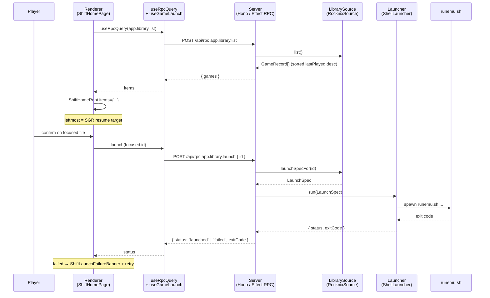

# feat: Personal MVP — ship Safe Game Resume end-to-end via ROCKNIX adapter

## Overview

Close the loop from "open Korri" to "game running" on the developer's Odin 2 Portal. Today the home renders fixtures and nothing launches; this plan introduces a thin ROCKNIX adapter, two architectural seams (`LibrarySource`, `Launcher`), the RPCs the renderer needs, and the resume-side launch controller that the Shift home composes. Scope is strictly the personal MVP defined in the origin brainstorm — no off-rail browse, no proseql, no Korri OS, no second device.

## Problem Frame

Korri has a beautifully decorated home that does not yet launch a game. The only declared JTBD (`safe-game-resume`) has two `planned` features (`home`, `resume`) but no behavior wired through to a real library or a real launch command. The personal MVP must close that loop while leaving deletable seams for the eventual proseql / NixOS / Korri OS swaps. (See origin: `./requirements.md`.)

## Requirements Trace

Mapped to brainstorm requirements (R1–R17):

- R1, R2, R3 — Scope discipline. Honored by the plan's scope and by *not* introducing a `pick-and-play` JTBD or off-rail browse UI.
- R4, R5 — ROCKNIX `gamelist.xml` + `es_systems.cfg` as MVP source, isolated in one module. → Units 2, 3.
- R6, R7, R8 — Launch via `runemu.sh` with `runemu.sh <ROM> -P<SYSTEM> --core=<CORE> --emulator=<EMULATOR>`; never patch ROCKNIX; success = exit code. → Units 2, 4, 7.
- R9, R10, R11 — `LibrarySource` and `Launcher` seams designed for the Korri OS endpoint, with a single ROCKNIX adapter behind both. → Units 1, 5.
- R12, R13, R14, R15 — Single recency rail; no system/A-Z grouping; no off-rail path; reuse existing Shift atoms. → Units 5, 8.
- R16, R17 — Failure surface + retry on the same tile; log via `@shared/logger`. → Units 4, 9, 10.

Maps to existing brief acceptance:

- `HOME-R1`, `HOME-R2`, `HOME-R3` — already specified; this plan moves them from "fixture data" to "real data," preserving the contract. → Unit 8.
- `SGR-R1`, `SGR-R2`, `SGR-R6`, `SGR-R7` — covered by Units 7, 9, 10 and the BDD updates in Unit 12.
- `SGR-R3`, `SGR-R4`, `SGR-R5` — vacuously satisfied for personal MVP per the origin doc's "Interpretation of SGR Outcomes" section; remain `@fixme` in BDD until a second device exists.

## Scope Boundaries

- **Out:** off-rail discovery / search / "all games" view, proseql, NixOS x86 adapter, Korri OS, first-run UX, multi-device sync, source-aware launch (Steam/GOG/native), settings/profiles/store, library editing, public-grade error copy.
- **Out:** any change to `runemu.sh`, `es_systems.cfg`, or other ROCKNIX-owned files.
- **Out:** changes to spatial navigation, the Shift theme atoms/molecules/organisms, or the `Tilegrid` primitive.
- **Out:** packaging Korri for the Odin (cross-build, deployment). Existing `desktop-build` / `electrobun-runtime-check` infrastructure is reused as-is; cross-arch concerns are a separate task.

### Deferred to Separate Tasks

- **Smoke verification on the actual Odin device** — must happen before declaring the MVP "shipped," but the act of running the build on the device and confirming a real game launches is implementation-time verification, not code work. Captured in Unit 13.

## Testing Strategy

**Posture: real implementations everywhere feasible. Substitute only where the real thing is impractical (slow, non-deterministic, or destructive).**

Concretely:

- **Pure functions** (parsers, schemas, helpers) — never substituted; tested with real inputs.
- **Filesystem code** — real, against tmpdir-based fixtures created by `withTempLibrary` (introduced in Unit 3).
- **Process spawning** — real `Bun.spawn`. In tests, the spawned program is a tiny in-repo script (`tools/testing/fake-game.sh`) that exits with a controllable code, instead of `runemu.sh` and a real emulator. The `Launcher` code path is 100% real; only the *target binary* is a stand-in.
- **RPC handlers** — exercised through a real composition (real `RocknixSource` over fixture files + real `ShellLauncher` over `fake-game.sh`). No `StubLibrarySource`, no `StubLauncher`.
- **React hooks that call RPC** — exercised through a real HTTP roundtrip to a real in-process Hono server (`withRpcServer` helper, introduced in Unit 9 if direct Effect-runtime invocation isn't sufficient). No mocking of `useRpcQuery` or `runRpc`.
- **Pure presentational components** — rendered with happy-dom; props passed directly. No mocks needed.
- **BDD (Playwright)** — runs against the real dev stack with the `LibrarySource` configured to a fixture dir and `LaunchSpec`s targeting `fake-game.sh`. No stubs anywhere in the stack.

**Substitution surface — the entire list:**

1. The launch *target binary*. `fake-game.sh` instead of `runemu.sh` + a real emulator.
2. Wall-clock time, only when an assertion needs deterministic relative-time formatting; handled by passing explicit `Date` inputs to the formatting helper, never by global clock mocking.

**Dropped test:** the `ShiftHomePage` composition wrapper is not unit-tested (Unit 8). Its loading / error / empty states are covered by BDD; molecule-level tests cover rendering correctness. A unit test would only assert that `useRpcQuery` was composed with the result — BDD proves that for real.

## Context & Research

### Relevant Code and Patterns

- `korri/products/app/api/hello/rpc.ts` + `rpc-handler.ts` + `rpc-handler.test.ts` — canonical Effect RPC trio to mirror.
- `korri/shared/api/rpc/app-rpc-group.ts` + `handlers.ts` — registration sites for new RPCs.
- `korri/shared/api/rpc/useRpcQuery.ts` — the renderer's data hook.
- `korri/shared/api/rpc/errors.ts` — `DataError`, `NotFoundError`, `ValidationError` for handler failure modes.
- `korri/shared/fixtures/games/game.ts` — existing `GameRecord` schema (Effect Schema). No modifications needed.
- `korri/shared/themes/shift/pages/ShiftHomePage.tsx` — fixture-import seam to replace; the file's docstring already anticipates a server-backed root.
- `korri/shared/themes/shift/templates/ShiftHomeRoot.tsx` + `ShiftHome.context.tsx` — already accepts an `items` array and exposes `focused` via context. No template changes needed.
- `korri/shared/navigation/use-input-action.ts` — `useInputAction("confirm", handler)` for activate input.
- `korri/shared/logger/logger.ts` — Pino logger; Node/browser-aware.
- `korri/deploy/desktop/main.ts` + `create-desktop-app.ts` — confirms Hono `honoApp` runs in the desktop Bun process; RPC handlers therefore have filesystem and child-process access.

### Institutional Learnings

- `docs/solutions/best-practices/electrobun-desktop-wrapper-loopback-2026-05-01.md` — desktop wrapper preserves the same `/api/rpc` semantics as dev. Renderer code stays unchanged.
- `docs/solutions/best-practices/decoupled-spatial-navigation-2026-05-01.md` — never reach into `window.__korriSpatialNav` from product code; subscribe via `useInputAction`.
- `docs/solutions/best-practices/attached-ui-snaps-not-slides-2026-05-01.md` — caption snaps under tiles; failure banner should follow the same calm motion grammar.

### External References

None used. Repo patterns and direct on-device probing of the Odin (`root@192.168.1.104` running ROCKNIX nightly `BUILD_DATE="Tue Apr 28 10:53:20 UTC 2026"`) covered everything needed.

## Key Technical Decisions

- **`GameRecord` is not modified.** Launch info (`LaunchSpec`) lives only on the server side. The list RPC returns `GameRecord[]`; the launch RPC accepts `{ id }` and the server resolves the spec internally. Keeps the renderer ignorant of execution details and matches the `pick-and-play`-deferred posture.
- **`LibrarySource` exposes `list()` and `launchSpecFor(id)`.** Two methods, one source. The renderer never sees a `LaunchSpec`; the launch RPC fetches the spec from the same `LibrarySource` instance, so consistency is automatic.
- **`LaunchSpec` is structured (`{ command, args, env?, cwd? }`), not a single shell string.** Avoids quoting/escaping bugs while still satisfying the brainstorm's "shell-exec" intent. The launcher passes `args` directly to `Bun.spawn`; no `sh -c`.
- **Sorting by `lastPlayed` happens in the source.** The home stays declarative; the LibrarySource returns the rail order it considers correct. Future sources (proseql) can implement the same contract differently without touching UI.
- **Library composition is a server-side singleton constructed at handler-module import time.** Configurable via env vars (paths, source kind, launcher kind). For tests, `configureLibraryContextForTesting(...)` installs **configured-real** implementations (e.g., a `RocknixSource` pointed at a `withTempLibrary` directory, a `ShellLauncher` pointed at `tools/testing/fake-game.sh`). The codebase contains no `StubLibrarySource` or `StubLauncher` — see *Testing Strategy* for the rationale.
- **Launch controller lives under `features/resume/`, not `features/home/`.** The home brief explicitly excludes launch execution; the resume brief owns SGR-R6/R7. The Shift home composes a `useGameLaunch` hook from the resume feature; the home brief gains no new responsibility.
- **Failure surface is rendered inline on the home, not as a modal.** A `ShiftLaunchFailureBanner` molecule renders above the rail when `useGameLaunch().status === "failed"`. Stays on the surface, anchored to the focused tile (SGR-O5). No new template variant.
- **`--controllers="..."` is omitted from the launch argv for MVP.** Verification deferred to implementation. If a smoke test on-device shows it is required, a single string default ("") can be added without changing the seam.

## Open Questions

### Resolved During Planning

- *Where does the ROCKNIX adapter live?* — `korri/shared/library/rocknix/`. It is shared runtime code, even though only the `app` product uses it today.
- *Renderer reads filesystem directly?* — No. All filesystem and process work happens server-side, behind RPC. Keeps the renderer portable and aligns with the existing same-origin `/api/rpc` pattern.
- *RPC tag names?* — `app.library.list` and `app.library.launch`. Matches the existing `app.hello.get` shape (`<entity>.<concept>.<action>`).
- *Where does sort happen?* — In `LibrarySource.list()`. UI does not sort.
- *Launch on which input?* — `useInputAction("confirm", …)` per `AGENTS.md`'s decoupled spatial navigation rule.

### Deferred to Implementation

- Whether `runemu.sh` exits non-zero on certain failure classes that should still be retried vs. surfaced differently. Will be discovered by the on-device smoke test (Unit 13).
- Whether the renderer's HTTP/RPC connection survives Korri being suspended during gameplay. The launcher chose option (a) — block until exit — in Unit 4; if smoke testing shows this breaks the round-trip, the fallback is option (c) — split launch into start + status-poll. Acceptable to discover and react.
- Whether `--controllers=""` is required by some emulators in the launch argv.
- Per-game emulator/core overrides in `gamelist.xml` (vs. only system defaults from `es_systems.cfg`). Adapter implementation will probe; if absent in the developer's library, the adapter falls back to system defaults and a future iteration adds per-game override support.
- Final method names inside the `RocknixSource` parser (`parseGamelist`, `parseSystems`, etc.) — naming will firm up during implementation.

## Output Structure

```text
korri/shared/library/
├── library-source.ts            # interface
├── library-source.test.ts
├── launcher.ts                  # interface + LaunchSpec schema
├── launcher.test.ts
├── shell-launcher.ts            # Bun.spawn implementation of Launcher
├── shell-launcher.test.ts
├── library-context.ts           # server-side composition (singleton + factory)
├── library-context.test.ts
└── rocknix/
    ├── rocknix-source.ts        # parser + LibrarySource implementation
    ├── rocknix-source.test.ts
    ├── es-systems.ts            # es_systems.cfg parser (pure)
    ├── es-systems.test.ts
    ├── gamelist.ts              # gamelist.xml parser (pure)
    ├── gamelist.test.ts
    └── fixtures/
        ├── es_systems.sample.cfg
        └── snes-gamelist.sample.xml

tools/testing/
├── fake-game.sh                 # tiny controllable launch target (Unit 4)
└── library/
    ├── with-temp-library.ts     # tmpdir + fixture writer (Unit 3)
    └── with-rpc-server.ts       # in-process Hono harness (Unit 9 — only if direct Effect invocation isn't enough)

korri/products/app/api/library/
├── list.rpc.ts
├── list.rpc-handler.ts
├── list.rpc-handler.test.ts
├── launch.rpc.ts
├── launch.rpc-handler.ts
└── launch.rpc-handler.test.ts

korri/products/app/features/resume/
├── brief.md                     # MVP scope updates
├── launch-controller.ts         # useGameLaunch hook
├── launch-controller.test.tsx
└── e2e/
    └── safe-game-resume.feature # un-fixme + add launch scenarios

korri/shared/themes/shift/molecules/
├── ShiftLaunchFailureBanner.tsx
├── ShiftLaunchFailureBanner.stories.tsx
└── ShiftLaunchFailureBanner.test.tsx
```

The per-unit `**Files:**` sections remain authoritative.

## High-Level Technical Design

> *This illustrates the intended approach and is directional guidance for review, not implementation specification. The implementing agent should treat it as context, not code to reproduce.*



## Implementation Units

- [ ] **Unit 1: Define library seams**

**Goal:** Introduce `LibrarySource`, `Launcher`, and `LaunchSpec` as the architectural seams the rest of the MVP composes against.

**Requirements:** R9, R10, R11.

**Dependencies:** None.

**Files:**
- Create: `korri/shared/library/library-source.ts`
- Create: `korri/shared/library/launcher.ts`
- Test: `korri/shared/library/library-source.test.ts`
- Test: `korri/shared/library/launcher.test.ts`

**Approach:**
- `LaunchSpec` is an Effect Schema struct: `{ command: string, args: ReadonlyArray<string>, env?: Record<string, string>, cwd?: string }`.
- `LibrarySource` is a TS interface (not an Effect Service for MVP — the brainstorm explicitly favors simplicity over premature abstraction): `list(): Promise<readonly GameRecord[]>` and `launchSpecFor(id: string): Promise<LaunchSpec | undefined>`.
- `Launcher` is a TS interface: `run(spec: LaunchSpec): Promise<LaunchResult>` where `LaunchResult = { status: "launched" } | { status: "failed", exitCode: number, stderrTail?: string }`.
- All three live in shared because future products may compose them.

**Patterns to follow:**
- Effect Schema usage: `korri/shared/fixtures/games/game.ts`.
- Interface + result-object discriminated union: `korri/shared/api/rpc/errors.ts`.

**Test scenarios:**
- Happy path: `LaunchSpec` decode accepts `{ command, args }` with optional `env`/`cwd`.
- Edge case: `LaunchSpec` decode rejects empty `command`.
- Edge case: `LaunchSpec` decode accepts an empty `args` array.

**Verification:**
- `just typecheck` passes.
- Schema tests pass.
- No runtime code other than schemas; pure types compile against the rest of the plan's units.

---

- [ ] **Unit 2: ROCKNIX gamelist.xml and es_systems.cfg parsers (pure functions)**

**Goal:** Pure functions that parse XML strings into typed records, with zero filesystem dependency. Maximizes testability and makes the parser deletable.

**Requirements:** R4, R5.

**Dependencies:** Unit 1 (uses `LaunchSpec` and `GameRecord`).

**Files:**
- Create: `korri/shared/library/rocknix/gamelist.ts`
- Create: `korri/shared/library/rocknix/es-systems.ts`
- Create: `korri/shared/library/rocknix/fixtures/snes-gamelist.sample.xml`
- Create: `korri/shared/library/rocknix/fixtures/es_systems.sample.cfg`
- Test: `korri/shared/library/rocknix/gamelist.test.ts`
- Test: `korri/shared/library/rocknix/es-systems.test.ts`

**Approach:**
- Use a small XML parser. Prefer a zero-dep approach: a regex-driven extractor scoped to the small set of fields actually used (`<game>`, `<path>`, `<name>`, `<lastplayed>`, `<playcount>`, `<gametime>`, `<favorite>`, `<desc>`, `<genre>`, `<developer>`, `<publisher>`, `<releasedate>`). The brainstorm mandates throwaway-thin; pulling in a full XML parser is over-investment. If implementation reveals real-world XML edge cases this approach can't handle, escalate to `fast-xml-parser` then.
- `parseGamelist(xml: string, system: string): GamelistEntry[]` returns a typed array including the absolute ROM path resolution rule (`<path>` is relative to its containing system dir).
- `parseEsSystems(xml: string): EsSystem[]` returns `{ name, fullname, path, extension[], commandTemplate, defaultEmulator, defaultCore }`.
- ROCKNIX `<lastplayed>` is `YYYYMMDDTHHmmss` (no separators, no timezone) — emit as a `Date` interpreted as UTC per `AGENTS.md` ("UTC methods must be used").
- Map gamelist fields onto `GameRecord` shape; non-matching fields are dropped silently (throwaway-thin).

**Patterns to follow:**
- Pure functions, sync, no Effect: parsers are deterministic transformations and don't need an effect system.
- Schema validation at the boundary via `Schema.decodeUnknownSync` if needed.

**Test scenarios:**
- Happy path: `parseGamelist` extracts at least one fully populated `<game>` block including all known fields; `lastplayed` decodes to the correct UTC `Date`.
- Happy path: `parseEsSystems` extracts a system block with `name`, `path`, default emulator and core.
- Edge case: `parseGamelist` returns `[]` for empty input, malformed XML, and a `<gameList>` with zero `<game>` children.
- Edge case: `<favorite>true</favorite>` decodes to `userData.favorite === true`; absence decodes to `undefined`.
- Edge case: `<lastplayed>` with a value of `19700101T000000` decodes to the Unix epoch in UTC.
- Edge case: `<path>` resolution joins correctly with the supplied system root path; trailing-slash and absolute-path inputs are both handled.
- Error path: `parseGamelist` does not throw on garbage input — it returns `[]` and (via logger) records a parse warning. Test asserts no exception escapes.
- Edge case: a `<game>` with only `<path>` (no `<name>`) yields a record where `id` defaults to the basename of the path and `metadata.name` is absent.

**Verification:**
- All parser tests pass.
- Sample fixture files exist and are exercised in tests.
- No filesystem imports (`node:fs`, `Bun.file`) appear in either file.

---

- [ ] **Unit 3: ROCKNIX `LibrarySource` implementation (filesystem reader + composer)**

**Goal:** Wrap the pure parsers in a `LibrarySource` that reads the ROCKNIX standard paths, sorts by `lastPlayed` desc, and resolves a `LaunchSpec` per game.

**Requirements:** R4, R5, R6.

**Dependencies:** Units 1, 2.

**Files:**
- Create: `korri/shared/library/rocknix/rocknix-source.ts`
- Test: `korri/shared/library/rocknix/rocknix-source.test.ts`
- Create: `tools/testing/library/with-temp-library.ts` *(reusable test helper — writes a configurable `es_systems.cfg` + per-system `gamelist.xml` files into a `tmpdir`, returns `{ source, cleanup }`)*
- Test: `tools/testing/library/with-temp-library.test.ts`

**Approach:**
- `createRocknixSource(config: RocknixConfig): LibrarySource` factory. `RocknixConfig` has `gamelistRoots: readonly string[]` (default: `["/storage/games-internal/roms", "/storage/games-external/roms"]`), `esSystemsPath: string` (default: `"/storage/.config/emulationstation/es_systems.cfg"`), and an optional `launchCommand: string` (default: `"/usr/bin/runemu.sh"`) so tests can point launches at `tools/testing/fake-game.sh` without changing the parser/composer.
- On `list()`: read each `<system>/gamelist.xml` discoverable under each root, parse via Unit 2, attach `system` (folder name) to each entry, sort merged result by `lastPlayed` desc with `undefined` last, return `GameRecord[]`. Cache the parsed result in memory until invalidated; for MVP, invalidate only on process restart.
- Maintain an internal `Map<id, LaunchSpec>` populated alongside `list()`. `launchSpecFor(id)` reads from that map.
- `LaunchSpec` composition: `{ command: "/usr/bin/runemu.sh", args: [romAbsPath, \`-P${system}\`, \`--core=${core}\`, \`--emulator=${emulator}\`] }`. `core` and `emulator` come from `es_systems.cfg`'s system defaults; per-game overrides are deferred (Open Question).
- Filesystem use: `Bun.file(path).text()` (already a dependency). Wrap in a small `readTextFileSafe` that returns `null` on ENOENT and logs a warning; missing files should not crash the source.

**Patterns to follow:**
- Module-scoped factory function returning an object literal that satisfies the interface — same shape as `createDesktopApp` in `korri/deploy/desktop/create-desktop-app.ts`.
- Logger via `@shared/logger`.

**Test scenarios:** *(all use real filesystem I/O via `withTempLibrary` — no mocked `fs`)*
- Happy path: `list()` against a `withTempLibrary` fixture (one system, two games, distinct `lastPlayed` values) returns the expected sorted `GameRecord[]`.
- Happy path: `launchSpecFor(id)` returns a `LaunchSpec` whose `args` exactly match the expected ROCKNIX template for that game's system.
- Edge case: when `gamelistRoots` paths do not exist on disk, `list()` returns `[]` and logs a warning; does not throw.
- Edge case: when `es_systems.cfg` is missing on disk, `list()` returns `[]` and logs an error.
- Edge case: games with no `<lastplayed>` sort after games that have one.
- Edge case: a game referenced by gamelist but pointing to a system absent from `es_systems.cfg` is dropped from `list()` (cannot launch it; do not lie about it) and logged.
- Integration: `list()` followed by `launchSpecFor(id)` for every returned game produces a defined spec for each.
- `withTempLibrary` itself: round-trip test that the helper writes valid files (a fresh `RocknixSource` against the helper-produced dir reads back what was written).

**Verification:**
- All tests pass against real filesystem fixtures.
- No `console.log`; all logging via `@shared/logger`.
- A grep for `gamelist.xml`, `es_systems.cfg`, `runemu.sh`, or `/storage/` outside this file and Unit 2 returns nothing in `korri/products/**` and `korri/shared/**`.

---

- [ ] **Unit 4: Shell `Launcher` implementation**

**Goal:** Implement `Launcher` by spawning a child process for the given `LaunchSpec` and reporting back its exit code.

**Requirements:** R6, R7, R8, R16, R17.

**Dependencies:** Unit 1.

**Files:**
- Create: `korri/shared/library/shell-launcher.ts`
- Test: `korri/shared/library/shell-launcher.test.ts`
- Create: `tools/testing/fake-game.sh` *(executable; ~5 lines; prints argv to stderr and exits with `${KORRI_FAKE_GAME_EXIT:-0}`. Reused by Units 7, 9, 12 — BDD points launches at this script instead of `runemu.sh`.)*

**Approach:**
- `createShellLauncher(): Launcher`. `run(spec)` calls `Bun.spawn({ cmd: [spec.command, ...spec.args], env: { ...process.env, ...spec.env }, cwd: spec.cwd, stderr: "pipe" })`, awaits `proc.exited`, captures the last ~4 KB of stderr on failure.
- Returns `{ status: "launched" }` on exit code `0`, `{ status: "failed", exitCode, stderrTail }` otherwise.
- Logs the composed argv (without env vars) and the exit code via `@shared/logger`.
- Does **not** detach, daemonize, or fork. The handler awaits the spawned process; the renderer's RPC call resolves when the child exits.
- **Long-running-process trade-off (explicit):** `runemu.sh` typically blocks until the game exits. Three plausible shapes were considered:
  - **(a) Block until exit** — chosen for MVP. Simplest, gives accurate exit-code reporting. Risks the renderer's HTTP connection if the OS suspends Korri during gameplay; if that turns out to break the round-trip, the launch will appear stuck from the renderer's perspective.
  - **(b) Spawn detached, return immediately on successful spawn** — rejected because it loses SGR-R6's "command success/failure is the baseline handoff boundary" promise.
  - **(c) Two-stage launch + poll** — rejected for MVP scope; revisit if (a) breaks under smoke testing.
- Security note: `cmd` is an array; `Bun.spawn` does not invoke a shell. A malicious `<path>` in `gamelist.xml` cannot inject shell metacharacters into the launch.

**Patterns to follow:**
- `Bun.spawn` usage: `tools/desktop/electrobun-runtime-check.ts`.
- Error result pattern: `korri/shared/api/rpc/errors.ts`'s discriminated union shape (here we use a simpler success/failure result).

**Test scenarios:** *(all spawn real processes; no `Bun.spawn` mock)*
- Happy path: `run({ command: "/bin/true", args: [] })` resolves to `{ status: "launched" }`.
- Error path: `run({ command: "/bin/false", args: [] })` resolves to `{ status: "failed", exitCode: 1 }`.
- Error path: `run({ command: "/bin/sh", args: ["-c", "echo boom 1>&2; exit 7"] })` returns `{ status: "failed", exitCode: 7 }` and `stderrTail` contains "boom".
- Error path: `run({ command: "/no/such/binary", args: [] })` resolves to `{ status: "failed" }` with a defined `exitCode` (Bun surfaces ENOENT as a non-zero exit) and does not throw.
- Edge case: `env` overrides are applied. Spawn `tools/testing/fake-game.sh` with `KORRI_FAKE_GAME_EXIT=42` and assert `{ status: "failed", exitCode: 42 }`.
- Integration: spawning `fake-game.sh` with sample argv (the same shape `RocknixSource` produces) succeeds and the script's stderr trail contains the argv. This is the contract Units 7, 9, 12 rely on.

**Verification:**
- All tests pass under `bun test` on the dev machine.
- `tools/testing/fake-game.sh` is executable (`chmod +x`) and committed.
- The launcher does not import anything ROCKNIX-specific.

---

- [ ] **Unit 5: Server-side library composition**

**Goal:** A single place that constructs and exposes the active `LibrarySource` + `Launcher` pair to RPC handlers, with an env-driven config and a test-substitutable factory.

**Requirements:** R10, R11.

**Dependencies:** Units 1, 3, 4.

**Files:**
- Create: `korri/shared/library/library-context.ts`
- Test: `korri/shared/library/library-context.test.ts`

**Approach:**
- Export `getLibraryContext(): { source: LibrarySource, launcher: Launcher }` as a lazily-constructed module-scoped singleton.
- `KORRI_LIBRARY_SOURCE` env var selects the source kind (default: `"rocknix"`); `KORRI_LAUNCHER` selects the launcher kind (default: `"shell"`). Unknown values fall back to defaults with a logged warning.
- Export a `configureLibraryContextForTesting({ source, launcher })` and `resetLibraryContextForTesting()` pair so handler tests and BDD test mode can install **configured-real** implementations (e.g., a `RocknixSource` pointed at a `withTempLibrary` directory, a `ShellLauncher` pointed at `tools/testing/fake-game.sh`) without touching env. The function name is intentionally `configure*`, not `set*`, to signal the posture: tests inject *real-but-configured*, not stubs.
- ROCKNIX paths come from optional env vars: `KORRI_ROCKNIX_GAMELIST_ROOTS` (colon-separated) and `KORRI_ROCKNIX_ES_SYSTEMS`. Defaults match the on-device paths probed in the brainstorm.

**Patterns to follow:**
- Module-scoped singleton factory: similar to how `korri/shared/api/rpc/handlers.ts` composes the RPC layer at import time.
- Test substitution: lightweight; not a DI container.

**Test scenarios:**
- Happy path: default config produces a `RocknixSource` + `ShellLauncher` pair (verified by structural assertions — the test does not hit the real `/storage/` paths).
- Happy path: `configureLibraryContextForTesting({...})` with a `RocknixSource` over a `withTempLibrary` dir + a `ShellLauncher` aimed at `fake-game.sh` returns those instances on subsequent `getLibraryContext()` calls; `list()` returns the temp library's games and `launcher.run` invokes the real script.
- Edge case: unknown `KORRI_LIBRARY_SOURCE` falls back to `"rocknix"` and logs a warning.
- Edge case: `resetLibraryContextForTesting()` restores env-driven construction.

**Verification:**
- Handler tests in Units 6 and 7 use `configureLibraryContextForTesting` with real configured implementations — no `StubLibrarySource`, no `StubLauncher`, anywhere in the codebase.

---

- [ ] **Unit 6: `app.library.list` RPC**

**Goal:** Expose the library listing to the renderer.

**Requirements:** R12, R13, R14 (the rail's data shape).

**Dependencies:** Units 1, 5.

**Files:**
- Create: `korri/products/app/api/library/list.rpc.ts`
- Create: `korri/products/app/api/library/list.rpc-handler.ts`
- Test: `korri/products/app/api/library/list.rpc-handler.test.ts`
- Modify: `korri/shared/api/rpc/app-rpc-group.ts` (register the RPC)
- Modify: `korri/shared/api/rpc/handlers.ts` (wire the handler)

**Approach:**
- Payload schema: empty struct (`Schema.Struct({})`).
- Success schema: `Schema.Struct({ games: Schema.Array(GameRecord) })`.
- Tag: `app.library.list`.
- Handler: `Effect.tryPromise({ try: () => getLibraryContext().source.list(), catch: makeDataError("ReadFailed") }).pipe(Effect.map(games => ({ games })))`.
- Errors: surface as `DataError("ReadFailed")` from `@shared/api/rpc/errors`.

**Patterns to follow:**
- `korri/products/app/api/hello/rpc.ts` and `rpc-handler.ts` — exact shape to mirror.
- Test pattern: `korri/products/app/api/hello/rpc-handler.test.ts`.

**Test scenarios:** *(all use a real `RocknixSource` over a `withTempLibrary` directory — no `StubLibrarySource`)*
- Happy path: handler returns `{ games }` reflecting the temp library's contents (two games across one system, sorted by `lastPlayed` desc).
- Happy path: empty-library case (temp directory with no `<game>` entries) returns `{ games: [] }`.
- Error path: temp directory deleted between configuration and `list()` call → handler resolves to `DataError("ReadFailed")` Effect failure.
- Integration: registered tag `app.library.list` is reachable via the live `appRpcGroup` (assert membership).

**Verification:**
- `just typecheck` passes (router + RPC types align).
- `just test-unit` runs the handler test and passes.
- Manual: `curl` against `/api/rpc` with the new tag returns the expected shape (smoke; not committed as a test).

---

- [ ] **Unit 7: `app.library.launch` RPC**

**Goal:** Expose the launch action to the renderer; resolve the spec server-side and run it.

**Requirements:** R6, R7, R8, R16, R17.

**Dependencies:** Units 1, 4, 5.

**Files:**
- Create: `korri/products/app/api/library/launch.rpc.ts`
- Create: `korri/products/app/api/library/launch.rpc-handler.ts`
- Test: `korri/products/app/api/library/launch.rpc-handler.test.ts`
- Modify: `korri/shared/api/rpc/app-rpc-group.ts`
- Modify: `korri/shared/api/rpc/handlers.ts`

**Approach:**
- Payload schema: `Schema.Struct({ id: Schema.String })`.
- Success schema: discriminated union — `Schema.Union(Schema.Struct({ status: Schema.Literal("launched") }), Schema.Struct({ status: Schema.Literal("failed"), exitCode: Schema.Number, stderrTail: Schema.optional(Schema.String) }))`.
- Tag: `app.library.launch`.
- Handler: resolve `launchSpecFor(id)`; if `undefined`, fail with `NotFoundError`. Otherwise call `launcher.run(spec)` and return its result.
- Logging: handler logs `{ id, command, exitCode }` for both success and failure (no env vars, no stderr in logs — stderr goes only in the response).

**Patterns to follow:**
- Same RPC trio shape as Unit 6.
- Error union pattern from `korri/shared/api/rpc/errors.ts`.

**Test scenarios:** *(all use a real `RocknixSource` over a `withTempLibrary` directory configured with `launchCommand: "tools/testing/fake-game.sh"`, plus the real `ShellLauncher` — no stubs)*
- Happy path: known id, `KORRI_FAKE_GAME_EXIT=0` → handler resolves to `{ status: "launched" }`.
- Happy path: known id, `KORRI_FAKE_GAME_EXIT=7` → handler resolves to `{ status: "failed", exitCode: 7 }` and `stderrTail` includes the argv echoed by `fake-game.sh`.
- Error path: unknown id → handler fails with `NotFoundError` (no process spawn).
- Integration: the temp library's resolved `LaunchSpec.args` (rom path, system, core, emulator) appear in `fake-game.sh`'s recorded argv. Confirms end-to-end the spec produced by the source is what reaches the process boundary.
- Integration: registered tag `app.library.launch` is reachable via `appRpcGroup`.

**Verification:**
- `just typecheck` and `just test-unit` pass.
- Handler test exercises both success and failure resolution paths.

---

- [ ] **Unit 8: Wire `ShiftHomePage` to the list RPC**

**Goal:** Replace the fixture import with a `useRpcQuery` call so the home renders real data.

**Requirements:** R12, R13, R15.

**Dependencies:** Unit 6.

**Files:**
- Modify: `korri/shared/themes/shift/pages/ShiftHomePage.tsx`

**Approach:**
- Replace `import { games } from "@shared/fixtures/games/games"` with `useRpcQuery((client) => client["app.library.list"]({}))`.
- Pre-data render: while `isPending && !data`, render a minimal "loading" placeholder div within the `data-shift-home` host so theme tokens still apply. While `isError`, render a minimal error placeholder with a `refetch` trigger. While data is `[]`, render a minimal empty-library placeholder. All three placeholders are inline and do not warrant new molecules for MVP.
- `ShiftHomeRoot` is only mounted once `items.length > 0`, preserving its existing "requires at least one item" invariant.
- Keep the `PLACEHOLDER_TIME` and `PLACEHOLDER_AVATAR_SRC` constants — out of scope.
- `resumeTarget` continues to default to `items[0]`; with the source sorting by `lastPlayed` desc, that is exactly the "obvious continuation target" SGR-O2 calls for.

**Patterns to follow:**
- `useRpcQuery` usage shape from its docstring at `korri/shared/api/rpc/useRpcQuery.ts`.
- The page docstring already anticipates this swap ("a future server-backed root would swap the prop without changing any composition below").

**Test scenarios:** *(none at the unit level — see Testing Strategy)*
- Test expectation: none at the page level. The page is a thin composition wrapper. Loading / error / empty / populated states are covered by BDD (Unit 12) running against a real dev stack with a real `RocknixSource` over a fixture dir; rendering correctness of the composed children is covered by molecule and `ShiftHomeRoot` stories that pass `items` directly.

**Verification:**
- Existing `home.feature` BDD scenarios continue to pass after Unit 12 reconfigures the BDD test mode to use a real fixture library. The assertions remain about observable text and focus, not fixture identity.
- Storybook stories for the home (`ShiftHomeRoot.stories.tsx`) continue to render — they pass `items` directly and never go through RPC.

---

- [ ] **Unit 9: Resume launch controller (`useGameLaunch`)**

**Goal:** A hook owned by the resume feature that wires confirm input to the launch RPC, tracks status, and exposes a `retry()`.

**Requirements:** R16, R17, SGR-R6, SGR-R7.

**Dependencies:** Units 1, 7.

**Files:**
- Create: `korri/products/app/features/resume/launch-controller.ts`
- Test: `korri/products/app/features/resume/launch-controller.test.tsx`
- Create *(if needed)*: `tools/testing/library/with-rpc-server.ts` *(in-process Hono harness on a random port. Skip this file if `runRpc` can be invoked against the Effect runtime directly without HTTP; decide during implementation. Either path is acceptable as long as `runRpc` and `useRpcQuery` are not mocked.)*

**Approach:**
- Hook signature: `useGameLaunch(focusedId: string | undefined): { status: "idle" | "launching" | "failed", lastError?: { exitCode: number, stderrTail?: string }, retry: () => void }`.
- Internally subscribes to `useInputAction("confirm", …)`. When fired and `status === "idle"` and `focusedId` is defined, calls `runRpc(client => client["app.library.launch"]({ id: focusedId }))`.
- On `{ status: "launched" }`, the hook returns to `"idle"`. On `{ status: "failed", … }`, transitions to `"failed"` and stores the error. `retry()` re-fires the same launch with the same `id` (stored at the moment of the failed call, not the current `focusedId` — SGR-R7 says retry the *same* game, not whatever happens to be focused now).
- Disables the confirm subscription while `status === "launching"` to prevent double-fire.
- The hook must not auto-launch on focus changes (HOME-R3, SGR-R2).
- The hook does not own UI. It returns state for any composer to render.

**Patterns to follow:**
- `useInputAction` usage examples in `korri/shared/themes/shift/templates/ShiftHomeRoot.tsx` if any; otherwise `korri/shared/navigation/use-input-action.test.tsx` shows the contract.
- Use the existing `runRpc` (`korri/shared/api/rpc/runRpc.ts`) for the mutation; `useRpcQuery` is for reads.

**Execution note:** Test-first — the controller is a small state machine with several explicit transitions; writing tests first will firm up the contract before any imperative code is added.

**Test scenarios:** *(all use a real RPC stack — either an in-process Hono server via `withRpcServer`, or direct Effect-runtime invocation of the registered RPC handlers. The handlers themselves run real `RocknixSource` over a `withTempLibrary` directory + real `ShellLauncher` against `tools/testing/fake-game.sh`. No `useRpcQuery`/`runRpc` mocking.)*
- Happy path: confirm with a known `focusedId` and `KORRI_FAKE_GAME_EXIT=0` → `status` transitions `idle → launching → idle`; `fake-game.sh` was invoked with the expected argv.
- Happy path: confirm with `KORRI_FAKE_GAME_EXIT=2` → `status` ends at `"failed"`; `lastError.exitCode === 2`.
- Happy path: from `failed`, calling `retry()` re-fires the launch RPC with the *original* id (not whatever is currently focused) — `fake-game.sh` is invoked a second time with identical argv.
- Edge case: confirm with `focusedId === undefined` is a no-op; no RPC call; `status` stays `"idle"`.
- Edge case: confirm fired twice in rapid succession while `status === "launching"` results in exactly one process spawn (verify via `fake-game.sh` invocation count).
- Edge case: focus change during `launching` does not affect the in-flight launch; the result still maps to the original id.
- Integration: `useInputAction` is unsubscribed on unmount.

**Verification:**
- All tests pass under `bun test` (`@happy-dom/global-registrator` + `@testing-library/react`).
- The resume brief (Unit 11) is updated to reflect that this hook now satisfies SGR-R6 and SGR-R7 for personal MVP.

---

- [ ] **Unit 10: `ShiftLaunchFailureBanner` molecule + composition into the home**

**Goal:** The visible failure surface that shows when a launch fails, anchored to the home and offering a retry affordance.

**Requirements:** R16, SGR-R7, HOME-R3.

**Dependencies:** Units 8, 9.

**Files:**
- Create: `korri/shared/themes/shift/molecules/ShiftLaunchFailureBanner.tsx`
- Create: `korri/shared/themes/shift/molecules/ShiftLaunchFailureBanner.stories.tsx`
- Test: `korri/shared/themes/shift/molecules/ShiftLaunchFailureBanner.test.tsx`
- Modify: `korri/shared/themes/shift/pages/ShiftHomePage.tsx` (compose the banner + `useGameLaunch` from `@app/features/resume/launch-controller`)

**Approach:**
- The banner is presentational only: props `{ gameTitle: string, exitCode?: number, onRetry: () => void, onDismiss?: () => void }`.
- Visual treatment uses Shift design tokens; no hardcoded colors. Tile-anchored snap pattern from `attached-ui-snaps-not-slides-2026-05-01.md` — the banner appears above the rail with no animated slide-in.
- The banner exposes a focusable retry button (native `<button>`, no nav library imports per AGENTS.md). When the banner is mounted and visible, focus moves to retry on first render so confirm-to-retry works without thumbstick travel.
- Composition in `ShiftHomePage`: read `focused` from `useShiftHome()` (after data is loaded), call `useGameLaunch(focused?.id)`, conditionally render the banner when `status === "failed"`.
- **Title resolution.** The hook stores only the failed `id` (Unit 9). At the composition site, `ShiftHomePage` resolves `gameTitle` by looking up the failed id in the loaded `items` array (e.g., `items.find(g => g.id === failedId)?.metadata?.name ?? failedId`). The banner is dumb about ids; the page handles the join.
- The banner's existence does not change the rail; the rail does not lose its tile, focus, or position behind the banner. SGR-R7's "anchored to the same game/context" is satisfied.

**Patterns to follow:**
- Shift molecule shape and atomic boundaries: `korri/shared/themes/shift/molecules/*` (e.g., `ShiftHomeCaption.tsx`, `ShiftSearchPill.tsx`).
- Storybook story shape: a sibling `*.stories.tsx` covering at least `Default`, `WithExitCode`, `LongTitle`.

**Test scenarios:** *(banner is pure presentational — props passed directly via happy-dom; no mocks. Composition behavior is covered by BDD in Unit 12.)*
- Happy path: banner renders the supplied `gameTitle` and exit code when provided; renders without exit code when omitted.
- Happy path: clicking / confirming retry calls `onRetry` exactly once.
- Happy path: when mounted, focus moves to the retry button on first render (asserted via `document.activeElement`).
- Composition behavior covered elsewhere:
  - "banner only renders when `status === 'failed'`" — BDD: the SGR-O5 retry scenario in Unit 12 asserts the banner is absent before failure and present after.
  - "confirm activates retry, not a fresh launch from the rail" — BDD: the same scenario asserts that retry invokes the launch RPC again and the rail's confirm doesn't fire.

**Verification:**
- Storybook story renders cleanly.
- `just test-unit` passes.
- Manual focus check: with the banner visible, pressing confirm fires retry — verified during the on-device smoke test in Unit 13.

---

- [ ] **Unit 11: Update feature briefs to reflect MVP scope**

**Goal:** Bring `home/brief.md` and `resume/brief.md` in line with the MVP delivery so the briefs do not contradict the shipped behavior.

**Requirements:** R1, R2, R3 (scope discipline; documentation honesty).

**Dependencies:** None (can land in parallel with code).

**Files:**
- Modify: `korri/products/app/features/resume/brief.md`
- Modify: `korri/products/app/features/home/brief.md`

**Approach:**
- `resume/brief.md`: add an MVP scope note at the top pointing to the brainstorm, declare SGR-R6 and SGR-R7 implemented for personal MVP, and explicitly mark SGR-R3, SGR-R4, SGR-R5 as vacuously satisfied / `@fixme` until a second device exists.
- `home/brief.md`: add an MVP scope note pointing to the brainstorm; reaffirm that the home does not own launch (the resume feature does), but does compose the launch controller; add a sentence noting the rail is now sourced from `app.library.list` and ordered by `lastPlayed` desc.
- Do not change any existing R-IDs. Do not delete out-of-scope statements; instead, qualify them ("for personal MVP, the home composes a resume-feature controller; the home brief still does not own launch behavior").
- No status changes (`planned` stays `planned` until shipped; the "shipped" status update is a follow-up task after the on-device smoke test in Unit 13).

**Patterns to follow:**
- Brief shape: existing `home/brief.md` and `resume/brief.md` already exemplify the conventions.

**Test scenarios:**
- Test expectation: none — documentation-only change with no behavioral surface. Validated by `just check-feature-map` (Unit 12 verification step) ensuring frontmatter remains valid.

**Verification:**
- `just check-feature-map` passes.
- Briefs read as a coherent narrative when paired with the brainstorm doc.

---

- [ ] **Unit 12: BDD updates for SGR scenarios that MVP unblocks**

**Goal:** Make the `safe-game-resume.feature` reflect what MVP makes pass and keep the rest honestly `@fixme`.

**Requirements:** SGR-R1 (already), SGR-R2, SGR-R6, SGR-R7.

**Dependencies:** Units 8, 9, 10. Unit 11 can land independently but should land before or with this unit so briefs and BDD agree.

**Files:**
- Modify: `korri/products/app/features/resume/e2e/safe-game-resume.feature`
- Modify: `korri/products/app/features/home/e2e/home.feature` *(only if the existing home scenarios need adjustment after Unit 8's data-source change — likely not, since they assert on text + focus)*
- Create: `korri/products/app/features/resume/e2e/safe-game-resume.steps.ts` *(if absent — gives the resume feature its own step bindings; existing flat-pattern from `home.steps.ts`)*

**Approach:**
- Remove `@fixme(Safe-game-resume-not-implemented-yet)` from the feature file once SGR-R1, SGR-R2, SGR-R6, SGR-R7 scenarios pass; tag the remaining sync/multi-device scenarios with `@fixme(MVP-deferred-multi-device)` so the deferral is grep-able.
- Keep the existing `Background: Given the launcher has a previous game named "Hades"` shape. In BDD test mode, the dev stack runs a real `RocknixSource` over a `withTempLibrary` fixture dir seeded with "Hades" (and any other games scenarios reference), and a real `ShellLauncher` whose `LaunchSpec`s target `tools/testing/fake-game.sh`. No stub launcher; `fake-game.sh`'s exit code is controlled by an env var the BDD runner sets.
- Adjust the SGR-O5 scenario "Failed launch command can be retried" to match the MVP composition: the failure banner is the surface; the retry action is the explicit user input on it. The step `Given the launch command for "Hades" fails` sets `KORRI_FAKE_GAME_EXIT=1` for the next launch.
- Add a happy-path scenario for SGR-R6: `When I confirm "Hades" / Then the launch command for "Hades" should run`. The step asserts on `fake-game.sh`'s recorded argv (script writes a deterministic line per invocation to a file the test harness reads).
- Run `just generate-bdd` to regenerate Playwright wrappers.

**Patterns to follow:**
- `tools/testing/bdd/AUTHORING.md` for the BDD authoring contract.
- `home.steps.ts` for the step-binding shape.
- `tools/scripts/generate-bdd-playwright-tests.ts` is the generator entrypoint; do not edit generated files under `out/generated/bdd/`.

**Test scenarios:**
- Test expectation: scenarios from this feature itself replace the per-scenario test list. The implementer should not invent additional unit-test coverage here; the steps integration is the test.

**Verification:**
- `just generate-bdd` succeeds; `just check-bdd` passes.
- `just test-e2e` passes for the un-`@fixme`'d scenarios.
- `just generate-feature-map` and `just check-feature-map` pass.

---

- [ ] **Unit 13: On-device smoke verification (manual; not code)**

**Goal:** Resolve the brainstorm's "Unverified" dependencies by running the built artifact against the real Odin and a real game.

**Requirements:** Resolves the brainstorm's Dependencies/Assumptions list.

**Dependencies:** Units 1–12.

**Files:** None. Captured here for sequencing.

**Approach:**
- Build Korri for the Odin (existing `desktop-build` infrastructure; cross-build steps are out of scope for *this* plan and may need their own follow-up).
- Run on-device. Verify each of the brainstorm's unverified items:
  1. `runemu.sh` exit code reliably signals launch success across at least three different systems.
  2. Korri stays alive (or returns to foreground correctly) after the game exits.
  3. `--controllers="..."` omission does not break common emulators in the developer's library.
  4. Per-game emulator/core overrides in `gamelist.xml` either do not exist in the developer's library *or* the missing-override case falls back gracefully to system defaults.
- Document findings in `docs/solutions/integration-issues/` if any of the assumptions break, including the workaround.

**Test scenarios:**
- Test expectation: none — manual smoke verification, not an automated test.

**Verification:**
- A known game launches end-to-end on the Odin.
- A deliberately-broken game (e.g., a bogus `<path>` injected into a copy of `gamelist.xml`) surfaces the failure banner and `retry` reproduces the failure.
- The rail order matches the developer's expectation of "what I most recently played."

---

## System-Wide Impact

- **Interaction graph:** new RPCs register through `appRpcGroup` and `HandlersLive`; `useGameLaunch` subscribes via the existing input bus (`useInputAction("confirm", …)`); `ShiftHomePage` is the single composition point pulling RPC data + the launch hook + the failure banner.
- **Error propagation:** `LibrarySource` errors → `DataError("ReadFailed")` over RPC → renderer renders error placeholder. `Launcher` failures → typed success-union response (not an error) → controller's `failed` state → `ShiftLaunchFailureBanner`. Unknown id at launch → `NotFoundError` over RPC → controller's `failed` state with a synthetic exit code (controller normalizes RPC errors to `failed`).
- **State lifecycle risks:** the `LibrarySource` caches the parsed library in memory until process restart. For MVP this is correct; if gamelist changes during a session, Korri will not see them until restart. Documented as a known limitation, not a bug.
- **API surface parity:** the `app.hello.get` RPC remains; new RPCs follow the same registration shape.
- **Integration coverage:** the `ShiftHomePage` test (Unit 8) and the BDD scenarios (Unit 12) prove the cross-layer wiring; unit tests prove the parts.
- **Unchanged invariants:** `GameRecord` schema, `ShiftHomeRoot` props, `ShiftHomeCtx` contract, all spatial-navigation and Tilegrid primitives, the `home.feature` scenarios' observable text/focus assertions.

## Risks & Dependencies

| Risk | Mitigation |
|------|------------|
| `runemu.sh` exit code is not a reliable success signal for some emulators | Smoke-test on-device (Unit 13). If unreliable for a class, document the failure in `docs/solutions/integration-issues/` and accept the gap for MVP; do not paper over it. |
| Korri does not return to foreground when the game exits | Smoke-test on-device. If the OS kills Korri, treat each launch as terminal for that Korri instance and rely on a quick relaunch — acceptable for MVP. |
| Renderer's HTTP/RPC connection does not survive Korri being suspended during gameplay (option (a) in Unit 4 fails) | Smoke-test on-device. Fallback path: switch the launch RPC to option (c) — a fire-and-forget `start` action plus an optional `status` poll — rather than holding the connection open. Sized as a follow-up if it triggers. |
| Cross-arch build for the Odin (aarch64) is harder than expected | Out of scope for this plan; if it blocks Unit 13, fall back to running the dev API against an SSH-mounted view of the Odin's `/storage/games-*` while the renderer runs on the dev machine (loses the "real device" verification but unblocks the rest). |
| In-memory library cache becomes stale during a long session | Accept for MVP; cache invalidation is a future iteration. |
| Per-game emulator/core overrides exist in `gamelist.xml` and the adapter ignores them | Adapter inspects for them during Unit 3 implementation; if they exist, fall back to system defaults and log a warning on those games. Full override support is a future iteration. |
| The `useGameLaunch` hook re-fires on focus changes through some composition mistake (HOME-R3 / SGR-R2 violation) | Unit 9's test set explicitly covers this; the controller does not re-launch on focus changes by construction. |

## Documentation / Operational Notes

- After Unit 13 succeeds, update `home/brief.md` and `resume/brief.md` `status: planned → active` (or `implemented` if confidence is high).
- After Unit 13, capture any deviations from the brainstorm's "Unverified" assumptions as solution docs under `docs/solutions/`.
- Add a one-line note in the README (or wherever Korri's "how do I run it" lives) explaining the env-var knobs from Unit 5 (`KORRI_ROCKNIX_GAMELIST_ROOTS`, etc.). Defer until after smoke-test confirmation.

## Sources & References

- **Origin document:** [./requirements.md](./requirements.md)
- Existing JTBD: `docs/jobs/safe-game-resume.md`
- Existing briefs: `korri/products/app/features/home/brief.md`, `korri/products/app/features/resume/brief.md`
- Existing BDD: `korri/products/app/features/home/e2e/home.feature`, `korri/products/app/features/resume/e2e/safe-game-resume.feature`
- Existing RPC pattern: `korri/products/app/api/hello/`
- Desktop wrapper pattern: `korri/deploy/desktop/`, plus `docs/solutions/best-practices/electrobun-desktop-wrapper-loopback-2026-05-01.md`
- Spatial-nav rule: `docs/solutions/best-practices/decoupled-spatial-navigation-2026-05-01.md`
- On-device probe artifacts (one-off): ROCKNIX `OS_VERSION="20260428"`, `BUILD_DATE="Tue Apr 28 10:53:20 UTC 2026"`, `HW_DEVICE="SM8550"` at `root@192.168.1.104`
