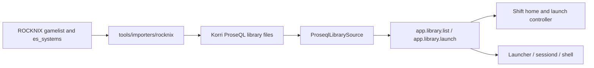
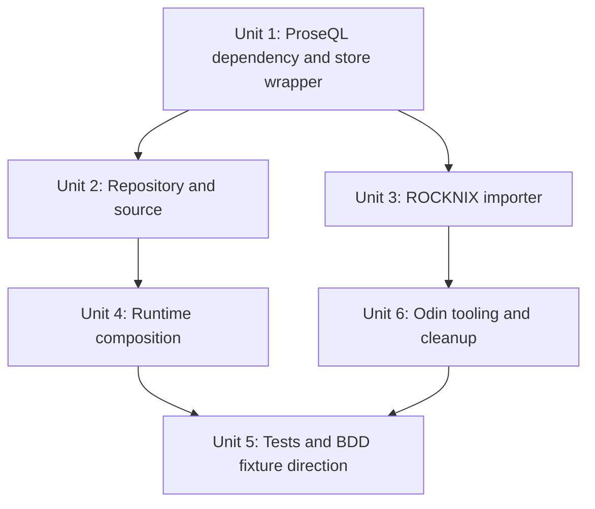
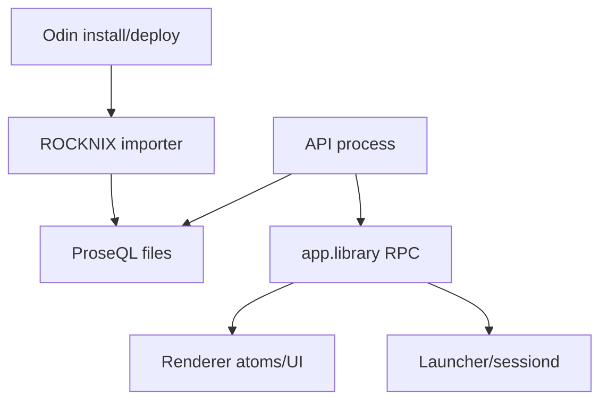

# feat: Replace ROCKNIX runtime library with ProseQL foundation

## Overview

Replace the current runtime dependency on ROCKNIX `gamelist.xml` / `es_systems.cfg` with a Korri-owned ProseQL library store. ROCKNIX remains useful only as a one-shot importer so the existing Odin E2E path keeps working while the product runtime moves onto the intended foundation.

The runtime shape becomes:

```text
ROCKNIX files -> importer -> ProseQL library files -> LibrarySource -> existing RPC/UI/Launcher
```

The important product change is not a richer library UI. The home still reads `GameRecord[]`, launch still resolves a server-side `LaunchSpec`, and the Shift surface remains a recency rail. The important architecture change is ownership: Korri reads its own library store at runtime.

## Problem Frame

The personal MVP deliberately used ROCKNIX as a half-step to get a real open-Korri-to-game-running flow working. That was useful, but if `LibrarySourceLayerLive` keeps constructing a `RocknixSource`, ROCKNIX metadata becomes the product database by inertia. That contradicts the origin brainstorm's intended deletion path: the seams were meant to swap when ProseQL lands, not to support ROCKNIX long-term (see origin: `../01KQJZR90GHVYQ169G3QWN3G5T-feat-personal-mvp-rocknix-launch/requirements.md`).

This plan advances that future step now: ProseQL becomes the canonical library persistence layer, and ROCKNIX parsing moves out of runtime into import tooling.

## Requirements Trace

- R1. Runtime library reads come from Korri-owned ProseQL files, not ROCKNIX `gamelist.xml` or `es_systems.cfg`.
- R2. Existing app behavior stays intact: `app.library.list` returns games ordered for the home rail, and `app.library.launch` resolves a launch spec by game id.
- R3. ROCKNIX support is import-only. No code under `korri/products/**` or runtime `korri/shared/**` imports ROCKNIX parser/source modules after the migration.
- R4. The ROCKNIX importer is snapshot-only: it imports into an empty Korri library and makes replacement an explicit reset/re-import operation.
- R5. Tests use real implementations: real ProseQL files in temp directories, real importer parsing fixture files, real RPC handlers/layers, and real `ShellLauncher` with the existing controllable launch target where launch behavior is tested.
- R6. The plan does not introduce browse/search/library editing/onboarding behavior. It only replaces the persistence foundation beneath the existing Safe Game Resume flow.
- R7. The ProseQL dependency is proven compatible with Korri's Effect runtime before downstream code depends on it.

## Scope Boundaries

- Out: new library grid, search, filters, source/provider UI, onboarding, scraping, metadata correction, save sync, multi-device sync, and Korri OS launcher replacement.
- Out: treating ROCKNIX as a supported runtime backend or adding a `KORRI_LIBRARY_SOURCE=rocknix` long-term escape hatch.
- Out: rewriting the existing Shift home, navigation architecture, RPC tags, or `Launcher` seam.
- Out: designing the full future game/release/platform/source taxonomy. The first ProseQL schema satisfies today's `GameRecord` + `LaunchSpec` contract and leaves richer modeling for later.

### Deferred to Separate Tasks

- ProseQL package compatibility work: satisfied by npm `@proseql/node@0.11.0`, which peers on Korri's current `effect@4.0.0-beta.60`.
- General non-ROCKNIX import UX: the future `tell-korri-about-my-games` job should own first-run/source connection flows.

## Context & Research

### Relevant Code and Patterns

- `korri/shared/library/library-source.ts` defines the plain `LibrarySource` interface that runtime storage must satisfy.
- `korri/shared/library/library-services.ts` wraps `LibrarySource` and `Launcher` as Effect services used by atoms and RPC handlers.
- `korri/shared/library/library-source-layer-live.ts` is the current runtime coupling point; it constructs `createRocknixSource(buildRocknixConfigFromEnv())`.
- `korri/shared/library/rocknix/rocknix-source.ts` composes `GameRecord` and `LaunchSpec` from ROCKNIX files. Its parser/composition behavior is useful importer code, but should no longer be runtime code.
- `korri/products/app/api/library/list.rpc-handler.ts` and `korri/products/app/api/library/launch.rpc-handler.ts` already consume the generic services. They should not need RPC tag or payload changes.
- `korri/products/app/features/home/library-source-layer-rpc.ts` and `korri/shared/library/library-atoms.ts` prove renderer-side code is already source-agnostic.
- `tools/testing/library/with-temp-library.ts` writes real ROCKNIX-shaped fixtures. The new ProseQL test fixture should follow the same real-filesystem posture.
- `tools/testing/library/with-rpc-server.ts` is the integration pattern for testing RPC-backed layers against the real Hono/RPC stack.

### Institutional Learnings

- `docs/solutions/best-practices/prefer-real-implementations-over-mocks-2026-05-02.md` — use configured real implementations and temp filesystem fixtures, not `Mock*` / `Stub*` source classes.
- `docs/solutions/best-practices/temporary-rocknix-sidecar-media-instead-of-es-gamelist-edits-2026-05-03.md` — temporary ROCKNIX media seams should stay Korri-owned and deletable; do not let ES metadata edits become architecture.
- `docs/solutions/integration-issues/2026-05-02-bdd-fixture-deferred.md` — the old deferred BDD fixture plan was ROCKNIX-shaped. ProseQL should replace that fixture direction rather than deepening the ROCKNIX path.
- `docs/solutions/integration-issues/effect-v4-rpc-schema-class-responses-2026-05-03.md` — keep real RPC-layer tests because direct handler tests can miss Effect RPC serialization/schema drift.
- `docs/solutions/integration-issues/one-command-odin-electrobun-deploy-needs-device-nix-and-session-env-2026-05-06.md` — Odin deploy is convergence, not just rsync. If install/deploy seeds ProseQL files, the smoke path must prove the running session sees the seeded data.

### External References

- ProseQL README: `https://github.com/simonwjackson/proseql` — ProseQL is a type-safe relational database persisted to plain text files.
- `@proseql/node` README: `https://github.com/simonwjackson/proseql/tree/main/packages/node` — `createNodeDatabase`, file extension codec inference, debounced writes, `flush()`, JSON/YAML/JSONL/prose persistence.
- `@proseql/core` README: `https://github.com/simonwjackson/proseql/tree/main/packages/core` — Effect Schema collection definitions, CRUD, `findById`, `query`, `upsert`, sorting, and relationships.

## Key Technical Decisions

| Decision | Rationale |
|---|---|
| ProseQL is the only live library source | Avoids keeping ROCKNIX as a supported database. The migration should remove the runtime dependency rather than add source selection complexity. |
| Use ProseQL server-side only | The browser already talks through existing RPC/Effect layers. Pulling ProseQL into the renderer would create a second data strategy and bypass established API seams. |
| Start with two minimal collections: `games`, `launchTargets` | `games` satisfies `list()`, and `launchTargets` satisfies `launchSpecFor(id)`. ROCKNIX is a snapshot importer, not a linked source identity system. |
| Add schema versions from the first ProseQL collection config | This is persistent user data, even in a personal MVP. ProseQL supports chained schema migrations; starting at version 1 avoids treating the first future schema change as a special emergency. |
| Use uniqueness/relationship constraints where ProseQL supports them | `launchTargets.gameId` is an integrity boundary. Enforcing it catches duplicate launch specs and orphan launch specs earlier than runtime symptoms. |
| Persist dates as ISO strings at the ProseQL boundary | Plain text files should be readable and diffable; adapters can decode into `GameRecord` where `GameUserData.lastPlayed` already accepts date strings. |
| Move ROCKNIX parsing to tooling | Parser code remains useful for import, but no runtime module should read ROCKNIX files once ProseQL is canonical. |
| Install/deploy seeds ProseQL, API start does not import | Importing at API startup would keep ROCKNIX in the runtime mental model and make boot depend on external metadata. Seeding belongs to explicit tooling and Odin convergence scripts. |
| Do not use `@proseql/rpc` for this slice | Korri already has Effect RPC contracts. ProseQL is persistence; `app.library.*` remains the public API surface. |
| Keep `@proseql/node` out of the renderer bundle | The ProseQL adapter is Node/server persistence. It may live under shared library code only if imports remain server-entry-only; renderer-facing atoms/RPC layers must not import the node adapter transitively. |

## Open Questions

### Resolved During Planning

- Should the first step be JSON or ProseQL? ProseQL. The user confirmed ProseQL will be the foundation, so the migration should not add a disposable JSON store first.
- Should ROCKNIX remain selectable as a runtime source? No. ROCKNIX was a half-step for E2E; it becomes importer-only.
- Should this plan redesign the whole game/source schema? No. The first schema satisfies today's `GameRecord` and `LaunchSpec` contracts and preserves room for future modeling.

### Deferred to Implementation

- Exact ProseQL collection file extensions: YAML is the preferred first default for human-readable Korri library files.
- Exact ProseQL API calls: follow the installed/published package version once dependency compatibility is proven.
- Whether ProseQL's transaction and relationship APIs are mature enough in the selected version for importer writes. If they are available, use them; if not, repository-level validation must preserve the same all-or-nothing and no-orphan invariants.
- Whether existing ROCKNIX parser tests are moved in one commit or kept temporarily under their old path while runtime references are removed. The final state should make ROCKNIX importer ownership obvious.
- Whether `@proseql/node` can be consumed directly with Korri's Effect v4 beta. If not, resolve the package compatibility first as a prerequisite.

## Output Structure

This tree shows the expected new/changed shape. The per-unit file lists remain authoritative.

```text
korri/shared/library/proseql/
  library-db.ts
  library-db.test.ts
  library-repository.ts
  library-repository.test.ts
  proseql-library-source.ts
  proseql-library-source.test.ts

tools/importers/rocknix/
  cli.ts
  rocknix-importer.ts
  rocknix-importer.test.ts
  es-systems.ts
  es-systems.test.ts
  gamelist.ts
  gamelist.test.ts
  fixtures/
    es_systems.sample.cfg
    snes-gamelist.sample.xml

tools/testing/library/
  with-temp-proseql-library.ts
  with-temp-proseql-library.test.ts
```

## High-Level Technical Design

> *This illustrates the intended approach and is directional guidance for review, not implementation specification. The implementing agent should treat it as context, not code to reproduce.*



ProseQL collections should initially model only what the current runtime needs:

```text
games
  id
  metadata
  userData

launchTargets
  id
  gameId
  spec
```

`ProseqlLibrarySource.list()` adapts `games` into `GameRecord[]` sorted by `userData.lastPlayed` descending with undefined dates last. `launchSpecFor(id)` finds the active launch target for the game and returns its stored `LaunchSpec`.

## Implementation Units



- [x] **Unit 1: Establish the ProseQL dependency and library store wrapper**

**Goal:** Add ProseQL as Korri's server-side library persistence dependency and create the minimal database/config wrapper used by runtime and importer code.

**Requirements:** R1, R5, R7.

**Dependencies:** Satisfied by npm `@proseql/node@0.11.0` with `effect@4.0.0-beta.60` peer compatibility.

**Files:**
- Modify: `package.json`
- Modify: `bun.lock`
- Create: `korri/shared/library/proseql/library-db.ts`
- Test: `korri/shared/library/proseql/library-db.test.ts`

**Approach:**
- Add `@proseql/node` as the intended dependency, but prove install/typecheck compatibility before downstream units rely on it.
- Keep ProseQL usage behind a local wrapper so the rest of Korri does not scatter collection config or package API details.
- Make the wrapper server-entry-only. The API live layer may import it; renderer atoms, RPC-backed layers, Storybook, and shared UI must not.
- Define minimal Effect Schema-backed collection shapes for `games` and `launchTargets`.
- Add collection schema versions and an explicit first migration posture even if no migration is needed yet.
- Declare uniqueness/relationship constraints for source links and launch targets when the selected ProseQL version supports them.
- Prefer plain text files under a configurable root such as `KORRI_LIBRARY_ROOT`, defaulting on Odin to a Korri-owned `/storage/korri/library` location.
- Persist launch specs as structured data using the existing `LaunchSpec` schema rather than shell strings.

**Execution note:** Start with a small compatibility/characterization test that creates a temp ProseQL library, writes one game and launch target, flushes pending writes, and reads them back through the wrapper.

**Patterns to follow:**
- `korri/shared/library/launcher.ts` for Effect Schema contract definitions.
- `korri/shared/library/library-source-layer-memory.ts` for small layer factories with configurable behavior.
- ProseQL `@proseql/node` docs for `createNodeDatabase`, file extension inference, and `flush()`.

**Test scenarios:**
- Happy path: creating a temp ProseQL database with one game and one launch target writes human-readable files and reads the same records back after reopening the wrapper.
- Edge case: an empty database root produces empty `games` and `launchTargets` collections without throwing.
- Edge case: loading versioned collection files at the current schema version performs no migration and validates normally.
- Error path: invalid persisted data fails through a typed/structured error path instead of surfacing an unclassified exception.
- Error path: duplicate import-link identity is rejected by store constraints or repository validation.
- Integration: flushing after a write makes the file contents visible to a second database instance opened against the same temp directory.

**Verification:**
- Korri can install and typecheck with the selected ProseQL package/version.
- The wrapper hides ProseQL-specific setup from callers.
- No runtime code outside `korri/shared/library/proseql/*` imports `@proseql/*`.
- The web/renderer build does not pull `@proseql/node` into browser-facing code.

---

- [x] **Unit 2: Implement the ProseQL repository and `LibrarySource` adapter**

**Goal:** Implement runtime reads from ProseQL behind the existing `LibrarySource` contract.

**Requirements:** R1, R2, R5.

**Dependencies:** Unit 1.

**Files:**
- Create: `korri/shared/library/proseql/library-repository.ts`
- Test: `korri/shared/library/proseql/library-repository.test.ts`
- Create: `korri/shared/library/proseql/proseql-library-source.ts`
- Test: `korri/shared/library/proseql/proseql-library-source.test.ts`

**Approach:**
- Keep repository operations explicit: list games, upsert game, upsert launch target, resolve launch target for game, and upsert source/import link.
- Use a transaction for multi-record writes when ProseQL supports it in the selected version; otherwise keep repository methods narrow enough that the importer can validate and fail before partial writes.
- `ProseqlLibrarySource.list()` returns `GameRecord[]` sorted by `userData.lastPlayed` descending with missing values last, matching the current home rail contract.
- `ProseqlLibrarySource.launchSpecFor(id)` returns the stored launch spec for the requested game id or `undefined` if none exists.
- Decode persisted records through existing `GameRecord` and `LaunchSpec` schemas at the boundary so corrupted plain text files fail predictably.
- Do not introduce browse/search-specific queries yet; those belong to later library features.

**Execution note:** Implement repository behavior test-first because this is the new canonical persistence boundary.

**Patterns to follow:**
- `korri/shared/library/rocknix/rocknix-source.test.ts` for existing expected sort and launch-spec behavior, while avoiding runtime ROCKNIX dependencies.
- `korri/shared/library/library-source-layer-memory.test.ts` for Effect service result expectations.

**Test scenarios:**
- Happy path: two games with different `lastPlayed` values are returned newest first.
- Edge case: games with no `lastPlayed` sort after games with dates.
- Edge case: a game without a launch target still appears in `list()` but `launchSpecFor(id)` returns `undefined`.
- Error path: a launch target with an invalid `LaunchSpec` is rejected/translated to a library error rather than returned to the launcher.
- Integration: a repository write followed by a `ProseqlLibrarySource` read against the same temp root returns the newly stored game and launch spec.
- Integration: a failed multi-record write does not leave an orphan launch target or import link without its game.

**Verification:**
- The existing `LibrarySource` contract can be satisfied without importing ROCKNIX modules.
- `GameRecord` and `LaunchSpec` remain the only shapes exposed to RPC and UI code.

---

- [x] **Unit 3: Convert ROCKNIX runtime parser into a snapshot importer**

**Goal:** Move ROCKNIX file parsing out of runtime and into a tooling importer that seeds ProseQL records.

**Requirements:** R3, R4, R5.

**Dependencies:** Unit 1; Unit 2 repository write operations.

**Files:**
- Create: `tools/importers/rocknix/rocknix-importer.ts`
- Test: `tools/importers/rocknix/rocknix-importer.test.ts`
- Create: `tools/importers/rocknix/cli.ts`
- Move or create: `tools/importers/rocknix/gamelist.ts`
- Move or create: `tools/importers/rocknix/gamelist.test.ts`
- Move or create: `tools/importers/rocknix/es-systems.ts`
- Move or create: `tools/importers/rocknix/es-systems.test.ts`
- Move or create: `tools/importers/rocknix/fixtures/es_systems.sample.cfg`
- Move or create: `tools/importers/rocknix/fixtures/snes-gamelist.sample.xml`
- Modify or retire: `korri/shared/library/rocknix/rocknix-source.ts`
- Modify or retire: `korri/shared/library/rocknix/rocknix-source.test.ts`

**Approach:**
- Reuse the proven ROCKNIX parsing/composition behavior, but change the output from an in-memory `LibrarySource` to ProseQL repository writes.
- Generate stable Korri game ids initially compatible with existing ids where practical, so UI state and launch paths do not churn unnecessarily.
- Treat ROCKNIX import as a snapshot seed, not a durable linked source. Generate Korri game ids and require an empty target library so re-importing is an explicit replace/reset operation.
- Write each game + launch target as an atomic import unit when ProseQL transactions are available. If importer-wide transactions are too coarse, at least prevent per-game partial writes.
- Preserve the temporary sidecar media read behavior only as importer logic. The imported `GameRecord.metadata.media` should contain normal media URIs; runtime should not know sidecar conventions.
- Return an import summary with counts and warnings so Odin tooling can fail or warn clearly without scraping logs.

**Execution note:** Add characterization coverage for current parser behavior before moving files, then importer tests against real temp ROCKNIX fixtures and real temp ProseQL files.

**Patterns to follow:**
- `tools/testing/library/with-temp-library.ts` for fixture generation.
- Existing parser tests under `korri/shared/library/rocknix/*` for real-world XML/config edge cases.
- `@shared/logger` conventions for warnings and import summaries.

**Test scenarios:**
- Happy path: importing a temp ROCKNIX library writes one game and one launch target into ProseQL.
- Error path: a second import into a non-empty ProseQL library is rejected; replacement requires resetting the target library first.
- Edge case: a system present in `gamelist.xml` but absent from `es_systems.cfg` is skipped with a warning count.
- Edge case: missing optional media still imports the game and launch target.
- Error path: malformed gamelist input degrades the same way the current parser does and does not corrupt existing ProseQL records.
- Integration: a game imported from ROCKNIX can be read through `ProseqlLibrarySource.list()` and launched through `launchSpecFor(id)` with the expected structured argv.
- Integration: if import fails while writing a game's launch target, the corresponding game is absent; no new partial record set is visible.

**Verification:**
- ROCKNIX code lives under tooling/importer ownership, not the runtime source path.
- Importing produces a ProseQL library that satisfies the existing app contracts, and non-empty target libraries are rejected to avoid accidental reconciliation with ROCKNIX.

---

- [x] **Unit 4: Switch live runtime composition to ProseQL**

**Goal:** Make the production library layer read ProseQL by default and remove ROCKNIX runtime construction.

**Requirements:** R1, R2, R3.

**Dependencies:** Units 1 and 2.

**Files:**
- Modify: `korri/shared/library/library-source-layer-live.ts`
- Modify: `korri/products/app/api/library/list.rpc-handler.test.ts`
- Modify: `korri/products/app/api/library/launch.rpc-handler.test.ts`
- Modify as needed: `korri/products/app/features/home/library-rpc-layers.test.ts`

**Approach:**
- Replace `createRocknixSource(buildRocknixConfigFromEnv())` with `createProseqlLibrarySource(buildLibraryRootFromEnv())` or equivalent wrapper composition.
- Prefer a single live path. If an environment variable is added, it should configure the ProseQL root, not toggle back to ROCKNIX.
- Update handler tests to seed ProseQL temp files rather than constructing a `RocknixSource` over temp ROCKNIX files.
- Keep RPC payloads, response schemas, tags, and renderer layers unchanged.
- Preserve `LauncherLayerLive` behavior; `LaunchSpec` commands imported from ROCKNIX can still target `runemu.sh` until Korri OS owns launching.

**Patterns to follow:**
- `korri/products/app/api/library/list.rpc-handler.ts` returning `new ListLibraryResponse(...)` for Schema.Class success.
- `tools/testing/library/with-rpc-server.ts` for real RPC integration coverage.

**Test scenarios:**
- Happy path: `app.library.list` returns games seeded in a temp ProseQL library through the real handler layer.
- Happy path: `app.library.launch` resolves a ProseQL-stored launch target and runs the configured real launcher target.
- Error path: launching an unknown id returns the existing `NotFoundError` behavior.
- Error path: unreadable/invalid ProseQL data maps to the existing `DataError` surface.
- Integration: `LibrarySourceLayerRpc` over a real in-process RPC server still decodes `app.library.list` after the backing source changes.

**Verification:**
- The app's public RPC behavior is unchanged while the live storage backend changes.
- Searching runtime code under `korri/products/**` and `korri/shared/**` finds no ROCKNIX parser/source imports.

---

- [ ] **Unit 5: Add ProseQL-based test fixtures and update BDD direction**

**Goal:** Replace ROCKNIX-shaped test setup as the default fixture direction for future BDD and integration tests.

**Requirements:** R5, R6.

**Dependencies:** Units 1, 2, and 4.

**Files:**
- Create: `tools/testing/library/with-temp-proseql-library.ts`
- Test: `tools/testing/library/with-temp-proseql-library.test.ts`
- Modify: `docs/solutions/integration-issues/2026-05-02-bdd-fixture-deferred.md`
- Modify as needed: `korri/products/app/features/home/e2e/home.feature`
- Modify as needed: `korri/products/app/features/resume/e2e/safe-game-resume.feature`

**Approach:**
- Add a test helper that writes real ProseQL files for named games and launch specs, analogous to the old `withTempLibrary` but aligned with the new canonical store.
- Keep `withTempLibrary` only for importer tests that need ROCKNIX-shaped source files.
- Update the deferred BDD solution note so future Playwright global setup seeds ProseQL directly instead of manufacturing ROCKNIX gamelists.
- Do not remove `@fixme` tags unless actual BDD setup is implemented in this unit. If this unit only redirects fixture strategy, leave behavior tags intact.

**Patterns to follow:**
- `tools/testing/library/with-temp-library.test.ts` for real filesystem lifecycle and cleanup expectations.
- `docs/solutions/integration-issues/2026-05-02-bdd-fixture-deferred.md` for the existing BDD fixture gap and scenario names.

**Test scenarios:**
- Happy path: helper creates a temp ProseQL library with named games, launch targets, and deterministic `lastPlayed` values.
- Edge case: helper can create an empty library for empty-state tests.
- Integration: a library created by the helper can be consumed by `LibrarySourceLayerLive` when its root env/config points at the temp directory.
- Integration: fake launch target configuration survives through ProseQL and can be used by existing launch handler tests.

**Verification:**
- New tests that need library state can seed ProseQL without constructing ROCKNIX fixtures.
- Documentation no longer points future BDD work toward deepening ROCKNIX runtime assumptions.

---

- [ ] **Unit 6: Update Odin install/deploy tooling and remove runtime ROCKNIX remnants**

**Goal:** Ensure Odin convergence produces a populated ProseQL library and make the runtime decoupling visible in scripts and checks.

**Requirements:** R1, R3, R4.

**Dependencies:** Units 3 and 4.

**Files:**
- Modify: `scripts/odin/install.sh`
- Modify: `scripts/odin/deploy.sh`
- Modify: `scripts/odin/run-api.sh`
- Modify: `scripts/odin/smoke.sh`
- Modify: `scripts/odin/smoke-rpc.ts`
- Modify: `justfile`
- Modify as needed: `docs/deployment/device-report.md`

**Approach:**
- Add an explicit import step to Odin install/deploy convergence so `/storage/korri/library` is populated before the API/session smoke checks run.
- Replace `KORRI_ROCKNIX_GAMELIST_ROOTS` / `KORRI_ROCKNIX_ES_SYSTEMS` as runtime API env with ProseQL library-root configuration.
- Keep ROCKNIX path/env knowledge only in the importer invocation or installer context.
- Update smoke checks to validate `app.library.list` through the running API backed by ProseQL, not by direct ROCKNIX env hints.
- Consider a developer-facing `just` recipe for manual re-import, but keep API startup free of implicit import work.

**Patterns to follow:**
- `scripts/odin/deploy.sh` convergence pattern: sync, install/update, start fresh, smoke.
- `docs/solutions/integration-issues/one-command-odin-electrobun-deploy-needs-device-nix-and-session-env-2026-05-06.md` for deploy validation expectations.
- `scripts/odin/smoke-rpc.ts` for current typed smoke assertions.

**Test scenarios:**
- Happy path: smoke RPC validation accepts a non-empty ProseQL-backed library and reports actionable summary data.
- Error path: missing ProseQL library root reports an actionable message that tells the developer to run the importer/install path, not to set ROCKNIX runtime env vars.
- Integration: install/deploy import summary warnings do not prevent smoke unless the resulting ProseQL library is unusable.
- Regression: `rg` over runtime paths confirms ROCKNIX parser/source references are absent outside importer tooling and documentation.

**Verification:**
- `just deploy-odin` remains the convergence command for a current device build and now converges ProseQL library state too.
- Runtime API processes need only Korri-owned library configuration, not ROCKNIX gamelist/system env.

## System-Wide Impact



- **Interaction graph:** Odin scripts seed ProseQL through importer tooling; the API reads ProseQL through `LibrarySourceLayerLive`; existing RPC and renderer layers remain unchanged.
- **Error propagation:** ProseQL read/decode failures become `LibraryError`, then existing RPC `DataError` responses. Import warnings surface in importer summaries and install/deploy logs, not as runtime parser warnings.
- **State lifecycle risks:** ROCKNIX import is a snapshot seed and should target an empty ProseQL library. ProseQL writes must flush before API smoke checks read the library. API startup must not race an in-progress import.
- **API surface parity:** `app.library.list` and `app.library.launch` contracts stay stable. BDD and RPC tests should prove parity after the backend swap.
- **Integration coverage:** Unit tests prove repository/import behavior; handler/RPC integration tests prove the existing API sees ProseQL data; Odin smoke proves deploy convergence populated the actual device store.
- **Unchanged invariants:** UI components remain ignorant of launch specs, storage files, ROCKNIX, and ProseQL. The renderer still consumes `GameRecord[]` and launch results through existing atoms/RPC layers.

## Risks & Dependencies

| Risk | Mitigation |
|---|---|
| Future ProseQL releases drift from Korri's Effect version | Keep the dependency pinned and let Unit 1's wrapper tests/typecheck catch package compatibility before deeper integration changes. |
| Runtime accidentally keeps ROCKNIX as fallback | Do not add a runtime source switch. Use `rg` and tests to enforce that ROCKNIX modules are importer-only. |
| Node-only ProseQL code leaks into renderer bundle | Keep imports server-entry-only and verify the web build/RPC-backed renderer path does not transitively import `@proseql/node`. |
| ProseQL schema freezes the wrong future model | Keep the first schema minimal and contract-shaped: games, launch targets, import links. Defer richer taxonomy. |
| Re-import duplicates games | Require an empty target library for ROCKNIX snapshot imports; replace/reset flows should remove the old ProseQL library before importing. |
| Imported launch specs preserve ROCKNIX paths longer than desired | Accept for the Odin transitional path. The `Launcher` seam remains where Korri OS replaces `runemu.sh` later. |
| Plain text data corruption breaks runtime reads | Decode through Effect schemas and surface typed `LibraryError`/`DataError`; add invalid-data tests. |
| Partial import leaves orphan launch targets or stale import links | Prefer ProseQL transactions for per-game or importer-wide writes; otherwise validate before writing and test failed-write rollback/previous-version behavior. |
| Schema evolution breaks existing personal library files | Version ProseQL collections from the first implementation and keep migrations chained in the database wrapper. |
| Install/deploy reads library before ProseQL writes flush | Importer should flush before returning success; deploy smoke should read through the running API after import completes. |

## Documentation / Operational Notes

- Update any Odin setup comments that imply runtime reads `KORRI_ROCKNIX_*` env vars.
- Keep importer docs intentionally deletion-oriented: ROCKNIX exists to bootstrap the current personal device, not as a supported database.
- If ProseQL compatibility requires an upstream release, record the chosen version in the implementation PR and avoid documenting temporary local paths in repo docs.

## Sources & References

- **Origin document:** [../01KQJZR90GHVYQ169G3QWN3G5T-feat-personal-mvp-rocknix-launch/requirements.md](../01KQJZR90GHVYQ169G3QWN3G5T-feat-personal-mvp-rocknix-launch/requirements.md)
- Existing plan being superseded at the storage layer: [../01KQJZR90GHVYQ169G3QWN3G5T-feat-personal-mvp-rocknix-launch/plan.md](../01KQJZR90GHVYQ169G3QWN3G5T-feat-personal-mvp-rocknix-launch/plan.md)
- Runtime seam: `korri/shared/library/library-source.ts`
- Runtime live source: `korri/shared/library/library-source-layer-live.ts`
- Current ROCKNIX adapter: `korri/shared/library/rocknix/rocknix-source.ts`
- RPC handlers: `korri/products/app/api/library/list.rpc-handler.ts`, `korri/products/app/api/library/launch.rpc-handler.ts`
- ProseQL repository: `https://github.com/simonwjackson/proseql`
- ProseQL Node package docs: `https://github.com/simonwjackson/proseql/tree/main/packages/node`
