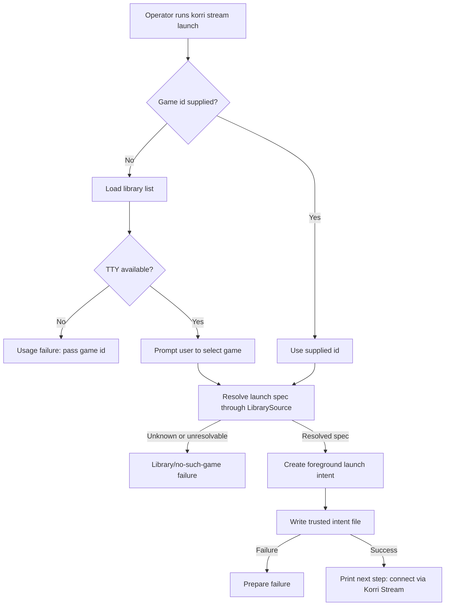

# Add Korri CLI Stream Launch Preparation

## Summary

Add a local-first `korri stream launch` CLI that reuses Korri's existing library source and game-stream launch-intent contract. The plan introduces a small Effect CLI entrypoint, a testable stream-launch preparation seam, interactive game selection, and Nix packaging without changing the runner lifecycle or creating a new game catalog.

---

## Problem Frame

The validated stream-launch path is currently operated through low-level launch-intent tooling. The requirements call for the first product-shaped Korri CLI surface while preserving the existing runner, Sunshine/Moonlight, and library boundaries.

---

## Requirements

- R1. Build the first Korri-owned command-line surface using Effect CLI.
- R2. Running the stream launch command without a game id opens an interactive terminal picker.
- R3. The picker shows enough game identity for the operator to choose the intended game.
- R4. The command prepares the selected game for the existing stream flow and does not control Moonlight.
- R5. The picker sources games from the existing Korri library configuration.
- R6. The command accepts an explicit game id for scripts, tests, and advanced users.
- R7. The command resolves the selected game through existing Korri library launch semantics rather than asking for a raw command.
- R8. Unknown, unresolvable, or invalid launch targets fail clearly without preparing a stale or incorrect stream launch.
- R9. Success output tells the operator the game is prepared and the next step is connecting to the existing stable stream app.
- R10. Failure output distinguishes no-such-game, library/config problems, and launch-preparation failures.
- R11. The CLI shape should not preclude future client-to-server triggering, while v1 runs locally on the Korri server.

**Origin actors:** A1 server operator/player, A2 Korri CLI, A3 Korri library, A4 existing stream runner/app
**Origin flows:** F1 interactive prepare, F2 prepare by game id
**Origin acceptance examples:** AE1 interactive prepare, AE2 id prepare, AE3 unknown id failure, AE4 prepare-only boundary

---

## Scope Boundaries

- No remote client-to-server launch protocol.
- No Moonlight open/pair/control behavior.
- No stream quality, latency, bitrate, resolution, or encoder tuning.
- No new game registry or CLI-specific catalog format.
- No primary raw arbitrary command launch flow in the new Korri CLI.
- No Korri app UI integration.
- No post-prepare status watching.
- No library import, editing, repair, or management commands.
- No cross-user operator-to-runner handoff in v1; the CLI runs in the same user/session context as the stream runner runtime directory.
- No session lifecycle or wait-monitor support in the new human-facing CLI; advanced lifecycle controls remain on the existing low-level enqueue path. If future library data carries lifecycle metadata, non-foreground entries should be treated as unsupported by this v1 CLI rather than silently downgraded.
- Do not remove the existing low-level enqueue command in this slice.

### Deferred to Follow-Up Work

- Remote trigger mode: future client-to-server control path after the local CLI contract is stable.
- Cross-user/server daemon handoff: future security design for operators who are not the stream runner user.
- CLI status/watch commands: future stream/session observability after prepare-only launch is useful.
- Session lifecycle/wait-monitor UX: future productized shape for launcher-style sessions if library data needs it.

---

## Context & Research

### Relevant Code and Patterns

- `tools/device/game-stream-launch-intent.ts` provides the trusted file-backed intent store, default intent path resolution, and launch-intent creation used by the existing runner.
- `tools/device/game-stream-runner.ts` currently contains the low-level `enqueue` subcommand and the runtime path that consumes prepared intents.
- `korri/shared/library/library-services.ts` defines the Effect `LibrarySource` service contract with `list` and `launchSpecFor`.
- `korri/shared/library/library-source-layer-live.ts` composes the existing configured library source from environment-backed proseql or rocknix settings.
- `korri/shared/library/library-source-layer-memory.ts` provides an in-memory library source layer suitable for behavior tests.
- `korri/shared/library/proseql/library-repository.ts` and `korri/shared/library/rocknix/rocknix-source.ts` are the existing launch-spec resolution paths the CLI should reuse.
- `korri/shared/fixtures/games/game.ts` provides game display helpers for fallback title/id presentation.
- `tools/library/launcher-config-cli.ts` is the closest local CLI pattern: a pure async validation seam, a thin `import.meta.main` entrypoint, injectable output, and discriminated result statuses.
- `nix/korri-game-stream-runner.nix` and `flake.nix` show how Bun-based tools are packaged and exported as flake packages/apps.

### Institutional Learnings

- `docs/solutions/workflow-issues/generic-game-stream-runner-validation-contract-2026-05-19.md`: prepare a fresh one-shot launch intent before each `Korri Stream` launch; keep Sunshine generic; do not add remote command listeners; distinguish the runner app from adjacent profile/desktop entries.
- `docs/solutions/best-practices/proseql-canonical-library-with-derived-yaml-ids-2026-05-06.md`: launch through the existing library and launch-target seams rather than reading emulator or gamelist data directly.
- `docs/solutions/best-practices/product-owned-composition-keeps-shared-layers-reusable-2026-05-03.md`: keep composition roots out of reusable shared layers; the CLI may consume shared services but should not make shared code depend on product/app code.
- `docs/solutions/best-practices/prefer-real-implementations-over-mocks-2026-05-02.md`: test with configured-real seams, temp libraries, and real intent files rather than mock classes.
- `docs/solutions/integration-issues/one-command-odin-electrobun-deploy-needs-device-nix-and-session-env-2026-05-06.md`: runtime environment and PATH differ under packaged/device contexts; CLI errors should make missing runtime/library configuration actionable.

### External References

- Effect 4 exposes CLI primitives from `effect/unstable/cli`; the legacy standalone `@effect/cli` package targets Effect 3 and should not be added to this repo.
- Bun runtime services for Effect 4 come from `@effect/platform-bun` on the matching Effect beta line; `@effect/platform-bun@4.0.0-beta.60` is available and peers on `effect@^4.0.0-beta.60`, matching the repo's current Effect version.

---

## Key Technical Decisions

- Command shape: implement `korri stream launch [game-id]` as the v1 user-facing shape. Missing `game-id` means interactive selection; present `game-id` means scriptable prepare.
- Effect CLI surface: use Effect 4's `effect/unstable/cli` modules and `@effect/platform-bun@4.0.0-beta.60` rather than the legacy `@effect/cli` package.
- Location: place the new CLI under `tools/cli/` as repo tooling/product-surface code. It may import shared library services and device launch-intent tooling, but it must not import from `@app/*` or app route/API composition roots.
- Launch source of truth: use `LibrarySourceLayerLive` for packaged behavior and existing in-memory/temp library helpers for tests. Do not introduce a second games file or registry.
- Prepare mechanism: resolve game id to `LaunchSpec`, create a foreground stream launch intent, and enqueue it through the existing file-backed intent store.
- Same-user runtime assumption: v1 expects the CLI to run in the same user/session context that owns the stream runner runtime directory. If the runtime intent path cannot be resolved or trusted, fail clearly rather than writing elsewhere.
- Low-level enqueue coexistence: keep `korri-game-stream-enqueue` available for dev/ops and advanced lifecycle experiments; the new Korri CLI becomes the product-shaped local prepare path.
- Foreground-only lifecycle: the new CLI always prepares a foreground launch intent for v1. Session lifecycle and wait-monitor parameters remain available only through the lower-level enqueue path.
- Output contract: user-facing success should name the selected game, say the launch is prepared for the existing `Korri Stream` app, and mention that the prepared launch is one-shot/freshness-sensitive enough that the operator should connect promptly or rerun the command.
- Error taxonomy: map failure surfaces into stable user-facing categories:
  - Usage / non-interactive picker problem: no id supplied where prompting is unavailable, empty id, or invalid CLI input.
  - No such game: supplied id is absent from the configured library.
  - Library unavailable/config problem: the library cannot be opened, the configured source is wrong/empty, the selected game has no launch target, launch resolution fails, or the resolved command is rejected by the existing stream-intent contract.
  - Prepare failed: the launch intent cannot be written because the runtime path is missing, untrusted, or not writable; preserve the underlying runtime/permission reason in the output.
  - Cancelled: interactive picker cancellation writes no intent.

---

## Open Questions

### Resolved During Planning

- Which command shape should v1 use? Resolve as `korri stream launch [game-id]`, with the missing id triggering the interactive picker.
- Should v1 support cross-user operator-to-runner handoff? No. Require same user/session for v1 and leave cross-user triggering to a future security design.
- Should the new CLI expose session lifecycle and wait-monitor flags? No. Keep v1 foreground-only and leave advanced lifecycle controls on the low-level enqueue path.
- Should the existing low-level enqueue command be removed? No. Keep it as a dev/ops escape hatch while the Korri CLI becomes the human-facing path.
- Which Effect CLI package should be used? Use Effect 4's built-in unstable CLI modules, not standalone `@effect/cli`.

### Deferred to Implementation

- Exact picker rendering mechanics: implement with the smallest stable Effect CLI prompt surface that satisfies interactive selection, and adjust to the actual Effect 4 beta API during coding.
- Exact human message wording: keep copy clear and test for required information rather than over-specifying sentence text in the plan.
- Exact flake app naming details: follow existing flake/package naming conventions and keep the binary name discoverable as `korri` unless implementation reveals a collision.

---

## Output Structure

    tools/cli/
      korri-cli.ts
      korri-cli.test.ts
      stream-launch.ts
      stream-launch.test.ts
      game-picker.ts
      game-picker.test.ts
    nix/
      korri-cli.nix

The tree is the expected shape, not a hard constraint. The implementer may adjust file names if Effect CLI or packaging conventions make a nearby structure clearer, but the resulting code should preserve the same boundaries.

---

## High-Level Technical Design

> *This illustrates the intended approach and is directional guidance for review, not implementation specification. The implementing agent should treat it as context, not code to reproduce.*

---

## Implementation Units

### U1. Add Effect CLI dependency and Korri CLI skeleton

**Goal:** Create a minimal packaged Korri CLI entrypoint using the Effect 4 CLI surface, without implementing stream-launch behavior yet.

**Requirements:** R1

**Dependencies:** None

**Files:**
- Create: `tools/cli/korri-cli.ts`
- Create: `tools/cli/korri-cli.test.ts`
- Modify: `package.json`
- Modify: `bun.lock`

**Approach:**
- Add `@effect/platform-bun` on the same Effect beta line as the repo's existing Effect packages so CLI commands/prompts have concrete Bun runtime services.
- Use `effect/unstable/cli` for the command tree; do not add or import standalone `@effect/cli`.
- Define a root `korri` command with a `stream launch` subcommand placeholder wired through a testable handler boundary.
- Keep the root entrypoint thin: command composition, layer provision, and `import.meta.main` execution only.

**Execution note:** Implement a minimal command/help test first so dependency/API mismatch is discovered before feature code is layered on top.

**Patterns to follow:**
- `tools/library/launcher-config-cli.ts` for thin CLI entrypoint shape and testable command function.
- `tools/device/game-stream-runner.ts` for `import.meta.main` entrypoint convention.

**Test scenarios:**
- Happy path: running the CLI help/version path through the command runner succeeds without invoking library or intent logic.
- Error path: an unknown subcommand returns a usage failure from the CLI framework rather than throwing an uncaught exception.
- Integration: typecheck proves the chosen Effect CLI and Bun platform dependency versions are compatible with the repo's Effect version.

**Verification:**
- The CLI skeleton can be invoked in tests without spawning a real game, reading a real library, or writing an intent.
- No imports of standalone `@effect/cli` exist in the new code.

---

### U2. Implement stream-launch preparation core

**Goal:** Resolve a chosen game id through the existing library source and prepare a foreground game-stream launch intent through the existing trusted intent store.

**Requirements:** R4, R5, R6, R7, R8, R10; F2; AE2, AE3, AE4

**Dependencies:** U1

**Files:**
- Create: `tools/cli/stream-launch.ts`
- Create: `tools/cli/stream-launch.test.ts`
- Modify: `tools/cli/korri-cli.ts`

**Approach:**
- Implement a testable stream-launch preparation function that accepts a game id, a library source service, an intent store/path configuration, and output/error reporting hooks.
- Use the configured `LibrarySource` contract for both live and test cases; do not open proseql or rocknix data directly from the CLI core.
- For explicit ids, use the library list to distinguish an id that is absent from a known game whose launch target cannot be resolved.
- Resolve the id with `launchSpecFor`; if no spec is returned for a known game, report a library/config category without writing an intent.
- Let the existing stream-intent contract reject invalid resolved launch specs and map that rejection into the library/config category; do not duplicate intent-contract validation rules in the CLI.
- Create foreground launch intents and enqueue through the file-backed stream launch intent store.
- Do not print raw commands, argv, or environment values in normal success output.

**Patterns to follow:**
- `korri/shared/library/library-services.ts` for the service contract.
- `korri/shared/library/library-source-layer-memory.ts` for configured-real tests.
- `tools/device/game-stream-launch-intent.ts` for trusted intent creation and path resolution.
- `tools/library/launcher-config-cli.ts` for discriminated diagnostic results.

**Test scenarios:**
- Covers AE2. Happy path: a known id resolves to a launch spec, writes a real intent file, and returns a prepared result without prompting.
- Covers AE3. Error path: an unknown id returns the no-such-game category and writes no intent file.
- Error path: a library configuration/resolution error returns the library/config category and writes no intent file.
- Error path: a resolved launch spec rejected by the existing stream-intent contract returns the library/config category and writes no intent file.
- Error path: missing or untrusted runtime intent path returns prepare-failed, preserves the underlying runtime/permission reason, and writes no intent file.
- Integration: a written intent file has private file mode, decodes through the existing launch-intent decoder, carries foreground lifecycle, and preserves the resolved command/args without shell-string conversion.

**Verification:**
- The preparation core works with an in-memory library source and a tmpdir-backed real intent store.
- Failure categories are stable enough for the command layer to render actionable messages.

---

### U3. Add interactive game selection

**Goal:** Make `korri stream launch` without a game id present an interactive game picker, while keeping `korri stream launch <game-id>` non-interactive and scriptable.

**Requirements:** R2, R3, R5, R6, R8, R10; F1, F2; AE1, AE2, AE3

**Dependencies:** U1, U2

**Files:**
- Create: `tools/cli/game-picker.ts`
- Create: `tools/cli/game-picker.test.ts`
- Modify: `tools/cli/stream-launch.ts`
- Modify: `tools/cli/stream-launch.test.ts`

**Approach:**
- Load the configured library list only when interactive selection is needed.
- Render each selectable row using the best available game display name with id as a reliable fallback/secondary identity.
- Preserve the library-provided ordering; do not add search, filtering, sorting controls, artwork, or metadata browsing in v1.
- Detect non-TTY execution before prompting. If no game id is supplied and prompting is unavailable, return a usage failure that points callers to the explicit id form.
- Treat picker cancellation as a cancellation result that writes no intent.
- If the library is empty, fail clearly and suggest checking the configured library source rather than opening an empty prompt.

**Patterns to follow:**
- `korri/shared/fixtures/games/game.ts` for display-name fallback.
- `tools/device/flake-command.ts` for existing TTY-detection precedent.
- Effect CLI prompt primitives from `effect/unstable/cli`.

**Test scenarios:**
- Covers AE1. Happy path: with multiple games and an interactive selection, the chosen game id is passed to the preparation core and the resulting intent matches the selected game.
- Covers AE2. Happy path: with an explicit id, the picker is not invoked and preparation proceeds directly.
- Edge case: a game without a metadata name is still selectable using its id.
- Edge case: an empty library returns an actionable empty-library error and writes no intent.
- Error path: no TTY plus no id returns a usage failure and writes no intent.
- Error path: picker cancellation returns the cancellation category and writes no intent.

**Verification:**
- The common human path can choose from a list; the scripted path remains deterministic and does not depend on terminal state.

---

### U4. Wire live library and user-facing output

**Goal:** Connect the command to the live Korri library configuration and render success/failure output that matches the requirements.

**Requirements:** R5, R8, R9, R10; F1, F2; AE1, AE2, AE3, AE4

**Dependencies:** U2, U3

**Files:**
- Modify: `tools/cli/korri-cli.ts`
- Modify: `tools/cli/stream-launch.ts`
- Modify: `tools/cli/stream-launch.test.ts`

**Approach:**
- Provide `LibrarySourceLayerLive` to the stream-launch command in the production entrypoint so the CLI uses the same configured source mode and roots as the app/server library layer.
- Let the stream intent path resolve through the existing default intent path rules, with environment override support inherited from the intent store.
- Route human-facing success and failure messages through an injectable output boundary for tests.
- Success output should include the selected game identity, state that the launch is prepared for `Korri Stream`, and tell the operator to connect promptly or rerun the command if the prepared launch expires or is consumed.
- Failure output should distinguish usage, no-such-game, library/config, prepare-failed, and cancellation categories without dumping stack traces by default.
- Prepare-failed output should preserve the specific runtime/permission cause, such as missing runtime directory, wrong user/owner, or unsafe permissions.
- If the live library is empty or misconfigured, mention the configured library source context at a high level so operators can inspect environment/library setup.

**Patterns to follow:**
- `korri/shared/library/library-source-layer-live.ts` for live source configuration.
- `tools/library/launcher-config-cli.ts` for injectable output and non-zero exit behavior.
- `docs/solutions/workflow-issues/generic-game-stream-runner-validation-contract-2026-05-19.md` for `Korri Stream` wording and one-shot intent caveats.

**Test scenarios:**
- Covers AE1. Integration: with live source configured against a temp proseql library, interactive selection prepares the selected game and prints the required next-step information.
- Covers AE2. Integration: with live source configured against a temp proseql library, explicit id prepares the game and prints the required next-step information.
- Covers AE3. Error path: unknown id prints no-such-game guidance and exits non-zero without writing an intent.
- Covers AE4. Integration: successful CLI execution writes only the launch intent; it does not invoke Moonlight, Sunshine, or the runner process.
- Error path: library unavailable/config failure prints a categorized message without raw stack output.
- Error path: prepare failure caused by an untrusted intent path prints a categorized message and exits non-zero.

**Verification:**
- CLI behavior is proven through the same live library configuration seam used by runtime code, with temp roots/env for tests.
- Output is useful to a server operator and stable enough for scripts to distinguish success/failure by exit code.

---

### U5. Package and expose the Korri CLI

**Goal:** Make the new CLI available as a Nix-built Korri package/app without disturbing existing runner packaging.

**Requirements:** R1, R4, R6, R11

**Dependencies:** U1, U2, U3, U4

**Files:**
- Create: `nix/korri-cli.nix`
- Modify: `flake.nix`
- Modify: `tools/cli/korri-cli.test.ts`

**Approach:**
- Add a Bun-based derivation for the CLI that mirrors existing Korri tool packaging patterns.
- Export a flake package and app for the CLI with a discoverable `korri` binary name unless implementation reveals a naming conflict.
- Keep `korri-game-stream-runner` and `korri-game-stream-enqueue` packaging unchanged.
- Ensure the packaged CLI has access to its runtime dependencies without relying on a developer shell PATH.

**Patterns to follow:**
- `nix/korri-game-stream-runner.nix` for Bun build and wrapper style.
- `flake.nix` existing package/app exports for device tools.

**Test scenarios:**
- Integration: Nix builds the CLI package and the resulting binary can show help/version output.
- Integration: packaged CLI can run the explicit-id path when provided temp library and intent path environment variables.
- Regression: existing `korri-game-stream-runner` package and app exports remain available.

**Verification:**
- The CLI is available through the flake package/app surface and can be run outside a dev shell.
- Existing game-stream runner packaging still builds.

---

### U6. Document CLI usage and operational boundaries

**Goal:** Document the new local prepare workflow and its boundaries for server operators and future implementers.

**Requirements:** R4, R6, R9, R10

**Dependencies:** U4, U5

**Files:**
- Modify: `docs/solutions/workflow-issues/generic-game-stream-runner-validation-contract-2026-05-19.md`
- Modify: `./requirements.md` only if implementation uncovers a product-scope correction that should be reflected upstream

**Approach:**
- Add a short note to the existing game-stream validation contract that the Korri CLI is the preferred local human-facing way to prepare a known library game for `Korri Stream`.
- Preserve the existing validation guidance for low-level enqueue usage as a dev/ops path.
- Document the same-user/session assumption, one-shot intent behavior, foreground-only CLI scope, and the next manual step through `Korri Stream`.
- Document the decision boundary between the product CLI and the low-level enqueue command: use `korri stream launch` for known library foreground games; use the low-level command for raw commands, environment experiments, unsupported lifecycle metadata, and lifecycle/wait-monitor validation.
- Do not add broad product documentation or UI docs beyond the changed local workflow.

**Patterns to follow:**
- Existing solution doc wording and repo-relative references.
- Project rule: do not create extra docs unless explicitly needed; update the existing relevant learning instead of adding a duplicate.

**Test scenarios:**
- Test expectation: none -- documentation-only update. Verification is review for accuracy against the implemented CLI behavior.

**Verification:**
- A reader of the validation contract can distinguish the new Korri CLI path from the lower-level enqueue path and knows the v1 boundaries.

---

## System-Wide Impact

- **Interaction graph:** New path is `korri CLI → LibrarySource → LaunchSpec → GameStreamLaunchIntentStore → existing Korri Stream runner`. It does not call Moonlight, Sunshine, API routes, or app UI code.
- **Error propagation:** Library errors and intent-store errors must be collapsed into operator-facing categories while preserving enough detail for local diagnosis.
- **State lifecycle risks:** Preparing a launch overwrites any previously unclaimed pending intent because the validated contract is latest-intent-wins. The CLI should communicate preparation clearly but should not add a second queue or lock model.
- **API surface parity:** The existing low-level enqueue command remains available; the new CLI is not required to expose every low-level lifecycle option.
- **Integration coverage:** At least one test should run through live library configuration and a real file-backed intent path to prove the layers compose.
- **Unchanged invariants:** The stream runner remains non-root, generic, one-shot-intent driven, and Sunshine-agnostic; the CLI must not weaken intent trust checks.

---

## Risks & Dependencies

| Risk | Mitigation |
|------|------------|
| Effect 4 CLI APIs are under `effect/unstable/cli` and may churn | Use the smallest CLI surface needed: root/subcommands, optional positional id, prompt, and run boundary; keep domain logic outside CLI framework code. |
| Legacy `@effect/cli` appears in local `node_modules` but is Effect 3-oriented | Do not add/import `@effect/cli`; add `@effect/platform-bun@4.0.0-beta.60` and use `effect/unstable/cli`. |
| CLI writes an intent path the runner will not consume | Require same user/session v1 and rely on existing intent path resolution; fail loudly if runtime path is missing/untrusted. |
| Empty or wrong library source produces confusing UX | Use live library config, categorize empty/unavailable/config states, and include actionable library-source context in failures. |
| Interactive prompt is hard to test | Keep selection behind a small boundary and cover both command-level scripted paths and picker behavior with configured-real tests. |
| Product CLI drifts from low-level enqueue behavior | Reuse the same `LaunchSpec` and file-backed intent store rather than shelling out or duplicating serialization. |

---

## Documentation / Operational Notes

- The CLI should be documented as a local server command: run it, choose or supply a game id, then connect to `Korri Stream` from Moonlight.
- Operators should understand the prepared launch is one-shot and should be refreshed before each stream attempt.
- Same-user/session is a v1 operating requirement; cross-user operation is not a bug to solve inside this slice unless the agreed scope changes.
- The low-level enqueue command remains useful for validation, raw commands, environment experiments, and advanced lifecycle checks.

---

## Sources & References

- **Origin document:** [./requirements.md](./requirements.md)
- `tools/device/game-stream-launch-intent.ts`
- `tools/device/game-stream-runner.ts`
- `korri/shared/library/library-services.ts`
- `korri/shared/library/library-source-layer-live.ts`
- `korri/shared/library/library-source-layer-memory.ts`
- `korri/shared/fixtures/games/game.ts`
- `tools/library/launcher-config-cli.ts`
- `tools/library/launcher-config-cli.test.ts`
- `nix/korri-game-stream-runner.nix`
- `flake.nix`
- `docs/solutions/workflow-issues/generic-game-stream-runner-validation-contract-2026-05-19.md`
- `docs/solutions/best-practices/proseql-canonical-library-with-derived-yaml-ids-2026-05-06.md`
- `docs/solutions/best-practices/product-owned-composition-keeps-shared-layers-reusable-2026-05-03.md`
- `docs/solutions/best-practices/prefer-real-implementations-over-mocks-2026-05-02.md`
- `docs/solutions/integration-issues/one-command-odin-electrobun-deploy-needs-device-nix-and-session-env-2026-05-06.md`
