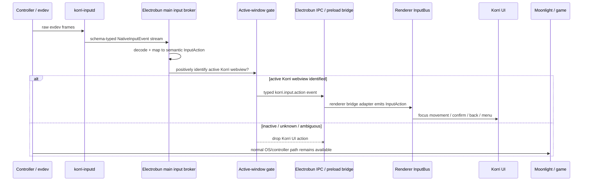

# refactor: Broker desktop input through Electrobun main

## Summary

Move Korri desktop controller input from a renderer-owned inputd WebSocket to an Electrobun main-process input broker. The broker consumes inputd, maps raw evdev frames to semantic `InputAction`s, forwards typed JSON events to the webview over the existing Electrobun preload/IPC seam, and drops all Korri UI input whenever the Korri window is not active.

---

## Problem Frame

On Sobo/Odin2Portal, `korri-inputd` is active and emits controller frames, but the Electrobun portal webview is not consuming them. The current renderer-direct native bridge also puts the wrong component at the boundary: the webview knows about inputd and the raw loopback URL, even though the desktop shell is the platform adapter.

The user explicitly rejected global keyboard injection because it could affect Moonlight or other games. They also rejected direct webview ownership of inputd. The desired boundary is: inputd remains a passive daemon/global-policy owner; Electrobun main adapts device input into Korri semantic actions; the webview receives only app-level actions, and only while Korri is active.

---

## Requirements

- R1. The Korri portal webview must not connect directly to `korri-inputd` or receive a raw inputd URL through runtime config.
- R2. Electrobun main owns the desktop input broker: it connects to inputd, decodes typed native input frames, maps them to semantic Korri input actions, and forwards only those semantic actions to the webview.
- R3. The broker must use Effect locally for orchestration where it helps: Schema for wire contracts, Stream/Queue/Scope for connection lifecycle, and plain typed JSON across process/webview boundaries.
- R4. The IPC boundary must be schema-typed and discriminated so malformed or unrelated Electrobun messages cannot poison connection/runtime bridges.
- R5. Korri UI input forwarding is active-window scoped. If the Korri window/webview is not active, the broker drops all Korri UI input events. Full stop.
- R6. The design must not synthesize OS keyboard events, use global keyboard injection, or otherwise affect the input stream seen by Moonlight or games.
- R7. Product components and themes continue consuming semantic actions through the existing spatial-navigation/input bus; no component imports inputd, Electrobun, or raw evdev details.
- R8. Existing controller feel is preserved: d-pad/stick repeat, button de-dupe, stale-release behavior, and source tagging remain consistent with the current native adapter.
- R9. The broker handles inputd restarts, device removal/re-addition, webview reloads, malformed frames, and high-rate analog input without stuck holds, duplicate actions, or unbounded queues.
- R10. Diagnostics distinguish each stage of the chain: inputd connected, frames decoded, actions mapped, active gate state, IPC push success/failure, and renderer bridge subscription.

**Origin trace:** R2, R3, R4, R7, R8, and R9 preserve the native-input origin's typed schema, device discovery, hotplug, reconnect, and semantic input bus goals. The original transport decision in `../.archive/01KQNJ500NY8SY5AR3K2C23GE8-feat-native-input-bridge/requirements.md` intentionally excluded Electrobun IPC; this plan supersedes that transport choice based on the current desktop architecture and user direction.

---

## Scope Boundaries

- No global keyboard injection, `wtype`, `ydotool`, uinput keyboard synthesis, or equivalent OS-level key translation.
- No renderer-to-inputd WebSocket path for the desktop device profile.
- No component-level navigation APIs, focused-state props, or product-route imports of raw input surfaces.
- No Moonlight/game controller mediation. Games continue receiving controller input through the OS normally; Korri merely stops forwarding app actions while inactive.
- No multi-controller arbitration beyond preserving existing single-controller behavior and device-id cleanup.
- No user-facing server/input configuration UI in this plan.
- No broad redesign of `korri-inputd`; only changes required to support the broker safely are in scope.

### Deferred to Follow-Up Work

- Rich in-game Korri overlay input: future work can explicitly define an overlay mode and a narrow action allowlist. This plan's default is inactive means no Korri UI input.
- Removing the legacy renderer native adapter entirely from non-desktop/dev surfaces: this plan may keep it as a test/dev compatibility path if doing so avoids unrelated churn.
- Remote inputd debugging over LAN: should be opt-in and separate from the production desktop/device default.

---

## Context & Research

### Relevant Code and Patterns

- `tools/device/inputd.ts` is the active daemon. It discovers evdev devices, parses input events, broadcasts schema-backed native input frames over WebSocket, and owns global shortcut policy.
- `korri/shared/input/native/wire-schema.ts` is the Effect Schema source of truth for inputd-facing native input frames.
- `korri/shared/input/native-adapter.ts` currently owns the renderer-direct WebSocket client plus raw-to-semantic mapping, hold/repeat, and stale-release behavior.
- `korri/shared/input/types.ts` defines the semantic `InputAction` and `InputSource` contract that must remain the app boundary.
- `korri/shared/navigation/start.ts` composes adapters into the input bus and focus engine; product code consumes with `useInputAction`.
- `korri/deploy/desktop/preload.ts`, `korri/deploy/desktop/connection-state-bridge.ts`, and `korri/deploy/desktop/runtime-config-bridge.ts` establish the existing Electrobun preload bridge pattern: runtime-neutral contract, `getState()`/`subscribe()` bridge, chained `receiveMessageFromBun` acceptors, and isolated `try/catch` handling.
- `korri/deploy/desktop/main.ts` already runs Effect streams/scopes for desktop connection state and pushes typed snapshots to webviews via `window.webview.sendMessageToWebviewViaExecute(...)`, including `dom-ready` re-pushes.
- `korri/deploy/portal/spatial-navigation-config.ts` is the current source of the desktop renderer-direct native config and must stop exposing `nativeBridgeUrl` for the device broker path.
- `nix/korri-desktop/wrap.nix` currently exports `KORRI_NATIVE_BRIDGE_URL` for the device wrapper; that env surface should become Bun-main-only or be renamed to avoid implying renderer ownership.

### Institutional Learnings

- `docs/solutions/best-practices/decoupled-spatial-navigation-2026-05-01.md`: input adapters emit semantic actions, components stay native HTML, and the navigation library stays behind the shared navigation layer.
- `docs/solutions/best-practices/pointer-aware-spatial-navigation-2026-05-01.md`: source-tagged input actions are the structural way to drive cross-cutting input mode without timing heuristics.
- `docs/solutions/ui-bugs/electrobun-spatial-focus-active-attribute-2026-05-06.md`: Electrobun/WebKit behavior must be verified at the runtime seam; desktop-browser behavior is not sufficient.
- `docs/solutions/ui-bugs/spatial-focus-vacuum-retention-2026-05-04.md`: DOM focus remains the canonical active UI source; do not add component-level selected/focused state to compensate for input plumbing issues.

### External References

- External research skipped. The work is governed by local Effect, Electrobun, inputd, and spatial-navigation patterns already present in the repo.

---

## Key Technical Decisions

- **Electrobun main is the platform input broker:** The webview should receive Korri semantic input actions, not raw evdev frames or inputd URLs. This keeps Linux/device details out of the portal and makes the desktop shell the platform adapter.
- **Typed protocol, not shared runtime:** Effect continues on each side as local orchestration and validation. Across inputd/WebSocket and Electrobun IPC, the boundary is schema-typed JSON; no Effect fiber, Scope, or service crosses into the webview.
- **Separate event and status semantics:** Input actions are edge-triggered and never replayed. Broker status is stateful and can be replayed on subscribe or `dom-ready` for diagnostics.
- **Active-window gate is authoritative and fail-closed:** The broker forwards no Korri UI input unless an active-window provider positively identifies the target Korri webview as active. Unknown, stale, errored, destroyed, or ambiguous focus state means inactive/drop. This is stronger than launch-state gating and matches the user's directive.
- **No OS input injection:** The broker sends messages only into Korri's own webview bridge. It never synthesizes keyboard or gamepad events at the compositor/OS level.
- **Extract mapping before moving transport:** The existing native adapter's evdev-to-`InputAction` behavior should become a shared runtime-neutral mapper so the broker preserves controller feel and tests do not duplicate constants.
- **Broker owns cleanup/backpressure:** High-rate raw input should not create unbounded queues or delayed UI actions. The broker maps/coalesces to semantic actions, resets state on disconnect/device removal/inactive transitions, and drops events that cannot be delivered promptly.
- **Positive active-webview routing, not blind broadcast:** Connection-state snapshots can fan out to every window; input actions must route only to a positively active Korri webview. The broker must not fall back to the primary window when active state is unknown, because that would violate the fail-closed safety requirement.

---

## Open Questions

### Resolved During Planning

- **Should Korri use global keyboard injection for controller navigation?** No. It risks affecting Moonlight/games and violates the app-scoped input boundary.
- **Should the webview consume inputd directly?** No. The user wants the Electrobun core/main process to own the platform bridge and pipe semantic actions into the webview.
- **Can Effect continue across this boundary?** Yes, as Schema/Stream/Queue/Scope locally and typed JSON across transport boundaries; no shared Effect runtime crosses process/webview boundaries.
- **Should input be gated by Moonlight launch state or foreground activity?** Foreground activity. If the Korri window is not active, ignore Korri UI input entirely.
- **Should action events replay after webview reload or late subscription?** No. Replaying confirm/back/system actions would be surprising; only broker status is replayable.

### Deferred to Implementation

- **Exact active-window signal source:** Prefer Electrobun focus/blur or window activation events if reliable; add an injectable Sway-focused-window provider if Electrobun does not expose reliable activity on the target runtime. Regardless of source, the provider must fail closed when activity is unknown.
- **Exact queue/coalescing thresholds:** The plan requires bounded/dropping behavior and no unbounded raw-frame queues; implementation can tune thresholds with tests.
- **Exact env var name:** Prefer a Bun-main-only name such as `KORRI_DESKTOP_INPUTD_URL`; implementation can choose the narrowest name while removing renderer-facing URL exposure.

---

## High-Level Technical Design

> *This illustrates the intended approach and is directional guidance for review, not implementation specification. The implementing agent should treat it as context, not code to reproduce.*

---

## Implementation Units

Units are ordered by dependency. U6 intentionally appears before U4 because inputd exposure and shortcut-consumption rules must be settled before the broker maps events.

### U1. Extract native gamepad mapping into a shared semantic mapper

**Goal:** Preserve current native controller behavior while moving mapping responsibility from the renderer-specific WebSocket adapter into a reusable shared input module.

**Requirements:** R2, R7, R8, R9

**Dependencies:** None

**Files:**
- Create: `korri/shared/input/native/gamepad-mapper.ts`
- Modify: `korri/shared/input/native-adapter.ts`
- Modify: `korri/shared/input/native/button-codes.ts`
- Test: `korri/shared/input/native/gamepad-mapper.test.ts`
- Test: `korri/shared/input/native-adapter.test.ts`

**Approach:**
- Extract button mapping, d-pad/stick/hat handling, pressed-button de-dupe, hold/repeat, stale release, and reset behavior behind a runtime-neutral mapper that emits semantic `InputAction`s.
- Reuse `button-codes.ts` instead of duplicating numeric constants in broker code.
- Keep the existing renderer native adapter working through the extracted mapper so the refactor is behavior-preserving before the desktop broker swaps transport.
- Ensure mapper state can be reset explicitly on inputd disconnect, device removal, webview inactive transition, and broker shutdown.

**Execution note:** Add characterization coverage before changing the existing adapter behavior.

**Patterns to follow:**
- `korri/shared/input/native-adapter.ts` for existing controller semantics.
- `korri/shared/input/native/button-codes.ts` for canonical evdev constants.
- `korri/shared/input/gamepad-adapter.ts` for semantic source tagging and repeat-feel expectations.

**Test scenarios:**
- Happy path: `BTN_A`, `BTN_B`, `BTN_Y`, and `BTN_START` press frames emit `confirm`, `back`, `options`, and `menu` with source `native`.
- Happy path: a short d-pad right press emits exactly one right direction action.
- Happy path: a held d-pad direction repeats after the configured delay and interval.
- Edge case: a stale held direction stops when no release arrives before the stale-release deadline.
- Edge case: analog stick movement uses dominant-axis selection and stops when neutral returns.
- Edge case: device reset clears pressed buttons, held directions, and axis state so no repeat resumes after reconnect.
- Error path: non-gamepad and unsupported evdev frames produce no semantic action and do not corrupt mapper state.

**Verification:**
- Existing native adapter tests still pass through the extracted mapper, and mapper-specific tests document the shared behavior the broker will reuse.

---

### U2. Define the desktop input IPC protocol and preload bridge

**Goal:** Add a runtime-neutral Electrobun webview contract for desktop-brokered input actions and broker status without exposing inputd details to the portal.

**Requirements:** R1, R3, R4, R7, R10

**Dependencies:** U1

**Files:**
- Create: `korri/shared/input/desktop-bridge-wire.ts`
- Modify: `korri/deploy/desktop/preload.ts`
- Modify: `korri/deploy/desktop/preload-entry.ts`
- Modify: `korri/deploy/desktop/connection-state-bridge.ts`
- Modify: `korri/deploy/desktop/runtime-config-bridge.ts`
- Test: `korri/deploy/desktop/preload-input-action-bridge.test.ts`
- Test: `korri/deploy/desktop/preload-runtime-bridge.test.ts`

**Approach:**
- Define the runtime-neutral schema-backed IPC payloads in shared code so both the renderer adapter and desktop preload can depend on them without importing `korri/deploy/*`.
- Use an explicit top-level envelope/discriminant for `korri.input.action` and `korri.input.status` or equivalent namespaced kinds.
- Keep input action events event-only: subscribers receive future actions, not historical/replayed actions.
- Keep broker status stateful: `getState()`/`subscribe()` can expose connection/active-gate diagnostics and replay the current status to late subscribers.
- Install the new bridge alongside connection/runtime bridges by chaining onto `window.__electrobun.receiveMessageFromBun`, preserving acceptor isolation and message filtering.
- Add collision tests or explicit bridge-envelope guards so input action/status payloads are rejected by the connection and runtime bridge acceptors, and vice versa.
- Expose a renderer-facing bridge such as `window.__korriInput` that speaks semantic `InputAction`, not raw inputd events.

**Patterns to follow:**
- `korri/deploy/desktop/connection-state-bridge.ts`
- `korri/deploy/desktop/runtime-config-bridge.ts`
- `korri/deploy/desktop/preload.ts`
- `korri/deploy/desktop/preload-runtime-bridge.test.ts`

**Test scenarios:**
- Happy path: installing the preload bridge creates a `window.__korriInput` surface with action subscription and status subscription APIs.
- Happy path: a valid input-action payload reaches action subscribers exactly once and is not stored for replay.
- Happy path: a valid status payload updates `getState()` and reaches status subscribers.
- Edge case: installing connection, runtime, and input bridges in any order preserves all three acceptors.
- Error path: malformed input payloads and unrelated bridge payloads are ignored without throwing.
- Regression: input bridge payloads do not match connection-state or runtime-config bridge guards, and existing connection/runtime payloads do not match the input bridge guard.
- Error path: a throwing subscriber in the input bridge does not prevent connection/runtime bridges from receiving later messages.

**Verification:**
- The webview has a typed Korri input bridge independent of inputd URLs, and bridge composition remains race/throw tolerant.

---

### U3. Add a renderer desktop-input adapter behind spatial navigation

**Goal:** Let the portal feed Electrobun-brokered semantic actions into the existing input bus without product components knowing the source.

**Requirements:** R1, R4, R7

**Dependencies:** U2

**Files:**
- Create: `korri/shared/input/desktop-bridge-adapter.ts`
- Modify: `korri/shared/input/desktop-bridge-wire.ts`
- Modify: `korri/shared/input/types.ts`
- Modify: `korri/shared/navigation/controller-profile.ts`
- Modify: `korri/shared/navigation/start.ts`
- Test: `korri/shared/input/desktop-bridge-adapter.test.ts`
- Test: `korri/shared/navigation/controller-profile.test.ts`
- Test: `korri/shared/navigation/start.test.ts`

**Approach:**
- Add an input adapter that subscribes to `window.__korriInput` and emits received semantic `InputAction`s into the existing bus using the shared desktop bridge wire contract, not a deploy/desktop import.
- Preserve `source: "native"` for brokered inputd-backed controller actions. The transport changes from renderer WebSocket to desktop IPC, but the physical source remains native input and the existing input-mode dispatch matrix already treats `native` directions as directional input.
- Extend controller profile resolution so the desktop/device profile can choose the desktop bridge adapter instead of browser gamepad or renderer-direct native WebSocket.
- Keep non-desktop web/dev behavior on the existing browser gamepad path unless explicitly configured otherwise.
- Do not add product-level subscriptions or component props.

**Patterns to follow:**
- `korri/shared/input/bus.ts` adapter contract.
- `korri/shared/navigation/controller-profile.ts` controller backend matrix.
- `korri/shared/navigation/start.ts` adapter composition and input-mode source dispatch.
- `korri/shared/navigation/use-input-action.ts` restart-aware consumer pattern.

**Test scenarios:**
- Happy path: the desktop bridge adapter emits a received `direction` action into the bus and input mode treats it as directional.
- Happy path: `confirm`, `back`, `options`, `menu`, and `system` actions pass through as semantic actions.
- Edge case: disposing the adapter unsubscribes from the preload bridge and stops later actions.
- Edge case: absence of `window.__korriInput` is a safe no-op in non-desktop environments.
- Integration: controller profile selection uses desktop bridge for device desktop configuration and browser gamepad for normal web/dev configuration.
- Error path: malformed bridge actions are rejected at the bridge boundary and never reach the bus.

**Verification:**
- The portal can consume desktop-brokered semantic input through the same spatial-navigation bus as keyboard, pointer, wheel, and browser gamepad.

---

### U6. Tighten inputd exposure and shortcut handoff for brokered desktop input

**Goal:** Make inputd safer as a local broker source and avoid daemon-owned shortcut frames leaking into normal Korri UI actions.

**Requirements:** R2, R5, R6, R9, R10

**Dependencies:** U1

**Files:**
- Modify: `tools/device/inputd.ts`
- Modify: `tools/device/inputd.test.ts`
- Modify: `nix/modules/korri-inputd.nix`
- Test: `tools/testing/nix/korri-server-module-eval.test.ts`

**Approach:**
- Bind inputd to loopback for the production desktop/device profile unless a deliberate remote-debug setting opts into broader binding. This must land before packaged desktop cutover so the broker consumes a local-only endpoint by default.
- Preserve inputd as owner of global/device shortcuts, but define a suppression contract before broker mapping: frames consumed for daemon policy must not be broadcast as normal raw input frames to the broker.
- Keep explicit app-directed actions narrow. Inactive Korri windows still receive no brokered input actions; inputd global commands may continue acting outside the Korri UI bridge.
- Add diagnostic status for shortcut suppression or consumed-frame counts if it helps on-device debugging.

**Patterns to follow:**
- `tools/device/inputd.ts` existing shortcut engine and WebSocket client subscription map.
- `tools/device/inputd-actions.ts` daemon-side action dispatch.
- `nix/modules/korri-inputd.nix` service configuration conventions.

**Test scenarios:**
- Happy path: default device module config binds inputd to loopback or equivalent local-only endpoint for broker consumption.
- Happy path: opt-in debug config can still expose inputd beyond loopback when explicitly configured.
- Integration: Home+d-pad, Home+button, and kill-current-game-style daemon shortcuts do not produce normal broker-mapped Korri direction/confirm/back/menu actions.
- Integration: a plain controller direction not consumed by shortcut policy still reaches subscribers while Korri is active.
- Error path: malformed subscription payloads still do not alter client state.

**Verification:**
- inputd remains a daemon/global-policy source, but production desktop input is local, narrow, and does not leak global shortcut constituent frames into Korri UI navigation.

---

### U4. Implement the Electrobun main input broker with Effect lifecycle

**Goal:** Connect Electrobun main to inputd, map native frames to semantic actions, gate forwarding by active window, and push typed input events/status to the webview.

**Requirements:** R2, R3, R5, R6, R8, R9, R10

**Dependencies:** U1, U2, U6

**Files:**
- Create: `korri/deploy/desktop/input-broker.ts`
- Modify: `korri/deploy/desktop/main.ts`
- Modify: `korri/deploy/desktop/window-options.ts`
- Test: `korri/deploy/desktop/input-broker.test.ts`
- Test: `korri/deploy/desktop/window-options.test.ts`

**Approach:**
- Model the inputd connection as an Effect-managed stream under the desktop `Scope` used by `main.ts`.
- Decode inputd frames through `korri/shared/input/native/wire-schema.ts`, map gamepad frames through the shared mapper, and ignore unsupported classes for app input.
- Subscribe only to the narrow classes required for Korri UI input, currently gamepad and system/action frames.
- Track an injectable active-window provider. When the provider cannot positively identify the target Korri webview as active, reset mapper state and drop all Korri UI actions rather than buffering them.
- Use bounded/dropping queues or coalescing for high-rate input so stale actions do not lag behind real input.
- Push action events only to the positively active Korri webview. Push status snapshots on `dom-ready` and on status changes. Do not fall back to the primary window for action delivery when activity is unknown or ambiguous.
- Log broker state transitions and failures with `@shared/logger`.

**Patterns to follow:**
- `korri/deploy/desktop/main.ts` `pushConnectionStateToWebviews` and `Scope` lifecycle.
- `korri/deploy/desktop/to-bridge-state.ts` for Bun-side conversion into preload wire state.
- `korri/shared/input/native-adapter.ts` reconnect/reset semantics, via the extracted mapper.
- `korri/deploy/desktop/preload-runtime-bridge.test.ts` for fake window/preload boundaries.

**Test scenarios:**
- Happy path: broker connects to an inputd-style WebSocket server, sends a subscription, decodes a d-pad frame, maps it to a direction action, and pushes a typed IPC action to the target webview.
- Happy path: valid broker status updates are pushed as snapshots and can be re-pushed on simulated `dom-ready`.
- Edge case: when active-window provider reports inactive, unknown, stale, or ambiguous state, broker drops d-pad, button, and system actions and resets mapper hold state.
- Edge case: when inactive transitions back to active, later input works normally without replaying dropped actions.
- Edge case: inputd disconnect/reconnect clears held directions and resumes after a new subscription.
- Edge case: device removal clears per-device mapper state and prevents stuck repeats.
- Error path: malformed WebSocket frames are logged and ignored without stopping the broker fiber.
- Error path: failed webview push increments/logs status but does not crash the desktop process.
- Performance path: high-rate analog frames do not create an unbounded queue or delayed stale actions.

**Verification:**
- Electrobun main owns a resilient inputd-to-webview semantic action pipeline that can be observed and stopped with the desktop process lifecycle.

---

### U5. Cut over the desktop runtime from renderer-native URL to brokered input

**Goal:** Remove the desktop device profile's renderer-direct native input path and configure the packaged desktop to use the main-process broker instead.

**Requirements:** R1, R2, R5, R6, R7, R10

**Dependencies:** U2, U3, U4

**Files:**
- Modify: `korri/deploy/portal/main.tsx`
- Modify: `korri/deploy/portal/spatial-navigation-config.ts`
- Modify: `korri/deploy/portal/spatial-navigation-config.test.ts`
- Modify: `korri/deploy/desktop/runtime-config.ts`
- Modify: `korri/deploy/desktop/runtime-config-bridge.ts`
- Modify: `korri/deploy/desktop/runtime-config.test.ts`
- Modify: `korri/deploy/desktop/runtime-config-bridge.test.ts`
- Modify: `nix/korri-desktop/wrap.nix`
- Modify: `tools/testing/nix/korri-desktop-build-graph.fixture.nix`
- Modify: `tools/testing/nix/korri-desktop-build-graph.test.ts`

**Approach:**
- Stop exposing `nativeBridgeUrl` to the portal renderer for the desktop device profile.
- Replace renderer native adapter configuration with the desktop bridge adapter when the Electrobun input bridge is available.
- Rename or narrow the desktop wrapper env var so the inputd URL is consumed by Electrobun main only.
- Preserve browser gamepad behavior for normal web/dev contexts where no desktop bridge exists.
- Add build-graph/runtime-config invariants proving the device portal no longer receives the raw inputd URL while the desktop wrapper still configures the broker.

**Patterns to follow:**
- `korri/deploy/portal/spatial-navigation-config.ts` for composition-root controller selection.
- `korri/deploy/desktop/runtime-config.ts` and `runtime-config-bridge.ts` for renderer-visible runtime config.
- `tools/testing/nix/korri-desktop-build-graph.test.ts` for Nix evaluation invariants without full builds.

**Test scenarios:**
- Happy path: device desktop configuration selects the desktop bridge adapter rather than constructing renderer native WebSocket options.
- Happy path: normal web/dev configuration continues to select browser gamepad when no desktop bridge is available.
- Edge case: runtime config with no broker/input data remains safe and does not crash portal startup.
- Regression: `nativeBridgeUrl` or equivalent raw inputd URL is not present in renderer runtime config for the desktop device path.
- Regression: Nix wrapper still provides the broker's inputd endpoint to Electrobun main.

**Verification:**
- The old renderer-direct inputd path is no longer active in packaged desktop/device runs, and the portal remains source-agnostic.

---

### U7. Add end-to-end desktop/device diagnostics and acceptance coverage

**Goal:** Make the new chain observable and prove the safety properties that motivated the architecture.

**Requirements:** R1, R5, R6, R9, R10

**Dependencies:** U4, U5, U6

**Files:**
- Modify: `korri/deploy/desktop/create-desktop-app.ts`
- Modify: `korri/deploy/desktop/desktop-config.ts`
- Modify: `tools/desktop/desktop-smoke.test.ts`
- Modify: `tools/device/flake-command.test.ts`
- Create or modify: `tools/testing/nix/korri-desktop-build-graph.test.ts`

**Approach:**
- Expose compact broker diagnostics through existing desktop logging and, if useful, a desktop-only diagnostic route/status bridge.
- Add smoke coverage that proves desktop can start with the broker enabled, receive a synthetic input action through the preload bridge, and keep portal product code source-agnostic.
- Add static or Nix/test invariants proving the broker path does not depend on keyboard-injection tools.
- Document manual on-device acceptance checks in test names or operational notes rather than creating separate markdown.

**Patterns to follow:**
- `korri/deploy/desktop/create-desktop-app.ts` desktop-only diagnostic routes.
- `tools/desktop/desktop-smoke.test.ts` desktop composition smoke tests.
- `tools/testing/nix/korri-desktop-build-graph.test.ts` package/runtime invariants.

**Test scenarios:**
- Happy path: desktop status/diagnostics report inputd connected, active gate true, decoded frame count increasing, and action push count increasing under synthetic input.
- Edge case: active gate false reports dropped action count increasing and no renderer action delivery.
- Regression: no `nativeBridgeUrl` reaches the renderer runtime config in desktop device packaging.
- Regression: no broker implementation path invokes OS keyboard injection tools or commands.
- On-device acceptance: with Korri focused, d-pad/A/B drive the portal; with Korri unfocused, the same controls do not drive Korri; after refocus, input resumes.
- On-device acceptance: while Moonlight/game window is active, controller input remains available to the game and does not navigate hidden Korri UI.

**Verification:**
- A developer can distinguish inputd, broker, active gate, IPC, and renderer failures, and the safety constraints have explicit regression coverage.

---

## System-Wide Impact

- **Interaction graph:** `korri-inputd` remains the evdev producer and global shortcut owner; Electrobun main becomes the platform input broker; the preload bridge becomes the only desktop webview input surface; the existing input bus/focus engine remains the app contract. Renderer-shared bridge contracts must live under `korri/shared/*` or another runtime-neutral layer, not under `korri/deploy/desktop/*` when imported by shared adapters.
- **Error propagation:** inputd and WebSocket failures degrade controller input and update broker diagnostics; malformed frames/messages are logged or ignored, not thrown into React/product code.
- **State lifecycle risks:** held directions, pressed buttons, stale axis state, and queued actions must reset on inputd disconnect, device removal, inactive transition, and broker shutdown.
- **API surface parity:** browser/dev gamepad support remains available outside the desktop broker profile; product components continue using `useInputAction` and native HTML focusables.
- **Integration coverage:** unit tests must prove mapper, preload bridge, broker stream, active gating, and runtime cutover; on-device acceptance must prove the full input chain under Sway/Electrobun.
- **Unchanged invariants:** no product component imports inputd/Electrobun; no global keyboard injection; games receive controller input normally through the OS; Effect runtimes remain local to their process/context.

---

## Risks & Dependencies

| Risk | Mitigation |
|------|------------|
| Electrobun focus/activation events may be unreliable on the device runtime | Use an injectable active-window provider, fail closed on unknown state, and fall back to Sway-focused-window detection if needed; test with deterministic providers and verify on device. |
| Moving repeat/hold behavior changes controller feel | Extract and characterize the existing mapper first; keep old adapter tests passing before broker cutover. |
| Edge-triggered actions could be duplicated across windows | Route input only to a positively active webview; do not fan out like connection-state snapshots and do not use primary-window fallback when activity is unknown. |
| High-rate analog frames could lag or consume memory | Map/coalesce before IPC and use bounded/dropping queues; never queue raw frames unbounded. |
| Old renderer-direct native path remains accidentally active | Add runtime-config and Nix invariants proving the portal no longer receives inputd URL in the desktop device profile. |
| Shortcut constituent frames leak into Korri navigation | Land consumed-frame suppression before broker cutover; keep inputd as policy owner and do not broadcast daemon-consumed raw frames for broker semantic mapping. |
| On-device failures are hard to diagnose | Add broker status and stage counters for inputd, decode, active gate, mapping, IPC, and renderer subscription. |

---

## Documentation / Operational Notes

- Keep architecture comments close to the bridge and broker modules; do not add standalone documentation unless requested.
- On-device rollout should verify: no renderer socket to `:3002`, broker connection to inputd, active-gate behavior under Sway focus changes, Moonlight foreground behavior, and inputd restart recovery.
- If the implementation renames `KORRI_NATIVE_BRIDGE_URL`, update Nix/module tests and any device run tooling that depends on the env name.

---

## Alternative Approaches Considered

- **Global keyboard injection:** rejected because it can affect Moonlight/games and moves input behavior outside Korri's app boundary.
- **Keep renderer-direct inputd WebSocket:** rejected because the webview should not own Linux inputd details or raw loopback URLs, and current on-device evidence shows the renderer path is fragile.
- **Host all mapping in inputd:** rejected for now because inputd should remain a daemon/raw-input/global-policy layer; Korri semantic mapping belongs to the desktop app boundary and shared input model.
- **Forward raw evdev over Electrobun IPC to the renderer:** rejected because it preserves raw device coupling in the portal and duplicates the problem on a different transport.

---

## Sources & References

- **Origin document:** [../.archive/01KQNJ500NY8SY5AR3K2C23GE8-feat-native-input-bridge/requirements.md](../.archive/01KQNJ500NY8SY5AR3K2C23GE8-feat-native-input-bridge/requirements.md)
- Related requirements: [../.archive/01KS1AX71BKAHX0WAFMBMP1HTW-refactor-desktop-as-server-client/requirements.md](../.archive/01KS1AX71BKAHX0WAFMBMP1HTW-refactor-desktop-as-server-client/requirements.md)
- Related prior plan: [../01KQX9B50Z1EDA1S2WTZTXRM2S-feat-focus-gated-native-input/plan.md](../01KQX9B50Z1EDA1S2WTZTXRM2S-feat-focus-gated-native-input/plan.md)
- Spatial navigation pattern: [docs/solutions/best-practices/decoupled-spatial-navigation-2026-05-01.md](../../docs/solutions/best-practices/decoupled-spatial-navigation-2026-05-01.md)
- Pointer/source tagging pattern: [docs/solutions/best-practices/pointer-aware-spatial-navigation-2026-05-01.md](../../docs/solutions/best-practices/pointer-aware-spatial-navigation-2026-05-01.md)
- Electrobun/WebKit focus caveat: [docs/solutions/ui-bugs/electrobun-spatial-focus-active-attribute-2026-05-06.md](../../docs/solutions/ui-bugs/electrobun-spatial-focus-active-attribute-2026-05-06.md)
- Related code: `tools/device/inputd.ts`
- Related code: `korri/shared/input/native-adapter.ts`
- Related code: `korri/deploy/desktop/preload.ts`
- Related code: `korri/deploy/desktop/main.ts`
