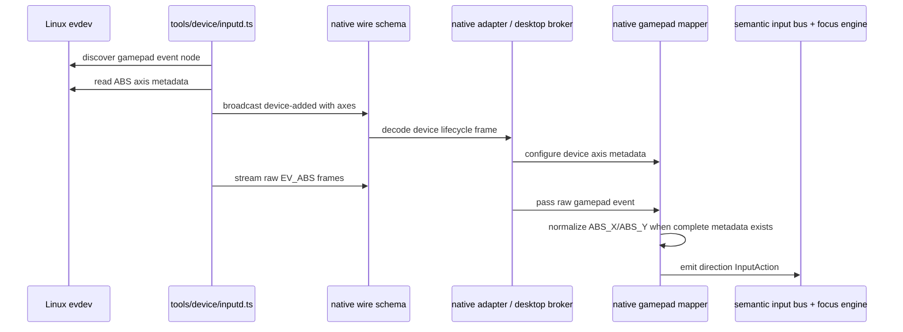

# fix: Normalize native gamepad axes from metadata

## Summary

Replace Korri's low-range left-stick device shim with a metadata-driven native input path: inputd reads evdev axis ranges, sends them through the native wire contract, and the gamepad mapper normalizes left-stick movement before emitting the same semantic navigation actions. The plan keeps UI and navigation components device-agnostic while making Odin/RockNix, x86 wired gamepads, and off-the-shelf controllers work from their advertised capabilities instead of per-device rules.

---

## Problem Frame

Korri currently needs the left analog stick to act as directional navigation in the kiosk shell. The pushed low-range fix solved the observed Odin/RockNix problem with a `rsinput-gamepad/*` threshold special case, but that is not durable: the next low-range controller would require another allowlist entry, and normal controllers still need their high-range behavior preserved.

Linux already exposes the structural signal Korri needs: each evdev absolute axis advertises minimum, maximum, and optional flat/deadzone metadata. Korri should use that metadata in the native input pipeline, then keep emitting device-agnostic semantic actions to the existing navigation layer.

---

## Requirements

- R1. Remove controller-specific low-range stick inference from the shared gamepad mapper; no `rsinput-gamepad/*`, AYN, Odin, or RockNix device-id/name threshold rules remain in the generic mapper path.
- R2. Normalize left-stick `ABS_X`/`ABS_Y` values from evdev axis metadata when both axes are available, so low-range and high-range controllers cross the same normalized navigation threshold.
- R3. Preserve the existing high raw threshold fallback for devices with missing, partial, unreadable, or invalid axis metadata.
- R4. Preserve existing semantic input and navigation boundaries: downstream code receives `InputAction` events, not raw axis data or device-specific policy.
- R5. Keep device lifecycle safe across startup, hotplug, inputd reconnect, device removal, and metadata changes by clearing stale per-device mapper state when a device identity is removed or replaced.
- R6. Preserve existing button, D-pad, hat-axis, repeat, stale-release, and active-window gating behavior while changing analog stick scaling.
- R7. Cover the metadata path with focused tests at the inputd, wire-schema, adapter/broker, and mapper layers.

**Origin actors:** A1 Player/operator, A2 x86 live USB kiosk
**Origin flows:** F1 Boot into Korri kiosk
**Origin acceptance examples:** AE2 covers keyboard/gamepad navigation availability

---

## Scope Boundaries

- Do not add new per-device threshold tables, name allowlists, or product-specific controller profiles for this fix.
- Do not change React components, theme components, or the spatial navigation algorithm; this work stays in the native input adapter pipeline.
- Do not mediate raw gameplay input or change how launched games/Moonlight receive controller input; this work only affects Korri shell semantic navigation while the shell input path is active.
- Do not add Bluetooth pairing, controller assignment, or multi-player controller ownership UI.
- Do not add right-stick, trigger, or nonstandard-left-stick axis mapping unless a target device proves it is required during implementation.

### Deferred to Follow-Up Work

- User/operator diagnostics for “controller detected but analog metadata unavailable” can be added later if raw fallback proves hard to troubleshoot.
- Hysteresis or a configurable normalized deadzone can be added later if real-device validation shows threshold chatter near the activation boundary.
- Multi-controller ownership policy can be planned separately if two connected controllers controlling the shell becomes a product issue.

---

## Context & Research

### Relevant Code and Patterns

- `tools/device/inputd.ts` owns evdev discovery, event streaming, shortcut suppression, and WebSocket broadcast.
- `korri/shared/input/native/wire-schema.ts` is the Effect Schema contract for native input frames.
- `korri/shared/input/native/discover-devices.ts` parses `/proc/bus/input/devices` and classifies native devices without opening evdev nodes.
- `korri/shared/input/native/gamepad-mapper.ts` is the raw-native-gamepad to semantic-`InputAction` mapper and is the right place to normalize analog navigation.
- `korri/shared/input/native-adapter.ts` handles renderer-direct native WebSocket input and should configure/reset mapper device metadata from lifecycle frames.
- `korri/shared/input/desktop-input-broker-core.ts` handles the Electrobun-main broker path and should apply the same mapper lifecycle semantics as the renderer-direct native adapter.
- `korri/deploy/desktop/input-broker.test.ts`, `korri/shared/input/native-adapter.test.ts`, `korri/shared/input/native/gamepad-mapper.test.ts`, `tools/device/inputd.test.ts`, and `korri/shared/input/native/wire-schema.test.ts` are the focused test surfaces.

### Institutional Learnings

- `docs/solutions/best-practices/decoupled-spatial-navigation-2026-05-01.md` establishes the boundary: input adapters translate device details into semantic actions; components and navigation should not know controller-specific details.
- `docs/solutions/best-practices/pointer-aware-spatial-navigation-2026-05-01.md` reinforces structural, adapter-owned input provenance over timing or device-specific heuristics.
- `docs/solutions/ui-bugs/electrobun-spatial-focus-active-attribute-2026-05-06.md` notes that native renderer/device validation can catch focus/input bugs that unit tests miss.

### External References

- No external research is needed for this plan. The required data comes from Linux evdev axis metadata already available to the local inputd process, and repo patterns define the desired boundary.

---

## Key Technical Decisions

- Use evdev axis metadata as the source of truth for analog scale: Linux already reports each absolute axis's advertised min/max/flat values, which is more general than device-name thresholds.
- Keep normalization inside the native gamepad mapper: inputd should report facts about devices; the mapper should decide how raw gamepad values become Korri semantic navigation.
- Require both `ABS_X` and `ABS_Y` metadata before switching a left stick to normalized mode: partial metadata could mix scaled and raw values and produce surprising dominant-axis behavior.
- Fail closed to the existing raw threshold when metadata is missing or invalid: this preserves current high-range controller behavior and avoids hidden heuristics.
- Clear state by device on lifecycle changes: stale button/axis/hold metadata can cause missed presses or phantom directions after unplug/replug, while global resets unnecessarily disrupt other controllers. A global mapper reset is reserved for whole-connection teardown only.

---

## Open Questions

### Resolved During Planning

- Should Korri keep a fallback low-range heuristic for known devices if metadata is unavailable? No. The durable direction is metadata-driven behavior; missing metadata should fail closed and be diagnosable, not reintroduce per-device rules.
- Should this alter downstream spatial navigation or product components? No. The existing semantic input boundary remains unchanged.
- Should this normalize all analog axes? No. Scope is left-stick `ABS_X`/`ABS_Y` for shell navigation; other axes remain unchanged unless implementation discovers an existing target device needs them.

### Deferred to Implementation

- Exact ioctl/FFI error handling details: implementation should match the current `inputd` style and log metadata read failures without preventing device discovery.
- Exact invalid-metadata guard shape: implementation should clamp safely and fall back when ranges cannot produce a meaningful normalized value.
- Exact device-removal mapper API shape: implementation may use a `clearDevice(deviceId)` method or equivalent internal helper, but completion requires per-device cleanup for `device-removed` and metadata replacement.

---

## High-Level Technical Design

> *This illustrates the intended approach and is directional guidance for review, not implementation specification. The implementing agent should treat it as context, not code to reproduce.*

---

## Implementation Units

### U1. Carry axis metadata through inputd and the native wire contract

**Goal:** Ensure inputd can discover evdev axis metadata and send it in `device-added` frames without breaking clients that only care about current device fields.

**Requirements:** R2, R3, R4, R7; origin AE2

**Dependencies:** None

**Files:**
- Modify: `tools/device/inputd.ts`
- Modify: `korri/shared/input/native/wire-schema.ts`
- Modify: `korri/shared/input/native/discover-devices.ts`
- Test: `tools/device/inputd.test.ts`
- Test: `korri/shared/input/native/wire-schema.test.ts`

**Approach:**
- Represent axis metadata as optional device information: axis code, minimum, maximum, and optional flat/deadzone.
- Keep `/proc/bus/input/devices` parsing focused on identity/class/capability discovery; read detailed axis metadata from evdev only in inputd where event nodes can be opened.
- Treat metadata read failure as non-fatal: discover and stream the device normally, omit axes, and allow downstream fallback behavior.
- Include metadata in device equality so a changed metadata set causes a remove/add lifecycle event rather than silent stale configuration.

**Patterns to follow:**
- `tools/device/inputd.ts` existing device refresh, warning logging, and event broadcast shape.
- `korri/shared/input/native/wire-schema.ts` Effect Schema classes and optional field pattern.

**Test scenarios:**
- Happy path: given a gamepad with `EV_ABS` and mocked axis metadata for `ABS_X`, when a gamepad subscriber connects, `device-added` includes that axis metadata.
- Error path: given metadata reading throws for an `EV_ABS` device, inputd still emits `device-added` without axes and logs/continues rather than dropping the device.
- Edge case: given a non-ABS device, inputd does not attempt axis metadata reads.
- Contract: native wire schema decodes and encodes `device-added` frames with and without optional axes.

**Verification:**
- Native input subscribers can receive backward-compatible device lifecycle frames.
- Axis metadata is available to consumers when evdev provides it and absent when unavailable.

---

### U2. Configure and clear mapper metadata consistently in native consumers

**Goal:** Make both native input consumers — renderer-direct native adapter and Electrobun desktop broker — configure mapper metadata from `device-added` frames and clear stale per-device state from `device-removed` frames.

**Requirements:** R4, R5, R6, R7; origin AE2

**Dependencies:** U1

**Files:**
- Modify: `korri/shared/input/native-adapter.ts`
- Modify: `korri/shared/input/desktop-input-broker-core.ts`
- Modify: `korri/shared/input/native/gamepad-mapper.ts`
- Test: `korri/shared/input/native-adapter.test.ts`
- Test: `korri/deploy/desktop/input-broker.test.ts`
- Test: `korri/shared/input/native/gamepad-mapper.test.ts`

**Approach:**
- Add or expose mapper lifecycle behavior that clears one device's axis values, holds, pressed buttons, and axis metadata without resetting unrelated devices.
- On `device-added` for gamepads, configure the mapper with that device's optional axes.
- On `device-removed`, clear that specific device. This is required completion behavior, not an optional optimization, so one controller's removal does not disrupt other connected controllers.
- Keep connection-close behavior as a full reset because the whole inputd stream state is no longer authoritative.

**Patterns to follow:**
- `korri/shared/input/native-adapter.ts` message decoding and malformed-frame warning behavior.
- `korri/shared/input/desktop-input-broker-core.ts` status counters and active-gating behavior.
- Existing mapper `reset()` safety semantics for disconnects.

**Test scenarios:**
- Happy path: renderer native adapter receives `device-added` with axes, then maps a low-range `ABS_X` value to a right direction.
- Happy path: desktop broker receives `device-added` with axes, then forwards a low-range left-stick direction to the active target.
- Edge case: `device-removed` for one gamepad clears that device's held direction and pressed buttons but does not clear another device's configured metadata.
- Integration: inputd emits remove/add for changed metadata; consumer clears stale state for the replaced device and does not reinterpret old raw axis values under the new metadata.

**Verification:**
- Both runtime input paths behave the same for metadata-backed controllers.
- Hotplug/reconnect cannot leave a stale hold or missed button press for a removed controller.

---

### U3. Normalize left-stick movement in the gamepad mapper

**Goal:** Replace raw low-range threshold special casing with normalized left-stick mapping based on per-device `ABS_X`/`ABS_Y` metadata.

**Requirements:** R1, R2, R3, R6, R7; origin AE2

**Dependencies:** U1, U2

**Files:**
- Modify: `korri/shared/input/native/gamepad-mapper.ts`
- Test: `korri/shared/input/native/gamepad-mapper.test.ts`

**Approach:**
- Store axis metadata by device id inside the mapper.
- When both `ABS_X` and `ABS_Y` metadata exist, normalize left-stick values to a `[-1, 1]` range centered on the advertised axis midpoint and use a normalized activation threshold.
- Apply kernel `flat` as a neutral zone when present.
- Clamp out-of-range values rather than trusting every event to stay within min/max.
- If metadata is missing, partial, or invalid, keep the existing raw threshold path.
- Remove any device-id or device-name branches for low-range controllers.
- Preserve dominant-axis selection and existing hold/repeat/stale-release behavior.

**Execution note:** Implement behavior test-first or verify existing tests fail against the pushed shim before changing the mapper.

**Patterns to follow:**
- Existing `stickToDirection` dominant-axis mapping and hold lifecycle in `korri/shared/input/native/gamepad-mapper.ts`.
- Existing raw-threshold tests for high-range analog movement.

**Test scenarios:**
- Happy path: metadata range `-1408..1408`, value `1000` on `ABS_X` emits right.
- Happy path: metadata range `-32768..32767`, value below normalized threshold does not emit, while a value above normalized threshold does.
- Edge case: `flat` covers small drift around center and emits no direction.
- Edge case: asymmetric min/max range still normalizes around the advertised midpoint and clamps to `[-1, 1]`.
- Error path: missing metadata keeps `rsinput-gamepad/input0` at the raw high threshold and emits nothing for value `1000`.
- Error path: partial metadata for only one axis keeps raw fallback and emits nothing for low-range values.
- Error path: complete-but-invalid metadata, such as `maximum <= minimum`, falls back to the raw high threshold rather than treating low raw values as normalized movement.
- Error path: unusable `flat` metadata, such as a flat zone that covers the full axis extent, neutralizes drift safely and does not emit navigation.
- Regression: D-pad buttons, hat axes, button actions, repeat, neutral return, and reset behavior remain unchanged.

**Verification:**
- Low-range and high-range controllers are handled by the same normalized logic when metadata is complete.
- No generic mapper code branches on RockNix/Odin/AYN/rsinput identity.

---

### U4. Validate the end-to-end device input path

**Goal:** Prove the metadata-normalized path works from inputd through the desktop/native adapter seams and remains safe on the live device path.

**Requirements:** R4, R5, R6, R7; origin AE2

**Dependencies:** U1, U2, U3

**Files:**
- Test: `tools/device/inputd.test.ts`
- Test: `korri/shared/input/native-adapter.test.ts`
- Test: `korri/deploy/desktop/input-broker.test.ts`
- Test: `korri/shared/input/native/gamepad-mapper.test.ts`

**Approach:**
- Use focused tests for each layer rather than one brittle full-system test.
- Treat physical device validation as operational evidence after automated tests pass: capture raw axis limits, confirm metadata in `device-added`, and confirm left-stick navigation in the Korri shell.
- Keep validation scoped to Korri shell navigation; do not assert gameplay/Moonlight raw input behavior as part of this fix.

**Patterns to follow:**
- Existing inputd WebSocket test server patterns in `tools/device/inputd.test.ts`.
- Existing desktop broker input server/window double patterns in `korri/deploy/desktop/input-broker.test.ts`.

**Test scenarios:**
- Integration: inputd subscribers receive `device-added` metadata before the first streamed input frame for a new or replaced device, or the consumer explicitly ignores early input until the device is configured.
- Integration: malformed or older device frames without axes are accepted and fall back safely.
- Runtime validation: on the Odin/RockNix device, either `evtest` from the target system or an inputd WebSocket capture records the shallow advertised min/max, and Korri shell navigation responds to full left-stick movement.

**Verification:**
- Focused input tests pass.
- Type checking accepts the expanded native input wire schema.
- Device validation confirms the shim is no longer needed for the observed low-range controller.

---

## System-Wide Impact

- **Interaction graph:** inputd discovery feeds native WebSocket lifecycle frames; native adapter/desktop broker configure the mapper; mapper emits semantic actions; the existing input bus and focus engine consume those actions unchanged.
- **Error propagation:** metadata read failures stay local to inputd logs and absent `axes`; consumers fall back to raw threshold behavior rather than failing the input stream.
- **State lifecycle risks:** stale axis values, held directions, and pressed buttons must be cleared per device on removal or metadata replacement to avoid phantom movement or ignored presses after hotplug without disrupting other controllers.
- **API surface parity:** renderer-direct native input and Electrobun desktop broker must share the same device lifecycle semantics.
- **Integration coverage:** tests should cover inputd-to-consumer metadata flow and device lifecycle handling, because mapper-only tests cannot prove the wire contract is wired.
- **Unchanged invariants:** product components do not import input libraries; navigation consumes semantic actions; launched games/Moonlight retain their raw controller boundary outside this shell navigation path.

---

## Risks & Dependencies

| Risk | Mitigation |
|------|------------|
| Metadata is unavailable on a real controller | Fail closed to existing raw threshold and log from inputd; avoid reintroducing device-id heuristics. |
| Metadata is present but malformed | Clamp/neutralize invalid ranges and keep fallback behavior where meaningful. |
| Device lifecycle handling differs between adapter paths | Add equivalent tests for `native-adapter` and desktop broker. |
| Normalized threshold feels too sensitive or too stiff | Start with a conservative normalized threshold and defer tuning/hysteresis unless real-device validation shows chatter. |
| The fix accidentally affects gameplay input | Keep this work inside Korri shell semantic input mapping; do not synthesize OS events or grab devices for gameplay. |

---

## Documentation / Operational Notes

- No product docs are required for the code change itself.
- If implementation uncovers a reusable lesson about evdev metadata normalization or device lifecycle cleanup, capture it later with `se-compound` after the fix is validated.
- Post-deploy validation should inspect inputd logs for metadata read warnings and verify shell navigation on at least one low-range RockNix/Odin controller and one standard high-range gamepad if available. Use `evtest` when present on the target; otherwise use an inputd WebSocket capture to record device-added axis metadata and raw axis limits.

---

## Sources & References

- **Origin document:** [../.archive/01KS923C1JWK7FJAB54SSQJ350-feat-x86-live-usb-kiosk/requirements.md](../.archive/01KS923C1JWK7FJAB54SSQJ350-feat-x86-live-usb-kiosk/requirements.md)
- Related plan: [../.archive/01KS923C1JWK7FJAB54SSQJ350-feat-x86-live-usb-kiosk/plan.md](../.archive/01KS923C1JWK7FJAB54SSQJ350-feat-x86-live-usb-kiosk/plan.md)
- Related code: `tools/device/inputd.ts`
- Related code: `korri/shared/input/native/wire-schema.ts`
- Related code: `korri/shared/input/native/gamepad-mapper.ts`
- Related code: `korri/shared/input/native-adapter.ts`
- Related code: `korri/shared/input/desktop-input-broker-core.ts`
- Institutional learning: [docs/solutions/best-practices/decoupled-spatial-navigation-2026-05-01.md](../../docs/solutions/best-practices/decoupled-spatial-navigation-2026-05-01.md)
