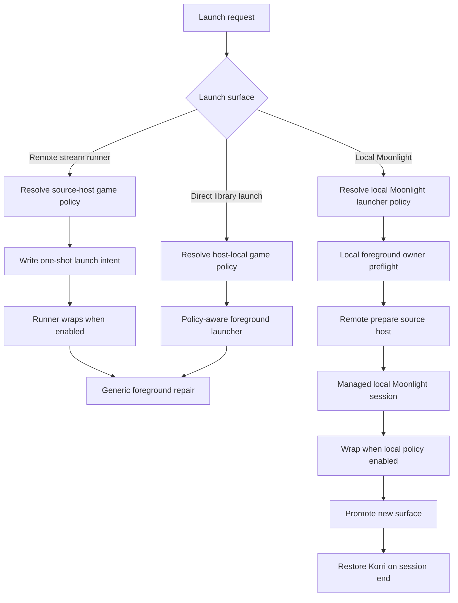

# Default Gamescope foreground launch policy

## Summary

Implement default-on Gamescope as visible resolved launch policy per foreground launch surface, carry that policy through stream, CLI, Moonlight, and direct foreground launch paths, and keep foreground/session ownership separate from wrapping. Remote game-runner policy resolves on the source host; local Moonlight policy resolves on the local kiosk/client host.

---

## Problem Frame

Korri already has much of the remote stream path: config can carry Gamescope policy, stream prepare can write policy to launch intents, and the runner can wrap when explicitly enabled. The gaps are consistency and ownership: missing policy currently means disabled, local Moonlight does not receive resolved policy, direct launch paths can drop policy, and opt-out foreground repair is not yet a first-class path.

---

## Requirements

- R1. Gamescope is enabled by default for foreground app launches. (Origin R1)
- R2. The default Gamescope policy is minimal: wrapper only, no scaling, filters, resolution forcing, quality tuning, or visual enhancement policy. (Origin R2)
- R3. Launches can opt out of Gamescope through normal resolved configuration. (Origin R3)
- R4. The default applies to all foreground app launch surfaces, including local stream clients such as Moonlight. (Origin R4)
- R5. Gamescope policy follows the existing broad-to-specific launch cascade for game-runner launches; local foreground clients use host-local global/launcher/override policy. Each host's global config serves as that host-machine default. (Origin R5)
- R6. More-specific policy wins over broader defaults, including explicit disabled values. (Origin R6)
- R7. Gamescope policy and foreground-session policy remain separate: disabling Gamescope does not disable focus/fullscreen/workspace ownership or restore behavior. (Origin R7)
- R8. Problematic apps can disable Gamescope at the narrowest appropriate layer. (Origin R8)
- R9. Resolved launch behavior should make it visible whether Gamescope was used or opted out. (Origin R9)

**Origin actors:** A1 Korri owner, A2 Player, A3 Foreground session owner, A4 Launcher adapter
**Origin flows:** F1 Default foreground launch, F2 Opt-out launch
**Origin acceptance examples:** AE1 default minimal wrapper, AE2 game opt-out, AE3 preset opt-out, AE4 foreground ownership independent of Gamescope

### Terminology

- **Host-machine default:** represented by the current host's `global` config. This plan does not add a physical-host cascade layer.
- **System layer:** the existing content/game system layer in the cascade, such as a console/platform system; it is not the physical host machine.
- **Profile:** maps to selected preset for game-runner launches in this plan. Local Moonlight policy is host-local and does not inherit remote game presets.
- **Local Moonlight launcher policy:** the local-host policy for wrapping the Moonlight client itself, resolved from the local host's global config, the local Moonlight launcher/client entry, and any local launch override.
- **Local foreground owner:** the desktop/kiosk-side lifecycle owner that supervises a launched foreground app, promotes its surface, and restores Korri. It follows the `sessiond` ownership pattern, but is not required to reuse `sessiond`'s current synchronous renderer-stop `/launch` contract directly.
- **Two-host stream launch:** the remote source host resolves policy for the remote game runner; the local kiosk/client host resolves policy for the local Moonlight foreground client. These are separate foreground surfaces with separate host defaults.

---

## Scope Boundaries

- No new physical host-machine cascade layer; host-machine defaults use that host's existing global config.
- No default scaling, filters, FSR, frame pacing, resolution forcing, or quality profiles.
- No app-id-specific compositor rule pile as the primary design.
- No requirement that every app must work under Gamescope; narrow opt-out is the supported compatibility path.
- No broad rewrite of the config cascade beyond default-on Gamescope policy and opt-out preservation.
- No full preset/profile selection UI in this plan; existing and injected game-runner launch requests should carry user/preset/override when supplied, but designing a new selector surface is follow-up work.

### Deferred to Follow-Up Work

- Broader profile/user UI for choosing presets and launch-time overrides in the desktop app.
- Collection-level launch policy and presets, which remain deferred by the config-cascade brief.
- Gamescope quality presets, filters, scaling modes, frame pacing, and per-display optimization.

---

## Context & Research

### Relevant Code and Patterns

- `korri/shared/library/config/cascade-resolver.ts` already folds `gamescope` through global, user, system, launcher, game, preset, and override layers with explicit disabled values winning.
- `korri/shared/library/config/inheritable-fields.ts` already documents tri-state `gamescope.enabled` semantics.
- `korri/products/app/api/stream/prepare.rpc-handler.ts` already resolves launch policy and writes Gamescope policy into stream launch intents.
- `korri/products/app/api/server/prepare.rpc.ts` and `korri/products/app/stream/remote-stream-client.ts` currently accept only a game id on the server prepare path; they need to carry user/preset/override for the remote runner policy and keep remote policy visibility in intents/status/logs.
- `tools/cli/stream-launch.ts` currently prepares launch intents via raw launch-spec resolution and can drop Gamescope policy.
- `tools/device/game-stream-launch-intent.ts` already carries `gamescope` next to the child launch spec.
- `tools/device/game-stream-fullscreen.ts` already composes a minimal Gamescope wrapper and repairs the resulting Sway surface, but its surface selector is Gamescope-specific.
- `tools/device/game-stream-runner.ts` already handles wrapping, preflight, requeue/failure behavior, and Sway repair when Gamescope is enabled.
- `korri/deploy/desktop/launch-bridge.ts`, `tools/cli/remote-stream-launch.ts`, and `korri/products/app/stream/moonlight-launcher.ts` are the local Moonlight bypasses: prepare remote stream, then start Moonlight with no local Moonlight launcher policy.
- `tools/device/sessiond.ts` and `tools/device/sessiond-sway.ts` provide the existing home/launch/restore and Sway repair pattern.
- `nix/modules/korri-game-stream.nix` already makes Gamescope available for stream-runner hosts; `nix/modules/korri-kiosk.nix` needs equivalent generic availability for local kiosk foreground launches.

### Institutional Learnings

- `docs/solutions/architecture-patterns/kiosk-foreground-app-policy-over-gamescope-overlay-2026-05-24.md` — Gamescope is an adapter; foreground policy still owns focus/fullscreen/workspace/restore.
- `docs/solutions/workflow-issues/generic-game-stream-runner-validation-contract-2026-05-19.md` — preserve the one-shot trusted launch-intent flow for remote streams.
- `docs/solutions/architecture-patterns/boot-scoped-control-plane-with-session-scoped-runner-2026-05-19.md` — keep runtime paths, ownership, and session-scoped launch behavior explicit.
- `docs/solutions/integration-issues/supervise-chromium-kiosk-session-after-game-exit-2026-05-04.md` — launch flags are not session invariants; route foreground lifecycle through the owner that restores home.
- `docs/solutions/integration-issues/one-command-odin-electrobun-deploy-needs-device-nix-and-session-env-2026-05-06.md` — GUI/session tools need explicit Wayland/Sway environment, not assumptions from an interactive shell.

### External References

- External research is not needed for this plan. The implementation extends existing repo patterns and a recently captured architecture decision. The one external constraint carried from earlier investigation is that native Wayland children may need Gamescope's Wayland exposure path; this plan treats that as minimal pass-through compatibility, not scaling/filter policy.

---

## Key Technical Decisions

- Normalize default-on policy at the resolved launch-policy / intent boundary: This keeps default behavior visible to callers and tests instead of hiding it as a runner-only fallback.
- Preserve explicit disabled values through every layer: `enabled: false` remains the narrow opt-out path and must beat the default.
- Treat args-only Gamescope policy as enabled with extra args: This preserves the natural meaning of adding wrapper args without forcing users to repeat `enabled: true`.
- Resolve policy separately per host and foreground surface: Remote prepare policy controls the source host's game runner; local Moonlight policy comes from a local Moonlight launcher policy resolver over the local host's global policy, the local Moonlight launcher policy, and any local launch override.
- Keep remote game/preset opt-outs scoped to the remote runner by default: They do not automatically disable the local Moonlight wrapper unless local Moonlight launcher policy also opts out.
- Keep Gamescope wrapping separate from foreground ownership: The wrapper prepares the child app window; the foreground owner still promotes/restores the visible session.
- Use snapshot-before-launch plus new-surface selection as the generic foreground repair strategy: Gamescope selectors are a fast path when enabled, but opt-out launches still identify and promote the new child surface.
- Use host global config as the host-machine default: This matches the user's clarification and avoids adding a new cascade layer.
- Preserve local Moonlight fallback semantics where possible: The wrapper applies around each attempted Moonlight child command, with early wrapper/child failure still allowing the existing fallback path when fallback is allowed.
- Support native Wayland children as minimal pass-through compatibility: Always include the Gamescope Wayland exposure path for local Moonlight and other native-Wayland foreground launches; do not add scaling, filters, or quality tuning.
- Planning refinement of origin R5/AE3: In a two-host stream launch, game/profile/preset opt-outs apply to the remote game-runner surface. The local Moonlight surface uses local host/global, local Moonlight launcher, and local override policy unless a future local profile UI supplies a local preset.
- Make foreground supervision first-class: The local foreground owner owns a managed child/session handle or equivalent monitor so restore happens after foreground session end, not immediately after startup.

---

## Open Questions

### Resolved During Planning

- Host-machine opt-out layer: Use existing global config on each host rather than adding a distinct physical host-machine cascade layer.
- External research: Skip; local code and institutional docs are sufficient.
- Moonlight inclusion: Include local Moonlight in default-on scope, with opt-out as the compatibility path.
- Non-Gamescope foreground repair: Use snapshot-before-launch plus new-surface selection, with optional launcher-provided criteria as a refinement.
- Nix verification gate: Include `just test-nix` in the plan verification command because kiosk/module wiring is in scope.
- Local Moonlight launcher policy: Use a narrow policy-only helper over local global, local Moonlight launcher policy, and local launch override; do not require a game id or synthetic library game.

### Deferred to Implementation

- Remote policy diagnostics: Avoid expanding prepare RPC responses for diagnostics-only needs; prefer launch intent contents, runner status, and structured logs unless a current caller needs a response field for behavior.
- Exact expiry wording for remote prepared intents after local launch failure: active cancellation is deferred; implementation should rely on existing intent expiry and make the partial failure visible.
- Exact foreground owner runtime placement: It may live in the desktop runtime or a nearby device tool module, but it must satisfy the managed-process and restore contract.

---

## High-Level Technical Design

> *This illustrates the intended approach and is directional guidance for review, not implementation specification. The implementing agent should treat it as context, not code to reproduce.*

Policy normalization happens before execution. Execution then splits into adapter behavior (Gamescope wrapping) and session behavior (foreground promotion, supervision, and restore).

---

## Implementation Units

### U1. Normalize default Gamescope policy across resolved launches

**Goal:** Make absent Gamescope policy resolve to enabled by default, while preserving explicit disabled values and existing cascade semantics.

**Requirements:** R1, R2, R3, R5, R6, R8; AE1, AE2, AE3

**Dependencies:** None

**Files:**
- Modify: `korri/shared/library/config/cascade-resolver.ts`
- Modify: `korri/shared/library/config/inheritable-fields.ts`
- Modify: `korri/shared/library/config/resolved-launch-context.ts`
- Modify: `korri/shared/library/proseql/library-repository.ts`
- Modify: `korri/shared/library/library-source-layer-live.ts`
- Modify: `korri/shared/library/rocknix/rocknix-source.ts`
- Modify: `korri/shared/library/rocknix/rocknix-source.test.ts`
- Test: `korri/shared/library/config/cascade-resolver.test.ts`
- Test: `korri/shared/library/config/inheritable-fields.test.ts`
- Test: `korri/shared/library/proseql/library-repository.test.ts`
- Test: `korri/shared/library/proseql/proseql-library-source.test.ts`
- Test: `korri/shared/library/rocknix/rocknix-source.test.ts`

**Approach:**
- Add one shared policy-normalization boundary for resolved launch contexts.
- Ensure the product default is enabled when no layer expresses a Gamescope opinion.
- Preserve explicit disabled values and inherited/merged args.
- Treat each host's global config as the broad host-level opt-out point.
- Ensure `inherit: false` does not accidentally erase the product default unless that layer explicitly disables Gamescope.
- Make ROCKNIX mode policy-aware by combining ROCKNIX-discovered launch specs with the normal Korri/YAML policy overlay rather than returning spec-only launches.

**Patterns to follow:**
- Existing field-level cascade behavior in `korri/shared/library/config/cascade-resolver.ts`.
- Existing strict schema and tri-state comments in `korri/shared/library/config/inheritable-fields.ts`.

**Test scenarios:**
- Happy path: no `gamescope` config anywhere resolves to enabled with no extra args.
- Happy path: args-only policy resolves to enabled and preserves those args.
- Edge case: global disabled policy disables Gamescope for that host unless a narrower layer re-enables it.
- Edge case: game, launcher, preset, and override disabled values beat the default.
- Edge case: `inherit: false` without a Gamescope field does not create an accidental default-off launch.
- Integration: resolved launch output carries normalized policy through ProseQL repository APIs.
- Integration: ROCKNIX library mode returns normalized Gamescope policy rather than spec-only launches.

**Verification:**
- Resolved launches expose an explicit default enabled policy.
- Existing cascade behavior for launcher, env, cwd, args, and by-launcher contributions remains unchanged.
- ROCKNIX and ProseQL library modes both produce policy-aware resolved launches.

---

### U2. Carry remote runner policy through prepare, client, and CLI launch paths

**Goal:** Ensure every existing stream-preparation entry point writes normalized remote runner Gamescope policy, including game/preset/override opt-outs, without pretending that policy also controls local Moonlight.

**Requirements:** R1, R3, R5, R6, R8, R9; F1, F2; AE1, AE2, AE3

**Dependencies:** U1

**Files:**
- Modify: `korri/products/app/api/stream/prepare.rpc.ts`
- Modify: `korri/products/app/api/stream/prepare.rpc-handler.ts`
- Modify: `korri/products/app/api/server/prepare.rpc.ts`
- Modify: `korri/products/app/api/server/prepare.rpc-handler.ts`
- Modify: `korri/products/app/stream/remote-stream-client.ts`
- Modify: `korri/deploy/desktop/launch-bridge.ts`
- Modify: `tools/cli/stream-launch.ts`
- Modify: `tools/cli/remote-stream-launch.ts`
- Test: `korri/products/app/api/stream/prepare.rpc-handler.test.ts`
- Test: `korri/products/app/api/server/prepare.rpc-handler.test.ts`
- Test: `korri/products/app/stream/remote-stream-client.test.ts`
- Test: `korri/deploy/desktop/launch-bridge.test.ts`
- Test: `tools/cli/stream-launch.test.ts`
- Test: `tools/cli/remote-stream-launch.test.ts`

**Approach:**
- Extend prepare payloads/clients to carry user, selected preset, and launch override where callers can supply them.
- Do not expand prepare responses for diagnostics-only policy visibility; local Moonlight must not use remote game policy as its host default.
- Keep legacy-host fallback explicit: if an older prepare response lacks resolved policy, default local behavior should be conservative, visible, and tested.
- Move CLI stream preparation from raw launch-spec resolution to policy-aware resolved launch.

**Patterns to follow:**
- Existing stream prepare resolution in `korri/products/app/api/stream/prepare.rpc-handler.ts`.
- Existing remote prepare fallback behavior in `korri/products/app/stream/remote-stream-client.ts`.
- Existing stream CLI intent enqueue behavior in `tools/cli/stream-launch.ts`.

**Test scenarios:**
- Covers AE1. Prepared stream intent includes enabled Gamescope with no extra args when no config sets Gamescope.
- Covers AE2. Prepared stream intent includes disabled Gamescope when a game opts out.
- Covers AE3. Prepared stream intent includes disabled Gamescope when a selected preset opts out for the remote runner.
- Happy path: remote client remains compatible with server and legacy prepare while policy visibility comes from intents, status, or logs.
- Happy path: CLI stream launch writes an intent with normalized Gamescope policy.
- Edge case: args-only policy is preserved through prepare response and intent creation.
- Error path: older-host fallback without policy is explicit in tests and diagnostics.

**Verification:**
- Stream prepare, remote client, desktop bridge, and CLI launch agree on the resolved remote runner Gamescope policy for the same launch.

---

### U3. Generalize runner wrapping and foreground repair for enabled and disabled policies

**Goal:** Ensure remote stream runner launches wrap by default, raw opt-out launches still get foreground repair, and the one-shot intent contract remains intact.

**Requirements:** R1, R2, R3, R6, R7, R9; F1, F2; AE1, AE2, AE4

**Dependencies:** U1, U2

**Files:**
- Modify: `tools/device/game-stream-launch-intent.ts`
- Modify: `tools/device/game-stream-runner.ts`
- Modify: `tools/device/game-stream-fullscreen.ts`
- Test: `tools/device/game-stream-launch-intent.test.ts`
- Test: `tools/device/game-stream-runner.test.ts`
- Test: `tools/device/game-stream-fullscreen.test.ts`

**Approach:**
- Keep wrapping driven by the intent's resolved policy, not hidden runner defaults.
- Preserve existing intent freshness, claim, requeue, quarantine, and no-pending-intent behavior.
- Keep the wrapper minimal: fullscreen/borderless Gamescope, Wayland exposure when needed for Wayland children, configured extra args only, and then the child boundary.
- Generalize surface snapshot/repair helpers so the runner can repair both Gamescope-wrapped and raw opt-out foreground launches.
- Use snapshot-before-launch to ignore existing matching windows and promote the newly created surface.

**Patterns to follow:**
- Existing launch-intent store safety checks in `tools/device/game-stream-launch-intent.ts`.
- Existing wrapper composition and ignored-window repair behavior in `tools/device/game-stream-fullscreen.ts`.
- Existing runner preflight/failure/requeue behavior in `tools/device/game-stream-runner.ts`.

**Test scenarios:**
- Happy path: runner spawns the Gamescope wrapper with child command and args after the child boundary.
- Happy path: configured extra args appear on the Gamescope side and do not become child app args.
- Happy path: a native-Wayland child includes the Gamescope Wayland exposure path by default.
- Covers AE4. Disabled policy spawns the raw child and still runs generic foreground repair.
- Edge case: missing session environment required for wrapping or repair fails before child spawn and preserves existing requeue/failure behavior.
- Integration: existing Gamescope/raw child windows are ignored and the newly launched surface is repaired.
- Error path: repair failure cleans up or fails visibly according to existing runner semantics.

**Verification:**
- Remote stream runner launches are default-wrapped, opt-out launches are raw but still foreground-repaired, and intent lifecycle safety is unchanged.

---

### U4. Add managed, Gamescope-aware local Moonlight launch composition

**Goal:** Apply the same minimal default wrapper to local Moonlight launches while exposing a managed process/session contract for foreground supervision.

**Requirements:** R1, R2, R3, R4, R6, R8, R9; F1, F2; AE1, AE4

**Dependencies:** U1, U2, U3

**Files:**
- Modify: `korri/products/app/stream/moonlight-launcher.ts`
- Modify: `tools/cli/moonlight-launcher.ts`
- Test: `tools/cli/moonlight-launcher.test.ts`

**Approach:**
- Let the Moonlight launcher accept locally resolved Moonlight launcher Gamescope policy and apply the same minimal wrapper behavior as other foreground launch adapters.
- Preserve Moonlight child args and environment, including platform, mapping file, input device, app name, and host.
- Add or expose a managed child/session result for foreground-owner use; keep a compatibility wrapper for callers that only need the current started/failed outcome.
- Preserve fallback behavior when fallback is allowed by applying wrapping around each attempted child command and treating early wrapper/child failure as startup failure.
- Keep appliance-pinned non-fallback behavior intact when a configured Moonlight command is required.
- Treat Wayland exposure as part of minimal pass-through compatibility for the validated SDL/Wayland Moonlight path.

**Patterns to follow:**
- Existing Moonlight command/env/fallback behavior in `korri/products/app/stream/moonlight-launcher.ts`.
- Existing managed-child pattern in `tools/device/game-stream-runner.ts`.
- Existing wrapper composition semantics from `tools/device/game-stream-fullscreen.ts`.

**Test scenarios:**
- Covers AE1. Default Moonlight launch runs through Gamescope with minimal wrapper args and no scaling/filter args.
- Happy path: Wayland/Sobo Moonlight configuration includes the Gamescope Wayland exposure path and preserves the intended `v4l2m2m + SDL/Wayland` child environment.
- Covers AE4. Explicit Gamescope disabled launches Moonlight unwrapped but returns a managed foreground session.
- Happy path: platform, mapping file, input device, app name, and host remain child Moonlight arguments.
- Edge case: configured appliance Moonlight command remains non-fallback when fallback is disabled.
- Edge case: normal Moonlight command fallback still works under wrapping when fallback is allowed.
- Error path: SDL platform plus explicit evdev input validation remains unchanged.

**Verification:**
- Local Moonlight can be represented as a policy-aware, supervisable foreground launch without losing existing Moonlight behavior.

---

### U5. Resolve local Moonlight policy and route through the local foreground owner

**Goal:** Stop local Moonlight from being an unmanaged sibling spawn; resolve its policy on the local kiosk/client host and make it a foreground session that can promote the launched surface and restore Korri after session end.

**Requirements:** R4, R7, R8, R9; F1, F2; AE4

**Dependencies:** U2, U3, U4

**Files:**
- Modify: `korri/shared/library/config/cascade-resolver.ts`
- Modify: `korri/shared/library/config/resolved-launch-context.ts`
- Modify: `korri/shared/library/proseql/library-repository.ts`
- Modify: `korri/shared/library/proseql/proseql-library-source.ts`
- Modify: `korri/deploy/desktop/launch-bridge.ts`
- Modify: `korri/deploy/desktop/main.ts`
- Modify: `tools/cli/remote-stream-launch.ts`
- Modify: `tools/device/sessiond-sway.ts`
- Modify: `tools/device/game-stream-fullscreen.ts`
- Test: `korri/shared/library/config/cascade-resolver.test.ts`
- Test: `korri/deploy/desktop/launch-bridge.test.ts`
- Test: `tools/cli/remote-stream-launch.test.ts`
- Test: `tools/device/sessiond-sway.test.ts`
- Test: `tools/device/game-stream-fullscreen.test.ts`

**Approach:**
- Introduce a local foreground-owner seam for local app launches, using existing sessiond/Sway repair patterns without blocking the launch bridge until Moonlight exits.
- Resolve local Moonlight Gamescope policy through a narrow local Moonlight launcher-policy helper, not the game-required launch-context resolver. The helper folds the local host's global policy, the local Moonlight launcher/client entry, and any local launch override; it does not use the remote source host's game-runner policy as the local host default.
- Define the local policy source boundary explicitly in the desktop/CLI composition: load local Korri config through the existing local repository/source layer, and default to the product policy when no local config exists.
- The foreground owner must own a managed child/session handle or equivalent monitor and restore/refocus Korri after the foreground app ends or fails.
- Keep launch ordering: local input and wrapper/foreground preflight, remote prepare, local foreground launch.
- If local launch fails after remote prepare, keep the failure visible and rely on existing remote intent expiry; active cancellation/quarantine is deferred.
- Fail closed when a configured foreground owner is unavailable, rather than falling back to direct unmanaged spawn.
- Promote the launched surface whether Gamescope is enabled or disabled, using snapshot-before-launch plus new-surface selection.

**Patterns to follow:**
- State ownership and restore principles from `tools/device/sessiond.ts`.
- Sway focus/fullscreen/border repair in `tools/device/sessiond-sway.ts` and `tools/device/game-stream-fullscreen.ts`.
- Dependency-injected launch bridge tests in `korri/deploy/desktop/launch-bridge.test.ts`.

**Test scenarios:**
- Happy path: bridge performs local preflight before remote prepare.
- Happy path: bridge prepares the remote stream before local foreground launch.
- Happy path: default local Moonlight launch asks the foreground owner to run a Gamescope-wrapped managed session.
- Happy path: local host global opt-out disables local Moonlight wrapping even when the remote source host prepares a default-wrapped game runner.
- Happy path: local Moonlight launcher/client policy overrides the local global default.
- Edge case: the local Moonlight launcher-policy helper does not require a game id or synthetic library game.
- Edge case: no local config exists, so local Moonlight receives the product default enabled policy.
- Edge case: remote game/preset opt-out disables the remote runner wrapper but does not automatically disable local Moonlight wrapping.
- Covers AE4. Gamescope-disabled local Moonlight still goes through foreground ownership and restore behavior.
- Error path: foreground owner unavailable returns a failed/prepared-no-Moonlight response and does not silently direct-spawn Moonlight.
- Error path: remote prepare succeeds but local launch fails; expiry/partial-failure behavior is reported visibly.
- Edge case: concurrent/double launch while a foreground session is active is rejected or serialized predictably.
- Integration: restore happens after the managed foreground session ends, not immediately after startup.

**Verification:**
- Local Moonlight appears as a managed foreground session path in tests and restores Korri after exit/failure.

---

### U6. Make direct library launch and sessiond policy-aware

**Goal:** Remove the split-brain risk where direct library launches or sessiond launches drop Gamescope policy through raw launch-spec resolution.

**Requirements:** R1, R3, R5, R6, R7, R9

**Dependencies:** U1, U3

**Files:**
- Modify: `korri/products/app/api/library/launch.rpc.ts`
- Modify: `korri/products/app/api/library/launch.rpc-handler.ts`
- Modify: `korri/shared/library/library-services.ts`
- Modify: `korri/shared/library/session-launcher.ts`
- Modify: `tools/device/sessiond.ts`
- Test: `korri/products/app/api/library/launch.rpc-handler.test.ts`
- Test: `korri/shared/library/session-launcher.test.ts`
- Test: `tools/device/sessiond.test.ts`

**Approach:**
- Treat direct library launch as an in-scope foreground launch surface.
- Move it to policy-aware launch resolution so Gamescope policy is not dropped.
- Extend the direct launch payload to mirror stream prepare's user, preset, and override policy inputs when callers provide them.
- Decide at the session launcher boundary whether policy is applied before calling sessiond or carried to sessiond as part of a policy-bearing foreground launch request; keep the choice consistent and tested.
- Preserve sessiond's fail-closed posture when configured but unreachable or unauthorized.
- Keep direct launch foreground ownership independent from Gamescope enabled/disabled state.

**Patterns to follow:**
- Existing structured launch failure mapping in `korri/products/app/api/library/launch.rpc-handler.ts`.
- Existing sessiond fail-closed behavior in `korri/shared/library/session-launcher.ts`.
- Existing sessiond launch/restore tests in `tools/device/sessiond.test.ts`.

**Test scenarios:**
- Happy path: direct library launch resolves default enabled Gamescope policy for foreground execution.
- Covers AE2/AE3. Game or preset opt-out disables wrapping for direct launch when supplied in the launch payload.
- Covers AE4. Gamescope-disabled direct launch still goes through foreground ownership.
- Error path: sessiond-configured direct launch fails closed when sessiond is unavailable.
- Edge case: launch configuration errors still return structured launch failures.

**Verification:**
- No user-facing foreground launch path silently drops Gamescope policy.

---

### U7. Add generic kiosk Gamescope availability and evaluation coverage

**Goal:** Ensure local kiosk foreground launches can find Gamescope without platform-specific hacks.

**Requirements:** R1, R2, R4, R7, R8

**Dependencies:** U4, U5

**Files:**
- Modify: `nix/modules/korri-kiosk.nix`
- Modify: `nix/images/platforms/rocknix-sm8550.nix`
- Modify: `nix/images/platforms/x86.nix`
- Test: `tools/testing/nix/korri-kiosk-module-eval.test.ts`
- Test: `tools/testing/nix/korri-kiosk-module-eval.fixture.nix`
- Test: `tools/testing/nix/korri-rocknix-image-eval.test.ts`
- Test: `tools/testing/nix/korri-rocknix-image-eval.fixture.nix`
- Test: `tools/testing/nix/korri-image-outputs-eval.test.ts`
- Test: `tools/testing/nix/korri-image-outputs-eval.fixture.nix`

**Approach:**
- Add generic kiosk-module wiring for Gamescope availability, parallel to the existing stream-runner module's Gamescope package option.
- Keep hardware/platform modules focused on device facts and environment, not app-specific foreground rules.
- Preserve existing Moonlight platform/input environment on Sobo and x86.
- Make Nix evaluation fail clearly if a target cannot provide Gamescope.

**Patterns to follow:**
- Existing `services.korri.gameStream.gamescope.package` option in `nix/modules/korri-game-stream.nix`.
- Kiosk module ownership boundaries in `nix/modules/korri-kiosk.nix`.
- Current Nix test-harness pattern in `tools/testing/nix/`, including the batched test shape from `../.archive/01KSBMG31V2GQ4NCWTAP023Z8Y-refactor-nix-test-harness/plan.md`.

**Test scenarios:**
- Happy path: kiosk service PATH/system packages include Gamescope for local foreground launches.
- Edge case: platform Moonlight env remains present after Gamescope availability is added.
- Edge case: no Sobo-specific or Moonlight-specific Sway foreground rule is introduced.
- Error path: unsupported/missing Gamescope package surfaces as a Nix evaluation/build failure rather than runtime `command not found`.

**Verification:**
- `just test-nix` covers kiosk/module evaluation for Gamescope availability.
- Local kiosk images have Gamescope available and platform-specific configs remain policy-light.

---

### U8. Surface resolved Gamescope policy in diagnostics and validate on device

**Goal:** Make it easy to tell whether a launch used Gamescope or opted out, then validate the default and opt-out paths on device.

**Requirements:** R8, R9; F1, F2

**Dependencies:** U1, U2, U3, U4, U5, U6, U7

**Files:**
- Modify: `korri/deploy/desktop/launch-bridge.ts`
- Modify: `tools/cli/remote-stream-launch.ts`
- Modify: `tools/device/game-stream-runner.ts`
- Modify: `korri/products/app/stream/moonlight-launcher.ts`
- Test: `korri/deploy/desktop/launch-bridge.test.ts`
- Test: `tools/cli/remote-stream-launch.test.ts`
- Test: `tools/device/game-stream-runner.test.ts`
- Test: `tools/cli/moonlight-launcher.test.ts`

**Approach:**
- Add concise logging/status detail at launch boundaries that reports resolved Gamescope enabled/disabled and whether extra args were present.
- Avoid exposing sensitive paths or large env dumps.
- Validate both default-on and narrow opt-out flows on Sobo, including Moonlight and one non-Moonlight executable.

**Patterns to follow:**
- Existing structured logging style in launch bridge, stream runner, and prepare handlers.
- Existing device-validation posture from stream-runner and Sobo Moonlight platform work.

**Test scenarios:**
- Happy path: default-on launch diagnostics report Gamescope enabled without dumping child env.
- Happy path: opt-out launch diagnostics report Gamescope disabled.
- Edge case: extra args are indicated without implying default scaling/filter policy.
- Device validation: Sobo default local Moonlight launch is wrapped and foregrounded.
- Device validation: Sobo Moonlight opt-out launches unwrapped but foregrounded.
- Device validation: a generic foreground executable is wrapped and foregrounded.

**Verification:**
- A developer can distinguish default-on, opt-out, and failure states from logs/status without guessing hidden defaults.

---

## System-Wide Impact

- **Interaction graph:** Remote config resolution feeds stream prepare, launch intents, and CLI stream launch; local config resolution feeds local Moonlight launch and foreground-owner execution; direct library launch and kiosk packaging use their own host-local policy.
- **Error propagation:** Missing Gamescope/session environment should fail before unmanaged child spawn where possible; foreground-owner failures should be visible through existing structured launch responses.
- **State lifecycle risks:** Remote prepare can succeed before local Moonlight fails; this plan adds preflight first and relies on visible partial-failure diagnostics plus existing intent expiry for remaining partial failures.
- **API surface parity:** Stream prepare, server prepare, direct library launch, CLI stream launch, remote CLI launch, and desktop bridge should not disagree on which host/surface owns each Gamescope default.
- **Integration coverage:** Unit tests cover policy resolution and wrapper composition; Nix tests cover kiosk availability; device validation is still required for Sobo Moonlight and real Sway/Gamescope behavior.
- **Unchanged invariants:** Gamescope remains an app adapter, not the outer foreground policy; explicit opt-out must not bypass foreground ownership.

---

## Risks & Dependencies

| Risk | Mitigation |
|------|------------|
| Sobo Moonlight `v4l2m2m + SDL/Wayland` regresses under Gamescope | Include Wayland-child compatibility in the minimal wrapper, preserve platform env, validate Sobo default-on and opt-out paths. |
| Default-on policy becomes hidden in runner fallback behavior | Normalize policy before execution and assert it in prepare/intent tests. |
| `inherit: false` accidentally disables default-on Gamescope | Add explicit cascade tests and define product default as surviving unless disabled. |
| Local Moonlight fallback breaks under wrapper | Test wrapper-per-attempt behavior and early failure classification. |
| Foreground owner becomes coupled to Gamescope selectors | Use snapshot-before-launch plus new-surface selection and test raw opt-out launches. |
| Local foreground owner cannot restore Korri after returning from bridge | Require a managed child/session handle and tests that restore happens after session end. |
| Remote prepare leaves stale launch intents after local failure | Preflight before prepare; rely on existing expiry and make partial failure visible. |
| Local host opt-out is ignored during remote stream launch | Resolve local Moonlight policy on the local kiosk/client host, separate from the remote runner policy. |
| Gamescope missing from kiosk image | Add generic kiosk Nix wiring and `just test-nix` coverage. |
| Direct library launch remains default-off | Make direct library launch and sessiond policy-aware in U6. |

---

## Documentation / Operational Notes

- Update the config-cascade brief or follow-up docs only if implementation changes documented inheritance behavior.
- Consider updating `docs/solutions/architecture-patterns/kiosk-foreground-app-policy-over-gamescope-overlay-2026-05-24.md` after implementation to clarify the new default-on policy while preserving the adapter-vs-policy boundary.
- Device validation should be noted in the PR: default Moonlight, opt-out Moonlight, a non-Moonlight foreground executable, and remote runner fresh-intent behavior.

---

## Sources & References

- **Origin document:** [./requirements.md](./requirements.md)
- **Config cascade brief:** [docs/briefs/2026-05-21-korri-config-cascade-brief.md](../../docs/briefs/2026-05-21-korri-config-cascade-brief.md)
- **Foreground policy learning:** [docs/solutions/architecture-patterns/kiosk-foreground-app-policy-over-gamescope-overlay-2026-05-24.md](../../docs/solutions/architecture-patterns/kiosk-foreground-app-policy-over-gamescope-overlay-2026-05-24.md)
- **Stream runner validation learning:** [docs/solutions/workflow-issues/generic-game-stream-runner-validation-contract-2026-05-19.md](../../docs/solutions/workflow-issues/generic-game-stream-runner-validation-contract-2026-05-19.md)
- Related code: `korri/shared/library/config/cascade-resolver.ts`
- Related code: `tools/device/game-stream-runner.ts`
- Related code: `tools/device/game-stream-fullscreen.ts`
- Related code: `korri/deploy/desktop/launch-bridge.ts`
- Related code: `korri/products/app/stream/moonlight-launcher.ts`
- Related code: `nix/modules/korri-kiosk.nix`
