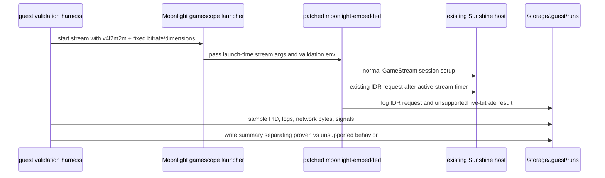

# feat: Validate Moonlight-only live settings boundaries

## Summary

This plan proves what can be validated before touching Sunshine: Moonlight can invoke an existing active-session control API, Moonlight can report runtime bitrate mutation as explicitly unsupported, and the current launch-time bitrate path can be measured without confusing restarts for live changes. If a post-request IDR frame is observed, the acceptance evidence can make the stronger claim that the existing host honored the request; otherwise the claim remains limited to Moonlight-side invocation.

---

## Problem Frame

The live-settings extension research found that true in-flight bitrate/resolution/FPS changes need Sunshine protocol and encoder work. Before doing that riskier host-side work, we need a Moonlight-only validation spike that separates proven active-session control behavior from settings that still only apply at stream start.

---

## Requirements

- R1. Prove Moonlight can invoke an existing active-session control API during a running stream without restarting Moonlight or the host app; only claim host-side reaction when post-request IDR evidence is observed.
- R2. Keep the first proof on the existing protocol surface; do not add custom Sunshine packets or require Sunshine source changes.
- R3. Add an explicit unsupported result for runtime bitrate mutation in the Moonlight-only spike so a restart path is not mislabeled as live settings.
- R4. Measure launch-time bitrate behavior through the existing `MOONLIGHT_BITRATE_KBPS` stream path, with evidence that requested bitrate, platform, dimensions, and session state were captured.
- R5. Preserve the supported SM8550 validation posture: `v4l2m2m` primary path, explicit keydir, correct `-app` usage, and durable run evidence under `/storage/.guest/runs`.
- R6. Document what was proven, what remains unsupported, and what evidence is required before proceeding to a Sunshine-side runtime-settings extension.

---

## Scope Boundaries

- No Sunshine source changes.
- No new Sunshine control packet, RTSP method, HTTP endpoint, or feature flag.
- No real live bitrate, resolution, FPS, HDR, codec, or preset mutation.
- No host app relaunch as a substitute for live settings.
- No direct V4L2/dma-buf path changes; the primary validation path remains the shipped `v4l2m2m` + SDL NV12 platform.

### Deferred to Follow-Up Work

- Sunshine-side negotiated runtime-settings control extension: separate spike after this Moonlight-only proof.
- Actual encoder bitrate reconfiguration: separate Sunshine/backend-specific implementation after protocol ack/error is proven.
- Live resolution/FPS changes: later architecture work after bitrate-only viability is known.

---

## Context & Research

### Relevant Code and Patterns

- `./requirements.md` records the two-spike direction: control-plane proof first, bitrate-only mutation later.
- `packages/moonlight-embedded/manifest.nix` is the source of truth for the downstream Moonlight patch stack.
- `packages/moonlight-embedded/patches/README.md` documents patch ordering, patch header expectations, and the dev-checkout/export workflow.
- `guest/launchers/start_moonlight_embedded_gamescope.sh` already passes launch-time stream settings to Moonlight: `MOONLIGHT_BITRATE_KBPS`, `MOONLIGHT_FPS`, `MOONLIGHT_WIDTH`, and `MOONLIGHT_HEIGHT`.
- `guest/launchers/remote-moonlight-runner.sh` already creates run directories, captures environment/host state, samples Moonlight process telemetry, extracts launch signals, and returns the evidence path.
- `guest/launchers/remote-moonlight-runtime-ab.sh` and related Moonlight runner scripts show the repo's A/B evidence style.
- `docs/acceptance/moonlight-embedded-gamescope-launcher-ab-2026-05-23.md` is the closest acceptance-doc pattern for device run evidence.

### Institutional Learnings

- `docs/solutions/tooling-decisions/moonlight-embedded-sm8550-v4l2m2m-supported-path-sobo-2026-05-23.md`: validate against `moonlight -platform v4l2m2m`; keep direct V4L2/dma-buf paths behind explicit research gates.
- `docs/solutions/integration-issues/moonlight-embedded-v4l2m2m-nv12-sdl-renderer-sobo-2026-05-23.md`: SDL NV12 presentation is the supported practical path for Sobo validation.
- `docs/solutions/integration-issues/moonlight-embedded-sobo-substrate-2026-05-22.md`: use explicit `-keydir`, correct `-app`, and watch stale Sunshine pairing/device state.
- `docs/solutions/runtime-errors/guest-moonlight-no-v4l2m2m-decoder-missing-video-passthrough-rocknix-2026-05-22.md`: any hardware-decode validation must first ensure `/dev/video*` exists in the guest.
- `docs/solutions/runtime-errors/rocknix-layer10-stale-running-state-2026-05-06.md`: runtime proof must use live process/socket/unit evidence, not stale marker files.

### External References

- External source research already completed for Moonlight/Sunshine showed no public runtime quality setter and identified `LiRequestIdrFrame()` as the existing active-session control proxy. No additional external research is needed for this Moonlight-only validation plan.

---

## Key Technical Decisions

- Use `LiRequestIdrFrame()` as the active-session control proxy: it is an existing public Moonlight control API, so it proves in-session control plumbing without inventing Sunshine behavior.
- Trigger validation through env-gated Moonlight test hooks, not normal UX: these are spike-only controls that must remain default-off and obviously experimental.
- Treat runtime bitrate as locally unsupported in this scope: Moonlight should log/report the unsupported request and avoid sending fake packets, reconnecting, or mutating launch arguments mid-stream.
- Measure launch-time bitrate separately from live mutation: launch-time bitrate changes are already valid behavior, but they prove session setup configuration rather than Option C live settings.
- Prefer runner/harness evidence over ad hoc manual notes: the spike's value depends on distinguishing same-session active control from restart/reconnect behavior.

---

## Open Questions

### Resolved During Planning

- How should the IDR proof be triggered? Use an env-gated timed Moonlight validation hook that calls the existing IDR request path once after the stream is active.
- What should “unsupported live bitrate request” mean without Sunshine changes? A local explicit unsupported result: no custom packet sent, no reconnect, and no claim of real live mutation.
- What proves the stream stayed live? Same Moonlight PID, one connection startup, no second setup/reconnect sequence, and post-event video/presentation signals in the same run directory.

### Deferred to Implementation

- Exact log wording for the validation hooks: choose clear strings during patch implementation, then make the runner extract those strings.
- Whether network byte deltas are strong enough for launch-time bitrate measurement on idle desktop content: if not, the acceptance doc must phrase the result as launch-parameter/config proof rather than throughput proof.
- Final high-motion app/scene for throughput claims: use Desktop only for initial proof unless a deterministic high-motion Sunshine app is already available.

---

## High-Level Technical Design

> *This illustrates the intended approach and is directional guidance for review, not implementation specification. The implementing agent should treat it as context, not code to reproduce.*

---

## Implementation Units

### U1. Add env-gated Moonlight validation hooks

**Goal:** Add downstream Moonlight-only hooks that can request an IDR frame during an active stream and log a local unsupported runtime-bitrate request without changing normal behavior.

**Requirements:** R1, R2, R3

**Dependencies:** None

**Files:**
- Create: `packages/moonlight-embedded/patches/0005-add-live-settings-validation-hooks.patch`
- Modify: `packages/moonlight-embedded/manifest.nix`
- Modify: `packages/moonlight-embedded/patches/README.md`
- Modify: `packages/moonlight-embedded/README.md`
- Create: `scripts/verify-moonlight-live-settings-validation-patch`

**Approach:**
- Add a default-off validation hook in the downstream patch stack, controlled by environment variables rather than normal CLI options.
- The IDR hook should fire once after the stream is active and call the existing Moonlight/common-c IDR request path.
- The runtime bitrate hook should report that live bitrate mutation is unsupported in this Moonlight-only build and must not send a custom Sunshine packet, restart the stream, or alter launch-time settings.
- Document the hook names and their spike-only status in the package README and patch README.
- Add a lightweight verification script that checks the patch is listed in `manifest.nix`, documented in `patches/README.md`, and contains the expected default-off validation controls.
- When feasible, add a post-request IDR observation marker so acceptance can distinguish “Moonlight invoked the API” from “Sunshine honored the request”; if the receiver path cannot expose this cleanly, the acceptance doc must downgrade the result.

**Execution note:** Characterization-first: confirm the current package exposes no runtime bitrate setter before adding the hook, then keep the new behavior isolated behind env gates.

**Patterns to follow:**
- Patch ordering and metadata in `packages/moonlight-embedded/manifest.nix`.
- Patch authoring rules in `packages/moonlight-embedded/patches/README.md`.
- Existing env-gated experiment style from `packages/moonlight-embedded/patches/0003-add-env-gated-v4l2m2m-pacing-experiments.patch`.

**Test scenarios:**
- Happy path: patch manifest verification sees patch `0005` listed, documented, and default-off.
- Happy path: with validation env unset, generated Moonlight behavior remains equivalent to the previous package for normal stream startup.
- Happy path: with the IDR validation env set, the running client emits a clear “IDR validation request sent” signal once during the active stream.
- Happy path: when the receiver can observe it, the client emits a post-request IDR marker after the request; otherwise the run remains valid only as Moonlight-side API invocation proof.
- Error path: with runtime bitrate validation env set, the client emits a clear unsupported result and does not reconnect or send a custom runtime-settings packet.
- Edge case: invalid runtime bitrate validation input emits an invalid/ignored result rather than being confused with a supported live mutation.

**Verification:**
- `scripts/verify-moonlight-live-settings-validation-patch` passes.
- `nix eval --impure --expr '(import packages/moonlight-embedded/manifest.nix).version'` still evaluates.
- `nix build .#moonlight-embedded --print-build-logs` produces a Moonlight binary with the validation hooks available but default-off.

---

### U2. Strengthen single-run Moonlight evidence capture

**Goal:** Extend the existing Moonlight runner so each validation run records the stream settings, same-session markers, network byte deltas, and new IDR/unsupported-live-bitrate signals.

**Requirements:** R1, R3, R4, R5

**Dependencies:** U1 for final signal strings; runner improvements can start before U1 if the extraction patterns are finalized later.

**Files:**
- Modify: `guest/launchers/remote-moonlight-runner.sh`
- Modify: `guest/launchers/start_moonlight_embedded_gamescope.sh`
- Modify: `guest/scripts/static-checks.sh`
- Test: `guest/scripts/static-checks.sh`

**Approach:**
- Record `MOONLIGHT_BITRATE_KBPS`, `MOONLIGHT_FPS`, `MOONLIGHT_WIDTH`, `MOONLIGHT_HEIGHT`, validation hook env, and platform in `env.txt`.
- Pass stream-setting env vars through to `start_moonlight_embedded_gamescope.sh` so launcher-dispatched evidence and inline fallback evidence do not diverge silently.
- Add a stale-process preflight that fails by default when multiple pre-existing Moonlight processes are found, unless an explicit disambiguation override is supplied and recorded in evidence.
- Capture same-session evidence: observed Moonlight PID, first-video count, reconnect/setup markers if present, post-event presentation/frame signals, and post-request IDR markers when available.
- Capture network byte deltas over the timed run or a post-warmup window, with clear caveats that idle content may not saturate the selected bitrate.
- Extend signal extraction for the new IDR validation and unsupported-live-bitrate log markers.
- Make local/dry-run tests executable by either teaching `start_moonlight_embedded_gamescope.sh` to honor `MOONLIGHT_GAMESCOPE_BIN` or adding an explicit runner mode that bypasses the stream launcher when exercising harness shape.

**Patterns to follow:**
- Evidence directory structure in `guest/launchers/remote-moonlight-runner.sh`.
- Existing signal extraction and telemetry summaries in the same runner.
- Shell style and syntax checking from `guest/scripts/static-checks.sh`.

**Test scenarios:**
- Happy path: dry-run or harness-mode invocation writes `env.txt` with bitrate, width, height, FPS, platform, validation-hook env, and run directory.
- Happy path: a timed run writes network sampling artifacts and telemetry summaries even when the stream exits by timeout.
- Happy path: signal extraction counts the IDR validation marker and unsupported-live-bitrate marker when those strings appear in `launch.log`.
- Edge case: no Moonlight process appears; runner writes an explicit telemetry summary rather than failing with an unhelpful shell error.
- Error path: multiple pre-existing Moonlight processes fail the run by default before validation starts, unless an explicit disambiguation override is supplied and recorded.
- Integration: settings passed through the remote runner reach `start_moonlight_embedded_gamescope.sh` rather than falling back to launcher defaults.

**Verification:**
- `bash -n guest/launchers/remote-moonlight-runner.sh` passes.
- `guest/scripts/static-checks.sh` covers the new runner invariants.
- A device run creates a single evidence directory containing environment, host state, launch log, signal counts, telemetry, and network evidence.

---

### U3. Add a focused live-settings validation harness

**Goal:** Provide a temporary spike harness that runs the Moonlight-only validation scenarios and produces a concise evidence summary without creating a stable product CLI contract.

**Requirements:** R1, R3, R4, R5, R6

**Dependencies:** U1, U2

**Files:**
- Create: `guest/launchers/remote-moonlight-live-settings-validation.sh`
- Modify: `guest/scripts/static-checks.sh`
- Test: `guest/scripts/static-checks.sh`

**Approach:**
- Build a wrapper around `guest/launchers/remote-moonlight-runner.sh`, not a parallel runner implementation.
- Document the wrapper as a temporary spike harness with retirement criteria: keep it only if repeated validation needs it after the spike; otherwise preserve the acceptance doc and remove or fold the logic back into existing runners.
- Default the primary validation path to `MOONLIGHT_PLATFORM=v4l2m2m`; require an explicit fallback flag or env value to test `sdl`.
- Run separate scenarios for active-session IDR proof, unsupported live-bitrate request proof, and launch-time bitrate comparison.
- Bound bitrate comparison tightly: fixed app/content, fixed duration, fixed two-value bitrate matrix, and no retry loop to chase a meaningful throughput delta.
- Keep launch-time bitrate comparison isolated: same host, app, platform, width, height, FPS, and duration; only `MOONLIGHT_BITRATE_KBPS` changes.
- Write a parent `evidence.md` that links child run directories and states whether each scenario was proven, unsupported, ambiguous, or failed.

**Patterns to follow:**
- A/B wrapper style from `guest/launchers/remote-moonlight-runtime-ab.sh`.
- Evidence summary style from existing Moonlight acceptance docs.

**Test scenarios:**
- Happy path: with required host/app inputs, the harness launches child runner scenarios and writes a parent evidence summary with child run paths.
- Happy path: primary mode refuses to run without `v4l2m2m` unless an explicit fallback override is present.
- Happy path: bitrate comparison changes only `MOONLIGHT_BITRATE_KBPS` between runs while preserving host/app/platform/dimensions/FPS.
- Error path: missing host returns usage exit code and does not create partial misleading evidence.
- Error path: unsupported platform override is recorded as fallback evidence and not presented as the primary Sobo result.
- Integration: the parent evidence summary links the child run directories produced by `remote-moonlight-runner.sh` and preserves their exit states.

**Verification:**
- `bash -n guest/launchers/remote-moonlight-live-settings-validation.sh` passes.
- `guest/scripts/static-checks.sh` includes syntax and invariant checks for the new harness.
- On Sobo, the harness produces a parent evidence directory that includes at least one IDR proof run, one unsupported-live-bitrate run, and a launch-time bitrate comparison.

---

### U4. Document acceptance evidence and the apply boundary

**Goal:** Capture the validation result in durable docs so later Sunshine-side work starts from a clear proof boundary instead of rediscovering what Moonlight-only validation can and cannot show.

**Requirements:** R2, R3, R4, R6

**Dependencies:** U1, U2, U3

**Files:**
- Create: `docs/acceptance/moonlight-live-settings-validation-sobo-2026-05-25.md`
- Modify: `./requirements.md`

**Approach:**
- Create the acceptance doc before final device execution so required evidence fields are known up front.
- Separate outcomes into “proven”, “explicitly unsupported in Moonlight-only scope”, and “not attempted”.
- Link the Moonlight package build fingerprint, Sobo run directories, harness command shape, stream settings, and session-stability markers.
- Update the live-settings brainstorm/spike doc with the Moonlight-only validation outcome and a clear boundary that any Sunshine-side packet/protocol/encoder work requires a separate plan.
- Avoid claiming throughput success unless the bitrate comparison evidence actually shows a meaningful delta under suitable content.

**Patterns to follow:**
- `docs/acceptance/moonlight-embedded-v4l2m2m-sobo-2026-05-23.md`.
- `docs/acceptance/moonlight-embedded-gamescope-launcher-ab-2026-05-23.md`.
- Progressive disclosure style already used in `./requirements.md`.

**Test scenarios:**
- Test expectation: none for code behavior — this unit is documentation and acceptance capture.
- Documentation review scenario: acceptance doc includes branch/commit/build identity, Sobo target, host/app, exact run directories, stream settings, result table, and conclusions.
- Documentation review scenario: doc explicitly states that no Sunshine changes and no true live bitrate mutation were performed.

**Verification:**
- Acceptance doc references real evidence directories after device execution.
- Spike doc clearly routes the next step to Sunshine-side negotiated control-plane work only after Moonlight-only evidence is complete.

---

## System-Wide Impact

- **Interaction graph:** Moonlight package patch stack feeds the built `moonlight` binary; guest launchers pass env/settings; remote runner and validation wrapper collect evidence; Sunshine remains an unmodified existing host.
- **Error propagation:** Validation hooks should report unsupported/invalid cases through logs and harness summaries, not by silently restarting or mutating launch-time settings.
- **State lifecycle risks:** Existing Moonlight pair state remains under `/storage/.cache/moonlight`; validation must not write alternate keydirs or leave stale concurrent Moonlight processes.
- **API surface parity:** No stable public user-facing CLI contract is introduced; env-gated hooks are experimental and documented as spike-only.
- **Integration coverage:** Device evidence is required because the meaningful proof is active-stream behavior on Sobo with Sunshine, not just patch compilation.
- **Unchanged invariants:** Existing stream launch shape, `-app` option usage, v4l2m2m platform defaults in shipping docs, and normal no-env behavior must remain unchanged.

---

## Risks & Dependencies

| Risk | Mitigation |
|------|------------|
| IDR request is mistaken for custom runtime settings support | Name it as an active-control proxy only; acceptance doc separates “control path proven” from “runtime settings unsupported”. |
| Timed validation hook fires before stream is actually active | Implement the hook after connection start and require post-event video/presentation evidence before marking the run proven. |
| Runtime bitrate unsupported path accidentally restarts the stream | Same-session evidence and harness checks must fail/flag reconnects instead of accepting them. |
| Launch-time bitrate comparison shows no throughput delta on idle content | Treat bitrate matrix as config/stability proof unless high-motion content provides a measurable network delta. |
| Runner validates the wrong platform | Validation harness defaults/refuses to primary-test anything other than `v4l2m2m` unless explicitly marked fallback. |
| Multiple Moonlight processes corrupt evidence | Fail by default before validation starts unless an explicit disambiguation override is supplied and recorded. |

---

## Documentation / Operational Notes

- Device validation should use Sobo with the existing paired Sunshine host and explicit `MOONLIGHT_KEYDIR=/storage/.cache/moonlight`.
- Video-only runs may set dummy audio only when explicitly documented; do not silently park audio.
- Keep `/storage/.guest/runs` evidence until the acceptance doc records the paths and summary.
- If the work surfaces a durable lesson about Moonlight/Sunshine active-control boundaries, add a follow-up `docs/solutions/` learning after execution.

---

## Sources & References

- Source document: `./requirements.md`
- Related package manifest: `packages/moonlight-embedded/manifest.nix`
- Related patch docs: `packages/moonlight-embedded/patches/README.md`
- Related launcher: `guest/launchers/start_moonlight_embedded_gamescope.sh`
- Related runner: `guest/launchers/remote-moonlight-runner.sh`
- Related learning: `docs/solutions/tooling-decisions/moonlight-embedded-sm8550-v4l2m2m-supported-path-sobo-2026-05-23.md`
