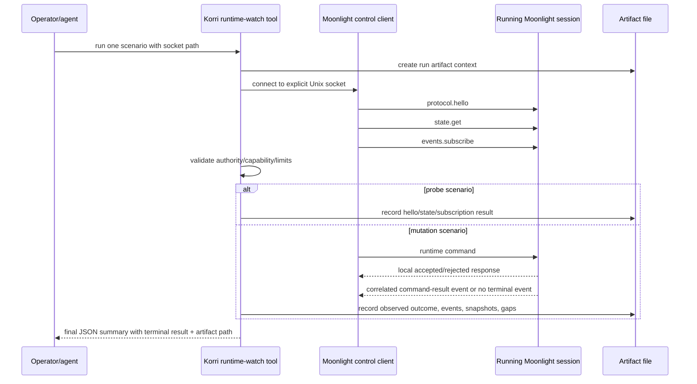

# feat: Add Korri runtime change watch tool

## Summary

Implement a small attach-only CLI/evidence tool that connects to an already-running Moonlight local control socket, runs one runtime-settings scenario, observes the correlated outcome for a bounded window, and writes a versioned JSON artifact. The plan builds on Korri's existing Moonlight local-control protocol/client work while preserving a narrow path toward future automated E2E tests.

---

## Problem Frame

The runtime settings work has outgrown one-off env runs, log greps, and temporary scripts. Operators and agents need a repeatable way to answer: "If I make this runtime change right now, what happened on the running stream?" The origin requirements define this as an attach-only diagnostic loop, not a launcher, UI, adaptation policy, or full test framework.

---

## Requirements

- R1. Provide an attach-only runtime watch flow that requires an existing Moonlight control surface and never launches or tears down Moonlight/Sunshine itself.
- R2. Support one focused scenario per invocation: capability/state probe, set bitrate, or set FPS in v1.
- R3. Validate the requested scenario against the active session's control authority, capabilities, and protocol limits before sending a mutation command.
- R4. Subscribe and observe a bounded outcome window after sending the command, reporting more than "command sent".
- R5. Write a structured, versioned JSON artifact for every parsed invocation where the artifact path can be created, including attach failures.
- R6. Distinguish terminal outcomes using one canonical vocabulary: `applied`, `probe-succeeded`, `attach-failed`, `local-rejected`, `host-rejected`, `sent-no-terminal-outcome`, `inconclusive`, `cancelled`, and `artifact-write-failed`.
- R7. Keep the scenario/result model stable enough for future non-interactive E2E automation.
- R8. Do not require packet/frame analysis or device render/decode proof in v1; leave those as future proof profiles.
- R9. Avoid overclaiming runtime resolution support; resolution is out of the first mutation set and remains proof-gated.

**Origin actors:** A1 Operator/agent, A2 Korri stream/runtime layer, A3 Moonlight session, A4 Device or stream target
**Origin flows:** F1 One-change watch run, F2 Future-testable scenario run
**Origin acceptance examples:** AE1 bitrate-change watch, AE2 attach failure, AE3 resolution proof separation, AE4 automation-readable result. AE3 is addressed only through proof-field modeling and documentation in this plan; the actual runtime-resolution command scenario is deferred.

---

## Scope Boundaries

- No Moonlight launch, Sunshine launch, app selection, pairing, reconnect, teardown, or host selection.
- No auto-discovery of active Moonlight sessions in v1; the operator provides an explicit socket path.
- No autonomous adaptation policy, restore policy, or threshold decisions.
- No product UI controls or telemetry dashboard.
- No LAN, remote API, or browser-facing control bridge.
- No full automated E2E framework in v1.
- No packet/frame capture or device render/decode proof profiles in v1.
- No runtime resolution mutation support in the first tool slice; resolution remains proof-gated through the existing acceptance docs and native mechanisms.

### Deferred to Follow-Up Work

- Active-session discovery: add an explicit discovery mode only after there is a safe active-session registry and ambiguity behavior.
- Runtime resolution scenario: add only when a proof profile can distinguish host-applied from device-rendered outcomes.
- Packet/frame and device-render evidence profiles: add as separate opt-in proof modes after the control-plane artifact is stable.
- E2E integration: consume the artifact schema from future Playwright/Nix/device tests once the operator tool proves stable.
- Product UI or adaptation service: consume the same Moonlight client and mechanism results in separate plans.

---

## Context & Research

### Relevant Code and Patterns

- `./requirements.md` defines attach-only, one-scenario, bounded observation, structured artifact, and future-E2E requirements.
- `../01KSGS9H268R0NGRBZ65PWDXNJ-feat-moonlight-local-control-protocol/plan.md` owns the Moonlight local IPC protocol, event stream, command surface, and Korri client/launcher integration.
- `../01KSGS9H27T7XSA9C26G7WKF49-feat-runtime-settings-mechanism-hardening/plan.md` owns native Moonlight/Sunshine command lifecycle, capabilities, reasons, timeouts, restore baselines, and proof gates.
- `korri/shared/stream/moonlight-control-protocol.ts` already models protocol metadata, limits, snapshots, events, runtime command requests, command responses, and runtime settings statuses.
- `korri/shared/stream/moonlight-control-client.ts` already connects to a Unix socket, sends hello/state/subscribe requests, handles interleaved event frames, detects sequence gaps, and closes cleanly.
- `korri/shared/stream/moonlight-control-client.test.ts` uses real temporary Unix socket servers and should be mirrored for new client/watch behavior.
- `tools/cli/moonlight-control.ts` is the existing minimal diagnostic CLI pattern: pure `run...Command(argv, io)` function, test-injected I/O, and `import.meta.main` wrapper.
- `tools/cli/moonlight-control.test.ts` shows the current CLI test style for connection, usage, and output errors.
- `tools/artifacts/paths.ts` centralizes `out/` artifact path conventions.
- `tools/device/game-stream-runner.ts` shows durable status writing with private runtime directories and failure-state preservation.
- `docs/acceptance/sunshine-korri-runtime-bitrate-restart-2026-05-25.md` records proven runtime bitrate/FPS semantics.
- `docs/acceptance/sunshine-korri-runtime-resolution-2026-05-26.md` records runtime resolution as server/fake-client evidence only.

### Institutional Learnings

- `docs/solutions/workflow-issues/generic-game-stream-runner-validation-contract-2026-05-19.md`: validation should rely on durable status/evidence artifacts rather than stale logs or implicit process state.
- `docs/solutions/architecture-patterns/boot-scoped-control-plane-with-session-scoped-runner-2026-05-19.md`: local control surfaces must use explicit private runtime paths and fail closed around ownership/path ambiguity.
- `docs/solutions/best-practices/prefer-real-implementations-over-mocks-2026-05-02.md`: test filesystem and socket/process seams with real temporary implementations where feasible; avoid imagined stubs.

### External References

- No external research is needed for this plan. The work follows repo-local Moonlight control protocol patterns and existing Unix-socket test coverage.

---

## Key Technical Decisions

- Require explicit `--socket <path>` in v1: this preserves attach-only behavior and avoids inventing active-session discovery before Korri has a safe registry.
- Use scenarios rather than a generic command console: `probe`, `set-bitrate`, and `set-fps` are enough to make the operator loop useful while keeping one action per run.
- Define a versioned artifact schema before building command behavior: future E2E tests need a stable result contract more than polished terminal prose.
- Extend the reusable Moonlight control client with narrow command helpers instead of teaching the CLI to hand-roll protocol frames.
- Subscribe before mutation: this minimizes missed correlated command-result events and makes the watch flow compatible with interleaved JSON-RPC responses/events.
- Treat sequence gaps as evidence-quality issues, not silent success: resnapshot when possible, mark resynced outcomes, and classify unresolved gaps as inconclusive.
- Keep resolution out of v1 mutation scenarios: the tool can observe state that mentions resolution, but must not present resolution mutation as supported without device-side proof.
- Use machine-readable terminal summaries and stable exit codes: humans can read the artifact, while agents/tests can gate on a small summary and process status.

---

## Open Questions

### Resolved During Planning

- Which first scenarios should v1 expose? Use `probe`, `set-bitrate`, and `set-fps`; defer runtime resolution mutation.
- Should v1 discover active sessions? No. Require explicit `--socket <path>` and defer discovery to a later registry-backed slice.
- What default observation window should v1 use? Use a short bounded window aligned with the native command timeout plus grace; plan around a 5-second default with a configurable timeout.
- Should attach failures write artifacts? Yes, after argument parsing and artifact directory creation, attach failures should produce artifacts because they are common diagnostics.
- How should future automation consume results? Through a versioned JSON artifact plus a final machine-readable summary and stable exit codes.

### Deferred to Implementation

- Exact CLI flag names beyond the scenario/subcommand shape: choose names that align with existing CLI conventions while preserving the one-scenario contract.
- Exact artifact JSON field names: define with tests in U1, keeping the conceptual fields from this plan stable.
- Exact event name matching for command results: align with the final Moonlight local-control implementation from `../01KSGS9H268R0NGRBZ65PWDXNJ-feat-moonlight-local-control-protocol/plan.md`.
- Exact native timeout value exposed by Moonlight: use the protocol result where available; otherwise keep the watch timeout configurable.

---

## Output Structure

    korri/shared/stream/
      moonlight-control-client.ts
      moonlight-control-client.test.ts
      moonlight-runtime-watch-artifact.ts
      moonlight-runtime-watch-artifact.test.ts
    tools/cli/
      moonlight-runtime-watch.ts
      moonlight-runtime-watch.test.ts
    tools/artifacts/
      paths.ts

The final layout may shift during implementation if the existing local-control plan has already created equivalent files, but the separation should remain: reusable protocol/client behavior under `korri/shared/stream/`, operator CLI under `tools/cli/`, artifact path constants under `tools/artifacts/`.

---

## High-Level Technical Design

> *This illustrates the intended approach and is directional guidance for review, not implementation specification. The implementing agent should treat it as context, not code to reproduce.*

Canonical terminal result vocabulary for v1:

| Terminal result | Meaning |
|---|---|
| `probe-succeeded` | Attach, hello/state/subscription, and probe artifact succeeded without mutation. |
| `applied` | The requested mutation produced a correlated applied outcome inside the selected proof profile. |
| `attach-failed` | A provided socket path could not be connected or spoke no usable protocol. |
| `local-rejected` | Korri/Moonlight rejected before dispatch because of usage-valid but unsupported authority, capability, bounds, state, or conflict. |
| `host-rejected` | Moonlight sent the command and received a terminal invalid/disabled/unsupported/failed host/runtime outcome. |
| `sent-no-terminal-outcome` | The command was locally accepted/sent, but no correlated terminal result arrived before the watch timeout. |
| `inconclusive` | Observation quality was insufficient to classify success or rejection, for example unresolved sequence gaps or ambiguous state after reconnect/close. |
| `cancelled` | The operator interrupted the watch and the tool wrote a partial artifact where possible. |
| `artifact-write-failed` | The run could not persist required evidence; this exit category takes precedence over the observed command result. |

Usage/config errors may exit before a scenario artifact exists; once invocation is parsed and an artifact path can be created, failures should use the artifact terminal vocabulary above.

---

## Implementation Units

### U1. Define runtime watch artifact and result contract

**Goal:** Establish the versioned scenario/result artifact before wiring commands so the tool is automation-ready from the first slice.

**Requirements:** R5, R6, R7, R8, R9; F2; AE4

**Dependencies:** None

**Files:**
- Create: `korri/shared/stream/moonlight-runtime-watch-artifact.ts`
- Create: `korri/shared/stream/moonlight-runtime-watch-artifact.test.ts`
- Modify: `tools/artifacts/paths.ts`

**Approach:**
- Define a small versioned artifact shape covering scenario request, socket/session context, protocol hello, pre/post snapshots, command response, observed events, sequence gaps, proof fields, terminal result, timing, and exit code.
- Model proof separately from command status so control-plane/host-applied evidence cannot be confused with device-render proof.
- Include artifact states for attach failure and cancellation; do not require a successful Moonlight connection before an artifact can exist.
- Add a dedicated artifact path under the existing `out/` layout through `tools/artifacts/paths.ts` rather than scattering literal output directories.
- Keep the schema additive: future packet/frame or device-render profiles can add fields without changing the v1 terminal vocabulary.

**Execution note:** Start test-first with decoder/encoder fixtures for success, rejection, attach failure, timeout, sequence-gap, and resolution-proof-missing artifacts.

**Patterns to follow:**
- `korri/shared/stream/moonlight-control-protocol.ts`
- `korri/shared/stream/moonlight-control-protocol.test.ts`
- `tools/artifacts/paths.ts`
- `docs/acceptance/sunshine-korri-runtime-resolution-2026-05-26.md`

**Test scenarios:**
- Happy path: decoding a successful bitrate artifact with scenario, hello, pre-snapshot, command result, event timeline, and artifact metadata succeeds.
- Happy path: decoding a probe-only artifact succeeds without a mutation command response.
- Edge case: artifact includes unknown additive fields and remains decodable.
- Edge case: runtime resolution proof fields can represent control evidence while device-render proof is `not-collected` or equivalent.
- Error path: invalid terminal result, missing scenario, missing artifact version, or malformed proof state is rejected.
- Error path: attach-failure artifact decodes without hello/state data but includes socket path and failure category.

**Verification:**
- A future test runner can consume the artifact contract without invoking the CLI.
- Artifact path conventions remain centralized under `tools/artifacts/paths.ts`.

---

### U2. Extend the Moonlight control client with narrow runtime commands

**Goal:** Add reusable command helpers and correlation primitives to the existing Moonlight control client so the watch tool does not hand-roll JSON-RPC frames.

**Requirements:** R2, R3, R4, R6; F1; AE1

**Dependencies:** U1 for result vocabulary alignment; native command support from the local-control and mechanism-hardening work must exist for live mutation behavior.

**Files:**
- Modify: `korri/shared/stream/moonlight-control-client.ts`
- Modify: `korri/shared/stream/moonlight-control-client.test.ts`

**Approach:**
- Add narrow methods for `setBitrate`, `setFps`, and any generic command-response handling needed by those methods.
- Keep the existing `hello`, `state`, `subscribe`, `onEvent`, and `close` behavior stable.
- Preserve request/response correlation while events interleave with responses.
- Surface protocol errors and JSON-RPC errors as typed client failures that the watch layer can classify.
- Do not add a generic arbitrary command bridge in v1; new methods should map to explicit protocol capabilities.

**Execution note:** Use real temporary Unix socket server tests, extending the existing client test helper rather than introducing mocks.

**Patterns to follow:**
- `korri/shared/stream/moonlight-control-client.ts`
- `korri/shared/stream/moonlight-control-client.test.ts`
- `korri/shared/stream/moonlight-control-protocol.ts`

**Test scenarios:**
- Happy path: `setBitrate` sends the expected runtime command frame and resolves a local `command.accepted` response.
- Happy path: `setFps` sends the expected runtime command frame and resolves a local `command.accepted` response.
- Happy path: a command response is correlated correctly even when a lifecycle or quality event arrives first.
- Edge case: a response for an unknown request ID is ignored without breaking pending commands.
- Edge case: `events.subscribe` returns sequence `N` and the first observed event is `N+2`; the client or watch layer detects the gap and can resnapshot rather than treating the event stream as clean.
- Edge case: a sequence gap during command observation triggers the configured gap callback without dropping the pending command response.
- Error path: JSON-RPC error response rejects the command with a typed error.
- Error path: malformed frames, blank frames, oversized frames, socket close, and protocol mismatch reject pending command promises.

**Verification:**
- The reusable client can drive runtime setting commands independently of the CLI.
- Existing hello/state/subscribe tests continue to pass unchanged or with only fixture updates.

---

### U3. Implement the attach-only scenario runner

**Goal:** Build the pure runtime-watch orchestration that connects, probes, validates, sends one scenario, observes outcomes, and returns an artifact-ready result.

**Requirements:** R1, R2, R3, R4, R6, R7, R9; F1, F2; AE1, AE2, AE4. AE3 is represented only by proof-field behavior; runtime resolution command execution remains deferred.

**Dependencies:** U1, U2. Live mutation scenarios also depend on completion of the Moonlight local-control command dispatch and Moonlight/Sunshine runtime-settings hardening work from `../01KSGS9H268R0NGRBZ65PWDXNJ-feat-moonlight-local-control-protocol/plan.md` and `../01KSGS9H27T7XSA9C26G7WKF49-feat-runtime-settings-mechanism-hardening/plan.md`; before that lands, tests should use controlled socket servers and live runs should classify mutation commands as unsupported/local-rejected.

**Files:**
- Create: `tools/cli/moonlight-runtime-watch.ts`
- Create: `tools/cli/moonlight-runtime-watch.test.ts`

**Approach:**
- Keep the core runner testable as a pure-ish function with injected connect, clock/timer, artifact write, and output I/O seams, following existing CLI command patterns.
- Require one scenario per run: `probe`, `set-bitrate`, or `set-fps`.
- Require explicit socket attachment; fail as attach error when the socket is missing, unavailable, or connection is refused.
- On every run, capture hello, pre-command state, and subscription where possible before mutation.
- Validate authority, command capability, and protocol limits before sending a mutation command.
- Subscribe before sending mutation commands so correlated command-result events are less likely to be missed.
- Watch for a matching command-result event within the bounded timeout; on sequence gap, resnapshot and classify a matching terminal `lastCommand` as resynced evidence if available.
- Treat missing terminal command results as `sent-no-terminal-outcome`; treat socket close, unresolvable sequence gaps, and ambiguous command states as `inconclusive` rather than success.
- For resolution-related state encountered in snapshots/events, record proof fields conservatively; do not add a set-resolution scenario in this unit.

**Execution note:** Start with failing tests around the scenario runner before adding terminal output polish.

**Patterns to follow:**
- `tools/cli/moonlight-control.ts`
- `tools/cli/moonlight-control.test.ts`
- `korri/shared/stream/moonlight-control-client.test.ts`
- `./requirements.md`

**Test scenarios:**
- Covers AE1. Happy path: given a socket server that supports `runtime.setBitrate`, when `set-bitrate` is run, the runner records hello/state/subscribe, local accepted response, matching applied command-result event, and terminal `applied`.
- Happy path: `set-fps` follows the same flow with FPS-specific limits and command capability.
- Happy path: `probe` records hello/state/subscription and terminal `probe-succeeded` without sending a mutation command.
- Covers AE2. Error path: provided socket path does not exist, is stale, or refuses connection; the runner produces an attach-failed terminal result and does not attempt launch or discovery.
- Error path: observer-only authority or missing command capability produces local-rejected without sending a mutation command.
- Error path: requested bitrate/FPS outside protocol limits produces local-rejected without sending a mutation command.
- Error path: command accepted but no correlated terminal event before timeout produces `sent-no-terminal-outcome`.
- Edge case: event sequence gap triggers state resnapshot; matching terminal state is accepted as resynced evidence, otherwise the result is inconclusive.
- Edge case: host invalid/disabled/unsupported/failed command-result event is classified as host-rejected rather than transport success.
- Edge case: snapshots or events mention runtime resolution but device-render proof is absent; the runner records proof as not collected and does not mark resolution as device-supported. This partially addresses AE3's proof separation without implementing a set-resolution scenario.
- Error path: operator cancellation writes a partial cancelled artifact when possible and returns cancellation status.

**Verification:**
- The scenario runner can classify every terminal state required by the origin requirements without shelling out, launching Moonlight, or scraping logs.

---

### U4. Add CLI parsing, output, artifacts, and exit-code contract

**Goal:** Turn the scenario runner into an operator/agent CLI that writes artifacts, prints a machine-readable summary, and exits with stable automation-friendly status codes.

**Requirements:** R1, R2, R5, R6, R7; F1, F2; AE1, AE2, AE4

**Dependencies:** U1, U3

**Files:**
- Modify: `tools/cli/moonlight-runtime-watch.ts`
- Modify: `tools/cli/moonlight-runtime-watch.test.ts`
- Modify: `tools/cli/korri-cli.ts` if the tool should be exposed through the umbrella Korri CLI
- Modify: `package.json` or related tooling only if an existing script/entrypoint pattern requires it

**Approach:**
- Provide a small CLI surface centered on explicit socket and one scenario: probe, set bitrate, or set FPS.
- Add timeout/artifact-output options without turning the tool into a general harness.
- Create the artifact directory before attaching so attach failures can still write evidence.
- Write pretty JSON artifacts under the configured artifact root and print a final single-line JSON summary containing terminal result, exit code, and artifact path.
- Use stable exit-code categories: success, usage/config error, attach failure, local rejection, host rejection, no terminal outcome/timeout, inconclusive observation, cancellation, and artifact-write failure.
- Ensure artifact-write failure takes precedence over a successful observed command because durable evidence is a core requirement.
- Keep human-oriented stderr concise and supplementary; automation should not need to scrape prose.

**Execution note:** Implement CLI behavior test-first around the public `run...Command(argv, io)` function.

**Patterns to follow:**
- `tools/cli/moonlight-control.ts`
- `tools/cli/moonlight-control.test.ts`
- `tools/cli/korri-cli.ts`
- `tools/artifacts/paths.ts`

**Test scenarios:**
- Covers AE4. Happy path: successful bitrate run prints one JSON summary with terminal result, exit code, and artifact path.
- Happy path: probe run exits successfully and writes a probe artifact.
- Edge case: providing multiple scenario arguments or no scenario returns usage/config error and does not connect to a socket.
- Edge case: custom timeout and artifact-output path are honored without changing scenario semantics.
- Error path: missing `--socket` returns usage/config error.
- Error path: attach failure exits with the attach-failure code and writes an attach-failure artifact when the artifact path is creatable.
- Error path: `local-rejected`, `host-rejected`, `sent-no-terminal-outcome`, `inconclusive`, and `cancelled` map to distinct documented exit codes.
- Error path: artifact write failure exits with artifact-write-failed even when the underlying scenario was otherwise successful.
- Integration: if exposed through `korri-cli.ts`, the umbrella command routes args to the same tested runner rather than duplicating parsing.

**Verification:**
- Operators and agents can run the tool non-interactively and consume either the final JSON summary or the artifact file.
- The CLI remains attach-only and one-scenario-per-run.

---

### U5. Document usage, evidence limits, and follow-up proof profiles

**Goal:** Make the tool discoverable and prevent future reviewers or agents from mistaking control-plane evidence for full media/device proof.

**Requirements:** R5, R7, R8, R9; AE4. AE3 is addressed through documentation/proof-separation language only; the runtime-resolution command scenario is deferred.

**Dependencies:** U1, U4

**Files:**
- Modify: `packages/moonlight-embedded-korri/README.md`
- Modify: `docs/acceptance/sunshine-korri-runtime-bitrate-restart-2026-05-25.md` if cross-reference wording is useful
- Modify: `docs/acceptance/sunshine-korri-runtime-resolution-2026-05-26.md` if cross-reference wording is useful
- Create: `docs/acceptance/korri-runtime-change-watch-tool-2026-05-26.md`

**Approach:**
- Document that the tool is attach-only and assumes Moonlight local control is already enabled by the active stream.
- Show the intended operator loop at a conceptual level: point at socket, run one scenario, watch result, inspect artifact.
- Document terminal result categories, exit-code categories, and artifact location.
- Explicitly state the evidence level: v1 proves control/session outcomes reported by Moonlight local control; it does not collect packet/frame or device-render proof.
- Cross-reference runtime resolution evidence and reiterate that resolution remains proof-gated.
- Record an acceptance note for a controlled socket-server smoke or live run once implementation has evidence; if live Moonlight/Sunshine is unavailable during implementation, document the controlled proof and the missing live proof honestly.

**Execution note:** Treat documentation as part of the feature; do not ship the CLI with ambiguous support claims.

**Patterns to follow:**
- `packages/moonlight-embedded-korri/README.md`
- `docs/acceptance/sunshine-korri-runtime-bitrate-restart-2026-05-25.md`
- `docs/acceptance/sunshine-korri-runtime-resolution-2026-05-26.md`

**Test scenarios:**
- Test expectation: none for prose-only documentation, but implementation should keep CLI help/output and docs aligned through tests in U4.

**Verification:**
- A reviewer can tell what the tool proves, what it does not prove, and how future proof profiles should extend it without changing v1 semantics.

---

## System-Wide Impact

- **Interaction graph:** Operator/agent invokes a tool in `tools/cli/`; the tool uses reusable code in `korri/shared/stream/` to connect to the already-running Moonlight local control socket; Moonlight/Sunshine native mechanisms provide command outcomes; the tool writes artifacts under `out/`.
- **Error propagation:** Socket/protocol failures become `attach-failed`; local validation failures become `local-rejected`; host/runtime failures become `host-rejected`; missing correlated outcomes become `sent-no-terminal-outcome`; unresolved evidence-quality problems become `inconclusive`.
- **State lifecycle risks:** The tool must avoid racing command-result events by subscribing before sending, must handle sequence gaps through resnapshot, and must not assume a stream remains valid after socket close.
- **API surface parity:** Scenario names, runtime command methods, protocol capabilities, artifact schema, CLI output, and documentation must describe the same outcome vocabulary.
- **Integration coverage:** Unit tests can prove schema/client/CLI behavior with real temp Unix sockets; live Moonlight/Sunshine evidence is useful but not required to implement the attach-only tool contract.
- **Unchanged invariants:** Moonlight launch behavior, Sunshine launch behavior, product UI, local-control protocol ownership, native runtime settings packet IDs, and resolution proof gates remain unchanged.

---

## Risks & Dependencies

| Risk | Mitigation |
|------|------------|
| Native local-control command dispatch is not ready when this plan is implemented | Implement schema/client/runner tests against controlled socket servers first; live mutation scenarios depend on `../01KSGS9H268R0NGRBZ65PWDXNJ-feat-moonlight-local-control-protocol/plan.md` and `../01KSGS9H27T7XSA9C26G7WKF49-feat-runtime-settings-mechanism-hardening/plan.md`. |
| The tool accidentally becomes a launcher or adaptation policy | Require explicit `--socket`, one scenario per run, no discovery, no launch/teardown, no restore policy, and no thresholds. |
| Future tests scrape human prose instead of stable data | Emit a final machine-readable summary and write a versioned artifact; keep stderr supplementary. |
| Event gaps produce false success | Record gaps, resnapshot, mark resynced evidence, and classify unresolved gaps as inconclusive. |
| Resolution is overclaimed from control-plane events | Do not include set-resolution in v1; model proof fields separately and document device proof as not collected. |
| Artifact writing fails after a successful command | Treat artifact-write failure as a distinct terminal error because durable evidence is a core requirement. |
| Auto-discovery becomes tempting during implementation | Keep discovery in Deferred to Follow-Up Work; explicit socket path is the v1 contract. |

---

## Documentation / Operational Notes

- The first implementation should be usable by humans and agents on a developer machine, not presented as product UI.
- Acceptance documentation should state whether evidence came from a controlled local socket server or a live Moonlight/Sunshine session.
- If the tool is exposed through the umbrella Korri CLI, keep the lower-level runner testable independently so future E2E infrastructure can reuse it.
- Resolution documentation must continue to link back to the current resolution acceptance doc rather than implying support from this tool.

---

## Sources & References

- **Origin document:** [./requirements.md](./requirements.md)
- Related plan: `../01KSGS9H268R0NGRBZ65PWDXNJ-feat-moonlight-local-control-protocol/plan.md`
- Related plan: `../01KSGS9H27T7XSA9C26G7WKF49-feat-runtime-settings-mechanism-hardening/plan.md`
- Related protocol: `korri/shared/stream/moonlight-control-protocol.ts`
- Related client: `korri/shared/stream/moonlight-control-client.ts`
- Related CLI: `tools/cli/moonlight-control.ts`
- Related artifact paths: `tools/artifacts/paths.ts`
- Related learning: `docs/solutions/workflow-issues/generic-game-stream-runner-validation-contract-2026-05-19.md`
- Related learning: `docs/solutions/architecture-patterns/boot-scoped-control-plane-with-session-scoped-runner-2026-05-19.md`
- Related learning: `docs/solutions/best-practices/prefer-real-implementations-over-mocks-2026-05-02.md`
