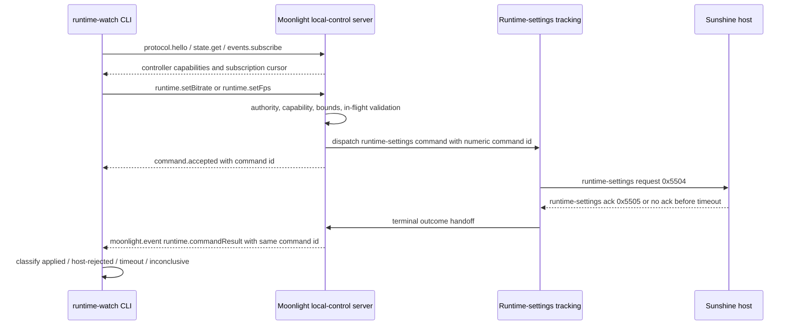
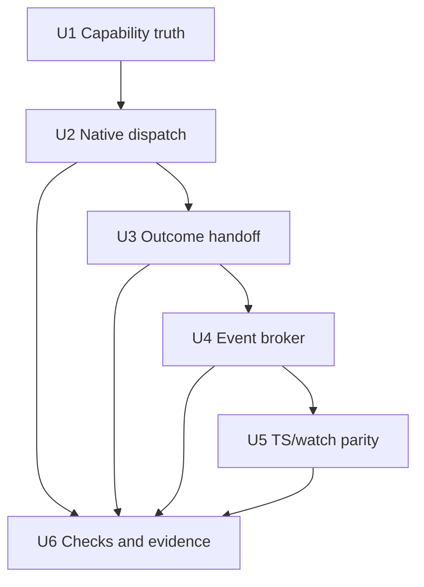

# feat: Wire Moonlight native command dispatch events

## Summary

Add the native Moonlight-Embedded slice that lets Korri's runtime-watch tool prove live bitrate/FPS mutations against a real running stream. The implementation should wire controller-authorized local-control requests into the existing Sunshine runtime-settings sender, then stream correlated terminal `runtime.commandResult` events back to subscribed clients without expanding into resolution proof, adaptation policy, UI, or remote control.

---

## Problem Frame

Korri now has the TypeScript protocol/client, artifact contract, and attach-only `moonlight-runtime-watch` CLI for probing a running Moonlight local-control socket. Native Moonlight still mostly exposes observability scaffolding: it can answer `protocol.hello`, `state.get`, and a shallow `events.subscribe`, but it does not yet dispatch `runtime.setBitrate` / `runtime.setFps` or deliver correlated command-result events. That means the watch tool can honestly report probes, local rejections, and timeouts, but cannot yet demonstrate a live mutation success path.

---

## Requirements

- R1. Native local-control must advertise mutation commands only when it can actually validate and dispatch them for the active session.
- R2. Controller-authorized `runtime.setBitrate` and `runtime.setFps` requests must validate protocol bounds, active session state, command authority, and runtime-settings capability before dispatch.
- R3. Local command acceptance must remain distinct from terminal host/runtime outcomes: a successful dispatch returns `command.accepted`; later applied/rejected/timeout/conflict outcomes arrive as correlated events or snapshots.
- R4. Runtime-settings outcomes from the native Moonlight/Sunshine path must flow into local-control `runtime.commandResult` events with stable command IDs, command names, terminal statuses, and monotonic sequence numbers.
- R5. Event subscription must support real ongoing delivery for active subscribers, not only the current one-shot snapshot event.
- R6. Late attachers and sequence-gap recovery must have a bounded state/history path through `state.get` and event history metadata.
- R7. The runtime-watch CLI must be able to classify real native outcomes as `applied`, `host-rejected`, `sent-no-terminal-outcome`, or `inconclusive` without protocol special cases.
- R8. Runtime resolution and target-client render/decode support must not be advertised as live-supported by this slice.
- R9. The local-control surface must preserve local-only security constraints: private filesystem Unix socket, same-UID peer authorization, explicit controller authority, bounded frames, bounded clients, and no arbitrary command execution.
- R10. Native patch invariants and docs must be updated so package checks catch drift between advertised capabilities, dispatch handlers, and event streaming behavior.

**Origin actors:** A1 Operator/agent, A2 Korri stream/runtime layer, A3 Moonlight session, A4 Device or stream target
**Origin flows:** F1 One-change watch run, F2 Future-testable scenario run
**Origin acceptance examples:** AE1 bitrate-change watch, AE2 attach failure, AE3 resolution proof separation, AE4 automation-readable result. This plan enables the native half of AE1 and preserves AE3 by deferring runtime-resolution mutation claims.

---

## Scope Boundaries

- No Moonlight launch, Sunshine launch, app selection, pairing, reconnect, teardown, or host selection changes.
- No auto-discovery of active Moonlight sessions; runtime-watch remains explicit-socket and attach-only.
- No product UI, telemetry dashboard, browser bridge, LAN bridge, mDNS, Tailscale, or remote-control API.
- No autonomous adaptation policy or restore policy changes.
- No runtime resolution support claim, even if existing proof-gated operation IDs remain present in lower-level runtime-settings code.
- No `runtime.requestIdr` command unless implementation discovers a safe existing native hook; this plan does not require it.
- No full native C unit-test harness if the upstream/downstream package does not already provide one cheaply.

### Deferred to Follow-Up Work

- Runtime resolution watch scenario with target-client render/decode proof.
- `runtime.requestIdr` local-control command after a concrete Moonlight hook is identified.
- Active-session socket discovery or registry-backed runtime-watch attach mode.
- Remote or browser-facing bridge over the local-control socket.
- Product adaptation service that consumes these mechanisms to make policy decisions.
- Rich media proof profiles such as packet/frame/decode/render analysis.

---

## Context & Research

### Relevant Code and Patterns

- `../01KSGS9H28PE1WJA4GRXW7TJCC-feat-runtime-change-watch-tool/requirements.md` defines the attach-only one-change watch flow, artifact requirement, terminal outcome vocabulary, and no-overclaiming boundary.
- `../01KSGS9H268R0NGRBZ65PWDXNJ-feat-moonlight-local-control-protocol/plan.md` defines the generic Moonlight local IPC protocol and explicitly separates local command acceptance from later host-applied outcomes.
- `../01KSGS9H28PE1WJA4GRXW7TJCC-feat-runtime-change-watch-tool/plan.md` defines the runtime-watch CLI/client/artifact slice that is now waiting on native mutation events for live success claims.
- `packages/moonlight-embedded-korri/patches/0006-add-local-control-observability-ipc.patch` creates the current AF_UNIX local-control server, private runtime-dir checks, peer credential checks, `protocol.hello`, `state.get`, and shallow `events.subscribe` handling.
- `packages/moonlight-embedded-korri/patches/0005a-add-sunshine-runtime-settings-protocol-sender.patch` exposes `LiSendSunshineRuntimeSettingsMvp()` and capability-query entrypoints for operations `0`, `1`, `2`, and proof-gated `3`.
- `packages/moonlight-embedded-korri/patches/0005b-track-sunshine-runtime-settings-command-outcomes.patch` tracks runtime-settings command lifecycle, timeouts, conflicts, stale acks, capability state, and applied values behind `runtime_settings_mvp_mutex`.
- `korri/shared/stream/moonlight-control-protocol.ts` already models `runtime.setBitrate`, `runtime.setFps`, `command.accepted`, `command.result`, and `runtime.commandResult` events.
- `korri/shared/stream/moonlight-control-client.ts` and `korri/shared/stream/moonlight-control-client.test.ts` already test real temporary Unix socket behavior and interleaved response/event handling.
- `tools/cli/moonlight-runtime-watch.ts` already validates capabilities/bounds, sends bitrate/FPS commands, waits for correlated `runtime.commandResult` events, resyncs after sequence gaps, and writes artifacts.
- `nix/tests/korri-moonlight-control-protocol-patch-check.nix` is the current source-invariant/build check for the Moonlight local-control patch and should be extended for command/event invariants.
- `packages/moonlight-embedded-korri/README.md` documents that mutation commands remain gated until native dispatch is wired.

### Institutional Learnings

- `docs/solutions/architecture-patterns/boot-scoped-control-plane-with-session-scoped-runner-2026-05-19.md`: shared control surfaces should derive runtime paths, ownership, and trust boundaries from explicit lifecycle configuration and fail closed around unsafe path/ownership combinations.
- `docs/solutions/workflow-issues/generic-game-stream-runner-validation-contract-2026-05-19.md`: durable status/evidence artifacts are more reliable than log interpretation; keep command runners narrow and avoid arbitrary remote-command surfaces.
- `docs/solutions/integration-issues/supervise-chromium-kiosk-session-after-game-exit-2026-05-04.md`: loopback/local-only transport is not a complete security model when the control surface can mutate a session; explicit local capabilities and fail-closed behavior still matter.
- `docs/solutions/architecture-patterns/kiosk-foreground-app-policy-over-gamescope-overlay-2026-05-24.md`: keep session/product semantics separate from app adapter details and avoid treating presentation/runtime mechanisms as proof of higher-level behavior.
- `docs/solutions/best-practices/prefer-real-implementations-over-mocks-2026-05-02.md`: test socket/process/filesystem seams with real controllable implementations where possible and avoid mocks that only prove imagined interfaces.

### External References

- No new external research is needed. This plan is dominated by repo-local native patch constraints, existing Linux AF_UNIX/socket security decisions, and the already-defined JSON-RPC/NDJSON protocol contract.

---

## Key Technical Decisions

- Add a focused follow-on Moonlight patch for command/event wiring: keep the existing observability scaffold understandable while making the new mutation/event work reviewable as its own concern.
- Keep the first native mutation set to bitrate and FPS: these are the scenarios implemented by runtime-watch and backed by the runtime-settings mechanism; resolution remains proof-gated.
- Add a narrow runtime-settings observer seam: expose only the minimum capability/outcome notification surface needed by local-control, let local-control mirror those facts, and avoid direct access to `static` runtime-settings state in `ControlStream.c`.
- Preserve JSON-RPC response correlation separately from runtime command correlation: the response envelope `id` echoes the caller's JSON-RPC ID, while `result.requestId` is the native numeric command ID used for Sunshine dispatch and later `runtime.commandResult` events.
- Treat local dispatch failures as local rejections: authority, unsupported command, invalid bounds, missing capability, not-streaming, control-not-ready, and same-family conflict should not be reported as host outcomes.
- Emit only terminal `runtime.commandResult` statuses from native event streaming: do not stream `accepted` as a command-result event because runtime-watch correctly treats accepted-without-terminal as an unresolved outcome.
- Add a bounded event broker/history inside local-control: event delivery needs subscriber tracking, monotonic sequence assignment, bounded history for late attach/gap recovery, and non-blocking behavior around stream/runtime threads.
- Use bounded subscriber slots with explicit slow-client policy: ongoing delivery may use per-client workers or an event broker loop, but it must never hold runtime-settings locks while writing to sockets and must evict or bound slow subscribers rather than backpressuring stream/runtime threads.
- Populate event timestamps from a monotonic clock when emitting ongoing events; if a platform path cannot provide this, document the fallback instead of silently leaving `monotonicMs` as a fake zero.
- Gate live command readiness on capability learning: until operation `0` capability facts have been mirrored into local-control, controller hello should omit mutation commands or report a not-ready fact rather than racing into non-deterministic watch outcomes.
- Use a callback or handoff seam from runtime-settings outcome tracking into local-control: avoid log scraping and avoid making local-control inspect runtime-settings internals by polling arbitrary logs.
- Preserve fail-closed capability advertisement: if command dispatch or capability facts are unavailable, `protocol.hello.capabilities.commands` should omit mutation commands rather than advertising commands that return `-32601`.
- Keep TypeScript protocol changes additive only: update TS/client/watch tests only when native reality requires a reason/correlation field already allowed by additive schema evolution.

---

## Open Questions

### Resolved During Planning

- Should this update the existing local-control plan or be a new plan? Create a new focused follow-up plan so completed protocol/client/watch work stays intact.
- Which commands are in the first native dispatch slice? `runtime.setBitrate` and `runtime.setFps` only.
- How should JSON-RPC request IDs map to Sunshine request IDs? Native generates and returns a numeric command ID used for Sunshine dispatch and event correlation.
- Should local rejections use host outcome vocabulary? No. Local validation/dispatch failures remain local protocol errors or immediate local terminal results; host outcomes are only emitted after a command was sent to the runtime-settings path.
- Should runtime resolution be advertised as supported? No. Keep it unadvertised for this slice unless represented only as proof-gated/experimental state with no runtime-watch success claim.

### Deferred to Implementation

- Exact patch filename and split: the intended shape is a focused follow-on patch, but implementation may fold small hook declarations into existing patches if the patch stack applies more cleanly.
- Exact native threading primitive and subscriber data structure: choose the smallest safe approach after inspecting the patched Moonlight source and avoiding stream-thread blocking.
- Exact reason-code fields in events: add reason/details fields only as additive diagnostics while preserving existing status literals and runtime-watch classification.
- Exact live validation target timing: live tests depend on a running Moonlight/Sunshine session and should be recorded as acceptance evidence after package-level checks pass.

---

## Output Structure

    packages/moonlight-embedded-korri/
      patches/
        0007-wire-local-control-runtime-command-events.patch
      README.md
      package.nix
    nix/tests/
      korri-moonlight-control-protocol-patch-check.nix
    korri/shared/stream/
      moonlight-control-protocol.test.ts
      moonlight-control-client.test.ts
    tools/cli/
      moonlight-runtime-watch.test.ts
    docs/acceptance/
      moonlight-local-control-runtime-command-events-2026-05-26.md

The exact patch filename may change if implementation discovers a cleaner split, but the intended ownership should remain: native command/event behavior in the Moonlight package, TS contract/client/watch tests for parity, Nix checks for patch invariants, and acceptance docs for live evidence.

---

## High-Level Technical Design

> *This illustrates the intended approach and is directional guidance for review, not implementation specification. The implementing agent should treat it as context, not code to reproduce.*

Plan dependency graph:

---

## Implementation Units

### U1. Make native capability advertisement truthful

**Goal:** Ensure `protocol.hello` advertises bitrate/FPS mutation commands only when native local-control can safely handle them for the active controller session.

**Requirements:** R1, R2, R8, R9, R10; F1; AE1, AE3

**Dependencies:** None

**Files:**
- Create or modify: `packages/moonlight-embedded-korri/patches/0007-wire-local-control-runtime-command-events.patch`
- Modify: `packages/moonlight-embedded-korri/package.nix`
- Modify: `packages/moonlight-embedded-korri/README.md`
- Test: `nix/tests/korri-moonlight-control-protocol-patch-check.nix`
- Test: `korri/shared/stream/moonlight-control-protocol.test.ts`

**Approach:**
- Replace the current authority-only command advertisement with a truth source that also considers local-control command dispatch readiness and mirrored runtime-settings capability facts.
- Keep observer sessions read-only.
- Advertise `runtime.setBitrate` and `runtime.setFps` only for controller sessions where the native dispatch handler exists and capability state says the operation is supported for the active host/session.
- Treat capability state as not-ready until the runtime-settings operation `0` ack has been mirrored through the local-control observer seam; update snapshots/events when it becomes ready so operators can retry intentionally.
- Keep `runtime.setResolution` out of supported commands for this slice; if exposed at all, it must remain experimental/proof-gated and unavailable to runtime-watch mutation scenarios.
- Keep limits consistent with `MOONLIGHT_CONTROL_PROTOCOL_LIMITS` and the active capability ack where available.

**Execution note:** Start characterization-first against the current drift: controller hello advertises bitrate/FPS even though native returns unsupported. U1 and U2 should land together in the follow-on patch; do not commit a standalone U1 state that permanently hides commands without dispatch support.

**Patterns to follow:**
- `packages/moonlight-embedded-korri/patches/0006-add-local-control-observability-ipc.patch`
- `packages/moonlight-embedded-korri/README.md`
- `nix/tests/korri-moonlight-control-protocol-patch-check.nix`

**Test scenarios:**
- Happy path: controller hello advertises `runtime.setBitrate` and `runtime.setFps` when native dispatch and runtime-settings capability support are present.
- Edge case: observer hello advertises no mutation commands even when runtime-settings capability support is present.
- Edge case: controller hello omits mutation commands when runtime-settings capability has not been learned yet or reports unsupported operations.
- Edge case: capability learning after startup updates local-control state/events so a client can distinguish not-ready from permanently unsupported.
- Error path: controller hello never advertises `runtime.setResolution` as supported in this slice.
- Integration: the Nix patch check fails if the patch advertises bitrate/FPS without also containing dispatch handlers for those methods.

**Verification:**
- Capability advertisement no longer drifts from native method support.
- Package/source checks prove supported commands, authority checks, and resolution non-support markers stay aligned.

---

### U2. Dispatch bitrate and FPS local-control commands into runtime settings

**Goal:** Implement native handlers for `runtime.setBitrate` and `runtime.setFps` that validate requests and dispatch accepted commands into the existing Sunshine runtime-settings sender.

**Requirements:** R2, R3, R7, R8, R9; F1; AE1, AE3

**Dependencies:** U1

**Files:**
- Create or modify: `packages/moonlight-embedded-korri/patches/0007-wire-local-control-runtime-command-events.patch`
- Modify only for minimal declarations/handoff hooks if required: `packages/moonlight-embedded-korri/patches/0005a-add-sunshine-runtime-settings-protocol-sender.patch`
- Modify only for minimal declarations/handoff hooks if required: `packages/moonlight-embedded-korri/patches/0005b-track-sunshine-runtime-settings-command-outcomes.patch`
- Test: `nix/tests/korri-moonlight-control-protocol-patch-check.nix`
- Test: `korri/shared/stream/moonlight-control-client.test.ts`

**Approach:**
- Parse JSON-RPC command params using the existing `json-c` pattern and reject malformed or missing values before dispatch.
- Validate command authority, active streaming state, protocol bounds, current runtime-settings capability support, same-family in-flight state, and minimum command interval before sending.
- Generate a native numeric command ID for accepted commands and return it in `command.accepted.result.requestId` along with the command name while preserving the original JSON-RPC envelope `id` in the response.
- Ensure accepted command IDs are distinct and monotonic enough for same-session correlation.
- Map `runtime.setBitrate` to runtime-settings operation `1` and `runtime.setFps` to operation `2`.
- Treat immediate `LiSendSunshineRuntimeSettingsMvp()` failures as local rejection or local send failure, not host-applied/rejected outcomes.
- Do not expose an arbitrary method bridge or shell-like command transport.

**Execution note:** Implement command parsing/validation test-first through the existing TS controlled-socket contract where possible, then back it with Nix patch invariants for native markers.

**Patterns to follow:**
- `packages/moonlight-embedded-korri/patches/0005a-add-sunshine-runtime-settings-protocol-sender.patch`
- `packages/moonlight-embedded-korri/patches/0005b-track-sunshine-runtime-settings-command-outcomes.patch`
- `korri/shared/stream/moonlight-control-client.test.ts`

**Test scenarios:**
- Happy path: valid bitrate request from controller returns `command.accepted` with a numeric command ID and dispatches operation `1`.
- Happy path: valid FPS request from controller returns `command.accepted` with a numeric command ID and dispatches operation `2`.
- Edge case: JSON-RPC request IDs may be strings, but response envelope IDs still echo the caller while returned command IDs used for runtime correlation are numeric and stable.
- Edge case: consecutive accepted commands receive distinct native command IDs; runtime-watch correlates only on the returned command IDs.
- Edge case: two valid same-family commands within `minCommandIntervalMs` cause the second command to be locally rejected and not dispatched.
- Edge case: bitrate/FPS values at min and max protocol bounds are accepted when capability supports them.
- Error path: missing params, non-integer params, out-of-bounds values, unknown methods, observer authority, not-streaming state, unsupported capability, proof-gated resolution, and same-family conflict are rejected locally.
- Integration: client helpers `setBitrate` and `setFps` continue to decode accepted responses without special native-only behavior.

**Verification:**
- A controller-capable native Moonlight session can accept bitrate/FPS local-control commands only after validation.
- Invalid or unsupported commands fail before dispatching runtime-settings packets.

---

### U3. Handoff runtime-settings terminal outcomes to local-control

**Goal:** Convert runtime-settings acks, rejections, timeouts, conflicts, stale acks, and stream-ended outcomes into a local-control handoff that can update snapshots and emit terminal events.

**Requirements:** R3, R4, R6, R7, R8; F1, F2; AE1, AE3, AE4

**Dependencies:** U2

**Files:**
- Create or modify: `packages/moonlight-embedded-korri/patches/0007-wire-local-control-runtime-command-events.patch`
- Modify only for minimal declarations/handoff hooks if required: `packages/moonlight-embedded-korri/patches/0005b-track-sunshine-runtime-settings-command-outcomes.patch`
- Test: `nix/tests/korri-moonlight-control-protocol-patch-check.nix`
- Test: `korri/shared/stream/moonlight-control-protocol.test.ts`

**Approach:**
- Add a narrow callback/handoff seam from runtime-settings outcome tracking into local-control rather than scraping logs.
- Expose only immutable capability/outcome facts through the seam; keep runtime-settings storage private and let local-control maintain its own mirrored snapshot.
- Map runtime-settings internal lifecycle outcomes to protocol statuses used by `runtime.commandResult` and runtime-watch classification.
- Update `state.snapshot.runtimeSettings.lastCommand` with the latest terminal command outcome so sequence-gap recovery can resync.
- Preserve stale ack and timeout diagnostics without turning stale acks into fresh successes.
- Define lock ordering so `runtime_settings_mvp_mutex` and local-control state locks cannot deadlock; copy outcome facts under the runtime-settings lock, release it, then call an explicit local-control emit helper outside the runtime-settings mutex.
- Keep resolution outcomes proof-separated and do not mark resolution as supported/device-proven.

**Execution note:** Characterize the current runtime-settings status vocabulary before changing it; the handoff should preserve existing log/evidence semantics while adding structured events.

**Patterns to follow:**
- `packages/moonlight-embedded-korri/patches/0005b-track-sunshine-runtime-settings-command-outcomes.patch`
- `korri/shared/stream/moonlight-control-protocol.ts`
- `docs/acceptance/sunshine-korri-runtime-bitrate-restart-2026-05-25.md`
- `docs/acceptance/sunshine-korri-runtime-resolution-2026-05-26.md`

**Test scenarios:**
- Happy path: applied bitrate/FPS ack maps to `runtime.commandResult` status `applied` for the same command ID.
- Error path: host/runtime rejected ack maps to a terminal rejection status such as `failed`, `invalid`, `disabled`, or `unsupported` without being classified as local rejection.
- Error path: runtime-settings timeout maps to `timed-out` and updates `lastCommand` for resync.
- Edge case: stale ack after timeout remains diagnostic and does not overwrite a terminal timeout success/failure classification.
- Edge case: stream-ended while command is in flight maps to a terminal status that runtime-watch can classify as non-applied.
- Integration: `state.get` after a command-result event contains the same command ID, command name, and terminal status in `lastCommand`.
- Integration: patch invariants include an explicit out-of-lock handoff marker or helper so emitting while holding `runtime_settings_mvp_mutex` is review-detectable.

**Verification:**
- Runtime-settings outcomes are available as structured local-control facts and no longer require log greps for correlation.
- Locking and handoff design are documented in code comments or patch structure enough for review.

---

### U4. Add bounded event subscription, delivery, and history

**Goal:** Replace one-shot `events.subscribe` behavior with bounded ongoing delivery so runtime-watch and future consumers can receive correlated command-result events reliably.

**Requirements:** R4, R5, R6, R7, R9; F1, F2; AE1, AE4

**Dependencies:** U3

**Files:**
- Create or modify: `packages/moonlight-embedded-korri/patches/0007-wire-local-control-runtime-command-events.patch`
- Test: `nix/tests/korri-moonlight-control-protocol-patch-check.nix`
- Test: `korri/shared/stream/moonlight-control-client.test.ts`
- Test: `tools/cli/moonlight-runtime-watch.test.ts`

**Approach:**
- Add a bounded event history sized to the advertised protocol limit and assign monotonic `seq` values at emission time.
- Track active subscribers up to the advertised max client limit without allowing a slow client to block stream/runtime-setting threads.
- Use bounded per-subscriber delivery state and a clear slow-client policy: evict, drop with sequence-gap visibility, or otherwise bound pending data rather than blocking emitters.
- Deliver ongoing `moonlight.event` notifications after `events.subscribe`, including `runtime.commandResult` events generated by U3.
- Populate `monotonicMs` consistently for emitted events so ordering/timing diagnostics are meaningful.
- Preserve late attach and gap semantics: `events.subscribed.seq` identifies the current cursor, and `state.get` remains the recovery path after gaps.
- Handle client disconnects, write failures, and stream teardown without leaking subscriber slots or crashing the stream process.
- Keep event payloads shallow and bounded; do not add high-frequency media/frame telemetry in this slice.

**Execution note:** Use real temp Unix socket tests on the TypeScript side for consumer behavior; native event broker correctness is protected by Nix source invariants and live acceptance until a native C test harness exists.

**Patterns to follow:**
- `packages/moonlight-embedded-korri/patches/0006-add-local-control-observability-ipc.patch`
- `korri/shared/stream/moonlight-control-client.test.ts`
- `tools/cli/moonlight-runtime-watch.test.ts`

**Test scenarios:**
- Happy path: after subscription, a later command-result event is delivered to the subscribed client without requiring another request.
- Happy path: multiple subscribed clients can receive the same command-result event up to the max-client limit.
- Edge case: sequence numbers are monotonic across lifecycle and runtime command-result events.
- Edge case: emitted events include non-zero monotonic timestamps after the event broker starts, or the fallback behavior is explicitly documented and tested.
- Edge case: a client that disconnects during delivery is removed and does not block future subscribers.
- Edge case: a subscribed client that stops reading but stays connected does not block delivery to other subscribers and is evicted or queue-bounded with sequence-gap visibility.
- Edge case: a client attempting to attach or subscribe beyond `MOONLIGHT_CONTROL_MAX_CLIENTS` is rejected or safely evicted according to the documented policy without dropping events for existing healthy subscribers.
- Edge case: event history bounds are enforced; consumers can detect a gap and resnapshot with `state.get`.
- Error path: oversized/malformed frames and unauthorized peers remain rejected before event subscription changes take effect.
- Integration: runtime-watch no longer times out in controlled socket tests when a correlated native-shaped command-result event is sent after `command.accepted`.

**Verification:**
- Subscribed clients receive ongoing command-result events with stable sequence metadata.
- Local-control still enforces max frame size, max clients, same-UID peer checks, and safe socket path checks.

---

### U5. Align TypeScript contracts and runtime-watch behavior with native reality

**Goal:** Keep the existing TS protocol, client, and runtime-watch CLI in parity with the native command/event behavior without expanding product scope.

**Requirements:** R3, R4, R6, R7, R8, R10; F1, F2; AE1, AE3, AE4

**Dependencies:** U3, U4

**Files:**
- Modify if needed: `korri/shared/stream/moonlight-control-protocol.ts`
- Modify: `korri/shared/stream/moonlight-control-protocol.test.ts`
- Modify if needed: `korri/shared/stream/moonlight-control-client.ts`
- Modify: `korri/shared/stream/moonlight-control-client.test.ts`
- Modify if needed: `tools/cli/moonlight-runtime-watch.ts`
- Modify: `tools/cli/moonlight-runtime-watch.test.ts`

**Approach:**
- Prefer no breaking TS contract changes; the current protocol already supports accepted responses, command-result events, runtime statuses, additive fields, and sequence gaps.
- Add additive reason/detail decoding only if native needs to expose structured reasons beyond the existing status vocabulary.
- Ensure runtime-watch correlates using the command ID returned by `command.accepted`, not the original JSON-RPC request ID.
- Keep runtime-watch terminal classification honest: `applied` only for correlated applied command results, `host-rejected` for terminal non-applied host/runtime statuses, `sent-no-terminal-outcome` for accepted-without-terminal, and `inconclusive` for unresolved observation gaps.
- Do not add resolution scenario flags or success claims in this unit.

**Execution note:** Continue TDD with controlled socket-server tests before touching runtime-watch classification changes.

**Patterns to follow:**
- `korri/shared/stream/moonlight-control-protocol.ts`
- `korri/shared/stream/moonlight-control-client.ts`
- `tools/cli/moonlight-runtime-watch.ts`
- `tools/cli/moonlight-runtime-watch.test.ts`

**Test scenarios:**
- Happy path: runtime-watch sends bitrate/FPS, receives `command.accepted` with native numeric command ID, then classifies a matching `runtime.commandResult` applied event as `applied`.
- Error path: a terminal non-applied `runtime.commandResult` status is classified as `host-rejected` with diagnostic reason/status in the artifact.
- Error path: accepted command with no correlated terminal event before timeout remains `sent-no-terminal-outcome`.
- Edge case: JSON-RPC request ID differs from native command ID and correlation still uses the native command ID.
- Edge case: consecutive accepted native command IDs remain distinct in artifacts and event correlation.
- Edge case: sequence gap followed by `state.get` with matching `lastCommand` classifies from the resynced snapshot.
- Edge case: runtime resolution remains unexposed by runtime-watch even if native protocol includes experimental/proof-gated metadata.
- Integration: artifacts written by controlled socket tests include command response, observed events, sequence gaps, proof fields, and terminal result in the versioned schema.

**Verification:**
- Existing TS consumers continue to decode native-shaped responses/events.
- Runtime-watch can consume the native command/event shape without overclaiming proof.

---

### U6. Refresh package checks, docs, and live acceptance evidence

**Goal:** Make the new native behavior reviewable and operationally verifiable through package checks, README updates, and captured runtime-watch artifacts.

**Requirements:** R7, R8, R9, R10; F1, F2; AE1, AE3, AE4

**Dependencies:** U1, U2, U3, U4, U5

**Files:**
- Modify: `nix/tests/korri-moonlight-control-protocol-patch-check.nix`
- Modify if check wiring changes: `flake.nix`
- Modify: `packages/moonlight-embedded-korri/README.md`
- Create: `docs/acceptance/moonlight-local-control-runtime-command-events-2026-05-26.md`
- Test: `tools/cli/moonlight-runtime-watch.test.ts`

**Approach:**
- Extend the Moonlight local-control Nix check to assert dispatch handlers, truthful capability gating, event broker/history markers, runtime-settings handoff markers, and command-result event emission markers.
- Prefer paired stable markers over loose string matches: for each advertised method literal, assert a corresponding dispatch marker; for handoff emission, assert the explicit out-of-lock helper/marker; for event streaming, assert bounded subscriber/history markers.
- Keep package build verification in the same check so source invariants are tied to a patched Moonlight binary.
- Wire the extended patch check in `flake.nix` only if the current check exposure changes or a new check attr is introduced.
- Update README docs from "mutation commands remain gated until dispatch is wired" to the narrower truth: bitrate/FPS controller commands are wired when capabilities advertise them; resolution remains proof-gated/unsupported for live success claims.
- Capture acceptance evidence from a real running stream after native/package checks pass: at minimum one successful `probe` artifact and one bitrate or FPS watch artifact that reaches `applied`.
- If an approved live environment cannot produce an applied artifact, record the exact honest outcome as `native command/event contract complete, live applied path unverified` and keep a follow-up acceptance item rather than closing the live-success claim.

**Execution note:** Live validation should be evidence-first and non-destructive. Do not restart or switch shared AKA/SOBO services without explicit user approval.

**Patterns to follow:**
- `nix/tests/korri-moonlight-control-protocol-patch-check.nix`
- `packages/moonlight-embedded-korri/README.md`
- `docs/acceptance/sunshine-korri-runtime-bitrate-restart-2026-05-25.md`
- `docs/acceptance/sunshine-korri-runtime-resolution-2026-05-26.md`

**Test scenarios:**
- Happy path: Nix check passes only when patched package builds and command/event invariant markers are present.
- Edge case: Nix check fails if commands are advertised without paired dispatch markers or if command-result event markers disappear.
- Edge case: Nix check fails if `runtime.commandResult` event emission allows non-terminal `accepted` as an event status.
- Edge case: Nix check fails if the runtime-settings handoff path lacks the explicit out-of-lock emission marker/helper.
- Edge case: documentation continues to state that runtime resolution is not device-proven by this slice.
- Integration: a runtime-watch artifact from controlled tests and, when available, a live stream artifact can be inspected by another agent without log scraping.

**Verification:**
- Patch checks and TypeScript tests pass for the command/event contract.
- At least one approved live runtime-watch artifact proves `terminal.result="applied"`; otherwise the docs explicitly mark live applied behavior as unverified follow-up rather than claiming completion.
- README and acceptance docs accurately describe what is supported, what is proof-gated, and what remains future work.

---

## System-Wide Impact

- **Interaction graph:** Runtime-watch CLI → shared Moonlight control client → native Moonlight local-control socket → runtime-settings sender/tracker → Sunshine ack path → local-control event broker → runtime-watch artifact.
- **Error propagation:** Local validation/dispatch errors stay local and should not masquerade as host rejections. Host/runtime terminal outcomes are emitted only after dispatch. Artifact write failure remains a separate runtime-watch precedence case.
- **State lifecycle risks:** Commands may be in flight during stream teardown, timeout, stale ack, or subscriber disconnect. The plan requires explicit terminal state updates and bounded cleanup for these transitions.
- **API surface parity:** Native `protocol.hello`, TS schemas, client helpers, runtime-watch classification, README docs, and Nix invariants must agree on supported commands and outcome vocabulary.
- **Integration coverage:** Unit tests over the TS socket client prove consumer semantics; Nix checks prove native patch invariants; live acceptance artifacts prove real stream behavior when an approved session is available.
- **Unchanged invariants:** Local-only AF_UNIX transport, private runtime-dir checks, same-UID peer checks, bounded JSON frames, observer/controller authority separation, no remote bridge, and no arbitrary command execution remain unchanged.

---

## Risks & Dependencies

| Risk | Mitigation |
|------|------------|
| Capability advertisement drifts from native dispatch again | Make Nix patch checks assert both advertisement and dispatch markers; centralize native command capability decisions. |
| JSON-RPC ID and Sunshine `uint32_t` command ID correlation diverge | Native generates and returns the numeric command ID in `command.accepted`; runtime-watch correlates on that ID. |
| Event delivery blocks stream or runtime-settings threads | Use bounded queues/history and perform subscriber writes outside critical runtime-settings locks. |
| Lock ordering deadlocks between runtime-settings and local-control state | Define a one-way handoff/copy pattern and avoid holding both locks while writing to clients. |
| Runtime-watch reports success from local acceptance only | Preserve `command.accepted` as non-terminal and emit only terminal command-result events for applied/rejected/timeout outcomes. |
| Resolution support is accidentally overclaimed | Do not add resolution scenario support; keep README, checks, and protocol capabilities proof-gated. |
| Source-invariant checks become string-grep theater | Tie source markers to package build output and complement them with TS controlled socket tests and live acceptance artifacts. |
| Shared-device validation mutates running services unexpectedly | Keep live validation opt-in and require explicit user approval for service restarts/switches. |

---

## Documentation / Operational Notes

- Update `packages/moonlight-embedded-korri/README.md` with the exact supported command set, authority/capability gating, event semantics, and resolution non-support boundary.
- Record runtime-watch artifacts or summaries in `docs/acceptance/moonlight-local-control-runtime-command-events-2026-05-26.md` after live validation.
- Keep any live validation wording precise: `controlPlane=observed`, `hostApply=reported`, and `deviceRender=not-collected` unless a separate proof profile is actually run.
- Do not change shared AKA/SOBO service state as part of documentation or validation without explicit user approval.

---

## Sources & References

- **Origin document:** [../01KSGS9H28PE1WJA4GRXW7TJCC-feat-runtime-change-watch-tool/requirements.md](../01KSGS9H28PE1WJA4GRXW7TJCC-feat-runtime-change-watch-tool/requirements.md)
- Related plan: [../01KSGS9H268R0NGRBZ65PWDXNJ-feat-moonlight-local-control-protocol/plan.md](../01KSGS9H268R0NGRBZ65PWDXNJ-feat-moonlight-local-control-protocol/plan.md)
- Related plan: [../01KSGS9H27T7XSA9C26G7WKF49-feat-runtime-settings-mechanism-hardening/plan.md](../01KSGS9H27T7XSA9C26G7WKF49-feat-runtime-settings-mechanism-hardening/plan.md)
- Related plan: [../01KSGS9H28PE1WJA4GRXW7TJCC-feat-runtime-change-watch-tool/plan.md](../01KSGS9H28PE1WJA4GRXW7TJCC-feat-runtime-change-watch-tool/plan.md)
- Related code: `packages/moonlight-embedded-korri/patches/0006-add-local-control-observability-ipc.patch`
- Related code: `packages/moonlight-embedded-korri/patches/0005a-add-sunshine-runtime-settings-protocol-sender.patch`
- Related code: `packages/moonlight-embedded-korri/patches/0005b-track-sunshine-runtime-settings-command-outcomes.patch`
- Related code: `korri/shared/stream/moonlight-control-protocol.ts`
- Related code: `korri/shared/stream/moonlight-control-client.ts`
- Related code: `tools/cli/moonlight-runtime-watch.ts`
- Related check: `nix/tests/korri-moonlight-control-protocol-patch-check.nix`
- Acceptance evidence: `docs/acceptance/sunshine-korri-runtime-bitrate-restart-2026-05-25.md`
- Acceptance evidence: `docs/acceptance/sunshine-korri-runtime-resolution-2026-05-26.md`
