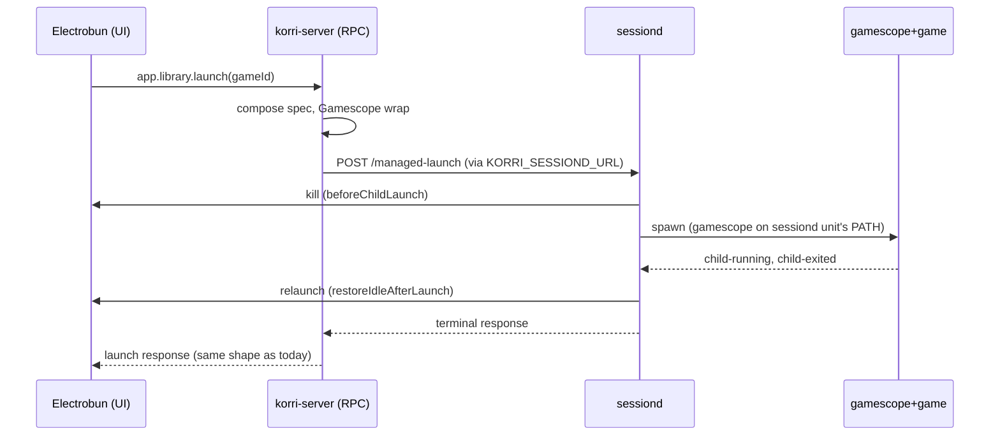

# feat: Migrate kiosk Electrobun ownership from korri-compositor to korri-sessiond

## Summary

Move kiosk-role renderer (Electrobun) lifecycle ownership from `korri-compositor.service` to `korri-sessiond.service`, completing the kiosk slice of Phase 4 that the source-machine 4C plan deferred. The supervisor code (`createKioskSessionRole` in `tools/device/sessiond-role.ts`) is already written for this; the migration is entirely Nix-side — sessiond gains the renderer env / PATH / ordering it needs to actually drive what its TypeScript code was designed to drive, and `korri-compositor.nix` stops launching Electrobun from inside the Sway config. The renderer keeps the same RPC surface and stays oblivious to who supervises it.

---

## Problem Frame

The Phase 4C plan (`../.archive/01KSKBP82HQFQW9T76W9CQJYF0-feat-foreground-session-source-machine-phase4c/plan.md`) shipped the role-pluggable supervisor and stated that `kiosk role keeps today's Electrobun + essway + Korri-home behavior`. That description matched the TypeScript role (`createKioskSessionRole` calls `renderer.launch()` in `enterIdle`, `renderer.stop()` in `beforeChildLaunch`, etc.), but did not match deployed kiosks: on Sobo the Electrobun renderer was being launched from `korri-compositor.service` via a sway `exec --no-startup-id` line wrapping `lib.getExe config.services.korri.client.package` in a `while true` loop. Sessiond was not present at all until this session's commits 2d333ff / 7be800c / bce343a / 527771e enabled the `korri-sessiond` NixOS module on the kiosk image and fixed token generation.

With sessiond now running on Sobo, its `enterIdle` (which Phase 4C kept calling `enterHome` in module-side code) tries to spawn a second Electrobun and fails because the unit has neither `HOME` / `XDG_STATE_HOME` nor the renderer-side kiosk env (`KORRI_KIOSK`, `KORRI_DESKTOP_INPUTD_URL`, `KORRI_NATIVE_BRIDGE_URL`) that the compositor unit carries today. The two attempts to launch the same renderer also race each other. The clean shape — one foreground-session owner per host, sessiond owning the renderer, the compositor owning only Sway — is what Phase 4C already assumed but the kiosk image has not yet been migrated to.

This plan does that migration with no backward compatibility for `services.korri.compositor.kiosk.{command,launcher}` — any consumer still pinning a kiosk launcher command will get an evaluation error and must move to the new shape.

---

## Requirements

- R1. `korri-sessiond.service` on kiosk images carries the env required by `buildElectrobunCommand`: `HOME`, `XDG_STATE_HOME`, `XDG_DATA_HOME`, `XDG_CONFIG_HOME`, and the kiosk-renderer env (`KORRI_KIOSK`, `KORRI_DESKTOP_INPUTD_URL`, `KORRI_NATIVE_BRIDGE_URL`) the renderer needs to attach to inputd and present as the kiosk surface. (Origin R10, R11, R18; AE3)
- R2. `korri-sessiond.service` on kiosk images includes the `services.korri.client.package` on its `path` so `korri-desktop-device` resolves, and starts after `korri-compositor.service` and `korri-inputd.service` so the Wayland socket and inputd bridge exist before `enterIdle` runs. (Origin R10, R11, R13)
- R3. `korri-compositor.service` on kiosk images no longer launches the Electrobun renderer: `swayKioskExec` is removed from the generated Sway config and the `services.korri.compositor.kiosk.{command,launcher}` options are deleted from the module API outright (no compatibility shim, no deprecation). (Origin R20)
- R4. The kiosk-renderer environment variables (`KORRI_KIOSK`, `KORRI_DESKTOP_INPUTD_URL`, `KORRI_NATIVE_BRIDGE_URL`, `KORRI_MOONLIGHT_REQUIRE_INPUTPLUMBER`) are removed from `korri-compositor.service`'s `sessionEnvironment` — Sway no longer carries renderer-side identity since it no longer spawns the renderer. (Origin R20)
- R5. `services.korri.compositor.kiosk.enable` remains as the kiosk-shape selector — it still auto-enables `services.korri.client`, `services.korri.cli`, and `services.korri.input.inputd`. The deletion in R3/R4 is scoped to renderer-launch responsibility, not the kiosk-image shape selector. (Origin R20)
- R6. The compositor module exposes `services.korri.compositor.kiosk.inputdBridgeUrl` as a read-only option (defaulted to the current `inputdBridgeUrl` derivation from `inputCfg.bridge.{host,port}`) so `kiosk.nix` can wire it onto sessiond without duplicating the host/port math. (Plan-time decision; supports R1)
- R7. NixOS-level test coverage extends `nix/tests/korri-sessiond-module-check.nix` (kiosk variant) to assert env / path / ordering invariants from R1–R2, and extends `nix/tests/korri-compositor-module-check.nix` to assert R3/R4 — the migrated Sway config contains no `exec` line for a kiosk client, and the compositor unit's environment carries no `KORRI_*` renderer keys. (Origin R17)
- R8. The renderer (`korri/products/app/**`) is not modified. The `app.library.launch` RPC contract and response shape are unchanged. Server-as-source-of-truth and dumb-client invariants are preserved. (Origin R10, R20; this session's federation invariant)
- R9. Sobo end-to-end verification: boot → sessiond ExecStartPost succeeds → Electrobun visible on the device → tap a local PICO-8 game → game runs in gamescope → exit → Electrobun returns to foreground. Federated Sobo→AKA launch still works as it did before the migration. (Origin AE3; current-session federation regression budget)
- R10. AKA migration applies the same shape via the mountainous repo (`hosts/aka/default.nix`) as a sibling commit set. AKA is x86 / not under ROCKNIX, but consumes the same `korri.nixosModules.{korri-compositor,korri-sessiond,korri-server}`, so the same env / option deletions / ordering apply. (Origin R20)

**Origin actors:** A2 Player, A3 Foreground/session owner, A5 Foreground session host, A7 Operator/agent
**Origin flows:** F1 Default foreground launch (kiosk role half), F2 Re-entry while a session is not ready
**Origin acceptance examples:** AE3 (foreground ownership preserved even when Gamescope opt-out), AE5 (busy re-entry rejection still routes through the supervisor)

---

## Scope Boundaries

- This plan does not change renderer (`korri/products/app/**` or `korri/shared/themes/**`) code. The renderer continues to call `app.library.launch` and remains oblivious to sessiond.
- This plan does not modify `korri-server.service` env or RPC wiring. The C1 commit's `KORRI_SESSIOND_URL` / `KORRI_SESSIOND_TOKEN_FILE` setup is already in place on trunk and is reused as-is.
- This plan does not modify the source-machine image, role, or test path. The 4C work is untouched.
- This plan does not extend the managed-launch wire protocol. `home-ready` / `home` mode literals stay as the kiosk-role idle target.
- This plan does not change Gamescope policy, the cascade, or opt-out semantics.
- This plan does not introduce a pidfile-based renderer reaper. The sessiond unit's default `KillMode=control-group` is judged sufficient to clean up Electrobun on sessiond restart; a pidfile reaper is a follow-up only if Sobo testing surfaces orphan-renderer behavior.
- This plan does not add an Electrobun-as-systemd-unit split. Sessiond spawns Electrobun in-process via the existing `realRendererController` runner, identical to how source-machine sessiond spawns gamescope.
- This plan does not change `korri-compositor.service`'s session bus mode, user, runtime directory, or Sway config prelude — only the kiosk-`exec` line and the kiosk-renderer environment variables are removed.

### Deferred to Follow-Up Work

- Mountainous-repo AKA migration: separate PR in `mountainous` (branch `unified`, `hosts/aka/default.nix`). U6 documents the exact shape; the commit happens in that repo, not this one.
- Pidfile-based renderer reaper: only if Sobo end-to-end testing surfaces sessiond-restart-leaves-Electrobun-alive. Otherwise the cgroup default holds.
- Removing the `KORRI_DESKTOP_INPUTD_URL` env name in favor of a more general `KORRI_INPUTD_URL` — name change is out of scope; this plan moves the existing env from compositor to sessiond verbatim.
- Retiring `services.korri.client.enable`'s auto-attach behavior. The client package install path is unchanged.
- Decoupling the compositor's `kiosk.enable` selector from the auto-enable of `cli`/`client`/`inputd` — those auto-enables stay as today.

---

## Context & Research

### Relevant Code and Patterns

- `tools/device/sessiond-role.ts` `createKioskSessionRole` — the supervisor side is already written for this end-state. `enterIdle` → `renderer.launch()`; `beforeChildLaunch` → `renderer.stop()`; `restoreIdleAfterLaunch` → `renderer.launch()`; `reconcileIdle` checks sway windows via `evaluateHomeInvariant`. No TypeScript changes needed.
- `tools/device/sessiond-electrobun.ts` `buildElectrobunCommand` — reads `process.env` for `XDG_STATE_HOME` / `HOME` via `korriStatePath`, sets `KORRI_DESKTOP_PROFILE = "device"`, propagates `KORRI_KIOSK` and inputd URLs via env inheritance, sanitizes PATH to retain `/run/current-system/sw/bin` and `/storage/bin`. Sessiond's unit env is the only thing missing.
- `nix/modules/korri-compositor.nix` — owns the existing `swayKioskExec`, `kioskClientLauncher`, `kiosk.command`, `kiosk.launcher`, and the kiosk-renderer env additions in `sessionEnvironment`. All of these get cut in U2.
- `nix/modules/korri-sessiond.nix` — already has `extraEnvironment` and `path` lists that the kiosk image sets in `nix/images/kiosk.nix`. No new option surface needed; U1 extends what kiosk.nix passes to those existing options.
- `nix/images/kiosk.nix` — the integration point. The C2 commit already wires sessiond.path with `compositor.gamescope.package` + `retroarchKiosk`. U1 adds `services.korri.client.package` to that path and adds the env vars to `extraEnvironment`.
- `nix/images/source-machine.nix` — reference for the "sessiond owns the renderer" pattern. Source-machine doesn't launch Electrobun, but it does demonstrate sessiond-owns-foreground via the same module shape.
- `nix/tests/korri-sessiond-module-check.nix` — current kiosk-variant assertions (token gen, sharedGroup, mode 0640, `tr -d` whitespace). Extends with the new env keys / path entry / ordering.
- `nix/tests/korri-compositor-module-check.nix` — exists; U2 extends with the "no exec line for kiosk client" and "no `KORRI_KIOSK` in compositor env" assertions.

### Institutional Learnings

- `docs/solutions/integration-issues/one-command-odin-electrobun-deploy-needs-device-nix-and-session-env-2026-05-06.md` — sessiond's systemd unit must carry Wayland / Sway env from declarative inputs; no `.env` harvest exists on a headless host. R1 inherits this directly — `WAYLAND_DISPLAY` / `XDG_RUNTIME_DIR` were added in commit `bce343a`; `HOME` / `XDG_STATE_HOME` / kiosk-renderer env are added by U1.
- `docs/solutions/integration-issues/supervise-chromium-kiosk-session-after-game-exit-2026-05-04.md` — original sessiond design: (a) suspend home/idle invariant repair while a child owns the screen, (b) restore the role's idle target from a clean state, (c) fail closed when sessiond is unreachable. The kiosk role already honors these in `createKioskSessionRole`; U1's job is to give that role the env it needs to actually drive Electrobun.
- `docs/solutions/architecture-patterns/kiosk-foreground-app-policy-over-gamescope-overlay-2026-05-24.md` — session owns foreground promotion, Gamescope is a launch wrapper. The compositor-to-sessiond shift preserves this: sway still hosts the wayland socket; sessiond decides what's on top.
- `docs/solutions/architecture-patterns/staged-layer-adoption-for-constrained-handheld-bringup-2026-05-27.md` — captures the discipline that produced this slice. The renderer-ownership shift is exactly the kind of "complete the architectural cut on the next deploy" event this learning describes.

### External References

External research skipped: this plan extends a well-patterned local design (source-machine 4C is the direct precedent; kiosk role's TS-side supervisor is already written) and no high-risk domain (security/payments/external API) is involved.

---

## Key Technical Decisions

- **Migrate via existing `extraEnvironment` / `path` extension, not new module options.** The `korri-sessiond.nix` module already accepts arbitrary env and path additions. Adding renderer-specific Nix-side option flags (`renderer.enable`, `renderer.home`, etc.) would be the wrong abstraction — sessiond's TS already takes the renderer as injected dependency; the Nix module just needs to provide the right systemd environment.
- **Expose `kiosk.inputdBridgeUrl` as a read-only option on the compositor**, not duplicate the host/port math. The inputd bridge URL is derived inside `korri-compositor.nix` from `inputCfg.bridge.{host,port}`. Sessiond's image-side wiring needs the same value. Exposing it via a read-only option (defaulted to the same derivation) keeps a single source of truth.
- **Zero backward compatibility for `kiosk.command` / `kiosk.launcher`.** Removed outright. Any host pinning these will get an evaluation error. This is intentional per the user's explicit direction — there is no down-stack code we want to keep working that uses these. The mountainous `aka/default.nix` is the only known consumer, migrated in U6.
- **No new wire protocol events.** `home-ready` / `home` mode literal stay. Kiosk role already emits `renderer-stopped` per Phase 4B. Nothing on the TS side changes.
- **Trust `KillMode=control-group` for renderer cleanup on sessiond restart.** No pidfile-based reaper unless Sobo testing surfaces a problem. The same default already protects source-machine sessiond's child gamescope.
- **Boot ordering: sessiond `after = [compositor, inputd]`, `wants = [compositor]`, `requires = [inputd]`.** Sessiond needs Sway running (for wayland-1 socket) and inputd's bridge listening (for the renderer to connect on startup). `wants` not `requires` for compositor so a failed Sway doesn't cause sessiond's failure to be re-counted as a compositor failure; `requires` for inputd because the renderer hangs without it.

---

## Open Questions

### Resolved During Planning

- **Inputd bridge URL plumbing**: expose as read-only option on compositor.kiosk, sessiond reads from there. (Decision above.)
- **Module API breakage stance**: hard-delete `kiosk.command` / `kiosk.launcher`, no compatibility shim. (User-confirmed: "zero backwards compatibility, outright deletions".)
- **Renderer-pidfile reaper scope**: deferred until Sobo testing demonstrates a need. (Decision above.)
- **AKA migration coupling**: separate commit set in mountainous; cross-repo target documented in U6 but lands outside this plan's PR.
- **Compositor `kiosk.enable` semantics post-migration**: stays as kiosk-shape selector (auto-enables client/cli/inputd), only renderer-launch responsibility is cut.

### Deferred to Implementation

- **Exact `extraEnvironment` order of evaluation** for `HOME` / `XDG_STATE_HOME` — implementation will follow what `korri-compositor.nix`'s `sessionEnvironment` does today and pull from `services.korri.compositor.{home, stateHome, dataHome, configHome}` so the two units agree on paths.
- **Whether `KORRI_MOONLIGHT_REQUIRE_INPUTPLUMBER` needs to ride along on sessiond** — today it's set on the compositor only when `inputCfg.provider.name == "inputplumber"`. If the moonlight launch path is exercised from sessiond's spawned process (likely yes), this rides along. If only the renderer itself reads it (currently from sway env), then sessiond carries it because the renderer is a sessiond-spawned process. Implementation will trace the read site in `tools/cli/lan-stream-discovery.ts` or `korri-game-stream` to confirm.
- **Whether AKA's mountainous module needs additional ordering hooks** because AKA's display manager / login path differs from Sobo's ROCKNIX-guest. To be checked when the AKA migration commit is drafted.

---

## High-Level Technical Design

> *This illustrates the intended approach and is directional guidance for review, not implementation specification. The implementing agent should treat it as context, not code to reproduce.*

Boot-time ownership transition (kiosk image, post-migration):

```mermaid
sequenceDiagram
  participant systemd
  participant compositor as korri-compositor.service
  participant inputd as korri-inputd.service
  participant sessiond as korri-sessiond.service
  participant electrobun as Electrobun (renderer)
  participant sway as Sway (in compositor unit)

  systemd->>compositor: start
  compositor->>sway: spawn
  sway-->>compositor: wayland-1 socket up
  Note over compositor: NO exec line for client<br/>compositor stays at this state
  systemd->>inputd: start
  inputd-->>systemd: bridge listening
  systemd->>sessiond: start (after compositor + inputd)
  sessiond->>sessiond: ExecStartPre: generate token
  sessiond->>sessiond: bind :3003
  sessiond->>sessiond: ExecStartPost: POST /control/start
  sessiond->>sessiond: enterIdle (createKioskSessionRole)
  sessiond->>electrobun: spawn (HOME, XDG_*, KORRI_KIOSK, inputd URLs all set on sessiond unit)
  electrobun->>sway: attach to wayland-1
  electrobun->>inputd: connect bridge WS
  electrobun-->>sessiond: home-ready
  Note over sessiond,electrobun: idle/ready; awaits next /managed-launch
```

Launch flow (unchanged from the renderer's perspective):



---

## Implementation Units

### U1. Sessiond carries the renderer env + ordering on kiosk

**Goal:** Give `korri-sessiond.service` on kiosk images the env, PATH entries, and systemd ordering it needs to actually spawn Electrobun successfully.

**Requirements:** R1, R2, R6

**Dependencies:** None — builds on trunk's commits 2d333ff / 7be800c / bce343a / 527771e

**Files:**
- Modify: `nix/modules/korri-compositor.nix` (add the read-only `services.korri.compositor.kiosk.inputdBridgeUrl` option)
- Modify: `nix/images/kiosk.nix` (extend sessiond `extraEnvironment` + `path`; add `after` / `wants` / `requires` for ordering)
- Modify: `nix/tests/korri-sessiond-module-check.nix` (kiosk-variant assertions)
- Modify: `nix/tests/korri-compositor-module-check.nix` (assert the new read-only option default)

**Approach:**
- Compositor exposes `kiosk.inputdBridgeUrl` (string, `readOnly = true`) defaulted to the current `inputdBridgeUrl` derivation. Module identity stays single — no new option category, just one readable knob in the kiosk subtree.
- Kiosk image reads `config.services.korri.compositor.home / stateHome / dataHome / configHome / kiosk.inputdBridgeUrl` and sets `services.korri.sessiond.extraEnvironment` to include `HOME`, `XDG_STATE_HOME`, `XDG_DATA_HOME`, `XDG_CONFIG_HOME`, `KORRI_KIOSK`, `KORRI_DESKTOP_INPUTD_URL`, `KORRI_NATIVE_BRIDGE_URL`, and (conditional on inputplumber provider) `KORRI_MOONLIGHT_REQUIRE_INPUTPLUMBER`.
- `services.korri.sessiond.path` gains `config.services.korri.client.package` (the `korri-desktop-device` binary lives there).
- `systemd.services.korri-sessiond` gains `after = [ "korri-compositor.service" "korri-inputd.service" ]`, `wants = [ "korri-compositor.service" ]`, `requires = [ "korri-inputd.service" ]`. Existing C2 / C3 wiring is preserved.

**Patterns to follow:**
- The existing `services.korri.sessiond.extraEnvironment` shape already set by `nix/images/kiosk.nix` (commit `bce343a` added `XDG_RUNTIME_DIR` / `WAYLAND_DISPLAY`).
- The compositor's `sessionEnvironment` literal — same key/value shape; same option derivations.
- `nix/modules/korri-server.nix` for the `readOnly` option pattern (it already exposes a few derived values that way).

**Test scenarios:**
- Happy path: kiosk variant of `korri-sessiond-module-check.nix` asserts that `serviceConfig.Environment` (or `environment`) on `korri-sessiond.service` carries `HOME`, `XDG_STATE_HOME`, `XDG_DATA_HOME`, `XDG_CONFIG_HOME`, `KORRI_KIOSK = "1"`, `KORRI_DESKTOP_INPUTD_URL`, `KORRI_NATIVE_BRIDGE_URL`.
- Happy path: same check asserts the kiosk variant's `path` list contains both `config.services.korri.compositor.gamescope.package` (already there) **and** `config.services.korri.client.package` (new).
- Happy path: same check asserts `after` includes both `korri-compositor.service` and `korri-inputd.service`; `wants` includes `korri-compositor.service`; `requires` includes `korri-inputd.service`.
- Edge case: source-machine variant of `korri-sessiond-module-check.nix` does **not** carry the kiosk-renderer env keys — confirms the renderer-env additions are kiosk-scoped only.
- Edge case: compositor module check asserts `services.korri.compositor.kiosk.inputdBridgeUrl` defaults to the same string as the internal derivation when host/port are unchanged; setting `inputCfg.bridge.port = 5555` reflects in the exposed option.
- Edge case (inputplumber provider): kiosk-variant test confirms `KORRI_MOONLIGHT_REQUIRE_INPUTPLUMBER = "1"` appears on sessiond's env when `services.korri.input.provider.name == "inputplumber"` and is absent otherwise.

**Verification:**
- `nix build .#checks.x86_64-linux.korri-sessiond-module .#checks.x86_64-linux.korri-compositor-module .#checks.x86_64-linux.korri-rocknix-sm8550-config` succeeds with the new assertions.
- `services.korri.compositor.kiosk.inputdBridgeUrl` is documented (option description) and readable from elsewhere in the module tree.
- No regression in the source-machine module check.

---

### U2. korri-compositor stops launching Electrobun on kiosk

**Goal:** Cut the duplicate renderer launch from `korri-compositor.service`. Hard-delete the `kiosk.command` / `kiosk.launcher` options and the kiosk-renderer env additions to `sessionEnvironment`.

**Requirements:** R3, R4, R5

**Dependencies:** U1 (sessiond must be ready to take over before the compositor stops launching)

**Files:**
- Modify: `nix/modules/korri-compositor.nix` (delete `kioskClientLauncher`, `swayKioskExec`, `kiosk.command`, `kiosk.launcher`; remove kiosk-renderer env from `sessionEnvironment`; remove the `kiosk.command != ""` assertion)
- Modify: `nix/tests/korri-compositor-module-check.nix` (assert the absences)

**Approach:**
- Delete the `kioskClientLauncher` let-binding and `swayKioskExec` let-binding entirely.
- Delete the `lib.optionalString cfg.kiosk.enable swayKioskExec` term from the `swayConfig` text concat — kiosk-enabled images now generate the same Sway config as headless images.
- Delete the `kiosk.command` and `kiosk.launcher` options from the option tree. (Hard delete — eval breaks for any host that set them.)
- Delete the kiosk-renderer additions from `sessionEnvironment`: `KORRI_KIOSK`, `KORRI_DESKTOP_INPUTD_URL`, `KORRI_NATIVE_BRIDGE_URL`, `KORRI_MOONLIGHT_REQUIRE_INPUTPLUMBER`. (U1 moved them to sessiond.)
- Delete the `assertion = !cfg.kiosk.enable || cfg.kiosk.command != ""` assertion — there's no `kiosk.command` anymore.
- Preserve everything else: `cfg.kiosk.enable` still auto-enables `services.korri.client / cli / input.inputd`; the read-only `kiosk.inputdBridgeUrl` from U1 stays; user/group/runtime-dir/sessionBus all unchanged.

**Patterns to follow:**
- Source-machine images already produce a Sway config with no kiosk exec — that's the post-migration shape.
- The existing module-pruning approach in `nix/modules/korri-game-stream.nix` (when its older `streamRunner.command` option was removed in Phase 4C) — clean delete with module-check asserting absence.

**Test scenarios:**
- Happy path: `korri-compositor-module-check.nix` asserts that for a kiosk-enabled config, `cfg.sway.configFile` content does **not** contain the string `exec --no-startup-id`.
- Happy path: same check asserts `systemd.services.korri-compositor.environment` does **not** contain keys `KORRI_KIOSK`, `KORRI_DESKTOP_INPUTD_URL`, `KORRI_NATIVE_BRIDGE_URL`, `KORRI_MOONLIGHT_REQUIRE_INPUTPLUMBER`.
- Happy path: same check asserts `services.korri.compositor.kiosk.enable = true` still auto-enables `services.korri.client.enable`, `services.korri.cli.enable`, and `services.korri.input.inputd.enable`.
- Error path: a configuration that attempts to set `services.korri.compositor.kiosk.command = "/bin/foo"` produces an evaluation error referring to an unknown option. (Asserts hard-deletion, not silent acceptance.)
- Error path: a configuration that attempts to set `services.korri.compositor.kiosk.launcher` produces an evaluation error referring to an unknown option.
- Integration: full kiosk image eval (`nix eval .#nixosConfigurations.korri-rocknix-kiosk-odin2portal.config.system.build.toplevel.drvPath`) succeeds after U1 + U2 land together — confirms the two halves of the migration compose.

**Verification:**
- `nix build .#checks.x86_64-linux.korri-compositor-module .#checks.x86_64-linux.korri-rocknix-sm8550-config` succeeds with the new assertions.
- Grep across `nix/images/*.nix` returns no remaining `kiosk.command` or `kiosk.launcher` references.

---

### U3. Sobo deploy + end-to-end verification

**Goal:** Deploy U1 + U2 to Sobo and verify the renderer-ownership shift works end-to-end: boot, kiosk UI up, local launch, exit, kiosk UI back. Federated launch from Sobo to AKA still works (regression budget).

**Requirements:** R9

**Dependencies:** U1, U2

**Execution note:** This unit is verification-only and runs against a deployed device. No code changes land in this unit; if verification fails, fixes loop back to U1 or U2.

**Files:**
- None modified. Optionally: append a Sobo-results note to `docs/acceptance/` if the verification produces evidence worth capturing.

**Approach:**
- Run `/tmp/deploy-sobo-federation.sh` (the patched-this-session deploy script with `readlink -f` + dropped host-store copy).
- Observe boot sequence on Sobo: `journalctl -u korri-compositor -u korri-inputd -u korri-sessiond -f` until `home-ready`.
- Verify Electrobun is visible on the device's screen (via direct observation or `swaymsg -t get_tree` over SSH).
- Issue `app.library.launch` for a Sobo-local PICO-8 game (`celeste-classic`) and confirm: renderer disappears, gamescope window appears, game runs, on exit renderer reappears.
- Issue a federated `app.library.launch` from Sobo for an AKA game (any Sobo→AKA pair from the earlier federation verification, e.g. one of the 19 AKA games visible via federation): confirm Moonlight stream launches and completes.

**Test scenarios:**
- Boot: sessiond `ExecStartPost` completes; `journalctl -u korri-sessiond` shows `home-ready`; no error messages around `XDG_STATE_HOME` or `concat(undefined)`.
- Happy path: local PICO-8 launch end-to-end; Electrobun is killed, game runs, Electrobun returns. Exit code from the game propagates as it did before migration.
- Happy path: federated Sobo → AKA launch end-to-end; Moonlight stream connects, no regression vs. the verification done earlier this session (`/tmp/aka-library-list.json`, `/tmp/sobo-library-list.json` artifacts).
- Edge case: kill sessiond via `systemctl restart korri-sessiond` while Electrobun is visible. Confirm Electrobun is reaped (cgroup) and respawns when sessiond comes back. Confirm no orphan `korri-desktop-device` process remains. (Validates the no-pidfile-reaper assumption.)
- Edge case: tap launch on the Sobo screen rapidly twice in a row. Second tap returns typed `session-busy`. (Validates that supervisor ownership now actually rejects re-entry on the local path, fulfilling AE5 for kiosk.)
- Failure path: stop `korri-inputd.service` and restart `korri-sessiond.service`. Sessiond should fail-closed because `requires = [korri-inputd.service]` (or restart-loop until inputd is back). Inputd back up → sessiond comes back, renderer comes back.

**Verification:**
- Sobo screen shows the kiosk UI after a clean cold boot.
- Local PICO-8 game launch + exit completes one full lifecycle.
- Federated launch still completes (regression budget intact).
- No orphan `korri-desktop-device` processes detected (`pgrep -a korri-desktop-device | wc -l` matches sessiond's current invocation count).

---

### U4. Capture migration learning in `docs/solutions/`

**Goal:** Record the renderer-ownership migration as an institutional learning so the seam between compositor-spawns-renderer vs sessiond-spawns-renderer is documented for future deployments and so the Phase 4C plan's "kiosk role keeps today's Electrobun + essway + Korri-home behavior" line has a forwarding pointer to the actual completion.

**Requirements:** R8 (preserves dumb-client invariant — the doc captures why)

**Dependencies:** U3 (verification must pass before the learning is captured; if U3 reveals new constraints, those go in the doc)

**Files:**
- Create: `docs/solutions/architecture-patterns/kiosk-renderer-ownership-by-sessiond-2026-05-27.md`

**Approach:**
- Single-doc capture, lightweight `/se-compound` style. Schema-valid YAML frontmatter (use `yq-go` to validate).
- Sections: Problem (compositor-and-sessiond both wanted to own Electrobun), Solution (single ownership via sessiond, compositor reduced to Sway-only), Why-this-is-right (server-as-source-of-truth invariant; supervisor design from origin doc; role-pluggable supervisor enables this without per-role module surface), Consequences (no `kiosk.command` option, sessiond carries the renderer env, cgroup-cleanup is the orphan-protection mechanism).
- Cross-reference: this plan, Phase 4C plan, and origin brainstorm.

**Test scenarios:**
- Test expectation: none — this is a learning-capture unit with no behavioral change. Validation is `yq-go` against the schema in `pi-software-engineering/skills/se-compound/references/schema.yaml`.

**Verification:**
- File created at the expected path with valid YAML frontmatter (validated with `yq-go`).
- Cross-references resolve.
- A subsequent `grep -r kiosk.command nix/` from this repo's root returns no matches outside this doc.

---

### U5. (Out-of-repo) AKA migration in mountainous

**Goal:** Apply the same renderer-ownership cut to AKA via the mountainous repository. AKA consumes `korri.nixosModules.korri-compositor` + `korri-sessiond` + `korri-server` like Sobo; the migration is the same shape, just in a different host config.

**Requirements:** R10

**Dependencies:** U1, U2 (must merge to trunk and be available to mountainous's flake input before AKA can pick them up)

**Execution note:** This unit lives in a separate repository and lands as a separate PR there. It is included in this plan for sequencing and accountability, not as work this plan's PR carries.

**Target repo:** `mountainous` (branch `unified`)

**Files:**
- Modify (mountainous): `hosts/aka/default.nix` — remove any `services.korri.compositor.kiosk.command` override (already removed in this session's earlier cleanup per the resolution context, but verify), update sessiond config to match the new env / path / ordering pattern from U1.
- Modify (mountainous): `flake.lock` — bump the `korri` input to the trunk commit that includes U1 + U2.

**Approach:**
- In mountainous, bump the `korri` flake input. Compose `services.korri.sessiond` in `hosts/aka/default.nix` with the same kiosk-variant env / path / ordering set the kiosk image does. (Because AKA is x86 and not running ROCKNIX, the same module composition applies but the deploy path is `nixos-rebuild switch` directly, not the ROCKNIX guest dance.)
- Verify on AKA: cold boot, kiosk UI visible, local AKA game launches successfully through the new sessiond path.

**Patterns to follow:**
- This session's `mountainous/hosts/aka/default.nix` cleanup that removed `services.korri.server.advertise.enable = true;` (commit `ce72a28` in mountainous) — same shape, just expanded.

**Test scenarios:**
- Happy path: AKA cold boot brings up the kiosk UI via sessiond → Electrobun spawn.
- Happy path: AKA-local game launch (any of the 19 AKA games visible in this session's federation verification) completes one full lifecycle.
- Regression: federation Sobo → AKA still works after the migration.
- Edge case: the existing AKA Moonlight host-stream path (Sunshine-side) is not affected, since the source-machine path was migrated in Phase 4C and this work is renderer-ownership only.

**Verification:**
- AKA kiosk UI visible after a clean cold boot post-deploy.
- Local AKA game launch completes one full lifecycle.
- Federation Sobo → AKA still works.

---

## System-Wide Impact

- **Interaction graph:** `korri-compositor.service` no longer holds the renderer reference; `korri-sessiond.service` does. `korri-server.service`'s delegation path (already wired in commit 2d333ff) continues unchanged. The renderer process tree's parent changes from `sway` (under `korri-compositor`'s cgroup) to `bun` (under `korri-sessiond`'s cgroup) — cgroup-scoped cleanup follows accordingly.
- **Error propagation:** Sessiond failures now translate to "no renderer on screen" instead of "compositor restarts the renderer in a loop." This is a posture improvement: a broken sessiond gives a clean diagnosable state instead of a flapping renderer. `systemctl status korri-sessiond` is now the first-stop diagnostic when the UI is absent.
- **State lifecycle risks:** During the seconds-window between sessiond startup and `home-ready`, the screen shows Sway's empty background. This is a one-time-per-boot state, not a steady state. Operators should know to look at sessiond logs, not compositor logs, when the UI is missing.
- **API surface parity:** The renderer's view of the system is unchanged. RPC contracts, response shapes, federation behavior all preserved. The `app.library.launch` path's typed `session-busy` rejection now lights up on the local path for the first time (AE5 was previously only enforced for cross-host launches) — that's a strict improvement, not a regression.
- **Integration coverage:** Unit tests cover module-level invariants; U3 covers full-system behavior. The cgroup-cleanup-on-sessiond-restart edge case is covered in U3's test scenarios since it isn't easily testable at the module-eval layer.
- **Unchanged invariants:** `app.library.launch` RPC contract; `app.library.list` federation behavior; renderer (`korri/products/app/**`) code; source-machine role; Phase 4B managed-launch wire protocol; `services.korri.compositor.{user, group, sessionBus, sway, exec}` options; the `cfg.kiosk.enable` auto-enable of client/cli/inputd.

---

## Risks & Dependencies

| Risk | Mitigation |
|------|------------|
| Sessiond unit gains 6+ environment variables; one omission breaks renderer spawn | Module-check (U1) asserts every required env key. Failure is at `nix build` time, not at deploy time. |
| Hard-deletion of `kiosk.command` / `kiosk.launcher` breaks downstream consumers | Searched: only known consumer is mountainous's `hosts/aka/default.nix`. U5 migrates that explicitly. Eval errors on other downstreams are by design — fail loudly per user direction. |
| Sessiond crashes leave orphan Electrobun | `KillMode=control-group` (systemd default for `Type=simple`) reaps the cgroup on sessiond exit. U3 verifies this empirically. Follow-up pidfile reaper if Sobo testing surfaces orphans. |
| Boot ordering race — sessiond starts before Sway is fully up | `after = korri-compositor.service` + sessiond's own `ExecStartPost` retry loop. Sway socket appears within ~1s of `korri-compositor.service` reaching `active`. |
| AKA's x86 platform behaves differently from Sobo's ROCKNIX guest | U5 separately verified on AKA. If AKA exposes a different display-manager seam, treat as a U5 amendment rather than a U1 rewrite. |
| User loses kiosk UI access if migration is partial (U1 deployed without U2, or vice versa) | The two units are sequenced; both must land in the same deploy. U3 only deploys after both are merged. Sobo's `/tmp/deploy-sobo-federation.sh` deploys atomically. |
| Mountainous flake input bump in U5 picks up unrelated trunk changes since last bump | Standard input-bump review applies in mountainous's PR. Not this plan's concern, but called out for sequencing. |

---

## Documentation / Operational Notes

- `docs/deployment/korri-images.md` mentions kiosk client launch by way of `kiosk.command`. Either update or note that the doc is stale; lightweight edit folded into U4.
- Operators diagnosing "no UI on screen" now look at `journalctl -u korri-sessiond` first, then `korri-compositor`. Update `docs/handoffs/` or runbook entries if any exist (none confirmed; check during U4).
- Boot-time UX: ~2s of empty Sway background between Sway up and Electrobun up. Not a problem to fix; just a posture change to note.
- The `services.korri.compositor.kiosk.inputdBridgeUrl` option is internal/read-only; no need to surface in user-facing docs.

---

## Sources & References

- **Origin document:** [../01KSBMG31W82JBVJBJ5TT15MZN-feat-default-gamescope-foreground-launch/requirements.md](../01KSBMG31W82JBVJBJ5TT15MZN-feat-default-gamescope-foreground-launch/requirements.md)
- **Sibling plan (source-machine, completed):** [../.archive/01KSKBP82HQFQW9T76W9CQJYF0-feat-foreground-session-source-machine-phase4c/plan.md](../.archive/01KSKBP82HQFQW9T76W9CQJYF0-feat-foreground-session-source-machine-phase4c/plan.md) — the "kiosk role keeps today's Electrobun + essway + Korri-home behavior" line in §"Scope Boundaries" and the explicit deferral in §"Deferred to Follow-Up Work" anchor this plan as the kiosk-side completion of that work.
- **Sibling plan (lifecycle unification, completed):** [../.archive/01KSKBP82J0WJ1JWWK0XAVB6HB-feat-sessiond-session-lifecycle-unification/plan.md](../.archive/01KSKBP82J0WJ1JWWK0XAVB6HB-feat-sessiond-session-lifecycle-unification/plan.md)
- **Sibling plan (adapter rollout, completed):** [../.archive/01KSGS9H2ETAC371KG4XMD16K3-feat-foreground-session-adapter-rollout/plan.md](../.archive/01KSGS9H2ETAC371KG4XMD16K3-feat-foreground-session-adapter-rollout/plan.md)
- Related code:
  - `tools/device/sessiond-role.ts` `createKioskSessionRole`
  - `tools/device/sessiond-electrobun.ts` `buildElectrobunCommand`
  - `nix/modules/korri-compositor.nix`
  - `nix/modules/korri-sessiond.nix`
  - `nix/images/kiosk.nix`
- Related institutional learnings:
  - `docs/solutions/integration-issues/one-command-odin-electrobun-deploy-needs-device-nix-and-session-env-2026-05-06.md`
  - `docs/solutions/integration-issues/supervise-chromium-kiosk-session-after-game-exit-2026-05-04.md`
  - `docs/solutions/architecture-patterns/kiosk-foreground-app-policy-over-gamescope-overlay-2026-05-24.md`
- Related session commits (already on `trunk`): `2d333ff`, `7be800c`, `bce343a`, `b30ab48`, `527771e`
