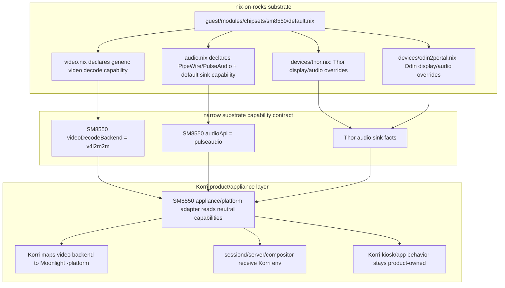

# refactor: Split SM8550 substrate capabilities from Korri policy

## Summary

Move SM8550 video/audio facts into a product-blind nix-on-rocks chipset substrate while keeping Korri responsible for product policy such as Moonlight launch shape, sessiond/server wiring, and kiosk presentation. The split uses a neutral device capability contract so Korri does not need RockNix option names, and collapses the current flat SM8550 substrate modules into `guest/modules/chipsets/sm8550/`.

---

## Problem Frame

The dependency-inversion requirements already establish that nix-on-rocks is the SM8550 substrate and Korri is the product/appliance layer. Live Thor validation added two more facts to make that boundary concrete: `v4l2m2m` is a chipset/kernel video capability, and the working sound path depends on nix-on-rocks exposing a real PipeWire/PulseAudio-backed ALSA sink instead of leaving Moonlight on `Dummy Output`.

Today those responsibilities are blurred: Korri hard-codes SM8550 video/audio launch values in its RockNix platform adapter, while nix-on-rocks still has Moonlight-specific guest module surface. This plan narrows the seam so nix-on-rocks knows hardware capabilities, Korri knows how to use those capabilities for the Korri appliance, and neither layer reaches across the boundary unnecessarily.

---

## Requirements

These requirements narrow the broader dependency-inversion origin to the SM8550 substrate capability contract: which layer owns video/audio hardware facts, how those facts reach Korri, and how Thor/Odin 2 Portal device differences remain reviewable.

- R1. nix-on-rocks must own SM8550 substrate facts, including the shared video decode backend (`v4l2m2m`) and the audio stack needed to expose a real default output sink.
- R2. nix-on-rocks must not need Korri or Moonlight product knowledge to express those facts; any Moonlight installation/launch choice is downstream product policy.
- R3. SM8550 substrate modules must be collapsed under `guest/modules/chipsets/sm8550/` with `default.nix`, `audio.nix`, and `video.nix` as the primary files.
- R4. Thor and Odin 2 Portal form-factor differences must remain in device-profile files, while shared SM8550 facts stay in the chipset module.
- R5. Korri must consume a neutral device capability contract rather than hard-coding `v4l2m2m`, Thor/Odin audio sink details, or RockNix-specific option paths in generic modules.
- R6. Korri remains responsible for mapping generic capabilities into Korri product/service environment, including Moonlight CLI arguments and sessiond/server/compositor launch environments.
- R7. The refactor must preserve current Thor and Odin 2 Portal appliance behavior: SM8550 hardware decode, Korri-managed Moonlight launch, persistent Moonlight key/cache paths, and working audio routing.
- R8. Evaluation tests in both repositories must prove the boundary: nix-on-rocks exposes substrate capabilities without product coupling, and Korri surfaces those capabilities into its runtime service environments.
- R9. The migration must be additive and reversible enough to avoid breaking active SM8550 deploy paths while the two repos are updated.

**Origin actors:** A1 Korri product maintainer; A2 nix-on-rocks substrate maintainer; A3 Sobo/Thor deploy operator; A4 future implementation agent; A5 Fuji/aarch64 verifier.

**Origin flows:** F2 additive Korri-side replacement; F3 deploy cutover; F4 nix-on-rocks cleanup.

**Origin acceptance examples:** AE1 no Korri dependency in nix-on-rocks; AE2 Korri replacement target builds on aarch64; AE3 substrate smoke targets survive cleanup; AE4 no intentional no-go deploy window during transition; AE5 substrate/product split is reviewable.

---

## Scope Boundaries

- Do not make nix-on-rocks configure `services.korri.*`, `KORRI_*` environment variables, or Korri service names.
- Do not make nix-on-rocks depend on Korri or import Korri NixOS modules.
- Do not move generic Korri TypeScript launch code toward chipset detection; TypeScript continues to consume env/config supplied by Nix composition.
- Do not rename all historical `rocknix-*` outputs or docs in this slice. Output naming cleanup can follow once the capability boundary is proven.
- Do not remove the Gamescope compatibility assertion; it remains part of the appliance coherence gate while SM8550 v4l2m2m depends on a sufficiently new Gamescope.
- Do not solve unrelated FPS/frame-pacing tuning.
- Do not require a full redesign of the Korri image API before landing this boundary cleanup.

### Deferred to Follow-Up Work

- Rename historical RockNix output names in Korri after deploy scripts and docs no longer depend on them.
- Author a dedicated Thor UCM package if future validation proves the shared AYN/Odin UCM is only an incidental fit.
- Collapse Korri's compositor/sessiond/server Moonlight env blocks into a reusable helper if this refactor exposes additional duplication beyond the capability fields.
- Retire obsolete nix-on-rocks Moonlight package/launcher artifacts only after confirming no non-Korri substrate smoke path uses them.

---

## Context & Research

### Relevant Code and Patterns

**Korri repo**

- `nix/images/platforms/rocknix-sm8550.nix` currently imports `nix-on-rocks.nixosModules.rocknix-guest-base` plus a device profile, pins the SM8550 Gamescope package, hard-codes `KORRI_MOONLIGHT_PLATFORM = "v4l2m2m"`, and sets `SDL_AUDIODRIVER = "pulseaudio"` for Moonlight launch scopes.
- `nix/tests/korri-rocknix-sm8550-config-check.nix` already asserts Thor and Odin 2 Portal service environments include the expected Moonlight platform and other SM8550 kiosk invariants.
- `korri/products/app/api/stream/compose-moonlight-launch-spec.ts` and `korri/products/app/stream/moonlight-launcher.ts` already consume `KORRI_MOONLIGHT_PLATFORM` generically; no TypeScript chipset branch is needed.
- `nix/modules/korri-compositor.nix` already guards the old `rocknix.sm8550.moonlight.package` override with `lib.optionalAttrs`, which makes removing the substrate Moonlight option feasible.

**nix-on-rocks repo**

- `guest/profiles/rocknix-guest-base.nix` is already the product-blind substrate contract that Korri imports.
- `guest/modules/device.nix` currently owns `rocknix.sm8550.*` options for device id, display Sway fragment, input event names, UCM package, and Cemu affinity.
- `guest/modules/audio.nix` starts root-owned `main-space-pipewire`, `main-space-pipewire-pulse`, and `main-space-wireplumber` services, and sets runtime environment for the root main-space audio graph.
- `guest/modules/moonlight.nix` is the main product leak: it declares Moonlight install/keydir options under `rocknix.sm8550.moonlight.*`.
- `guest/profiles/devices/thor.nix` and `guest/profiles/devices/odin2portal.nix` are the right place for form-factor deltas such as display topology, touch routing, and device-specific audio sink overrides.
- `nix/tests/guest-profile-contract.nix`, `nix/tests/main-space-systemd-contract.nix`, and `nix/tests/audio-input-systemd-contract.nix` provide the pattern for substrate contract assertions.

### Institutional Learnings

- `docs/solutions/architecture-patterns/architectural-posture-as-nix-image-default-2026-05-27.md`: shared modules keep conservative defaults; image/platform layers assert the posture for a fleet.
- `docs/solutions/workflow-issues/rocknix-guest-only-nix-deploy-2026-05-27.md`: SM8550 deploys target the guest store and active guest generation, not the host side.
- `docs/solutions/tooling-decisions/align-flake-nixpkgs-to-downstream-pin-for-cache-coherence-2026-05-27.md`: keep Korri/nix-on-rocks nixpkgs pins aligned before expensive aarch64 builds.
- `docs/solutions/architecture-patterns/sunshine-audio-sink-persistence-via-pinned-virtual-sink-2026-05-29.md`: audio routing must create a better sink than `auto_null`, not merely hope apps migrate later.
- `docs/solutions/best-practices/allwinner-a133-sw-decode-only-no-cedar-v4l2m2m-2026-05-28.md`: `v4l2m2m` availability is substrate/kernel-dependent and should be asserted, not assumed.
- `docs/solutions/integration-issues/knulli-sdl2-audio-via-alsa-pipewire-plugin-shim-2026-05-29.md`: audio environment belongs at the host/substrate launch seam, not inside the app package.

### External References

External research was skipped. This is a repo-specific Nix module boundary refactor with strong local docs and live device evidence.

---

## Key Technical Decisions

- Use a narrow substrate capability contract between layers: nix-on-rocks may keep internal `rocknix.sm8550.*` implementation details, but the exported consumer-facing facts in this slice should cover only SM8550 video decode and audio output capabilities. Avoid a top-level `hardware.*` or generalized device-adapter namespace unless a later plan proves a concrete multi-chipset consumer needs it.
- Treat `v4l2m2m` as a video decode capability, not a Moonlight option. Korri maps that generic backend into Moonlight's `-platform` flag because Moonlight is Korri's chosen client implementation.
- Treat `SDL_AUDIODRIVER = "pulseaudio"` as a consequence of the substrate audio stack, not a Moonlight-specific hardware fact. nix-on-rocks declares the audio API it exposes; Korri applies that API to SDL/Moonlight processes it launches.
- Keep the Korri platform adapter, but shrink its authority. Korri may import substrate modules and read neutral capability options, then set Korri service options. It must not re-declare hardware facts that the substrate can own.
- Keep Gamescope package selection/assertion in Korri for now because Korri controls the compositor package used by the appliance. The assertion should be conditional on the substrate-declared video backend rather than an unexplained hard-coded SM8550 string.
- Make Thor's working audio path explicit in nix-on-rocks, starting with the validated UCM/speaker PCM/sink bootstrap and leaving room for Odin-specific overrides.
- Preserve additive compatibility while moving files: introduce the collapsed SM8550 folder and capability options first, consume them from Korri second, then remove/deprecate obsolete Moonlight substrate module surface.

---

## Open Questions

### Resolved During Planning

- Should nix-on-rocks know about Moonlight? No for the durable substrate contract. It can know about Linux video decode backends such as `v4l2m2m`; Korri decides to use Moonlight and translates the backend to Moonlight CLI shape.
- Should Korri know about RockNix-specific option paths? Not in generic modules. A platform/device composition may import the substrate, but it should read neutral capability options so the product layer is not coupled to RockNix namespace details.
- Should Thor and Odin share SM8550 video capability? Yes. Current evidence says both share the SM8550/Iris v4l2m2m path; form-factor files override only measured differences.
- Should the SM8550 module files stay flat? No. Collapse chipset concerns into `guest/modules/chipsets/sm8550/` with `default.nix`, `audio.nix`, and `video.nix`.

### Deferred to Implementation

- Exact neutral option names: implementation may choose final names, but the plan expects a product-neutral contract and tests that prevent Korri from reading only `rocknix.sm8550.*` for capability facts.
- Exact audio sink bootstrap mechanism: implementation should start from the live-proven `alsaucm` + PulseAudio ALSA sink path, then simplify if WirePlumber can natively enumerate the card once the same facts are declared.
- Whether obsolete flat nix-on-rocks files become temporary compatibility shims or are removed in the same PR depends on downstream imports at implementation time.

---

## Output Structure

Expected nix-on-rocks target shape:

```text
guest/modules/chipsets/sm8550/
  default.nix
  audio.nix
  video.nix

guest/profiles/devices/
  thor.nix
  odin2portal.nix
```

Expected Korri target shape is mostly existing files, with `nix/images/platforms/rocknix-sm8550.nix` becoming a thinner consumer of neutral substrate capabilities.

---

## High-Level Technical Design

> *This illustrates the intended approach and is directional guidance for review, not implementation specification. The implementing agent should treat it as context, not code to reproduce.*



```text
Ownership rule:

nix-on-rocks says:
  "This device/chipset exposes these Linux capabilities and routes audio here."

Korri says:
  "For a Korri appliance, use those capabilities with Moonlight/sessiond/server/kiosk policy."
```

---

## Implementation Units

### U1. Introduce collapsed SM8550 chipset module structure in nix-on-rocks

**Goal:** Move shared SM8550 substrate declarations from the current flat modules into a single chipset folder without changing live behavior.

**Requirements:** R1, R3, R4, R9

**Dependencies:** None

**Files:**
- Create: `guest/modules/chipsets/sm8550/default.nix` (nix-on-rocks)
- Create: `guest/modules/chipsets/sm8550/audio.nix` (nix-on-rocks)
- Create: `guest/modules/chipsets/sm8550/video.nix` (nix-on-rocks)
- Modify: `guest/profiles/rocknix-guest-base.nix` (nix-on-rocks)
- Modify: `flake.nix` (nix-on-rocks)
- Test: `nix/tests/guest-profile-contract.nix` (nix-on-rocks)

**Approach:**
- Move SM8550-specific option declarations and imports behind `guest/modules/chipsets/sm8550/default.nix`.
- Keep `default.nix` as the single import surface for current downstream consumers.
- Let `audio.nix` own the existing main-space PipeWire/PulseAudio/WirePlumber services and audio options.
- Let `video.nix` own the generic decode capability declaration for SM8550.
- Update nix-on-rocks module exports so downstream users can import the new chipset module path without knowing the old flat layout.
- Prefer temporary compatibility shims over hard removal if implementation finds live consumers of the old flat files.
- Keep the folder move as small as possible. If the cross-repo capability handoff becomes blocked on path churn, implementation may land the capability options in the existing flat modules first and immediately follow with the folder collapse as the structural cleanup required by R3.

**Patterns to follow:**
- Existing product-blind substrate boundary in `guest/profiles/rocknix-guest-base.nix`.
- Existing nix-on-rocks eval assertion style in `nix/tests/guest-profile-contract.nix`.

**Test scenarios:**
- Happy path: `rocknix-guest-base` still evaluates as a container substrate and enables Sway, PipeWire, D-Bus, input, network, Bluetooth, and session runtime services after the import move.
- Happy path: the public `sm8550` module export points at the collapsed chipset module and exposes the same effective substrate options.
- Edge case: downstream compositions that import `rocknix-guest-base` do not need to know the internal `chipsets/sm8550/` layout.
- Error path: if the old flat import path is intentionally removed, any nix-on-rocks tests or outputs that still use it fail with a clear module import error during this unit, not later in Korri.

**Verification:**
- nix-on-rocks substrate tests prove no behavior was lost while the module tree was reshaped.
- The new folder is the canonical location for shared SM8550 substrate concerns.

---

### U2. Declare product-neutral SM8550 video capability

**Goal:** Make `v4l2m2m` a substrate-declared Linux video decode backend instead of a Korri hard-coded Moonlight platform string.

**Requirements:** R1, R2, R5, R8

**Dependencies:** U1

**Files:**
- Modify: `guest/modules/chipsets/sm8550/video.nix` (nix-on-rocks)
- Modify: `guest/profiles/devices/thor.nix` (nix-on-rocks, only if explicit inheritance/override improves clarity)
- Modify: `guest/profiles/devices/odin2portal.nix` (nix-on-rocks, only if explicit inheritance/override improves clarity)
- Test: `nix/tests/guest-profile-contract.nix` (nix-on-rocks)
- Test: `nix/tests/flake-surface-contract.nix` (nix-on-rocks)

**Approach:**
- Add a neutral capability option for SM8550 video decode, with the shared default backend set to `v4l2m2m`.
- Keep the option general enough that Korri does not need to read `rocknix.sm8550.moonlight.*` to discover the backend.
- Allow per-device profiles to override the backend if a future SM8550 device has different kernel/video support.
- Do not install or configure Moonlight from this video module.

**Patterns to follow:**
- Existing per-device override pattern in `guest/profiles/devices/odin2portal.nix` for display differences.
- Current capability assertions in Korri's `nix/tests/korri-rocknix-sm8550-config-check.nix`, but with source-of-truth moved to the substrate.

**Test scenarios:**
- Happy path: Thor substrate evaluation exposes the neutral video decode backend as `v4l2m2m`.
- Happy path: Odin 2 Portal substrate evaluation exposes the same backend without duplicating the value in the device profile.
- Edge case: a synthetic per-device override can change the backend without editing Korri or the shared chipset module.
- Error path: nix-on-rocks substrate checks fail if the SM8550 module stops exposing a video decode backend.

**Verification:**
- nix-on-rocks can state the SM8550 video capability without referring to Moonlight, Korri, or Korri environment variables.

---

### U3. Persist SM8550 audio sink capability and Thor speaker routing

**Goal:** Turn the live Thor audio fix into substrate-owned audio configuration so Moonlight and local apps route to a real output sink instead of PipeWire `Dummy Output`.

**Requirements:** R1, R4, R5, R7, R8

**Dependencies:** U1

**Files:**
- Modify: `guest/modules/chipsets/sm8550/audio.nix` (nix-on-rocks)
- Modify: `guest/profiles/devices/thor.nix` (nix-on-rocks)
- Modify: `guest/profiles/devices/odin2portal.nix` (nix-on-rocks, if it needs explicit audio defaults)
- Test: `nix/tests/audio-input-systemd-contract.nix` (nix-on-rocks)
- Test: `nix/tests/main-space-systemd-contract.nix` (nix-on-rocks)

**Approach:**
- Keep PipeWire/PulseAudio/WirePlumber service ownership in nix-on-rocks.
- Add substrate audio facts that describe the exported audio API and default sink behavior, not Korri or Moonlight.
- Add device-profile audio fields for UCM card, speaker PCM, and sink name where those are form-factor-specific.
- Scope the live-proven speaker route to Thor first: enable the AYN-Thor UCM speaker path and ensure a PulseAudio/PipeWire ALSA sink exists for Thor's speaker PCM before Korri/Moonlight launches. Do not claim Odin 2 Portal inherits the Thor sink/UCM until Odin audio is physically validated.
- Preserve `auto_null` as fallback; create a better default sink rather than disabling the fallback.
- Ensure the same main-space runtime directory and PulseAudio socket are used by root-owned services and launched applications.

**Patterns to follow:**
- `guest/modules/audio.nix` main-space audio service ordering after `main-space-runtime-dir.service`.
- `docs/solutions/architecture-patterns/sunshine-audio-sink-persistence-via-pinned-virtual-sink-2026-05-29.md` for preferring a persistent better sink over fighting `auto_null`.
- Live validation on Bandai: UCM speaker enable plus a PulseAudio ALSA sink for `hw:0,0` made local tones and Neverball stream audio audible.

**Test scenarios:**
- Happy path: Thor evaluation exposes a real default speaker sink configuration and does not leave the declared sink name empty.
- Happy path: the main-space audio bootstrap service orders after PipeWire/PulseAudio and before downstream kiosk/audio consumers.
- Happy path: audio service environments retain `XDG_RUNTIME_DIR`, `PIPEWIRE_RUNTIME_DIR`, `PULSE_SERVER`, and the UCM path.
- Edge case: Odin 2 Portal either declares its own validated audio sink facts or carries an explicit implementation TODO/assertion rather than silently inheriting Thor speaker PCM details.
- Error path: if the Thor profile omits required audio sink fields, nix-on-rocks evaluation fails or the contract test flags the omission.
- Physical device smoke: an SDL/PulseAudio client launched in the main-space session can target the declared sink rather than `auto_null`.

**Verification:**
- A rebuilt Thor guest should expose a non-dummy default sink before Korri launches Moonlight; eval tests cover option/ordering correctness, while physical smoke covers runtime sink behavior.
- nix-on-rocks tests prove the substrate owns audio setup without needing Korri service names.

---

### U4. Remove Moonlight product surface from nix-on-rocks substrate imports

**Goal:** Stop treating Moonlight installation and keydir setup as part of the generic SM8550 substrate contract.

**Requirements:** R2, R6, R8, R9

**Dependencies:** U1, U2, U5

**Files:**
- Modify: `guest/profiles/rocknix-guest-base.nix` (nix-on-rocks)
- Modify or remove: `guest/modules/moonlight.nix` (nix-on-rocks)
- Modify: `flake.nix` (nix-on-rocks, only if module exports mention Moonlight)
- Test: `nix/tests/guest-profile-contract.nix` (nix-on-rocks)
- Test: `nix/tests/flake-surface-contract.nix` (nix-on-rocks)

**Approach:**
- Remove the Moonlight guest module from the product-blind substrate import path only after Korri no longer assigns `rocknix.sm8550.moonlight.*`, or keep removed-option/compatibility shims until the Korri flake pin has advanced past U5.
- Keep the package derivation or historical launcher artifacts only if separate nix-on-rocks users still need them; do not install or configure them in the base substrate.
- Ensure keydir creation for Moonlight moves downstream to Korri's product/appliance composition where the client is selected.

**Patterns to follow:**
- Origin requirement AE5: OS-coupled runtime concerns stay substrate-owned while user-launchable apps are explicitly selected by Korri.
- Current guarded Korri override in `nix/modules/korri-compositor.nix`, plus the unguarded platform-adapter setter in `nix/images/platforms/rocknix-sm8550.nix` that must be removed or compatibility-shimmed before nix-on-rocks drops the option.

**Test scenarios:**
- Happy path: `rocknix-guest-base` evaluates without importing a Moonlight install module.
- Happy path: nix-on-rocks flake/module contract exposes SM8550 substrate modules without any Korri or Moonlight service requirement.
- Edge case: if the Moonlight package remains in nix-on-rocks for non-substrate consumers, it is not pulled into the product-blind base profile.
- Error path: attempts to set removed `rocknix.sm8550.moonlight.*` options fail in the appropriate compatibility-removal unit, not silently no-op.

**Verification:**
- nix-on-rocks can evaluate its substrate smoke targets without Moonlight product configuration.

---

### U5. Update Korri to consume neutral substrate capabilities

**Goal:** Make Korri's SM8550 appliance composition read substrate-provided capabilities and translate them into Korri/Moonlight runtime configuration.

**Requirements:** R5, R6, R7, R8, R9

**Dependencies:** U2, U3; U4 can happen after this unit if compatibility is needed

**Files:**
- Modify: `flake.lock`
- Modify: `nix/images/platforms/rocknix-sm8550.nix`
- Modify: `nix/modules/korri-compositor.nix` (only if old `rocknix.sm8550.moonlight` compatibility can be deleted)
- Test: `nix/tests/korri-rocknix-sm8550-config-check.nix`

**Approach:**
- Bump `flake.lock` to a nix-on-rocks revision that includes the neutral video/audio capability options before reading them from Korri; otherwise evaluation will fail before tests can run.
- Replace literal `v4l2m2m` in Korri's SM8550 platform adapter with the substrate-declared video decode backend.
- Replace literal SDL audio driver selection with the substrate-declared audio API/driver value.
- Keep Moonlight-specific env names in Korri because Korri owns the Moonlight client implementation.
- Keep `KORRI_MOONLIGHT_COMMAND`, mapping file, key/cache directory, startup observe window, and app-launch policy in Korri unless implementation proves one is a substrate fact.
- Remove Korri's setter for `rocknix.sm8550.moonlight.enable` once nix-on-rocks no longer uses that option.
- Keep the Gamescope assertion, but phrase it around the substrate-declared backend so the reason for the constraint remains machine-checkable.
- Extend final-service assertions beyond the current compositor-only platform check: assert `KORRI_MOONLIGHT_PLATFORM` reaches sessiond and korri-server, and assert `SDL_AUDIODRIVER` reaches both compositor and sessiond.
- Add a required capability-literal scan in `nix/tests/korri-rocknix-sm8550-config-check.nix` asserting that `nix/images/platforms/rocknix-sm8550.nix` does not contain quoted assignment values for `v4l2m2m` or `pulseaudio`; keep the existing generic-module hardware-fact scan focused on generic image files.

**Execution note:** Start with the Korri eval assertions that prove the literal hardware values are no longer hard-coded in generic surfaces but still appear in final service environments.

**Patterns to follow:**
- Existing env-driven TypeScript launcher seam in `korri/products/app/api/stream/compose-moonlight-launch-spec.ts`.
- Current final-service environment assertions in `nix/tests/korri-rocknix-sm8550-config-check.nix`.

**Test scenarios:**
- Happy path: Thor final compositor/sessiond/server environments still contain the correct Moonlight platform and SDL audio driver after the values are read from substrate capabilities.
- Happy path: Odin 2 Portal final environments still contain the same correct values.
- Edge case: generic Korri image/module files remain free of SM8550, RockNix, Thor/Odin 2 Portal, display, `v4l2m2m`, and hardware-audio string literals.
- Error path: if the substrate capability is absent, Korri evaluation fails with a clear assertion rather than silently falling back to software decode or dummy audio.
- Integration: the server-composed remote stream launch path and sessiond-managed launch path receive the same capability-derived Moonlight env.

**Verification:**
- Korri owns Moonlight launch policy while the capability values originate in the substrate contract.
- Existing Thor/Odin 2 Portal eval checks continue to prove the runtime service boundary.

---

### U6. Add boundary and migration documentation updates

**Goal:** Make the ownership split discoverable for future agents without reviving the old Korri/RockNix coupling.

**Requirements:** R1, R2, R3, R4, R5, R8

**Dependencies:** U1–U5

**Files:**
- Modify: `docs/deployment/korri-images.md`
- Modify: `guest/profiles/rocknix-guest-base.nix` comments (nix-on-rocks)
- Modify: `guest/modules/chipsets/sm8550/default.nix` comments (nix-on-rocks)

**Approach:**
- Document the final rule: nix-on-rocks exports hardware/substrate capabilities; Korri translates them into product policy.
- Name `v4l2m2m` as a substrate video backend and Moonlight `-platform` as Korri's current use of that backend.
- Document Thor/Odin 2 Portal form-factor ownership: substrate hardware quirks and audio sink facts belong in nix-on-rocks device profiles; Korri presentation policy can consume those facts or add product-level device composition in a separate Korri-facing module.
- Keep deployment notes clear that active device rebuilds still target the NixOS guest side.

**Patterns to follow:**
- Existing architecture prose in `docs/deployment/korri-images.md`.
- Boundary framing in `../01KS6FPN1HVWGZGE4HCC8GDX6Q-refactor-korri-dependency-inversion/requirements.md`.

**Test scenarios:**
- Test expectation: none for prose-only docs, but review should confirm docs do not say nix-on-rocks configures Korri/Moonlight services.

**Verification:**
- A future reader can tell where to add a new SM8550 chipset fact, a Thor-only display/audio quirk, and a Korri-only Moonlight policy change.

---

## System-Wide Impact

- **Interaction graph:** nix-on-rocks chipset modules produce neutral capability facts; device profiles refine form-factor details; Korri's SM8550 appliance composition reads those facts; sessiond/server/compositor receive Korri product env; TypeScript launch code remains env-driven.
- **Error propagation:** Missing substrate capabilities should fail Nix evaluation with explicit assertions. Runtime failures such as absent `/dev/video*` after a bad host/guest boot remain device acceptance failures, not Korri launcher bugs.
- **State lifecycle risks:** Moonlight key/cache state remains under persistent device storage as a Korri product choice; audio sink bootstrap must be idempotent across service restarts and should not duplicate sinks.
- **API surface parity:** No RPC or UI API changes are expected. The main contract surface is NixOS option shape shared across repos.
- **Integration coverage:** nix-on-rocks checks prove substrate facts and services; Korri checks prove final service env. Physical Thor/Odin smoke still proves hardware decode and sound after rebuild.
- **Unchanged invariants:** Korri TypeScript stays chipset-agnostic; nix-on-rocks does not import Korri; historical deploy/build target names may remain during the migration window.

---

## Risks & Dependencies

| Risk | Mitigation |
|------|------------|
| Neutral option names become another premature framework. | Keep the first contract narrow: SM8550 video backend and audio API/default sink only; avoid a top-level `hardware.*` hierarchy in this slice. |
| Removing nix-on-rocks Moonlight module breaks an existing non-Korri smoke flow. | Audit flake outputs and keep package artifacts or compatibility shims until consumers are gone; only remove substrate import/product option surface in this plan. |
| Audio sink bootstrap works live but is brittle when encoded declaratively. | Make it idempotent, test service ordering, and verify on Thor after a rebuild; keep `auto_null` fallback intact. |
| Korri still leaks hardware literals in generic modules. | Expand `nix/tests/korri-rocknix-sm8550-config-check.nix` hardware-fact scanning to include `v4l2m2m` and audio-driver literals. |
| Gamescope/v4l2m2m coherence regresses during the refactor. | Keep the Korri assertion and tie it to the substrate-declared backend. |
| aarch64 builds become unexpectedly expensive after flake updates. | Preserve nixpkgs pin alignment with nix-on-rocks before running full aarch64 system/rootfs builds. |
| Multi-repo sequencing creates a broken intermediate state. | Land additive substrate options first, update Korri to consume them second, remove obsolete substrate product surface last. |

---

## Documentation / Operational Notes

- Use guest-side deploy/rebuild flows for physical Thor/Odin 2 Portal validation; the ROCKNIX host side does not own the Nix store.
- Prefer package/eval checks before full rootfs builds when iterating, but final confidence requires a physical reboot/restart smoke because audio sink creation and v4l2m2m device exposure are runtime contracts.
- Keep the current live Bandai transient audio fix in mind as acceptance evidence, not as the final implementation shape.

---

## Sources & References

- **Origin document:** [../01KS6FPN1HVWGZGE4HCC8GDX6Q-refactor-korri-dependency-inversion/requirements.md](../01KS6FPN1HVWGZGE4HCC8GDX6Q-refactor-korri-dependency-inversion/requirements.md)
- Related plan: [../01KS6FPN1HVWGZGE4HCC8GDX6Q-refactor-korri-dependency-inversion/plan.md](../01KS6FPN1HVWGZGE4HCC8GDX6Q-refactor-korri-dependency-inversion/plan.md)
- Related plan: [../.archive/01KSBMG31SQFYZE0XMMK2BDRRV-fix-sm8550-moonlight-platform/plan.md](../.archive/01KSBMG31SQFYZE0XMMK2BDRRV-fix-sm8550-moonlight-platform/plan.md)
- Related code: `nix/images/platforms/rocknix-sm8550.nix`
- Related code: `nix/tests/korri-rocknix-sm8550-config-check.nix`
- Related nix-on-rocks code: `guest/modules/audio.nix`
- Related nix-on-rocks code: `guest/modules/device.nix`
- Related nix-on-rocks code: `guest/modules/moonlight.nix`
- Related nix-on-rocks code: `guest/profiles/rocknix-guest-base.nix`
- Related nix-on-rocks code: `guest/profiles/devices/thor.nix`
- Related nix-on-rocks code: `guest/profiles/devices/odin2portal.nix`
