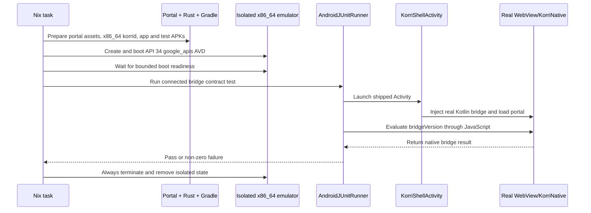

# feat: Establish the Android testing foundation

## Summary

Preserve Korri's existing surface-local and portal-local test foundations, make the existing Android JVM suite a first-class Nix gate, and add the missing headless emulator path that proves one method across the real portal-to-Kotlin WebView bridge. Keep each level independently runnable so cheap failures stay cheap and the emulator remains a narrow contract check.

The MVP changes only test and build infrastructure. It does not refactor the bridge, broaden into Android UI automation, or claim physical-device confidence.

| Level | Owner and observable contract | Existing evidence | MVP action |
|---|---|---|---|
| 1.1 Surface-local | A surface renders and reacts through `SurfaceModel` and `SurfaceHost` only | `surfaces/shift/test/shift-surface.test.tsx`; `shift-check` | Preserve and verify; add no duplicate infrastructure |
| 1.2 Portal-local | The portal adapts bridge, input, korrid, and host facts into the surface treaty | Tests under `clients/portal/src/`; `portal-check` | Preserve and verify; add no emulator cases that belong here |
| 2 JVM/Robolectric | Android-owned logic runs without a device or real WebView | Tests under `clients/android/app/src/test/` | Add a dedicated Nix task and include the suite in the full check |
| 3 Emulator/instrumented | The shipped, minified Android Activity injects the real Kotlin bridge into a real WebView | None | Add one `bridgeVersion` conformance check and a deterministic headless Nix task |

---

## Problem Frame

Korri already has meaningful coverage at the surface, portal, and JVM layers, but those levels are easy to mislabel: surface behavior belongs with the deployable surface, while bridge adapters and host composition belong with the portal. The Android JVM suite also lacks a first-class project task, so it is absent from the nominal full check.

The specific untested seam is the hand-maintained Kotlin implementation of `contracts/bridge/korri-native-bridge.ts`. Portal tests prove the TypeScript consumer against an in-memory implementation, but nothing executes `window.KorriNative` against the real `KorriShellActivity` WebView. That is the narrow value an emulator adds (see source: `docs/research/android-automated-testing-handoff.md`).

---

## Requirements

- R1. Preserve level 1.1 as surface-local testing through `SurfaceModel` and `SurfaceHost`; surface tests must not import portal, bridge, generated korrid, or Android code.
- R2. Preserve level 1.2 as portal-local testing for bridge adapters, semantic input, korrid clients, and host-to-surface composition; behavior expressible here must not move into the emulator suite.
- R3. Expose the existing Android JVM/Robolectric suite as a discoverable Nix task and run it from Korri's full host check before APK assembly.
- R4. Add one level 3 instrumented test that launches the real `KorriShellActivity`, calls the real injected `window.KorriNative.bridgeVersion()` through its WebView, and compares the result with the current `BRIDGE_VERSION` from the canonical TypeScript treaty.
- R5. Provide a headless Nix task that prepares the x86_64 Android app, creates and boots an isolated emulator, runs the instrumented test, propagates failures, and always cleans up its emulator process and AVD state.
- R6. Keep the MVP to test/build infrastructure. Do not change production bridge visibility, add test-only runtime branches, introduce mock/stub/fake classes, or refactor production code solely to make the test possible.
- R7. Stop and document the exact result if emulator/Nix integration consumes more than half a day or the real bridge cannot be reached without a production refactor.
- R8. Record the resulting coverage, measured boot/run time, cache cost, untestable gaps, and GitHub Actions/KVM viability in `docs/research/android-automated-testing.md`.

---

## Scope Boundaries

- Physical-device testing, procedures, and device-farm automation are excluded.
- Broad Android UI, streaming, controller, thermal, latency, battery, vendor GPU, and vendor-driver coverage are excluded.
- Full conformance coverage for every `KorriNativeBridgeSurface` and `KorriSessionBridgeSurface` method is excluded from the MVP.
- No new Shift or portal tests are required unless implementation research finds a concrete ownership gap not covered by the current suites.
- No mandatory GitHub Actions gate is added in this slice.
- Existing Mockito dependencies and unrelated Android test cleanup are not changed.

### Deferred to Follow-Up Work

- Expand emulator conformance beyond `bridgeVersion` only after the MVP's maintenance cost and signal are measured.
- Add CI workflow wiring only after the local Nix task's time and download profile are acceptable.
- Keep real-device validation as a separate manual/device-focused concern.

---

## Context & Research

### Relevant Code and Patterns

- `contracts/bridge/korri-native-bridge.ts` is the canonical bridge treaty; `BRIDGE_VERSION` is currently hand-mirrored by `KorriShellActivity`.
- `clients/android/app/src/main/java/com/limelight/KorriShellActivity.java` creates the real WebView, injects the private `KorriNativeBridge`, and starts the embedded korrid before loading the portal.
- `surfaces/shift/src/fixtures/fixture-host.ts` is a real in-memory `SurfaceHost` implementation and records observable calls without crossing the surface boundary.
- `surfaces/shift/test/shift-surface.test.tsx` already exercises rendering, semantic input, focus, and host effects through the public surface treaty.
- `clients/portal/src/bridge/launcher-bridge.test.ts` exercises the TypeScript side of the native bridge through a configurable implementation of `KorriNativeBridgeSurface`.
- `clients/portal/src/input/korri-native-adapter.test.ts`, `clients/portal/src/korrid/client.test.ts`, and `clients/portal/src/surface/surface-model.test.ts` establish the portal-local ownership boundary.
- `clients/android/app/src/test/java/com/limelight/KorriSettingsBridgeTest.java`, `clients/android/app/src/test/java/com/limelight/KorriLocalLaunchSpecTest.java`, and `clients/android/app/src/test/java/com/limelight/KorriSessionOverlayTest.java` establish the Android JVM/Robolectric pattern.
- `nix/tasks.nix` is the single source for runnable project tasks and generated help.
- `clients/android/sdk.nix` owns Android SDK composition; its default composition currently excludes emulator binaries and system images.
- `nix/android-sdk-env.sh` creates the writable SDK view expected by AGP and Android tooling.
- `services/korrid/check-in-shell.sh` already runs portal and Shift checks and assembles the Android app, but does not run Android JVM tests.

### Institutional Learnings

- The source handoff requires cheap layers first, one emulator target, and stop-and-document kill criteria: `docs/research/android-automated-testing-handoff.md`.
- Test seams use real configurable implementations rather than `Mock*`, `Stub*`, or `Fake*` classes. The live examples are `createFixtureHost`, `createInMemoryLauncherBridge`, and `createInMemoryKorridClient`.
- Surfaces are deployables and may import only surface-contract types from Korri; the emulator must not become a surface test harness.
- Existing project tasks are Nix apps. Helper scripts may hold lifecycle complexity, while `nix/tasks.nix` remains the discoverable composition surface.

### External References

- nixpkgs Android tooling and `composeAndroidPackages`: https://github.com/NixOS/nixpkgs/blob/master/doc/languages-frameworks/android.section.md
- AndroidX Test releases: https://developer.android.com/jetpack/androidx/releases/test
- Android WebView testing guidance: https://developer.android.com/training/testing/espresso/web
- Android Gradle Plugin 8.13 notes: https://developer.android.com/build/releases/agp-8-13-0-release-notes
- GitHub Actions KVM availability on standard Linux runners: https://github.blog/changelog/2024-04-02-github-actions-hardware-accelerated-android-virtualization-now-available/
- Known nixpkgs headless emulator/Vulkan risk: https://github.com/NixOS/nixpkgs/issues/121146
- Known nixpkgs Android 36/36.1 resolution risk: https://github.com/NixOS/nixpkgs/issues/472561

---

## Key Technical Decisions

| Decision | Rationale |
|---|---|
| Treat levels 1.1 and 1.2 as already-founded, independently-owned suites | Rebuilding them would add no signal and could violate the surface/host boundary. Their existing Nix tasks already provide the representative paths requested. |
| Make Android JVM tests both independently runnable and part of `korrid-check` | JVM tests are cheap and existing; leaving them outside the nominal full check allows silent drift. A dedicated task preserves a fast focused loop. |
| Keep emulator packages opt-in within the Android SDK composition | System images are large. The normal Android devshell and APK tasks should retain their current closure unless the emulator task explicitly requests the extended composition. Parameterizing the existing per-area composition centralizes SDK policy without duplicating it. |
| Use an API 34 `google_apis` x86_64 image | It matches the app's target SDK, supplies a real WebView, runs the existing x86_64 APK split natively, and avoids current nixpkgs API 36/36.1 ambiguity. |
| Build the embedded korrid cdylib for x86_64 as part of the emulator task | `KorriShellActivity` starts korrid before it injects the WebView bridge. Bypassing that startup would test a test-only Activity, not the shipped implementation. |
| Use direct WebView JavaScript evaluation rather than Espresso-Web | The MVP needs one call-and-result contract check, not DOM interaction. Direct evaluation reduces dependencies and synchronization machinery while still crossing the real injected bridge. |
| Derive the expected bridge version from the TypeScript treaty at test execution | A third hand-written version literal would reproduce the drift problem. A test-only projection imports `BRIDGE_VERSION` and supplies it to the instrumented test; production code remains unchanged. |
| Keep emulator lifecycle in a client-owned helper script behind one Nix app | AVD creation, explicit device selection, readiness, failure propagation, and cleanup are meaningful lifecycle policy. `androidenv.emulateApp` is aimed at opening an app rather than supervising AndroidJUnitRunner, so an explicit helper is the smaller honest contract. Keeping that policy out of `nix/tasks.nix` preserves the flake/task composition boundary. |
| Do not pre-emptively add Android R8 shrinker keep rules | The minified debug artifact is the thing under test, and Android's default rules preserve `@JavascriptInterface` methods. If the real test proves otherwise, a narrowly evidenced keep rule is an implementation-time fix, not an assumed prerequisite. |

---

## Open Questions

### Resolved During Planning

- **Are portal tests surface-local?** Surface-owned behavior is local to `surfaces/shift/`; portal-owned adapters and composition remain local to `clients/portal/`.
- **Does level 3 include physical hardware?** No. The confirmed numbering is 1.1 surface, 1.2 portal, 2 JVM/Robolectric, and 3 emulator/instrumented.
- **Should the emulator run the real Activity despite its embedded brain dependency?** Yes. The task builds the x86_64 korrid cdylib rather than adding a test-only bypass.
- **Should the shared Android toolchain always include the emulator image?** No. The same per-area composition exposes an opt-in emulator profile so existing tasks remain small.
- **Should this slice add CI?** No. It records viability and leaves workflow wiring for follow-up.
- **Should level 3 use `androidenv.emulateApp` as its runner?** No. Use the composed emulator packages, but keep AVD creation, AndroidJUnitRunner execution, owned serial selection, status propagation, and cleanup in the client helper because `emulateApp` does not own that test lifecycle.

### Deferred to Implementation

- **Exact cold and warm emulator timings:** measure them from the working task and record them in the findings document.
- **Whether the current nixpkgs emulator needs flags beyond headless software rendering:** determine from the first boot attempt; stop under the documented time box instead of layering workarounds indefinitely.
- **Whether the minified debug build needs an explicit JavascriptInterface keep rule:** add one only if the real instrumented test or shrinker output demonstrates removal.

---

## High-Level Technical Design

> *This illustrates the intended approach and is directional guidance for review, not implementation specification. The implementing agent should treat it as context, not code to reproduce.*

The task must preserve the original failure if cleanup also encounters a problem. It must never reuse or mutate a developer's default AVD home.

---

## Implementation Units

### U1. Make Android JVM tests a first-class cheap gate

**Goal:** Give level 2 the same discoverable Nix entry point as levels 1.1 and 1.2, and ensure the existing JVM/Robolectric suite runs in Korri's full host check.

**Requirements:** R1, R2, R3, R6

**Dependencies:** None

**Files:**
- Modify: `nix/tasks.nix`
- Modify: `services/korrid/check-in-shell.sh`
- Test: `clients/android/app/src/test/java/com/limelight/KorriSettingsBridgeTest.java`
- Test: `clients/android/app/src/test/java/com/limelight/KorriLocalLaunchSpecTest.java`
- Test: `clients/android/app/src/test/java/com/limelight/KorriSessionOverlayTest.java`
- Test scope: `clients/android/app/src/test/` (the complete existing JVM suite)

**Approach:**
- Add a focused `android-jvm-check` Nix app using the established Android SDK/JDK environment and the debug unit-test variant.
- Treat the three named Korri tests as ownership examples, not a filter: the task runs every existing JVM test under `clients/android/app/src/test/`, including upstream intent, startup, layout, and preference tests.
- Run that same Gradle test variant from `services/korrid/check-in-shell.sh` before APK assembly, without nesting one Nix app inside another.
- Leave `shift-check`, `portal-check`, and their existing test ownership unchanged.
- Do not add representative JVM tests merely to make this unit look larger; the existing Korri-specific test classes already prove the level.

**Execution note:** Start by running the existing suites unchanged. Treat any pre-existing failure as a finding rather than weakening or rewriting tests to make the gate green.

**Patterns to follow:**
- Task declarations and Android environment wiring in `nix/tasks.nix`.
- Existing test selection and Android build flow in `services/korrid/check-in-shell.sh`.
- Existing Robolectric setup in `clients/android/robolectric.properties` and `clients/android/app/src/test/java/com/limelight/`.

**Test scenarios:**
- **Happy path:** Existing surface and portal checks remain green through their own tasks, and `android-jvm-check` runs the current debug JVM/Robolectric suite to a zero exit.
- **Failure path:** A failing JVM test produces a non-zero `android-jvm-check` result rather than allowing APK assembly to mask it.
- **Integration:** `korrid-check` reaches the Android JVM suite before its Android APK assembly and fails at that level when the suite fails.
- **Boundary:** No surface test gains a portal/bridge import, and no portal test is moved into Android merely to increase emulator coverage.

**Verification:**
- `shift-check`, `portal-check`, and `android-jvm-check` are independently discoverable and green.
- The full `korrid-check` output demonstrates that Android JVM tests ran before APK assembly.

---

### U2. Add the minimal real-WebView bridge contract test

**Goal:** Establish the level 3 test source set with one instrumented check that reaches the real private Kotlin bridge through the shipped Activity's WebView.

**Requirements:** R4, R6

**Dependencies:** U1

**Files:**
- Modify: `clients/android/app/build.gradle`
- Create: `clients/android/app/src/androidTest/java/com/limelight/KorriNativeBridgeContractTest.java`
- Create: `clients/android/test/bridge-contract-version.ts`
- Test: `clients/android/app/src/androidTest/java/com/limelight/KorriNativeBridgeContractTest.java`

**Approach:**
- Configure `AndroidJUnitRunner` in the app's `defaultConfig` and add only the stable AndroidX Test dependencies needed for `ActivityScenario`, instrumentation arguments, and JUnit; do not add Espresso-Web.
- Launch the real `KorriShellActivity` and recursively locate the `WebView` by type beneath the Activity's content root. `setContentView(webView)` grounds this route without exposing private production state or extracting `KorriNativeBridge`; if even this public view-tree route is unstable, apply R7 rather than adding a production getter.
- `addJavascriptInterface` happens before `loadUrl`, but WebView exposes the injected object to JavaScript on the next page load. Wait boundedly for the first navigation to complete or for `window.KorriNative` to become observable, then synchronize on the bounded `evaluateJavascript` callback. Do not wait for portal application state beyond what is needed to expose the bridge.
- Have a tiny test-only TypeScript consumer import `BRIDGE_VERSION` from `contracts/bridge/korri-native-bridge.ts`; the Nix task supplies that canonical value to the instrumentation run. The Java test fails clearly when the argument is absent rather than silently falling back to a duplicated literal.
- Exercise the minified debug build as shipped. Investigate the Android R8 shrinker only if the real call is absent.

**Execution note:** Write the instrumented assertion before growing the emulator lifecycle. Do not add another bridge method until this one passes through the real WebView.

**Patterns to follow:**
- Treaty citation and bridge injection in `clients/android/app/src/main/java/com/limelight/KorriShellActivity.java`.
- Android JUnit naming and package placement under `clients/android/app/src/test/java/com/limelight/`.
- Direct contract imports used by `clients/portal/src/bridge/launcher-bridge.test.ts`.

**Test scenarios:**
- **Happy path:** With the current treaty supplied to instrumentation, JavaScript sees `window.KorriNative`, invokes `bridgeVersion`, and receives the same number as `BRIDGE_VERSION`.
- **Contract drift:** Changing the treaty's version without changing Kotlin makes the instrumented assertion fail; there is no third expected-version literal to update.
- **Error path:** Missing instrumentation contract input fails with a diagnostic that identifies test wiring rather than reporting a false bridge mismatch.
- **Error path:** If the WebView never reaches readiness or the JavaScript callback never returns, the test fails within a bounded timeout instead of hanging the Gradle worker.
- **Integration:** The assertion crosses Activity creation, real WebView setup, `addJavascriptInterface`, JavaScript evaluation, and the real private `KorriNativeBridge` method.

**Verification:**
- The instrumentation APK assembles without production visibility changes or test-only runtime branches.
- The test fails for a deliberate treaty/native version mismatch and passes when the real bridge matches the treaty.

---

### U3. Run the bridge contract test in an isolated Nix-managed emulator

**Goal:** Provide one headless command that prepares the real x86_64 app, boots a deterministic emulator, executes U2, returns the test status, and cleans up every normal exit path.

**Requirements:** R4, R5, R6, R7

**Dependencies:** U2

**Files:**
- Modify: `clients/android/sdk.nix`
- Modify: `nix/tasks.nix`
- Create: `clients/android/bridge-contract-check.sh`
- Test: `clients/android/app/src/androidTest/java/com/limelight/KorriNativeBridgeContractTest.java`

**Approach:**
- Parameterize the client Android SDK composition so its existing default remains emulator-free while the new task opts into emulator binaries plus one API 34 `google_apis` x86_64 image.
- Add an `android-bridge-contract-check` Nix app with the Android tools, Bun contract projection, x86_64 Rust target/cargo-ndk inputs, and portal build dependency needed by the real Activity.
- Build the embedded korrid cdylib for x86_64 before assembling the x86_64 app split; do not bypass `KorriBrainService` or install an app missing its brain. Extend the task's Rust toolchain with `x86_64-linux-android` and provide the target-specific `BINDGEN_EXTRA_CLANG_ARGS_x86_64_linux_android` using the NDK sysroot, mirroring the aarch64 bindgen setup rather than reusing its target flags.
- Put AVD lifecycle policy in `clients/android/bridge-contract-check.sh`: use a per-run temporary AVD home, boot without a window or audio using software rendering, wait for both ADB reachability and bounded Android boot completion, run the connected test, and terminate by owned process/serial on every normal exit or interrupt.
- Select and propagate the owned emulator serial for every ADB operation and through `ANDROID_SERIAL` for Gradle's connected test. Never rely on ADB's first-device selection when a developer may also have physical hardware connected.
- Preserve the test/boot failure as the task's exit status. A cleanup failure after an otherwise successful run must make the task fail; cleanup diagnostics must not overwrite an earlier primary failure.
- Build/bundle only what the real Activity requires. Avoid snapshots and shared AVD state so cold runs remain reproducible.

**Execution note:** This is the time-boxed spike boundary. If a real API 34 x86_64 image cannot boot headlessly under the current Nix composition within half a day, stop this unit and complete U4 with the exact package, flags, logs, and failure point.

**Patterns to follow:**
- Optional per-area SDK/toolchain composition in `clients/android/sdk.nix` and `clients/android/devshell.nix`.
- Thin Nix task entries plus client-owned lifecycle scripts in `nix/tasks.nix` and existing device task helpers.
- Temporary-directory and trap cleanup posture in `services/korrid/check-in-shell.sh`.
- Target-specific Rust/bindgen setup in `services/korrid/devshell.nix` and Android task environments in `nix/tasks.nix`.
- Writable SDK preparation in `nix/android-sdk-env.sh`.

**Test scenarios:**
- **Happy path:** From no running emulator and no pre-existing AVD, the task builds the x86_64 app/test artifacts, boots API 34 headlessly, passes U2, shuts down the emulator, removes temporary AVD state, and exits zero.
- **Repeatability:** Two sequential runs start from isolated AVD homes and do not depend on snapshots or residue from the first run.
- **Concurrency edge:** Two runs use distinct AVD homes/names and do not overwrite each other's configuration; every ADB and Gradle action targets the owned emulator serial, so a connected physical device is never selected. If fixed emulator ports preclude safe concurrency, the task rejects the second run clearly rather than attaching to the wrong device.
- **Boot failure:** A boot timeout exits non-zero with emulator/ADB diagnostics and still removes owned state.
- **Test failure:** A real instrumentation failure remains the reported non-zero result after emulator teardown.
- **Cleanup failure:** Failed teardown after successful tests changes the overall result to failure and identifies the residual process/state; failed teardown after a test failure does not hide the original failure.
- **Environment edge:** Absence of KVM is reported with its expected performance consequence; the task either completes with software acceleration under its bound or fails clearly without pretending the bridge failed.
- **Integration:** The installed x86_64 split contains the x86_64 korrid library, starts the real Activity, and runs against the canonical contract value emitted by U2's test-only consumer.

**Verification:**
- `android-bridge-contract-check` is listed by project help and is the only command needed from a clean worktree after Nix dependencies are available.
- No emulator process or AVD directory owned by the task remains after pass, test failure, boot timeout, or interrupt.
- Cold and warm wall-clock times and Nix store/download costs are captured for U4.

---

### U4. Publish the testing-level verdict and operating limits

**Goal:** Turn the spike result into durable guidance that says what each level proves, how to run it, and when the emulator is or is not worth maintaining.

**Requirements:** R1, R2, R3, R4, R7, R8

**Dependencies:** U1, U3 (or U3's documented kill result)

**Files:**
- Create: `docs/research/android-automated-testing.md`
- Reference only: `docs/research/android-automated-testing-handoff.md`

**Approach:**
- Follow the shape requested by the handoff: verdict, runnable task inventory, measured emulator boot/run time, covered and uncovered bridge methods, untestable-without-refactor findings, and CI viability.
- State separately what levels 1.1, 1.2, 2, and 3 prove so future tests land with their owner rather than defaulting upward.
- Record the actual image/emulator download size and cold/warm cache behavior, not estimates presented as measurements.
- Confirm GitHub's public-runner KVM support against the repository's actual visibility and current workflow runner family, while keeping CI wiring out of scope.
- Preserve the explicit misses: vendor GPU/driver behavior, real streaming, controllers, thermals, latency, and battery.
- If U3 hits a kill criterion, publish that negative result as the verdict rather than weakening the test or refactoring production code.

**Patterns to follow:**
- Existing research documents under `docs/research/`.
- Deliverable requirements in `docs/research/android-automated-testing-handoff.md`.

**Test scenarios:**
- Test expectation: none — this unit records verified outcomes and operating guidance rather than changing executable behavior.

**Verification:**
- Every documented task has been run from the implementation worktree and its stated behavior matches the result.
- Timings, cache sizes, covered methods, gaps, and CI/KVM claims are clearly labeled as measured, externally confirmed, or unresolved.
- The document cannot be read as claiming emulator parity with physical Android hardware.

---

## System-Wide Impact

- **Interaction graph:** Surface and portal runtime code remain untouched. The cheap check path gains Android JVM execution; the new expensive path composes portal assets, Rust x86_64 output, the Android build, AVD lifecycle, AndroidJUnitRunner, the real Activity, and WebView bridge.
- **Error propagation:** Each task returns the underlying test/build/boot failure. Emulator cleanup reports additional failures without erasing the primary result.
- **State lifecycle risks:** Portal assets and JNI outputs are existing generated build products. AVD configuration and emulator processes are new ephemeral state and must be isolated per run and removed on exit.
- **API surface parity:** `contracts/bridge/korri-native-bridge.ts` remains canonical. The MVP covers only `bridgeVersion`; every other native and session bridge method remains explicitly uncovered by instrumentation.
- **Integration coverage:** Level 1.1 proves surface behavior, 1.2 proves portal adaptation, 2 proves Android logic under JVM/Robolectric, and 3 alone proves real Activity/WebView/JavascriptInterface wiring.
- **Unchanged invariants:** Surfaces remain hardware-blind and import only surface-contract types. The portal remains the host. Kotlin continues to own hardware translation. The production bridge remains private. Normal Android tasks do not acquire the emulator system-image closure.

---

## Risks & Dependencies

| Risk | Mitigation |
|---|---|
| Headless Android emulator conflicts with NixOS Vulkan libraries | Use the API 34 x86_64 image with software rendering; apply the half-day kill criterion and document exact failure rather than accumulating workarounds. |
| System image and emulator downloads add roughly gigabytes to cold setup | Keep the emulator profile opt-in, measure actual store/download cost, and defer CI gating until the cost is accepted. |
| The real Activity cannot start on x86_64 without its embedded brain | Build and package the x86_64 korrid cdylib in the emulator task; do not bypass startup. |
| The shipped debug build is minified | Exercise that artifact directly. Add a keep rule only when runtime/shrinker evidence proves the default JavascriptInterface rule insufficient. |
| WebView readiness is asynchronous | Synchronize against observable readiness and bound all waits; never use unbounded sleeps. |
| AVD cleanup hides the actual test result or leaks processes | Own the AVD home/process, preserve the primary status, and cover success, timeout, failure, cleanup-failure, and interrupt paths. |
| Emulator green is mistaken for Android hardware confidence | Keep the physical limitations prominent in the findings and exclude physical claims from success criteria. |
| Main checkout contains unrelated uncommitted work | Execute the plan in the isolated `.worktrees/spike/android-test-harness` worktree named by the handoff; do not implement from the main checkout. |

---

## Documentation / Operational Notes

- Start implementation from a clean isolated worktree based on the committed `main` HEAD. The current main checkout's unrelated modified and untracked files are not part of this plan.
- The canonical fast feedback order is level 1.1/1.2, then level 2, then level 3. Do not run the emulator to diagnose behavior already covered below it.
- GitHub Actions workflow changes are deferred, but the findings must state the repository visibility, runner/KVM assumption, measured job time, and image cache implications needed for that later decision.
- `docs/research/android-automated-testing-handoff.md` remains the source handoff; the findings belong in the separate file it names.

---

## Sources & References

- Source handoff: `docs/research/android-automated-testing-handoff.md`
- Bridge treaty: `contracts/bridge/korri-native-bridge.ts`
- Kotlin implementation: `clients/android/app/src/main/java/com/limelight/KorriShellActivity.java`
- Android SDK composition: `clients/android/sdk.nix`
- Project tasks: `nix/tasks.nix`
- Full host check: `services/korrid/check-in-shell.sh`
- Surface test foundation: `surfaces/shift/test/shift-surface.test.tsx`
- Portal bridge test foundation: `clients/portal/src/bridge/launcher-bridge.test.ts`
- Android test documentation: https://developer.android.com/jetpack/androidx/releases/test
- nixpkgs Android documentation: https://github.com/NixOS/nixpkgs/blob/master/doc/languages-frameworks/android.section.md
- GitHub Actions KVM announcement: https://github.blog/changelog/2024-04-02-github-actions-hardware-accelerated-android-virtualization-now-available/
