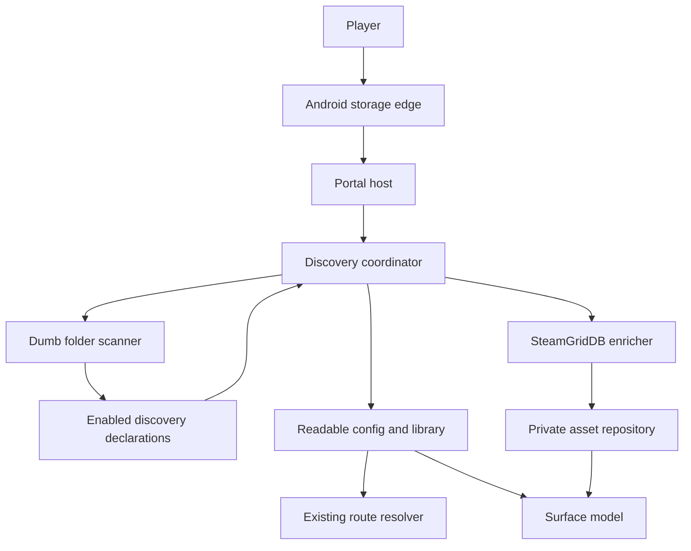
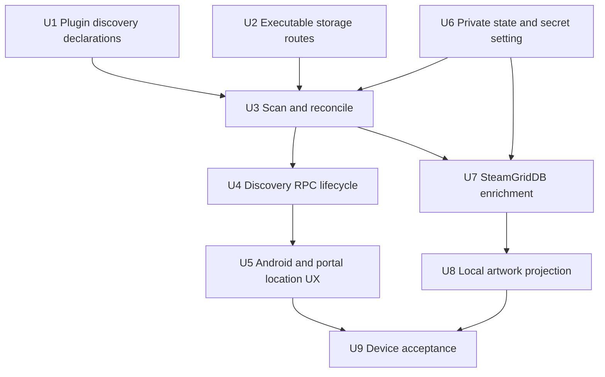
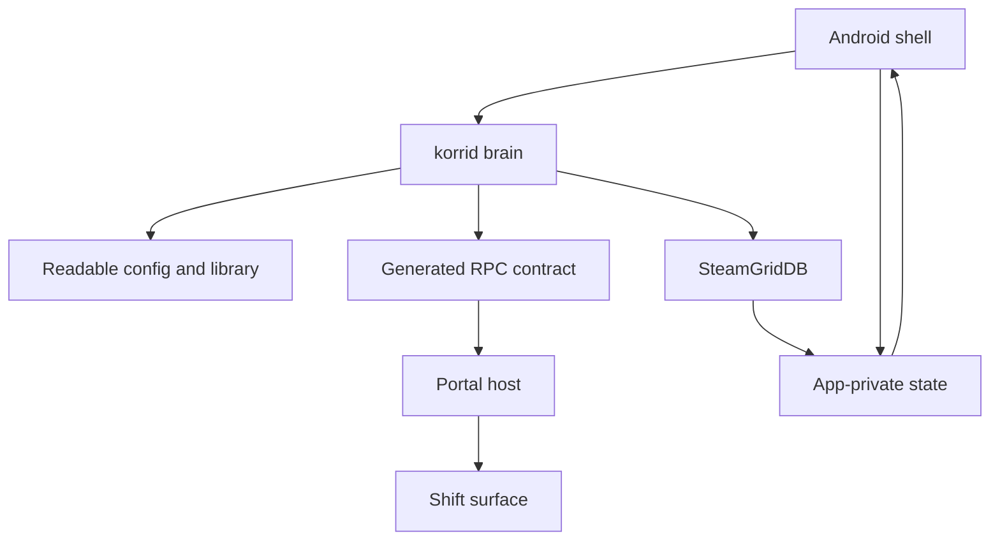

# feat: Add user-selected game discovery

## Summary

Add a korrid-owned discovery pipeline that scans multiple Android folders chosen by the player, lets enabled plugins identify launchable content, persists ordinary readable-library records, and enriches those games asynchronously with high-confidence SteamGridDB titles and locally cached cover art.

---

## Problem Frame

Korri can launch a hand-authored GBA release through its RetroArch and mGBA plugins, but every game and path must already exist in `library.yaml`. The fixed `roms` bucket also makes the current route unsuitable for players whose collections already live in several folders.

Legacy proved most of the required boundaries, but `main` deliberately carries only the launch slice. The implementation must harvest legacy discovery, reconciliation, identity, and asset patterns without restoring its central hard-coded classifier or its wider platform architecture.

---

## Requirements

- R1. A player can add, view, rescan, and remove multiple game folders on Android without any folder becoming a canonical game root.
- R2. Adding a folder triggers an initial scan; later scans happen only through explicit rescan or the required reconciliation sweep after a folder is removed.
- R3. korrid walks only registered folders and turns filesystem entries into normalized observations; enabled plugin declarations own recognition and route knowledge.
- R4. The first discovery contribution recognizes `.gba` files and resolves them through the existing `@korri:retroarch/retroarch` launcher and `@korri:mgba/mgba` runtime.
- R5. A discovered GBA game appears with a filename-derived title and is launchable before any network enrichment completes.
- R6. Repeated scans, nested/overlapping folders, and identical ROM content do not create duplicate visible games; existing authored entries remain authoritative.
- R7. Removing a folder removes only scanner-managed observations associated with that storage record. It never removes an authored entry merely because it points into the same tree.
- R8. One inaccessible folder, unreadable file, conflicting claim, or failed plugin declaration produces a bounded diagnostic and does not prevent other folders from scanning.
- R9. SteamGridDB enrichment runs after discovery and never blocks listing or launching a game.
- R10. Only a verified, exact normalized-title match may automatically replace the derived title or assign cover art. Ambiguous, unverified, and missing matches leave the game unchanged.
- R11. Assigned cover art is downloaded, validated, stored content-addressably in app-private storage, and exposed to the surface through a local URL. The surface never contacts SteamGridDB directly.
- R12. The SteamGridDB credential is write-only from the portal’s perspective, stored in app-private state, never returned to the client, logged, or written under `/storage/emulated/0/korri`.
- R13. Scan, configuration, enrichment, and asset state use explicit tagged outcomes rather than boolean status forests.
- R14. The existing hand-authored `roms` route, Android app routes, Linux host routes, plugin enablement, and storage-access recovery behavior remain valid.

---

## Scope Boundaries

- No Steam/VDF discovery; Steam remains the reference for a later manifest-backed discovery contribution.
- No archives, shared disc extensions, multidisc sets, cue-sheet interpretation, or formats beyond `.gba`.
- No whole-filesystem crawl, persistent watcher, hotplug listener, boot scan, or periodic background rescan.
- No additional emulator systems, metadata services, artwork roles, manual metadata picker, or low-confidence auto-match.
- No missing-file deletion during ordinary rescan. This slice removes scanner-managed observations only when the player removes their registered folder; an absent file otherwise remains a launch-time/scan diagnostic.
- No federation publication or peer synchronization of discovered catalog records or assets.
- No bulk migration of legacy Scout, candidate-YAML, plugin host, or game-assets code.
- No secrets in user-visible YAML, browser storage, URLs, logs, or generated artifacts.

### Deferred to Follow-Up Work

- Manifest-backed Steam discovery using provider references.
- Archive and file-set discovery after a real ambiguous-format case defines the declaration contract.
- Missing-file/stale reconciliation independent of explicit location removal.
- Removable-media arrival handling and other platform-provided location sources.
- Additional metadata providers, manual match correction, asset refresh, and cache garbage collection.
- A compiled internal catalog if device measurements show library-scale readable YAML is too expensive over Android FUSE.

---

## Context & Research

### Relevant Code and Patterns

- `plugins/mgba/plugin.ts` and `services/korrid/plugins/mgba.plugin.ts` already declare the GBA system and the mGBA runtime’s compatibility with the RetroArch launcher.
- `services/korrid/src/plugin.rs` strictly decodes declaration-only plugins; malformed or unsupported fields fail instead of disappearing.
- `services/korrid/src/config/mod.rs` already decodes legacy `storage` records, system aliases, file-target discovery metadata, hash identities, and readable-library releases. Support classification currently rejects non-empty storage records.
- `services/korrid/src/config/resolver.rs` already resolves file targets into routes but deliberately rejects discovery metadata in the current slice.
- `services/korrid/src/launcher/retroarch.rs` proves the Android RetroArch/mGBA launch path but currently accepts only the implicit `roms` storage bucket.
- `services/korrid/src/config/settings.rs` provides conflict-safe, validate-before-replace YAML mutation and atomic writes. Discovery writes should share this policy rather than creating a second writer with weaker guarantees.
- `services/korrid/src/launcher/types.rs` and `clients/android/app/src/main/java/com/limelight/KorriLocalLaunchSpec.java` form the signed Rust-to-Android launch boundary. Read-only ROM access may grow, but provisioned files and directories must remain constrained to the Korri root.
- `clients/android/app/src/main/java/com/limelight/KorriShellActivity.java` owns Android storage truth, bridge actions, WebView asset loading, and the exact user-visible Korri root.
- `contracts/bridge/korri-native-bridge.ts`, `clients/portal/src/bridge/launcher-bridge.ts`, and `clients/portal/src/surface/settings-model.ts` are the current path from native platform actions to host-composed settings.
- `contracts/surface/korri-surface.ts` already exposes `SurfaceGame.coverArtUrl`; `surfaces/shift/src/ShiftSurface.tsx` already consumes it with a fallback when absent.
- `clients/portal/src/launchables/fold-games.ts` already folds copies carrying the same hash or provider identity.
- `docs/research/retroarch-plugin-route/` is the current end-to-end GBA route fixture.
- `docs/research/global-storage-on-android.md` establishes that the embedded Rust process can use direct filesystem paths only while Android’s all-files access is granted, and that shared-storage traversal has meaningful FUSE cost.
- `docs/research/watching-config-vs-checking-it.md` supports explicit event-triggered work over a persistent polling watcher on Android shared storage.
- `legacy:product/platform/plugin/discovery.ts` is the presumptive observation vocabulary: normalized file descriptors, file-backed releases, provider-reference releases, confidence, and evidence.
- `legacy:product/plugins/retroarch/src/discovery.ts` demonstrates plugin-owned extension/folder rules; `legacy:product/plugins/steam/src/discovery.ts` demonstrates that a manifest may be evidence without becoming the launch target.
- `legacy:product/platform/library/discovery/release-candidate-scan.ts` demonstrates deterministic scan reporting, path/hash/provider reconciliation, identity backfill, overlap diagnostics, and additive readable-library writes.
- `legacy:product/platform/library/config/records/game-asset.ts` and `legacy:product/platform/library/config/records/game-asset-assignment.ts` define the baseline content-addressed image and role-assignment records to preserve deliberately.

### Institutional Learnings

- Plugins declare; korrid performs filesystem, network, persistence, and process effects. The QuickJS sandbox must remain empty.
- External sources are evidence feeding Korri-owned records, not runtime databases. SteamGridDB must not become a live dependency of library rendering.
- Shared-storage YAML is appropriate for user-visible authored configuration, but thousands of per-render reads are not. A scan writes one validated batch and normal reads consume the composed snapshot; the portal does not rescan folders while rendering.
- Android storage permission revocation is a normal recoverable state. Scan and launch failures must remain tagged and user-facing rather than exposing raw filesystem errors.
- Path containment is checked after canonicalization. Symlink traversal must not escape a selected location or turn a read-only content location into a write capability.

### External References

- SteamGridDB API v2 OpenAPI specification: https://www.steamgriddb.com/static/openapi.yml
- SteamGridDB API wrapper and usage examples: https://github.com/SteamGridDB/node-steamgriddb
- Android shared document/folder selection guidance: https://developer.android.com/training/data-storage/shared/documents-files

SteamGridDB v2 requires bearer authentication. Retro systems have no platform-ID lookup, so GBA enrichment must use name search. The service does not publish a fixed rate limit; implementation must therefore serialize requests, honor `Retry-After`, and apply bounded retry/backoff for transient failures.

---

## Key Technical Decisions

| Decision | Resolution and rationale |
|---|---|
| Discovery persistence | Extend the existing `storage` and `library` collections instead of introducing a scanner-only catalog. Preserve a small app-private ownership journal only for reconciliation/recovery; it is not a second catalog or launch source. |
| Scanner ownership | Existing discovery metadata remains an observation fact, not proof of ownership. The private journal records which exact generated release payload Korri last wrote; removal mutates a record only while its current fingerprint still matches that journal, so copied or hand-edited YAML becomes user-owned rather than deletable. |
| Discovery knowledge | Add a data-only plugin contribution derived from legacy’s observation seam. The mGBA plugin owns the `.gba` claim and names the existing system, launcher, and runtime identities. The host does not regain a central extension table. |
| Location selection | Android opens a native folder chooser and accepts only external-storage selections that can be safely resolved to a canonical direct path for the embedded Rust process. Virtual document providers are rejected with a recoverable result. |
| Storage execution | Route resolution converts an implicit `roms` target or an explicit registered storage target into one validated absolute ROM path. Launchers do not reimplement location policy. |
| Content identity | SHA-256 is computed during bounded candidate processing and remains the durable duplicate/federation identity already understood by `GameIdentity` and the portal fold. |
| Mutation policy | Generalize the existing brain write lock across settings, discovery, and enrichment. `config.yaml` is the location commit point: add/remove commits that document first, then reconciles `library.yaml`; the private journal retains incomplete cleanup/addition work for retry after interruption. Single-document edits remain validate-before-rename. |
| Scan lifecycle | One coordinator serializes add/remove/rescan/enrichment mutations and publishes a tagged `Idle`, `Scanning`, `Enriching`, or `Problem` snapshot plus an opaque generation. Games become readable after the scan write, while bounded enrichment continues. |
| Enrichment matching | Normalize names with the proven legacy filename decoration rules. Auto-apply only one verified SteamGridDB result whose normalized name exactly equals the normalized query. |
| Asset storage | Preserve legacy’s content-addressed image and assignment concepts, but keep the ownership journal, downloaded blobs, assignments, enrichment attempts, and API credential under an Android-supplied app-private state root. |
| Asset delivery | Map a narrow app-private game-assets directory through Android’s existing `WebViewAssetLoader`; the portal converts an assigned asset identity into a local URL before publishing `SurfaceGame`. |
| Secret handling | Extend settings with a write-only sensitive value. Snapshots expose only configured/not-configured state, while korrid owns private persistence and the SteamGridDB HTTP client. |

---

## Open Questions

### Resolved During Planning

- Should scanning assume `/storage/emulated/0/korri/roms`? No. That remains one valid implicit storage route; selected locations become additional storage records.
- Should scanner knowledge live in korrid? No. korrid owns traversal and effects; enabled plugins own recognition and route declarations.
- Should a separate scanner index be introduced? No. Legacy and current readable-library schemas cover the case, and a second launch-resolution path would duplicate catalog behavior.
- Should metadata gate catalog visibility? No. The scan commits first; enrichment is a later state.
- Should the surface load remote artwork? No. korrid downloads and validates bytes, Android serves a local app-private asset, and the surface receives only the resolved local URL.
- Should SteamGridDB’s first result be accepted? No. Automatic assignment requires one verified exact normalized-title match.
- Should SAF content URIs become a second filesystem abstraction in korrid? No in this slice. The Android edge accepts only selections that resolve to direct external-storage paths already accessible under the existing all-files permission model.

### Deferred to Implementation

- The opaque storage-record key format: allocate it through one policy helper and test stability/collision handling; do not expose its encoding as product vocabulary.
- Exact traversal work budget and transient retry delays: keep both bounded and injectable in tests, then choose constants without changing the public contracts.
- Exact private-state filenames, journal serialization, and directory fan-out: preserve the ownership/attempt semantics in this plan without exposing internal paths or formats over RPC.
- Whether the existing atomic YAML writer is generalized in place or extracted behind a small config-document repository: choose the smaller change after characterization tests protect current settings writes.
- Exact scan and enrichment batch budgets: keep them injectable and finite, then set constants from the existing Android FUSE measurements and record real-device evidence without making the numbers public contract.

---

## Output Structure

The expected new module shape is directional; implementation may combine files where that produces a deeper module.

```text
services/korrid/src/
├── discovery/
│   ├── mod.rs
│   ├── coordinator.rs
│   ├── reconcile.rs
│   ├── scanner.rs
│   └── title.rs
├── enrichment/
│   ├── mod.rs
│   └── steamgriddb.rs
└── game_assets.rs
```

---

## High-Level Technical Design

> *This illustrates the intended approach and is directional guidance for review, not implementation specification. The implementing agent should treat it as context, not code to reproduce.*



The scanner emits path facts. Plugin declarations convert matching facts into candidate release observations. Reconciliation validates and atomically merges those observations into ordinary storage/library records. The existing resolver remains the only path to a launch. Enrichment reads committed game identity/title, writes private asset assignments, and cannot make a discovered route unavailable.

---

## Implementation Units



### U1. Add plugin-owned release discovery declarations

**Goal:** Let enabled declaration-only plugins announce how normalized file observations become release candidates, beginning with mGBA’s `.gba` route.

**Requirements:** R3, R4, R8, R14

**Dependencies:** None

**Files:**
- Modify: `services/korrid/src/plugin.rs`
- Modify: `services/korrid/src/plugin_policy.rs`
- Modify: `services/korrid/plugins/mgba.plugin.ts`
- Modify: `plugins/mgba/plugin.ts`
- Test: `services/korrid/tests/plugin_registry.rs`
- Test: `services/korrid/tests/plugin_policy.rs`
- Test: `services/korrid/tests/retroarch_plugin_route.rs`

**Approach:**
- Harvest the narrow data vocabulary from `legacy:product/platform/plugin/discovery.ts`, but adapt it to main’s declaration-only sandbox: plugins declare predicates and resulting system/launcher/runtime identities; they do not receive callbacks or perform reads.
- Add system alias decoding to the plugin record only to mirror the already-supported readable system schema. The first `.gba` rule does not depend on speculative alias values.
- Have the mGBA plugin own the GBA claim because it owns format compatibility and already names the RetroArch launcher it requires.
- Registry construction validates that discovery IDs are plugin-qualified, referenced identities exist after policy, extensions are normalized/non-empty, and disabled plugins contribute no claims.
- Keep Steam-style manifest parsing out of this contract until the later Steam slice forces richer evidence rules.

**Execution note:** Implement the declaration decoder and registry behavior test-first; unsupported fields currently fail closed and that invariant must not regress.

**Patterns to follow:**
- Strict contribution normalization in `services/korrid/src/plugin.rs`.
- Enablement filtering in `services/korrid/src/plugin_policy.rs`.
- Ownership rules documented in `services/korrid/SCRIPTING.md`.
- Observation ownership and malformed-provider handling in `legacy:product/platform/plugin/discovery.ts` and `legacy:product/platform/library/discovery/release-candidate-scan.ts`.

**Test scenarios:**
- Happy path: enabled mGBA declaration exposes one `.gba` file-release claim naming `gba`, `@korri:retroarch/retroarch`, and `@korri:mgba/mgba`.
- Edge case: extension matching is case-insensitive after normalization, while unrelated extensions remain unclaimed.
- Error path: empty, duplicate, cross-plugin-owned, or unknown route identities reject the declaration explicitly.
- Error path: a declaration that attempts executable discovery code or unsupported fields fails rather than being silently ignored.
- Integration: disabling mGBA withholds its system, runtime, and discovery claim while leaving RetroArch’s launcher declaration intact.

**Verification:**
- The plugin registry can answer which enabled declaration claims a normalized `.gba` observation without touching the filesystem or network.

### U2. Execute registered storage roots through the existing route

**Goal:** Make current storage records and discovery metadata executable, resolving selected folders into safe absolute ROM paths while preserving the existing implicit `roms` route.

**Requirements:** R1, R4, R5, R7, R14

**Dependencies:** None

**Files:**
- Create: `services/korrid/src/config/storage.rs`
- Modify: `services/korrid/src/config/mod.rs`
- Modify: `services/korrid/src/config/resolver.rs`
- Modify: `services/korrid/src/launcher/retroarch.rs`
- Modify: `services/korrid/src/launcher/types.rs`
- Modify: `clients/android/app/src/main/java/com/limelight/KorriLocalLaunchSpec.java`
- Test: `services/korrid/tests/config_snapshot.rs`
- Test: `services/korrid/tests/retroarch_plugin_route.rs`
- Test: `clients/android/app/src/test/java/com/limelight/KorriLocalLaunchSpecTest.java`

**Approach:**
- Treat `storage` records as named read roots. On Android, selected roots must be absolute, canonicalizable external-storage directories; library targets remain safe relative paths beneath them.
- Centralize storage resolution so route resolution produces one validated absolute content path. RetroArch no longer knows how storage IDs map to roots.
- Preserve `storage: roms` as the existing built-in mapping to the exact Korri root’s `roms` child; it remains valid without an authored storage record.
- Allow `target.discovery.first-seen-at` to pass through route resolution as persistence-only evidence. It must not alter launch behavior.
- Extend the signed launch contract with the resolved authorized content root. Android independently canonicalizes the RetroArch ROM argument and requires it to remain beneath that signed root and a real `StorageManager` volume; HMAC origin alone is not treated as containment. All provisioned directories/files and other external-storage extras stay confined to `/storage/emulated/0/korri`.
- Validate canonical containment and reject absolute release paths, parent traversal, symlink escapes, missing storage IDs, non-directory roots, and non-file ROM targets.

**Execution note:** Add characterization coverage for the existing implicit `roms` route and native path validator before relaxing either guard.

**Patterns to follow:**
- Current path checks in `services/korrid/src/launcher/retroarch.rs`.
- Signed-spec validation in `clients/android/app/src/main/java/com/limelight/KorriLocalLaunchSpec.java`.
- Legacy `StoragePayload` semantics in `legacy:product/platform/library/config/records/storage.ts`.

**Test scenarios:**
- Happy path: an explicit storage root plus relative `.gba` target resolves, lists, and generates a RetroArch launch spec containing the selected ROM’s canonical path.
- Integration: a file target carrying `first-seen-at` resolves identically to the same target without discovery metadata.
- Regression: the existing `storage: roms` fixture still resolves beneath `/storage/emulated/0/korri/roms` without a storage record.
- Error path: missing storage ID, relative storage root, non-directory root, absolute target path, parent traversal, and symlink escape each produce a route diagnostic.
- Native security: a verified RetroArch ROM argument is accepted only when it remains beneath the signed authorized content root and a real external-storage volume; tampered roots, escaped ROMs, arbitrary extras, and every provisioned write outside the Korri root remain rejected.
- Regression: Android-app launch specs still carry no extras or provisioning.

**Verification:**
- A hand-authored library release in a non-`roms` storage record can use the same tested RetroArch/mGBA route without weakening provision-write confinement.

### U3. Scan and reconcile selected folders into readable-library records

**Goal:** Build the dumb scanner, deterministic candidate conversion, content identity, deduplication, and conflict-safe storage/library mutation.

**Requirements:** R1, R2, R3, R5, R6, R7, R8, R13

**Dependencies:** U1, U2, U6

**Files:**
- Create: `services/korrid/src/discovery/mod.rs`
- Create: `services/korrid/src/discovery/scanner.rs`
- Create: `services/korrid/src/discovery/reconcile.rs`
- Create: `services/korrid/src/discovery/title.rs`
- Modify: `services/korrid/src/config/settings.rs`
- Test: `services/korrid/tests/game_discovery.rs`
- Test: `services/korrid/tests/config_snapshot.rs`

**Approach:**
- Enumerate each registered root once using Rust filesystem APIs available in the Android cdylib. Produce normalized descriptors; do not shell out to `find` as legacy did.
- Canonicalize every directory and candidate file before reading content; require a strict descendant relationship to the canonical selected root before hashing, claiming, or persistence. Escapes receive a sanitized containment diagnostic. Sort entries within each directory before traversal so output is deterministic without buffering the whole tree.
- Ask the enabled registry for claims. The scanner knows no extensions or systems itself.
- Derive fallback titles using legacy’s proven filename normalization: remove the recognized extension, strip bracketed/parenthesized dump decorations, normalize separators/whitespace, and retain a non-empty fallback.
- Hash accepted candidates with SHA-256, then reconcile against effective authored and generated releases by storage/path, canonical absolute path, and known hash. Preserve authored titles/routes and backfill identity only through a safe local whole-record update.
- Persist selected locations as ordinary storage records and generated candidates as ordinary library items with file-target discovery metadata. The existing storage key is the location identity; no duplicate user-visible path field or scanner-branded schema is added.
- Preserve a private ownership journal keyed by storage/library/release identity and the fingerprint of the exact generated payload last written. `first-seen-at` remains authorable observation metadata and is never treated alone as deletion permission.
- Mutate raw YAML mappings rather than serializing `ConfigSnapshot`, then validate the complete candidate pair. This preserves authored collections, metadata, comments-insensitive values, and unsupported-but-decodable fields.
- Generalize the existing brain write lock across every config/library writer. Adding or removing a location commits `config.yaml` first; candidate addition or generated-record cleanup follows in `library.yaml`. An interruption therefore leaves either an empty registered location or hidden orphaned generated records, and the private journal makes the next coordinator operation retry the incomplete reconciliation.
- Removing a location deletes a generated release only when its current payload still matches the ownership journal. A hand-edited or unjournaled release survives and loses scanner ownership. If a generated item has no remaining releases it may be removed. Perform a full sweep of remaining locations so a duplicate formerly suppressed behind the removed location can become visible.
- Backfill an authored release’s missing hash only after an exact storage/path or canonical-path match; never overwrite an existing differing identity, add discovery metadata, or change authored title/route fields.
- Stream SHA-256 calculation and cache file size/mtime/hash evidence in private state so unchanged files are not re-read on rescan. Ordinary rescan remains additive: it does not delete entries for missing individual files.

**Execution note:** Port behavior in small test-first slices: descriptors and claims, then candidate records, then reconciliation, then atomic mutation/removal.

**Patterns to follow:**
- Atomic conflict handling in `services/korrid/src/config/settings.rs`.
- Candidate generation and title normalization in `legacy:product/platform/library/discovery/rom-scan-classifier.ts`.
- Claimed-content indexing, overlap handling, and identity backfill in `legacy:product/platform/library/discovery/release-candidate-scan.ts`.
- Real tempfile/filesystem tests rather than filesystem doubles.

**Test scenarios:**
- Happy path: two registered folders containing distinct `.gba` files create two schema-valid library entries with fallback titles, storage-relative targets, first-seen metadata, and hash identities.
- Happy path: uppercase `.GBA` is claimed by the normalized mGBA rule; an unrelated file is reported unclaimed and not persisted.
- Edge case: the same scan repeated with a different directory enumeration order produces no duplicate or byte-semantic library change.
- Edge case: nested or overlapping roots observing the same canonical file produce one visible identity and an overlap diagnostic; earliest registration wins deterministically until removal.
- Edge case: two copied files with the same SHA-256 identity do not create duplicate visible games.
- Edge case: non-ASCII, punctuation-heavy, numeric-leading, and decoration-heavy filenames produce schema-valid deterministic playable IDs using the legacy slug-and-collision pattern.
- Security: a file or directory symlink escaping the canonical selected root is diagnosed before hashing, claiming, or persistence; the diagnostic reveals no absolute escape target.
- Integration: an authored same-path or same-hash release wins; missing identity may be backfilled without changing its title, launch route, or unrelated releases.
- Integration: removing one selected folder deletes only journal-owned, fingerprint-matching releases for its storage key, preserves authored or changed entries, and rescans remaining folders.
- Error path: unreadable folder/file, disappearing file, malformed claim, claim conflict, and symlink escape are reported without aborting successful sibling folders.
- Concurrency: a conflicting external edit between read and rename rejects the scanner write rather than overwriting it.
- Recovery: interruption after location add/remove commits `config.yaml` but before the library edit leaves a tagged repair obligation; the next coordinator operation converges without deleting authored content.
- Ownership: copying or editing a generated record so its fingerprint differs from the journal prevents automatic deletion on location removal.
- Performance: a repeated scan of unchanged files reuses cached stat/hash evidence and performs no ROM-content reads.
- Regression: existing unsupported library/config fields remain preserved by a scanner mutation, and lifting storage support does not lift unrelated support guards.

**Verification:**
- A real temporary two-folder library survives repeated add/rescan/remove cycles with deterministic, launch-resolvable, non-destructive records.

### U4. Expose a serialized discovery lifecycle over tagged RPC

**Goal:** Give the portal one stable contract for location snapshots, add/remove, rescan, progress, and diagnostics without blocking rendering or running overlapping scans.

**Requirements:** R1, R2, R5, R8, R9, R13

**Dependencies:** U3

**Files:**
- Create: `services/korrid/src/discovery/coordinator.rs`
- Modify: `services/korrid/src/lib.rs`
- Regenerate: `contracts/generated/korrid.ts`
- Modify: `clients/portal/src/korrid/client.ts`
- Test: `services/korrid/tests/game_discovery.rs`
- Test: `clients/portal/src/korrid/client.test.ts`

**Approach:**
- Add narrow tagged operations for reading the discovery snapshot, registering a selected canonical path, removing a location by opaque ID, and requesting a rescan.
- Model lifecycle as a discriminated state with location summaries, bounded diagnostics, and an opaque monotonic generation. Do not add independent `scanning`, `enriching`, `failed`, and `ready` booleans.
- Serialize mutations and scans through one coordinator. Concurrent rescan requests coalesce or return the current state rather than starting duplicate filesystem work.
- Registering a new folder persists it and begins one scan. Removing a folder runs the removal/reconcile behavior from U3. Explicit rescan covers all registered locations.
- Publish scan completion before enrichment completion. During `Enriching`, normal local-game reads return the committed games. Enrichment title/assignment writes return through this coordinator and the shared document lock rather than racing scans.
- Keep the existing `app.local-games.list` and launch contracts focused on catalog and launch behavior; discovery management uses its own operations.

**Patterns to follow:**
- Tagged RPC request/response definitions and dispatch in `services/korrid/src/lib.rs`.
- Real in-memory HTTP client behavior in `clients/portal/src/korrid/client.ts`.
- Explicit state models in `clients/portal/src/launchables/state.ts`.

**Test scenarios:**
- Happy path: register returns a scanning snapshot; a later snapshot reaches idle with the new location and local game visible.
- Happy path: rescan while idle enters scanning and returns to idle without duplicating records.
- Edge case: a second rescan during scanning does not create a concurrent writer or second traversal.
- Error path: invalid/unreadable path produces a tagged location/scan problem while preserving prior successful catalog state.
- Integration: local-game listing succeeds during enrichment and launch uses the committed pre-enrichment route.
- Contract: generated TypeScript tags map to the correct HTTP and in-memory client outcomes without casts or hand-written duplicate wire types.
- Polling: unchanged generations do not republish portal state, and active polling cannot overlap requests.

**Verification:**
- Browser development and production HTTP clients can drive the entire discovery lifecycle through the same generated contract.

### U5. Add Android folder selection and location management UX

**Goal:** Let a player choose a path-backed external-storage folder and manage registered locations from Korri settings.

**Requirements:** R1, R2, R7, R8, R13

**Dependencies:** U4

**Files:**
- Modify: `contracts/bridge/korri-native-bridge.ts`
- Modify: `clients/android/app/src/main/java/com/limelight/KorriShellActivity.java`
- Create: `clients/android/app/src/test/java/com/limelight/KorriGameFolderBridgeTest.java`
- Modify: `clients/portal/src/bridge/launcher-bridge.ts`
- Modify: `clients/portal/src/bridge/launcher-bridge.test.ts`
- Modify: `clients/portal/src/surface/settings-model.ts`
- Modify: `clients/portal/src/surface/settings-model.test.ts`
- Modify: `clients/portal/src/surface/use-launchables.ts`
- Modify: `contracts/surface/korri-surface.ts`
- Modify: `surfaces/shift/src/ui/organisms/ShiftSettingSheet.tsx`
- Test: `surfaces/shift/test/shift-surface.test.tsx`

**Approach:**
- Add a versioned bridge action that opens Android’s folder chooser. Because selection is asynchronous, follow the existing “open native UI, re-read on shell resume” pattern rather than blocking a JavaScript-interface call.
- The native edge accepts only the platform ExternalStorageProvider authority, parses its tree document identity, maps it through Android `StorageManager` volumes, and verifies canonical containment beneath that volume. Cancellation is normal; third-party/virtual providers, volume roots Android forbids, and unresolvable trees return recoverable explanations.
- Reuse the existing all-files-access fact. If access is denied, the location action routes the player to the established permission recovery before registration.
- The portal sends a selected path to the discovery RPC; it never persists paths in browser storage.
- Compose a Games settings group containing registered folders, Add folder, Rescan, and removal actions. Removal requires an explicit destructive confirmation before calling korrid.
- Poll/reload only while the discovery snapshot is active, then stop. Display calm scan/enrichment state and per-location problems without blocking the already-ready catalog.
- Keep folder/path terminology in the host model; surfaces remain filesystem-blind beyond the human-readable setting labels they receive.

**Execution note:** Characterize shell-resume and setting-action behavior before adding the asynchronous picker result.

**Patterns to follow:**
- Storage permission and native-screen actions in `KorriShellActivity.java` and `contracts/bridge/korri-native-bridge.ts`.
- Re-read-on-resume orchestration in `clients/portal/src/surface/use-launchables.ts`.
- Host-composed settings in `clients/portal/src/surface/settings-model.ts`.

**Test scenarios:**
- Happy path: selecting a path-backed folder registers it, starts scanning, and eventually updates the local-game count.
- Happy path: two independently selected folders appear as separate settings rows.
- Cancellation: backing out of the Android chooser performs no RPC mutation and leaves settings idle.
- Error path: denied all-files access routes through the existing permission action; a non-platform provider authority or unresolvable/cloud tree reports an actionable problem without registering it.
- Edge case: selecting an already-registered canonical folder focuses/returns the existing location rather than duplicating it.
- Removal: confirmation removes the selected location and its generated observations; cancelling confirmation changes nothing.
- Rescan: repeated confirmation while a scan is active cannot start duplicate work.
- Browser fixture: the in-memory bridge can deliver configured selection/cancel/failure outcomes without live Android or network calls.

**Verification:**
- The complete location workflow is usable with touch/controller focus and remains reproducible in browser fixtures.

### U6. Introduce app-private runtime state and a write-only credential setting

**Goal:** Give embedded korrid a private root for reconciliation state, secrets, and downloaded assets, then allow the player to configure SteamGridDB without exposing the key in snapshots or shared storage.

**Requirements:** R11, R12, R13, R14

**Dependencies:** None

**Files:**
- Modify: `clients/android/app/src/main/java/com/simonwjackson/korri/korrid/KorriBrainService.java`
- Modify: `clients/android/app/src/main/java/com/simonwjackson/korri/korrid/KorridServer.java`
- Modify: `clients/android/app/src/main/java/com/limelight/KorriShellActivity.java`
- Modify: `services/korrid/src/android.rs`
- Modify: `services/korrid/src/lib.rs`
- Modify: `services/korrid/src/config/settings.rs`
- Modify: `contracts/surface/korri-surface.ts`
- Modify: `clients/portal/src/surface/settings-model.ts`
- Modify: `surfaces/shift/src/ui/organisms/ShiftSettingSheet.tsx`
- Test: `clients/android/app/src/test/java/com/limelight/KorriSettingsBridgeTest.java`
- Test: `services/korrid/tests/config_snapshot.rs`
- Test: `clients/portal/src/surface/settings-model.test.ts`
- Test: `surfaces/shift/test/shift-surface.test.tsx`

**Approach:**
- Inject an Android app-private state root alongside the existing user-visible storage root when starting the embedded server. Standalone korrid resolves an equivalent private state root from its existing environment/config conventions.
- Keep these roots semantically separate: readable config/library stays at the exact Korri root; discovery ownership/hash evidence, credentials, enrichment attempt state, assignments, and asset blobs live only under private state.
- Add a sensitive text interaction to the surface treaty so Shift renders a password-style empty editor. The current value is never sent to the surface.
- Extend settings with configured/not-configured status plus write and clear actions for the SteamGridDB credential. Writes go directly to private state through korrid’s shared mutation policy; snapshots expose only status.
- Write/replace the credential atomically under the generalized process write lock and clear it with an equally crash-safe operation. No revision token or readable-config write participates.
- Ensure validation and HTTP errors are mapped to provider-owned codes before stringification; they never include authorization headers or the submitted key, and structured logs mention only provider/configuration state.

**Patterns to follow:**
- Dual runtime parameters in `KorriBrainService.java` and `services/korrid/src/android.rs`.
- Conflict-safe settings updates in `services/korrid/src/config/settings.rs`.
- Sensitive-data rule in the repository standards.

**Test scenarios:**
- Happy path: setting a key changes the snapshot from Not configured to Configured without returning the key.
- Happy path: clearing the key returns to Not configured and removes private persisted bytes.
- Security: shared `config.yaml`, `library.yaml`, RPC responses, HTTP failure diagnostics, captured logs, and browser storage contain no submitted key or bearer header.
- Error path: an unavailable/unwritable private root produces a tagged settings failure without changing readable config.
- Android lifecycle: activity/service double-start and service restart pass the same private root and preserve the credential.
- Surface: sensitive interaction renders a password input initialized empty even when status says Configured.
- Regression: device-name and plugin settings keep their existing revision/conflict behavior.

**Verification:**
- A configured SteamGridDB token survives an Android service lifecycle but is observable outside korrid only as a boolean status.

### U7. Enrich committed games through SteamGridDB

**Goal:** Add a bounded, retry-aware SteamGridDB v2 adapter that improves only verified exact matches and stores one validated square cover assignment.

**Requirements:** R5, R9, R10, R11, R12, R13

**Dependencies:** U3, U6

**Files:**
- Create: `services/korrid/src/enrichment/mod.rs`
- Create: `services/korrid/src/enrichment/steamgriddb.rs`
- Create: `services/korrid/src/game_assets.rs`
- Modify: `services/korrid/src/discovery/coordinator.rs`
- Modify: `services/korrid/src/launcher/types.rs`
- Test: `services/korrid/tests/game_enrichment.rs`
- Test: `services/korrid/tests/game_discovery.rs`

**Approach:**
- Start enrichment only after a successful scan commit and only for discovery-managed games without an assigned cover. Absence of a credential becomes a provider configuration diagnostic, not a game-discovery failure.
- Use SteamGridDB API v2 name autocomplete for GBA. Normalize the query and candidate names with the same pure title function used by discovery.
- Auto-accept only when exactly one verified result has an exact normalized-name match. Do not retain or expose ambiguous candidates in this slice.
- Fetch only the highest-ranked static, non-NSFW/non-humor/non-epilepsy 1x1 grid needed by Shift’s tile role.
- Serialize requests through one worker. Honor `Retry-After`; apply bounded backoff to transient rate-limit/server failures; do not retry malformed requests, unauthorized credentials, no-match, or ambiguous outcomes in the same run.
- Use a configured real HTTP adapter in tests against an in-process server. Do not introduce mock/fake provider classes.
- Process a finite ordered batch per coordinator cycle and persist attempted/succeeded state privately so ambiguous/no-match games cannot starve later entries and a restart resumes remaining work.
- Accept only HTTPS image URLs, disable redirects, and reject loopback/private/link-local destinations before download. Convert authenticated request failures to sanitized status-owned diagnostics rather than exposing raw client error strings.
- Check declared length before body transfer where available, then stream bytes through size limits, hashing, and format/dimension validation before atomically promoting a content-addressed private blob. Preserve the exact legacy game-asset source and assignment semantics, including sanitized SteamGridDB provenance.
- A verified exact match may update a discovery-managed fallback title and assign the cover. It never rewrites an authored title or launch route.
- Publish `Enriching` while work remains, then return to `Idle` with bounded diagnostics. Explicit rescan is the retry mechanism for skipped/transient failures in this MVP.

**Execution note:** Build the state conversion, matcher, HTTP adapter, and asset promotion test-first with deterministic clock/delay configuration.

**Patterns to follow:**
- Existing `reqwest` use and configurable in-process HTTP tests in `services/korrid`.
- Asset validation and promotion in `legacy:product/platform/library/game-assets/game-assets-service.ts`.
- Asset/source/assignment records in `legacy:product/platform/library/config/records/game-asset.ts` and `legacy:product/platform/library/config/records/game-asset-assignment.ts`.
- SteamGridDB candidate acquisition in `legacy:tools/importers/steamgriddb/fetch-korri-steamgriddb-art`, excluding its first-result fallback.

**Test scenarios:**
- Happy path: a verified exact normalized title produces a canonical title update, one content-addressed image blob, sanitized SteamGridDB provenance, and one tile assignment.
- High-confidence guard: an unverified exact result, fuzzy-only result, multiple verified exact results, and no result each leave title/art unchanged.
- Offline behavior: network refusal/timeout leaves the launchable game intact and records a bounded transient diagnostic.
- Authentication: missing credential skips provider work; unauthorized response halts the current enrichment run and reports one configuration problem rather than one error per game.
- Rate limit: a real in-process HTTP response with `Retry-After` is retried through the injected delay policy and succeeds within the retry budget.
- Bounded work: more eligible games than the configured batch budget processes only that batch, persists attempt progress, and resumes later games on the next cycle/restart.
- Network safety: non-HTTPS/private destinations and redirects toward localhost are rejected without making the second request.
- Redaction: a 401 and a transport error produce provider diagnostics containing neither `Bearer` nor any substring of the configured test credential.
- Asset safety: oversized, unsupported, malformed, dimension-inconsistent, and truncated image bytes are rejected without creating an assignment or partial blob.
- Idempotency: an already assigned game makes no search/download request on a repeated scan.
- Persistence: process restart can read the private assignment/blob and does not require SteamGridDB for rendering.
- Authored boundary: an authored library title/route sharing the same hash is not overwritten by enrichment.

**Verification:**
- Discovery and launch tests pass with SteamGridDB entirely unavailable, while configured exact-match fixtures produce durable local cover assignments.

### U8. Project private cover assignments into the surface

**Goal:** Deliver assigned private artwork through the Android host and populate the existing `SurfaceGame.coverArtUrl` without exposing filesystem paths or adding surface network behavior.

**Requirements:** R5, R9, R11, R14

**Dependencies:** U7

**Files:**
- Modify: `services/korrid/src/launcher/types.rs`
- Modify: `services/korrid/src/launcher/mod.rs`
- Regenerate: `contracts/generated/korrid.ts`
- Modify: `clients/android/app/src/main/java/com/limelight/KorriShellActivity.java`
- Create: `clients/android/app/src/test/java/com/limelight/KorriGameAssetsPathTest.java`
- Modify: `clients/portal/src/bridge/launcher-bridge.ts`
- Modify: `clients/portal/src/surface/surface-model.ts`
- Modify: `clients/portal/src/surface/surface-model.test.ts`
- Test: `surfaces/shift/test/shift-surface.test.tsx`

**Approach:**
- Add an optional opaque cover asset identity to the Rust-owned local-game contract. Do not send private absolute paths or third-party URLs.
- Map a single app-private game-assets directory into `WebViewAssetLoader` under the existing trusted HTTPS origin. The handler parses one opaque content-addressed asset identity through an allowlist, resolves the corresponding known extension from the assignment repository, and never appends a raw URL path to the private root.
- Let the portal host convert the opaque assigned asset identity into the local WebView URL and then populate `SurfaceGame.coverArtUrl`.
- Keep browser preview support at the same seam: the in-memory bridge supplies configured local/data fixture URLs without intercepting fetch or contacting SteamGridDB.
- Missing assignments, missing blobs, or malformed asset identities remain absence, preserving Shift’s existing visual fallback.

**Patterns to follow:**
- Existing `/assets/` WebView mapping in `KorriShellActivity.java`.
- “Host owns facts; surface owns pixels” in `contracts/surface/korri-surface.ts`.
- Current no-invented-art assertion in `clients/portal/src/surface/surface-model.test.ts`.

**Test scenarios:**
- Happy path: a local game carrying a valid assigned asset becomes a `SurfaceGame` with the trusted local cover URL and Shift renders it.
- Fallback: no assignment, missing blob, or malformed asset identity produces no `coverArtUrl` and retains the existing monogram/fallback presentation.
- Security: traversal, extra path segments, absolute paths, query/fragment variants, malformed hashes, unknown extensions, and non-content-addressed requests return no resource without touching files outside the mapped asset directory.
- Preview: browser fixtures render assigned cover art without a live korrid or external request.
- Regression: remote games and existing local games without art keep their current model shape and launch behavior.

**Verification:**
- The WebView renders cached art while offline, and inspecting the surface model reveals neither SteamGridDB URLs nor private filesystem paths.

### U9. Prove the multi-location journey on a real Android device

**Goal:** Add a repeatable device gate for selected-location discovery, launch, permission degradation, and offline fallback.

**Requirements:** R1, R2, R4, R5, R6, R8, R9, R11, R14

**Dependencies:** U5, U8

**Files:**
- Create: `services/korrid/android-game-discovery-check.sh`
- Modify: `services/korrid/android-device-script-review.sh`
- Modify: `nix/tasks.nix`
- Modify: `services/korrid/check.sh`
- Test: `clients/android/app/src/test/java/com/limelight/KorriGameFolderBridgeTest.java`

**Approach:**
- Add a Nix task that takes an explicit adb serial, installs/builds through existing Android gates, stages controlled `.gba` fixtures in two external-storage folders, registers them through the production RPC seam, and proves both are listed.
- Re-run scanning and overlap one fixture to prove idempotency/deduplication, then launch one discovered entry through the production signed RetroArch route.
- Run without a SteamGridDB credential/network dependency to prove filename-title and fallback-art behavior are sufficient for play.
- Record scan duration and hashed-byte count for the controlled fixtures, and prove a repeated unchanged scan performs no ROM-content hashing. Capture evidence without turning the initial measurements into a public performance promise.
- Exercise permission revocation/recovery only with the same reversible settings choreography used by existing device checks; restore device state on every exit.
- Keep the interactive Android folder chooser covered by JVM/bridge tests and a short manual observation note—the automated gate must not depend on UI automation of a system picker.

**Patterns to follow:**
- `services/korrid/android-app-route-check.sh` for explicit-device, non-destructive journey structure.
- `services/korrid/android-device-script-review.sh` for deterministic shell-script contract review.
- `nix/tasks.nix` for discoverable project apps.

**Test scenarios:**
- Device happy path: two registered folders yield two launchable games and one reaches the patched RetroArch activity.
- Device idempotency: repeated scan and nested/duplicate observation do not increase the visible game count.
- Device degradation: revoked all-files access yields a recoverable tagged problem, then granting access and rescanning restores the catalog.
- Device offline: discovery, listing, fallback rendering, and launch succeed with no SteamGridDB credential.
- Device lifecycle: committed games are listable while the coordinator is still enriching, and an unchanged rescan reports zero hashed ROM bytes.
- Cleanup: fixture folders, generated records, app permission state, and foreground activity are restored even after a failed assertion.

**Verification:**
- One explicit device task proves the player-visible discovery-to-launch route without manual catalog authoring or live metadata infrastructure.

---

## System-Wide Impact



- **Interaction graph:** Android chooses path-backed folders and supplies private/public roots; korrid scans and mutates readable records; generated RPC publishes state; the portal composes settings and resolves local asset URLs; Shift renders existing catalog/art fields.
- **Error propagation:** Native selection, storage access, scan, declaration, persistence, enrichment, and asset failures stay tagged at their owning boundary. Scan/enrichment failures do not replace an already-readable catalog with a generic error.
- **State lifecycle risks:** Concurrent YAML writers, interrupted config-then-library reconciliation, ownership drift after hand edits, duplicate scans, removed locations, process death during enrichment, and orphaned private blobs require the generalized write lock, private journal, idempotent repair, and deferred garbage collection.
- **API surface parity:** Rust Typeshare contracts, HTTP and in-memory portal clients, the hand-written native bridge, browser fixtures, and Android JNI start parameters must evolve together.
- **Integration coverage:** Unit tests cannot prove Android path selection, signed external-ROM launch, FUSE permission behavior, private WebView asset serving, or offline device launch; U9 covers that boundary.
- **Unchanged invariants:** Plugins remain effect-free; surfaces import only the surface treaty; generated contracts remain read-only; Android’s Korri root remains exactly `/storage/emulated/0/korri`; provisioned writes remain confined there; portal previews make no live network calls.

---

## Alternative Approaches Considered

- **Keep scanning hard-coded inside korrid:** Rejected because it recreates legacy’s central system/extension table and prevents enabled plugins from being the source of compatibility truth.
- **Create a separate scanner index and second launch resolver:** Rejected because current and legacy storage/library schemas already cover file releases; a second catalog would duplicate identity, route, and authored-precedence behavior.
- **Traverse arbitrary SAF document trees through Android callbacks:** Rejected for this Android MVP because korrid’s current launch and hash pipeline is path-based and the app already requires all-files access. Non-path-backed providers can become a platform-specific location adapter later.
- **Expose SteamGridDB/CDN URLs directly to Shift:** Rejected because it makes rendering depend on live network/CDN availability and violates preview posture.
- **Persist the API key in readable config:** Rejected because Android’s user-visible Korri root is client-accessible shared storage.
- **Block catalog publication until metadata completes:** Rejected because external latency, credentials, ambiguity, and rate limits are unrelated to whether a discovered file can launch.

---

## Risks & Dependencies

| Risk | Mitigation |
|---|---|
| Android’s system chooser returns a virtual or unresolvable content URI | Accept only path-backed external-storage trees and return a recoverable unsupported-selection result. |
| Relaxing ROM path validation weakens the native security boundary | Permit only the signed RetroArch ROM input; retain fixed component, HMAC verification, canonical external-storage path checks, and Korri-root confinement for all writes. |
| Two YAML documents cannot be renamed atomically together | Treat `config.yaml` as the add/remove commit point, reconcile `library.yaml` second, and retain a private repair obligation until both documents validate together. |
| Hashing and traversal are slow over Android FUSE | Scan only explicit roots, sort/process in bounded work, batch one persistence write, avoid render-time scans, and measure the real device journey. |
| Generated records overwrite authored curation | Build claims from the effective library, treat authored entries as authoritative, and update only safe whole-record identity gaps. |
| Location removal deletes user data | Require a matching private ownership fingerprint in addition to storage/discovery facts; changed, copied, or unjournaled records become user-owned and survive. |
| SteamGridDB returns plausible but wrong art | Require exactly one verified exact normalized-title match; ambiguity and no-match remain no-ops. |
| SteamGridDB throttles or becomes unavailable | Use one serialized worker, finite per-cycle batches, persisted attempt progress, `Retry-After`, bounded retry/backoff, durable local assignments, and offline-first catalog behavior. |
| Third-party image URLs target local services | Require HTTPS, disable redirects, reject private/loopback/link-local destinations, and test against a real redirecting server. |
| Native folder or ROM paths escape their selected volume | Validate the platform provider/volume at selection, canonicalize every scanned entry before hashing, and include the authorized storage root in the signed launch contract for Java defense-in-depth. |
| Credential leaks through generic settings transport | Make the interaction write-only, store only in private state, redact errors/logs, and assert absence from all snapshots/files. |
| Private cached art grows without bound | Fetch one role per matched game now; defer reference-based garbage collection but keep content-addressed deduplication and byte limits from the start. |
| Shared-storage YAML becomes too slow at library scale | Keep writes batched and reads snapshot-based; capture device evidence and graduate a compiled private index only if observed scale requires it. |

---

## Phased Delivery

### Phase 1 — Discover and launch

- U1 adds the `.gba` declaration, U2 adds executable storage roots, and the private-state foundation in U6 lands alongside them; U3–U5 then add deterministic reconciliation, RPC lifecycle, and Android location management.
- The phase is independently valuable: games appear with fallback presentation and launch without any external service.

### Phase 2 — Enrich and present

- The credential/UI remainder of U6 plus U7–U8 add secure provider configuration, high-confidence SteamGridDB enrichment, content-addressed cover art, and host projection.
- Enrichment remains removable without affecting discovery or launch contracts.

### Phase 3 — Device proof

- U9 verifies the complete multi-location discovery-to-launch journey and the offline behavior on Android hardware.

---

## Documentation / Operational Notes

- Update `services/korrid/SCRIPTING.md` with the discovery declaration boundary and the rule that declarations never receive filesystem/network handles.
- Document the SteamGridDB API-key setup in the user-facing settings description without naming or exposing its private storage path.
- Device verification must not require or print a real SteamGridDB key.
- Generated `contracts/generated/korrid.ts` changes only through `nix run .#korrid-check`.
- If real-device measurements establish a reusable Android FUSE scanning threshold or SteamGridDB failure policy, capture that learning after implementation rather than embedding unverified numbers here.

---

## Sources & References

- Work item: `work/items/active/019fd344-b57a-723d-a089-762d7ca0b7e5-user-selected-game-discovery/work.md`
- Project constraints: `AGENTS.md`
- Plugin runtime: `services/korrid/SCRIPTING.md`
- Current GBA route fixture: `docs/research/retroarch-plugin-route/README.md`
- Android storage research: `docs/research/global-storage-on-android.md`
- Config reload research: `docs/research/watching-config-vs-checking-it.md`
- Current plugin declaration: `plugins/mgba/plugin.ts`
- Current readable schema: `services/korrid/src/config/mod.rs`
- Current route resolver: `services/korrid/src/config/resolver.rs`
- Current Android launcher: `services/korrid/src/launcher/retroarch.rs`
- Legacy discovery contract: `legacy:product/platform/plugin/discovery.ts`
- Legacy scanner: `legacy:product/platform/library/discovery/release-candidate-scan.ts`
- Legacy GBA discovery: `legacy:product/plugins/retroarch/src/discovery.ts`
- Legacy Steam manifest discovery: `legacy:product/plugins/steam/src/discovery.ts`
- Legacy asset records: `legacy:product/platform/library/config/records/game-asset.ts`
- SteamGridDB OpenAPI: https://www.steamgriddb.com/static/openapi.yml
- Android document selection: https://developer.android.com/training/data-storage/shared/documents-files
