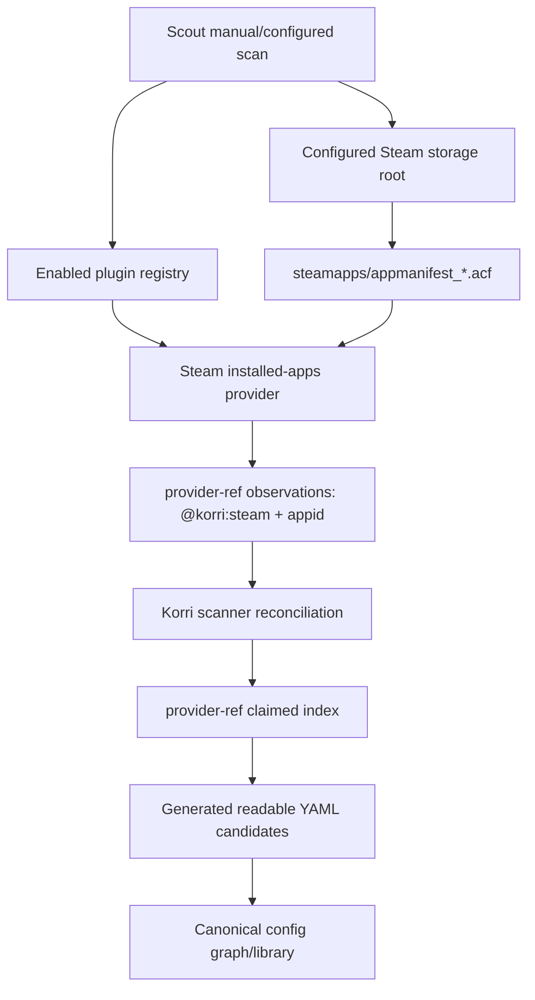

# feat: Discover installed Steam apps through plugin observations

## Summary

Add the second plugin-owned release discovery slice: Steam discovers locally installed apps from the configured Steam state root and emits candidate observations keyed by Steam AppID. Korri remains the owner of reconciliation, duplicate suppression, generated readable YAML, and library persistence.

This slice should produce launchable readable-library candidates like:

```yaml
library:
  thirty-xx:
    title: 30XX
    releases:
      - id: steam
        system: steam
        target: { kind: provider-ref, provider: "@korri:steam", ref: "1029210" }
        launch: { use: "@korri:steam/steam" }
```

The important design point is that `appmanifest_1029210.acf` is evidence, not the launch target. The generated target must be the provider/AppID reference that the Steam plugin already knows how to materialize.

---

## Problem Frame

The completed plugin-owned discovery slice moved RetroArch/GBA ROM ownership behind `contributes.discovery`, but the active observation and scanner path is still file-target-shaped. Steam is the next proof point because its install state is represented by local Steam state files, while the launchable thing Korri should persist is a provider-ref AppID target.

If Steam is forced through the current file-release path, the scanner would write entries targeting `steamapps/appmanifest_<appid>.acf`. Those entries would be duplicates of authored Steam entries, would not launch as Steam games, and would leak Steam-specific appmanifest semantics into generic scanner behavior. The plan must extend the discovery seam deliberately rather than special-case Steam in the scanner.

---

## Requirements

- R1. The Steam plugin contributes an enabled-plugin-gated discovery provider, e.g. `@korri:steam/installed-apps`, through the existing first-party plugin registry.
- R2. The provider discovers only locally installed Steam apps from the configured Steam state/storage root, reading `steamapps/appmanifest_*.acf` as read-only evidence.
- R3. The provider emits observations, not durable readable-library records; Korri owns dedupe, first-seen policy, YAML rendering, and merge/persistence.
- R4. Steam observations must generate `provider-ref` targets keyed by `provider: "@korri:steam"` and `ref: <appid>`, not file targets pointing at ACF manifests.
- R5. Existing authored or generated Steam entries with the same provider/ref pair suppress new candidates so repeated manual or boot scans are idempotent.
- R6. Only fully installed, user-launchable Steam app manifests produce launchable observations: accept manifests with valid AppState data and `StateFlags === 4` unless they are known non-game types; skip partial downloads, installing apps, corrupt manifests, and known Steam tools/runtimes/config entries with diagnosable report samples where practical.
- R7. Generic platform/scanner code must remain plugin-agnostic: it may understand a generic provider-ref discovery observation kind, but it must not import Steam code, know ACF fields, or hardcode Steam AppIDs.
- R8. The provider must be testable without real Steam state by using an injectable/readable filesystem seam or scanner-provided `readText` helper.
- R9. Manual explicit-root scans and configured boot release scans continue to work through the same registry/scanner path and honor `KORRI_ENABLED_PLUGINS`.
- R10. Existing file-backed RetroArch/GBA discovery behavior and diagnostics must not regress.

---

## Scope Boundaries

- No remote Steam account ownership/library sync.
- No Steam downloads, install requests, or Proton/runtime repair.
- No UI approval/review surface for candidates.
- No stale-entry deletion when an app is uninstalled or a manifest disappears.
- No secondary Steam library-folder auto-discovery from `libraryfolders.vdf` in this first slice.
- No `localconfig.vdf`-derived metadata unless needed by existing launch/materialization code; app discovery uses `appmanifest_*.acf` as the first source of truth.
- No broad readable-library schema redesign.
- No generic scanner hardcoding of Steam, `steamapps`, ACF, or AppID rules.
- No device deployment, reboot, or Bandai state mutation as part of planning.

### Deferred to Follow-Up Work

- Scan secondary Steam library folders listed in `steamapps/libraryfolders.vdf`.
- Add uninstall/stale-candidate reconciliation once the product has an explicit policy for removing or archiving generated entries.
- Add richer install-state UI for partial/downloaded Steam apps; this slice should avoid launchable entries for incomplete installs.
- Promote provider-ref discovery provenance/first-seen metadata into schema if needed; current `ProviderRefTarget` has no `discovery` field.
- Generalize state-root provider enumeration for future non-file providers that do not have host-enumerated file evidence.

---

## Context & Research

### Current Discovery Seam

- `product/platform/plugin/discovery.ts` defines file-backed `ReleaseDiscoveryProvider` and `FileReleaseDiscoveryObservation`.
- `product/platform/plugin/registry.ts` aggregates `contributes.discovery` only from enabled plugins.
- `product/platform/library/discovery/release-candidate-scan.ts` invokes providers, validates observations, reconciles candidates, dedupes, backfills identity for file targets, and renders generated YAML.
- `product/plugins/retroarch/src/discovery.ts` is the reference file-backed provider.
- `product/plugins/AGENTS.md` documents the host-owned boundary: providers emit observations; plugins do not write YAML.

### Steam Code and Data Sources

- `product/plugins/steam/src/plugin.ts` defines:
  - `KORRI_STEAM_PLUGIN_ID = "@korri:steam"`
  - `KORRI_STEAM_APP_ID = "@korri:steam/steam"`
  - `KORRI_STEAM_STORAGE_ID = "@korri:steam/steam"`
  - default state root `/var/lib/korri/steam`
- `product/plugins/steam/src/state-materializer.ts` already owns `parseVdf` and the injectable `SteamStateFileSystem` pattern.
- `product/plugins/steam/src/observability/install-state.ts` already reads `steamapps/appmanifest_<appid>.acf`, parses `AppState`, interprets `StateFlags`, and treats `StateFlags === 4` as installed.
- `product/plugins/steam/src/launch-spec.ts` and materializer tests already support provider-ref/AppID launch targets.
- `product/plugins/library-source-layer.test.ts` contains the expected readable-library shape for Steam provider-ref releases.

### Scanner Gaps This Slice Must Close

- `ReleaseDiscoveryObservation` only supports `kind: "file-release"` today.
- `createRomLibraryCandidatesFromClassifications` always renders `target.kind: "file"`.
- `ClaimedContentIndex` indexes file targets by storage/path, absolute path, and hash, but does not index `provider-ref` targets.
- `FileTarget.discovery.first-seen-at` exists; `ProviderRefTarget` has no matching discovery metadata field.
- Provider contexts currently carry descriptors but no explicit read helper, even though Steam must parse manifest contents.

### Institutional Learnings

- `docs/solutions/architecture-patterns/korri-plugin-architecture-2026-06-02.md`: Steam discovery is a plugin-owned content-source contribution, not direct presentation or persistence.
- `docs/solutions/design-patterns/explicit-cascade-folded-policy-over-incidental-signal-heuristics-2026-05-27.md`: Steam-specific facts should be explicit plugin-owned parsed fields, not scanner heuristics.
- `docs/solutions/best-practices/proseql-canonical-library-with-derived-yaml-ids-2026-05-06.md`: external mutable state is imported into canonical readable YAML/ProseQL through deterministic import/reconcile flows.
- `work/items/active/01KWGB1TPG0FAE59DYW470VCAV-plugin-owned-release-discovery/plan.md`: Steam installed app manifests were explicitly deferred as the next non-file/provider-ref discovery proof point.
- `work/items/active/01KTWFJXDKS8VYWPV94QTWCBEH-steam-readable-apps-v1/plan.md`: Steam readable entries should use AppID/provider-ref launch targets and plugin-owned launch policy.

---

## Key Technical Decisions

- Add a generic provider-ref observation variant rather than a Steam-only scanner branch. The scanner may know how to render `target.kind: "provider-ref"`; it must not know why Steam uses it.
- Treat ACF manifest files as evidence and source material, not as release targets.
- Use `StateFlags === 4` as the launchable-install threshold for this slice. Partial/download/installing states should not become launchable candidates.
- Filter Steam tools/runtimes out of launchable observations using the manifest `type` field where present. Accept absent type only if other required fields are valid, because older or odd manifests may omit it.
- Use manifest `AppState.name` as the preferred generated title. Fall back to a stable AppID-based title/id only when the name is absent or unusable.
- Generate human-readable library item ids from the manifest title with existing slug/unique-id conventions; keep AppID in the provider-ref target as the stable launch identity.
- Render generated Steam releases with `launch.use: "@korri:steam/steam"` and no hardcoded `launch.runtime`. Steam compat/runtime selection remains plugin policy, not per-discovered-game scanner data.
- Extend dedupe with a provider-ref claimed index keyed by normalized `(provider, ref)` pair. Existing authored provider-ref Steam entries must suppress generated duplicates.
- Do not add `first-seen-at` to provider-ref targets in this slice. The schema does not support it; adding it should be a separate deliberate schema change.
- Keep the provider read-only. Discovery must never write Steam state, seed localconfig, restart Steam, or request installs.
- Keep configured storage as the first state-root source. For the default Steam plugin, the `@korri:steam/steam` storage root maps to the Steam state root. Arbitrary secondary `state.root` or `libraryfolders.vdf` traversal is deferred.

---

## Open Questions

### Resolved During Planning

- Should Steam write YAML directly? No; providers emit observations and Korri persists.
- Should generated Steam targets point at `appmanifest_*.acf`? No; appmanifest files are evidence only.
- Should the scanner add a Steam-specific branch? No; add a generic provider-ref observation/render/dedupe path.
- Should incomplete downloads appear as launchable library entries? No; only fully installed apps are launchable candidates in this slice.
- Should discovery hardcode a Proton runtime id? No; generated Steam entries should use the Steam launcher and let Steam/plugin policy choose compat/runtime.

### Implementation Choices to Confirm While Coding

- Exact observation type name, e.g. `ProviderRefReleaseDiscoveryObservation` with `kind: "provider-ref-release"`.
- Whether provider diagnostics for skipped/corrupt manifests are represented as additional observation diagnostics or as scanner samples emitted from the provider adapter.
- Whether the read seam lives on `ReleaseDiscoveryContext` (`readText`) or in a Steam-specific provider factory (`createSteamInstalledAppsDiscoveryProvider({ fs })`). Prefer the context seam if the provider is invoked over scanner-enumerated descriptors; prefer a provider factory if keeping platform contract smaller.
- How much of `rom-scan-classifier.ts` naming should be generalized during this slice. Behavior matters more than naming, so broad renames should be avoided unless local edits make them low-risk.

---

## Output Structure

Likely files to create:

```text
product/plugins/steam/src/discovery.ts
product/plugins/steam/src/discovery.test.ts
```

Likely files to modify:

```text
product/platform/plugin/discovery.ts
product/platform/plugin/discovery.test.ts
product/platform/plugin/registry.test.ts
product/platform/library/discovery/release-candidate-scan.ts
product/platform/library/discovery/release-candidate-scan.test.ts
product/plugins/steam/src/plugin.ts
product/plugins/steam/index.ts
product/plugins/steam/src/state-materializer.ts        # only if adding a reusable file-list/read seam here
product/plugins/index.test.ts
product/plugins/AGENTS.md
product/surfaces/terminal/korri-cli/korri-cli.test.ts  # if CLI output/report assertions need provider-ref coverage
product/systems/nixos/modules/korri-daemon.nix         # only if boot scan env lacks Steam plugin enablement
product/systems/nixos/images/platforms/rocknix-sm8550.nix # only if composition must add @korri:steam to scan env
```

Avoid changing:

```text
product/plugins/steam/src/materializer.ts              # discovery should feed existing launch integration, not rewrite it
product/platform/library/config/records/library-item.ts # unless a separate decision adds provider-ref discovery metadata
```

---

## High-Level Technical Design



The seam is intentionally asymmetric: Steam owns parsing ACF and deciding whether an app is a launchable Steam game; Korri owns whether that observation creates, skips, or merges a durable library entry.

---

## Implementation Units

### U1. Extend discovery observations for provider-ref releases

**Goal:** Add a generic observation kind that can describe launchable provider references without pretending the evidence file is the target.

**Requirements:** R3, R4, R7, R10

**Dependencies:** Completed plugin-owned discovery provider seam.

**Files:**
- Modify: `product/platform/plugin/discovery.ts`
- Test: `product/platform/plugin/discovery.test.ts`
- Test: `product/platform/plugin/registry.test.ts`

**Approach:**
- Add a `ProviderRefReleaseDiscoveryObservation` union member.
- The observation should include:
  - `kind: "provider-ref-release"`
  - `confidence`
  - `target: { provider: ProviderId; ref: string }` or equivalent
  - release metadata: `id`, `title`, `system`
  - launch metadata: `use`/app id, with runtime optional or absent
  - optional evidence entries, including manifest path/state flags/type/build id as non-authoritative evidence
- Keep `FileReleaseDiscoveryObservation` unchanged for RetroArch.
- Validate provider ids remain plugin-qualified under the contributing plugin, as the first slice already does for file providers.
- Ensure observations do not include timestamps.

**Test scenarios:**
- A provider-ref observation with `provider: "@korri:steam"`, `ref: "1029210"`, and `launch.use: "@korri:steam/steam"` is accepted by the contract.
- Empty provider/ref/system/id values are rejected as malformed by the adapter/contract layer.
- A provider-ref observation carrying timestamp-like discovery fields is rejected or ignored according to the existing no-timestamp invariant.
- Existing file-release provider tests still pass unchanged.

---

### U2. Add provider-ref reconciliation, dedupe, and YAML rendering

**Goal:** Teach the scanner to convert provider-ref observations into provider-ref readable-library candidates and suppress duplicates against existing provider-ref entries.

**Requirements:** R3, R4, R5, R7, R9, R10

**Dependencies:** U1

**Files:**
- Modify: `product/platform/library/discovery/release-candidate-scan.ts`
- Test: `product/platform/library/discovery/release-candidate-scan.test.ts`

**Approach:**
- Add an internal candidate variant for provider-ref discoveries rather than overloading `RomScanCandidate.path`.
- Extend observation adaptation with a parallel path for `kind: "provider-ref-release"`.
- Add `byProviderRef` to `ClaimedContentIndex`, keyed by normalized provider/ref.
- Populate `byProviderRef` from existing library releases whose `target.kind === "provider-ref"`.
- Match provider-ref candidates against the claimed index before writing YAML.
- Render generated provider-ref YAML with:
  - `target: { kind: "provider-ref", provider, ref }`
  - `launch: { use: <Steam launcher id> }`
  - no `target.discovery.first-seen-at` unless a schema change is separately approved
- Preserve the existing file-candidate path, hash identity backfill, and report counters.
- Add report samples for provider-ref dedupe/conflict/malformed cases without regressing old sample tags.
- Treat same-provider/same-ref duplicates as dedupe/conflict cases within the provider-ref path. Different providers using the same ref string are distinct provider-ref locators; they should only collide through generated library item id uniqueness, not provider-ref identity.

**Test scenarios:**
- A provider-ref observation renders the expected readable YAML target and launch block.
- An existing authored Steam provider-ref release for the same AppID suppresses a new generated candidate.
- A second generated candidate in the same run for the same provider/ref is deduped deterministically.
- Cross-provider or same-locator conflicts are reported and do not emit duplicate YAML.
- File-backed RetroArch/GBA discovery still emits file targets with `first-seen-at`.
- Provider-ref candidates do not attempt file hash identity backfill.

---

### U3. Add a read/test seam for manifest-backed providers

**Goal:** Let Steam discovery parse ACF manifest contents without direct untestable filesystem coupling.

**Requirements:** R2, R6, R8, R10

**Dependencies:** U1

**Files:**
- Modify: `product/platform/plugin/discovery.ts` if adding `readText` to provider context
- Modify: `product/platform/library/discovery/release-candidate-scan.ts` if the scanner supplies the helper
- Or modify/create Steam-local provider factory helpers if keeping the platform contract narrow
- Test: `product/plugins/steam/src/discovery.test.ts`

**Approach:**
- Canonical path for this slice: add `readText: (absolutePath: string) => Promise<string | undefined>` to `ReleaseDiscoveryContext`, and have the production scanner supply a helper backed by `node:fs/promises.readFile` with `ENOENT -> undefined`.
- The provider filters the scanner-enumerated `files` list to relative paths matching `steamapps/appmanifest_<digits>.acf`, then reads only those manifests through `context.readText`.
- Do not add a separate Steam-local discovery filesystem factory in this slice; reserve that for future providers that are not driven by scanner-enumerated evidence files.
- Do not add write methods, locks, lifecycle hooks, or Steam restart capabilities to discovery.

**Test scenarios:**
- Provider tests use in-memory manifest text and no real Steam home.
- Missing manifest content is skipped without throwing.
- A per-manifest parse failure does not abort discovery for other manifests.

---

### U4. Implement the Steam installed-apps discovery provider

**Goal:** Parse installed Steam manifests and emit provider-ref observations for launchable games.

**Requirements:** R1, R2, R4, R6, R8

**Dependencies:** U1, U3

**Files:**
- Create: `product/plugins/steam/src/discovery.ts`
- Create: `product/plugins/steam/src/discovery.test.ts`
- Potentially modify: `product/plugins/steam/src/state-materializer.ts` to export reusable typed field helpers only if that reduces duplication without broad refactor

**Approach:**
- Define provider id `@korri:steam/installed-apps`.
- Reuse `parseVdf` from `state-materializer.ts`.
- For each matching `steamapps/appmanifest_<appid>.acf`:
  - Parse VDF and use `AppState` if present.
  - Determine AppID from validated manifest filename and/or `AppState.appid`; if both exist and disagree, skip as malformed.
  - Read title from `AppState.name`.
  - Read `StateFlags`; emit launchable observation only when `StateFlags === 4`.
  - Read `type`; skip known non-game types such as `Tool`, `Config`, runtimes, redistributables. Treat missing type as acceptable if other required fields are valid.
  - Emit `provider-ref-release` observation with target provider `@korri:steam`, ref `<appid>`, system `steam`, title, release id `steam`, and launch use `@korri:steam/steam`.
  - Add evidence such as manifest relative path, state flags, build id, size on disk, and type, without timestamps.
- Keep all filesystem access read-only.
- Do not inspect game install directories as the source of truth.

**Test scenarios:**
- `StateFlags "4"`, type `Game`, name `30XX`, appid `1029210` emits one high-confidence observation.
- Numeric strings and numbers from VDF both parse for StateFlags where applicable.
- `StateFlags` indicating download/install does not emit a launchable observation.
- Type `Tool`/runtime manifests are skipped.
- Corrupt VDF is isolated to that manifest and does not fail the whole provider.
- AppID mismatch between filename and manifest is treated as malformed/skipped.
- Missing title falls back to `Steam App <appid>` or another stable non-empty title.

---

### U5. Register Steam discovery through the plugin descriptor

**Goal:** Make Steam installed-app discovery available only when the Steam plugin is enabled.

**Requirements:** R1, R7, R9

**Dependencies:** U4

**Files:**
- Modify: `product/plugins/steam/src/plugin.ts`
- Modify: `product/plugins/steam/index.ts`
- Test: `product/plugins/steam/src/plugin.test.ts`
- Test: `product/plugins/index.test.ts`

**Approach:**
- Add `discovery: [steamInstalledAppsDiscoveryProvider]` to `steamPlugin.contributes`.
- Export the provider and provider id through the plugin's thin index if consistent with existing plugin exports.
- Verify `createFirstPartyPluginRegistryFromEnv` exposes the provider when `KORRI_ENABLED_PLUGINS` includes `@korri:steam` and hides it when not enabled.
- Do not add Steam discovery providers to generic platform code or Scout code by name.

**Test scenarios:**
- Enabled Steam plugin contributes one installed-apps provider.
- Disabled Steam plugin contributes no provider.
- Plugin registry still includes existing Steam config/handler contributions.
- First-party plugin index test accounts for the new discovery contribution.

---

### U6. Wire manual/configured scans and boot-scan environment

**Goal:** Ensure the new provider participates in existing scan entry points without adding Steam-specific CLI paths.

**Requirements:** R7, R9

**Dependencies:** U2, U5

**Files:**
- Inspect/modify: `product/surfaces/terminal/korri-cli/scout-command.ts`
- Inspect/modify: `product/systems/nixos/modules/korri-daemon.nix`
- Inspect/modify: `product/systems/nixos/images/platforms/rocknix-sm8550.nix`
- Test: `product/surfaces/terminal/korri-cli/korri-cli.test.ts`
- Test/check: `tools/testing/nix/korri-daemon-module-check.nix`
- Test/check: `tools/testing/nix/korri-rocknix-sm8550-config-check.nix`

**Approach:**
- Confirm Scout already passes `registry.discoveryProviders` into scan calls. If not, thread the existing registry provider list; do not special-case Steam.
- Confirm configured scans include plugin-contributed storage records when the Steam plugin is enabled.
- For the SM8550/Bandai Steam-enabled composition, ensure the boot release-scan service receives `KORRI_ENABLED_PLUGINS` including `@korri:steam` alongside the other enabled first-party plugins.
- Do not change generic daemon/module defaults to force-enable Steam discovery; use the existing `services.korri.scout.releaseScan.extraEnvironment` seam in the image/composition if explicit env propagation is needed.
- Keep manual explicit-root scan behavior generic: when the operator scans `/var/lib/korri/steam` with Steam enabled, the provider can see manifests and emit observations.

**Test scenarios:**
- CLI configured scan with Steam enabled passes the Steam provider to the scanner.
- CLI/boot scan with Steam disabled emits no Steam candidate observations.
- Nix module/image check proves the SM8550/Bandai boot release scan env includes `@korri:steam` when that image enables Steam discovery.

---

### U7. Document the second discovery-provider pattern

**Goal:** Capture how provider-ref/state-backed discovery differs from file-backed ROM discovery for future plugin scanners.

**Requirements:** R3, R4, R7, R8

**Dependencies:** U1-U6

**Files:**
- Modify: `product/plugins/AGENTS.md`
- Potentially modify: `work/items/active/01KWGJZ7DDV2S9YH9ST6ZXTS0K-steam-installed-app-discovery/work.md` status at implementation completion

**Approach:**
- Document when to use `file-release` versus `provider-ref-release` observations.
- State that provider-ref observations are for launch identities owned by a provider, not local content files.
- Use Steam installed apps as the reference example.
- Restate no timestamps, read-only provider behavior, scanner-owned reconciliation, and no direct YAML writes.
- Record current limitations: primary state root only, no remote ownership sync, no stale deletion.

---

## Verification Plan

Primary targeted verification:

```sh
bun test \
  product/platform/plugin/discovery.test.ts \
  product/platform/plugin/registry.test.ts \
  product/plugins/steam/src/discovery.test.ts \
  product/plugins/steam/src/plugin.test.ts \
  product/plugins/index.test.ts \
  product/platform/library/discovery/release-candidate-scan.test.ts \
  product/surfaces/terminal/korri-cli/korri-cli.test.ts \
  product/plugins/library-source-layer.test.ts \
  product/plugins/steam/src/materializer.test.ts
```

Nix/config checks after code changes:

```sh
just test-nix
```

Expected known caveat: repo-wide typecheck/lint may still fail on unrelated pre-existing issues unless those have been cleaned up before implementation. Targeted Bun tests and relevant Nix checks should be green for this slice.

Device smoke after implementation merges to the deploy branch, not during planning:

1. Run configured release scan twice on Bandai with Steam plugin enabled.
2. Confirm generated readable YAML contains one provider-ref candidate per installed Steam game and no `appmanifest_*.acf` file targets.
3. Confirm the second scan emits no duplicate Steam entries for the same AppIDs.
4. Dry-run or launch one generated Steam entry and confirm launch resolution routes through `@korri:steam/steam`.

---

## System-Wide Impact

### Platform Scanner

The scanner gains a generic provider-ref candidate path. This is not Steam-specific, but it is the first time discovery output is not a file target. The most important regression guard is that existing file-backed ROM discovery still behaves exactly as before.

### Library Schema/YAML

Readable YAML already supports `target.kind: provider-ref`. This plan intentionally avoids schema changes for provider-ref discovery metadata. Generated entries lose `first-seen-at` until/unless schema support is added later.

### Plugin Boundary

Steam-specific parsing and install-state rules remain inside `product/plugins/steam`. The platform layer learns only generic provider-ref observation semantics.

### Boot Scans

Boot scans may discover Steam apps once the Steam plugin is enabled in the scan environment. For the SM8550/Bandai Steam-enabled composition, this slice should ensure `@korri:steam` is present in the release-scan `KORRI_ENABLED_PLUGINS` value. Other generic compositions remain opt-in; if they omit Steam from release-scan plugin enablement, Steam discovery is absent by design.

---

## Risks & Mitigations

| Risk | Impact | Mitigation |
|---|---|---|
| Provider-ref observation shape becomes too Steam-specific | Future providers cannot reuse it | Keep fields generic: provider/ref, system, title, launch use, evidence |
| Existing authored Steam entries are duplicated | Boot scans create library noise | Add `byProviderRef` claimed index and same-run provider-ref dedupe |
| Generated entries target ACF files | Steam games fail to launch | Tests must assert provider-ref YAML and no file target for Steam |
| Steam tools/runtimes appear as games | UI clutter and failed launches | Filter manifest `type`; add tests for Tool/runtime manifests |
| Partial downloads appear launchable | Confusing broken launches | Emit candidates only for `StateFlags === 4` |
| Provider reads real filesystem in tests | Brittle tests | Add context read seam or provider factory with fake FS |
| Boot scan does not enable Steam provider | Feature works only manually | Nix/module tests verify scan env where expected |
| Adding provider-ref support breaks file-backed discovery | Regression in ROM scanning | Keep file path unchanged and run RetroArch/scanner tests |
| Provider-ref entries lack first-seen metadata | Less provenance than file entries | Document as known schema gap; do not add ad-hoc unsupported fields |

---

## Documentation Notes

- Update `product/plugins/AGENTS.md` after implementation to describe provider-ref discovery.
- Keep this work item status `planned` until the implementation lands; then update to completed with commit/test evidence.
- If provider-ref `first-seen-at` becomes important, open a separate schema-focused work item rather than expanding this slice.

---

## Confidence

Confidence: medium-high.

The path is well-supported by existing Steam provider-ref launch code and the completed plugin-owned discovery seam. The main complexity is not Steam parsing; it is carefully generalizing scanner reconciliation so provider-ref observations are first-class without introducing Steam-specific branches or regressing file-backed ROM behavior.
