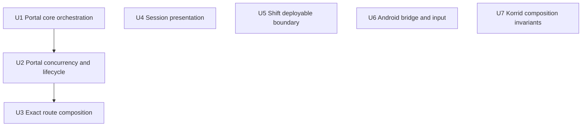
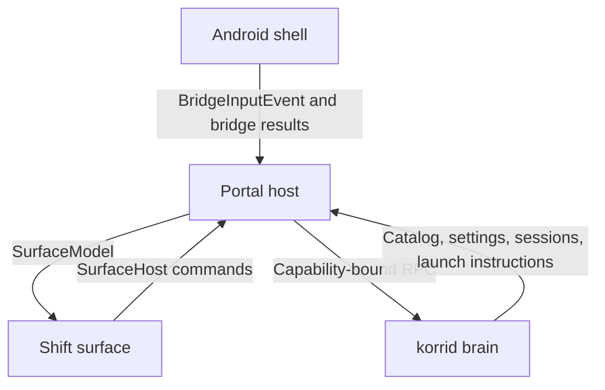

# feat: Backfill high-risk test coverage

## Summary

Recover the portal effect coverage lost during the Shift extraction, then pin the remaining Android, session, surface, and korrid composition seams using the existing test tiers. The work is characterization-first and changes no product behavior, public treaty, or production architecture.

---

## Problem Frame

Korri now has reliable CI gates for surface-local, portal-local, Android JVM/Robolectric, Rust, and real-WebView emulator tests. Those gates run existing suites consistently, but several important behaviors predate the foundation or lost direct coverage while architecture changed.

The largest gap is `clients/portal/src/surface/use-launchables.ts`: it owns loading, launching, settings writes, resume refreshes, stop polling, and stale-operation suppression, but has no direct tests. Commit `a31488d0` removed the previous `LaunchablesRoot.test.tsx` suite when Shift became a first-class surface, leaving pure state and presentation tests intact while dropping effect-ordering coverage. Smaller gaps remain at the portal-to-surface composition boundary, session presentation, Shift's framework-neutral mount adapter, the Android producer side of the bridge treaty, and two security/policy compositions in korrid.

---

## Requirements

### Portal host

- R1. Recover direct portal-local characterization of existing load, device-action, local-launch, and remote-launch orchestration without restoring the removed `LaunchablesRoot` component.
- R2. Pin the hook's explicit stale-result, same-frame duplication, settings-write, resume-refresh, and stop-lifecycle guards.
- R3. Prove that `SurfaceRoot` resolves an opaque user-selected launch location against current state and invokes the exact local or remote route rather than assuming one.
- R4. Characterize `SessionScreen` rendering, exit timing, and adapter cleanup without duplicating lifecycle state-machine tests.

### Surface, native shell, and brain

- R5. Prove Shift's exported `KorriSurface` mount/update/unmount contract and its existing saving, settings-problem, and disabled-action behavior using only the surface treaty.
- R6. Expand the existing real-WebView Android check to cover the canonical bridge member surface, safe read-only result shapes, and Android-owned hardware-key-to-semantic-input delivery.
- R7. Add only two korrid composition invariants: server-lifetime invalidation of credentials/signatures, and public settings changes affecting public plugin-backed catalog and launch behavior.

### Cross-cutting constraints

- R8. Test public contracts through existing or test-owned configurable implementations; do not introduce `Mock*`, `Stub*`, or `Fake*` classes.
- R9. Preserve production behavior and visibility. Do not refactor product code solely for test access, add a new test tier, or duplicate behavior already owned by a cheaper suite.
- R10. Keep all existing focused Nix tasks and the two-job GitHub Actions workflow green.

---

## Scope Boundaries

- No production behavior, bridge version, generated contract, surface treaty, RPC schema, plugin schema, or persisted-data schema changes.
- No source extraction or visibility change solely to expose private Android helpers. Semantic input is exercised through the public Activity/WebView path instead.
- No broad Android UI automation, settings-screen automation, pairing fixture, streamed-host fixture, or successful native launch automation.
- No assertions about real controller hardware, vendor key quirks, GPU/codec/driver behavior, hardware decoding, network latency, thermals, battery, DeX, or OEM process survival.
- No exhaustive branch matrices for bridge decoding, config validation, plugin normalization, or Rust module internals already covered by focused tests.
- No CSS snapshots, DOM-tree snapshots, render-count assertions, private-ref assertions, or exact polling-iteration assertions.
- No new frontend test dependency unless implementation proves the existing React `createRoot`/`act` and Bun facilities cannot express a required scenario; prefer the established harness.
- Trusted-origin containment is not backfill: it remains with the separate WebView origin-lock work item and must bring its own acceptance coverage.

### Deferred to Follow-Up Work

- Android `launchLocal`, stream cache/database adapters, `startStream`, settings intents, notification permission UI, and in-game overlay behavior: add regression coverage when those areas are changed.
- Additional effectful bridge methods: defer until deterministic real state exists at an honest test layer.
- Physical-device acceptance: retain as separate device-focused validation.
- Exact stop-deadline and automatic-exit wall-clock assertions: include only if Bun's existing runner can control the clock without production seams or long sleeps; otherwise characterize scheduling and cancellation and record the limitation.

---

## Context & Research

### Relevant Code and Patterns

- `clients/portal/src/surface/use-launchables.ts` owns all portal launchable effects and four explicit lifecycle guards: load, action, stop-poll, and mounted sequences.
- `clients/portal/src/surface/SurfaceRoot.tsx` is the only component that knows both portal state and the `SurfaceHost` treaty; it deliberately reads current state through a stable host object.
- `clients/portal/src/bridge/launcher-bridge.ts` and `clients/portal/src/korrid/client.ts` provide configurable in-memory implementations used by browser development and existing tests.
- `clients/portal/src/launchables/state.test.ts`, `clients/portal/src/surface/surface-model.test.ts`, and `clients/portal/src/session/lifecycle-adapter.test.ts` define ownership boundaries that the new tests must not duplicate.
- `surfaces/shift/src/fixtures/fixture-host.ts` records observable host calls through the real `SurfaceHost` contract.
- `surfaces/shift/test/shift-surface.test.tsx` demonstrates happy-dom registration, React `act`, semantic input, and behavior-first assertions.
- `clients/android/app/src/androidTest/java/com/limelight/KorriNativeBridgeContractTest.java` already launches the shipped minified Activity, locates its real WebView, waits boundedly for the bridge, and evaluates JavaScript.
- `services/korrid/src/lib.rs` already contains the process-global embedded-server lifecycle test and full-router helpers. Extending those tests avoids a second competing server fixture.
- `nix/tasks.nix` exposes the existing focused and aggregate gates; no new task is required.

### Institutional Learnings

- Test seams use configurable real implementations rather than named mock/stub/fake classes: `docs/research/android-automated-testing-handoff.md` and the archived Android testing foundation plan.
- Device gates must validate the complete installed path rather than one convenient channel; the current real-WebView check exists because portal-only bridge tests could not prove native injection.
- Surface behavior stays behind `SurfaceModel` and `SurfaceHost`; no Shift test may import portal, bridge, generated Rust, or Android code.
- The Android emulator is a narrow bridge/lifecycle regression net, not physical-device confidence: `docs/research/android-automated-testing.md`.
- Settings, storage, and notice state are intentionally re-read after shell resume; a green initial-load test is insufficient.
- The old `LaunchablesRoot.test.tsx` scenarios are recoverable characterization evidence from commit `a31488d0`; they should be translated to the current ownership seams, not copied wholesale.

### External References

- None required. The repository has recent, direct patterns for every target test layer.

---

## Key Technical Decisions

| Decision | Rationale |
|---|---|
| Recover behaviors at their current owner rather than resurrecting deleted component tests | The architecture changed intentionally: effects now belong to `useLaunchables`, host routing to `SurfaceRoot`, and pixels to Shift. |
| Use characterization-first sequencing | The work pins existing behavior. A failing characterization may reveal a defect, but the backfill must not silently redefine behavior to make the test pass. |
| Keep orchestration and composition tests separate | Hook tests own effect ordering, cancellation, and state publication; `SurfaceRoot` tests own opaque-ID-to-current-route wiring; Shift tests own user presentation. |
| Exercise semantic input in the existing emulator tier | The public Activity/WebView route is honest and already available. Direct JVM access would require a visibility or testability refactor because Activity startup depends on the embedded native library. |
| Check bridge exposure separately from safe method results | Exposure catches annotation/minifier/name drift; invoking read-only methods catches hand-built return-shape drift. Neither alone proves the complete safe seam. |
| Keep expected bridge members as a deliberate test-side contract list | TypeScript interfaces do not exist at runtime. Adding generation or AST parsing would cost more than the narrow drift guard and create new infrastructure. |
| Extend the existing process-global korrid lifecycle test | A second server-lifetime test could race the global server slot; one test should own start, stop, restart, and cleanup. |
| Avoid coverage-percentage targets | Completion is defined by named public seams and historical regression classes, not incidental line execution. |

---

## Open Questions

### Resolved During Planning

- **Where should Android semantic mapping be tested?** In the existing instrumented Activity/WebView suite. This avoids exposing a private helper or pretending a partial JVM path proves delivery.
- **Should every bridge method be invoked?** No. Assert exposure for the canonical treaty, but invoke only read-only methods that need no paired host or system-screen effect.
- **Should the old portal test suite be restored verbatim?** No. Recover its behaviors across `useLaunchables` and `SurfaceRoot` according to current ownership.
- **Should new Nix tasks or workflow jobs be added?** No. Every new test belongs to an existing focused task and existing CI job.
- **How broad should the Rust backfill be?** Two cross-module invariants only; existing Rust module and integration coverage is already deep.

### Deferred to Implementation

- **Controlled time in Bun:** Determine whether existing Bun test facilities can advance timers reliably. If not, assert scheduling/cancellation without sleeping for product deadlines.
- **Portal orchestration harness shape:** Use the smallest React consumer around the hook that exposes its public `Launchables` result; exact helper names are implementation details.
- **Emulator Activity reuse:** Reuse helpers and the running emulator task, but choose per-test versus shared Activity lifetime based on isolation and deterministic cleanup observed during implementation.

---

## Phased Delivery

U1–U5 are cheap JavaScript characterization work and should land before widening the emulator suite. U6 and U7 are independent once their existing native/service harnesses are understood; they may follow in either order.

---

## Implementation Units

### U1. Recover core portal orchestration coverage

**Goal:** Characterize the existing load, device-action, local-launch, and remote-launch flows directly through `useLaunchables`.

**Requirements:** R1, R8, R9

**Dependencies:** None

**Files:**
- Create: `clients/portal/src/surface/use-launchables.test.tsx`
- Reference: `clients/portal/src/bridge/launcher-bridge.ts`
- Reference: `clients/portal/src/korrid/client.ts`
- Reference: removed `clients/portal/src/launchables/LaunchablesRoot.test.tsx` at commit `a31488d0^`

**Approach:**
- Mount a minimal React consumer that publishes the hook's public `Launchables` result to the test; do not render Shift or inspect hook refs.
- Start from `createInMemoryLauncherBridge` and `createInMemoryKorridClient`. Use test-owned configurable implementations or spies only where call order or deferred completion is the observable behavior.
- Recover the applicable deleted scenarios while asserting current public state and issued effects rather than old component markup.

**Execution note:** Add characterization tests before considering any production edit. If current behavior contradicts the treaty or a documented invariant, stop and report the defect rather than encoding a convenient new expectation.

**Patterns to follow:**
- React `createRoot`/`act` and cleanup from existing portal tests and the deleted suite.
- Result construction from `clients/portal/src/launchables/state.test.ts`.
- Configurable implementation style from the in-memory bridge/client factories.

**Test scenarios:**
- **Happy path:** Initial mount publishes `Loading`, reads all sources, queries stream apps only for paired hosts, and publishes the combined ready state and device facts.
- **Integration:** A local game confirmation obtains its launch instruction from korrid before passing that exact instruction to the launcher bridge.
- **Error path:** A missing local ROM leaves the bridge untouched and publishes the existing user-facing notice while the portal remains usable.
- **Integration:** A remote game confirmation prepares the selected game for its exact host and starts the `Korri Stream` app on that same host.
- **Error path:** A remote game whose exact host has no stream target performs neither preparation nor stream start and publishes the current notice.
- **Happy path:** Hidden background notice requests visibility; only `Unprompted` falls through to notification settings.
- **Happy path:** Visible background notice opens notification settings directly without requesting permission.
- **Error path:** Unavailable pairing, storage, or notification settings publish the corresponding existing problem/notice through the hook contract.

**Verification:**
- Core effect ordering and error behavior are directly protected without Shift rendering or production changes.
- Recovered scenarios no longer depend on the deleted `LaunchablesRoot` architecture.

### U2. Pin portal concurrency and lifecycle guards

**Goal:** Characterize the sequence guards that keep overlapping loads, duplicate actions, settings writes, resume refreshes, and stop polling truthful.

**Requirements:** R2, R8, R9

**Dependencies:** U1

**Files:**
- Modify: `clients/portal/src/surface/use-launchables.test.tsx`

**Approach:**
- Extend U1's public hook harness with controlled deferred completions and call recording.
- Assert outcomes and effects, not internal sequence numbers, refs, render counts, or polling iteration counts.
- Always unmount and settle/cancel deferred work so listeners and promises cannot leak between tests.

**Execution note:** Characterize each guard through the race it prevents. Do not expose refs or add a production clock seam.

**Patterns to follow:**
- Existing same-frame locking comments and state transitions in `clients/portal/src/surface/use-launchables.ts`.
- Shell resume event contract from `contracts/bridge/korri-native-bridge.ts`.

**Test scenarios:**
- **Edge case:** Two overlapping loads settle out of order; only the newest invocation may publish state and facts.
- **Edge case:** A completion arriving after unmount produces no state publication or leaked listener effect.
- **Integration:** `korri-shell-resumed` triggers a full reread, including storage access and background notice rather than reusing cached facts.
- **Edge case:** Two local or remote confirmations in the same frame issue one launch sequence because the first synchronously locks input.
- **Edge case:** Two setting changes in the same frame issue one revisioned write.
- **Happy path:** A successful setting write publishes the returned settings, returns status to idle, and reloads launchability.
- **Error path:** A settings conflict publishes the settings problem and reloads authoritative settings; dismissal returns status to idle.
- **Happy path:** A successful stop acknowledgement remains `Stopping` until status reports idle or a different launch.
- **Edge case:** Reloading while the same launch remains active preserves `Stopping` and does not unlock a duplicate stop.
- **Error path:** A non-timeout stop/status failure returns to ready state with the existing notice.
- **Edge case:** If controlled time is available, the stop deadline produces the existing pending outcome; otherwise verify deadline scheduling/cancellation without an eight-second sleep and record the runner limitation.

**Verification:**
- Every explicit lifecycle guard in the hook has an observable regression test.
- The suite leaves no window listeners, React roots, timers, or unresolved deferred completions behind.

### U3. Prove exact route composition through `SurfaceRoot`

**Goal:** Protect the federation invariant that a user-selected launch location resolves against current portal state and no route is silently assumed.

**Requirements:** R3, R8, R9

**Dependencies:** U1, U2

**Files:**
- Create: `clients/portal/src/surface/SurfaceRoot.test.tsx`

**Approach:**
- Mount the real `SurfaceRoot` with a real input bus and configurable bridge/client implementations.
- Drive the real Shift interaction only far enough to choose a launch location, then assert the portal's issued effects.
- Keep this suite small: pure folding, chooser presentation, and individual effect behavior remain in their existing owners.

**Execution note:** Start with the non-default remote-copy scenario because it proves the cross-layer route-selection contract that isolated tests cannot.

**Patterns to follow:**
- Opaque location IDs and resolution behavior in `clients/portal/src/surface/surface-model.test.ts`.
- Host-choice interaction in `surfaces/shift/test/shift-surface.test.tsx`.

**Test scenarios:**
- **Integration:** A folded local/remote game is opened, its remote location is selected, and the portal prepares/starts the exact remote copy rather than launching locally.
- **Integration:** Selecting the local location obtains and forwards the local launch instruction without preparing a stream.
- **Edge case:** A missing or unknown location ID for a multi-route game performs no launch effect.
- **Edge case:** A stale unknown game ID performs no effect.
- **Edge case:** After a catalog refresh, the stable host resolves commands against the latest entries rather than captured pre-refresh state.

**Verification:**
- One cheap portal-local test crosses real state folding, `SurfaceHost`, Shift selection, and effect dispatch.
- No surface test imports portal state and no emulator test duplicates this behavior.

### U4. Characterize session presentation and cleanup

**Goal:** Test the existing `SessionScreen` component behavior without duplicating session event folding or bridge-adapter semantics.

**Requirements:** R4, R8, R9

**Dependencies:** None

**Files:**
- Create: `clients/portal/src/session/SessionScreen.test.tsx`

**Approach:**
- Supply a small configurable lifecycle adapter through its public `start` contract and drive emitted states directly.
- Assert user-visible content, exit calls, timer scheduling/cancellation, and adapter cleanup.
- Use runner-controlled time or an observed timer callback if available; never sleep for the eight-second product deadline.

**Patterns to follow:**
- State fixtures and assertions from `clients/portal/src/session/state.test.ts`.
- Start/stop lifecycle ownership from `clients/portal/src/session/lifecycle-adapter.test.ts`.

**Test scenarios:**
- **Happy path:** Connecting renders ordered stage labels and current optional detail.
- **Happy path:** Connected and graceful ended states render their distinct existing presentations.
- **Error path:** Failed renders reason, optional detail, and error code; the exit control invokes `onExit` once.
- **Lifecycle:** Mount starts the adapter; unmount or adapter replacement calls the returned cleanup and later emissions cannot update the screen.
- **Lifecycle:** Entering failed state schedules automatic exit; leaving failed state or unmounting cancels it.
- **Edge case:** If controlled time is available, advancing to the configured deadline invokes `onExit` once; otherwise the scheduling/cancellation assertions are the completion boundary.

**Verification:**
- Component-owned rendering, timer, and cleanup behavior is covered while state-machine and bridge replay cases remain in existing suites.

### U5. Pin Shift's deployable and status boundaries

**Goal:** Prove the exported framework-neutral surface lifecycle and the remaining observable settings/action states through `SurfaceModel` and `SurfaceHost` only.

**Requirements:** R5, R8, R9

**Dependencies:** None

**Files:**
- Create: `surfaces/shift/test/mount.test.tsx`
- Modify: `surfaces/shift/test/shift-surface.test.tsx`

**Approach:**
- Mount `shiftSurface` into a real DOM container with fixture models and `createFixtureHost`.
- Keep lifecycle assertions in the new mount test; keep presentation/interaction assertions in the existing surface test.
- Assert native disabled/focus behavior and host calls, not classes, animation, or component structure.

**Execution note:** Treat the `KorriSurface` export as the public deployable contract; do not reach through it to React internals.

**Patterns to follow:**
- Fixture model and host construction already used by `surfaces/shift/test/shift-surface.test.tsx`.
- Contract definitions in `contracts/surface/korri-surface.ts`.

**Test scenarios:**
- **Happy path:** `mount` renders the supplied model and returns an instance that preserves the supplied host.
- **Happy path:** `update` replaces the visible model; subsequent commands use IDs from the updated model.
- **Lifecycle:** `unmount` removes rendered content and subscriptions so later input produces no host call.
- **Edge case:** A matching `Saving` status disables submission and prevents a duplicate settings change until the model returns to idle.
- **Error path:** A matching settings `Problem` displays its message and dismissal invokes `dismissSettingsProblem` without changing the value.
- **Error path:** A settings-page `Problem` with no editor open remains visible and dismissible without changing a setting value.
- **Edge case:** A disabled game action stays visible and inert and cannot invoke `runGameAction` through pointer or DOM activation.
- **Edge case:** A disabled device action stays visible and inert and cannot invoke `runAction`.

**Verification:**
- The package's actual exported mount adapter and currently untested treaty states are covered without importing any Korri implementation beyond contract types.

### U6. Expand native bridge and semantic-input conformance

**Goal:** Use the existing managed emulator to prove the full canonical member surface, safe read-only bridge results, and Android-to-JavaScript semantic input delivery through the shipped Activity/WebView.

**Requirements:** R6, R8, R9, R10

**Dependencies:** None

**Files:**
- Modify: `clients/android/app/src/androidTest/java/com/limelight/KorriNativeBridgeContractTest.java`
- Modify: `docs/research/android-automated-testing.md`
- Reference: `contracts/bridge/korri-native-bridge.ts`

**Approach:**
- Extend the existing instrumented class and helper style; do not add another emulator task, Activity, bridge implementation, or production getter.
- Maintain one deliberate list of canonical `KorriNativeBridgeSurface` method names in the test and assert each is exposed as a JavaScript function after minification. Do not assert that spike-era extras are absent.
- Invoke only `bridgeVersion`, `korridPort`, `korridCapability`, `storageAccess`, `backgroundNotice`, and `systemInfo`. Assert contract types/tags rather than emulator-specific values, and never print the capability.
- For input, install a temporary JavaScript receiver, dispatch synthetic key events through the real Activity, inspect semantic payloads, and restore the receiver so cases remain order-independent.
- Update the research document's coverage table and limits after the expanded evidence exists.

**Execution note:** Add one failing conformance assertion at a time within the already-working emulator harness. A native effect or external-state dependency is a reason to defer, not to broaden fixtures.

**Patterns to follow:**
- Bounded readiness and JavaScript callback waits in the current instrumented test.
- Canonical input vocabulary and member list in `contracts/bridge/korri-native-bridge.ts`.
- Existing CI-owned API 34 x86_64 emulator lifecycle.

**Test scenarios:**
- **Contract:** Every canonical `KorriNativeBridgeSurface` member is present as a JavaScript function in the minified shipped Activity.
- **Happy path:** `korridPort` is a running positive port and `korridCapability` is a non-empty string; assertion failures do not expose the capability value.
- **Contract:** `storageAccess`, `backgroundNotice`, and `systemInfo` return parseable JSON with one of their treaty-defined tags and required field types for the selected tag.
- **Contract:** Direction keys emit the corresponding direction and gamepad source through `window.__korriInput`.
- **Contract:** both defined confirm aliases, both back aliases, both menu aliases, and options emit their canonical semantic event.
- **Edge case:** Key-up for a mapped key emits no second semantic event.
- **Edge case:** An unrelated key emits no semantic event through the bridge.
- **Isolation:** Repeated cases replace and restore their JavaScript receiver and do not rely on a fixed port, capability, permission state, or test order.

**Verification:**
- The existing emulator task proves native member exposure, read-only result shape, and semantic input delivery without invoking pairing, settings screens, launch, or stream effects.
- The documented bridge coverage accurately distinguishes exposure, read-only invocation, and physical-device exclusions.

### U7. Add targeted korrid composition invariants

**Goal:** Pin two cross-module behaviors not established by existing focused Rust tests: per-server-lifetime invalidation and settings-driven plugin route availability.

**Requirements:** R7, R8, R9, R10

**Dependencies:** None

**Files:**
- Modify: `services/korrid/src/lib.rs`

**Approach:**
- Extend the existing process-global server test so one cleanup guard owns start, stop, restart, and final cleanup.
- Add one full-router settings scenario using the existing first-party Android checkpoint and `@korri:android-app`; carry each returned revision into the next write.
- Assert public RPC outcomes through the real router and temporary storage, not plugin-policy internals or direct settings-module calls.

**Execution note:** Characterize the full composition without widening internal validation matrices. Preserve global server isolation even when assertions fail.

**Patterns to follow:**
- `running_server_verifies_only_its_untampered_launch_spec` for server startup, bounded readiness, signing, and cleanup.
- `settings_rpc_round_trips_a_conflict_safe_device_name_write` for revisioned public settings writes.
- `protected_rpc_lists_and_launches_the_checkpoint_android_route_from_retained_config` for public plugin-backed list/launch assertions.

**Test scenarios:**
- **Lifecycle:** Starting while the embedded server is active returns the existing already-running result; stopping clears published port and capability.
- **Security:** A launch instruction verifies during the server lifetime that signed it, fails after stop, and remains invalid after restart.
- **Security:** Restart publishes a different capability; the old capability is rejected by the new server while the new capability succeeds.
- **Error path:** Stopping with no running server returns the existing not-running result without corrupting the reusable server slot.
- **Integration:** Disable `@korri:android-app` through `system.settings.update` using the current revision; the next public local-games list omits its checkpoint route and direct launch returns the existing unavailable outcome.
- **Integration:** Re-enable the plugin using the newly returned revision; the public route becomes listable and launchable again.
- **Error path:** A rejected stale-revision or unknown-plugin update leaves the previously published catalog behavior unchanged rather than partially applying policy.

**Verification:**
- The server test cleans up its process-global state on every exit path.
- The settings test proves the public settings → retained policy → route resolver → list/launch chain without duplicating module-level tests.

---

## System-Wide Impact

- **Interaction graph:** New tests observe existing Android → portal → surface and portal ↔ korrid boundaries; no runtime edge changes.
- **Error propagation:** Tests preserve current tagged errors and user-facing notices. They must not normalize or rename errors as part of backfill.
- **State lifecycle risks:** Portal roots, window listeners, intervals, timers, deferred promises, emulator JavaScript receivers, and the process-global Rust server all require explicit cleanup.
- **API surface parity:** The hand-written Android member list is checked against `contracts/bridge/`; generated Rust types remain read-only and unchanged.
- **Integration coverage:** `SurfaceRoot` provides the cheap cross-layer route proof; the emulator provides only the native bridge proof; korrid router tests provide only the service composition proof.
- **Unchanged invariants:** Surfaces remain hardware-blind and import only surface contract types; the portal talks only to its local korrid; plugins remain declaration-only; physical-device truth stays outside CI.

---

## Risks & Dependencies

| Risk | Mitigation |
|---|---|
| Backfill encodes an existing defect as intended behavior | Start from treaties, comments, prior tests, and archived decisions; stop and report contradictions before changing expectations. |
| Hook tests become coupled to React scheduling or private refs | Assert public state and issued effects through a minimal mounted consumer; avoid render counts and internal sequence values. |
| Async/timer tests leak work and become order-dependent | Unmount every root, restore clocks, cancel timers/listeners, and settle controlled promises in each test. |
| `SurfaceRoot` integration duplicates Shift or reducer suites | Keep only exact-route, stale-ID, and latest-state wiring scenarios in the root suite. |
| Emulator expansion becomes slow or flaky | Reuse the existing job and bounded helpers, avoid effectful methods/external state, and keep assertions independent of fixed device values. |
| Capability material leaks into CI logs | Assert only type/non-empty state and use failure messages that never interpolate the value. |
| Rust embedded-server tests race global state | Extend the existing owning test and preserve cleanup guards; do not add a parallel independent server fixture. |
| Test helper work drifts into product architecture | Keep helper changes test-owned where possible and reject production visibility/refactor changes made solely for tests. |

---

## Documentation / Operational Notes

- Update `docs/research/android-automated-testing.md` only after U6 passes, replacing the old bridgeVersion-only coverage statement with precise exposure/read-only/input evidence and unchanged physical-device limits.
- No CI workflow, cache, Nix SDK composition, or project-task changes are expected.
- The aggregate host check should remain the cheap prerequisite for the emulator job.

---

## Sources & References

- `AGENTS.md`
- `docs/research/android-automated-testing.md`
- `docs/research/android-automated-testing-handoff.md`
- `work/items/.archive/019fcf14-fd88-7e2d-8c79-f42163ad6023-android-testing-foundation/plan.md`
- `work/items/.archive/20260729-web-session-lifecycle/plan.md`
- `clients/portal/src/surface/use-launchables.ts`
- `clients/portal/src/surface/SurfaceRoot.tsx`
- `clients/portal/src/session/SessionScreen.tsx`
- `surfaces/shift/src/mount.tsx`
- `contracts/bridge/korri-native-bridge.ts`
- `contracts/surface/korri-surface.ts`
- `clients/android/app/src/androidTest/java/com/limelight/KorriNativeBridgeContractTest.java`
- `services/korrid/src/lib.rs`
- Historical coverage source: commit `a31488d0` and its parent version of `clients/portal/src/launchables/LaunchablesRoot.test.tsx`
