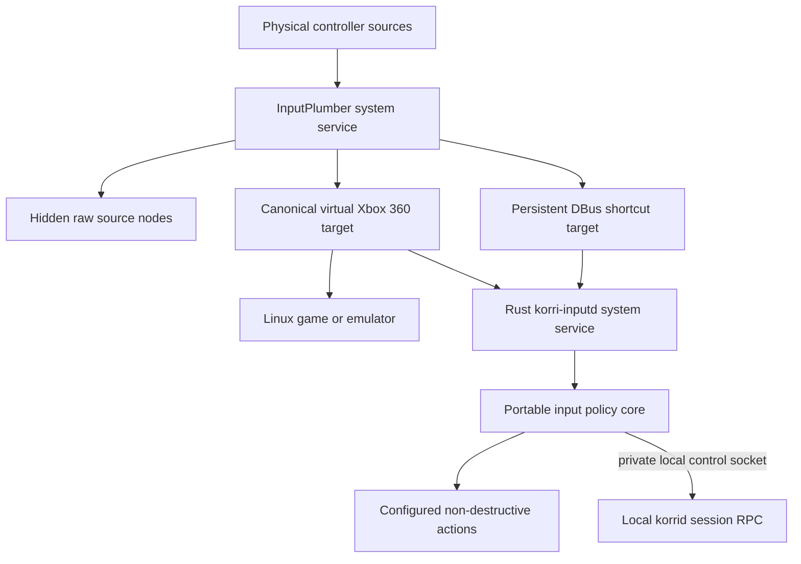
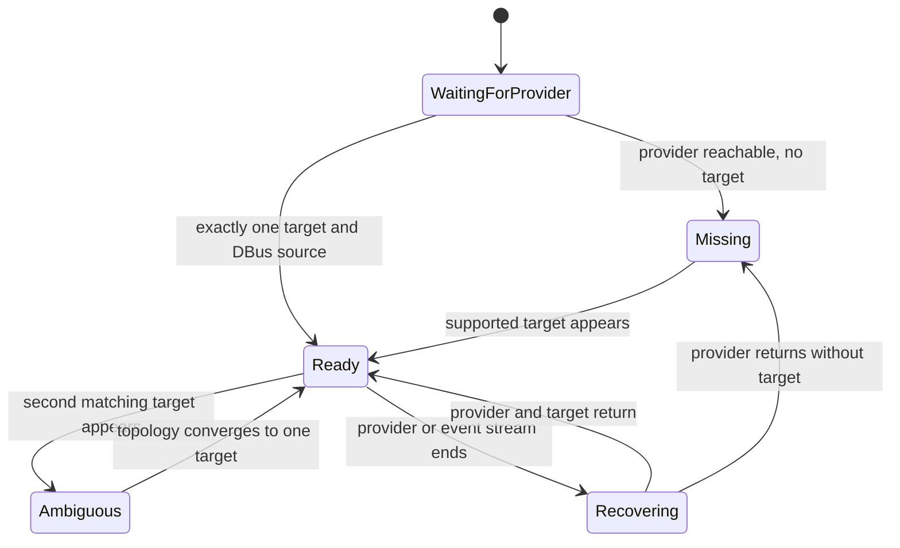
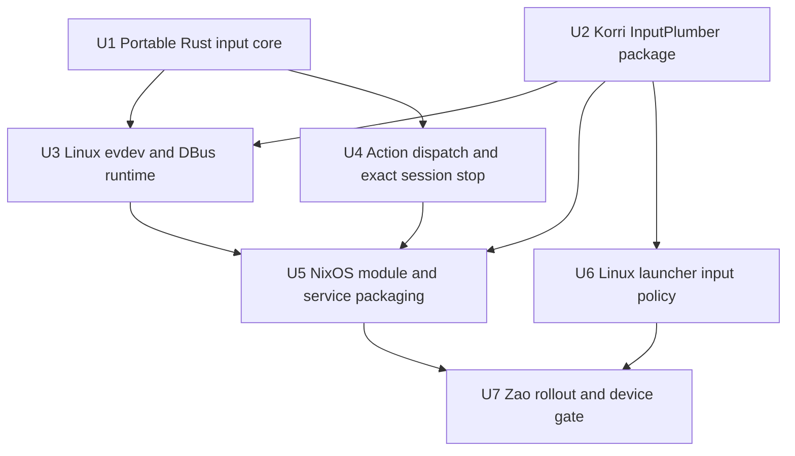
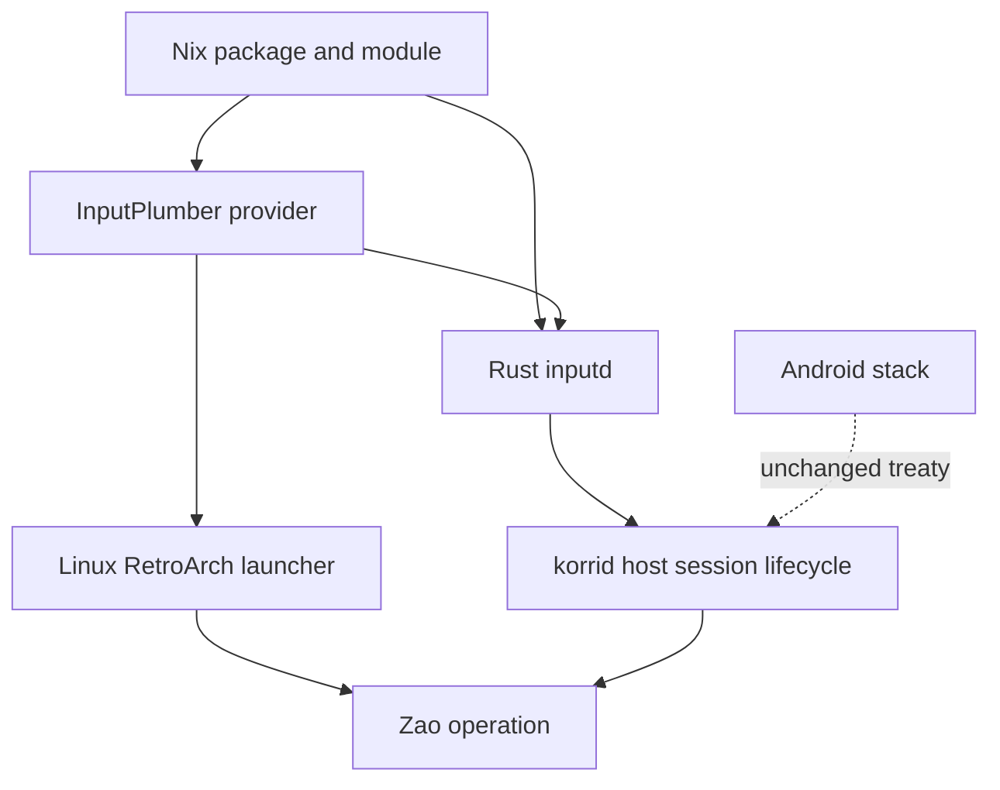

# feat: Restore Linux InputPlumber and Rust inputd

## Summary

Restore Korri's Linux normalized-input boundary as a pinned upstream InputPlumber runtime with Korri-owned profile composition and a separate Rust input-policy daemon. Portable development is the default. NixOS is an optional stable host adapter. Routine code and profile deployment selects one immutable Korri bundle and restarts only Korri input services; full NixOS activation is reserved for approved host-policy maintenance.

## 2026-08-31 Sunshine scope amendment

The implementation now also restores `sunshine-korri` as a supported Korri package and adds the compatible Android Moonlight runtime-settings client. The supported scope is the exact ten-patch package, the explicit live-settings Nix gate, protocol `0x5504`/`0x5505`, exact-launch bitrate/FPS/resolution controls, candidate provenance, private Sunshine state preservation, and physical VAAPI acceptance. This amendment supersedes R11 only for the Android Moonlight client. It does not add an Android InputPlumber backend.

Patch `0015` remains shipped, hardened, and inert by default. Full legacy input-seat equivalence still requires a separate Rust receiver, root-owned launch sidecar and token authority, virtual-seat backend, frame validation, and privilege-boundary proof. That receiver is not silently approximated in this rollout.

Private Sunshine preservation is descriptor-bound. The digest helper must rebind canonical home, `.config`, and `sunshine` parent entries before acceptance. The rollout ledger must read and atomically create baseline and accepted private-state proofs through a no-follow directory descriptor; path-based test-then-open and fixed `.next` redirection are not accepted evidence.

Capability acknowledgements remain on Sunshine's serialized control thread. One per-session pending record preserves a 100 ms encoder-capability settling window and coalesces query floods without detached threads, asynchronous timers, or cross-thread control-server access. Android can reuse a same-epoch final capability snapshot only when mutation and reconciliation state are quiescent. Host policy accepts only the exact approved final `sunshine-korri` derivation and output, not a metadata-preserving derivative.

## Architecture Revision — Portable by Default

Device retries proved that full NixOS activation also reloads Home Manager and unrelated user services. The implementation therefore uses two modes only:

- `korri-dev` runs isolated korrid and inputd processes without root, physical input, actions, systemd mutation, X11 management, or Sunshine management. `--physical` opts in only to an existing validated normalized InputPlumber target; actions remain disabled.
- The optional hardened host layer installs stable service identities, permissions, and units once. Those units launch fixed components from the active Nix GC root. The active and previous bundle selectors both keep their exact store closures available for rollback. A bounded selector changes one immutable bundle, restarts only InputPlumber, inputd, and korrid, and restores the previous selector on failed health.

The full generation gate remains a maintenance and persistence check. It is not the normal development or candidate-deployment path.

---

## Problem Frame

The post-split repository retained Android input handling and the portal's semantic input bus, but not the Linux stack that normalized physical controllers, protected global shortcuts from foreground grabs, and made launcher input deterministic. The `legacy` branch contains that behavior, but `AGENTS.md` forbids merging it wholesale and requires services restored to `main` to be Rust.

Zao already runs stock InputPlumber 0.75.2 as an active NixOS system service, but Korri does not own its package or profile composition and has no input-policy daemon connected to it. Current Linux games therefore lack a repository-controlled normalized-input contract, while the old TypeScript `inputd` cannot return unchanged because its WebSocket bridge and Bun runtime no longer fit the current architecture.

---

## Requirements

- R1. Korri provides a reproducible Linux package built from an exact upstream InputPlumber release plus Korri-owned profile composition; the upstream Rust source remains unmodified.
- R2. Supported Linux device profiles emit one canonical Xbox 360-compatible virtual gamepad and a persistent DBus shortcut target while preserving ordinary gameplay buttons.
- R3. A separate Rust `korri-inputd` service consumes InputPlumber output and contains no browser, WebSocket, or surface dependency.
- R4. Platform-neutral chord, tap, hold, and action-policy behavior is isolated from Linux I/O so it can be reused and compiled independently of the Linux backend.
- R5. Missing, unreadable, stale, or ambiguous normalized controllers fail closed: `inputd` never falls back to a raw physical gamepad and clears held state when a source disappears.
- R6. Global shortcuts continue through InputPlumber's DBus target when a foreground process exclusively grabs the virtual evdev gamepad; duplicate copies dispatch an action at most once within one logical chord lifecycle.
- R7. Destructive actions require an exact chord, a deliberate hold, and an exact active Korri launch identity. They must not restore the legacy process-name or `killall` fallback.
- R8. NixOS integration owns service ordering, package/profile selection, `uinput` availability, narrow virtual-device read permissions, lifecycle persistence, and explicit platform data composition without granting games broad raw-input access.
- R9. Linux RetroArch launches use the normalized udev/Xbox contract and reserve Guide/Home for Korri rather than emulator menu capture.
- R10. Zao proves the complete path through a reversible rollout: package identity, service health, hotplug recovery, one normalized target, gameplay input, grab-resistant shortcuts, exact hold-to-stop, Sunshine regression, rollback, and reboot persistence.
- R11. Android behavior and treaties remain unchanged. The portable core is prepared for later reuse but no Android input backend or JNI integration is added.
- R12. Linux trust boundaries treat launched games as untrusted: games cannot spoof DBus shortcuts, invoke local session stop, open raw physical controllers, or inherit general `/dev/uinput` authority.

---

## Security Invariants

- Root-owned Nix configuration, the pinned InputPlumber service, `korrid`, and `korri-inputd` are trusted components. Launched games and other processes running in the gameplay session are untrusted.
- Possession of a controller authorizes configured input actions. A deliberate hold prevents accidental destructive input; it is not user authentication.
- The LAN-bound korrid RPC remains unable to stop a Zao host launch. Exact status/stop is available only through a systemd-owned local Unix socket whose peer identity excludes the game runtime.
- `korri-inputd` runs under a dedicated service identity. It has read access to validated normalized targets and the authenticated InputPlumber DBus source, but no raw physical-controller access and no `/dev/uinput` write access.
- Sunshine receives any required `/dev/uinput` authority only in its own service credentials. The account that runs games is not broadly enrolled in `input`, `uinput`, or an equivalent device-owning group.
- Configured action commands come only from root-owned Nix configuration, use immutable absolute executables with explicit argv and an allowlisted environment, and are bounded in concurrency, runtime, and captured output.
- Destructive chords are accepted only from the authenticated InputPlumber DBus owner and target. Daemon/provider restart requires a complete control release before destructive input can arm again.

---

## Scope Boundaries

- Do not restore the legacy WebSocket/native browser input bridge or expose a replacement network listener.
- Do not run InputPlumber or the Linux daemon backend inside the standard Android application.
- Do not fix Zao's Xvfb pointer injection problem in this plan.
- Do not restore Sunshine multi-player input-seat mirroring or the privileged uinput seat helper.
- Do not modify or fork upstream InputPlumber source.
- Do not merge the `legacy` or `refactor/inputplumber-runtime-ownership` histories; harvest individual contracts, fixtures, and data deliberately.
- Do not introduce a generic capability model before a real second Linux platform requires it.
- Do not make raw gamepad fallback a compatibility option.

### Deferred to Follow-Up Work

- Browser semantic input delivery: add a Linux surface adapter only when a Linux portal or kiosk is restored.
- Android core reuse: add a JNI/event adapter when an Android behavior needs the shared state machines.
- Zao pointer input: continue under `work/items/parking-lot/01KYRM9JYT8PE3J7N9RW78HG7G-restore-pointer-input-on-zao-headless-sunshine-streams.md`.
- Sunshine remote input seats and multi-player mirroring: restore as a separate privilege-boundary project.
- Real SM8550/RK device maps: consume substrate-owned map packages through the composition seam after the generic Linux/Zao slice is proven.

---

## Context & Research

### Relevant Code and Patterns

- `AGENTS.md` — binding restart rules: legacy is reference-only, services are Rust, schemas preserve the legacy baseline, and `flake.nix` remains an index.
- `services/korrid/src/host/prepare.rs` — current Linux child-process ownership and launch identity; the exact stop path must extend this owner rather than invent process-name killing.
- `services/korrid/src/lib.rs` — existing tagged session status/stop treaties and current host-mode `SessionStopUnsupported` boundary.
- `services/korrid/src/launcher/linux_retroarch.rs` — current generated Linux RetroArch configuration and the insertion point for normalized input policy.
- `services/korrid/package.nix`, `services/korrid/devshell.nix`, and `services/korrid/check.sh` — per-service Nix, toolchain, and verification patterns.
- `services/korrid/deploy/push-zao.sh` and `services/korrid/deploy/zao-remote.sh` — atomic profile switch, health check, and rollback patterns for Zao.
- `work/items/.archive/20260729-zao-host-korrid/plan.md` and `work/items/.archive/20260729-zao-host-korrid/work.md` — Zao's current user-service, Xvfb, Sunshine, and reversible deployment posture.
- `legacy:product/platform/input/native/` — pure device resolution, event mapping, chord, and hold behavior to characterize before porting.
- `legacy:product/services/device/inputd.ts` and `legacy:product/services/device/inputd-actions.ts` — runtime lifecycle and action vocabulary; browser and compatibility branches are intentionally excluded.
- `legacy:product/systems/nixos/modules/korri-input.nix` — provider/inputd separation and NixOS option vocabulary baseline.
- `legacy:product/systems/nixos/images/inputplumber-platform-helpers.nix` and `legacy:product/systems/nixos/images/inputplumber-korri-dbus-shortcuts.yaml` — canonical xb360 and grab-immune DBus profile intent.
- `refactor/inputplumber-runtime-ownership:packages/inputplumber-korri/package.nix` — known upstream 0.75.2 source and cargo hashes plus runtime-versus-hardware-map ownership split.

### Institutional Learnings

- InputPlumber owns hardware normalization; `inputd` owns product shortcut policy. Gameplay reads the virtual target directly rather than being forwarded through `inputd`.
- Fix virtual device identity at InputPlumber rather than accumulating downstream per-device SDL mappings. The intended stable target is Xbox 360-compatible.
- Zao keeps physical source nodes in `/dev/input` so InputPlumber 0.75.2 receives upstream add and remove events. InputPlumber removes `uaccess` and sets source mode `000`; service namespaces and the device gate prove that games cannot open the raw node. Moved-source hiding remains available in the lower-level module but is not the Zao host policy.
- Never grant blanket access to every `/dev/input/event*`. Irrelevant unreadable devices should be ignored; inability to consume the required normalized target is actionable.
- Destructive chords need exact matching, one-shot-until-release behavior, and a launch-identity race guard.
- Nix evaluation tests must inspect generated units, permissions, ordering, and assertions; Rust tests cannot prove the deployed service shape.
- A physical-device rollout is incomplete until the prior generation is restored once and the candidate survives reboot.

### External References

- InputPlumber usage and profile documentation: <https://shadowblip.github.io/InputPlumber/usage/>
- InputPlumber upstream source: <https://github.com/ShadowBlip/InputPlumber>
- Rust `evdev` 0.13.2 documentation, including synchronized and Tokio event streams: <https://docs.rs/evdev/0.13.2/evdev/>
- Rust `zbus` Tokio integration and signal APIs: <https://docs.rs/zbus/5.18.0/zbus/>
- Current NixOS InputPlumber module: <https://github.com/NixOS/nixpkgs/blob/nixos-unstable/nixos/modules/services/hardware/inputplumber.nix>

---

## Key Technical Decisions

| Decision | Chosen approach | Rationale |
|---|---|---|
| Runtime boundary | Separate Rust service with a small portable core crate | Keeps Linux evdev/DBus dependencies out of Android `korrid`, preserves process isolation, and still permits later core reuse. |
| InputPlumber ownership | Pin exact upstream source and compose Korri data around it | Restores reproducibility without carrying an upstream source fork. |
| Device contract | Canonical Xbox 360 target; no raw fallback | One stable identity works across SDL, RetroArch, and other Linux consumers and prevents duplicate players. |
| Shortcut source | Native `zbus` subscription to InputPlumber's system-bus target | Preserves grab immunity while removing the legacy `gdbus` subprocess and its line-buffering failure mode. |
| Gameplay event source | Rust `evdev` synchronized async stream with bounded reconciliation | Uses kernel state resynchronization after dropped events and preserves the proven finite-poll hotplug posture. |
| Destructive action | Exact launch-aware control over a systemd-owned private Unix socket | Keeps stop unavailable on Zao's unauthenticated LAN RPC, excludes game processes, avoids process-name killing, and refuses replacement-launch races. |
| Service lifecycle | Hardened system units under separate service identities | Gives real ordering against the system InputPlumber unit, avoids login/linger dependencies, and prevents gameplay children from inheriting inputd authority. |
| Deployment | NixOS module plus reversible Zao generation | InputPlumber, device ACLs, socket activation, and `uinput` are system concerns; a user-profile-only installation cannot restore them honestly. |
| Android posture | No adapter now; keep core free of Linux I/O | Meets the current request without inventing an Android integration that standard app permissions cannot support. |

Additional decisions:

- The daemon consumes InputPlumber's normalized virtual controller and DBus shortcut lane only. It does not create virtual devices itself in this slice.
- The legacy action identifiers and configuration vocabulary are the schema baseline. Unsupported or unconfigured actions log and do nothing; there is no implicit shell or compatibility fallback.
- Exact destructive chords are DBus-authoritative and must be assembled by one authenticated InputPlumber target. Intentional mixed-device non-destructive chords may be supported only where a platform profile declares both controls as one InputPlumber composite.
- A quick release or partial hold of the destructive chord has no UI effect because the decision overlay is outside scope; only the completed hold dispatches. Startup, reconnect, and resynchronization begin disarmed until every destructive control has been observed released.
- InputPlumber's well-known DBus name is not sufficient evidence by itself: inputd binds the current unique owner and allowlists the object path, interface, signal member, and `ui_*` capabilities, clearing state on owner change.
- InputPlumber profile composition produces one resolved data root. Do not rely on ambiguous `XDG_DATA_DIRS` shadowing when a device profile must be transformed deterministically.
- Host mode exposes one active launch globally because the current session status treaty is singular. Each launch is owned by a non-reusable systemd scope/cgroup identity, and owner restart cannot leave an untracked game behind.

---

## Open Questions

### Resolved During Planning

- Was legacy `inputd` only a browser bridge? No. It also owned system shortcuts, hold policy, action dispatch, and the grab-immune DBus path; only browser delivery is removed.
- Was Korri's InputPlumber a source fork? No. Korri pinned upstream and derived a package/data root with target and profile adjustments.
- Should the new daemon be folded into `korrid`? No. A separate service avoids Linux dependencies in the Android-capable daemon and preserves a narrow privilege boundary.
- Should the DBus source remain a subprocess? No. Rust uses `zbus` directly against the system bus.
- Can destructive stop use the legacy kill file? No. Current main has no compatibility obligation, and exact launch identity already exists in the session treaty.

### Deferred to Implementation

- Exact Zao NixOS consumer path: determine whether its current machine configuration can import this repository's exported module directly or needs a small external import change. The module output and device rollback contract are fixed; the location of the consuming host file is operational discovery.
- InputPlumber 0.75.2 data composition detail: verify during implementation whether a composed package, copied data root, or package post-install transform gives the smallest deterministic result. The outcome must be one validated root with unchanged upstream source.
- Stable normalized target evidence on Zao: a temporary, explicitly named synthetic source/profile may satisfy preflight only. Persistent switch and reboot evidence require an attached real controller matched by a production profile.
- Whether `evdev` enumeration alone exposes every legacy resolver identity field needed for ambiguity detection. If not, retain the legacy `/proc/bus/input/devices` parser as a small Linux backend helper rather than weakening selection.

---

## Output Structure

```text
services/inputd/
├── Cargo.toml
├── Cargo.lock
├── core/
│   ├── Cargo.toml
│   └── src/
├── src/
│   ├── main.rs
│   ├── actions.rs
│   ├── dbus.rs
│   ├── devices.rs
│   └── runtime.rs
├── tests/
│   └── fixtures/
├── package.nix
├── devshell.nix
├── check.sh
├── check-in-shell.sh
├── nix/
│   ├── inputplumber-package.nix
│   ├── inputplumber-data.nix
│   ├── korri-input.nix
│   ├── korri-input-module-check.nix
│   └── inputplumber-korri-dbus-shortcuts.yaml
└── deploy/
    ├── device-check.sh
    └── README.md

services/korrid/
├── nixos-module.nix
├── nixos-module-check.nix
└── src/host/control.rs
```

This tree is a scope declaration. Implementation may adjust filenames while preserving the component boundaries and test surfaces described below.

---

## High-Level Technical Design

> *This illustrates the intended approach and is directional guidance for review, not implementation specification. The implementing agent should treat it as context, not code to reproduce.*



The provider is the only hardware-normalization owner. Games receive gameplay events directly from its virtual target. `korri-inputd` observes the normalized target and grab-immune DBus copy only to evaluate product shortcuts; it does not sit in the gameplay data path.

The runtime reconciles these states:



`Missing`, `Ambiguous`, and `Recovering` are non-fatal service states, but they dispatch no controller actions and retain no held controls.

---

## Implementation Units



### U1. Port the platform-neutral input policy core

**Goal:** Preserve the legacy semantic control, chord, tap, and hold behavior in a pure Rust crate with no Linux, DBus, process, network, or UI dependency.

**Requirements:** R3, R4, R5, R6, R7, R11

**Dependencies:** None

**Files:**
- Create: `services/inputd/core/Cargo.toml`
- Create: `services/inputd/core/src/lib.rs`
- Create: `services/inputd/core/src/controls.rs`
- Create: `services/inputd/core/src/shortcuts.rs`
- Create: `services/inputd/core/src/hold.rs`
- Test: `services/inputd/core/tests/shortcut_policy.rs`
- Test: `services/inputd/core/tests/hold_policy.rs`

**Approach:**
- Characterize legacy behavior before translating it: button-to-control mapping, D-pad axis transitions, exact versus subset chords, one-shot-until-release, tap suppression after chord use, source clearing, and deterministic hold timing.
- Represent input as semantic control transitions tagged with a logical source identity. Keep Linux event codes and InputPlumber capability names in adapters, not in the state machines.
- Make the destructive shortcut same-logical-source and exact. Preserve cross-source composition only for explicitly non-destructive policy where required by a real profile.
- Inject monotonic time/timer behavior so hold tests do not sleep.
- Compile this crate for a non-Linux target in CI as a portability guard without adding an Android consumer.

**Execution note:** Add characterization tests against the legacy semantics before porting the state machines.

**Patterns to follow:**
- `legacy:product/platform/input/native/system-shortcut-engine.ts`
- `legacy:product/platform/input/native/chord-hold-supervisor.ts`
- `clients/portal/src/input/types.ts` for semantic-action naming boundaries, without importing portal code.

**Test scenarios:**
- Happy path: Guide plus Left Bumper produces one configured non-destructive action and suppresses the Guide tap.
- Happy path: all four destructive controls from one logical source held through the threshold produce exactly one fired event.
- Edge case: the same held chord emits repeated press events but fires only once until a required control is released and pressed again.
- Edge case: a destructive chord split across two logical sources never matches.
- Edge case: D-pad axis transitions release the prior direction before pressing the opposite direction.
- Edge case: clearing a removed source releases its controls and permits future chords after reconnect.
- Error path: unknown controls and invalid repeat values are ignored without changing state.
- Hold path: release inside the tap window, between tap and hold thresholds, and after firing produces distinct deterministic outcomes; only the fired outcome is destructive.
- Portability: the core compiles without Linux-only dependencies for the configured Android-compatible target.

**Verification:**
- The pure crate reproduces the accepted legacy policy, strengthens destructive-source isolation, and has no Linux or UI dependency in its graph.

### U2. Restore the Korri-owned InputPlumber package and data root

**Goal:** Produce a reproducible InputPlumber package whose runtime source is exact upstream 0.75.2 and whose resolved data root carries Korri's canonical target and DBus shortcut policy.

**Requirements:** R1, R2, R6, R8

**Dependencies:** None

**Files:**
- Create: `services/inputd/nix/inputplumber-package.nix`
- Create: `services/inputd/nix/inputplumber-data.nix`
- Create: `services/inputd/nix/inputplumber-korri-dbus-shortcuts.yaml`
- Create: `services/inputd/nix/inputplumber-package-check.nix`
- Modify: `flake.nix`
- Test: `services/inputd/nix/inputplumber-package-check.nix`

**Approach:**
- Harvest the exact upstream version and hashes from `refactor/inputplumber-runtime-ownership`, then make the package ownership and provenance visible in the output name and checks.
- Preserve upstream Rust source unchanged. Apply Korri behavior only while composing installed device/profile data.
- Transform only explicitly selected device profiles: canonical `xb360`, persistent `dbus` target, Guide routed to DBus only, and gameplay shortcut buttons routed to both gamepad and DBus.
- Accept platform-owned map/data packages as explicit composition inputs. Produce one deterministic resolved data root rather than relying on search-path precedence.
- Fail the build if an expected profile, target, mapping, or source pattern is absent or if the old target remains.

**Execution note:** Begin with package-content checks that fail against stock InputPlumber and pass only once the intended derived data exists.

**Patterns to follow:**
- `refactor/inputplumber-runtime-ownership:packages/inputplumber-korri/package.nix`
- `legacy:product/systems/nixos/images/inputplumber-platform-helpers.nix`
- `legacy:product/systems/nixos/images/inputplumber-korri-dbus-shortcuts.yaml`

**Test scenarios:**
- Happy path: the package exposes the expected native InputPlumber executable and reports the pinned version.
- Happy path: a selected profile contains `xb360` and `dbus`, with Guide reserved to DBus and gameplay buttons duplicated to both targets.
- Edge case: composing an additional platform data package retains upstream runtime files and the platform map in one resolved root.
- Error path: a renamed or missing upstream profile causes a build failure instead of silently skipping the transform.
- Error path: the built profile still contains the superseded target or lacks a required `ui_*` mapping and is rejected.
- Provenance: package checks establish that no source patch is applied to the upstream Rust code.

**Verification:**
- `inputplumber-korri` is reproducible, source-unforked, data-complete, and exported as a Linux package from the flake index.

### U3. Implement the Rust Linux evdev and InputPlumber DBus runtime

**Goal:** Add a Linux daemon that discovers exactly one normalized target, reads synchronized events, consumes the persistent DBus shortcut target, and recovers safely across topology changes.

**Requirements:** R2, R3, R5, R6

**Dependencies:** U1, U2

**Files:**
- Create: `services/inputd/Cargo.toml`
- Create: `services/inputd/Cargo.lock`
- Create: `services/inputd/src/main.rs`
- Create: `services/inputd/src/devices.rs`
- Create: `services/inputd/src/dbus.rs`
- Create: `services/inputd/src/runtime.rs`
- Create: `services/inputd/tests/runtime_reconciliation.rs`
- Create: `services/inputd/tests/dbus_shortcuts.rs`
- Create: `services/inputd/tests/fixtures/proc-bus-input/`

**Approach:**
- Use `evdev` synchronized async streams so dropped kernel events trigger state resynchronization rather than leaving phantom held buttons.
- Reconcile the finite device topology on a bounded interval, selecting only virtual InputPlumber evidence and preserving the legacy `found | missing | ambiguous` contract.
- Never open raw gamepads as fallback. Ignore irrelevant unreadable devices while surfacing required-target permission failures.
- Subscribe to InputPlumber's system-bus DBus events through Tokio-integrated `zbus`; reconnect when the provider restarts or the target object is recreated.
- Map DBus `ui_*` capabilities through a pure adapter into the same core source model as evdev while preserving source provenance.
- Permit only transitions from the authenticated DBus source to contribute to destructive chords. Evdev-only and mixed evdev/DBus controls may contribute only to explicitly non-destructive policy.
- Clear all state from an ended stream before reopening. Deduplicate an action observed through both evdev and DBus within the same logical chord lifecycle.
- Emit structured logs for lifecycle state, selected target identity, provider loss, ambiguity, permission denial, and action outcome without logging arbitrary device event streams by default.

**Patterns to follow:**
- `legacy:product/platform/input/native/discover-devices.ts`
- `legacy:product/platform/input/native/inputplumber-virtual-gamepad.ts`
- `legacy:product/services/device/inputd-dbus-shortcut-source.ts`
- Current `services/korrid/src/main.rs` logging and shutdown posture.

**Test scenarios:**
- Happy path: one virtual Xbox 360 target is selected and its controls reach the portable core.
- Happy path: supported `ui_*` DBus signals map to the intended semantic controls; unknown capabilities are ignored.
- Edge case: raw gamepads exist but no virtual target exists; runtime remains `Missing` and dispatches nothing.
- Edge case: two matching virtual targets exist; runtime becomes `Ambiguous`, closes the old stream, clears held state, and dispatches nothing.
- Edge case: an event node is renumbered while preserving device identity; reconciliation reopens the new path without carrying held controls.
- Failure path: InputPlumber or DBus disappears and returns; the daemon clears state, requires a full destructive-control release, retries with bounded cadence, and resumes without restart.
- Failure path: the selected target is unreadable; logs identify the required target while unrelated unreadable devices do not flood errors.
- Failure path: an event path is replaced between enumeration and open; descriptor provenance validation rejects the replacement rather than trusting its name.
- Failure path: an evdev stream ends mid-chord; source state is cleared and no delayed destructive action can fire.
- Security: signals from a client other than InputPlumber's current unique DBus owner, or from a non-allowlisted path/interface/member, cannot produce controls.
- Security: evdev-only and mixed evdev/DBus controls cannot complete a destructive chord.
- Integration: the same non-destructive shortcut copied over evdev and DBus dispatches once, while authenticated DBus continues after a test process grabs the evdev target.

**Verification:**
- The daemon remains alive but inert through missing and ambiguous states, automatically recovers to `Ready`, and never consumes a raw fallback controller.

### U4. Add explicit action dispatch and exact host-session stopping

**Goal:** Restore non-UI system actions and safe hold-to-stop by extending the current host launcher into an exact launch-aware control surface.

**Requirements:** R3, R6, R7

**Dependencies:** U1, U3

**Files:**
- Create: `services/inputd/src/actions.rs`
- Create: `services/inputd/src/korrid_client.rs`
- Test: `services/inputd/tests/action_dispatch.rs`
- Create: `services/korrid/src/host/control.rs`
- Modify: `services/korrid/src/host/prepare.rs`
- Modify: `services/korrid/src/lib.rs`
- Test: `services/korrid/src/host/control.rs`
- Test: `services/korrid/src/host/prepare.rs`
- Test: `services/korrid/src/lib.rs`

**Approach:**
- Preserve the legacy action vocabulary and environment/config names where they still describe non-UI Linux actions. Missing commands warn and no-op; configured commands execute as an argv vector without an implicit shell.
- Keep quick-tap, progress, and cancel hold outcomes internal because no overlay is restored. Only the completed destructive hold requests session termination.
- Make host mode singular: one active or stopping launch globally, matching the existing singular session status treaty.
- Bind each launch ID to a dedicated systemd scope/cgroup identity. Transition atomically from running to stopping, reject a new prepare while stopping, and report completion only after the scope is empty and the child is reaped.
- Define owner-crash behavior: korrid either recovers the same trusted scope identity or terminates it before accepting another launch; no orphaned untracked game may survive restart.
- Keep host status and stop unsupported on the unauthenticated LAN listener. Add a systemd-owned local Unix control socket with peer authorization restricted to the dedicated inputd service identity.
- Require the expected launch identity on every local stop. Distinguish no active launch, stale identity, already stopping, and completed stop without exposing stop authority to ordinary loopback callers or games.
- Remove configured kill-command overrides, the legacy kill file, and all process-name fallbacks from the restored design.

**Execution note:** Start with race-focused host launcher tests before changing child ownership and reaping.

**Patterns to follow:**
- `services/korrid/src/host/prepare.rs` for process ownership and launch ID generation.
- Existing `SessionStatusRequest`, `SessionStopRequest`, and tagged outcomes in `services/korrid/src/lib.rs`.
- `legacy:product/services/device/inputd-actions.ts` for action vocabulary only, excluding sessiond and kill-file compatibility branches.
- `work/items/parking-lot/01KZ7BJPNHCT8H6XC3Q67XS6A6-add-exact-host-session-rollback-for-failed-stream-handoffs.md` for the exact-stop race requirement.

**Test scenarios:**
- Happy path: a configured non-destructive action runs once for one core match.
- Edge case: an unconfigured action logs a bounded warning and leaves the daemon healthy.
- Failure path: a configured command exits unsuccessfully; failure is reported without crashing or automatic retry.
- Happy path: private host status identifies the live launch and exact stop empties its launch scope, reaps the child, and clears status.
- Edge case: no active launch exists when the hold fires; inputd reports no action and does not kill unrelated processes.
- Race path: status returns launch A, launch A exits, and launch B starts before stop; stop conditioned on A refuses to terminate B.
- Concurrency path: prepare during stopping is rejected; repeated stop reports the existing stopping/completed outcome and cannot target a later launch.
- Process path: descendants that create another process group or session remain inside the launch scope and are terminated; PID reuse cannot retarget stop.
- Crash path: restarting korrid during a launch leaves no untracked process and does not permit a duplicate prepare.
- Authorization path: LAN callers, ordinary loopback callers, and launched games cannot read private status or request stop; only the inputd service peer can.
- Failure path: local control is unavailable or rejects stop; inputd reports failure and performs no fallback mutation.
- Contract: public generated TypeScript remains unchanged because host stop stays unsupported on the public RPC; the private local treaty is covered by Rust integration tests.

**Verification:**
- Every destructive dispatch is bound to one observed launch ID, and tests prove a replacement process cannot be stopped accidentally.

### U5. Add Linux/NixOS module, package, and verification surfaces

**Goal:** Make the provider and daemon reproducible, independently configurable NixOS components with narrow permissions and correct lifecycle ordering.

**Requirements:** R1, R3, R5, R8, R11

**Dependencies:** U2, U3, U4

**Files:**
- Create: `services/inputd/package.nix`
- Create: `services/inputd/devshell.nix`
- Create: `services/inputd/check.sh`
- Create: `services/inputd/check-in-shell.sh`
- Create: `services/inputd/nix/korri-input.nix`
- Create: `services/inputd/nix/korri-input-module-check.nix`
- Create: `services/korrid/nixos-module.nix`
- Create: `services/korrid/nixos-module-check.nix`
- Modify: `flake.nix`
- Modify: `nix/tasks.nix`
- Test: `services/inputd/nix/korri-input-module-check.nix`
- Test: `services/korrid/nixos-module-check.nix`

**Approach:**
- Export `korri-inputd`, `inputplumber-korri`, and `nixosModules.korri-input` through the root flake while keeping derivation details in `services/inputd/`.
- Preserve independent `provider` and `inputd` enablement. Enabling both orders the inputd system service after the provider service starts but does not conflate their responsibilities.
- Graduate Linux korrid hosting from the ad-hoc user unit into a repository-owned system unit running under the configured gameplay UID. A root-owned socket unit passes the private control listener to korrid while restricting connection rights to the distinct inputd service identity.
- Run InputPlumber, korrid host control/socket activation, and `korri-inputd` as ordered system units. Use distinct service identities and explicit runtime directories; do not depend on cross-manager ordering, login, or linger.
- Load `uinput` for the provider. Give inputd read access only to recognized virtual targets through a dedicated ACL and no uinput authority. Give Sunshine service-specific uinput access without granting that authority to the gameplay account.
- Source non-destructive action commands from root-owned Nix configuration only. Restrict executable paths, argv, environment, concurrency, runtime, and output, and ensure command children do not inherit local-stop credentials.
- Restrict ownership of InputPlumber's well-known DBus name and access to any provider methods that can produce shortcut signals so the game identity cannot turn InputPlumber into a signal proxy.
- Enable moved-source hiding for profiles validated to support it, with required same-filesystem setup and evaluation assertions. Deny game access to raw nodes from initial creation through provider restart; moved-source hiding is an additional boundary rather than the only boundary.
- Preserve legacy action configuration names and provider data-package vocabulary unless implementation finds a concrete incompatibility.
- Add one project task that runs core tests, Linux daemon tests, formatting/lints, package checks, Nix module evaluation, and a non-Linux core compilation check. Integrate it into the repository's broader completion gate without making Android build the Linux daemon.

**Patterns to follow:**
- `services/korrid/package.nix`, `services/korrid/devshell.nix`, and `nix/tasks.nix`.
- `legacy:product/systems/nixos/modules/korri-input.nix` for option vocabulary and provider/inputd separation.
- Current NixOS `services.inputplumber` module behavior for package selection and system unit ownership.

**Test scenarios:**
- Happy path: provider-only configuration enables InputPlumber, selects the Korri package, loads `uinput`, and does not emit an inputd unit.
- Happy path: inputd-only configuration emits the daemon unit without silently enabling a provider.
- Happy path: provider plus inputd orders the daemon after InputPlumber and gives only the dedicated inputd identity access to the normalized target.
- Happy path: Linux korrid receives the systemd-owned private control socket while launched games cannot open it, even though korrid launches them under the gameplay UID.
- Edge case: additional platform data composes before service startup and is visible in the resolved package root.
- Error path: inputd is configured to require InputPlumber but the provider is absent; Nix evaluation rejects the contradictory configuration.
- Error path: broad raw-input group access or unsafe source-hide mount layout is requested without explicit support; evaluation rejects it.
- Security: generated service has no network listener, no uinput write requirement for inputd, bounded writable paths, and only the system bus/address families it needs.
- Security: an untrusted system-bus client cannot own InputPlumber's well-known name or invoke a provider method that produces an authenticated shortcut signal.
- Security: the game service cannot open physical event nodes, `/dev/uinput`, or the local stop socket; Sunshine and inputd receive only their service-specific device/socket authority.
- Security: a configured action helper cannot open the local stop socket or reuse inputd's peer authority.
- Lifecycle: provider and inputd are real system-unit dependencies, and machine-readable health distinguishes Ready, Missing, Ambiguous, and Recovering rather than equating process activity with readiness.
- Integration: flake package outputs contain both executables and the root flake remains composition-only.

**Verification:**
- A Nix evaluation explains and enforces the provider/daemon boundary, and the complete input gate runs through one discoverable project task.

### U6. Restore the normalized Linux launcher policy

**Goal:** Ensure Linux RetroArch consumes the canonical provider output and cannot steal Korri's Guide/Home path through its generated configuration.

**Requirements:** R2, R8, R9

**Dependencies:** U2

**Files:**
- Modify: `services/korrid/src/launcher/linux_retroarch.rs`
- Create: `services/inputd/nix/retroarch-inputplumber-autoconfig.nix`
- Test: `services/korrid/src/launcher/linux_retroarch.rs`
- Test: `services/inputd/nix/inputplumber-package-check.nix`

**Approach:**
- Restore the legacy RetroArch udev/joypad baseline in the generated Linux configuration: udev input, autodetection, bounded users, and an explicit non-Guide menu combination.
- Package an Xbox 360 autoconfig derived from the installed baseline with Guide/Home menu capture removed.
- Rely on provider-side raw-source hiding and narrow ACLs so RetroArch sees the normalized target as the sole controller, rather than adding per-launch device-node heuristics.
- Keep the policy Linux-only; Android RetroArch configuration and launch integrity remain unchanged.

**Patterns to follow:**
- `services/korrid/src/launcher/linux_retroarch.rs` atomic generated-config pattern.
- `legacy:product/plugins/retroarch/nix/nixos-module.nix` InputPlumber policy and autoconfig transform.

**Test scenarios:**
- Happy path: generated Linux RetroArch configuration selects udev input and supports the normalized Xbox target.
- Happy path: packaged autoconfig contains ordinary gameplay bindings but no Guide/Home menu toggle.
- Edge case: the configured menu combo remains reachable without overlapping Korri's global shortcut controls.
- Error path: expected upstream Xbox autoconfig is absent or changes shape; package construction fails instead of shipping an unverified transform.
- Regression: Android launch specification and Android RetroArch assets are byte-for-byte outside this unit's changes.

**Verification:**
- A Linux RetroArch launch receives the canonical controller once, while Guide/Home remains exclusively available to Korri's DBus shortcut policy.

### U7. Deploy reversibly and prove the complete path on Zao

**Goal:** Replace Zao's stock InputPlumber posture with the repository-controlled stack, verify the complete behavior, exercise rollback, then prove reboot persistence.

**Requirements:** R1, R2, R3, R5, R6, R7, R8, R9, R10, R11

**Dependencies:** U5, U6

**Files:**
- Create: `services/inputd/deploy/device-check.sh`
- Create: `services/inputd/deploy/README.md`
- Modify: `services/korrid/deploy/push-zao.sh` only if the existing app deployment must carry the inputd revision or health dependency
- Modify: `services/korrid/deploy/zao-remote.sh` only if coordinated migration away from the prior user service is required
- Modify: `work/items/active/019fde6b-8c02-7b01-8dfb-ffe97bcb5ef1-restore-linux-inputplumber/work.md`
- Test: `services/inputd/deploy/test-device-check.sh`

**Approach:**
- Capture the active NixOS generation, InputPlumber package/version/data root, units, service logs, input topology, permissions, Sunshine state, and Korri session state before mutation.
- Build the candidate generation from repository exports and apply it first as a temporary/test generation. Require an explicit device serial/host and operator confirmation before switching persistent system state.
- Preserve the prior generation and stock service definition. Exercise rollback after the first successful candidate smoke rather than treating rollback as documentation-only.
- Use a temporary synthetic source/profile only as preflight evidence for generic routing, DBus owner validation, and cleanup. Persistent switch and reboot gates require a real supported controller and production physical profile.
- Prove normal gameplay before shortcut mutation: exactly one normalized Xbox target, no raw duplicate visible to the game user, Neverball or RetroArch receives controls, and Sunshine remains connected. Verify open attempts with fresh service/game credentials rather than trusting group declarations alone.
- Prove fail-closed recovery by temporarily removing/recreating the source and by introducing an explicitly bounded ambiguous test target; inputd must clear state, dispatch nothing while unsafe, and recover.
- Prove grab immunity with a bounded test helper that exclusively grabs the normalized evdev node while the authenticated DBus shortcut copy remains observable. Prove another system-bus client cannot spoof the allowlisted signal source.
- Launch a Korri-owned test game, record its launch ID, fire the exact hold chord, and verify only that launch's cgroup stops. Then create replacement-session, owner-restart, and held-during-provider-restart races and verify none can trigger stale termination.
- Inject a provider-health failure after candidate activation and require automatic restoration of the prior generation. Reboot the restored generation and repeat raw-input and Sunshine checks before persistent candidate switch.
- Switch persistently only after all candidate gates pass with real hardware, reboot Zao, and repeat service, topology, gamepad, shortcut, Sunshine, and catalog checks.
- Keep secrets, Sunshine pairing material, and private game content out of scripts, logs, repository files, and summaries.

**Execution note:** Device mutation is HITL-gated. No persistent switch occurs until the temporary generation and exercised rollback are both green.

**Patterns to follow:**
- `services/korrid/deploy/push-zao.sh` and `services/korrid/deploy/zao-remote.sh` for atomic handoff and health polling.
- `services/korrid/android-game-discovery-check.sh` for explicit-target, state-capture, mutation, and restoration discipline.
- `work/items/.archive/20260729-zao-host-korrid/work.md` for Zao's existing operational ledger.

**Test scenarios:**
- Baseline: the script refuses an omitted or mismatched host and performs no mutation during its inspection mode.
- Happy path: temporary generation reports the pinned InputPlumber package, healthy provider/inputd units, one normalized target, and working gameplay.
- Edge case: no compatible physical controller is present; the temporary synthetic gate may prove preflight behavior and cleanup, but the persistent switch remains blocked.
- Failure path: normalized target is missing, unreadable, has untrusted provenance, is replaced between enumeration and open, or is ambiguous; inputd dispatches nothing and the gate fails with actionable evidence.
- Integration: an exclusive evdev grab blocks the raw observer but not the DBus shortcut action.
- Integration: exact hold stops the recorded active launch and cannot stop a replacement launch.
- Regression: Sunshine preserves pairing and video; remote and local controller input work through disconnect/reconnect and Sunshine restart; repeated reconnects do not create a second normalized target or virtual-device feedback loop.
- Rollback: an injected candidate failure automatically restores the prior generation, mutable unit state, device ACLs, moved sources, and fresh process credentials; rebooted rollback returns topology and Sunshine to baseline.
- Persistence: after candidate switch and reboot, the same package identity, units, permissions, normalized target behavior, authenticated DBus source, local-control authorization, and Sunshine regression remain green.

**Verification:**
- The work ledger contains baseline, candidate, exercised rollback, persistent switch, reboot, and final regression evidence. Zao runs the repository-controlled stack with no untracked temporary profiles or devices.

---

## System-Wide Impact



- **Interaction graph:** NixOS owns the provider and daemon lifecycle; InputPlumber emits gameplay and shortcut targets; inputd evaluates policy; local korrid owns exact process termination; launchers consume only normalized gameplay input.
- **Error propagation:** Provider absence, target ambiguity, ACL denial, DBus loss, and local RPC failure become structured logs and an inert inputd state. None authorizes raw fallback or process-name killing.
- **State lifecycle risks:** Held controls must be cleared on source loss; duplicate DBus/evdev copies must not double-dispatch; child exit versus stop races must be launch-ID guarded; temporary device profiles must not survive rollout validation.
- **API surface parity:** Public host session status/stop remains unsupported and generated TypeScript is unchanged. Exact launch control is a private, local Rust integration over a systemd-owned socket.
- **Integration coverage:** Unit tests cannot prove InputPlumber data discovery, udev permissions, evdev grabbing, DBus owner authentication, launch-scope termination, NixOS boot ordering, or Sunshine survival; U7 owns those cross-layer gates.
- **Unchanged invariants:** Android remains hardware-owner for Android input; surfaces stay hardware-blind; inputd opens no network listener; plugins remain effect-free declarations; InputPlumber remains the only Linux hardware normalizer.

---

## Phased Delivery

### Phase 1 — Deterministic foundations

- U1: portable Rust state machines and characterization coverage.
- U2: pinned InputPlumber runtime and validated profile composition.

### Phase 2 — Runtime and control integration

- U3: Linux evdev/DBus lifecycle.
- U4: explicit actions and exact host-session stop.

### Phase 3 — Product integration

- U5: NixOS module, packages, permissions, and checks.
- U6: Linux RetroArch normalized-input policy.

### Phase 4 — Physical proof

- U7: temporary generation, device gates, exercised rollback, persistent switch, and reboot validation on Zao.

---

## Risks & Dependencies

| Risk | Likelihood | Impact | Mitigation |
|---|---:|---:|---|
| InputPlumber profile/schema drift makes the derived data transform target the wrong file | Medium | High | Pin 0.75.2, transform an allowlisted profile set, and fail package checks on every expected/forbidden mapping. |
| Generic x86 Zao has no naturally matching physical composite profile | High | Medium | Use synthetic input only for preflight; require a real supported controller and production profile before persistent switch or reboot acceptance. |
| Two event copies cause duplicate actions | Medium | High | Use one core action lifecycle, stable logical-source identities, and explicit evdev/DBus deduplication tests. |
| Device loss leaves a phantom held destructive chord | Medium | High | Clear source and hold state before reconnecting any ended or replaced stream. |
| Broad input/uinput membership exposes physical input or injection to games | High on current Zao | Critical | Move authority into service-specific credentials for InputPlumber, inputd, and Sunshine; test fresh game-process open attempts and block rollout if same-UID authority remains. |
| Source hiding moves nodes across filesystems and fails | Medium | High | Assert same-filesystem layout, verify active moved-source paths on device, and retain rollback generation. |
| Host stop races with a replacement launch or escaped descendant | Medium | Critical | Require expected launch ID, singular launch state, and non-reusable systemd scope/cgroup ownership; reject stale and concurrent transitions. |
| Rust DBus API differs from observed InputPlumber 0.75.2 signals | Medium | Medium | Capture live introspection as implementation evidence and test against provider signals before persistent rollout. |
| Another system-bus client spoofs a destructive `ui_*` signal | Low | Critical | Bind the unique InputPlumber owner and allowlist path/interface/member/capability; clear and disarm on owner change. |
| A launched game reaches the private stop surface because it shares the gameplay UID | Medium | Critical | Use a root-owned socket unit and distinct inputd peer identity; prove ordinary loopback and fresh game processes cannot connect. |
| Root-configured action helpers hang, leak environment, or accumulate | Medium | High | Require immutable absolute argv, allowlisted environment, bounded output/runtime/concurrency, credential dropping, and child cleanup. |
| NixOS modules cannot be consumed directly by Zao's current configuration | Medium | Medium | Export standalone input and Linux-korrid modules; identify the smallest external imports during implementation and record them in the device ledger. |
| InputPlumber replacement regresses Sunshine or existing streamed controller injection | Medium | High | Baseline Sunshine topology, run streaming regression before and after rollback, and require reboot proof before completion. |
| Full repository checks become coupled to Linux-only dependencies on Android builders | Low | Medium | Keep separate crates/derivations, compile only the core for Android-compatible targets, and compose gates at the task layer. |

---

## Documentation / Operational Notes

- Document package provenance, transformed profile names, action configuration, service lifecycle states, and expected logs under `services/inputd/README.md` or the nearest service-local documentation chosen during implementation.
- Document the difference between InputPlumber gameplay normalization and inputd policy handling; inputd is not a gameplay forwarding service.
- Record the exact Zao NixOS consumer change, baseline generation, rollback generation, and final package identities in the work ledger without recording private content or pairing material.
- Keep the device gate read-only by default and require explicit targeting and confirmation for temporary or persistent changes.
- Update `nix run .#help` so the Linux input verification task is discoverable.

---

## Success Metrics

- The root flake exposes reproducible `inputplumber-korri` and `korri-inputd` Linux packages plus reusable input and Linux-korrid NixOS modules.
- The integrated input gate proves the portable core, Linux runtime, package content, module shape, and non-Linux core build.
- Zao presents exactly one supported normalized gamepad to the game user, and no raw duplicate.
- A foreground exclusive grab does not suppress a configured DBus-backed shortcut.
- A destructive hold accepted only from the authenticated DBus target stops exactly the launch scope observed before the request and refuses replacement, restart, and PID-reuse races.
- Zao passes gameplay and Sunshine regressions after candidate rollout, exercised rollback, persistent switch, and reboot.
- Android builds and behavior remain unchanged.

---

## Sources & References

- Work item: `work/items/active/019fde6b-8c02-7b01-8dfb-ffe97bcb5ef1-restore-linux-inputplumber/work.md`
- Repository guidance: `AGENTS.md`
- Zao host record: `work/items/.archive/20260729-zao-host-korrid/plan.md`
- Zao operational evidence: `work/items/.archive/20260729-zao-host-korrid/work.md`
- Exact-stop follow-up: `work/items/parking-lot/01KZ7BJPNHCT8H6XC3Q67XS6A6-add-exact-host-session-rollback-for-failed-stream-handoffs.md`
- Pointer follow-up: `work/items/parking-lot/01KYRM9JYT8PE3J7N9RW78HG7G-restore-pointer-input-on-zao-headless-sunshine-streams.md`
- Legacy input core: `legacy:product/platform/input/native/`
- Legacy daemon: `legacy:product/services/device/inputd.ts`
- Legacy Nix module: `legacy:product/systems/nixos/modules/korri-input.nix`
- InputPlumber docs: <https://shadowblip.github.io/InputPlumber/usage/>
- Rust evdev docs: <https://docs.rs/evdev/0.13.2/evdev/>
- Rust zbus docs: <https://docs.rs/zbus/5.18.0/zbus/>
