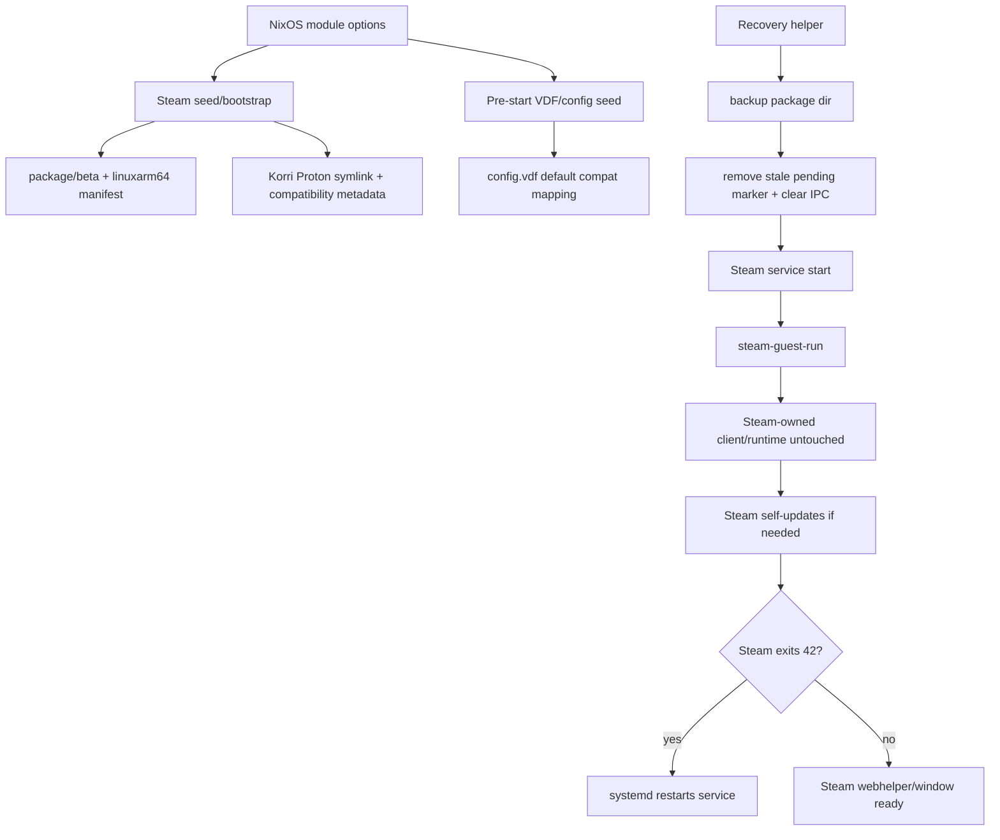

# refactor: Codify Steam self-managed lifecycle

## Summary

Codify the Bandai Steam recovery discovery into the Steam plugin: after the initial seed/bootstrap handoff, Steam should self-manage its mutable ARM64 client and Steam Runtime files. Korri/NixOS still declares the tracking channel, Proton runtime availability, service envelope, global/default VDF config, and per-user/per-game VDF state through the existing materializer lifecycle. The plan disables `steam-guest-runtime-prep --apply` in normal startup, defaults ARM64 tracking to `steamdeck_stable`, and adds explicit recovery/verification coverage for the update-relaunch loop.

---

## Problem Frame

Bandai entered a repeated Steam self-update/relaunch loop because Korri's runtime prep path modified Steam-owned runtime files before launch. Steam then detected those files as wrong, repaired itself, exited with its normal relaunch code, and repeated the cycle. The manual spike proved Steam can start visibly and stably when `steam-guest-runtime-prep` is disabled and Steam is allowed to own its own client/runtime tree.

---

## Requirements

- R1. Default ARM64 Steam tracking must use `steamdeck_stable`, not `publicbeta`, while preserving a valid ARM64 bootstrap path.
- R2. Normal Steam startup must not mutate Steam-owned client/runtime files such as `steamrt64/`, `steamrtarm64/`, `SteamLinuxRuntime_*`, or pressure-vessel helpers after the initial seed/bootstrap handoff.
- R3. Korri must continue declaring Korri-owned Steam state: Proton runtime availability, global/default compatibility-tool mapping before startup, and per-user/per-game VDF seeds through the materializer lifecycle after Steam userdata exists.
- R4. The service envelope must treat Steam's update-complete relaunch exit as recoverable and avoid entering a permanent failed state during legitimate update cycles.
- R5. The plugin must provide an operator-safe recovery path for stale pending update markers and mixed package metadata.
- R6. Tests/checks must fail if the product regresses to hardcoded `publicbeta` as tracking-channel state, pressure-vessel path watches that invoke mutating prep, or wildcard installed-file checks that confuse channels.

---

## Scope Boundaries

- This plan does not rework the whole Steam launch architecture or AppID foreground visibility policy.
- This plan does not make `-gamepadui` healthy; it keeps GamepadUI policy separate from the Steam self-management contract.
- This plan does not solve every legacy x86 Proton/FEX pressure-vessel launch path. If any title still requires Steam-owned pressure-vessel patching, that needs a separate design that does not reintroduce startup-time mutation of Steam-owned files.
- This plan does not move FEX hardware facts or substrate ownership into the Steam plugin.
- This plan does not change the user-facing library/catalog behavior.

### Deferred to Follow-Up Work

- Design a non-mutating or opt-in replacement for any legacy pressure-vessel/FEX wrapping still needed by non-CachyOS Proton paths.
- Decide whether `useGamepadUi = true` should remain enabled on SM8550 after the Steam client stabilizes.
- Revisit gamescope foreground visibility and Downwell/Cave Story+ AppID launch behavior after this lifecycle fix lands.

---

## Context & Research

### Relevant Code and Patterns

- `product/plugins/steam/nix/nixos-module.nix` owns NixOS options, Steam services, seed/runtime-prep wiring, service restart behavior, and inline shell helpers.
- `product/plugins/steam/nix/module-check.nix` is the Nix evaluation gate for service shape, environment values, and module invariants.
- `product/plugins/steam/nix/nixos-module.test.ts` provides boundary tests for shell snippets embedded in the Nix module.
- `product/plugins/steam/packages/steam-korri/scripts/steam-arm64-seed` downloads/installs ARM64 Steam client/runtime payloads and links the Korri Proton runtime.
- `product/plugins/steam/packages/steam-korri/scripts/steam-arm64-bootstrap` writes `package/beta`, package manifest metadata, registry resources, and compatibility-tool metadata.
- `product/plugins/steam/packages/steam-korri/scripts/steam-guest-run` currently calls runtime prep before executing Steam from the package FHS capsule.
- `product/plugins/steam/packages/steam-korri/scripts/steam-guest-runtime-prep` currently has `--apply`, `--check`, and `--patch-proton` modes; only the Proton-owned subset is safe for normal reactive use.
- `product/plugins/steam/packages/steam-korri/tests/steam-package-contract.sh` and `product/plugins/steam/packages/steam-korri/check.nix` enforce package-script contracts.
- `product/plugins/steam/src/state-materializer.ts` and `product/plugins/steam/src/steam-gate-seed.ts` own VDF parsing/rendering, compatibility-tool mapping, EULA/interstitial seeds, and localconfig writes.

### Institutional Learnings

- `docs/solutions/runtime-errors/steam-arm64-stable-self-update-relaunch-loop-2026-06-27.md`: `Update complete, launching Steam` with exit 42 is a normal Steam relaunch request; repeated loops mean Steam still sees bad or pending update state.
- `docs/solutions/runtime-errors/steam-desktop-ui-arm64-manifest-spinner-rocknix-2026-05-04.md`: ARM64 Steam needs the channel-specific linuxarm64 manifest derived from the `.installed` file; generic `steam_client_linuxarm64` returns 404.
- `docs/solutions/tooling-decisions/arm64-native-proton-cachyos-steam-runtime-bandai-2026-06-20.md`: the default compat tool should be ARM64-native Proton CachyOS, declared through Steam config rather than relying on x86 Proton/FEX as the default path.
- `docs/solutions/runtime-errors/steam-sniper-fex-bwrap-architecture-path-2026-06-19.md`: previous pressure-vessel wrapping exists for a real FEX boundary, but this plan must not reintroduce always-on mutation of Steam-owned files.
- `docs/solutions/architecture-patterns/steam-inside-gamescope-preserves-steam-input-2026-06-15.md`: Steam itself should own the Steam session boundary for Steam Input and Proton; the product service should wrap the Steam session, not individual games.

### External References

- Valve/Steam Linux issue reports and Steam community reports show the same update-complete/relaunch pattern when Steam repeatedly detects incomplete or wrong installed files. The public reports support treating `uninstalled manifest found`, `BVerifyInstalledFiles`, and repeated `Update complete, launching Steam` as an install-integrity loop rather than a visibility bug.

---

## Key Technical Decisions

- Steam-owned runtime files are no longer mutated in the normal startup path after seed/bootstrap: this is the primary behavioral correction from the Bandai spike, while still allowing first-time seed/bootstrap to create the minimum ARM64 payload Steam needs to take over.
- `steamdeck_stable` becomes the default channel label written to `package/beta`: ARM requires a valid `linuxarm64` channel, not specifically `publicbeta`.
- Initial ARM64 seed download URL and ongoing channel label are treated as separate concepts: the implementation may keep a `publicbeta` seed-only manifest URL if it remains the most reliable way to resolve the client zip, but `package/beta`, service `STEAM_BETA`, and installed-marker selection must express the configured tracking channel.
- Pressure-vessel/runtime repair becomes opt-in or manual/legacy-only: default product startup should favor Steam self-repair over Korri patching Steam-owned files.
- Proton declaration remains Korri-owned, but default startup must touch only Korri-owned compatibility-tool artifacts. Steam-managed Proton trees under `steamapps/common/Proton*` must not be patched reactively unless a later opt-in design explicitly owns that risk.
- Channel-specific installed-file checks replace wildcard checks: stale files from another channel must not convince Korri to suppress a required first bootstrap/update pass.
- Recovery is operational tooling, not a normal runtime path: it should be explicit, backup-first, and scoped to stale package markers and IPC cleanup.

### Package State Ownership Glossary

- `package/beta`: Korri-declared tracking-channel state; should be written from `services.korri.steam.betaChannel`.
- `steam_client_<channel>_linuxarm64.manifest`: channel metadata repaired/derived by Korri when missing or stale, but preserved by recovery helpers.
- `steam_client_<channel>_linuxarm64.installed`: Steam/seed-observed installed-file list; recovery helpers must preserve it.
- `steam_client_<channel>_linuxarm64` with no suffix: Steam pending-update marker; recovery may remove this file after backing up `package/` when it is stale.
- Compatibility-tool metadata/symlinks for Korri-provided Proton: Korri-owned declaration state.

---

## Open Questions

### Resolved During Planning

- Should normal startup keep wrapping Steam-owned pressure-vessel files? No. The Bandai proof showed this causes Steam to repair/relaunch repeatedly; normal startup should not mutate those files.
- Is `publicbeta` required because this is ARM64? No. `steamdeck_stable_linuxarm64` is available; the requirement is a valid `linuxarm64` channel.
- Should Korri stop writing all Steam state? No. Korri should keep owning declared Proton and VDF/config state, while avoiding Steam-owned client/runtime files.

### Deferred to Implementation

- Whether the seed download URL should also switch to the stable endpoint: implementation should verify the stable endpoint contains the required `bins_linuxarm64_linuxarm64.zip.*` entry before changing the seed URL; otherwise keep the seed URL separate and documented.
- Exact shape of a future non-mutating pressure-vessel/FEX strategy: this is deferred because it requires runtime validation against real Proton game launches after the default lifecycle is stable.
- Exact wording and UX of recovery helper logs: choose during implementation while preserving the backup-first and no-hidden-mutation requirements.

---

## High-Level Technical Design

> *This illustrates the intended approach and is directional guidance for review, not implementation specification. The implementing agent should treat it as context, not code to reproduce.*

---

## Implementation Units

### U1. Add explicit Steam channel policy

**Goal:** Make the ARM64 Steam channel a module-level policy with `steamdeck_stable` as the default and remove hardcoded `publicbeta` as the normal tracking channel.

**Requirements:** R1, R6

**Dependencies:** None

**Files:**
- Modify: `product/plugins/steam/nix/nixos-module.nix`
- Modify: `product/plugins/steam/nix/module-check.nix`
- Modify: `product/plugins/steam/nix/nixos-module.test.ts`
- Modify: `product/plugins/steam/packages/steam-korri/scripts/steam-arm64-bootstrap`
- Modify: `product/plugins/steam/packages/steam-korri/scripts/steam-arm64-seed`
- Modify: `product/plugins/steam/packages/steam-korri/manifest.nix`
- Modify: `product/plugins/steam/packages/steam-korri/tests/steam-package-contract.sh`
- Test: `product/plugins/steam/nix/nixos-module.test.ts`
- Test: `product/plugins/steam/packages/steam-korri/tests/steam-package-contract.sh`
- Test: `product/plugins/steam/packages/steam-korri/check.nix`

**Approach:**
- Add a `services.korri.steam.betaChannel` option defaulting to `steamdeck_stable`.
- Pass the option to the seed/bootstrap environment instead of hardcoding `publicbeta` in the module.
- Keep the seed download URL and channel label deliberately separate unless implementation verifies the stable manifest also satisfies the seed zip resolver.
- Update package contract checks so they assert configurability and stable tracking-channel policy rather than requiring `publicbeta` as the normal channel; if a `publicbeta` seed-only URL remains, tests should document it as a bootstrap exception.
- Update manifest/provenance text to describe the chosen seed URL versus tracking channel clearly.

**Patterns to follow:**
- Module option/default style in `product/plugins/steam/nix/nixos-module.nix`.
- Pure Nix service-shape checks in `product/plugins/steam/nix/module-check.nix`.
- Text-boundary assertions in `product/plugins/steam/nix/nixos-module.test.ts`.

**Test scenarios:**
- Happy path: default module evaluation exposes `betaChannel = "steamdeck_stable"` and renders `STEAM_BETA` for `korri-steam-seed.service` accordingly.
- Edge case: an override channel value flows into the seed service environment without modifying package scripts.
- Regression: tests fail if the seed service environment, `package/beta`, or installed-marker selector hardcodes `publicbeta` instead of using the module option.
- Regression: package contract tests fail if channel policy is only embedded as a literal and no longer configurable through `STEAM_BETA`.

**Verification:**
- Generated service configuration writes `package/beta` through the configured channel.
- Existing script contracts still reject missing required environment values.
- Provenance docs in the package align with the seed/tracking policy.

---

### U2. Remove Steam-owned runtime mutation from normal startup

**Goal:** Stop normal Steam service startup and reactive path watches from modifying Steam-owned Steam Runtime or pressure-vessel files.

**Requirements:** R2, R4, R6

**Dependencies:** None; can proceed in parallel with U1, but U1 should land before U4.

**Files:**
- Modify: `product/plugins/steam/nix/nixos-module.nix`
- Modify: `product/plugins/steam/nix/module-check.nix`
- Modify: `product/plugins/steam/nix/nixos-module.test.ts`
- Modify: `product/plugins/steam/packages/steam-korri/scripts/steam-guest-run`
- Modify: `product/plugins/steam/packages/steam-korri/scripts/steam-guest-runtime-prep`
- Modify: `product/plugins/steam/packages/steam-korri/tests/steam-package-contract.sh`
- Modify: `product/plugins/steam/packages/steam-korri/tests/steam-guest-run-smoke.sh`
- Modify: `product/plugins/steam/packages/steam-korri/tests/steam-guest-runtime-prep-smoke.sh`
- Modify: `product/plugins/steam/packages/steam-korri/check.nix`
- Test: `product/plugins/steam/nix/nixos-module.test.ts`
- Test: `product/plugins/steam/packages/steam-korri/tests/steam-package-contract.sh`
- Test: `product/plugins/steam/packages/steam-korri/tests/steam-guest-run-smoke.sh`
- Test: `product/plugins/steam/packages/steam-korri/tests/steam-guest-runtime-prep-smoke.sh`
- Test: `product/plugins/steam/packages/steam-korri/check.nix`

**Approach:**
- Remove or disable the default `steam-guest-runtime-prep --apply` call from `steam-guest-run`.
- Remove pressure-vessel and `SteamLinuxRuntime_*` file watches from reactive systemd path units.
- Keep `steam-guest-runtime-prep --apply` available only as an explicit legacy/manual tool if still needed, not as the default startup behavior.
- Split or narrow `--patch-proton` so default startup touches only Korri-owned compatibility-tool artifacts, not every Steam-managed `steamapps/common/Proton*` tree.
- Redefine package smoke tests so `steam-guest-run` no longer proves an automatic `--apply`; instead it proves Steam starts without mutating Steam-owned runtime files.
- Update checks that currently assert pressure-vessel path watches so they instead assert those paths are absent from mutating watches.

**Execution note:** Add characterization tests/checks around the current path-unit and script contracts before changing the service wiring, because existing checks intentionally encode the old behavior.

**Patterns to follow:**
- Existing `--check` / `--apply` / `--patch-proton` mode separation in `steam-guest-runtime-prep`.
- Existing module-check service inspection helpers in `module-check.nix`.

**Test scenarios:**
- Happy path: rendered Steam service starts without invoking `steam-guest-runtime-prep --apply` by default.
- Happy path: Proton-only prep service or helper invokes a narrowed `--patch-proton` path and leaves both pressure-vessel files and Steam-managed Proton trees untouched.
- Regression: module checks fail if `SteamLinuxRuntime_sniper/pressure-vessel` paths appear in a path unit that triggers mutating runtime prep.
- Regression: package checks fail if `steam-guest-run` reintroduces unconditional runtime prep before executing Steam.
- Edge case: narrowed `--patch-proton` remains idempotent when run against already-patched Korri-owned Proton files.

**Verification:**
- Steam can start without `BVerifyInstalledFiles` entries caused by Korri wrapper files.
- The package still exposes runtime prep for explicit/manual use, but normal product services do not call it.

---

### U3. Seed Korri-owned Proton and VDF/config state without adding a second VDF authority

**Goal:** Preserve the part Korri should own: declaring the default ARM64 Proton runtime and VDF/config state while keeping `state-materializer.ts` the single VDF authority where possible.

**Requirements:** R3

**Dependencies:** U1

**Files:**
- Modify: `product/plugins/steam/nix/nixos-module.nix`
- Modify: `product/plugins/steam/nix/module-check.nix`
- Modify: `product/plugins/steam/packages/steam-korri/scripts/steam-arm64-bootstrap`
- Modify: `product/plugins/steam/packages/steam-korri/scripts/steam-arm64-seed`
- Modify: `product/plugins/steam/packages/steam-korri/tests/steam-package-contract.sh`
- Modify: `product/plugins/steam/packages/steam-korri/check.nix`
- Modify: `product/plugins/steam/src/plugin.ts`
- Modify: `product/plugins/steam/src/materializer.ts`
- Modify: `product/plugins/steam/src/state-materializer.ts`
- Modify: `product/plugins/steam/src/state-materializer.test.ts`
- Test: `product/plugins/steam/src/state-materializer.test.ts`
- Test: `product/plugins/steam/packages/steam-korri/tests/steam-package-contract.sh`
- Test: `product/plugins/steam/packages/steam-korri/check.nix`

**Approach:**
- Prefer reusing the existing TypeScript materializer/VDF writer for VDF mutation rather than introducing an independent shell/Nix VDF writer.
- Ensure the seed/bootstrap path creates/maintains Korri-owned compatibility-tool symlinks and metadata without touching Steam-owned runtime files.
- If a module-level default compat-tool option is added, bridge it to plugin policy or keep it as the same fixed product constant so Nix and TypeScript cannot diverge.
- Add an idempotent pre-start global `config.vdf` seed only through the existing VDF ownership seam or a tiny entrypoint that reuses it.
- Keep per-user/per-game `localconfig.vdf` EULA and interstitial writes in `state-materializer.ts`, because those depend on Steam-created userdata folders and may still need the existing stop/write/start lifecycle.
- Make this boundary explicit in tests and comments: global default config may be pre-start, per-user localconfig remains materializer-owned.

**Patterns to follow:**
- VDF parser/renderer and atomic write behavior in `state-materializer.ts`.
- Gate seed helper coverage in `steam-gate-seed.ts` and `state-materializer.test.ts`.
- Existing package resource copy style in `steam-arm64-bootstrap`.

**Test scenarios:**
- Happy path: default compat tool is declared as Proton CachyOS ARM64 and appears in the generated config state.
- Happy path: bootstrap/config seed is idempotent when config already contains the expected mapping and does not fight the TypeScript materializer default.
- Edge case: missing userdata folders do not make pre-start global config seeding fail.
- Regression: package/bootstrap tests fail if compat-tool metadata is removed while Steam service still expects the Proton runtime.
- Integration: materializer tests prove Nix/package defaults and TypeScript plugin policy cannot diverge for the default compatibility tool.

**Verification:**
- A clean Steam home can be seeded so Steam starts with the expected default compat tool available.
- The plan preserves the existing materializer's per-game VDF authority without broadening it to Steam runtime files.

---

### U4. Make startup and installed-file checks channel-aware

**Goal:** Prevent stale package files from one channel from causing Korri to suppress a required bootstrap/update pass for another channel.

**Requirements:** R1, R4, R6

**Dependencies:** U1

**Files:**
- Modify: `product/plugins/steam/nix/nixos-module.nix`
- Modify: `product/plugins/steam/nix/module-check.nix`
- Modify: `product/plugins/steam/nix/nixos-module.test.ts`
- Test: `product/plugins/steam/nix/nixos-module.test.ts`
- Test: `product/plugins/steam/nix/module-check.nix`
- Test: `product/plugins/steam/packages/steam-korri/tests/steam-package-contract.sh`

**Approach:**
- Replace wildcard installed-file detection with a channel-specific installed-file check for `steam_client_${betaChannel}_linuxarm64.installed`.
- Ensure the generated launcher has access to the channel at Nix evaluation time or through a reliable runtime environment in every invocation path, including direct `korri-steam-guest steam://...` calls.
- Keep the first-launch behavior that strips update-suppressing flags when the configured channel has no installed marker.
- Preserve restart behavior for Steam's update-complete relaunch exit and make the systemd exit-42/start-limit contract explicit in module checks.

**Patterns to follow:**
- Existing first-launch suppressor filtering in the `korri-steam-guest` inline script.
- Existing readiness and startup assertions in `nixos-module.test.ts`.

**Test scenarios:**
- Happy path: configured stable installed marker exists -> update-suppressing flags remain for normal launches.
- Edge case: stale publicbeta installed marker exists but stable marker is missing -> launcher treats the channel as not installed and allows Steam bootstrap/update.
- Regression: boundary test fails if launcher reverts to `steam_client_*_linuxarm64.installed` wildcard detection.
- Integration: module check verifies the chosen exit-42 and start-limit policy for Steam services so legitimate update relaunch cycles do not strand the unit in `failed`.

**Verification:**
- Channel switching cannot be masked by stale metadata from another channel.
- Steam gets a chance to self-repair when the configured channel's installed marker is absent.

---

### U5. Add operator recovery helper for stale package state

**Goal:** Provide a safe, repeatable operational tool for recovering mixed or stale Steam package state without hand-editing files over SSH.

**Requirements:** R5

**Dependencies:** U1, U4

**Files:**
- Modify: `product/plugins/steam/nix/nixos-module.nix`
- Modify: `product/plugins/steam/nix/module-check.nix`
- Modify: `product/plugins/steam/nix/nixos-module.test.ts`
- Test: `product/plugins/steam/nix/nixos-module.test.ts`
- Test: `product/plugins/steam/nix/module-check.nix`
- Test: `product/plugins/steam/packages/steam-korri/tests/steam-package-contract.sh`

**Approach:**
- Add a `korri-steam-recover` helper exposed through the Steam module's system packages or service-control tool set.
- Recovery should stop Steam services, stop/wind down keep-warm where applicable, clear stale Steam IPC shared-memory handles, back up `package/`, remove only the configured channel's pending marker, and ensure `package/beta` matches the configured channel.
- Add a dedicated repair-launch mode only if implementation confirms recovery must actively start Steam without `cfg.defaultArgs`; do not reuse normal service-control start for that mode because normal defaults may include GamepadUI or update suppressors.
- Recovery should be explicit and operator-invoked, not run automatically during normal boot.
- The helper should print the backup path and final state so device operators can report or roll back.

**Patterns to follow:**
- Existing `korri-steam-service-control` and service start/reset-failed patterns in `nixos-module.nix`.
- Existing no-hardcoded-product-path constraints from package script checks; this helper belongs in the NixOS module layer, not the package helper scripts.

**Test scenarios:**
- Happy path: generated helper references the configured channel when choosing the pending marker to remove.
- Error path: helper backs up `package/` before removing any marker.
- Error path: helper clears `/dev/shm/u*-ValveIPCSharedObj-Steam` before reporting recovery complete or starting any explicit repair pass.
- Regression: boundary tests fail if the recovery helper removes `.installed` or `.manifest` files rather than only pending markers.
- Integration: module checks verify the helper is available only when Steam module is enabled, uses configured paths, and does not remove `.installed` or `.manifest` package metadata.

**Verification:**
- Operators can recover from the Bandai-style loop without manually editing `package/`.
- Recovery leaves `.installed` and `.manifest` files intact while removing only stale pending state.

---

### U6. Update SM8550 policy and documentation hooks

**Goal:** Align product configuration and documentation with the new lifecycle contract so future Bandai/Sobo deployments use the safe defaults.

**Requirements:** R1, R2, R3, R4

**Dependencies:** U1, U2, U3, U4

**Files:**
- Modify: `product/systems/nixos/images/platforms/rocknix-sm8550.nix`
- Modify: `product/plugins/steam/README.md`
- Modify: `product/plugins/steam/packages/steam-korri/README.md`
- Modify: `product/plugins/steam/packages/steam-korri/manifest.nix`
- Test: `product/plugins/steam/nix/module-check.nix`
- Test: `product/plugins/steam/packages/steam-korri/tests/steam-package-contract.sh`

**Approach:**
- Ensure SM8550 inherits or explicitly sets the stable channel policy.
- Remove any platform-level assumptions that normal startup should run runtime prep against Steam-owned files.
- Document the ownership split in the plugin/package README: Steam owns client/runtime files; Korri owns Proton declarations, VDF/config, service envelope, and recovery helper.
- Keep GamepadUI and Gamescope foreground policy out of this lifecycle change except where necessary to keep debugging visibility safe.

**Patterns to follow:**
- Existing plugin README scope language and package contract language.
- Existing SM8550 Steam option overrides in `rocknix-sm8550.nix`.

**Test scenarios:**
- Happy path: SM8550 configuration evaluates with stable channel and without normal runtime-prep mutation.
- Regression: documentation/package contract tests catch ownership-contract drift if future scripts add product policy back into package helpers or describe `--apply` as normal startup behavior.
- Test expectation: documentation-only README wording changes do not need runtime tests beyond package contract checks that enforce ownership boundaries.

**Verification:**
- Device policy matches the lifecycle proven on Bandai.
- Future maintainers can see why Steam-owned runtime files are not patched on startup.

---

## System-Wide Impact

- **Interaction graph:** Steam seed/bootstrap, NixOS services, package helper scripts, VDF materializer, and SM8550 platform config all participate in the lifecycle. The change narrows normal startup responsibilities rather than adding a new launch surface.
- **Error propagation:** Startup failures should surface as service/journal failures in the Steam envelope. Steam update-complete relaunch exits should be handled by an explicit systemd restart/start-limit contract, not classified as terminal product failure or allowed to exhaust default start limits silently.
- **State lifecycle risks:** Channel switches, pending markers, stale IPC handles, and partial package writes are the main mutable-state risks. Recovery tooling must back up before mutation.
- **API surface parity:** Direct `korri-steam-guest` invocations and systemd service invocations must use the same channel/install-marker logic; do not rely only on service-specific environment variables.
- **Integration coverage:** Nix evaluation checks and package contract checks are required because TypeScript unit tests cannot prove service shape or shell helper behavior alone.
- **Unchanged invariants:** Steam AppID launching remains Steam-based; Proton CachyOS remains the preferred default compat tool; Gamescope and GamepadUI policy are not redesigned by this plan.

---

## Risks & Dependencies

| Risk | Mitigation |
|------|------------|
| Disabling default pressure-vessel mutation breaks a legacy Proton/FEX path | Treat that path as follow-up design; keep explicit/manual tooling available but do not run it in normal startup. |
| Stable seed URL lacks the expected client zip entry | Verify during implementation; keep seed download URL separate from `package/beta` if needed. |
| Existing checks encode the old behavior and fail after module changes | Update module checks, boundary tests, and package contract tests in the same implementation units as the behavior changes. |
| Channel changes do not apply to an already-booted device | Include seed-service restart or recovery-helper guidance in operational notes and recovery tooling. |
| Recovery helper removes too much mutable state | Test that it removes only pending marker files and preserves `.installed` / `.manifest`. |
| Steam's relaunch exit trips systemd start limits | Add and test an explicit exit-42/start-limit policy for Steam services, plus reset-failed behavior before service-control starts. |

---

## Documentation / Operational Notes

- Add or update solution documentation after implementation with the proven product fix: `steam-guest-runtime-prep --apply` disabled in normal startup, stable channel configured, recovery helper available.
- Bandai/Sobo deployment validation should verify `package/beta`, a visible Steam window, no repeated `BVerifyInstalledFiles` loop, and `Steam Runtime Launch Service` readiness.
- Device operators should use `korri-steam-recover` rather than hand-removing package files.
- If future work reintroduces pressure-vessel/FEX handling, it must be opt-in or non-mutating and must not run reactively on Steam-owned file changes.

---

## Sources & References

- Related code: `product/plugins/steam/nix/nixos-module.nix`
- Related code: `product/plugins/steam/packages/steam-korri/scripts/steam-guest-run`
- Related code: `product/plugins/steam/packages/steam-korri/scripts/steam-guest-runtime-prep`
- Related code: `product/plugins/steam/src/state-materializer.ts`
- Related docs: `docs/solutions/runtime-errors/steam-arm64-stable-self-update-relaunch-loop-2026-06-27.md`
- Related docs: `docs/solutions/runtime-errors/steam-desktop-ui-arm64-manifest-spinner-rocknix-2026-05-04.md`
- Related docs: `docs/solutions/tooling-decisions/arm64-native-proton-cachyos-steam-runtime-bandai-2026-06-20.md`
- Related docs: `docs/solutions/runtime-errors/steam-sniper-fex-bwrap-architecture-path-2026-06-19.md`
