# feat: Continuous adaptive stream-quality controller

## Summary

Productize the existing flag-off adaptive stream controller into a continuous, math-driven controller that steers a Moonlight/Sunshine stream to the best quality the moment allows, inside a user-set boundary box, with an invisible-autopilot posture. The work upgrades the pure decision core (honor a boundary box, recover all levers, two-speed slope/cliff behavior, canvas-based resolution logic, cold-start), gives it a unified `--key=value` CLI as its only control/observability surface, adds total-loss/tunnel survival, and builds a device-free validation harness so it can be flipped on behind the existing flag after a device gate.

## Current Implementation Status (2026-07-06)

- Platform controller foundation landed on trunk: boundary grammar, continuous decision core, multi-lever runner dispatch, telemetry/scenario harness, handoff hints, outage state machine, netem helper, and validation runbook.
- Product/runtime wiring landed in feature branch `feat/adaptive-stream-product-wiring`: live adaptive boundary control is exposed through the runtime session, `app.stream-control.*` RPC, `korri stream --key=value`, `korri stream --watch`, and `korri launch --key=value` launch seeding.
- Runtime outage supervision is now wired into stream sessions and Moonlight runtime startup behind env, but native re-establish/hold-last-frame is **not implemented**; the platform layer emits a clear reconnect-failed event when no re-establish hook exists rather than pretending recovery happened.
- Adaptive enablement remains gated: `KORRI_STREAM_ADAPTIVE_ENABLED=0` until coordinated device validation and human approval.

---

## Problem Frame

The stream controller shipped as **reflexes, not optimization**: `computeStreamAdaptiveDecision` uses hand-picked thresholds, only `bitrate` climbs back up (fps/resolution ratchet down forever), the objective bias barely does anything, and the runner dispatches only one lever per tick. It is `KORRI_STREAM_ADAPTIVE_ENABLED=0` and has never run live. Meanwhile heavy real-world fluctuation (Wi-Fi congestion, 5G→4G handoffs, tunnels) needs a coherent controller that adapts continuously without flapping, survives outages, and never needs the player to touch anything. The design was corrected on 2026-07-03 away from a preset ladder to a continuous controller (see origin: item.md), and fully specified through a 2026-07-05 alignment interview.

---

## Requirements

- R1. Continuous, math-driven controller — derives targets from live measurements and moves smoothly around a continuous setpoint; any internal ladder is damping/fallback only, never the source of allowed values (see origin: item.md).
- R2. One objective axis (`lean`, Responsiveness↔Picture), continuous 0–1 under the hood, surfaced as a few named stops; smoothness (no-stutter) is an always-protected promise, never a trade on the axis.
- R3. Levers = `bitrate` + `fps` (seamless dials, most of the work) and `resolution` (rare, precise last-resort using canvas/paint logic); `redundancy` is deferred.
- R4. Boundary box honored absolutely to a reasonable degree — **lever clamps** (`lo..hi` range / scalar pin / `auto` free) AND **outcome clamps** (e.g. max input-lag, min delivered fps); a bare `set` is a pin (floor=ceiling); `auto=on|off` is a bulk freeze/adapt macro over per-lever state.
- R5. Recover all levers symmetrically — fps and resolution climb back when conditions improve, not just bitrate.
- R6. Two-speed response — a calm, sticky fine-tuner for slopes and a hysteresis-off "shed now" reflex for cliffs, with **shed-fast / recover-slow** asymmetry (drop in seconds, climb back over tens of seconds).
- R7. Cold-start = "the stream is the probe" — start conservative (or last-known-good when available) then ramp hard on real telemetry; no iperf. **Reconnect reuses cold-start.**
- R8. Total-loss / tunnel survival — detect zero-throughput, hold the last frame, keep the session alive, auto-reconnect, resume via cold-start, and emit signals (no game-pause-on-host in this scope).
- R9. Unified CLI — two commands (`korri stream`, `korri launch`) over one flat, stackable, atomic `--key=value` schema; supports snapshot / `--watch` / `--json` (round-trippable) reads and dry-run.
- R10. Observability-first — the engine emits the full decision / binding-constraint / pressure / state / outage signal set; surfaces decide what to show. No UI opinion in the engine.
- R11. Session telemetry — record/dump the health+decision trace for a session report and for replay-based validation.
- R12. Signal/handoff early-warning trigger (optional) — a cheap radio/signal cue that lets the controller shed a beat earlier on a cliff.
- R13. Validation without physical roaming — pure-controller scenario replay (primary), full-stack `netem` network shaping, and record/replay of captured traces; real device only as the final gate.
- R14. Keep `h264_vaapi` as the default proven live-control path (see origin: item.md).
- R15. Enable behind the existing `KORRI_STREAM_ADAPTIVE_ENABLED` flag only after on-device validation (human gate).

**Origin acceptance criteria trace:** ladder→continuous+hysteresis → R1/R6; hysteresis/cooldown → R6; h264_vaapi default → R14; resolution policy → R3/R5; operator-visible behavior → R9/R10.

---

## Scope Boundaries

- Not building the GUI / slider surface — the CLI is the only surface this iteration (GUI is the deferred L6 layer that will wrap the same key=value schema).
- Not adding `redundancy`/FEC or a true aggregate `data-cap` — deferred pair; a `bitrate` ceiling covers the cost concern for now, and per-lever `--data-cap` is intentionally absent (near-duplicate of a bitrate ceiling until redundancy exists).
- Not implementing a monthly cumulative data budget — explicitly out of scope, possibly permanently.
- Not switching codecs (H.264→HEVC→AV1) — `h264_vaapi` stays the proven path (R14).
- Not pausing the game on the host during a tunnel (the "don't die in the tunnel" option) — hold+reconnect+resume only.

### Deferred to Follow-Up Work

- Per-game memory + named presets (incl. a manual "cellular" preset), and wiring per-game memory into cold-start's last-known-good: backlog `01KWTQJS39SZGCWQRKH3Z8QE0W`. Until it lands, cold-start uses the conservative + fast-ramp path only.
- Device-state (battery/thermal) adaptation: backlog `01KWTQ750V3HJZ9AMQKH6H5W13`.
- Whether `stream` should be a first-class noun vs an implementation detail of playing a remote game: backlog `01KWTMPE4MJXVR940R4X9GB0PR` (decide before the surface hardens; this plan keeps `korri stream` for now).
- Host-side encoder-overlap to make resolution switches seamless (the ~150 ms host gap): backlog `01KWTCXNFGR0Q8T1YZZYSCAAVY`.
- `redundancy`/FEC lever + aggregate data-cap: future paired addition (no backlog id yet; noted in origin north-star).

---

## Context & Research

### Relevant Code and Patterns

- `product/platform/stream/stream-adaptive-controller.ts` — pure `computeStreamAdaptiveDecision`; 3 pressures (bandwidth/latency/decode), `objectiveBias`, deadbands, `FPS_STEPS`, `scaleResolution`. The brain to upgrade.
- `product/platform/stream/stream-adaptive-runner.ts` — ticks the controller, reads `monitor.latestSummary`, dispatches via the recovery supervisor, emits `StreamAdaptiveRunnerEvent`. Currently `dispatchFirstTarget` sends only one lever/tick.
- `product/platform/stream/runtime-recovery-supervisor.ts` — the safety net: `RuntimeRecoveryControlPort` (`setBitrate`/`setFps`/`setResolution`), `knownGood()`, `hasPending()`, revert/unrecoverable events, baseline. The controller dispatches through this; it already reverts failed/timed-out commands to known-good.
- `product/platform/stream/stream-health.ts` / `stream-health-monitor.ts` — `StreamHealthSummary` (`rttMs`, `rttVarianceMs`, `lossFraction`, `decodeTimeMs`, `queueDepth`, `bitrateDeliveryRatio`, `frameDropFraction`, `freshness: fresh|stale|no-data`) and `latestSummary(nowMs)`. The senses; already device-proven.
- `product/surfaces/terminal/korri-cli/stream-quality.ts` — manual `bitrate`/`fps`/`resolution`/`show`, `describeControlError`, `coerced to:` output. The CLI to unify.
- `product/systems/nixos/images/platforms/rocknix-sm8550.nix` — `KORRI_STREAM_ADAPTIVE_ENABLED=0`, `KORRI_STREAM_ADAPTIVE_OBJECTIVE_BIAS=0.5`, `KORRI_STREAM_ADAPTIVE_TICK_MS=5000`.
- Moonlight local-control patches under `product/plugins/moonlight/packages/moonlight-embedded-korri/patches/` (0007/0008 runtime commands, 0016 health sampling, 0017/0018 resw trace, 0019 launch-ceiling clamp) — the mechanism the controls ride on.

### Institutional Learnings

- `docs/solutions/runtime-errors/` — runtime error handling conventions relevant to command dispatch/observability.
- `docs/acceptance/runtime-settings-protocol-contract.md` — the accept-and-adapt contract the controller sits on (clamp + even-round; scale-only, never reshape).
- `docs/korri-stream-resolution-switch-seamlessness-findings-2026-07-05.md` — measured host-bound ~150 ms resolution gap; why resolution is last-resort and its changes are granular-but-rare.

### External References

- Linux `tc`/`netem` (traffic control network emulator) and `mahimahi` (record/replay of real cellular traces) for full-stack validation (R13). No external best-practices research needed — the algorithm and contracts are locally defined and device-proven.

---

## Key Technical Decisions

- **Continuous controller, not a preset ladder** — targets are computed from measurements; damping is around a continuous setpoint (origin correction).
- **One flat `--key=value` schema is the single representation** of levers + clamps + lean + auto, shared across launch flags, live commands, env, and (later) GUI. Value grammar: `lo..hi` range, scalar = pin, `auto` = free. Reads round-trip back into the same keys.
- **No `clamp` verb, no `data-cap`** — a bare `set` is a pin (floor=ceiling); `auto` is a bulk macro over per-lever engagement; a bitrate ceiling covers cost.
- **Two kinds of clamps** — lever clamps and outcome clamps (max-latency, min delivered fps), both honored to a reasonable tolerance, both signaled when reality won't allow.
- **Two-speed + shed-fast/recover-slow** — response scales with the rate of change, not just the level; a collapsing link drops hysteresis and sheds hard, then recovers cautiously to survive a moving car without flapping.
- **Resolution = last-resort, canvas/paint logic** — triggered by bits-per-pixel starvation or decode overload; the target is granular (any size along the aspect) but the action is sticky (rare); in a cliff, the freeze cost is trivial vs a stall so it becomes a first-class emergency lever.
- **Cold-start ≡ reconnect** — one "establish quality on an unpredictable link" behavior (conservative + fast-ramp) serves both, so a post-tunnel resume never blind-restores stale quality.
- **The recovery supervisor stays the safety net** — the controller only proposes; the supervisor's known-good/revert guarantees a bad command can't strand the stream.
- **Observability-first** — engine emits, surfaces decide; the CLI `--watch` feed is the first "surface" and is round-trippable with the write grammar.
- **Validation is designed-in, not bolted-on** — the controller is a pure function, so scripted health timelines validate every behavior deterministically in CI; `netem`/record-replay covers the full stack; real device is a rare gate.

---

## Open Questions

### Resolved During Planning

- Objective input shape: replace the bare `objectiveBias: number` + fixed min/max params with a structured **boundary box** input (lever clamps + outcome clamps + lean); keeps the pure-function contract.
- Multi-lever dispatch: the runner applies a **coherent atomic update** (all proposed lever moves in one reconcile) instead of `dispatchFirstTarget`'s one-per-tick, so the autopilot never observes a half-applied config.
- Cliff vs total-loss boundary: a defined trip-point — frames still trickling → keep shedding (cliff); essentially nothing for a beat → hold-and-reconnect (loss). Exact threshold is a tuning constant validated in U12.

### Deferred to Implementation

- Exact pressure/threshold constants and the shed-fast/recover-slow time constants — tuned from device + replay data (U12/U13), not guessable at plan time.
- Total-loss reconnect cannot honestly be completed entirely in the current platform layer: the session runtime can detect outage/return and can call an optional re-establish hook, but native Moonlight/sessiond reconnect + hold-last-frame ownership remains a blocker before claiming full U10 completion.
- Final key names for outcome clamps (`--max-latency` vs `--max-input-lag`, `--min-fps` delivered vs the `fps` lever) — settle during U1 to avoid collisions with lever keys.

---

## High-Level Technical Design

> *This illustrates the intended approach and is directional guidance for review, not implementation specification. The implementing agent should treat it as context, not code to reproduce.*

**Stream lifecycle as one loop** (the states the controller moves between):

```mermaid
stateDiagram-v2
    [*] --> Establish
    Establish --> FineTune: first telemetry, ramped to setpoint
    FineTune --> Shed: rate-of-change collapse (cliff)
    Shed --> FineTune: stabilized
    FineTune --> Hold: ~zero throughput (tunnel)
    Shed --> Hold: throughput hits zero
    Hold --> Establish: reconnected (re-establish == cold-start)
    note right of Establish: conservative + fast-ramp,\n"stream is the probe"
    note right of FineTune: calm, sticky;\nbitrate/fps first, resolution rare
    note right of Shed: hysteresis off,\nshed hard, resolution first-class
    note right of Hold: freeze last frame,\nkeep session, auto-reconnect
```



**CLI grammar (directional):**

```
korri launch <game> [--key=value ...]
korri stream        [--key=value ...]        # no write keys = snapshot; --watch = live feed

# value grammar (levers)
--bitrate=20000        pin (floor=ceiling)
--bitrate=5000..20000  box (autopilot steers inside)
--bitrate=..20000      ceiling only        --bitrate=5000..  floor only
--bitrate=auto         free (autopilot drives)

# keys: bitrate, fps, resolution, lean(responsive|balanced|cinematic|0..1),
#       auto(on|off), max-latency, min-fps, --watch, --json, --dry-run
```

**Decision chain per tick (condensed):** fresh data? → engaged levers? → read pressures + rate-of-change → objective (lean) → fire-or-grow? → if shed: cheapest invisible lever first, resolution last (unless cliff), sized to severity → if grow: small steps, recover-all-levers → clamp to the box (lever + outcome) → deadband/stickiness gate → one atomic move, then wait.

---

## Implementation Units

### U1. Boundary model and `--key=value` grammar

**Goal:** A shared, pure module that represents and parses the boundary box — lever clamps (`lo..hi`/pin/`auto`), outcome clamps (`max-latency`, `min-fps` delivered), `lean`, `auto` — plus layer merge with precedence.

**Requirements:** R2, R4, R9

**Dependencies:** None

**Files:**
- Create: `product/platform/stream/stream-adaptive-boundaries.ts`
- Test: `product/platform/stream/stream-adaptive-boundaries.test.ts`

**Approach:**
- A `StreamBoundaries` type: per-lever `{ floor?, ceiling?, pinned?, free? }` derived from the grammar; outcome clamps (`maxLatencyMs?`, `minDeliveredFps?`); `lean` (0–1); global `auto` state.
- A parser from `key=value` strings to the model, using common-tool unit conventions (accept `8mbps`/`8000k`/`8000`); scalar → pin, `lo..hi` → range, `auto`/`..` → free; even-round + reasonable tolerance consistent with the runtime-settings contract.
- A layered merge (`defaults → launch → live`, most-specific wins) and a serializer back to `key=value` (round-trip for `--json`/snapshot).

**Patterns to follow:** the accept-and-adapt coercion in `product/surfaces/terminal/korri-cli/stream-quality.ts` and `docs/acceptance/runtime-settings-protocol-contract.md`.

**Test scenarios:**
- Happy path: `--bitrate=5000..20000` parses to floor 5000 / ceiling 20000; `--bitrate=20000` → pinned; `--bitrate=auto` and `--bitrate=..` → free.
- Happy path: `..20000` ceiling-only and `5000..` floor-only parse correctly.
- Edge case: unit shorthand (`8mbps`, `8000k`, `8000`) all normalize to the same kbps; odd values even-round within tolerance.
- Edge case: outcome keys (`--max-latency=50ms`, `--min-fps=30`) parse into outcome clamps distinct from lever keys.
- Happy path: merge precedence — live overrides launch overrides defaults per key; unset keys fall through.
- Error path: malformed range (`5000..20000..30000`) and inverted range (`20000..5000`) are rejected/normalized with a clear reason, not silently accepted.
- Happy path: serialize(parse(x)) round-trips to an equivalent key set.

**Verification:** the module is a pure, dependency-free representation of the whole schema; controller and CLI can both consume it.

---

### U2. Controller honors the boundary box

**Goal:** Replace the ad-hoc `objectiveBias` + fixed min/max params with the `StreamBoundaries` input; clamp every proposed lever target to its lever clamp, skip pinned/`auto=off` levers, drive the objective from `lean`, and defend outcome clamps.

**Requirements:** R1, R2, R4

**Dependencies:** U1

**Files:**
- Modify: `product/platform/stream/stream-adaptive-controller.ts`
- Test: `product/platform/stream/stream-adaptive-controller.test.ts`

**Approach:**
- Change `StreamAdaptiveControllerInput` to carry `boundaries: StreamBoundaries` (keep `summary`/`current`).
- Each lever's proposal is clamped to `[floor, ceiling]`; a pinned lever is never proposed; a free lever uses the full range.
- `lean` replaces the raw `objectiveBias` weighting in the reduction/step math.
- Outcome clamps become defended targets: if measured latency exceeds `maxLatencyMs`, latency relief is forced regardless of the normal thresholds; when it cannot be met, emit a "binding constraint" marker rather than silently overshooting.

**Patterns to follow:** existing `passesBitrateDeadband`/`passesResolutionDeadband` and `clamp` helpers in the controller.

**Test scenarios:**
- Happy path: a proposed bitrate above the ceiling clamps to the ceiling; below the floor clamps to the floor.
- Happy path: a pinned lever (floor=ceiling) is never proposed even under strain; other levers still adapt around it.
- Edge case: `lean=responsive` yields a more aggressive fps/latency trade than `lean=cinematic` for identical pressures.
- Error/boundary: `max-latency` breach forces latency relief even when bandwidth pressure alone wouldn't trigger it; when infeasible, the decision reports the binding outcome clamp.
- Edge case: `min-fps` outcome clamp prevents an fps proposal from dropping delivered fps below the floor.
- Integration: decision consumes a `StreamBoundaries` produced by U1's parser end-to-end.

---

### U3. Recover-all-levers symmetry

**Goal:** Fix the one-way ratchet — fps and resolution climb back toward their ceilings when conditions are healthy and there is headroom, not just bitrate.

**Requirements:** R5

**Dependencies:** U2

**Files:**
- Modify: `product/platform/stream/stream-adaptive-controller.ts`
- Test: `product/platform/stream/stream-adaptive-controller.test.ts`

**Approach:**
- Add symmetric "grow" logic for fps (step up through `FPS_STEPS` toward its ceiling) and resolution (grow the canvas toward its ceiling) mirroring the existing bitrate increase, gated by the same healthy/headroom checks and lean.
- Growth stays small-step and deadbanded to avoid overshoot; resolution growth remains sticky (see U5).

**Patterns to follow:** the existing `healthy && current.bitrateKbps < max` increase branch.

**Test scenarios:**
- Happy path: after a sustained-healthy sequence, a below-ceiling fps proposal steps up (not just bitrate).
- Happy path: after sustained-healthy with high bits-per-pixel + decode headroom, resolution grows toward its ceiling.
- Edge case: growth never exceeds the lever ceiling and respects the deadband (no 1-step thrash).
- Edge case: a pinned fps/resolution never grows.
- Integration: a full degrade→recover replay returns all three levers toward their pre-degrade values, not just bitrate.

---

### U4. Two-speed response (slope vs cliff) with shed-fast/recover-slow

**Goal:** Make the response scale with the rate of change: a calm sticky fine-tuner for slopes and a hysteresis-off "shed now" reflex for cliffs, with fast-down / slow-up asymmetry.

**Requirements:** R6

**Dependencies:** U2

**Files:**
- Modify: `product/platform/stream/stream-adaptive-controller.ts`
- Test: `product/platform/stream/stream-adaptive-controller.test.ts`

**Approach:**
- Derive a rate-of-change / collapse signal from the summary trend (delivery ratio crash, rising queue/latency) in addition to the level.
- On collapse: bypass deadbands, cut hard and large (proportional to severity), bias toward over-shedding.
- Asymmetry: aggressive multiplicative decrease on the way down; cautious additive increase on the way up (recovery requires sustained good readings before growing).

**Patterns to follow:** the existing `stressed`/`healthy` gates and proportional reduction math.

**Test scenarios:**
- Happy path (slope): gentle worsening yields small, deadbanded bitrate steps; no resolution change.
- Happy path (cliff): a 1–2 tick delivery-ratio crash yields an immediate large shed with deadbands bypassed.
- Edge case: rising queue/latency alone (before loss shows up) triggers shedding (earliest trip-wire).
- Asymmetry: after a cliff+recovery, the climb-back takes materially more ticks than the drop (slow-up).
- Edge case: repeated cliff/recover cycles (flapping) do not oscillate wildly — recover-slow damps re-ramp.

---

### U5. Canvas-based resolution logic

**Goal:** Make resolution a last-resort lever driven by bits-per-pixel starvation and decode overload, with a granular target but a sticky (rare) action.

**Requirements:** R3

**Dependencies:** U2, U4

**Files:**
- Modify: `product/platform/stream/stream-adaptive-controller.ts`
- Test: `product/platform/stream/stream-adaptive-controller.test.ts`

**Approach:**
- Trigger a resolution shrink only when (a) bits-per-pixel (current bitrate ÷ current pixels) falls below a "looks bad" band while bitrate is already low, or (b) decode pressure is high; compute a continuous target size that restores an acceptable bits-per-pixel along the fixed aspect.
- Keep the large resolution deadband so the target being finely computed does not cause frequent switches; in a cliff (U4) allow a decisive resolution cut as a first-class emergency move.
- Resolution grows back (U3) only with clear bits-per-pixel + decode headroom.

**Patterns to follow:** existing `scaleResolution`/`even`/`passesResolutionDeadband`.

**Test scenarios:**
- Happy path: bitrate forced low at high resolution (low bits-per-pixel) triggers a shrink to a size that restores the target ratio; a single decisive move, not granular thrash.
- Happy path: high decode pressure alone triggers a shrink even with adequate bitrate.
- Edge case: within-deadband bits-per-pixel drift produces no resolution change (sticky).
- Edge case (cliff): a collapse allows an immediate decisive resolution cut bypassing the normal reluctance.
- Happy path (recover): sustained high bits-per-pixel + decode headroom grows resolution back toward ceiling.

---

### U6. Cold-start and re-establish policy

**Goal:** Implement the "stream is the probe" opening — conservative (or last-known-good when available) start then fast ramp on real telemetry — and make reconnect reuse the same path.

**Requirements:** R7

**Dependencies:** U2, U3, U4

**Files:**
- Modify: `product/platform/stream/stream-adaptive-controller.ts`
- Test: `product/platform/stream/stream-adaptive-controller.test.ts`

**Approach:**
- Add an "establishing" mode: until enough fresh samples exist, hold a conservative setpoint, then ramp faster than steady-state additive-increase until strain appears, then settle into normal fine-tune.
- Expose an entry point the outage layer (U10) calls on reconnect so re-establish is literally cold-start (no blind restore). Last-known-good is a hook the deferred per-game memory (`01KWTQJS39`) fills later; until then the conservative path is used.

**Patterns to follow:** the `no-data`/`stale` dormant handling already in the controller.

**Test scenarios:**
- Happy path: from a cold start with no memory, the controller holds conservative then ramps hard once fresh samples arrive, stopping when strain appears.
- Edge case: cold-start into a poor link ramps only until strain then settles (no stall).
- Happy path: a re-establish entry (simulating reconnect) behaves identically to cold-start, not a jump to prior quality.
- Integration: cold-start → fine-tune transition composes with U4's slope behavior.

---

### U7. Runner upgrade — atomic multi-lever dispatch, boundaries, signals

**Goal:** Feed the boundary box + lean + auto into the runner, apply a coherent atomic multi-lever update (replacing one-lever-per-tick), support a two-speed tick cadence, and emit the full observability signal set.

**Requirements:** R4, R6, R10

**Dependencies:** U2, U4

**Files:**
- Modify: `product/platform/stream/stream-adaptive-runner.ts`
- Test: `product/platform/stream/stream-adaptive-runner.test.ts`

**Approach:**
- Replace `dispatchFirstTarget` with a reconcile that applies all proposed lever changes for the tick through the recovery supervisor as one coherent update (still respecting the supervisor's known-good/revert).
- Thread `StreamBoundaries` (and its `auto`/pins) into each tick; when a collapse is detected, shorten the effective cadence / react immediately rather than waiting the full `tickIntervalMs`.
- Extend `StreamAdaptiveRunnerEvent` to carry decision detail: chosen targets, the pressures, the **binding constraint**, and the current mode (establish/fine-tune/shed/hold) — the signal feed U8/U9 consume.

**Patterns to follow:** existing `tick`/`dispatch`/`currentSettings` structure and `RuntimeRecoverySupervisor` usage; `hasPending` guard stays.

**Test scenarios:**
- Happy path: a tick proposing bitrate+fps applies both in one reconcile (not just the first).
- Edge case: a pinned lever is never dispatched even if the controller would otherwise move it.
- Happy path: a collapse tick reacts immediately rather than deferring to the next interval.
- Error path: a dispatch failure surfaces `dispatch-failed` and the supervisor's revert path is honored (no half-applied strand).
- Integration: emitted events include binding-constraint + mode for a slope and for a cliff scenario.
- Edge case: `auto=off` (all pinned) produces no dispatches and a dormant/"frozen" signal.

---

### U8. Unified `korri stream` / `korri launch` CLI

**Goal:** The single control + observability surface: `korri stream [--key=value…]` for stackable atomic writes, snapshot/`--watch`/`--json` reads, and `--dry-run`; `korri launch` accepts the same boundary flags.

**Requirements:** R9, R10

**Dependencies:** U1, U7

**Files:**
- Modify: `product/surfaces/terminal/korri-cli/stream-quality.ts`
- Create: `product/surfaces/terminal/korri-cli/stream-quality.test.ts` scenarios (extend existing test file)
- Modify: launch entry that composes a stream (wire boundary flags at stream-request)

**Approach:**
- Parse a bag of `--key=value` flags via U1; apply the merged boundary set atomically to the live session through the runner/recovery; with no write keys, print a round-trippable snapshot (current values, per-lever state, binding constraint, lean, health); `--watch` tails the U7 signal feed; `--json` for machine output; `--dry-run` returns the decision/coercion without applying.
- Reuse `describeControlError` and the `coerced to:` line; a bare `set` pins (via U1); `--auto=on|off` is the bulk macro.

**Patterns to follow:** existing `stream-quality.ts` command handling, `describeControlError`, and the `coerced to:`/`applied` output.

**Test scenarios:**
- Happy path: `--bitrate=..6000 --lean=balanced` applies both atomically and reports the coerced result.
- Happy path: no write keys prints a snapshot that round-trips back into valid flags.
- Happy path: `--bitrate=20000` pins; `--bitrate=auto` releases; `--auto=off` freezes all.
- Edge case: `--dry-run` shows the would-be change without dispatching.
- Error path: an above-ceiling or malformed value yields a specific reason (not `[object Object]` and not a generic dispatch failure).
- Edge case: duplicate key in one call → last wins.
- Integration: `korri launch <game> --bitrate=5000..20000 --lean=responsive` seeds the session boundary box at start.

---

### U9. Session telemetry (record / dump)

**Goal:** Record the per-tick health+decision trace for a session report and, crucially, for replay-based validation (U12).

**Requirements:** R11, R13

**Dependencies:** U7

**Files:**
- Create: `product/platform/stream/stream-adaptive-telemetry.ts`
- Test: `product/platform/stream/stream-adaptive-telemetry.test.ts`

**Approach:**
- A subscriber to the U7 signal feed that appends `{ t, summary, decision, mode, boundaries }` records to a bounded buffer/file; a dump/export in a format U12 can replay through the pure controller.
- Keep it observability-only (no control effect); env/flag-gated so it is cheap when off.

**Patterns to follow:** the sparse append pattern from the moonlight `KORRI_RESW_TRACE` instrumentation; existing monitor summary shape.

**Test scenarios:**
- Happy path: a sequence of ticks produces an ordered trace with health + decision per entry.
- Edge case: the buffer is bounded (old entries roll off) and disabled cheaply when the flag is off.
- Happy path: an exported trace re-parses into inputs the scenario harness (U12) can feed to the controller.
- Test expectation: none for the file-IO wiring beyond the export round-trip (covered above).

---

### U10. Total-loss / tunnel survival

**Goal:** Own the outage: detect zero-throughput, hold the last frame, keep the session alive, auto-reconnect, resume via cold-start (U6), and emit outage signals.

**Requirements:** R8, R10

**Dependencies:** U6, U7

**Files:**
- Create: `product/platform/stream/stream-outage-supervisor.ts`
- Test: `product/platform/stream/stream-outage-supervisor.test.ts`
- Modify: `product/apps/portal/stream/moonlight-launcher.ts` and/or the recovery/session wiring (reconnect + resume path)

**Approach:**
- Detect the cliff→loss trip-point (near-zero throughput / no frames for a defined window) and enter a "hold" state: freeze last frame, suppress teardown, keep both ends' session; emit `outage-detected` → `reconnecting` → `resumed` signals.
- On reconnect, call U6's re-establish (cold-start), not a blind restore.
- Determine during implementation whether the reconnect/resume is fully achievable in the platform layer or needs a native Moonlight/sessiond change (see Deferred-to-Implementation). Guard against the historical sessiond teardown fragility (do not tear down on a transient drop).

**Execution note:** Start with a failing test for the loss→hold→reconnect→re-establish state machine at the platform layer before touching native/session code.

**Patterns to follow:** the recovery supervisor's known-good/hold semantics; the sessiond self-heal posture (do not strand a session on a transient event).

**Test scenarios:**
- Happy path: zero-throughput for the window enters hold and emits `outage-detected`.
- Happy path: signal return triggers reconnect and a re-establish that behaves like cold-start (U6), not a jump to prior quality.
- Edge case: a brief dip that recovers before the trip-point stays in shed/fine-tune (not treated as a loss).
- Edge case: repeated losses (flapping tunnels) do not tear the session down or thrash.
- Error path: a failed reconnect within the grace window surfaces a clear terminal signal rather than a silent hang.
- Integration: the outage signals appear in the U7 feed and U9 telemetry.

---

### U11. Signal/handoff early-warning trigger (optional)

**Goal:** Feed a cheap radio/signal-strength/handoff cue into the controller as an early-warning trigger so it can shed a beat earlier on a cliff.

**Requirements:** R12

**Dependencies:** U4, U7

**Files:**
- Create: `product/platform/stream/stream-handoff-trigger.ts`
- Test: `product/platform/stream/stream-handoff-trigger.test.ts`

**Approach:**
- An optional input source that maps an OS radio/signal cue to a "collapse likely soon" hint; the runner/controller treats it as a trigger (bias toward shedding), never as a measurement of capacity.
- Fully degradable: absent the cue, behavior is unchanged (purely reactive).

**Patterns to follow:** the trigger-not-measurement principle from the origin north-star.

**Test scenarios:**
- Happy path: a handoff cue biases the next decision toward shedding earlier than pressure alone would.
- Edge case: absent the cue, decisions are identical to the reactive baseline (no behavior change).
- Edge case: a cue that is not followed by an actual collapse does not cause a large unwarranted shed (bias, not command).

---

### U12. Scenario-replay validation harness

**Goal:** Deterministic, device-free validation — scripted health timelines through the pure controller asserting slope/cliff/tunnel/cold-start/clamp trajectories — plus record/replay of captured traces and a `netem` drive-script for full-stack shaping.

**Requirements:** R13

**Dependencies:** U2, U3, U4, U5, U6, U9

**Files:**
- Create: `product/platform/stream/stream-adaptive-scenario.ts` (timeline runner over the pure controller)
- Create: `product/platform/stream/stream-adaptive-scenario.test.ts` (the canonical scenarios)
- Create: `tools/testing/netem/stream-drive.sh` (full-stack shaping drive-script; dev tool)

**Approach:**
- A small harness that plays a timeline of synthetic `StreamHealthSummary` values through `computeStreamAdaptiveDecision` and records the resulting lever trajectory for assertion.
- Canonical scenarios: gentle slope, 5G→4G cliff, tunnel (zero then return), cold-start ramp, clamp/pin honored, outcome-clamp defended, recover-all-levers.
- `stream-drive.sh` scripts `tc`/`netem` on the host egress (bandwidth ramp, `loss 100%` tunnel, delay+jitter) so the real stack can be exercised on demand; U9 traces can be replayed here and through the pure harness.

**Execution note:** Author the canonical scenarios test-first — they are the executable specification of the algorithm's behavior.

**Patterns to follow:** existing `stream-adaptive-controller.test.ts` style (feeding synthetic summaries).

**Test scenarios:**
- Covers R6. Slope scenario asserts small deadbanded bitrate steps and no resolution change.
- Covers R6. Cliff scenario asserts an immediate large shed and fast-down/slow-up asymmetry.
- Covers R8. Tunnel scenario (zero then return) asserts hold then re-establish-as-cold-start.
- Covers R7. Cold-start scenario asserts conservative-then-ramp.
- Covers R4. Clamp/pin scenario asserts targets never leave the box and pins are untouched.
- Covers R5. Degrade→recover scenario asserts all levers return, not just bitrate.
- Happy path: a recorded (U9) trace replays and reproduces the same trajectory (record/replay fidelity).

---

### U13. Device validation and flag-enable gate

**Goal:** Validate on device via `netem` shaping and a real check, then enable the controller behind the existing flag (human gate).

**Requirements:** R14, R15

**Dependencies:** U7, U8, U10, U12

**Files:**
- Modify: `product/systems/nixos/images/platforms/rocknix-sm8550.nix` (flag + any new env)
- Create: `docs/korri-stream-adaptive-validation-runbook.md`

**Approach:**
- Run the U12 `netem` drive-script against a real bandai↔aka stream, watch the U8 `--watch` feed / U9 telemetry, and confirm the trajectories match the pure-harness expectations; confirm `h264_vaapi` remains the path (R14).
- Only after the runbook passes, flip `KORRI_STREAM_ADAPTIVE_ENABLED=1` (and add any new boundary/telemetry env). Keep `h264_vaapi` default.

**Execution note:** This unit is a device + human gate; the flag flip is the last step, not the first.

**Patterns to follow:** `docs/korri-stream-live-quality-runbook.md` and the resolution-seamlessness findings doc.

**Test scenarios:**
- Test expectation: none (integration/enablement unit) — validation is the runbook execution + U12 harness, not new unit tests. Verification is the runbook checklist passing and the flag defaulting on only after it does.

**Verification:** the runbook's netem drive + real check pass, `--watch` shows correct mode transitions, and the flag is enabled with `h264_vaapi` unchanged.

---

## System-Wide Impact

- **Interaction graph:** controller → runner → recovery supervisor → Moonlight local control (native); health monitor → controller; CLI → runner/boundaries; outage supervisor → session/moonlight-launcher; telemetry/`--watch` subscribe to runner signals.
- **Error propagation:** the recovery supervisor's known-good/revert remains the backstop for any bad lever command; outage handling must not tear the session down on transient drops (historical sessiond fragility).
- **State lifecycle risks:** a half-applied multi-lever update (mitigated by atomic reconcile in U7); a blind-restore after reconnect (mitigated by reconnect≡cold-start in U6/U10); resolution flapping (mitigated by stickiness in U5).
- **API surface parity:** the `--key=value` schema is the shared contract for launch flags, live commands, telemetry dump, and the future GUI — all must read/write the same keys (U1).
- **Integration coverage:** slope/cliff/tunnel/cold-start behaviors are proven at unit level via the pure harness (U12) and end-to-end via `netem` (U13); the outage state machine needs an integration test that mocks alone won't prove.
- **Unchanged invariants:** the runtime-settings accept-and-adapt contract, the recovery supervisor semantics, and `h264_vaapi` as the default path are explicitly preserved.

---

## Risks & Dependencies

| Risk | Mitigation |
|------|------------|
| Total-loss reconnect (U10) may need native Moonlight/sessiond changes, expanding scope | Start at the platform layer test-first; if native work is required, sequence it as its own effort and keep the platform state machine as the contract |
| Enabling the controller live could regress a working stream | The recovery supervisor reverts bad commands to known-good; flag stays off until the U13 device runbook passes; `h264_vaapi` unchanged |
| Constants (thresholds, shed/recover time constants) are unknowable at plan time | Tuned from U9 telemetry + U12 replay + U13 device data, not hard-coded on guesses |
| Resolution's ~150 ms host freeze makes frequent changes costly | Canvas logic (U5) makes changes granular-but-rare with strong stickiness; deeper host-side fix is deferred (`01KWTCXNFG`) |
| Scope is large | Phased delivery: Phase 1 (pure brain) is fully testable with no device and lands independently |

---

## Phased Delivery

### Phase 1 — Pure brain (no device, fully unit-tested)
- U1 boundary model, U2 honor-box, U3 recover-all, U4 two-speed, U5 resolution logic, U6 cold-start. Deterministic; validated by U12's harness as they land.

### Phase 2 — Surface and signals
- U7 runner (atomic dispatch + signals), U8 CLI, U9 telemetry. Makes the brain controllable and observable.

### Phase 3 — Reliability, validation, enablement
- U10 tunnel survival, U11 handoff trigger, U12 harness (+ netem), U13 device gate + flag flip.

---

## Documentation / Operational Notes

- `docs/korri-stream-adaptive-validation-runbook.md` (U13) — netem drive-script usage, `--watch` expectations, and the flag-flip gate.
- Update `docs/acceptance/runtime-settings-protocol-contract.md` if outcome clamps introduce new coercion/observability language.
- Operational: the controller stays flag-off until the runbook passes; telemetry is env-gated and cheap when off.

---

## Sources & References

- **Origin item:** work/items/active/01KSXN94148T4616TA79KHQD9T-adaptive-stream-controller/item.md
- Controller/runner/recovery: product/platform/stream/stream-adaptive-controller.ts, product/platform/stream/stream-adaptive-runner.ts, product/platform/stream/runtime-recovery-supervisor.ts
- Senses: product/platform/stream/stream-health.ts, product/platform/stream/stream-health-monitor.ts
- CLI: product/surfaces/terminal/korri-cli/stream-quality.ts
- Contract & findings: docs/acceptance/runtime-settings-protocol-contract.md, docs/korri-stream-resolution-switch-seamlessness-findings-2026-07-05.md, docs/korri-stream-live-quality-runbook.md
- Related backlog: 01KWTQJS39 (presets/per-game memory), 01KWTQ750V (device-state), 01KWTMPE4M (stream-as-noun), 01KWTCXNFG (host encoder-overlap), 01KWN2KEGT (bitrate/fps clamp)
