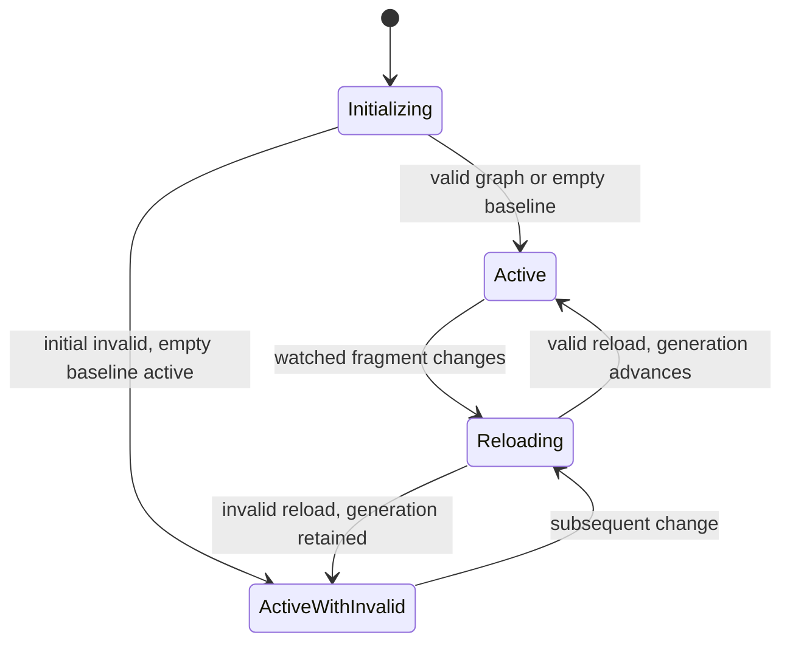
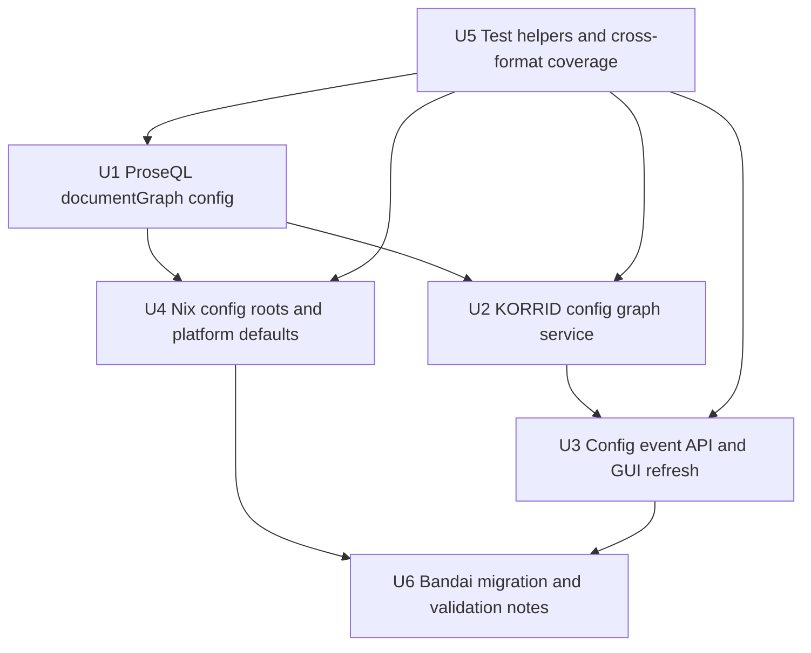

# feat: Move Korri runtime to a ProseQL config graph

## Summary

Move Korri's runtime read path from a singleton library root to an ordered ProseQL `documentGraph` config graph. KORRID will read config fragments from configured roots, serve a last-known-good effective graph, and broadcast config changes through a new `/api/config/events` stream while platform defaults become a generated read-only config root.

---

## Problem Frame

Korri's current runtime still treats `library.yaml` under one `KORRI_LIBRARY_ROOT` as the canonical live configuration boundary. That no longer matches the intended authoring model: config is broader than the library section, can be split across arbitrary fragments, should deep-merge across ordered roots, and must be watched by KORRID so GUIs and clients refresh when the effective graph changes.

The ProseQL 0.14.0 `documentGraph` source now provides the missing substrate: ordered roots, opt-in discovery, deep-merge overlays, read-only graph-backed collections, transform hooks, and watcher reload support. Korri should consume that capability directly instead of building duplicate scanner/overlay glue.

---

## Requirements

- R1. Replace the runtime singleton `KORRI_LIBRARY_ROOT` read contract with ordered config roots exposed as `KORRI_CONFIG_ROOTS` and Nix `services.korri.config.roots`.
- R2. Treat config roots as directories only; discover only opt-in Korri config fragments matching `**/korri.<ext>` and `**/*.korri.<ext>` for all ProseQL-supported document extensions.
- R3. Preserve identical Korri semantics across supported formats: canonical top-level sections, plain singleton `host`, key-derived IDs, and strict schema validation.
- R4. Assemble an empty in-memory baseline plus discovered fragments into one effective config graph using ProseQL `documentGraph` deep-merge overlays: roots ordered as configured, deterministic file order within roots, later fragments winning, objects merging, arrays/scalars/null replacing, and no delete semantics in this slice.
- R5. KORRID owns config graph lifecycle: open the active graph for the server lifetime, run its own debounced rebuild attempts on watched root changes, keep serving last-known-good on invalid reloads, start with an empty graph on initial invalid config, and surface diagnostics.
- R6. Replace `/api/library/events` with `/api/config/events` and event names `config.ready`, `config.changed`, and `config.invalid` carrying generation/attempt/status payloads.
- R7. Platform defaults are generated as a read-only config root ordered before local roots; they are not installed into mutable user config state.
- R8. Durable local editable config root is `/var/lib/korri/config`; do not automatically read legacy `/var/lib/korri/library`.
- R9. Do not implement generic removable-media config roots or authoring/write-target semantics in this slice; keep those deferred items explicit and durable.
- R10. Do not expose ProseQL directly to the renderer; GUI/client state refreshes through existing RPC/atom layers after config events.

---

## Scope Boundaries

- No legacy public runtime support for `KORRI_LIBRARY_ROOT`, `services.korri.daemon.library.root`, `/api/library/events`, `library.ready`, or `library.changed`. Standalone writer/import tools are outside this runtime contract and remain deferred to the write-target follow-up rather than being treated as compatibility for KORRID.
- No generic removable media root convention in this slice; USB/SD/multi-media config roots remain deferred.
- No config authoring/write-target semantics in this slice; CLI/import/editor writes need a separate explicit target model.
- No automatic migration reader for `/var/lib/korri/library`; Bandai/local data should be intentionally moved to `/var/lib/korri/config/*.korri.<ext>` as operational work.
- No delete marker semantics for overlays; `null` is only a replacement value subject to schema validation.
- No renderer-side ProseQL access or new UI for resolving config diagnostics beyond listening for config events and refreshing config-derived state.

### Deferred to Follow-Up Work

- **Generic removable-media Korri config roots:** tracked as backlog `01KTRYCA2EC1DBW6RJXPC4NJV4`. This must cover USB drives, SD cards, multiple devices, hotplug, and a device-neutral Korri-owned path convention.
- **Korri config authoring write-target semantics:** tracked as backlog `01KTRYCK5XYMCSVYD55P7XWBDY`. This must define how importers, CLIs, and editors choose a writable destination separate from the read graph. Existing writer-oriented commands should not block this runtime migration, but implementation should avoid silently repurposing their `KORRI_LIBRARY_ROOT` behavior as a runtime compatibility path.
- **Hardening of writer-origin typed events:** future authoring flows should emit typed config-update events from the writer rather than relying only on filesystem event inference.

---

## Context & Research

### Relevant Code and Patterns

- `product/platform/library/proseql/library-db.ts` currently declares one mutable ProseQL `documents` source rooted at one `root`, includes `**/*.yaml`, and writes `library.yaml` as outbox.
- `product/platform/library/library-source-layer-live.ts` resolves `KORRI_LIBRARY_ROOT`, opens the ProseQL DB per operation, and feeds `createLibraryRepository`.
- `product/platform/library/proseql/library-repository.ts` already loads a readable snapshot from ProseQL collections; most repository/cascade callers should not care whether collections came from `documents` or `documentGraph`.
- `product/apps/portal/api/library/events.ts` and `product/apps/portal/api/hono-app.ts` implement the old single-root YAML-only `/api/library/events` SSE path.
- `product/apps/portal/features/home/HomeRuntimeLayersRoot.tsx` refreshes mounted library atoms after `library.changed`; this is the client refresh bridge to retarget to `config.*`.
- `product/apps/desktop/api-forwarder.ts` is path-agnostic and already streams `text/event-stream` responses without buffering; only tests/fixtures need the endpoint rename.
- `product/systems/nixos/modules/korri-daemon.nix` owns daemon environment, platform defaults rendering, systemd hardening, and old library root creation.
- `product/systems/nixos/modules/korri-sessiond.nix` currently re-exports daemon library env into the foreground supervisor environment.
- `tools/testing/nix/korri-daemon-module-check.nix`, `tools/testing/nix/korri-sessiond-module-check.nix`, `tools/testing/nix/korri-source-machine-image-check.nix`, and `tools/testing/nix/korri-rocknix-sm8550-config-check.nix` are the right Nix module-eval gates for the contract change.
- `tools/testing/library/with-temp-proseql-library.ts` seeds current tests through DB writes; read-only graph tests should seed by writing config fragments directly.

### Institutional Learnings

- `docs/solutions/best-practices/proseql-canonical-library-with-derived-yaml-ids-2026-05-06.md`: ProseQL remains server-side canonical runtime storage; renderer code should access it through RPC/atoms, not direct imports.
- `docs/solutions/architecture-patterns/boot-scoped-control-plane-with-session-scoped-runner-2026-05-19.md`: system-vs-user service paths must be derived explicitly, with tmpfiles and hardening assertions rather than `%t`/`%h` guesses.
- `docs/solutions/architecture-patterns/architectural-posture-as-nix-image-default-2026-05-27.md`: platform/image-specific runtime posture belongs at image/product layers, while reusable modules should stay conservative.
- `docs/solutions/workflow-issues/rocknix-guest-only-nix-deploy-2026-05-27.md`: Bandai deployment targets the NixOS guest store on port 2222; real-device validation should use the guest generation path.
- `docs/solutions/best-practices/korri-api-on-aarch64-handheld-via-bun-bundle-2026-05-27.md`: ProseQL dependency changes require re-validating the Bun bundle externals and Bandai runtime footprint.
- `docs/solutions/design-patterns/explicit-cascade-folded-policy-over-incidental-signal-heuristics-2026-05-27.md`: writer-owned typed events are preferable to heuristic filesystem intent; this plan keeps writer events deferred but should avoid overclaiming watcher intent.

### External References

- ProseQL 0.14.0 package surface in `node_modules/@proseql/core/dist/storage/source-config.d.ts` and `node_modules/@proseql/core/dist/storage/document-graph-source.d.ts` confirms `kind: "documentGraph"`, ordered roots, transforms, read-only collections, and document-graph load errors.

---

## Key Technical Decisions

| Decision | Rationale |
|---|---|
| Use ProseQL `documentGraph` for runtime reads | It owns discovery, extension-driven codecs, transform hooks, deep-merge ordering, read-only graph collections, watcher reloads, and last-known-good substrate behavior. |
| Rename the domain to config graph | The graph includes `host`, `apps`, `runtimes`, `profiles`, and `library`; calling the whole mechanism “library” is misleading. |
| Make roots directories only | Users can organize arbitrary fragments below a root without special casing single-file paths. |
| Use opt-in `korri.<ext>` / `*.korri.<ext>` basenames | Broad roots can point at operator directories without accidentally ingesting unrelated JSON/TOML/YAML. |
| Treat all roots as optional at runtime except generated platform roots | Empty and missing user roots are valid; missing Nix-store platform roots are deployment bugs and should fail loudly. |
| Use last-known-good service state in KORRID | Clients should not lose catalog/config-derived state because one edit is invalid; invalid reloads should be diagnosable while the previous valid graph remains active. |
| Keep writer semantics deferred but explicit | `documentGraph` is read-only by design. Importers/editors need a separate write-target contract rather than hidden writes into arbitrary roots. |
| Full public contract break | The user explicitly chose no legacy support for old env/Nix/event names. The plan should remove old public surfaces rather than alias them. |

---

## Open Questions

### Resolved During Planning

- **Should the runtime model remain library-root based?** No. It is a Korri config graph; `library` is one section.
- **Should config roots include single files?** No. Roots are directories; fragments below them are discovered by opt-in basename.
- **Should formats have different semantics?** No. All ProseQL-supported document formats have the same Korri config semantics.
- **Should overlays allow duplicate record IDs?** Yes, through deep-merge overlay semantics with later fragments winning.
- **Should overlays support deletes now?** No. Null/scalar/array replacement is enough for this pass.
- **Should missing or empty roots be valid?** Yes. Empty baseline is valid; invalid existing files are surfaced as invalid config.
- **Should invalid reloads replace active config?** No. Keep last known good; emit/log invalid diagnostics.
- **Should `/api/library/events` remain?** No. Full event API break to `/api/config/events`.
- **Should platform defaults be written into local mutable config?** No. They become a generated read-only root ordered first.
- **Should removable roots be defaulted now?** No. Defer generic removable media to a separate design slice.

### Deferred to Implementation

- **Exact ProseQL reload event integration point:** Implementation should use the 0.14.0 API surface available in the installed package and avoid duplicating documentGraph internals.
- **Final shape of the persistent KORRID service scope:** The plan names the lifecycle requirements; implementation can choose the simplest Effect/Bun lifecycle pattern that keeps watchers alive until daemon shutdown.
- **How much old writer-oriented test helper code to preserve:** Runtime graph tests should seed files directly, while writer tools are deferred; implementation can decide whether to keep a clearly named writable test helper for existing unrelated tests.

---

## High-Level Technical Design

> *This illustrates the intended approach and is directional guidance for review, not implementation specification. The implementing agent should treat it as context, not code to reproduce.*

```mermaid
flowchart TB
  PlatformRoot[Nix generated platform config root]
  LocalRoot[/var/lib/korri/config]
  EnvRoots[KORRI_CONFIG_ROOTS]
  Graph[ProseQL documentGraph]
  State[KORRID config graph service]
  Repo[Library repository/cascade]
  RPC[RPC list/launch handlers]
  SSE[/api/config/events]
  GUI[Portal atoms / clients]

  PlatformRoot --> Graph
  LocalRoot --> Graph
  EnvRoots --> Graph
  Graph --> State
  State --> Repo
  Repo --> RPC
  State --> SSE
  SSE --> GUI
  RPC --> GUI
```

State transitions:



---

## Implementation Units



### U1. Wire ProseQL documentGraph for Korri config roots

**Goal:** Replace the runtime read DB configuration with a ProseQL `documentGraph` source that assembles the effective Korri config graph from ordered roots and opt-in fragment filenames.

**Requirements:** R1, R2, R3, R4, R8, R9

**Dependencies:** ProseQL 0.14.0 dependency already present in `package.json` / `bun.lock`.

**Files:**
- Modify: `product/platform/library/proseql/library-db.ts`
- Modify: `product/platform/library/library-source-layer-live.ts`
- Modify: `product/platform/library/proseql/library-db.test.ts`
- Modify: `product/platform/library/library-source-layer-live.test.ts`
- Test: `product/platform/library/proseql/library-db.test.ts`
- Test: `product/platform/library/library-source-layer-live.test.ts`

**Approach:**
- Introduce an explicit config-root input shape for runtime reads instead of a singleton `root` string.
- Build a ProseQL source using `kind: "documentGraph"`, ordered roots, opt-in include globs, canonical collections, and Korri's strict readable-schema transform.
- Apply the plain `host` singleton transform exactly once through the documentGraph transform path for runtime reads, so YAML, JSON/JSONC/JSON5, TOML, TOON, HJSON, JSONL/NDJSON, and Prose fragments share identical semantics. Do not also wrap `host` in a graph-specific codec path that would double-wrap YAML fragments.
- Configure generated platform roots as non-optional when supplied by Nix; configure local/operator roots as optional so empty baseline remains valid. Ensure local roots are still created by Nix/tmpfiles before KORRID starts when the product expects live watching.
- Parse `KORRI_CONFIG_ROOTS` as an ordered list. Do not fall back to `KORRI_LIBRARY_ROOT`.
- Preserve graph-backed collections as read-only. Do not silently keep repository write APIs working against the runtime graph; writer/import CLIs are a separate authoring target concern and should not influence runtime graph design.
- Keep any writer-only helper/factory clearly separate if existing tests or non-runtime tools still need a writable ProseQL `documents` source during the deferred authoring-write transition.

**Execution note:** Start with characterization tests around current readable schema behavior (`host`, strict canonical sections) before swapping the source kind.

**Patterns to follow:**
- `product/platform/library/proseql/library-db.ts` for canonical collection schema and sidecar guard structure.
- `node_modules/@proseql/core/dist/storage/source-config.d.ts` for `DocumentGraphSourceConfig` shape.
- `product/platform/library/library-source-layer-live.ts` for env parsing and `LibraryError` mapping.

**Test scenarios:**
- Happy path: two config roots define different sections through `korri.yaml` / `*.korri.yaml`; listing playable entries sees one merged effective graph.
- Happy path: a later root overlays a nested object from an earlier root; object fields deep-merge and later scalar values win.
- Happy path: fragments using at least YAML plus one non-YAML ProseQL-supported format produce the same runtime records.
- Edge case: no `KORRI_CONFIG_ROOTS` and no discovered files yields an empty graph, not a startup/config error.
- Edge case: explicit empty `KORRI_CONFIG_ROOTS` yields an empty root list and empty graph.
- Edge case: non-opt-in files such as `library.yaml`, `apps.yaml`, or `random.json` under a root are ignored.
- Error path: malformed or schema-invalid `*.korri.<ext>` fragment maps to a config error with source/path context.
- Error path: `host` singleton appears in a fragment and is not double-wrapped in the runtime collection.
- Error path: attempts to mutate graph-backed collections fail clearly as read-only rather than writing an outbox.

**Verification:**
- Runtime library listing and launch resolution can read from an effective documentGraph-backed config.
- Old public env name `KORRI_LIBRARY_ROOT` is not required or consulted by the runtime read path.
- All supported ProseQL extensions, including plugin codecs such as `.prose` when ProseQL exposes them, are represented by discovery include patterns from one shared constant so the include list and tests cannot drift.

### U2. Add KORRID config graph lifecycle and last-known-good state

**Goal:** Make KORRID own the effective config graph for the daemon lifetime, including valid reloads, invalid reload diagnostics, and last-known-good serving behavior.

**Requirements:** R4, R5, R10

**Dependencies:** U1

**Files:**
- Modify: `product/services/device/korrid.ts`
- Modify: `product/apps/portal/api/server/rpc-server.ts`
- Modify: `product/platform/library/library-source-layer-live.ts`
- Create: `product/platform/library/config-graph-service.ts`
- Test: `product/platform/library/config-graph-service.test.ts`
- Test: `product/apps/portal/api/server/rpc-server.test.ts`

**Approach:**
- Introduce a daemon-scoped config graph service that exposes the active last-known-good graph to repository/RPC code.
- Hold the active ProseQL documentGraph DB for the daemon lifetime, not per RPC call. Do not rely on ProseQL's internal watcher failure logging as KORRID's event source; KORRID owns a debounced root-change loop that attempts a fresh ProseQL graph build, swaps the active graph on success, and emits `config.invalid` while retaining the prior graph on failure.
- Treat an initially invalid discovered graph as degraded startup: create/serve an empty in-memory graph plus invalid diagnostic event/log rather than crash-looping. This requires an explicit fallback path when the first documentGraph open fails.
- Treat a valid reload as a new active generation.
- Treat an invalid reload as an invalid attempt that preserves the prior active generation.
- Ensure RPC list/launch paths consume the active graph through existing `LibrarySource` / repository seams rather than importing ProseQL into UI code. Wire the active graph service into server RPC handling through the platform service/layer seam; route changes belong to U3.

**Technical design:** Directional state shape only:

```text
active generation: number that increments only on valid graph replacement
attempt: monotonically increasing number that increments on every rebuild attempt
status: valid | invalid
diagnostic: present for the most recent invalid attempt
```

**Patterns to follow:**
- `product/services/device/korrid.ts` for daemon lifecycle and graceful shutdown.
- `product/platform/library/library-services.ts` and `library-source-layer-live.ts` for Effect service seams.
- ProseQL scoped DB opening/finalizer patterns in `product/platform/library/proseql/library-db.ts`.

**Test scenarios:**
- Happy path: KORRID starts with valid roots and serves catalog/list RPC from the active graph.
- Happy path: valid reload advances generation and subsequent RPC calls observe new config-derived library entries.
- Edge case: startup with no fragments serves an empty catalog and reports valid empty baseline.
- Error path: startup with invalid config starts the daemon with an empty graph and retains diagnostic state.
- Error path: invalid reload after a valid graph keeps previous entries visible through RPC and records an invalid attempt.
- Integration: a config graph service lifetime outlives an individual RPC request; watcher/reload state is not tied to request scope.

**Verification:**
- KORRID can start, serve RPC, and retain last-known-good behavior without reopening ProseQL per request.
- No renderer code imports ProseQL directly.

### U3. Replace library SSE with config events and client refresh

**Goal:** Replace the old `/api/library/events` SSE path with `/api/config/events`, update event names/payloads, and refresh clients on config graph changes.

**Requirements:** R5, R6, R10

**Dependencies:** U2

**Files:**
- Delete: `product/apps/portal/api/library/events.ts`
- Delete or replace: `product/apps/portal/api/library/events.test.ts`
- Create: `product/apps/portal/api/config/events.ts`
- Create: `product/apps/portal/api/config/events.test.ts`
- Modify: `product/apps/portal/api/hono-app.ts`
- Modify: `product/apps/desktop/api-forwarder.test.ts`
- Modify: `product/apps/portal/features/home/HomeRuntimeLayersRoot.tsx`
- Modify: `product/apps/portal/features/home/HomeRuntimeLayersRoot.test.tsx`
- Test: `product/apps/portal/api/config/events.test.ts`
- Test: `product/apps/desktop/api-forwarder.test.ts`
- Test: `product/apps/portal/features/home/HomeRuntimeLayersRoot.test.tsx`

**Approach:**
- Expose only `/api/config/events`; do not keep `/api/library/events` as an alias.
- Emit `config.ready` when a client connects and the daemon has an active graph state to report.
- Emit `config.changed` after successful graph rebuilds.
- Emit `config.invalid` when an attempted build/reload fails while active graph remains last-known-good or empty baseline.
- Use explicit per-event payloads without leaking absolute server paths:
  - `config.ready`: active `generation`, current `attempt`, `status: "valid" | "invalid"`, and `files` when the active graph is valid.
  - `config.changed`: active `generation`, current `attempt`, `status: "valid"`, `files`, and optional relative `changedPath`.
  - `config.invalid`: retained active `generation`, failed `attempt`, `status: "invalid"`, `message`, and optional relative `changedPath`.
- Treat `attempt` as a monotonically increasing numeric rebuild-attempt counter matching U2's state definition.
- Update the GUI refresh bridge to listen to `config.changed` and `config.ready` so reconnects also refresh config-derived state.
- Keep the desktop forwarder implementation unchanged unless tests reveal a generic SSE bug; it already streams event-stream responses by content type.

**Patterns to follow:**
- Existing uncommitted `product/apps/portal/api/library/events.ts` as the SSE response shape baseline, but not its single-root/yaml-only watcher logic.
- `product/apps/desktop/api-forwarder.ts` content-type based event-stream passthrough.
- `product/apps/portal/features/home/HomeRuntimeLayersRoot.tsx` atom refresh pattern.

**Test scenarios:**
- Happy path: `GET /api/config/events` immediately streams `config.ready` with active generation/attempt/status.
- Happy path: successful graph rebuild streams `config.changed` and GUI refreshes `libraryItemsAtom`.
- Happy path: desktop forwarder returns an event-stream response for `/api/config/events` without buffering.
- Edge case: EventSource reconnect receives `config.ready` and the GUI refreshes even without a new file change.
- Error path: invalid reload streams `config.invalid` with current generation retained and error message present.
- Error path: `GET /api/library/events` is not registered as a supported endpoint.

**Verification:**
- Clients refresh catalog/config-derived state through `/api/config/events` only.
- No `library.ready` / `library.changed` event names remain in runtime code or tests for this path.

### U4. Replace Nix library-root wiring with config roots and generated platform root

**Goal:** Move the NixOS runtime contract from `services.korri.daemon.library.root` to `services.korri.config.roots`, export `KORRI_CONFIG_ROOTS`, and make platform defaults a generated read-only config root ordered first.

**Requirements:** R1, R7, R8, R9

**Dependencies:** U1

**Files:**
- Modify: `product/systems/nixos/modules/korri-daemon.nix`
- Modify: `product/systems/nixos/modules/korri-sessiond.nix`
- Modify: `product/systems/nixos/images/platforms/rocknix-sm8550.nix`
- Modify: `product/systems/nixos/images/platforms/rocknix-rk3566.nix`
- Modify: `product/systems/nixos/images/headless.nix`
- Modify: `product/systems/nixos/images/kiosk.nix`
- Modify: `product/apps/desktop/nix/wrap.nix`
- Modify: `tools/testing/nix/korri-daemon-module-check.nix`
- Modify: `tools/testing/nix/korri-sessiond-module-check.nix`
- Modify: `tools/testing/nix/korri-source-machine-image-check.nix`
- Modify: `tools/testing/nix/korri-rocknix-sm8550-config-check.nix`
- Test: `tools/testing/nix/korri-daemon-module-check.nix`
- Test: `tools/testing/nix/korri-sessiond-module-check.nix`
- Test: `tools/testing/nix/korri-source-machine-image-check.nix`
- Test: `tools/testing/nix/korri-rocknix-sm8550-config-check.nix`

**Approach:**
- Introduce `services.korri.config.roots` at a generic Korri module boundary rather than burying it under `daemon.library`.
- Default the durable local editable root to `/var/lib/korri/config` in product/runtime images that own `/var/lib/korri`.
- Generate platform defaults into a Nix-store directory containing an opt-in Korri config fragment such as `platform.korri.yaml`; prepend that directory to the daemon's effective roots and treat it as non-optional.
- Stop installing generated defaults into mutable user config during `ExecStartPre`.
- Export `KORRI_CONFIG_ROOTS` as the ordered, colon-joined root list for KORRID and any same-process children that need the read graph. Do not export `KORRI_LIBRARY_ROOT` from product runtime services as a read compatibility path.
- Update sessiond/Electrobun environment propagation so foreground session code receives the new config-root env and no longer receives old library-root env for runtime reads.
- Tighten systemd hardening: config roots are read paths for runtime reads; do not grant broad write access to them just because the old documents outbox needed it. Still create `/var/lib/korri/config` with the configured runtime ownership before KORRID starts so a startup-present root can be watched.

**Patterns to follow:**
- `product/systems/nixos/modules/korri-daemon.nix` service-mode path derivation and env export patterns.
- `tools/testing/nix/*-module-check.nix` pure module-eval assertions.
- `product/systems/nixos/images/platforms/rocknix-sm8550.nix` for platform defaults composition.

**Test scenarios:**
- Happy path: daemon module exports `KORRI_CONFIG_ROOTS` with generated platform root before `/var/lib/korri/config`.
- Happy path: platform defaults file path in the generated root uses an opt-in Korri filename and is not installed into local mutable config.
- Happy path: sessiond user unit receives `KORRI_CONFIG_ROOTS` when it needs to launch config-aware foreground surfaces.
- Edge case: system mode hardening does not require write access to read-only config roots.
- Error path: Nix eval catches invalid config-root path shapes where the module can statically detect an unsafe placeholder or wrong manager context.
- Integration: SM8550 image check asserts `/var/lib/korri/config` is the local config root and no automatic `/var/lib/korri/library` read path is exported.

**Verification:**
- Nix module checks prove the new public env/Nix contract and platform root ordering.
- Product images no longer rely on mutable `library.root` for platform defaults.

### U5. Add config-graph test helpers and coverage across formats/overlays

**Goal:** Provide test infrastructure for read-only config graphs and migrate targeted tests off DB-upsert seeding where they validate runtime reads.

**Requirements:** R2, R3, R4, R5, R6

**Dependencies:** U1, U2, U3, U4 as each surface is implemented.

**Files:**
- Create: `tools/testing/library/with-temp-config-graph.ts`
- Create: `tools/testing/library/with-temp-config-graph.test.ts`
- Modify: `tools/testing/library/with-temp-proseql-library.ts`
- Modify: `product/platform/library/proseql/library-db.test.ts`
- Modify: `product/platform/library/library-source-layer-live.test.ts`
- Modify: `product/apps/portal/api/library/list.rpc-handler.test.ts`
- Modify: `product/apps/portal/api/library/launch.rpc-handler.test.ts`
- Test: `tools/testing/library/with-temp-config-graph.test.ts`
- Test: `product/platform/library/proseql/library-db.test.ts`
- Test: `product/platform/library/library-source-layer-live.test.ts`

**Approach:**
- Add a temp-root helper that seeds config by writing opt-in config fragments to directories rather than mutating the ProseQL DB.
- Keep any existing writable ProseQL test helper for tests that intentionally exercise writer/import behavior, but do not use it to prove runtime read-graph behavior.
- Cover every ProseQL-supported extension in a focused discovery test. Use representative semantic tests for a smaller cross-format set to avoid duplicating the full schema matrix for every codec.
- Migrate runtime read tests to `KORRI_CONFIG_ROOTS` and file-seeded roots.

**Patterns to follow:**
- `tools/testing/library/with-temp-proseql-library.ts` cleanup ergonomics.
- `product/platform/library/proseql/library-db.test.ts` temp root and Effect-scoped DB patterns.
- Existing env restore patterns in `product/platform/library/library-source-layer-live.test.ts`.

**Test scenarios:**
- Happy path: helper creates multiple roots with multiple opt-in fragments and returns an env object suitable for `KORRI_CONFIG_ROOTS`.
- Happy path: extension discovery recognizes `json`, `ndjson`, `jsonl`, `yaml`, `yml`, `json5`, `jsonc`, `toml`, `toon`, `hjson`, and `prose`, with any plugin codec registration needed for `.prose` declared in the config graph setup.
- Edge case: helper ignores non-opt-in filenames in otherwise valid roots.
- Edge case: helper cleanup removes all temp roots after tests.
- Integration: list/launch RPC tests can use file-seeded config graph roots to resolve entries and launch specs through the normal server path.

**Verification:**
- Runtime read tests no longer depend on write APIs for seeding config graph behavior.
- Existing writer/import-focused tests remain intentionally separate from runtime graph coverage.

### U6. Migrate Bandai/local config and validate deployment behavior

**Goal:** Apply the new config-root contract to Bandai's deployed runtime, move local config into `/var/lib/korri/config`, and validate boot/runtime behavior on real hardware.

**Requirements:** R6, R7, R8, R10

**Dependencies:** U1, U2, U3, U4, U5

**Files:**
- Modify: `tools/testing/nix/korri-rocknix-sm8550-config-check.nix`
- Test: `tools/testing/nix/korri-rocknix-sm8550-config-check.nix`

**Approach:**
- Treat Bandai migration as an operational validation step, not as a device-specific config-root design.
- Move current local config content intentionally from `/var/lib/korri/library/library.yaml` to an opt-in fragment under `/var/lib/korri/config`, such as `local.korri.yaml`.
- Verify KORRID starts with generated platform root plus local root, emits `config.ready`, and GUI/client refreshes on `config.changed`.
- Verify invalid config edit emits `config.invalid` while the prior catalog remains visible.
- Re-validate the Bun bundle and Bandai memory/runtime behavior because ProseQL dependency and watcher behavior changed.

**Patterns to follow:**
- Bandai deployment notes in `docs/solutions/workflow-issues/rocknix-guest-only-nix-deploy-2026-05-27.md`.
- Existing SM8550 config checks for platform-level contracts.
- Existing live verification style from prior Bandai volume/removable-card work.

**Test scenarios:**
- Integration: after deployment, `/api/config/events` streams `config.ready` and no `/api/library/events` route is registered or used by the GUI.
- Integration: editing `/var/lib/korri/config/local.korri.yaml` to add a visible library entry causes a config event and GUI/RPC list refresh.
- Error path: temporarily invalid local config emits invalid diagnostics and keeps the prior valid catalog active.
- Reboot: generated platform root and `/var/lib/korri/config` remain the configured roots after reboot.

**Verification:**
- Bandai runs a generation containing the new config graph and continues to list/launch configured local entries.
- The only remaining removable-media config work is the deferred generic media-root follow-up, not an SM8550-specific workaround.

---

## System-Wide Impact

- **Interaction graph:** KORRID startup, ProseQL documentGraph, Effect/RPC library services, Hono SSE routing, desktop API forwarding, portal atoms, NixOS daemon/sessiond modules, and product image defaults all participate in this migration.
- **Error propagation:** Existing invalid config files should become config diagnostics and `config.invalid` events, while RPC calls continue serving last-known-good or empty baseline. ProseQL structural errors should not be swallowed without logs/events.
- **State lifecycle risks:** Persistent graph scope must outlive individual RPC requests. Watcher reloads must not discard active state on invalid config. Empty baseline must be distinguished from invalid graph attempts.
- **API surface parity:** HTTP/SSE endpoint, client EventSource path, Nix env exports, desktop wrapper env, and sessiond child env must move together to avoid split-brain deployments.
- **Integration coverage:** Unit tests alone will not prove KORRID lifetime, GUI refresh, Nix env, and Bandai boot behavior; at least one cross-layer server/GUI and one Nix eval check are required.
- **Unchanged invariants:** Renderer/theme code still accesses library/config-derived state through platform RPC/atoms. ROCKNIX remains an importer/source input path, not the live runtime graph. Generic removable-media config root design remains deferred.

---

## Risks & Dependencies

| Risk | Mitigation |
|------|------------|
| ProseQL documentGraph read-only collections break writer-oriented tests/tools | Split runtime read graph coverage from writer/import helper coverage; keep write-target authoring semantics deferred and explicit; do not treat old writer env as runtime compatibility. |
| Double-applying the plain `host` transform | Choose one application point and add a test with a `host` fragment. |
| Missing platform defaults silently look like empty factory config | Mark generated platform root non-optional in the source config and assert Nix output exists. |
| GUI stale after reconnect | Listen to `config.ready` as well as `config.changed`. |
| ProseQL internal watcher failures are not observable enough for KORRID events | KORRID owns the debounced rebuild/event loop and uses ProseQL graph builds to classify success vs. invalid attempts. |
| Broad roots ingest unrelated files | Restrict discovery to opt-in Korri basenames across supported extensions. |
| Public hard break strands old deployments if Nix/env/runtime are not updated atomically | Land TypeScript, Nix env exports, wrapper env, and deployment migration in one verified slice; do not keep old public aliases. |
| Invalid config on first boot hides diagnostics | Start with empty graph but emit/log `config.invalid` so the control plane remains reachable. |
| Bun bundle/runtime footprint changes after ProseQL bump | Re-validate Bandai bundle externals and observe daemon startup/memory during deployment validation. |

---

## Documentation / Operational Notes

- Update operator-facing examples away from `/var/lib/korri/library/library.yaml` toward `/var/lib/korri/config/*.korri.<ext>` when implementation touches those docs or examples.
- Keep this plan's deferred backlog items visible in implementation summaries so removable-media roots and write-target semantics do not get lost.
- Bandai rollout should explicitly copy/rename local config into the new root before judging catalog regressions.
- Deployment notes should call out that `/api/library/events` and `KORRI_LIBRARY_ROOT` are intentionally removed public contracts.

---

## Alternative Approaches Considered

- **Build custom scanner/overlay/watcher in Korri:** Rejected because ProseQL 0.14.0 now owns the exact documentGraph capability and avoids duplicating codec inference, transform, merge, provenance, and watcher behavior.
- **Keep old library-root aliases for one transition:** Rejected for public runtime contracts because the user explicitly chose full break. Internal writer helpers may remain only as separate authoring/test infrastructure, not as runtime compatibility.
- **Default removable media roots in this pass:** Rejected because the user wants USB/SD/etc. as a generic device-neutral design, not an SM8550-specific default.
- **Error on empty/missing roots:** Rejected because an empty in-memory baseline is a valid runtime state and broad optional roots should not brick the control plane.

---

## Sources & References

- Related code: `product/platform/library/proseql/library-db.ts`
- Related code: `product/platform/library/library-source-layer-live.ts`
- Related code: `product/services/device/korrid.ts`
- Related code: `product/apps/portal/api/hono-app.ts`
- Related code: `product/apps/portal/features/home/HomeRuntimeLayersRoot.tsx`
- Related code: `product/systems/nixos/modules/korri-daemon.nix`
- Related code: `tools/testing/nix/korri-daemon-module-check.nix`
- Related backlog: `work/items/parking-lot/01KTRYCA2EC1DBW6RJXPC4NJV4-design-generic-removable-media-korri-config-roots.md`
- Related backlog: `work/items/parking-lot/01KTRYCK5XYMCSVYD55P7XWBDY-define-korri-config-authoring-write-target-semantics.md`
- Institutional learning: `docs/solutions/best-practices/proseql-canonical-library-with-derived-yaml-ids-2026-05-06.md`
- Institutional learning: `docs/solutions/architecture-patterns/boot-scoped-control-plane-with-session-scoped-runner-2026-05-19.md`
- Institutional learning: `docs/solutions/best-practices/korri-api-on-aarch64-handheld-via-bun-bundle-2026-05-27.md`
