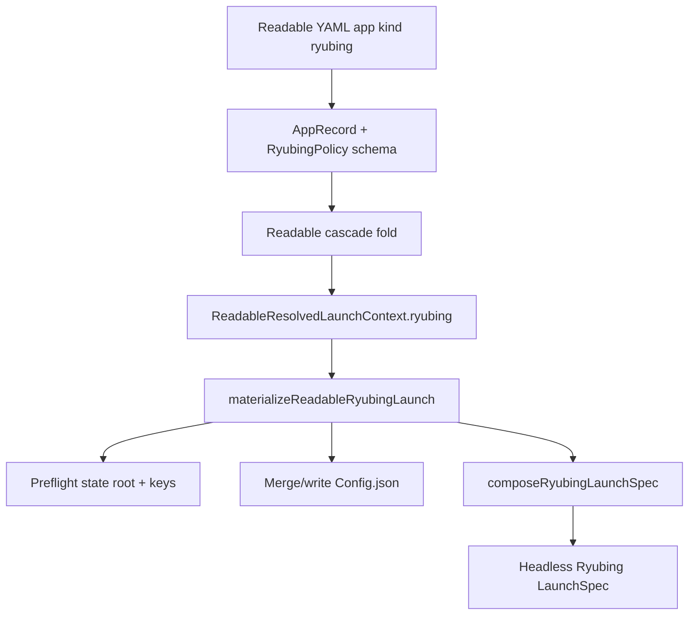

# feat: Add first-class Ryubing app kind

## Summary

Add a first-class Korri `kind: ryubing` app integration that launches Switch games through Ryubing headless mode, owns the Ryubing state root on stable removable media, generates/merges `Config.json`, and exposes typed emulator settings with `extra.args` and `extra.config` escape hatches.

---

## Problem Frame

Bandai currently launches Ryubing through a generic process app and hand-authored environment/args. That works for one device session, but it does not give Korri a typed contract for Ryubing state placement, Config.json generation, preflight, cascade overrides, or launch validation. The new app kind should make Ryubing as config-native as RetroArch while preserving the stable-media requirement for keys, firmware, saves, and games.

---

## Requirements

- R1. Accept `apps.<id>.kind: ryubing` in readable Korri YAML and reject Ryubing-specific fields on non-Ryubing app kinds.
- R2. Use the refined product config shape from `out/tmp/ryubing-full.korri.yaml`: `storage`, `state`, literal `env`, `config`, `content`, `display`, `graphics`, `console`, `audio`, `input`, `network`, `logging`, `debug`, and `extra`; fixed Ryubing layout paths are internal constants, not public config.
- R3. Launch Ryubing in **headless-only** mode for v1, rendering `--no-gui`, `--root-data-dir`, `--use-main-config`, typed headless flags, unrestricted `extra.args`, and the resolved game path as the final positional argument.
- R4. Pre-create and preflight the Ryubing state root without accidentally creating a fake host directory when the removable media mount is absent.
- R5. Generate/merge `<state.root>/Config.json` using Ryubing's native snake_case keys, preserving existing unknown keys when requested and applying `extra.config` last.
- R6. Fail before exec when required key files or required firmware preflight checks are missing.
- R7. Support stable removable media roots through existing `storage`/`sources` records and relative release targets; do not trust removable cards to define executable `apps`.
- R8. Preserve the existing generic process and RetroArch launch behavior.
- R9. Cover schema, cascade, rendering, materialization, and repository launch-resolution behavior with focused unit tests.
- R10. In headless-only mode, fail before exec unless the effective generated/merged config provides at least one usable input configuration for Ryubing.
- R11. Support both literal absolute Ryubing paths and explicit storage template tokens like `{storage:switch-card}/...` so exact media identity can be declared once in `storage` when desired.
- R12. Expose an availability signal/diagnostic when a referenced storage root or Ryubing state root is currently unavailable, without yet codifying the final UI-disable behavior.

---

## Scope Boundaries

- Only headless Ryubing game launch is in scope. GUI-mode Ryubing launch, settings-window launch, game-list browsing, firmware installation, update prompts, and multi-application container selection are not part of v1.
- The Ryubing app definition must live in trusted config roots. Removable media may provide data collections like `library` and `collections`, not `apps` or executable policy.
- This plan does not deploy to Bandai, rebuild device images, or mutate the current live `/var/lib/korri/config/local.korri.yaml`.
- This plan does not weaken the existing removable-media trust boundary or change the media mount contract.
- This plan does not define the final UI behavior for unavailable media-backed games; it only establishes the availability/diagnostic signal that future UI can consume.
- This plan does not hard-code a changing Nix store hash into reusable product defaults. Device-local config may still name an exact command path when necessary.

### Deferred to Follow-Up Work

- GUI Ryubing mode support: only if a later product need requires Ryubing's UI, firmware install flow, or GUI-only flags.
- Stable installed-application identity and command-wrapper discovery for Ryubing or other packaged apps; v1 keeps `command` explicit in trusted config.
- Rich UI surfacing of Ryubing preflight diagnostics in the portal beyond existing launch error surfaces.
- Shared generated documentation for every Ryubing Config.json option if the typed schema grows beyond the v1 product contract.

---

## Context & Research

### Relevant Code and Patterns

- `product/platform/library/config/records/app.ts` defines `AppKind`, typed app-field guards, and the RetroArch field extraction pattern to mirror for `RyubingPolicy`.
- `product/platform/library/config/inheritable-fields.ts` defines cascadeable app policy records, including `RetroArchPolicy`; Ryubing should follow this path so per-system/release/profile overrides can work.
- `product/platform/library/config/cascade-resolver.ts` folds readable config layers and currently carries `retroarch` policy through `ReadableLayerView`; Ryubing needs the same plumbing.
- `product/platform/library/config/resolved-launch-context.ts` defines the resolved readable launch context that must carry folded Ryubing policy to the materializer.
- `product/platform/library/proseql/library-repository.ts` dispatches RetroArch launches to typed materialization and all other app kinds to generic process composition; Ryubing needs a sibling branch.
- `product/platform/library/config/app-materializer.ts` handles materialization and atomic config writes for typed integrations; Ryubing differs because `state.root` is persistent user data, not an ephemeral launch artifact.
- `product/platform/stream/retroarch-launch-spec.ts` is the best local model for pure launch-spec rendering and typed setting serialization; Ryubing intentionally differs by allowing unrestricted trusted `extra.args`.
- `product/platform/library/config/source-target-resolution.ts` enforces relative release targets resolved through storage/source roots; Switch game entries should keep using relative `roms/switch/...` targets.
- `out/tmp/ryubing-full.korri.yaml` is the current target authoring shape for this plan.

### Institutional Learnings

- `docs/solutions/design-patterns/explicit-cascade-folded-policy-over-incidental-signal-heuristics-2026-05-27.md`: launch composers should emit from explicit cascade-folded policy, not infer behavior from incidental env/argv state.
- The existing config-graph trust model only allows removable media to contribute data collections (`library`, `collections`, `users`); executable `apps` remain trusted-root owned.
- ProseQL records derive IDs from object keys; any new collection-like shape must avoid duplicating IDs in payloads. This plan stays within existing `apps`, `storage`, `sources`, `collections`, and `library` collections.

### External References

- Ryubing/Ryujinx 1.3.3 `CommandLineState.cs`: GUI CLI flags differ from headless flags, which is why v1 should be headless-only rather than dual-mode.
- Ryubing/Ryujinx 1.3.3 `Headless/Options.cs`: headless supports `--root-data-dir`, `--use-main-config`, fullscreen/display, graphics, input profile/id, console, audio, network, logging, and debug flags.
- Ryubing/Ryujinx 1.3.3 `AppDataManager.cs`: `--root-data-dir` is honored only when the directory already exists; Korri must pre-create and preflight it before exec.
- Ryubing/Ryujinx 1.3.3 `ConfigurationFileFormat.cs` and `JsonHelper.cs`: `Config.json` is schema version 70 in this package and uses snake_case JSON keys.

---

## Key Technical Decisions

- Headless-only v1: render `Ryujinx --no-gui ... <resolvedGamePath>` and omit GUI-only concepts. This matches Korri's role as the UI/session orchestrator and avoids a dual-parser implementation.
- Use `state.root` as the product-facing field name and render it as `--root-data-dir`. The upstream flag name is awkward for user config, but the runtime behavior is exactly persistent emulator state.
- Support both absolute paths and explicit storage template tokens for Ryubing policy. A device-local config may write literal paths; a less redundant config may use paths like `{storage:switch-card}/.config/Ryujinx` resolved through existing storage records. Under `env`, storage tokens are allowed in any value and are expanded before process launch.
- Keep Ryubing's fixed data-root layout internal. Directories such as `system`, `bis`, `sdcard`, `games`, `profiles`, and `Logs` are source-defined Ryubing paths used by preflight/materialization, not configurable YAML fields.
- Treat `state.root` as persistent user data, never as a launch artifact. The materializer must not return it as `artifacts.root` or pass it to cleanup/eviction routines.
- Preserve literal env var names under `env`. Environment variables are an external contract, so uppercase names are clearer than kebab-case translations.
- Use typed fields for every known Ryubing behavior this app kind chooses to support. `extra.args` and `extra.config` are not a dumping ground for known fields; they are escape hatches for unknown, future, or deliberately unmodeled Ryubing options. `extra.args` is unrestricted because `apps` live only in trusted config roots; `extra.config` accepts raw snake_case keys, applies last, and may override typed Config.json fields by explicit operator choice.
- Seed `Config.json` version only on first creation; when merging an existing config, preserve its existing version to avoid a Ryubing migration loop after package upgrades.
- Reassert typed Korri config fields on every launch. Existing Config.json contributes unknown/unmodeled keys, but typed fields are policy-owned and are overwritten by the current Ryubing policy before `extra.config` applies.
- Eager-fail required keys, required firmware checks, and required headless input config. The default required key is `prod.keys` only, matching Ryubing's startup check; operators may explicitly list additional key files like `title.keys` for stricter local policy. Missing configured requirements and missing headless input all create poor headless/kiosk failure modes, so `state.require.*` must mean launch-blocking preflight.
- Exclude `policy.allowedCommands` from the Ryubing-specific renderer path for v1. Store-path commands churn on Nix package updates; command safety is anchored by trusted app roots and the typed app kind rather than a brittle literal allowlist.
- Let Ryubing policy cascade like RetroArch policy. Per-release/profile overrides are useful for game-specific graphics and console settings; `state.root` overrides are powerful but should remain trusted-root authored.
- Keep generic `argsAppend` out of the Ryubing typed renderer. `extra.args` is the Ryubing-specific trusted escape hatch so argv order has one place to reason about operator-provided arguments.

---

## Open Questions

### Resolved During Planning

- GUI vs headless default: v1 is headless-only.
- Headless input preflight: v1 fails before exec unless the effective config has at least one usable Ryubing input configuration.
- Config merge ownership: reassert typed Korri fields every launch while preserving unknown/unmodeled existing Config.json keys.
- Ryubing paths/env: support both literal absolute paths and explicit `{storage:<id>}` template-token paths; `env` values may use storage tokens in any variable. Captured follow-up backlog item `01KTVX0FH3M3CVCQ8CCG53GV8S` to sweep other config path surfaces for similar token support.
- Environment key style: `env` uses literal environment variable names.
- Escape hatches: nest under `extra.args` and `extra.config`; keep known supported Ryubing fields typed rather than moving them to `extra` just because they are less common.
- `content.game-dirs`: keep typed in v1 as known Ryubing Config.json browser/list configuration, but it is not authoritative for Korri launch selection.
- `extra.config` override semantics: allow overrides of typed Config.json keys by design, and run preflight against the final effective config after `extra.config` applies.
- Availability contract: keep ordinary launch resolution structurally capable, but surface a current-unavailable signal/diagnostic when the referenced storage root or state root is not present so UI can eventually disable items shortly after media disappears.
- Command allowlist: do not require `policy.allowedCommands` for the Ryubing-specific renderer path in v1.

### Deferred to Implementation

- Installed application storage/identity and stable command discovery: deferred until the broader installed-app model is decided. V1 preserves the user-supplied trusted `command` value and does not introduce a Ryubing-specific wrapper/discovery contract.
- Exact enum string casing for every Ryubing Config.json enum: renderer tests should lock the translation table against source-observed values during implementation.
- Full controller profile compatibility with every Ryubing input backend: implement the planned mapping surface, but rely on `extra.config` for backend-specific values not covered by v1 tests.

---

## High-Level Technical Design

> *This illustrates the intended approach and is directional guidance for review, not implementation specification. The implementing agent should treat it as context, not code to reproduce.*

Decision matrix for v1 launch behavior:

| Product field | Config.json output | Headless CLI output |
|---|---|---|
| `state.root` | N/A | `--root-data-dir <root>` |
| `config.mode: generated` | Writes `<state.root>/Config.json` | N/A |
| `display.fullscreen` | `start_fullscreen` | `--fullscreen` when true |
| `display.hide-cursor` | `hide_cursor` | `--hide-cursor <value>` |
| `graphics.backend` | `graphics_backend` | `--graphics-backend <value>` |
| `graphics.backend-threading` | `backend_threading` | `--backend-threading <value>` |
| `console.mode: handheld` | `docked_mode: false` | `--disable-docked-mode` |
| `console.mode: docked` | `docked_mode: true` | omit `--disable-docked-mode` |
| `extra.args` | N/A | append before content path without denylist validation; trusted app roots own this authority |
| `extra.config` | merge last as raw snake_case | N/A |

---

## Implementation Units

### U1. Define Ryubing schema and policy surface

**Goal:** Add a strict, typed `RyubingPolicy` and `kind: ryubing` app record support matching the refined YAML shape.

**Requirements:** R1, R2, R8

**Dependencies:** None

**Files:**
- Modify: `product/platform/library/config/records/app.ts`
- Modify: `product/platform/library/config/inheritable-fields.ts`
- Test: `product/platform/library/config/records/app.test.ts`
- Test: `product/platform/library/config/records/readable-schema.test.ts`
- Test: `product/platform/library/config/inheritable-fields.test.ts`

**Approach:**
- Add `ryubing` to `AppKind`.
- Add `RyubingPolicy` with grouped fields for `storage`, `state`, `env`, `config`, `content`, `display`, `graphics`, `console`, `audio`, `input`, `network`, `logging`, `debug`, and `extra`, intentionally excluding configurable layout paths.
- Add `RYUBING_APP_FIELD_KEYS` and `appRyubingPolicyFromRecord()` mirroring the RetroArch flat-field extraction pattern.
- Reject Ryubing-only fields unless `kind: ryubing`; reject RetroArch-only fields on `kind: ryubing` and Ryubing-only fields on `kind: retroarch`.
- Model `extra.config` as an open record keyed by string and `extra.args` as an unrestricted array of strings.

**Patterns to follow:**
- `RETROARCH_APP_FIELD_KEYS` and field-sync tests in `product/platform/library/config/records/app.ts`.
- `RetroArchPolicy` shape and strict schema conventions in `product/platform/library/config/inheritable-fields.ts`.

**Test scenarios:**
- Happy path: decoding an app with `kind: ryubing` and representative grouped fields succeeds.
- Error path: a Ryubing field on `kind: process` fails strict schema validation.
- Error path: a RetroArch-only field on `kind: ryubing` fails validation.
- Edge case: `extra.config` accepts arbitrary snake_case keys with unknown values.
- Edge case: `env` accepts literal uppercase environment variable keys without kebab-case rewriting.
- Edge case: path fields and arbitrary `env` values accept explicit `{storage:<id>}` template-token strings.
- Regression: `RYUBING_APP_FIELD_KEYS` stays in sync with the schema fields extracted by `appRyubingPolicyFromRecord()`.

**Verification:**
- Schema tests prove the YAML surface is accepted only for `kind: ryubing` and unknown/misplaced fields fail loudly.

---

### U2. Add pure Ryubing Config.json and headless launch-spec rendering

**Goal:** Implement a pure renderer that converts resolved Ryubing policy into headless Ryubing argv and generated Config.json data.

**Requirements:** R2, R3, R5, R8, R9

**Dependencies:** U1

**Files:**
- Create: `product/platform/stream/ryubing-launch-spec.ts`
- Test: `product/platform/stream/ryubing-launch-spec.test.ts`

**Approach:**
- Compose headless argv in a single owned order: `--no-gui`, `--root-data-dir`, `--use-main-config`, typed headless flags, `extra.args`, final `<resolvedGamePath>`.
- Treat the renderer inputs as distinct: resolved Ryubing policy plus the resolved game path from the launch context's release target.
- Define translation tables for Ryubing enum values where YAML uses product-facing kebab-case and Ryubing expects source enum strings.
- Render Config.json as snake_case JSON fields grouped from the typed policy, including typed `content.game-dirs` for Ryubing's own browser/list state while keeping launch selection driven only by the resolved Korri release target.
- Apply `extra.config` last so it can override typed generated fields when an unknown, future, or deliberately unmodeled Ryubing option is needed; treat this as an explicit operator override rather than an error.
- Append `extra.args` without validation because Ryubing app definitions are trusted-root authored; keep the resolved game path final after `extra.args`.
- Omit GUI-only typed fields from v1. If trusted authors pass GUI-only or invalid headless flags through `extra.args`, Ryubing will handle them as normal CLI parse behavior.

**Patterns to follow:**
- `product/platform/stream/retroarch-launch-spec.ts` for pure rendering, typed settings tables, and dangerous-arg validation.

**Test scenarios:**
- Happy path: minimal policy and resolved game path render `--no-gui --root-data-dir <root> --use-main-config <path/to/game.nsp>` with content path last.
- Happy path: fullscreen renders both Config.json `start_fullscreen` and CLI `--fullscreen`.
- Happy path: handheld mode renders Config.json `docked_mode: false` and CLI `--disable-docked-mode`.
- Happy path: docked mode renders Config.json `docked_mode: true` and no disable-docked flag.
- Happy path: graphics backend renders Config.json and `--graphics-backend` consistently.
- Edge case: `extra.config` overrides a typed Config.json key because it is applied last, and subsequent preflight evaluates the final overridden config.
- Edge case: unrestricted `extra.args` preserve author-provided ordering before the final resolved game path.
- Error path: missing `state.root` or missing resolved game path fails with a typed launch-spec error.
- Regression: GUI-only fields are not emitted in headless mode.

**Verification:**
- Renderer tests lock argv order, Config.json output shape, enum translation, and unrestricted escape-hatch behavior.

---

### U3. Materialize persistent Ryubing state and generated Config.json safely

**Goal:** Add materialization for Ryubing that prepares persistent state, validates prerequisites, and writes Config.json without treating user data as disposable artifacts.

**Requirements:** R4, R5, R6, R8, R9, R10, R11

**Dependencies:** U1, U2

**Files:**
- Modify: `product/platform/library/config/app-materializer.ts`
- Test: `product/platform/library/config/app-materializer.test.ts`

**Approach:**
- Add `materializeReadableRyubingLaunch()` as a readable-path sibling to `materializeReadableRetroArchLaunch()`.
- Resolve Ryubing path and env fields before preflight/launch: absolute strings are used as-is, while `{storage:<id>}` template-token strings are resolved through the named storage record.
- Explicitly check that the configured storage/media root already exists before recursive creation of `state.root`; avoid creating a fake `/run/media/...` tree on the host filesystem when media is absent.
- Create `state.root` and required fixed Ryubing layout directories from internal constants when `state.create` is true.
- Eagerly fail missing required keys listed under `state.require.keys`; default examples should require only `prod.keys`, not `title.keys`.
- Eagerly fail missing required firmware checks listed under `state.require.firmware`; if a future slice wants advisory firmware diagnostics, it should use a different field name rather than `require`.
- Validate that the final effective generated/merged config contains at least one usable headless input configuration after `extra.config` applies, because Ryubing headless exits early when no input configuration is loaded.
- Read existing Config.json when `config.merge-existing` is true, preserve unknown keys when configured, preserve existing `version`, merge typed Korri output over existing values so typed fields are reasserted every launch, then apply `extra.config` last.
- On absent Config.json, seed the known Ryubing version from schema research.
- On corrupt or unparseable Config.json, overwrite with generated typed config and emit a diagnostic.
- Write Config.json atomically.
- Return no ephemeral artifact root for Ryubing; `state.root` must never be passed to launch artifact cleanup.

**Patterns to follow:**
- Atomic file-write pattern from `product/platform/library/config/app-materializer.ts`.
- RetroArch materialization structure, while deliberately not using its ephemeral artifact lifecycle for Ryubing state.

**Test scenarios:**
- Happy path: materializer creates `state.root` and fixed internal Ryubing subdirectories when the media root exists.
- Happy path: templated `state.root` such as `{storage:switch-card}/.config/Ryujinx` resolves from `storage.switch-card.root`.
- Happy path: materializer writes Config.json atomically into `state.root`.
- Happy path: existing valid Config.json is merged with typed fields and unknown keys preserved.
- Edge case: existing Config.json version is preserved on merge instead of overwritten with the current known version.
- Edge case: absent Config.json is seeded with the known Ryubing version.
- Error path: missing media root fails before creating fake parent directories.
- Error path: missing default required `prod.keys` fails before exec, while absent `title.keys` does not fail unless the operator explicitly listed it under `state.require.keys`.
- Error path: missing required firmware registered-content path or insufficient required firmware contents fails before exec.
- Error path: effective config with no usable input configuration fails before exec with a typed Ryubing preflight error.
- Error path: corrupt Config.json is replaced with generated config and returns a diagnostic.
- Regression: returned materialization result does not expose `state.root` as an artifact cleanup root.

**Verification:**
- Materializer tests prove state preparation is safe for removable media and cannot delete or misplace persistent Ryubing data.

---

### U4. Thread Ryubing policy through readable cascade resolution

**Goal:** Ensure Ryubing policy authored at app/system/release/profile layers reaches the launch materializer with deterministic merge semantics.

**Requirements:** R1, R2, R7, R8, R9, R11

**Dependencies:** U1

**Files:**
- Modify: `product/platform/library/config/cascade-resolver.ts`
- Modify: `product/platform/library/config/resolved-launch-context.ts`
- Test: `product/platform/library/config/readable-cascade-resolver.test.ts`

**Approach:**
- Add optional `ryubing` policy to readable layer views and resolved launch context.
- Extract app-level Ryubing policy from `appRyubingPolicyFromRecord()` inside the readable app view.
- Add `foldRyubing()` merge semantics:
  - most scalar settings are last-write-wins;
  - object sections are deep-merged;
  - `env` map-merges with later keys overriding earlier keys;
  - `extra.args` concatenates in cascade order;
  - `extra.config` deep-merges and later keys win.
- Preserve existing RetroArch and generic-process behavior.

**Patterns to follow:**
- Existing `foldRetroArch()` and readable layer folding in `product/platform/library/config/cascade-resolver.ts`.

**Test scenarios:**
- Happy path: app-level Ryubing policy appears in `ReadableResolvedLaunchContext.ryubing`.
- Happy path: release-level `ryubing` override updates a nested graphics or console field while preserving app-level storage/state/env.
- Edge case: `extra.args` concatenates in layer order.
- Edge case: `extra.config` later keys override earlier keys while preserving unrelated nested values.
- Regression: a Switch release target resolves through `storage.switch-card.root` plus a relative `target` and does not accept absolute release targets.

**Verification:**
- Cascade resolver tests prove authored Ryubing policy is not dropped and merge behavior is predictable.

---

### U5. Register Ryubing as a first-class launch integration

**Goal:** Route `kind: ryubing` through the typed materializer and report it as a distinct launch integration.

**Requirements:** R1, R3, R7, R8, R9

**Dependencies:** U1, U2, U3, U4

**Files:**
- Modify: `product/platform/library/config/app-integrations.ts`
- Modify: `product/platform/library/proseql/library-repository.ts`
- Test: `product/platform/library/config/app-integrations.test.ts`
- Test: `product/platform/library/proseql/library-repository.test.ts`

**Approach:**
- Add `ryubing` to `AppIntegrationKind`.
- Map app records with `kind: ryubing` to the `ryubing` integration without requiring a misleading built-in command default.
- Keep Ryubing custom-app authoring explicit: app config should provide `command` unless a stable packaged wrapper is introduced elsewhere.
- Dispatch `isRyubingAppRecord(context.app)` to `materializeReadableRyubingLaunch()` in readable launch resolution.
- Add `canMaterializeRyubingContext()` so launchability checks know that Ryubing requires content path and policy state root.
- Add an availability diagnostic/status path for storage/state-root absence that can be refreshed from filesystem state without defining final portal disable UX in this slice; launch materialization remains the hard preflight gate.
- Report `ResolvedLaunchOutput.app.integration: "ryubing"` for Ryubing launches.
- Audit consumers of `AppIntegrationKind` and preserve existing generic-process behavior for non-typed process apps.

**Patterns to follow:**
- Existing RetroArch integration dispatch in `product/platform/library/proseql/library-repository.ts`.
- App descriptor resolution tests in `product/platform/library/config/app-integrations.test.ts`.

**Test scenarios:**
- Happy path: a readable library item using `app: ryubing` resolves to a headless Ryubing `LaunchSpec`.
- Happy path: resolved launch output reports integration `ryubing`.
- Happy path: when referenced storage/state root is absent, the repository exposes a current-unavailable diagnostic/status without treating the app definition as invalid.
- Error path: a Ryubing app without a command fails with the same missing-command clarity expected by the launch layer.
- Error path: can-resolve returns false when no content path or no state root is available.
- Regression: existing `kind: process` app remains `generic-process` and still uses generic launch composition.
- Regression: existing `kind: retroarch` still routes to RetroArch materialization.

**Verification:**
- Repository tests prove typed Ryubing launch routing is active and does not regress existing app integrations.

---

### U6. Add full config fixture coverage and Bandai-shaped example validation

**Goal:** Keep the designed YAML shape executable as a schema/renderer fixture without depending on live Bandai state.

**Requirements:** R2, R3, R5, R7, R9, R11

**Dependencies:** U1, U2, U3, U4, U5

**Files:**
- Modify: `out/tmp/ryubing-full.korri.yaml` only if the example needs final alignment before becoming a fixture
- Create: `product/platform/library/config/fixtures/ryubing-full.korri.yaml`
- Test: `product/platform/library/config/records/readable-schema.test.ts`
- Test: `product/platform/library/proseql/library-repository.test.ts`

**Approach:**
- Promote the refined example from `out/tmp/ryubing-full.korri.yaml` into a durable fixture location once the schema is implemented.
- Keep runtime paths representative but not device-mutating; tests should validate decode/rendering behavior, not require an actual SD card.
- Include at least one Switch library item with `source: switch-card` and a relative release `target`.
- Use the `{storage:<id>}` token style in the canonical fixture while retaining tests for literal absolute path compatibility.
- Assert the fixture decodes, resolves, and renders a LaunchSpec when filesystem preflight is supplied by a test temp directory.

**Patterns to follow:**
- Existing readable schema fixture tests and ProseQL launch-resolution tests.

**Test scenarios:**
- Happy path: full Ryubing fixture decodes under strict schema.
- Happy path: fixture launch renders headless args with content path last.
- Edge case: fixture `extra.config` survives decode and overrides a typed Config.json key in renderer output.
- Error path: changing a release target to an absolute path is rejected by source target resolution.

**Verification:**
- Fixture tests lock the product-facing YAML contract and provide a template for future device-local config authoring.

---

### U7. Keep package validation separate from installed-app identity

**Goal:** Ensure existing device/package checks continue to assert Ryubing availability without introducing a stable installed-app identity or command-wrapper contract in this slice.

**Requirements:** R7, R8, R9

**Dependencies:** U5

**Files:**
- Modify: `tools/testing/nix/korri-rocknix-sm8550-config-check.nix` if Ryubing app-kind support changes the expected packaging contract
- Modify: `product/systems/nixos/images/platforms/rocknix-sm8550.nix` only if command exposure needs a stable wrapper
- Test: `tools/testing/nix/korri-rocknix-sm8550-config-check.nix`

**Approach:**
- Preserve the existing assertion that Ryubing is installed for SM8550 products.
- Do not add a product-owned wrapper command or installed-app discovery mechanism in this slice. Preserve explicit trusted `command` authoring until the broader installed-application storage/identity model is designed.
- Do not commit Bandai's media UUID as a product default; media IDs belong in device-local or card-local data config.

**Patterns to follow:**
- Existing SM8550 Ryubing package checks and project instruction to avoid hard-coded builder/device-specific paths in committed tooling.

**Test scenarios:**
- Happy path: SM8550 config check still proves Ryubing is installed and available to the compositor/session launch path.
- Regression: no committed product default points at Bandai's specific media UUID.

**Verification:**
- Nix config checks remain focused on package availability rather than local operator media configuration.

---

## System-Wide Impact

- **Interaction graph:** Readable config decode feeds cascade resolution, which feeds ProseQL launch resolution, which calls the Ryubing materializer and launch-spec renderer before shell/session launch.
- **Error propagation:** Schema errors should fail at config load; missing command/content/state should fail at resolve or materialization; missing required keys, required firmware, and required input config should fail before exec.
- **State lifecycle risks:** `state.root` contains keys, firmware, saves, caches, profiles, and Config.json. It must never be treated as an ephemeral launch artifact or cleanup target.
- **API surface parity:** RPC launch/list behavior should expose Ryubing items as structurally known when config is valid, and should also have a way to report current unavailable media/state diagnostics. Browser/UI consumers may see a new `integration: "ryubing"` value.
- **Integration coverage:** Unit tests alone must be complemented by launch-resolution tests that cross schema, storage/source target resolution, materialization, and launch-spec rendering.
- **Unchanged invariants:** Existing RetroArch typed config, generic process launch, storage target rules, and removable-media trust restrictions remain unchanged.

---

## Risks & Dependencies

| Risk | Mitigation |
|------|------------|
| Headless CLI differs from GUI CLI | v1 is headless-only; renderer and tests target `Headless/Options.cs` semantics. |
| `--root-data-dir` silently falls back if the directory is missing | Materializer resolves `state.root`, creates it, and explicitly verifies the media root exists before recursive directory creation. |
| Repeated media UUID paths drift across state/env/content fields | Support explicit `{storage:<id>}` template-token paths and use that style in the canonical fixture. |
| Media-backed games remain visually available after media disappears | Add an availability diagnostic/status signal for missing storage/state roots, while deferring final UI-disable behavior. |
| Corrupt Config.json or future Ryubing version causes config churn | Preserve existing version on merge; overwrite corrupt config with diagnostic; seed current version only on first creation. |
| Missing keys or configured firmware cause headless Ryubing to fail after exec | Eager key and firmware preflight before exec when declared under `state.require`. |
| Missing input configuration makes headless Ryubing exit without launching | Eager preflight verifies at least one effective input configuration before exec. |
| Persistent state could be deleted by artifact cleanup | Ryubing materializer returns no artifact root and tests assert `state.root` is never cleanup-owned. |
| Store-path commands churn across Nix updates | Accept explicit trusted `command` authoring in v1 and defer stable installed-app identity/command discovery to a separate design. |
| Controller mapping translation is complex | Cover representative mapping behavior in v1 and keep `extra.config` as the escape hatch for backend-specific input configuration beyond the known supported mapping surface. |
| Removable media app definitions would be an execution trust escalation | Keep `apps.ryubing` in trusted roots; only data collections are allowed from removable config roots. |

---

## Documentation / Operational Notes

- The target authoring example should explain that `state.root` must live on the exact mounted media path when the goal is portable keys/firmware/saves.
- Operator docs should say that `apps.ryubing` belongs in trusted local/platform config, while Switch library entries may live on removable media.
- Installed app identity and stable command discovery are intentionally deferred; device-local configs should continue to provide the trusted `command:` value for now.
- Headless-only behavior should be called out so operators do not expect Ryubing's settings UI, firmware installer, or game browser to appear from Korri launches.

---

## Sources & References

- Target YAML: `out/tmp/ryubing-full.korri.yaml`
- Work item: `work/items/active/01KTVNVZSZ4J4YRZPARV25BK6H-ryubing-app-kind/work.md`
- Local patterns: `product/platform/library/config/records/app.ts`
- Local patterns: `product/platform/library/config/inheritable-fields.ts`
- Local patterns: `product/platform/library/config/cascade-resolver.ts`
- Local patterns: `product/platform/library/config/app-materializer.ts`
- Local patterns: `product/platform/library/proseql/library-repository.ts`
- Local patterns: `product/platform/stream/retroarch-launch-spec.ts`
- Institutional learning: `docs/solutions/design-patterns/explicit-cascade-folded-policy-over-incidental-signal-heuristics-2026-05-27.md`
- Research artifact: `out/tmp/plan-research-ryubing-repo.md`
- Research artifact: `out/tmp/plan-research-ryubing-learnings.md`
- Research artifact: `out/tmp/plan-research-ryubing-framework.md`
- Flow analysis artifact: `out/tmp/plan-flow-ryubing-kind.md`
