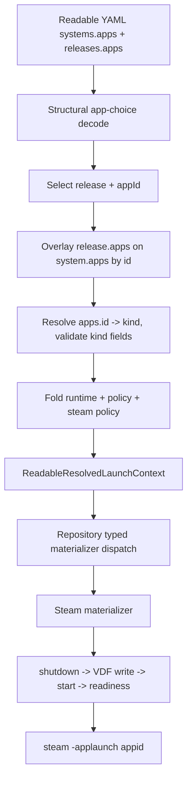

# feat: Add first-class Steam readable-library app choices v1

## Summary

Reshape readable-library launch selection around `apps[]` app choices on systems and releases, then add a first-class `kind: steam` adapter that launches Steam titles through `steam -applaunch <appid>` with Korri-owned LaunchOptions/compat-tool state. App-specific configuration lives inside the selected app choice (referenced by `id`), so Steam-only mechanics never sit loose on a release, and generic game items stay compact.

---

## Problem Frame

The readable library model currently binds each release to a single `app`/`runtime` pair, which makes Steam's real launch surface — per-game compatibility tools and Steam-native LaunchOptions — feel bolted onto a release. The model also lets provenance (`source`) and one-off launch fields leak across records. We want one consistent app-choice grammar where launch behavior is selected by app `id`, Steam is just another adapter, and `%command%` stays Steam's own syntax handled entirely inside `kind: steam`.

---

## Requirements

- R1. Use `apps[]` app choices as the launch-selection grammar on both `systems.<id>` and `releases[]`; remove `release.app`, `release.runtime`, `system.app`, and `system.runtime`.
- R2. App choices are objects that reference a top-level app definition by `id`; `kind` is forbidden on an app choice and lives only on `apps.<id>`.
- R3. Resolve a release's effective app choices by overlaying `release.apps[]` onto inherited `systems.<system>.apps[]` by `id`, with scoped `inherit: false` resetting inherited contributions for a matching app-choice id while preserving the top-level app definition.
- R4. A release is launchable only when it has a `target` and at least one resolvable app choice; metadata-only releases without `target` remain valid and need no app choice.
- R5. Make `apps[]` optional on a release when `systems.<system>.apps[]` already supplies the app choice; allow an explicit single-entry `apps[]`; require an explicit `appId` when more than one app choice resolves.
- R6. Add `kind: steam` with required `state.root`, `extra.args` for Steam client startup, app-level default `runtime`, runtimes carrying absolute `path` plus optional `title`/`tool`, and literal Steam `%command%` `launch-options` on the Steam app/app-choice only.
- R7. Materialize Steam launches as `steam -applaunch <appid>` (appid parsed only from `target: steam://rungameid/<appid>`) after a safe shutdown → VDF write → start → readiness lifecycle, reasserting Korri's desired LaunchOptions/compat-tool state on every launch.
- R8. Keep readiness probing, wrapper provisioning, VDF/localconfig paths, compat-tool mapping, and daemon orchestration as `kind: steam` implementation details, not user-configurable fields.
- R9. Expose `appId` selection through repository/API launch inputs and return actionable app-choice ids in ambiguity errors, without building a picker UI.
- R10. Cover schema, two-stage validation, cascade overlay, pure rendering, stateful materialization, repository/API dispatch, and fixture decoding with focused unit tests.

---

## Scope Boundaries

- This plan does not build a UI picker for multiple app choices; v1 only needs `appId` selection and clear ambiguity errors.
- This plan does not implement Steam account login, first-run bootstrap, client self-update, Proton install UX, or fresh-device Steam setup.
- This plan does not validate Bandai/Sobo hardware behavior or add an ARM64 manual-runtime fallback; v1 implements the canonical `steam -applaunch` path and records ARM64 behavior as a risk.
- This plan does not generalize `%command%` outside `kind: steam`.
- This plan does not add configurable Steam subdirectory paths under `storage`; Steam state resolves from `apps.steam.state.root`.
- This plan does not provide migration tooling for old persisted YAML; the `apps[]` migration is a prerequisite, not part of this plan.
- This plan does not redesign source/provenance modeling; release-level `source` concerns are deferred to a separate pass.
- This plan does not add profile-level or user-level app choices; `apps[]` is only on systems and releases in v1.
- This plan does not optimize Steam mutation away when desired state is unchanged; v1 reasserts every launch.

### Deferred to Follow-Up Work

- `apps[]` migration of existing fixtures/tests/config away from `release.app`/`release.runtime`/`system.app`/`system.runtime` (prerequisite: `01KTWGRD66E7K0G38MJ7GSHG74`).
- Source/provenance modeling revisit (`01KTWPQN3M0TED877M2ESWK4D2`).
- Profile-level singular `app` override (`01KTWNSW2HD32CV1X2ZJ3M4WE3`).
- Polished release/app-choice picker UI in portal home and launch flows.
- SM8550/Bandai validation and any ARM64 fallback materializer.
- Steam first-run/bootstrap flow (seed, self-update, FEX rootfs, Proton ARM64 install).
- Desired-state diffing to skip Steam shutdown/restart when LaunchOptions and compat-tool mapping are already correct.
- App-choice removal operator and same-app variant selection if a concrete need appears.

---

## Context & Research

### Relevant Code and Patterns

- `product/platform/library/config/records/library-item.ts` owns release schema (currently single `app`/`runtime`) and is where `apps[]` app choices land.
- `product/platform/library/config/records/system.ts` owns system records and gains `apps[]` defaults while losing `app`/`runtime`.
- `product/platform/library/config/records/app.ts` owns `AppKind`, kind-specific flat-field validation, and extractors such as `appRyubingPolicyFromRecord`.
- `product/platform/library/config/records/runtime.ts` owns runtime records and absolute `path` validation; gains optional `title`/`tool`.
- `product/platform/library/config/records/source.ts` should stay launch-neutral in this work.
- `product/platform/library/config/inheritable-fields.ts` owns cascadeable policy and `inherit` truncation semantics.
- `product/platform/library/config/cascade-resolver.ts` resolves readable launch contexts and is where app-choice overlay/selection is added.
- `product/platform/library/config/resolved-launch-context.ts` defines the resolved context that must carry the selected app choice, runtime, and Steam policy.
- `product/platform/library/config/playable-id.ts` owns release selection helpers; app-choice selection mirrors it.
- `product/platform/library/config/app-integrations.ts` maps app kinds to integration kinds.
- `product/platform/library/config/app-materializer.ts` contains typed readable materializers, with Ryubing as the closest stateful precedent.
- `product/platform/library/proseql/library-repository.ts` handles release selection, launch resolution, list output, and typed materialization dispatch.
- `product/apps/portal/api/library/launch.rpc-handler.ts` exposes launch inputs and errors.
- `product/platform/stream/ryubing-launch-spec.ts` is the model for a pure first-class app-kind renderer and a `state.root` pattern.
- `docs/brainstorms/2026-06-11-001-steam-readable-library-example.korri.yaml` is the working design example.

### Institutional Learnings

- `docs/solutions/architecture-patterns/steam-applaunch-with-silent-steam-and-per-app-launchoptions-gamescope-wrap-aka-x86-2026-05-27.md`: Steamworks-heavy titles must be launched by Steam itself; `%command%` LaunchOptions is the seam, and VDF must be written only while Steam is fully shut down.
- `docs/solutions/runtime-errors/steam-manual-launch-x86-eager-xwayland-dbus-readiness-2026-05-26.md`: use Steam runtime-launcher D-Bus readiness, not process greps; verify launch via Steam's content log.
- `docs/solutions/best-practices/manual-steam-game-launching-rocknix-arm64-2026-05-04.md`: ARM64/ROCKNIX had a different stable launch shape, so v1 must not overclaim Bandai compatibility.
- `docs/solutions/design-patterns/explicit-cascade-folded-policy-over-incidental-signal-heuristics-2026-05-27.md`: launch behavior should come from explicit cascade-folded policy, not wrapper-side sniffing.
- `work/items/active/01KTVNVZSZ4J4YRZPARV25BK6H-ryubing-app-kind/plan.md`: Ryubing is the app-kind implementation precedent across schema, rendering, materialization, cascade, repository, fixture, and tests.

### External References

- Valve Steam LaunchOptions `%command%` is an external contract preserved verbatim; Korri does not substitute `{...}` placeholders inside `launch-options`.

---

## Key Technical Decisions

- Launch selection grammar is `apps[]` everywhere it can be authored (systems, releases). `release.app`, `release.runtime`, `system.app`, and `system.runtime` are removed; the `apps[]` migration lands first.
- App choices are objects that reference top-level app definitions by `id`. `kind` is forbidden on an app choice; the top-level `apps.<id>.kind` is the single source of truth.
- `id` always references a top-level `apps.<id>` key. Multiple top-level apps may share the same `kind`; resolution is always by `id`, never by kind inference.
- App-choice fields are validated in two stages: structural decode first, then kind-specific validation after `apps[].id → apps.<id>.kind` resolves.
- Release `apps[]` overlays inherited `system.apps[]` by `id`. Scoped `inherit: false` on an app choice drops inherited system/release overlay contributions for that `id` but keeps the top-level app definition. No removal operator in v1.
- Launchability requires `target` plus at least one resolvable app choice. Metadata-only releases without `target` stay valid and need no app choice.
- `apps[]` is optional on a release when `system.apps[]` supplies the choice. Explicit single-entry `apps[]` is allowed. Multiple resolved choices require an explicit `appId`; there is no default marker and no same-app variants.
- Steam state lives at required `apps.steam.state.root` (template tokens like `{storage:steam}` allowed), mirroring Ryubing; sources stay out of launch and there is no magic storage id.
- Steam runtimes use absolute `path` plus optional `title` and Steam-facing `tool`. A Steam-selected runtime without `tool` fails before mutation.
- `launch-options` is valid only on `kind: steam` definitions and Steam app choices, passed verbatim with literal `%command%`; Korri `{...}` placeholders inside it are rejected/warned.
- `extra.args` on Steam means Steam client startup/ensure args. Steam supports `extra.args` but not `extra.config` in v1. `extra.args`/`extra.config` are adapter escape hatches, separate from cascade `inherit`.
- Steam appid is parsed only from `target: steam://rungameid/<appid>`; there is no `appid` field.
- Steam materialization reasserts desired state every launch via shutdown → atomic VDF write → start (with `extra.args`) → readiness → `steam -applaunch <appid>`, using a real VDF parser and a per-Steam-root lock. Desired-state diffing is deferred.
- Launch selection input is `appId`. Ambiguity errors carry the available app-choice ids/kinds; list-output contract is not widened for a deferred picker.
- Reserve singular `app` for a future profile/UI override field; do not use `app` for system/release app selection.
- Add Steam-specific error tags where they improve caller diagnosis instead of a single generic materialization failure.

---

## Open Questions

### Resolved During Planning

- App-choice container name is `apps`; not `launch`, `launches`, `runs`, or `modes`.
- App choices use `id`, not `kind`; `kind` is forbidden on the choice.
- Steam-store releases use `system: steam`; appid comes from `target` only.
- Default Steam runtime lives on `apps.steam.runtime`; Steam state lives on required `apps.steam.state.root`.
- App-specific overrides require an explicit `apps[]` entry; nothing Steam-specific sits loose on a release.
- Sources are launch-neutral; release-level source concerns are deferred to a separate pass.
- Steam mutates VDF every launch via the safe shutdown/write/start/readiness lifecycle.
- `apps[]` is only on systems and releases in v1; profile-level singular `app` is reserved and deferred.
- `%command%` stays literal Steam syntax; readiness/wrapper/VDF details remain implementation-owned.

### Deferred to Implementation

- Final VDF parser dependency choice and helper/adapter names; the plan requires a real VDF parser and atomic writes.
- Exact Steam readiness criterion details and timeout values; implementation should pick conservative defaults and inject deterministic boundaries in tests.
- Exact error payload field shapes for Steam failures, following existing `ResolutionError` conventions.
- Exact merge precedence wiring for app-choice overlay relative to existing inheritable-field folding, validated by cascade tests.

---

## High-Level Technical Design

> *This illustrates the intended approach and is directional guidance for review, not implementation specification. The implementing agent should treat it as context, not code to reproduce.*

Directional app-choice resolution matrix:

| Resolved app choices | Launch input | Outcome |
|---|---|---|
| none, no target | any | metadata-only: not launchable |
| none, has target | any | fail: no resolvable app choice |
| one (system or release) | no `appId` | auto-select the single choice |
| multiple | matching `appId` | select matching choice |
| multiple | no `appId` | fail: ambiguous; error lists available ids |
| release overlays system by id | inherited + override | merge by id; `inherit: false` resets inherited overlay |

---

## Implementation Units

### U1. Reshape system/release schema around `apps[]` app choices

**Goal:** Replace single-app release/system launch fields with `apps[]` app choices that reference top-level app definitions by `id`, validated structurally at decode time.

**Requirements:** R1, R2, R4, R5, R10

**Dependencies:** None (assumes the `apps[]` migration prerequisite has landed)

**Files:**
- Modify: `product/platform/library/config/records/library-item.ts`
- Modify: `product/platform/library/config/records/system.ts`
- Modify: `product/platform/library/config/records/app.ts`
- Modify: `product/platform/library/config/records/runtime.ts`
- Test: `product/platform/library/config/records/library-item.test.ts`
- Test: `product/platform/library/config/records/system.test.ts`
- Test: `product/platform/library/config/records/app.test.ts`
- Test: `product/platform/library/config/records/readable-schema.test.ts`

**Approach:**
- Define an app-choice payload: optional `id`-reference, optional `inherit`, optional `runtime`, optional `launch-options`, common inheritable fields, and structurally-permitted kind-lifted fields. Forbid `kind` on the app choice.
- Add `apps: Schema.optional(Array(AppChoice))` to system and release records; remove `app`/`runtime` from both.
- Reject `release.app`, `release.runtime`, `system.app`, `system.runtime` with clear diagnostics.
- Require `id` on each app choice when a record declares more than one; reject empty `apps: []`.
- Add `steam` to `AppKind` and typed app-field guards; allow `launch-options` and `extra.args` on `kind: steam`; reject `launch-options`/`extra.config` on Steam app choices and `launch-options` on non-Steam kinds.
- Add optional `title` and `tool` to runtimes while preserving absolute `path` validation.
- Add `state` (with required `root` when present) to the Steam app definition shape, mirroring Ryubing.

**Patterns to follow:**
- `RYUBING_APP_FIELD_KEYS` and kind-specific guards in `product/platform/library/config/records/app.ts`.
- Strict decode posture in `product/platform/library/config/records/library-item.ts`.

**Test scenarios:**
- Happy path: a release with `apps: [{ id: "steam" }]` decodes.
- Happy path: a system with `apps: [{ id: "retroarch", runtime: "mgba" }]` decodes.
- Happy path: a Steam app definition with `kind: steam`, `state.root`, `extra.args`, `runtime`, and `launch-options` decodes.
- Happy path: a runtime with `title`, absolute `path`, and Steam-facing `tool` decodes.
- Error path: `kind` present on an app choice fails.
- Error path: `release.app`, `release.runtime`, `system.app`, or `system.runtime` fails.
- Error path: a multi-choice record with a missing or duplicate app-choice `id` fails.
- Error path: empty `apps: []` fails.
- Error path: `launch-options` on a non-Steam app definition fails; `extra.config` on `kind: steam` fails.
- Error path: a runtime with a non-absolute `path` fails.
- Regression: existing Ryubing and RetroArch app-kind fields still decode in their kind contexts.

**Verification:**
- Schema tests lock the `apps[]` grammar, the removal of legacy fields, and Steam-only field gating at decode time.

---

### U2. Resolve app choices through overlay, selection, and two-stage validation

**Goal:** Overlay release `apps[]` onto system `apps[]` by id, select via `appId`, resolve each app choice's top-level `kind`, validate kind-specific fields, and surface the selected app choice in the resolved context.

**Requirements:** R2, R3, R4, R5, R6, R9, R10

**Dependencies:** U1

**Files:**
- Modify: `product/platform/library/config/cascade-resolver.ts`
- Modify: `product/platform/library/config/resolved-launch-context.ts`
- Modify: `product/platform/library/config/inheritable-fields.ts`
- Modify: `product/platform/library/config/playable-id.ts`
- Test: `product/platform/library/config/readable-cascade-resolver.test.ts`
- Test: `product/platform/library/config/playable-id.test.ts`

**Approach:**
- Compute effective app choices by overlaying `release.apps[]` onto `system.apps[]` keyed by `id`; merge fields with more-specific winning; honor scoped `inherit: false` to drop inherited overlay contributions for that `id` while keeping the top-level app definition.
- Add `appId` to readable launch inputs and a `selectAppChoice` helper mirroring release selection: auto-select one, fail on zero (when target present), fail on multiple without `appId`, fail on unknown `appId`.
- Resolve each app choice's kind from `apps.<id>.kind`; fail clearly when the referenced app definition is missing.
- Run kind-specific validation after id resolution (two-stage): reject `launch-options` unless resolved kind is `steam`, etc.
- Define a `SteamPolicy` slot in readable layer views and resolved context (`launch-options` last-wins, `extra.args` concat) so U4 receives effective Steam policy without an ad hoc bridge.
- Resolve runtime from the selected app choice first, then the top-level app definition default; keep `target` release-scoped and non-inheritable.
- Treat launchability as `target` present AND a resolvable app choice present.

**Patterns to follow:**
- Existing release selection in `product/platform/library/config/playable-id.ts`.
- `inherit:false` truncation and policy folding in `product/platform/library/config/cascade-resolver.ts`.
- Ryubing policy thread-through in `product/platform/library/config/readable-cascade-resolver.test.ts`.

**Test scenarios:**
- Happy path: a release with no `apps[]` inherits `system.apps[]` and auto-selects the single choice.
- Happy path: a release `apps[]` entry overlays the inherited system choice by id, keeping inherited `runtime` and adding fields.
- Happy path: `inherit: false` on a release app choice drops the inherited system overlay but keeps the top-level app definition.
- Happy path: a Steam app choice resolves `apps.steam.kind: steam`, inherits app-level `runtime`/`launch-options`, and exposes Steam policy in the context.
- Happy path: a Steam app choice overrides app-level runtime/LaunchOptions.
- Edge case: explicit single-entry `apps[]` resolves identically to inference.
- Error path: multiple resolved choices without `appId` fail with an ambiguity error listing ids.
- Error path: unknown `appId` fails clearly.
- Error path: app choice `id` with no matching top-level `apps.<id>` fails.
- Error path: `launch-options` resolving to a non-Steam kind fails in stage-two validation.
- Error path: a release with `target` but no resolvable app choice is not launchable.
- Regression: metadata-only release without `target` stays valid and needs no app choice.

**Verification:**
- Resolved contexts expose the selected app choice id/kind, effective app descriptor, runtime, Steam policy, and generic fields in the expected order.

---

### U3. Add pure Steam launch-spec and Steam policy rendering

**Goal:** Implement pure helpers for Steam appid parsing, `%command%` LaunchOptions validation, compat-tool mapping inputs, and `steam -applaunch` rendering without touching the filesystem.

**Requirements:** R6, R7, R8, R10

**Dependencies:** U1, U2

**Files:**
- Create: `product/platform/stream/steam-launch-spec.ts`
- Test: `product/platform/stream/steam-launch-spec.test.ts`
- Modify: `product/platform/library/config/errors.ts`

**Approach:**
- Parse only `steam://rungameid/<numeric-appid>`; reject other shapes.
- Render a LaunchSpec using the resolved Steam command and `-applaunch <appid>` plus `extra.args` semantics owned by the materializer (client args, not game args).
- Treat `launch-options` as an opaque Steam string with literal `%command%`; reject/warn on Korri `{...}` tokens.
- Require selected Steam runtimes to carry both absolute `path` and Steam-facing `tool` before compat-tool mapping is planned.
- Add Steam-specific error tags for malformed target, invalid LaunchOptions, and missing runtime tool.

**Patterns to follow:**
- `product/platform/stream/ryubing-launch-spec.ts` for pure renderer boundaries and typed errors.
- Placeholder-resolution tests in `product/platform/library/config/compose-launch-spec.test.ts`.

**Test scenarios:**
- Happy path: `steam://rungameid/2379780` parses to `2379780`.
- Happy path: resolved command renders `steam -applaunch 2379780`.
- Happy path: LaunchOptions with `%command%` passes through unchanged.
- Error path: non-Steam URI or non-numeric/missing appid fails with a Steam appid parse error.
- Error path: LaunchOptions containing Korri `{target}`/`{content.path}` fails or warns per chosen policy.
- Error path: selected Steam runtime without `tool` fails before mutation planning.

**Verification:**
- Pure tests prove the renderer needs no live Steam install and never treats `%command%` as Korri syntax.

---

### U4. Materialize Steam desired state with safe lifecycle and VDF boundaries

**Goal:** Add stateful Steam materialization that reasserts LaunchOptions/compat-tool mapping every launch via shutdown → write → start → readiness, serialized per Steam root, returning the `steam -applaunch` spec.

**Requirements:** R6, R7, R8, R10

**Dependencies:** U1, U2, U3

**Files:**
- Modify: `product/platform/library/config/app-materializer.ts`
- Create: `product/platform/library/config/steam-state-materializer.ts`
- Test: `product/platform/library/config/app-materializer.test.ts`
- Test: `product/platform/library/config/steam-state-materializer.test.ts`
- Modify: `package.json`
- Modify: `bun.lock`
- Modify: `tools/nix/bun-deps/default.nix`

**Approach:**
- Add `materializeReadableSteamLaunch` as a sibling to readable RetroArch/Ryubing materializers.
- Resolve the Steam state root from `apps.steam.state.root` (required), expanding storage tokens; derive standard Steam config paths from that root by convention.
- Add a real VDF parser/serializer dependency and refresh Bun/Nix dependency lock surfaces; do not hand-splice VDF.
- Keep VDF/lock/daemon logic in `steam-state-materializer.ts` because the stateful complexity exceeds Ryubing's config merge and would make `app-materializer.ts` hard to review inline.
- Reassert desired state every launch via the lifecycle: `steam -shutdown` → wait for `steamwebhelper` gone → atomic VDF write of LaunchOptions and compat-tool mapping → start Steam with app-level `extra.args` → wait readiness → return/exec `steam -applaunch <appid>`.
- Serialize the whole sequence with a per-Steam-root lock so concurrent launches cannot race localconfig writes.
- Treat VDF as persistent user state: write atomically, fail before launch on write/parse errors, never roll back successful desired state, never route the Steam root to cleanup/eviction.
- Use injected filesystem/process/clock/lock boundaries so tests do not need a live Steam client; surface typed errors on readiness timeout.

**Patterns to follow:**
- Persistent-state treatment in `materializeReadableRyubingLaunch` within `product/platform/library/config/app-materializer.ts`.
- Atomic write helpers and materialization error wrapping in `product/platform/library/config/app-materializer.ts`.

**Test scenarios:**
- Happy path: materializer reasserts LaunchOptions + compat-tool mapping for a resolved appid and returns `steam -applaunch <appid>`.
- Happy path: app-level `extra.args` drive Steam start, not game launch args.
- Happy path: the lifecycle order is shutdown → wait → write → start → readiness → applaunch.
- Edge case: missing `localconfig.vdf` creates the minimal nested structure for the app entry.
- Edge case: malformed VDF fails with a typed mutation error rather than clobbering the file.
- Error path: missing/required `state.root` fails before mutation.
- Error path: selected runtime path present but lacking `tool` fails before mutation.
- Error path: readiness timeout fails with a Steam-specific error and no successful applaunch spec.
- Integration: two materialization fibers using injected lock/fs/process boundaries serialize through the per-root lock and produce deterministic final VDF state.

**Verification:**
- Stateful materializer tests prove safe reassert-every-launch behavior, lifecycle ordering, and typed failures without a live Steam session.

---

### U5. Wire repository, app integration, and API launch inputs

**Goal:** Dispatch resolved Steam contexts to the Steam materializer and expose `appId` selection through repository and API launch inputs with actionable ambiguity errors.

**Requirements:** R7, R9, R10

**Dependencies:** U1, U2, U3, U4

**Files:**
- Modify: `product/platform/library/config/app-integrations.ts`
- Modify: `product/platform/library/proseql/library-repository.ts`
- Modify: `product/platform/library/library-services.ts`
- Modify: `product/apps/portal/api/library/launch.rpc-handler.ts`
- Test: `product/platform/library/proseql/library-repository.test.ts`
- Test: `product/apps/portal/api/library/launch.rpc-handler.test.ts`

**Approach:**
- Add `steam` to app integration mapping and dispatch readable Steam contexts to `materializeReadableSteamLaunch`.
- Add `appId` to repository/API launch inputs so callers can choose among resolved app choices.
- Return available app-choice ids/kinds in ambiguity errors so callers can retry explicitly, without widening the stable list-output contract for a deferred picker.
- Preserve single-choice behavior by auto-selecting; route ambiguity through existing launch RPC error surfaces.

**Patterns to follow:**
- Release-aware launch inputs and ambiguity tests in `product/platform/library/proseql/library-repository.test.ts`.
- Launch RPC validation/error tests in `product/apps/portal/api/library/launch.rpc-handler.test.ts`.

**Test scenarios:**
- Happy path: launching a Steam release without `appId` (single resolved choice) dispatches to Steam materialization.
- Happy path: launching a multi-choice release with `appId` selects the requested choice.
- Happy path: ambiguity errors include available app-choice ids/kinds.
- Error path: launching a multi-choice release without `appId` returns an ambiguity error.
- Error path: an unknown `appId` returns a clear launch error.
- Regression: a single RetroArch app choice launches through the RetroArch materializer.
- Regression: a single Ryubing app choice launches through the Ryubing materializer.

**Verification:**
- Repository and RPC tests prove `appId` selection is reachable from public launch inputs without regressing existing app kinds.

---

### U6. Promote the Steam readable-library fixture and docs example

**Goal:** Turn the brainstorm YAML into a schema-backed fixture and document the v1 Steam authoring contract without exposing implementation-only details.

**Requirements:** R1, R2, R5, R6, R8, R10

**Dependencies:** U1, U2, U3, U4, U5

**Files:**
- Create: `product/platform/library/config/fixtures/steam-full.korri.yaml`
- Modify: `docs/brainstorms/2026-06-11-001-steam-readable-library-example.korri.yaml`
- Modify: `product/platform/library/config/records/readable-schema.test.ts`
- Modify: `product/platform/library/config/authoring/examples.test.ts`

**Approach:**
- Promote a concise fixture covering: `system: steam` with `systems.steam.apps[]`, a `kind: steam` app with `state.root`/`extra.args`/`runtime`/`launch-options`, runtime `path`/`title`/`tool`, a minimal release inheriting the system app choice, a release overriding runtime/LaunchOptions via `apps[]`, a multi-choice non-Steam release, and a metadata-only release.
- Rewrite the brainstorm example to the final grammar: `apps[]` by `id`, `system: steam`, no release-level `source`/`launch-options`, no `kind` on app choices, Steam state via `apps.steam.state.root`.
- Keep comments explicit that readiness probing, VDF paths, wrapper provisioning, and daemon orchestration are implementation-owned.

**Patterns to follow:**
- `product/platform/library/config/fixtures/ryubing-full.korri.yaml` and its decode coverage.
- Authoring examples in `product/platform/library/config/authoring/examples.test.ts`.

**Test scenarios:**
- Happy path: `steam-full.korri.yaml` decodes through host/storage/systems/apps/runtimes/library.
- Happy path: fixture release inherits system app choice with no `apps[]`.
- Happy path: fixture release overrides runtime/LaunchOptions via `apps[]`.
- Happy path: fixture contains a non-Steam multi-choice release and a metadata-only release.
- Error path: authoring examples reject legacy `release.app`/`system.app`/`kind`-on-choice shapes.

**Verification:**
- Fixture and authoring tests make the documented v1 grammar executable as a schema contract.

---

## System-Wide Impact

- **Interaction graph:** YAML decode, two-stage validation, cascade overlay/selection, repository launch resolution, launch RPC payloads, typed materializers, and stream rendering all participate in the new app-choice flow.
- **Error propagation:** Steam parse, readiness, runtime-tool, and VDF failures surface as typed errors RPC handlers can render distinctly; app-choice ambiguity errors carry recoverable ids.
- **State lifecycle risks:** Steam VDF/localconfig is persistent account state. Atomic writes, real VDF parsing, per-root locking, and the shutdown-before-write rule are required to avoid corruption and races.
- **API surface parity:** Repository and portal launch inputs share the same `appId` selector; future CLI/agent surfaces should reuse it rather than inventing alternates.
- **Integration coverage:** Schema/cascade/rendering are unit-covered; materializer tests inject fs/process/clock/lock boundaries. Real Steam device validation is follow-up because x86 and SM8550 differ historically.
- **Unchanged invariants:** `target` stays release-scoped and non-inheritable; file targets still resolve through storage; service targets still pass through. Steam appid parsing stays a Steam-materializer concern. Sources remain launch-neutral.

---

## Risks & Dependencies

| Risk | Mitigation |
|------|------------|
| `apps[]` grammar is a broad schema break across systems and releases | Land the `apps[]` migration (`01KTWGRD66E7K0G38MJ7GSHG74`) first; treat this plan as building on the migrated schema. |
| Two-stage validation (decode then id-resolution) hides kind errors until resolution | Cover stage-two rejection explicitly in cascade tests; keep decode-time structural checks strict. |
| Steam VDF writes corrupt or race user state | Real VDF parser, atomic writes, shutdown-before-write, per-Steam-root lock; test malformed/concurrent cases. |
| Reassert-every-launch causes frequent Steam restarts | Accepted for v1 correctness; desired-state diffing is a documented follow-up. |
| `steam -applaunch` works on x86 but not SM8550 | Keep schema platform-agnostic; defer hardware validation and any ARM64 fallback. |
| `steam -applaunch` returns success even when Steam silently drops the launch | Treat v1 completion as command/materialization success; defer content-log confirmation to follow-up. |
| Runtime `path` and Steam `tool` drift | Require `tool` when a runtime is selected by `kind: steam`; verify path separately from tool id. |
| Deferred source/provenance decisions leak into this work | Keep sources launch-neutral here; route provenance questions to `01KTWPQN3M0TED877M2ESWK4D2`. |

---

## Documentation / Operational Notes

- Fixture and brainstorm example must show `apps[]` by `id`, `system: steam`, and `apps.steam.state.root`, and explain that `%command%` is verbatim Steam syntax.
- Developer comments should state that readiness probing and VDF paths are implementation-owned, not YAML knobs.
- Notes should make clear x86/AKA is the proven path and SM8550/Bandai validation is separate follow-up.

---

## Sources & References

- Working example: `docs/brainstorms/2026-06-11-001-steam-readable-library-example.korri.yaml`
- Prerequisite migration: backlog `01KTWGRD66E7K0G38MJ7GSHG74`
- Deferred source modeling: backlog `01KTWPQN3M0TED877M2ESWK4D2`
- Deferred profile override: backlog `01KTWNSW2HD32CV1X2ZJ3M4WE3`
- Related plan: `work/items/active/01KTVNVZSZ4J4YRZPARV25BK6H-ryubing-app-kind/plan.md`
- Related code: `product/platform/library/config/records/library-item.ts`
- Related code: `product/platform/library/config/records/system.ts`
- Related code: `product/platform/library/config/cascade-resolver.ts`
- Related code: `product/platform/library/config/app-materializer.ts`
- Related code: `product/platform/library/proseql/library-repository.ts`
- Related code: `product/apps/portal/api/library/launch.rpc-handler.ts`
- Institutional learning: `docs/solutions/architecture-patterns/steam-applaunch-with-silent-steam-and-per-app-launchoptions-gamescope-wrap-aka-x86-2026-05-27.md`
- Institutional learning: `docs/solutions/runtime-errors/steam-manual-launch-x86-eager-xwayland-dbus-readiness-2026-05-26.md`
- Institutional learning: `docs/solutions/best-practices/manual-steam-game-launching-rocknix-arm64-2026-05-04.md`
- Institutional learning: `docs/solutions/design-patterns/explicit-cascade-folded-policy-over-incidental-signal-heuristics-2026-05-27.md`
