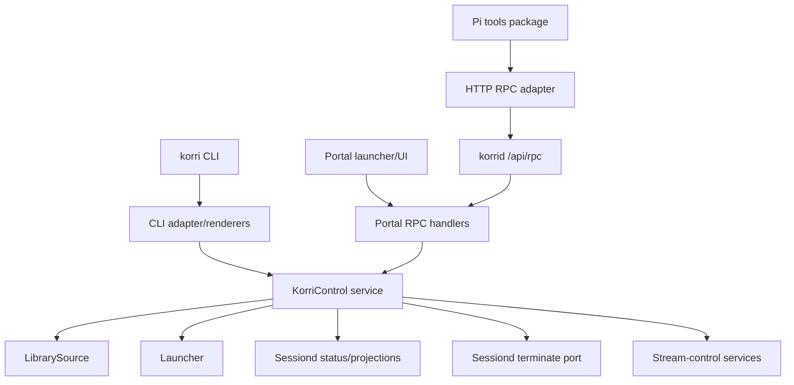
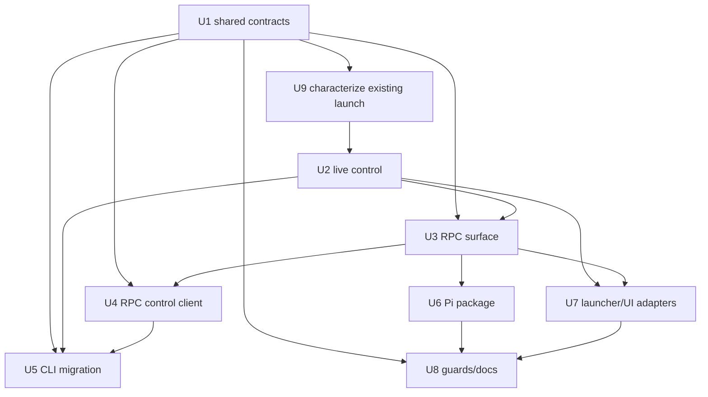

# feat: Productize shared Korri control tooling

## Summary

Introduce a shared Korri control layer that owns active-use workflows once, then adapt the user-facing `korri` CLI, launcher/UI RPC handlers, and Pi tools onto that layer. Productize the Pi tooling as a reusable package under `.pi/packages/` so repo-local `.pi/*` files become thin package shims and other consumers can install the same active-use tools.

---

## Problem Frame

Korri currently has several paths for the same user intent: CLI commands launch or prepare games directly, portal RPC handlers perform sessiond-aware launch orchestration, and Pi tools hand-roll raw HTTP calls to korrid. That creates behavior drift for active-use operations such as finding games, launching a game, checking the current session, stopping a session, and inspecting stream state.

---

## Requirements

- R1. Provide one shared control/use-case layer for active-use Korri operations rather than duplicating orchestration in CLI, launcher/UI handlers, and Pi tools.
- R2. Preserve sessiond as the source of truth for foreground lifecycle state; tools must not maintain independent session state.
- R3. Support active-use operations for list/find games, dry-run launch, launch game, current session lifecycle status, graceful and force stop session, daemon health status, and stream runtime-settings status.
- R4. Keep the user-facing `korri` CLI as a thin adapter over shared control behavior while preserving clear terminal output and exit-code adaptation.
- R5. Keep launcher/UI and daemon RPC handlers as thin adapters over the same shared control behavior.
- R6. Productize reusable Pi tooling as a Pi package, with repo-local `.pi/*` delegating to the package so other consumers can reuse it.
- R7. Keep Pi extension runtime dependencies portable: Pi tools may call daemon RPC over HTTP, but must not rely on repo path aliases or product app internals at extension load time.
- R8. Define typed, discriminated request/result shapes for shared control outcomes so CLI, RPC, UI, and Pi adapters render the same state and failure vocabulary in surface-appropriate ways.

---

## Scope Boundaries

- This plan does not implement the tooling; it defines the implementation shape and sequencing.
- This plan does not redesign readable library configuration; it uses existing `LibrarySource` listing and launch-resolution behavior to support list, find, dry-run, and launch operations.
- This plan does not replace the existing Effect RPC transport or `/api/rpc` envelope.
- This plan does not make the Pi extension import Korri repo aliases directly; extension portability is preserved through HTTP RPC and package-local helpers.
- This plan does not solve the Steam lifecycle no-op caveat, except that dry-run/launch results should surface materialization and lifecycle caveats clearly.

### Deferred to Follow-Up Work

- Publishing the Pi package to a remote package registry or external distribution channel; this plan creates a reusable repo package shape and local package docs.
- A full public Korri SDK beyond the shared control contracts and Pi package wrappers.
- Rich UI affordances for every new active-use operation; this plan focuses on shared control behavior, daemon RPCs, CLI adaptation, and Pi tooling parity.

---

## Context & Research

### Relevant Code and Patterns

- `AGENTS.md` establishes `product/platform/*` as shared runtime code, `product/apps/*` as application surfaces, and RPC files organized as `<concept>.rpc.ts` / `<concept>.rpc-handler.ts`.
- `product/platform/library/library-services.ts` defines `LibrarySource`, `Launcher`, `ResolveLaunchInputs`, and `ResolvedLaunch` contracts that should remain core dependencies for launch resolution.
- `product/apps/portal/api/library/launch.rpc.ts` and `product/apps/portal/api/library/launch.rpc-handler.ts` define the existing sessiond-aware launch RPC and response vocabulary.
- `product/apps/portal/api/server/status.rpc.ts` and `product/apps/portal/api/server/status.rpc-handler.ts` already expose daemon/sessiond status through `app.server.status`.
- `product/platform/library/sessiond-managed-launch-client.ts`, `product/platform/library/sessiond-managed-launch-protocol.ts`, and `product/platform/library/sessiond-lifecycle-projections.ts` are the sessiond protocol/projection seams to reuse for session status and stop behavior.
- `product/apps/cli/korri-cli.ts`, `product/apps/cli/source-aware-play.ts`, `product/apps/cli/stream-launch.ts`, `product/apps/cli/remote-stream-launch.ts`, and `product/apps/cli/source-aware-games.ts` contain the current scattered CLI orchestration to migrate behind shared use cases.
- `product/apps/portal/features/home/library-source-layer-rpc.ts` and `product/apps/portal/features/home/launcher-layer-rpc.ts` show the existing renderer-to-RPC adapter pattern.
- `.pi/extensions/korrid-tools.ts` is the current repo-local Pi extension; `.pi/packages/feature-gates/package.json` demonstrates the local Pi package convention using `keywords: ["pi-package"]` and `pi.extensions` / `pi.skills` entries.

### Institutional Learnings

- `docs/solutions/architecture-patterns/sessiond-operator-model-2026-05-29.md`: sessiond exposes the foreground managed-launch protocol; tooling should use the established lifecycle vocabulary and identity correlators rather than inventing a parallel state model.
- `docs/solutions/architecture-patterns/physical-host-foreground-lifecycle-truth-is-sessiond-2026-05-29.md`: foreground lifecycle truth belongs to sessiond; CLI/Pi tooling must not become a third lifecycle authority.
- `docs/solutions/best-practices/product-owned-composition-keeps-shared-layers-reusable-2026-05-03.md`: shared layers must not import product-specific endpoint definitions; product/app surfaces own composition.
- `docs/solutions/design-patterns/explicit-cascade-folded-policy-over-incidental-signal-heuristics-2026-05-27.md`: dry-run launch should reuse explicit resolved policy, not infer behavior from argv/env sniffing at the edge.

### External References

- External research was intentionally skipped. The repo already has strong local patterns for Effect services/layers, RPC handlers, sessiond lifecycle, CLI command wiring, and Pi package structure.

---

## Key Technical Decisions

- Create shared control contracts in `product/platform/control/`: This keeps active-use semantics below app surfaces and available to CLI, daemon handlers, and future adapters without importing from `product/apps/*`.
- Keep product-owned composition at adapters: shared control contracts define operations and domain result shapes; portal RPC groups, CLI commands, and Pi package registrations choose which operations to expose and how to render them.
- Use `app.server.status` / sessiond projections for current-session lifecycle: `app.stream-control.state.get` remains runtime stream-control settings, not "current game/session" state.
- Add a daemon RPC for stop-session behavior: remote CLI and Pi tools cannot safely stop a session without a korrid RPC surface that resolves the active session and calls sessiond through the host authority. The stop contract includes a `force` intent for hung-game recovery, but adapters must require explicit user/operator confirmation before invoking it.
- Implement dry-run as resolution plus preflight diagnostics, not a wrapper around command execution: dry-run returns resolved launch details and session readiness without spawning or relying on shell interception. For remote-source launches, session readiness means the local Moonlight/foreground host; remote peer reachability is a separate limited check.
- Make shared control result contracts canonical for product code: Effect RPC schemas and CLI renderers adapt from `product/platform/control` result vocabulary. RPC-backed control clients live in app-owned adapter code where importing RPC groups is legal. The Pi package remains raw-HTTP for portability, but its package-local tag/payload helpers and docs mirror those canonical contracts and should be parity-tested against the daemon RPC surface.
- Define find semantics once in shared control: exact playable id wins first; otherwise case-insensitive id/title matching may return one match, no match, or an explicit ambiguous result with candidates.
- Define session status as a focused lifecycle projection: configured/not-configured, mode, active launch identity when present, restore attempts, and safe diagnostic summary when available. This is distinct from daemon health and stream runtime settings.
- Keep one foreground owner per daemon process: daemon composition constructs and provides the foreground owner/host once, `KorriControlLive` consumes it, and tests use explicit in-memory/configured owners rather than constructing hidden second owners.
- Keep Pi extension code raw-HTTP and package-local: Pi extensions should not import Effect, path aliases, or app internals; their shared underpinnings are the daemon RPC protocol and package helpers.
- Preserve `profileId` as the canonical launch selector while bridging deprecated `presetId` only at wire edges that still need compatibility.

### Control contract notes

The exact schemas belong in U1/U3, but the plan fixes these semantics so adapters do not drift:

| Result family | CLI outcome class | Pi `isError` expectation | Notes |
|---|---|---|---|
| Launched / dry-run ok / status ok / stopped / nothing-to-stop | Success | `false` | `NothingToStop` is idempotent success for configured hosts with no active launch. |
| Ambiguous find / missing query / confirmation missing | Usage or user-choice required | `true` | Non-interactive callers must provide explicit ids/queries and confirmation for mutation. |
| Not found | User data miss | `true` | Render candidate guidance when possible. |
| Config failure / unsupported dry-run check | Configuration or limited-support diagnostic | `true` for failed operation; `false` for dry-run with caveats | Dry-run may succeed with explicit caveats when no mutation occurred. |
| Host unavailable / sessiond not configured | Host/control unavailable | `true` | `SessiondNotConfigured` is distinct from idle/no-active-session. |
| Preflight rejected / daemon rejected / launch failed | Launch/session failure | `true` | Preserve compatibility with existing launch RPC response tags. |

`app.session.status` should be a focused lifecycle projection rather than a full daemon status dump: configured/not-configured, lifecycle mode, active launch identity when available (`launchId`, game id/title if known), restore attempts, and a bounded diagnostic summary when already exposed by existing status projection. Daemon health and stream runtime settings remain separate operations.

---

## Open Questions

### Resolved During Planning

- Should the Pi tooling be repo-local only or productized? Productize it as `.pi/packages/korrid-tools/`, with repo-local `.pi/extensions/*` reduced to a shim or removed when package discovery supports the package directly.
- Should current session use stream-control state? No. Current session uses daemon/sessiond status; stream-control state remains a separate runtime-settings inspection operation.
- Should Pi tools import Korri TypeScript aliases directly? No. The previous load failure demonstrated that extension runtime module resolution differs from repo runtime resolution.
- What are find semantics? Exact playable id wins first; otherwise case-insensitive id/title matching may produce one match, no match, or an explicit ambiguous result with candidates.
- Should session status distinguish not-configured from idle? Yes. The launch preflight seam may treat not-configured as locally idle, but user-facing session status/stop results must expose `SessiondNotConfigured` separately from `NothingToStop`.
- Is force-stop in scope? Yes, as a `force` intent for stuck sessions, gated by explicit confirmation at CLI/Pi adapter surfaces rather than heavyweight authentication in this active-development phase.

### Deferred to Implementation

- Exact names of helper functions inside `product/platform/control/`: naming should follow surrounding files once implementation starts.
- Whether repo-local `.pi/extensions/korrid-tools.ts` remains as a compatibility shim or package discovery can load `.pi/packages/korrid-tools` directly in this repo: implementation should verify Pi's package loading behavior before deleting the shim.

---

## Output Structure

    product/platform/control/
      control-requests.ts
      control-results.ts
      foreground-session-host.ts
      local-foreground-launch-adapter.ts
      korri-control.ts
      korri-control-live.ts
      korri-control.test.ts
      korri-control-live.test.ts
    product/apps/portal/control/
      korri-control-rpc.ts
      korri-control-rpc.test.ts
    product/apps/portal/api/session/
      status.rpc.ts
      status.rpc-handler.ts
      stop.rpc.ts
      stop.rpc-handler.ts
      session.rpc-handler.test.ts
    .pi/packages/korrid-tools/
      package.json
      extensions/
        korrid-tools.ts
      skills/
        korrid-tools/
          SKILL.md
      README.md

This tree is the expected shape, not a constraint. Implementation may split files differently if existing module boundaries make a smaller change clearer.

---

## High-Level Technical Design

> *This illustrates the intended approach and is directional guidance for review, not implementation specification. The implementing agent should treat it as context, not code to reproduce.*

The shared control layer owns use-case semantics and typed results. CLI and portal can run it with live layers on the host; remote/Pi consumers call daemon RPC so host-local sessiond authority remains on the machine that owns the foreground session.

---

## Implementation Units

### U1. Define shared control contracts and result vocabulary

**Goal:** Establish the platform-level request/result types and `KorriControl` service contract for active-use operations without moving existing behavior yet.

**Requirements:** R1, R3, R8

**Dependencies:** None

**Files:**
- Create: `product/platform/control/control-requests.ts`
- Create: `product/platform/control/control-results.ts`
- Create: `product/platform/control/korri-control.ts`
- Test: `product/platform/control/korri-control.test.ts`

**Approach:**
- Define discriminated request/result shapes for list/find games, dry-run launch, launch game, current session lifecycle status, stop session, daemon health status, and stream runtime-settings status.
- Keep request shapes close to existing `ResolveLaunchInputs` and `LaunchLibraryPayload` concepts, but do not expose deprecated `presetId` as a primary shared-control field.
- Model result failures explicitly: not found, ambiguous match, configuration failure, host unavailable, preflight rejected, daemon rejected, launch failed, nothing to stop, sessiond not configured, and unsupported operation.
- Include result metadata that adapters need for consistent rendering: recommended CLI outcome class, Pi `isError` expectation, mutability/confirmation classification for launch/stop, and compatibility mapping to existing launch RPC responses.
- Keep the service interface in platform code and free of imports from `product/apps/*`.

**Patterns to follow:**
- `product/platform/library/library-services.ts`
- `product/platform/library/sessiond-managed-launch-protocol.ts`
- `product/apps/portal/api/library/launch.rpc.ts`

**Test scenarios:**
- Happy path: a launch request with `id`, `releaseId`, `appId`, `userId`, and `profileId` encodes as a stable shared-control request without needing `presetId`.
- Happy path: find with an exact playable id returns that entry even when titles contain similar text.
- Edge case: title/id substring matching with multiple candidates returns an ambiguous result with candidate ids/titles/sources rather than selecting arbitrarily.
- Edge case: no find matches returns a typed not-found result.
- Error path: launch/session failures are represented as discriminated results rather than thrown generic errors when they are expected domain outcomes.
- Adapter semantics: shared result variants map to a documented CLI outcome class and Pi `isError` expectation.
- Boundary guard: `product/platform/control/*` has no imports from `product/apps/*` or `.pi/*`.

**Verification:**
- The shared contracts compile independently of app-specific RPC files.
- Tests prove the shared result vocabulary can represent the existing launch RPC success/failure shapes and the planned stop/dry-run outcomes.

---

### U9. Characterize existing launch and session behavior

**Goal:** Lock down current portal launch/session behavior before extracting foreground ownership and launch orchestration into shared control.

**Requirements:** R1, R2, R5, R8

**Dependencies:** U1

**Files:**
- Modify: `product/apps/portal/api/library/launch.rpc-handler.test.ts`
- Modify: `product/apps/portal/api/server/status.rpc-handler.test.ts`
- Modify: `product/apps/portal/features/home/library-rpc-layers.test.ts`

**Approach:**
- Add characterization coverage for existing `app.library.launch` local success, local configuration failure, preflight rejection, daemon rejection, and remote-source routing before moving foreground owner code.
- Characterize `app.server.status` sessiond projection enough to preserve current lifecycle vocabulary when `app.session.status` is introduced.
- Characterize source-aware renderer/launcher RPC behavior so U7 can prove adapter parity after delegation.

**Execution note:** Start with characterization tests before moving files or changing launch orchestration.

**Patterns to follow:**
- `product/apps/portal/api/library/launch.rpc-handler.test.ts`
- `product/apps/portal/api/server/status.rpc-handler.test.ts`
- `product/apps/portal/features/home/library-rpc-layers.test.ts`

**Test scenarios:**
- Happy path: current local launch returns the existing accepted/launched response shape.
- Error path: current config failure, preflight rejection, daemon rejection, host unavailable, and process launch failure map to their existing response tags/fields.
- Integration: source-tagged remote launch still routes through remote prepare and local Moonlight launch rather than local game spawn.
- Status: current server status response preserves sessiond mode and active launch summary for idle and active states.

**Verification:**
- Existing behavior is captured before shared-control extraction, reducing the risk of accidental response or lifecycle drift.

---

### U2. Implement live KorriControl for local host behavior

**Goal:** Provide the host-local implementation of `KorriControl` by delegating to existing platform services and sessiond seams.

**Requirements:** R1, R2, R3, R8

**Dependencies:** U9

**Files:**
- Create: `product/platform/control/korri-control-live.ts`
- Move/Refactor: `product/apps/portal/api/library/local-foreground-launch-adapter.ts` → `product/platform/control/local-foreground-launch-adapter.ts`
- Move/Refactor: `product/apps/portal/api/library/foreground-session-host-layer.ts` → `product/platform/control/foreground-session-host.ts`
- Test: `product/platform/control/korri-control-live.test.ts`
- Test: `product/apps/portal/api/library/launch.rpc-handler.test.ts`

**Approach:**
- Implement list/find through `LibrarySource.listPlayableEntries` when available, with a fallback to display-compatible `LibrarySource.list` only where existing callers still require it.
- Implement dry-run through `LibrarySource.resolveLaunchForGame` plus sessiond readiness probing/projection; do not spawn and do not infer command behavior from argv.
- Implement launch through the same foreground/sessiond-aware pipeline used by the portal today, with exactly one foreground owner per daemon process. Move the foreground host/owner adapter into `product/platform/control/` and reparameterize it around shared `ControlLaunchResult` shapes; the portal handler should map shared results to `LaunchLibraryResponse` at the RPC edge. Do not create a second owner inside `KorriControlLive`.
- Implement current session through sessiond status/projection APIs rather than stream-control state; distinguish not-configured from configured-but-idle.
- Implement daemon health status and stream runtime-settings status as separate control operations. Daemon health may wrap the existing server-status projection, while stream runtime settings should use the stream-control service rather than session lifecycle state.
- Implement stop session through the sessiond terminate client, resolving the active launch on the host side to avoid forcing remote/Pi callers into a read-then-write race. Include graceful and force intents; force is available only when the adapter passed explicit confirmation.
- Define remote-source dry-run as non-mutating: resolve local Moonlight policy, probe local foreground/sessiond readiness for where Moonlight would run, and report remote peer reachability/status separately. Do not call peer prepare or write launch intents; return a typed limited/unsupported diagnostic for checks that require mutation.

**Execution note:** Add characterization coverage around current portal launch handling before extracting shared launch behavior.

**Patterns to follow:**
- `product/apps/portal/api/library/launch.rpc-handler.ts`
- `product/apps/portal/api/library/local-foreground-launch-adapter.ts`
- `product/platform/stream/foreground-session-owner.ts`
- `product/platform/library/sessiond-managed-launch-client.ts`
- `product/platform/library/sessiond-lifecycle-projections.ts`

**Test scenarios:**
- Happy path: list/find returns playable entries from `LibrarySource.listPlayableEntries` and finds exact id matches before case-insensitive id/title matches.
- Happy path: dry-run for a launchable local game returns resolved launch details and session readiness without invoking `Launcher.run` or `Launcher.spawn`.
- Happy path: launch delegates to managed spawn when `Launcher.spawn` exists and returns a launched result matching existing portal behavior.
- Happy path: stop session resolves the active session id on the host and calls the sessiond terminate seam.
- Happy path: daemon health status and stream runtime-settings status return separate results with distinct terminology.
- Edge case: stop session when no session is active returns a structured `NothingToStop`/no-op result rather than a generic failure.
- Edge case: stop session and current session on a host with sessiond not configured return `SessiondNotConfigured`, not `NothingToStop` and not idle.
- Edge case: force stop is represented separately from graceful stop and requires an explicitly confirmed request.
- Error path: sessiond unavailable during launch preflight maps to host-unavailable/preflight-rejected vocabulary consistently with existing launch RPC responses.
- Error path: library configuration failures during dry-run or launch return configuration diagnostics without spawning.
- Remote-source path: dry-run for a remote-source entry does not call peer prepare or write a launch intent; it reports local Moonlight policy plus a limited/unsupported diagnostic for mutation-only checks.
- Integration: existing `app.library.launch` tests still pass when the handler delegates to `KorriControl` rather than owning orchestration inline.

**Verification:**
- Local control behavior matches existing portal launch semantics for success and failure.
- No new lifecycle authority is introduced outside sessiond/projection seams.

---

### U3. Add RPC surface for shared active-use control

**Goal:** Expose missing daemon RPCs and refactor existing handlers so remote callers, portal UI, and Pi tools can reach shared control behavior through korrid.

**Requirements:** R2, R3, R5, R8

**Dependencies:** U1, U2

**Files:**
- Create: `product/apps/portal/api/session/status.rpc.ts`
- Create: `product/apps/portal/api/session/status.rpc-handler.ts`
- Create: `product/apps/portal/api/session/stop.rpc.ts`
- Create: `product/apps/portal/api/session/stop.rpc-handler.ts`
- Modify: `product/apps/portal/api/server/rpc-group.ts`
- Modify: `product/apps/portal/api/server/rpc-server.ts`
- Modify: `product/apps/portal/api/library/list.rpc-handler.ts`
- Modify: `product/apps/portal/api/library/launch.rpc-handler.ts`
- Modify: `product/apps/portal/api/server/status.rpc-handler.ts`
- Test: `product/apps/portal/api/session/session.rpc-handler.test.ts`
- Test: `product/apps/portal/api/server/rpc-server.test.ts`
- Test: `product/apps/portal/api/library/launch.rpc-handler.test.ts`

**Approach:**
- Add dedicated `app.session.status` and `app.session.stop` RPCs. `app.server.status` remains the broad daemon health endpoint; `app.session.status` is the focused active-use lifecycle projection with configured/not-configured, mode, active launch identity when available, restore attempts, and diagnostic summary when available.
- Keep `app.stream-control.state.get` scoped to stream-control settings and avoid naming it as current-session state.
- Refactor `app.library.launch` and `app.library.list` handlers to delegate to `KorriControl` where their semantics overlap.
- Register new session RPCs in the server RPC surface (`product/apps/portal/api/server/rpc-group.ts` and server handler wiring) because they are daemon/host-authority operations like `app.server.status`. Do not add them to `app-rpc-group.ts` unless implementation discovers an existing app-surface consumer that requires the same contract.
- Preserve additive schema evolution: new fields optional by default and errors represented through existing `ApiError`/domain result conventions.

**Patterns to follow:**
- `product/apps/portal/api/server/status.rpc.ts`
- `product/apps/portal/api/server/status.rpc-handler.ts`
- `product/apps/portal/api/stream-control/get-state.rpc.ts`
- `product/apps/portal/api/server/rpc-group.ts`

**Test scenarios:**
- Happy path: `app.session.status` returns the focused session lifecycle projection for active, idle, and not-configured sessiond states.
- Happy path: `app.session.stop` returns `stopped`/`nothing-to-stop`/`sessiond-not-configured` structured results for active, inactive, and not-configured sessions.
- Happy path: force stop passes a force intent through only when the request carries explicit confirmation.
- Happy path: `app.library.launch` still accepts existing payloads and returns existing launched/failed response shapes after delegation.
- Edge case: stop-session handles a session that disappears between status resolution and terminate by returning a stable no-op/race-safe result.
- Error path: sessiond unavailable maps to a typed unavailable/host-control-disabled failure rather than an unstructured exception.
- Contract: `serverRpcGroup` includes the new session RPC tags and existing tags remain registered.
- Contract: `app.session.status` exposes the focused lifecycle projection and does not forward the full daemon health or stream runtime-settings payload.
- Compatibility: `presetId` wire fields remain accepted where existing RPC schemas expose them, while shared-control internals prefer `profileId`.

**Verification:**
- Remote HTTP callers can get current session and stop session through korrid without direct access to sessiond sockets.
- Existing library list/launch RPC behavior remains compatible for current portal and renderer callers.

---

### U4. Add app-owned RPC-backed KorriControl client for remote consumers

**Goal:** Provide a reusable app-owned client-side implementation of `KorriControl` that talks to korrid RPC, so CLI remote mode and package tooling share tag/payload/result conventions without violating platform import boundaries.

**Requirements:** R1, R3, R4, R7, R8

**Dependencies:** U1, U3

**Files:**
- Create: `product/apps/portal/control/korri-control-rpc.ts`
- Modify: `product/apps/portal/stream/remote-stream-client.ts`
- Test: `product/apps/portal/control/korri-control-rpc.test.ts`
- Test: `product/apps/cli/remote-stream-control-client.test.ts`

**Approach:**
- Mirror the `remote-stream-client` pattern in app-owned code: normalize base URLs to `/api/rpc`, use the typed Effect RPC client inside product/runtime code, import server RPC groups from the app layer where legal, and expose `KorriControl` operations.
- Limit `remote-stream-client.ts` changes to shared URL/RPC helper extraction or delegation for overlapping operations. Existing stream-prepare callers must keep their current behavior unless a test proves an intentional compatibility change.
- Keep this RPC-backed service in app-owned product code for CLI/desktop/runtime consumers. The Pi package can copy the protocol constants or use package-local raw HTTP helpers, but should not load this Effect implementation directly.
- Provide clear failure mapping for host unreachable, RPC decoding errors, and domain-level rejections.
- Avoid browser-only assumptions such as `localStorage`; use a Node-safe RPC layer for CLI consumers.

**Patterns to follow:**
- `product/apps/portal/stream/remote-stream-client.ts`
- `product/platform/api/rpc/client-layer.ts`
- `product/apps/portal/features/home/library-source-layer-rpc.ts`

**Test scenarios:**
- Happy path: RPC control client maps list/find/dry-run/launch/session status/stop/daemon status/stream runtime-settings calls to the expected RPC tags and payload shapes.
- Edge case: base URLs with and without `/api/rpc` normalize to the same endpoint.
- Error path: unreachable host returns host-unavailable/control-unavailable result instead of throwing an unclassified error to adapters.
- Error path: unknown or unsupported daemon response maps to a typed protocol failure with diagnostic context.
- Integration: CLI remote-stream client tests continue to pass if they are migrated to the new control RPC client or wrap it.

**Verification:**
- Product runtime consumers can use one app-owned RPC-backed control service for remote hosts without weakening `product/platform/control` import boundaries.
- Pi package design remains decoupled from product runtime imports.

---

### U5. Refactor the `korri` CLI onto KorriControl

**Goal:** Make user-facing CLI commands thin adapters over shared control operations while preserving interactive terminal UX where appropriate.

**Requirements:** R1, R3, R4, R8

**Dependencies:** U1, U2, U4

**Files:**
- Modify: `product/apps/cli/korri-cli.ts`
- Modify: `product/apps/cli/source-aware-play.ts`
- Modify: `product/apps/cli/stream-launch.ts`
- Modify: `product/apps/cli/remote-stream-launch.ts`
- Modify: `product/apps/cli/source-aware-games.ts`
- Create: `product/apps/cli/control-renderers.ts`
- Test: `product/apps/cli/korri-cli.test.ts`
- Test: `product/apps/cli/source-aware-play.test.ts`
- Test: `product/apps/cli/stream-launch.test.ts`
- Test: `product/apps/cli/remote-stream-launch.test.ts`

**Approach:**
- Introduce or refactor commands around shared control operations: games list/find, launch, launch dry-run, session status, session stop, daemon status, and stream runtime-settings status.
- Keep CLI-specific concerns local: argument parsing, TTY game picker, output formatting, confirmation prompts, and numeric exit-code mapping. Use the shared result adapter semantics rather than inventing per-command failure classes.
- Use live `KorriControl` for local mode and RPC-backed `KorriControl` when the user targets a host.
- Make non-interactive commands require explicit game ids or queries; only TTY CLI flows may prompt for selection.
- Preserve existing `stream launch`/`remote-launch` compatibility where possible by routing them through the new control service or leaving deprecation shims that call the new commands.

**Patterns to follow:**
- `product/apps/cli/korri-cli.ts`
- `product/apps/cli/game-picker.ts`
- `product/apps/cli/test-helpers/capture-cli-output.ts`
- `product/apps/cli/source-aware-play.ts`

**Test scenarios:**
- Happy path: `korri games list --host bandai`-style remote invocation renders titles/ids from RPC-backed control results.
- Happy path: `korri launch <id> --host <host>` launches through remote control and renders launched/prepared status from the shared result.
- Happy path: `korri launch dry-run <id>` renders resolved command/policy/session-readiness without spawning.
- Happy path: `korri session status --host <host>` renders current session lifecycle, not stream-control bitrate/FPS settings.
- Happy path: `korri session stop --host <host> --yes` renders stopped, nothing-to-stop, or sessiond-not-configured based on shared result.
- Happy path: `korri session stop --host <host> --force --yes` routes the confirmed force intent and clearly labels it in output.
- Edge case: non-TTY launch without an id fails with usage/selection-required rather than trying to prompt.
- Edge case: ambiguous find results render candidate ids and return a non-success code that scripts can detect.
- Error path: remote host unavailable maps to a consistent exit code and diagnostic across list, launch, status, and stop.
- Compatibility: existing help text tests for `stream launch` and `stream remote-launch` either remain valid or are updated with intentional deprecation/alias messaging.

**Verification:**
- CLI commands no longer own duplicated launch/session orchestration beyond rendering and input selection.
- Local and remote CLI modes consume the same shared result vocabulary.

---

### U6. Productize reusable Pi package and repo-local shims

**Goal:** Move Pi tool implementation into a package that can be reused by this repo and other consumers, with repo-local `.pi/*` acting only as package wiring.

**Requirements:** R3, R6, R7, R8

**Dependencies:** U3

**Files:**
- Create: `.pi/packages/korrid-tools/package.json`
- Create: `.pi/packages/korrid-tools/extensions/korrid-tools.ts`
- Create: `.pi/packages/korrid-tools/skills/korrid-tools/SKILL.md`
- Create: `.pi/packages/korrid-tools/README.md`
- Modify: `.pi/extensions/korrid-tools.ts`
- Modify: `.pi/settings.json`
- Test: `.pi/packages/korrid-tools/extensions/korrid-tools.test.ts`

**Approach:**
- Follow the `.pi/packages/feature-gates` package shape with package metadata, `keywords: ["pi-package"]`, and `pi.extensions` / `pi.skills` declarations.
- Move package behavior into `.pi/packages/korrid-tools/extensions/korrid-tools.ts`; keep repo root `.pi/extensions/korrid-tools.ts` as a compatibility shim only if Pi does not load package extensions directly from settings.
- Expand from the generic `korrid_query` tool toward active-use package tools: find/list games, dry-run launch, launch game, current session, graceful/force stop session, server status, and stream-control state.
- Keep package implementation raw-HTTP and dependency-light. Share behavior through package-local helpers and documented RPC tags, not through product path aliases.
- Document the difference between session lifecycle (`app.session.status` / `app.server.status`) and stream-control settings (`app.stream-control.state.get`).
- Ensure mutating actions such as launch and stop require explicit confirmation parameters in tool schemas. Keep this lightweight for active development: confirmation gates prevent accidental tool calls, but this plan does not introduce a heavyweight authentication redesign.

**Patterns to follow:**
- `.pi/packages/feature-gates/package.json`
- `.pi/extensions/korrid-tools.ts`
- `product/apps/portal/stream/remote-stream-client.ts` for endpoint normalization concepts, not imports

**Test scenarios:**
- Happy path: package extension registers read-only tools and mutating tools with explicit confirmation fields.
- Happy path: library/list and current-session tools call the correct RPC tags and compact large responses predictably.
- Happy path: launch, graceful stop, and force stop tools reject without explicit confirmation.
- Edge case: URL normalization handles host, base URL, and full `/api/rpc` URL inputs.
- Error path: RPC defect/failure frames return `isError: true` with concise diagnostics.
- Regression: request ids sent by raw HTTP are parseable by korrid's RPC envelope handling and remain distinct for concurrent tool calls.
- Packaging: package metadata exposes extension and skill paths in the same shape as the existing feature-gates package.

**Verification:**
- Reloading Pi can discover the package-backed tool surface without repo alias import failures.
- Other consumers can copy or install `.pi/packages/korrid-tools` without depending on Korri repo path aliases.

---

### U7. Rewire launcher/UI adapters without changing user-facing behavior

**Goal:** Ensure launcher/UI flows use the same control layer through their existing RPC/runtime composition seams.

**Requirements:** R1, R2, R5, R8

**Dependencies:** U2, U3

**Files:**
- Modify: `product/apps/portal/features/home/library-source-layer-rpc.ts`
- Modify: `product/apps/portal/features/home/launcher-layer-rpc.ts`
- Modify: `product/platform/react/library/library-atoms.ts` only if existing atoms must be pointed at delegated handler behavior; do not add orphaned session-status/stop atoms without a UI consumer in this plan.
- Test: `product/apps/portal/features/home/library-rpc-layers.test.ts`
- Test: `product/platform/react/library/library-atoms.test.ts`

**Approach:**
- Keep existing atom/layer composition intact; the UI should not know whether handlers delegate to `KorriControl` internally.
- Keep U7 focused on existing launcher/UI adapter parity. Where renderer-side layers eventually need active-use operations not covered by `LibrarySource`/`Launcher`, add a control-specific layer or hook in a follow-up UI slice rather than overloading stream-control state here.
- Preserve source-aware/federated launch behavior by forwarding `EntrySource` through the same launch path.
- Avoid component-level changes unless an existing UI affordance needs to call new session-status/stop operations.

**Patterns to follow:**
- `product/apps/portal/features/home/HomeRuntimeLayersRoot.tsx`
- `product/apps/portal/features/home/library-rpc-layers.test.ts`
- `product/platform/react/library/library-atoms.ts`

**Test scenarios:**
- Happy path: existing launcher-layer RPC tests still forward local and remote-source launches through `app.library.launch`.
- Happy path: library atoms continue to load playable entries with the same display shape after handler delegation.
- Integration: a source-tagged remote launch still dispatches through remote prepare and Moonlight launch behavior, not a local direct launch.
- Regression: stream-control state remains runtime settings and is not used as current-session lifecycle state.

**Verification:**
- UI/launcher behavior is unchanged for existing flows while benefiting from shared handler internals.
- Active-use parity does not require components to duplicate CLI/Pi logic.

---

### U8. Add boundary, packaging, and documentation guards

**Goal:** Protect the new architecture from dependency drift and document how consumers use the shared control/Pi package surfaces.

**Requirements:** R6, R7, R8

**Dependencies:** U1, U6, U7

**Files:**
- Create: `product/platform/control/boundary.test.ts`
- Modify: `product/platform/library/library-services.test.ts`
- Modify: `product/apps/cli/korri-cli.test.ts`
- Create: `.pi/packages/korrid-tools/README.md`
- Modify: `AGENTS.md` only if a durable repo convention for Pi packages is needed and explicitly accepted during implementation review

**Approach:**
- Add import-boundary coverage proving shared control code does not import `product/apps/*`, `.pi/*`, or product-specific extension code.
- Add package-shape checks for `.pi/packages/korrid-tools` mirroring the feature-gates package conventions.
- Add parity checks that package-local Pi RPC tag/payload helpers match the canonical daemon RPC tags and shared control result expectations for the supported active-use operations.
- Document active-use tool semantics, confirmation requirements, environment/default host behavior, and the distinction between session lifecycle and stream-control settings.
- Keep repository standards changes minimal; update `AGENTS.md` only if the Pi package convention is expected to guide future contributors.

**Patterns to follow:**
- Existing boundary/import scan tests in the repo, if any are discovered during implementation.
- `.pi/packages/feature-gates/package.json`
- `AGENTS.md` path alias and RPC convention sections.

**Test scenarios:**
- Boundary: `product/platform/control/*` cannot import from `product/apps/*` or `.pi/*`.
- Packaging: `.pi/packages/korrid-tools/package.json` contains Pi package metadata and valid extension/skill paths.
- Parity: Pi package helpers target the same active-use RPC tags/payload categories that `KorriControlRpc` uses for list/find, dry-run, launch, session status/stop, daemon status, and stream runtime settings.
- Documentation: README examples cover read-only query, launch with explicit confirmation, stop with explicit confirmation, and remote host selection.
- Regression: repo-local Pi extension shim remains tiny and does not reintroduce product alias imports.

**Verification:**
- Architecture constraints are executable enough to catch future drift.
- A new consumer can understand how to install/use the Pi package without reading Korri internals.

---

## System-Wide Impact

- **Interaction graph:** CLI commands, portal RPC handlers, renderer RPC layers, Pi extension tools, sessiond status/terminate clients, stream-control handlers, daemon health status, and library launch resolution all intersect through the new `KorriControl` service and its RPC adapters.
- **Canonical contract:** `product/platform/control` result types are the source of truth for product code. RPC schemas adapt them on the daemon boundary; app-owned RPC clients import RPC groups legally and map back to control results; Pi package helpers mirror them for raw-HTTP portability and require parity tests against known RPC tags/payloads.
- **Error propagation:** Domain outcomes should travel as discriminated control results; RPC handlers convert to `ApiError` only for transport/data failures, CLI maps to exit codes, and Pi tools return structured JSON with `isError` for tool failures.
- **State lifecycle risks:** Stop-session must avoid remote read-then-write races by resolving active session on the host. Dry-run must not spawn or write persistent session state. Launch must continue to use sessiond preflight rather than local edge state. Not-configured sessiond is a user-visible state for status/stop even though launch preflight can treat it as locally idle.
- **API surface parity:** CLI, portal, and Pi tools should expose the same operation vocabulary even though each renders it differently. New RPC tags must be additive and should not remove or rename existing tags.
- **Integration coverage:** Cross-layer tests are required for launch delegation, remote session status/stop, URL normalization, Pi raw HTTP envelope handling, and source-aware remote launch routing.
- **Unchanged invariants:** Existing readable library resolution, `app.library.launch` response compatibility, sessiond lifecycle authority, and stream-control state semantics remain intact.

---

## Risks & Dependencies

| Risk | Mitigation |
|------|------------|
| Shared control layer accidentally imports app-specific RPC/handler code | Add boundary tests and keep app-specific response shaping in adapters |
| CLI behavior changes unexpectedly when moving from direct launcher calls to shared control | Characterize existing CLI flows first, preserve compatibility aliases, and adapt exit codes explicitly |
| Pi package becomes non-portable by depending on repo aliases or Effect runtime assumptions | Keep extension implementation raw-HTTP and package-local; share via RPC protocol and docs |
| Stop-session RPC introduces race or kills the wrong session | Resolve active session on the host and return no-op/race-safe outcomes when the active session changes; require explicit confirmation for force-stop at CLI/Pi surfaces |
| Dry-run gives false confidence by skipping important preflight | Include sessiond readiness and config-resolution diagnostics, while explicitly stating that no process is spawned |
| Existing global verification is noisy due to pre-existing failures | Use targeted tests for control, CLI, RPC, and Pi package; document unrelated global failures during implementation |

---

## Documentation / Operational Notes

- The Pi package README should be treated as user-facing operational docs for active-use tools.
- CLI help text should distinguish session lifecycle status from stream-control settings.
- Mutating Pi tools and CLI operations should require explicit confirmation where appropriate, especially launch, graceful stop, and force stop. This is a lightweight development-mode safeguard, not a hard authentication redesign.
- If implementation confirms a durable repo convention for Pi packages, update `AGENTS.md` in the same PR or a follow-up docs PR.

---

## Alternative Approaches Considered

- Put all shared behavior in the daemon RPC handlers only: rejected because the local CLI would still need either duplicated direct behavior or a running daemon for every local command.
- Make Pi extensions import product TypeScript services directly: rejected because Pi extension loading already failed on repo path aliases and because reusable packages should not depend on product app internals.
- Keep `korrid_query` as one generic raw RPC tool only: rejected because active-use workflows need safer, higher-level tools with confirmation, result shaping, and session/stream terminology clarity.
- Replace current RPC tags wholesale with a new control API: rejected because additive tags and handler delegation preserve compatibility for existing portal/renderer callers.

---

## Phased Delivery

### Phase 1 — Shared control foundation

- U1, U9, U2, and U3 establish shared contracts, characterize current launch/session behavior, implement local behavior, and add missing RPC surface.

### Phase 2 — Consumer migration

- U4, U5, and U7 move remote clients, CLI commands, and launcher/UI adapters onto the shared behavior.

### Phase 3 — Pi package and guardrails

- U6 and U8 productize reusable Pi tooling and add boundary/package documentation checks.

---

## Sources & References

- Related code: `product/platform/library/library-services.ts`
- Related code: `product/apps/portal/api/library/launch.rpc.ts`
- Related code: `product/apps/portal/api/library/launch.rpc-handler.ts`
- Related code: `product/apps/portal/api/server/status.rpc.ts`
- Related code: `product/platform/library/sessiond-managed-launch-client.ts`
- Related code: `product/platform/library/sessiond-managed-launch-protocol.ts`
- Related code: `product/platform/library/sessiond-lifecycle-projections.ts`
- Related code: `product/apps/cli/korri-cli.ts`
- Related code: `.pi/extensions/korrid-tools.ts`
- Related code: `.pi/packages/feature-gates/package.json`
- Institutional learning: `docs/solutions/architecture-patterns/sessiond-operator-model-2026-05-29.md`
- Institutional learning: `docs/solutions/architecture-patterns/physical-host-foreground-lifecycle-truth-is-sessiond-2026-05-29.md`
- Institutional learning: `docs/solutions/best-practices/product-owned-composition-keeps-shared-layers-reusable-2026-05-03.md`
- Institutional learning: `docs/solutions/design-patterns/explicit-cascade-folded-policy-over-incidental-signal-heuristics-2026-05-27.md`
