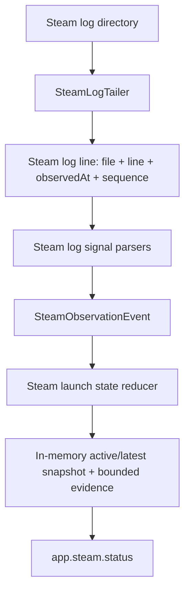
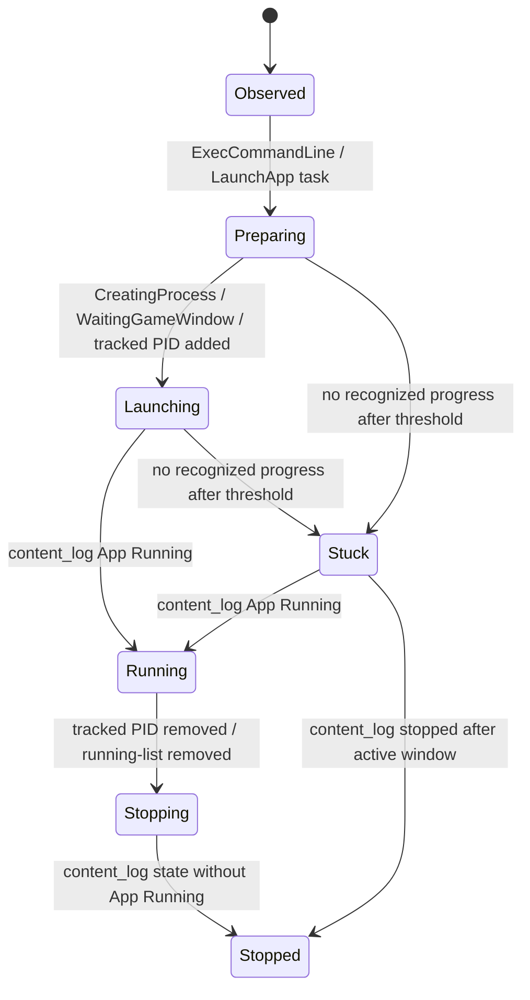

# feat: Build first-class Steam observability

## Summary

Build the first Steam-only observability slice that turns Korri-managed Steam logs into normalized, evidence-backed status. The implementation should start from Bandai fixtures, add pure Steam log parsers, follow log files by name, reduce parsed events into active/latest launch snapshots, and expose a read-only `app.steam.status` RPC without changing launch or stop behavior. Optional Proton and Steam Runtime verbose-log acceptance remains follow-up work.

---

## Problem Frame

Korri can request Steam AppID launches, but operators and the UI cannot yet tell whether Steam is preparing, launching, running, stopping, or stuck. The Bandai spike produced real log evidence and corrected the source split: `content_log.txt` carries AppID running/stopped state, `gameprocess_log.txt` carries tracked PID lifecycle, and `console_log.txt` carries launch task progress.

---

## Requirements

- R1. Resolve and observe Korri-managed Steam logs, defaulting to `/var/lib/korri/steam/logs`, with a future-friendly seam for alternate Steam roots.
- R2. Follow Steam log files by name, not inode, and handle file creation, truncation, and recreation/rotation.
- R3. Parse Bandai-proven Steam log lines into first-class signals for AppID state, tracked PID lifecycle, launch task progress, install-script progress, shader evidence, and raw/ignored unknown lines without throwing.
- R4. Preserve raw evidence provenance for parsed signals: log file, Steam timestamp when available, observed time, sequence, raw line, parser/source, and confidence.
- R5. Reduce signals into a normalized Steam observation event stream and active/latest snapshot with Steam-specific facets such as AppID, app state, launch task, ActionID, tracked PID, exit code, command excerpt, and evidence.
- R6. Infer a linear status projection of `Preparing`, `Launching`, `Running`, `Stopping`, `Stopped`, or `Stuck` while preserving Steam-specific facts and confidence. Explicit `Failed` classification is deferred until concrete Steam failure fixtures exist.
- R7. Expose a read-only status/RPC surface that can report observer health, active/latest snapshot, and bounded recent evidence without launching a game.
- R8. Degrade gracefully when logs or formats are missing/changing: keep health/error information bounded, surface sanitized raw evidence where useful, and avoid false lifecycle certainty.
- R9. Sanitize and bound Steam evidence before storing it in snapshots or returning it over RPC; committed fixtures must use stable placeholders instead of sensitive local paths, Steam userdata IDs, URI query strings, or secret-like argv/env values.
- R10. Keep this implementation Steam-only and do not expand into Gamescope, MangoHud, screenshots, visual validation, Proton verbose logs, or Steam Linux Runtime verbose log collection in the first slice.

---

## Scope Boundaries

- Do not change Steam launch behavior, `korri-steam-app`, LaunchOptions repair, sessiond stop semantics, or stale foreground-process cleanup.
- Do not use process scanning as the primary Steam truth. It may become a later bootstrap/corroboration path, but this slice is log-driven.
- Do not add UI projection in this plan; the status/RPC surface is the handoff point for later UI work.
- Do not add a generic runtime-observer framework for non-Steam launchers.
- Do not treat every `exit code -1` from Steam-tracked child PIDs as a user-facing failure.
- Do not dump unbounded or unsanitized raw Steam logs over RPC; status responses must stay bounded, sanitized, and diagnostic.

### Deferred to Follow-Up Work

- UI projection for “Steam is checking shader metadata / processing install script / running / stuck”.
- Optional Proton log capture with `PROTON_LOG=1` and `PROTON_LOG_DIR=<launch artifact dir>`; this active plan is a first slice and will not close that optional origin acceptance criterion.
- Optional Steam Linux Runtime / pressure-vessel verbose log detection; this active plan is a first slice and will not close that optional origin acceptance criterion.
- Cold-start bootstrap from `/proc/*/cmdline` when korrid starts after a game is already running.
- Integration of Steam observations into broader sessiond lifecycle events, if desired after the standalone status surface proves useful.
- Full failure classification beyond Stuck/Stopped; add only after explicit Steam failure fixtures exist.

---

## Context & Research

### Relevant Code and Patterns

- `product/services/device/korrid.ts` starts/stops long-lived device services and is the right integration point for starting/stopping a Steam observer handle.
- `product/services/device/sessiond-gamescope-reaper.ts` shows the project’s preferred plain TypeScript dependency-injection pattern for device runtime helpers: injectable dependencies, system factory, bounded retries, and logger seam.
- `product/services/device/sessiond-state.ts` shows the pure reducer pattern to mirror for Steam snapshot updates.
- `product/apps/portal/api/hello/rpc.ts` and `product/apps/portal/api/hello/rpc-handler.ts` are the minimal Effect RPC pattern.
- `product/apps/portal/api/server/status.rpc.ts` and `product/apps/portal/api/server/status.rpc-handler.ts` show larger response schema, status health shape, and bounded/redacted error handling.
- `product/apps/portal/api/app-rpc-group.ts`, `product/apps/portal/api/handlers.ts`, `product/apps/portal/api/server/rpc-group.ts`, and `product/apps/portal/api/server/rpc-server.ts` are the registration points for a UI-consumable `app.steam.status` RPC.
- `docs/research/steam-observability/bandai-2026-06-14/` contains the Bandai fixture source of truth, but `README.md` and `notes.md` still contain placeholder synthesis sections.
- `docs/handoffs/steam-observability-implementation-handoff-2026-06-14.md` is the current implementation handoff and supersedes the live spike procedure.

### Institutional Learnings

- `docs/solutions/runtime-errors/steam-manual-launch-x86-eager-xwayland-dbus-readiness-2026-05-26.md`: Steam `content_log.txt` AppID state is a stronger lifecycle signal than process-table readiness; process checks alone previously misled validation.
- `docs/solutions/runtime-errors/sessiond-sse-stream-killed-by-bun-idle-timeout-2026-05-27.md`: never infer domain lifecycle from observer/transport liveness. A log watcher or future stream close is a transport event, not a game failure.
- `docs/solutions/architecture-patterns/physical-host-foreground-lifecycle-truth-is-sessiond-2026-05-29.md`: sessiond remains foreground lifecycle authority; Steam observability is diagnostic/runtime evidence, not a competing foreground owner.
- `docs/solutions/architecture-patterns/sessiond-operator-model-2026-05-29.md`: sessiond-managed launches have their own event vocabulary and identity model; this plan should avoid replacing it.
- `docs/solutions/architecture-patterns/steam-applaunch-with-silent-steam-and-per-app-launchoptions-gamescope-wrap-aka-x86-2026-05-27.md`: Steam AppID launch chains include `SteamLaunch AppId=<appid>` and content-log App Running timing; VDF/LaunchOptions work is separate and should not leak into this scope.
- `docs/solutions/design-patterns/explicit-cascade-folded-policy-over-incidental-signal-heuristics-2026-05-27.md`: classify from explicit signals and discriminated states, not incidental process/env heuristics.

### External References

- Node/Bun file watching should use parent-directory watching with stat-based `{ inode, size, offset }` tracking so rotation/recreation is detected; direct file watchers can remain attached to dead inodes on Linux.
- Use `fs/promises.watch` with `AbortController` where possible for cancellable directory watching, and read appended content from byte offsets using file handles/readline-style line iteration.
- Chokidar is a dev dependency in this repo; production runtime should rely on Node/Bun filesystem APIs behind injectable seams.
- Effect v4 beta stream APIs are not needed for the first observer; keep long-running file watching as plain TypeScript and use Effect only at the RPC handler boundary.

---

## Key Technical Decisions

- Build a dedicated `app.steam.status` RPC instead of adding Steam fields to `app.server.status`: this keeps payload size and iteration risk away from the high-frequency general server status response while still using the existing Effect RPC group. The default response is sanitized diagnostic status, not unrestricted raw Steam logs.
- Use plain TypeScript factories/handles for the tailer and live observer, not an Effect Service: device services in this repo already use explicit handles and dependency injection for long-running runtime helpers. Keep the new device modules flat under `product/services/device/` with `steam-*` prefixes to match existing device service layout.
- Treat `content_log.txt` App Running as authoritative for Running. Treat `content_log.txt` state without App Running as authoritative for Stopped only inside a correlated active/known AppID launch window; otherwise record it as Steam evidence without proving an observed lifecycle.
- Parse `console_log.txt` process added/updated/removed lines as separate console-process evidence, not as the authoritative full tracked-PID lifecycle. `gameprocess_log.txt` owns full PID add/remove and exit-code facts.
- Promote `Remove <appid> from running list` from `gameprocess_log.txt` to a first-class stop-confirmation signal.
- Include Bandai-observed launch tasks beyond the original handoff list, especially `RunningInstallScript`, `SynchronizingCloud`, and `LaunchApp waiting/continues` lines.
- Use Steam-embedded timestamps for event correlation, with tailer observed time retained as metadata. For same-timestamp replay ordering, use a fixed source priority: `content_log`, `gameprocess_log`, `console_log`, `shader_log`, then auxiliary raw evidence sources. Hints must never downgrade confirmed Running/Stopped state.
- Make Stuck inference configurable with a default threshold above Bandai’s observed 21-second install-script preparation; use 60 seconds as the first default and reset it on recognized progress signals. Compute Stuck as a clock-injected projection from snapshot state rather than mutating reducer state from wall time.
- Keep recent evidence bounded, sanitized, and lifecycle-biased; raw/noise lines should not grow snapshots unbounded or dominate RPC payloads. Clamp at ingest and again at RPC construction.

---

## Open Questions

### Resolved During Planning

- Should the first status surface be separate from `app.server.status`? Use separate `app.steam.status` for this slice.
- Should fixture cleanup remain part of the implementation? Yes. The checked-in fixture README/notes are placeholders and mixed parser fixtures need source splitting before parser tests.
- Should Proton and Steam Linux Runtime verbose logs be included now? No. They lack Bandai fixtures and are deferred.
- Should observer unavailability be an RPC error? No. Return a schema-backed success response with unavailable/degraded observer health whenever a bounded response can be constructed; reserve typed RPC errors for defects that prevent constructing a response.
- Should process scanning bootstrap running games after observer restart? No for this slice. Defer to a later corroboration/bootstrap task.

### Deferred to Implementation

- Exact type and function names inside each new module: choose names that follow local conventions once implementation starts.
- Exact redaction/clamping helper reuse for Steam raw evidence: implementation should follow the status handler’s bounded diagnostic posture and adjust once response schemas are concrete.
- Exact source-specific evidence cap value if 50 proves too small/large in tests; default should remain bounded and configurable at construction time.

---

## Output Structure

    docs/research/steam-observability/bandai-2026-06-14/
      README.md
      notes.md
      parser-fixtures/
        content-log-*.txt
        gameprocess-log-*.txt
        console-log-*.txt
        shader-log-*.txt
    product/services/device/
      steam-log-signals.ts
      steam-log-signals.test.ts
      steam-log-tailer.ts
      steam-log-tailer.test.ts
      steam-launch-state.ts
      steam-launch-state.test.ts
      steam-log-observer.ts
      steam-log-observer.test.ts
      steam-evidence-sanitizer.ts
      steam-evidence-sanitizer.test.ts
    product/apps/portal/api/steam/
      status.rpc.ts
      status.rpc-handler.ts
      status.rpc-handler.test.ts

---

## High-Level Technical Design

> *This illustrates the intended approach and is directional guidance for review, not implementation specification. The implementing agent should treat it as context, not code to reproduce.*

Steam status is not sessiond foreground ownership. Snapshots should carry a correlation/ownership facet such as Korri-wrapper/sessiond-correlated versus Steam-only evidence so manual/background Steam activity is not mislabeled as a Korri-managed foreground session.

---

## Implementation Units

### U1. Synthesize and split Bandai fixtures

**Goal:** Turn the captured Bandai spike artifacts into implementation-ready, source-specific fixtures and human-readable research notes.

**Requirements:** R3, R4, R8, R9

**Dependencies:** None

**Files:**
- Modify: `docs/research/steam-observability/bandai-2026-06-14/README.md`
- Modify: `docs/research/steam-observability/bandai-2026-06-14/notes.md`
- Create/modify: `docs/research/steam-observability/bandai-2026-06-14/parser-fixtures/content-log-downwell-360740.txt`
- Create/modify: `docs/research/steam-observability/bandai-2026-06-14/parser-fixtures/content-log-sonic-mania-584400.txt`
- Create/modify: `docs/research/steam-observability/bandai-2026-06-14/parser-fixtures/content-log-caveblazers-452060.txt`
- Create/modify: `docs/research/steam-observability/bandai-2026-06-14/parser-fixtures/gameprocess-log-downwell-360740.txt`
- Create/modify: `docs/research/steam-observability/bandai-2026-06-14/parser-fixtures/gameprocess-log-sonic-mania-584400.txt`
- Create/modify: `docs/research/steam-observability/bandai-2026-06-14/parser-fixtures/gameprocess-log-caveblazers-452060.txt`
- Create/modify: `docs/research/steam-observability/bandai-2026-06-14/parser-fixtures/console-log-downwell-360740.txt`
- Create/modify: `docs/research/steam-observability/bandai-2026-06-14/parser-fixtures/console-log-sonic-mania-584400.txt`
- Create/modify: `docs/research/steam-observability/bandai-2026-06-14/parser-fixtures/console-log-caveblazers-452060.txt`
- Create/modify: `docs/research/steam-observability/bandai-2026-06-14/parser-fixtures/shader-log-appid-evidence.txt`

**Approach:**
- Replace placeholder research summary sections with the Bandai findings: source split, stable line formats, timings, rotation observation, and caveats.
- Split mixed per-AppID parser fixture files into per-source fixtures so each parser test consumes the same kind of file it will see in production.
- Preserve existing raw tail artifacts locally when needed, but commit/parser-use only sanitized fixture slices with stable placeholders for local paths, Steam userdata IDs, URI query strings, and secret-like argv/env values.
- Call out that shader cache setup arrived concurrently with `App Running` in the Bandai run and should be evidence, not authoritative Preparing.

**Execution note:** Characterization-first. Treat fixture synthesis as the test corpus for U2 and U4 before writing parser/reducer behavior.

**Patterns to follow:**
- `docs/handoffs/steam-observability-implementation-handoff-2026-06-14.md`
- `docs/research/steam-observability/bandai-2026-06-14/content-log-*.txt`
- `docs/research/steam-observability/bandai-2026-06-14/gameprocess-log-*.txt`
- `docs/research/steam-observability/bandai-2026-06-14/console-log-*.txt`

**Test scenarios:**
- Test expectation: none -- this unit prepares documentation and fixture files; parser behavior is tested in U2.

**Verification:**
- Research README and notes no longer contain placeholder “to be filled” sections.
- Parser fixture files are grouped by source log and include Downwell, Sonic Mania, and Caveblazers examples for source-specific parsers.
- Fixtures include representative samples for every U2 parser scenario: waiting/continues, `RunningInstallScript`, `SynchronizingCloud`, stale Downwell removals, `Remove <appid> from running list`, `SSGL:` noise, auxiliary raw logs, and shader evidence.
- Sanitized fixture files do not contain unsanitized `/home/`, `file://`, `userdata/<digits>`, URI query strings, or secret-like argv/env keys.
- The stale Downwell pre-launch removal caveat is documented.

---

### U2. Add pure Steam log signal parsers

**Goal:** Parse Bandai-proven Steam log lines into typed observation events/signals without I/O or side effects.

**Requirements:** R3, R4, R6, R8, R9

**Dependencies:** U1

**Files:**
- Create: `product/services/device/steam-log-signals.ts`
- Create: `product/services/device/steam-log-signals.test.ts`

**Approach:**
- Define a small discriminated union for parsed Steam log signals/events with explicit source values for `content_log`, `gameprocess_log`, `console_log`, `shader_log`, `compat_log`, `appinfo_log`, guest/wrapper logs, and raw/ignored lines.
- Parse `content_log.txt` AppID state changes and project `App Running` as confirmed Running; preserve the full Steam app state string.
- Parse `gameprocess_log.txt` tracked PID add/remove lines, including command-bearing first PID lines and commandless subsequent PID lines.
- Parse `gameprocess_log.txt` `Remove <appid> from running list` as a first-class running-list removal signal.
- Parse `console_log.txt` launch tasks, install-script evaluator lines, `ExecCommandLine ... -applaunch`, `LaunchApp waiting/continues`, and console process added/updated/removed evidence as distinct from full PID lifecycle.
- Include `RunningInstallScript` and `SynchronizingCloud` in the Preparing task classification.
- Parse shader AppID evidence as hints only: cache-dir setup and AppID exited lines should attach evidence without overriding content-log state.
- Unknown and noisy lines must return ignored/raw results without throwing; NUL-escaped exec lines and `SSGL:` lines are expected noise. Auxiliary logs should produce bounded raw evidence only unless a later explicit parser promotes a pattern.

**Execution note:** Implement parser tests first from the source-specific fixtures created in U1.

**Patterns to follow:**
- `product/platform/stream/steam-launch-spec.ts` for small pure parsing helpers and focused tests.
- `product/services/device/sessiond-state.ts` for plain discriminated data and pure functions.

**Test scenarios:**
- Happy path: content-log App Running line for `360740` parses to confirmed `steam-app-state` with app state preserved.
- Happy path: content-log stopped line for `584400` parses to confirmed `steam-app-state` without `App Running`.
- Happy path: gameprocess tracked PID added with command captures AppID, PID, and command excerpt.
- Happy path: gameprocess tracked PID added without command captures AppID and PID with no command facet.
- Happy path: gameprocess tracked PID removed captures exit codes `-1` and `0` without classifying either as failure.
- Happy path: gameprocess running-list removal line parses as a terminal Steam running-list signal.
- Happy path: console `LaunchApp changed task` parses AppID, ActionID, task, and detail.
- Happy path: console install-script evaluator parses AppID and step count.
- Happy path: console `LaunchApp waiting` and `continues` lines parse as recognized task-progress signals.
- Happy path: console process added/updated/removed lines parse as console-process evidence with ProcID and command excerpt when present.
- Happy path: shader cache-dir and AppID exited lines parse as shader evidence, not lifecycle authority.
- Edge case: `RunningInstallScript` and `SynchronizingCloud` classify as Preparing signals.
- Edge case: NUL-escaped command lines, `SSGL:` lines, binding warnings, and thread-priority warnings return raw/ignored results without throwing.
- Error path: malformed timestamps or partial lines do not throw; they return ignored/raw evidence according to parser policy.

**Verification:**
- Parser tests pass against Bandai source-specific fixtures for all three AppIDs.
- Parser output never uses boolean forests as the primary state contract.
- Unknown Steam line formats remain observable as bounded raw evidence or are deliberately ignored.

---

### U3. Add tail-by-name Steam log tailer

**Goal:** Follow configured Steam log files from EOF in live mode and emit appended lines across creation, truncation, and rotation/recreation.

**Requirements:** R1, R2, R4, R8, R9

**Dependencies:** None. U2 consumes the raw line shape this unit defines; U2 and U3 can proceed in parallel as long as the source labels stay aligned.

**Files:**
- Create: `product/services/device/steam-log-tailer.ts`
- Create: `product/services/device/steam-log-tailer.test.ts`

**Approach:**
- Model the tailer as a plain TypeScript factory returning a stoppable handle, following the flat `product/services/device/steam-*` naming pattern instead of a new TypeScript subdirectory or Effect streams.
- Watch the parent log directory and filter events by configured filename to avoid dead-inode behavior after rotation.
- Track per-file size, inode, and offset; start existing files at EOF for live observation; read from `0` after truncation or recreation. Maintain a per-file decoder/partial-line buffer so only complete newline-delimited lines emit, with trailing partials retained across append events and reset on truncation/recreation.
- Tolerate missing files until they appear, and tolerate a missing log directory by reporting bounded health/error state rather than blocking launches.
- Expose injectable seams for stat, directory watch, line reading, clock, and logger so tests can simulate filesystem events deterministically.
- Watch the first-slice fixed files: `content_log.txt`, `gameprocess_log.txt`, `console_log.txt`, `shader_log.txt`, `compat_log.txt`, `appinfo_log.txt`, and `korri-steam-app-guest.log`. Also discover `korri-steam-gamescope-launch-*.log` by directory-name events as bounded raw wrapper evidence, without parsing Gamescope/MangoHud semantics.

**Execution note:** Write filesystem behavior tests before production watcher wiring; use a controllable watcher seam for deterministic truncate/recreate cases.

**Patterns to follow:**
- `product/services/device/sessiond-gamescope-reaper.ts` for injectable runtime dependencies and system factory shape.
- `product/platform/library/config-graph-controller.ts` for existing direct `node:fs` watch usage.

**Test scenarios:**
- Happy path: existing watched file starts at EOF and does not replay historical lines.
- Happy path: appending complete lines emits each line with the correct source filename and increasing sequence.
- Edge case: watched file missing at startup emits no line and begins tailing when the file appears.
- Edge case: file truncation resets offset and emits new lines from byte `0` after truncation.
- Edge case: file recreation/inode change resets offset and emits lines from the recreated file.
- Edge case: duplicate/spurious watch events with unchanged size do not emit duplicate lines.
- Edge case: a line split across multiple appends emits only after the newline arrives, preserving multibyte/CRLF boundaries where supported by the decoder.
- Edge case: events for unrelated files are ignored.
- Error path: stat/read/watch failures update health or call the error seam without throwing out of launch/status paths.
- Error path: stopping the tailer aborts the watcher and prevents later events from emitting lines.

**Verification:**
- Tailer tests prove append, create, truncate, recreate, missing-file, unrelated-file, duplicate-event, and stop behavior.
- Tailer design watches directories, not individual file inodes.
- Live mode starts from EOF while fixture replay remains possible through parser/reducer tests.

---

### U4. Add Steam launch state reducer and snapshot model

**Goal:** Reduce parsed Steam observation events into active/latest launch snapshots with bounded evidence and correct Bandai lifecycle projection while keeping time-dependent Stuck projection explicit and testable.

**Requirements:** R5, R6, R8, R9

**Dependencies:** U2

**Files:**
- Create: `product/services/device/steam-launch-state.ts`
- Create: `product/services/device/steam-launch-state.test.ts`

**Approach:**
- Implement pure reducer functions that consume parsed events and return a new observer state/snapshot, following `sessiond-state.ts` style.
- Model launch windows internally by AppID plus ActionID/Korri marker when available; the RPC can still project a single active/latest snapshot. Track whether a window is Korri-wrapper/sessiond-correlated or Steam-only diagnostic evidence.
- Ignore or downgrade stale stop/removal lines that appear before an active launch window, especially the Downwell stale-removal fixture.
- Use `content_log` `App Running` as confirmed Running and `content_log` app state without `App Running` as confirmed Stopped only when correlated to an active/known AppID window. A Stopped line without a prior/current window is evidence, not proof of a complete observed lifecycle.
- Use `gameprocess_log` PID adds/removals to explain Launching/Stopping and maintain tracked/removed PID sets; do not classify child `-1` exits as failures on their own.
- Use `Remove <appid> from running list` as a stop-confirmation signal when correlated with a known active window.
- Treat `console_log` task lines as Preparing/Launching hints and preserve exact Steam task names for UI/status.
- Keep the reducer event-driven and pure. Store last recognized progress time in the snapshot; compute Stuck as an explicit projection that receives the current time and configured threshold rather than reading a real clock inside the reducer.
- Keep evidence bounded, lifecycle-biased, and de-duplicated. Exclude known noisy raw lines from snapshot evidence or count them separately.
- Define deterministic replay ordering using Steam timestamp first, then fixed source priority, then sequence. Define monotonic precedence so lower-confidence console/shader/auxiliary hints can update facets/evidence but cannot downgrade confirmed Running or Stopped, and a stopped window cannot reopen without a new ActionID/Korri marker.

**Execution note:** Use fixture replay tests for reducer behavior before integrating with the live tailer.

**Patterns to follow:**
- `product/services/device/sessiond-state.ts` pure reducer style.
- `product/platform/library/sessiond-lifecycle-projections.ts` for projection helper style and stable vocabulary.

**Test scenarios:**
- Happy path: Sonic Mania fixture replay progresses Preparing → Launching → Running → Stopped with confirmed Running/Stopped from content-log state.
- Happy path: Caveblazers fixture replay treats `RunningInstallScript` and `SynchronizingCloud` as Preparing and reaches confirmed Running/Stopped.
- Happy path: Downwell fixture replay ignores stale pre-launch stop/removal lines and then tracks the fresh launch to Stopped.
- Happy path: tracked PIDs accumulate on add and move to removed PID records with exit codes on removal.
- Happy path: `Remove <appid> from running list` records terminal evidence without requiring every child exit to be interpreted as failure.
- Edge case: `App Running` and first PID add with the same timestamp reduce deterministically regardless of file event order.
- Edge case: console process updated duplicate ProcID does not duplicate tracked/evidence state.
- Edge case: shader cache setup arriving at the same second as App Running does not move Running back to Preparing.
- Edge case: stopped signal without prior Running from a cold observer start is recorded as inferred/observed evidence, not proof that the observer saw a complete lifecycle.
- Edge case: sessiond-idle/manual Steam activity without Korri-wrapper/sessiond correlation is visible as Steam-only diagnostic evidence and is not mislabeled as a Korri-managed foreground session.
- Edge case: rapid same-AppID relaunch creates a new internal window when ActionID/Korri marker changes rather than merging PID removals from both windows.
- Error path: a Stuck projection with explicit current time and threshold reports Stuck when no recognized progress has arrived after a launch task, preserving last Steam task/evidence.
- Error path: unknown/raw lines do not change lifecycle state and do not grow evidence beyond the cap.

**Verification:**
- Reducer tests cover all three Bandai sequences and the stale Downwell case.
- Snapshot state remains a tagged/closed state projection, not a bag of booleans.
- Evidence arrays stay bounded and include enough raw provenance for diagnostics.

---

### U5. Wire a live Steam log observer into korrid

**Goal:** Start a non-blocking Steam log observer alongside `korrid`, keep active/latest snapshots in memory, and expose a read-only status seam for RPC handlers.

**Requirements:** R1, R2, R5, R7, R8, R9

**Dependencies:** U2, U3, U4

**Files:**
- Create: `product/services/device/steam-log-observer.ts`
- Create: `product/services/device/steam-log-observer.test.ts`
- Create: `product/services/device/steam-evidence-sanitizer.ts`
- Create: `product/services/device/steam-evidence-sanitizer.test.ts`
- Modify: `product/services/device/korrid.ts`
- Modify: `product/systems/nixos/modules/korri-steam.nix` *(only if implementation needs an explicit service environment setting for the log dir or stuck threshold)*
- Modify: `tools/testing/nix/korri-steam-module-check.nix` *(only if the Nix module exports new environment wiring)*

**Approach:**
- Compose the tailer, parsers, and reducer into a live observer handle with `start`, `stop`, and `snapshot/status` reads. The handle should own clock-based Stuck projection at read time, not inside the pure reducer.
- Default log directory resolution should prefer `KORRI_STEAM_LOG_DIR`, then `KORRI_STEAM_HOME/logs` when present, then `/var/lib/korri/steam/logs`.
- Add a configurable stuck threshold with a default of 60 seconds; prefer a single service option/env seam rather than scattering constants.
- Start the observer after the HTTP server starts, but ensure observer startup/read errors cannot prevent `korrid` from serving. Publish the handle through a narrow module-level status seam with an owner token plus explicit install/uninstall/reset helpers, matching the current singleton-style RPC handler wiring while preventing stale handles across multiple `createKorrid()` lifecycles or tests.
- Stop the observer during `korrid.stop()` alongside advertisement and config-graph cleanup.
- Keep observer health explicit: configured log dir, watched files, active/missing files, last read/watch error after redaction/clamping, last line time, and installed/starting/running/stopped/unavailable handle state.
- Avoid live process scans or launch-path mutations in this unit. Keep the status seam read-only and make it clear that sessiond remains the launch/stop authority.

**Execution note:** Test with injected tailer/parser/reducer seams so service lifecycle can be verified without real Steam or device logs.

**Patterns to follow:**
- `product/services/device/korrid.ts` for start/stop lifecycle.
- `product/services/device/sessiond-status-sidecar.ts` for status/health sidecar style if a durable status file is useful.
- `product/services/device/sessiond-gamescope-reaper.ts` for system factory and logger seam.

**Test scenarios:**
- Happy path: service consumes emitted log lines, parses them, and updates active/latest snapshots.
- Happy path: `korrid.start()` starts the observer when configured and `korrid.stop()` stops it exactly once and uninstalls the matching owner token.
- Edge case: observer startup failure is recorded in health and does not prevent `korrid` startup.
- Edge case: missing log directory results in health degradation, not thrown startup failure.
- Edge case: repeated `start()` / `stop()` calls are idempotent.
- Edge case: two `createKorrid()` handles cannot read or uninstall each other's observer status seam by accident.
- Error path: parser errors or malformed/oversized lines are sanitized, clamped, captured as bounded health/evidence, and do not crash the observer loop.
- Integration: a short synthetic sequence emitted through the service produces the same snapshot as the pure reducer test.

**Verification:**
- Korrid can run with Steam logs absent and still serve RPC.
- Observer lifecycle is cleanly stopped on daemon shutdown.
- If Nix env wiring is added, Nix checks assert the relevant settings without trying to unit-test TypeScript logic in Nix.

---

### U6. Expose read-only Steam status RPC

**Goal:** Add a typed `app.steam.status` RPC that reports observer health, active/latest snapshots, and bounded evidence.

**Requirements:** R4, R5, R7, R8, R9

**Dependencies:** U4, U5

**Files:**
- Create: `product/apps/portal/api/steam/status.rpc.ts`
- Create: `product/apps/portal/api/steam/status.rpc-handler.ts`
- Create: `product/apps/portal/api/steam/status.rpc-handler.test.ts`
- Modify: `product/apps/portal/api/app-rpc-group.ts`
- Modify: `product/apps/portal/api/handlers.ts`
- Modify: `product/apps/portal/api/server/rpc-group.ts`
- Modify: `product/apps/portal/api/server/rpc-server.ts`

**Approach:**
- Define Effect Schema classes for payload, response, observer health, observation state, ownership/correlation, confidence, Steam facets, and bounded sanitized evidence entries.
- Register `SteamStatusRpc` in both the app RPC group and server RPC group, then wire both handler layers. If a surface has no live observer installed, it should return an explicit unavailable/degraded health success response rather than an unhandled RPC tag or raw error.
- Handler should read from the live observer status seam and return an idle/empty healthful response when no launch is active. Tests should use the explicit seam reset/set helper rather than relying on real daemon startup.
- Response should include optional `active`, optional `latest`, observer health, watched file names, ownership/correlation, and bounded sanitized evidence. Default unauthenticated/LAN responses must exclude unsanitized raw lines and full commands; diagnostic excerpts must be clamped and scrubbed.
- Use additive schema design and discriminated/literal unions for state and confidence.
- Keep the RPC read-only; no launch/stop/control behavior belongs here.

**Execution note:** Add handler/schema tests before wiring optional tool support.

**Patterns to follow:**
- `product/apps/portal/api/hello/rpc.ts`
- `product/apps/portal/api/hello/rpc-handler.ts`
- `product/apps/portal/api/server/status.rpc.ts`
- `product/apps/portal/api/server/status.rpc-handler.ts`
- `product/apps/portal/api/app-rpc-group.ts`
- `product/apps/portal/api/server/rpc-group.ts`
- `product/apps/portal/api/server/rpc-server.ts`

**Test scenarios:**
- Happy path: no observed Steam launch returns observer health with no active/latest snapshot.
- Happy path: active Running snapshot returns AppID, state, last signal, last task when present, tracked PID facets, confidence, and bounded evidence.
- Happy path: latest Stopped snapshot remains available after active clears.
- Edge case: observer health with missing log directory or last read error is clamped/redacted and schema-valid.
- Edge case: evidence list over the configured cap is truncated before response construction.
- Edge case: multi-megabyte malformed log lines are clamped by byte budget at ingest and RPC construction.
- Edge case: sensitive sample lines containing local paths, `file://`, `userdata/<digits>`, URI query strings, or secret-like keys return sanitized placeholders.
- Error path: unavailable observer seam returns a schema-backed success response with degraded health whenever possible; raw filesystem errors never escape to clients.

**Verification:**
- `app.steam.status` can be queried without launching a game.
- Existing `app.server.status` behavior remains unchanged.
- The RPC response is schema-backed, bounded, read-only, and registered in both app/server RPC groups where appropriate.

---

## System-Wide Impact

- **Interaction graph:** `korrid` gains a non-blocking background observer; app/server RPC handlers read its status seam. Steam launch/sessiond paths are observed but not controlled.
- **Error propagation:** Tailer/parser/observer failures should flow to observer health and typed RPC status, not to launch failure or daemon crash.
- **State lifecycle risks:** Same-AppID relaunches, stale pre-launch lines, same-second cross-file ordering, partial-line appends, manual Steam activity, and observer restarts can all confuse window correlation. U3/U4/U5 address these with buffering, explicit launch-window ownership, ordering, and owner-token status rules.
- **API surface parity:** This plan adds a new read-only RPC tag to app/server RPC groups. It intentionally does not add fields to `app.server.status` or UI components in the first slice.
- **Integration coverage:** Parser and reducer tests cover fixture replay; service/RPC tests cover daemon composition. Live Bandai validation can follow implementation but should not replace fixture tests.
- **Unchanged invariants:** sessiond remains foreground lifecycle authority; Steam observability reports Steam evidence and status only. Existing launch, stop, stream, and server status contracts remain unchanged.

---

## Risks & Dependencies

| Risk | Mitigation |
|------|------------|
| Steam log formats change | Parsers preserve sanitized raw/ignored evidence and confidence; status degrades instead of inventing certainty. |
| Tailer misses rotation/recreation | Watch parent directory and stat by name using inode/size/offset tracking. |
| Stale historical lines create false stopped/running states | Start live tailing from EOF and require active launch-window correlation in the reducer. |
| Same-second cross-file signals reduce nondeterministically | Use Steam timestamp plus fixed source-priority tie-break for replay/reduction. |
| Evidence payload grows unbounded or leaks sensitive data | Sanitize and byte-cap evidence at ingest and RPC construction; filter known noise before response construction. |
| Observer failure blocks launches | Start observer non-blockingly and report failures through health only. |
| Manual/background Steam activity is mistaken for Korri foreground state | Carry ownership/correlation facets and keep sessiond as the foreground lifecycle authority. |
| Partial-line log writes create malformed signals | Buffer incomplete lines per file and emit only complete newline-delimited records. |
| New RPC surface drifts from Effect Schema conventions | Follow existing RPC file layout, register in `rpc-group.ts` / `rpc-server.ts`, and test handler output. |
| Implementation scope expands into launch control or visual validation | Keep LaunchOptions, sessiond stop, Gamescope, MangoHud, screenshots, Proton verbose logs, and UI projection out of this slice. |

---

## Documentation / Operational Notes

- Update the Bandai research README/notes before implementation so future agents do not repeat the completed spike.
- Document the source split prominently: `content_log.txt` for AppID state, `gameprocess_log.txt` for tracked PID lifecycle, `console_log.txt` for task progress.
- Status health should expose watched log names and last bounded error so operators can tell whether the observer is blind because logs are absent, not because Steam is idle.
- Do not share full raw Steam logs externally without redaction; command lines and paths may contain account-adjacent state. Committed fixtures and RPC evidence must be sanitized/clamped.

---

## Sources & References

- **Origin item:** [work/items/active/01KV3KWT98Y6W6CNXP05ZPSHH7-capture-steam-launch-diagnostics-as-first-class-session-arti/item.md](work/items/active/01KV3KWT98Y6W6CNXP05ZPSHH7-capture-steam-launch-diagnostics-as-first-class-session-arti/item.md)
- **Briefing:** [docs/briefs/2026-06-14-steam-observability-brief.md](docs/briefs/2026-06-14-steam-observability-brief.md)
- **Implementation handoff:** [docs/handoffs/steam-observability-implementation-handoff-2026-06-14.md](docs/handoffs/steam-observability-implementation-handoff-2026-06-14.md)
- **Bandai fixtures:** [docs/research/steam-observability/bandai-2026-06-14/](docs/research/steam-observability/bandai-2026-06-14/)
- Related code: [product/services/device/korrid.ts](product/services/device/korrid.ts)
- Related code: [product/services/device/sessiond-gamescope-reaper.ts](product/services/device/sessiond-gamescope-reaper.ts)
- Related code: [product/services/device/sessiond-state.ts](product/services/device/sessiond-state.ts)
- Related code: [product/apps/portal/api/app-rpc-group.ts](product/apps/portal/api/app-rpc-group.ts)
- Related code: [product/apps/portal/api/handlers.ts](product/apps/portal/api/handlers.ts)
- Related code: [product/apps/portal/api/server/rpc-group.ts](product/apps/portal/api/server/rpc-group.ts)
- Related code: [product/apps/portal/api/server/rpc-server.ts](product/apps/portal/api/server/rpc-server.ts)
- Related learning: [docs/solutions/runtime-errors/steam-manual-launch-x86-eager-xwayland-dbus-readiness-2026-05-26.md](docs/solutions/runtime-errors/steam-manual-launch-x86-eager-xwayland-dbus-readiness-2026-05-26.md)
- Related learning: [docs/solutions/runtime-errors/sessiond-sse-stream-killed-by-bun-idle-timeout-2026-05-27.md](docs/solutions/runtime-errors/sessiond-sse-stream-killed-by-bun-idle-timeout-2026-05-27.md)
- Related learning: [docs/solutions/architecture-patterns/physical-host-foreground-lifecycle-truth-is-sessiond-2026-05-29.md](docs/solutions/architecture-patterns/physical-host-foreground-lifecycle-truth-is-sessiond-2026-05-29.md)
