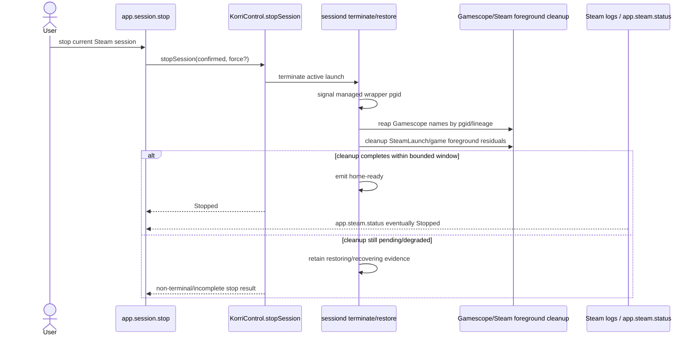
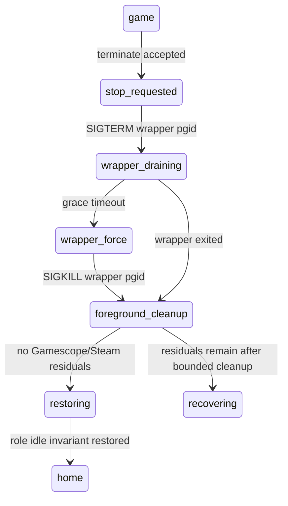

# fix: Make Steam session stop wait for wrapper cleanup

## Summary

Make Korri's Steam stop path truthful: stopping a sessiond-managed Steam launch should terminate the Gamescope/SteamLaunch foreground tree or report that cleanup is still in progress instead of immediately claiming `Stopped`. The implementation should keep sessiond as foreground lifecycle authority, reuse the existing Steam orphan-kill matching pattern, and use `app.steam.status` as validation evidence rather than as the cleanup owner.

---

## Problem Frame

Bandai validation showed `app.session.stop` returning `Stopped` while Sonic Mania's Gamescope/SteamLaunch/Proton tree remained alive. That leaves `app.steam.status` reporting `Running`, permits split-brain lifecycle truth between sessiond and Steam observability, and forces manual process cleanup before the host is actually idle.

---

## Requirements

- R1. A sessiond-managed Steam stop must terminate the managed Gamescope wrapper process group or escalate cleanup within a bounded window.
- R2. Steam-owned foreground children such as `SteamLaunch AppId=<id>`, Proton, Wine, and game executables must be cleaned up or detected as residuals before sessiond declares the launch fully stopped.
- R3. `app.session.stop` must not return terminal `Stopped` solely because sessiond accepted a terminate request; it must either wait for confirmed cleanup or return a non-terminal/incomplete result.
- R4. `app.steam.status` must transition from `Running` to `Stopped` after `app.session.stop` for a normal Sonic Mania-style Steam launch without manual process kill.
- R5. Cleanup must preserve warm Steam itself; it must target foreground game wrapper/game processes, not the persistent Steam service/session.
- R6. Regression coverage must include a Steam-like launch whose wrapper/game tree survives the first stop signal and requires escalation.

---

## Scope Boundaries

- Do not replace sessiond with the broader foreground lifecycle supervisor; this plan is the narrow Steam wrapper cleanup fix.
- Do not change Steam LaunchOptions materialization, Gamescope planner behavior, or the productized Steam launch wrapper contract.
- Do not add UI visualization for Steam observability; only update stop response handling when required for truthfulness.
- Do not make `app.steam.status` the owner of foreground lifecycle. Steam logs remain diagnostic evidence; sessiond owns cleanup.
- Do not kill the warm Steam client/service as part of game cleanup.

### Deferred to Follow-Up Work

- Broader normalization of all foreground launches under one lifecycle supervisor remains in `work/items/parking-lot/01KV3A5RNCMMGR8FY5Y8MKPWGD-normalize-all-foreground-launches-under-one-lifecycle-superv.md`.
- Rapid same-AppID relaunch while stale Steam teardown signals are still arriving should be handled separately if it remains observable after cleanup is fixed.
- A future protocol-level `Stopping` UI affordance can be expanded if the bounded wait path still leaves user-visible drain windows.

---

## Context & Research

### Relevant Code and Patterns

- `product/services/device/sessiond.ts` owns managed launch state, `/managed-launch/terminate`, lifecycle events, restoring, reaper invocation, and `home-ready` emission.
- `product/services/device/sessiond-gamescope-reaper.ts` is the injected process-group reaper for Gamescope/gamescopereaper cleanup during restoring.
- `product/services/device/inputd-actions.ts` contains the validated stale Steam foreground cleanup fallback: scan current-user processes for `SteamLaunch AppId=<id>` and Steam game executables, send `SIGTERM`, wait, then `SIGKILL` survivors.
- `product/platform/library/shell-launcher.ts` uses `setsid` when `processGroup: true` and exposes `terminate`, `terminateNow`, `processGroupId`, and `exited` through the managed launch handle.
- `product/platform/control/korri-control-live.ts` maps `terminateSessiondManagedLaunch(...).accepted` directly to `Stopped`; this is the contract mismatch to correct.
- `product/apps/portal/api/session/stop.rpc.ts` is the typed stop response surface that may need an additive non-terminal result.
- `product/services/device/steam-log-observer.ts` and `product/apps/portal/api/steam/status.rpc-handler.ts` provide the validation surface for Steam-observed Running/Stopped state.

### Institutional Learnings

- `docs/solutions/architecture-patterns/physical-host-foreground-lifecycle-truth-is-sessiond-2026-05-29.md`: sessiond is the physical-host foreground lifecycle truth; parallel lifecycle voices must not disagree.
- `docs/solutions/architecture-patterns/sessiond-operator-model-2026-05-29.md`: managed launches track private process-group state and terminal lifecycle events; callers should not perform their own pgid cleanup.
- `docs/solutions/architecture-patterns/steam-applaunch-with-silent-steam-and-per-app-launchoptions-gamescope-wrap-aka-x86-2026-05-27.md`: Steam AppID launches produce a Steam-owned `SteamLaunch AppId=<id>`/Proton/game subtree that can outlive the launcher wrapper.
- `docs/solutions/architecture-patterns/kiosk-foreground-app-policy-over-gamescope-overlay-2026-05-24.md`: Gamescope is an adapter, not the lifecycle owner; cleanup must confirm the foreground app tree is gone.
- `docs/solutions/integration-issues/supervise-chromium-kiosk-session-after-game-exit-2026-05-04.md`: supervisors must actively assert idle invariants rather than trusting process exit alone.

### External References

- External research was skipped because this fix has strong direct local patterns: sessiond managed lifecycle, shell process-group handling, Gamescope reaper tests, and the validated inputd stale-Steam kill fallback.

---

## Key Technical Decisions

- Keep cleanup in sessiond, not in `app.steam.status`: sessiond owns lifecycle truth and has the launch context/pgid; Steam observability should confirm the outcome.
- Reuse and extract the existing stale Steam foreground matcher rather than duplicating regexes in sessiond: the inputd fallback is already Bandai-validated and scoped to foreground SteamLaunch/game processes.
- Treat `gamescope` as a canonical Gamescope process name alongside `gamescope-wl` and `gamescopereaper`: Bandai's Nix build exposes a `gamescope` comm name, and the current exact-name list misses it.
- Add bounded escalation after stop requests: a graceful stop that does not exit must escalate to force cleanup rather than leaving sessiond stuck in `game` or falsely returning home.
- Prefer a bounded completion wait before returning `Stopped`; add an incomplete/non-terminal stop response only for timeout/degraded cleanup so callers are not misled.
- Preserve warm Steam: process matching must target `SteamLaunch AppId=<id>` and Steam game executable trees, not generic `steam`/`steamwebhelper`/service processes.

---

## Open Questions

### Resolved During Planning

- Should cleanup be driven by Steam logs? No. Steam logs validate the cleanup but do not own foreground lifecycle.
- Should inputd's stale-kill fallback become the primary stop path? No. Its process matching should be shared, but sessiond must own the managed stop chain.
- Is adding `gamescope` to the reaper name list safe? Yes, when combined with the existing pgid/lineage filter.

### Deferred to Implementation

- Exact default grace/settle durations: choose conservative values that keep stop responsive on Bandai while avoiding false residual warnings; make them injectable for tests.
- Exact stop response shape if cleanup exceeds the bounded wait: add the smallest additive schema variant needed once implementation confirms how `KorriControl.stopSession` observes completion.
- Whether forced cleanup always produces Steam content-log stopped evidence: verify on Bandai; if not, capture a follow-up for observer correlation rather than making the observer authoritative in this fix.

---

## High-Level Technical Design

> *This illustrates the intended approach and is directional guidance for review, not implementation specification. The implementing agent should treat it as context, not code to reproduce.*

---

## Implementation Units

### U1. Share Steam foreground process matching

**Goal:** Extract the Bandai-validated Steam foreground process detection from inputd into a reusable device helper that sessiond can use during managed stop cleanup.

**Requirements:** R2, R5, R6

**Dependencies:** None

**Files:**
- Create: `product/services/device/steam-foreground-processes.ts`
- Create: `product/services/device/steam-foreground-processes.test.ts`
- Modify: `product/services/device/inputd-actions.ts`
- Test: `product/services/device/inputd-actions.test.ts`

**Approach:**
- Move the current stale Steam foreground matching policy out of `inputd-actions.ts` into a small plain TypeScript helper.
- Keep the matcher process-table based and user-scoped by caller: the helper should classify `SteamLaunch AppId=<id>` and Steam game executables under `steamapps/common`, but it must not match warm Steam service/client processes.
- Include an optional AppID filter for sessiond when the AppID can be inferred from `LaunchSpec`; allow the existing inputd escape hatch to keep its broader stale-foreground behavior.
- Keep the scanner/signaler injection style used by inputd so tests do not need real `/proc`.

**Execution note:** Characterization-first. Add helper tests that capture the existing inputd matcher behavior before replacing the local implementation.

**Patterns to follow:**
- `product/services/device/inputd-actions.ts` process scanner/signaler injection.
- `product/services/device/inputd-actions.test.ts` stale Steam foreground kill tests.

**Test scenarios:**
- Happy path: a process with `SteamLaunch AppId=584400` is classified as Steam foreground, and filtering by AppID `584400` includes it.
- Happy path: a Proton/Wine game executable under `/var/lib/korri/steam/steamapps/common/.../*.exe` is classified as Steam foreground.
- Edge case: warm Steam processes such as `steam`, `steamwebhelper`, and non-game Steam paths are not classified.
- Edge case: a different AppID is excluded when an AppID filter is supplied.
- Integration: inputd `kill-current-game` still falls back to the shared matcher when sessiond has no active launch and still escalates survivors after its grace window.

**Verification:**
- Existing inputd stale Steam cleanup behavior is preserved through the extracted helper.
- The helper gives sessiond a safe AppID-scoped cleanup primitive without introducing broad Steam process kills.

---

### U2. Harden Gamescope reaper coverage and diagnostics

**Goal:** Make the existing Gamescope reaper actually see Bandai's `gamescope` process name and report residual cleanup with enough launch context to debug failures.

**Requirements:** R1, R2, R6

**Dependencies:** None

**Files:**
- Modify: `product/services/device/sessiond-gamescope-reaper.ts`
- Test: `product/services/device/sessiond-gamescope-reaper.test.ts`

**Approach:**
- Add `gamescope` to the canonical Gamescope process names while keeping `gamescope-wl` and `gamescopereaper`.
- Update the exact process-name assertion in the test suite so future accidental removals are still caught.
- Preserve the pgid/lineage filter; do not broaden to name-only process killing.
- Keep reaper diagnostics structured and easy for the sessiond call site to enrich with `launchId`.
- Leave sessiond call-site logging and `pgid: undefined` handling to U3, where launch context is available.

**Patterns to follow:**
- Existing `createGamescopeReaper` injected `processList`/`signaler` tests.
- Existing residual warning shape in `sessiond-gamescope-reaper.ts`.

**Test scenarios:**
- Happy path: a `gamescope` process in the managed pgid is targeted and appears in `reaped`.
- Happy path: `gamescope-wl` and `gamescopereaper` coverage remains intact.
- Edge case: an unrelated `gamescope` process outside the pgid/lineage is not signaled.
- Error path: residual warnings include useful process identifiers without crashing cleanup.
- Integration: the canonical names test protects all three names: `gamescope-wl`, `gamescopereaper`, and `gamescope`.

**Verification:**
- Bandai's observed `gamescope` comm name is covered.
- Reaper scope remains constrained to the launch's process group/lineage.

---

### U3. Add bounded managed-stop cleanup in sessiond

**Goal:** Ensure sessiond does not declare a Steam launch restored/home until the managed wrapper pgid and AppID-scoped Steam foreground residuals have exited or cleanup has degraded visibly.

**Requirements:** R1, R2, R4, R5, R6

**Dependencies:** U1, U2

**Files:**
- Modify: `product/services/device/sessiond.ts`
- Test: `product/services/device/sessiond.test.ts`
- Modify: `product/services/device/sessiond-gamescope-reaper.ts` if additional request metadata is needed
- Test: `product/services/device/sessiond-gamescope-reaper.test.ts` if the reaper request/outcome shape changes

**Approach:**
- Track enough launch context in `activeManagedLaunch` or adjacent launch-local state to identify Steam foreground residuals during restore, preferably by deriving AppID from the launch spec when possible.
- When a terminate request is accepted, signal the managed wrapper using the existing `terminate`/`terminateNow` methods, then let `runManagedLaunch` continue through a bounded cleanup path.
- Add a bounded wait/escalation path around wrapper exit for cancel-in-flight launches: if graceful termination does not resolve the managed child within the grace window, call `terminateNow` and continue with a hard deadline.
- Introduce explicit launch-local cancellation bookkeeping so `terminateManagedLaunchById` can wake the running launch task and the task can race `spawned.result` against termination deadlines; escalation must happen before restore begins, not after an indefinitely awaited child promise.
- During restoring, run the Gamescope reaper and then the shared Steam foreground cleanup for the AppID/current-user foreground tree. Cleanup should use `SIGTERM`, a short grace wait, and `SIGKILL` for survivors, mirroring inputd's validated pattern.
- Do not emit `home-ready` while foreground Steam residuals remain. If cleanup exceeds its hard deadline, keep sessiond in a visible degraded/recovering state or emit an explicit non-ready lifecycle outcome that U4 can treat as incomplete.
- Log `pgid: undefined` as limited cleanup with `launchId`; do not silently skip cleanup as if it succeeded.
- Include `launchId` and, when known, AppID in cleanup logs and lifecycle evidence.

**Technical design:** *(directional guidance, not implementation specification)*

**Patterns to follow:**
- `product/services/device/sessiond.ts` current `runManagedLaunch` restoring path.
- `product/services/device/sessiond-gamescope-reaper.ts` injected cleanup contract.
- `product/services/device/inputd-actions.ts` `SIGTERM`/grace/`SIGKILL` stale Steam foreground cleanup pattern.
- `product/services/device/sessiond.test.ts` harness-style injected launch/reaper tests.

**Test scenarios:**
- Happy path: a managed Steam-like launch receives stop, wrapper exits after `SIGTERM`, Steam foreground residuals clear, and `home-ready` is emitted only after cleanup completes.
- Edge case: wrapper ignores `SIGTERM`; sessiond escalates to `terminateNow`, then completes restore after the wrapper exits.
- Edge case: Gamescope reaper returns residuals on the first pass and empty on a later pass; sessiond waits for the cleanup outcome before reporting home.
- Error path: process cleanup still sees residual `SteamLaunch AppId=<id>` after the hard deadline; sessiond records degraded/recovering evidence instead of silently claiming a clean stop.
- Error path: processGroupId is undefined; sessiond logs cleanup was limited and still follows a deterministic restore/recovery path.
- Integration: `app.steam.status` can observe the Steam stopped signal after sessiond cleanup without a manual kill in the Bandai smoke path.

**Verification:**
- Sessiond no longer has a path where terminate is accepted, restore completes, and known foreground Steam residuals are ignored.
- A slow or stubborn wrapper cannot leave sessiond permanently in `game` without escalation.

---

### U4. Make Steam stop responses truthfully reflect cleanup completion

**Goal:** Prevent Steam-targeted `app.session.stop` calls from returning terminal `Stopped` merely because `/managed-launch/terminate` accepted the request.

**Requirements:** R3, R4, R6

**Dependencies:** U3

**Files:**
- Modify: `product/platform/control/control-results.ts`
- Test: `product/platform/control/korri-control.test.ts`
- Modify: `product/platform/control/korri-control-live.ts`
- Test: `product/platform/control/korri-control-live.test.ts`
- Modify: `product/apps/portal/api/session/stop.rpc.ts`
- Test: `product/apps/portal/api/session/stop.rpc-handler.test.ts`
- Modify: `product/apps/cli/control-renderers.ts`
- Test: `product/apps/cli/control-renderers.test.ts`
- Modify: Vigie/portal stop-result handling files if they exhaustively branch on stop response tags

**Approach:**
- Keep existing non-Steam stop behavior unless it participates in the Steam/AppID cleanup path or already exposes the same managed cleanup evidence. The contract change is scoped to preventing false terminal results for Steam foreground cleanup.
- After sessiond accepts a terminate request for a Steam/AppID-correlated launch, wait for a bounded completion signal before returning terminal `Stopped`: sessiond mode must return to a launch-ready/home state and no active launch should remain after U3 cleanup.
- If completion is not observed inside the bounded wait, return an additive non-terminal/degraded response rather than `Stopped`. Keep existing `ConfirmationRequired`, `NothingToStop`, `SessiondNotConfigured`, and `HostUnavailable` semantics intact.
- Update shared control-result semantics, CLI rendering/exit behavior, and any UI exhaustiveness points so the new response is not treated as a successful terminal stop.
- Preserve backwards-compatible success for fast cleanup: most callers should still see `Stopped` once cleanup is confirmed.
- Do not make the RPC wait unboundedly for Steam logs. The stop API should wait on sessiond cleanup truth, while device smoke additionally verifies `app.steam.status` follows.

**Patterns to follow:**
- `product/platform/control/korri-control-live.ts` `sessionStatus` and `stopSession` probe patterns.
- `product/apps/portal/api/session/stop.rpc.ts` additive schema union pattern.
- `product/platform/library/sessiond-managed-launch-client.ts` bounded request/probe helpers.

**Test scenarios:**
- Happy path: terminate accepted, subsequent sessiond probe reports `home`, and `stopSession` returns `Stopped` with the launchId.
- Edge case: Steam-correlated terminate is accepted but sessiond remains `restoring`/`game` until timeout; `stopSession` returns a non-terminal/incomplete response and does not claim `Stopped`.
- Edge case: active launch disappears between initial probe and terminate; existing `NothingToStop` behavior is preserved.
- Error path: sessiond becomes unavailable after terminate is accepted; response reports host/degraded state without losing the launchId if available.
- Integration: RPC schema decodes the new additive response variant and handler passes it through from `KorriControl`.

**Verification:**
- `Stopped` means cleanup completion from sessiond's perspective, not merely terminate acceptance.
- Callers have a typed non-terminal result when cleanup is still in progress or degraded.

---

### U5. Validate Steam-observed stop on Bandai and document operational evidence

**Goal:** Prove the fix on the same live path that exposed the bug: Sonic Mania launched through Korri on Bandai, stopped through `app.session.stop`, and observed by `app.steam.status` reaching `Stopped` without manual process kill.

**Requirements:** R4, R5

**Dependencies:** U1, U2, U3, U4

**Files:**
- Modify: `work/items/active/01KV4HDP6RXMJYSYQY1DFHTW5W-verify-steam-wrapper-termination-before-session-stop-reports/work.md`
- Optional modify: `docs/solutions/integration-issues/steam-session-stop-wrapper-cleanup-bandai-2026-06-15.md` only if execution uncovers a reusable lesson worth preserving

**Approach:**
- Deploy a build containing the fix to Bandai.
- Use Sonic Mania `584400` as the primary canary because it exercises the SteamLaunch/Proton process tree seen in the failing smoke.
- Validate both process-table and Steam-log perspectives: no foreground `SteamLaunch`/game executable residuals, and `app.steam.status.latest.status=Stopped` with `running=false`.
- Include a force-stop smoke if the unit-level force path changes in U3/U4.
- Record only sanitized, bounded evidence in the work log; do not commit raw Steam logs or local process dumps unless sanitized and intentionally curated.

**Patterns to follow:**
- `work/items/active/01KV3KWT98Y6W6CNXP05ZPSHH7-capture-steam-launch-diagnostics-as-first-class-session-arti/work.md` for validation note shape.
- `docs/research/steam-observability/bandai-2026-06-14/README.md` for sanitized Steam evidence posture.

**Test scenarios:**
- Test expectation: none in code for this unit -- this is live device validation and work-log documentation. Behavioral tests live in U1–U4.

**Verification:**
- Bandai launch/stop smoke shows `app.session.stop` no longer reports a false terminal stop.
- `app.steam.status` reaches `Stopped` without manual process kill.
- Warm Steam remains alive after game cleanup.

---

## System-Wide Impact

- **Interaction graph:** `app.session.stop` → `KorriControl.stopSession` → sessiond `/managed-launch/terminate` → managed launcher process group → Gamescope reaper → Steam foreground cleanup → sessiond home-ready → Steam log observer.
- **Error propagation:** Cleanup uncertainty must surface as warning/recovering/non-terminal stop state rather than a false `Stopped`. Host-unavailable behavior remains the fallback for transport/daemon failures.
- **State lifecycle risks:** A stop may race natural process exit, repeated stop calls, or sessiond restoring. Cleanup helpers must be idempotent and tolerate `ESRCH`/already-exited processes.
- **API surface parity:** `app.session.stop` schema/client renderers may need an additive non-terminal response; CLI/tooling should display unknown additive variants safely.
- **Integration coverage:** Unit tests must simulate stubborn wrapper and Steam foreground residuals; Bandai smoke must prove Steam logs converge to stopped.
- **Unchanged invariants:** Sessiond remains lifecycle authority; Steam observability remains read-only diagnostics; warm Steam is not terminated.

---

## Risks & Dependencies

| Risk | Mitigation |
|------|------------|
| Cleanup kills warm Steam instead of only foreground game processes | Reuse AppID-scoped matcher; explicitly exclude generic Steam client/service processes; test warm Steam-like cmdlines as non-matches. |
| Stop RPC blocks too long waiting for cleanup | Use bounded waits and additive non-terminal/degraded response for timeout. |
| Reaper misses escaped SteamLaunch descendants in different process groups | Add Steam foreground process scan in addition to pgid Gamescope reaper. |
| Force-kill prevents Steam from logging clean stopped evidence | Validate on Bandai; if Steam logs still lag after process cleanup, capture a separate observer-correlation follow-up rather than making logs lifecycle owner. |
| Existing tests expect immediate `Stopped` on terminate acceptance | Update tests to distinguish accepted terminate from confirmed cleanup and preserve old behavior only where explicitly non-terminal. |
| Whole-repo gates are already red on unrelated issues | Keep focused verification explicit; do not hide unrelated gate failures in this plan. |

---

## Documentation / Operational Notes

- Update the active work log with focused test results and Bandai evidence.
- If implementation confirms a generalizable failure mode, add a sanitized `docs/solutions/` note about Steam session stop cleanup and lifecycle truth.
- Do not commit raw Bandai process dumps or Steam logs without sanitization.

---

## Sources & References

- **Origin item:** [work/items/active/01KV4HDP6RXMJYSYQY1DFHTW5W-verify-steam-wrapper-termination-before-session-stop-reports/item.md](work/items/active/01KV4HDP6RXMJYSYQY1DFHTW5W-verify-steam-wrapper-termination-before-session-stop-reports/item.md)
- Related validation: [work/items/active/01KV3KWT98Y6W6CNXP05ZPSHH7-capture-steam-launch-diagnostics-as-first-class-session-arti/work.md](work/items/active/01KV3KWT98Y6W6CNXP05ZPSHH7-capture-steam-launch-diagnostics-as-first-class-session-arti/work.md)
- Sessiond lifecycle: [product/services/device/sessiond.ts](product/services/device/sessiond.ts)
- Gamescope reaper: [product/services/device/sessiond-gamescope-reaper.ts](product/services/device/sessiond-gamescope-reaper.ts)
- Inputd stale Steam cleanup precedent: [product/services/device/inputd-actions.ts](product/services/device/inputd-actions.ts)
- Shell process groups: [product/platform/library/shell-launcher.ts](product/platform/library/shell-launcher.ts)
- Stop control surface: [product/platform/control/korri-control-live.ts](product/platform/control/korri-control-live.ts)
- Steam observability: [product/services/device/steam-log-observer.ts](product/services/device/steam-log-observer.ts)
