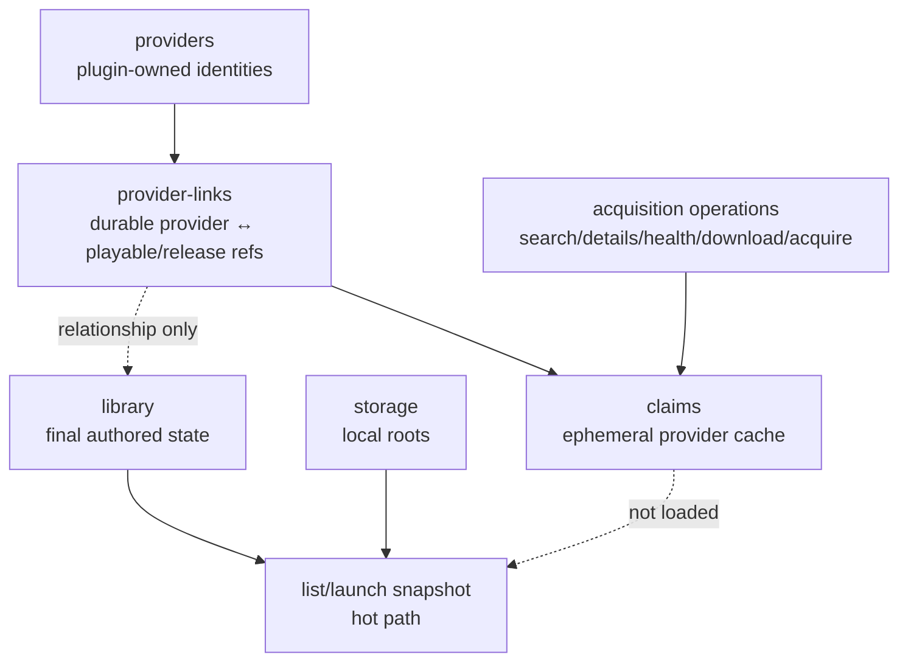
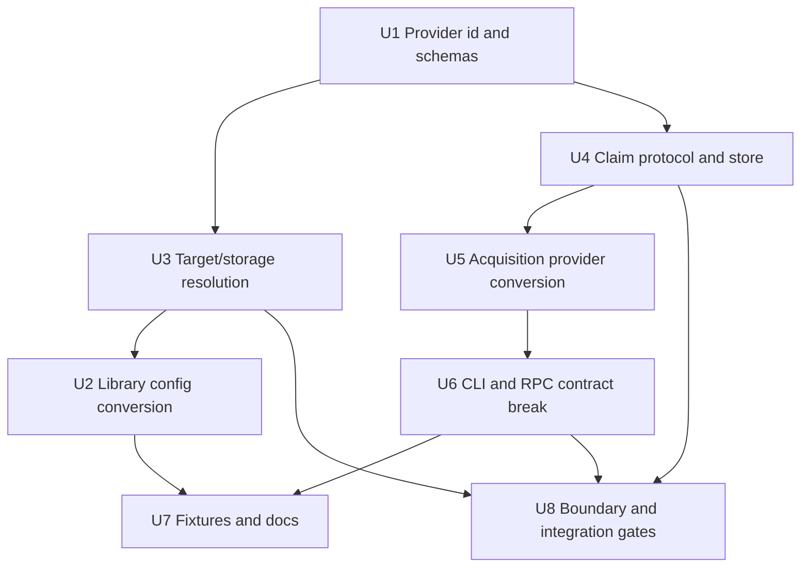
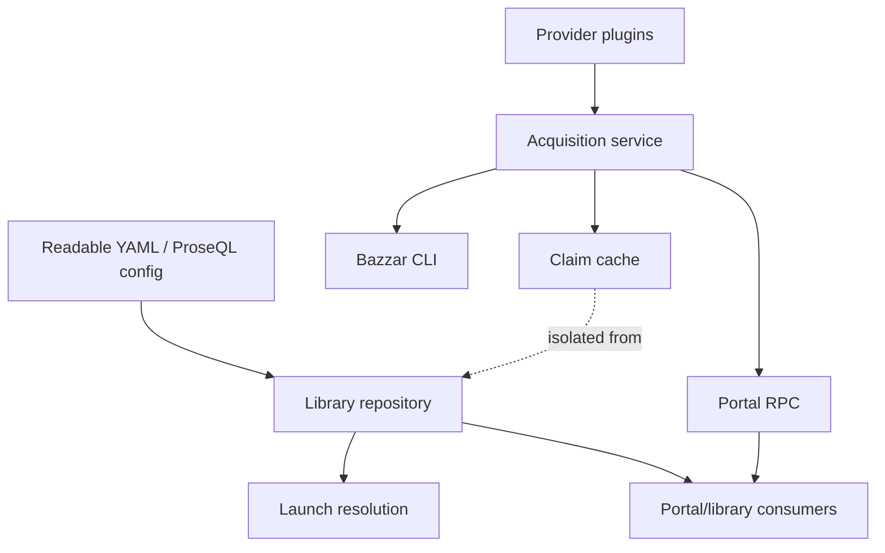

# refactor: Convert sources and acquisition to provider claims

## Summary

Replace Korri's overloaded source/sourceName model with explicit plugin-owned providers, durable provider-links, and ephemeral provider claims. The implementation is a single no-backwards-compat big-bang that realigns readable library config, ProseQL collections, acquisition protocols/RPC/CLI, Bazzar adapters, fixtures, and tests around the new vocabulary while keeping normal library list/launch paths free of claim-cache data.

---

## Problem Frame

Korri currently uses “source” for several different responsibilities: readable library origin/cascade records, file-vs-service target resolution, acquisition adapter identity, Bazzar source health, and candidate provenance. The product direction from the planning discussion is that the library is the durable final authored state; provider-origin relationships belong in a separate durable join surface; provider-authored data is an ephemeral cache that can be wiped or refreshed.

---

## Requirements

- R1. Replace the top-level readable `sources` section with explicit plugin-owned `providers`, using provider ids such as `@korri:steam` and `@korri:itchio`.
- R2. Remove `sources.kind` / `SourceKind` and do not reintroduce `files | service | metadata` as a provider-level classifier.
- R3. Keep `storage` as the local-root contract for file-backed content; local file paths must not require a provider relationship.
- R4. Add top-level durable `provider-links` records that connect a provider id to a playable id and, optionally, a release id, with a tiny provider-side `ref`.
- R5. Keep final authored values in `library`; do not put provider claims or field-level provenance inside library items.
- R6. Model acquisition outputs as provider claims across the board; claims are ephemeral, wipeable, refreshable cache/state.
- R7. Claims may be persisted in a ProseQL-backed or ProseQL-shaped store, but normal library list/launch snapshots must not load claims into active memory.
- R8. Fully break Bazzar/acquisition vocabulary: replace `sourceName`, `sourceNames`, `SourceCandidate`, `SourceDetails`, `SourceHealth`, and `validateSources` with provider/claim equivalents.
- R9. Manual authoring only for claim-to-library adoption in this slice; no automatic import operation replaces the current candidate-to-library adapter.
- R10. No backwards compatibility: no legacy schema aliases, RPC compatibility payloads, CLI flag aliases, or old command shims.
- R11. Provider ids are structured identifiers, not composite ids; do not use `:` as an ad-hoc separator inside provider-link keys or claim ids.
- R12. Existing plugin/acquisition trust boundaries remain: provider operation outputs are schema-validated, credential-bearing data is redacted, provider ids and provider refs are validated before logs/paths/cache keys/registry lookups, and invalid provider output becomes a typed defective-provider outcome.
- R13. Acquisition RPCs keep the existing local/access-control boundary and must reject unauthorized or non-local callers before provider plugin execution or filesystem/network side effects.
- R14. Claim payloads are bounded and safe to echo: URLs use allowed schemes without embedded credentials, text fields have size limits, and CLI/RPC rendering cannot emit terminal-control or log-injection payloads.

---

## Scope Boundaries

- No compatibility with existing `sources:` YAML, `source:` item/release fields, acquisition `sourceName` payloads, `validate-sources` CLI command, or `bazzar.source-adapter.v1` contract output.
- No field-level provenance, per-field source selection, or source/provider priority rules.
- No automatic claim-to-library import flow; users manually author final `library` and `provider-links` for now.
- No polished UI for comparing claims or resolving conflicts across providers.
- No production plugin marketplace/authoring UX beyond the provider identity and capability seams needed by this conversion.
- No broad federation of claims across peers; claims are local cache/state unless a later plan makes sharing explicit.
- No loading all claims into normal library list, catalog, or launch resolution paths.

### Deferred to Follow-Up Work

- Claim comparison/review UI for choosing which provider facts to copy into final library values.
- Automatic import/save operation that derives `library` and `provider-links` from selected claims.
- Provider priority rules and conflict-resolution policies.
- Claim garbage collection beyond safe wipe/refresh behavior.
- Durable plugin authoring/distribution UX for third-party providers.
- Post-landing solution docs for the provider/claim architecture and any schema-boundary surprises discovered during implementation.

---

## Context & Research

### Relevant Code and Patterns

- `product/platform/library/proseql/library-db.ts` defines canonical readable ProseQL collections and strict YAML validation; it currently declares `sources` and exports `SourcePayload`/`SourceRecord`.
- `product/platform/library/proseql/config-graph-db.ts` reuses the readable schema for ordered, read-only config roots and must preserve trust boundaries when `providers` and `provider-links` are added.
- `product/platform/library/config/records/source.ts` owns the current `SourceKind = service | files | metadata` vocabulary that this plan removes.
- `product/platform/library/config/records/library-item.ts` currently stores `source` on items/releases and validates `target` as a string/string-list; file-backed releases currently depend on `source.storage` resolution.
- `product/platform/library/config/source-target-resolution.ts` is the old file/service/metadata target-resolution seam that should be retired or replaced with locator/storage resolution that no longer depends on `sources.kind`.
- `product/platform/library/config/cascade-resolver.ts` currently folds a `source` layer into launch policy; this plan removes that cascade role from provider-links so provider relationships do not accidentally become launch policy.
- `product/platform/protocol/acquisition/*` contains the wire schemas that currently expose `sourceName` and `Source*` types.
- `product/platform/acquisition/*` contains the Bazzar-derived plugin registry, operation harness, search/details/validation/download/acquire flows, and source-name trust policy.
- `product/apps/cli/bazzar/bazzar-command.ts` and `product/apps/portal/api/acquisition/*` are the visible CLI/RPC consumers that must break to provider vocabulary together.
- `product/platform/library/acquisition/source-candidate-adapter.ts` is the current candidate-to-library bridge; it should be removed or reduced to claim rendering helpers because automatic import is out of scope.
- `product/platform/library/library-source.ts` uses “LibrarySource” for a library data-adapter concept, not provider/acquisition identity; the plan explicitly evaluates this naming collision.

### Institutional Learnings

- `docs/solutions/best-practices/proseql-canonical-library-with-derived-yaml-ids-2026-05-06.md`: persisted YAML payloads should keep ids derived from keys, with hydrated runtime records produced at the database seam.
- `docs/solutions/design-patterns/constrained-llm-entrypoint-classification-2026-05-24.md`: noisy external data should pass through scanner/classifier/validator/writer boundaries; external data must not author final YAML directly.
- `docs/solutions/design-patterns/explicit-cascade-folded-policy-over-incidental-signal-heuristics-2026-05-27.md`: when policy fields replace heuristics, delete the old heuristic path rather than running parallel mechanisms.
- `docs/solutions/integration-issues/effect-v4-rpc-schema-class-responses-2026-05-03.md`: schema big-bangs need transport-level RPC tests, not only direct handler/unit tests.
- `docs/solutions/best-practices/temporary-rocknix-sidecar-media-instead-of-es-gamelist-edits-2026-05-03.md`: temporary/cache state must stay visibly separate from durable product state.
- `docs/solutions/architecture-patterns/korri-product-platform-theme-architecture-2026-06-03.md`: protocol contracts belong under `product/platform/protocol`; app/theme layers should consume platform contracts rather than acquisition internals.

### External References

- External research skipped. The codebase has strong local ProseQL, Effect Schema, acquisition, CLI, and RPC patterns, and the user clarified the target architecture directly.

---

## Key Technical Decisions

- **Use `providers`, not `sources`, for capability-backed external/local provider identities:** Provider ids are explicit plugin-owned ids such as `@korri:steam`; YAML keys containing `:` should be quoted. This makes implementation ownership visible and stops treating provider identity as an arbitrary local string.
- **Use `provider-links` as the durable join collection:** Provider relationships live outside `library`, keyed by local record ids, and connect `provider`, `playable`, optional `release`, and a tiny structured `ref`.
- **Keep provider-links out of launch policy by default:** Launch/list behavior is driven by final library records, storage, systems, apps, runtimes, profiles, and explicit release targets. Provider-links explain external relationships and enable claim refresh; they do not make items visible or launchable by themselves.
- **Move file resolution to storage/locator semantics before removing source-based launch resolution:** Removing `sources.kind` means file-backed releases must name storage at the release target/content seam instead of relying on a source record's kind/storage pairing. The locator contract is a prerequisite for deleting source-based launch fields.
- **Make acquisition claim-shaped, not candidate-shaped:** Provider operations return/store claim records with provider ids and provider refs. Claims may carry display/playable/artifact hints, but those hints are not library records.
- **Persist claims as cache/state, not authored config:** Claims live behind an explicit `ProviderClaimStore` Effect service with live and in-memory layers, cache-root policy, write/query/wipe operations, and no participation in the hot readable config snapshot used by library list/launch.
- **Manual authoring is the adoption boundary:** The big-bang removes automatic candidate-to-library conversion. Users copy final values into `library` and write `provider-links`; a later import operation can automate that boundary.
- **Version-break Bazzar contracts:** The CLI/RPC surfaces should move to provider names and a new contract/version identity rather than preserving `bazzar.source-adapter.v1` or old flag names.
- **Review `LibrarySource` naming separately:** If a rename can be contained, prefer a clearer name such as `LibraryDataSource` or `LibraryAdapter`; if the churn is disproportionate, document that it is a data-adapter term unrelated to providers.

---

## Open Questions

### Resolved During Planning

- **Should provider relationships be inline in library?** No. Use top-level `provider-links`.
- **Should `sources.kind` survive?** No. Remove it from the architecture.
- **Should provider ids be plugin-owned?** Yes. Use explicit ids like `@korri:steam`.
- **Should acquisition keep short internal source names?** No. Full break to provider ids across the architecture.
- **Should acquisition outputs be claim-shaped immediately?** Yes. Full break across the board.
- **Should the big-bang include automatic claim-to-library import?** No. Manual authoring only for now.
- **Should this be split into compatibility phases?** No. One full big-bang implementation item, while still structured into atomic implementation units inside the plan.

### Deferred to Implementation

- **Exact claim storage backend internals:** The plan requires a `ProviderClaimStore` service with lazy query/write/wipe semantics outside the hot library snapshot. The implementer can choose the smallest ProseQL-backed or ProseQL-shaped persistence mechanism behind that service that satisfies isolation tests.
- **Exact claim id derivation:** Prefer stable ids derived from provider id + provider ref when straightforward; implementation may use generated ids if tests prove provider-links do not depend on claim-id stability.
- **Exact `LibrarySource` rename:** Decide after checking the blast radius in code. The required outcome is no confusion between library data adapters and providers.
- **Exact YAML migration mechanics for local developer fixtures:** No compatibility loader is allowed, but an implementation-time helper script or one-off rewrite can update checked-in fixtures and local sample files.

---

## High-Level Technical Design

> *This illustrates the intended approach and is directional guidance for review, not implementation specification. The implementing agent should treat it as context, not code to reproduce.*

The durable authored graph is `providers`, `provider-links`, `storage`, and `library`. The ephemeral graph is `claims` and acquisition operation cache. Provider-links may help refresh/query claims, but only library records make playables visible or launchable.

---

## Implementation Units

### U1. Define provider ids, provider records, and provider-links

**Goal:** Establish the durable provider vocabulary and join-record schema before changing call sites.

**Requirements:** R1, R4, R10, R11, R12

**Dependencies:** None

**Files:**
- Create: `product/platform/library/config/records/provider.ts`
- Create: `product/platform/library/config/records/provider-link.ts`
- Create: `product/platform/acquisition/provider-ids.ts`
- Modify: `product/platform/library/proseql/library-db.ts`
- Modify: `product/platform/library/proseql/config-graph-db.ts`
- Test: `product/platform/library/config/records/provider.test.ts`
- Test: `product/platform/library/config/records/provider-link.test.ts`
- Test: `product/platform/acquisition/trust-policies.test.ts`
- Test: `product/platform/library/proseql/library-db.test.ts`
- Test: `product/platform/library/proseql/config-graph-db.test.ts`

**Approach:**
- Add a provider id validator that accepts explicit plugin-owned ids such as `@korri:itchio` and rejects path-like, empty, unscoped, or ambiguous ids.
- Replace the old `SourcePayload` collection schema with a minimal `ProviderPayload` that earns its top-level place as a named provider identity, not as a file/service/metadata classifier.
- Add `ProviderLinkPayload` as a keyed ProseQL collection with `provider`, `playable`, optional `release`, and a tiny structured `ref`.
- Define the shared provider ref contract with bounded length, no control characters, safe encoding/hash requirements for cache keys and paths, and explicit URL/provider-item-id/external-id variants.
- Keep provider-link record keys local and YAML-friendly; the structured `provider` field carries the plugin-owned id.
- Update strict readable-document validation so `providers` and `provider-links` are accepted and `sources` is not a canonical section.
- Preserve read-only config graph trust rules: removable or untrusted roots should not gain authority to add providers/provider-links unless an existing trust policy explicitly allows the equivalent durable library changes.

**Execution note:** Implement schema tests first because every later unit depends on these contracts.

**Patterns to follow:**
- `product/platform/library/config/records/storage.ts` for simple keyed payload records.
- `product/platform/library/config/playable-id.ts` for id validation style.
- `product/platform/acquisition/source-names.ts` for the trust-policy seam being replaced.
- `product/platform/library/proseql/library-db.ts` for ProseQL keyed collection registration.

**Test scenarios:**
- Happy path: decoding a provider id like `@korri:itchio` succeeds and can be used as a `providers` map key when quoted in YAML.
- Error path: decoding provider ids without a namespace, with traversal characters, empty segments, embedded whitespace, or filesystem separators fails with a typed schema/validation error.
- Happy path: a provider-link can connect `provider: "@korri:steam"` to `playable: braid`, `release: steam`, and a ref `{ kind: "provider-item-id", value: "26800" }`.
- Happy path: a metadata-only provider-link can omit `release` while still naming `provider`, `playable`, and `ref`.
- Error path: provider-links reject unknown playable id syntax, empty refs, oversized refs, control characters, traversal-looking path separators where raw refs are persisted, and provider ids that fail the provider id validator.
- Integration: readable YAML with `providers` and `provider-links` decodes through `openKorriLibraryDb`; YAML with legacy `sources` is not accepted as canonical input.
- Integration: config graph read-only guards expose `providers` and `provider-links` according to durable-config trust policy and do not silently allow them from roots that cannot write library records.

**Verification:**
- Provider/provider-link schemas are the only durable source-origin relationship schemas in the readable config layer.
- `sources` is no longer part of the canonical ProseQL collection schema.

### U2. Convert readable library records and repository APIs

**Goal:** Make `library` final authored state that no longer stores source provenance or field-level provider data, while exposing providers/provider-links through repository APIs.

**Requirements:** R1, R2, R4, R5, R9, R10

**Dependencies:** U1, U3

**Files:**
- Modify: `product/platform/library/config/records/library-item.ts`
- Modify: `product/platform/library/config/playable-id.ts`
- Modify: `product/platform/library/playable-library.ts`
- Modify: `product/platform/library/proseql/library-repository.ts`
- Modify: `product/platform/library/proseql/library-db.ts`
- Modify: `product/platform/library/proseql/config-graph-db.ts`
- Modify: `product/platform/library/config/cascade-resolver.ts`
- Modify: `product/platform/library/library-source.ts`
- Modify: `product/platform/library/library-source-layer-live.ts`
- Modify: `product/platform/library/library-source-layer-memory.ts`
- Test: `product/platform/library/config/records/library-item.test.ts`
- Test: `product/platform/library/playable-library.test.ts`
- Test: `product/platform/library/proseql/library-repository.test.ts`
- Test: `product/platform/library/config/readable-cascade-resolver.test.ts`

**Approach:**
- Remove `source` from library item and release payloads as the provenance/origin field only after the storage/locator contract from U3 is available for file-backed launch resolution; provider relationships live in `provider-links` instead.
- Add repository operations for provider and provider-link records alongside existing storage/system/app/runtime/library operations.
- Ensure provider-links do not create playables and do not affect `listPlayableEntries` unless a corresponding library item exists.
- Remove the source cascade layer from launch resolution. Provider-specific launch defaults should be expressed through final library/app/runtime/profile policy, not inferred from provider-links.
- Evaluate the `LibrarySource` naming collision. Prefer renaming the data-adapter interface if the blast radius is contained; otherwise leave it with explicit documentation that it is not an acquisition provider.
- Keep legacy API aliases out of the public repository contract. If temporary internal helpers are necessary during the single PR, remove them before completion.

**Execution note:** Characterize current list/launch behavior before removing `source` from library records, then update tests to the provider-link model.

**Patterns to follow:**
- `product/platform/library/proseql/library-repository.ts` existing upsert methods for collection API shape.
- `product/platform/library/config/cascade-resolver.ts` for how launch context currently folds layers.
- `product/platform/library/playable-library.ts` for runtime entry derivation from library records.

**Test scenarios:**
- Happy path: a library item with final title/releases and no provider-links still appears in `listPlayableEntries` and remains launchable when release target/app/runtime data are complete.
- Happy path: a provider-link for an existing playable/release is queryable from the repository but does not alter the playable's final title, release list, or launch target.
- Edge case: multiple provider-links for the same playable are allowed and preserve distinct provider ids/refs without changing library item shape.
- Edge case: a provider-link that references a missing playable does not cause `listPlayableEntries` to synthesize an entry.
- Error path: legacy `source` fields on library items/releases fail strict decoding rather than being ignored or migrated.
- Integration: launch resolution no longer requires a source/provider record for a file-backed or URI-backed release.
- Integration: app/library RPC list results do not expose claim payloads or provider-link-only entries.

**Verification:**
- The hot library runtime can list and launch final authored items without reading provider claims.
- Durable provider relationships are accessible through explicit provider-link APIs rather than inline library fields.

### U3. Define storage and locator resolution

**Goal:** Define the replacement locator contract first, then remove the old `files | service | metadata` target-resolution model and give file-backed releases an explicit storage/path contract.

**Requirements:** R2, R3, R5, R10

**Dependencies:** U1

**Files:**
- Modify: `product/platform/library/config/source-target-resolution.ts`
- Modify: `product/platform/library/config/records/library-item.ts`
- Modify: `product/platform/library/config/cascade-resolver.ts`
- Modify: `product/platform/library/proseql/library-repository.ts`
- Modify: `product/platform/library/config/compose-launch-spec.ts`
- Modify: `product/platform/library/config/app-materializer.ts`
- Test: `product/platform/library/config/source-target-resolution.test.ts`
- Test: `product/platform/library/config/readable-cascade-resolver.test.ts`
- Test: `product/platform/library/proseql/library-repository.test.ts`
- Test: `product/platform/library/config/app-materializer.test.ts`

**Approach:**
- Retire target resolution that branches on a source record's kind.
- Introduce a release target/content representation that can express at least two launchable locator cases: URI-like targets that pass through unchanged and file-backed targets that name a storage root plus relative path.
- Keep absolute-path and traversal rejection for file-backed targets at the storage/path seam.
- Preserve template materialization variables such as `{target}` and `{content.path}` by deriving them from the new locator result rather than a source record.
- Rename typed errors away from source vocabulary where they remain visible.

**Patterns to follow:**
- `product/platform/library/config/source-target-resolution.ts` existing containment checks for absolute/traversal rejection.
- `product/platform/library/config/app-materializer.ts` existing resolved-context-to-template mapping.

**Test scenarios:**
- Happy path: URI-like release target resolves as a launch locator without requiring a provider or storage record.
- Happy path: file-backed release target with `storage: roms` and a relative path resolves to a content path under the storage root.
- Error path: file-backed target with an absolute path is rejected.
- Error path: file-backed target with `../` traversal is rejected.
- Error path: file-backed target naming missing storage returns a typed storage-not-found error.
- Edge case: metadata-only provider-links without launch targets cannot make a release launchable.
- Integration: app templates receive `{target}` and `{content.path}` values from locator resolution with no dependency on `SourceRecord`.

**Verification:**
- No code path needs `sources.kind` to decide whether a release target is a file, URI, or metadata-only relationship.

### U4. Define provider claims and isolated claim storage

**Goal:** Make acquisition outputs claim-shaped and persist/query claims without loading them into the normal library list/launch snapshot.

**Requirements:** R6, R7, R9, R12, R14

**Dependencies:** U1

**Files:**
- Create: `product/platform/protocol/acquisition/claim.ts`
- Create: `product/platform/acquisition/claims/claim-store.ts`
- Create: `product/platform/acquisition/claims/claim-store-live.ts`
- Create: `product/platform/acquisition/claims/claim-store-memory.ts`
- Modify: `product/platform/protocol/acquisition/candidate.ts`
- Modify: `product/platform/protocol/acquisition/source-health.ts`
- Modify: `product/platform/protocol/acquisition/download-resolution.ts`
- Modify: `product/platform/protocol/acquisition/artifact-acquisition.ts`
- Modify: `product/platform/protocol/acquisition/errors.ts`
- Modify: `product/platform/protocol/acquisition/plugin.ts`
- Modify: `product/platform/acquisition/acquisition-service.ts`
- Modify: `product/platform/acquisition/plugin-contract-codecs.ts`
- Test: `product/platform/protocol/acquisition/claim.test.ts`
- Test: `product/platform/acquisition/claims/claim-store.test.ts`
- Test: `product/platform/acquisition/plugin-contract-codecs.test.ts`
- Test: `product/platform/library/proseql/library-repository.test.ts`

**Approach:**
- Introduce `ProviderClaim` as the acquisition-facing output type. Claims name `provider`, carry a tiny provider-side `ref`, and hold provider-authored payload/hints such as candidate/details/artifact information.
- Replace old candidate/details wire names with claim-specific records. The claim payload may still have candidate/details variants when useful, but exported protocol names must be provider/claim vocabulary and must not preserve `SourceCandidate`/`SourceDetails` aliases.
- Store claims in an adjacent cache/state surface that supports lazy query and wipe/refresh operations. It may be ProseQL-backed or ProseQL-shaped, but it must not be part of `collectionsSchema` used by normal readable config snapshots unless explicit filtering proves it is never loaded into list/launch.
- Wire acquisition operations through `ProviderClaimStore`: live acquisition layers receive a claim-store implementation, tests use an in-memory layer, and search/details-style operations write/query claims through the service rather than returning untracked transient objects.
- Define wipe semantics: deleting claims never deletes library items or provider-links. Provider-links can remain as durable breadcrumbs even when the current claim cache is empty.
- Enforce claim payload bounds: URL scheme allowlists, no embedded URL credentials, size limits for provider text fields, and safe rendering/escaping expectations for CLI/RPC/log consumers.
- Keep claims structurally incompatible with `LibraryItemPayload` so provider data cannot be upserted as final library state without an explicit future import boundary.

**Execution note:** Start with isolation tests that prove claims cannot affect library list/launch.

**Patterns to follow:**
- `product/platform/protocol/acquisition/candidate.ts` for Effect Schema protocol style.
- `product/platform/acquisition/artifact-acquisition.ts` for cache/staging root conventions.
- `docs/solutions/best-practices/temporary-rocknix-sidecar-media-instead-of-es-gamelist-edits-2026-05-03.md` for keeping cache state separate from durable product state.

**Test scenarios:**
- Happy path: a provider operation can create/store a provider claim with provider id, ref, fetched timestamp, and bounded claim payload.
- Happy path: querying claims by provider id returns only matching claims and does not load unrelated provider caches.
- Integration: live acquisition search writes provider claims through `ProviderClaimStore`; in-memory acquisition tests can assert stored claims without filesystem or ProseQL side effects.
- Edge case: wiping claims for one provider leaves other providers' claims intact.
- Edge case: wiping all claims leaves provider-links and library items intact.
- Error path: invalid provider claim payload from a plugin becomes a defective-provider outcome, not a partially stored claim.
- Error path: claim payloads with oversized text, credential-bearing URLs, unsafe URL schemes, terminal-control text, or traversal-like refs are rejected or sanitized before storage/output.
- Integration: claim store populated with multiple claims; `listPlayableEntries` and app library list outputs are unchanged unless matching library items already exist.
- Integration: provider-link exists for a wiped claim ref; library list and launch behavior remain unaffected.

**Verification:**
- Claims are queryable through acquisition surfaces but not included in active library snapshots.
- Claim wipe/refresh behavior is safe and cannot mutate final library state.

### U5. Convert acquisition plugins, registry, and operations to providers

**Goal:** Fully break Bazzar/acquisition internals from sourceName/source vocabulary to provider ids and provider claims.

**Requirements:** R6, R8, R10, R11, R12, R14

**Dependencies:** U1, U4

**Files:**
- Delete: `product/platform/acquisition/source-names.ts`
- Modify: `product/platform/acquisition/provider-ids.ts`
- Rename/Modify: `product/platform/acquisition/source-search.ts` -> `product/platform/acquisition/provider-search.ts`
- Rename/Modify: `product/platform/acquisition/source-details.ts` -> `product/platform/acquisition/provider-details.ts`
- Rename/Modify: `product/platform/acquisition/validation/source-validation.ts` -> `product/platform/acquisition/validation/provider-validation.ts`
- Modify: `product/platform/acquisition/acquisition-service.ts`
- Modify: `product/platform/acquisition/acquisition-config.ts`
- Modify: `product/platform/acquisition/plugins/registry.ts`
- Modify: `product/platform/acquisition/plugins/chip8archive.ts`
- Modify: `product/platform/acquisition/plugins/levelsharesquare.ts`
- Modify: `product/platform/acquisition/plugins/approved-fixtures.ts`
- Modify: `product/platform/acquisition/plugin-operation-harness.ts`
- Modify: `product/platform/acquisition/download-resolution/download-resolution.ts`
- Modify: `product/platform/acquisition/artifact-acquisition.ts`
- Rename/Modify: `product/platform/library/acquisition/source-candidate-adapter.ts` -> `product/platform/library/acquisition/provider-claim-adapter.ts` or delete if no display-only helper remains
- Test: `product/platform/acquisition/acquisition-service.test.ts`
- Test: `product/platform/acquisition/acquisition-live.test.ts`
- Test: `product/platform/acquisition/artifact-acquisition.test.ts`
- Test: `product/platform/acquisition/trust-policies.test.ts`
- Test: `product/platform/library/acquisition/source-candidate-adapter.test.ts` or replacement `product/platform/library/acquisition/provider-claim-adapter.test.ts`

**Approach:**
- Rename registry metadata from source names to provider ids and update plugin selection, validation, logging, and typed errors around provider ids.
- Convert plugin operation outputs into provider claims or provider-claim-compatible results at the operation harness boundary.
- Rename health validation to provider health and ensure defective-provider outcomes use provider vocabulary.
- Keep existing URL/path/credential trust policies, but route them through provider id validation and provider-oriented errors.
- Remove `sourceCandidatePlayableToLibraryItem` as an automatic import bridge. If display helpers remain useful for search results, keep them claim-specific and unable to write `LibraryItemPayload` or call repository write APIs.

**Patterns to follow:**
- `product/platform/acquisition/plugins/registry.ts` current registry lookup and validation boundary.
- `product/platform/acquisition/plugin-operation-harness.ts` current plugin error wrapping/redaction.
- `product/platform/acquisition/plugin-contract-codecs.ts` current schema validation at plugin boundary.

**Test scenarios:**
- Happy path: registry exposes provider ids and looks up plugins by `@korri:*` provider id.
- Error path: registry rejects old short source names, invalid provider ids, unknown provider ids, and path-like ids.
- Happy path: provider search returns/stores provider claims with provider ids, not sourceName fields.
- Happy path: provider details and provider health use provider ids through service, plugin, and protocol layers.
- Error path: plugin throws during search/details/download; returned error includes safe provider id and redacted message.
- Error path: plugin returns invalid claim output; operation reports defective-provider without writing invalid claim data.
- Integration: approved fixture providers still exercise search, details, validation, download resolution, and artifact acquisition through the live acquisition service.
- Error path: provider claim display helpers cannot be used to construct or upsert `LibraryItemPayload`; manual authoring remains the only adoption path in this slice.

**Verification:**
- No `sourceName` or `SourceCandidate` vocabulary remains in acquisition protocol/service code except in historical docs or explicitly deferred migration notes.

### U6. Break CLI and RPC contracts to provider vocabulary

**Goal:** Update user/agent-visible acquisition surfaces so CLI, RPC tags, request fields, response fields, and contract versions all speak provider/claim vocabulary.

**Requirements:** R6, R8, R10, R12, R13, R14

**Dependencies:** U5

**Files:**
- Modify: `product/apps/cli/bazzar/bazzar-command.ts`
- Modify: `product/platform/protocol/acquisition/source-health.ts`
- Modify: `product/platform/protocol/acquisition/download-resolution.ts`
- Modify: `product/platform/protocol/acquisition/artifact-acquisition.ts`
- Modify: `product/platform/protocol/acquisition/errors.ts`
- Modify: `product/apps/portal/api/acquisition/search.rpc.ts`
- Modify: `product/apps/portal/api/acquisition/details.rpc.ts`
- Modify: `product/apps/portal/api/acquisition/resolve-download.rpc.ts`
- Modify: `product/apps/portal/api/acquisition/acquire-artifact.rpc.ts`
- Rename/Modify: `product/apps/portal/api/acquisition/validate-sources.rpc.ts` -> `product/apps/portal/api/acquisition/validate-providers.rpc.ts`
- Rename/Modify: `product/apps/portal/api/acquisition/validate-sources.rpc-handler.ts` -> `product/apps/portal/api/acquisition/validate-providers.rpc-handler.ts`
- Modify: `product/apps/portal/api/server/rpc-server.ts`
- Modify: `product/apps/portal/api/acquisition/acquisition-rpc-handlers.test.ts`
- Test: `product/apps/cli/bazzar/bazzar-command.test.ts`
- Test: `product/apps/portal/api/server/rpc-server.test.ts`
- Test: `product/apps/portal/api/acquisition/acquisition-rpc-handlers.test.ts`

**Approach:**
- Rename Bazzar CLI filters/commands from source to provider vocabulary, including `validate-providers` and provider id filtering.
- Bump the machine-readable contract identity away from `bazzar.source-adapter.v1`; do not emit legacy aliases or old envelope field names.
- Rename RPC tags that include `sources` and update payload fields across all acquisition RPCs to provider ids.
- Preserve the existing intended local/access-control boundary for acquisition RPCs and reject unauthorized callers before provider plugin execution, outbound network work, or filesystem staging.
- Ensure RPC integration tests cross the transport boundary for renamed response schemas, not only direct handler calls.
- Preserve stdout/stderr discipline and JSON-line contract behavior while changing the vocabulary.
- Ensure CLI/RPC output encodes or strips terminal-control text and credential-bearing provider data before display.

**Execution note:** Add/update transport-level tests before relying on direct handler tests for renamed schemas.

**Patterns to follow:**
- `product/apps/cli/bazzar/bazzar-command.test.ts` current JSON contract tests.
- `product/apps/portal/api/server/rpc-server.test.ts` tag registration assertions.
- `docs/solutions/integration-issues/effect-v4-rpc-schema-class-responses-2026-05-03.md` RPC schema-boundary lesson.

**Test scenarios:**
- Happy path: `korri bazzar search` with provider filters returns claim-shaped JSON using provider ids.
- Happy path: `korri bazzar validate-providers` emits a single machine-readable JSON line with provider health vocabulary and the new contract version.
- Error path: old `validate-sources` command and old `--sources` filter are not accepted.
- Error path: invalid provider filter returns a caller error that does not leak internal paths or credentials.
- Error path: unauthorized acquisition RPC callers are rejected before provider plugins run.
- Integration: acquisition RPC tags include provider vocabulary and no longer register `app.acquisition.validate-sources`.
- Integration: an in-process RPC call for provider search/health crosses the real transport and decodes provider claim/health schemas successfully.
- Error path: CLI/RPC rendering of claim text with terminal-control bytes or credential-bearing URLs is safe and does not emit raw unsafe content.

**Verification:**
- CLI and RPC surfaces are consistently provider-based and have no backwards-compatible source aliases.

### U7. Rewrite fixtures, examples, and planning docs for the new authored model

**Goal:** Update checked-in YAML fixtures and relevant docs so examples demonstrate final library state, provider-links, and ephemeral claims without mixing responsibilities.

**Requirements:** R1, R3, R4, R5, R6, R9, R10

**Dependencies:** U2, U3, U6

**Files:**
- Modify: `product/platform/library/config/fixtures/steam-full.korri.yaml`
- Modify: `product/platform/library/config/fixtures/ryubing-full.korri.yaml`
- Modify: `docs/plans/2026-06-05-001-feat-readable-library-schema-plan.md`
- Modify: `docs/plans/2026-06-04-001-feat-korri-bazzar-migration-plan.md`
- Modify: `docs/research/bazzar-migration-inventory.md`
- Modify: `tools/testing/standards/bazzar-retirement-gate.test.ts`
- Test: `product/platform/library/config/records/readable-schema.test.ts`
- Test: `product/platform/library/proseql/library-db.test.ts`
- Test: `tools/testing/standards/bazzar-retirement-gate.test.ts`

**Approach:**
- Rewrite fixtures from `sources`/`source` to `providers`/`provider-links` and explicit storage/file locators.
- Keep library examples compact: final values in `library`, many external relationships in `provider-links`, claim examples only in acquisition/cache docs or tests.
- Update Bazzar migration docs and retirement gate language so “source adapter” parity is replaced by provider contract expectations.
- Avoid creating a migration compatibility story. Docs may include “old shape removed” notes, but implementation must not parse the old shape.

**Patterns to follow:**
- Existing fixture files under `product/platform/library/config/fixtures/` for canonical readable examples.
- Existing plan docs as historical context; update only where they would otherwise instruct the old source model for active work.

**Test scenarios:**
- Happy path: updated Steam fixture decodes with quoted provider ids, provider-links, and launchable Steam release targets.
- Happy path: updated Ryubing/local fixture decodes with storage-backed file targets and no provider requirement for local file resolution.
- Error path: old fixture snippets with `sources:` or item/release `source:` fail schema validation in tests.
- Integration: Bazzar retirement gate reflects the new provider contract and does not assert obsolete source-adapter vocabulary.

**Verification:**
- Checked-in examples no longer teach `sources.kind`, `sourceName`, or source-candidate vocabulary.

### U8. Add boundary, memory, and contract regression gates

**Goal:** Protect the new architecture from regression: claims must stay out of library hot paths, provider ids must stay trusted, and old vocabulary must not re-enter source code.

**Requirements:** R6, R7, R8, R10, R12, R13, R14

**Dependencies:** U3, U4, U6

**Files:**
- Create: `tools/testing/standards/provider-claim-boundaries.test.ts`
- Modify: `tools/testing/standards/artifact-boundaries.test.ts`
- Modify: `product/platform/protocol/acquisition/schemas.test.ts`
- Modify: `product/platform/library/proseql/library-repository.test.ts`
- Modify: `product/apps/portal/api/server/rpc-server.test.ts`
- Modify: `product/platform/acquisition/acquisition-live.test.ts`
- Test: `tools/testing/standards/provider-claim-boundaries.test.ts`

**Approach:**
- Add static boundary checks that prevent library list/launch implementation modules from importing claim-store implementation types.
- Add grep-style or AST-based contract checks for forbidden old acquisition vocabulary in protocol/acquisition code, with narrowly documented exceptions for historical docs if necessary.
- Add runtime tests proving populated claims and provider-links do not synthesize library entries or affect launch resolution.
- Add provider-id and provider-ref trust tests covering logs, paths, cache keys, registry lookup boundaries, and collision-safe key derivation.
- Add RPC access-boundary tests that prove side-effecting acquisition operations reject unauthorized callers before provider execution.
- Include Fallow audit in verification because this big-bang changes architecture boundaries and many names.

**Patterns to follow:**
- Existing standards tests under `tools/testing/standards/`.
- Existing ProseQL repository integration tests for fixture-backed readable DB behavior.

**Test scenarios:**
- Integration: claim store contains claims for a playable not in `library`; library list returns no entry for that playable.
- Integration: provider-link exists for a playable not in `library`; library list returns no entry for that playable.
- Integration: library item exists and provider-link exists; wiping all claims leaves library list and launch resolution unchanged.
- Error path: old protocol symbols such as `SourceCandidate`, `SourceDetails`, `SourceHealth`, and fields named `sourceName` are absent from active acquisition protocol/service code.
- Error path: library repository hot-path modules cannot import claim-store implementation modules.
- Integration: provider-id validation is enforced before registry lookup, plugin operation logs, filesystem staging paths, and RPC errors.
- Error path: provider refs with traversal-like strings, terminal escapes, oversized values, or collision-prone raw encodings cannot become filesystem paths, cache keys, or raw log lines.
- Error path: unauthorized RPC callers cannot trigger provider search/details/download/acquire side effects.

**Verification:**
- Architectural regression tests fail if claims enter the hot library path or old acquisition source vocabulary returns.

---

## System-Wide Impact

- **Interaction graph:** Readable YAML, ProseQL config graph, library repository, launch resolver, acquisition service, plugin registry, Bazzar CLI, portal RPC, fixtures, and standards tests all change together.
- **Error propagation:** Source-named typed errors become provider/locator/storage errors. Provider operation failures should preserve existing safe summaries, redaction, and defective-provider classification.
- **State lifecycle risks:** Claims are wipeable cache; provider-links are durable breadcrumbs. Wiping claims must not cascade into library or provider-links. Deleting library items may leave provider-links stale until a later garbage-collection feature.
- **API surface parity:** CLI, RPC tags, protocol schemas, plugin metadata, health validation, download resolution, artifact acquisition, and tests all break to provider vocabulary in one PR.
- **Integration coverage:** Unit tests must be paired with full ProseQL fixture decode tests and at least one real RPC transport test for renamed acquisition schemas.
- **Unchanged invariants:** Final authored library records are still the only source of playable list/launch truth; storage still describes local roots; generated files remain read-only and must be regenerated through existing tooling if touched.

---

## Risks & Dependencies

| Risk | Mitigation |
|------|------------|
| Existing local YAML files stop loading because `sources`/`source` are removed | Accepted by no-backcompat scope; update checked-in fixtures and document the break clearly. Do not add compatibility loaders. |
| Claims accidentally enter hot library list/launch memory path | Keep claims in adjacent cache/store and add static plus runtime boundary tests in U8. |
| Removing source cascade changes launch behavior that depended on source-level policy | Move intended launch policy to final library/app/runtime/profile settings during fixture rewrites; characterize affected fixtures before removal. |
| Provider ids with `@`/`:` create path/log/YAML hazards | Validate provider ids at every external boundary, quote YAML keys in fixtures, and never derive filesystem paths directly from raw provider ids. |
| RPC handlers pass tests but transport schema decoding breaks | Add in-process RPC transport tests for provider claim/health responses. |
| Bazzar parity/retirement docs conflict with new provider vocabulary | Version-break the Bazzar contract and update retirement gate docs/tests in the same item. |
| Big-bang rename conflicts with active readable-apps/Steam work | Land or consciously pause conflicting active work before implementation; if conflict is unavoidable, rebase those branches on the provider conversion. |
| `LibrarySource` data-adapter naming remains confusing | Explicitly decide and test either a contained rename or a documented exception during U2. |

---

## Documentation / Operational Notes

- Update active readable-schema and Bazzar migration docs enough that future work does not follow the old source/sourceName model.
- After implementation lands and is verified, capture a solution doc for the provider/provider-link/claim architecture and any pitfalls discovered.
- This is a local product schema break; no rollout compatibility or migration shim is planned.
- Claims are cache/state: operators may wipe them during debugging without affecting library records or launchability.

---

## Sources & References

- Work item: `work/items/active/01KV73P1C8AYNJ682RBPVNV2VE-provider-claims-big-bang/work.md`
- Current source record: `product/platform/library/config/records/source.ts`
- Current library item schema: `product/platform/library/config/records/library-item.ts`
- Current source target resolver: `product/platform/library/config/source-target-resolution.ts`
- Current readable DB: `product/platform/library/proseql/library-db.ts`
- Current library repository: `product/platform/library/proseql/library-repository.ts`
- Current acquisition protocol: `product/platform/protocol/acquisition/candidate.ts`
- Current acquisition registry: `product/platform/acquisition/plugins/registry.ts`
- Current Bazzar CLI: `product/apps/cli/bazzar/bazzar-command.ts`
- Relevant learning: `docs/solutions/best-practices/proseql-canonical-library-with-derived-yaml-ids-2026-05-06.md`
- Relevant learning: `docs/solutions/design-patterns/constrained-llm-entrypoint-classification-2026-05-24.md`
- Relevant learning: `docs/solutions/integration-issues/effect-v4-rpc-schema-class-responses-2026-05-03.md`
