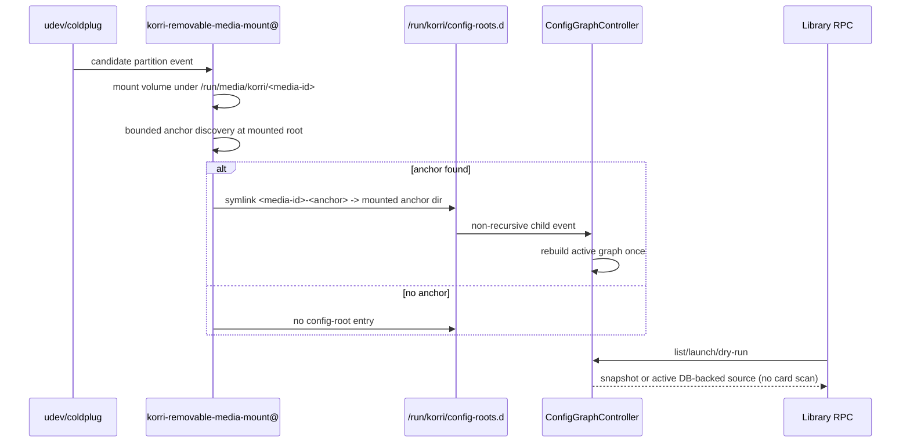

# fix: Stop removable-media config scans on launch

## Summary

Fix Bandai's slow GBA/Yoshi launch by making removable media contribute only explicit, small Korri config anchors and by routing daemon library/list/launch resolution through the already-initialized config-graph controller. The config schema stays the same for built-in, local, and removable config; what changes is when and where discovery happens.

---

## Problem Frame

Bandai's `app.library.launch.dry-run` and real launch both take roughly 4.5s before RetroArch/mGBA starts, while server status is fast. The hot path still opens ProseQL and recursively discovers config fragments for every library call; because the removable-media module currently signals the whole mounted card as a config root, launch/dry-run/catalog become proportional to the SD card's ROM tree.

---

## Requirements

- R1. Preserve one Korri config schema and cascade semantics across platform defaults, local config, operator roots, and external/removable media.
- R2. Treat a mounted SD/USB volume as a discovery source, not automatically as a config-graph root.
- R3. Do not recursively scan an entire removable-media root during launch, dry-run, catalog snapshot, or normal library listing.
- R4. Discover external config during media insert and boot coldplug through explicit naming conventions, then feed discovered roots into the existing config graph.
- R5. Keep user organization flexible inside discovered config anchors; do not introduce an SD-card-only schema or one required full-card layout.
- R6. Preserve existing removable-media safety boundaries: collection-scoped trust, root-owned signal dir, mount-table validation, stale symlink rejection, and last-known-good behavior.
- R7. Keep rocknix mode, CLI/test callers, and plugin-wrapped sources working while daemon ProseQL callers take the fast path.
- R8. Verify the fix with unit coverage and a Bandai timing gate showing Yoshi dry-run/launch no longer pays the whole-card scan.

---

## Scope Boundaries

- No emulator/runtime startup optimization; the delay is before emulator spawn.
- No new config schema and no SD-card-specific record shape.
- No config authoring/write-target semantics for removable media.
- No UI for browsing, trusting, or selecting cards.
- No trusted-marker escalation for execution-privileged collections; untrusted removable roots remain data-only.
- No full redesign of catalog federation, plugin discovery, or game asset storage.

### Deferred to Follow-Up Work

- Desktop/non-daemon `hono-app.ts` lazy-controller parity; this slice targets the Bandai daemon path and only preserves default/non-daemon callers.
- Upstream ProseQL unreadable-directory/per-root error-policy improvements; this plan avoids whole-card roots but treats discovered anchors as config-only roots, not general content roots.
- Config authoring write-target policy for records that originate from read-only/removable roots.

---

## Context & Research

### Relevant Code and Patterns

- `product/systems/nixos/modules/korri-removable-media.nix` mounts removable partitions and currently symlinks each whole mountpoint into `config-roots.d`.
- `product/platform/library/library-source-layer-live.ts` contains `resolveAllConfigGraphRoots`, `removableConfigGraphRootsFromSignalDir`, and the per-call `withLibraryRepository` ProseQL open that causes launch-time scans.
- `product/platform/library/config-graph-controller.ts` already re-resolves roots on signal-dir changes, maintains last-known-good playable snapshots, and broadcasts config events; it does not yet keep an active DB lease for launch cascade resolution.
- `product/plugins/library-source-layer.ts` wraps `createLiveLibrarySourceService()` with plugin-provided sources and resources; this is the live layer used by server RPC handlers.
- `product/apps/portal/api/server/rpc-server.ts` composes `PluginLibrarySourceLayerLive` statically, so injecting a daemon-owned controller requires a deliberate RPC handler/layer seam.
- `product/services/device/korrid.ts` already owns a `ConfigGraphController` and passes it to `createHonoApp` for config-event SSE.
- `product/platform/library/proseql/config-graph-db.ts` owns config fragment inclusion, collection scoping, diagnostics, and `openKorriConfigGraph`.

### Institutional Learnings

- The previous generic-removable-media plan established `config-roots.d`, coarse re-resolve, collection-scoped trust, coldplug, and fail-safe removable-device matching. Keep those decisions; do not re-litigate them.
- Parking-lot item `01KV976SMMHRPXVMBNT843H32P` records the production failure: pointing ProseQL at an entire card can time out/peg CPU even though `*.korri.*` limits ingestion, because directory walking is still proportional to card contents.
- `docs/briefs/2026-05-21-korri-config-cascade-brief.md` and `docs/solutions/best-practices/proseql-canonical-library-with-derived-yaml-ids-2026-05-06.md` support one logical config tree with key-derived IDs and server-side ProseQL access.
- `docs/solutions/design-patterns/explicit-cascade-folded-policy-over-incidental-signal-heuristics-2026-05-27.md` favors explicit cascade/config state over launch-wrapper filesystem heuristics.

### External References

- None used. Local architecture and observed Bandai behavior are sufficient for this plan.

---

## Key Technical Decisions

- **Signal discovered config anchors, not whole media roots.** The mount/coldplug path should publish only small opt-in, config-only directories from a card into `config-roots.d`; if a card has no recognized anchor, it contributes no config root. The mount helper must also remove legacy whole-mountpoint signals for that media id so a stale `/run/korri/config-roots.d/<media-id> -> <mountpoint>` entry cannot preserve the full-card scan.
- **Use naming conventions rather than a single exact path.** Support a small ordered set of conventional anchor directory names at the mounted volume root. Defaults should be collision-resistant and config-specific (for example hidden `.korri`, with broader names such as `korri` only available through explicit operator configuration). Users can organize config freely inside an anchor; anchor placement is intentionally bounded to avoid recursively searching arbitrary card paths.
- **Allow signal entries below a live removable mount, with a media-root boundary.** `removableConfigGraphRootsFromSignalDir` should validate that a symlink target is inside the configured removable media root and under a live mount, not require the target itself to be the mountpoint. Writability and containment derive from the owning mount ancestor; ordinary paths under `/`, `/run`, or `/etc` remain invalid even though they have live mount ancestors.
- **Keep library and launch resolution on a controller-owned active graph.** Launch/dry-run needs launchers, storage, profiles, runtimes, plugin integrations, and policy cascade; list/playable output can also be option-dependent when plugin registries contribute readable launch/runtime data. The controller should retain an active DB lease; the controller-backed library source constructs repositories with its own `repositoryOptions` for list and launch paths so plugin registries and launch integrations are preserved.
- **Use an explicit daemon injection seam.** Add a factory path that builds the server RPC handler/library layer with the daemon-owned controller. Keep a separate default/non-daemon factory for CLI and tests so this fix does not force every one-shot caller into daemon lifecycle semantics.
- **No fallback in the daemon fast path.** A daemon/controller-backed source should return a typed unavailable/config error if no active graph exists; only the explicit non-daemon/default factory may use the old `withLibraryRepository` fallback. Normal initialized daemon list/launch calls must not invoke `withLibraryRepository`.

---

## Alternative Approaches Considered

- **Only constrain removable roots to anchors, keep per-call ProseQL opens:** rejected for this plan because it would stop the whole-card scan but still leave launch/dry-run doing fresh config graph opens rather than using the already-built daemon graph. The user explicitly wanted launch resolution to consume an index/cache, and Bandai's dry-run delay proved this is a launch-path issue, not only a media-event issue.
- **Cache only playable snapshots:** rejected because launch resolution and even playable-list parity can depend on repository options, plugin launch integrations, storage, profiles, and runtime policy. The active-DB lease is scoped to the daemon source fast path so it can reuse the graph without freezing an optionless repository into the controller.

---

## Open Questions

### Resolved During Planning

- **Should card config use a special schema?** No. Discovered removable config anchors feed the existing Korri config graph with the existing schema and collection scoping.
- **Should launch scan removable media directly?** No. Launch uses the controller's already-built graph through a daemon-backed source.
- **Should discovery require one exact directory?** No. Use a small convention list, but do not scan arbitrary card paths; flexibility applies to organization inside recognized config anchors.
- **Should rocknix mode use the controller snapshot?** No. Rocknix mode remains on its gamelist source path.

### Deferred to Implementation

- Final default anchor-name list and option naming in `services.korri.removableMedia`; choose the smallest clear default set that passes Nix checks and avoids surprising broad matches. Prefer hidden/config-specific defaults, with broad names only as explicit operator opt-ins.
- Exact active-DB lease implementation details in Effect/Scope; the plan defines the behavior, but the safest primitive names should be selected while editing `config-graph-controller.ts`.
- Desktop/non-daemon lazy-controller parity is out of scope unless the user explicitly broadens the slice after the Bandai daemon fix is proven.

---

## High-Level Technical Design

> *This illustrates the intended approach and is directional guidance for review, not implementation specification. The implementing agent should treat it as context, not code to reproduce.*

---

## Implementation Units

### U1. Publish only opt-in config anchors from removable media

**Goal:** Change removable-media mount signaling so a mounted card is scanned only for bounded, conventional config anchors, and only those anchors are published as dynamic config roots.

**Requirements:** R1, R2, R3, R4, R5, R6

**Dependencies:** None

**Files:**
- Modify: `product/systems/nixos/modules/korri-removable-media.nix`
- Modify: `tools/testing/nix/korri-removable-media-check.nix`
- Modify: `tools/testing/nix/korri-removable-media-matcher-check.nix` if helper environment expectations change

**Approach:**
- Add a module option for recognized config anchor directory names, with a conservative default convention list. Anchor names are checked as immediate children of the mounted volume root; the mount helper must not recursively search the card. Default anchors should be hidden/config-specific; broad names like `korri` should require explicit operator configuration.
- Enforce anchor-name grammar as a single path segment with a narrow character set: no `/`, `..`, empty/dot-only names, control characters, or names that sanitize to the same signal suffix. Fail module evaluation on invalid/colliding names.
- Treat anchors as config-only roots. Card content/ROMs stay outside anchors; if a user puts a large content tree inside an anchor, that is a config-authoring error to diagnose, not a supported organization pattern.
- After a successful mount/idempotent mount, remove legacy signal entries for that media id, then resolve each configured anchor directory that exists and is a directory. Publish one signal symlink per anchor, named deterministically from media id plus anchor name.
- If no anchor exists, mount content normally but do not create any config-root symlink.
- Keep `configRootsDir` root-owned and all existing mount safety behavior intact.
- Do not point the signal dir at the whole mountpoint unless an explicit future unsafe/debug option is approved outside this slice.

**Execution note:** Characterization-first: add/adjust Nix checks for the current whole-root symlink behavior before changing the mount script.

**Patterns to follow:** Existing `korri-removable-media.nix` mount/unmount/coldplug scripts; `tools/testing/nix/korri-removable-media-check.nix` assertion style.

**Test scenarios:**
- Happy path: a card with `/run/media/korri/<id>/.korri/` publishes `config-roots.d/<id>-dot-korri -> /run/media/korri/<id>/.korri`.
- Happy path: a card with two recognized anchors publishes two deterministic signal entries in sorted order.
- Edge case: a card with only ROM/content directories publishes no config-root symlink and removes any legacy whole-root signal for that media id.
- Edge case: invalid or colliding anchor-name options fail Nix evaluation before deployment.
- Edge case: default configuration does not match a broad `/korri` content folder unless the operator explicitly opts into that anchor name.
- Edge case: a configured anchor name that exists as a file, symlink, or missing path is ignored unless implementation deliberately supports safe directory symlinks with containment checks.
- Error path: clone/idempotent mount behavior still converges/removes only entries for the relevant media id and does not delete unrelated cards' anchors.

**Verification:** The Nix module check proves the rendered mount script signals anchor directories, not the whole media root, and preserves coldplug/unmount wiring.

---

### U2. Validate descendant dynamic roots in the runtime resolver

**Goal:** Teach the TypeScript dynamic-root resolver to accept symlinks pointing to config anchor directories inside a live mount while still rejecting stale, injected, or out-of-mount entries.

**Requirements:** R2, R4, R6

**Dependencies:** U1

**Files:**
- Modify: `product/platform/library/library-source-layer-live.ts`
- Modify: `product/platform/library/library-source-layer-live.test.ts`

**Approach:**
- Replace exact `mounts.get(target)` validation with a mount-ancestor lookup: a signal target is valid when it is under the configured removable media root and equal to or under a live mountpoint from the mount table.
- Thread the removable media root into the daemon/resolver (for example through `KORRI_REMOVABLE_MEDIA_ROOT` or an explicit resolver option) so system paths with live mount ancestors cannot be accepted.
- Reject whole-removable-mount roots by default; accepted removable dynamic roots must be descendants matching the anchor contract. Any compatibility mode for exact mountpoint roots must be an explicit unsafe/debug opt-in outside this slice.
- Derive `writable` from the owning mount ancestor's options.
- Preserve sorted signal-entry order, `id: removable-<entry>`, `optional: true`, and `collections: REMOVABLE_CONFIG_COLLECTIONS`.
- Continue fail-safe behavior when the signal dir, media root, or mount table is unreadable.
- Ensure resolved real paths cannot escape into arbitrary host paths; stale symlinks and targets outside live removable mounts remain ignored with warnings.

**Execution note:** Test-first around `removableConfigGraphRootsFromSignalDir`; this is the key runtime contract change.

**Patterns to follow:** Existing `readMountTable`, `decodeMountField`, and removable root tests in `library-source-layer-live.test.ts`.

**Test scenarios:**
- Happy path: signal entry points to `/run/media/korri/card/.korri`, mount table contains `/run/media/korri/card`, resolver returns the anchor directory as the config root.
- Happy path: nested anchor under a readonly mount returns `writable: false`; nested anchor under `rw` returns `writable: true`.
- Edge case: multiple anchors on the same card remain sorted by signal-entry name and preserve data-only collection scoping.
- Error path: dangling symlink, target outside any live removable mount, target under `/etc` or another ordinary system mount, and unreadable mount table all produce no dynamic root.
- Regression: exact whole-mountpoint symlink from older/manual tooling is rejected by default and cleaned up by the mount helper on the next media event.

**Verification:** Unit tests prove runtime root validation supports anchor directories, rejects whole-card/removable mount roots by default, and refuses injected system-path symlinks.

---

### U3. Keep an active config-graph DB lease for launch resolution

**Goal:** Extend `ConfigGraphController` so initialized daemon calls can resolve launch policy against the active graph without opening ProseQL on every request, while library sources still construct repositories with their own plugin-aware options.

**Requirements:** R3, R7

**Dependencies:** None

**Files:**
- Modify: `product/platform/library/config-graph-controller.ts`
- Modify: `product/platform/library/config-graph-controller.test.ts`

**Approach:**
- Add a controller method for active DB access (for example `withActiveDb`) that runs a callback against the last successful graph DB. Do not bake an optionless `LibraryRepository` into the controller.
- Change successful initialize/rebuild to retain the active graph scope/DB until a newer successful graph replaces it or `stop()` closes it. `snapshot()` continues to return last-known-good playable entries.
- Rebuilds should not close the old active scope until in-flight DB callbacks complete. Use a simple lease/reference-count or equivalent drain model over cancellation.
- Tie each active DB lease to a generation and owned scope. Replacement closes the old scope only after leases drain; `stop()` rejects new leases, waits/drains as appropriate, then closes remaining scopes.
- Invalid rebuilds keep the previous active DB, matching last-known-good snapshot behavior.
- If no active graph exists yet, return a clear unavailable/config result. Do not silently create a new per-call active graph inside the controller.

**Execution note:** Test-first; this is the load-bearing behavior for eliminating launch-time ProseQL opens.

**Patterns to follow:** Existing single-flight rebuild chain and last-known-good tests in `config-graph-controller.test.ts`; `openKorriConfigGraph` lifecycle in `config-graph-db.ts`; `createLibraryRepository(db, repositoryOptions)` usage in `library-source-layer-live.ts`.

**Test scenarios:**
- Happy path: after initialize, an active DB callback can construct a repository and resolve a seeded launchable entry without calling `openKorriConfigGraph` again.
- Happy path: after a valid rebuild, subsequent DB callbacks see the new root set.
- Error path: invalid rebuild keeps callbacks serving the previous active graph.
- Edge case: concurrent delayed callback plus rebuild completes without use-after-close; finalizer counters prove the old scope closes only after leases drain and no scope leaks after replacement.
- Edge case: after `stop()`, DB access fails predictably and scopes/watchers are released.

**Verification:** Controller tests demonstrate active DB reuse, generation-scoped lease safety, and safe rebuild/stop lifecycle.

---

### U4. Add a controller-backed live library source and daemon injection seam

**Goal:** Route initialized daemon list, dry-run, launch, and policy resolution through the controller-backed source while preserving rocknix mode and keeping fallback behavior confined to explicit non-daemon callers.

**Requirements:** R3, R7

**Dependencies:** U3

**Files:**
- Modify: `product/platform/library/library-source-layer-live.ts`
- Modify: `product/platform/library/library-source-layer-live.test.ts`
- Modify: `product/plugins/library-source-layer.ts`
- Modify: `product/plugins/library-source-layer.test.ts`
- Modify: `product/apps/portal/api/server/rpc-server.ts`
- Modify: `product/apps/portal/api/hono-app.ts`
- Modify: `product/services/device/korrid.ts`

**Approach:**
- Add a controller-backed source factory next to `createLiveLibrarySourceService`.
- For `proseql` mode: `list`, `listPlayableEntries`, `launchSpecFor`, `canResolveLaunchForGame`, `resolveLaunchForGame`, and `resolveLocalLauncherPolicy` use the controller's active DB and construct `createLibraryRepository(activeDb, repositoryOptions)` inside the source so plugin registries and launch integrations are preserved. Keep `controller.snapshot()` for config-event/status consumers that do not need repository options, not for daemon catalog/list parity.
- Preserve `rocknix` mode exactly: rocknix calls still use `withRocknixSource`.
- Split factories: the daemon/controller-backed source never falls back to `withLibraryRepository`; a separate default/non-daemon source factory may retain the current fallback behavior for CLI/tests/dev callers.
- Replace the static server RPC composition with a factory that can receive the daemon-owned controller and build a matching `PluginLibrarySourceLayer` for server handlers. Keep the existing exported default handler for tests/dev callers that do not pass a controller.
- Thread `korrid.ts`'s existing controller into both config events and the server RPC handler.

**Execution note:** Start with a failing test or log-spy proving a normal initialized ProseQL launch does not hit the `withLibraryRepository` log path.

**Patterns to follow:** `library-source-layer-memory.ts` service-factory shape; existing plugin source wrappers in `product/plugins/library-source-layer.ts`; `createHonoApp` option threading pattern.

**Test scenarios:**
- Happy path: controller-backed `listPlayableEntries` returns seeded entries through an option-aware active DB repository without filesystem/root re-resolution.
- Happy path: controller-backed `resolveLaunchForGame` and `launchSpecFor` resolve launch specs for a seeded ProseQL entry.
- Happy path: `canResolveLaunchForGame` uses the active DB path and does not regress to per-call open.
- Edge case: rocknix-selected environment still returns rocknix gamelist entries and ignores controller snapshot.
- Edge case: plugin-provided games still appear through `withPluginLibrarySource`; non-plugin ProseQL launches use the controller-backed base source.
- Error path: uninitialized daemon controller returns a typed unavailable/config error without opening ProseQL; fallback-compatible non-daemon callers still produce current behavior rather than crashing tests/CLI.
- Regression: a ProseQL record using a first-party/plugin launch integration appears in controller-backed `listPlayableEntries` and resolves through the controller-backed source, proving repository options were preserved for both listing and launch.

**Verification:** Unit tests prove initialized daemon source calls avoid per-call config graph opening while existing plugin and rocknix tests remain green.

---

### U5. Prove end-to-end hotplug-to-launch behavior without full-card scans

**Goal:** Add integration-oriented coverage around the full flow: media anchor appears, controller rebuilds once, later launch/list calls use cached graph state.

**Requirements:** R3, R4, R8

**Dependencies:** U1, U2, U3, U4

**Files:**
- Modify: `product/platform/library/config-graph-controller.test.ts`
- Modify: `product/platform/library/library-source-layer-live.test.ts`
- Modify: `product/plugins/library-source-layer.test.ts`
- Optionally modify: `product/apps/portal/api/server/rpc-server.ts` test fixtures if a handler factory test is added near existing RPC tests

**Approach:**
- Use temp directories to model a mounted card with a large unrelated ROM tree plus a tiny config anchor. The signal dir should point at the anchor only.
- Assert root resolution and controller event `files` include anchor config fragments, not unrelated ROM paths.
- Assert subsequent list/launch calls do not call root resolution / ProseQL open again in the normal initialized path. Prefer a logging spy, injected counter, or narrow test seam rather than timing-only unit assertions.
- Keep timing assertions out of unit tests; timing belongs to the Bandai manual/operational gate.

**Patterns to follow:** Existing temp-root helpers in `config-graph-controller.test.ts`; existing environment cleanup in `library-source-layer-live.test.ts`.

**Test scenarios:**
- Integration: signal target is `/mounted-card/.korri`, card also contains thousands of unrelated files, controller files list contains only `.korri` fragments.
- Integration: after controller initialize, dry-run/launch resolution calls do not trigger the `library-source-layer-live: opening Korri config graph` path.
- Edge case: removing the anchor signal rebuilds to drop the card entries; a launch of a removed card game fails as not found/unresolvable without rescanning the card.
- Error path: broken removable fragment emits diagnostics and does not poison trusted local config.

**Verification:** Tests cover both the discovery boundary and launch fast path; they fail under the current whole-root/per-call-open behavior.

---

### U6. Device validation and operational guardrails

**Goal:** Validate the fix on Bandai and leave enough operational surface to catch regressions.

**Requirements:** R8, R6

**Dependencies:** U1, U2, U3, U4, U5

**Files:**
- Modify: existing Nix module comments/options only if needed in `product/systems/nixos/modules/korri-removable-media.nix`
- No new documentation file unless explicitly requested

**Approach:**
- Build/switch the Bandai NixOS profile after tests pass.
- With the same SD card mounted, verify `config-roots.d` points to discovered config anchors rather than the card root.
- Re-run the observed RPCs: `app.server.status`, `app.catalog.snapshot`, `app.library.launch.dry-run` for `super-mario-advance-3-yoshis-island`, and a real launch. Compare against the recorded ~4.5s dry-run/launch baseline.
- Confirm logs no longer show per-launch `library-source-layer-live: opening Korri config graph` for initialized daemon ProseQL launches.
- Preserve the startup degraded behavior: if controller initialize fails, daemon still starts and reports diagnostics/unavailable state clearly without silently taking the whole-card scan fallback.

**Patterns to follow:** The existing Bandai RPC timing repro from this investigation; `device_nixos_rebuild` / `korrid_query` tools if used during execution.

**Test scenarios:**
- Manual/device: Yoshi dry-run and launch complete without the previous multi-second pre-emulator delay.
- Manual/device: catalog snapshot stays within normal RPC timeout with the SD card mounted.
- Manual/device: inserting/removing a card updates config events and library visibility once per media event, not once per launch.

**Verification:** Bandai timing and log evidence show launch resolution consumes the cached/discovered graph and does not recursively scan the card on every call.

---

## System-Wide Impact

- **Interaction graph:** udev/coldplug → mount unit → `config-roots.d` → config-graph controller → RPC library source → launcher/control path.
- **Error propagation:** invalid/broken removable fragments remain diagnostics/last-known-good events; library fallback is reserved for explicit non-daemon/default factories, not normal daemon launches.
- **State lifecycle risks:** active DB scopes must survive between calls but close on rebuild/stop without racing in-flight launch resolution.
- **API surface parity:** `list`, `listPlayableEntries`, `launchSpecFor`, `canResolveLaunchForGame`, `resolveLaunchForGame`, and `resolveLocalLauncherPolicy` all need fast-path coverage; omitting one leaves a scan path behind.
- **Integration coverage:** plugin wrapping and rocknix mode must continue to compose with the base source.
- **Unchanged invariants:** config schema, collection-scoped trust, root ordering (static roots first, dynamic roots later), and `KORRI_CONFIG_ROOTS_DIR` as the dynamic-root signal remain intact.

---

## Risks & Dependencies

| Risk | Mitigation |
|------|------------|
| Users expect arbitrary config placement anywhere on a card | Support multiple conventional anchor names and free organization inside anchors; explain that arbitrary whole-card search is intentionally not supported because it causes the Bandai regression. |
| Users place ROM/content trees inside a config anchor | Define anchors as config-only roots, add module/operator wording, and keep tests focused on large trees outside anchors; if this becomes common, add a separate guardrail slice for anchor-size diagnostics. |
| Active ProseQL DB scope leaks or closes during launch resolution | Add explicit controller lifecycle tests with finalizer counters for rebuild/stop/in-flight callbacks before wiring RPC handlers. |
| Fallback path hides a regression and reintroduces per-launch scans | Split daemon and non-daemon factories; add tests/log assertions that initialized and uninitialized daemon ProseQL calls do not hit `withLibraryRepository`. |
| Signal-dir resolver accepts malicious symlinks below unrelated mounts | Validate realpath target against the configured removable media root and a live mount ancestor; keep root-owned signal dir; reject whole-mount and system-path symlinks by default. |
| Desktop/non-daemon route remains slow | Declare daemon path as the acceptance target; capture desktop parity as follow-up rather than opportunistically expanding the slice. |
| Anchor conventions are too narrow | Make the anchor-name list a Nix option with conservative hidden/config-specific defaults and a strict grammar; broad names require explicit operator opt-in. |

---

## Documentation / Operational Notes

- Update Nix option descriptions/comments in the changed module so operators understand that removable cards contribute config through named config anchors, not the whole card root.
- Do not create a standalone docs file in this slice unless requested.
- The rollout check is operational: after deployment, Bandai logs should show config graph rebuilds on media events, not on each Yoshi launch/dry-run.
- Bandai pass/fail gate: capture at least three warm-daemon `app.library.launch.dry-run` calls for `super-mario-advance-3-yoshis-island`, one real launch, one `app.catalog.snapshot`, and one cold-boot-with-card-mounted check. Treat the slice as incomplete if any initialized daemon launch logs `library-source-layer-live: opening Korri config graph`, if `config-roots.d` contains a whole-card symlink, or if dry-run/catalog remains near the recorded multi-second baseline instead of returning in the normal sub-second RPC range for this device.

---

## Sources & References

- Origin item: `work/items/active/01KV976SMMHRPXVMBNT843H32P-constrain-removable-config-root-discovery-to-opt-in-config-d/item.md`
- Related completed plan: `work/items/active/01KTRYCA2EC1DBW6RJXPC4NJV4-generic-removable-media-config-roots/plan.md`
- Related controller: `product/platform/library/config-graph-controller.ts`
- Current per-call open path: `product/platform/library/library-source-layer-live.ts`
- Removable module: `product/systems/nixos/modules/korri-removable-media.nix`
- Daemon owner: `product/services/device/korrid.ts`
- Server RPC composition: `product/apps/portal/api/server/rpc-server.ts`
- Plugin source layer: `product/plugins/library-source-layer.ts`
