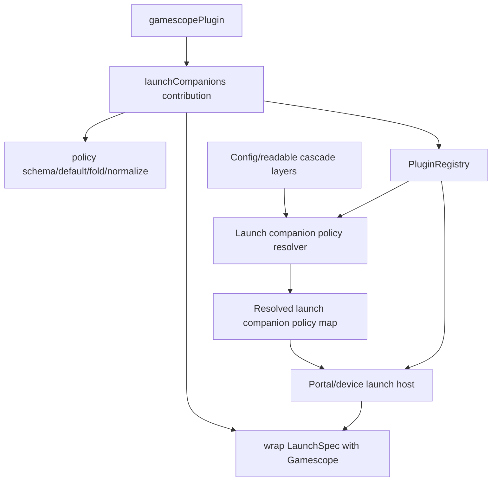
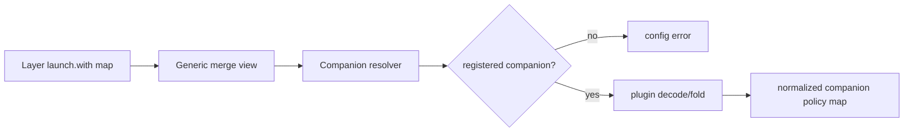

# refactor: Colocate Gamescope launch companion behavior in plugin

## Summary

This plan turns launch companions into an executable plugin contribution instead of a declaration-only registry entry. Gamescope-specific schema, defaults, merge/normalization, and launch-spec wrapping move under `product/plugins/gamescope/`; generic config and launch code handles companion IDs and opaque policies through plugin-provided contracts.

---

## Problem Frame

Gamescope now has a first-party plugin identity, but the behavior that makes it work is still spread through generic library/config and launch modules. That split weakens the plugin boundary, keeps `@korri:gamescope` special-cased in platform code, and makes future launch companions likely to copy Gamescope-specific plumbing instead of using a reusable contribution path.

---

## Requirements

- R1. Gamescope-specific identity constants, policy schema, defaults, normalization, merge semantics, launch wrapping, the `gamescope-korri` vendor package/patch set, and a plugin-local `flake.nix` live under `product/plugins/gamescope/` or plugin-owned exports.
- R2. Generic config and launch code treats `launch.with` entries as plugin launch companion policies keyed by companion ID, not as a hardcoded Gamescope field.
- R3. The plugin registry exposes enough launch companion behavior for hosts to validate, fold, normalize, and invoke registered companions without importing Gamescope-specific helpers.
- R4. Authored config remains `launch.with."@korri:gamescope"`; the retired top-level `gamescope:` shape remains unsupported.
- R5. Existing Gamescope behavior is preserved: nested Wayland defaults, `enable: false` disable semantics, scalar last-wins fields, and `extraArgs` concatenation across cascade layers.
- R6. Plugin-produced catalog launches use the same launch companion policy vocabulary as YAML/config-produced launches.
- R7. Tests prove the generic path with both the Gamescope plugin and at least one fake non-Gamescope launch companion.
- R8. Temporary handoff/debt notes are resolved or narrowed to any genuinely remaining non-colocated behavior.

---

## Scope Boundaries

- This is an internal architecture refactor; it should not change user-facing launch behavior or config authoring semantics.
- Do not reintroduce top-level authored `gamescope:` in any config record, readable override, or plugin launch shape.
- Do not build third-party/user-installed plugins, marketplace behavior, sandboxing, or dynamic external plugin discovery.
- Do not migrate unrelated integrations such as Moonlight, RetroArch, Ryubing, or Steam into plugins beyond updating their Gamescope companion policy/package references when they currently set or consume Gamescope state.
- Do not chase unrelated typecheck/lint failures already known in the worktree, such as generated route tree or pre-existing non-null assertion issues.

### Deferred to Follow-Up Work

- Generalize Moonlight/RetroArch/Ryubing/Steam policy ownership into plugin contributions: separate integration migration after launch companions prove the pattern.
- Make config schemas fully generated from runtime plugin registry metadata: this plan may use plugin-provided schemas through a host-supplied resolver, but it should not build a dynamic schema-generation framework beyond the launch companion seam.
- Remove any Bandai-specific deploy/debug hotfix leftovers: finish that hotfix in its own atomic work before or after this refactor, not inside this plan.

---

## Context & Research

### Relevant Code and Patterns

- `product/platform/plugin/index.ts` defines first-party plugin contracts and currently has `PluginLaunchCompanionContribution` as a declaration-only contribution.
- `product/platform/plugin/registry.ts` exposes enabled `launchCompanions` but does not provide validation or invocation behavior.
- `product/plugins/gamescope/index.ts` declares `@korri:gamescope` as an always-enabled first-party launch wrapper.
- `product/platform/library/config/inheritable-fields.ts` currently owns `GamescopePolicy`, `LaunchWithPolicy`, `gamescopePolicyFromLaunch`, `DEFAULT_GAMESCOPE_POLICY`, and `normalizeGamescopePolicy`.
- `product/platform/library/config/cascade-resolver.ts` currently owns Gamescope folding and a large set of `mergeGamescope*` helpers.
- `product/platform/stream/gamescope-launch-spec.ts` currently composes a `LaunchSpec` into a Gamescope-wrapped `LaunchSpec`.
- `product/apps/portal/api/library/launch.rpc-handler.ts`, `product/platform/library/rocknix/rocknix-source.ts`, and device/stream launch paths consume normalized Gamescope policy directly.
- `product/platform/plugin/catalog-library-source.ts` currently exposes `ProcessPluginLaunch.gamescope`, a plugin-authored top-level field inconsistent with the migrated `launch.with` authoring shape.

### Institutional Learnings

- `docs/solutions/architecture-patterns/korri-plugin-architecture-2026-06-02.md`: first-party plugin declarations live in `product/plugins/*`, while reusable host contracts live in `product/platform/plugin/`.
- `docs/solutions/design-patterns/explicit-cascade-folded-policy-over-incidental-signal-heuristics-2026-05-27.md`: Gamescope behavior should be explicit cascade-folded policy, not wrapper-side heuristics or incidental argv/env sniffing.
- `docs/solutions/best-practices/product-owned-composition-keeps-shared-layers-reusable-2026-05-03.md`: generic/shared layers should not choose concrete product integrations when product-owned composition can supply them.
- `docs/solutions/architecture-patterns/kiosk-foreground-app-policy-over-gamescope-overlay-2026-05-24.md`: Gamescope is a launch presentation adapter, not the owner of foreground/session policy.

### External References

- External research skipped: the repo already has current first-party plugin, config cascade, and Gamescope-specific architecture patterns, and the work is primarily an internal boundary refactor.

---

## Key Technical Decisions

- Make launch companion contributions executable, not just descriptive: the registry needs enough metadata/functions for decode, fold, normalize, and wrap behavior so generic hosts can call the companion without importing Gamescope code.
- Move Gamescope policy, identity, and vendor ownership to the Gamescope plugin: the plugin should own the companion ID export, schema/defaults/fold/normalize/wrap implementation, `gamescope-korri` package/patch lane, and a plugin-local flake entrypoint, while platform types use generic companion IDs and opaque policy values at the boundary.
- Use host-supplied plugin registry/resolver at config and launch boundaries: platform modules must not import `@product/plugins/gamescope`; app/service composition provides the registry containing the first-party Gamescope plugin. This requires an explicit registry service/layer rather than ad hoc registry construction.
- Split static syntax decode from plugin-owned policy validation: base config schemas validate `launch.with` as a companion-ID-keyed record with unknown payloads; plugin-owned schemas validate payloads during registry-backed resolution; final launch contexts carry decoded/normalized companion policies, not raw unknown payloads.
- Replace direct `gamescope` transit fields with generic launch companion policy maps: resolved contexts, local launcher policies, and plugin catalog launch types should carry companion policies keyed by `LaunchCompanionId`.
- Preserve current Gamescope semantics before cleaning up shape: `enable: false`, default nested Wayland policy, and per-field cascade semantics are compatibility constraints, not optional simplifications.
- Fail closed for unregistered or invalid launch companion policies: unknown companion IDs and invalid plugin-owned policy payloads should produce config/launch diagnostics rather than silently launching without the wrapper.

---

## Open Questions

### Resolved During Planning

- Should this be a thin re-export cleanup or a full plugin-owned refactor? Full plugin-owned refactor. The user's correction was that Gamescope code should have been colocated in the plugin, so the plan should not settle for platform-owned Gamescope helpers with plugin re-exports.
- Can platform modules import the Gamescope plugin directly? No. Platform stays generic; product/app/service composition supplies plugin registry instances.
- Should the old authored top-level `gamescope:` shape return? No. The supported authored shape remains `launch.with."@korri:gamescope"`.

### Deferred to Implementation

- Exact function/type names for the launch companion behavior contract: defer to implementation so names fit the surrounding TypeScript style, but the contract must cover decode/fold/normalize/wrap behavior.
- Exact low-level layer wiring names for the registry service: implementation should use the current Effect layer naming style, but the plan requires a registry service/layer to be available to config resolution and launch execution.
- Whether any legacy `gamescope` transit field must remain as a temporary compatibility alias for one commit: acceptable only as a short-lived adapter with tests proving the generic map is the primary path.

---

## Output Structure

    product/plugins/gamescope/
    ├── index.ts
    ├── policy.ts
    ├── policy.test.ts
    ├── launch-wrapper.ts
    ├── launch-wrapper.test.ts
    ├── default.nix
    ├── flake.nix
    └── patches/
        ├── README.md
        ├── 0001-rendervulkan-allow-render-only-vulkan-device.patch
        ├── 0002-waylandbackend-optional-explicit-sync.patch
        └── 0003-rendervulkan-optional-pipeline-precompile.patch

Generic platform/plugin and config files will be modified in place; the tree above shows the new Gamescope-owned modules and vendor package lane expected from the refactor.

---

## High-Level Technical Design

> *This illustrates the intended approach and is directional guidance for review, not implementation specification. The implementing agent should treat it as context, not code to reproduce.*

The important boundary is directionality: `product/plugins/gamescope/*` imports platform contracts, while `product/platform/*` imports only generic launch companion contracts and receives registered contributions from host composition.

---

## Implementation Units

### U1. Make launch companions an executable plugin contract

**Goal:** Extend the generic plugin contract so launch companions can own policy validation, cascade folding, normalization, and launch wrapping behavior.

**Requirements:** R1, R2, R3, R7

**Dependencies:** None

**Files:**
- Modify: `product/platform/plugin/index.ts`
- Modify: `product/platform/plugin/registry.ts`
- Modify: `product/platform/plugin/registry.test.ts`
- Modify or remove: `product/platform/plugin/ids.ts`
- Test: `product/platform/plugin/registry.test.ts`

**Approach:**
- Add generic launch companion behavior fields to `PluginLaunchCompanionContribution` without referencing Gamescope types.
- Move or narrow `KORRI_GAMESCOPE_PLUGIN_ID` so Gamescope identity is exported from `product/plugins/gamescope/`; platform registry tests should use fake companion IDs rather than importing a Gamescope constant.
- The contribution should be able to decode/validate an unknown authored policy payload, fold multiple decoded policies, normalize a final policy, and wrap a `LaunchSpec`.
- Keep the registry generic: it should expose enabled launch companion contributions by ID and detect duplicate companion IDs if more than one enabled plugin claims the same companion.
- Preserve existing registry behavior for catalog/resources and existing always-enabled Gamescope plugin registration.

**Execution note:** Implement contract changes test-first with a fake launch companion before wiring Gamescope into the new fields.

**Patterns to follow:**
- `product/platform/plugin/index.ts` for first-party plugin type contracts.
- `product/platform/plugin/registry.ts` for contribution enumeration.
- `product/platform/plugin/registry.test.ts` for small pure registry tests.

**Test scenarios:**
- Happy path: a fake enabled plugin contributes a launch companion with policy behavior and the registry exposes it by companion ID.
- Happy path: disabled plugins' launch companion behavior is not exposed.
- Error path: two enabled plugins contributing the same companion ID fail with a deterministic duplicate companion diagnostic.
- Edge case: a catalog-only plugin remains valid without launch companion fields.
- Integration: existing Gamescope registration still appears as an enabled launch companion when using first-party plugin composition.

**Verification:**
- The plugin API can represent a non-Gamescope launch wrapper without any Gamescope import.
- Registry tests prove contribution enumeration and duplicate handling for generic launch companions.

---

### U2. Move Gamescope policy and wrapper behavior into the Gamescope plugin

**Goal:** Make `product/plugins/gamescope/` the owner of Gamescope policy schema, defaults, merge/normalize semantics, and launch-spec wrapping.

**Requirements:** R1, R4, R5, R7

**Dependencies:** U1

**Files:**
- Modify: `product/plugins/gamescope/index.ts`
- Create: `product/plugins/gamescope/policy.ts`
- Create: `product/plugins/gamescope/policy.test.ts`
- Create: `product/plugins/gamescope/launch-wrapper.ts`
- Create: `product/plugins/gamescope/launch-wrapper.test.ts`
- Modify: `product/platform/library/config/inheritable-fields.ts`
- Modify: `product/platform/library/config/inheritable-fields.test.ts`
- Modify: `product/platform/library/config/cascade-resolver.ts`
- Modify: `product/platform/library/config/cascade-resolver.test.ts`
- Move or remove: `product/platform/stream/gamescope-launch-spec.ts`
- Move or remove: `product/platform/stream/gamescope-launch-spec.test.ts`

**Approach:**
- Move Gamescope-specific schema/defaults/fold/normalize behavior out of platform config modules and into `product/plugins/gamescope/policy.ts`.
- Move Gamescope launch-spec composition out of `product/platform/stream/gamescope-launch-spec.ts` into `product/plugins/gamescope/launch-wrapper.ts`; migrate the existing platform stream tests into plugin-owned wrapper tests, and remove the platform module/test unless they become purely generic.
- Register those policy and wrapper behaviors on `gamescopePlugin.contributes.launchCompanions`.
- Keep tests for Gamescope defaults and merge semantics adjacent to the Gamescope plugin.
- Remove Gamescope-specific helper tests from generic config tests, keeping only generic `launch.with` record behavior there.

**Execution note:** Characterize existing Gamescope fold/normalize/wrap behavior before moving it; this unit must be behavior-preserving.

**Patterns to follow:**
- Existing `product/plugins/neverball/index.ts` for plugin-owned integration facts.
- Existing `product/platform/stream/gamescope-launch-spec.test.ts` for wrapping behavior to preserve.
- Existing cascade tests for `extraArgs` concatenation and `enable: false` semantics.

**Test scenarios:**
- Happy path: undefined Gamescope policy normalizes to nested Wayland defaults with fullscreen/borderless/exposeWayland behavior preserved.
- Happy path: partial window overrides deep-merge with defaults while explicit overrides win.
- Happy path: `extraArgs` concatenate in inheritance order when folded through the plugin contribution.
- Edge case: `enable: false` returns a disabled policy without reapplying defaults.
- Edge case: scalar fields keep last-wins semantics across folded policy layers.
- Error path: invalid Gamescope policy payload fails through the plugin-owned schema with a useful diagnostic.
- Integration: Gamescope plugin contribution wraps a simple process `LaunchSpec` into the same Gamescope command/argv shape as before.

**Verification:**
- No generic platform config module exports `DEFAULT_GAMESCOPE_POLICY`, `normalizeGamescopePolicy`, `foldGamescope*`, or `mergeGamescope*` helpers.
- Gamescope-specific behavior tests live under `product/plugins/gamescope/` and pass without importing from generic config helpers.

---

### U7. Wire plugin registry as a service dependency

**Goal:** Make the first-party plugin registry available to config resolution, library sources, and launch hosts without platform modules importing product plugins or constructing registries ad hoc.

**Requirements:** R2, R3, R7

**Dependencies:** U1, U2

**Files:**
- Modify: `product/platform/plugin/registry.ts`
- Create or modify: `product/platform/plugin/registry-layer.ts`
- Modify: `product/plugins/index.ts`
- Modify: `product/apps/portal/api/rpc-server.ts`
- Modify: `product/apps/portal/api/server/rpc-server.ts`
- Modify: `product/platform/plugin/catalog-library-source.ts`
- Modify: `product/platform/library/library-source-layer-live.ts`
- Modify: `product/platform/library/library-services.ts`
- Test: `product/platform/plugin/registry.test.ts`
- Test: relevant portal/library layer tests that construct live RPC/library layers

**Approach:**
- Introduce a generic registry service/layer in platform plugin code and a first-party live layer in product plugin composition.
- Remove ad hoc calls that construct the first-party registry from environment inside lower-level library source code; receive the registry as a dependency instead.
- Provide the registry to portal RPC and server compositions that resolve config or launch games, and to any CLI/control path that uses the same library/launch services.
- Keep environment-enabled catalog plugin semantics intact while ensuring infrastructure companions such as Gamescope are always present in the first-party live registry.

**Patterns to follow:**
- Existing Effect service/layer patterns around library source and portal API composition.
- Existing `createFirstPartyPluginRegistryFromEnv` behavior in `product/plugins/index.ts`.

**Test scenarios:**
- Happy path: portal/library live layer composition has a plugin registry available to config resolution and launch handlers.
- Happy path: `PluginLibrarySourceLayerLive` consumes the injected registry rather than constructing its own registry.
- Edge case: environment-enabled catalog plugins still appear when `KORRI_ENABLED_PLUGINS` includes them.
- Edge case: Gamescope infrastructure plugin remains enabled even when no catalog plugins are configured.
- Error path: missing registry dependency fails layer construction clearly rather than falling back to an empty registry.

**Verification:**
- Config and launch paths that need companion behavior obtain the same enabled registry through dependency injection.
- No platform module imports `product/plugins/gamescope` or constructs first-party product registries directly.

---

### U3. Make config cascade fold generic launch companion policies

**Goal:** Replace hardcoded Gamescope extraction/folding in config resolution with a generic launch companion policy resolver backed by registered plugin contributions.

**Requirements:** R2, R3, R4, R5, R7

**Dependencies:** U1, U2, U7

**Files:**
- Modify: `product/platform/library/config/inheritable-fields.ts`
- Modify: `product/platform/library/config/inheritable-fields.test.ts`
- Modify: `product/platform/library/config/cascade-resolver.ts`
- Modify: `product/platform/library/config/cascade-resolver.test.ts`
- Modify: `product/platform/library/config/readable-cascade-resolver.ts`
- Modify: `product/platform/library/config/readable-cascade-resolver.test.ts`
- Modify: `product/platform/library/config/resolved-launch-context.ts`
- Modify: `product/platform/library/config/app-choice-selection.ts`
- Modify: `product/platform/library/config/app-choice-selection.test.ts`
- Modify: `product/platform/library/config/ephemeral-override.ts`
- Modify: `product/platform/library/config/ephemeral-override.test.ts`
- Modify: `product/platform/library/config/app-integrations.ts`
- Modify: `product/platform/library/config/app-integrations.test.ts`

**Approach:**
- Change `launch.with` from a static Gamescope-only schema to a generic companion policy map keyed by syntactically valid plugin/companion ID and storing unknown/raw policy payloads until plugin-backed validation.
- Introduce a generic launch companion policy resolver that receives registry contributions and performs per-ID validation, fold, and normalization. Unknown but well-formed companion IDs should fail during registry-backed resolution; malformed companion ID syntax should fail during static decode.
- Replace `gamescopePolicyFromLaunch`, `foldGamescope`, and `gamescope` fields in intermediate merge views with generic `launchCompanions` policy maps.
- Update `ResolvedLaunchContext` and `ReadableResolvedLaunchContext` to carry generic companion policy maps; avoid adding new Gamescope-specific transit fields.
- Keep authored config rejection for top-level `gamescope:` unchanged.

**Technical design:** *(directional guidance, not implementation specification)*

**Patterns to follow:**
- Existing `mergeReadableLayers` and `mergeByLauncher` order in `product/platform/library/config/cascade-resolver.ts`.
- Existing strict decode tests in `product/platform/library/config/inheritable-fields.test.ts`.
- Existing override handling in `product/platform/library/config/ephemeral-override.ts`.

**Test scenarios:**
- Happy path: host, system, app choice, release, profile, and override `launch.with."@korri:gamescope"` entries fold through the Gamescope plugin contribution in existing cascade order.
- Happy path: a fake launch companion folds through the same generic path without importing or naming Gamescope.
- Edge case: by-launcher companion policy merges with the base view using the same ordering as current by-launcher Gamescope behavior.
- Edge case: `inherit: false` truncates companion policy inheritance exactly as it does other inheritable fields.
- Error path: malformed companion ID syntax fails static decode.
- Error path: `launch.with."@unknown:wrapper"` fails closed during registry-backed resolution instead of being ignored.
- Error path: invalid Gamescope payload shape fails through the Gamescope plugin schema rather than a generic schema.
- Error path: top-level authored `gamescope:` remains rejected in strict config decode.
- Integration: readable override and ephemeral override paths accept the generic `launch.with` policy map and reject stale top-level Gamescope shapes.

**Verification:**
- Generic config/cascade modules no longer contain Gamescope-specific merge functions or direct policy helpers.
- Existing Gamescope cascade behavior is preserved through plugin contribution tests and fake companion tests.

---

### U4. Invoke launch companions through the registry in launch paths

**Goal:** Replace direct Gamescope wrapping in launch execution paths with generic launch companion dispatch against resolved companion policies.

**Requirements:** R2, R3, R5, R7

**Dependencies:** U1, U2, U3, U7

**Files:**
- Modify: `product/apps/portal/api/library/launch.rpc-handler.ts`
- Modify: `product/apps/portal/api/library/launch.rpc-handler.test.ts`
- Modify: `product/platform/library/library-services.ts`
- Modify: `product/platform/library/library-source-layer-live.ts`
- Modify: `product/platform/library/rocknix/rocknix-source.ts`
- Modify: `product/apps/portal/api/stream/prepare.rpc-handler.ts`
- Modify: `product/apps/portal/api/server/prepare.rpc-handler.ts`
- Modify: `product/apps/portal/api/stream/compose-moonlight-launch-spec.ts`
- Modify: `product/platform/stream/moonlight-launch-spec.ts`
- Modify: `product/services/device/game-stream-launch-intent.ts`
- Modify: `product/services/device/game-stream-fullscreen.ts`
- Modify: `product/services/device/game-stream-runner.ts`
- Modify: related tests for any updated device/stream launch path

**Approach:**
- Add or wire a plugin registry service/layer into the portal and device launch hosts so launch execution can look up enabled launch companion contributions.
- Replace direct `composeGamescopeLaunchSpec` calls with generic companion dispatch over the resolved companion policy map.
- Choose stream intent ownership explicitly: stream prepare should persist normalized companion policy maps in the launch intent and the device runner should apply wrappers once at execution time, avoiding pre-wrapping during prepare.
- Preserve wrapper ordering deterministically. Apply wrappers in enabled registry contribution order after filtering to resolved companion IDs; if a future companion needs ordering constraints, add an explicit ordering field rather than relying on object key enumeration.
- Convert ROCKnix's unconditional default Gamescope behavior into a companion policy map entry supplied through the same Gamescope contribution, rather than calling Gamescope normalization directly.
- Ensure missing/disabled companions fail with useful launch diagnostics.

**Execution note:** Start with tests around one local launch and one fake companion dispatch helper before touching broader launch handler plumbing.

**Patterns to follow:**
- Existing Effect service wiring around `LibrarySourceService`, `Launcher`, and `ForegroundSessionHost` in portal launch tests.
- Existing `runPluginHandler` normalization if companion wrapper behavior returns plain values, promises, or Effects.
- Existing launch failure mapping in `product/apps/portal/api/library/launch.rpc-handler.ts`.

**Test scenarios:**
- Happy path: Effect layer composition smoke proves the portal server starts with first-party plugin registry available to config resolution and launch handlers.
- Happy path: local ProseQL game with Gamescope policy invokes the Gamescope plugin wrapper and launches the same wrapped command as before.
- Happy path: fake companion policy invokes a fake wrapper and proves dispatch is generic.
- Edge case: a resolved launch with no companion policies launches the inner spec unchanged.
- Edge case: multiple companion policies apply in stable, documented order.
- Error path: resolved policy references a companion absent from the enabled registry and returns a launch failure with the missing companion ID.
- Error path: companion wrapper failure propagates as a launch failure without spawning a partially wrapped launch.
- Integration: stream prepare writes a generic companion policy map and `game-stream-runner` applies it once.
- Integration: remote-source Moonlight launch still composes with the Gamescope companion policy without generic launch code importing Gamescope helpers.
- Integration: ROCKnix source still returns a Gamescope-wrapped launch through the generic companion path.
- Integration: device/stream runner path and portal path do not double-wrap Gamescope.

**Verification:**
- Launch execution code no longer imports Gamescope-specific wrapper or normalization helpers.
- Existing direct local GBA launch behavior remains functionally equivalent aside from internal dispatch path.

---

### U5. Unify plugin-produced launch companion policy vocabulary

**Goal:** Remove the top-level `ProcessPluginLaunch.gamescope` plugin authoring shape and make plugin catalog launches use the same `launch.with` companion policy map as config-authored launches.

**Requirements:** R2, R4, R6, R7

**Dependencies:** U1, U2, U3

**Files:**
- Modify: `product/platform/plugin/index.ts`
- Modify: `product/platform/plugin/catalog-library-source.ts`
- Modify: `product/platform/plugin/catalog-library-source.test.ts`
- Modify: `product/plugins/neverball/index.ts`
- Modify: `product/plugins/library-source-layer.test.ts`
- Modify: `product/platform/library/config/app-integrations.ts`
- Modify: `product/platform/library/config/app-integrations.test.ts`

**Approach:**
- Replace `ProcessPluginLaunch.gamescope` with a generic launch companion policy shape matching `launch.with`.
- Update catalog-library-source mapping so plugin catalog launches emit generic companion policy maps into resolved launch contexts.
- Update any built-in app/integration defaults that currently set `gamescope` directly to use `launch.with."@korri:gamescope"` data instead.
- Keep this unit focused on launch companion vocabulary only; do not redesign unrelated plugin catalog/resource fields.

**Patterns to follow:**
- Existing plugin catalog item tests in `product/platform/plugin/catalog-library-source.test.ts`.
- Existing first-party plugin tests in `product/plugins/index.test.ts`.
- Existing config migration tests rejecting stale authored Gamescope shapes.

**Test scenarios:**
- Happy path: plugin catalog item with `launch.with."@korri:gamescope"` resolves to a companion policy map consumed by launch dispatch.
- Happy path: plugin catalog item with fake non-Gamescope companion policy follows the same mapping path.
- Error path: plugin catalog item using retired top-level `gamescope` no longer type-checks or is rejected by runtime decode, depending on how plugin launch declarations are validated.
- Integration: Neverball plugin remains catalog-only or uses the new launch vocabulary without losing launchability.
- Integration: built-in Steam/Gamescope baseline still resolves through the companion map when applicable.

**Verification:**
- There is one plugin/config authoring vocabulary for launch companions: `launch.with.<companionId>`.
- `ProcessPluginLaunch` no longer exposes a Gamescope-specific field.

---

### U8. Move `gamescope-korri` vendor package under the Gamescope plugin

**Goal:** Make the downstream Gamescope package and patch set part of the Gamescope plugin ownership boundary instead of the generic product vendor tree.

**Requirements:** R1, R8

**Dependencies:** U2

**Files:**
- Move: `product/vendor/gamescope-korri/package.nix` → `product/plugins/gamescope/default.nix`
- Move: `product/vendor/gamescope-korri/patches/` → `product/plugins/gamescope/patches/`
- Create: `product/plugins/gamescope/flake.nix`
- Create: `product/plugins/gamescope/flake.lock` if the plugin flake uses external inputs rather than path/no-lock inputs
- Modify: `product/systems/nixos/overlays/korri-packages.nix`
- Modify: `product/systems/nixos/flake/packages.nix` if it references the old path directly
- Modify: `tools/testing/standards/product-reorg-boundaries.test.ts`
- Modify: current `docs/handoffs/**` and `docs/research/**` files that describe the canonical vendor path, when they are current enough to remain useful
- Modify: `docs/solutions/architecture-patterns/korri-product-platform-theme-architecture-2026-06-03.md`

**Approach:**
- Move the package derivation and patch directory without changing package semantics, pname, passthru, manifest contents, or overlay attr names.
- Add `product/plugins/gamescope/flake.nix` as the plugin-local Nix entrypoint. It should expose the moved `default.nix` package/check surface for standalone evaluation while the main repo overlay continues to consume `default.nix` through `callPackage`. The plugin flake must use the same pinned Gamescope 3.16.23 nixpkgs base as `product/systems/nixos/overlays/korri-packages.nix`, not a moving channel input that could diverge from the root overlay.
- Decide the plugin flake lock policy in the implementation: either commit `product/plugins/gamescope/flake.lock` for external inputs, or use path/no-lock inputs that cannot mutate or drift during standalone evaluation.
- Update the Korri package overlay to call the package from `product/plugins/gamescope/default.nix` while preserving `pkgs.gamescope` and `pkgs.gamescope-korri` behavior.
- Update standards tests so the canonical expected package location is `product/plugins/gamescope/default.nix`, the standalone flake is `product/plugins/gamescope/flake.nix`, and patches live in `product/plugins/gamescope/patches/`.
- Treat historical docs as historical unless they are handoffs/current architecture docs; current docs should point at the new path, old archived plans may remain as history.

**Patterns to follow:**
- Current `product/vendor/gamescope-korri/package.nix` callPackage-compatible shape, renamed to plugin-local `default.nix`.
- Existing repo flake/package conventions in `flake.nix` and `product/systems/nixos/flake/packages.nix` for package/check exposure.
- Current overlay attr pattern in `product/systems/nixos/overlays/korri-packages.nix`.
- Existing product reorg boundary tests in `tools/testing/standards/product-reorg-boundaries.test.ts`.

**Test scenarios:**
- Happy path: overlay still exposes `pkgs.gamescope-korri`, `pkgs.gamescope` resolves to the same derivation, and the root flake package `gamescope-korri` still resolves to that derivation.
- Happy path: plugin-local flake exposes the same `gamescope-korri` package derivation through `product/plugins/gamescope/default.nix`.
- Happy path: standards test expects `product/plugins/gamescope/default.nix` plus `product/plugins/gamescope/patches/` and no longer expects `product/vendor/gamescope-korri`.
- Regression: patch README/package/flake references do not point to the old canonical path.
- Regression: no current, non-archived docs describe `product/vendor/gamescope-korri` as the canonical Gamescope vendor location after the move.
- Integration: Nix package evaluation/build for `gamescope-korri` uses the moved patch files.

**Verification:**
- `product/vendor/gamescope-korri` no longer exists.
- `product/plugins/gamescope/default.nix`, `product/plugins/gamescope/flake.nix`, and `product/plugins/gamescope/patches/` are the canonical package/flake/patch locations.
- Existing Nix overlay consumers still resolve `pkgs.gamescope` to `pkgs.gamescope-korri`, and the root flake package `gamescope-korri` still resolves to that derivation.

---

### U6. Add regression guardrails and update handoff documentation

**Goal:** Prevent Gamescope-specific behavior from drifting back into generic platform code and close/update temporary handoff notes.

**Requirements:** R1, R2, R7, R8

**Dependencies:** U2, U3, U4, U5, U8

**Files:**
- Modify: `product/plugins/index.test.ts`
- Modify: `product/platform/library/config/inheritable-fields.test.ts`
- Modify: `product/platform/library/config/cascade-resolver.test.ts`
- Modify: `docs/handoffs/2026-06-17-gamescope-plugin-launch-companion-temporary-handoff.md`
- Modify: `tools/testing/standards/product-reorg-boundaries.test.ts`
- Modify or remove: `docs/handoffs/2026-06-17-gamescope-launch-companion-breaking-config.md`
- Optional test helper: `product/plugins/gamescope/policy.test.ts`

**Approach:**
- Add a narrow regression test or static scan test that platform config/launch modules do not import Gamescope plugin internals or define Gamescope-specific policy helpers.
- Keep allowlisted references limited to generic plugin ID constants if still necessary; prefer importing the ID from `product/plugins/gamescope` at product composition sites rather than platform internals.
- Strengthen `product/plugins/index.test.ts` so Gamescope is always registered as infrastructure and fake companion coverage proves the registry path is generic.
- Update handoff docs to mark plugin colocation complete and document any remaining intentional transitional debt.

**Patterns to follow:**
- Existing regression tests around stale `gamescope:` authored shapes.
- Existing plugin index tests that distinguish always-enabled infrastructure plugins from env-enabled catalog plugins.

**Test scenarios:**
- Happy path: first-party plugin registry includes Gamescope infrastructure by default and env-enabled catalog plugins still work.
- Happy path: fake launch companion test proves generic registry/config/launch path without Gamescope imports.
- Regression: generic platform config files do not export or define `DEFAULT_GAMESCOPE_POLICY`, `normalizeGamescopePolicy`, `foldGamescope`, or `mergeGamescope*` symbols.
- Regression: standards tests assert the `gamescope-korri` package lives at `product/plugins/gamescope/default.nix`, has plugin-local `product/plugins/gamescope/flake.nix`, and keeps patches under `product/plugins/gamescope/patches/`, not under `product/vendor/`.
- Regression: `launch.with."@korri:gamescope"` remains accepted and top-level `gamescope:` remains rejected.
- Documentation: handoff notes accurately list only remaining intentional debt, if any.

**Verification:**
- The parked-item acceptance criteria are satisfied and visible in tests/docs.
- Future implementers can find Gamescope behavior and the downstream package/patch lane by starting at `product/plugins/gamescope/`.

---

## System-Wide Impact

- **Interaction graph:** Plugin registry composition becomes part of config resolution and launch execution, not just catalog/resource assembly. Portal API, server prepare, Moonlight/stream prepare, ROCKnix, device runner launch paths, and Nix overlay package resolution need access to the same Gamescope plugin-owned surfaces.
- **Error propagation:** Invalid companion payloads and missing companion IDs should surface as config/resolve/launch diagnostics with the companion ID preserved. Wrapper failures should fail before spawn.
- **State lifecycle risks:** Launch wrapping must happen exactly once per launch path. The plan must prevent portal and device runner paths from double-wrapping Gamescope.
- **API surface parity:** YAML config, readable overrides, ephemeral overrides, plugin catalog launches, ROCKnix source launches, and built-in app defaults must use the same companion policy map shape.
- **Integration coverage:** Unit tests alone are insufficient; at least one launch RPC test should prove resolved companion policies flow into actual wrapper invocation.
- **Unchanged invariants:** User-authored Gamescope policy semantics, existing launch behavior, and first-party-only plugin scope do not change.

---

## Risks & Dependencies

| Risk | Mitigation |
|------|------------|
| Platform/product dependency inversion | Keep plugin contracts in `product/platform/plugin/*`; product plugins implement the contract; hosts inject registries into platform/generic helpers. |
| Scope balloon from generic policy maps | Limit active work to launch companions and only touch other integrations where they currently set or consume Gamescope policy/package references. |
| Lost Gamescope merge semantics | Characterize `enable: false`, scalar last-wins, deep object merge, and `extraArgs` concat before moving helpers. |
| Double wrapping | Add launch-path tests and make a single generic dispatch helper responsible for applying companions. |
| Runtime registry unavailable in config resolution | U7 adds explicit registry service/layer wiring before generic cascade and launch dispatch work depends on it. |
| Type safety loss from opaque policy maps | Decode and normalize through plugin-provided schemas as early as resolution allows; keep unknown policy payloads out of final launch execution. |
| Known unrelated local hotfix changes | Implement this refactor in a dedicated clean worktree after the Bandai launch/loading hotfix is committed or stashed. |

---

## Documentation / Operational Notes

- Update the Gamescope handoff docs to point future work at `product/plugins/gamescope/` as the source of truth, including the `gamescope-korri` vendor package path.
- Mention in the implementation PR that this is not a config migration for users; Bandai's already-migrated `launch.with."@korri:gamescope"` config remains valid.
- If deployment verification is performed on Bandai, validate one local GBA launch and one Steam/Neverball path only as smoke coverage; do not mix performance tuning into this refactor.

---

## Sources & References

- **Origin item:** [work/items/active/01KVAW869GW82T1WA01GNJHB18-colocate-gamescope-launch-companion-behavior-in-plugin/item.md](work/items/active/01KVAW869GW82T1WA01GNJHB18-colocate-gamescope-launch-companion-behavior-in-plugin/item.md)
- Related requirements: [work/items/active/01KV8NZRAAETDX69P5T73BRVY8-first-party-plugin-system-shape/requirements.md](work/items/active/01KV8NZRAAETDX69P5T73BRVY8-first-party-plugin-system-shape/requirements.md)
- Related code: [product/plugins/gamescope/index.ts](product/plugins/gamescope/index.ts)
- Related vendor package: [product/vendor/gamescope-korri/package.nix](product/vendor/gamescope-korri/package.nix) → planned move to [product/plugins/gamescope/default.nix](product/plugins/gamescope/default.nix) with plugin flake [product/plugins/gamescope/flake.nix](product/plugins/gamescope/flake.nix)
- Related code: [product/platform/plugin/index.ts](product/platform/plugin/index.ts)
- Related code: [product/platform/plugin/registry.ts](product/platform/plugin/registry.ts)
- Related code: [product/platform/library/config/inheritable-fields.ts](product/platform/library/config/inheritable-fields.ts)
- Related code: [product/platform/library/config/cascade-resolver.ts](product/platform/library/config/cascade-resolver.ts)
- Related code: [product/platform/stream/gamescope-launch-spec.ts](product/platform/stream/gamescope-launch-spec.ts)
- Related handoff: [docs/handoffs/2026-06-17-gamescope-plugin-launch-companion-temporary-handoff.md](docs/handoffs/2026-06-17-gamescope-plugin-launch-companion-temporary-handoff.md)
