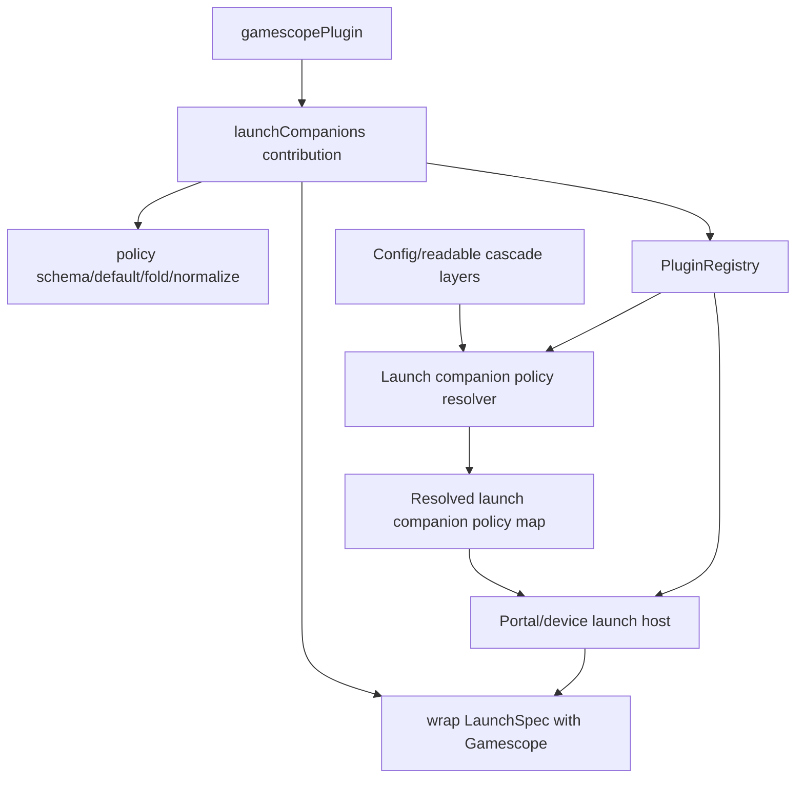
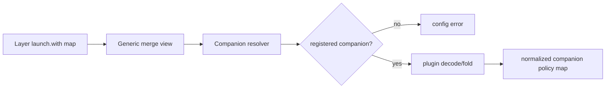

# refactor: Move Gamescope implementation into plugin

> Superseded by `work/items/active/01KVBQ8J0F3E2B6Z9N2X4M5A7C-gamescope-plugin-decoupling/plan.md`. Do not execute this older plan; it predates the stricter zero-coupling decisions for platform/services/apps/themes/Nix.

## Summary

This plan makes `product/plugins/gamescope/` the owner for Gamescope as a whole: launch companion policy/wrapping, `gamescope-korri` packaging, runtime-control protocol/bridge/client code, stream-control Gamescope actions, and Gamescope-specific session cleanup/preflight behavior. Generic platform/app/service code keeps only host-owned seams, route/adaptor shims, and composition wiring.

---

## Problem Frame

Gamescope now has a first-party plugin identity, but the behavior that makes it work is still spread through generic library/config, stream, control, CLI, service, and Nix modules. That split weakens the plugin boundary, keeps `@korri:gamescope` and Gamescope protocol/process details special-cased outside the plugin, and makes future integration work likely to copy Gamescope-specific plumbing instead of using a reusable host/plugin seam.

---

## Requirements

- R1. Gamescope-specific identity constants, policy schema, defaults, normalization, merge semantics, launch wrapping, the bundled `gamescope-korri` package/patch set, and a plugin-local `flake.nix` live under `product/plugins/gamescope/` or plugin-owned exports. The plugin uses the package-style convention `src/` for TypeScript implementation and `packages/` for first-class bundled Nix/build artifacts.
- R2. Generic config and launch code treats `launch.with` entries as plugin launch companion policies keyed by companion ID, not as a hardcoded Gamescope field.
- R3. The plugin registry exposes enough launch companion behavior for hosts to validate, fold, normalize, and invoke registered companions without importing Gamescope-specific helpers.
- R4. Authored config remains `launch.with."@korri:gamescope"`; the retired top-level `gamescope:` shape remains unsupported.
- R5. Existing Gamescope behavior is preserved: nested Wayland defaults, `enable: false` disable semantics, scalar last-wins fields, and `extraArgs` concatenation across cascade layers.
- R6. Plugin-produced catalog launches use the same launch companion policy vocabulary as YAML/config-produced launches.
- R7. Tests prove the generic path with both the Gamescope plugin and at least one fake non-Gamescope launch companion.
- R8. Temporary handoff/debt notes are resolved or narrowed to any genuinely remaining non-colocated behavior.
- R9. Gamescope runtime-control protocol, client, bridge, backend, and state-normalization code live under the Gamescope plugin; host/app composition exposes them through generic stream-control seams without platform code importing Gamescope internals.
- R10. Portal/API/CLI entrypoints for Gamescope controls are thin host shims over plugin-owned handlers or command modules.
- R11. Gamescope-specific session cleanup/preflight logic, process-name/window-selector knowledge, and game-stream wrapping helpers are owned by the plugin; sessiond/runner code keeps lifecycle orchestration.
- R12. Nix package, control bridge package/module glue, and platform defaults reference plugin-owned Gamescope package/control surfaces rather than `product/vendor` or platform-owned Gamescope modules.

---

## Scope Boundaries

- This is an internal architecture refactor; it should not change user-facing launch behavior or config authoring semantics.
- Do not reintroduce top-level authored `gamescope:` in any config record, readable override, or plugin launch shape.
- Do not build third-party/user-installed plugins, marketplace behavior, sandboxing, or dynamic external plugin discovery.
- Do not migrate unrelated integrations such as Moonlight, RetroArch, Ryubing, or Steam into plugins beyond updating their Gamescope companion policy/package/control references when they currently set or consume Gamescope state. For stream-control linked actions, Moonlight remains a host-owned provider behind the same generic stream-control seam; only Gamescope becomes plugin-owned.
- Do not chase unrelated typecheck/lint failures already known in the worktree, such as generated route tree or pre-existing non-null assertion issues.

### Deferred to Follow-Up Work

- Generalize Moonlight/RetroArch/Ryubing/Steam policy ownership into plugin contributions: separate integration migration after launch companions prove the pattern.
- Make config schemas fully generated from runtime plugin registry metadata: this plan may use plugin-provided schemas through a host-supplied resolver, but it should not build a dynamic schema-generation framework beyond the launch companion seam.
- Remove any Bandai-specific deploy/debug hotfix leftovers: finish that hotfix in its own atomic work before or after this refactor, not inside this plan.

---

## Context & Research

### Relevant Code and Patterns

- `product/platform/plugin/index.ts` defines first-party plugin contracts and currently has `PluginLaunchCompanionContribution` as a declaration-only contribution.
- `product/platform/plugin/registry.ts` exposes enabled `launchCompanions` but does not provide validation or invocation behavior.
- `product/plugins/gamescope/index.ts` declares `@korri:gamescope` as an always-enabled first-party launch wrapper.
- `product/platform/library/config/inheritable-fields.ts` currently owns `GamescopePolicy`, `LaunchWithPolicy`, `gamescopePolicyFromLaunch`, `DEFAULT_GAMESCOPE_POLICY`, and `normalizeGamescopePolicy`.
- `product/platform/library/config/cascade-resolver.ts` currently owns Gamescope folding and a large set of `mergeGamescope*` helpers.
- `product/platform/stream/gamescope-launch-spec.ts` currently composes a `LaunchSpec` into a Gamescope-wrapped `LaunchSpec`.
- `product/apps/portal/api/library/launch.rpc-handler.ts`, `product/platform/library/rocknix/rocknix-source.ts`, and device/stream launch paths consume normalized Gamescope policy directly.
- `product/platform/gamescope-control/` currently owns Gamescope runtime-control protocol, client, bridge, and X11 backend code.
- `product/platform/stream-control/` currently owns some Gamescope-specific control validation, readback normalization, and stream-control routing.
- `product/services/device/sessiond-gamescope-reaper.ts`, `product/services/device/sessiond-source-machine.ts`, and `product/services/device/game-stream-runner.ts` currently own Gamescope process/window cleanup and runner preflight/wrapping details.
- `product/apps/cli/gamescope-control*.ts` and `product/services/device/nix/gamescope-control-bridge.nix` currently own Gamescope control CLI/package glue outside the plugin.
- `product/platform/plugin/catalog-library-source.ts` currently exposes `ProcessPluginLaunch.gamescope`, a plugin-authored top-level field inconsistent with the migrated `launch.with` authoring shape.

### Institutional Learnings

- `docs/solutions/architecture-patterns/korri-plugin-architecture-2026-06-02.md`: first-party plugin declarations live in `product/plugins/*`, while reusable host contracts live in `product/platform/plugin/`.
- `docs/solutions/design-patterns/explicit-cascade-folded-policy-over-incidental-signal-heuristics-2026-05-27.md`: Gamescope behavior should be explicit cascade-folded policy, not wrapper-side heuristics or incidental argv/env sniffing.
- `docs/solutions/best-practices/product-owned-composition-keeps-shared-layers-reusable-2026-05-03.md`: generic/shared layers should not choose concrete product integrations when product-owned composition can supply them.
- `docs/solutions/architecture-patterns/kiosk-foreground-app-policy-over-gamescope-overlay-2026-05-24.md`: Gamescope is a launch presentation adapter, not the owner of foreground/session policy.

### External References

- External research skipped: the repo already has current first-party plugin, config cascade, and Gamescope-specific architecture patterns, and the work is primarily an internal boundary refactor.

---

## Key Technical Decisions

- Make launch companion contributions executable, not just descriptive: the registry needs enough metadata/functions for decode, fold, normalize, and wrap behavior so generic hosts can call the companion without importing Gamescope code.
- Move full Gamescope ownership to the Gamescope plugin: the plugin should own the companion ID export, schema/defaults/fold/normalize/wrap implementation, runtime-control protocol/bridge/client/backend, stream-control Gamescope handlers/state, session cleanup/preflight details, `gamescope-korri` package/patch lane, and a plugin-local flake entrypoint, while platform/app/service layers use generic host seams or thin shims.
- Use host-supplied plugin registry/resolver at config and launch boundaries: platform modules must not import `@product/plugins/gamescope`; app/service composition provides the registry containing the first-party Gamescope plugin. This requires an explicit registry service/layer rather than ad hoc registry construction.
- Split static syntax decode from plugin-owned policy validation: base config schemas validate `launch.with` as a companion-ID-keyed record with unknown payloads; plugin-owned schemas validate payloads during registry-backed resolution; final launch contexts carry decoded/normalized companion policies, not raw unknown payloads.
- Replace direct `gamescope` transit fields with generic launch companion policy maps: resolved contexts, local launcher policies, plugin catalog launch types, stream intents, and runner handoff payloads should carry companion policies keyed by `LaunchCompanionId`.
- Preserve current Gamescope semantics before cleaning up shape: `enable: false`, default nested Wayland policy, and per-field cascade semantics are compatibility constraints, not optional simplifications.
- Fail closed for unregistered or invalid launch companion policies: unknown companion IDs and invalid plugin-owned policy payloads should produce config/launch diagnostics rather than silently launching without the wrapper.

---

## Open Questions

### Resolved During Planning

- Should this be a thin re-export cleanup or a full plugin-owned refactor? Full plugin-owned refactor. The user's correction was that Gamescope code should have been colocated in the plugin, so the plan should not settle for platform-owned Gamescope helpers with plugin re-exports.
- Can platform modules import the Gamescope plugin directly? No. Platform stays generic; product/app/service composition supplies plugin registry instances.
- Should the old authored top-level `gamescope:` shape return? No. The supported authored shape remains `launch.with."@korri:gamescope"`.

### Deferred to Implementation

- Exact function/type names for the launch companion behavior contract: defer to implementation so names fit the surrounding TypeScript style, but the contract must cover decode/fold/normalize/wrap behavior.
- Exact low-level layer wiring names for the registry service: implementation should use the current Effect layer naming style, but the plan requires a registry service/layer to be available to config resolution and launch execution.
- Whether any legacy `gamescope` transit field must remain as a temporary compatibility alias for one commit: acceptable only as a short-lived adapter with tests proving the generic map is the primary path.

---

## Output Structure

    product/plugins/gamescope/
    ├── index.ts
    ├── README.md
    ├── flake.nix
    ├── flake.lock
    ├── src/
    │   ├── plugin.ts
    │   ├── launch-companion/
    │   │   ├── index.ts
    │   │   ├── policy.ts
    │   │   ├── policy.test.ts
    │   │   ├── wrapper.ts
    │   │   └── wrapper.test.ts
    │   ├── runtime-control/
    │   │   ├── protocol.ts
    │   │   ├── protocol.test.ts
    │   │   ├── client.ts
    │   │   ├── bridge.ts
    │   │   ├── bridge.test.ts
    │   │   ├── x11-backend.ts
    │   │   ├── x11-backend.test.ts
    │   │   ├── state-normalizer.ts
    │   │   └── state-normalizer.test.ts
    │   ├── stream-control/
    │   │   ├── index.ts
    │   │   ├── handlers.ts
    │   │   ├── handlers.test.ts
    │   │   ├── control-surface.ts
    │   │   └── control-surface.test.ts
    │   ├── session/
    │   │   ├── index.ts
    │   │   ├── reaper.ts
    │   │   ├── reaper.test.ts
    │   │   ├── runner.ts
    │   │   └── runner.test.ts
    │   └── cli/
    │       ├── control.ts
    │       ├── control.test.ts
    │       └── bridge.ts
    └── packages/
        ├── gamescope-korri/
        │   ├── default.nix
        │   ├── README.md
        │   └── patches/
        │       ├── README.md
        │       ├── 0001-rendervulkan-allow-render-only-vulkan-device.patch
        │       ├── 0002-waylandbackend-optional-explicit-sync.patch
        │       └── 0003-rendervulkan-optional-pipeline-precompile.patch
        └── control-bridge/
            ├── default.nix
            └── README.md

Folder convention: root `index.ts` is the public plugin API; `src/plugin.ts` owns the plugin descriptor and stable IDs; `src/launch-companion/` owns launch-time config/validation/wrapping; `src/runtime-control/` talks to and normalizes state from a live Gamescope runtime; `src/stream-control/` exposes app/UI-facing Gamescope controls; `src/session/` owns lifecycle hooks such as preflight/readiness/cleanup; `src/cli/` owns plugin command entrypoints; `packages/` contains first-class bundled Nix/build artifacts. Self-contained bundled packages are exposed by the plugin flake; repo-integrated packages may be called by the root flake with repo-level build context until their dependency closure is self-contained.

Generic platform/plugin/config files and app/service entrypoints will be modified in place only as host-owned contracts, route shims, or composition wiring. Gamescope-specific implementation should be discoverable by starting at `product/plugins/gamescope/`.

---

## High-Level Technical Design

> *This illustrates the intended approach and is directional guidance for review, not implementation specification. The implementing agent should treat it as context, not code to reproduce.*

The important boundary is directionality: `product/plugins/gamescope/*` imports platform contracts, while `product/platform/*` imports only generic launch companion contracts and receives registered contributions from host composition.

---

## Implementation Units

### U1. Make launch companions an executable plugin contract

**Goal:** Extend the generic plugin contract so launch companions can own policy validation, cascade folding, normalization, and launch wrapping behavior.

**Requirements:** R1, R2, R3, R7

**Dependencies:** None

**Files:**
- Modify: `product/platform/plugin/index.ts`
- Modify: `product/platform/plugin/registry.ts`
- Modify: `product/platform/plugin/registry.test.ts`
- Modify or remove: `product/platform/plugin/ids.ts`
- Create or modify: `product/plugins/gamescope/src/plugin.ts`
- Test: `product/platform/plugin/registry.test.ts`

**Approach:**
- Add generic launch companion behavior fields to `PluginLaunchCompanionContribution` without referencing Gamescope types.
- Move or narrow `KORRI_GAMESCOPE_PLUGIN_ID` so Gamescope identity is exported from `product/plugins/gamescope/`; platform registry tests should use fake companion IDs rather than importing a Gamescope constant.
- The contribution should be able to decode/validate an unknown authored policy payload, fold multiple decoded policies, normalize a final policy, and wrap a `LaunchSpec`.
- Keep the registry generic: it should expose enabled launch companion contributions by ID and detect duplicate companion IDs if more than one enabled plugin claims the same companion.
- Preserve existing registry behavior for catalog/resources and existing always-enabled Gamescope plugin registration.

**Execution note:** Implement contract changes test-first with a fake launch companion before wiring Gamescope into the new fields.

**Patterns to follow:**
- `product/platform/plugin/index.ts` for first-party plugin type contracts.
- `product/platform/plugin/registry.ts` for contribution enumeration.
- `product/platform/plugin/registry.test.ts` for small pure registry tests.

**Test scenarios:**
- Happy path: a fake enabled plugin contributes a launch companion with policy behavior and the registry exposes it by companion ID.
- Happy path: disabled plugins' launch companion behavior is not exposed.
- Error path: two enabled plugins contributing the same companion ID fail with a deterministic duplicate companion diagnostic.
- Edge case: a catalog-only plugin remains valid without launch companion fields.
- Integration: existing Gamescope registration still appears as an enabled launch companion when using first-party plugin composition.

**Verification:**
- The plugin API can represent a non-Gamescope launch wrapper without any Gamescope import.
- Registry tests prove contribution enumeration and duplicate handling for generic launch companions.

---

### U2. Move Gamescope policy and wrapper behavior into the Gamescope plugin

**Goal:** Make `product/plugins/gamescope/` the owner of Gamescope policy schema, defaults, merge/normalize semantics, and launch-spec wrapping.

**Requirements:** R1, R4, R5, R7

**Dependencies:** U1

**Files:**
- Modify: `product/plugins/gamescope/index.ts`
- Create: `product/plugins/gamescope/src/launch-companion/policy.ts`
- Create: `product/plugins/gamescope/src/launch-companion/policy.test.ts`
- Create: `product/plugins/gamescope/src/launch-companion/wrapper.ts`
- Create: `product/plugins/gamescope/src/launch-companion/wrapper.test.ts`
- Create: `product/plugins/gamescope/src/launch-companion/index.ts`
- Modify: `product/platform/library/config/inheritable-fields.ts`
- Modify: `product/platform/library/config/inheritable-fields.test.ts`
- Modify: `product/platform/library/config/cascade-resolver.ts`
- Modify: `product/platform/library/config/cascade-resolver.test.ts`
- Move or remove: `product/platform/stream/gamescope-launch-spec.ts`
- Move or remove: `product/platform/stream/gamescope-launch-spec.test.ts`

**Approach:**
- Move Gamescope-specific schema/defaults/fold/normalize behavior out of platform config modules and into `product/plugins/gamescope/src/launch-companion/policy.ts`.
- Move Gamescope launch-spec composition out of `product/platform/stream/gamescope-launch-spec.ts` into `product/plugins/gamescope/src/launch-companion/wrapper.ts`; migrate the existing platform stream tests into plugin-owned wrapper tests, and remove the platform module/test unless they become purely generic.
- Register those policy and wrapper behaviors on `gamescopePlugin.contributes.launchCompanions`.
- Keep tests for Gamescope defaults and merge semantics adjacent to the Gamescope plugin.
- Remove Gamescope-specific helper tests from generic config tests, keeping only generic `launch.with` record behavior there.

**Execution note:** Characterize existing Gamescope fold/normalize/wrap behavior before moving it; this unit must be behavior-preserving.

**Patterns to follow:**
- Existing `product/plugins/neverball/index.ts` for plugin-owned integration facts.
- Existing `product/platform/stream/gamescope-launch-spec.test.ts` for wrapping behavior to preserve.
- Existing cascade tests for `extraArgs` concatenation and `enable: false` semantics.

**Test scenarios:**
- Happy path: undefined Gamescope policy normalizes to nested Wayland defaults with fullscreen/borderless/exposeWayland behavior preserved.
- Happy path: partial window overrides deep-merge with defaults while explicit overrides win.
- Happy path: `extraArgs` concatenate in inheritance order when folded through the plugin contribution.
- Edge case: `enable: false` returns a disabled policy without reapplying defaults.
- Edge case: scalar fields keep last-wins semantics across folded policy layers.
- Error path: invalid Gamescope policy payload fails through the plugin-owned schema with a useful diagnostic.
- Integration: Gamescope plugin contribution wraps a simple process `LaunchSpec` into the same Gamescope command/argv shape as before.

**Verification:**
- No generic platform config module exports `DEFAULT_GAMESCOPE_POLICY`, `normalizeGamescopePolicy`, `foldGamescope*`, or `mergeGamescope*` helpers.
- Gamescope-specific behavior tests live under `product/plugins/gamescope/` and pass without importing from generic config helpers.

---

### U3. Wire plugin registry as a service dependency

**Goal:** Make the first-party plugin registry available to config resolution, library sources, and launch hosts without platform modules importing product plugins or constructing registries ad hoc.

**Requirements:** R2, R3, R7

**Dependencies:** U1, U2

**Files:**
- Modify: `product/platform/plugin/registry.ts`
- Create or modify: `product/platform/plugin/registry-layer.ts`
- Modify: `product/plugins/index.ts`
- Modify: `product/apps/portal/api/rpc-server.ts`
- Modify: `product/apps/portal/api/server/rpc-server.ts`
- Modify: `product/platform/plugin/catalog-library-source.ts`
- Modify: `product/platform/library/proseql/library-repository.ts`
- Modify: `product/platform/library/proseql/library-repository.test.ts`
- Modify: `product/platform/library/library-source-layer-live.ts`
- Modify: `product/platform/library/library-services.ts`
- Test: `product/platform/plugin/registry.test.ts`
- Test: relevant portal/library layer tests that construct live RPC/library layers

**Approach:**
- Introduce a generic registry service/layer in platform plugin code and a first-party live layer in product plugin composition.
- Remove ad hoc calls that construct the first-party registry from environment inside lower-level library source code; receive the registry as a dependency instead.
- Provide the registry to portal RPC and server compositions that resolve config or launch games, to ProseQL repository construction paths such as `createLibraryRepository`, and to any CLI/control path that uses the same library/launch services.
- Keep environment-enabled catalog plugin semantics intact while ensuring infrastructure companions such as Gamescope are always present in the first-party live registry.

**Patterns to follow:**
- Existing Effect service/layer patterns around library source and portal API composition.
- Existing `createFirstPartyPluginRegistryFromEnv` behavior in `product/plugins/index.ts`.

**Test scenarios:**
- Happy path: portal/library live layer composition has a plugin registry available to config resolution, ProseQL repository resolution, and launch handlers.
- Happy path: `PluginLibrarySourceLayerLive` consumes the injected registry rather than constructing its own registry.
- Edge case: environment-enabled catalog plugins still appear when `KORRI_ENABLED_PLUGINS` includes them.
- Edge case: Gamescope infrastructure plugin remains enabled even when no catalog plugins are configured.
- Error path: missing registry dependency fails layer construction clearly rather than falling back to an empty registry.

**Verification:**
- Config and launch paths that need companion behavior obtain the same enabled registry through dependency injection.
- No platform module imports `product/plugins/gamescope` or constructs first-party product registries directly.

---

### U4. Make config cascade fold generic launch companion policies

**Goal:** Replace hardcoded Gamescope extraction/folding in config resolution with a generic launch companion policy resolver backed by registered plugin contributions.

**Requirements:** R2, R3, R4, R5, R7

**Dependencies:** U1, U2, U3

**Files:**
- Modify: `product/platform/library/config/inheritable-fields.ts`
- Modify: `product/platform/library/config/inheritable-fields.test.ts`
- Modify: `product/platform/library/config/cascade-resolver.ts`
- Modify: `product/platform/library/config/cascade-resolver.test.ts`
- Modify: `product/platform/library/config/readable-cascade-resolver.ts`
- Modify: `product/platform/library/config/readable-cascade-resolver.test.ts`
- Modify: `product/platform/library/config/resolved-launch-context.ts`
- Modify: `product/platform/library/proseql/library-repository.ts`
- Modify: `product/platform/library/proseql/library-repository.test.ts`
- Modify: `product/platform/library/config/app-choice-selection.ts`
- Modify: `product/platform/library/config/app-choice-selection.test.ts`
- Modify: `product/platform/library/config/ephemeral-override.ts`
- Modify: `product/platform/library/config/ephemeral-override.test.ts`
- Modify: `product/platform/library/config/app-integrations.ts`
- Modify: `product/platform/library/config/app-integrations.test.ts`

**Approach:**
- Change `launch.with` from a static Gamescope-only schema to a generic companion policy map keyed by syntactically valid plugin/companion ID and storing unknown/raw policy payloads until plugin-backed validation.
- Introduce a generic launch companion policy resolver that receives registry contributions and performs per-ID validation, fold, and normalization. Unknown but well-formed companion IDs should fail during registry-backed resolution; malformed companion ID syntax should fail during static decode.
- Replace `gamescopePolicyFromLaunch`, `foldGamescope`, and `gamescope` fields in intermediate merge views with generic `launchCompanions` policy maps.
- Update `ResolvedLaunchContext` and `ReadableResolvedLaunchContext` to carry generic companion policy maps; avoid adding new Gamescope-specific transit fields.
- Keep authored config rejection for top-level `gamescope:` unchanged.

**Technical design:** *(directional guidance, not implementation specification)*

**Patterns to follow:**
- Existing `mergeReadableLayers` and `mergeByLauncher` order in `product/platform/library/config/cascade-resolver.ts`.
- Existing strict decode tests in `product/platform/library/config/inheritable-fields.test.ts`.
- Existing override handling in `product/platform/library/config/ephemeral-override.ts`.

**Test scenarios:**
- Happy path: host, system, app choice, release, profile, and override `launch.with."@korri:gamescope"` entries fold through the Gamescope plugin contribution in existing cascade order.
- Happy path: a fake launch companion folds through the same generic path without importing or naming Gamescope.
- Edge case: by-launcher companion policy merges with the base view using the same ordering as current by-launcher Gamescope behavior.
- Edge case: `inherit: false` truncates companion policy inheritance exactly as it does other inheritable fields.
- Error path: malformed companion ID syntax fails static decode.
- Error path: `launch.with."@unknown:wrapper"` fails closed during registry-backed resolution instead of being ignored.
- Error path: invalid Gamescope payload shape fails through the Gamescope plugin schema rather than a generic schema.
- Error path: top-level authored `gamescope:` remains rejected in strict config decode.
- Integration: readable override and ephemeral override paths accept the generic `launch.with` policy map and reject stale top-level Gamescope shapes.

**Verification:**
- Generic config/cascade modules no longer contain Gamescope-specific merge functions or direct policy helpers.
- Existing Gamescope cascade behavior is preserved through plugin contribution tests and fake companion tests.

---

### U5. Invoke launch companions through the registry in launch paths

**Goal:** Replace direct Gamescope wrapping in launch execution paths with generic launch companion dispatch against resolved companion policies.

**Requirements:** R2, R3, R5, R7

**Dependencies:** U1, U2, U3, U4

**Files:**
- Modify: `product/apps/portal/api/library/launch.rpc-handler.ts`
- Modify: `product/apps/portal/api/library/launch.rpc-handler.test.ts`
- Modify: `product/platform/library/library-services.ts`
- Modify: `product/platform/library/library-source-layer-live.ts`
- Modify: `product/platform/library/rocknix/rocknix-source.ts`
- Modify: `product/apps/portal/api/stream/prepare.rpc-handler.ts`
- Modify: `product/apps/portal/api/server/prepare.rpc-handler.ts`
- Modify: `product/apps/portal/api/stream/compose-moonlight-launch-spec.ts`
- Modify: `product/platform/stream/moonlight-launch-spec.ts`
- Modify: `product/services/device/game-stream-launch-intent.ts`
- Modify: `product/services/device/game-stream-fullscreen.ts`
- Modify: `product/services/device/game-stream-runner.ts`
- Modify: related tests for any updated device/stream launch path

**Approach:**
- Add or wire a plugin registry service/layer into the portal and device launch hosts so launch execution can look up enabled launch companion contributions.
- Replace direct `composeGamescopeLaunchSpec` calls with generic companion dispatch over the resolved companion policy map.
- Preserve cross-policy validation currently enforced by Moonlight launch code, including the invariant that Wayland Moonlight requires enabled Gamescope with `window.exposeWayland=true`; this validation lives in a host-owned compatibility validator that receives decoded Moonlight policy and decoded Gamescope companion policy through generic seams, not in generic platform code importing Gamescope internals.
- Choose stream intent ownership explicitly: stream prepare should persist normalized companion policy maps in the launch intent and the device runner should apply wrappers once at execution time, avoiding pre-wrapping during prepare.
- Preserve wrapper ordering deterministically. Apply wrappers in enabled registry contribution order after filtering to resolved companion IDs; if a future companion needs ordering constraints, add an explicit ordering field rather than relying on object key enumeration.
- Convert ROCKnix's unconditional default Gamescope behavior into a companion policy map entry supplied through the same Gamescope contribution, rather than calling Gamescope normalization directly.
- Ensure missing/disabled companions fail with useful launch diagnostics.

**Execution note:** Start with tests around one local launch and one fake companion dispatch helper before touching broader launch handler plumbing.

**Patterns to follow:**
- Existing Effect service wiring around `LibrarySourceService`, `Launcher`, and `ForegroundSessionHost` in portal launch tests.
- Existing `runPluginHandler` normalization if companion wrapper behavior returns plain values, promises, or Effects.
- Existing launch failure mapping in `product/apps/portal/api/library/launch.rpc-handler.ts`.

**Test scenarios:**
- Happy path: Effect layer composition smoke proves the portal server starts with first-party plugin registry available to config resolution and launch handlers.
- Happy path: local ProseQL game with Gamescope policy invokes the Gamescope plugin wrapper and launches the same wrapped command as before.
- Happy path: fake companion policy invokes a fake wrapper and proves dispatch is generic.
- Edge case: a resolved launch with no companion policies launches the inner spec unchanged.
- Edge case: multiple companion policies apply in stable, documented order.
- Error path: resolved policy references a companion absent from the enabled registry and returns a launch failure with the missing companion ID.
- Error path: companion wrapper failure propagates as a launch failure without spawning a partially wrapped launch.
- Error path: Wayland Moonlight launch without Gamescope Wayland exposure is rejected with the existing diagnostic behavior through the new validation seam.
- Integration: stream prepare writes a generic companion policy map and `game-stream-runner` applies it once.
- Integration: remote-source Moonlight launch still composes with the Gamescope companion policy without generic launch code importing Gamescope helpers.
- Integration: ROCKnix source still returns a Gamescope-wrapped launch through the generic companion path.
- Integration: device/stream runner path and portal path do not double-wrap Gamescope.

**Verification:**
- Launch execution code no longer imports Gamescope-specific wrapper or normalization helpers.
- Existing direct local GBA launch behavior remains functionally equivalent aside from internal dispatch path.

---

### U6. Unify plugin-produced launch companion policy vocabulary

**Goal:** Remove the top-level `ProcessPluginLaunch.gamescope` plugin authoring shape and make plugin catalog launches use the same `launch.with` companion policy map as config-authored launches.

**Requirements:** R2, R4, R6, R7

**Dependencies:** U1, U2, U4

**Files:**
- Modify: `product/platform/plugin/index.ts`
- Modify: `product/platform/plugin/catalog-library-source.ts`
- Modify: `product/platform/plugin/catalog-library-source.test.ts`
- Modify: `product/plugins/neverball/index.ts`
- Modify: `product/plugins/library-source-layer.test.ts`
- Modify: `product/platform/library/config/app-integrations.ts`
- Modify: `product/platform/library/config/app-integrations.test.ts`

**Approach:**
- Replace `ProcessPluginLaunch.gamescope` with a generic launch companion policy shape matching `launch.with`.
- Update catalog-library-source mapping so plugin catalog launches emit generic companion policy maps into resolved launch contexts.
- Update any built-in app/integration defaults that currently set `gamescope` directly to use `launch.with."@korri:gamescope"` data instead.
- Keep this unit focused on launch companion vocabulary only; do not redesign unrelated plugin catalog/resource fields.

**Patterns to follow:**
- Existing plugin catalog item tests in `product/platform/plugin/catalog-library-source.test.ts`.
- Existing first-party plugin tests in `product/plugins/index.test.ts`.
- Existing config migration tests rejecting stale authored Gamescope shapes.

**Test scenarios:**
- Happy path: plugin catalog item with `launch.with."@korri:gamescope"` resolves to a companion policy map consumed by launch dispatch.
- Happy path: plugin catalog item with fake non-Gamescope companion policy follows the same mapping path.
- Error path: plugin catalog item using retired top-level `gamescope` no longer type-checks or is rejected by runtime decode, depending on how plugin launch declarations are validated.
- Integration: Neverball plugin remains catalog-only or uses the new launch vocabulary without losing launchability.
- Integration: built-in Steam/Gamescope baseline still resolves through the companion map when applicable.

**Verification:**
- There is one plugin/config authoring vocabulary for launch companions: `launch.with.<companionId>`.
- `ProcessPluginLaunch` no longer exposes a Gamescope-specific field.

---

### U7. Preserve the plugin-owned `gamescope-korri` package lane

**Goal:** Keep the downstream Gamescope package and patch set inside the Gamescope plugin ownership boundary and ensure all remaining references treat the plugin path as canonical.

**Requirements:** R1, R8, R12

**Dependencies:** U2

**Files:**
- Move: `product/plugins/gamescope/default.nix` → `product/plugins/gamescope/packages/gamescope-korri/default.nix` if the interim root package file still exists
- Move: `product/plugins/gamescope/patches/` → `product/plugins/gamescope/packages/gamescope-korri/patches/` if the interim root patch directory still exists
- Create or modify: `product/plugins/gamescope/packages/gamescope-korri/README.md`
- Verify/modify: `product/plugins/gamescope/flake.nix`
- Verify/modify: `product/plugins/gamescope/flake.lock`
- Modify: `product/systems/nixos/overlays/korri-packages.nix`
- Modify: `product/systems/nixos/flake/packages.nix` if it references the old path directly
- Modify: `tools/testing/standards/product-reorg-boundaries.test.ts`
- Modify: current `docs/handoffs/**` and `docs/research/**` files that describe the canonical vendor path, when they are current enough to remain useful
- Modify: `docs/solutions/architecture-patterns/korri-product-platform-theme-architecture-2026-06-03.md`

**Approach:**
- Treat `product/plugins/gamescope/packages/gamescope-korri/default.nix`, `product/plugins/gamescope/flake.nix`, and `product/plugins/gamescope/packages/gamescope-korri/patches/` as the canonical Gamescope package lane. If implementation finds stale `product/vendor/gamescope-korri` or interim root-level `product/plugins/gamescope/default.nix` / `product/plugins/gamescope/patches/` references, update them rather than recreating those locations.
- Keep `product/plugins/gamescope/flake.nix` as the plugin-local Nix entrypoint. It should expose the bundled `packages/gamescope-korri/default.nix` package/check surface for standalone evaluation while the main repo overlay continues to consume that derivation through `callPackage`. The plugin flake must use the same pinned Gamescope 3.16.23 nixpkgs base as `product/systems/nixos/overlays/korri-packages.nix`, not a moving channel input that could diverge from the root overlay.
- Keep `product/plugins/gamescope/flake.lock` committed because the plugin flake has external inputs; standalone plugin evaluation must not drift from review to review.
- Update the Korri package overlay to call the package from `product/plugins/gamescope/packages/gamescope-korri/default.nix` while preserving `pkgs.gamescope` and `pkgs.gamescope-korri` behavior.
- Update standards tests so the canonical expected package location is `product/plugins/gamescope/packages/gamescope-korri/default.nix`, the standalone flake is `product/plugins/gamescope/flake.nix`, and patches live in `product/plugins/gamescope/packages/gamescope-korri/patches/`.
- Treat historical docs as historical unless they are handoffs/current architecture docs; current docs should point at the new path, old archived plans may remain as history.

**Patterns to follow:**
- Current interim `product/plugins/gamescope/default.nix` callPackage-compatible shape, moved under `product/plugins/gamescope/packages/gamescope-korri/default.nix` without changing package semantics.
- Existing repo flake/package conventions in `flake.nix` and `product/systems/nixos/flake/packages.nix` for package/check exposure.
- Current overlay attr pattern in `product/systems/nixos/overlays/korri-packages.nix`.
- Existing product reorg boundary tests in `tools/testing/standards/product-reorg-boundaries.test.ts`.

**Test scenarios:**
- Happy path: overlay still exposes `pkgs.gamescope-korri`, `pkgs.gamescope` resolves to the same derivation, and the root flake package `gamescope-korri` still resolves to that derivation.
- Happy path: plugin-local flake exposes the same `gamescope-korri` package derivation through `product/plugins/gamescope/packages/gamescope-korri/default.nix`.
- Happy path: standards test expects `product/plugins/gamescope/packages/gamescope-korri/default.nix` plus `product/plugins/gamescope/packages/gamescope-korri/patches/` and no longer expects `product/vendor/gamescope-korri`.
- Regression: patch README/package/flake references do not point to the old canonical path.
- Regression: no current, non-archived docs describe `product/vendor/gamescope-korri` as the canonical Gamescope vendor location after the move.
- Integration: Nix package evaluation/build for `gamescope-korri` uses the moved patch files.

**Verification:**
- `product/vendor/gamescope-korri` no longer exists.
- `product/plugins/gamescope/packages/gamescope-korri/default.nix`, `product/plugins/gamescope/flake.nix`, and `product/plugins/gamescope/packages/gamescope-korri/patches/` are the canonical package/flake/patch locations.
- Existing Nix overlay consumers still resolve `pkgs.gamescope` to `pkgs.gamescope-korri`, and the root flake package `gamescope-korri` still resolves to that derivation.

---

### U8. Add a generic stream-control plugin seam

**Goal:** Define the host/plugin contract that lets generic stream-control aggregate plugin-owned controls, handlers, state normalizers, availability, and readback without importing Gamescope internals.

**Requirements:** R9, R10

**Dependencies:** U1, U3

**Files:**
- Modify: `product/platform/plugin/index.ts`
- Modify: `product/platform/plugin/registry.ts`
- Modify: `product/platform/plugin/registry.test.ts`
- Modify: `product/platform/stream-control/stream-control-api-routes.ts`
- Modify: `product/apps/portal/api/stream-control/service.ts`
- Modify: `product/apps/portal/api/stream-control/stream-control.rpc-handler.test.ts`
- Modify: `product/platform/stream-control/control-contract.ts`
- Modify: `product/platform/stream-control/control-surface.ts`
- Modify: `product/apps/portal/api/stream-control/set-linked-fps.rpc-handler.ts`
- Modify: `product/apps/portal/api/stream-control/set-linked-resolution.rpc-handler.ts`
- Test: `product/platform/plugin/registry.test.ts`
- Test: `product/platform/stream-control/*test.ts` files affected by the new seam
- Test: `product/apps/portal/api/stream-control/stream-control.rpc-handler.test.ts`

**Approach:**
- Add a generic stream-control contribution type that can describe subsystem actions, parse/validate action payloads, provide state normalizers/readback adapters, and report availability through a host-owned stream-control aggregation surface.
- Define the aggregation model as accepting both plugin-derived contributions and host-owned contributions. Gamescope enters through the plugin registry; Moonlight enters as a host-owned contribution registered by portal/stream-control composition, not as a Moonlight plugin.
- Prove the seam with a fake non-Gamescope stream-control plugin before wiring Gamescope into it.
- Keep theme-facing DTOs and RPC response shapes stable; themes consume generic stream-control DTOs, not plugin implementation modules.
- Preserve linked Moonlight+Gamescope UI behavior by keeping composite commands such as linked FPS/resolution host-owned while dispatching through the generic stream-control seam. Gamescope is supplied by the plugin; Moonlight remains a host-owned provider registered into the same seam, not a Moonlight plugin migration.

**Execution note:** TDD first with a fake stream-control plugin contribution, then add Gamescope as the first real contributor.

**Patterns to follow:**
- Existing plugin contribution patterns in `product/platform/plugin/index.ts` and `product/platform/plugin/registry.ts`.
- Existing stream-control route/runtime construction in `product/platform/stream-control/stream-control-api-routes.ts`.

**Test scenarios:**
- Happy path: fake stream-control plugin contributes an action and readback normalizer, and generic stream-control aggregation exposes it without plugin-specific imports.
- Happy path: host-owned Moonlight contribution and plugin-owned Gamescope contribution both register into the same aggregation model.
- Happy path: linked FPS/resolution remains host-owned and dispatches to registered subsystem actions rather than directly calling Gamescope implementation.
- Happy path: disabled stream-control plugin contributions are not exposed.
- Error path: duplicate subsystem/action IDs fail with deterministic diagnostics.
- Integration: existing stream-control state response shape remains stable for themes.

**Verification:**
- Generic stream-control code has a typed plugin seam before any Gamescope control implementation moves.
- Tests prove the seam is not Gamescope-special-cased.

---

### U9. Move Gamescope runtime-control protocol and bridge into the plugin

**Goal:** Move Gamescope runtime-control protocol, client, bridge, X11 backend, and state normalization out of platform-owned modules and into the Gamescope plugin.

**Requirements:** R1, R9, R10, R12

**Dependencies:** U1, U2, U8

**Files:**
- Move: `product/platform/gamescope-control/gamescope-control-protocol.ts` → `product/plugins/gamescope/src/runtime-control/protocol.ts`
- Move: `product/platform/gamescope-control/gamescope-control-protocol.test.ts` → `product/plugins/gamescope/src/runtime-control/protocol.test.ts`
- Move: `product/platform/gamescope-control/gamescope-control-client.ts` → `product/plugins/gamescope/src/runtime-control/client.ts`
- Move: `product/platform/gamescope-control/gamescope-control-bridge.ts` → `product/plugins/gamescope/src/runtime-control/bridge.ts`
- Move: `product/platform/gamescope-control/gamescope-control-bridge.test.ts` → `product/plugins/gamescope/src/runtime-control/bridge.test.ts`
- Move: `product/platform/gamescope-control/x11-gamescope-control-backend.ts` → `product/plugins/gamescope/src/runtime-control/x11-backend.ts`
- Move: `product/platform/gamescope-control/x11-gamescope-control-backend.test.ts` → `product/plugins/gamescope/src/runtime-control/x11-backend.test.ts`
- Move or split: `product/platform/stream-control/state-normalizer.ts` → `product/plugins/gamescope/src/runtime-control/state-normalizer.ts` for Gamescope-specific state only
- Move or split: `product/platform/stream-control/state-normalizer.test.ts` → `product/plugins/gamescope/src/runtime-control/state-normalizer.test.ts` for Gamescope-specific state only
- Modify: `product/platform/stream-control/stream-control-api-routes.ts`
- Modify: `product/platform/stream-control/stream-control-client.ts`
- Modify: `product/platform/stream-control/control-contract.ts`
- Modify: `product/platform/stream-control/control-surface.ts`
- Modify: stable platform/browser stream-control DTO exports consumed by themes; themes must not import plugin internals directly

**Approach:**
- Move the concrete Gamescope protocol/backend implementation into `product/plugins/gamescope/src/runtime-control/`.
- Leave only generic stream-control aggregation contracts in `product/platform/stream-control/`; those contracts may refer to generic subsystem status/readback shapes but not own Gamescope protocol constants or X11 atom behavior.
- Update portal/app composition to import Gamescope plugin control surfaces; themes continue consuming stable platform/browser stream-control DTOs and must not import plugin internals directly.
- Keep the public RPC tags stable; route handlers can remain in app/platform API locations as thin shims.

**Execution note:** Characterization-first: move existing protocol/bridge/backend tests before changing import paths, then keep them green through the relocation.

**Patterns to follow:**
- Existing `product/platform/gamescope-control/*` tests as behavior contracts.
- `product/plugins/gamescope/packages/gamescope-korri/default.nix` as precedent that Gamescope-owned native integration artifacts live with the plugin.

**Test scenarios:**
- Happy path: `protocol.hello`, command methods, unsupported command results, and event payloads decode/encode exactly as before from plugin-owned protocol exports.
- Happy path: bridge handles multiple subscribers and command/result events exactly as before.
- Error path: malformed JSON-RPC/control requests still return the same structured errors.
- Integration: stream-control API routes use the plugin-owned connector/state normalizer and preserve existing response shapes.
- Integration: Evier/Vigie compile against stable platform/browser stream-control DTOs after platform-owned Gamescope implementation modules are removed.

**Verification:**
- `product/platform/gamescope-control/` no longer exists.
- No `@platform/gamescope-control/*` imports remain.
- Runtime-control tests pass from `product/plugins/gamescope/src/runtime-control/`.

---

### U10. Move Gamescope stream-control actions into plugin-owned handlers

**Goal:** Make Gamescope-specific stream-control actions and readback mapping plugin-owned while preserving portal/API RPC tags and theme behavior.

**Requirements:** R9, R10, R12

**Dependencies:** U8, U9

**Files:**
- Create: `product/plugins/gamescope/src/stream-control/handlers.ts`
- Create: `product/plugins/gamescope/src/stream-control/handlers.test.ts`
- Create: `product/plugins/gamescope/src/stream-control/index.ts`
- Create or move: `product/plugins/gamescope/src/stream-control/control-surface.ts`
- Create or move: `product/plugins/gamescope/src/stream-control/control-surface.test.ts`
- Modify: `product/apps/portal/api/stream-control/set-gamescope-filter.rpc-handler.ts`
- Modify: `product/apps/portal/api/stream-control/set-gamescope-fps.rpc-handler.ts`
- Modify: `product/apps/portal/api/stream-control/set-gamescope-mode.rpc-handler.ts`
- Modify: `product/apps/portal/api/stream-control/set-gamescope-sharpness.rpc-handler.ts`
- Modify: `product/apps/portal/api/stream-control/set-linked-fps.rpc-handler.ts`
- Modify: `product/apps/portal/api/stream-control/set-linked-resolution.rpc-handler.ts`
- Modify: `product/apps/portal/api/stream-control/service.ts`
- Modify: `product/apps/portal/api/stream-control/stream-control.rpc-handler.test.ts`
- Modify: corresponding `*.rpc.ts` files only if type imports need to move
- Modify: `product/platform/stream-control/stream-control-api-routes.ts`
- Modify: platform/browser stream-control DTO modules consumed by `product/themes/evier/**` only if DTO paths change
- Modify: theme tests only to preserve existing behavior through stable DTOs; do not make themes import plugin internals

**Approach:**
- Keep RPC route names stable (`app.stream-control.gamescope-*`) but make handlers and `product/apps/portal/api/stream-control/service.ts` delegate to plugin-owned command functions through the U8 seam.
- Move Gamescope-specific validation such as FPS/filter/sharpness ranges into the plugin; generic stream-control should route subsystem actions through the U8 seam but not know Gamescope's control vocabulary.
- Preserve combined Moonlight+Gamescope UI behavior by leaving cross-subsystem composition in host/generic control surfaces while those surfaces consume stable DTOs from the generic stream-control seam. The Moonlight side remains host-owned; the Gamescope side is plugin-owned.

**Test scenarios:**
- Happy path: each Gamescope RPC handler delegates to plugin-owned control action and preserves current success payload.
- Error path: invalid fps/filter/sharpness payloads produce the same validation failures as before.
- Integration: stream-control state endpoint still returns Gamescope readback under the same response key for existing themes.
- Integration: linked FPS/resolution handlers continue returning linked partial/pending/applied outcomes while dispatching through registered subsystem actions.
- Integration: Evier control tests still pass with plugin-owned Gamescope specs/types.

**Verification:**
- Portal API files contain only route/RPC shims for Gamescope controls; implementation logic is under `product/plugins/gamescope/src/stream-control/`.
- Generic stream-control modules no longer define Gamescope-specific range/atom/control semantics.

---

### U11. Move Gamescope session and game-stream runtime details into the plugin

**Goal:** Move Gamescope-specific process/window cleanup, command preflight, and runner wrapping helpers into plugin-owned session/runtime modules while sessiond keeps orchestration.

**Requirements:** R1, R10, R11, R12

**Dependencies:** U2, U5, U9

**Files:**
- Move: `product/services/device/sessiond-gamescope-reaper.ts` → `product/plugins/gamescope/src/session/reaper.ts`
- Move: `product/services/device/sessiond-gamescope-reaper.test.ts` → `product/plugins/gamescope/src/session/reaper.test.ts`
- Create: `product/plugins/gamescope/src/session/index.ts`
- Modify: `product/services/device/sessiond.ts`
- Modify: `product/services/device/sessiond-source-machine.ts`
- Modify: `product/services/device/sessiond-source-machine.test.ts`
- Modify: `product/services/device/sessiond-role.ts`
- Create: `product/plugins/gamescope/src/session/runner.ts`
- Create: `product/plugins/gamescope/src/session/runner.test.ts`
- Modify/split: `product/services/device/game-stream-runner.ts`
- Modify/split: `product/services/device/game-stream-runner.test.ts`
- Modify: `product/services/device/game-stream-launch-intent.ts`
- Modify: `product/services/device/game-stream-fullscreen.ts` if selector imports move

**Approach:**
- Move process-name lists, Sway Gamescope selectors, reaping helpers, bridge env policy, runtime path naming, socket readiness, default command selection, and Gamescope command preflight into `product/plugins/gamescope/src/session/` or adjacent plugin-owned runtime modules.
- Sessiond/source-machine code should receive Gamescope session helpers through product composition or registry-backed dependency injection while retaining state-machine/orchestration ownership; avoid hard platform/service imports of plugin internals where a host seam is practical.
- Game-stream runner should apply Gamescope wrappers through the generic launch companion dispatch from U5 and use plugin-owned preflight only when a Gamescope companion policy is present.
- Convert persisted stream intents away from `gamescope?: GamescopePolicy` to generic companion policy maps as planned in U5.

**Test scenarios:**
- Happy path: stale Gamescope windows/processes are detected and cleared exactly as before through plugin-owned helpers.
- Error path: lingering windows/processes still produce the same restore failure messages and evidence fields.
- Happy path: game-stream runner uses managed Gamescope command when the Gamescope companion is enabled and no intent command is supplied.
- Error path: non-absolute managed/intent Gamescope command still fails before spawn with the same diagnostic.
- Integration: runner applies wrapper once from generic companion policy and does not double-wrap stream intents.

**Verification:**
- `product/services/device/sessiond-gamescope-reaper.ts` no longer exists; sessiond obtains Gamescope session helpers from product composition or a registry-backed dependency, with implementation living in `product/plugins/gamescope/src/session/`.
- Game-stream runner has no embedded Gamescope process/window constants or wrapper argv composition.

---

### U12. Move Gamescope CLI and Nix control-bridge glue under plugin ownership

**Goal:** Make CLI control commands and Nix packaging glue for Gamescope control plugin-owned while preserving shipped command/package names.

**Requirements:** R1, R9, R10, R12

**Dependencies:** U7, U9, U10

**Files:**
- Move or split: `product/apps/cli/gamescope-control.ts` → `product/plugins/gamescope/src/cli/control.ts` for implementation logic
- Move or split: `product/apps/cli/gamescope-control.test.ts` → `product/plugins/gamescope/src/cli/control.test.ts` for implementation behavior
- Move or split: `product/apps/cli/gamescope-control-bridge.ts` → `product/plugins/gamescope/src/cli/bridge.ts` for Gamescope-specific bridge command implementation
- Modify: app CLI entrypoints to remain thin command shims
- Move: `product/services/device/nix/gamescope-control-bridge.nix` → `product/plugins/gamescope/packages/control-bridge/default.nix`
- Create: `product/plugins/gamescope/packages/control-bridge/README.md`
- Split any generic `stream-control-bench` output currently installed by the Gamescope control bridge derivation into a generic/app-owned package while keeping the root flake app/package name stable
- Modify: `product/systems/nixos/flake/default.nix`
- Modify: `product/systems/nixos/flake/apps.nix`
- Modify: `tools/testing/nix/korri-package-outputs-check.nix`
- Modify: `product/systems/nixos/flake/packages.nix`
- Modify: NixOS modules/images that reference the control bridge package path

**Approach:**
- Preserve public binary/package names such as `korri-gamescope-control-bridge`. Split `stream-control-bench` out of the Gamescope bridge derivation into a generic/app-owned package/output while keeping any existing root flake app/package name stable. Move Gamescope implementation and package derivation ownership to the plugin.
- Root flake and NixOS image modules remain composition layers that import plugin-owned Nix files. Keep the control-bridge package root-flake-owned for build exposure for now: `product/plugins/gamescope/packages/control-bridge/default.nix` is plugin-owned, but the root flake calls it with repo-level `src`, `bunDeps`, package metadata, and tool paths. Do not require the plugin-local flake to expose the control bridge until its dependency closure is self-contained.
- Replace brittle relative paths inside the moved control-bridge derivation with explicit parameters supplied by the root flake where needed, including the `tools/nix/bun-production-deps.ts` helper and CLI source paths.
- CLI app files remain stable entrypoints where needed but delegate implementation to plugin-owned command modules.

**Test scenarios:**
- Happy path: CLI control command tests pass from plugin-owned implementation.
- Happy path: root flake still exposes `korri-gamescope-control-bridge` and any existing `stream-control-bench` app/package remains available through its stable generic package name.
- Integration: NixOS image/module references evaluate with the plugin-owned control bridge derivation.
- Regression: moved control-bridge derivation builds/evaluates from the root flake with explicit repo-tool/source parameters; plugin-local flake checks are not required to build the repo-integrated control bridge.
- Regression: no `product/services/device/nix/gamescope-control-bridge.nix` path references remain outside historical docs.

**Verification:**
- Gamescope CLI/control bridge implementation is discoverable under `product/plugins/gamescope/`.
- Shipped CLI/package names and NixOS module behavior remain unchanged.

---

### U13. Add full Gamescope colocation guardrails

**Goal:** Prevent new Gamescope implementation code from being added outside the Gamescope plugin after the move.

**Requirements:** R1, R2, R7, R8, R9, R10, R11, R12

**Dependencies:** U2, U3, U4, U5, U6, U7, U8, U9, U10, U11, U12

**Files:**
- Modify: `tools/testing/standards/product-reorg-boundaries.test.ts`
- Modify or create: standards tests that scan `product/platform`, `product/apps`, `product/services`, and `product/themes` for forbidden Gamescope implementation imports/definitions
- Modify: `docs/handoffs/2026-06-17-gamescope-plugin-launch-companion-temporary-handoff.md`
- Modify: current Gamescope architecture/research docs that name old module paths

**Approach:**
- Add allowlist-based tests: product hosts may mention Gamescope in route names, UI labels, fixtures, NixOS composition, and plugin registration; product services may consume plugin-owned helpers only through the chosen composition/registry seam; policy/control/wrapper/session implementation lives under `product/plugins/gamescope/`.
- Explicitly allow theme/UI labels, telemetry fixtures, and generic DTO consumption to say Gamescope without treating them as implementation ownership violations; reject protocol/range/policy/session/wrapper implementation in themes.
- Grep-driven docs update should ignore archived historical plans unless they claim current canonical paths.

**Test scenarios:**
- Regression: no `@platform/gamescope-control` imports remain.
- Regression: no `product/platform/stream/gamescope-launch-spec.ts` or `product/services/device/sessiond-gamescope-reaper.ts` files remain.
- Regression: platform config no longer exports Gamescope policy/default/fold/wrapper helpers.
- Regression: route shims, UI labels, fixtures, and stable DTO imports are allowed while implementation modules outside the plugin are rejected in synthetic samples.

**Verification:**
- A developer searching `product/plugins/gamescope/` finds all Gamescope implementation surfaces: policy, wrapping, controls, session helpers, CLI command logic, Nix package/patches.
- Remaining Gamescope references outside the plugin are composition, route, UI, fixture, or historical-doc references with clear justification.

---

### U14. Update documentation and close transitional handoffs

**Goal:** Prevent Gamescope-specific behavior from drifting back into generic platform code and close/update temporary handoff notes.

**Requirements:** R1, R2, R7, R8

**Dependencies:** U2, U3, U4, U5, U6, U7, U8, U9, U10, U11, U12, U13

**Files:**
- Create or modify: `product/plugins/gamescope/README.md`
- Modify: `product/plugins/index.test.ts`
- Modify: `product/platform/library/config/inheritable-fields.test.ts`
- Modify: `product/platform/library/config/cascade-resolver.test.ts`
- Modify: `docs/handoffs/2026-06-17-gamescope-plugin-launch-companion-temporary-handoff.md`
- Modify: `tools/testing/standards/product-reorg-boundaries.test.ts`
- Modify or remove: `docs/handoffs/2026-06-17-gamescope-launch-companion-breaking-config.md`
- Optional test helper: `product/plugins/gamescope/src/launch-companion/policy.test.ts`

**Approach:**
- Add a narrow regression test or static scan test that platform config/launch modules do not import Gamescope plugin internals or define Gamescope-specific policy helpers.
- Keep allowlisted references limited to generic plugin ID constants if still necessary; prefer importing the ID from `product/plugins/gamescope` at product composition sites rather than platform internals.
- Strengthen `product/plugins/index.test.ts` so Gamescope is always registered as infrastructure and fake companion coverage proves the registry path is generic.
- Update handoff docs to mark plugin colocation complete and document any remaining intentional transitional debt.

**Patterns to follow:**
- Existing regression tests around stale `gamescope:` authored shapes.
- Existing plugin index tests that distinguish always-enabled infrastructure plugins from env-enabled catalog plugins.

**Test scenarios:**
- Happy path: first-party plugin registry includes Gamescope infrastructure by default and env-enabled catalog plugins still work.
- Happy path: fake launch companion test proves generic registry/config/launch path without Gamescope imports.
- Regression: generic platform config files do not export or define `DEFAULT_GAMESCOPE_POLICY`, `normalizeGamescopePolicy`, `foldGamescope`, or `mergeGamescope*` symbols.
- Regression: standards tests assert the `gamescope-korri` package lives at `product/plugins/gamescope/packages/gamescope-korri/default.nix`, has plugin-local `product/plugins/gamescope/flake.nix`, and keeps patches under `product/plugins/gamescope/packages/gamescope-korri/patches/`, not under `product/vendor/`.
- Regression: `launch.with."@korri:gamescope"` remains accepted and top-level `gamescope:` remains rejected.
- Documentation: handoff notes accurately list only remaining intentional debt, if any.

**Verification:**
- The parked-item acceptance criteria are satisfied and visible in tests/docs.
- Future implementers can find Gamescope behavior and the downstream package/patch lane by starting at `product/plugins/gamescope/`.

---

## System-Wide Impact

- **Interaction graph:** Plugin registry composition becomes part of config resolution and launch execution, not just catalog/resource assembly. Portal API, server prepare, Moonlight/stream prepare, ROCKnix, device runner launch paths, and Nix overlay package resolution need access to the same Gamescope plugin-owned surfaces.
- **Error propagation:** Invalid companion payloads and missing companion IDs should surface as config/resolve/launch diagnostics with the companion ID preserved. Wrapper failures should fail before spawn.
- **State lifecycle risks:** Launch wrapping must happen exactly once per launch path. The plan must prevent portal and device runner paths from double-wrapping Gamescope.
- **API surface parity:** YAML config, readable overrides, ephemeral overrides, plugin catalog launches, ROCKnix source launches, and built-in app defaults must use the same companion policy map shape.
- **Integration coverage:** Unit tests alone are insufficient; at least one launch RPC test should prove resolved companion policies flow into actual wrapper invocation.
- **Unchanged invariants:** User-authored Gamescope policy semantics, existing launch behavior, and first-party-only plugin scope do not change.

---

## Risks & Dependencies

| Risk | Mitigation |
|------|------------|
| Platform/product dependency inversion | Keep plugin contracts in `product/platform/plugin/*`; product plugins implement the contract; hosts inject registries into platform/generic helpers. |
| Scope balloon from generic policy maps | Limit generic policy-map work to launch companions; for unrelated integrations, only update their Gamescope policy/package/control references where they currently set or consume Gamescope state. |
| Lost Gamescope merge semantics | Characterize `enable: false`, scalar last-wins, deep object merge, and `extraArgs` concat before moving helpers. |
| Double wrapping | Add launch-path tests and make a single generic dispatch helper responsible for applying companions. |
| Runtime registry unavailable in config resolution | U3 adds explicit registry service/layer wiring before generic cascade and launch dispatch work depends on it. |
| Type safety loss from opaque policy maps | Decode and normalize through plugin-provided schemas as early as resolution allows; keep unknown policy payloads out of final launch execution. |
| Known unrelated local hotfix changes | Implement this refactor in a dedicated clean worktree after the Bandai launch/loading hotfix is committed or stashed. |

---

## Documentation / Operational Notes

- Update the Gamescope handoff docs to point future work at `product/plugins/gamescope/` as the source of truth, including the bundled `gamescope-korri` package path under `packages/gamescope-korri/`.
- Mention in the implementation PR that this is not a config migration for users; Bandai's already-migrated `launch.with."@korri:gamescope"` config remains valid.
- If deployment verification is performed on Bandai, validate one local GBA launch and one Steam/Neverball path only as smoke coverage; do not mix performance tuning into this refactor.

---

## Sources & References

- **Origin item:** [work/items/active/01KVAW869GW82T1WA01GNJHB18-colocate-gamescope-launch-companion-behavior-in-plugin/item.md](work/items/active/01KVAW869GW82T1WA01GNJHB18-colocate-gamescope-launch-companion-behavior-in-plugin/item.md)
- Related requirements: [work/items/active/01KV8NZRAAETDX69P5T73BRVY8-first-party-plugin-system-shape/requirements.md](work/items/active/01KV8NZRAAETDX69P5T73BRVY8-first-party-plugin-system-shape/requirements.md)
- Related code: [product/plugins/gamescope/index.ts](product/plugins/gamescope/index.ts)
- Related bundled package: [product/plugins/gamescope/packages/gamescope-korri/default.nix](product/plugins/gamescope/packages/gamescope-korri/default.nix) with plugin flake [product/plugins/gamescope/flake.nix](product/plugins/gamescope/flake.nix)
- Related code: [product/platform/plugin/index.ts](product/platform/plugin/index.ts)
- Related code: [product/platform/plugin/registry.ts](product/platform/plugin/registry.ts)
- Related code: [product/platform/library/config/inheritable-fields.ts](product/platform/library/config/inheritable-fields.ts)
- Related code: [product/platform/library/config/cascade-resolver.ts](product/platform/library/config/cascade-resolver.ts)
- Related code: [product/platform/stream/gamescope-launch-spec.ts](product/platform/stream/gamescope-launch-spec.ts)
- Related code: [product/platform/gamescope-control](product/platform/gamescope-control)
- Related code: [product/platform/stream-control](product/platform/stream-control)
- Related code: [product/services/device/sessiond-gamescope-reaper.ts](product/services/device/sessiond-gamescope-reaper.ts)
- Related code: [product/services/device/game-stream-runner.ts](product/services/device/game-stream-runner.ts)
- Related code: [product/apps/cli/gamescope-control.ts](product/apps/cli/gamescope-control.ts)
- Related code: [product/services/device/nix/gamescope-control-bridge.nix](product/services/device/nix/gamescope-control-bridge.nix)
- Related handoff: [docs/handoffs/2026-06-17-gamescope-plugin-launch-companion-temporary-handoff.md](docs/handoffs/2026-06-17-gamescope-plugin-launch-companion-temporary-handoff.md)
