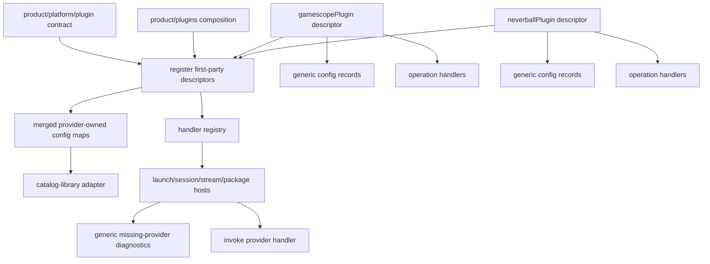

# refactor: Align first-party plugin descriptors with retained sketch

## Summary

Align Korri's first-party plugin host with the retained descriptor sketch: plugins contribute generic config records plus operation-scoped handlers, not bespoke `launchCompanions`, typed `catalog`, or typed `resources` buckets. Gamescope becomes a fully plugin-contributed capability surface, Neverball migrates to the same generic descriptor model, and product composition—not platform/core—decides which plugins are present by default.

---

## Problem Frame

The current implementation moved Gamescope code under `product/plugins/gamescope/`, but Korri still exposes plugin concepts through older bespoke buckets and several Gamescope-shaped host surfaces. That leaves `product/plugins/gamescope/index.ts` as a broad barrel and `src/plugin.ts` as thin metadata instead of the meaningful Korri↔plugin descriptor boundary described by the retained sketch.

---

## Requirements

- R1. Replace bespoke plugin contribution buckets with the retained first-party shape: generic static config maps plus host-invoked operation handlers (origin R1-R10).
- R2. Preserve stable provider/plugin identity using provider-style ids and provider-owned record refs; file/module boundaries remain packaging convenience, not product identity (origin R3-R5, R11-R13).
- R3. Make handler invocation operation-scoped and app-agnostic; generic context must not hardcode Steam, RetroArch, Gamescope, Neverball, or other integration names (origin R8-R10).
- R4. Migrate Gamescope so `src/plugin.ts` assembles the descriptor for launch composition, runtime-control, stream-control, session cleanup, package/CLI exposure, and diagnostics, while heavy implementation remains in focused plugin-owned submodules.
- R5. If Gamescope is removed from product composition, Korri core/platform must contain no hardcoded Gamescope indicators: no constants, schemas, package paths, patches, runtime-control types, route names, session process names, or default assumptions outside plugin-provided surfaces.
- R6. If a launch explicitly references a missing plugin/provider such as `@korri:gamescope`, Korri keeps the app/library usable but blocks that launch with generic missing-plugin diagnostics/signaling.
- R7. Make Gamescope default inclusion a product-composition decision, not platform/core behavior.
- R8. Migrate Neverball and the plugin catalog/library adapter off the old typed `catalog`/`resources` contribution buckets so the platform plugin contract matches the retained sketch after the plan executes.
- R9. Make root flake package/app exposure and CLI binary exposure plugin-driven; removing the Gamescope plugin from composition must remove Gamescope-specific root outputs or leave only explicitly temporary compatibility aliases with tests.
- R10. Preserve existing user-facing behavior where the plugin is present: Gamescope launch wrapping, runtime-control behavior, session cleanup, stream-control actions, Neverball visibility/launch, and Nix fulfillment semantics must remain equivalent unless explicitly called out.
- R11. Retain authored Gamescope config shape `launch.with."@korri:gamescope"`; do not reintroduce top-level authored `gamescope:` fields.
- R12. Add guardrails proving platform/shared layers do not import product plugin implementations and that missing plugin/provider paths fail generically rather than with Gamescope-specific code.

**Origin actors:** A1 Integration author, A2 Planner/implementer, A3 Image/profile composer, A4 Player/operator.
**Origin flows:** F1 First-party plugin contributes static config, F2 First-party plugin contributes host-invoked behavior, F3 Plugin requirements are validated simply.
**Origin acceptance examples:** AE1-AE5 are carried forward through generic config contributions, handler invocation, requirement diagnostics, Effect normalization, and catalog vocabulary preservation.

---

## Scope Boundaries

- Do not build third-party/user-installed plugins, marketplace behavior, sandboxing, trust tiers, dynamic external plugin discovery, or semver dependency resolution.
- Do not implement the future notification UI for missing plugins. This plan only requires generic diagnostics/signaling that the UI can later surface.
- Do not implement a launch-anyway choice for missing explicit plugins. The current behavior should block the affected launch; future UI may add an override choice.
- Do not change user-authored Gamescope config away from `launch.with."@korri:gamescope"`.
- Do not change Gamescope runtime-control protocol semantics, Nix patch contents, session cleanup behavior, or stream-control command behavior except to route them through plugin-contributed host surfaces.
- Do not broadly migrate RetroArch, Steam, fake-08, PICO-8 BBS, or unrelated integrations into plugins beyond compatibility changes required by the new host contract.
- Do not chase pre-existing whole-repo failures such as generated route-tree type gaps or unrelated product-reorg guardrail failures.

### Deferred to Follow-Up Work

- Full notification UI for missing plugin/provider diagnostics.
- User-facing launch-anyway override when an explicitly referenced plugin is unavailable.
- Third-party plugin loading, distribution, sandboxing, trust tiers, and marketplace semantics.
- Broader library-to-catalog vocabulary migration outside the plugin host seam.
- Migrating RetroArch, Steam, fake-08, or PICO-8 BBS to first-party plugins once the descriptor host contract is stable.

---

## Context & Research

### Relevant Code and Patterns

- `out/tmp/plugin-shape-sketches/aligned-first-party-plugin-sketch/product/platform/plugin/index.ts` is the retained target shape: `plugin(...)`, `register([...plugins])`, provider ids, provider refs, generic config maps, operation handlers, and Effect-compatible handler results.
- `out/tmp/plugin-shape-sketches/aligned-first-party-plugin-sketch/product/plugins/pico8.ts` shows multiple independently addressable plugins in one module and demonstrates config-plus-handler authoring.
- `product/platform/plugin/index.ts` currently has old typed `catalog`, `resources`, and `launchCompanions` buckets plus a narrower handler context.
- `product/platform/plugin/registry.ts` currently exposes enabled plugins, typed catalog/resources, and test-only `launchCompanions` aggregation.
- `product/platform/plugin/catalog-library-source.ts` is the main adapter that currently consumes typed plugin catalog/resource contributions and must become a schema/narrowing adapter over generic config records.
- `product/plugins/gamescope/src/plugin.ts` currently declares only metadata plus a launch-provider contribution; it should become descriptor assembly for Gamescope-provided config, capabilities, and handlers.
- `product/plugins/gamescope/index.ts` currently re-exports launch, runtime, stream-control, session, and CLI surfaces; that is the public API smell this plan corrects.
- `product/plugins/neverball/index.ts` currently validates the old typed catalog/resource model; it must migrate to generic config plus handlers to prove the retained sketch works beyond Gamescope.
- `product/plugins/index.ts` is the product-owned composition point that can include Gamescope by default without making platform/core know Gamescope exists.
- `product/systems/nixos/flake/default.nix`, `product/systems/nixos/flake/apps.nix`, `product/systems/nixos/flake/packages.nix`, and `product/systems/nixos/overlays/korri-packages.nix` currently expose package/app surfaces that must become plugin-driven or explicitly temporary compatibility aliases.
- `tools/testing/standards/product-reorg-boundaries.test.ts` already enforces product/platform boundaries and should be extended to catch platform imports from product plugins and hardcoded Gamescope indicators.

### Institutional Learnings

- `docs/solutions/architecture-patterns/korri-plugin-architecture-2026-06-02.md`: plugin code should live under product plugin modules while host contracts remain shared; contribution points should be explicit and host-invoked.
- `docs/solutions/architecture-patterns/korri-product-platform-theme-architecture-2026-06-03.md`: `product/platform/*` is a stable host surface and must not import product plugin implementations.
- `docs/solutions/best-practices/product-owned-composition-keeps-shared-layers-reusable-2026-05-03.md`: product-owned composition should choose concrete plugins; shared layers should expose primitives only.
- `docs/solutions/design-patterns/explicit-cascade-folded-policy-over-incidental-signal-heuristics-2026-05-27.md`: launch behavior must come from explicit resolved policy rather than argv/env sniffing. Gamescope `launch.compose` must receive resolved policy and map it mechanically.
- `docs/solutions/architecture-patterns/gamescope-runtime-control-contract-2026-06-02.md`: Gamescope runtime-control responses distinguish unsupported valid controls from unknown methods; plugin handler diagnostics must preserve that distinction.

### External References

- External research skipped. The retained sketch and repo-local plugin architecture docs are the controlling design input; the work is internal architecture alignment.

---

## Key Technical Decisions

- **Adopt the retained sketch as the target contract.** `product/platform/plugin` should expose generic config maps and operation handlers, not per-integration contribution buckets.
- **Remove `launchCompanions`, typed `catalog`, and typed `resources` as top-level plugin contribution buckets.** Their behavior moves into generic config records plus host adapters/handlers.
- **Use generic operation names, not Gamescope-specific host concepts.** Host operations may include launch composition, launch preparation, runtime resolution, stream-control action application, session cleanup, package/app exposure, artifact resolution, and diagnostics, but names and context stay provider-agnostic.
- **Keep Gamescope fully plugin-owned.** The plugin owns the id, policy schema/defaults/normalization, launch wrapper, runtime-control protocol/client/bridge/backend, state normalization, stream-control handlers, session cleanup hooks, CLI/package metadata, flake, patches, and Nix package lanes.
- **Keep `src/plugin.ts` as descriptor assembly, not implementation dumping ground.** It imports plugin-owned config fragments and handler implementations from focused submodules and assembles the Korri-facing descriptor.
- **Shrink the Gamescope root entrypoint.** `product/plugins/gamescope/index.ts` should primarily expose the plugin descriptor and stable provider id; implementation consumers should route through plugin handlers or explicit documented subpath entrypoints when direct product-owned imports are still necessary.
- **Product composition owns default enablement.** Current builds may include and enable Gamescope by default, but only because `product/plugins` or image/profile composition registers/enables it.
- **Missing explicit plugin references are recoverable for the app, blocking for the affected launch.** The library/app remains usable; the specific launch requiring a missing provider fails with a generic diagnostic. Future UI may offer launch-anyway.
- **Root Nix exposure is a plugin contribution.** Root flake packages/apps and CLI binaries are assembled from plugin-provided package/app exposure records; static Gamescope outputs are not allowed as permanent core knowledge.
- **Neverball proves the generic model.** Neverball must migrate to generic config records plus handlers in the same plan so the old typed resource/catalog buckets can actually be removed.

---

## Open Questions

### Resolved During Planning

- Should this be a narrow Gamescope cleanup or full sketch alignment? Full sketch alignment. The user expects the executed result to look like the retained sketch with generic config and handlers.
- Should Korri keep a Gamescope-specific fallback if the plugin is missing? No. Korri remains usable but reports a generic missing-plugin/provider diagnostic and blocks the affected explicit launch.
- Should all Gamescope-shaped host surfaces become plugin-contributed? Yes. Launch, runtime-control, stream-control, session, CLI, package, and Nix exposure surfaces are all plugin contributions.
- Should Gamescope be enabled by default? Yes, but only via product composition, not platform/core assumptions.
- Should `src/plugin.ts` inline implementations? No. It assembles the descriptor and imports focused handlers/config from submodules.
- Should Neverball/catalog adapter migrate too? Yes. Full sketch alignment requires removing the old typed buckets.
- Do root flake/CLI outputs count as Gamescope indicators? Yes. They must be plugin-driven or explicitly temporary compatibility aliases.

### Deferred to Implementation

- Exact names of any operation strings beyond the sketch's seed operations: implementation should choose names that match local conventions, but they must remain generic and provider-agnostic.
- Exact generic record placement for Nix executable facts: the plan expects plugin-owned config records plus handlers, not a top-level typed `resources` bucket. Implementation should choose whether the record lives under `modules`, `storage`, or another retained sketch map based on the cleanest adapter fit.
- Exact transition mechanics for root flake outputs: implementation may use generated plugin metadata, Nix imports, or a static product-composition registry as long as permanent Gamescope-specific root outputs disappear.

---

## Output Structure

    product/platform/plugin/
    ├── index.ts
    ├── registry.ts
    ├── registry.test.ts
    ├── catalog-library-source.ts
    ├── catalog-library-source.test.ts
    ├── resources.ts
    └── resources.test.ts

    product/plugins/
    ├── index.ts
    ├── index.test.ts
    ├── gamescope/
    │   ├── index.ts
    │   ├── src/
    │   │   ├── plugin.ts
    │   │   ├── plugin.test.ts
    │   │   ├── launch-companion/
    │   │   ├── runtime-control/
    │   │   ├── stream-control/
    │   │   ├── session/
    │   │   └── cli/
    │   └── packages/
    │       ├── gamescope-korri/
    │       └── control-bridge/
    └── neverball/
        ├── index.ts
        └── neverball.test.ts

This tree is directional. The retained sketch shape is authoritative: host contracts in `product/platform/plugin`, first-party plugin declarations in `product/plugins`, product composition in `product/plugins/index.ts`, and plugin implementation under each plugin package.

---

## High-Level Technical Design

> *This illustrates the intended approach and is directional guidance for review, not implementation specification. The implementing agent should treat it as context, not code to reproduce.*

Core/platform owns the generic registry, config maps, handler invocation, diagnostics shape, and host adapters. Product composition chooses which plugins are present. Plugin packages own provider ids, records, handlers, package paths, and implementation.

---

## Implementation Units

### U1. Replace the platform plugin contract with the retained descriptor model

**Goal:** Make `product/platform/plugin` match the retained sketch: provider ids, provider-owned refs, generic config maps, operation-scoped handlers, requirements, handler result normalization, and registration.

**Requirements:** R1, R2, R3, R8, R12; origin R1-R13, AE1, AE2, AE4.

**Dependencies:** None.

**Files:**
- Modify: `product/platform/plugin/index.ts`
- Modify: `product/platform/plugin/registry.ts`
- Modify: `product/platform/plugin/registry.test.ts`
- Modify: `product/plugins/index.ts`
- Test: `product/platform/plugin/registry.test.ts`

**Approach:**
- Replace `PluginContributions` top-level typed buckets with `config` and `handlers` in the shape of the retained sketch.
- Add provider id/ref types, plugin record id helpers, generic config record maps, operation types, requirements, operation-scoped handler context, and registry aggregation.
- Preserve handler result normalization for plain values, Promise-like values, and Effect values.
- Keep enablement explicit in product composition: available plugins and enabled plugins remain distinct, but the generic registry shape is the source of merged config maps and handlers.
- Remove `PluginLaunchCompanionContribution` and registry `launchCompanions` from the platform contract.

**Execution note:** Characterize existing registry behavior before removing old buckets so enabled/available plugin semantics do not regress.

**Patterns to follow:**
- `out/tmp/plugin-shape-sketches/aligned-first-party-plugin-sketch/product/platform/plugin/index.ts`
- `out/tmp/plugin-shape-sketches/aligned-first-party-plugin-sketch/product/plugins/pico8.ts`
- Existing `normalizePluginHandlerResult` behavior in `product/platform/plugin/index.ts`

**Test scenarios:**
- Happy path: registering one plugin yields its provider record, merged config maps, and handlers.
- Happy path: one module can export multiple plugin descriptors and each remains independently addressable by provider id.
- Edge case: duplicate provider ids fail with a clear diagnostic.
- Edge case: disabled plugins remain available but do not contribute merged config maps or active handlers.
- Integration: plain, Promise-like, and Effect-returning handlers all normalize through the host boundary.
- Regression: `launchCompanions`, typed top-level `catalog`, and typed top-level `resources` are not part of the final `PluginContributions` contract.

**Verification:**
- Platform plugin tests prove the retained descriptor model and no test expects `registry.launchCompanions`.

---

### U2. Convert plugin catalog, executable facts, and Nix fulfillment to generic config plus handlers

**Goal:** Replace typed plugin `catalog`/`resources` contribution consumption with generic config records and host-owned adapters, while preserving Neverball/Nix fulfillment behavior.

**Requirements:** R1, R2, R8, R10, R12; origin R6-R8, R11-R16, AE1, AE3, AE5.

**Dependencies:** U1.

**Files:**
- Modify: `product/platform/plugin/catalog-library-source.ts`
- Modify: `product/platform/plugin/catalog-library-source.test.ts`
- Modify: `product/platform/plugin/resources.ts`
- Add/modify: `product/platform/plugin/resources.test.ts`
- Modify if needed: `product/platform/library/library-services.ts`
- Test: `product/platform/plugin/catalog-library-source.test.ts`
- Test: `product/platform/plugin/resources.test.ts`

**Approach:**
- Treat plugin-contributed catalog/playable facts as generic config records that are validated/narrowed at the library adapter seam.
- Represent executable/Nix fulfillment facts as provider-owned generic records rather than a top-level typed `resources` bucket.
- Keep Nix fulfillment host-owned: plugins describe the executable and installable facts; Korri decides how to materialize out-links and resolve absolute binaries.
- Preserve current launch-time rule: launch resolution should not run Nix implicitly. Missing or broken fulfillment produces actionable diagnostics.
- Ensure record refs use provider-owned `{ provider, id }` style instead of implicit local ids.

**Patterns to follow:**
- `product/platform/plugin/catalog-library-source.ts` current library-source adapter behavior.
- `product/platform/plugin/resources.ts` current Nix out-link state and fulfillment behavior.
- Retained sketch `PluginConfigContributions` maps.

**Test scenarios:**
- Happy path: generic plugin catalog records appear through the existing library/source listing seam when the plugin is enabled.
- Happy path: a generic executable config record resolves to an already fulfilled absolute binary through the host fulfillment adapter.
- Edge case: provider-owned record ids are namespaced and do not collide across plugins.
- Error path: missing executable record blocks only the affected launch with a generic diagnostic.
- Error path: missing binary under an out-link produces the same actionable failure as current typed-resource behavior.
- Regression: no adapter consumes `plugin.contributes.catalog` or `plugin.contributes.resources` as top-level typed arrays.
- Integration: existing ProseQL-backed library entries remain listed and launchable unchanged.

**Verification:**
- Catalog/library adapter tests pass with generic config records and old top-level buckets removed.

---

### U3. Migrate Neverball to the retained descriptor shape

**Goal:** Make Neverball the proof that a normal first-party playable plugin can use generic config records and handlers without bespoke catalog/resource buckets.

**Requirements:** R1, R2, R3, R8, R10; origin R1-R16, AE1, AE3, AE4, AE5.

**Dependencies:** U1, U2.

**Files:**
- Modify: `product/plugins/neverball/index.ts`
- Modify: `product/plugins/neverball/neverball.test.ts`
- Modify: `product/plugins/index.ts`
- Test: `product/plugins/neverball/neverball.test.ts`
- Test: `product/plugins/index.test.ts`

**Approach:**
- Move Neverball playable metadata into `contributes.config.catalog` records.
- Move Neverball executable/Nix facts into provider-owned generic config records interpreted by the fulfillment adapter.
- Use handlers for diagnostics or launch/resource preparation where dynamic behavior is needed.
- Keep all Neverball-specific metadata in the Neverball plugin module; platform code should only see generic records and provider refs.

**Patterns to follow:**
- Existing `product/plugins/neverball/index.ts` behavior and tests.
- Retained sketch's PICO-8 BBS and fake-08 examples for catalog/runtime separation.

**Test scenarios:**
- Happy path: `@korri:neverball` descriptor contributes provider-owned catalog and executable records through `config`.
- Happy path: enabling Neverball makes its playable visible through the plugin-backed library adapter.
- Error path: disabling Neverball removes its catalog and executable records from active registry outputs.
- Regression: Neverball no longer uses top-level typed `catalog` or `resources` contributions.
- Integration: Neverball launch resolution still reaches an absolute fulfilled executable when the resource is available.

**Verification:**
- Neverball tests prove the generic descriptor shape and no platform code branches on Neverball-specific details.

---

### U4. Make Gamescope `plugin.ts` the descriptor assembly for all Gamescope capabilities

**Goal:** Replace the thin Gamescope descriptor with a complete plugin-owned descriptor assembly that declares config records, capabilities, requirements, and operation handlers for every Gamescope-provided host surface.

**Requirements:** R4, R5, R7, R10, R11; origin R1-R13, AE1, AE2, AE4.

**Dependencies:** U1.

**Files:**
- Modify: `product/plugins/gamescope/src/plugin.ts`
- Add: `product/plugins/gamescope/src/plugin.test.ts`
- Modify: `product/plugins/gamescope/src/launch-companion/index.ts`
- Modify: `product/plugins/gamescope/src/runtime-control/index.ts`
- Modify: `product/plugins/gamescope/src/stream-control/index.ts`
- Modify: `product/plugins/gamescope/src/session/index.ts`
- Modify: `product/plugins/gamescope/src/cli/control.ts`
- Modify if needed: `product/plugins/gamescope/src/cli/bridge.ts`
- Test: `product/plugins/gamescope/src/plugin.test.ts`

**Approach:**
- Keep `src/plugin.ts` as descriptor assembly only. It imports focused handler/config fragments and assembles the Korri-facing descriptor.
- Declare Gamescope provider id and plugin-owned records inside the plugin package, not in platform.
- Register handler entries for launch composition, runtime/control resolution, stream-control actions, session cleanup, package/app exposure, and diagnostics using generic operation names.
- Ensure each handler has explicit capabilities and receives operation input rather than reading global Gamescope assumptions from host code.
- Preserve Gamescope's current policy semantics by routing resolved policy into the launch composition handler; do not add wrapper-side heuristics.

**Patterns to follow:**
- `out/tmp/plugin-shape-sketches/aligned-first-party-plugin-sketch/product/plugins/pico8.ts` descriptor assembly pattern.
- Existing Gamescope submodules under `product/plugins/gamescope/src/` for implementation ownership.
- `docs/solutions/design-patterns/explicit-cascade-folded-policy-over-incidental-signal-heuristics-2026-05-27.md`.

**Test scenarios:**
- Happy path: `gamescopePlugin` descriptor exposes provider metadata, capabilities, config records, and handlers through the retained plugin contract.
- Happy path: the launch composition handler wraps a base launch spec with the same output as the current Gamescope wrapper for representative policy.
- Error path: invalid or missing launch policy input produces a generic handler/config diagnostic rather than a platform Gamescope error.
- Regression: `gamescopePlugin` has no `launchCompanions` contribution.
- Regression: `src/plugin.ts` does not inline heavy runtime/session/stream implementation; it assembles imported plugin-owned surfaces.

**Verification:**
- Gamescope plugin descriptor tests prove the descriptor is the primary Korri-facing interface.

---

### U5. Route launch/config behavior through plugin registry handlers and generic diagnostics

**Goal:** Make explicit `launch.with` provider references resolve through the plugin registry and fail generically when the provider is absent, while preserving behavior when Gamescope is present.

**Requirements:** R3, R5, R6, R7, R10, R11, R12; origin R6-R13, AE1, AE2, AE4.

**Dependencies:** U1, U4.

**Files:**
- Modify: `product/platform/library/config/inheritable-fields.ts`
- Modify: `product/platform/library/config/cascade-resolver.ts`
- Modify: `product/platform/library/config/resolved-launch-context.ts`
- Modify: `product/apps/portal/api/library/launch.rpc-handler.ts`
- Modify: `product/platform/library/rocknix/rocknix-source.ts`
- Modify: `product/services/device/game-stream-fullscreen.ts`
- Modify relevant tests: `product/platform/library/config/inheritable-fields.test.ts`
- Modify relevant tests: `product/platform/library/config/cascade-resolver.test.ts`
- Modify relevant tests: `product/apps/portal/api/library/launch.rpc-handler.test.ts`

**Approach:**
- Keep base config syntax generic: `launch.with` stores provider-keyed payloads without platform knowing specific plugin schemas.
- Move provider-specific payload validation/normalization into plugin-owned handlers or schema adapters supplied by the registry.
- Replace platform-owned Gamescope id imports, schema/default exports, and direct wrapper calls with generic registry lookup/invocation.
- If a launch explicitly references an unavailable provider, block that launch with a generic missing-provider diagnostic while leaving listing and other launches usable.
- Preserve current `launch.with."@korri:gamescope"` authoring and reject retired top-level `gamescope:` as before.

**Execution note:** Start with characterization tests for present-plugin and missing-plugin launch behavior before removing platform-owned Gamescope schema paths.

**Patterns to follow:**
- Existing launch RPC tests around Gamescope wrapping and missing playable diagnostics.
- Existing config record tests rejecting retired top-level Gamescope fields.
- Retained sketch's provider/ref model.

**Test scenarios:**
- Happy path: with Gamescope enabled by product composition, a launch using `launch.with."@korri:gamescope"` wraps exactly as before.
- Error path: with Gamescope absent/disabled, the same explicit launch is blocked with a generic missing-provider or missing-handler diagnostic.
- Edge case: other games without the missing provider remain listable and launchable.
- Regression: top-level authored `gamescope:` remains rejected.
- Regression: platform config modules no longer import or export Gamescope-specific policy/default/schema helpers.
- Integration: plugin-produced launches and YAML/config-produced launches use the same provider-keyed launch policy path.

**Verification:**
- Launch/config tests prove present and missing provider behavior without platform-owned Gamescope code.

---

### U6. Convert Gamescope host surfaces to plugin-contributed handlers and records

**Goal:** Remove hardcoded Gamescope stream-control, runtime-control, session, CLI, and package assumptions from host code and route them through plugin-contributed surfaces.

**Requirements:** R4, R5, R6, R7, R9, R10, R12.

**Dependencies:** U1, U4, U5.

**Files:**
- Modify: `product/apps/portal/api/stream-control/service.ts`
- Modify: `product/platform/stream-control/stream-control-api-routes.ts`
- Modify: `product/platform/stream-control/control-contract.ts`
- Modify: `product/platform/stream-control/state-normalizer.ts`
- Modify: `product/apps/cli/stream-control-bench.ts`
- Modify: `product/services/device/sessiond.ts`
- Modify: `product/services/device/sessiond-source-machine.ts`
- Modify: `product/themes/evier/pages/EvierStreamControlPage.tsx`
- Modify: `product/themes/evier/pages/evier-control-state.ts`
- Modify relevant tests: `product/apps/portal/api/stream-control/stream-control.rpc-handler.test.ts`
- Modify relevant tests: `product/platform/stream-control/control-surface.test.ts`
- Modify relevant tests: `product/services/device/sessiond.test.ts`
- Modify relevant tests: `product/services/device/sessiond-source-machine.test.ts`
- Modify relevant tests: `product/apps/cli/stream-control-bench.test.ts`

**Approach:**
- Keep host surfaces generic: stream-control, runtime-control, session cleanup, and CLI/package launch should discover plugin-provided capabilities from the registry instead of importing Gamescope directly.
- Move Gamescope-specific control names, scaling filters, process names, socket bridge details, and reaper knowledge behind Gamescope plugin handlers/records.
- Preserve stable external RPC/CLI behavior only if those surfaces are now produced by plugin composition. If the plugin is absent, expose generic capability-unavailable diagnostics rather than Gamescope-specific empty state.
- Keep UI themes consuming generic stream-control state/action descriptions, not Gamescope implementation exports.

**Patterns to follow:**
- Current stream-control service tests for linked Moonlight/Gamescope behavior.
- Current sessiond reaper tests under `product/plugins/gamescope/src/session/`.
- Product/platform boundary guardrails in `tools/testing/standards/product-reorg-boundaries.test.ts`.

**Test scenarios:**
- Happy path: when Gamescope plugin is enabled, stream-control actions and readbacks behave as before.
- Error path: when Gamescope plugin is absent, stream-control reports generic capability unavailable and does not expose hardcoded Gamescope action wiring.
- Happy path: sessiond invokes plugin-contributed cleanup hooks when Gamescope is enabled.
- Error path: missing session cleanup hook does not crash session restoration; it records generic missing-capability evidence.
- Regression: platform stream-control modules and themes do not import Gamescope plugin internals.
- Integration: CLI/bench surfaces obtain Gamescope control behavior through product composition, not static root imports.

**Verification:**
- Stream-control, sessiond, CLI, and theme-adjacent tests pass with plugin-contributed Gamescope surfaces.

---

### U7. Make root flake packages/apps and CLI exposure plugin-driven

**Goal:** Ensure root Nix package/app outputs and CLI binaries derive from product plugin composition, so removing the Gamescope plugin removes Gamescope-specific outputs from Korri composition.

**Requirements:** R5, R7, R9, R10, R12.

**Dependencies:** U1, U4, U6.

**Files:**
- Modify: `product/systems/nixos/flake/default.nix`
- Modify: `product/systems/nixos/flake/packages.nix`
- Modify: `product/systems/nixos/flake/apps.nix`
- Add or modify: `product/systems/nixos/flake/plugins.nix`
- Modify: `product/systems/nixos/overlays/korri-packages.nix`
- Modify: `product/plugins/gamescope/flake.nix`
- Modify: `product/plugins/gamescope/packages/gamescope-korri/default.nix`
- Modify: `product/plugins/gamescope/packages/control-bridge/default.nix`
- Modify or add tests: `tools/testing/standards/product-reorg-boundaries.test.ts`

**Approach:**
- Model plugin-owned package/app exposures as plugin records/metadata consumed by product composition.
- Introduce a Nix-readable product plugin composition seam rather than expecting TypeScript plugin descriptors to drive pure Nix evaluation directly. A small `product/systems/nixos/flake/plugins.nix`-style registry, checked-in metadata file, or equivalent Nix module should list enabled first-party plugin package/app exposures for root flake evaluation.
- Keep `gamescope-korri` and control bridge package definitions under `product/plugins/gamescope/packages/`.
- Root flake may still expose selected plugin packages/apps for current product builds, but the selection must flow from the Nix-readable product plugin composition seam rather than hardcoded Gamescope knowledge in platform/core.
- If implementation cannot remove existing root aliases in one slice without breaking users, mark them explicitly temporary and add tests proving plugin-local paths are canonical and compatibility aliases are isolated.

**Patterns to follow:**
- `product/plugins/gamescope/flake.nix` Linux-only standalone package exposure.
- Existing root flake package/app conventions in `product/systems/nixos/flake/`.
- Product-owned package lane guidance in `docs/solutions/architecture-patterns/korri-product-platform-theme-architecture-2026-06-03.md`.

**Test scenarios:**
- Happy path: current product composition includes Gamescope and root flake exposes the same package/app names as before.
- Edge case: product composition without Gamescope does not expose Gamescope-specific package/app outputs.
- Integration: the Nix-readable plugin composition seam is the only source used by root package/app exposure.
- Regression: `product/plugins/gamescope#packages.<system>.gamescope-korri` still evaluates.
- Regression: root `gamescope-korri` and control-bridge package evals still work when Gamescope is included by composition.
- Guardrail: no root Nix file references plugin-internal Gamescope paths except through the plugin-composition/package exposure mechanism.

**Verification:**
- Nix eval/flake checks prove package exposure is plugin-driven and existing current-product outputs remain available when Gamescope is included.

---

### U10. Move NixOS module and image Gamescope wiring behind plugin composition

**Goal:** Ensure NixOS modules, image defaults, assertions, environment variables, installed packages, and PATH entries do not hardcode Gamescope when the Gamescope plugin is removed from product composition.

**Requirements:** R5, R7, R9, R10, R12.

**Dependencies:** U4, U6, U7.

**Files:**
- Modify: `product/systems/nixos/modules/korri-compositor.nix` or the current compositor module path if renamed
- Modify: `product/systems/nixos/modules/korri-game-stream.nix` or the current game-stream module path if renamed
- Modify: `product/systems/nixos/modules/korri-steam.nix`
- Modify: `product/systems/nixos/flake/default.nix`
- Modify: `product/systems/nixos/overlays/korri-packages.nix`
- Modify SM8550/image default files that currently assert or inject Gamescope control environment
- Add or modify module tests/eval checks under `product/systems/nixos/` if existing NixOS module tests are present
- Test: `tools/testing/standards/product-reorg-boundaries.test.ts`

**Approach:**
- Treat NixOS module/image Gamescope package selection, compositor package defaults, game-stream command env, Steam Gamescope materializer env/options, control socket env, and image assertions as plugin-provided product composition data.
- Current product composition may include Gamescope by default, preserving Bandai/current image behavior.
- A no-Gamescope composition should evaluate without Gamescope package defaults, Gamescope PATH entries, Gamescope control env, or Gamescope-specific assertions.
- If any module still needs a generic launch-wrapper/compositor package slot, keep that slot provider-agnostic and populate it from plugin composition.

**Patterns to follow:**
- Existing NixOS module conventions under `product/systems/nixos/`.
- U7's Nix-readable plugin composition seam.
- Product-owned composition guidance in `docs/solutions/best-practices/product-owned-composition-keeps-shared-layers-reusable-2026-05-03.md`.

**Test scenarios:**
- Happy path: current Bandai/product composition includes Gamescope and keeps existing compositor/game-stream package/env behavior.
- Edge case: a no-Gamescope product composition evaluates without Gamescope package, PATH, env, or assertion references.
- Error path: if a profile requires a missing launch-wrapper provider, module evaluation or runtime diagnostics fail generically with provider/capability information.
- Regression: no NixOS module or image default hardcodes `gamescope`, `gamescope-korri`, Steam Gamescope materializer env/options, or Gamescope control env outside plugin composition.

**Verification:**
- Nix eval/module checks cover both with-Gamescope and without-Gamescope compositions, and grep/guardrails confirm no module-level Gamescope indicators remain outside the plugin composition seam.

---

### U8. Shrink Gamescope public entrypoints and add boundary guardrails

**Goal:** Remove the broad Gamescope root barrel smell and enforce the rule that platform/core has no Gamescope-specific knowledge when the plugin is absent.

**Requirements:** R4, R5, R7, R12.

**Dependencies:** U4, U5, U6, U7, U10.

**Files:**
- Modify: `product/plugins/gamescope/index.ts`
- Add or modify explicit public subpath files only if needed under `product/plugins/gamescope/`
- Modify: `product/platform/plugin/ids.ts` or remove if no longer needed
- Modify: `tools/testing/standards/product-reorg-boundaries.test.ts`
- Modify: `product/plugins/index.test.ts`
- Test: `tools/testing/standards/product-reorg-boundaries.test.ts`
- Test: `product/plugins/index.test.ts`

**Approach:**
- Make the root Gamescope entrypoint expose only the plugin descriptor and stable provider id, unless a documented public subpath is intentionally added.
- Remove or neutralize platform-owned Gamescope id constants. Platform can understand provider ids generically but must not define `@korri:gamescope`.
- Add guardrails that fail if `product/platform/**` imports `product/plugins/**`, if platform/core reintroduces Gamescope-specific symbols, or if Gamescope code moves out of the plugin package.
- Update product consumers to use registry/handlers or explicit product-owned subpaths rather than the root barrel.

**Patterns to follow:**
- `tools/testing/standards/product-reorg-boundaries.test.ts` existing import-boundary scans.
- Retained sketch's separation between `product/platform/plugin` host contract and `product/plugins/*` declarations.

**Test scenarios:**
- Happy path: `product/plugins/gamescope` root exports only the descriptor-facing API.
- Regression: broad runtime/session/stream-control symbols are no longer exported from the root barrel.
- Guardrail: platform/shared code has no imports from product plugins.
- Guardrail: no platform-owned Gamescope constants, schemas, package paths, or process names remain.
- Integration: product composition can still register and enable Gamescope by importing the descriptor.

**Verification:**
- Boundary guardrail tests pass and direct grep/search confirms no hardcoded Gamescope indicators remain outside plugin-owned/product-composition surfaces.

---

### U9. Documentation and migration notes for the retained plugin contract

**Goal:** Capture the final descriptor shape and migration rationale so future plugin work does not reintroduce bespoke buckets or broad barrels.

**Requirements:** R1, R2, R3, R5, R8, R9, R12; origin R1-R16.

**Dependencies:** U1-U8, U10.

**Files:**
- Modify: `product/plugins/gamescope/README.md`
- Modify or add: `product/platform/plugin/README.md` if a plugin host README exists or implementation creates one
- Modify: `docs/solutions/architecture-patterns/korri-plugin-architecture-2026-06-02.md` only if the current entry still describes superseded bespoke buckets as the preferred model
- Modify: `work/items/active/01KV8NZRAAETDX69P5T73BRVY8-first-party-plugin-system-shape/plan.md` only if it needs a pointer that this follow-up supersedes its old bucket shape

**Approach:**
- Document the final retained descriptor shape: generic config maps, provider ids, provider refs, handlers, capabilities, and product-owned composition.
- Explicitly note that Gamescope is default-enabled by product composition, not platform/core.
- Document missing-provider behavior: app remains usable, affected explicit launch blocks with generic diagnostics.
- Avoid turning docs into a second implementation spec; capture decisions and boundaries.

**Test scenarios:**
- Test expectation: none for prose-only docs, but any examples included in docs should match existing tests and final descriptor vocabulary.

**Verification:**
- Docs align with the implemented contract and do not reference removed `launchCompanions`, typed top-level `catalog`, or typed top-level `resources` as the current preferred API.

---

## System-Wide Impact

- **Interaction graph:** Product composition registers plugins; the platform registry merges generic config maps and handlers; library/config/launch/session/stream/Nix hosts invoke generic plugin capabilities instead of importing Gamescope or Neverball implementation.
- **Error propagation:** Missing provider/handler becomes a generic diagnostic that blocks only the affected operation. Explicit `launch.with` provider absence blocks that launch; the library/app remains usable.
- **State lifecycle risks:** Nix fulfillment state and out-links must remain stable across the migration from typed resources to generic executable records. Launch must not run Nix implicitly.
- **API surface parity:** Existing RPC/CLI/package names can remain when the plugin is included, but their presence is plugin-driven. If compatibility aliases remain, they must be marked temporary and tested as aliases.
- **Integration coverage:** Tests must cover registry aggregation, Neverball listing/launch, Gamescope present/missing launch behavior, stream-control/session behavior with plugin present/absent, and Nix package exposure.
- **Unchanged invariants:** User-authored Gamescope config stays under `launch.with."@korri:gamescope"`; retired top-level `gamescope:` remains invalid; existing Gamescope runtime-control protocol behavior remains unchanged when the plugin is present.

---

## Risks & Dependencies

| Risk | Mitigation |
|------|------------|
| The plan becomes a big-bang contract migration that breaks Neverball or plugin-backed library listing. | Sequence U1-U3 first with characterization tests, and keep library adapter behavior covered before touching Gamescope host surfaces. |
| Removing Gamescope root barrel breaks product consumers unexpectedly. | Migrate consumers through registry/handlers or explicit subpaths before shrinking the root export; add guardrail tests. |
| Root flake or NixOS module plugin-driven exposure is larger than expected. | Add the Nix-readable composition seam first, then migrate root outputs and module/image defaults through it; allow explicitly temporary compatibility aliases only with tests and documented removal. |
| Missing plugin behavior accidentally becomes silent launch-without-wrapper. | Add launch tests proving explicit missing provider blocks the affected launch with generic diagnostics. |
| Platform re-learns Gamescope through constants or schema helpers. | Remove platform-owned Gamescope id/schema helpers and add product-reorg guardrails for platform→plugin imports and Gamescope strings outside plugin-owned/product-composition areas. |
| Generic config records become untyped too early. | Validate/narrow records at host adapter seams with tests for malformed records and diagnostics. |

---

## Documentation / Operational Notes

- Update plugin architecture docs only where they describe superseded contribution buckets as the current preferred model.
- Preserve Bandai/current product behavior by keeping Gamescope enabled through product composition during rollout.
- Any compatibility alias for root Nix packages/apps must be clearly marked as temporary and backed by a follow-up item if it cannot be removed inside this plan.
- Future notification UI should consume the generic missing-provider diagnostics introduced here.

---

## Alternative Approaches Considered

- **Narrow Gamescope-only correction:** Rejected because the user expects the full retained sketch after execution, and leaving typed catalog/resources buckets would keep the plugin contract partially old-shape.
- **Keep `resources` as a permanent top-level plugin bucket:** Rejected because it diverges from the retained generic config+handlers model. Executable facts should be plugin-owned config interpreted by host fulfillment adapters.
- **Keep Gamescope as always-on infrastructure:** Rejected because the stated direction is that removing the plugin removes every Gamescope indicator from Korri.
- **Inline all handlers in `src/plugin.ts`:** Rejected because it recreates the barrel/code-smell problem. `plugin.ts` should assemble descriptor-facing config and handlers; implementation lives in focused submodules.

---

## Success Metrics

- `product/platform/plugin` matches the retained descriptor sketch in concept: generic config maps, provider ids/refs, handlers, requirements, registration, and handler normalization.
- No production platform/core code imports `@product/plugins/gamescope` or defines Gamescope-specific constants/schemas/package paths/process names.
- Gamescope and Neverball both work through generic plugin config/handlers when enabled.
- Removing Gamescope from product composition leaves no Gamescope package/app/CLI/NixOS module env/session/stream/launch surfaces except generic diagnostics for stale user-authored provider references.
- Tests cover present-plugin and missing-plugin behavior for explicit launch references.

---

## Sources & References

- **Origin document:** [work/items/active/01KV8NZRAAETDX69P5T73BRVY8-first-party-plugin-system-shape/requirements.md](work/items/active/01KV8NZRAAETDX69P5T73BRVY8-first-party-plugin-system-shape/requirements.md)
- **Retained sketch:** [out/tmp/plugin-shape-sketches/aligned-first-party-plugin-sketch/product/platform/plugin/index.ts](out/tmp/plugin-shape-sketches/aligned-first-party-plugin-sketch/product/platform/plugin/index.ts)
- **Retained sketch example:** [out/tmp/plugin-shape-sketches/aligned-first-party-plugin-sketch/product/plugins/pico8.ts](out/tmp/plugin-shape-sketches/aligned-first-party-plugin-sketch/product/plugins/pico8.ts)
- Related code: [product/platform/plugin/index.ts](product/platform/plugin/index.ts)
- Related code: [product/platform/plugin/registry.ts](product/platform/plugin/registry.ts)
- Related code: [product/platform/plugin/catalog-library-source.ts](product/platform/plugin/catalog-library-source.ts)
- Related code: [product/plugins/gamescope/src/plugin.ts](product/plugins/gamescope/src/plugin.ts)
- Related code: [product/plugins/gamescope/index.ts](product/plugins/gamescope/index.ts)
- Related code: [product/plugins/neverball/index.ts](product/plugins/neverball/index.ts)
- Related code: [product/plugins/index.ts](product/plugins/index.ts)
- Related plan: [work/items/active/01KVAW869GW82T1WA01GNJHB18-colocate-gamescope-launch-companion-behavior-in-plugin/plan.md](work/items/active/01KVAW869GW82T1WA01GNJHB18-colocate-gamescope-launch-companion-behavior-in-plugin/plan.md)
- Related learning: [docs/solutions/architecture-patterns/korri-plugin-architecture-2026-06-02.md](docs/solutions/architecture-patterns/korri-plugin-architecture-2026-06-02.md)
- Related learning: [docs/solutions/architecture-patterns/korri-product-platform-theme-architecture-2026-06-03.md](docs/solutions/architecture-patterns/korri-product-platform-theme-architecture-2026-06-03.md)
- Related learning: [docs/solutions/best-practices/product-owned-composition-keeps-shared-layers-reusable-2026-05-03.md](docs/solutions/best-practices/product-owned-composition-keeps-shared-layers-reusable-2026-05-03.md)
- Related learning: [docs/solutions/design-patterns/explicit-cascade-folded-policy-over-incidental-signal-heuristics-2026-05-27.md](docs/solutions/design-patterns/explicit-cascade-folded-policy-over-incidental-signal-heuristics-2026-05-27.md)
