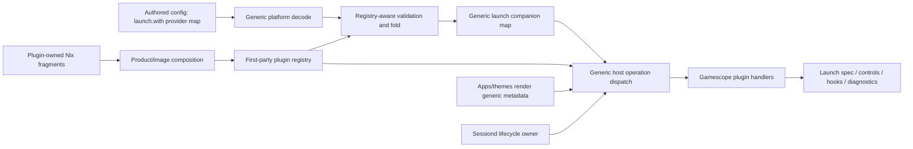

# refactor: Remove Gamescope conceptual coupling from Korri

## Summary

Make Gamescope a plugin-owned implementation detail: generic Korri platform, services, apps, themes, and Nix modules stop naming Gamescope, while explicit product/image composition may opt into the `product/plugins/gamescope/` plugin. This is a single shipping cutover with multiple internal units, strict boundary guardrails, and enabled/disabled verification paths.

---

## Problem Frame

Gamescope implementation now lives mostly under `product/plugins/gamescope/`, but Korri still carries Gamescope-specific types, strings, stream-control actions, sessiond hooks, launch transit fields, and Nix options in generic layers. That means the descriptor exists, but Korri still conceptually knows Gamescope as a built-in integration rather than as a plugin selected by product composition.

---

## Requirements

- R1. Preserve the first-party plugin model from the origin document: TypeScript-authored plugins, stable provider/plugin identity, generic config contributions, operation-scoped handlers, Effect-compatible invocation, simple requirement diagnostics, catalog vocabulary for plugin-facing APIs, and incremental migration posture (origin R1-R16).
- R2. Keep Gamescope implementation, policy schemas, launch wrapping, runtime-control, stream-control handlers, session cleanup/control-bridge behavior, CLI/package code, patches, and plugin-owned Nix artifacts under `product/plugins/gamescope/`.
- R3. In production source, tests, comments, and generic Nix files, allow Gamescope to be named only in `product/plugins/gamescope/` and explicitly allowlisted product/image composition files whose purpose is to register or enable the plugin. Durable docs/work-item prose and config examples may name Gamescope to explain the boundary and authoring model.
- R4. Generic Korri production code and tests/comments under `product/platform/**`, generic `product/services/**`, generic `product/apps/**`, `product/themes/**`, and generic `product/systems/nixos/**` must contain zero hardcoded `gamescope` / `Gamescope` strings after the cutover.
- R5. Preserve authored config shape `launch.with."@korri:gamescope"` as a plugin/provider entry, while platform config decodes `launch.with` as an open provider-keyed map and registry-aware validation/folding handles provider-specific payloads.
- R6. Remove all platform-owned `GamescopePolicy` fields and helpers; transit types carry generic plugin/launch companion maps, not a named `gamescope` field.
- R7. Runtime launch composition must dispatch through plugin handlers rather than importing or calling Gamescope launch-wrapper functions from generic app/service code.
- R8. Missing or disabled plugin references must produce structured, recoverable diagnostics in both launch dry-run and actual launch before process spawn, so UI/agent callers can later offer continue/abort decisions. The UI choice itself is out of scope.
- R9. Stream-control must become generic metadata/action dispatch. Gamescope-specific control definitions, options, readback normalization, action handlers, socket protocol, and labels come from the plugin, not from platform/app/theme source.
- R10. Remove hardcoded Moonlight↔Gamescope knowledge. Moonlight and Gamescope must not import, validate, or special-case each other; composition is authored config's responsibility.
- R11. Remove hardcoded `linked` Moonlight+Gamescope controls from generic platform. Future multi-plugin control coordination is deferred to a generic authored-control design.
- R12. Sessiond remains lifecycle owner, but Gamescope-named sessiond fields/imports are removed. The plugin supplies generic lifecycle/control hooks through product composition.
- R13. Generic Nix modules/images/overlays stop declaring Gamescope-named options, environment variables, package overrides, comments, or tests. Gamescope-specific Nix wiring is plugin-owned and enabled by explicit composition.
- R14. Structurally, Gamescope is opt-in through composition. Most target deployments may opt in, but disabled/absent composition must be verified for low-end devices and future images.
- R15. Update durable architecture/config documentation so future maintainers understand the plugin boundary and config authors understand generic `launch.with` composition.

**Origin actors:** A1 Integration author, A2 Planner/implementer, A3 Image/profile composer, A4 Player/operator.
**Origin flows:** F1 First-party plugin contributes static config, F2 First-party plugin contributes host-invoked behavior, F3 Plugin requirements are validated simply.
**Origin acceptance examples:** AE1-AE5 are preserved through generic config contribution, handler invocation, missing capability diagnostics, Effect normalization, and catalog-first plugin vocabulary.

---

## Scope Boundaries

- This is a single shipping cutover. Internal implementation units may be sequenced, but the branch is not considered shippable until all units and final guardrails pass together.
- Do not implement third-party/user-installed plugins, marketplace behavior, sandboxing, trust tiers, dynamic external plugin discovery, or semver dependency resolution.
- Do not change user-authored Gamescope config away from `launch.with."@korri:gamescope"`.
- Do not add a runtime fallback flag or long-term compatibility path for old Gamescope-specific core fields; rollback is git/NixOS generation rollback.
- Do not preserve stale runtime launch intents or artifacts containing old top-level `gamescope` fields. They may be ignored, deleted, or recreated on restart/session cleanup.
- Do not give the Gamescope plugin session foreground/focus authority. Sessiond/kiosk policy continues to own foreground lifecycle.
- Do not make Moonlight and Gamescope know about each other. Any future cross-plugin diagnostics or coordinated controls must be generic.
- Do not migrate unrelated integrations such as Steam, RetroArch, Moonlight, Ryubing, or themes into plugins except where they must consume the new generic plugin seams.
- Do not add user-facing UI for choosing whether to continue without a missing plugin. This plan only requires backend diagnostic signaling that makes that future UI possible.

### Deferred to Follow-Up Work

- Generic plugin composition diagnostics for cross-plugin launch constraints: captured as backlog item `01KVBNK266WD0D4GX2DSABA9QG`.
- Generic authored coordination for multi-plugin stream controls: captured as backlog item `01KVBPNPXZ3X49XSCFXPY6CVW8`.
- Generated/closed plugin-aware config schemas for `launch.with` once plugin registry/schema generation matures. This plan uses open map decode plus registry-aware validation.
- Third-party plugin loading, package distribution, sandboxing, trust tiers, and marketplace semantics.
- User-facing missing-plugin continue/abort UI.

---

## Context & Research

### Relevant Code and Patterns

- `product/platform/plugin/index.ts` and `product/platform/plugin/registry.ts` already expose the retained descriptor shape: generic config maps and operation handlers.
- `product/plugins/gamescope/src/plugin.ts` already declares handlers for launch composition, stream-control, session cleanup, package/CLI exposure, and diagnostics, but production dispatch is incomplete.
- `product/plugins/gamescope/index.ts` is already minimal and should remain descriptor-only.
- `product/plugins/index.ts` currently acts as TypeScript product composition and must stop unconditionally enabling the Gamescope plugin; explicit runtime composition should opt in.
- `product/platform/library/config/inheritable-fields.ts`, `product/platform/library/config/cascade-resolver.ts`, `product/platform/library/config/resolved-launch-context.ts`, `product/platform/library/library-source.ts`, `product/platform/library/library-services.ts`, `product/platform/library/proseql/library-repository.ts`, `product/platform/library/rocknix/rocknix-source.ts`, and `product/platform/plugin/catalog-library-source.ts` still carry Gamescope-shaped policy/transit/default behavior.
- `product/platform/stream-control/control-contract.ts`, `product/platform/stream-control/stream-control-client.ts`, `product/platform/stream-control/control-surface.ts`, `product/platform/stream-control/state-normalizer.ts`, and `product/platform/stream-control/stream-control-api-routes.ts` still define Gamescope as a built-in stream-control subsystem.
- `product/platform/stream/moonlight-launch-spec.ts` contains hardcoded Moonlight↔Gamescope validation that must be removed rather than migrated into either plugin.
- `product/services/device/sessiond.ts`, `product/services/device/sessiond-source-machine.ts`, `product/services/device/sessiond-role.ts`, `product/services/device/game-stream-runner.ts`, `product/services/device/game-stream-launch-intent.ts`, and `product/services/device/game-stream-fullscreen.ts` still expose Gamescope-specific service hooks, fields, selectors, or launch transit.
- `product/apps/portal/api/library/launch.rpc-handler.ts`, `product/apps/portal/api/stream-control/service.ts`, and portal/CLI/theme stream-control consumers still contain Gamescope-specific API/client/action assumptions.
- `product/systems/nixos/flake/plugins.nix` is the existing Nix-readable plugin composition seam, but generic Nix modules/images/overlays still contain Gamescope-specific options, overlays, package defaults, comments, and environment variables.
- `tools/testing/standards/product-reorg-boundaries.test.ts` already enforces product/platform boundaries and should become the executable zero-coupling tripwire.

### Institutional Learnings

- `docs/solutions/architecture-patterns/korri-plugin-architecture-2026-06-02.md`: plugins contribute data/actions behind host-owned seams; first-party plugin code lives under `product/plugins/*`, while reusable host contracts stay in `product/platform/`.
- `docs/solutions/architecture-patterns/korri-product-platform-theme-architecture-2026-06-03.md`: product/platform/theme dependency direction matters; platform must stay generic and plugin-agnostic.
- `docs/solutions/best-practices/product-owned-composition-keeps-shared-layers-reusable-2026-05-03.md`: concrete integrations belong in product composition or plugin-owned code, not shared layers that appear generic.
- `docs/solutions/architecture-patterns/gamescope-runtime-control-contract-2026-06-02.md`: runtime-control capability semantics distinguish unsupported valid controls from unknown methods; the plugin must preserve that through generic diagnostics.
- `docs/solutions/architecture-patterns/architectural-posture-as-nix-image-default-2026-05-27.md`: module defaults and image/product posture should not be conflated; composition should opt into Gamescope explicitly.
- `docs/solutions/runtime-errors/gamescope-backend-auto-fights-sway-for-drm-master-2026-05-27.md`: plugin-owned defaults must preserve nested kiosk behavior such as explicit Wayland backend defaults.
- `docs/solutions/design-patterns/explicit-cascade-folded-policy-over-incidental-signal-heuristics-2026-05-27.md`: launch behavior must be explicit policy/config, not argv/env sniffing.
- `docs/solutions/architecture-patterns/kiosk-foreground-app-policy-over-gamescope-overlay-2026-05-24.md`: session foreground policy belongs to sessiond/kiosk lifecycle, not Gamescope.

### External References

- External research skipped. This is an internal architecture-boundary refactor with strong repo-local requirements, retained sketches, and institutional architecture docs.

---

## Key Technical Decisions

- **Strict conceptual boundary:** Generic Korri code must not name Gamescope at all. This includes tests/comments in generic platform/services/apps/themes/Nix areas.
- **Allowed naming locations are narrow:** In production source, tests, comments, and generic Nix files, Gamescope may be named under `product/plugins/gamescope/` and explicit product/image composition files that opt into the plugin. Generic consumers receive registry metadata, handlers, lifecycle hooks, and control descriptors. Durable docs/work-item prose and config examples are separately allowed to explain the model.
- **Composition allowlist criteria:** Allowlisted composition files must be plugin-registration or image-selection entrypoints, not reusable platform modules, generic services, app/theme source, or convenience shims. The final allowlist should be snapshotted in the standards test and every entry should have a short reason.
- **Open config decode now:** `launch.with` decodes as an open provider-keyed map. Registry-aware validation/folding handles unknown providers, missing enabled plugins, and plugin-owned payload validation after decode.
- **No sibling-plugin knowledge:** Moonlight and Gamescope do not validate or coordinate each other directly. Author config composes plugins; later generic diagnostics/coordination can improve user guidance.
- **Stream-control is plugin-extended:** Platform owns generic capability/action/readback transport. Plugin metadata supplies Gamescope controls, option values, labels, socket actions, and readback parsing.
- **Sessiond owns lifecycle, plugins contribute hooks:** Sessiond exposes generic lifecycle/control hook points. Product composition wires the Gamescope plugin's hook into those points without adding Gamescope-named sessiond fields.
- **Nix is plugin/composition-owned:** Generic Nix modules do not declare Gamescope APIs or globally replace `pkgs.gamescope`; the plugin owns packages/fragments and product/image composition opts in.
- **Diagnostics in dry-run and launch:** Both launch dry-run and actual launch must surface structured missing-plugin/capability diagnostics before side effects.
- **Big-bang final state:** Multiple internal units are allowed for planning clarity, but the work ships only after the full cutover passes. No long-term old-field compatibility, fallback flag, or deprecated Gamescope-specific API remains.
- **Runtime state can be discarded:** Old launch-intent/runtime artifacts are ephemeral and do not require migration readers.

---

## Open Questions

### Resolved During Planning

- Should stream-control decoupling be included? Yes. A platform stream-control contract that names Gamescope violates the stated goal.
- Should sessiond keep Gamescope-named fields temporarily? No. Remove Gamescope-named sessiond fields in this cutover.
- Should generic Nix modules keep Gamescope-named APIs? No. Generic Nix files also fall under zero hardcoded Gamescope strings.
- Should missing plugin references be ignored and launch unwrapped? No. They produce structured diagnostics, with future UI free to offer continue/abort.
- Should the Moonlight↔Gamescope compatibility check move elsewhere now? No. Remove the hardcoded check and backlog a generic diagnostics system.
- Should hardcoded linked Moonlight+Gamescope controls remain? No. Remove them and backlog generic authored coordination.
- Should `@product/plugins/gamescope` imports be allowed broadly? No. Only narrow composition entrypoints import/register the plugin.
- Should plugin validation happen at startup or action time? Both: startup for composition issues, action time for runtime capabilities/resources.
- Should the migration keep compatibility aliases? No. Final state is a big-bang cutover with git/NixOS rollback only.
- Should stale runtime state be migrated? No. It can be ignored/deleted/recreated.
- Should UI/theme source import Gamescope constants? No. UI renders generic metadata.
- Should disabled/absent Gamescope be verified? Yes. Structural opt-in is only proven with an absent-plugin path.
- Should the older Gamescope-colocation plan remain active? No. It is marked superseded by this plan.

### Deferred to Implementation

- Exact names for generic registry validation diagnostics, lifecycle hook types, and stream-control action DTOs should fit surrounding TypeScript conventions.
- Exact allowlist file set for composition may be determined while editing, but it must satisfy the composition allowlist criteria, remain small, be snapshotted by tests, and be documented in architecture notes.
- Exact cleanup mechanics for stale runtime artifacts may use service restart/session cleanup behavior already present in the repo.
- Exact Nix plugin fragment shape may use the current `plugins.nix` seam or a plugin-owned module fragment, provided generic modules/images/overlays stop naming Gamescope.

---

## High-Level Technical Design

> *This illustrates the intended approach and is directional guidance for review, not implementation specification. The implementing agent should treat it as context, not code to reproduce.*

The platform sees provider-keyed maps, generic operations, capabilities, and diagnostics. The Gamescope plugin owns the meaning of its provider id, policy payload, runtime controls, session cleanup, package exposure, and Nix artifacts. Product/image composition decides whether that plugin is present.

---

## Implementation Units

> **Shipping gate:** These units are internally sequenced but not independently shippable. The branch is shippable only when every unit and the final zero-coupling verification pass succeeds together.

### U1. Establish zero-coupling guardrails and composition allowlist

**Goal:** Add executable standards that define where Gamescope may be named, using a temporary shrinking allowlist only within the branch and a strict final state.

**Requirements:** R2, R3, R4, R13, R14

**Dependencies:** None

**Files:**
- Modify: `tools/testing/standards/product-reorg-boundaries.test.ts`
- Modify: `product/plugins/index.ts`
- Modify: `product/plugins/index.test.ts`
- Modify: `work/items/active/01KVAW869GW82T1WA01GNJHB18-colocate-gamescope-launch-companion-behavior-in-plugin/plan.md`
- Test: `tools/testing/standards/product-reorg-boundaries.test.ts`
- Test: `product/plugins/index.test.ts`

**Approach:**
- Encode the final boundary as a standards test: no hardcoded Gamescope strings in generic platform, generic services, generic apps, themes, or generic Nix files, including tests/comments.
- Define the only allowed source zones: `product/plugins/gamescope/**` and explicit composition files selected during implementation; docs/work-item prose and config examples are documented exemptions, not production-source exemptions.
- Remove unconditional runtime enablement from TypeScript product composition so explicit product/image/runtime composition chooses whether the plugin is present.
- Add import/dependency guardrails in addition to literal scans so generic code cannot depend on plugin implementation modules under generic names.
- Use fake provider ids in generic tests so the guardrail itself does not need to mention the real Gamescope id outside allowed zones.
- Add at least two fake-provider contract tests with different payload/action shapes so generic seams prove provider extensibility rather than renamed Gamescope assumptions.
- Keep any temporary allowlist branch-local and shrink it to the final explicit composition set before shipping.
- Mark the older active Gamescope-colocation plan as superseded so agents do not execute stale guidance.

**Execution note:** Add or tighten guardrails before broad migration so new violations are caught while refactoring.

**Patterns to follow:**
- `tools/testing/standards/product-reorg-boundaries.test.ts`
- `docs/solutions/best-practices/product-owned-composition-keeps-shared-layers-reusable-2026-05-03.md`

**Test scenarios:**
- Happy path: plugin-owned Gamescope files pass the guardrail because they are under the allowed plugin directory.
- Happy path: explicit composition files pass the guardrail because they are allowlisted as plugin-registration or image-selection points with recorded reasons.
- Happy path: TypeScript runtime composition with explicit plugin enablement registers the plugin; composition without that opt-in leaves it absent.
- Error path: a fake generic platform file containing a Gamescope string is detected by the guardrail fixture or standards helper.
- Error path: runtime composition without the plugin makes launch references report missing-plugin diagnostics rather than silently enabling the plugin.
- Error path: a generic app/theme/service/Nix file containing a Gamescope string is detected by the guardrail.
- Edge case: generic tests that need plugin behavior use fake provider ids and still pass the zero-string rule.
- Edge case: two fake providers with different payload/action shapes both pass through the generic seams, proving the platform has not merely renamed Gamescope coupling.

**Verification:**
- The standards test defines the boundary before migration and passes only when all non-allowed Gamescope strings are removed.
- The old active colocation plan clearly points to this fresh plan as superseding it.

### U2. Replace platform Gamescope policy/transit fields with generic provider maps

**Goal:** Remove platform-owned Gamescope policy schema, normalization, cascade folding, resolved-launch fields, and catalog adapter special-cases in favor of generic provider-keyed launch companion maps.

**Requirements:** R1, R5, R6, R8, R14

**Dependencies:** U1

**Files:**
- Modify: `product/platform/library/config/inheritable-fields.ts`
- Modify: `product/platform/library/config/inheritable-fields.test.ts`
- Modify: `product/platform/library/config/cascade-resolver.ts`
- Modify: `product/platform/library/config/resolved-launch-context.ts`
- Modify: `product/platform/library/config/ephemeral-override.ts`
- Modify: `product/platform/library/config/app-choice-selection.ts`
- Modify: `product/platform/library/config/app-integrations.ts`
- Modify: `product/platform/library/config/app-integrations.test.ts`
- Modify: `product/platform/library/config/compose-launch-spec.ts`
- Modify: `product/platform/library/library-source.ts`
- Modify: `product/platform/library/library-services.ts`
- Modify: `product/platform/library/proseql/library-repository.ts`
- Modify: `product/platform/library/rocknix/rocknix-source.ts`
- Modify: `product/platform/plugin/catalog-library-source.ts`
- Modify: `product/platform/plugin/ids.ts`
- Modify: `product/platform/plugin/index.ts`
- Modify: `product/platform/plugin/registry.ts`
- Modify: `product/plugins/gamescope/src/launch-companion/policy.ts`
- Test: `product/platform/library/config/cascade-resolver.test.ts`
- Test: `product/platform/library/config/app-choice-selection.test.ts`
- Test: `product/platform/library/config/ephemeral-override.test.ts`
- Test: `product/platform/library/config/resolved-launch-context.test.ts`
- Test: `product/platform/library/proseql/library-repository.test.ts`
- Test: `product/platform/library/rocknix/rocknix-source.test.ts`
- Test: `product/platform/plugin/catalog-library-source.test.ts`
- Test: `product/platform/plugin/registry.test.ts`
- Test: `product/plugins/gamescope/src/launch-companion/policy.test.ts`

**Approach:**
- Move every guardrail-discovered platform Gamescope policy/transit hit out of platform and into plugin-owned modules; the file list is a starting inventory, not an excuse to leave later scan hits behind.
- Move remaining Gamescope policy ownership out of platform and into the plugin-owned launch companion policy module.
- Change platform-facing resolved launch/config transit shapes from named Gamescope fields to generic provider-keyed companion maps.
- Decode authored `launch.with` as an open provider-keyed map with unknown payloads.
- Define the provider fold contract before moving behavior: layer order, payload input/output shape, default application timing, disable semantics, diagnostic accumulation, serialization expectations, and whether fold handlers are pure/read-only.
- Add registry-aware validation and fold behavior so plugin-owned policy semantics such as defaults, disable semantics, list concatenation, and nested scalar overrides are preserved without platform naming the plugin.
- Define a minimal generic plugin diagnostic shape for validation/action failures so dry-run, launch, stream-control, and lifecycle hooks can report consistent `_tag`/provider/operation/capability/phase/recoverability information without each surface inventing a new shape.
- Replace platform catalog adapter special-cases with generic provider map extraction and fake-provider tests.
- Ensure ROCKnix/default launch behavior comes from plugin/product defaults when the plugin is enabled, not from platform hardcoding.

**Execution note:** Characterize current Gamescope policy behavior in plugin-owned tests before deleting platform copies.

**Patterns to follow:**
- `product/plugins/gamescope/src/launch-companion/policy.ts`
- `product/platform/plugin/registry.ts`
- `docs/solutions/design-patterns/explicit-cascade-folded-policy-over-incidental-signal-heuristics-2026-05-27.md`

**Test scenarios:**
- Happy path: generic platform config accepts multiple provider ids under `launch.with` without knowing their concrete schemas.
- Happy path: a fake plugin-provided fold merges provider policy through the registry and appears in the resolved companion map.
- Happy path: a second fake provider with intentionally different fold semantics also resolves correctly, proving the generic fold contract is not Gamescope-specific.
- Happy path: plugin-owned Gamescope tests prove existing default, disable, scalar override, nested override, and list concatenation semantics remain equivalent.
- Edge case: absent `launch.with` resolves to no companion entries unless product/plugin defaults supply them.
- Error path: unknown provider id in authored config produces a structured registry-aware diagnostic rather than schema decode failure or silent ignore.
- Error path: multiple provider validation failures accumulate without dropping earlier diagnostics.
- Error path: invalid provider payload produces plugin-owned validation diagnostics in dry-run/launch paths.
- Integration: ROCKnix/default launch resolution with plugin enabled receives companion defaults from composition; with plugin absent it does not synthesize a wrapper policy.

**Verification:**
- Generic platform types no longer export or import Gamescope policy names.
- Existing user-authored `launch.with."@korri:gamescope"` behavior is preserved through plugin/composition tests.
- Generic tests use fake provider ids, not the real Gamescope id.

### U3. Dispatch launch composition and missing-plugin diagnostics through plugin operations

**Goal:** Make launch dry-run and actual launch call generic plugin operation dispatch for launch companions and return structured diagnostics when referenced plugins/capabilities are missing.

**Requirements:** R1, R7, R8, R10, R14

**Dependencies:** U1, U2

**Files:**
- Modify: `product/apps/portal/api/library/launch.rpc-handler.ts`
- Modify: `product/apps/portal/api/library/dry-run.rpc.ts`
- Modify: `product/apps/portal/api/library/dry-run.rpc-handler.ts`
- Modify: `product/platform/control/korri-control-live.ts`
- Modify: `product/platform/control/control-results.ts`
- Modify: `product/services/device/game-stream-runner.ts`
- Modify: `product/services/device/game-stream-launch-intent.ts`
- Modify: `product/services/device/game-stream-fullscreen.ts`
- Modify: `product/platform/stream/moonlight-launch-spec.ts`
- Modify: `product/apps/portal/api/stream/compose-moonlight-launch-spec.ts`
- Modify: `product/apps/portal/stream/moonlight-launcher.ts`
- Modify: `product/plugins/gamescope/src/plugin.ts`
- Modify: `product/plugins/gamescope/src/launch-companion/wrapper.ts`
- Test: `product/apps/portal/api/library/launch.rpc-handler.test.ts`
- Test: `product/apps/portal/api/library/dry-run.rpc-handler.test.ts`
- Test: `product/platform/control/korri-control-live.test.ts`
- Test: `product/services/device/game-stream-runner.test.ts`
- Test: `product/services/device/game-stream-launch-intent.test.ts`
- Test: `product/platform/stream/moonlight-launch-spec.test.ts`
- Test: `product/plugins/gamescope/src/plugin.test.ts`
- Test: `product/plugins/gamescope/src/launch-companion/wrapper.test.ts`

**Approach:**
- Replace direct launch-wrapper imports from generic app/service code with registry operation dispatch.
- Introduce a shared launch-companion resolution/composition boundary used by both control dry-run and actual launch before any spawn side effects.
- Split operation phases by side-effect posture: validation/describe/fold/compose are read-only and safe for dry-run; apply/cleanup operations may mutate runtime state and are never called by dry-run.
- Carry generic companion maps in persisted launch intents; discard/ignore old runtime state rather than adding old-field readers.
- Ensure dry-run and actual launch share the same pre-spawn diagnostic path for missing plugin, disabled plugin, invalid payload, or unavailable runtime capability.
- Remove hardcoded Moonlight↔Gamescope validation. Moonlight launch composition remains Moonlight-only; plugin composition is authored config's responsibility.
- Keep plugin-owned wrapper behavior equivalent when the Gamescope plugin is registered and enabled.

**Patterns to follow:**
- `product/platform/plugin/index.ts` `runPluginHandler` behavior
- `product/apps/portal/api/library/launch.rpc-handler.ts` existing dry-run/launch result routing
- `product/plugins/gamescope/src/plugin.ts` operation declarations

**Test scenarios:**
- Happy path: dry-run with an enabled fake launch companion returns a wrapped/composed launch result through handler dispatch.
- Happy path: control-layer dry-run and portal launch dry-run both use the shared composition/diagnostic boundary.
- Happy path: actual launch with an enabled plugin uses the same generic dispatch path before process spawn.
- Happy path: plugin-owned Gamescope launch wrapper tests still produce equivalent command/argument/environment behavior.
- Error path: dry-run with a missing provider id returns a structured missing-plugin diagnostic naming provider/capability/operation and does not attempt process execution.
- Error path: actual launch with a missing provider id returns the same diagnostic before spawn.
- Error path: a recording fake handler proves dry-run invokes only read-only validation/compose phases and never calls runtime mutation hooks.
- Error path: plugin handler failure propagates as a structured launch failure rather than an unhandled exception.
- Edge case: old runtime intents with named wrapper fields are ignored/deleted/recreated rather than read through compatibility code.
- Integration: Moonlight launch spec tests no longer encode sibling-plugin validation; any plugin wrapping is applied by the generic launch companion flow.

**Verification:**
- Production code invokes launch companion operations via the plugin registry, not direct Gamescope imports.
- Dry-run and actual launch have parity for missing-plugin/capability diagnostics.
- No generic stream or launch service file contains Gamescope strings after the cutover.

### U4. Replace stream-control built-ins with generic plugin-provided metadata/actions

**Goal:** Remove Gamescope and hardcoded linked Moonlight+Gamescope controls from platform/app/theme stream-control contracts, while preserving plugin-provided direct Gamescope controls when the plugin is enabled.

**Requirements:** R1, R3, R4, R9, R10, R11, R14

**Dependencies:** U1, U2, U3

**Files:**
- Modify: `product/platform/stream-control/control-contract.ts`
- Modify: `product/platform/stream-control/stream-control-client.ts`
- Modify: `product/platform/stream-control/stream-control-api-routes.ts`
- Modify: `product/platform/stream-control/control-surface.ts`
- Modify: `product/platform/stream-control/state-normalizer.ts`
- Modify: `product/platform/stream-control/runtime-support.ts`
- Modify/delete: `product/apps/portal/api/stream-control/set-gamescope-filter.rpc.ts`
- Modify/delete: `product/apps/portal/api/stream-control/set-gamescope-filter.rpc-handler.ts`
- Modify/delete: `product/apps/portal/api/stream-control/set-gamescope-fps.rpc.ts`
- Modify/delete: `product/apps/portal/api/stream-control/set-gamescope-fps.rpc-handler.ts`
- Modify/delete: `product/apps/portal/api/stream-control/set-gamescope-mode.rpc.ts`
- Modify/delete: `product/apps/portal/api/stream-control/set-gamescope-mode.rpc-handler.ts`
- Modify/delete: `product/apps/portal/api/stream-control/set-gamescope-sharpness.rpc.ts`
- Modify/delete: `product/apps/portal/api/stream-control/set-gamescope-sharpness.rpc-handler.ts`
- Modify/delete: `product/apps/portal/api/stream-control/set-linked-fps.rpc.ts`
- Modify/delete: `product/apps/portal/api/stream-control/set-linked-fps.rpc-handler.ts`
- Modify/delete: `product/apps/portal/api/stream-control/set-linked-resolution.rpc.ts`
- Modify/delete: `product/apps/portal/api/stream-control/set-linked-resolution.rpc-handler.ts`
- Modify: `product/apps/portal/api/stream-control/rpc-schemas.ts`
- Modify: `product/apps/portal/api/server/rpc-group.ts`
- Modify: `product/apps/portal/api/stream-control/service.ts`
- Modify: `product/apps/portal/api/app-rpc-group.ts`
- Modify: `product/apps/portal/features/evier/stream-control-rpc-client.ts`
- Modify: `product/apps/cli/stream-control-bench.ts`
- Modify: `product/themes/evier/pages/EvierStreamControlPage.tsx`
- Modify: `product/themes/evier/pages/EvierStreamControlPage.test.tsx`
- Modify: `product/themes/evier/pages/evier-control-catalog.ts`
- Modify: `product/themes/evier/pages/evier-control-state.ts`
- Modify: `product/themes/evier/entry.tsx`
- Modify: `product/themes/vigie/cockpit/live/VigieLiveCockpitData.ts`
- Modify: `product/themes/vigie/cockpit/live/VigieLiveCockpitData.test.ts`
- Modify: `product/plugins/gamescope/src/stream-control/handlers.ts`
- Modify: `product/plugins/gamescope/src/stream-control/control-surface.ts`
- Modify: `product/plugins/gamescope/src/runtime-control/state-normalizer.ts`
- Test: `product/platform/stream-control/control-contract.test.ts`
- Test: `product/platform/stream-control/stream-control-api-routes.test.ts`
- Test: `product/platform/stream-control/control-surface.test.ts`
- Test: `product/apps/portal/api/stream-control/stream-control.rpc-handler.test.ts`
- Test: `product/apps/cli/stream-control-bench.test.ts`
- Test: `product/plugins/gamescope/src/stream-control/handlers.test.ts`
- Test: `product/plugins/gamescope/src/stream-control/control-surface.test.ts`
- Test: `product/plugins/gamescope/src/runtime-control/state-normalizer.test.ts`

**Approach:**
- Replace every guardrail-discovered stream-control caller of named Gamescope/linked actions with generic metadata/action dispatch; the file list is a starting inventory and must be reconciled with the standards scan.
- Replace named control methods, RPC tags, route assumptions, and schema variants with a generic stream-control command contract such as action-id/provider-plus-payload dispatch and metadata-driven rendering.
- Move Gamescope control definitions, option tables, payload validation, readback normalization, and socket/client behavior fully into plugin-owned modules.
- Remove hardcoded linked Moonlight+Gamescope controls from platform. Do not replace them with a new coordination system in this plan.
- Make UI/theme code render control metadata returned by the server/plugin registry rather than importing plugin constants.
- Ensure enabled plugin composition supplies the same direct Gamescope controls as metadata/actions, while absent plugin composition omits them cleanly.

**Patterns to follow:**
- `product/plugins/gamescope/src/stream-control/handlers.ts`
- `product/plugins/gamescope/src/runtime-control/`
- Existing generic Hono route parsing/error response patterns in `product/platform/stream-control/stream-control-api-routes.ts`

**Test scenarios:**
- Happy path: a fake stream-control plugin contributes controls and generic platform capabilities expose them without knowing the provider name.
- Happy path: Gamescope plugin composition exposes direct mode/FPS/filter/sharpness controls as plugin metadata/actions.
- Happy path: UI-facing capability payload contains labels/options/action ids from metadata and can be rendered without hardcoded plugin imports.
- Error path: unknown generic control action returns a structured unsupported-action response.
- Error path: valid plugin action with unavailable runtime capability returns unsupported/unavailable diagnostics instead of a connector exception.
- Edge case: plugin absent composition omits the controls and keeps generic stream-control state/config endpoints healthy.
- Edge case: hardcoded linked controls are absent; tests assert no platform-provided Moonlight+Gamescope pairing remains.
- Integration: portal service and CLI bench use generic dispatch for all controls they expose.

**Verification:**
- No generic stream-control/app/theme file contains Gamescope strings.
- Direct Gamescope controls still work through plugin-owned tests and composition integration tests.
- Linked controls are removed and the follow-up backlog item covers future generic coordination.

### U5. Replace Gamescope-named sessiond/service lifecycle hooks with generic plugin hooks

**Goal:** Keep sessiond as lifecycle owner while removing Gamescope-named service fields, selectors, reapers, and control-bridge imports from generic services.

**Requirements:** R3, R4, R8, R12, R14

**Dependencies:** U1, U2, U3

**Files:**
- Modify: `product/services/device/sessiond.ts`
- Modify: `product/services/device/sessiond-source-machine.ts`
- Modify: `product/services/device/sessiond-role.ts`
- Modify: `product/services/device/game-stream-fullscreen.ts`
- Modify: `product/plugins/gamescope/src/session/index.ts`
- Modify: `product/plugins/gamescope/src/session/reaper.ts`
- Modify: `product/plugins/gamescope/src/runtime-control/bridge.ts`
- Modify: explicit product composition files that construct sessiond or device services
- Test: `product/services/device/sessiond.test.ts`
- Test: `product/services/device/sessiond-source-machine.test.ts`
- Test: `product/services/device/sessiond-role.test.ts`
- Test: `product/plugins/gamescope/src/session/reaper.test.ts`

**Approach:**
- Define generic session lifecycle/control hook concepts in service code without plugin-specific names. The hook contract must cover phases such as launch applicability, after-child-running startup, handle storage, stop-before-cleanup ordering, restore cleanup, failure policy, and diagnostics.
- Wire the Gamescope plugin's cleanup/control-bridge behavior through explicit composition, not direct service imports.
- Replace named restore evidence with generic plugin/session residual evidence or hook-reported cleanup results.
- Move process/window selector knowledge into plugin-owned session modules.
- Preserve sessiond authority over foreground lifecycle, restoration, cancellation, and cleanup ordering.

**Patterns to follow:**
- `docs/solutions/architecture-patterns/kiosk-foreground-app-policy-over-gamescope-overlay-2026-05-24.md`
- Existing sessiond lifecycle tests in `product/services/device/sessiond.test.ts`
- `product/plugins/gamescope/src/session/reaper.ts`

**Test scenarios:**
- Happy path: sessiond invokes a generic lifecycle hook during cleanup/restore and records hook result without knowing provider-specific details.
- Happy path: sessiond starts an applicable generic control/lifecycle hook after the child is running and stores a generic handle for later stop/cleanup.
- Happy path: Gamescope plugin-owned session tests still reap the expected plugin-owned process/window selectors.
- Error path: launch-time hook startup failure follows the existing fail-before-foreground policy for required hooks and terminates any spawned child safely.
- Error path: cleanup hook failure is reported as structured cleanup diagnostics and does not transfer foreground authority to the plugin.
- Edge case: no hooks registered keeps sessiond lifecycle healthy.
- Edge case: startup/session cleanup can remove plugin-owned residual processes/windows without reading old named launch-intent fields.
- Edge case: cancellation/restore paths call generic cleanup hooks at most once and still restore home/session state.
- Integration: product composition can register the Gamescope session hook, while generic services do not import the plugin.

**Verification:**
- Generic service source/tests contain no Gamescope strings.
- Session foreground lifecycle behavior remains owned by sessiond.
- Plugin-owned cleanup/control behavior remains covered in plugin tests and composition integration tests.

### U6. Move Nix package, module, env, and overlay knowledge to plugin/composition

**Goal:** Remove Gamescope-named options, environment variables, global overlays, package defaults, comments, and tests from generic Nix modules/images/overlays while preserving enabled and disabled product composition paths.

**Requirements:** R2, R3, R4, R13, R14

**Dependencies:** U1, U3, U5

**Files:**
- Modify: `product/systems/nixos/flake/plugins.nix`
- Modify: `product/systems/nixos/flake/default.nix`
- Modify: `product/systems/nixos/flake/packages.nix`
- Modify: `product/systems/nixos/flake/apps.nix`
- Modify: `product/systems/nixos/flake/modules.nix`
- Modify: `product/systems/nixos/flake/overlays.nix`
- Modify: `product/systems/nixos/modules/korri-game-stream.nix`
- Modify: `product/systems/nixos/modules/korri-compositor.nix`
- Modify: `product/systems/nixos/modules/korri-steam.nix`
- Modify: `product/systems/nixos/modules/korri-daemon.nix`
- Modify: `product/systems/nixos/images/kiosk.nix`
- Modify: `product/systems/nixos/images/common.nix`
- Modify: `product/systems/nixos/images/desktop-lab.nix`
- Modify: `product/systems/nixos/images/source-machine.nix`
- Modify: `product/systems/nixos/images/platforms/rocknix-sm8550.nix`
- Modify: `product/systems/nixos/images/platforms/rocknix-rk3566.nix`
- Modify: `product/systems/nixos/images/platforms/x86.nix`
- Modify: `product/systems/nixos/overlays/korri-packages.nix`
- Modify: `product/systems/nixos/overlays/korri-x86-compositor.nix`
- Modify: `product/systems/nixos/overlays/korri-x86-compositor-overlay.nix`
- Modify: `product/systems/nixos/modules/korri-nixpkgs-overlay.nix`
- Modify: `product/systems/nixos/modules/korri-removable-media.nix`
- Modify: `product/plugins/gamescope/flake.nix`
- Modify: `product/plugins/gamescope/packages/gamescope-korri/default.nix`
- Modify: `product/plugins/gamescope/packages/control-bridge/default.nix`
- Test: `product/systems/nixos/flake/plugins.test.ts`
- Test: Nix evaluation tests for enabled and disabled plugin composition

**Approach:**
- Remove every guardrail-discovered generic Nix Gamescope hit; the file list is a starting inventory and must be reconciled with the final standards scan.
- Remove global package replacement and generic module options that name Gamescope.
- Move plugin-specific package exposure, control-bridge exposure, environment fragments, and image defaults into plugin-owned Nix files or explicit product/image composition.
- Keep structural opt-in: target images may enable Gamescope through composition, but generic modules remain unaware and disabled composition evaluates.
- Ensure plugin-owned Nix packages do not depend on generic files hardcoding plugin names.
- Update Nix tests so enabled composition exposes plugin packages/apps and disabled composition does not.

**Patterns to follow:**
- `product/systems/nixos/flake/plugins.nix`
- `product/plugins/gamescope/packages/`
- `docs/solutions/architecture-patterns/architectural-posture-as-nix-image-default-2026-05-27.md`

**Test scenarios:**
- Happy path: enabled product/image composition exposes the plugin-owned packages/apps and runtime environment required by the Gamescope plugin.
- Happy path: disabled product/image composition evaluates without exposing plugin packages/apps or requiring plugin-owned packages.
- Error path: disabled composition does not reference a plugin-provided runtime command from generic modules; any missing runtime command failure is reported by existing generic composition/eval checks rather than by a new plugin-specific Nix diagnostic system.
- Edge case: low-end/disabled image composition has no hidden package dependency on the plugin.
- Integration: root flake package/app exposure is driven by plugin composition and omits plugin outputs when disabled.

**Verification:**
- Generic Nix files contain no Gamescope strings, including comments/tests.
- Plugin-owned Nix files and explicit composition files are the only Nix locations that name the plugin.
- Enabled and disabled Nix eval paths both pass.

### U7. Update documentation and config examples for plugin-owned composition

**Goal:** Make the new boundary durable for maintainers and understandable for config authors/operators.

**Requirements:** R5, R8, R10, R11, R13, R15

**Dependencies:** U1-U6

**Files:**
- Create: `docs/solutions/architecture-patterns/gamescope-as-plugin-owned-composition-2026-06-17.md`
- Modify: relevant readable config examples that show `launch.with` plugin entries
- Modify: `work/items/active/01KVBQ8J0F3E2B6Z9N2X4M5A7C-gamescope-plugin-decoupling/work.md`
- Test: documentation/example tests if the touched examples already have tests

**Approach:**
- Document the final rule: platform/services/apps/themes/generic Nix do not name Gamescope; plugin and explicit composition files do.
- Document structural opt-in: target products/images may enable Gamescope by default through composition, while disabled composition must remain valid.
- Document config author responsibility for composing plugins through `launch.with` entries, without presenting Gamescope as a core field or Moonlight feature.
- Reference follow-up backlog items for generic cross-plugin diagnostics and coordinated controls.
- Keep examples focused on authored config shape and plugin composition, not implementation internals.

**Patterns to follow:**
- `docs/solutions/architecture-patterns/korri-plugin-architecture-2026-06-02.md`
- `docs/solutions/architecture-patterns/korri-product-platform-theme-architecture-2026-06-03.md`
- Existing readable config examples and example tests

**Test scenarios:**
- Happy path: config examples using `launch.with` still parse through example tests.
- Error path: examples do not use retired top-level wrapper fields.
- Documentation expectation: no executable behavior beyond example validation.

**Verification:**
- Architecture note captures the boundary, allowlist rule, opt-in posture, and deferred follow-ups.
- Config examples teach plugin composition rather than built-in Gamescope behavior.

### U8. Final single-gate verification and cleanup

**Goal:** Prove the full cutover is complete and remove any temporary allowlists, stale compatibility paths, and hidden coupling.

**Requirements:** R1-R15

**Dependencies:** U1-U7

**Files:**
- Modify: `tools/testing/standards/product-reorg-boundaries.test.ts`
- Modify: any temporary allowlist/composition test files created during U1-U7
- Test: all tests touched by U1-U7

**Approach:**
- Collapse any temporary allowlist to the final explicit composition set.
- Run final source scans through the standards test rather than manual grep only.
- Verify enabled plugin composition preserves current behavior and disabled composition degrades generically.
- Ensure no old fallback flags, compatibility readers, named stream-control actions, named sessiond fields, global overlays, or deprecated Nix options remain.

**Patterns to follow:**
- `tools/testing/standards/product-reorg-boundaries.test.ts`
- Final verification matrix in this plan

**Test scenarios:**
- Happy path: full enabled composition passes plugin-specific Gamescope behavior tests from the plugin/composition allowlist.
- Happy path: full disabled composition passes generic startup/eval/control/catalog checks without plugin outputs.
- Error path: launch dry-run and launch with missing plugin reference both return structured diagnostics.
- Error path: any hardcoded Gamescope string in forbidden generic areas fails the standards test.
- Integration: portal launch, stream-control capabilities, session cleanup, and Nix eval pass through generic seams.

**Verification:**
- All guardrails pass with no temporary allowlists beyond explicit composition files.
- Enabled and disabled composition checks pass.
- The branch has no final compatibility leftovers for old Gamescope-specific core paths.

---

## Final Verification Matrix

- **Generic source guardrail:** `tools/testing/standards/product-reorg-boundaries.test.ts` proves forbidden source/test/comment/Nix areas have zero hardcoded Gamescope strings and no plugin implementation imports outside the composition allowlist.
- **Generic TypeScript behavior:** targeted Bun tests cover plugin registry validation/folding, explicit runtime plugin composition, generic launch companion maps, dry-run/launch parity, stream-control generic action dispatch, sessiond generic hooks, and app/theme metadata rendering.
- **Plugin-specific behavior:** tests under `product/plugins/gamescope/` and explicit composition tests prove existing Gamescope policy, launch wrapping, runtime-control, stream-control, session cleanup, package exposure, and diagnostics remain equivalent when enabled.
- **Enabled composition:** Nix/plugin composition tests prove the default target composition exposes the plugin-owned packages/apps/env fragments required by enabled deployments.
- **Disabled composition:** TypeScript and Nix/plugin composition tests prove an explicit no-plugin/disabled composition evaluates/starts without plugin packages/apps/env fragments, does not auto-register the plugin, and keeps generic services healthy.
- **Public contract migration:** portal RPC group, stream-control service/client, CLI bench, and theme tests prove old named Gamescope/linked actions are gone and generic metadata/action dispatch is used instead.

---

## System-Wide Impact

- **Interaction graph:** Config decode, plugin registry, launch dry-run/launch, stream-control API/UI, sessiond lifecycle hooks, and Nix composition all shift from hardcoded Gamescope paths to generic provider/handler metadata.
- **Error propagation:** Missing plugin/capability/operation failures become structured diagnostics returned by dry-run and launch before side effects. Stream-control unavailable/unsupported states are returned through generic control metadata/action responses.
- **State lifecycle risks:** Old runtime launch intents are not migrated. Services should clear/recreate ephemeral runtime state on restart/session cleanup so stale named fields do not survive.
- **API surface parity:** Stream-control API/client actions change from named Gamescope methods/routes to generic subsystem/action dispatch. Portal, CLI, and themes must move together in the same shipping gate.
- **Integration coverage:** Unit tests alone are insufficient. Composition tests must prove real Gamescope enabled behavior and absent-plugin behavior, while generic tests use fake providers.
- **Unchanged invariants:** Authored config still uses `launch.with."@korri:gamescope"` when the Gamescope plugin is desired. Sessiond remains lifecycle/foreground authority. Gamescope plugin-owned defaults preserve current wrapper/runtime behavior when enabled.

---

## Risks & Dependencies

| Risk | Mitigation |
|------|------------|
| The strict zero-string rule creates a large, disruptive diff | Treat the branch as one shipping gate, add guardrails first, and use fake provider ids in generic tests. |
| Removing hardcoded Moonlight↔Gamescope validation hides a useful user warning | Backlog generic plugin composition diagnostics and document config-author responsibility. |
| Removing linked controls regresses current stream-control UX | Backlog generic authored multi-plugin coordination and preserve direct plugin-provided controls. |
| Disabled composition is rarely used and may rot | Require enabled and disabled verification paths in the plan and standards tests. |
| Nix package overlay removal breaks device assumptions | Move required packages/env into explicit plugin/image composition and verify enabled target composition. |
| Big-bang cutover is hard to review | Keep multiple internal units and a final verification matrix, but do not mark any subset shippable. |
| Future maintainers reintroduce platform Gamescope helpers | Add strict guardrails and durable architecture documentation. |

---

## Documentation / Operational Notes

- Update architecture docs under `docs/solutions/architecture-patterns/` with the plugin-owned Gamescope boundary and allowed composition locations.
- Update config examples so operators see `launch.with` as generic plugin composition, not a core Gamescope field.
- Operational rollback is git/NixOS generation rollback only; no runtime fallback flag is planned.
- Bandai/kiosk-like targets may continue enabling Gamescope through explicit composition, while low-end devices can omit it structurally.

---

## Success Metrics

- Generic platform/services/apps/themes/Nix source and tests/comments contain zero hardcoded Gamescope strings outside the explicit allowlist.
- Real Gamescope behavior is still covered under `product/plugins/gamescope/` and composition tests.
- A no-Gamescope TypeScript and Nix composition evaluates/starts without auto-registering the plugin, and generic services remain healthy.
- Launch dry-run and launch both return structured diagnostics for missing plugin references.
- Stream-control UI/API renders plugin-provided metadata without hardcoded Gamescope actions or imports.

---

## Sources & References

- **Origin document:** [work/items/active/01KV8NZRAAETDX69P5T73BRVY8-first-party-plugin-system-shape/requirements.md](work/items/active/01KV8NZRAAETDX69P5T73BRVY8-first-party-plugin-system-shape/requirements.md)
- Superseded plan: [work/items/active/01KVAW869GW82T1WA01GNJHB18-colocate-gamescope-launch-companion-behavior-in-plugin/plan.md](work/items/active/01KVAW869GW82T1WA01GNJHB18-colocate-gamescope-launch-companion-behavior-in-plugin/plan.md)
- Completed precursor: [work/items/active/01KVBE3W1NTB209YDWBPGC0DBV-plugin-descriptor-sketch-alignment/plan.md](work/items/active/01KVBE3W1NTB209YDWBPGC0DBV-plugin-descriptor-sketch-alignment/plan.md)
- Related code: [product/platform/plugin/index.ts](product/platform/plugin/index.ts)
- Related code: [product/platform/plugin/registry.ts](product/platform/plugin/registry.ts)
- Related code: [product/plugins/gamescope/src/plugin.ts](product/plugins/gamescope/src/plugin.ts)
- Related code: [product/plugins/gamescope/src/launch-companion/policy.ts](product/plugins/gamescope/src/launch-companion/policy.ts)
- Related code: [tools/testing/standards/product-reorg-boundaries.test.ts](tools/testing/standards/product-reorg-boundaries.test.ts)
- Institutional learning: [docs/solutions/architecture-patterns/korri-plugin-architecture-2026-06-02.md](docs/solutions/architecture-patterns/korri-plugin-architecture-2026-06-02.md)
- Institutional learning: [docs/solutions/architecture-patterns/korri-product-platform-theme-architecture-2026-06-03.md](docs/solutions/architecture-patterns/korri-product-platform-theme-architecture-2026-06-03.md)
- Institutional learning: [docs/solutions/best-practices/product-owned-composition-keeps-shared-layers-reusable-2026-05-03.md](docs/solutions/best-practices/product-owned-composition-keeps-shared-layers-reusable-2026-05-03.md)
- Follow-up backlog: `01KVBNK266WD0D4GX2DSABA9QG` generic plugin composition diagnostics
- Follow-up backlog: `01KVBPNPXZ3X49XSCFXPY6CVW8` generic authored multi-plugin stream-control coordination
