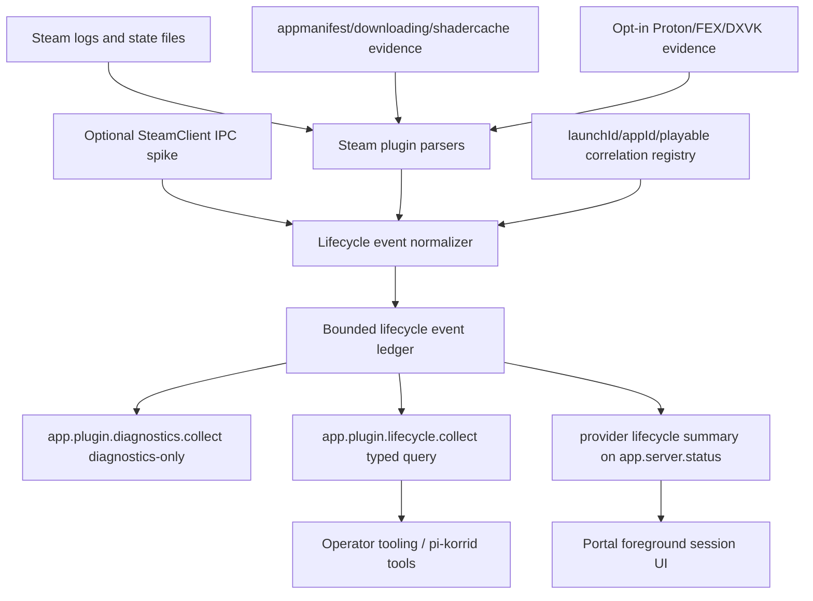
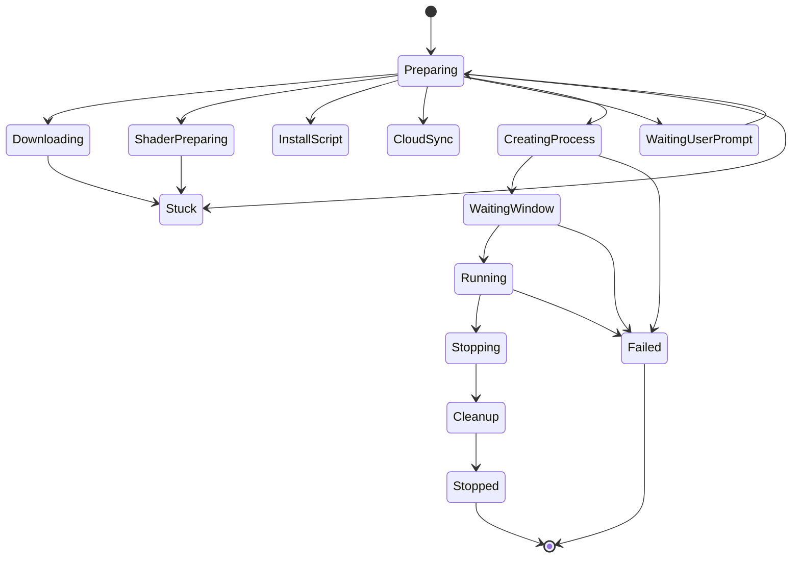
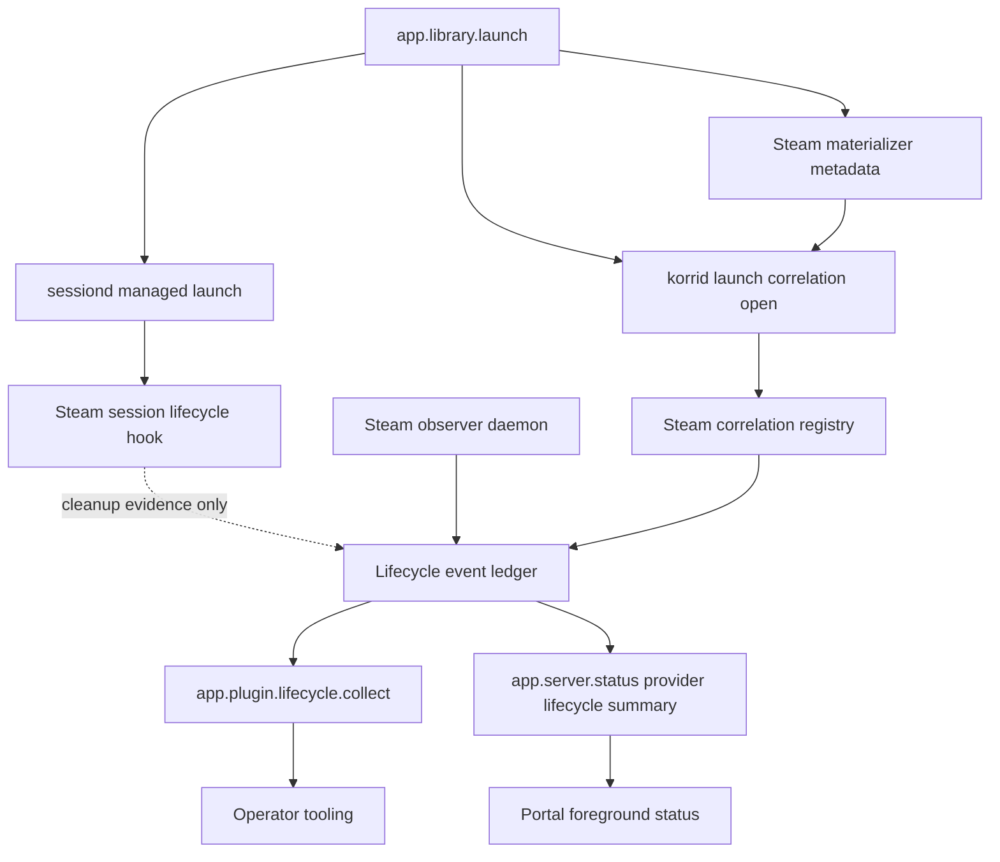

# feat: Expose full Steam launch lifecycle observability

## Summary

Expose Steam lifecycle state as a plugin-owned, bounded event timeline that can be queried by Portal and operator tooling. The first implementation extends the existing Steam log observer, correlates Steam AppIDs with Korri launch/session identity, adds a minimal status summary to the existing Portal polling path, and keeps higher-risk SteamClient IPC and deep Proton/FEX log capture as additive enrichment layers rather than blockers.

---

## Problem Frame

The 30XX launch showed that Steam already emits rich launch progress — shader checks, install scripts, cloud sync, prompts, process creation, Proton/FEX execution, game process lifetime, and exit — but Korri mostly exposes only coarse accepted/failed/sessiond status. Operators need structured, timely, evidence-backed lifecycle signal so Portal can explain waits and failures without requiring manual log tailing.

---

## Assumptions

*This plan was authored from the user's request, backlog items, repo research, and external research without a separate synchronous scope confirmation. The items below are agent inferences that should be reviewed before implementation proceeds.*

- The first shippable slice should prioritize the existing plugin log observer and typed lifecycle query API over a new long-lived SSE stream; Portal can react through its established 1 Hz status polling path while tooling can query bounded event history. The core slice is U1, U2, U4, U5, U6, and U9; U3 is conditional fallback; U7, U8, and U10 are non-blocking enrichment/spike work.
- SteamClient IPC is valuable enough to spike, but it should be an additive high-fidelity source that feeds the same lifecycle event contract rather than replacing log/appmanifest/process observation.
- Proton/FEX/DXVK/VKD3D log capture should start as opt-in diagnostic enrichment with explicit artifact paths and redaction, not always-on verbose logging.
- Sessiond remains the foreground-session authority; Steam observability annotates session lifecycle but does not move Steam-specific parsing into sessiond.

---

## Requirements

- R1. Steam plugin must emit structured lifecycle events for app update/download, shader preparation, install scripts, cloud sync, prompts/interstitials, process creation, tracked process add/update/remove, runtime setup evidence, game running/window readiness, exit, crash/failure suspicion, and cleanup.
- R2. Each event must include appId, launchId and playable id when known, phase/status, timestamp, sequence, confidence, severity when applicable, source evidence, sanitized raw excerpt, and actionable hint when available.
- R3. The observer must preserve raw Steam-specific facts such as task names, AppID state strings, action ids, tracked PIDs, and exit codes while projecting them into a stable Steam-owned lifecycle vocabulary for Korri consumers. Generic surfaces may carry provider-neutral summaries and opaque provider phase strings, but cross-provider lifecycle vocabulary is outside this plan.
- R4. Portal and tooling must be able to consume lifecycle state through read-only APIs without importing Steam plugin internals or parsing raw logs themselves.
- R5. Portal must show current Steam launch/download/shader/prompt/runtime status in the foreground-session UI instead of only accepted/failed/coarse sessiond mode.
- R6. Launch/session correlation must link Steam AppID observations to Korri launchId/session metadata when Korri initiated the launch, while still reporting steam-only observations for out-of-band Steam activity.
- R7. The implementation must remain plugin-owned and preserve first-party plugin boundaries: generic platform/API/UI code can consume generic summaries or plugin-dispatched responses, but cannot import Steam parser/reducer internals.
- R8. Evidence collection must be bounded, sanitized, and hot-path safe under high-volume Steam logs.
- R9. Tests must cover representative 30XX/Bandai-style Steam log lines and edge cases: shader progress, user prompts, downloads, rapid relaunch, non-zero exits, stale lines, degraded observer health, and API/UI projection.
- R10. The plan must leave a clear additive path for higher-fidelity SteamClient IPC signals and deeper Proton/FEX runtime diagnostics.

---

## Scope Boundaries

- Do not build a third-party/user-installed plugin system or Steam plugin marketplace.
- Do not move Steam-specific parsing, lifecycle phases, or log knowledge into sessiond or generic platform code.
- Do not replace sessiond as the source of foreground-session truth; Steam lifecycle state is an annotation/enrichment layer.
- Do not change Steam launch semantics, Steam LaunchOptions policy, Gamescope composition, or Proton/FEX compatibility mapping except where needed to attach safe observability metadata/artifacts.
- Do not make always-on verbose Proton/Wine/FEX logging the default; high-volume runtime logs must be opt-in or bounded.
- Do not require SteamClient IPC availability for the first shippable lifecycle surface.
- Do not solve unrelated Bandai display/sessiond environment issues in this plan.

### Deferred to Follow-Up Work

- Full long-lived SSE/WebSocket lifecycle stream if query/replay plus Portal polling proves too coarse. If implemented later, it must include heartbeats, explicit Bun idle-timeout handling, and bounded reconnect behavior.
- Productionizing a SteamClient IPC bridge after the spike proves reachability, stability, and security tradeoffs on Bandai.
- Rich MangoHud/Gamescope frame telemetry and screenshot-based visual validation; these are useful runtime proofs but not required for Steam's own lifecycle state.
- Cross-provider generic lifecycle UI for RetroArch, PortMaster, itch.io, and other providers; this plan shapes generic seams but validates them through Steam first.

---

## Context & Research

### Relevant Code and Patterns

- `product/plugins/steam/src/observability/log-signals.ts` already parses Steam `content_log`, `gameprocess_log`, `console_log`, and `shader_log` into `SteamLogSignal` evidence.
- `product/plugins/steam/src/observability/launch-state.ts` already reduces signals into `active`/`latest` snapshots with bounded evidence and stuck projection.
- `product/plugins/steam/src/observability/log-observer.ts` is the daemon insertion point: it tails logs, parses lines, reduces state, and installs a singleton reader for diagnostics.
- `product/plugins/steam/src/observability/diagnostics.ts` is the current plugin-owned wire projection returned by generic `app.plugin.diagnostics.collect`.
- `product/plugins/steam/src/session/lifecycle-hook.ts` already extracts Steam cleanup metadata from launch metadata and keeps an internal `launchId -> appId` map for cleanup.
- `product/plugins/steam/src/materializer.ts` already attaches Steam launch metadata and returns `LaunchArtifacts` for Steam state paths.
- `product/apps/portal/api/plugin-diagnostics/collect.rpc.ts` and `collect.rpc-handler.ts` show the generic plugin-dispatch pattern to reuse for lifecycle APIs.
- `product/apps/portal/api/server/status.rpc.ts` and `status.rpc-handler.ts` are the established 1 Hz Portal status path; schema additions must be optional before handlers emit them.
- `product/apps/portal/features/home/foreground-session-status-layer-live.ts` maps `app.server.status` into renderer foreground-session gate state without direct sessiond access.
- `docs/research/steam-observability/bandai-2026-06-14/parser-fixtures/` contains sanitized Steam log fixtures for regression tests.
- `product/plugins/steam/src/boundary.test.ts` protects the Steam plugin boundary and should be extended if new generic surfaces risk importing plugin internals.

### Institutional Learnings

- `docs/handoffs/steam-observability-implementation-handoff-2026-06-14.md`: Bandai evidence validates `content_log` for running/stopped, `gameprocess_log` for PID lifetime, `console_log` for launch task progress, and `shader_log` as supporting evidence. It also warns against treating every `-1` child exit as a failure.
- `docs/solutions/runtime-errors/sessiond-sse-stream-killed-by-bun-idle-timeout-2026-05-27.md`: observability transport lifetime must not be confused with launch lifetime; long-lived streams need heartbeats, idle-timeout handling, and reconnect semantics.
- `docs/solutions/architecture-patterns/physical-host-foreground-lifecycle-truth-is-sessiond-2026-05-29.md`: Portal status should come through `app.server.status` polling; sessiond remains the lifecycle authority and renderer should not talk to sessiond directly.
- `docs/solutions/architecture-patterns/sessiond-operator-model-2026-05-29.md`: `launchId` is the correlation anchor for managed launches; Steam events should annotate the session window rather than replacing sessiond events.
- `docs/solutions/architecture-patterns/gamescope-as-plugin-owned-composition-2026-06-17.md`: plugin-owned diagnostics stay inside the plugin; generic code owns dispatch/envelopes, not provider-specific logic.
- `docs/solutions/architecture-patterns/steam-applaunch-with-silent-steam-and-per-app-launchoptions-gamescope-wrap-aka-x86-2026-05-27.md`: warm Bandai launches can take around 9 seconds to window readiness, so stuck detection needs generous thresholds and source-aware progress.

### External References

- Steam Linux client log research identified `content_log.txt`, `shader_log.txt`, `bootstrap_log.txt`, `console_log.txt`, `appinfo_log.txt`, `workshop_log.txt`, `cloud_log.txt`, `compat_log.txt`, `libraryfolders.vdf`, `appmanifest_<appid>.acf`, `steamapps/downloading/<appid>/`, and `steamapps/shadercache/<appid>/` as practical local capture surfaces.
- Proton/runtime research identified `PROTON_LOG`, `PROTON_LOG_DIR`, Steam Linux Runtime/pressure-vessel verbosity flags, DXVK/VKD3D log paths, Vulkan loader diagnostics, Gamescope `--ready-fd`, MangoHud logs, and FEX logging as enrichment sources with opt-in/default-off caveats.
- SteamOS/Decky prior art identified `SteamClient.Apps.RegisterForGameActionTaskChange`, `GameAction`, `LaunchAppTask_t`, `EDisplayStatus`, `EAppUpdateError`, `GameSessions.RegisterForAppLifetimeNotifications`, and focus-change events as the highest-fidelity signal source if a safe bridge is possible.

---

## Key Technical Decisions

- **Define a public Steam lifecycle event contract above raw parser signals:** `SteamLogSignal` remains an internal parser vocabulary; Portal/tooling consumes a stable lifecycle event/snapshot projection with Steam facets preserved for evidence.
- **Ship query/replay before long-lived streaming:** The first API should expose current summary plus bounded recent events by provider/launch/app because it fits existing RPC patterns and avoids SSE lifecycle pitfalls. A future stream can replay the same event ledger.
- **Add a minimal provider lifecycle summary to `app.server.status`:** Portal already polls this path, so a compact optional provider-neutral summary gives immediate UI reactivity without forcing every renderer consumer to call plugin diagnostics. The summary may carry providerId and opaque provider phase text, but generic server status schemas should not enumerate Steam phase literals. Full evidence remains behind plugin diagnostics or a dedicated lifecycle query only when the dedicated operation is justified by current consumers.
- **Use a typed lifecycle query API for stable consumers:** `app.plugin.diagnostics.collect` can continue carrying opaque full diagnostics, but the stable lifecycle query/replay contract should be Schema-backed via `app.plugin.lifecycle.collect`. The dispatch envelope is generic; the detailed lifecycle vocabulary and evidence projection remain Steam-owned.
- **Use caller-generated launchId as the correlation bridge inside korrid:** The observer daemon and launch RPC path share the korrid process, but sessiond does not. Generate/thread a launchId in the korrid launch path before calling sessiond, pass that launchId to sessiond's managed-launch request, and open Steam correlation with the same id before or alongside the request. Use sessiond status/events only as corroborating lifecycle evidence, not as an in-memory notification path from sessiond back to korrid.
- **Treat progress as source-aware, not just status-aware:** Shader evidence, active AppID appmanifest download progress, and prompt activity should advance or annotate progress without falsely marking running/stopped. Implement appmanifest/filesystem evidence only when U1-U2 fixture coverage proves existing logs cannot supply a required V1 signal.
- **Classify failures conservatively:** Non-zero or `-1` child exits are evidence, not automatically user-facing failure. Promote to `Failed` only when root/wrapper/process-window evidence supports it, and preserve raw removed PID evidence for diagnostics.
- **Bound the event ledger explicitly:** Lifecycle event sequence is ledger-owned, monotonic within the korrid process, and distinct from source evidence sequence. Keep a fixed per-AppID ring (initial target: 200 lifecycle events per active/recent AppID, with a small completed-AppID TTL) and answer replay queries from that ring without sorting or reparsing at query time.
- **Make SteamClient IPC additive:** If reachable, SteamClient IPC should feed the same event contract as a higher-confidence source, with logs/appmanifests as fallback and audit evidence.

---

## Open Questions

### Resolved During Planning

- **Should Portal use push streaming for v1?** Resolve as no for the first slice. Use `app.server.status` optional summary plus lifecycle query/replay. Defer SSE/WebSocket until proven necessary because existing learning shows long-lived observability streams require careful transport handling.
- **Should SteamClient IPC block the lifecycle feature?** Resolve as no. It is planned as a spike/enrichment unit after the log/query contract exists.
- **Should Proton/FEX verbose logs be always on?** Resolve as no. Runtime diagnostic logs are opt-in and bounded because Proton/Wine/FEX verbosity can be high-volume and potentially sensitive.
- **Where does provider-specific logic live?** Resolve as Steam plugin-owned. Generic API/UI seams use summaries and plugin dispatch; they do not parse Steam logs or import Steam plugin internals.

### Deferred to Implementation

- **Exact root PID identification for failure promotion:** Implementation should characterize current tracked PID ordering and wrapper evidence before finalizing the `Failed` promotion helper; tests must lock the selected rule.
- **Exact appmanifest `StateFlags` mapping:** StateFlags are not a stable public Valve contract; implementation should parse known fields defensively and preserve raw state evidence.
- **SteamClient bridge reachability:** The bridge spike must verify whether Bandai's Steam CEF/webhelper context exposes the needed `SteamClient` hooks before any production unit depends on it.
- **Final Portal visual placement:** Implementation can choose the smallest existing foreground-session surface that can show lifecycle messages without disturbing unrelated Pico prototype work.

---

## Output Structure

```text
product/plugins/steam/src/observability/
  lifecycle-events.ts              # new public lifecycle event/snapshot projection
  lifecycle-events.test.ts          # new event contract/projection tests
  correlation.ts                    # new launchId/appId correlation seam
  appmanifest-watcher.ts            # new optional manifest/download evidence source
  appmanifest-watcher.test.ts       # new manifest parsing/progress tests
  steamclient-ipc-spike.md          # optional spike notes if no code bridge ships
product/apps/portal/api/plugin-lifecycle/
  collect.rpc.ts                    # typed generic dispatch envelope for lifecycle query/replay
  collect.rpc-handler.ts            # generic plugin-dispatch handler
product/apps/portal/features/home/
  steam-lifecycle-status*.tsx       # new/modified UI projection components, exact names by local pattern
```

The tree shows the intended output shape, not a constraint. Existing files remain the authoritative per-unit scope below.

---

## High-Level Technical Design

> *This illustrates the intended approach and is directional guidance for review, not implementation specification. The implementing agent should treat it as context, not code to reproduce.*



Lifecycle projection should support these state families:



Cleanup may also be emitted as an event-only annotation after `Stopped`/`Failed` when sessiond or plugin cleanup completes later than Steam's terminal evidence.

---

## V1 Signal Contract

The first shippable slice must answer the operator/player question: **"Is Steam still working, what is it doing, and do I need to act?"** The lifecycle ledger is in service of this contract, not the other way around.

| Field | Purpose | Ownership |
|---|---|---|
| `observerHealth` | Whether the Steam observer is unavailable, starting, running, degraded, or stopped | provider-neutral summary |
| `lifecycleStatus` | Whether the active observation is active, blocked, terminal, failed, or stale/stuck | provider-neutral summary |
| `providerPhase` | Steam-owned phase/task such as shader preparation or install script | opaque provider string on generic surfaces; typed in Steam lifecycle response |
| `displayMessage` | One-line Portal/operator message | provider-neutral summary text, sanitized |
| `progress` | Optional done/total/percent when Steam or appmanifest evidence provides it | provider-owned detail, summarized generically |
| `nextActionHint` | `wait`, `interact-with-steam`, `retry`, `inspect-diagnostics`, or `none` | provider-neutral summary |
| `evidenceSummary` | Last useful sanitized source/excerpt for operators | lifecycle query/diagnostics only |
| `foregroundGateState` | Existing sessiond-derived foreground gate state | sessiond/platform-owned |

Prompt, stuck, failed, and degraded states must carry a next-action hint even if v1 Portal renders only text. Cleanup is part of the replay timeline; it may be a snapshot phase or event-only annotation, but it must be visible in tooling when cleanup runs after Steam terminal evidence.

---

## Evidence Source Value Ladder

| Tier | Source | V1 rule |
|---|---|---|
| Required | Existing Steam logs already tailed by the plugin (`content_log`, `gameprocess_log`, `console_log`, `shader_log`, current wrapper/guest evidence) | Implement when they drive the V1 signal contract and 30XX fixture timeline |
| Conditional V1 fallback | `appmanifest_<appid>.acf`, `steamapps/downloading/<appid>/`, `shadercache/<appid>/`, additional Steam logs such as cloud/workshop/bootstrap | Implement only when U1-U2 fixture tests prove required download/shader/cloud signal cannot be represented from logs/current observer state |
| Follow-up enrichment | Opt-in Proton/FEX/DXVK/VKD3D artifacts and SteamClient IPC | Non-blocking; supports R10 and may enrich lifecycle after v1 |

### First-Slice Definition of Done

The first slice is complete when U1, U2, U4, U5, U6, and U9 core gates prove that a 30XX-style launch can be represented from request through Steam preparation, running, and terminal/cleanup evidence; Portal renders the compact provider lifecycle summary; operator tooling can query the typed lifecycle API; and high-volume/boundary tests guard the implementation. U3 joins the first slice only if those tests expose a required signal gap that logs/current observer state cannot fill. U7, U8, and U10 are explicitly outside first-slice acceptance unless separately promoted.

---

## Implementation Units

### U1. Define Steam lifecycle event contract and projection vocabulary

**Goal:** Establish a Schema-backed, plugin-owned lifecycle event/snapshot contract above raw `SteamLogSignal` so consumers can reason about phases, confidence, severity, progress, and evidence without parsing raw logs.

**Requirements:** R1, R2, R3, R7, R8, R9

**Dependencies:** None

**Files:**
- Create: `product/plugins/steam/src/observability/lifecycle-events.ts`
- Create: `product/plugins/steam/src/observability/lifecycle-events.test.ts`
- Modify: `product/plugins/steam/src/observability/launch-state.ts`
- Modify: `product/plugins/steam/src/observability/diagnostics.ts`
- Modify: `product/plugins/steam/src/observability/index.ts` if an observability barrel exists during implementation
- Test: `product/plugins/steam/src/observability/launch-state.test.ts`
- Test: `product/plugins/steam/src/observability/diagnostics.test.ts`

**Approach:**
- Introduce a public lifecycle event type that carries stable Korri fields (`phase`, `status`, ledger-owned `sequence`, `observedAt`, `confidence`, optional `launchId`, optional `playableId`) plus a Steam facet for AppID, task, action id, app state, tracked PID, exit code, and sanitized evidence. Do not expose source-evidence sequence as the replay sequence.
- Keep `SteamLogSignal` as parser-internal input. The lifecycle projection should be generated by the observer/reducer and exposed through diagnostics/lifecycle APIs.
- Add lifecycle phases/statuses that current snapshots cannot express: download/update, shader preparation, cloud sync, install script, waiting for user prompt, creating process, waiting window, failed/suspected crash.
- Update stuck projection so source-aware progress can prevent false stuck during active shader/download evidence while still surfacing silence/hangs.
- Preserve backward-compatible diagnostics where possible by adding optional fields and avoiding field removals.
- Define event-ledger bounds in this unit: per-AppID ring capacity, completed-AppID TTL, pinned early evidence count if used, and replay semantics. Lifecycle projections for the 1 Hz status path should be computed at ingest/reduce time or behind a dirty/version cache, not rebuilt from full evidence on every status read.
- Prefer explicit conditional field construction for new lifecycle event objects rather than allocation-heavy object filtering helpers in hot ingestion paths.

**Execution note:** Add characterization tests around existing `Preparing`, `Launching`, `Running`, `Stopping`, `Stopped`, and `Stuck` behavior before broadening the state vocabulary.

**Patterns to follow:**
- Schema class style in `product/plugins/steam/src/observability/diagnostics.ts`.
- Bounded evidence/sanitizer pattern in `product/plugins/steam/src/observability/evidence-sanitizer.ts`.
- Reducer style in `product/plugins/steam/src/observability/launch-state.ts`.

**Test scenarios:**
- Happy path: `LaunchTaskChanged: ProcessingInstallScript` followed by `CreatingProcess`, tracked PID add, and `App Running` produces lifecycle events in order and a final `Running` snapshot with confirmed confidence.
- Happy path: `LaunchUserPrompt waiting` produces a prompt/blocking lifecycle phase rather than generic `Launching`; `continues` returns to launch progress.
- Edge case: shader evidence during a long launch advances progress/evidence so a snapshot does not become `Stuck` while fresh shader lines continue.
- Edge case: `SteamAppStateChanged` with non-running app state on a brand-new window does not prematurely report a terminal clean stop when the app appears to be downloading/updating.
- Error path: non-zero tracked PID removals are retained as evidence; only the selected failure promotion rule emits `Failed`.
- Integration: diagnostics response includes new lifecycle fields while legacy observer health and active/latest snapshots remain decodable.

**Verification:**
- Steam lifecycle contract is documented by tests and all emitted evidence is sanitized/bounded.
- Existing Steam diagnostics tests still pass after schema additions.

---

### U2. Expand Steam source parsing for lifecycle phases

**Goal:** Capture more Steam-owned lifecycle evidence from logs that are already known or easy to tail: cloud, workshop, bootstrap, compat/runtime, wrapper, and richer console task coverage.

**Requirements:** R1, R2, R3, R8, R9

**Dependencies:** U1

**Files:**
- Modify: `product/plugins/steam/src/observability/log-tailer.ts`
- Modify: `product/plugins/steam/src/observability/log-signals.ts`
- Modify: `product/plugins/steam/src/observability/launch-state.ts`
- Test: `product/plugins/steam/src/observability/log-signals.test.ts`
- Test: `product/plugins/steam/src/observability/log-tailer.test.ts`
- Test fixtures: `docs/research/steam-observability/bandai-2026-06-14/parser-fixtures/*.txt`

**Approach:**
- Add watched sources for `cloud_log.txt`, `workshop_log.txt`, and `bootstrap_log.txt` where present, while keeping missing files as degraded/missing evidence rather than fatal errors.
- Promote selected `compat_log`, `guest_log`, and `wrapper_log` patterns from `RawEvidence` to typed lifecycle evidence when they identify compatibility tool/runtime setup, wrapper launch plan, or obvious failures.
- Extend `LaunchTaskChanged` task classification using SteamOS/Decky `LaunchAppTask_t` prior art, but keep unknown task names as preserved Steam facts rather than parser failures.
- Keep parser confidence conservative: logs that show progress but not terminal truth should be `hint` or `low`, not `confirmed`.

**Execution note:** Implement parser changes test-first from sanitized fixture lines before wiring them into reducer behavior.

**Patterns to follow:**
- Regex parser shape and `rawEvidence` fallback in `product/plugins/steam/src/observability/log-signals.ts`.
- Dynamic wrapper-log pickup in `product/plugins/steam/src/observability/log-tailer.ts`.

**Test scenarios:**
- Happy path: console tasks `CheckShaderDepotManifest`, `ProcessingShaderCache`, `SynchronizingCloud`, `DownloadingDepots`, `CreatingProcess`, `WaitingGameWindow`, and `Completed` map to intended lifecycle phases while preserving exact task names.
- Happy path: `cloud_log.txt` evidence for an AppID becomes cloud-sync evidence without replacing content-log running/stopped authority.
- Happy path: wrapper log evidence opens or annotates a preparing launch with AppID and sanitized command excerpt.
- Edge case: unknown Steam task names produce raw/preserved lifecycle evidence rather than throwing or dropping the line.
- Error path: compat/runtime failure-looking lines become warning/error lifecycle evidence without automatically marking `Failed` unless reducer rules support it.
- Integration: adding new default watched files does not make a clean system unhealthy when optional logs do not exist yet.

**Verification:**
- Representative 30XX/Bandai-style lines parse into typed signals and lifecycle events.
- High-volume raw lines remain bounded and sanitized.

---

### U3. Add appmanifest/download/shader filesystem evidence (conditional fallback)

**Goal:** Supplement log-derived lifecycle for the active/correlated AppID with machine-readable or filesystem state for downloads, staged bytes, installed build metadata, and shader cache presence when logs alone cannot provide progress.

**Requirements:** R1, R2, R3, R8, R9

**Dependencies:** U1, U2, U4 for correlated-AppID mode; may run before U4 only for log-active AppID characterization

**Files:**
- Create: `product/plugins/steam/src/observability/appmanifest-watcher.ts`
- Create: `product/plugins/steam/src/observability/appmanifest-watcher.test.ts`
- Modify: `product/plugins/steam/src/observability/log-observer.ts`
- Modify: `product/plugins/steam/src/observability/lifecycle-events.ts`
- Modify: `product/plugins/steam/src/observability/diagnostics.ts`
- Test: `product/plugins/steam/src/observability/log-observer.test.ts`

**Approach:**
- Define Steam root discovery explicitly for observability: use `KORRI_STEAM_HOME`/plugin policy/service environment when available, fall back to the existing Steam runtime root, and sanitize all paths before wire exposure. Add Nix/service-env coverage if deployment wiring must change.
- Parse `libraryfolders.vdf`/known Steam roots only enough to find the active AppID's `steamapps/appmanifest_<appid>.acf`; do not depend on appinfo binary parsing or broad library scans.
- Extract stable, optional fields such as appId, name, StateFlags, buildid, SizeOnDisk, BytesDownloaded, BytesToDownload, BytesStaged, BytesToStage, and UpdateResult.
- Observe `steamapps/downloading/<appid>/` and `steamapps/shadercache/<appid>/` as supporting evidence for active/correlated AppIDs only, not as sole terminal truth.
- Watch specific appmanifest paths rather than parent `steamapps/` directories, gate reads on mtime changes, enforce a minimum per-AppID reread interval, and cache `libraryfolders.vdf` until it changes.
- Feed manifest/filesystem observations into the same lifecycle event ledger with source `appmanifest`/`filesystem`, progress fields when available, and low/medium confidence.
- Keep this watcher injectable and independently testable like the existing tailer; production observation must not recursively scan large library trees on every status read.

**Execution note:** Characterize small ACF fixture parsing first. Implement this unit only if U1-U2 fixture tests show a required V1 signal cannot be represented from existing logs/current observer state; otherwise keep it as documented fallback/enrichment.

**Patterns to follow:**
- Configurable-double test seams in `product/plugins/steam/src/observability/log-observer.test.ts`.
- VDF handling patterns in `product/plugins/steam/src/state-materializer.ts` where applicable.

**Test scenarios:**
- Happy path: an appmanifest with bytes downloaded/total emits a `Downloading` lifecycle event with progress.
- Happy path: a shadercache directory observation emits shader evidence and updates lifecycle progress without claiming running.
- Edge case: missing appmanifest for an AppID produces no crash and surfaces an unavailable/unknown evidence state if queried.
- Edge case: malformed ACF preserves a sanitized warning evidence entry and does not poison the observer.
- Error path: unreadable library folder is recorded as degraded evidence without making the entire Steam observer unavailable.
- Integration: observer status remains O(1) from in-memory state; status reads do not trigger full appmanifest rescans.

**Verification:**
- Download/update lifecycle can be represented even before Steam starts the game process when logs do not provide enough signal.
- Manifest/filesystem evidence is bounded, active-AppID-scoped, and optional for the first slice unless required by a failing V1 signal test.

---

### U4. Correlate Steam observations with Korri launch/session identity

**Goal:** Turn steam-only AppID observations into Korri-correlated lifecycle timelines when a launch originates from Korri, using launchId/playableId metadata and explicit launch-window opening.

**Requirements:** R2, R4, R6, R7, R8, R9

**Dependencies:** U1

**Files:**
- Create: `product/plugins/steam/src/observability/correlation.ts`
- Modify: `product/plugins/steam/src/observability/log-observer.ts`
- Modify: `product/plugins/steam/src/observability/launch-state.ts`
- Modify: `product/plugins/steam/src/materializer.ts`
- Modify: `product/apps/portal/api/library/launch.rpc-handler.ts`
- Modify: `product/apps/portal/api/library/local-foreground-launch-adapter.ts`
- Modify: `product/platform/library/sessiond-managed-launch-client.ts`
- Modify: `product/platform/library/session-launcher.ts` if it owns the launchId/event-observer handoff
- Modify: `product/plugins/steam/src/session/lifecycle-hook.ts` only for cleanup/corroborating evidence, not as the primary in-memory bridge to the observer
- Test: `product/plugins/steam/src/observability/log-observer.test.ts`
- Test: `product/apps/portal/api/library/launch.rpc-handler.test.ts`
- Test: `product/plugins/steam/src/session/lifecycle-hook.test.ts`
- Test: `product/plugins/steam/src/materializer.test.ts`

**Approach:**
- Add an injectable correlation registry/open-window seam owned by the korrid process, where the Steam observer daemon lives. Do not assume sessiond and korrid share memory.
- Thread a caller-generated launchId from the local launch adapter into the sessiond managed-launch start request (the protocol already accepts caller-supplied launchId) and open the Steam observer window with that same id before or alongside the sessiond request. If threading the id proves incompatible, use a documented two-stage pending correlation keyed by appId/playableId/request id and bind it to sessiond's returned launchId immediately after acceptance.
- Have Steam materialization include enough launch metadata for downstream correlation without exposing Steam internals to generic launch code.
- Close v1 correlation from observer-owned terminal evidence plus TTL/status confirmation. Use the Steam session lifecycle hook only for cleanup and optional corroborating terminal evidence unless an explicit cross-process communication path is added.
- Use explicit window start timestamps to reject stale pre-window stop/removal lines during rapid relaunches of the same AppID.
- Preserve `steam-only` observations for launches not initiated by Korri.

**Execution note:** Add rapid-relaunch and stale-line regression tests before changing reducer window selection.

**Patterns to follow:**
- Launch metadata annotation pattern in `product/plugins/steam/src/materializer.ts`.
- Existing cleanup metadata extraction in `product/plugins/steam/src/session/lifecycle-hook.ts`.
- Session lifecycle hook composition in `product/plugins/index.ts`.

**Test scenarios:**
- Happy path: a Korri launch with Steam AppID metadata opens a correlation window from the korrid launch path and produces lifecycle events carrying `launchId`, `appId`, and `ownership: korri-correlated` before Steam log progress arrives.
- Happy path: an out-of-band Steam log line for a different AppID remains `steam-only` and does not attach the active launchId.
- Edge case: stale stopped/removal lines with Steam timestamps before the open window do not terminate a newly opened launch window.
- Edge case: relaunching the same AppID immediately after stop creates a new timeline rather than mutating the old stopped snapshot.
- Error path: missing launch metadata leaves cleanup behavior unchanged and produces uncorrelated events rather than throwing.
- Integration: terminal observation plus TTL/status confirmation removes correlation state and observer no longer attaches old launchId to later Steam-only activity.

**Verification:**
- `korri-correlated` ownership becomes reachable in tests.
- Correlation does not require generic API/server code to import Steam plugin internals.
- The same launchId is visible in the Steam lifecycle timeline and the sessiond managed-launch response.

---

### U5. Expose read-only lifecycle query and compact server status summary

**Goal:** Make lifecycle events consumable by Portal and tooling through stable read-only APIs while keeping full evidence behind plugin-owned dispatch and a compact summary in the existing server status path.

**Requirements:** R2, R4, R5, R7, R8, R9

**Dependencies:** U1, U4

**Files:**
- Create: `product/apps/portal/api/plugin-lifecycle/collect.rpc.ts`
- Create: `product/apps/portal/api/plugin-lifecycle/collect.rpc-handler.ts`
- Create: `product/apps/portal/api/plugin-lifecycle/collect.rpc-handler.test.ts`
- Modify: `product/apps/portal/api/server/rpc-group.ts`
- Modify: `product/plugins/steam/src/plugin.ts`
- Modify: `product/plugins/steam/src/observability/diagnostics.ts`
- Modify: `product/apps/portal/api/server/status.rpc.ts`
- Modify: `product/apps/portal/api/server/status.rpc-handler.ts`
- Test: `product/apps/portal/api/server/status.rpc-handler.test.ts`
- Test: `product/plugins/steam/src/boundary.test.ts`

**Approach:**
- Add a typed generic plugin-dispatched lifecycle collect RPC with payload fields such as providerId, optional launchId/appId, optional since ledger sequence, and optional limit. The handler mirrors diagnostics dispatch but uses operation `lifecycle.collect` and capability `lifecycle.collect`; diagnostics remains available for opaque/full evidence but is not the stable typed lifecycle API.
- Steam returns current active/latest summary plus bounded events from the observer's in-memory ledger; reads must not reparse logs, sort historical signals, or allocate unbounded Schema object graphs.
- Extend `ServerStatusResponse` schema first with an optional compact provider lifecycle summary field. Then update the handler to emit only small, redacted, provider-neutral fields useful for Portal's foreground status: providerId, health/status kind, display message, opaque provider phase string, confidence, appId/launchId when known, and last progress timestamp.
- Keep full raw evidence and recent event lists out of `app.server.status`; they belong in plugin lifecycle/diagnostics responses.
- Use server-side redaction/clamping for any message that can cross the unauthenticated LAN boundary.

**Execution note:** Add schema/decoder tests before handler emission to preserve strict-decode safety.

**Patterns to follow:**
- Generic plugin dispatch in `product/apps/portal/api/plugin-diagnostics/collect.rpc-handler.ts`.
- Optional schema evolution in `product/apps/portal/api/server/status.rpc.ts`.
- Redaction seam in `product/apps/portal/api/server/status.rpc-handler.ts`.

**Test scenarios:**
- Happy path: `app.plugin.lifecycle.collect` dispatches to the enabled Steam plugin and returns bounded events for a requested AppID or launchId.
- Happy path: `app.server.status` includes a compact provider lifecycle summary for Steam when the observer is available and has active/latest state.
- Edge case: disabled/missing Steam plugin returns a typed not-found error from lifecycle collect, matching diagnostics behavior.
- Edge case: `sinceSequence` returns only newer events and respects the requested/default limit.
- Error path: lifecycle handler failure maps to `DataError` without leaking unsanitized paths or huge excerpts.
- Integration: server status remains decodable by clients when provider lifecycle summary is absent.
- Integration: boundary tests prove `product/apps/portal/api` does not import Steam plugin internals directly.

**Verification:**
- Portal/tooling has a read-only lifecycle API and a compact status summary.
- Status reads remain bounded and do not regress into historical `app.steam.status` hot-path latency; compact status summary is cached/pre-projected at ingest time or behind a versioned dirty cache.

---

### U6. Surface Steam lifecycle state in Portal foreground status UI

**Goal:** Render actionable Steam lifecycle messages in the existing foreground/session UI path so users see what Steam is doing during preparation, prompts, running, exit, and failure.

**Requirements:** R4, R5, R7, R9

**Dependencies:** U5

**Files:**
- Modify: `product/apps/portal/features/home/foreground-session-status-layer-live.ts`
- Modify: `product/apps/portal/features/home/foreground-session-status-layer-fixture.ts`
- Modify: `product/platform/react/library/library-atoms.ts` if the existing foreground atom erases provider details before components can render them
- Create or modify: `product/apps/portal/features/home/steam-lifecycle-status.tsx`
- Create or modify: `product/apps/portal/features/home/steam-lifecycle-status.test.tsx`
- Modify: `product/themes/shift/pages/ShiftHomeReadyBody.tsx`
- Modify: `product/themes/shift/molecules/ShiftForegroundSessionGateNotice.tsx` or create a sibling Shift molecule for provider lifecycle detail
- Test: `product/themes/shift/molecules/ShiftForegroundSessionGateNotice.test.tsx` if local test pattern exists
- Modify only if strictly necessary: `product/platform/stream/foreground-session-status.ts`
- Modify only if strictly necessary: `product/platform/stream/foreground-session-gate-state.ts`
- Test: `product/apps/portal/features/home/foreground-session-status-layer-live.test.ts`
- Test: `product/apps/portal/features/home/foreground-session-status-layer-live.integration.test.ts`
- Test only if generic stream types change: `product/platform/stream/foreground-session-status.test.ts`

**Approach:**
- Portal basic lifecycle UI consumes the compact provider lifecycle summary from `app.server.status` through the existing foreground-session status layer. Do not add a second diagnostics/lifecycle polling loop for the basic foreground status; any richer lifecycle query is operator/detail-only.
- If `ForegroundSessionStatusSource.get()` erases provider details by converting immediately to `ForegroundSessionGateState`, introduce an enriched provider-detail atom derived from the same `app.server.status` poll or extend the gate state provider-neutrally. Do not put Steam phase literals in generic platform stream/gate types.
- Render short, actionable messages such as checking shader metadata, processing install script, syncing cloud, waiting for Steam prompt, creating process, waiting for window, running, stopping, failed/stuck.
- Preserve directional-input/spatial-navigation constraints: lifecycle status should be informational unless an existing actionable control is already present. Prompt, stuck, failed, and degraded states must still preserve next-action hint semantics for text/tooling even if v1 adds no new controls.
- Use fixture layers/stories/tests so UI states are testable without a live Steam daemon.
- Keep provider details optional so non-Steam launches and hosts without Steam observer stay on the existing UI path.

**Patterns to follow:**
- `product/apps/portal/features/home/foreground-session-status-layer-live.ts` for server status projection.
- `product/platform/stream/foreground-session-gate-state.ts` for gate-state mapping.
- AGENTS spatial navigation constraints for native HTML and no component-level navigation APIs.

**Test scenarios:**
- Happy path: server status with providerId `@korri:steam` and opaque provider phase such as shader preparation or install script renders the matching Steam status message while sessiond remains `launching`/`game`.
- Happy path: Steam `Running` summary with a correlated launchId does not override sessiond's running gate but enriches the displayed detail.
- Edge case: absent provider lifecycle summary renders the existing foreground-session UI unchanged.
- Edge case: unknown Steam phase renders a generic sanitized message and preserves raw phase only in diagnostics, not as broken UI text.
- Error path: degraded observer health renders an unobtrusive diagnostic state rather than blocking launch controls.
- Integration: fixture layer can render every lifecycle phase without calling real RPCs.

**Verification:**
- Portal shows Steam progress beyond accepted/failed for launch preparation and failure states.
- Existing foreground session tests continue to pass for non-Steam paths.

---

### U7. Add opt-in runtime diagnostic artifact capture (non-blocking enrichment)

**Goal:** Provide a safe follow-up path to collect Proton/FEX/DXVK/VKD3D runtime evidence per launch without making noisy or sensitive debug logs the default. This unit must not block U1-U6 success.

**Requirements:** R10; may enrich R1, R2, R3, R8, R9 after the first slice

**Dependencies:** U1, U4

**Files:**
- Modify: `product/plugins/steam/src/materializer.ts`
- Modify: `product/plugins/steam/src/plugin.ts`
- Modify: `product/plugins/steam/src/observability/log-tailer.ts`
- Modify: `product/plugins/steam/src/observability/log-signals.ts`
- Modify: `product/plugins/steam/src/observability/lifecycle-events.ts`
- Test: `product/plugins/steam/src/materializer.test.ts`
- Test: `product/plugins/steam/src/observability/log-signals.test.ts`
- Test: `product/plugins/steam/src/observability/log-tailer.test.ts`

**Approach:**
- Define a Steam plugin policy or environment-controlled diagnostic mode for per-launch runtime artifacts. Default is off.
- Establish a deterministic per-launch log/artifact directory derived from the Steam state root and launch identity when available. Avoid absolute host paths on the wire; expose sanitized logical paths or basenames.
- When enabled, inject safe runtime logging environment such as `PROTON_LOG`/`PROTON_LOG_DIR` and optional DXVK/VKD3D log locations through the Steam launch materializer if the LaunchSpec supports it. If LaunchSpec cannot express env safely, record the gap and keep the unit to path/tailer readiness.
- Tail only bounded known files from the per-launch directory and classify coarse runtime events: Proton log available, compatibility tool started/failed, graphics backend evidence, crash sender evidence. Use a dedicated scoped tailer per launch or require cleanup to unregister per-launch files from the shared tailer so file-state maps cannot grow across launches.
- Keep high-volume Wine/FEX debug channels outside the default policy.

**Execution note:** Treat this as a diagnostic enrichment unit; do not block U1-U6 if LaunchSpec/env injection needs a separate enabling refactor.

**Patterns to follow:**
- Launch artifact return pattern in `product/plugins/steam/src/materializer.ts`.
- Dynamic wrapper-log watching in `product/plugins/steam/src/observability/log-tailer.ts`.
- Evidence sanitizer for any path/log excerpt exposed through API.

**Test scenarios:**
- Happy path: diagnostic mode enabled causes materialization to expose a per-launch artifact path and observer watches the expected bounded log file pattern.
- Happy path: Proton log file creation emits runtime diagnostic lifecycle evidence with sanitized path/message.
- Edge case: diagnostic mode disabled leaves LaunchSpec/materialized result unchanged.
- Edge case: missing per-launch log file does not degrade the main Steam observer.
- Error path: oversized runtime log line is clamped and sanitized before entering lifecycle evidence.
- Integration: runtime diagnostic evidence attaches to the correlated launchId when available.

**Verification:**
- Runtime diagnostic capture can be enabled deliberately without increasing normal launch noise.
- No full home/store paths or unbounded log excerpts reach APIs.

---

### U8. Spike SteamClient IPC as high-fidelity event source (non-blocking spike)

**Goal:** Determine whether Bandai's Steam client can expose Decky/SteamOS-style SteamClient lifecycle hooks and, if feasible, adapt them into the same lifecycle event contract. This is a go/no-go spike and must not block the log/appmanifest/query/Portal slice.

**Requirements:** R10; may enrich R1, R2, R3, R5, R8 after the first slice

**Dependencies:** U1, U5

**Files:**
- Create: `product/plugins/steam/src/observability/steamclient-ipc-spike.md`
- Create if feasible: `product/plugins/steam/src/observability/steamclient-ipc.ts`
- Create if feasible: `product/plugins/steam/src/observability/steamclient-ipc.test.ts`
- Modify if feasible: `product/plugins/steam/src/observability/log-observer.ts`
- Modify if feasible: `product/plugins/steam/src/plugin.ts`
- Test: `product/plugins/steam/src/observability/lifecycle-events.test.ts`

**Approach:**
- Investigate whether the running Steam client/webhelper context on Bandai exposes `SteamClient.Apps`, `SteamClient.GameSessions`, or related hooks to a reachable read-only bridge.
- Prototype subscriptions for GameAction start/task changes, app lifetime notifications, display status, focus change, and update errors if reachable without UI interaction or unsafe code injection.
- Map IPC observations into the existing lifecycle contract with source `steam-client-ipc` and higher confidence when the hook is semantically stronger than log scraping.
- Compare IPC-derived event sequences against log-derived sequences during a 30XX launch to decide whether to productize the bridge.
- Document security, stability, deployment, and failure-mode tradeoffs. If not feasible, keep the spike document as the durable outcome.

**Execution note:** This is a spike with an explicit documentation outcome; do not let it block log/appmanifest lifecycle work.

**Patterns to follow:**
- Plugin-owned optional daemon pattern in `product/plugins/index.ts` and `product/plugins/steam/src/observability/log-observer.ts`.
- Lifecycle event contract from U1 for normalization.

**Test scenarios:**
- Happy path: a synthetic GameAction task change maps to the same lifecycle phase as the equivalent console log line.
- Happy path: app lifetime notification maps to running/stopped evidence without requiring log lines.
- Edge case: IPC source unavailable leaves log observer behavior unchanged and reports IPC unavailable as diagnostics, not failure.
- Error path: malformed/unexpected IPC payload is ignored or recorded as sanitized diagnostic evidence without crashing the observer.
- Integration: IPC and log signals for the same appId/launchId merge without duplicate terminal events.

**Verification:**
- The team has a clear go/no-go decision for productizing SteamClient IPC.
- If code ships, it is optional, bounded, and feeds the same lifecycle API as other sources.

---

### U9. Add core tooling, fixtures, and regression gates

**Goal:** Make the V1 lifecycle surface inspectable from existing operator tooling and protect the core log/correlation/API/UI behavior with fixtures and boundary/performance tests.

**Requirements:** R4, R7, R8, R9, R10

**Dependencies:** U5 for tooling/query coverage; U6 only for Portal UI-specific coverage

**Files:**
- Modify: `packages/pi-korrid-tools/skills/korrid-tools/SKILL.md`
- Modify or create: `packages/pi-korrid-tools` Steam lifecycle query helper files as discovered by implementation
- Modify: `docs/research/steam-observability/bandai-2026-06-14/parser-fixtures/*.txt`
- Modify: `product/plugins/steam/src/boundary.test.ts`
- Create or modify: `product/plugins/steam/src/observability/performance.test.ts`
- Test: `product/plugins/steam/src/observability/log-signals.test.ts`
- Test: `product/plugins/steam/src/observability/log-observer.test.ts`
- Test: `product/apps/portal/api/plugin-lifecycle/collect.rpc-handler.test.ts`

**Approach:**
- Extend read-only operator tooling immediately after the lifecycle query surface exists so operators can query summaries/events by host/provider/appId/launchId without requiring SSH log tailing. Do not wait for Portal UI completion.
- Add sanitized fixture lines from the observed 30XX launch that drive the V1 signal contract: shader manifest check, install script evaluator, cloud/stat sync, interstitial/prompt, creating process, waiting window, completed, and game process add/update/remove. Keep Proton/FEX artifact logs and crash-sender-specific fixtures for U10 unless core logs already contain those lines.
- Add regression tests for hot-path bounded behavior: status/lifecycle reads use in-memory state, evidence limits are enforced, high-volume raw evidence does not produce unbounded responses, and watched file state does not grow across repeated launches.
- Extend boundary tests so new Portal/API surfaces use generic plugin lifecycle dispatch and do not import Steam internals.

**Patterns to follow:**
- Existing read-only `korrid_query` tooling surfaces.
- Parser fixture structure under `docs/research/steam-observability/bandai-2026-06-14/parser-fixtures/`.
- Boundary assertions in `product/plugins/steam/src/boundary.test.ts`.

**Test scenarios:**
- Happy path: tooling query against a fixture-backed lifecycle response prints active phase, message, appId, launchId, and last evidence summary.
- Happy path: 30XX fixture sequence produces the expected ordered lifecycle phases without dropping Steam task names.
- Edge case: 1,000+ raw/noisy log lines keep lifecycle response within configured evidence and excerpt bounds.
- Edge case: API handler returns useful observer health when Steam logs are unavailable/degraded.
- Error path: diagnostics/tooling output redacts absolute paths and token-looking substrings.
- Integration: boundary test fails if Portal API imports `product/plugins/steam/src/observability/*` directly.

**Verification:**
- Operators can inspect lifecycle without SSH tailing Steam logs.
- Fixtures cover the 30XX launch sequence that motivated the work.
- Boundary and performance regressions are guarded.

---

### U10. Add enrichment-specific fixture and tooling gates

**Goal:** Add regression coverage and tooling output for non-blocking enrichment sources only when U7 or U8 is promoted.

**Requirements:** R10; may enrich R4, R8, R9 after the first slice

**Dependencies:** U7 or U8 when promoted

**Files:**
- Modify: `docs/research/steam-observability/bandai-2026-06-14/parser-fixtures/*.txt`
- Modify: `packages/pi-korrid-tools/skills/korrid-tools/SKILL.md` if enrichment output is exposed to tooling
- Test: `product/plugins/steam/src/observability/log-signals.test.ts`
- Test: `product/plugins/steam/src/observability/log-observer.test.ts`

**Approach:**
- Add Proton/FEX artifact fixtures, crash-sender diagnostics, and SteamClient IPC sample payloads only for enrichment sources that are actually promoted.
- Extend tooling output to show enrichment evidence as secondary diagnostics, not required V1 status.
- Keep enrichment evidence bounded and clearly labeled by source/confidence.

**Test scenarios:**
- Happy path: promoted Proton/FEX or IPC evidence appears as diagnostic enrichment without changing the core phase incorrectly.
- Edge case: enrichment source unavailable leaves V1 lifecycle status unchanged.
- Error path: enrichment logs or payloads are sanitized and bounded.

**Verification:**
- Optional enrichment can be tested without making U7/U8 mandatory for first-slice acceptance.

---

## System-Wide Impact



- **Interaction graph:** Steam materializer, korrid launch handler, Steam observer daemon, generic plugin lifecycle RPC, `app.server.status`, Portal foreground-session layer, and pi-korrid tooling all interact through bounded contracts. Sessiond owns foreground truth; Steam plugin owns provider facts; sessiond hooks do not share memory with the korrid observer.
- **Error propagation:** Parser/tailer/watcher errors become observer health or lifecycle warning/error evidence. API failures map through existing typed RPC errors. User-facing status receives sanitized summaries only.
- **State lifecycle risks:** Rapid relaunch, stale tailer lines, long shader/download phases, post-exit cloud sync, and residual Proton/FEX processes can all mislead state projection if correlation and source priority are weak. U3/U4 explicitly address these risks.
- **API surface parity:** Portal gets compact provider lifecycle state through `app.server.status`; tooling gets richer lifecycle query through `app.plugin.lifecycle.collect`. Diagnostics remains available for full opaque evidence.
- **Integration coverage:** Unit parser tests are not enough; API handler tests, server status projection tests, and Portal layer tests must prove cross-layer behavior.
- **Unchanged invariants:** Existing Steam launch behavior, Gamescope companion requirements, plugin boundary rules, sessiond managed-launch protocol, and generic plugin diagnostics remain intact. New fields are additive and optional; generic server/stream schemas do not enumerate Steam phase literals.

---

## Risks & Dependencies

| Risk | Mitigation |
|------|------------|
| High-volume logs make status APIs slow or huge | Maintain bounded per-AppID event ledger with ledger-owned sequence, pre-projected summary cache, and no query-time sorting/reparsing; tests cover noisy log volumes. |
| UI shows wrong terminal state during download/shader/prompt | Add explicit lifecycle phases and source-aware progress; characterize transitions with fixtures. |
| Non-zero Proton/FEX child exits create false crash reports | Failure promotion is conservative and root/window-aware; raw removed PID evidence is preserved. |
| Strict decode breaks when adding server status fields | Add optional schema fields before handler emission; test absent and present forms. |
| Steam-specific code leaks into generic API/UI layers | Use plugin dispatch and compact generic summaries; extend boundary tests; avoid putting Steam phase vocabulary into generic stream/gate types. |
| SteamClient IPC is unavailable or brittle | Treat IPC as optional spike/enrichment; logs/appmanifests remain the baseline. |
| Runtime diagnostic logs leak paths or sensitive content | Default off, per-launch bounded capture, sanitizer/redaction before wire exposure. |
| Long-lived stream work repeats past SSE timeout bugs | Defer SSE from v1; if later added, require heartbeats, idle timeout, replay, and reconnect policy. |

---

## Documentation / Operational Notes

- Update operator/tooling docs so lifecycle events can be queried without SSH log tailing.
- Preserve sanitized evidence excerpts in API responses so support/debugging can explain where each status came from.
- If SteamClient IPC is not productized, keep the spike document with explicit reasons and fallback strategy.
- If opt-in Proton/FEX diagnostics ship, document how to enable them, expected disk/log volume, and where artifacts are retained.
- Deployment should not require Portal changes to understand all new phases immediately; unknown phases must degrade gracefully.
- Final verification should include the focused Bun tests in `verify_command` plus repo gates appropriate to the touched surfaces: `just typecheck`, `just lint`, `just format`, and any boundary/fallow checks normally required for TypeScript API/UI changes.

---

## Alternative Approaches Considered

- **Stream everything over sessiond SSE:** Rejected for v1. Sessiond is the foreground lifecycle authority, but Steam parsing is plugin-owned; adding provider-specific events to strict sessiond SSE expands blast radius and repeats known stream-lifetime pitfalls.
- **Only extend `app.plugin.diagnostics.collect`:** Rejected as the sole UI path. Diagnostics is good for operators, but Portal's foreground UI already polls `app.server.status`; a compact summary there avoids a second ad hoc polling loop for basic status.
- **SteamClient IPC first:** Rejected as the initial dependency. IPC may provide superior typed signals, but availability and safe bridge shape are unknown on Bandai. The existing log observer is already grounded in real fixtures.
- **Always enable Proton/Wine/FEX debug logs:** Rejected. The volume and sensitivity risk are too high for default behavior; opt-in runtime artifacts are safer.

---

## Success Metrics

- A 30XX launch timeline can be reconstructed from the lifecycle API from request through main-menu-running evidence and eventual exit/cleanup.
- Portal can display at least these user-visible states when they occur: downloading/updating, shader preparation, install script, cloud sync, waiting prompt, creating process, waiting window, running, stopping, stopped, stuck, failed/degraded.
- Operator tooling can query the same lifecycle state without SSH tailing or manual log inspection.
- Lifecycle/status API reads remain bounded under high-volume log input, and replay pagination uses ledger sequence rather than source evidence sequence.
- Steam plugin boundary tests continue to prevent generic surfaces from importing Steam internals.

---

## Sources & References

- **Origin item:** [work/items/active/01KVEQ0Z9G09F36SSMXA1H4T1P-expose-full-steam-launch-lifecycle-observability/item.md](item.md)
- Related backlog: `work/items/parking-lot/01KVEQCXHH9ZQ50BAF96ZYCBN0-spike-steamclient-ipc-bridge-for-launch-lifecycle-events.md`
- Related backlog: `work/items/parking-lot/01KV3A5RNCMMGR8FY5Y8MKPWGD-normalize-all-foreground-launches-under-one-lifecycle-superv.md`
- Related backlog: `work/items/parking-lot/01KV4R22WPATH742W1X3GQEQ5X-compact-steam-status-rpc-hot-path-under-live-log-load.md`
- Research handoff: `docs/handoffs/steam-observability-implementation-handoff-2026-06-14.md`
- Fixture evidence: `docs/research/steam-observability/bandai-2026-06-14/`
- Related code: `product/plugins/steam/src/observability/log-observer.ts`
- Related code: `product/plugins/steam/src/observability/log-signals.ts`
- Related code: `product/plugins/steam/src/observability/launch-state.ts`
- Related code: `product/apps/portal/api/server/status.rpc.ts`
- Related code: `product/services/device/sessiond.ts`
