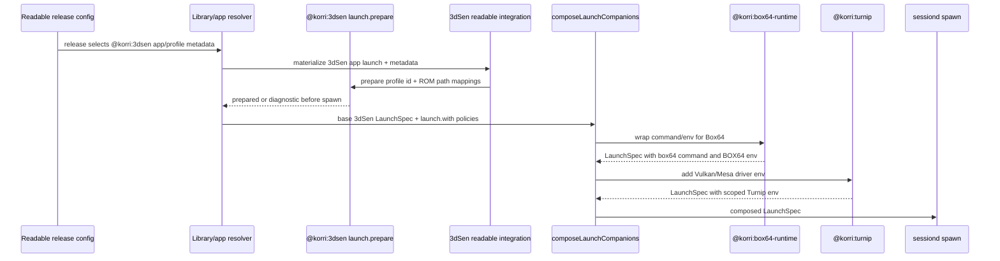

# feat: Productize 3dSen with Box64 and Turnip plugins

## Summary

Add reusable first-party plugin infrastructure for ARM64 devices running x86_64 Linux game payloads: a Box64 runtime/launch companion, a Turnip graphics launch companion, and an app-like 3dSen integration that prepares profile-to-ROM state before launch. 3dSen releases in readable config should be able to select the 3dSen app/profile and launch through Box64 + native Turnip without manual device-local scripts.

---

## Problem Frame

The validated Bandai path proves that Linux 3dSen can run through Box64 with native ARM64 Mesa/Turnip, but the working path is currently a device-local script plus hand-patched Unity config. Korri needs this to become durable product behavior: reusable runtime/graphics plugins, explicit launch policy, and app-like release tagging that makes 3dSen launches work from configuration rather than manual state.

---

## Requirements

- R1. Provide a reusable `@korri:box64-runtime` first-party plugin that can wrap Linux x86_64 process launches on aarch64 hosts and expose Box64 runtime diagnostics.
- R2. Extend the existing `@korri:turnip` plugin so Turnip/Freedreno Vulkan driver environment can be applied as a reusable launch companion, not only as a Nix wrapper package.
- R3. Add a first-party 3dSen integration that behaves like an app: configured releases can select it and supply 3dSen profile metadata, and Korri prepares the required 3dSen ROM registry before spawning.
- R4. Support multiple 3dSen profile/release mappings from day one; Super Mario Bros. profile `37` is the first validation case, not the only supported shape.
- R5. Use the already-staged/acquired 3dSen Linux payload as the executable input for this plan; do not expand this slice into itch.io acquisition or import UX.
- R6. Preserve provider-keyed plugin composition: generic platform code must not hard-code Box64, Turnip, or 3dSen behavior outside host-owned plugin seams.
- R7. Fail closed with actionable diagnostics when required plugins, executable resources, ROM paths, or launch companion handlers are missing or invalid.
- R8. Exclude Gamescope, DSI/window placement, FEX, Windows/Proton 3dSen, and system-wide Mesa pin changes from this plan.
- R9. Wire the app-like path through readable-config launch integration and target-device plugin enablement so configured releases can actually resolve on Bandai.

---

## Scope Boundaries

- Do not implement itch.io acquisition, entitlement, download-key, or import workflows in this slice.
- Do not add Gamescope wrapping, stream control, DSI-2 placement, Sway movement, or compositor/window-management behavior.
- Do not solve FEX Unity 2019 Vulkan WSI, Windows/Proton 3dSen, or Wine paths.
- Do not build a dynamic third-party plugin loader or plugin marketplace.
- Do not hard-code device-local 3dSen paths in TypeScript; staged payload and ROM locations must come from configured resources/policy.
- Do not turn staged-payload support into a general local library/import system; add only the narrow configured staged-root behavior needed for 3dSen.
- Do not make system-wide Mesa 26 a prerequisite; Turnip should expose a scoped ICD/environment path that can later simplify after the system-wide Mesa work lands.

### Deferred to Follow-Up Work

- DSI/window placement from the original parking-lot item is deferred because Gamescope and display placement are explicitly out of scope for this plan.
- Importing acquired itch.io payloads into the Korri library remains tracked separately by `work/items/parking-lot/01KVEFHW47Y57EFZXV882FHQZ4-import-acquired-itch-io-payloads-into-korri-library-and-launch-profiles.md`.
- 3dSen FEX/Unity Vulkan WSI investigation remains tracked separately by `work/items/parking-lot/01KVEQFF8TJ3H00M890NRHYZRC-investigate-unity-2019-vulkan-wsi-under-fex-for-3dsen.md`.
- System-wide Mesa 26 pinning remains tracked separately by `work/items/parking-lot/01KTWZ0EG83WQTF2DBCXA82WXF-bump-korri-nixpkgs-pin-for-system-wide-mesa-26-turnip-gl.md`.

---

## Context & Research

### Relevant Code and Patterns

- `product/plugins/AGENTS.md` defines first-party plugin layout, descriptor conventions, launch companion rules, executable resource rules, registration, and test expectations.
- `product/platform/plugin/index.ts` already supports `launch.prepare`, `launch.compose`, `runtime.resolve`, executable resources, plugin requirements, handler normalization, and provider IDs.
- `product/platform/plugin/registry.ts` namespaces plugin config records and auto-enables required plugin providers unless `autoEnable: false` is set.
- `product/platform/plugin/launch-companion.ts` dispatches provider-keyed `launch.with` policies through enabled plugins' `launch.compose` handlers and returns structured diagnostics.
- `product/platform/plugin/catalog-library-source.ts` adapts plugin catalog releases and executable resources into existing library launch resolution.
- `product/plugins/fex-runtime/src/plugin.ts` is the closest runtime resolver pattern for a CPU-translation plugin.
- `product/plugins/gamescope/src/plugin.ts` and `product/plugins/gamescope/src/launch-companion/` are the reference launch companion implementation and policy-schema pattern.
- `product/plugins/turnip/src/plugin.ts` already contributes `@korri:turnip` graphics-driver records and a wrapper package; this plan extends it rather than creating a second Turnip plugin.
- `product/platform/library/config/records/app-choice.ts` and `product/platform/library/config/app-choice-selection.ts` define release app-choice behavior and policy merging; 3dSen should align with this app-like model.
- `product/plugins/retroarch/src/plugin.ts` shows plugin-contributed app/system/runtime records that configured releases can select.
- `product/plugins/mega-man-arena/src/plugin.ts` shows catalog releases using `launch.with` to compose multiple runtime providers.

### Institutional Learnings

- `docs/solutions/architecture-patterns/korri-plugin-architecture-2026-06-02.md`: plugins contribute data/actions behind host-owned seams and use stable provider IDs.
- `docs/solutions/architecture-patterns/gamescope-as-plugin-owned-composition-2026-06-17.md`: generic Korri code must not name specific plugin IDs; provider-keyed `launch.with` is the reusable composition seam.
- `docs/solutions/design-patterns/explicit-cascade-folded-policy-over-incidental-signal-heuristics-2026-05-27.md`: runtime behavior must come from explicit policy fields, not environment/argv sniffing.
- `docs/solutions/performance-issues/ryubing-sm8550-turnip26-openal-2026-06-11.md`: scoped Turnip/Mesa ICD selection is a proven device-specific mitigation and should not be coupled to unrelated system-wide Mesa work.
- `docs/solutions/tooling-decisions/align-flake-nixpkgs-to-downstream-pin-for-cache-coherence-2026-05-27.md`: plugin-specific Nix inputs must avoid cache-hostile channel drift.
- `docs/research/plugin-architecture/synthesis-2026-05-31.md`: Effect services/layers and first-party plugin modules are the preferred extension mechanism.

### External References

- No fresh external research was used. The plan is grounded in existing repo patterns, local institutional research, and live Bandai validation of the 3dSen Box64 + Turnip route.

---

## Key Technical Decisions

- Use one `@korri:turnip` plugin: extend the existing graphics-driver plugin with launch composition rather than creating a parallel Turnip component.
- Model Box64 as both a runtime and a launch companion: it contributes runtime records/diagnostics and rewrites a process launch to execute through the Box64 binary with explicit Box64 policy.
- Model Turnip as an environment-only launch companion: it injects Vulkan/Mesa driver environment into the launch spec and must be order-independent with Box64 by only merging environment keys.
- Model 3dSen as an app-like readable launch integration, not as a hard-coded one-game catalog script: configured releases select the 3dSen app/profile and carry profile metadata; 3dSen prepares its own runtime registry before launch. This requires a registered `3dsenReadableLaunchIntegration`, not only plugin catalog entries.
- Use `launch.prepare` for 3dSen ROM registry preparation: this is the right runtime moment to validate user-owned ROM paths and fail clearly before spawn. The prepare contract needs non-mutating check mode for dry-run and mutating commit mode for real launches.
- Support multiple 3dSen profile mappings immediately: the ROM registry writer accepts a set of profile entries, with SMB/profile `37` as the first validation fixture.
- Keep staged proprietary payloads outside source control: add the smallest configured staged-root resource path needed for 3dSen, returning both command and cwd, without general import/discovery/checksum UI.
- Auto-enable runtime requirements for 3dSen: enabling `@korri:3dsen` should auto-enable `@korri:box64-runtime` and `@korri:turnip`, because the app integration is unusable without them.
- Keep `SDL_VIDEODRIVER=x11` in 3dSen's Box64 policy, not in Box64's global default, because it is a Unity/3dSen need rather than a universal Box64 truth.
- Treat a reachable X11/Xwayland display as a direct-launch prerequisite, not a placement feature: this plan may add environment wiring or diagnostics for display availability, but it must not move windows or introduce Gamescope.

---

## Open Questions

### Resolved During Planning

- Should Box64, Turnip, and 3dSen be planned together? Yes: the user confirmed one cohesive plan for all three.
- Should itch.io acquisition/import be included? No: use the staged payload only; acquisition/import UX stays separate.
- Should Gamescope be included? No: Gamescope is not involved in this plan.
- Should reusable environment pieces be designed now? Yes: Turnip and Box64 should expose reusable policy/env composition, not just one-off 3dSen scripts.
- Should display placement be included? No: DSI/window placement is deferred.
- Should 3dSen setup be manual or app-like? App-like: releases should select the 3dSen app/profile and launch should prepare needed state automatically.
- Should 3dSen support multiple profiles from day one? Yes: SMB/profile `37` is the first proof, but the plugin should support multiple configured profile mappings.

### Deferred to Implementation

- Exact Nix store path or wrapper mechanism for Box64 and scoped Turnip ICDs: implementation should choose the least invasive Nix-generated constant or wrapper pattern that matches existing plugin packages.
- Exact readable-config YAML field names for 3dSen profile metadata: implementation should align with existing app-choice/plugin-policy codecs while preserving the app-like release-tagging behavior.
- Exact target-device display discovery mechanics: implementation may use current explicit session display configuration or diagnostics, but broader active-Xwayland discovery remains separate follow-up work.
- Exact user-facing diagnostic wording: implementation should preserve structured failure reasons and add clear messages, but wording can be refined with tests.

---

## Output Structure

    product/platform/plugin/
      launch-prepare.ts
      launch-prepare.test.ts
      resources.ts
    product/platform/control/
      korri-control-live.ts
      korri-control-live.test.ts
    product/systems/nixos/images/platforms/
      rocknix-sm8550.nix
    product/plugins/box64-runtime/
      index.ts
      README.md
      src/
        plugin.ts
        plugin.test.ts
        launch-companion/
          policy.ts
          policy.test.ts
          wrapper.ts
          wrapper.test.ts
      nix/
        composition.nix
      packages/
        box64-runtime/
          default.nix
          setup-env
          check.nix
    product/plugins/turnip/
      src/
        plugin.ts
        plugin.test.ts
        launch-companion/
          policy.ts
          policy.test.ts
          wrapper.ts
          wrapper.test.ts
    product/plugins/3dsen/
      index.ts
      README.md
      src/
        plugin.ts
        plugin.test.ts
        rom-registry.ts
        rom-registry.test.ts
        launch-prepare.ts
        launch-prepare.test.ts
        readable-launch-integration.ts
        readable-launch-integration.test.ts
      nix/
        composition.nix
      packages/
        3dsen-app/
          default.nix
          check.nix

---

## High-Level Technical Design

> *This illustrates the intended approach and is directional guidance for review, not implementation specification. The implementing agent should treat it as context, not code to reproduce.*

The important shape is that 3dSen owns app-specific state preparation, Box64 owns CPU translation/wrapping, and Turnip owns graphics-driver environment. The three plugins compose through existing provider-keyed host seams rather than generic platform code knowing their internals.

---

## Implementation Units

### U1. Extend Turnip into a reusable launch companion

**Goal:** Let `@korri:turnip` apply scoped Turnip/Freedreno Vulkan environment to any launch spec through `launch.with`, while preserving its existing graphics-driver and wrapper-package contributions.

**Requirements:** R2, R6, R7, R8

**Dependencies:** None

**Files:**
- Modify: `product/plugins/turnip/src/plugin.ts`
- Create: `product/plugins/turnip/src/launch-companion/policy.ts`
- Create: `product/plugins/turnip/src/launch-companion/policy.test.ts`
- Create: `product/plugins/turnip/src/launch-companion/wrapper.ts`
- Create: `product/plugins/turnip/src/launch-companion/wrapper.test.ts`
- Modify: `product/plugins/turnip/src/plugin.test.ts`
- Review/modify if needed: `product/plugins/turnip/packages/turnip-wrapper/default.nix`
- Review/modify if needed: `product/plugins/turnip/nix/composition.nix`

**Approach:**
- Add a `launch.compose` handler to the existing `turnipPlugin`.
- Define a small Turnip policy schema with `enable`, optional ICD path override, and optional native driver environment paths.
- Keep the wrapper order-independent: merge Turnip-specific env keys into the child spec without changing command, args, cwd, or Box64-specific variables.
- Prefer plugin/Nix-derived defaults for scoped ICD paths so release authors are not forced to paste store paths. Keep explicit policy override as an escape hatch.
- Preserve existing `graphics-driver` runtime records and wrapper package behavior; do not remove the build-time wrapper helper.

**Patterns to follow:**
- `product/plugins/gamescope/src/launch-companion/policy.ts`
- `product/plugins/gamescope/src/launch-companion/wrapper.ts`
- `product/plugins/turnip/src/plugin.ts`
- `docs/solutions/performance-issues/ryubing-sm8550-turnip26-openal-2026-06-11.md`

**Test scenarios:**
- Happy path: a Turnip policy with defaults adds Vulkan driver env to a launch spec and preserves command, args, cwd, and existing unrelated env.
- Happy path: an explicit ICD path override wins over the default.
- Edge case: `enable: false` returns the original spec unchanged.
- Error path: invalid policy fields are rejected by the handler with a clear error.
- Integration: `turnipPlugin` exposes a `launch.compose` handler with `launch.compose` and `graphics.vulkan` capabilities while retaining its existing runtime/module records.
- Integration: composing Turnip before or after an env-only wrapper yields the same Turnip env keys and does not remove existing `BOX64_*` values.

**Verification:**
- Turnip remains registered as `@korri:turnip` and can now be used in `launch.with` as a reusable graphics-driver companion.

---

### U2. Add the Box64 runtime and launch companion plugin

**Goal:** Introduce `@korri:box64-runtime` as a reusable first-party plugin that resolves Box64 runtime facts and wraps Linux x86_64 process launches on aarch64 hosts.

**Requirements:** R1, R6, R7

**Dependencies:** U1 for final cross-plugin composition shape, though Box64 can be developed independently.

**Files:**
- Create: `product/plugins/box64-runtime/index.ts`
- Create: `product/plugins/box64-runtime/README.md`
- Create: `product/plugins/box64-runtime/src/plugin.ts`
- Create: `product/plugins/box64-runtime/src/plugin.test.ts`
- Create: `product/plugins/box64-runtime/src/launch-companion/policy.ts`
- Create: `product/plugins/box64-runtime/src/launch-companion/policy.test.ts`
- Create: `product/plugins/box64-runtime/src/launch-companion/wrapper.ts`
- Create: `product/plugins/box64-runtime/src/launch-companion/wrapper.test.ts`
- Create: `product/plugins/box64-runtime/nix/composition.nix`
- Create: `product/plugins/box64-runtime/packages/box64-runtime/default.nix`
- Create: `product/plugins/box64-runtime/packages/box64-runtime/setup-env`
- Create: `product/plugins/box64-runtime/packages/box64-runtime/check.nix`
- Modify: `product/plugins/index.ts`
- Modify: `product/plugins/index.test.ts`

**Approach:**
- Follow the FEX runtime plugin for runtime record and diagnostics shape, and the Gamescope launch companion for `launch.compose` shape.
- Contribute a CPU-translation runtime record for host `aarch64-linux` and guest `x86_64-linux`.
- Contribute a Nix package/module for the Box64 runtime package and setup-env fragment.
- Add a `launch.compose` handler that validates `Box64Policy`, wraps `LaunchSpec.command` through Box64, preserves cwd, and merges env.
- Keep game-side x86_64 library paths separate from native ARM64 graphics/system paths. Box64 policy can derive the default game library path from `cwd` only when cwd is present, with explicit policy override for unusual layouts.
- Include Unity-safe policy fields needed by 3dSen, such as Unity mode, conservative dynarec/memory flags, max CPU, native-library preference, and optional SDL video driver. Do not set `SDL_VIDEODRIVER=x11` as a global default.
- Provide diagnostics that at least report plugin registration and expected Box64 command availability/policy validity.

**Patterns to follow:**
- `product/plugins/fex-runtime/src/plugin.ts`
- `product/plugins/fex-runtime/packages/fex-runtime/setup-env`
- `product/plugins/gamescope/src/launch-companion/wrapper.ts`
- `product/plugins/mega-man-arena/packages/mega-man-arena/mega-man-arena-fex`
- `docs/solutions/design-patterns/explicit-cascade-folded-policy-over-incidental-signal-heuristics-2026-05-27.md`

**Test scenarios:**
- Happy path: Box64 wraps a process launch by moving the original command into Box64 args and preserving original args order.
- Happy path: Unity/conservative policy fields render to the expected `BOX64_*` env overlay without affecting unrelated env keys.
- Happy path: `cwd` is preserved and can be used to derive game-side library paths when no explicit library path is supplied.
- Edge case: explicit game library path policy overrides cwd-derived defaults.
- Edge case: `enable: false` returns the original spec unchanged.
- Error path: invalid boolean/integer/string policy values fail at the handler boundary.
- Error path: missing required command/cwd context for a policy that needs derived game libs returns a structured handler error rather than a malformed launch spec.
- Integration: plugin descriptor exposes stable id `@korri:box64-runtime`, runtime records, package/module records, `runtime.resolve`, `launch.compose`, and diagnostics handlers.
- Integration: Nix check verifies the package exposes the setup-env fragment and expected runtime binary/wrapper artifacts without assuming user profile mutation.

**Verification:**
- A launch spec using `launch.with."@korri:box64-runtime"` can be composed into a valid Box64-wrapped `LaunchSpec` with deterministic env and diagnostics.

---

### U3. Add platform support for pre-launch plugin preparation

**Goal:** Make `launch.prepare` a real host seam so app-like plugins such as 3dSen can validate and materialize per-launch state before sessiond spawns the process.

**Requirements:** R3, R6, R7, R9

**Dependencies:** None

**Files:**
- Modify: `product/platform/plugin/index.ts`
- Create: `product/platform/plugin/launch-prepare.ts`
- Create: `product/platform/plugin/launch-prepare.test.ts`
- Modify: `product/platform/plugin/catalog-library-source.ts`
- Modify: `product/platform/plugin/catalog-library-source.test.ts`
- Modify as needed: `product/platform/library/library-services.ts`
- Modify as needed: `product/services/device/game-stream-launch-intent.ts`
- Modify as needed: `product/platform/control/korri-control-live.ts`
- Modify as needed: `product/platform/control/korri-control-live.test.ts`
- Modify as needed: `product/apps/portal/api/library/launch.rpc-handler.test.ts`

**Approach:**
- Define a generic pre-launch dispatcher analogous to `composeLaunchCompanions`, keyed by provider/app policy rather than hard-coded plugin IDs.
- Add an explicit prepare mode such as non-mutating check vs mutating commit so dry-run can validate without writing files while real launch can materialize state.
- Pass enough context for app-like plugins to inspect playable/release/app metadata and the current launch spec, but keep the platform contract generic.
- Return either a prepared launch context or structured diagnostics; missing/disabled provider and handler failures should fail before spawn.
- Integrate the dispatcher at the control/library launch boundary where resolved launch metadata is still available, including the dry-run and launch paths in `product/platform/control/korri-control-live.ts`; ensure any stream/session intent carries the minimal prepare context needed by the host that performs the final spawn.
- Keep this seam app-agnostic: 3dSen uses it first, but the platform type should not mention ROMs, Unity, Box64, or Turnip.

**Patterns to follow:**
- `product/platform/plugin/launch-companion.ts`
- `product/platform/plugin/catalog-library-source.ts`
- `product/services/device/game-stream-launch-intent.ts`
- `product/platform/control/korri-control-live.ts`
- `product/apps/portal/api/library/launch.rpc-handler.test.ts`

**Test scenarios:**
- Happy path: an enabled plugin with a `launch.prepare` handler receives generic launch context and returns success before the composed launch proceeds.
- Happy path: dry-run/check mode validates inputs without mutating the filesystem.
- Happy path: commit mode writes required state exactly once before spawn.
- Edge case: no prepare provider/policy leaves the launch unchanged.
- Error path: missing provider returns a structured preflight diagnostic and blocks spawn.
- Error path: disabled provider returns a structured preflight diagnostic and blocks spawn.
- Error path: handler failure returns a structured diagnostic and does not call the process launcher.
- Integration: prepare runs before launch companions so 3dSen can materialize config before Box64/Turnip wrapping.
- Integration: stream/session intent preserves enough prepare context for the spawning host without embedding 3dSen-specific fields in generic intent types.
- Integration: prepare diagnostics surface through the same launch API path used by portal/library launches.

**Verification:**
- The platform can run app/plugin preparation without knowing 3dSen specifics, and failures are visible before process spawn.

---

### U4. Add app-like 3dSen config and multi-profile ROM registry preparation

**Goal:** Implement `@korri:3dsen` as an app integration that configured releases can select, with launch preparation that writes the 3dSen profile-to-ROM registry for all configured profiles.

**Requirements:** R3, R4, R5, R6, R7, R8, R9

**Dependencies:** U1, U2, U3

**Files:**
- Create: `product/plugins/3dsen/index.ts`
- Create: `product/plugins/3dsen/README.md`
- Create: `product/plugins/3dsen/src/plugin.ts`
- Create: `product/plugins/3dsen/src/plugin.test.ts`
- Create: `product/plugins/3dsen/src/rom-registry.ts`
- Create: `product/plugins/3dsen/src/rom-registry.test.ts`
- Create: `product/plugins/3dsen/src/launch-prepare.ts`
- Create: `product/plugins/3dsen/src/launch-prepare.test.ts`
- Create: `product/plugins/3dsen/src/readable-launch-integration.ts`
- Create: `product/plugins/3dsen/src/readable-launch-integration.test.ts`
- Modify as needed: `product/platform/library/config/records/app-choice.ts`
- Modify as needed: `product/platform/library/config/app-choice-selection.ts`
- Modify as needed: `product/platform/library/config/records/readable-schema.test.ts`
- Modify: `product/plugins/index.ts`
- Modify: `product/plugins/index.test.ts`

**Approach:**
- Define plugin id `@korri:3dsen` and an app id such as `@korri:3dsen/3dsen` following existing plugin-contributed app conventions.
- Add and register a `3dsenReadableLaunchIntegration` so readable-config releases selecting the provider-qualified 3dSen app can resolve through the app path; do not rely only on plugin catalog adaptation.
- Add `requires` entries for `@korri:box64-runtime` and `@korri:turnip` with default auto-enable behavior.
- Contribute an app/config record whose launch policy includes Box64 and Turnip companions but no Gamescope.
- Define a 3dSen plugin policy for release/app-choice metadata: profile id, ROM path/content path source, display title, and optional profile-specific overrides.
- Prepare the Unity-style 3dSen ROM registry during `launch.prepare`: validate that each configured ROM path exists, render a registry containing all configured profiles using the live-validated top-level `Warning` + `Items` shape, and fail with a clear diagnostic if the selected release/profile is incomplete.
- Keep the process argv profile-based: pass the 3dSen profile id only, not the ROM path. The ROM path lives in the generated registry.
- Add a non-secret rom-registry fixture based on the observed live schema so the writer is not implemented from memory or external guesswork.
- Include SMB/profile `37` as a test fixture and optional sample, but ensure the writer supports more than one profile.

**Patterns to follow:**
- `product/plugins/retroarch/src/plugin.ts`
- `product/platform/library/config/records/app-choice.ts`
- `product/platform/library/config/app-choice-selection.ts`
- `product/plugins/steam/src/state-materializer.ts`
- `product/plugins/steam/src/state-materializer.test.ts`

**Test scenarios:**
- Happy path: a release selecting the 3dSen app with profile id `37` and a ROM path produces a launch-prepared registry entry and argv containing only the profile id.
- Happy path: two configured 3dSen profiles produce a single registry containing both entries in the live-validated `Warning` + `Items` schema without dropping either mapping.
- Happy path: release-level profile metadata overrides or augments system/app defaults through existing app-choice/plugin-policy merge rules.
- Edge case: a profile id is accepted as a stable 3dSen profile value and is not derived from the ROM filename.
- Edge case: a ROM path containing spaces is serialized safely into the registry.
- Error path: missing ROM path fails in `launch.prepare` before process spawn.
- Error path: missing selected profile id fails with a configuration diagnostic.
- Error path: malformed existing registry state is replaced or repaired according to the writer's documented policy, without preserving invalid entries silently.
- Integration: enabling `@korri:3dsen` auto-enables Box64 and Turnip requirements in the plugin registry.
- Integration: the app record contributes Box64 and Turnip `launch.with` policy and does not include Gamescope.
- Integration: readable-config releases selecting `@korri:3dsen/3dsen` resolve through `firstPartyLaunchIntegrationsForRegistry` instead of failing as an unknown provider-qualified app.

**Verification:**
- A configured release can select the 3dSen app/profile, trigger registry preparation, and produce the correct app metadata/launch policy without manual registry editing. Full executable/cwd launch resolution is completed by U5.

---

### U5. Package/wire the staged 3dSen executable resource without committing proprietary payloads

**Goal:** Let Korri resolve the staged 3dSen Linux payload as an executable resource or wrapper while keeping proprietary artifacts outside source control and outside nixpkgs assumptions.

**Requirements:** R5, R7

**Dependencies:** U2, U4

**Files:**
- Create: `product/plugins/3dsen/nix/composition.nix`
- Create: `product/plugins/3dsen/packages/3dsen-app/default.nix`
- Create: `product/plugins/3dsen/packages/3dsen-app/check.nix`
- Modify as needed: `product/platform/plugin/index.ts`
- Modify as needed: `product/platform/plugin/registry.ts`
- Modify as needed: `product/platform/plugin/resources.ts`
- Modify as needed: `product/platform/plugin/catalog-library-source.ts`
- Modify tests as needed: `product/platform/plugin/catalog-library-source.test.ts`

**Approach:**
- Prefer a minimal extension of the existing executable resource model that can represent a configured local/staged executable root without source-controlling the payload. This slice may not add general local-library discovery, arbitrary executable import, checksum/entitlement management, content relocation, or UI for managing staged resources.
- If the current `fulfill.provider: "nix"` shape is retained, package only a wrapper/check that points at a configured staged content root; do not copy proprietary archives into the repo.
- Ensure the resource resolver can return both command and cwd, or otherwise carry cwd through the 3dSen launch integration, so Unity/Box64 library discovery can work predictably.
- Validate required child files at resource-resolution or launch-prepare time and return configuration diagnostics when the staged payload is absent.
- Keep Nix composition optional: a product image without the 3dSen plugin or staged payload should still evaluate cleanly.

**Patterns to follow:**
- `product/platform/plugin/catalog-library-source.ts`
- `product/plugins/neverball/index.ts`
- `product/plugins/mega-man-arena/nix/composition.nix`
- `product/plugins/mega-man-arena/packages/mega-man-arena/check.nix`
- `product/plugins/AGENTS.md` executable resource rules

**Test scenarios:**
- Happy path: a configured staged executable root resolves to a command and cwd suitable for Box64 wrapping.
- Happy path: the resource resolver does not require `nix run` or user profile mutation at launch time.
- Edge case: a payload directory exists but the expected 3dSen executable is missing, producing a configuration diagnostic.
- Error path: an unset staged payload location produces a missing-resource diagnostic and prevents spawn.
- Error path: a non-executable file at the expected command path is rejected.
- Integration: 3dSen catalog/app launch resolution carries cwd, args, and launch companions through `withPluginLibrarySource` or the app resolver path.
- Integration: plugin Nix composition evaluates without the proprietary payload when the 3dSen plugin is disabled.
- Integration: plugin composition remains portable on unsupported host systems; aarch64/SM8550 receives the intended runtime packages while x86_64/dev evaluation does not require the proprietary payload.

**Verification:**
- 3dSen can be represented as a configured/staged executable resource while source control contains only plugin code, wrappers, tests, and docs; combined with U4, configured launch resolution has both command and cwd for Box64 wrapping.

---

### U6. Register, document, and validate the composed plugin path

**Goal:** Wire the new/extended plugins into first-party registration and document the operator-facing configuration needed to tag releases with the 3dSen app/profile.

**Requirements:** R1-R9

**Dependencies:** U1, U2, U3, U4, U5

**Files:**
- Modify: `product/plugins/index.ts`
- Modify: `product/plugins/index.test.ts`
- Modify or create: `product/plugins/box64-runtime/README.md`
- Modify or create: `product/plugins/turnip/README.md`
- Modify or create: `product/plugins/3dsen/README.md`
- Modify as needed: `product/plugins/AGENTS.md`
- Modify as needed: `work/items/active/01KVEVWAK7QN2C410MSVSGB1PX-3dsen-box64-turnip-plugins/item.md`

**Approach:**
- Register `@korri:box64-runtime` and `@korri:3dsen` alongside the existing first-party plugins.
- Register `3dsenReadableLaunchIntegration` in `firstPartyLaunchIntegrations` so provider-qualified 3dSen app choices resolve when the plugin is enabled.
- Ensure `@korri:turnip` remains registered once and now advertises the added launch companion behavior.
- Update registration tests for stable IDs, enablement, and auto-enable requirement expansion.
- Document plain-English app usage: a release selects the 3dSen app and supplies a profile id plus ROM path; launch preparation handles the 3dSen registry.
- Document explicit non-goals: no Gamescope, no DSI placement, no FEX/Windows path, no committed proprietary payloads.
- Update the original active item acceptance text so the DSI criterion is marked deferred and the hard-coded SMB catalog-entry criterion is reworded to the app-like multi-profile configured-release model.
- Keep live SMB/profile `37` smoke as post-implementation device validation, separate from automated tests and explicitly not including DSI/window placement.

**Patterns to follow:**
- `product/plugins/index.ts`
- `product/plugins/index.test.ts`
- `product/plugins/AGENTS.md`
- `product/plugins/gamescope/README.md`
- `product/plugins/fex-runtime/README.md`

**Test scenarios:**
- Happy path: first-party plugin registry includes `@korri:box64-runtime`, existing `@korri:turnip`, and `@korri:3dsen`.
- Happy path: first-party readable launch integrations include 3dSen only when the 3dSen plugin is enabled.
- Happy path: enabling `@korri:3dsen` expands enabled plugins to include Box64 and Turnip.
- Edge case: enabling only Box64 or only Turnip does not surface 3dSen catalog/app behavior by itself.
- Error path: disabling a required launch companion yields a launch diagnostic rather than a partial spawn.
- Integration: a sample configured release using 3dSen profile metadata resolves to prepare + Box64 + Turnip flow in tests.
- Documentation: README examples do not include Gamescope or DSI placement and do not imply itch.io acquisition is part of this plugin slice.

**Verification:**
- Tests and docs demonstrate the complete configured-release-to-launch path, and the original parking-lot item no longer contains an in-scope DSI acceptance contradiction.

---

### U7. Wire target-device enablement and direct-launch display prerequisites

**Goal:** Ensure the plugin path can actually run on the validated SM8550/Bandai target when enabled, without adding Gamescope or window-placement behavior.

**Requirements:** R1, R2, R3, R7, R8, R9

**Dependencies:** U1, U2, U4, U5

**Files:**
- Modify: `product/systems/nixos/images/platforms/rocknix-sm8550.nix`
- Modify as needed: `product/systems/nixos/modules/korri-sessiond.nix`
- Modify as needed: `product/systems/nixos/modules/korri-compositor.nix`
- Modify as needed: `product/plugins/box64-runtime/nix/composition.nix`
- Modify as needed: `product/plugins/turnip/nix/composition.nix`
- Modify as needed: `product/plugins/3dsen/nix/composition.nix`

**Approach:**
- Add the plugin enablement and runtime package wiring required for the target image to request `@korri:3dsen`, allowing registry requirement expansion to enable Box64 and Turnip.
- Ensure the Box64 runtime package is available to the session launch environment if the Box64 wrapper uses a PATH-resolved command; otherwise document and wire the absolute-command alternative chosen in U2.
- Add only the direct-launch display prerequisite needed for `SDL_VIDEODRIVER=x11`: either explicit environment wiring to the current Xwayland display or a pre-spawn diagnostic when the display is unavailable.
- Do not add Gamescope, DSI connector selection, Sway window movement, or global active-display discovery in this unit.

**Patterns to follow:**
- `product/systems/nixos/images/platforms/rocknix-sm8550.nix`
- `product/systems/nixos/modules/korri-compositor.nix`
- `product/plugins/gamescope/nix/composition.nix`
- `product/plugins/fex-runtime/nix/composition.nix`

**Test scenarios:**
- Happy path: the SM8550 image/plugin configuration enables `@korri:3dsen` and registry expansion includes Box64 and Turnip.
- Happy path: the session launch environment can resolve the Box64 command according to the command-path strategy chosen in U2.
- Happy path: SM8550/NixOS evaluation remains clean when the 3dSen plugin is disabled or no proprietary staged payload is configured.
- Error path: a direct 3dSen launch with X11 policy and no reachable display fails with a structured diagnostic before Unity starts.
- Scope guard: target-device wiring does not add Gamescope policy or DSI/window-placement settings.

**Verification:**
- Bandai-targeted configuration can request the 3dSen app path and satisfy runtime/display prerequisites without manual sessiond overrides beyond the explicitly configured direct-launch display contract.

---

## System-Wide Impact

- **Interaction graph:** Readable config/app-choice selection feeds 3dSen profile metadata through a registered readable launch integration, then into `launch.prepare`; launch resolution then feeds provider-keyed policies into Box64 and Turnip `launch.compose` handlers before sessiond spawn.
- **Error propagation:** Prepare and compose failures should stop before process spawn and return structured diagnostics through existing launch/library APIs; dry-run should report prepare/check failures without mutating state.
- **State lifecycle risks:** 3dSen registry generation mutates per-user runtime config; writes should be atomic and deterministic to avoid corrupt or partially written registry state.
- **API surface parity:** Portal/library launch flows, dry-run launch flows, stream/session intent launches, plugin catalog launches, and readable config app-choice launches should all preserve launch companions and prepare diagnostics consistently.
- **Integration coverage:** Unit tests must cover each plugin boundary, plus at least one cross-plugin launch resolution test for 3dSen + Box64 + Turnip.
- **Unchanged invariants:** Generic platform code remains provider-keyed and must not import plugin internals by name; user Nix profiles are not mutated; proprietary artifacts are not committed.

---

## Risks & Dependencies

| Risk | Mitigation |
|------|------------|
| `launch.prepare` becomes 3dSen-shaped instead of generic | Mirror `launch-companion.ts` dispatcher style and keep ROM-specific behavior inside `product/plugins/3dsen`. |
| Box64 and Turnip env overlays conflict or depend on order | Design Turnip as env-only and Box64 as env-preserving; add tests for both orderings where feasible. |
| 3dSen launches but silently misses the ROM registry | Validate profile metadata and ROM path in `launch.prepare`; fail before spawn on missing inputs. |
| Proprietary 3dSen payload leaks into source control or Nix cache | Source-control only wrappers/config/tests; reference staged payload paths through config and checks. |
| Scoped Turnip ICD path is brittle across Nix changes | Keep the path owned by the Turnip plugin/package with policy override; document removal path after system-wide Mesa work lands. |
| Existing broad typecheck failures obscure validation | Use targeted plugin/platform tests plus Nix/system evaluation gates as the completion surface and note broad typecheck remains separate pre-existing work. |
| Readable-config app choices bypass the plugin catalog path | Add/register a 3dSen readable launch integration and test provider-qualified app resolution directly. |
| Dry-run accidentally mutates the 3dSen registry | Give `launch.prepare` explicit check/commit modes and cover both paths in tests. |
| Direct X11 launch lacks a reachable display | Add narrow target-device environment wiring or pre-spawn diagnostics without adding placement/Gamescope scope. |

---

## Documentation / Operational Notes

- `product/plugins/3dsen/README.md` should explain the release-tagging model in plain English: choose the 3dSen app, provide profile id and ROM path, and Korri prepares the registry at launch.
- `product/plugins/box64-runtime/README.md` should document the separation between game-side x86_64 library paths and native ARM64 graphics/system libraries.
- `product/plugins/turnip/README.md` should document scoped ICD/default env behavior and the relationship to the separate system-wide Mesa pin work.
- Automated verification should include the frontmatter Bun test gate plus relevant Nix/system checks for plugin package composition and SM8550 evaluation, such as the repo's Nix test and SM8550 kiosk toplevel checks.
- Live validation after implementation should use the staged 3dSen payload and a user-owned NES ROM to launch SMB/profile `37` through Korri and confirm it reaches a playable scene and returns to home on stop. This validation explicitly excludes DSI/window placement.

---

## Sources & References

- **Origin item:** [work/items/active/01KVEVWAK7QN2C410MSVSGB1PX-3dsen-box64-turnip-plugins/item.md](work/items/active/01KVEVWAK7QN2C410MSVSGB1PX-3dsen-box64-turnip-plugins/item.md)
- Related code: `product/plugins/AGENTS.md`
- Related code: `product/plugins/fex-runtime/src/plugin.ts`
- Related code: `product/plugins/gamescope/src/plugin.ts`
- Related code: `product/plugins/gamescope/src/launch-companion/wrapper.ts`
- Related code: `product/plugins/turnip/src/plugin.ts`
- Related code: `product/platform/plugin/launch-companion.ts`
- Related code: `product/platform/plugin/catalog-library-source.ts`
- Related code: `product/platform/library/config/records/app-choice.ts`
- Related code: `product/platform/library/config/app-choice-selection.ts`
- Related code: `product/plugins/retroarch/src/plugin.ts`
- Related code: `product/platform/control/korri-control-live.ts`
- Related code: `product/systems/nixos/flake/plugins.nix`
- Related code: `product/services/device/game-stream-launch-intent.ts`
- Related code: `product/systems/nixos/images/platforms/rocknix-sm8550.nix`
- Related learning: `docs/solutions/architecture-patterns/korri-plugin-architecture-2026-06-02.md`
- Related learning: `docs/solutions/architecture-patterns/gamescope-as-plugin-owned-composition-2026-06-17.md`
- Related learning: `docs/solutions/design-patterns/explicit-cascade-folded-policy-over-incidental-signal-heuristics-2026-05-27.md`
- Related learning: `docs/solutions/performance-issues/ryubing-sm8550-turnip26-openal-2026-06-11.md`
- Related follow-up: `work/items/parking-lot/01KVEFHW47Y57EFZXV882FHQZ4-import-acquired-itch-io-payloads-into-korri-library-and-launch-profiles.md`
- Related follow-up: `work/items/parking-lot/01KVEQFF8TJ3H00M890NRHYZRC-investigate-unity-2019-vulkan-wsi-under-fex-for-3dsen.md`
- Related follow-up: `work/items/parking-lot/01KTWZ0EG83WQTF2DBCXA82WXF-bump-korri-nixpkgs-pin-for-system-wide-mesa-26-turnip-gl.md`
