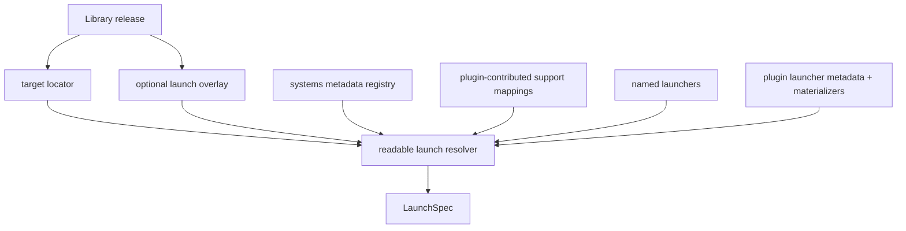

# refactor: Standardize plugin launchers and readable config

## Summary

Replace Korri's current app/app-choice/plugin-policy readable config model with a no-backwards-compat launcher/plugin domain model. The refactor standardizes release `target` locators, optional `launch` overlays, named `launchers`, metadata-only `systems`, plugin-contributed launcher support, common settings packs plus typed `settings.plugin`, and provider-linked refs while migrating all first-party plugins, materializers, fixtures, and launch APIs in one deliberately phased big bang.

---

## Problem Frame

Korri's readable config has outgrown the current `apps[]` app-choice model: plugin-specific policy sits in provider-keyed bags, systems still carry launch choices, targets only handle simple file/URI shapes, and standalone executables either become noisy bespoke plugins or leak launcher behavior into target identity. The new sketch in `work/items/active/01KVGDKT01DNT9NRDKS846CJQ1-plugin-launcher-standardization/config-sketch.korri.yaml` captures the desired domain split; this plan turns that sketch into a codebase-wide implementation strategy.

---

## Requirements

- R1. Replace user-facing `apps` / app-choice launch selection with `launchers` and release-level `launch` overlays using one shared launcher object vocabulary.
- R2. Make release `target` a locator-only union with `file`, `file-set`, `executable`, `url`, and `provider-ref` variants; launch behavior must not live in `target`.
- R3. Keep `systems` metadata-only, open, plugin-contributed compatibility domains; launchability must be joined through plugin-contributed support mappings rather than nested under `systems`.
- R4. Add plugin launcher metadata for runtime mode (`none`, `embedded`, `optional`, `required`), supported common settings packs, typed `settings.plugin` schemas, target defaults, and system support mappings.
- R5. Normalize cascadeable launcher settings into common packs (`display`, `audio`, `input`, `saves`, `lifecycle`) plus one typed `settings.plugin` extension pack selected by the launcher plugin.
- R6. Preserve raw end-user escape hatches under `overrides.args` and `overrides.config`, with `prepend` / `append` / `replace` semantics.
- R7. Support multi-file releases through `file-set` targets with named parts and launcher-owned `input` selection policy; targets must not declare entrypoints.
- R8. Move provider/external identity and hash-like refs into scoped `provider-links.refs[]`, including optional `targetPart` scope, without adding new verification enforcement or duplicating hashes on targets.
- R9. Implement no backwards compatibility: reject retired fields at decode time with migration-oriented diagnostics and update all checked-in fixtures/examples/plugins to the new shape.
- R10. Keep first-party plugin boundaries: generic platform code must not hard-code plugin behavior; plugin-specific validation, materialization, settings schema, runtime mode, and support mappings belong to plugin descriptors/materializers.
- R11. Phase the implementation into atomic, resumable units suitable for a multi-compact agentic session while preserving green verification between units where possible.
- R12. Retire user-authored `kind` for launcher/app selection everywhere the new vocabulary uses `plugin`; keep `target.kind` only for target variants.
- R13. Update live launch execution, not only dry-run: resolved launcher contexts must flow through LaunchSpec composition, sessiond-managed protocol, shell spawning, and stream runner paths.
- R14. Preserve intended cascade layers explicitly by mapping old host/user/system/app/app-choice/runtime/library/release/profile/ephemeral behavior into the new launcher/settings/target model or intentionally dropping it with tests.

---

## Scope Boundaries

- No compatibility loader for old readable YAML fields such as top-level `apps`, `release.apps[]`, `system.apps[]`, `provider-link.ref`, or `plugin.<provider>` policy bags.
- No third-party plugin loading, marketplace, trust model, or user-installed plugin distribution changes.
- No broad UI redesign; only API/read-model/diagnostic changes required by the new config model are in scope.
- No deployment/device validation in this plan; runtime validation of specific games remains execution work after the schema lands.
- No source/provider claims redesign beyond the provider-link shape required here; the existing provider-claims plan remains separate.
- No storage-token portability work for absolute paths in examples; path templating remains a follow-up unless implementation touches that code directly.
- No new package fulfillment engine or default executable discovery beyond adapting current direct-process/nixpkgs behavior behind the launcher contract.
- No new integrity-verification policy for provider-link hashes; this plan only relocates/scopes existing identity/hash-like refs in the schema.

### Deferred to Follow-Up Work

- Define authoring write-target semantics for multi-root config editing/import flows.
- Add portal UX for browsing plugin-contributed system support and system-merge diagnostics beyond launch/error surfaces.
- Add storage-template tokens for portable save/cache/core paths if the new schema proves too path-heavy.
- Mixed-version/migration windows are explicitly unsupported for this refactor. Any future compatibility window must be a separate plan.

---

## Context & Research

### Relevant Code and Patterns

- `work/items/active/01KVGDKT01DNT9NRDKS846CJQ1-plugin-launcher-standardization/config-sketch.korri.yaml` is the design sketch and example corpus for the target model.
- `product/platform/library/proseql/library-db.ts` and `product/platform/library/config/config-graph-db.ts` own readable collection topology; they must rename/load top-level `launchers` before record schemas alone can work.
- `product/platform/library/config/records/library-item.ts` owns library releases and the current target union; it is the primary place for new target variants and release `launch` overlays.
- `product/platform/library/config/records/system.ts` currently carries `apps[]`, legacy launch fields, and inheritable fields; it must become metadata-only.
- `product/platform/library/config/records/app.ts`, `records/app-choice.ts`, and `records/launcher.ts` split the current app/launcher concepts; they must converge on the new named launcher record and remove app-choice selection.
- `product/platform/library/config/inheritable-fields.ts` and `launch-block.ts` own cascadeable fields; they must be rebuilt around the new launcher object vocabulary and settings packs.
- `product/platform/library/config/cascade-resolver.ts`, `app-choice-selection.ts`, and `source-target-resolution.ts` contain the existing app-choice, launch-context, and target-resolution logic that the new resolver replaces.
- `product/platform/library/config/resolved-launch-context.ts` currently exposes `app: AppRecord`; it must expose resolved launcher/plugin/runtime/target/input instead.
- `product/platform/library/config/compose-launch-spec.ts` owns placeholder substitution; it must support target-specific placeholders such as `target.url` and resolved file-set input paths.
- `product/platform/plugin/index.ts` and `product/platform/plugin/registry.ts` own first-party plugin descriptor and registry shape; they need launcher metadata and support mapping contributions.
- `product/plugins/index.ts` registers first-party plugins and readable launch integrations; it becomes the point where plugin-provided launcher metadata and materializers are exposed.
- `product/plugins/retroarch/src/policy.ts`, `launch-spec.ts`, and `materializer.ts` are the strongest model for generated config, typed plugin settings, and materialized launch specs.
- `product/plugins/steam/src/*` and `product/plugins/ryubing/src/*` are representative non-RetroArch plugin launch integrations that must migrate off app-kind policy bags.
- `product/platform/plugin/catalog-library-source.ts` and `product/platform/protocol/acquisition/claim.ts` can currently produce old launch hints; they must output the new target/launch model or adapt internally before no-backcompat rejection lands.
- `product/platform/library/config/records/provider-link.ts` currently has one `ref`; it must become scoped `refs[]` with target-part support.
- `product/platform/library/proseql/library-repository.ts` and portal launch RPC files are read-model/API surfaces that currently expose app-choice ids and app ambiguity.

### Institutional Learnings

- `docs/solutions/architecture-patterns/korri-plugin-architecture-2026-06-02.md`: plugin code should stay behind host-owned seams; plugins contribute data/actions, not UI ownership.
- `docs/solutions/architecture-patterns/gamescope-as-plugin-owned-composition-2026-06-17.md`: generic platform code must not name specific plugin ids; plugin-specific validation and composition belong to enabled plugins.
- `docs/solutions/design-patterns/explicit-cascade-folded-policy-over-incidental-signal-heuristics-2026-05-27.md`: cascade behavior should come from explicit, named policy fields rather than argv/env/on-disk config heuristics.
- `docs/solutions/runtime-errors/retroarch-bare-passthru-wrapper-injects-l-coredir-2026-05-27.md`: RetroArch packaging must not inject implicit `-L`; explicit runtime/core selection must stay authoritative.
- `docs/solutions/best-practices/proseql-canonical-library-with-derived-yaml-ids-2026-05-06.md`: YAML map keys are canonical IDs; payload schemas and runtime records should stay separate.

### External References

- External research skipped. This is an internal schema/plugin-boundary refactor with strong local patterns and a user-confirmed target model.

---

## Key Technical Decisions

- **Big-bang break, not compatibility migration:** Old authored fields are rejected after this lands. Checked-in fixtures/examples/plugins are migrated in the same change set; runtime compatibility shims are intentionally out of scope.
- **`target` is locator-only:** It identifies what the release points at (`file`, `file-set`, `executable`, `url`, `provider-ref`) and never carries argv/env/cwd/plugin behavior.
- **`launch` is the optional overlay:** It selects or customizes launcher behavior using the same object vocabulary as named launcher records; it can be omitted when inference produces a single launcher.
- **Launcher inference is explicit and diagnostic:** Precedence is explicit release `launch` (`use` or `plugin`) first, then target-kind/provider inference, then plugin-contributed system support. Ambiguity or absence returns typed diagnostics rather than falling back heuristically.
- **Systems are metadata-only:** Systems describe compatibility domains and aliases. Plugins contribute launch support separately so catalog/acquisition can know a system before Korri can run it.
- **System ownership is deterministic:** Core system definitions win over plugin system definitions for canonical fields, then explicit registry order, then lexical plugin id as a last-resort tie-breaker; conflicts still emit diagnostics listing losing contributors.
- **Support mappings are plugin contributions, not user YAML:** First-party plugin descriptors declare which systems they can launch, through which launcher/runtime combination, and with what default `input` policy.
- **Runtime fields appear only when meaningful:** Plugin launcher metadata declares whether runtime is `none`, `embedded`, `optional`, or `required`; user config names `runtime` only when it is selectable or overriding a default.
- **Settings split into common packs plus `settings.plugin`:** Common packs maximize cascade reuse; `settings.plugin` is codified and typed by the selected launcher plugin. Raw unmodeled config and argv remain in `overrides`.
- **`overrides` is cascadeable with explicit channel semantics:** `args.prepend`, `args.append`, `config.prepend`, and `config.append` concatenate in cascade order; `replace` is most-specific-wins for that channel and suppresses generated/default content as applicable.
- **Provider links are scoped relationship records:** External identifiers, serials, and hash-like refs live in `provider-links.refs[]`, scoped to playable/release/targetPart as needed. They are relationship/matching data in this refactor; verification policy is future work.
- **File-set entry selection belongs to launcher `input`:** `file-set` targets list parts and roles; launcher support or release launch overlays specify input policy such as ordered roles or exact part id. In this document, top-level launcher `input` means content/target-part selection; `settings.input` means controller/device behavior.

---

## Open Questions

### Resolved During Planning

- **System vs platform naming:** Keep `systems` for release-target compatibility domains and reserve platform for host/device/platform posture.
- **Systems and launchability:** Systems do not contain launchers; plugin-contributed support mappings join systems to launchability.
- **Target naming and URL handling:** Keep `url` as a first-class target kind because it is a universal locator; keep `provider-ref` for opaque provider-owned refs such as Steam AppID or nixpkgs installable.
- **Executable/binary selection:** `target` identifies a file/package/ref; executable or binary selection that changes how to run it belongs in `launch.input`, `settings.plugin`, or plugin materializer policy, not in ad hoc fields such as `target.binary`.
- **Resources:** Do not add user-authored top-level `resources`; derive fulfillment/cache keys from targets internally.
- **Launcher-specific settings namespace:** Use `settings.plugin`, not custom keys such as `settings.retroarch` or `settings.zquest`.
- **Provider-link hashing:** Move identity/hash-like refs into scoped provider-link refs only; do not add new verification enforcement or duplicate hash lists in target records.

### Deferred to Implementation

- **Exact helper/type names:** Implementer may choose names such as `LauncherOverlay`, `ResolvedTarget`, `SupportMapping`, and `KnownSystemUnsupported` as long as contracts remain clear.
- **Exact first-party plugin support-map representation:** The plan requires plugin descriptor support mappings; the concrete map/list representation can follow the registry merge implementation.
- **Exact diagnostics wording:** Error tags and payloads must be typed and distinct; final user-facing copy can be refined during implementation.
- **Nixpkgs non-default binary selection:** Keep provider-ref targets locator-only. If non-default binary selection is needed, model it through launcher `input`, `settings.plugin`, or plugin materializer policy.

---

## High-Level Technical Design

> *This illustrates the intended approach and is directional guidance for review, not implementation specification. The implementing agent should treat it as context, not code to reproduce.*



Launcher inference order:

| Input state | Resolution behavior |
|---|---|
| `release.launch.use` present | Resolve named launcher, then merge release overlay |
| `release.launch.plugin` present | Use plugin launcher implementation directly, then merge overlay |
| target kind/provider implies launcher | Use provider/kind default if exactly one candidate exists |
| release system has plugin support mappings | Use support mapping if exactly one candidate exists |
| multiple same-priority candidates | Fail with an ambiguity diagnostic listing candidates |
| no candidate | Fail with no-launcher diagnostic; if system is known, say known system has no launch support |

Launcher selection field matrix:

| Context | `plugin` | `use` | `runtime` | Notes |
|---|---|---|---|---|
| `launchers.<id>` definition | Required | Forbidden initially | Allowed only when plugin runtime mode is `optional` or `required`; forbidden for `none` and `embedded` | Named launchers are concrete local instances, not aliases. Add aliasing later only with a separate plan. |
| `release.launch` overlay | Optional | Optional | Optional when plugin/runtime mode allows it | `use` and `plugin` are mutually exclusive. `use` starts from a named launcher then applies the overlay; `plugin` is direct inline launcher selection. |
| Plugin support mapping | Required or named launcher id, but not both | May reference a named default launcher if the plugin owns one | May provide default runtime when runtime mode requires/permits it | Support mappings are plugin descriptor data, not user YAML. |
| Ephemeral/profile override | Optional | Optional | Optional | Same mutual-exclusion rules as `release.launch`; override may refine but not create ambiguous dual selection. |

Runtime resolution matrix:

| Runtime mode | User `runtime` allowed? | Default source | Failure condition |
|---|---:|---|---|
| `none` | No | No runtime record | Any user/runtime support mapping value is invalid |
| `embedded` | No | Plugin package/materializer | Any user-authored `runtime` is invalid; plugin-specific exceptions must be modeled under `settings.plugin`, not runtime override |
| `optional` | Yes | Named launcher/support mapping/plugin default, or none | Invalid runtime id or runtime incompatible with selected plugin |
| `required` | Yes | Named launcher/support mapping/plugin default | No runtime after merge, invalid runtime id, or incompatible runtime |

New cascade order:

| Old layer | New treatment |
|---|---|
| host | Retain as broadest launcher/settings/env/cwd/overrides defaults where the current schema supports host policy. |
| user | Retain as user-level defaults. |
| system | Metadata-only; remove launch/settings inheritance from systems. |
| app | Replaced by named `launchers.<id>` records. |
| app-choice | Removed; replaced by `release.launch.use/plugin` or inference. |
| runtime | Retain only as runtime records/settings that apply when selected runtime mode allows a runtime. |
| library-item / contained-playable | Retain playable/library-level target/launch/settings defaults where current records support them. |
| release | Retain as target and launch overlay layer. |
| profile | Retain as profile-specific launch/settings/override layer. |
| ephemeral-override | Retain as final most-specific launch/settings/override layer. |

Provider-link sketch:

```yaml
provider-links:
  steam-store:
    provider: "@korri:steam"
    refs:
      - value: "123456"
        scope: playable
      - value: "sha256:..."
        scope: release
      - value: "disc-2-id"
        scope: targetPart
        targetPart: disc2
```

Target grammar sketch:

```yaml
target:
  kind: file | file-set | executable | url | provider-ref
```

Launcher object sketch:

```yaml
plugin: "@korri:..."   # implementation selector, when explicit
use: retroarch          # named launcher reference, when reusing one
runtime: mgba           # only when plugin runtime mode allows/requires it
input: {}               # target-part selection policy
settings:
  display: {}
  audio: {}
  input: {}
  saves: {}
  lifecycle: {}
  plugin: {}            # typed by selected launcher plugin
env: {}
cwd: /path
with: {}
overrides:
  args:
    prepend: []
    append: []
    replace: null
  config:
    prepend: ""
    append: ""
    replace: null
```

---

## Phased Delivery

### Phase 1 — Contracts and schemas

Land the new record vocabulary, plugin descriptor metadata, and diagnostics while old fixtures are still updated in the same branch. This phase should not attempt to preserve old decode paths.

### Phase 2 — Resolver and materializer rewrite

Replace app-choice cascade resolution with launcher inference, target resolution, settings fold, and plugin materializer dispatch.

### Phase 3 — First-party plugin and fixture migration

Migrate all first-party plugin descriptors, readable fixtures, examples, tests, Nix checks, and API read models to the new schema.

### Phase 4 — Hardening and documentation

Add retired-field rejection, diagnostic coverage, debug visibility, docs, and operational notes for the no-backwards-compat transition.

---

## Implementation Units

### U0. Inventory current producers and collection topology

**Goal:** Establish the concrete old-shape producers and readable collection entrypoints before replacing record schemas, so `launchers` can actually load and all old `apps`/`kind` producers are accounted for.

**Requirements:** R1, R9, R11, R12, R14

**Dependencies:** None

**Files:**
- Modify: `product/platform/library/proseql/library-db.ts`
- Modify: `product/platform/library/config/config-graph-db.ts`
- Modify: `product/platform/library/config/records/global.ts`
- Modify: `product/platform/library/config/records/user.ts`
- Modify: `product/platform/library/config/records/preset.ts`
- Modify: `product/platform/library/config/records/profile.ts`
- Modify: `product/platform/library/config/records/game.ts`
- Modify: `product/platform/library/config/records/ephemeral-override.ts`
- Create or modify: `product/platform/library/config/collection-topology.test.ts`

**Approach:**
- Rename the readable top-level collection from `apps` to `launchers` in the canonical library DB/config graph entrypoints before relying on launcher record schemas.
- Inventory every schema layer that can currently carry launch/app/plugin policy: global, host/user, preset, profile, game/playable, release, runtime, and ephemeral override.
- Decide for each old field whether it becomes launcher/settings/override data or is retired with a decode diagnostic.
- Add a short plugin inventory checklist generated from `product/plugins/` and classify each plugin as launcher plugin, runtime/support-only plugin, provider/catalog plugin, composition-only plugin, or unaffected.
- Add a retired-vocabulary grep/test gate for user-authored `kind:` where it was old launcher/app selection vocabulary; keep `target.kind` explicitly allowed.

**Patterns to follow:**
- ProseQL map-key-derived ID behavior in `product/platform/library/proseql/library-db.ts`.
- Existing strict-map payload tests around readable config collections.

**Test scenarios:**
- Happy path: top-level `launchers:` collection is recognized by the library DB/config graph.
- Error path: top-level `apps:` is rejected or treated as retired syntax, never silently ignored.
- Error path: old `kind:` in launcher/app-selection contexts is rejected with a migration diagnostic while `target.kind` remains valid.
- Inventory gate: every directory under `product/plugins/` is categorized before first-party plugin migration begins.

**Verification:**
- Collection topology tests prove new `launchers` records can be read before deeper schema/resolver work starts.

---

### U1. Define launcher, target, system, and provider-link schemas

**Goal:** Replace the readable schema vocabulary at the record layer with the new `target`, `launch`, `launchers`, metadata-only `systems`, settings packs, overrides, and provider-link refs model.

**Requirements:** R1, R2, R3, R5, R6, R7, R8, R9, R12, R14

**Dependencies:** U0

**Files:**
- Modify: `product/platform/library/config/records/library-item.ts`
- Modify: `product/platform/library/config/records/system.ts`
- Modify: `product/platform/library/config/records/launcher.ts`
- Modify: `product/platform/library/config/records/runtime.ts`
- Modify: `product/platform/library/config/records/provider-link.ts`
- Modify: `product/platform/library/config/launch-block.ts`
- Modify: `product/platform/library/config/inheritable-fields.ts`
- Modify: `product/platform/library/config/records/readable-schema.test.ts`
- Create or modify: `product/platform/library/config/records/launcher.test.ts`
- Modify: `product/platform/library/config/records/library-item.test.ts`
- Modify: `product/platform/library/config/records/system.test.ts`

**Approach:**
- Replace current `apps[]` app-choice release/system grammar with release `launch` overlays and top-level `launchers` records.
- Expand release `target` into `file`, `file-set`, `executable`, `url`, and `provider-ref` variants.
- Strip `systems` to metadata: `title`, `aliases`, and open metadata fields. Remove launch/cascade fields from system records.
- Change provider links from a single `ref` to required non-empty `refs[]`, with optional `release` and `targetPart` scoping.
- Introduce common launcher settings packs and `settings.plugin` as the single typed plugin-extension slot.
- Introduce `overrides.args/config` with `prepend`, `append`, and `replace` fields.
- Reject retired old-shape fields with migration-oriented diagnostics, not compatibility shims.

**Patterns to follow:**
- Strict Effect Schema record modules in `product/platform/library/config/records/*.ts`.
- Retired-field rejection patterns in `records/library-item.ts`, `records/system.ts`, and `records/app.ts`.
- YAML-key-derived IDs from `product/platform/library/proseql/library-db.ts` and the ProseQL solution note.

**Test scenarios:**
- Happy path: a release with `target.kind: file` and no `launch` decodes.
- Happy path: a release with `target.kind: file-set`, `root`, named file parts, and roles `manifest` / `media` decodes.
- Happy path: `target.kind: executable`, `url`, and `provider-ref` variants decode and reject excess fields.
- Happy path: a launcher record with `plugin`, common settings packs, `settings.plugin`, env/cwd/with, and overrides decodes.
- Edge case: `file-set.files[]` rejects empty arrays, duplicate part ids, and missing paths.
- Error path: top-level systems reject old launch fields such as `apps`, `cores`, `launch`, `launcher`, and inheritable policy fields.
- Error path: provider links reject old single `ref` and require non-empty `refs[]`.
- Error path: release records reject old `apps[]`, `app`, and `runtime` fields.
- Error path: named launcher definitions reject `use` when `plugin` is required by definition context.
- Error path: unsupported target kinds and unknown setting-pack keys fail strict decoding.

**Verification:**
- Readable schema tests prove the new grammar accepts the sketch-shaped examples and rejects old-shape config fields.

---

### U2. Add plugin launcher metadata and support mappings

**Goal:** Teach plugin descriptors and the registry to declare launcher runtime mode, supported common setting packs, typed plugin settings schemas, target defaults, and system support mappings without exposing those as user-authored config sections.

**Requirements:** R3, R4, R5, R10

**Dependencies:** U1

**Files:**
- Modify: `product/platform/plugin/index.ts`
- Modify: `product/platform/plugin/registry.ts`
- Modify: `product/platform/plugin/registry.test.ts`
- Modify: `product/plugins/index.ts`
- Modify: `product/plugins/AGENTS.md`

**Approach:**
- Extend plugin descriptor contracts with launcher type metadata: runtime relationship, supported common settings packs, plugin settings schema identity/validator, target defaults, and support mappings.
- Introduce typed registry contribution/result objects so invalid launcher/support/system contributions produce diagnostics instead of silent `Object.assign`-style overwrites or dropped records.
- Keep support mappings plugin-contributed and registry-owned, not a top-level YAML collection.
- Add registry merge behavior for metadata-only system contributions and support mappings.
- Emit diagnostics when canonical system fields conflict across plugin contributions while still merging aliases/metadata/support additively.
- Keep platform registry logic generic: it should operate on plugin ids and descriptors without hard-coding RetroArch, Steam, ZQuest, or Gamescope semantics.

**Patterns to follow:**
- `plugin()` descriptor factory and registry namespacing in `product/platform/plugin/index.ts` and `registry.ts`.
- Plugin boundary guidance in `product/plugins/AGENTS.md`.
- Existing duplicate plugin id diagnostics in `product/platform/plugin/registry.test.ts`.

**Test scenarios:**
- Happy path: a plugin declares runtime mode `required`, setting pack support, plugin settings schema id, and support mappings; registry exposes them generically.
- Happy path: a metadata-only system contribution merges with a later launcher support contribution.
- Happy path: two plugins add aliases/metadata to the same system id without conflict.
- Error path: conflicting canonical system titles produce a registry diagnostic with selected and alternate sources.
- Error path: descriptor-internal support mapping refs to plugin-owned launcher/default-runtime ids fail closed with a registry diagnostic; user/config named launcher and runtime refs are validated later during U3 resolution.
- Error path: generic platform registry tests assert no plugin-specific ids are hard-coded in platform support handling.

**Verification:**
- Registry tests demonstrate plugin-contributed support mappings can make a metadata-only system launchable without putting launchers inside `systems`.

---

### U3. Rewrite launch inference, target resolution, and cascade folding

**Goal:** Replace app-choice resolution with target-aware launcher inference, file-set input selection, settings-pack merging, plugin settings validation, and typed diagnostics.

**Requirements:** R1, R2, R3, R4, R5, R6, R7, R10, R12, R14

**Dependencies:** U1, U2

**Files:**
- Modify: `product/platform/library/config/cascade-resolver.ts`
- Modify: `product/platform/library/config/source-target-resolution.ts`
- Modify: `product/platform/library/config/resolved-launch-context.ts`
- Modify: `product/platform/library/config/errors.ts`
- Remove or retire: `product/platform/library/config/app-choice-selection.ts`
- Modify: `product/platform/library/config/readable-cascade-resolver.test.ts`
- Create or modify: `product/platform/library/config/target-resolution.test.ts`

**Approach:**
- Define a single launch resolution flow: selected release → resolved target → explicit launch overlay or inferred launcher candidate → merged named launcher/support/release/profile/override layers → resolved context.
- Implement candidate inference with fixed precedence: explicit release `launch.use/plugin`, target kind/provider defaults, then plugin-contributed system support. Ambiguity within a tier fails with candidate details.
- Add typed diagnostics for no launcher inferred, known system without support, ambiguous launcher candidates, missing runtime, unsupported settings pack, invalid plugin settings, and file-set input failures.
- Resolve `file-set` targets into named parts under storage/root and apply launcher `input` policy to produce the concrete launch input.
- Merge common settings packs by deep merge; merge `settings.plugin` via selected plugin schema/validator at resolution time.
- Merge `overrides` channels using prepend/append concatenation and most-specific `replace` rules: `args.replace` replaces generated/default argv for that resolved launcher, so prepend/append still apply around the replacement; `config.replace` replaces plugin-generated config content for that config channel, so prepend/append apply around the replacement only when the materializer declares the channel composable.

**Patterns to follow:**
- Tagged error style in `product/platform/library/config/errors.ts`.
- Existing release-selection and ambiguity patterns in `playable-id.ts` and `app-choice-selection.ts`.
- Existing cascade fold/merge helpers in `cascade-resolver.ts`, but rebuild around the new launcher object rather than app choice.

**Test scenarios:**
- Happy path: `system: gba` + file target + one support mapping resolves to RetroArch + mGBA.
- Happy path: `provider-ref` target for `@korri:nixpkgs` with no explicit launch resolves through provider target defaults.
- Happy path: `executable` target with no explicit launch resolves to process semantics.
- Happy path: `url` target with explicit browser launch resolves and leaves URL as target input.
- Happy path: file-set target with `input.roles: [manifest, media]` selects manifest when present.
- Edge case: file-set target without manifest falls back to first media part by policy.
- Edge case: release `launch.input.part` selects a specific part and overrides role policy.
- Error path: exact input part missing returns `FileSetPartNotFound`-style diagnostic.
- Error path: file-set part path escapes storage/root and fails before spawn.
- Error path: known `wonderswan` system with no support mapping returns known-system-unsupported diagnostic, distinct from no target.
- Error path: two support mappings for one system with no explicit launch return ambiguous-launcher diagnostic.
- Error path: unsupported common settings pack for selected launcher emits a resolution diagnostic and blocks launch under strict behavior.
- Error path: a selected launcher with runtime mode `embedded` rejects user-authored `runtime`; plugin-specific exceptions must live under `settings.plugin`.
- Integration: global/named launcher/release/profile settings merge common packs and `settings.plugin` predictably.
- Integration: `overrides.args/config` prepend/append/replace compose in documented order.

**Verification:**
- Readable cascade tests cover launcher inference, no-support diagnostics, file-set input resolution, and settings pack folding without app-choice code paths.

---

### U4. Update launch spec composition and materializer dispatch

**Goal:** Establish the generic launcher-plugin dispatch contract and target/input placeholder composition against fake/minimal test integrations before real first-party plugin migration.

**Requirements:** R1, R2, R4, R5, R6, R7, R10

**Dependencies:** U2, U3

**Files:**
- Modify: `product/platform/library/config/compose-launch-spec.ts`
- Modify: `product/platform/library/config/app-materializer.ts`
- Modify: `product/platform/library/proseql/library-repository.ts`
- Modify: `product/platform/library/proseql/library-db.ts`
- Modify: `product/platform/library/config/compose-readable-launch-spec.test.ts`
- Modify: `product/platform/library/config/app-materializer.test.ts`
- Modify: `product/platform/library/library-services.test.ts`

**Approach:**
- Replace app-kind dispatch with launcher plugin dispatch. `ReadableLaunchIntegration` should match selected launcher plugin id/runtime mode rather than `appRecordKind(context.app)`.
- Update resolved launch context to carry target, resolved input, selected launcher plugin, named launcher record if used, runtime mode, runtime record if present, merged settings, env/cwd, companions, and overrides.
- Extend placeholder substitution for target-aware placeholders such as `target.url`, provider ref, resolved input path, and existing content/runtime paths where still meaningful.
- Preserve plugin materializer ownership in the contract, but use fake/minimal test plugins in U4; real RetroArch/Steam/process/nixpkgs/ZQuest rewiring belongs to U5.
- Ensure target/provider inference does not bypass dry-run/materializer diagnostics.

**Patterns to follow:**
- `ReadableLaunchIntegration` pattern in `product/platform/library/proseql/library-repository.ts`.
- RetroArch materializer's generated artifact model in `product/plugins/retroarch/src/materializer.ts`.
- Steam launch-spec validation in `product/plugins/steam/src/launch-spec.ts`.

**Test scenarios:**
- Happy path: resolved file target provides a content/input path placeholder to a fake required-runtime launcher.
- Happy path: URL target substitutes `{target.url}` into a fake URL-capable launcher.
- Happy path: provider-ref target passes provider/ref data to a fake provider-ref materializer and validates ref format through plugin-owned code.
- Happy path: executable target composes command-like args through a fake executable-capable launcher contract without adding real process/nixpkgs behavior in U4.
- Error path: missing plugin materializer for selected launcher returns diagnostic before spawn.
- Error path: runtime mode `required` without runtime fails for a fake required-runtime launcher; runtime mode `embedded` does not require runtime for a fake embedded-runtime launcher.
- Error path: unsupported placeholder in overrides args fails with existing unresolved-placeholder behavior.
- Integration: materialized artifacts report config paths and target/input paths in dry-run output.

**Verification:**
- Launch composition tests prove target-aware placeholders and launcher-plugin dispatch work for file, file-set, executable, url, and provider-ref examples.

---

### U5. Migrate first-party plugins to launcher descriptors

**Goal:** Convert all existing first-party plugin contributions from apps/app-choice/plugin-policy bags to launcher descriptors, runtime metadata, support mappings, normalized settings packs, and typed `settings.plugin` validators.

**Requirements:** R1, R3, R4, R5, R10, R12

**Dependencies:** U0, U1, U2, U3, U4

**Files:**
- Modify: `product/plugins/index.ts`
- Modify: `product/plugins/retroarch/src/plugin.ts`
- Modify: `product/plugins/retroarch/src/policy.ts`
- Modify: `product/plugins/retroarch/src/launch-spec.ts`
- Modify: `product/plugins/retroarch/src/materializer.ts`
- Modify: `product/plugins/retroarch/src/plugin.test.ts`
- Modify: `product/plugins/retroarch/src/materializer.test.ts`
- Modify: `product/plugins/steam/src/plugin.ts`
- Modify: `product/plugins/steam/src/*`
- Modify: `product/plugins/ryubing/src/plugin.ts`
- Modify: `product/plugins/ryubing/src/materializer.ts`
- Modify: `product/plugins/*/index.ts` as required for every first-party plugin contributing apps/systems/runtimes/catalog launch data
- Modify: `product/plugins/index.test.ts`

**Approach:**
- Start from the U0 plugin inventory checklist; mark each plugin as migrated, support-only, composition-only, provider/catalog-only, or unaffected. If `product/plugins/zquest-classic` is absent, merge/rebase the ZQuest plugin branch before starting U5 rather than treating it as optional plan scope.
- Split implementation internally by launcher family: generic direct process/nixpkgs adapters, RetroArch/libretro, Steam/provider-ref, standalone catalog plugins, then ZQuest Classic.
- RetroArch contributes a named launcher, runtime mode `required`, supported settings packs, `settings.plugin` schema, and support mappings for libretro-backed systems/runtimes.
- Steam contributes a named launcher, runtime mode `optional`, provider-ref defaults for `@korri:steam`, and Steam-specific settings under `settings.plugin`.
- ZQuest Classic contributes a named launcher, embedded runtime mode, support mapping for `zelda-classic`, and ZQuest-specific settings under `settings.plugin` after the ZQuest plugin branch/files are present in the checkout.
- Process and nixpkgs launcher capabilities become plugin descriptors/materializers rather than ad hoc generic-process app integration paths, but only adapt existing behavior; do not add new package fulfillment/default-binary discovery here.
- Existing plugin materializers decode `settings.plugin` from resolved context instead of provider-keyed `plugin.{id}` policy bags.
- Retain stable `/etc/korri/cores/*.so` runtime paths for libretro cores; do not regress RetroArch Nix wrapper behavior.

**Patterns to follow:**
- `product/plugins/AGENTS.md` plugin file layout.
- Existing RetroArch/Steam readable launch integrations.
- Institutional RetroArch packaging warnings about explicit `-L` and `symlinkJoin`.

**Test scenarios:**
- RetroArch plugin descriptor exposes launcher metadata and support mappings without contributing `apps` or launchers under `systems`.
- RetroArch materializer consumes common `display/audio/saves` packs plus typed `settings.plugin` driver/path/config fields.
- Steam plugin descriptor exposes provider-ref default and optional runtime metadata.
- ZQuest plugin descriptor requires no user-visible runtime and validates typed replay/scripting/save settings under `settings.plugin`.
- Process/nixpkgs launcher plugins infer launchability from executable/provider-ref targets.
- Registry exposes first-party launch integrations by plugin id and no longer requires app kind records.
- Plugin tests reject old contribution shapes when plugin descriptors still use `apps` for launcher behavior.

**Verification:**
- First-party plugin tests show every existing plugin contribution compiles against the new descriptor contract and no plugin-owned launch behavior is hard-coded in generic platform files.

---

### U6. Migrate internal producers, readable fixtures, examples, and checked-in config data

**Goal:** Convert all checked-in readable YAML, examples, plugin catalog producers, and acquisition/import producers to the new schema, with no compatibility loader for old files.

**Requirements:** R1, R2, R3, R5, R7, R8, R9, R12

**Dependencies:** U1, U5

**Files:**
- Modify: `product/platform/library/config/fixtures/*.korri.yaml`
- Modify: `korri-catalog-display-metadata.example.yaml`
- Modify: `docs/brainstorms/*.example.yaml`
- Modify: `work/items/active/01KVGDKT01DNT9NRDKS846CJQ1-plugin-launcher-standardization/config-sketch.korri.yaml` if it becomes a canonical example
- Modify: `product/platform/library/config/authoring/examples.test.ts`
- Modify: `product/platform/plugin/catalog-library-source.ts`
- Modify: `product/platform/plugin/catalog-library-source.test.ts`
- Modify: `product/platform/protocol/acquisition/claim.ts`
- Modify: `product/platform/protocol/acquisition/*` importer/adoption tests as needed
- Create or modify: `tools/library/*` migration helper if one is needed for checked-in fixtures only

**Approach:**
- Rewrite fixtures and internal producer outputs to use `launchers`, metadata-only `systems`, new `target` union, release `launch` overlays, provider-link `refs[]`, and common settings packs.
- Remove every old user-facing `apps` / app-choice reference from examples unless a file is intentionally documenting retired syntax rejection.
- Convert provider links from `ref` to `refs[]` and add `targetPart` only where a link scopes to a file-set part.
- Include representative examples for single-file ROM, file-set disc set, executable target, URL target, provider-ref nixpkgs target, provider-ref Steam target, metadata-only system, and embedded-runtime launcher.
- Update plugin catalog releases and provider claim/import hints so they produce new `target`/`launch` records rather than old `apps` release hints.
- Use one-time fixture transformation tooling only for repo data; do not ship a compatibility migration path in runtime code.

**Patterns to follow:**
- Existing authoring example tests that enforce retired vocabulary.
- ProseQL map-key-as-id convention.

**Test scenarios:**
- Every checked-in fixture decodes with the new schema.
- Old fixture shapes fail with targeted diagnostics and migration hints.
- Provider-link migration helper converts old `ref` to `refs[]` for checked-in fixtures and internal test data.
- Plugin catalog source and acquisition/adoption tests no longer emit old `apps` release hints.
- Examples include at least one metadata-only system that is known but not launchable.
- Examples include one file-set with provider-links scoped to a target part.
- Examples include one no-runtime embedded launcher and one required-runtime launcher.

**Verification:**
- Authoring example tests pass only with new-shape YAML and fail if old `apps`/`system.apps`/`provider-link.ref` vocabulary reappears.

---

### U7. Update repository, API, CLI, and portal-facing diagnostics

**Goal:** Thread the new launch model through repository read models, launch RPC payloads, CLI tools, portal API handlers, and diagnostics so users and agents can understand inferred launchability.

**Requirements:** R1, R2, R3, R4, R7, R9, R10, R13

**Dependencies:** U3, U4, U6

**Files:**
- Modify: `product/platform/library/proseql/library-repository.ts`
- Modify: `product/platform/library/library-services.ts`
- Modify: `product/apps/portal/api/library/launch.rpc.ts`
- Modify: `product/apps/portal/api/library/launch.rpc-handler.ts`
- Modify: `product/apps/portal/api/library/*` as needed for list/read-model shape
- Modify: `tools/library/launcher-config-cli.ts`
- Modify: `tools/library/launcher-config-cli.test.ts`
- Modify: `packages/pi-korrid-tools/src/korrid-tools.ts`
- Modify: `product/platform/library/launcher-layer-live.ts`
- Modify: `product/platform/library/launcher.ts`
- Modify: `product/platform/library/shell-launcher.ts`
- Modify: `product/platform/library/sessiond-managed-launch-protocol.ts`
- Modify: `product/services/device/sessiond.ts`
- Modify: `product/services/device/game-stream-runner.ts`
- Modify: `product/platform/library/proseql/library-repository.test.ts` if present or add focused coverage nearby

**Approach:**
- Remove app-choice selection inputs and ambiguity errors from launch APIs; replace with launcher/use/plugin selection only where explicit user choice is still needed.
- Surface inferred launcher source in dry-run/read-model diagnostics: explicit release launch, target kind/provider, or plugin-contributed system support.
- Add distinct diagnostics for known system without launcher support, ambiguous launcher candidates, missing runtime, invalid provider ref, unsupported settings pack, and invalid plugin settings.
- Ensure library listing can show metadata-only systems without implying launchability.
- Update CLI and agent tools to report new target/launcher/runtime/input fields instead of app/appId/app-choice terminology.
- Thread the resolved launcher context through the real live launch path: repository dry-run/result, LaunchSpec composition, sessiond-managed protocol payload, shell/process spawning, and stream runner status.

**Patterns to follow:**
- Existing launch RPC schema tests for request/response contract changes.
- Sessiond managed launch protocol diagnostic style, while recognizing this plan intentionally breaks config schema compatibility.

**Test scenarios:**
- Happy path: dry-run for Sonic Advance reports inferred RetroArch launcher and mGBA runtime from plugin support.
- Happy path: dry-run for Neverball reports target-provider inferred nixpkgs/process launch.
- Error path: metadata-only WonderSwan release reports known-system-no-support, not no-target.
- Error path: ambiguous support mappings list available launcher candidates.
- Error path: invalid Steam provider ref returns provider-specific validation diagnostic.
- Integration: portal launch RPC no longer accepts/uses old appId selection and surfaces new launcher diagnostics.
- Integration: CLI dry-run shows target kind, selected launcher plugin, runtime mode, runtime record when present, and resolved input part.
- Integration: a mock/in-process sessiond launch test proves the live launch path no longer expects app/app-choice fields.

**Verification:**
- API/CLI tests demonstrate no user-visible launch path still depends on app-choice ids or top-level apps.

---

### U8. Remove retired code paths and enforce no-backwards-compat gates

**Goal:** Delete dead app/app-choice/integration code paths and add guardrails so old config syntax cannot silently survive the big-bang refactor.

**Requirements:** R1, R9, R10, R11

**Dependencies:** U1, U3, U4, U5, U6, U7

**Files:**
- Remove or retire: `product/platform/library/config/app-choice-selection.ts`
- Remove or rewrite: `product/platform/library/config/app-integrations.ts`
- Remove or rewrite: `product/platform/library/config/app-materializer.ts`
- Modify: `product/platform/library/config/records/app.ts`
- Modify: `product/platform/library/config/records/readable-schema.test.ts`
- Modify: `product/systems/nixos/flake/checks.nix`
- Modify: `product/systems/nixos/flake/plugins.nix`
- Modify: `product/systems/nixos/flake/packages.nix`
- Modify: `tools/testing/nix/korri-rocknix-sm8550-config-check.nix`
- Modify: `tools/testing/nix/korri-image-outputs-check.nix`
- Modify: `tools/testing/nix/korri-live-usb-config-check.nix`

**Approach:**
- Delete app-choice selectors and generic app materializer switches once plugin-owned launcher materializers cover current launch paths.
- Ensure old fields are rejected with explicit messages rather than ignored by strict decoders.
- Update Nix/plugin composition checks to expect plugin launcher metadata and new contribution maps.
- Update image-level checks for default enabled plugin posture, not module-level backwards-compatible defaults.
- Add fallow/dead-code cleanup for removed app/app-choice helpers.
- Add operational note that switching to this generation while a session is active is not a supported mixed-schema migration state; service restart/safe boundary belongs to deployment execution.

**Patterns to follow:**
- No-backwards-compat Nix migration pattern from `docs/solutions/architecture-patterns/architectural-posture-as-nix-image-default-2026-05-27.md`.
- Existing retired-vocabulary rejection tests.
- Existing Nix config checks that validate image shape rather than runtime behavior.

**Test scenarios:**
- Error path: old top-level `apps` map is rejected or absent from readable snapshot shape.
- Error path: old `system.apps`, `release.apps`, user-authored launcher/app `kind`, and provider-link `ref` produce clear migration diagnostics, while `target.kind` remains allowed.
- Error path: generic platform code cannot dispatch a launch through old app integration paths.
- Integration: Nix config checks evaluate enabled first-party plugins with new launcher metadata.
- Integration: typecheck/fallow audit finds no app-choice selection call sites.
- Operational: documentation/check comments make clear mixed old/new config during active sessions is unsupported.

**Verification:**
- Dead code removal and retired vocabulary tests prove the old config model cannot be loaded or accidentally used.

---

### U9. Document the new authoring model and debugging surface

**Goal:** Provide durable documentation and debug visibility so future agents and users can author, inspect, and troubleshoot the new launcher/config model.

**Requirements:** R1, R2, R3, R4, R5, R8, R9, R10, R11

**Dependencies:** U1-U8

**Files:**
- Modify: `product/plugins/AGENTS.md`
- Create or modify: `docs/solutions/architecture-patterns/korri-launcher-config-domain-model-2026-06-19.md`
- Modify: `docs/brainstorms/*.example.yaml` if examples remain the user-facing docs surface
- Modify: `work/items/active/01KVGDKT01DNT9NRDKS846CJQ1-plugin-launcher-standardization/config-sketch.korri.yaml`

**Approach:**
- Document target vs launch, launcher object vocabulary, common settings packs, `settings.plugin`, overrides, systems metadata-only, plugin support mappings, provider-links refs, file-set input, runtime modes, and no-backwards-compat migration posture.
- Include an old-to-new conversion guide for `apps`, app-choice, launcher/app `kind`, provider-link `ref`, system launch fields, plugin policy bags, and release target shapes.
- Document dry-run/debug information added in U7 for selected launcher source, runtime mode, supported setting packs, plugin settings validation result, resolved target, resolved input, provider-link matches, and support mapping source.
- Keep the sketch updated as a reference artifact for future sessions but avoid making it the only source of truth once docs and schemas exist.

**Patterns to follow:**
- Existing solution docs in `docs/solutions/architecture-patterns/`.
- CLI/RPC summary tooling in `packages/pi-korrid-tools/src/korrid-tools.ts`.

**Test scenarios:**
- Happy path: debug output for a file target includes system, selected support mapping source, launcher plugin, runtime, and resolved input path.
- Happy path: debug output for provider-ref target includes provider, ref, inferred launcher source, runtime mode, and materializer diagnostics.
- Error path: unsupported settings pack diagnostic names the pack and selected launcher plugin.
- Error path: plugin settings validation diagnostic names `settings.plugin` and plugin schema source.
- Documentation review: examples show single-file, file-set, executable, URL, provider-ref, metadata-only system, embedded runtime, and required runtime cases.

**Verification:**
- Documentation and debug tooling are sufficient for a future agent to explain why a release is launchable or not without reading plugin source.

---

## System-Wide Impact

- **Interaction graph:** Readable config decode, plugin registry, cascade resolver, target resolver, materializers, ProseQL repository, portal launch RPC, CLI tools, Nix checks, and first-party plugin descriptors all change together.
- **Error propagation:** Old app-choice errors must be replaced with launcher inference, support mapping, provider-ref, input-selection, and settings-validation diagnostics that flow through dry-run and actual launch.
- **State lifecycle risks:** Running sessions spawned from old config are not mixed with new schema semantics; deployment should restart at a safe boundary rather than attempting mixed-schema live reload.
- **API surface parity:** Portal RPC, CLI dry-run, agent tools, and library repository launch APIs must expose the same target/launcher/runtime/input concepts.
- **Integration coverage:** Unit tests alone are insufficient; readable fixture decoding, plugin registry integration, materializer dry-run, and portal/CLI launch paths need cross-layer tests.
- **Unchanged invariants:** Plugins still own plugin-specific behavior; generic platform code still owns open registries and generic merge/diagnostic mechanics; themes/UI do not import plugin internals.

---

## Risks & Dependencies

| Risk | Mitigation |
|------|------------|
| Scope is too broad for one uninterrupted session | Phased units are ordered and atomic; each can land as a resumable slice across compacted agent sessions. |
| Old configs fail immediately after the break | This is intentional; mitigate with checked-in fixture migration, explicit diagnostics, and docs rather than compatibility shims. |
| Generic resolver starts hard-coding first-party plugin ids | Keep plugin behavior in descriptor/materializer contracts; add tests ensuring generic registry/resolver handles plugin ids as data. |
| `settings.plugin` becomes an untyped bag | Require plugin descriptors/materializers to declare and validate typed plugin settings; diagnostics surface invalid keys. |
| Launcher inference becomes spooky | Dry-run/debug output must report whether launch was explicit, target-inferred, or system-support-inferred. |
| Multi-file input selection becomes console-specific | Keep target parts generic (`manifest`, `media`, etc.) and put selection policy in launcher input, not target. |
| Provider-link refs and verification semantics blur | Keep refs scoped as relationship/matching data only; verification policy is future work. |
| RetroArch runtime selection regresses due to Nix wrapper behavior | Preserve symlinkJoin/stable `/etc/korri/cores/*.so` pattern and keep explicit runtime paths. |

---

## Documentation / Operational Notes

- This is a no-backwards-compat schema break; reviewers should expect examples, fixtures, and live development config to require manual conversion before running this generation.
- Do not add a hidden compatibility bridge to keep old `apps` or app-choice semantics alive; failing fast is part of the contract.
- Dry-run output is the primary operational debugging surface for this refactor. It must explain selected target, selected launcher, selection source, runtime mode, resolved input, materialized artifacts, and blocking diagnostics.
- Plugin authors should read `product/plugins/AGENTS.md` before adding launcher metadata or materializers. New plugin behavior belongs in descriptors/materializers, not generic platform switches.
- Nix/image checks should validate plugin descriptor availability and default enabled plugin posture, but they should not encode individual game policy in image modules.

---

## Success Criteria

- All checked-in readable YAML uses `launchers`, release `target`, optional release `launch`, metadata-only `systems`, provider-link `refs[]`, and common settings packs.
- Old `apps`/app-choice/system-launch syntax is rejected with clear diagnostics and has no remaining production call sites.
- First-party plugins expose launcher metadata, runtime mode, support mappings, and typed plugin settings without generic platform code knowing plugin-specific semantics.
- Release launch dry-run works for representative `file`, `file-set`, `executable`, `url`, and `provider-ref` targets.
- Metadata-only systems can be present and listed without launchability; launch attempts against unsupported systems fail with actionable diagnostics.
- RetroArch, Steam, ZQuest Classic, direct process, and nixpkgs-style launches are represented through the same launcher/materializer path.
- CLI/RPC/debug output no longer uses app-choice terminology and reports target/launcher/runtime/input fields.
- Verification command is green:
  - `bun test product/platform/library product/platform/plugin product/plugins product/apps/portal/api/library tools/library product/platform/protocol/acquisition && just typecheck && just lint && nix flake check`

---

## Suggested Multi-Compact Execution Checkpoints

1. **Checkpoint A — schema foundation:** Complete U0, U1, and U2, then compact with the new collection topology, record/descriptor contracts, inventory, and any naming decisions.
2. **Checkpoint B — resolver foundation:** Complete U3 and U4, then compact with diagnostic tags, inference order, and materializer dispatch status.
3. **Checkpoint C — plugin migration:** Complete U5 and the first half of U6, then compact with per-plugin migration status and remaining fixtures.
4. **Checkpoint D — surfaces and deletion:** Complete U6-U8, then compact with retired call sites, API/CLI changes, and Nix check status.
5. **Checkpoint E — docs and final verification:** Complete U9, run the full verification command, and record residual risks or follow-up backlog items.

---

## Handoff Notes for Implementing Agents

- Start with the plan units in order; do not jump to plugin migrations before schema and registry contracts are stable.
- Preserve unrelated dirty work in the main checkout. If using a separate worktree, place it under `.worktrees/`.
- Treat `config-sketch.korri.yaml` as the semantic source of truth for examples, but let tests and schemas become authoritative as implementation lands.
- Prefer targeted tests after each unit, then the full verification command at phase boundaries.
- If a choice would require keeping old syntax alive, stop and document the tradeoff; the user's explicit preference is a big-bang break with no backwards compatibility.
