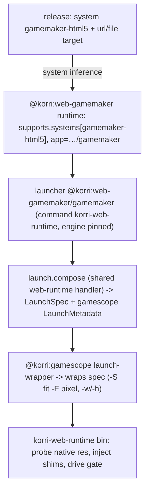

# feat: Web game runtime plugins (shared Chromium launcher + engine plugins)

## Summary

Converge two web games — Stargrove Scramble (remote itch HTML/GameMaker) and Yoshi's Fabrication Station (packaged/patched Construct 3) — and "many others" onto **one shared Chromium runtime** plus a thin **per-engine normalization** layer. A shared `@korri:web-runtime` plugin owns all of Chromium-under-gamescope (x11/Xwayland fullscreen, pixel scaling, native-resolution detection, scrollbar/gap compensation, focus-gate clearing). A `@korri:web-gamemaker` engine plugin contributes a `gamemaker-html5` system whose support mapping infers the launcher, so a GameMaker game is authored as `system: gamemaker-html5` and nothing else (Option C). YFS stays its own packaged launcher/runtime combo that reuses the shared runtime under the hood but exposes only game-meaningful settings. No web/engine/gamescope ids leak into generic platform code or user config.

---

## Problem Frame

Web games currently have no first-class runtime. Stargrove was made to run only through hand-built on-device shell scripts (`--ozone-platform=x11` + gamescope `-S fit -F pixel` + native-resolution probing + an overflow/gap fix + a trusted-gesture focus-gate clear). YFS is a self-contained plugin that re-implements its own Chromium launcher and documents "wrap externally with gamescope" as out of scope. The hard-won runtime knowledge (engine-specific scaling, the GameMaker user-activation gate, the per-device scrollbar gap) is trapped in scripts and one bespoke plugin. Without a shared runtime, every new web game re-derives the same plumbing, and authoring leaks internals.

---

## Requirements

- R1. A single shared Chromium runtime encapsulates x11/Xwayland fullscreen, gamescope pixel scaling, native-resolution handling, scrollbar/gap compensation, and gate clearing, so no per-game scripts exist.
- R2. The author surface exposes **intent only**: a known-engine game declares `system: <engine>-html5` and nothing about how it runs; internals (engine pin, native res, gate, chromium flags, entry) never appear in user config.
- R3. GameMaker games run deterministically fullscreen with correct pixel scaling and no scrollbars/clipping, selected by **system inference** (Option C), not explicit launcher wiring.
- R4. The generic launcher auto-detects the engine for arbitrary/unpackaged web games and degrades to a safe `generic` profile when unknown.
- R5. YFS remains a packaged launcher/runtime **combo** that reuses the shared runtime and exposes only game-meaningful settings (audio, GBA sounds, quick-death, play-timer, volumes, level source); its engine/native-res/gate/entry stay internal.
- R6. Adding a new engine is one small plugin (system + runtime mapping + launcher + engine pin); adding a game on a known engine is one content release.
- R7. The design conforms to the new launcher/plugin contract — launchers as config records, system→launcher join via runtime support mappings, embedded runtime mode, `launch.compose` handler dispatch, gamescope as a `launch-wrapper` companion — and generic platform code names no web/engine ids.
- R8. gamescope wrapping is requested through the companion / launch-metadata seam (or owned by the runtime wrapper for the detect case), never hard-coded in platform code.

---

## Scope Boundaries

- Generic web platform code must not name `web`, `gamemaker`, `construct`, or `gamescope` ids — all engine/runtime knowledge lives in the contributing plugins.
- No third-party plugin loading, marketplace, or trust-model changes.
- No acquisition redesign: YFS keeps its existing hash-pinned itch packaging derivation; Stargrove stays a remote `url` target.
- No new input subsystem: the GameMaker trusted-gesture gate reuses the existing device input seam.
- Android is not a target; validation is Linux/Sobo only.
- Does not modify the launcher-standardization contract itself — that refactor is a prerequisite (see Dependencies / Prerequisites).

### Deferred to Follow-Up Work

- Standalone `@korri:web-construct` engine plugin for **unpackaged** Construct games (Construct support ships first only via the YFS combo).
- Additional engine plugins (Unity WebGL, Godot, Phaser) — added on demand when a real game needs them.
- Persistent native-resolution probe cache across reboots/updates (in-memory/per-release cache only in this plan).
- Portal UI for engine/launch diagnostics beyond dry-run/CLI surfacing.

---

## Context & Research

### Relevant Code and Patterns

- `product/plugins/retroarch/src/plugin.ts` — canonical new-contract launcher plugin: `contributes.config.launchers` (command/args/`settings.plugin`/policy), metadata-only `systems`, and `runtimes` with `app` + `supports.systems`. This is the model for system→launcher join.
- `product/plugins/gamescope/src/plugin.ts` and `product/plugins/gamescope/src/launch-companion/` — gamescope is a `module` of `kind: launch-wrapper` (`supports.systems: ["*"]`, capabilities `launch.compose`/`launch.wrapper`) plus a `launch.compose` handler (`composeGamescopeLaunchSpec`) that wraps a `LaunchSpec` using decoded `LaunchMetadata` policy. This is the companion seam for the gamescope wrap.
- `product/platform/plugin/index.ts` — `plugin()` factory; `PluginConfigContributions` (`systems`, `launchers`, `runtimes`, `modules`, `catalog`) and `PluginHandler` operations (`launch.compose`, `runtime.resolve`, `package.expose`, `session.cleanup`, `diagnostics.collect`). Behavior is a handler, not a descriptor `materialize` field.
- `product/plugins/yoshis-fabrication-station/` — existing combo: `yfs` bash launcher (already uses `--ozone-platform=x11 --app --no-sandbox`, documents gamescope `-w 832 -h 448 -S fit -F pixel`), `scripts/direct-launch{,-pre}.js` (in-page automation + `preserveDrawingBuffer`), `package.nix` (hash-pinned itch download + c3main patching). Migration target, not rewrite.
- `product/plugins/stargrove-scramble/index.ts` — existing Stargrove content plugin; migration target for `system: gamemaker-html5`.
- `product/plugins/index.ts` — first-party plugin registration point for the new plugins.
- `docs/deployment/korri-launch-config.md` (worktree) — authoring contract for launchers/runtimes/systems/`settings.plugin`/`launch.use`.

### Institutional Learnings

- `docs/solutions/architecture-patterns/gamescope-as-plugin-owned-composition-2026-06-17.md` — generic platform code must not name specific plugin ids; plugin-specific composition belongs to enabled plugins. Directly shapes R7/R8.
- `docs/solutions/architecture-patterns/korri-plugin-architecture-2026-06-02.md` — plugins contribute data/actions behind host-owned seams, not UI/ownership.
- `docs/solutions/design-patterns/explicit-cascade-folded-policy-over-incidental-signal-heuristics-2026-05-27.md` — prefer explicit named policy over argv/env heuristics; favors declared engine/native-res over implicit guessing for shipped games.

### External References

None gathered — local patterns (RetroArch launcher, gamescope companion, YFS combo) are strong and directly analogous; the runtime behavior was already proven on-device this session.

---

## Key Technical Decisions

- **Option C (system-inferred launcher) for engine plugins.** A GameMaker game declares `system: gamemaker-html5`; the `@korri:web-gamemaker` support mapping infers the launcher. Chosen over a config-only named preset (engine knowledge would live in YAML, not distributable) and over an explicit `launch.use` engine launcher (author writes more). (See Alternatives Considered.)
- **Engine binding is modeled as a runtime record**, matching how the contract joins systems to launchers (RetroArch cores are runtimes). A web engine plugin contributes a runtime (`kind: web-engine`, `app: <its launcher>`, `supports.systems: [<engine>-html5]`) with **embedded** runtime mode — the runtime represents the browser+engine binding, not a user-swappable artifact.
- **`korri-web-runtime` wrapper bin owns runtime-only behavior**: native-resolution probe, in-page shim injection (overflow-kill, fit/detect), and gate clearing. Config/contract stays declarative; anything that needs a live page (native res, engine detect, gate state) is wrapper-bin behavior, not config.
- **Fixed base Chromium flags, baked in once**: `--ozone-platform=x11 --app=<locator> --no-sandbox --ignore-gpu-blocklist --no-first-run --start-fullscreen --kiosk`. Deliberately **no `--disable-gpu-sandbox`** (its infobar caused the scrollbar cascade) and **no `--test-type`**. Proven on-device this session.
- **gamescope internal resolution = native (+ per-device gap for fixed-canvas engines)**, `-S fit -F pixel`. GameMaker is fixed-canvas → needs the gap; Construct is responsive → `internal = native`.
- **Gate strategy is engine policy**: GameMaker's `navigator.userActivation` gate needs a **trusted** gesture (real device input / CDP `Input.*`); Construct uses **synthetic** DOM events. Auto-detect's `generic` fallback escalates to trusted only if a user-activation gate is observed.
- **`detect` native-res is for the generic launcher only**; engine and combo plugins **declare** native res (GameMaker via backing-store probe policy is acceptable, YFS declares 832×448) so shipped games are deterministic.

---

## Open Questions

### Resolved During Planning

- Engine layer shape: **Option C** (system inference), confirmed with the user.
- YFS posture: its **own packaged combo launcher**, not generic content — confirmed with the user.
- Generic vs engine separation: the generic `@korri:web-runtime/chromium` launcher remains for arbitrary/unpackaged games; engine plugins are the normalized path for known engines.

### Deferred to Implementation

- **gamescope wrap ownership for the `detect` case.** When native res is unknown until the page boots, either (a) `korri-web-runtime` probes then spawns gamescope itself, or (b) the gamescope `launch-wrapper` companion wraps a declared res via launch metadata. Likely split: declared res → companion; detect → wrapper-owned probe-then-spawn. Depends on probe latency and whether gamescope can be (re)configured post-probe — execution-time discovery.
- **Where the per-device gamescope `gap` constant lives** (device profile field vs probed-once-and-cached). Measured 20px on Sobo this session.
- **Exact handler operation** the resolver dispatches for web compose (`launch.compose` vs `runtime.resolve`) — follow the launcher-standardization resolver once landed.
- **Generic `web` vs engine `gamemaker-html5` coexistence** — whether a game matchable by both needs an ambiguity rule, or whether engine systems are simply distinct ids (leaning distinct ids; engine system wins by being the declared one).
- **Native-res probe mechanism** — headless/offscreen pre-boot vs first-launch-then-restart. Depends on observed boot/probe latency.

---

## Output Structure

    product/plugins/web-runtime/
      index.ts                         # @korri:web-runtime plugin descriptor
      src/
        core/
          chromium-args.ts             # fixed base flags + locator/flag composition
          native-res.ts                # canvas backing-store / drawingBuffer resolution + gap math
          engine-detect.ts             # engine signature table + in-page snippet
          gate.ts                      # gate strategies (trusted / synthetic / none)
          gamescope-request.ts         # native(+gap) -> gamescope launch metadata/policy
        launch-compose.ts              # launch.compose handler (shared)
        shims/{gamemaker,construct,generic}.js   # plugin-owned in-page bootstraps
        *.test.ts
      packages/korri-web-runtime/      # nix wrapper bin (chromium + CDP shim inject + probe + gate)
      README.md
    product/plugins/web-gamemaker/
      index.ts                         # @korri:web-gamemaker plugin (gamemaker-html5 system + runtime + launcher)
      plugin.test.ts

---

## High-Level Technical Design

> *This illustrates the intended approach and is directional guidance for review, not implementation specification. The implementing agent should treat it as context, not code to reproduce.*

Resolution + layering, for a GameMaker game authored as `system: gamemaker-html5`:

Author surface (intent only; internals never appear):

| Game | Authoring | Engine source | Native res | Gate |
|---|---|---|---|---|
| Stargrove (known engine) | `system: gamemaker-html5` + `target: url` | pinned by engine plugin | detect (backing store) + gap | trusted-click |
| Arbitrary itch game | `system: web` + `launch.use: @korri:web-runtime/chromium` | auto-detect | detect | auto (escalate to trusted) |
| YFS (combo) | `launch.use: @korri:yoshis-fabrication-station/yfs` + game settings | pinned internally (construct) | declared 832×448 | synthetic |

---

## Implementation Units

### U1. Shared web runtime: `korri-web-runtime` wrapper bin + core

**Goal:** The deep module — a wrapper binary and core library that encapsulate Chromium-under-gamescope: fixed flags, native-resolution probe, in-page shim injection, engine detect, and gate clearing. No config knowledge.

**Requirements:** R1, R4, R7, R8

**Dependencies:** Launcher-standardization contract (prerequisite); otherwise none.

**Files:**
- Create: `product/plugins/web-runtime/src/core/chromium-args.ts`
- Create: `product/plugins/web-runtime/src/core/native-res.ts`
- Create: `product/plugins/web-runtime/src/core/engine-detect.ts`
- Create: `product/plugins/web-runtime/src/core/gate.ts`
- Create: `product/plugins/web-runtime/src/shims/gamemaker.js`, `construct.js`, `generic.js`
- Create: `product/plugins/web-runtime/packages/korri-web-runtime/` (Nix wrapper bin)
- Test: `product/plugins/web-runtime/src/core/chromium-args.test.ts`, `native-res.test.ts`, `engine-detect.test.ts`, `gate.test.ts`

**Approach:**
- `chromium-args.ts` composes the fixed flag set with the resolved locator; engine/profile flags appended; supports an `overrides` channel.
- `native-res.ts` resolves native render resolution from `canvas.width/height` (cross-checked with `gl.drawingBufferWidth/Height`) and computes gamescope internal res = native (+ gap for fixed-canvas). `detect` runs a probe; declared values skip it.
- `engine-detect.ts` holds the ranked signature table (globals/title/canvasId/scriptSrc) and the in-page snippet; returns first high-confidence match else best medium else `generic`.
- `gate.ts` exposes strategies: `none`, `synthetic` (DOM events), `trusted-click` (delegates to the real input seam / CDP `Input.*`).
- The Nix package builds `korri-web-runtime`: launch Chromium, inject shims + engine-detect via CDP `addScriptToEvaluateOnNewDocument`, probe native res, drive the gate, exit when Chromium exits.

**Patterns to follow:**
- Pure helpers + typed inputs like `product/plugins/turnip/src/launch-companion/policy.ts` and RetroArch launch-spec composition.
- Nix wrapper package shape under `product/plugins/gamescope/packages/`.

**Test scenarios:**
- Happy path: `chromium-args` emits the fixed base flag set with the locator substituted and appends override args in order.
- Edge case: `native-res` returns native = backing store independent of viewport; fixed-canvas internal = native + gap; responsive internal = native.
- Edge case: `engine-detect` classifies GameMaker by `document.title` "Created with GameMaker", Construct by `C3`/`c3main`, and returns `generic` for unknown globals.
- Error path: `native-res` with no canvas / zero-sized canvas yields a typed "no canvas yet" result, not a crash.
- Error path: `chromium-args` never includes `--disable-gpu-sandbox` or `--test-type`.
- Integration: `gate` `trusted-click` invokes the real-input seam (configurable test double records the gesture); `synthetic` emits DOM events only.

**Verification:** Core helpers are unit-covered; the wrapper package builds and exposes `korri-web-runtime`.

---

### U2. gamescope companion handshake (native+gap → internal res)

**Goal:** Define how the web runtime requests the gamescope wrap (`-S fit -F pixel`, internal res from native+gap) through the launch-metadata/companion seam, and resolve the declared-vs-detect ownership split.

**Requirements:** R7, R8

**Dependencies:** U1

**Files:**
- Create: `product/plugins/web-runtime/src/core/gamescope-request.ts`
- Test: `product/plugins/web-runtime/src/core/gamescope-request.test.ts`
- Reference: `product/plugins/gamescope/src/launch-companion/policy.ts`, `wrapper.ts`

**Approach:**
- Map a resolved web run (internal res, output res, filter `pixel`, fullscreen) into the gamescope `LaunchMetadata`/policy shape the existing `composeGamescopeLaunchSpec` consumes.
- For **declared** native res, emit metadata and let the gamescope `launch-wrapper` companion wrap the spec (decoupled, reuses gamescope).
- For **detect**, document the wrapper-owned probe-then-spawn path as the fallback (resolved in implementation per the Open Question).

**Patterns to follow:**
- `composeGamescopeLaunchSpec` input shape and `decodeGamescopePolicy` in `product/plugins/gamescope/src/launch-companion/`.

**Test scenarios:**
- Happy path: declared 832×448 → gamescope metadata with internal 832×448, output 1920×1080, filter pixel, fullscreen.
- Happy path: fixed-canvas native 1008×720 + gap 20 → internal 1028×740.
- Edge case: responsive engine → internal == native (no gap).
- Error path: missing output resolution falls back to the device default and is reported, not silently zero.

**Verification:** A gamescope policy object produced from a web run round-trips through the gamescope plugin's decoder.

---

### U3. `@korri:web-runtime` generic launcher plugin

**Goal:** The shared plugin: contributes the `web` system, the `chromium` launcher record, a generic web runtime mapping (`web` → chromium), and the `launch.compose` handler that produces the LaunchSpec + gamescope metadata. Embedded runtime mode; auto-detect engine.

**Requirements:** R1, R2, R4, R7

**Dependencies:** U1, U2

**Files:**
- Create: `product/plugins/web-runtime/index.ts`
- Create: `product/plugins/web-runtime/src/launch-compose.ts`
- Create: `product/plugins/web-runtime/README.md`
- Modify: `product/plugins/index.ts` (register)
- Test: `product/plugins/web-runtime/plugin.test.ts`

**Approach:**
- `launchers.chromium` → id `@korri:web-runtime/chromium`, `command: korri-web-runtime`, `args: ["{target.locator}"]`, `settings.plugin` limited to an optional `profile` escape hatch, `policy.allowedCommands`.
- `systems.web` metadata; a `runtimes` entry mapping `web` → the chromium launcher (embedded) so `system: web` is inferable.
- `launch.compose` handler builds the run via U1/U2 with `engine: auto`, `nativeResolution: detect`.

**Patterns to follow:**
- `product/plugins/retroarch/src/plugin.ts` launcher/system/runtime contribution shape.

**Test scenarios:**
- Happy path: a release `system: web` + `launch.use: @korri:web-runtime/chromium` resolves to the chromium launcher with `engine: auto`.
- Edge case: `settings.plugin.profile: gamemaker` pins the engine (skips detect).
- Error path: `settings.plugin` rejects unknown keys (only `profile` allowed).
- Integration: the descriptor exposes no engine/gamescope ids in platform-facing code (grep gate).

**Verification:** Plugin registers; a `system: web` release composes a chromium LaunchSpec with gamescope metadata.

---

### U4. Engine profiles + in-page shims (gamemaker / construct / generic)

**Goal:** Encode per-engine policy (fixed-canvas, gate strategy, native-res source, overflow-kill) and ship the matching in-page shims, so engine behavior is data + one module, not per-game code.

**Requirements:** R3, R4, R5

**Dependencies:** U1

**Files:**
- Create: `product/plugins/web-runtime/src/core/engine-profiles.ts`
- Modify: `product/plugins/web-runtime/src/shims/gamemaker.js`, `construct.js`, `generic.js`
- Test: `product/plugins/web-runtime/src/core/engine-profiles.test.ts`

**Approach:**
- `engine-profiles.ts`: `gamemaker` (fixedCanvas, gate trusted-click, killOverflow, native from backing store), `construct` (responsive, gate synthetic, no gap), `generic` (best-effort, gate none→escalate).
- Shims: shared overflow-kill + black-bg + `__korriNativeRes()` reporter + gate-state reporter; engine module hooks for any engine-specific touch-ups.

**Patterns to follow:**
- YFS `scripts/direct-launch.js` for synthetic-event automation and `preserveDrawingBuffer` patching (Construct profile reference).

**Test scenarios:**
- Happy path: `gamemaker` profile selects fixedCanvas + trusted-click; `construct` selects responsive + synthetic.
- Edge case: overflow-kill shim sets `html,body{overflow:hidden;margin:0}` so `scrollWidth == clientWidth`.
- Error path: unknown engine id falls back to `generic`.

**Verification:** Profile selection and shim CSS behavior are unit-covered.

---

### U5. `@korri:web-gamemaker` engine plugin (Option C inference)

**Goal:** The middle layer — a per-engine plugin that contributes the `gamemaker-html5` system and a runtime support mapping so the launcher is **inferred** from the system, pinning engine=gamemaker and delegating compose to the shared runtime.

**Requirements:** R2, R3, R6, R7

**Dependencies:** U3, U4

**Files:**
- Create: `product/plugins/web-gamemaker/index.ts`
- Modify: `product/plugins/index.ts` (register)
- Test: `product/plugins/web-gamemaker/plugin.test.ts`

**Approach:**
- Contribute `systems["gamemaker-html5"]` (metadata), a `launchers.gamemaker` record (command `korri-web-runtime`, engine pinned via `settings.plugin`), and a `runtimes` entry (`kind: web-engine`, `app: @korri:web-gamemaker/gamemaker`, `supports.systems: ["gamemaker-html5"]`, embedded) that makes the system inferable.
- Compose delegates to the shared `@korri:web-runtime` handler with `engine: gamemaker`.

**Patterns to follow:**
- `product/plugins/retroarch/src/plugin.ts` system + runtime + launcher triad.

**Test scenarios:**
- Happy path: a release declaring only `system: gamemaker-html5` infers `@korri:web-gamemaker/gamemaker` with exactly one candidate.
- Edge case: no `launch.use`, no `settings.plugin` needed — inference succeeds from the system alone.
- Error path: a second support mapping for `gamemaker-html5` surfaces an ambiguity diagnostic (negative test).
- Integration: composed LaunchSpec carries `engine: gamemaker` + gamescope metadata with the gap applied.

**Verification:** `system: gamemaker-html5` alone yields a deterministic GameMaker launch via the shared runtime.

---

### U6. Migrate Stargrove Scramble content to `system: gamemaker-html5`

**Goal:** Reduce Stargrove to thin content: a `url` target + `system: gamemaker-html5`, with no how-to-run details.

**Requirements:** R2, R3, R6

**Dependencies:** U5

**Files:**
- Modify: `product/plugins/stargrove-scramble/index.ts`
- Test: `product/plugins/stargrove-scramble/*.test.ts` (or add focused coverage)

**Approach:**
- Replace any ad-hoc/runtime details with a catalog/library release: `target: { kind: url, url: <itch direct embed> }`, `system: gamemaker-html5`, no `launch.use`.

**Patterns to follow:**
- The content/catalog contribution in `product/plugins/yoshis-fabrication-station/index.ts` (pre-migration) and other first-party content plugins.

**Test scenarios:**
- Happy path: Stargrove release decodes and infers the GameMaker launcher.
- Edge case: the release declares no internals (no engine/native-res/gate/flags).
- `Covers R2.` Authoring carries intent only.

**Verification:** Stargrove resolves to a GameMaker web launch with no per-game internals in config.

---

### U7. Migrate YFS to a combo launcher on the shared runtime

**Goal:** Re-cast YFS as its own launcher/runtime combo on the new contract: it contributes its own launcher (+ construct binding runtime + system support), reuses `korri-web-runtime` and the construct shim under the hood, and exposes only game settings — while keeping its packaging derivation.

**Requirements:** R5, R6, R7

**Dependencies:** U3, U4

**Files:**
- Modify: `product/plugins/yoshis-fabrication-station/index.ts`
- Modify: `product/plugins/yoshis-fabrication-station/yfs` (delegate compositor/runtime concerns to the shared runtime; keep level-input + game-settings flags)
- Modify: `product/plugins/yoshis-fabrication-station/package.nix` (keep itch packaging + c3main patch; wire to `korri-web-runtime`)
- Test: `product/plugins/yoshis-fabrication-station/plugin.test.ts`

**Approach:**
- Contribute `launchers.yfs` (command `korri-web-runtime`, engine `construct` pinned internally, native res 832×448 declared, `--allow-file-access-from-files`, the YFS direct-launch shim) and a runtime binding so a YFS release infers it.
- `settings.plugin` exposes only: `audio`, `gbaSounds`, `quickDeath`, `playTimer`, `bgmVolume`, `sfxVolume`, and `level` source. Internals (engine, native, gate, entry, c3main hooks) stay in the plugin/materializer.
- Decide `level` as `settings.plugin.level` vs release target in implementation (see Deferred to Follow-Up / Open Questions); default to `settings.plugin.level` to preserve the existing CLI surface.

**Patterns to follow:**
- Existing `product/plugins/yoshis-fabrication-station/{yfs,scripts,package.nix}` — migrate, do not rewrite.

**Test scenarios:**
- Happy path: a YFS release exposes only the seven game settings; `audio/quickDeath/...` map to query params.
- Edge case: `level: { sample }` / `{ lss }` / `{ codeUrl }` each resolve to the right launch param.
- Error path: `settings.plugin` rejects engine/native-res/gate keys (internals are not user-facing).
- Integration: composed YFS launch uses `korri-web-runtime` with engine construct + declared 832×448 + gamescope metadata (internal == native, no gap).
- `Covers R5.` Combo exposes only game settings; internals owned by the plugin.

**Verification:** YFS runs via the shared runtime with the same game-settings surface as today and no leaked internals.

---

## System-Wide Impact

- **Interaction graph:** new launchers flow through the launcher-standardization resolver → `launch.compose` dispatch → gamescope `launch-wrapper` companion → `korri-web-runtime` bin → Chromium/gamescope. Touches `product/plugins/index.ts` registration.
- **Error propagation:** inference failures (no support mapping / ambiguous candidates), probe failures (no canvas), and gate failures should surface as typed diagnostics through the resolver/dry-run, not crashes.
- **State lifecycle risks:** the native-res probe may double-boot Chromium; ensure probe processes are cleaned up and don't leak into the session (reuse sessiond cleanup seam).
- **API surface parity:** the gamescope companion seam is shared with FEX/Proton/native launches — the web metadata must conform to the same `LaunchMetadata` shape.
- **Unchanged invariants:** RetroArch/Steam/process launchers and the gamescope companion contract are not modified; web-runtime is additive.

---

## Risks & Dependencies

| Risk | Mitigation |
|------|------------|
| Depends on the in-flight launcher-standardization contract (launchers collection, system→launcher inference, embedded runtime mode, `launch.compose` dispatch). | Sequence after that refactor merges, or develop on `refactor/plugin-launcher-config-standardization`. Treat as a hard prerequisite (below). |
| Native-resolution probe adds launch latency / double-boot. | Declared res for engine/combo plugins skips the probe; cache detect results per release; only the generic launcher probes. |
| gamescope can't reconfigure `-w/-h` after start, but detect res is post-boot. | Split: declared res → gamescope companion; detect → wrapper-owned probe-then-spawn (resolved in implementation). |
| Cross-origin iframe breaks engine detect / native probe. | Require the direct embed URL (not the itch product page); documented and already the Stargrove pattern. |
| GameMaker trusted-gesture gate needs device input access inside the session. | Reuse the existing sessiond/device input seam; do not build new input. |
| Generic `web` system vs engine `gamemaker-html5` ambiguity. | Keep engine systems as distinct ids; add an ambiguity diagnostic test (U5). |

---

## Alternative Approaches Considered

- **Option A — named launcher preset in YAML** (a `launchers.gamemaker-web` instance of `@korri:web-runtime`): rejected — engine knowledge lives in config, not a distributable plugin, and can't ship a system or normalized settings.
- **Option B — engine launcher plugin with explicit `launch.use`**: viable and nearly identical to C in code, but authors must write `launch.use`; C is thinner (declare the system, done).
- **One mega web plugin that auto-detects everything, including shipped games**: rejected — nondeterministic for games we ship; engine plugins give deterministic, named behavior, and auto-detect is reserved for the generic/arbitrary path.

---

## Dependencies / Prerequisites

- **Launcher/plugin standardization contract** (`refactor/plugin-launcher-config-standardization`, `work/items/active/01KVGDKT01DNT9NRDKS846CJQ1-plugin-launcher-standardization/`): named `launchers`, locator-only `target`, metadata-only `systems`, runtime support mappings, embedded runtime mode, `launch.compose`/`runtime.resolve` handler dispatch, and `provider-ref` targets. This plan authors plugins against that contract and must land after (or on) it.
- gamescope `launch-wrapper` companion (`@korri:gamescope`) for the wrap seam.

---

## Phased Delivery

### Phase 1 — Shared runtime (U1, U2)
The `korri-web-runtime` bin + core + gamescope handshake. Nothing user-facing yet; fully unit-testable.

### Phase 2 — Generic launcher + engine policy (U3, U4)
`@korri:web-runtime` plugin (arbitrary games work via `system: web` + auto-detect) and the engine-profile/shim layer.

### Phase 3 — Engine plugin + content migration (U5, U6, U7)
`@korri:web-gamemaker` (Option C), Stargrove migrated to `system: gamemaker-html5`, YFS recast as a combo on the shared runtime. Final proof: Sobo deploy + on-screen validation of Stargrove (GameMaker, inferred) and YFS (combo).

---

## Sources & References

- Launcher-standardization plan: `work/items/active/01KVGDKT01DNT9NRDKS846CJQ1-plugin-launcher-standardization/plan.md`
- Authoring contract: `docs/deployment/korri-launch-config.md`
- Pattern code: `product/plugins/retroarch/src/plugin.ts`, `product/plugins/gamescope/src/plugin.ts`, `product/plugins/gamescope/src/launch-companion/`, `product/plugins/yoshis-fabrication-station/`
- Plugin factory: `product/platform/plugin/index.ts`
- Institutional: `docs/solutions/architecture-patterns/gamescope-as-plugin-owned-composition-2026-06-17.md`
- Scratch design sketches from this session: `/tmp/web-runtime-sketch/` (not committed)
